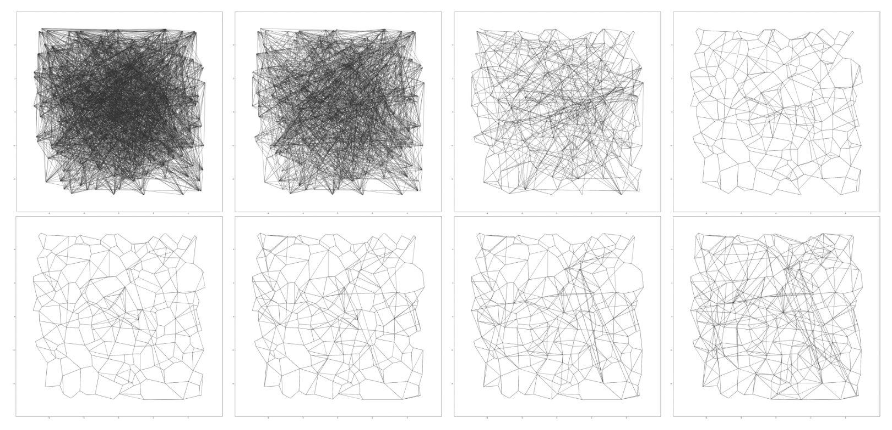
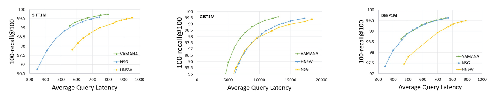
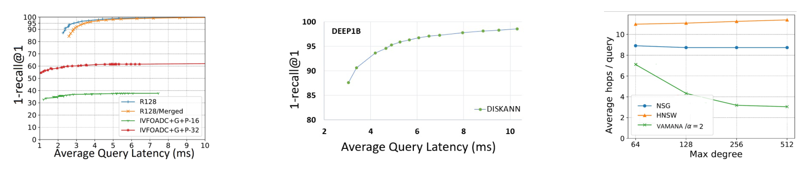

# DiskANN: Fast Accurate Billion-point Nearest Neighbor Search on a Single Node（中文译文）

## 译者说明

本文依据同目录的 `source.pdf` 翻译。章节、图表、公式、算法、代码与参考文献按原文结构保留。

Suhas Jayaram Subramanya[^author]、Devvrit[^author]、Rohan Kadekodi[^author]、Ravishankar Krishaswamy、Harsha Vardhan Simhadri

Carnegie Mellon University；University of Texas at Austin；Microsoft Research India

## 摘要

当前最先进的近似最近邻搜索（approximate nearest neighbor search，ANNS）算法会生成必须存放在主内存中的索引，才能实现快速、高召回率的搜索。这不仅成本高昂，也限制了数据集规模。我们提出一种名为 DiskANN 的新型图索引与搜索系统：它可以在只有 64GB RAM 和一块廉价固态硬盘（SSD）的单台工作站上，对十亿点数据库建立索引、存储并执行搜索。

与当前认知相反，我们证明 DiskANN 构建的 SSD 索引能够同时满足大规模 ANNS 的三个目标：高召回率、低查询延迟和高密度（单节点索引的点数）。在含十亿点的 SIFT1B bigann 数据集上，DiskANN 在一台 16 核机器上每秒可服务超过 5000 个查询，平均延迟低于 3ms，且 1-recall@1 超过 95%；而内存占用相近的十亿点 ANNS 先进算法，如 FAISS [18] 和 IVFOADC+G+P [8]，在 1-recall@1 约 50% 时即达到平台期。另一方面，在高召回率区间，与 HNSW [21]、NSG [13] 等先进图方法相比，DiskANN 可在每个节点上索引并服务多 5-10 倍的点。最后，作为完整 DiskANN 系统的一部分，我们还提出 Vamana：一种新的图式 ANNS 索引，即使只考虑内存索引，它也比既有图索引更加通用。

## 1 引言

在最近邻搜索问题中，给定某个空间中的点集 $P$。目标是设计一个体积较小的数据结构，使得对于同一度量空间内的任意查询 $q$ 和目标值 $k$，都能从数据集 $P$ 中快速取回 $q$ 的 $k$ 个最近邻。这是算法研究中的基础问题，也常被用作计算机视觉、文档检索和推荐系统等众多领域的子过程。在这些应用中，图像、文档、用户画像等实际实体被嵌入到数百维或数千维空间中，使所需的实体相似性概念编码为嵌入之间的距离。

遗憾的是，由于所谓的维数灾难 [10]，如果不实质上对数据进行线性扫描，往往无法取回精确最近邻（例如参见 [15, 23]）。因此，实践中转而寻找近似最近邻（approximate nearest neighbors，ANN），目标是取回 $k$ 个接近最优的邻居。更正式地说，考虑查询 $q$，设算法输出含 $k$ 个候选近邻的集合 $X$，并设 $G$ 是基础数据集中距 $q$ 最近的 $k$ 个点构成的真值集合。那么，将 $X$ 的 k-recall@k 定义为

$$
\frac{|X \cap G|}{k}.
$$

ANN 算法的目标是在尽可能快地取回结果的同时最大化召回率，由此形成召回率与延迟之间的权衡。

该问题存在大量算法，其索引构建方法各异，在索引时间、召回率和查询时间上也有不同取舍。例如，k-d tree 在低维空间中能生成紧凑且搜索快速的索引，但维度 $d$ 超过约 20 后通常非常慢。另一方面，基于局部敏感哈希（Locality Sensitive Hashing，LSH）的方法 [2, 4] 对最坏情形下索引大小与搜索时间之间的权衡给出近最优保证，但无法利用点的分布，因此在真实数据集上不及较新的图方法。近期依赖数据的 LSH 方案（例如 [3]）尚未得到大规模验证。截至本文写作时，在真实数据集的搜索时间与召回率权衡上，表现最好的往往是 HNSW [21] 和 NSG [13] 等图算法：索引算法在基础点上构建可导航图；搜索则从一个选定或随机点出发进行 best-first 遍历，沿图边逐步靠近查询，直至收敛到局部极小值。Li 等人近期的工作 [20] 对 ANN 算法作了很好的综述与比较。

许多应用要求在欧氏度量下对数十亿个点进行快速、准确的搜索。如今，为大型数据集建立索引主要有两类高层方法。

第一类方法基于倒排索引与数据压缩，包括 FAISS [18] 和 IVFOADC+G+P [8]。这类方法把数据集聚成 $M$ 个分区，只将查询与最接近它的少量分区中的点比较，设分区数量为 $m \ll M$。此外，由于全精度向量无法装入主内存，数据点会使用 Product Quantization [17] 等量化方案压缩。这类方案内存占用很小：十亿个 128 维点的索引不到 64GB；借助 GPU 或其他硬件加速器，结果取回时间可低于 5ms。然而，由于数据压缩有损，其 1-recall@1 很低，约为 0.5。它们会针对更弱的 1-recall@100 指标报告较高召回率，即真实最近邻出现在 100 个候选输出列表中的概率；但许多应用可能无法接受这一指标。

第二类方法把数据集划分成互不相交的分片，并为每个分片构建内存索引。不过，这类索引既保存索引本身，也保存未压缩数据点，所以比第一类方法占用更多内存。例如，含一亿个 128 维浮点向量的 NSG 索引内存占用约为 75GB[^2]。因此，为十亿点索引提供服务需要多台机器承载索引。据报道 [13]，阿里巴巴电商平台淘宝采用了类似方案：把含 20 亿个 128 维点的数据集划分为 32 个分片，每个分片的索引由不同机器承载；查询会路由到全部分片，再聚合各分片结果。该方法报告的 100-recall@100 为 0.98，延迟约 5ms。请注意，若扩展到含数千亿点的 Web 规模数据，则需要数千台机器。

这两类算法的可扩展性都受到同一事实限制：它们构建的索引旨在从主内存提供服务。把这些索引移到磁盘，即使是 SSD，也会造成搜索延迟灾难性上升，并相应降低吞吐量。FAISS 的博客文章 [11] 反映了“搜索需要主内存”这一当前认知：“Faiss 只支持从 RAM 搜索，因为磁盘数据库要慢几个数量级。是的，即使使用 SSD 也是如此。”

事实上，常驻 SSD 索引的搜索吞吐量受限于每次查询的随机磁盘访问次数，延迟则受限于磁盘往返轮次；每轮可包含多次读取。一块廉价的零售级 SSD 完成一次随机读取需要数百微秒，每秒大约可处理 30 万次随机读取。另一方面，Web 搜索等采用多阶段流水线的搜索应用，要求最近邻搜索的平均延迟只有数毫秒。因此，设计高性能 SSD 常驻索引的主要挑战是：（a）把随机 SSD 访问次数降到几十次；（b）把磁盘往返请求降到十轮以内，最好不超过五轮。若只是把传统内存 ANNS 算法生成的索引直接映射到 SSD，每个查询会产生数百次磁盘读取，延迟将无法接受。

### 1.1 技术贡献

我们提出 DiskANN：一种常驻 SSD 的 ANNS 系统，建立在新的图索引算法 Vamana 之上。它推翻了当前认知，证明即使商品级 SSD 也能有效支持大规模 ANNS。本文工作的若干要点如下：

- DiskANN 可在配有 64GB RAM 的工作站上，对数百维的十亿点数据集建立索引并提供服务，召回率超过 95%（1-recall@1），延迟低于 5ms。
- 新算法 Vamana 能生成直径小于 NSG 和 HNSW 的图索引，使 DiskANN 可以减少顺序磁盘读取轮次。
- Vamana 生成的图也可在内存中使用，其搜索性能可达到或超过 HNSW、NSG 等先进内存算法。
- 可以方便地把大型数据集多个重叠分区上的较小 Vamana 索引合并成一个索引；其搜索性能几乎与直接在整个数据集上一次构建的索引相同。由此可以为原本大到无法装入内存的数据集建立索引。
- Vamana 可以结合 Product Quantization 等现成向量压缩方案来构建 DiskANN 系统。图索引和数据集的全精度向量存储在磁盘上，压缩向量则缓存在内存中。

### 1.2 记号

后文中，我们用 $P$ 表示数据集，其中 $|P|=n$。所考虑的有向图以 $P$ 中各点为顶点，并在顶点之间连边。略微重载记号后，将这类图记为 $G=(P,E)$，也用 $P$ 表示顶点集。给定有向图中的点 $p \in P$，用 $N_{\mathrm{out}}(p)$ 表示 $p$ 的出边集合。最后，用 $x_p$ 表示点 $p$ 对应的向量数据，用

$$
d(p,q)=\lVert x_p-x_q\rVert
$$

表示点 $p$ 与 $q$ 之间的度量距离。我们的全部实验都使用欧氏度量。

### 1.3 论文结构

第 2 节介绍新的图索引构建算法 Vamana，第 3 节说明 DiskANN 的整体系统设计。第 4 节把 Vamana 与 HNSW、NSG 的内存索引进行实证比较，并展示 DiskANN 在商品级机器上对十亿点数据集的搜索特性。

[^author]: 前三位本文作者在 Microsoft Research India 工作期间完成了本文工作。

[^2]: NSG 索引的平均度数随数据集内在结构而变化；此处假设平均度为 50，这对内在结构较少的数据集是合理的。

## 2 Vamana 图构建算法

在给出 Vamana 的细节之前，先简要概述图式 ANNS 算法。Vamana 的完整规约见算法 3。

### 2.1 相对邻域图与 GreedySearch 算法

多数图式 ANNS 算法按如下方式工作：索引构建期间，根据数据集 $P$ 的几何性质构建图 $G=(P,E)$。搜索时，对于查询向量 $x_q$，在 $G$ 上采用算法 1 这类自然的贪心或 best-first 遍历。从某个指定点 $s \in P$ 出发，沿图遍历并逐步靠近 $x_q$。

研究者已经广泛探讨如何构造稀疏图，使 $\operatorname{GreedySearch}(s,x_q,k,L)$ 对任意查询都能快速收敛到近似最近邻。至少当查询接近数据点时，保证该性质的一个充分条件是所谓的稀疏邻域图（sparse neighborhood graph，SNG），它由 [5] 提出[^3]。

在 SNG 中，每个点 $p$ 的出邻居按如下方式确定：初始化集合 $S=P\setminus\{p\}$。只要 $S\neq\varnothing$，就从 $p$ 向 $p^*$ 添加一条有向边，其中 $p^*$ 是 $S$ 中距 $p$ 最近的点；然后从 $S$ 中删除所有满足 $d(p,p')>d(p^*,p')$ 的点 $p'$。很容易看出，从任意 $s\in P$ 出发运行 $\operatorname{GreedySearch}(s,x_p,1,1)$，对每个基础点 $p\in P$ 都会收敛到 $p$。

原则上这种构造非常理想，但即使对中等规模数据集也不可行，因为运行时间为 $\widetilde{O}(n^2)$。基于这一思路，一系列工作设计了更实用、能够良好近似 SNG 的算法 [21, 13]。然而，它们本质上都在逼近 SNG 性质，因此很难灵活控制输出图的直径与密度。

**算法 1：** $\operatorname{GreedySearch}(s,x_q,k,L)$。

```text
输入：带起点 s 的图 G、查询 x_q、结果大小 k、搜索列表大小 L >= k
输出：包含 k 个近似最近邻的结果集 ℒ，以及包含全部已访问节点的集合 𝒱

begin
  初始化集合 ℒ <- {s}，𝒱 <- ∅
  while ℒ \ 𝒱 != ∅ do
    令 p* <- arg min_{p in ℒ \ 𝒱} ||x_p - x_q||
    更新 ℒ <- ℒ ∪ N_out(p*)，𝒱 <- 𝒱 ∪ {p*}
    if |ℒ| > L then
      更新 ℒ，仅保留距 x_q 最近的 L 个点
  return [ℒ 中距 x_q 最近的 k 个点；𝒱]
```

**算法 2：** $\operatorname{RobustPrune}(p,\mathcal{V},\alpha,R)$。

```text
输入：图 G、点 p ∈ P、候选集 𝒱、距离阈值 α >= 1、度数上界 R
输出：修改 G，为 p 设置至多 R 个新的出邻居

begin
  𝒱 <- (𝒱 ∪ N_out(p)) \ {p}
  N_out(p) <- ∅
  while 𝒱 != ∅ do
    p* <- arg min_{p' in 𝒱} d(p, p')
    N_out(p) <- N_out(p) ∪ {p*}
    if |N_out(p)| = R then
      break
    for p' ∈ 𝒱 do
      if α * d(p*, p') <= d(p, p') then
        从 𝒱 中删除 p'
```

### 2.2 稳健剪枝过程

如前所述，满足 SNG 性质的图都很适合 GreedySearch 搜索过程；但这类图的直径可能很大。例如，如果点在一维实数轴上呈线性排列，那么满足 SNG 性质的是直径为 $O(n)$ 的线图：每个点连接到左右两个邻居，端点只连接一个。若把这类图存储在磁盘上，算法 1 沿搜索路径访问顶点时，为取得其邻居需要进行许多轮顺序磁盘读取。

为解决该问题，我们希望沿搜索路径经过每个节点时，到查询的距离都按乘法因子 $\alpha>1$ 缩小，而不是像 SNG 性质那样仅要求距离下降。考虑一种有向图，其中每个点 $p$ 的出邻居由算法 2 的 $\operatorname{RobustPrune}(p,\mathcal{V},\alpha,R)$ 过程确定。注意，如果每个 $p\in P$ 的出邻居都由 $\operatorname{RobustPrune}(p,P\setminus\{p\},\alpha,n-1)$ 决定，那么只要 $\alpha>1$，从任意 $s$ 开始的 $\operatorname{GreedySearch}(s,p,1,1)$ 都会在对数步数内收敛到 $p\in P$。然而，这会使索引构建运行时间达到 $\widetilde{O}(n^2)$。因此，Vamana 继承 [21, 13] 的思路，用一个经过谨慎选择且远少于 $n-1$ 个节点的 $\mathcal{V}$ 调用 $\operatorname{RobustPrune}(p,\mathcal{V},\alpha,R)$，以改善索引构建时间。

### 2.3 Vamana 索引算法

Vamana 以迭代方式构造有向图 $G$。初始化时，每个顶点随机选择 $R$ 个出邻居。注意，当 $R>\log n$ 时图的连通性很好，但随机连接不能保证 GreedySearch 收敛到优质结果。接下来，令 $s$ 表示数据集 $P$ 的 medoid，它将作为搜索算法的起点。

随后，算法按随机顺序遍历 $P$ 中全部点。处理每个 $p\in P$ 时，都会更新图，使 $\operatorname{GreedySearch}(s,x_p,1,L)$ 更容易收敛到 $p$。具体而言，在对应点 $p$ 的迭代中，Vamana 先在当前图 $G$ 上运行 $\operatorname{GreedySearch}(s,x_p,1,L)$，并把 $\mathcal{V}_p$ 设为该搜索访问过的全部点。然后执行 $\operatorname{RobustPrune}(p,\mathcal{V}_p,\alpha,R)$，确定 $p$ 的新出邻居。

接着，Vamana 对所有 $p'\in N_{\mathrm{out}}(p)$ 添加反向边 $(p',p)$，从而连接搜索路径上访问过的顶点与 $p$，使更新后的图更适合 $\operatorname{GreedySearch}(s,x_p,1,L)$ 收敛到 $p$。不过，添加 $(p',p)$ 形式的反向边可能使 $p'$ 违反度数约束。因此，只要任一顶点 $p'$ 的出度超过阈值 $R$，就对其现有出邻居集合 $N_{\mathrm{out}}(p')$ 运行 $\operatorname{RobustPrune}(p',N_{\mathrm{out}}(p'),\alpha,R)$ 来修改图。

随着算法推进，图会持续变得更适合 GreedySearch，搜索也会更快。完整算法对数据集执行两遍：第一遍使用 $\alpha=1$，第二遍使用用户定义的 $\alpha\ge 1$。观察表明，第二遍会生成更好的图；若两遍都使用用户定义的 $\alpha$，索引算法反而更慢，因为第一遍会计算出平均度更高、处理耗时更长的图。

**算法 3：Vamana 索引算法。**

```text
输入：包含 n 个点的数据库 P，其中第 i 个点的坐标为 x_i；参数 α、L、R
输出：P 上出度 <= R 的有向图 G

begin
  将 G 初始化为随机 R-正则有向图
  令 s 表示数据集 P 的 medoid
  令 σ 表示 1..n 的一个随机排列
  for 1 <= i <= n do
    令 [ℒ; 𝒱] <- GreedySearch(s, x_{σ(i)}, 1, L)
    运行 RobustPrune(σ(i), 𝒱, α, R)，更新 σ(i) 的出邻居
    for N_out(σ(i)) 中的所有点 j do
      if |N_out(j) ∪ {σ(i)}| > R then
        运行 RobustPrune(j, N_out(j) ∪ {σ(i)}, α, R)，更新 j 的出邻居
      else
        更新 N_out(j) <- N_out(j) ∪ {σ(i)}
```



**图 1：算法 3 所述 Vamana 索引算法在含 200 个二维点的数据库上生成图的演进。** 算法先执行 $\alpha=1$ 的第一遍，再在第二遍引入长程边。

### 2.4 Vamana 与 HNSW [21]、NSG [13] 的比较

从高层看，Vamana 与 HNSW、NSG 这两种流行 ANNS 算法相当相似。三者都遍历数据集 $P$，并使用 $\operatorname{GreedySearch}(s,x_p,1,L)$ 与 $\operatorname{RobustPrune}(p,\mathcal{V},\alpha,R)$ 的结果确定 $p$ 的邻居。不过，它们之间存在若干重要区别。

最关键的是，HNSW 与 NSG 都没有可调参数 $\alpha$，隐式使用 $\alpha=1$；这是 Vamana 能在图度数与直径之间取得更好权衡的主要原因。其次，HNSW 把剪枝过程的候选集 $\mathcal{V}$ 设为 $\operatorname{GreedySearch}(s,p,1,L)$ 最终输出的 $L$ 个候选结果，而 Vamana 与 NSG 则把 $\mathcal{V}$ 设为 GreedySearch 访问过的全部顶点。直观上，这有助于 Vamana 与 NSG 添加长程边；HNSW 只会向附近点添加局部边，因此还要在数据集的一系列嵌套样本上额外构建图层次结构。

下一项差异在初始图：NSG 的起始图是数据集上的近似 K 最近邻图，构建时消耗大量时间和内存；HNSW 与 Vamana 的初始化更简单，前者从空图开始，后者从随机图开始。观察表明，从随机图开始会比从空图开始生成质量更好的图。最后，Vamana 对数据集执行两遍，HNSW 与 NSG 都只执行一遍；这样设计是因为观察表明，第二遍会改善图质量。

[^3]: SNG 概念本身受相对邻域图（Relative Neighborhood Graph，RNG）这一相关性质启发；RNG 最早在 20 世纪 60 年代定义 [16]。

## 3 DiskANN：构建常驻 SSD 的索引

下面分两部分介绍 DiskANN 的整体设计：第一部分说明索引构建算法，第二部分说明搜索算法。

### 3.1 DiskANN 索引设计

高层思路很简单：在数据集 $P$ 上运行 Vamana，并把所得图存入 SSD。搜索时，只要算法 1 需要点 $p$ 的出邻居，就从 SSD 取回这些信息。但仅仅存储十亿个 100 维点的向量数据就会远超工作站的 RAM 容量。这引出两个问题：如何在十亿个点上构图？如果连向量数据都无法存入内存，搜索时如何在算法 1 中计算查询点与候选列表中各点的距离？

解决第一个问题的一种方式是，用 k-means 等聚类技术把数据划分成多个较小分片，为每个分片单独构建索引，并在搜索时只把查询路由到少数分片。不过，查询需要发往多个分片，这会增加搜索延迟并降低吞吐量。

回头来看，我们的思路很简单：与其搜索时把查询路由到多个分片，何不把每个基础点发送给多个邻近中心，从而得到重叠簇？具体而言，先用 k-means 把十亿点数据集划分为 $k$ 个簇，例如 $k=40$；再把每个基础点分配给距离最近的 $\ell$ 个中心，通常 $\ell=2$ 就足够。然后，为分配给各簇的点分别构建 Vamana 索引；每个簇此时约有 $N\ell/k$ 个点，可以在内存中建立索引。最后，对边集合做简单并集，把所有不同图合并成一张图。

实证结果表明，不同簇之间的重叠提供了足够连通性，即使查询的最近邻实际分散在多个分片中，GreedySearch 也能成功。先前已有工作 [9, 22] 通过合并多个较小的重叠索引为大型数据集建立索引；不过，它们构造重叠簇的方式不同，仍需更详细地比较这些技术。

解决第二个问题的下一项自然思路，是把每个数据库点 $p\in P$ 的压缩向量 $\widetilde{x}_p$ 存入主内存，同时把图存入 SSD。我们使用一种流行压缩方案 Product Quantization [17][^4]，把数据点和查询点编码成短码，例如每个数据点 32 字节；算法 1 在查询时可以据此高效获得近似距离 $d(\widetilde{x}_p,x_q)$。需要强调的是，Vamana 构建图索引时使用全精度坐标，所以能有效地把搜索引导到图的正确区域，尽管搜索阶段只使用压缩数据。

### 3.2 DiskANN 索引布局

我们把全部数据点的压缩向量存入内存，并把图和全精度向量存入 SSD。在磁盘上，对每个点 $i$，先存储其全精度向量 $x_i$，再存储其不超过 $R$ 个邻居的标识。如果节点度数小于 $R$，则用零填充。这样，计算磁盘上任一点 $i$ 所对应数据的偏移量只需简单计算，无需把偏移量存入内存。下一小节会解释为什么需要保存全精度坐标。

### 3.3 DiskANN 束搜索

搜索给定查询 $x_q$ 的邻居时，一种自然方式是运行算法 1，并按需从 SSD 取回邻域信息 $N_{\mathrm{out}}(p^*)$。可以用压缩向量计算距离，决定应从磁盘读取哪些最优顶点及其邻域。这种方法虽合理，却需要与 SSD 进行许多轮往返；每轮耗时数百微秒，会造成较高延迟。

为了减少从 SSD 顺序取得邻域的往返轮数，同时又不让距离计算量过度增加，我们一次取回 $\mathcal{L}\setminus\mathcal{V}$ 中少量最接近点的邻域，数量记为 $W$，例如 4 或 8；再用 $\mathcal{L}$ 原有候选与当前一步取回的全部邻居共同更新 $\mathcal{L}$，保留其中最优的 $L$ 个候选。从 SSD 取回少量随机扇区所需时间几乎与读取一个扇区相同。我们把这种修改后的搜索算法称为 BeamSearch。当 $W=1$ 时，它类似普通贪心搜索；若 $W$ 过大，例如达到 16 或更多，则会同时浪费计算资源和 SSD 带宽。

尽管 NAND flash SSD 每秒可处理 50 万次以上随机读取，但若要获得最高读取吞吐量，就必须让全部 I/O 请求队列保持饱和。可是，在峰值吞吐量下运行会积压队列，使磁盘读取延迟超过 1ms。因此，为获得低搜索延迟，必须让 SSD 在较低负载因子下工作。我们发现，较小的束宽，例如 $W=2,4,8$，可以在延迟与吞吐量之间取得良好平衡。此时 SSD 负载因子为 30%-40%，运行搜索算法的每个线程有 40%-50% 查询处理时间花在 I/O 上。

### 3.4 DiskANN 缓存频繁访问的顶点

为进一步减少每次查询的磁盘访问次数，我们在 DRAM 中缓存某个顶点子集所关联的数据。该子集可以根据已知查询分布选择，也可以简单地缓存距起点 $s$ 为 $C=3$ 或 4 跳的全部顶点。索引图中距起点 $C$ 跳的节点数随 $C$ 指数增长，因此更大的 $C$ 会带来过高内存占用。

### 3.5 DiskANN 使用全精度向量隐式重排序

Product Quantization 是有损压缩方法，所以根据 PQ 近似距离算出的最接近查询的 $k$ 个候选，与根据真实距离算出的候选之间存在差异。为弥合差距，我们使用磁盘上紧邻每个点邻域存储的全精度坐标。

搜索时取回某个点的邻域，也会取回该点的完整坐标，且无需额外磁盘读取。这是因为，把一个 4KB 对齐的磁盘地址读入内存，并不比读取 512B 更昂贵；而一个顶点的邻域（对度数为 128 的图，长度为 $4\times128$ 字节）和全精度坐标可以存放在同一个磁盘扇区中。因此，BeamSearch 加载搜索前沿的邻域时，也能缓存搜索过程中访问的全部节点的全精度坐标，不增加 SSD 读取。这样便可根据全精度向量返回最优 $k$ 个候选。

与我们的工作相互独立，[24] 也采用了取回 SSD 上的全精度坐标并重排序的思路；但其算法一次性取回所有待重排序向量，会同时产生数百次随机磁盘访问，对吞吐量和延迟造成不利影响。第 4.3 节会更详细地解释这一点。在 DiskANN 中，全精度坐标实质上搭载在展开邻域的成本之上。

[^4]: 尽管 [14, 19, 18] 等更复杂的压缩方法可以提供质量更高的近似，但我们发现简单 Product Quantization 已足以满足需求。

## 4 评估

下面把 Vamana 与其他近似最近邻搜索算法比较。对于内存搜索，我们与 NSG [13] 和 HNSW [21] 比较；在多数公开基准上，它们能提供一流的延迟与召回率权衡。对于十亿点大型数据集，则把 DiskANN 与 FAISS [18]、IVF-OADC+G+P [8] 等压缩方法比较。

全部实验使用以下两台机器：

- **z840：** 一台中档裸机工作站，配有两颗 Xeon E5-2620v4（共 16 核）、64GB DDR4 RAM，以及两块组成 RAID-0 的 Samsung 960 EVO 1TB SSD。
- **M64-32ms：** 一台虚拟机，配有两颗 Xeon E7-8890v3（32 个 vCPU）和 1792GB DDR3 RAM，用于为十亿点数据集构建一次性内存索引。

### 4.1 HNSW、NSG 与 Vamana 的内存搜索性能比较

我们在三个常用公开基准上比较 Vamana、HNSW 与 NSG：SIFT1M（128 维）和 GIST1M（960 维）都是含一百万个图像描述符点的数据集 [1]；DEEP1M（96 维）则是从十亿个机器学习向量组成的 DEEP1B [6] 中随机采样的一百万个点。对于三种算法，我们都扫描参数，并为最佳召回率与延迟权衡选择近最优参数。

全部 HNSW 索引使用 $M=128$、$efC=512$ 构建，Vamana 索引使用 $L=125$、$R=70$、$C=3000$、$\alpha=2$。对于 SIFT1M 和 GIST1M 上的 NSG，因其性能优异，使用项目仓库[^5] 列出的参数；对于 DEEP1M，则使用 $R=60$、$L=70$、$C=500$。

此外，我们主要关注 SSD 搜索，因此没有自行实现用于测试 Vamana 的内存搜索算法，而是直接对 Vamana 生成的索引使用 NSG 仓库中的优化搜索实现。



**图 3：比较 HNSW、NSG 与 Vamana 的延迟（微秒）和召回率。**

从图 3 可见一个明确趋势：在全部实例中，NSG 与 Vamana 都优于 HNSW；在 960 维 GIST1M 数据集上，Vamana 同时优于 NSG 与 HNSW。三个实验中，Vamana 的索引时间也都优于 HNSW 与 NSG。例如，在 z840 上为 DEEP1M 建立索引时，Vamana、HNSW 与 NSG[^6] 的总索引构建时间分别为 149s、219s 和 480s。由此可见，在来自不同来源的数百维和数千维数据集上，Vamana 能达到或超过当前最好的 ANNS 方法。

### 4.2 HNSW、NSG 与 Vamana 的跳数比较

Vamana 比其他图算法更适合基于 SSD 的服务：在大型数据集上，为使搜索收敛，它所需跳数比 HNSW 和 NSG 少 2-3 倍。这里的“跳”指搜索关键路径上的磁盘读取轮数；在 BeamSearch 中，对应搜索前沿通过 $W$ 次并行磁盘读取进行扩展的次数。跳数会直接影响搜索延迟，因此十分重要。

对 HNSW，假设除基础层外各层节点都缓存在 DRAM 中，只计算基础层图上的跳数。对 NSG 与 Vamana 索引，假设导航节点周围前 3 个 BFS 层可以缓存在 DRAM 中。图 2(c) 通过改变图的最大度数，比较达到 98% 目标 5-recall@5 所需的跳数；三种算法都使用束宽 $W=4$ 的 BeamSearch。HNSW 与 NSG 都出现停滞趋势，而 Vamana 的跳数随最大度增加而下降，这是因为它能添加更多长程边。由此推断，$\alpha>1$ 的 Vamana 比 HNSW 和 NSG 更能利用 SSD 提供的高容量。



**图 2：**（a）SIFT bigann 数据集上的 1-recall@1 与延迟；R128 和 R128/Merged 分别表示一次性构建与合并构建的 Vamana 索引。（b）DEEP1B 数据集上的 1-recall@1 与延迟。（c）在 SIFT1M 上达到 98% 5-recall@5 时，平均跳数与最大图度数的关系。

### 4.3 十亿级数据集比较：一次性 Vamana 与合并 Vamana

下一组实验聚焦于含 $10^9$ 个点的 ANN_SIFT1B [1] bigann 数据集，每个 SIFT 图像描述符由 128 个 `uint8` 构成。为验证第 3 节合并 Vamana 方案的有效性，我们使用 Vamana 构建两种索引。

第一种是完整十亿点数据集上的单一索引，参数为 $L=125$、$R=128$、$\alpha=2$。该过程在 M64-32ms 上耗时约 2 天，峰值内存约 1100GB，生成的索引平均度为 113.9。

第二种是合并索引，构建过程如下：（1）用 k-means 把数据集划分成 $k=40$ 个分片；（2）把数据集中每个点发送到最近的 $\ell=2$ 个分片；（3）以 $L=125$、$R=64$、$\alpha=2$ 为各分片建立索引；（4）合并所有图的边集合。所得索引为 348GB，平均度为 92.1。索引在 z840 上构建，耗时约 5 天，整个过程的内存用量始终低于 64GB。数据集分区与图合并速度很快，可以直接从磁盘执行，因此完整构建过程只消耗不到 64GB 主内存。

我们使用包含 10,000 个查询的 bigann 查询集，对两种配置比较 1-recall@1 与延迟，如图 2(a) 所示。搜索使用 16 个线程，但每个查询只由单个线程处理。该实验得到以下结论：

（a）单一索引优于合并索引；后者需要遍历更多链接才能到达同一邻域，因而增加搜索延迟。这可能是因为合并索引中每个节点的入边与出边只局限于约 $\ell/k=5\%$ 的全部点。

（b）尽管如此，合并索引仍很适合在单节点上对十亿规模数据进行 k-ANN 索引和服务：它轻松优于当前先进方法；达到同一目标召回率时，相比单一索引增加的延迟不超过 20%。另一方面，单一索引创下新的先进结果：1-recall@1 达 98.68%，延迟低于 5ms。

合并索引也适用于 DEEP1B 数据集。图 2(b) 给出 z840 上构建的 DEEP1B 合并 DiskANN 索引的召回率与延迟曲线，构建参数为 $k=40$ 个分片、$\ell=2$，搜索使用 16 个线程。

### 4.4 十亿级数据集比较：DiskANN 与 IVF 方法

最后，把 DiskANN 与 FAISS [18]、IVFOADC+G+P [7] 比较；它们是近期两种在单节点上构建十亿点索引的方法。二者都使用倒排索引和基于 Product Quantization 的压缩方案，构建低内存占用索引，以高吞吐量提供查询和良好的 1-recall@100。

我们只直接比较 DiskANN 与 IVFOADC+G+P，因为 [7] 表明 IVFOADC+G+P 的召回率优于 FAISS；而且，使用 FAISS 为十亿级数据建立索引需要某些平台可能没有的 GPU。IVFOADC+G+P 使用 HNSW 作为路由层，取得少量簇，再通过新的分组与剪枝策略继续精化。我们使用其开源代码，在 SIFT1B 基础集上用 16 字节与 32 字节 OPQ codebook 构建索引，图 2(a) 中的 IVFOADC+G+P-16 与 IVFOADC+G+P-32 曲线分别表示这两种配置。

IVFOADC+G+P-16 在 1-recall@1 为 37.04% 时达到平台期，较大的 IVFOADC+G+P-32 索引则达到 62.74%。在与 IVFOADC+G+P-32 相同的内存占用下，DiskANN 最终达到 100% 的完美 1-recall@1，并能在低于 3.5ms 的延迟下提供超过 95% 的 1-recall@1。因此，DiskANN 与压缩方法内存占用相当，却能在相同延迟下达到显著更高的召回率。压缩方法召回率较低，是因为坐标的有损压缩损失精度，导致距离计算略有误差。

Zoom [24] 也是一种类似 IVFOADC+G+P 的压缩方法。它用压缩向量识别近似最近的 $K'>K$ 个候选，再从磁盘取得其全精度坐标并重排序，输出最终 $K$ 个候选。不过，Zoom 有两项缺点：（a）它使用同时发起的随机磁盘读取，一次性取得全部 $K'$ 个全精度向量；即使 $K=1$，$K'$ 也往往接近 100，因而会影响延迟和吞吐量；（b）它需要用数十万个质心执行昂贵的 k-means 聚类，构建基于 HNSW 的路由层。例如，[24] 所述聚类步骤在含 1000 万个点的基础集上使用 20 万个质心，可能难以轻松扩展到十亿点数据集。

[^5]: https://github.com/ZJULearning/nsg

[^6]: NSG 需要一张起始 k 最近邻图，因此这里也计入 EFANNA [12] 所花时间。

## 5 结论

我们提出并评估了新的 ANNS 图索引算法 Vamana；在高召回率区间，其内存搜索索引可与当前先进方法相媲美。此外，我们还证明，只需 64GB 主内存，就能在十亿点数据集上构建高质量的常驻 SSD 索引 DiskANN。我们详细介绍并论证了相关算法改进；正是这些改进，使系统可以借助廉价零售级 SSD，以数毫秒延迟为这些索引提供服务。DiskANN 把图方法的高召回率、低延迟特性，与压缩方法的内存效率和可扩展性结合起来，为十亿点数据集的索引构建与服务确立了新的先进水平。

## 致谢

感谢 Nived Rajaraman 和 Gopal Srinivasa 在本文工作期间参与多次有益讨论。

## 参考文献

- [1] Laurent Amsaleg and Hervé Jegou. Datasets for approximate nearest neighbor search. http://corpus-texmex.irisa.fr/, 2010. [Online; accessed 20-May-2018].
- [2] Alexandr Andoni and Piotr Indyk. Near-optimal hashing algorithms for approximate nearest neighbor in high dimensions. *Commun. ACM*, 51(1):117–122, January 2008. ISSN 0001-0782. doi: 10.1145/1327452.1327494. URL http://doi.acm.org/10.1145/1327452.1327494.
- [3] Alexandr Andoni and Ilya Razenshteyn. Optimal data-dependent hashing for approximate near neighbors. In *Proceedings of the Forty-seventh Annual ACM Symposium on Theory of Computing*, STOC ’15, pages 793–801, New York, NY, USA, 2015. ACM. ISBN 978-1-4503-3536-2. doi: 10.1145/2746539.2746553. URL http://doi.acm.org/10.1145/2746539.2746553.
- [4] Alexandr Andoni, Piotr Indyk, Thijs Laarhoven, Ilya Razenshteyn, and Ludwig Schmidt. Practical and optimal lsh for angular distance. In *Proceedings of the 28th International Conference on Neural Information Processing Systems - Volume 1*, NIPS’15, pages 1225–1233, Cambridge, MA, USA, 2015. MIT Press. URL http://dl.acm.org/citation.cfm?id=2969239.2969376.
- [5] Sunil Arya and David M. Mount. Approximate nearest neighbor queries in fixed dimensions. In *Proceedings of the Fourth Annual ACM-SIAM Symposium on Discrete Algorithms*, SODA ’93, pages 271–280, Philadelphia, PA, USA, 1993. Society for Industrial and Applied Mathematics. ISBN 0-89871-313-7. URL http://dl.acm.org/citation.cfm?id=313559.313768.
- [6] Artem Babenko and Victor S. Lempitsky. Efficient indexing of billion-scale datasets of deep descriptors. In *2016 IEEE Conference on Computer Vision and Pattern Recognition*, CVPR 2016, Las Vegas, NV, USA, June 27-30, 2016, pages 2055–2063, 2016. doi: 10.1109/CVPR.2016.226. URL https://doi.org/10.1109/CVPR.2016.226.
- [7] Dmitry Baranchuk, Artem Babenko, and Yury Malkov. Revisiting the inverted indices for billion-scale approximate nearest neighbors. *CoRR*, abs/1802.02422, 2018. URL http://arxiv.org/abs/1802.02422.
- [8] Dmitry Baranchuk, Artem Babenko, and Yury Malkov. Revisiting the inverted indices for billion-scale approximate nearest neighbors. In *The European Conference on Computer Vision (ECCV)*, September 2018.
- [9] Jon Louis Bentley. Multidimensional divide-and-conquer. *Commun. ACM*, 23(4):214–229, April 1980. ISSN 0001-0782. doi: 10.1145/358841.358850. URL http://doi.acm.org/10.1145/358841.358850.
- [10] Kenneth L. Clarkson. An algorithm for approximate closest-point queries. In *Proceedings of the Tenth Annual Symposium on Computational Geometry*, SCG ’94, pages 160–164, New York, NY, USA, 1994. ACM. ISBN 0-89791-648-4. doi: 10.1145/177424.177609. URL http://doi.acm.org/10.1145/177424.177609.
- [11] Matthijs Douze, Jeff Johnson, and Hervé Jegou. Faiss: A library for efficient similarity search. https://code.fb.com/data-infrastructure/faiss-a-library-for-efficient-similarity-search/, 2017. [Online; accessed 29-March-2017].
- [12] Cong Fu and Deng Cai. URL https://github.com/ZJULearning/efanna.
- [13] Cong Fu, Chao Xiang, Changxu Wang, and Deng Cai. Fast approximate nearest neighbor search with the navigating spreading-out graphs. *PVLDB*, 12(5):461–474, 2019. doi: 10.14778/3303753.3303754. URL http://www.vldb.org/pvldb/vol12/p461-fu.pdf.
- [14] Tiezheng Ge, Kaiming He, Qifa Ke, and Jian Sun. Optimized product quantization. *IEEE Trans. Pattern Anal. Mach. Intell.*, 36(4):744–755, 2014. doi: 10.1109/TPAMI.2013.240. URL https://doi.org/10.1109/TPAMI.2013.240.
- [15] Piotr Indyk and Rajeev Motwani. Approximate nearest neighbors: Towards removing the curse of dimensionality. In *Proceedings of the Thirtieth Annual ACM Symposium on Theory of Computing*, STOC ’98, pages 604–613, New York, NY, USA, 1998. ACM. ISBN 0-89791-962-9. doi: 10.1145/276698.276876. URL http://doi.acm.org/10.1145/276698.276876.
- [16] Jerzy W. Jaromczyk and Godfried T. Toussaint. Relative neighborhood graphs and their relatives. 1992.
- [17] Hervé Jégou, Matthijs Douze, and Cordelia Schmid. Product Quantization for Nearest Neighbor Search. *IEEE Transactions on Pattern Analysis and Machine Intelligence*, 33(1):117–128, January 2011. doi: 10.1109/TPAMI.2010.57. URL https://hal.inria.fr/inria-00514462.
- [18] Jeff Johnson, Matthijs Douze, and Hervé Jégou. Billion-scale similarity search with gpus. *arXiv preprint arXiv:1702.08734*, 2017.
- [19] Yannis Kalantidis and Yannis Avrithis. Locally optimized product quantization for approximate nearest neighbor search. In *2014 IEEE Conference on Computer Vision and Pattern Recognition*, CVPR 2014, Columbus, OH, USA, June 23-28, 2014, pages 2329–2336, 2014. doi: 10.1109/CVPR.2014.298. URL https://doi.org/10.1109/CVPR.2014.298.
- [20] W. Li, Y. Zhang, Y. Sun, W. Wang, M. Li, W. Zhang, and X. Lin. Approximate nearest neighbor search on high dimensional data - experiments, analyses, and improvement. *IEEE Transactions on Knowledge and Data Engineering*, pages 1–1, 2019. doi: 10.1109/TKDE.2019.2909204.
- [21] Yury A. Malkov and D. A. Yashunin. Efficient and robust approximate nearest neighbor search using hierarchical navigable small world graphs. *CoRR*, abs/1603.09320, 2016. URL http://arxiv.org/abs/1603.09320.
- [22] J. Wang, J. Wang, G. Zeng, Z. Tu, R. Gan, and S. Li. Scalable k-nn graph construction for visual descriptors. In *2012 IEEE Conference on Computer Vision and Pattern Recognition*, pages 1106–1113, June 2012. doi: 10.1109/CVPR.2012.6247790.
- [23] Roger Weber, Hans-Jörg Schek, and Stephen Blott. A quantitative analysis and performance study for similarity-search methods in high-dimensional spaces. In *Proceedings of the 24rd International Conference on Very Large Data Bases*, VLDB ’98, pages 194–205, San Francisco, CA, USA, 1998. Morgan Kaufmann Publishers Inc. ISBN 1-55860-566-5. URL http://dl.acm.org/citation.cfm?id=645924.671192.
- [24] Minjia Zhang and Yuxiong He. Zoom: Ssd-based vector search for optimizing accuracy, latency and memory. *CoRR*, abs/1809.04067, 2018. URL http://arxiv.org/abs/1809.04067.
