# Druid: A Real-time Analytical Data Store（中文译文）

## 译者说明

本文依据同目录的 `source.pdf` 翻译。章节、图表、公式、算法、代码与参考文献按原文结构保留。

Fangjin Yang、Eric Tschetter、Xavier Léauté、Nelson Ray、Gian Merlino、Deep Ganguli

## 摘要

Druid[^1] 是一种开源数据存储，专为大规模数据集上的实时探索式分析而设计。该系统结合了列式存储布局、分布式无共享架构和高级索引结构，使用户能够以亚秒级延迟任意探索包含数十亿行的表。本文介绍 Druid 的架构，并详细说明它如何支持快速聚合、灵活过滤和低延迟数据摄取。

**分类与主题描述符：** H.2.4 [数据库管理]：系统 - 分布式数据库。

**关键词：** 分布式；实时；容错；高可用；开源；分析；列式；OLAP。

## 1. 引言

近年来，互联网技术的普及促使机器生成事件激增。单个事件所含的有用信息很少，价值也很低。由于从海量事件集合中提取意义需要耗费大量时间和资源，许多公司过去宁愿丢弃这些数据。虽然业界已经构建了处理事件型数据的基础设施，例如 IBM Netezza [37]、HP Vertica [5] 和 EMC Greenplum [29]，但这些产品大多价格高昂，目标客户仅限于负担得起的公司。

数年前，Google 提出了 MapReduce [11]，以利用商用硬件为互联网建立索引并分析日志。随后出现的 Hadoop [36] 项目在很大程度上沿用了 MapReduce 原始论文中的思想。如今，许多组织部署 Hadoop 来存储和分析大量日志数据。Hadoop 为企业把低价值事件流转化为商业智能、A/B 测试等应用所需的高价值聚合结果作出了重要贡献。

与许多杰出系统一样，Hadoop 也让我们看见了一类新的问题。具体而言，Hadoop 擅长存储大量数据并提供访问能力，却不保证访问数据的速度。其次，Hadoop 虽然是高可用系统，在高并发负载下性能却会下降。最后，Hadoop 适合存储数据，但没有针对摄取数据并使其立即可读这一目标进行优化。

在 Metamarkets 产品开发初期，我们遇到了上述每一个问题，并认识到 Hadoop 是很好的后台批处理和数据仓库系统。然而，Metamarkets 需要在高度并发的环境中（超过 1,000 名用户）对查询性能和数据可用性作出产品级保证，Hadoop 因而无法满足需求。我们考察了这一领域的多种方案，在尝试关系数据库管理系统和 NoSQL 架构之后得出结论：开源领域没有任何系统能够被完整用于满足我们的要求。因此，我们创建了 Druid - 一种开源、分布式、列式的实时分析数据存储。Druid 在许多方面与其他 OLAP 系统 [30, 35, 22]、交互式查询系统 [28]、主存数据库 [14] 以及广为人知的分布式数据存储 [7, 12, 23] 相似；其分布模型和查询模型也借鉴了当代搜索基础设施 [25, 3, 4] 的思想。

本文描述 Druid 的架构，探讨构建一个为托管服务提供支持、持续在线的生产系统时所作的设计决策，并希望为面临类似问题的读者提供一种可能的解决思路。Druid 已在多家技术公司投入生产。本文结构如下：第 2 节描述问题；第 3 节从数据如何流经系统的角度详述系统架构；第 4 节讨论数据如何以及为何转换成二进制格式；第 5 节简要介绍查询 API；第 6 节给出性能结果；最后，第 7 节总结 Druid 生产运行经验，第 8 节讨论相关工作。

## 2. 问题定义

Druid 最初用于解决大量事务事件（日志数据）的摄取和探索问题。这类时间序列数据常见于 OLAP 工作流，并且通常以追加写为主。以表 1 为例，表中记录的是 Wikipedia 上发生的编辑。每当用户编辑一个 Wikipedia 页面，系统都会生成一个包含此次编辑元数据的事件。这些元数据由三个不同部分组成：第一，时间戳列说明编辑发生的时刻；第二，一组维度列描述编辑的各种属性，如被编辑的页面、执行编辑的用户和用户所在位置；第三，一组指标列保存可聚合的值（通常为数值），如一次编辑新增或删除的字符数。

| 时间戳 | 页面 | 用户名 | 性别 | 城市 | 新增字符数 | 删除字符数 |
| --- | --- | --- | --- | --- | ---: | ---: |
| 2011-01-01T01:00:00Z | Justin Bieber | Boxer | 男 | San Francisco | 1800 | 25 |
| 2011-01-01T01:00:00Z | Justin Bieber | Reach | 男 | Waterloo | 2912 | 42 |
| 2011-01-01T02:00:00Z | Ke$ha | Helz | 男 | Calgary | 1953 | 17 |
| 2011-01-01T02:00:00Z | Ke$ha | Xeno | 男 | Taiyuan | 3194 | 170 |

表 1：Wikipedia 编辑事件的 Druid 示例数据。

我们的目标是快速计算这些数据的下钻结果和聚合结果。我们希望回答诸如“来自 San Francisco 的男性在 Justin Bieber 页面上做了多少次编辑？”和“在一个月内，来自 Calgary 的用户平均新增了多少字符？”这样的问题。我们还希望对任意维度组合发出的查询都能以亚秒级延迟返回。

Druid 的需求源于现有开源关系数据库管理系统（RDBMS）和 NoSQL 键值存储无法为交互式应用提供兼具低延迟摄取和低延迟查询的平台 [40]。Metamarkets 创业初期致力于构建托管式仪表板，让用户能够任意探索和可视化事件流。支撑仪表板的数据存储必须足够快地返回查询，使上层数据可视化能够为用户提供交互式体验。

除了查询延迟要求之外，系统还必须支持多租户并具有高可用性。Metamarkets 产品运行在高度并发的环境中。停机代价高昂；当软件升级或网络故障导致系统不可用时，许多企业无法承受等待。对往往缺少完善内部运维管理的初创企业而言，停机甚至可能决定成败。

Metamarkets 早期面临的另一个挑战，是让用户和告警系统能够“实时”作出业务决策。从事件创建到事件可查询之间的时间，决定了相关人员能以多快速度对系统中可能造成灾难的情况作出反应。Hadoop 等流行开源数据仓库系统无法提供我们所需的亚秒级数据摄取延迟。

数据探索、摄取和可用性问题横跨多个行业。Druid 自 2012 年 10 月开源以来，已被多家公司部署为视频分析、网络监控、运营监控和在线广告分析平台。[^2]

## 3. 架构

Druid 集群由不同类型的节点构成，每种节点都被设计为执行一组特定任务。我们认为，这种设计能够分离关注点并简化整个系统。不同类型的节点彼此相当独立，交互很少，因此集群内部的通信故障对数据可用性的影响很小。

为解决复杂的数据分析问题，不同节点类型协同构成一个完整系统。Druid 之名源于许多角色扮演游戏中的德鲁伊职业：德鲁伊能够变换形态，在团队中以不同形态承担各种角色。Druid 集群的组成和数据流如图 1 所示。

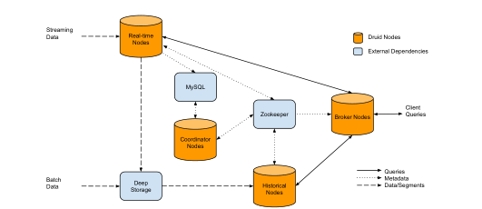

### 3.1 实时节点（Real-time Nodes）

实时节点封装了事件流的摄取和查询功能。经这些节点建立索引的事件可以立即查询。实时节点只关心某个较短时间范围内的事件，并周期性地把这段时间内收集的不可变事件批次移交给集群中专门处理不可变事件批次的其他节点。实时节点通过 ZooKeeper [19] 与 Druid 集群的其余部分协调，并在 ZooKeeper 中宣布自身在线状态以及所服务的数据。

实时节点为所有传入事件维护内存索引缓冲区。随着事件摄取，索引会增量填充，而且可被直接查询。对于存在于这个基于 JVM 堆的缓冲区中的事件，Druid 表现得像行存储。为避免堆溢出，实时节点会周期性地，或在达到最大行数限制后，将内存索引持久化到磁盘。持久化过程把内存缓冲区中的数据转换成第 4 节所述的列式存储格式。每个持久化索引都是不可变的；实时节点将其加载到堆外内存，使其仍然可以查询。这一过程在文献 [33] 中有详细描述，图 2 给出了示意。

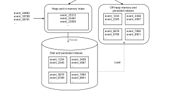

每个实时节点都会周期性调度后台任务，查找所有本地持久化索引。该任务合并这些索引，构造一个不可变数据块，其中包含该实时节点在某一时间跨度内摄取的全部事件。我们把这种数据块称为“段”（segment）。在移交（handoff）阶段，实时节点把段上传到永久备份存储，通常是 S3 [12] 或 HDFS [36] 之类的分布式文件系统；Druid 将其称为“深度存储”（deep storage）。摄取、持久化、合并和移交几个步骤流畅衔接，任何过程中都不会丢失数据。

图 3 展示了实时节点的操作过程。节点于 13:37 启动，只接受当前小时或下一小时的事件。摄取事件后，节点宣布它正在服务 13:00 到 14:00 区间的数据段。节点每 10 分钟刷新内存缓冲区并持久化到磁盘；持久化周期可以配置。接近整点时，节点很可能开始看到 14:00 到 15:00 的事件。此时，节点准备服务下一小时的数据，创建新的内存索引，并宣布它也在服务 14:00 到 15:00 的段。

节点不会立即合并 13:00 到 14:00 的持久化索引，而会等待一个可配置的窗口期，让迟到的 13:00 到 14:00 事件到达。这个窗口期可降低事件传输延迟所造成的数据丢失风险。窗口期结束时，节点把 13:00 到 14:00 的所有持久化索引合并为一个不可变段并移交。该段在 Druid 集群的其他位置加载且可查询之后，实时节点会清除其收集的全部 13:00 到 14:00 数据，并撤销服务该数据的声明。

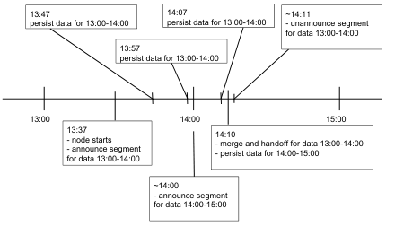

#### 3.1.1 可用性与可扩展性

实时节点是数据消费者，需要对应的生产者提供数据流。为保证数据持久性，生产者与实时节点之间通常放置 Kafka [21] 之类的消息总线，如图 4 所示。实时节点从消息总线读取事件来摄取数据。从事件创建到被消费通常只需数百毫秒。

图 4 中的消息总线有两个用途。第一，消息总线充当传入事件的缓冲区。Kafka 等消息总线维护位置偏移量，指出消费者（实时节点）已经读到了事件流的哪个位置；消费者可以通过程序更新这些偏移量。实时节点每次把内存缓冲区持久化到磁盘时都会更新偏移量。在故障恢复场景中，只要节点没有丢失磁盘，它就能从磁盘重新加载所有持久化索引，并从最后提交的偏移量继续读取事件。从最近提交的偏移量开始摄取可以显著缩短节点恢复时间。实践中，我们看到节点只需数秒就能从这类故障中恢复。

第二，消息总线提供单一端点，让多个实时节点都可以从中读取事件。多个实时节点可以从总线摄取同一组事件，从而形成事件副本。如果某个节点彻底故障并丢失磁盘，复制的事件流可确保数据不丢失。单一摄取端点还允许对数据流分区，让多个实时节点分别摄取数据流的一部分，从而无缝增加实时节点。实践中，该模型使规模最大的生产 Druid 集群之一能够以大约 500 MB/s 的速度消费原始数据，即 150,000 个事件/秒或 2 TB/小时。

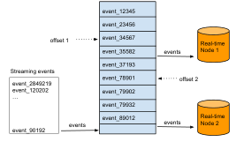

### 3.2 历史节点（Historical Nodes）

历史节点封装了加载和服务不可变数据块（即实时节点创建的段）的功能。在许多真实工作流中，载入 Druid 集群的大部分数据都是不可变的，因此历史节点通常是 Druid 集群的主力工作节点。历史节点采用无共享架构，节点之间不存在单一争用点。各节点互不了解，操作逻辑简单：它们只知道如何加载、删除和服务不可变段。

与实时节点类似，历史节点在 ZooKeeper 中宣布其在线状态和正在服务的数据。加载和删除段的指令通过 ZooKeeper 发送，其中包括段在深度存储中的位置，以及如何解压和处理该段。在从深度存储下载特定段之前，历史节点先检查本地缓存；该缓存记录节点上已经存在的段。如果缓存中没有该段的信息，历史节点才从深度存储下载，如图 5 所示。处理完成后，节点在 ZooKeeper 中宣布该段，此时段即可查询。本地缓存还能让历史节点快速升级和重启：节点启动时检查缓存，并立即服务其中找到的全部数据。

历史节点只处理不可变数据，因此能够支持读一致性。不可变数据块也形成了一种简单的并行化模型：历史节点可以并发扫描和聚合不可变块，而不会相互阻塞。

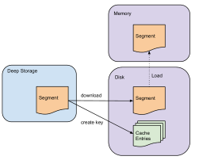

#### 3.2.1 分层（Tiers）

历史节点可以分成不同层，同一层中的所有节点配置完全相同。每一层可以设置不同的性能和容错参数。分层节点使优先级较高或较低的段能够按重要性分布。例如，可以建立一个具有大量 CPU 核心和大容量内存的“热”历史节点层，并把访问更频繁的数据下载到热层；同时，可以用性能弱得多的硬件建立并行的“冷”层，只保存访问不频繁的段。

#### 3.2.2 可用性

历史节点依赖 ZooKeeper 接收段加载和卸载指令。如果 ZooKeeper 不可用，历史节点将无法服务新数据或删除过期数据；但查询通过 HTTP 提供，因此历史节点仍能响应针对当前所服务数据的查询。这意味着 ZooKeeper 停机不会影响历史节点上现有数据的可用性。

### 3.3 Broker 节点

Broker 节点充当通往历史节点和实时节点的查询路由器。Broker 理解 ZooKeeper 中发布的元数据，包括哪些段可查询以及这些段位于何处。它对传入查询进行路由，使查询命中正确的历史节点或实时节点；在向调用方返回最终合并结果之前，Broker 还会合并历史节点与实时节点给出的部分结果。

#### 3.3.1 缓存

Broker 节点包含采用 LRU [31, 20] 失效策略的缓存。缓存可以使用本地堆内存，也可以使用 Memcached [16] 等外部分布式键值存储。Broker 每次收到查询时，先把查询映射到一组段。某些段的结果可能已经位于缓存中，无需重新计算。对于缓存中不存在的结果，Broker 会把查询转发给正确的历史节点和实时节点。历史节点返回结果后，Broker 按段缓存这些结果以供后续使用，如图 6 所示。

实时数据从不缓存，因此针对实时数据的请求总是会转发到实时节点。实时数据不断变化，缓存其结果并不可靠。缓存还充当额外的数据持久层：即使所有历史节点都发生故障，只要结果已存在于缓存中，仍然可以查询这些结果。

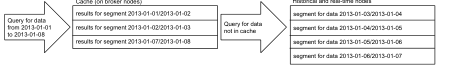

#### 3.3.2 可用性

即使 ZooKeeper 完全停机，数据仍可查询。如果 Broker 无法与 ZooKeeper 通信，它会使用最后一次已知的集群视图，继续向实时节点和历史节点转发查询。Broker 假定集群结构与故障前相同。实践中，这种可用性模型使我们的 Druid 集群能够在诊断 ZooKeeper 故障的相当长时间内继续服务查询。

### 3.4 Coordinator 节点

Druid Coordinator 节点主要负责历史节点上的数据管理与分布。Coordinator 指示历史节点加载新数据、删除过期数据、复制数据，以及移动数据以均衡负载。Druid 使用一种多版本并发控制（MVCC）交换协议管理不可变段，以维持稳定视图。如果某个不可变段中的数据已被较新的段完全取代，该过期段就会从集群中删除。Coordinator 节点通过领导者选举确定唯一一个执行协调功能的节点，其余 Coordinator 节点作为冗余备份。

Coordinator 周期性运行，以确定集群当前状态。每次运行时，它比较集群期望状态与实际状态并据此决策。与所有 Druid 节点一样，Coordinator 通过 ZooKeeper 连接获取当前集群信息；它还连接到一个 MySQL 数据库，读取额外的运行参数和配置。MySQL 中的一项关键信息是一张段清单表，列出了历史节点应当服务的全部段。任何创建段的服务（例如实时节点）都可以更新这张表。MySQL 还包含规则表，用于控制段在集群中的创建、销毁和复制。

#### 3.4.1 规则

规则控制如何在集群中加载和删除历史段。规则指出段应如何分配给不同的历史节点层，以及每一层中应存在多少个段副本；规则也可以规定何时从集群彻底删除段。规则通常针对某一时间范围设置。例如，用户可以通过规则把最近一个月的段加载到“热”层，把最近一年的段加载到“冷”层，并删除更早的段。

Coordinator 从 MySQL 数据库的规则表加载一组规则。规则既可以专用于某个数据源，也可以配置为默认规则。Coordinator 遍历所有可用段，并让每个段匹配第一条适用规则。

#### 3.4.2 负载均衡

在典型生产环境中，一条查询经常命中数十甚至数百个段。每个历史节点的资源有限，因此必须把段分散到整个集群，避免负载过度失衡。确定最优负载分布需要了解查询模式和查询速度。通常，查询会针对单个数据源，覆盖时间上连续的一组近期段；平均而言，访问较小段的查询速度更快。

这些查询模式意味着：近期历史段应按更高比例复制；时间相近的大段应分散到不同历史节点；来自不同数据源的段则应共置。为了在集群中优化段分布并实现负载均衡，我们开发了一种基于代价的优化过程，把段所属的数据源、新旧程度和大小都纳入考虑。算法的确切细节超出本文范围，可能在今后的文献中讨论。

#### 3.4.3 复制

Coordinator 可以指示不同历史节点加载同一段的副本。历史计算集群中每一层的副本数量均可完整配置。要求高容错性的部署可以设置大量副本。复制段与原始段受到相同对待，遵循同一套负载分布算法。通过段复制，单个历史节点故障对 Druid 集群是透明的。我们也利用这一特性进行软件升级：可以无缝下线一个历史节点，升级后重新上线，再对集群中每个历史节点重复此过程。在此前两年里，我们的 Druid 集群从未因软件升级而停机。

#### 3.4.4 可用性

Druid Coordinator 的外部依赖是 ZooKeeper 和 MySQL。Coordinator 依靠 ZooKeeper 判断集群中存在哪些历史节点。如果 ZooKeeper 不可用，Coordinator 将无法再发出分配、均衡和删除段的指令，但这些操作完全不影响数据可用性。

系统应对 MySQL 和 ZooKeeper 故障的设计原则相同：如果负责协调的外部依赖失效，集群维持现状。Druid 使用 MySQL 存储运维管理信息，以及哪些段应存在于集群中的段元数据。MySQL 停机时，Coordinator 无法获得这些信息，但这并不意味着数据本身不可用。如果无法与 MySQL 通信，Coordinator 会停止分配新段和删除过期段；在 MySQL 停机期间，Broker、历史节点和实时节点仍然可以查询。

## 4. 存储格式

Druid 中的数据表称为数据源（data source）；每个数据源都是带时间戳的事件集合，并被划分为一组段，每个段通常包含 500 万至 1,000 万行。形式化地说，我们把段定义为跨越某一时间段的数据行集合。段是 Druid 的基本存储单元，复制和分布都在段粒度进行。

Druid 始终要求存在时间戳列，以简化数据分布策略、数据保留策略和查询的第一级剪枝。Druid 把数据源划分为定义明确的时间区间，通常为一小时或一天；还可以根据其他列的值进一步分区，以达到预期段大小。段的时间分区粒度取决于数据量和时间范围：时间戳跨越一年的数据集更适合按天分区，时间戳仅跨越一天的数据集则更适合按小时分区。

一个段由数据源标识符、数据的时间区间和版本字符串唯一标识；每次创建新段，版本字符串都会递增。版本字符串表示段数据的新鲜程度：对于某一时间范围，版本较新的段提供比旧版本段更新的数据视图。系统使用这些段元数据进行并发控制；读操作在访问某一时间范围的数据时，总是选择该范围内版本标识符最新的段。

Druid 段采用列式存储。Druid 最适合聚合事件流，并且所有进入 Druid 的数据都必须带时间戳；在这类场景中，以列而不是以行存储聚合信息的优势已有充分论述 [1]。列式存储仅加载和扫描实际需要的内容，因此能够更高效地使用 CPU。在行式数据存储中，聚合时必须扫描与一行关联的所有列，额外扫描时间会导致显著的性能下降 [1]。

Druid 通过多种列类型表示不同的数据格式，并根据列类型使用不同的压缩方法，降低列在内存和磁盘中的存储成本。表 1 中的 `page`、`username`、`gender` 和 `city` 列只含字符串。直接存储字符串成本过高，可以改用字典编码；字典编码是常用的数据压缩方法，PowerDrill [17] 等其他数据存储也采用它。以表 1 为例，可把每个页面映射成唯一整数标识符：

```text
Justin Bieber -> 0
Ke$ha         -> 1
```

这种映射让我们能把 `page` 列表示成整数数组，数组索引对应原始数据集中的行：

```text
[0, 0, 1, 1]
```

所得整数数组非常适合压缩。在编码之上使用通用压缩算法是列式存储中的常见做法；Druid 使用 LZF [24] 压缩算法。

数值列也可以使用类似压缩方法。例如，表 1 的新增字符数和删除字符数也可以分别表示成数组：

```text
Characters Added   -> [1800, 2912, 1953, 3194]
Characters Removed -> [25, 42, 17, 170]
```

在这种情况下，被压缩的是原始值，而不是其字典表示。

### 4.1 用于数据过滤的索引

在许多真实 OLAP 工作流中，查询会要求：在一组维度条件成立时，对一组指标给出聚合结果。例如：“San Francisco 的男性用户完成了多少次 Wikipedia 编辑？”该查询依据维度值的布尔表达式过滤表 1 的 Wikipedia 数据集。在许多实际数据集中，维度列包含字符串，指标列包含数值。Druid 为字符串列创建额外的查找索引，使扫描仅触及与特定查询过滤器有关的行。

以表 1 的 `page` 列为例。对于表中每个唯一页面，可以建立一种表示，指出该页面出现在哪些表行中。我们可以把它存成二进制数组：数组索引代表行；某页面出现在某行时，对应数组位置标为 1。例如：

```text
Justin Bieber -> rows [0, 1] -> [1][1][0][0]
Ke$ha         -> rows [2, 3] -> [0][0][1][1]
```

Justin Bieber 出现在第 0 和第 1 行。列值到行索引的这种映射构成倒排索引 [39]。为了确定哪些行包含 Justin Bieber 或 Ke$ha，可以对两个数组执行 OR：

```text
[0][0][1][1] OR [1][1][0][0] = [1][1][1][1]
```

在大型位图集合上执行布尔运算是搜索引擎的常用技术，文献 [32] 详细介绍了 OLAP 工作负载中的位图索引。位图压缩算法是一个已有充分研究的领域 [2, 44, 42]，通常采用游程编码。Druid 选择了 Concise 算法 [10]。图 7 比较了 Concise 压缩表示与整数数组所需的字节数。实验在 `cc2.8xlarge` 系统上以单线程运行，JVM 堆为 2 GB，新生代为 512 MB，每次运行之间强制执行垃圾回收。数据集取自 Twitter garden hose [41] 数据流一天的数据，包含 2,272,295 行和 12 个基数各异的维度。为了进一步比较，我们还重新排序了数据集中的行，以最大化压缩率。

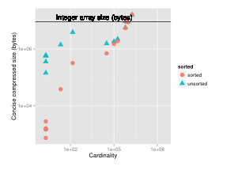

在未排序情况下，Concise 总大小为 53,451,144 字节，整数数组总大小为 127,248,520 字节；总体而言，Concise 压缩集合比整数数组小约 42%。在已排序情况下，Concise 压缩后的总大小为 43,832,884 字节，整数数组总大小仍为 127,248,520 字节。值得注意的是，排序后全局压缩率只获得了很小的提升。

### 4.2 存储引擎

Druid 的持久化组件允许插入不同的存储引擎，这一点与 Dynamo [12] 类似。这些存储引擎既可以把数据完全存入 JVM 堆这样的内存结构，也可以存入内存映射结构。切换存储引擎的能力使 Druid 可以按具体应用的要求进行配置。纯内存存储引擎的运维成本可能高于内存映射存储引擎，但在性能至关重要时可能是更好的选择。Druid 默认使用内存映射存储引擎。

使用内存映射存储引擎时，Druid 依靠操作系统把段换入或换出内存。段只有加载进内存才能扫描，因此内存映射存储引擎会使近期段保留在内存中，而从不查询的段则被换出。该引擎的主要缺点出现在一条查询需要换入的段超过节点容量时；此时，频繁换入换出段的代价会损害查询性能。

## 5. 查询 API

Druid 有自己的查询语言，并通过 POST 请求接受查询。Broker、历史节点和实时节点共享同一套查询 API。

POST 请求体是由键值对组成的 JSON 对象，用来指定各种查询参数。典型查询包含数据源名称、结果数据粒度、关注的时间范围、请求类型和要聚合的指标。结果同样是 JSON 对象，包含该时间段上的聚合指标。

多数查询类型也支持过滤器集合。过滤器集合是由维度名称和值组成的布尔表达式，可以指定任意数量和组合的维度与值。提供过滤器集合时，只扫描与过滤器有关的数据子集。处理复杂嵌套过滤器集合的能力，使 Druid 能够下钻到数据的任意深度。

确切查询语法取决于查询类型和所请求的信息。下面是一条针对一周数据的计数查询：

```json
{
  "queryType": "timeseries",
  "dataSource": "wikipedia",
  "intervals": "2013-01-01/2013-01-08",
  "filter": {
    "type": "selector",
    "dimension": "page",
    "value": "Ke$ha"
  },
  "granularity": "day",
  "aggregations": [
    {"type": "count", "name": "rows"}
  ]
}
```

该查询返回 Wikipedia 数据源从 2013-01-01 到 2013-01-08 的行数，只保留 `page` 维度值等于 `Ke$ha` 的行。结果按天分桶，是如下形式的 JSON 数组：

```json
[
  {
    "timestamp": "2012-01-01T00:00:00.000Z",
    "result": {"rows": 393298}
  },
  {
    "timestamp": "2012-01-02T00:00:00.000Z",
    "result": {"rows": 382932}
  },
  ...
  {
    "timestamp": "2012-01-07T00:00:00.000Z",
    "result": {"rows": 1337}
  }
]
```

Druid 支持多种聚合，包括浮点数和整数求和、最小值、最大值，以及基数估计、近似分位数估计等复杂聚合。聚合结果还可以组合到数学表达式中，形成其他聚合。完整描述查询 API 超出了本文范围，更多信息可参见 Druid 在线文档。[^3]

截至本文写作时，Druid 尚未实现连接查询。这更多是工程资源分配和用例取舍的结果，而不是由技术优劣驱动的决定。事实上，Druid 的存储格式允许实现连接：作为维度纳入的列不会损失信息保真度；我们也每隔几个月便会讨论一次连接实现。到目前为止，我们认为实现成本不值得组织投入，原因主要有两点：

1. 根据我们的从业经验，扩展连接查询一直是使用分布式数据库时的瓶颈。
2. 与管理高并发、连接密集型工作负载的预期困难相比，增加的功能价值被认为较小。

连接查询本质上是依据一组共享键合并两个或更多数据流。我们所了解的主要高层策略是基于哈希的策略和排序合并策略。基于哈希的策略要求除一个数据集外，其余所有数据集都能以类似哈希表的形式提供；随后，对“主”数据流中的每一行在哈希表上执行查找。排序合并策略假设每个流都按连接键排序，因而可以逐步连接各个流。然而，两种策略都要求把若干数据流具体化为有序形式或哈希表形式。

当连接的各方都是非常大的表（超过 10 亿条记录）时，具体化连接前数据流需要复杂的分布式内存管理。我们的目标又是高度并发的多租户工作负载，这进一步放大了内存管理的复杂性。据我们所知，这仍是一个活跃的学术研究问题；我们也愿意协助以可扩展方式解决它。

## 6. 性能

Druid 已在多家组织的生产环境中运行。为了展示其性能，我们选择公开截至 2014 年初 Metamarkets 主生产集群的一些真实数据。为便于与其他数据库比较，我们还给出了 TPC-H 数据上合成工作负载的结果。

### 6.1 生产环境中的查询性能

Druid 的查询性能会随查询而显著变化。例如，按照给定指标对高基数维度的值排序，远比对某一时间范围执行简单计数昂贵。为了展示生产 Druid 集群的平均查询延迟，我们选择了查询最频繁的 8 个数据源，见表 2。

| 数据源 | 维度数 | 指标数 |
| --- | ---: | ---: |
| a | 25 | 21 |
| b | 30 | 26 |
| c | 71 | 35 |
| d | 60 | 19 |
| e | 29 | 8 |
| f | 30 | 16 |
| g | 26 | 18 |
| h | 78 | 14 |

表 2：生产数据源的特征。

约 30% 的查询是涉及不同指标和过滤器的标准聚合，60% 是对一个或多个维度执行带聚合的有序分组，另有 10% 是搜索查询和元数据检索查询。聚合查询扫描的列数大致服从指数分布：只涉及一列的查询非常常见，而涉及所有列的查询极少。

解释这些结果时需要注意以下几点：

- 结果来自生产集群的一个“热”层。该层约有 50 个数据源，数百名用户会对其发出查询。
- 热层约有 10.5 TB RAM，加载了约 10 TB 段，合计约 500 亿个 Druid 行；图中没有展示每个数据源的结果。
- 热层使用 Intel Xeon E5-2670 处理器，共有 1,302 个处理线程、672 个物理核心（启用超线程）。
- 使用内存映射存储引擎，即机器配置为对数据执行内存映射，而不是将其加载到 Java 堆中。

图 8 展示查询延迟，图 9 展示每分钟查询数。在所有数据源上，平均查询延迟约为 550 毫秒；90% 的查询在 1 秒内返回，95% 在 2 秒内返回，99% 在 10 秒内返回。延迟偶尔会出现尖峰，例如 2 月 19 日 Memcached 实例的网络问题叠加到最大数据源之一的极高查询负载，造成了图中的峰值。

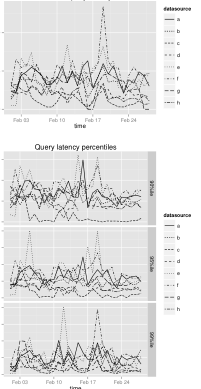

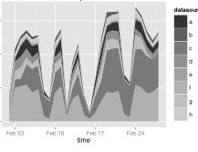

### 6.2 TPC-H 数据上的查询基准

我们还在 TPC-H 数据上给出了 Druid 基准。多数 TPC-H 查询并不直接适用于 Druid，因此我们选择了更符合 Druid 工作负载的查询来展示性能。作为对照，我们使用 MyISAM 引擎在 MySQL 上执行相同查询；实验中 InnoDB 更慢。

我们选择 MySQL 作为基准对照，是因为它极为普及。我们没有选择其他开源列式存储，是因为不能确信自己能够正确调优它，使其达到最优性能。

Druid 的历史节点使用 Amazon EC2 `m3.2xlarge` 实例（Intel Xeon E5-2680 v2，2.80 GHz），Broker 节点使用 `c3.2xlarge` 实例（Intel Xeon E5-2670 v2，2.50 GHz）。MySQL 部署在 Amazon RDS 上，使用与历史节点相同的 `m3.2xlarge` 实例类型。

1 GB TPC-H 数据集的结果见图 10，100 GB 数据集的结果见图 11。在指定时间区间执行等价于 `select count(*)` 的查询时，Druid 的扫描速率达到每核心每秒 53,539,211 行；执行 `select sum(float)` 类型查询时，扫描速率达到每核心每秒 36,246,530 行。

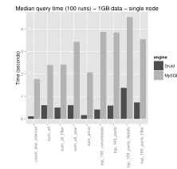

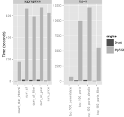

最后，我们给出 Druid 面对 TPC-H 100 GB 数据集增长时的扩展结果。核心数从 8 增加到 48 后，并非所有查询类型都实现线性扩展，但较简单的聚合查询能够实现，如图 12 所示。

并行计算系统的加速通常受系统中顺序操作所需时间限制。在本实验中，需要 Broker 层完成大量工作的查询并行化效果较差。

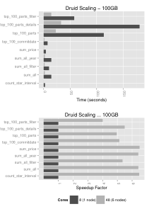

### 6.3 数据摄取性能

为展示 Druid 的数据摄取延迟，我们选择了若干生产数据源，它们具有不同的维度数、指标数和事件量。生产摄取部署由 6 个节点组成，总计 360 GB RAM、96 个核心（12 颗 Intel Xeon E5-2670）。需要注意，这些机器同时还在摄取其他数据源，并并发运行许多与 Druid 摄取有关的任务。

Druid 的数据摄取延迟高度依赖于所摄取数据集的复杂度。数据复杂度由每个事件的维度数、指标数以及希望在这些指标上执行的聚合类型决定。对最简单的数据集（只有时间戳列），该部署能达到每核心每秒 800,000 个事件；这实际只是在测量反序列化事件的速度。真实数据集从不会如此简单。表 3 列出了部分数据源及其特征。

| 数据源 | 维度数 | 指标数 | 峰值事件数/秒 |
| --- | ---: | ---: | ---: |
| s | 7 | 2 | 28,334.60 |
| t | 10 | 7 | 68,808.70 |
| u | 5 | 1 | 49,933.93 |
| v | 30 | 10 | 22,240.45 |
| w | 35 | 14 | 135,763.17 |
| x | 28 | 6 | 46,525.85 |
| y | 33 | 24 | 162,462.41 |
| z | 33 | 24 | 95,747.74 |

表 3：不同数据源的摄取特征。

根据表 3 的描述可以看到，延迟差异很大，而且摄取延迟并不总是维度数和指标数的函数。某些简单数据集出现了较低速率，是因为数据生产者只以该速率交付数据。结果见图 13。

我们把吞吐量定义为实时节点能够摄取并同时使其可查询的事件数量。如果发送给实时节点的事件过多，这些事件会被阻塞，直到实时节点有能力接受它们。在生产环境中测得的峰值摄取吞吐量为每核心每秒 22,914.43 个事件；该数据源有 30 个维度和 19 个指标，运行在 Amazon `cc2.8xlarge` 实例上。

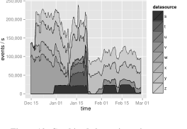

上述延迟测量结果足以满足我们提出的交互性问题。不过，我们希望延迟波动能更小。增加硬件仍可降低延迟，但基础设施成本也是我们必须考虑的因素，因此没有选择这样做。

## 7. 生产环境中的 Druid

过去几年里，我们在使用 Druid 处理生产工作负载方面积累了大量经验，也得到了一些有意思的观察。

**查询模式。** Druid 经常用于探索数据以及根据数据生成报表。在探索用例中，单个用户发出的查询数远高于报表用例。探索式查询经常在同一时间范围上逐步增加过滤器，以不断缩小结果；用户往往探索近期数据中的较短时间区间。生成报表时，用户查询的时间区间长得多，但查询通常数量较少而且预先确定。

**多租户。** 在多租户环境中，高代价并发查询可能造成问题。针对大型数据源的查询最终可能命中集群中的每个历史节点，耗尽所有集群资源，导致较小、较便宜的查询无法执行。我们引入查询优先级来解决这一问题。每个历史节点都能确定需要优先扫描哪些段。正确的查询规划对生产工作负载至关重要。所幸，需要大量数据的查询通常属于报表用例，可以降低优先级；用户对报表的交互性期望不像探索数据时那么高。

**节点故障。** 单节点故障在分布式环境中很常见，许多节点同时故障则不常见。如果历史节点彻底故障且无法恢复，其段就需要重新分配；这意味着集群必须留有富余容量来加载数据。任何时刻保留多少额外容量都会影响集群运行成本。根据我们的经验，同时彻底故障的节点极少超过两个，因此集群只需保留足以重新分配两个历史节点数据的容量。

**数据中心故障。** 整个集群可能发生故障，但极为罕见。如果 Druid 只部署在单个数据中心，整个数据中心就可能失效。此时必须配置新机器。只要深度存储仍然可用，集群恢复时间便受网络限制，因为历史节点只需从深度存储重新下载每个段。我们过去经历过这种故障；在 Amazon AWS 环境中，对数 TB 数据的恢复耗时数小时。

### 7.1 运维监控

恰当的监控是运行大规模分布式集群的关键。每个 Druid 节点都被设计为周期性发送一组运维指标。这些指标可能包括 CPU 使用率、可用内存和磁盘容量等系统级数据，垃圾回收时间、堆使用量等 JVM 统计信息，或者段扫描时间、缓存命中率和数据摄取延迟等节点特有指标。Druid 也会发送每条查询的指标。

我们从生产 Druid 集群发送指标，并将其载入一个专用的指标 Druid 集群。指标集群用于探索生产集群的性能和稳定性。这个专用集群帮助我们发现了许多生产问题，例如查询速度逐渐下降、硬件调优欠佳以及其他各种系统瓶颈。我们还利用指标集群分析生产环境发出了哪些查询，以及用户最关心数据的哪些方面。

### 7.2 Druid 与流处理器配合

目前，Druid 只能理解完全反规范化的数据流。为了在生产环境中实现完整业务逻辑，可以把 Druid 与 Apache Storm [27] 等流处理器配合使用。Storm 拓扑从数据流消费事件，仅保留“准时”事件，并应用相关业务逻辑。这些逻辑可以是 ID 到名称查找等简单转换，也可以是多流连接等复杂操作。Storm 拓扑实时地把处理后的事件流转发给 Druid：Storm 负责流数据处理，Druid 则负责响应对实时数据和历史数据的查询。

### 7.3 多数据中心分布

大规模生产故障不仅可能影响单个节点，也可能影响整个数据中心。Druid Coordinator 的分层配置允许跨多个层复制段，因此可以在多个数据中心的历史节点之间精确复制段。类似地，也可以为不同层设置查询偏好。一个数据中心中的节点可以作为主集群接收全部查询，另一个数据中心则运行冗余集群。如果一个数据中心离用户近得多，这类部署可能很有价值。

## 8. 相关工作

Cattell [6] 对现有可扩展 SQL 和 NoSQL 数据存储作了很好的总结，Hu [18] 则对流数据库作了另一篇优秀综述。从功能上看，Druid 位于 Google Dremel [28] 与 PowerDrill [17] 之间。Druid 实现了 Dremel 的大多数功能，不过 Dremel 可以处理任意嵌套数据结构，而 Druid 只允许一层基于数组的嵌套；Druid 也采用了 PowerDrill 中提到的许多有趣压缩算法。

Druid 建立在与其他分布式列式数据存储 [15] 相同的许多原则之上，但其中许多数据存储被设计成更通用的键值存储 [23]，并不支持直接在存储层中执行计算。还有一些数据存储旨在解决 Druid 所面向的同类数据仓库问题，其中包括 SAP HANA [14] 和 VoltDB [43] 等内存数据库。这些数据存储不具备 Druid 的低延迟摄取特性。Druid 还像 ParAccel [34] 一样内置了原生分析功能，但 Druid 允许在整个系统范围内滚动升级软件而不停机。

Druid 与 C-Store [38] 和 LazyBase [8] 类似，都有两个子系统：历史节点构成读优化子系统，实时节点构成写优化子系统。实时节点为摄取大量追加型数据而设计，不支持数据更新。不同于上述两个系统，Druid 面向 OLAP 事务，而不是 OLTP 事务。

Druid 的低延迟数据摄取功能与 Trident/Storm [27] 和 Spark Streaming [45] 有一些相似之处；不过后两者侧重流处理，Druid 则侧重摄取和聚合。流处理器很适合作为 Druid 的补充，在数据进入 Druid 前对其进行预处理。

还有一类系统专门在集群计算框架之上执行查询。Shark [13] 是 Spark 上的此类查询系统；Cloudera Impala [9] 则专注于优化 HDFS 上的查询性能。Druid 历史节点把数据下载到本地，并且只处理原生 Druid 索引；我们认为这种部署能够实现更低的查询延迟。

Druid 在其架构中使用了独特的算法组合。虽然我们认为没有其他数据存储具备与 Druid 完全相同的一组功能，但 Druid 的一些优化技术，例如使用倒排索引执行快速过滤，也被其他数据存储采用 [26]。

## 9. 结论

本文介绍了 Druid，一种分布式、列式的实时分析数据存储。Druid 被设计用于支撑高性能应用，并针对低查询延迟进行了优化。Druid 支持流式数据摄取并具有容错能力。本文给出了 Druid 基准，并总结了存储格式、查询语言和一般执行过程等关键架构方面。

## 10. 致谢

如果没有 Metamarkets 和社区中许多优秀工程师的帮助，Druid 就不可能建成。我们感谢每一位为 Druid 代码库作出贡献的人，感谢他们提供的宝贵支持。

## 11. 参考文献

[^1]: Druid 项目主页与源代码：http://druid.io/；https://github.com/metamx/druid。
[^2]: 论文写作时的 Druid 生产部署列表：http://druid.io/druid.html。
[^3]: Druid 查询文档：http://druid.io/docs/latest/Querying.html。

- [1] D. J. Abadi, S. R. Madden, and N. Hachem. Column-stores vs. row-stores: How different are they really? In *Proceedings of the 2008 ACM SIGMOD International Conference on Management of Data*, pages 967-980. ACM, 2008.
- [2] G. Antoshenkov. Byte-aligned bitmap compression. In *Data Compression Conference, 1995. DCC '95. Proceedings*, page 476. IEEE, 1995.
- [3] Apache. Apache Solr. http://lucene.apache.org/solr/, February 2013.
- [4] S. Banon. Elasticsearch. http://www.elasticseach.com/, July 2013.
- [5] C. Bear, A. Lamb, and N. Tran. The Vertica database: SQL RDBMS for managing big data. In *Proceedings of the 2012 Workshop on Management of Big Data Systems*, pages 37-38. ACM, 2012.
- [6] R. Cattell. Scalable SQL and NoSQL data stores. *ACM SIGMOD Record*, 39(4):12-27, 2011.
- [7] F. Chang, J. Dean, S. Ghemawat, W. C. Hsieh, D. A. Wallach, M. Burrows, T. Chandra, A. Fikes, and R. E. Gruber. Bigtable: A distributed storage system for structured data. *ACM Transactions on Computer Systems (TOCS)*, 26(2):4, 2008.
- [8] J. Cipar, G. Ganger, K. Keeton, C. B. Morrey III, C. A. Soules, and A. Veitch. LazyBase: trading freshness for performance in a scalable database. In *Proceedings of the 7th ACM European Conference on Computer Systems*, pages 169-182. ACM, 2012.
- [9] Cloudera Impala. http://blog.cloudera.com/blog, March 2013.
- [10] A. Colantonio and R. Di Pietro. Concise: Compressed 'n' composable integer set. *Information Processing Letters*, 110(16):644-650, 2010.
- [11] J. Dean and S. Ghemawat. MapReduce: simplified data processing on large clusters. *Communications of the ACM*, 51(1):107-113, 2008.
- [12] G. DeCandia, D. Hastorun, M. Jampani, G. Kakulapati, A. Lakshman, A. Pilchin, S. Sivasubramanian, P. Vosshall, and W. Vogels. Dynamo: Amazon's highly available key-value store. In *ACM SIGOPS Operating Systems Review*, volume 41, pages 205-220. ACM, 2007.
- [13] C. Engle, A. Lupher, R. Xin, M. Zaharia, M. J. Franklin, S. Shenker, and I. Stoica. Shark: fast data analysis using coarse-grained distributed memory. In *Proceedings of the 2012 International Conference on Management of Data*, pages 689-692. ACM, 2012.
- [14] F. Färber, S. K. Cha, J. Primsch, C. Bornhövd, S. Sigg, and W. Lehner. SAP HANA database: data management for modern business applications. *ACM SIGMOD Record*, 40(4):45-51, 2012.
- [15] B. Fink. Distributed computation on Dynamo-style distributed storage: Riak Pipe. In *Proceedings of the Eleventh ACM SIGPLAN Workshop on Erlang Workshop*, pages 43-50. ACM, 2012.
- [16] B. Fitzpatrick. Distributed caching with Memcached. *Linux Journal*, (124):72-74, 2004.
- [17] A. Hall, O. Bachmann, R. Büssow, S. Gănceanu, and M. Nunkesser. Processing a trillion cells per mouse click. *Proceedings of the VLDB Endowment*, 5(11):1436-1446, 2012.
- [18] B. Hu. Stream database survey. 2011.
- [19] P. Hunt, M. Konar, F. P. Junqueira, and B. Reed. ZooKeeper: Wait-free coordination for Internet-scale systems. In *USENIX ATC*, volume 10, 2010.
- [20] C. S. Kim. LRFU: A spectrum of policies that subsumes the least recently used and least frequently used policies. *IEEE Transactions on Computers*, 50(12), 2001.
- [21] J. Kreps, N. Narkhede, and J. Rao. Kafka: A distributed messaging system for log processing. In *Proceedings of 6th International Workshop on Networking Meets Databases (NetDB)*, Athens, Greece, 2011.
- [22] T. Lachev. *Applied Microsoft Analysis Services 2005: And Microsoft Business Intelligence Platform*. Prologika Press, 2005.
- [23] A. Lakshman and P. Malik. Cassandra - a decentralized structured storage system. *Operating Systems Review*, 44(2):35, 2010.
- [24] LibLZF. http://freecode.com/projects/liblzf, March 2013.
- [25] LinkedIn. SenseiDB. http://www.senseidb.com/, July 2013.
- [26] R. MacNicol and B. French. Sybase IQ Multiplex - designed for analytics. In *Proceedings of the Thirtieth International Conference on Very Large Data Bases*, volume 30, pages 1227-1230. VLDB Endowment, 2004.
- [27] N. Marz. Storm: Distributed and fault-tolerant realtime computation. http://storm-project.net/, February 2013.
- [28] S. Melnik, A. Gubarev, J. J. Long, G. Romer, S. Shivakumar, M. Tolton, and T. Vassilakis. Dremel: interactive analysis of web-scale datasets. *Proceedings of the VLDB Endowment*, 3(1-2):330-339, 2010.
- [29] D. Miner. Unified analytics platform for big data. In *Proceedings of the WICSA/ECSA 2012 Companion Volume*, pages 176-176. ACM, 2012.
- [30] K. Oehler, J. Gruenes, C. Ilacqua, and M. Perez. *IBM Cognos TM1: The Official Guide*. McGraw-Hill, 2012.
- [31] E. J. O'Neil, P. E. O'Neil, and G. Weikum. The LRU-K page replacement algorithm for database disk buffering. In *ACM SIGMOD Record*, volume 22, pages 297-306. ACM, 1993.
- [32] P. O'Neil and D. Quass. Improved query performance with variant indexes. In *ACM SIGMOD Record*, volume 26, pages 38-49. ACM, 1997.
- [33] P. O'Neil, E. Cheng, D. Gawlick, and E. O'Neil. The log-structured merge-tree (LSM-tree). *Acta Informatica*, 33(4):351-385, 1996.
- [34] ParAccel Analytic Database. http://www.paraccel.com/resources/Datasheets/ParAccel-Core-Analytic-Database.pdf, March 2013.
- [35] M. Schrader, D. Vlamis, M. Nader, C. Claterbos, D. Collins, M. Campbell, and F. Conrad. *Oracle Essbase & Oracle OLAP*. McGraw-Hill, Inc., 2009.
- [36] K. Shvachko, H. Kuang, S. Radia, and R. Chansler. The Hadoop Distributed File System. In *Mass Storage Systems and Technologies (MSST), 2010 IEEE 26th Symposium on*, pages 1-10. IEEE, 2010.
- [37] M. Singh and B. Leonhardi. Introduction to the IBM Netezza warehouse appliance. In *Proceedings of the 2011 Conference of the Center for Advanced Studies on Collaborative Research*, pages 385-386. IBM Corp., 2011.
- [38] M. Stonebraker, D. J. Abadi, A. Batkin, X. Chen, M. Cherniack, M. Ferreira, E. Lau, A. Lin, S. Madden, E. O'Neil, et al. C-Store: a column-oriented DBMS. In *Proceedings of the 31st International Conference on Very Large Data Bases*, pages 553-564. VLDB Endowment, 2005.
- [39] A. Tomasic and H. Garcia-Molina. Performance of inverted indices in shared-nothing distributed text document information retrieval systems. In *Parallel and Distributed Information Systems, 1993, Proceedings of the Second International Conference on*, pages 8-17. IEEE, 1993.
- [40] E. Tschetter. Introducing Druid: Real-time analytics at a billion rows per second. http://druid.io/blog/2011/04/30/introducing-druid.html, April 2011.
- [41] Twitter Public Streams. https://dev.twitter.com/docs/streaming-apis/streams/public, March 2013.
- [42] S. J. van Schaik and O. de Moor. A memory efficient reachability data structure through bit vector compression. In *Proceedings of the 2011 International Conference on Management of Data*, pages 913-924. ACM, 2011.
- [43] L. VoltDB. VoltDB Technical Overview. https://voltdb.com/, 2010.
- [44] K. Wu, E. J. Otoo, and A. Shoshani. Optimizing bitmap indices with efficient compression. *ACM Transactions on Database Systems (TODS)*, 31(1):1-38, 2006.
- [45] M. Zaharia, T. Das, H. Li, S. Shenker, and I. Stoica. Discretized streams: an efficient and fault-tolerant model for stream processing on large clusters. In *Proceedings of the 4th USENIX Conference on Hot Topics in Cloud Computing*, pages 10-10. USENIX Association, 2012.
