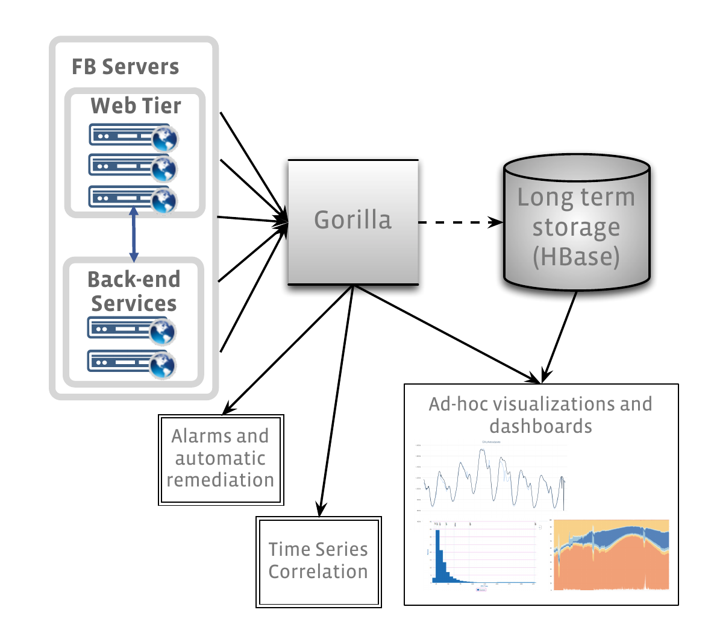
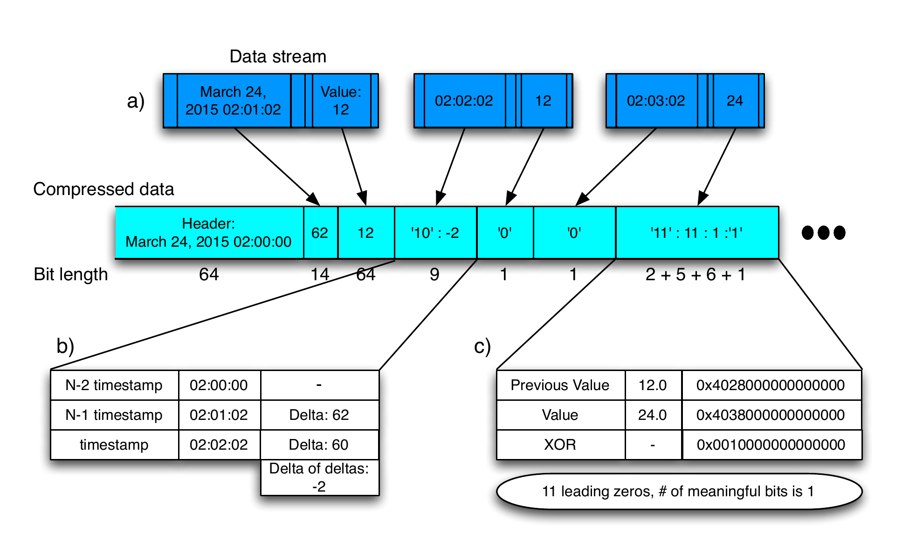
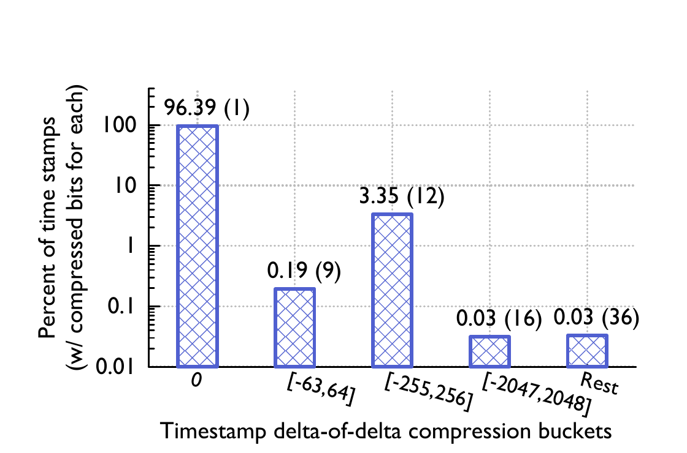
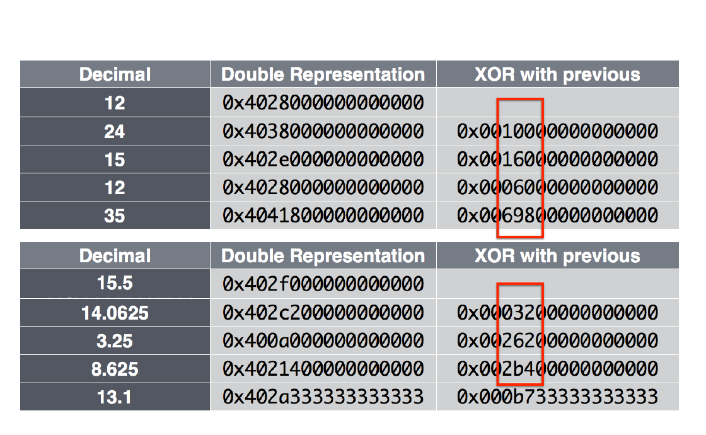
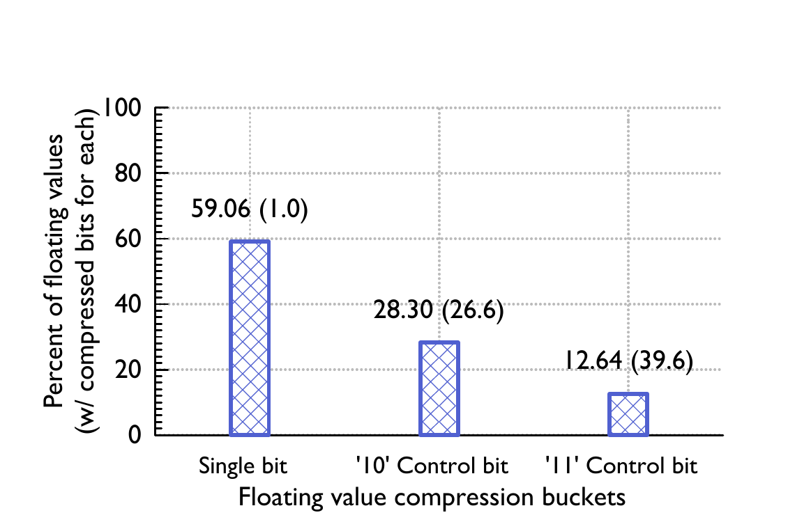
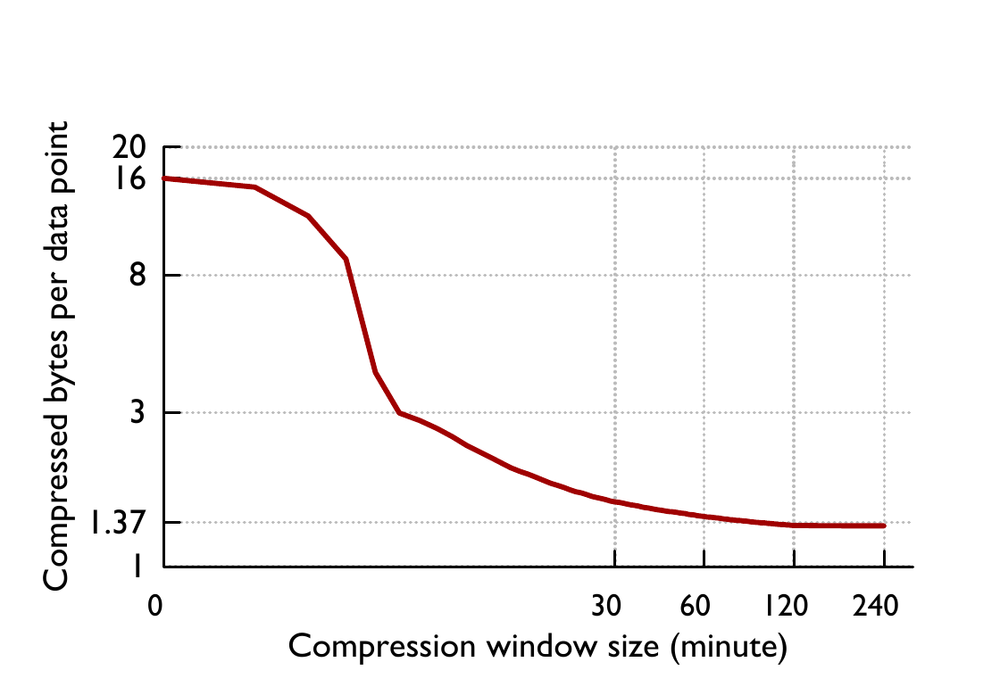
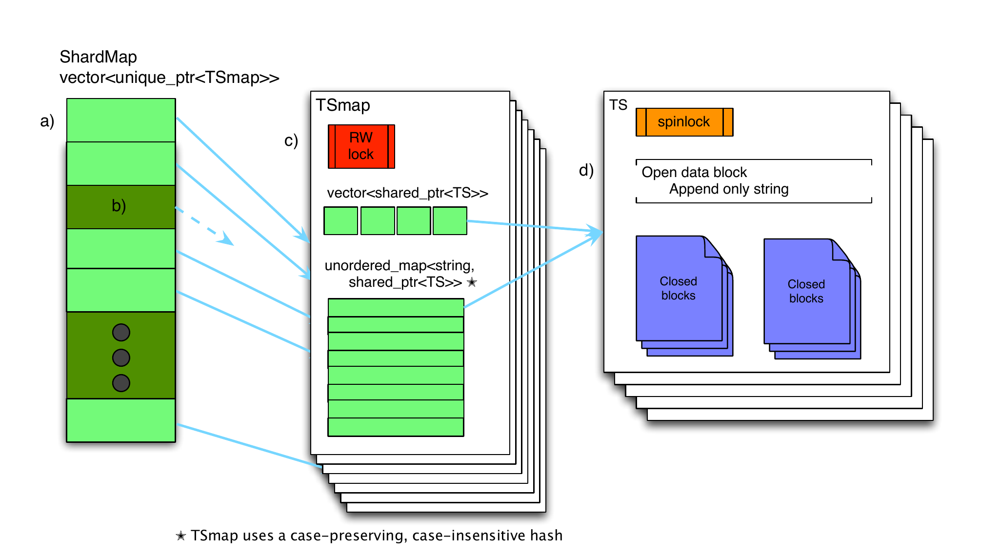
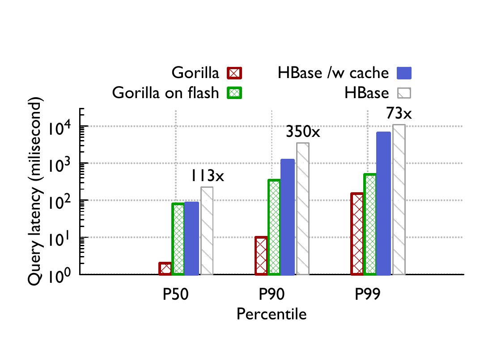
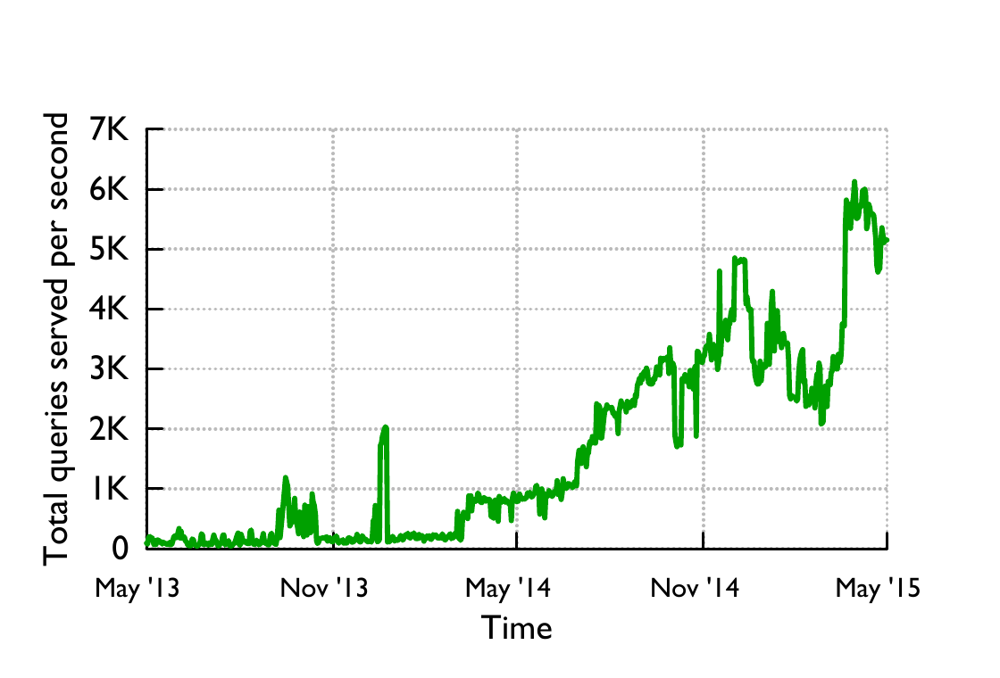
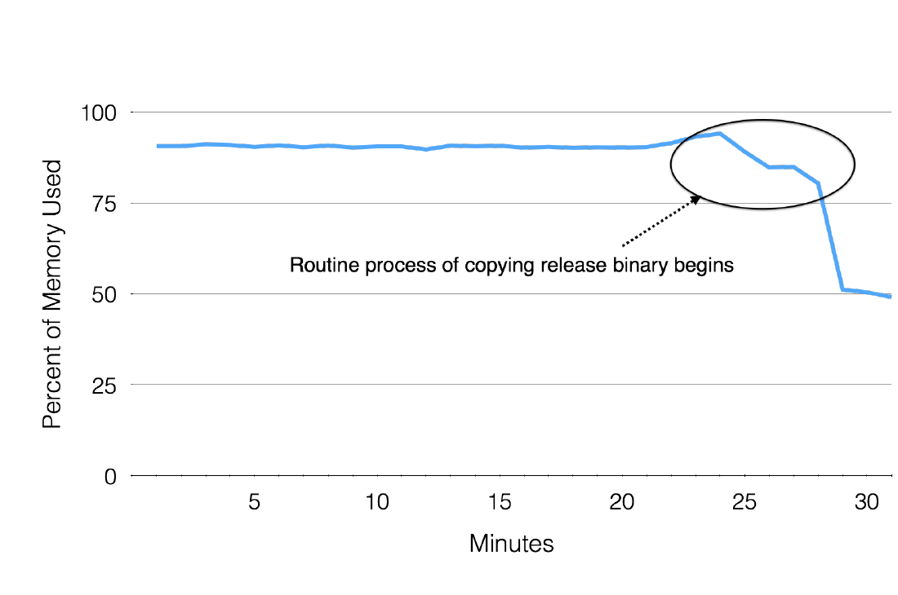

# Gorilla: A Fast, Scalable, In-Memory Time Series Database（中文译文）

## 译者说明

本文依据同目录的 `source.pdf` 翻译。章节、图表、公式、算法、代码与参考文献按原文结构保留。

## 作者与机构

| 姓名 | 机构 |
| --- | --- |
| Tuomas Pelkonen | Facebook, Inc.，Menlo Park, CA |
| Scott Franklin | Facebook, Inc.，Menlo Park, CA |
| Justin Teller | Facebook, Inc.，Menlo Park, CA |
| Paul Cavallaro | Facebook, Inc.，Menlo Park, CA |
| Qi Huang | Facebook, Inc.，Menlo Park, CA |
| Justin Meza | Facebook, Inc.，Menlo Park, CA |
| Kaushik Veeraraghavan | Facebook, Inc.，Menlo Park, CA |

**出版信息：** Proceedings of the VLDB Endowment，Vol. 8，No. 12，2015；论文受邀在第 41 届 International Conference on Very Large Data Bases（2015 年 8 月 31 日至 9 月 4 日，美国夏威夷 Kohala Coast）报告。

## 摘要

大型互联网服务力求在发生意外故障时仍保持高度可用和快速响应。要提供这样的服务，往往需要跨大量系统每秒监控和分析数千万个测量值；一种格外有效的办法，是把这些测量值存入时序数据库（time series database，TSDB）并加以查询。

设计 TSDB 的一个核心挑战，是如何在效率、可扩展性与可靠性之间取得恰当平衡。在本文中，我们介绍 Facebook 的内存型 TSDB——Gorilla。我们的洞见是：监控系统的用户并不特别看重单个数据点，而更重视聚合分析；为快速发现正在发生的问题并诊断其根因，近期数据点的价值也远高于较早的数据点。Gorilla 优先保证即使发生故障也能高度可用地读写，代价是在写入路径上可能丢弃少量数据。为提高查询效率，我们积极采用时间戳二阶差分和浮点值异或等压缩技术，将 Gorilla 的存储占用缩小 10 倍。这让我们可以把 Gorilla 的数据放在内存中；与由传统数据库（HBase）支撑的时序数据相比，查询延迟降低了 73 倍，查询吞吐量提高了 14 倍。这一性能提升催生了新的监控和调试工具，例如时序相关性搜索与信息密度更高的可视化工具。对于从单节点到整个区域的故障，Gorilla 同样能够平稳应对，几乎不产生运维负担。

## 1. 引言

大型互联网服务力求即使发生意外故障，也能继续为用户保持高度可用和快速响应。随着这些服务扩展到全球用户，其规模已经从运行在数百台机器上的少数几个系统，增长为运行在数千台机器上的数千个独立系统，并且通常横跨多个地理复制的数据中心。

运营这类大规模服务的一项重要要求，是准确监控底层系统的健康状况与性能，并在问题出现时迅速发现和诊断。Facebook 使用时序数据库（TSDB）存储系统测量数据点，并在其上提供快速查询功能。接下来，我们先说明我们在监控和运营 Facebook 时需要满足的一些约束，再介绍我们的新内存型 TSDB——Gorilla。它每秒能够存储数千万个数据点（例如 CPU 负载、错误率和延迟等），并在毫秒内回答针对这些数据的查询。

**写入占主导。** 我们对 TSDB 的首要要求，是它应当始终能够接受写入。由于我们有数百个系统分别暴露多项数据，写入速率很容易超过每秒数千万个数据点。相比之下，读取速率通常要低几个数量级；读取主要来自监视“重要”时序的自动化系统、向人展示仪表板的数据可视化系统，以及希望诊断已观察到问题的人工运维人员。

**状态转换。** 我们希望识别由新软件版本、配置变更的意外副作用、网络中断以及其他会造成显著状态转换的事件所引发的问题。因此，我们希望 TSDB 支持在短时间窗口上进行细粒度聚合。能够在几十秒内呈现状态转换尤其宝贵，因为自动化系统可以在问题大范围蔓延之前迅速修复它。

**高可用。** 即使网络分区或其他故障造成不同数据中心相互断连，任一数据中心内运行的系统仍应能够把数据写入本地 TSDB 机器，并按需取回这些数据。

**容错。** 我们希望将所有写入复制到多个区域，从而在灾难导致任一数据中心或地理区域丢失时仍能存活。

Gorilla 是 Facebook 满足这些约束的新 TSDB。它充当监控系统最新数据的直写式缓存（write-through cache），我们的目标是让大多数查询在几十毫秒内完成。Gorilla 的设计洞见是，监控系统用户并不特别看重单个数据点，而更重视聚合分析。此外，这些系统不存储任何用户数据，所以传统 ACID 保证并不是 TSDB 的核心要求。不过，即使灾难导致整个数据中心不可达，也必须始终让很高比例的写入成功。与此同时，近期数据点比旧数据点更有价值：对运维工程师而言，知道某个系统或服务此刻是否故障，要比知道它一小时前是否故障更重要。Gorilla 因而优先保证故障下的读写高可用，代价是写入路径可能丢弃少量数据。

由此产生的挑战包括很高的数据插入速率、庞大的数据总量、实时聚合和可靠性要求。我们逐一处理了这些问题。针对前两项要求，我们分析了 Facebook 先前广泛使用的旧监控系统——Operational Data Store（ODS）TSDB。我们发现，ODS 至少 85% 的查询都针对过去 26 小时内采集的数据。进一步分析让我们确定：如果我们能用内存数据库替代磁盘数据库，或许就能最好地服务我们的用户；再把内存数据库视为持久化磁盘存储的缓存，我们就可以同时获得内存系统的插入速度和磁盘数据库的持久性。

截至 2015 年春，Facebook 的监控系统会生成超过 20 亿条唯一的计数器时序，每秒约新增 1200 万个数据点，即每天超过 1 万亿个数据点。若每个点占 16 字节，所需的 16 TB 内存会让实际部署付出过高的资源成本。为此，我们改造了现有的基于 XOR 的浮点压缩方案，使其以流式方式工作，从而让我们能将时序平均压缩到每个点 1.37 字节，体积缩小 12 倍。

我们通过在不同数据中心区域运行多个 Gorilla 实例，并把数据流式发送到每个实例而不尝试保证一致性，来满足可靠性要求。读查询会被导向距离最近的可用 Gorilla 实例。需要注意的是，这一设计利用了我们的观察：只要 Gorilla 实例之间不存在显著差异，丢失个别数据点并不会破坏数据聚合。

Gorilla 目前已在 Facebook 生产环境中运行。工程师每天都会把它与 Hive [27]、Scuba [3] 等其他监控和分析系统结合使用，开展实时救火和调试，以发现并诊断问题。

## 2. 背景与要求

### 2.1 Operational Data Store（ODS）

Facebook 的大型基础设施包含分布在多个数据中心的数百个系统；如果没有能够跟踪其健康状况和性能的监控系统，运营和管理将非常困难。Operational Data Store（ODS）是 Facebook 监控系统的重要组成部分。ODS 包含一个时序数据库（TSDB）、一个查询服务，以及一个检测与告警系统。ODS 的 TSDB 构建在 HBase 存储系统之上，具体见文献 [26]。图 1 从高层展示了 ODS 的组织方式。运行在 Facebook 主机上的服务所产生的时序数据，由 ODS 写服务采集并写入 HBase。

ODS 时序数据有两类使用者。第一类是工程师，他们依靠图表系统从 ODS 时序数据生成图形和其他可视化表示，以便进行交互式分析。第二类是我们的自动化告警系统；它从 ODS 读取计数器，将其与健康、性能和诊断指标的预设阈值比较，再向值班工程师和自动修复系统触发告警。

#### 2.1.1 监控系统的读取性能问题

2013 年初，Facebook 监控团队发现，其 HBase 时序存储系统无法扩展到足以承载未来的读取负载。虽然平均读取延迟还能满足交互式图表的要求，但第 90 百分位查询时间已经增长到数秒，阻塞了我们的自动化系统。此外，用户会主动压低使用量，因为即使是只涉及几千条时序的中等规模查询，交互式分析也要数十秒才能完成。针对稀疏数据集执行的更大查询会超时，因为 HBase 数据存储经过调优，会优先处理写入。

尽管我们这套基于 HBase 的 TSDB 效率不佳，我们很快排除了彻底替换存储系统的方案，因为 ODS 的 HBase 存储中已有约 2 PB 数据 [5]。Facebook 的数据仓库方案 Hive 也不合适：它的查询延迟已经比 ODS 高出数个数量级，而查询延迟与效率正是我们最关心的问题 [27]。

于是我们把注意力转向内存缓存。ODS 已经使用一种简单的旁路读取缓存，但它主要面向多个仪表板共享同一条时序的图表系统。一个格外棘手的场景是：仪表板查询最新数据点，缓存未命中，继而直接向 HBase 数据存储发起请求。我们还考虑过另设一个基于 Memcache [20] 的直写式缓存，但最终否决了它，因为向既有时序追加新数据需要完成一次读写循环，会给 Memcache 服务器带来极高流量。我们需要一种效率更高的方案。

### 2.2 Gorilla 的要求

基于上述考虑，我们为新服务确定了以下要求：

- 用字符串键标识 20 亿条唯一时序。
- 每分钟新增 7 亿个数据点（时间戳和值）。
- 保存 26 小时的数据。
- 峰值每秒处理超过 40,000 次查询。
- 读取在 1 毫秒以内成功完成。
- 支持粒度为 15 秒的时序（每条时序每分钟 4 个点）。
- 提供两个不在同一地点的内存副本，以具备灾难恢复能力。
- 即使单台服务器崩溃，也始终能够提供读取服务。
- 能够快速扫描全部内存数据。
- 支持每年至少 2 倍的增长。

在第 3 节简要比较其他 TSDB 系统之后，我们在第 4 节详述 Gorilla 的实现，其中我们在第 4.1 节先讨论新的时间戳与数据值压缩方案，随后在第 4.4 节说明 Gorilla 如何在单节点故障和区域级灾难下保持高可用。我们在第 5 节介绍 Gorilla 所催生的新工具。最后，我们在第 6 节总结我们开发和部署 Gorilla 的经验。

## 3. 与其他 TSDB 系统的比较

已有多篇论文详细介绍了高效搜索、分类和聚类海量时序数据的数据挖掘技术 [8, 23, 24]。这些系统展示了分析时序数据的诸多用途，包括聚类与分类 [8, 23]、异常检测 [10, 16] 以及时序索引 [9, 12, 24]。不过，详细介绍如何实时采集并存储海量时序数据的系统实例相对较少。

Gorilla 的设计专注于对生产系统进行可靠的实时监控，因此有别于其他 TSDB。它处在一个很有意思的设计空间中：发生故障时，读写可用性优先于任何旧数据的可用性。

由于 Gorilla 从一开始就是为把全部数据存入内存而设计的，它的内存结构也不同于既有 TSDB。不过，如果把 Gorilla 视为另一个磁盘 TSDB 前端、用于存储时序数据的中间内存存储，那么只需进行相对简单的改造，它就可以充当任意 TSDB 的直写式缓存。Gorilla 对摄取速度和水平扩展的关注则与既有方案类似。

### 3.1 OpenTSDB

OpenTSDB 以 HBase 为基础 [28]，与我们用于长期数据的 ODS HBase 存储层非常相似。两套系统依赖类似的表结构，在优化与水平可扩展性方面也得出了相近结论 [26, 28]。然而，我们发现，要承载构建高级监控工具所需的查询量，查询速度必须快于磁盘存储所能支持的水平。

与 OpenTSDB 不同，ODS 的 HBase 层会对旧数据进行按时间汇总聚合，以节省空间。因此，ODS 中较旧的归档数据，其时间粒度低于较新的数据；OpenTSDB 则会永久保存全分辨率数据。我们发现，长时间跨度查询成本更低以及节省空间的收益，值得用精度损失来换取。

OpenTSDB 在标识时序方面也采用了更丰富的数据模型。每条时序由一组任意键值对（称为标签，tags）标识 [28]。Gorilla 则用单个字符串键标识时序，并依靠更高层工具提取和识别时序元数据。

### 3.2 Whisper（Graphite）

Graphite 使用 Whisper 格式把时序数据存储在本地磁盘上；Whisper 是一种类似循环数据库（Round Robin Database，RRD）的数据库 [1]。这种文件格式要求时序数据按固定间隔打上时间戳，不支持时序中的抖动。数据按固定间隔打时间戳时，Gorilla 的运行效率确实更高，但它也能处理任意且会变化的间隔。在 Whisper 中，每条时序存放在单独文件内，经过一定时间后，新样本会覆盖旧样本 [1]。Gorilla 的工作方式与之类似，只在内存中保留最近一天的数据。不过，Graphite/Whisper 侧重磁盘存储，其查询延迟不够低，无法满足 Gorilla 的要求。

### 3.3 InfluxDB

InfluxDB 是一个新的开源时序数据库，数据模型甚至比 OpenTSDB 更丰富。时序中的每个事件都可以带有完整的元数据集合。这样的灵活性确实可以表达丰富的数据，但与数据库中只存储时序的方案相比，也必然占用更多磁盘空间 [2]。

InfluxDB 还包含将其构建成分布式存储集群的代码，使用户无需承担管理 HBase/Hadoop 集群的开销就能水平扩展 [2]。在 Facebook，我们已经有专门团队支持我们的 HBase 部署，因此把 HBase 用于 ODS 并不需要额外投入大量资源。与其他系统一样，InfluxDB 把数据保存在磁盘上，查询速度因而慢于内存存储。

## 4. Gorilla 架构

Gorilla 是一个内存型 TSDB，充当写入 HBase 数据存储的监控数据的直写式缓存。Gorilla 中的监控数据是一个简单三元组：字符串键、64 位整数时间戳和双精度浮点值。Gorilla 采用一种新的时序压缩算法，使我们能把每条时序从每个点 16 字节压缩到平均 1.37 字节，体积缩小 12 倍。此外，我们还布置了 Gorilla 的内存数据结构，使其既能快速、高效地扫描全部数据，又能以常数时间查找单条时序。

监控数据中的键用于唯一标识一条时序。按这些唯一字符串键对全部监控数据分片后，每条时序数据集都能映射到一台 Gorilla 主机。因此，我们只需增加新主机并调整分片函数，让新的时序数据映射到扩展后的主机集合，就可以扩展 Gorilla。18 个月前 Gorilla 上线生产时，我们的数据集由过去 26 小时内写入的全部时序数据组成，均匀分布在 20 台机器上，占用 1.3 TB 内存。此后，由于数据增长，我们两次把集群规模翻倍；现在每个 Gorilla 集群运行在 80 台机器上。得益于无共享架构和对水平可扩展性的重视，这一过程十分简单。

Gorilla 会把每个时序值写入不同地理区域中的两台主机，从而容忍单节点故障、网络中断和整个数据中心故障。检测到故障后，所有读查询都会故障转移到另一个区域，确保用户感受不到服务中断。

### 4.1 时序压缩

在评估构建内存型时序数据库是否可行时，我们考察了多种既有压缩方案，以降低存储开销。我们找到了一些只适用于整数数据的技术，但它们不满足我们存储双精度浮点值的要求；另一些技术针对完整数据集运行，不能对 Gorilla 所保存的数据流执行压缩 [7, 13]。我们还找到了数据挖掘中使用的有损时序近似技术，它们通过缩小问题集使其更容易放入内存 [15, 11]；但 Gorilla 的目标是保留数据的全分辨率表示。

我们的工作受到科学计算中一种浮点数据压缩方案的启发。该方案通过与前一个值进行 XOR 比较来产生差分编码 [25, 17]。

Gorilla 在单条时序内部压缩数据点，不跨时序进行额外压缩。每个数据点是一对 64 位值，分别表示时间戳和该时刻的数值。时间戳和值利用此前数据的信息分别压缩。图 2 展示了整体压缩方案，以及时间戳与数值如何交错存入压缩块。

图 2.a 把时序数据表示为由测量值和时间戳二元组组成的数据流。Gorilla 按时间对数据流分块并进行压缩。首先保存一个简单的块头，其中包含对齐后的时间戳（本例从凌晨 2 点开始），再以压缩程度较低的格式保存第一个值。图 2.b 展示了随后如何用二阶差分压缩时间戳，第 4.1.1 节将详细说明。图中时间戳的二阶差分为 $-2$；系统用两位头部 `10` 和七位数值存储它，总计只需 9 位。图 2.c 展示了如何以 XOR 压缩浮点值，第 4.1.2 节将详细说明。把当前浮点值与前一个值做 XOR 后，我们发现结果只有一位有意义。系统随后用两位头部 `11` 编码：前导零有 11 个，有意义位有 1 个，实际值为 `1`，总共用 14 位存储。

#### 4.1.1 压缩时间戳

为了优化 Gorilla 所实现的压缩方案，我们分析了 ODS 中存储的时序数据。我们发现，绝大多数 ODS 数据点都按固定间隔到达。例如，一条时序通常每 60 秒记录一个点。偶尔某个点的时间戳会早或晚 1 秒，但偏差通常被限制在一个很小的窗口内。

我们不保存完整时间戳，而是高效地保存二阶差分。假设一条时序中相邻数据点的时间戳差依次为 60、60、59 和 61，那么用当前时间戳差减去前一个时间戳差，得到的二阶差分就是 0、-1 和 2。图 2 给出了工作示例。

接下来，我们用下列变长编码算法对二阶差分编码：

1. 块头保存起始时间戳 $t _ {-1}$，并把它对齐到一个两小时窗口；块内第一个时间戳 $t _ 0$ 以相对 $t _ {-1}$ 的差值保存，占 14 位。[^1]
2. 对后续时间戳 $t _ n$：
   1. 计算二阶差分 $D = (t _ n - t _ {n-1}) - (t _ {n-1} - t _ {n-2})$。

   2. 若 $D$ 为零，则只保存一位 `0`。
   3. 若 $D$ 位于 $[-63, 64]$，则保存 `10`，随后用 7 位保存该值。
   4. 若 $D$ 位于 $[-255, 256]$，则保存 `110`，随后用 9 位保存该值。
   5. 若 $D$ 位于 $[-2047, 2048]$，则保存 `1110`，随后用 12 位保存该值。
   6. 否则保存 `1111`，随后用 32 位保存 $D$。

不同范围的边界是从生产系统抽样一组真实时序后，选取能产生最佳压缩率的值。一条时序可能缺少数据点，但已有数据点很可能仍按固定间隔到达。例如，若缺失一个数据点，相邻时间戳差可能为 60、60、121 和 59，二阶差分则为 0、61 和 -62。61 和 -62 都落在最小范围内，可以用较少位数编码。下一个较小范围 $[-255, 256]$ 也很有用，因为大量数据点每 4 分钟到达一次，即使缺失一个点，仍会落在这个范围中。

图 3 展示了 Gorilla 的时间戳压缩结果。我们发现，约 96% 的时间戳都能压缩到一位。

[^1]: 第一个时间戳差使用 14 位，是因为 14 位足以覆盖略多于 4 小时（16,384 秒）。如果选择大于 4 小时的 Gorilla 块，这一位数也需要增加。

#### 4.1.2 压缩数值

除压缩时间戳外，Gorilla 还会压缩数据值。Gorilla 把三元组中的数值元素限制为双精度浮点类型。我们使用与文献 [17] 和 [25] 所述既有浮点压缩算法相似的方案。

通过分析我们的 ODS 数据，我们发现多数时序中的数值与相邻数据点相比不会发生显著变化，而且许多数据源只向 ODS 写入整数。借助这些特征，我们把文献 [25] 中昂贵的预测方案简化为只比较当前值和前一个值的实现。如果两个值很接近，它们的符号位、指数以及尾数的前几位会相同。因此，我们不采用差分编码，而是直接计算当前值与前一个值的 XOR。

随后，我们用下列变长编码方案编码 XOR 结果：

1. 第一个值不经压缩直接存储。
2. 若与前一个值的 XOR 为零，即数值相同，则只保存一位 `0`。
3. 若 XOR 非零，则计算结果中的前导零和尾随零数量，先保存一位 `1`，再采用下列两种方式之一：
   1. **控制位 `0`：** 如果有意义位块落在前一个有意义位块的范围内，即前导零数量不少于前一个值且尾随零数量也不少于前一个值，则沿用此前的块位置，只保存 XOR 的有意义值。
   2. **控制位 `1`：** 用接下来的 5 位保存前导零数量，再用 6 位保存 XOR 有意义值的长度，最后保存 XOR 的有意义位。

图 2 展示了整体压缩方案，说明我们的 XOR 编码如何高效存储一条时序中的数值。

图 5 展示了 Gorilla 中实际数值的分布。由于当前值与前一个值相同，约 51% 的数值可压缩到一位。约 30% 的数值使用控制位 `10`（情形 b）压缩，平均压缩大小为 26.6 位。其余 19% 使用控制位 `11`，平均大小为 36.9 位；这是因为编码前导零位数和有意义位数需要额外 13 位开销。

这套压缩算法同时使用前一个浮点值和前一个 XOR 值。它能获得额外的压缩收益，因为一连串 XOR 值往往具有非常相近的前导零和尾随零数量，如图 4 所示。整数值的压缩效果尤其好：执行 XOR 后，整条时序中置一位的位置往往相同，也就是说，多数值具有相同数量的尾随零。

我们的编码方案固有的一项权衡，是压缩算法所覆盖的时间跨度。在更长时间段内使用同一编码方案，可以让我们获得更好的压缩率；但只希望读取较短时间范围的查询，可能需要花费额外计算资源来解码数据。图 6 展示了我们改变块大小时，ODS 所存时序的平均压缩结果。可以看到，块跨度超过两小时后，压缩体积的收益逐渐减小。使用两小时块时，我们可将每个数据点压缩到 1.37 字节。

### 4.2 内存数据结构

Gorilla 实现中的核心数据结构是 Timeseries Map（TSmap）。图 7 概述了该数据结构。TSmap 包含一个 C++ 标准库 `shared_ptr` 时序指针向量，以及一个从时序名称映射到同一批时序的、大小写不敏感但保留原始大小写的映射。向量支持高效地分页扫描全部数据，映射则能以常数时间查找特定时序。为了既满足快速读取的设计要求，又能高效扫描数据，常数时间查找必不可少。

使用 C++ 共享指针后，扫描可以在几微秒内复制整个向量或其中若干页，避免长时间占据临界区并影响传入数据流。删除时序时，系统会把对应向量项标为墓碑，并把索引放入空闲池，以供创建新时序时复用。把一段内存标为墓碑，就是将其标记为“已死亡”并可供复用，而不实际把它释放给底层系统。

并发控制由一个保护映射和向量访问的读写自旋锁，以及每条时序上的一个单字节自旋锁实现。由于每条时序的写入吞吐量相对较低，自旋锁在读写之间的争用很小。

如图 7 所示，从分片标识符（`shardId`）到 TSmap 的映射名为 ShardMap，由一个指向各 TSmap 的指针向量维护。系统使用 TSmap 中同一种大小写不敏感哈希，把时序名称映射到分片，即映射到 $[0, \mathrm{NumberOfShards})$ 之间的一个 ID。系统中的分片总数固定且只有几千，因此在 ShardMap 中存储空指针的额外开销可以忽略不计。与 TSmap 一样，对 ShardMap 的并发访问也由读写自旋锁管理。

由于数据已经按分片划分，各个映射始终足够小（约 100 万个条目），C++ 标准库的 `unordered_map` 性能已经足够，我们也没有遇到锁争用问题。

一条时序的数据结构由一系列保存两小时前数据的已关闭块，以及一个保存最新数据的开放块组成。开放数据块是一个只追加字符串，新压缩的时间戳和值会追加到其中。每个块保存两小时的压缩数据，填满后就会关闭。块一旦关闭，在从内存删除之前都不会再改变。关闭时，块会被复制到从大块 slab 分配的内存中，以减少碎片。开放块随大小变化经常需要重新分配，但我们发现，这一复制过程降低了 Gorilla 内部的总体碎片。

读取数据时，系统把可能包含查询时间范围内数据的数据块直接复制到输出的远程过程调用结构中。整个数据块会返回客户端，由 Gorilla 外部完成解压。

### 4.3 磁盘数据结构

我们为 Gorilla 设定的目标之一是从单主机故障中存活。它把数据存入具有 3 副本的 POSIX 兼容分布式文件系统 GlusterFS [4]，从而实现持久化。HDFS 或其他分布式文件系统也同样能够满足要求。我们还考虑过 MySQL、RocksDB 等单主机数据库，但我们的持久化用例不需要数据库查询语言，因此最终没有选择它们。

一台 Gorilla 主机会拥有多个数据分片，并为每个分片维护一个目录。每个目录包含四类文件：键列表、只追加日志、完整块文件和检查点文件。

键列表只是从时序字符串键到整数标识符的映射；这个整数标识符就是内存向量中的索引。新键会追加到当前键列表，Gorilla 则会定期扫描各分片的全部键并重写文件。

数据点流入 Gorilla 时会存入日志文件。时间戳和值使用第 4.1 节所述格式压缩。不过，每个分片只有一个只追加日志，因此同一分片中不同时间序列的数值会交错出现。这一点不同于内存编码，所以每个压缩的时间戳-数值对还必须带上对应的 32 位整数 ID，给每分片日志文件增加了显著存储开销。

Gorilla 不提供 ACID 保证，因而日志文件也不是预写日志。数据在刷出前最多缓冲 64 KB，通常相当于一两秒的数据。正常关闭时会刷出缓冲区，但崩溃可能导致少量数据丢失。我们认为这一权衡值得，因为与传统预写日志相比，它能以更高数据速率写入磁盘，并为写入提供更高可用性。

Gorilla 每两小时把压缩块数据复制到磁盘，因为这种格式比日志文件小得多。每两小时的数据对应一个完整块文件，文件分为两部分：一组连续的 64 KB 数据块 slab，内容与内存中完全相同；以及一个由 `（时序 ID，数据块指针）` 对组成的列表。块文件完成后，Gorilla 会更新检查点文件并删除对应日志。检查点文件用于标记完整块文件何时已刷入磁盘。若进程崩溃时块文件未能成功刷入磁盘，新进程启动后便看不到检查点文件，因而知道不能信任该块文件，转而只读取日志文件。

### 4.4 故障处理

在容错方面，我们选择优先做到两点：一是以用户无感知、零停机的方式容忍单节点临时故障；二是容忍大规模但局部化的故障，例如通往整个区域的网络中断。原因在于，单节点故障十分常见；而在 Facebook 的规模上，为了在自然灾害或人为灾害下仍能运行，大规模局部故障也必须纳入考虑。另一个好处是，可以把滚动软件升级建模为一组受控的单节点故障；针对这种情况优化，就意味着代码可以频繁而省心地发布。对于所有其他故障，我们选择的权衡是：即使造成数据丢失，也要优先保证近期数据而非旧数据可用。这是因为历史数据查询仍可依靠既有 HBase TSDB；只要保有最新数据，自动检测时序水平变化的系统在数据不完整时仍然有用。

Gorilla 在不同数据中心区域维护两个完全独立的实例，从而在数据中心故障或网络分区时仍保持高可用。写入时，数据会流式发送到两个 Gorilla 实例，但不尝试保证一致性。这使大规模故障很容易处理。整个区域故障时，查询会被导向另一区域，直到故障区域恢复运行满 26 小时。这对于处理真实或模拟的大规模灾难事件十分重要 [21]。例如，区域 A 的 Gorilla 实例完全故障时，该区域的读写都会失败；失败的读取会透明地重试健康区域 B 的 Gorilla 实例。如果事件持续足够久（超过一分钟），区域 A 中的数据将被丢弃，请求也不会重试。发生这种情况后，可以关闭区域 A 的全部读取，直到集群连续健康至少 26 小时。这项修复既可以手工完成，也可以自动完成。

在每个区域内部，一个基于 Paxos [6, 14]、名为 ShardManager 的系统负责把分片分配给节点。节点故障时，ShardManager 会把它的分片分散到集群中的其他节点。分片迁移期间，写客户端会缓冲传入数据。缓冲区可以容纳一分钟数据；早于一分钟的数据会被丢弃，以便为更新数据腾出空间。我们发现，在大多数情况下，这段时间足以完成分片重新分配；而在长时间故障下，它会优先保留最新数据，因为直觉上，更新的数据更有利于驱动自动检测系统。

假设区域 A 中的 Gorilla 主机 $\alpha$ 崩溃或因任何原因下线，Gorilla 集群会尝试恢复该主机，在此期间写入至少缓冲一分钟。如果集群其余部分健康，分片迁移会在 30 秒或更短时间内完成，不会丢失数据。如果迁移速度不够快，则可通过人工或自动流程把读取指向区域 B 的 Gorilla 实例。

向一台主机新增分片时，该主机会从 GlusterFS 读取全部数据；这些分片在重启前可能就属于这台主机，也可能属于另一台主机。一台主机大约 5 分钟就能从 GlusterFS 读取并处理恢复完整功能所需的全部数据。根据系统中的分片数量和数据总量，每个分片约占 16 GB 磁盘存储。由于文件分布在多台物理主机上，从 GlusterFS 读取它们只需几分钟。主机读取数据时，仍会接受新的传入数据点并放入队列，等待尽快处理。分片重新分配后，客户端会立即把缓冲区中的数据写往新节点，直至排空。

回到区域 A 中 Gorilla 主机 $\alpha$ 崩溃的例子： $\alpha$ 崩溃后，其分片会重新分配给同一 Gorilla 实例中的主机 $\beta$。主机 $\beta$ 一获分片分配就开始接受流式写入，因此在途数据不会丢失。如果 Gorilla 主机 $\alpha$ 以更受控的方式下线，它会在退出前把全部数据刷入磁盘，所以软件升级不会造成数据丢失。

在上述例子中，如果主机 $\alpha$ 在缓冲区成功刷盘前崩溃，这些数据就会丢失。实践中这种情况极少发生，实际丢失的也只有几秒数据。我们接受这一权衡，是为了获得更高写入吞吐量，并在故障后更早开始接受较新的写入。我们还会监控这种情况，并能把读取指向更健康的区域。

需要注意的是，节点故障后，分片在承载它的新节点从磁盘读取数据之前，会暂时无法完整提供读取。查询会返回部分数据（数据块按从新到旧的顺序读取），并把结果标记为不完整。

读客户端库从区域 A 的 Gorilla 实例收到不完整查询结果后，会到区域 B 重试受影响的时序；如果区域 B 的结果完整，就保留这份结果。如果区域 A 和区域 B 都返回不完整结果，系统会把两份结果一并返回调用方，并设置一个标志，表明某个错误导致数据不完整。调用方随后可以判断信息是否足以继续处理请求，还是应当直接失败。我们做出这一选择，是因为 Gorilla 最常被自动化系统用于检测时序水平变化；只要拥有最新数据，这些系统仅凭部分数据也能良好工作。

把读取从不健康主机自动转发到健康主机，可以让用户免受重启和软件升级影响。我们发现，升级软件版本不会丢弃数据，所有读取都能继续成功获得服务，不需要人工干预。这也让 Gorilla 可以跨越从单节点到整个区域的服务器故障，透明地提供读取 [21]。

最后，我们仍用我们的 HBase TSDB 长期存储数据。即使所有内存副本都丢失，我们的工程师仍可查询更持久的存储系统，以执行分析和临时查询；而 Gorilla 一旦重启并开始接受新写入，仍可驱动实时水平变化检测。

## 5. 基于 Gorilla 的新工具

Gorilla 的低延迟查询处理能力催生了新的分析工具。

### 5.1 相关性引擎

第一项工具是运行在 Gorilla 内部的时序相关性引擎。相关性搜索允许用户对大量时序执行交互式暴力搜索，目前一次最多处理 100 万条时序。

相关性引擎计算 Pearson 积矩相关系数（Pearson Product-Moment Correlation Coefficient，PPMCC），把一条测试时序与一个大型时序集合进行比较 [22]。我们发现，不论量纲大小，PPMCC 都能找出形状相似的时序之间的相关性，这对于自动化根因分析以及回答“我的服务发生故障时，附近还发生了什么？”非常有帮助。我们发现，这种方法能给出令人满意的答案，实现也比文献中目标相近的方法更简单 [10, 18, 16]。

计算 PPMCC 时，测试时序会与全部时序键一起分发到每台 Gorilla 主机。随后，每台主机独立计算相关性最高的前 $N$ 条时序，按照与“针”（needle）时序之间 PPMCC 绝对值排序，并返回时序值。未来，我们希望 Gorilla 能在我们的监控时序数据上支持更先进的数据挖掘技术，例如文献中所述的聚类与异常检测方法 [10, 11, 16]。

### 5.2 图表

低延迟查询也让高查询量工具成为可能。例如，与监控团队无关的工程师创建了一种新的数据可视化，可以显示大量地平线图，而这些图本身就是跨多条时序归约的结果。用户借此能够快速目视扫描大规模数据集合，找出离群值和时间相关异常。

### 5.3 聚合

最近，我们把汇总后台流程从一组 MapReduce 作业迁移为直接在 Gorilla 上运行。前文提到，ODS 会对旧数据执行基于时间的聚合（即汇总）压缩；这是一种降低数据粒度的有损压缩 [26]，类似 Whisper 所用格式 [1]。使用 Gorilla 之前，MapReduce 作业在 HBase 集群上运行，读取过去一小时的全部数据，并为一张粒度更低的新表输出数值。现在，一个后台进程每两小时定期扫描全部已完成的桶，为粒度更低的表生成新值。由于扫描 Gorilla 中的全部数据非常高效，此次迁移降低了 HBase 集群负载：我们不再需要把全部高粒度数据写入磁盘，也无需在 HBase 上执行昂贵的全表扫描。

## 6. 实践经验

### 6.1 容错

下面我们介绍过去 6 个月内影响 Facebook 部分站点可用性的若干计划内与计划外事件。我们只讨论这些事件对 Gorilla 的影响，其他问题不在本文范围内。

**网络中断。** 发生过 3 次计划外事件，类似通往部分机器的网络中断或断网。这些中断被自动检测出来，Gorilla 自动把读取切换到未受影响的另一侧，没有造成服务中断。

**灾难准备。** 进行过 1 次计划内大型消防演练，模拟通往一个存储后端的网络完全中断。与前述情况一样，Gorilla 把读取切换到未受影响的另一侧。故障区域恢复后，工作人员手工修复该区域的 Gorilla，拉取演练时间范围内的日志，使从故障区域提供服务的仪表板能向最终用户显示预期数据。

**配置变更和代码发布。** 有 6 次配置变更和 6 次代码发布需要重启某个区域的 Gorilla。

**缺陷。** 一个包含严重缺陷的版本被发布到单侧区域。Gorilla 立即把负载切换到另一区域，在缺陷修复前继续为用户提供服务；所提供数据只存在极少的正确性问题。

**单节点故障。** 发生过 5 次与上述严重缺陷无关的单机故障，没有造成数据丢失，也无需修复。

过去 6 个月内，Gorilla 没有发生过影响异常检测和告警的事件。Gorilla 上线以来，只有 1 次事件中断了实时监控。在所有情况下，长期存储都能充当全部监控相关查询的后备系统。

### 6.2 全站错误率调试

要了解 Facebook 如何使用时序数据驱动我们的监控，可以看一个近期问题：该问题依靠监控数据被迅速发现和修复，最初在 SREcon15 上对外介绍 [19]。

一个神秘问题导致全站错误率陡增。错误率激增几分钟后，Gorilla 中就能看到这一变化；几分钟后系统又触发告警，通知了相应团队 [19]。接着，真正艰难的工作开始了。一组工程师缓解问题的同时，其他人开始追查根因。借助构建在 Gorilla 之上的工具，包括第 5 节所述的新时序相关性搜索，他们发现，把发布二进制文件例行复制到 Facebook Web 服务器的过程，造成全站内存用量异常下降，如图 10 所示。从发现问题到各种调试工作，再到根因分析，整个过程都依赖由 Gorilla 高性能查询引擎支撑的时序分析工具。

Gorilla 上线约 18 个月以来，已经帮助 Facebook 工程师发现并调试了多个此类生产问题。Gorilla 把第 90 百分位查询时间降到 10 毫秒，也提高了开发者生产力。此外，全部监控数据中有 85% 由 Gorilla 提供，只有极少查询必须访问 HBase TSDB [26]，从而降低了 HBase 集群负载。

### 6.3 经验教训

**近期数据优先于历史数据。** Gorilla 处在一个很有意思的优化和设计定位中。它必须非常可靠，但不要求 ACID 数据保证。事实上，我们发现，最新数据可用比以往任何数据点可用都更重要。这引出了若干有趣的设计权衡，例如在从磁盘读出较旧数据之前，就先让 Gorilla 主机能够提供读取。

**读取延迟很重要。** 高效运用压缩与内存数据结构带来了极快的读取，也使使用量显著增长。Gorilla 上线时，ODS 每秒处理 450 次查询；Gorilla 很快超过它，目前每秒稳定处理 5,000 次以上查询，峰值一度达到每秒 40,000 次，如图 9 所示。低延迟读取鼓励我们的用户在 Gorilla 之上构建第 5 节所述的高级数据分析工具。

**高可用胜过资源效率。** 容错是 Gorilla 的重要设计目标。它需要在单主机故障时保持数据可用性而不发生中断，还必须承受可能影响整个区域的灾难事件。为此，即使会损失资源效率，我们仍在内存中保留两个冗余数据副本。

我们发现，构建可靠、容错的系统是项目中最耗时的部分。团队很快就做出了一个高性能、压缩、内存型 TSDB 的原型，但又花费数月艰苦工作才使其具备容错能力。不过，当系统成功挺过真实和模拟故障时，容错的优势清晰可见 [21]。我们还受益于这样一种系统：只要我们需要，就可以安全重启、升级和增加节点。这让我们能以很低的运维开销有效扩展 Gorilla，同时为我们的客户提供高度可靠的服务。

## 7. 未来工作

我们希望从多个方面扩展 Gorilla。其中一项工作，是在内存型 Gorilla 与 HBase 之间增加一个更大的二级数据存储，以闪存为基础。这个存储已经能够保存压缩后的两小时数据块，并且保留时间长于 26 小时。我们发现，闪存可以让我们保存约两周采用 Gorilla 压缩的全分辨率数据，延长工程师使用全分辨率数据调试问题的时间。初步性能结果见图 8。

在构建 Gorilla 之前，ODS 依赖 HBase 后端存储充当实时数据存储：数据发送到 ODS 存储后很短时间内就必须可供读取，给 HBase 的磁盘 I/O 带来显著负担。现在 Gorilla 充当最新数据的直写式缓存，数据发送到 ODS 后，我们至少有 26 小时的窗口，期间不会从 HBase 读取这些数据。我们正在利用这一特性重写我们的写入路径，延后向 HBase 写入。对 HBase 而言，这项优化应当高效得多，但工作仍太新，尚无结果可报告。

## 8. 结论

Gorilla 是我们在 Facebook 开发并部署的一种新内存型时序数据库。它充当 Facebook 全部系统所采集监控数据中最近 26 小时部分的直写式缓存。在本文中，我们介绍了一种新的压缩方案，使我们能够高效存储每分钟超过 7 亿个点的监控数据。此外，与我们先前的磁盘型 TSDB 相比，Gorilla 使我们能够将我们的生产查询延迟降低 70 多倍。Gorilla 催生了新的监控工具，包括告警、自动修复和在线异常检查器。它已经部署 18 个月，在此期间成功两度将规模翻倍，没有付出太多运维成本，证明了我们方案的可扩展性。我们还通过多次大型模拟故障以及真实灾难验证了 Gorilla 的容错能力；在这些事件中，Gorilla 始终保持读写高度可用，为站点恢复提供了帮助。

## 9. 致谢

衷心感谢 Janet Wiener、Vinod Venkataraman 以及其他审阅本文早期草稿的人，是你们找出了其中的拼写错误与不正确信息。

特别感谢 Sanjeev Kumar 和 Nathan Bronson，你们对论文叙事框架提出了很棒的见解，让文章更加易读。

感谢 Mike Nugent，他提出了用 PPMCC 从有趣时序中寻找根因和影响这一绝妙想法，还如此迅速地拼出了原型。

当然，也要感谢当前的 ODS 团队（Alex Bakhturin、Scott Franklin、Ostap Korkuna、Wojciech Lopata、Jason Obenberger 和 Oleksandr Voietsa），以及 ODS 的老成员（Tuomas Pelkonen 和 Charles Thayer）。过去几年，正是你们让监控 Facebook 基础设施这件事充满乐趣。你们太棒了！

## 10. 参考文献

[1] Graphite - Scalable Realtime Graphing. http://graphite.wikidot.com/. Accessed March 20, 2015.

[2] Influxdb.com: InfluxDB - Open Source Time Series, Metrics, and Analytics Database. http://influxdb.com/. Accessed March 20, 2015.

[3] L. Abraham, J. Allen, O. Barykin, V. R. Borkar, B. Chopra, C. Gerea, D. Merl, J. Metzler, D. Reiss, S. Subramanian, J. L. Wiener, and O. Zed. Scuba: Diving into Data at Facebook. PVLDB, 6(11):1057–1067, 2013.

[4] E. B. Boyer, M. C. Broomfield, and T. A. Perrotti. GlusterFS One Storage Server to Rule Them All. Technical report, Los Alamos National Laboratory (LANL), 2012.

[5] N. Bronson, T. Lento, and J. L. Wiener. Open Data Challenges at Facebook. In Workshops Proceedings of the 31st International Conference on Data Engineering Workshops, ICDE Seoul, Korea. IEEE, 2015.

[6] T. D. Chandra, R. Griesemer, and J. Redstone. Paxos Made Live: An Engineering Perspective. In Proceedings of the twenty-sixth annual ACM symposium on Principles of distributed computing, pages 398–407. ACM, 2007.

[7] H. Chen, J. Li, and P. Mohapatra. RACE: Time Series Compression with Rate Adaptivity and Error Bound for Sensor Networks. In Mobile Ad-hoc and Sensor Systems, 2004 IEEE International Conference on, pages 124–133. IEEE, 2004.

[8] B. Hu, Y. Chen, and E. J. Keogh. Time Series Classification under More Realistic Assumptions. In SDM, pages 578–586, 2013.

[9] E. Keogh, K. Chakrabarti, M. Pazzani, and S. Mehrotra. Locally Adaptive Dimensionality Reduction for Indexing Large Time Series Databases. ACM SIGMOD Record, 30(2):151–162, 2001.

[10] E. Keogh, S. Lonardi, and B.-c. Chiu. Finding Surprising Patterns in a Time Series Database in Linear Time and Space. In Proceedings of the eighth ACM SIGKDD international conference on Knowledge discovery and data mining, pages 550–556. ACM, 2002.

[11] E. Keogh, S. Lonardi, and C. A. Ratanamahatana. Towards Parameter-Free Data Mining. In Proceedings of the tenth ACM SIGKDD international conference on Knowledge discovery and data mining, pages 206–215. ACM, 2004.

[12] E. Keogh and C. A. Ratanamahatana. Exact Indexing of Dynamic Time Warping. Knowledge and information systems, 7(3):358–386, 2005.

[13] I. Lazaridis and S. Mehrotra. Capturing Sensor-Generated Time Series with Quality Guarantees. In Data Engineering, 2003. Proceedings. 19th International Conference on, pages 429–440. IEEE, 2003.

[14] Leslie Lamport. Paxos Made Simple. SIGACT News, 32(4):51–58, December 2001.

[15] J. Lin, E. Keogh, S. Lonardi, and B. Chiu. A Symbolic Representation of Time Series, with Implications for Streaming Algorithms. In Proceedings of the 8th ACM SIGMOD workshop on Research issues in data mining and knowledge discovery, pages 2–11. ACM, 2003.

[16] J. Lin, E. Keogh, S. Lonardi, J. P. Lankford, and D. M. Nystrom. Visually Mining and Monitoring Massive Time Series. In Proceedings of the tenth ACM SIGKDD international conference on Knowledge discovery and data mining, pages 460–469. ACM, 2004.

[17] P. Lindstrom and M. Isenburg. Fast and Efficient Compression of Floating-Point Data. Visualization and Computer Graphics, IEEE Transactions on, 12(5):1245–1250, 2006.

[18] A. Mueen, S. Nath, and J. Liu. Fast Approximate Correlation for Massive Time-Series Data. In Proceedings of the 2010 ACM SIGMOD International Conference on Management of data, pages 171–182. ACM, 2010.

[19] R. Nishtala. Learning from Mistakes and Outages. Presented at SREcon, Santa Clara, CA, March 2015.

[20] R. Nishtala, H. Fugal, S. Grimm, M. Kwiatkowski, H. Lee, H. C. Li, R. McElroy, M. Paleczny, D. Peek, P. Saab, et al. Scaling Memcache at Facebook. In nsdi, volume 13, pages 385–398, 2013.

[21] J. Parikh. Keynote speech. Presented at @Scale Conference, San Francisco, CA, September 2014.

[22] K. Pearson. Note on regression and inheritance in the case of two parents. Proceedings of the Royal Society of London, 58(347-352):240–242, 1895.

[23] F. Petitjean, G. Forestier, G. Webb, A. Nicholson, Y. Chen, and E. Keogh. Dynamic Time Warping Averaging of Time Series Allows Faster and More Accurate Classification. In IEEE International Conference on Data Mining, 2014.

[24] T. Rakthanmanon, B. Campana, A. Mueen, G. Batista, B. Westover, Q. Zhu, J. Zakaria, and E. Keogh. Searching and Mining Trillions of Time Series Subsequences Under Dynamic Time Warping. In Proceedings of the 18th ACM SIGKDD international conference on Knowledge discovery and data mining, pages 262–270. ACM, 2012.

[25] P. Ratanaworabhan, J. Ke, and M. Burtscher. Fast Lossless Compression of Scientific Floating-Point Data. In DCC, pages 133–142. IEEE Computer Society, 2006.

[26] L. Tang, V. Venkataraman, and C. Thayer. Facebook’s Large Scale Monitoring System Built on HBase. Presented at Strata Conference, New York, 2012.

[27] A. Thusoo, J. S. Sarma, N. Jain, Z. Shao, P. Chakka, S. Anthony, H. Liu, P. Wyckoff, and R. Murthy. Hive: A Warehousing Solution Over a Map-Reduce Framework. PVLDB, 2(2):1626–1629, 2009.

[28] T. W. Wlodarczyk. Overview of Time Series Storage and Processing in a Cloud Environment. In Proceedings of the 2012 IEEE 4th International Conference on Cloud Computing Technology and Science (CloudCom), pages 625–628. IEEE Computer Society, 2012.
