# Efficient and Robust Approximate Nearest Neighbor Search Using Hierarchical Navigable Small World Graphs（中文译文）

## 译者说明

本文依据同目录的 `source.pdf` 翻译。章节、图表、公式、算法、代码与参考文献按原文结构保留。

Yu. A. Malkov, D. A. Yashunin

## 摘要

我们提出一种基于具有可控层次结构的可导航小世界图（Hierarchical Navigable Small World, HNSW）的近似 K 近邻搜索新方法。所提方案完全基于图，不需要大多数邻近图技术在粗粒度搜索阶段通常使用的任何额外搜索结构。Hierarchical NSW 以增量方式构建多层结构，其中包含面向所存元素嵌套子集的一组分层邻近图（层）。元素所在的最高层按照指数衰减的概率分布随机选择。这样生成的图与此前研究的 Navigable Small World（NSW）结构相似，同时又按特征距离尺度分离连接。从上层开始搜索并利用尺度分离，相比 NSW 可提高性能，并使复杂度按对数规律扩展。进一步采用邻近图邻居选择启发式方法，可显著提升高召回率以及高度聚类数据上的性能。性能评估表明，所提通用度量空间搜索索引能够显著优于此前仅面向向量的开源先进方法。该算法与跳表结构相似，因而可以直接实现负载均衡的分布式版本。

**索引词：** 图与树搜索策略、人工智能、信息搜索与检索、信息存储与检索、信息技术与系统、搜索过程、图与网络、数据结构、最近邻搜索、大数据、近似搜索、相似性搜索。

**通信地址：** Y. Malkov 任职于俄罗斯科学院应用物理研究所，地址为 46 Ul'yanov Street, 603950 Nizhny Novgorod, Russia，电子邮件：yurymalkov@mail.ru。D. Yashunin 地址为 31-33 ul. Krasnozvezdnaya, 603104 Nizhny Novgorod, Russia，电子邮件：yashuninda@yandex.ru。

**版本说明：** 本文已提交 IEEE 等待可能的发表；版权可能在不另行通知的情况下转移，此后该版本可能不再可访问。

## 1. 引言

可用信息资源持续增长，使人们对可扩展且高效的相似性搜索数据结构产生了强烈需求。信息搜索中一种普遍采用的方法是 K 近邻搜索（K-Nearest Neighbor Search, K-NNS）。K-NNS 假设数据元素之间定义了距离函数，目标是从数据集中找出使其到给定查询的距离最小的 K 个元素。这类算法用于许多应用，例如非参数机器学习算法、大规模数据库中的图像特征匹配 [1] 和语义文档检索 [2]。K-NNS 的朴素方法是计算查询与数据集中每个元素之间的距离，再选出距离最小的元素。遗憾的是，朴素方法的复杂度随存储元素数量线性增长，因而无法用于大规模数据集。这促使人们高度关注快速、可扩展 K-NNS 算法的开发。

由于“维度灾难”，K-NNS 的精确解法 [3-5] 只有在数据维度相对较低时才能提供显著的搜索加速。为克服这一问题，人们提出了近似最近邻搜索（Approximate Nearest Neighbor Search, K-ANNS）的概念：通过允许少量错误来放宽精确搜索条件。非精确搜索的质量（召回率）定义为找到的真实最近邻数量与 K 的比值。最常见的 K-ANNS 方案基于树算法的近似版本 [6, 7]、局部敏感哈希（LSH）[8, 9] 和乘积量化（PQ）[10-17]。近年来，基于邻近图的 K-ANNS 算法 [10, 18-26] 日益流行，因为它们在高维数据集上表现更好。然而，邻近图路由的幂律扩展会在低维或聚类数据上造成极其严重的性能下降。

我们提出 Hierarchical Navigable Small World（Hierarchical NSW, HNSW），一种新的、完全基于图的增量 K-ANNS 结构，它可以获得好得多的对数复杂度扩展。主要贡献包括：显式选择图的入口节点、按不同尺度分离连接，以及采用高级启发式方法选择邻居。或者，也可以把 Hierarchical NSW 看作概率跳表结构 [27] 的扩展，只是用邻近图替代链表。性能评估表明，所提通用度量空间方法能够显著优于此前只适用于向量空间的开源先进方案。

## 2. 相关工作

### 2.1 邻近图技术

绝大多数已研究的图算法都以 K 近邻（k-NN）图上的贪心路由形式执行搜索 [10, 18-26]。对于给定邻近图，搜索从某个入口点开始（它可以随机选择，也可以由独立算法提供），然后迭代遍历图。在遍历的每一步，算法检查查询到当前基节点各邻居的距离，并选择使距离最小的相邻节点作为下一个基节点，同时持续记录已发现的最佳邻居。当满足某个停止条件（例如达到距离计算次数）时，搜索终止。k-NN 图中指向最近邻居的连接，是 Delaunay 图 [25, 26] 的一种简单近似；Delaunay 图能够保证基本贪心图遍历的结果始终是最近邻。遗憾的是，如果没有关于空间结构的先验信息，就无法高效构建 Delaunay 图 [4]；但只使用已存元素之间的距离，就可以通过最近邻对其进行近似。已有研究表明，采用这种近似的邻近图方法，与 kd-tree 或 LSH 等其他 K-ANNS 技术相比具有竞争力 [18-26]。

k-NN 图方法的主要缺点是：1）路由过程中步数随数据集规模呈幂律扩展 [28, 29]；2）可能丧失全局连通性，导致聚类数据上的搜索结果很差。为解决这些问题，人们提出了许多混合方法，使用只适用于向量数据的辅助算法（例如 kd-tree [18, 19] 和乘积量化 [10]）执行粗粒度搜索，从而为入口节点找到更好的候选。

文献 [25, 26, 30] 提出了一种称为 Navigable Small World（NSW，也称 Metricized Small World，MSW）的邻近图 K-ANNS 算法。该算法利用可导航图，即在贪心遍历时，跳数相对于网络规模按对数或多对数规律扩展的图 [31, 32]。NSW 图通过按随机顺序连续插入元素来构建：把新元素与此前插入元素中最近的 M 个邻居双向连接。这 M 个最近邻由结构自身的搜索过程找到，该过程是从多个随机入口节点开始的贪心搜索变体。构建初期插入元素的最近邻连接，后来会成为网络枢纽之间的桥梁，从而维持整张图的连通性，并使贪心路由的跳数按对数规律扩展。

NSW 结构的构建阶段可以在没有全局同步的情况下高效并行化，并且不会对准确率产生可测量的影响 [26]，因此很适合分布式搜索系统。NSW 方法在一些数据集上取得了当时最先进的性能 [33, 34]；然而，由于整体复杂度按多对数规律扩展，该算法在低维数据集上仍容易严重退化，在这类数据集上 NSW 可能比基于树的算法慢几个数量级 [34]。

### 2.2 可导航小世界模型

贪心图路由按对数或多对数规律扩展的网络称为可导航小世界网络 [31, 32]。这类网络是复杂网络理论的重要研究主题：理解现实网络形成的底层机制，并将其用于可扩展路由 [32, 35, 36] 和分布式相似性搜索 [25, 26, 30, 37-40]。

最早研究可导航网络空间模型的工作由 J. Kleinberg 完成 [31, 41]，其背景是著名 Milgram 实验 [42] 的社会网络模型。Kleinberg 研究了随机 Watts-Strogatz 网络 [43] 的一种变体：在 d 维向量空间的规则格点图上，增加服从特定长连接长度分布 `r^-α` 的远程连接。当 α=d 时，通过贪心路由到达目标所需的跳数按多对数规律扩展，而 α 取其他值时则呈幂律扩展。这一思想启发了许多基于导航效应的 K-NNS 和 K-ANNS 算法 [37-40]。不过，尽管 Kleinberg 的可导航性判据原则上可以扩展到更一般的空间，构建这种可导航网络仍然必须预先知道数据分布。此外，Kleinberg 图中的贪心路由最多也只能获得多对数复杂度扩展。

另一类著名可导航网络是无标度模型 [32, 35, 36]。它们能够再现现实网络的若干特征，并被推荐用于路由应用 [35]。然而，这类模型生成的网络具有更差的贪心搜索幂律复杂度 [44]；与 Kleinberg 模型一样，无标度模型也要求掌握数据分布的全局知识，因此无法用于搜索应用。

上述 NSW 算法采用一种更简单、此前未知的可导航网络模型。它允许去中心化地构建图，且适用于任意空间中的数据。文献 [44] 提出，NSW 网络形成机制可能是大规模生物神经网络具有可导航性的原因（这种可导航性本身仍有争议）：类似模型可以描述小型脑网络的增长，而该模型还能预测大规模神经网络中观察到的若干高层特征。不过，NSW 模型的路由过程仍然具有多对数搜索复杂度。

## 3. 动机

分析文献 [32, 44] 详细研究的路由过程，可以识别出改进 NSW 搜索复杂度的方法。路由可分为“缩小视野”（zoom-out）和“放大视野”（zoom-in）两个阶段 [32]。贪心算法从低度节点出发，处于“缩小视野”阶段；它遍历图并同时提高节点的度，直到节点连接长度的特征半径达到其到查询距离的尺度。在此之前，节点的平均度可能一直很小，从而增大陷入远处虚假局部极小值的概率。

可以从最大度节点开始搜索来避免 NSW 中的上述问题（NSW 结构中最早插入的节点是很好的候选 [44]），直接进入搜索的“放大视野”阶段。测试表明，把枢纽设为起点可以显著提高在结构中成功路由的概率，并在低维数据上获得明显更好的性能。然而，单次贪心搜索最多仍只有多对数复杂度扩展，而且在高维数据上不如 Hierarchical NSW。

NSW 中单次贪心搜索呈多对数复杂度扩展，是因为总距离计算次数大致正比于贪心算法平均跳数与贪心路径上节点平均度的乘积。平均跳数按对数规律扩展 [26, 44]；路径上节点的平均度也按对数规律扩展，原因是：1）随着网络增长，贪心搜索倾向于经过相同的枢纽 [32, 44]；2）枢纽连接的平均数量随网络规模增大而按对数增长。因此，最终复杂度总体呈多对数关系。

Hierarchical NSW 的思想是按照长度尺度把连接分离到不同层，再在多层图中搜索。这样，对每个元素只需评估固定比例的必要连接，而与网络规模无关，因此可以获得对数扩展。在这种结构中，搜索从只有最长连接的上层开始，即从“放大视野”阶段开始。算法在上层元素之间进行贪心遍历，直至到达局部极小值，如图 1 所示。随后，搜索切换到连接较短的下一层，从上一层局部极小值对应的元素重新开始，并重复这一过程。所有层中每个元素的最大连接数都可以保持为常数，从而使可导航小世界网络中的路由复杂度按对数规律扩展。

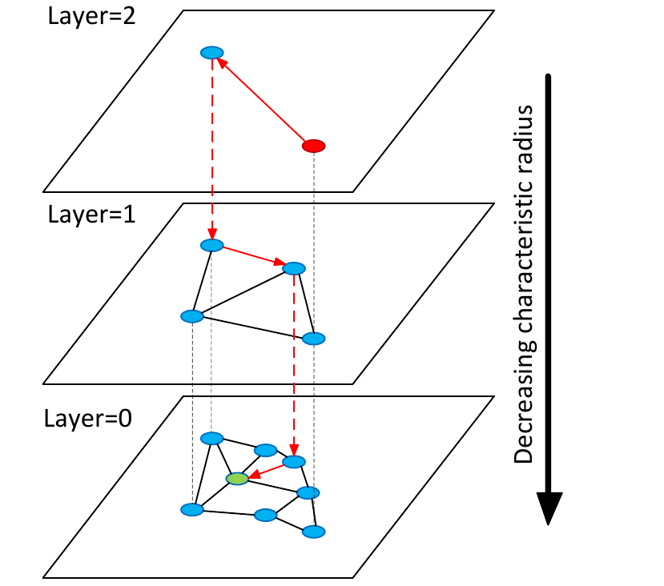

**图 1：Hierarchical NSW 思想示意图。搜索从最上层的一个元素（红色）开始。红色箭头表示贪心算法从入口点朝查询（绿色）的方向。**

形成这种分层结构的一种方式，是引入层并显式设置不同长度尺度的连接。对每个元素选择一个整数层级 l，它定义该元素所属的最高层。对某层中的所有元素，增量构建一个邻近图，即只包含近似 Delaunay 图的“短”连接的图。如果把 l 的概率设为指数衰减（即服从几何分布），结构的期望层数就会按对数规律扩展。搜索过程是从顶层开始、在第 0 层结束的迭代贪心搜索。

如果合并所有层的连接，得到的结构将与 NSW 图相似；此时 l 可以对应 NSW 中的节点度。与 NSW 不同，Hierarchical NSW 构建算法不要求在插入前打乱元素顺序：随机性由层级随机化提供。因此，即使数据分布随时间临时变化，也能进行真正的增量索引；不过，由于构建过程只是部分确定性的，改变插入顺序仍会轻微改变性能。

Hierarchical NSW 的思想也与著名的一维概率跳表结构 [27] 非常相似，可以用跳表术语描述。与跳表的主要区别在于：我们用邻近图替代链表，从而推广了这种结构。因此，Hierarchical NSW 也可以采用同样的方法构建分布式近似搜索或覆盖网络结构 [45]。

插入元素时选择邻近图连接，我们采用一种考虑候选元素彼此距离的启发式方法，以建立方向多样的连接，而不是仅选择最近邻。空间近似树 [4] 中也使用过类似算法来选择子节点。该启发式方法从相对于插入元素最近的候选开始检查；只有当某个候选到基元素（即插入元素）的距离，小于它到任何已连接候选的距离时，才与该候选建立连接，细节见第 4 节。

当候选足够多时，这种启发式方法可以把精确相对邻域图 [46] 纳入为子图。相对邻域图是 Delaunay 图中仅凭节点间距离即可推导出的最小子图，即使数据高度聚类，也容易维持全局连通分量，如图 2 所示。请注意，该启发式方法会比精确相对邻域图创建更多边，从而可以控制连接数量，而这对搜索性能很重要。对于一维数据，只使用元素间距离信息，该启发式方法就能得到精确 Delaunay 子图；此时它与相对邻域图重合，从而可从 Hierarchical NSW 直接过渡到一维概率跳表算法。

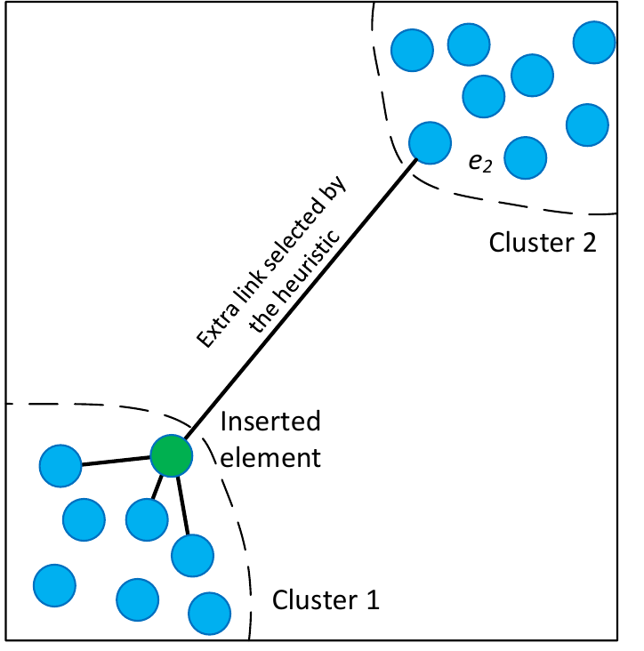

**图 2：两个孤立簇上图邻居选择启发式方法的示意图。一个新元素插入在簇 1 的边界。该元素所有最近邻都属于簇 1，因此会漏掉簇间 Delaunay 图的边。启发式方法却会选择簇 2 中的元素 e2；只要与簇 1 中任何其他元素相比，插入元素是距离 e2 最近的元素，就能维持全局连通性。**

Hierarchical NSW 邻近图的基础变体也用于文献 [18] 的邻近图搜索，该文称其为“稀疏邻域图”。FANNG 算法 [47] 也重点研究了类似启发式方法；该文发表于本稿早期版本上线后不久，采用了略有不同的解释，即依据稀疏邻域图的精确路由性质 [18]。

## 4. 算法描述

网络构建算法（算法 1）通过把存储元素逐个插入图结构来组织。对每个插入元素，按照指数衰减概率分布随机选择一个整数最高层 l；该分布由参数 mL 归一化，见算法 1 第 4 行。

插入过程的第一阶段从顶层开始，以贪心方式遍历图，寻找该层中距离插入元素 q 最近的 ef 个邻居。随后，算法从下一层继续搜索，并以上一层找到的最近邻作为入口点，重复这一过程。每层最近邻由算法 2 描述的贪心搜索变体寻找，该算法是文献 [26] 中算法的更新版本。为在某层 lc 中获得近似的 ef 个最近邻，搜索期间维护一个动态列表 W，其中保存已找到的 ef 个最近元素，初始内容为入口点。每一步都评估列表中此前尚未评估、距离最近的元素的邻域，并更新列表，直到列表中每个元素的邻域都得到评估。

与限制距离计算次数相比，Hierarchical NSW 的停止条件具有一项优势：它可以丢弃比列表中最远元素更远的候选，避免搜索结构膨胀。与 NSW 一样，为提高性能，列表由两个优先队列模拟。它与 NSW 的差异（以及若干队列优化）包括：1）入口点是固定参数；2）搜索质量由另一个参数 ef 控制，而不是改变多次搜索的次数；在 NSW [26] 中 ef 设为 K。

**算法 1：`INSERT(hnsw, q, M, Mmax, efConstruction, mL)`**

```text
输入：多层图 hnsw；新元素 q；建立的连接数 M；每层每个元素的最大连接数 Mmax；
      动态候选列表大小 efConstruction；层级生成归一化因子 mL
输出：插入元素 q 后更新 hnsw

1  W ← ∅                         // 当前已找到最近元素的列表
2  ep ← 获取 hnsw 的入口点
3  L ← ep 的层级                 // hnsw 的顶层
4  l ← ⌊-ln(unif(0..1)) · mL⌋       // 新元素的层级
5  for lc ← L ... l+1 do
6      W ← SEARCH-LAYER(q, ep, ef=1, lc)
7      ep ← W 中距离 q 最近的元素
8  for lc ← min(L, l) ... 0 do
9      W ← SEARCH-LAYER(q, ep, efConstruction, lc)
10     neighbors ← SELECT-NEIGHBORS(q, W, M, lc)  // 算法 3 或算法 4
11     在层 lc 上从 neighbors 到 q 添加双向连接
12     for each e ∈ neighbors do                  // 必要时收缩连接
13         eConn ← e 在层 lc 上的邻域
14         if |eConn| > Mmax then                 // 收缩 e 的连接
               // 若 lc = 0，则 Mmax = Mmax0
15             eNewConn ← SELECT-NEIGHBORS(e, eConn, Mmax, lc)
               // 算法 3 或算法 4
16             把 e 在层 lc 上的邻域设为 eNewConn
17     ep ← W
18 if l > L then
19     把 hnsw 的入口点设为 q
```

**算法 2：`SEARCH-LAYER(q, ep, ef, lc)`**

```text
输入：查询元素 q；入口点 ep；要返回的 q 的最近元素数 ef；层号 lc
输出：距离 q 最近的 ef 个邻居

1  v ← ep                         // 已访问元素集合
2  C ← ep                         // 候选集合
3  W ← ep                         // 已找到最近邻的动态列表
4  while |C| > 0 do
5      c ← 从 C 中取出距离 q 最近的元素
6      f ← W 中距离 q 最远的元素
7      if distance(c, q) > distance(f, q) then
8          break                  // W 中所有元素都已评估
9      for each e ∈ c 在层 lc 上的邻域 do   // 更新 C 和 W
10         if e ∉ v then
11             v ← v ∪ {e}
12             f ← W 中距离 q 最远的元素
13             if distance(e, q) < distance(f, q) or |W| < ef then
14                 C ← C ∪ {e}
15                 W ← W ∪ {e}
16                 if |W| > ef then
17                     从 W 中删除距离 q 最远的元素
18 return W
```

搜索第一阶段把 ef 设为 1，即执行简单贪心搜索，以免引入额外参数。

当搜索到达小于或等于 l 的层时，构建算法进入第二阶段。第二阶段有两点不同：1）ef 从 1 增大到 efConstruction，以控制贪心搜索过程的召回率；2）每层找到的最近邻还会作为插入元素连接的候选。

我们考虑了两种从候选中选择 M 个邻居的方法：简单连接到最近元素（算法 3），以及考虑候选元素间距离、从而建立方向多样连接的启发式方法（算法 4），后者已在第 3 节说明。启发式方法还有两个参数：`extendCandidates`（默认为 false），用于扩展候选集合，只对极度聚类数据有用；`keepPrunedConnections`，用于使每个元素获得固定数量的连接。零层以上每层中元素的最大连接数由参数 Mmax 定义；底层则单独使用 Mmax0。如果建立新连接时某个节点已满，就用邻居选择所使用的同一算法（算法 3 或 4）收缩扩展后的连接列表。

**算法 3：`SELECT-NEIGHBORS-SIMPLE(q, C, M)`**

```text
输入：基元素 q；候选元素 C；要返回的邻居数 M
输出：距离 q 最近的 M 个元素

返回 C 中距离 q 最近的 M 个元素
```

**算法 4：`SELECT-NEIGHBORS-HEURISTIC(q, C, M, lc, extendCandidates, keepPrunedConnections)`**

```text
输入：基元素 q；候选元素 C；要返回的邻居数 M；层号 lc；
      是否扩展候选列表的标志 extendCandidates；
      是否加入被丢弃元素的标志 keepPrunedConnections
输出：启发式方法选择的 M 个元素

1  R ← ∅
2  W ← C                         // 候选工作队列
3  if extendCandidates then      // 用候选的邻居扩展候选
4      for each e ∈ C do
5          for each eadj ∈ e 在层 lc 上的邻域 do
6              if eadj ∉ W then
7                  W ← W ∪ {eadj}
8  Wd ← ∅                        // 被丢弃候选的队列
9  while |W| > 0 and |R| < M do
10     e ← 从 W 中取出距离 q 最近的元素
11     if 对每个 r ∈ R 都有 distance(e, q) < distance(e, r) then
12         R ← R ∪ {e}
13     else
14         Wd ← Wd ∪ {e}
15 if keepPrunedConnections then // 从 Wd 加入部分被丢弃连接
16     while |Wd| > 0 and |R| < M do
17         R ← R ∪ {从 Wd 中取出的距离 q 最近的元素}
18 return R
```

插入过程在新元素于第 0 层上的连接全部建立后终止。

Hierarchical NSW 使用的 K-ANNS 搜索算法见算法 5。它大致等价于插入一个层级 l=0 的元素。区别在于：底层找到的最近邻不再用作建立连接的候选，而是作为搜索结果返回。搜索质量由 ef 参数控制，对应构建算法中的 efConstruction。

**算法 5：`K-NN-SEARCH(hnsw, q, K, ef)`**

```text
输入：多层图 hnsw；查询元素 q；要返回的最近邻数 K；动态候选列表大小 ef
输出：距离 q 最近的 K 个元素

1  W ← ∅                         // 当前最近元素集合
2  ep ← 获取 hnsw 的入口点
3  L ← ep 的层级                 // hnsw 的顶层
4  for lc ← L ... 1 do
5      W ← SEARCH-LAYER(q, ep, ef=1, lc)
6      ep ← W 中距离 q 最近的元素
7  W ← SEARCH-LAYER(q, ep, ef, lc=0)
8  return W 中距离 q 最近的 K 个元素
```

### 4.1 构建参数的影响

算法构建参数 mL 和 Mmax0 负责维持所构建图的小世界可导航性。把 mL 设为 0（对应图中只有一层），并把 Mmax0 设为 M，将生成此前充分研究过的、有向 k-NN 图；如果采用算法 3 选择邻居，其搜索复杂度呈幂律扩展 [21, 29]。把 mL 设为 0、把 Mmax0 设为无穷大，将生成具有多对数复杂度的 NSW 图 [25, 26]。最后，把 mL 设为某个非零值，会形成通过引入层而获得对数搜索复杂度的可控层次图，见第 3 节。

为充分发挥可控层次结构的性能优势，不同层邻居之间的重叠，即某元素同时也属于其他层的邻居比例，应当较小。要减少重叠，需要减小 mL；但与此同时，减小 mL 会增加每层贪心搜索的平均跳数，从而损害性能。因此，mL 参数存在最优值。

mL 最优值的一个简单选择是 `1/ln(M)`，它对应跳表参数 `p=1/M`，层与层之间平均重叠一个元素。在 Intel Core i7 5930K CPU 上进行的模拟表明，这种 mL 选择是合理的，图 3 给出了 1000 万个随机四维向量上的数据。此外，该图还显示，在低维数据上把 mL 从 0 增大会带来巨大加速，并展示了采用图连接选择启发式方法的效果。

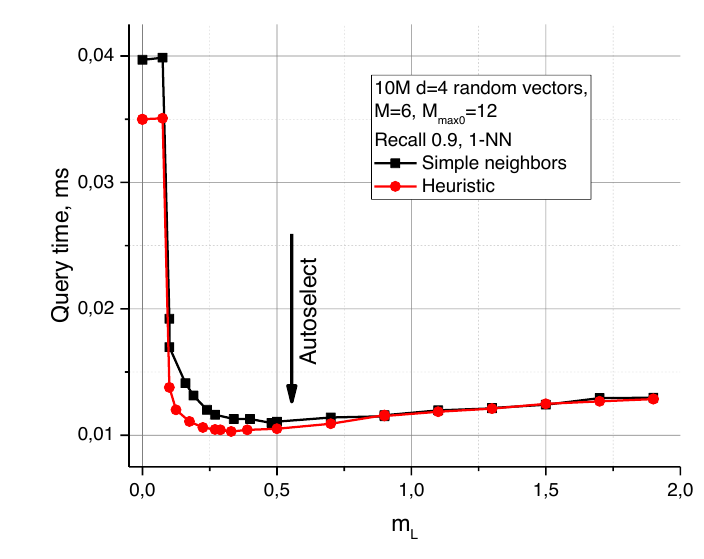

**图 3：1000 万个四维随机向量上，查询时间随 mL 参数变化的曲线。箭头标出自动选择的 mL 值 1/ln(M)。**

很难预期高维数据上会出现相同行为，因为此时 k-NN 图中的贪心算法路径已经很短 [28]。令人意外的是，在极高维数据上把 mL 从 0 增大仍会带来可测量的加速（10 万个 1024 维稠密随机向量，见图 4），而且不会给 Hierarchical NSW 方法带来任何损失。

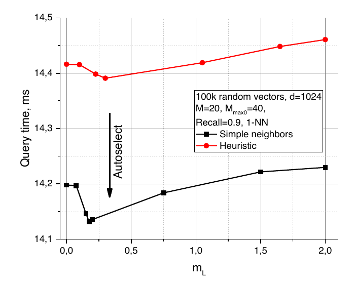

**图 4：10 万个 1024 维随机向量上，查询时间随 mL 参数变化的曲线。箭头标出自动选择的 mL 值 1/ln(M)。**

对于 SIFT 向量 [1] 这类具有复杂混合结构的真实数据，增大 mL 带来的性能提升更大；但在当前设置下，它没有启发式方法带来的提升明显。图 5 给出了 BIGANN [13] 学习集中 500 万个 128 维 SIFT 向量上的 1-NN 搜索性能。

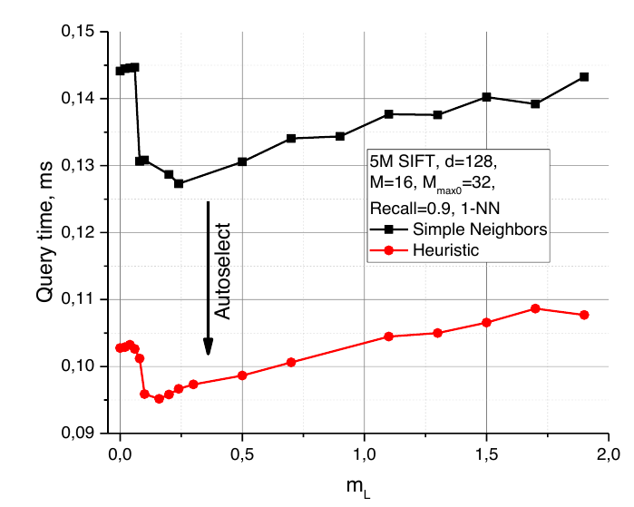

**图 5：500 万条 SIFT 学习数据上，查询时间随 mL 参数变化的曲线。箭头标出自动选择的 mL 值 1/ln(M)。**

Mmax0，即元素在第 0 层可以拥有的最大连接数，也会强烈影响搜索性能，尤其是在高质量（高召回率）搜索中。模拟表明，把 Mmax0 设为 M，会在高召回率下造成非常严重的性能损失；如果不使用邻居选择启发式方法，这一设置对应每层都是 k-NN 图。模拟还表明，`2·M` 是 Mmax0 的良好选择；继续增大该参数会导致性能下降和过多内存使用。图 6 给出了 500 万条 SIFT 学习数据上的搜索性能随 Mmax0 参数变化的结果，测试运行于 Intel Core i5 2400 CPU。建议值在不同召回率下都能获得接近最优的性能。

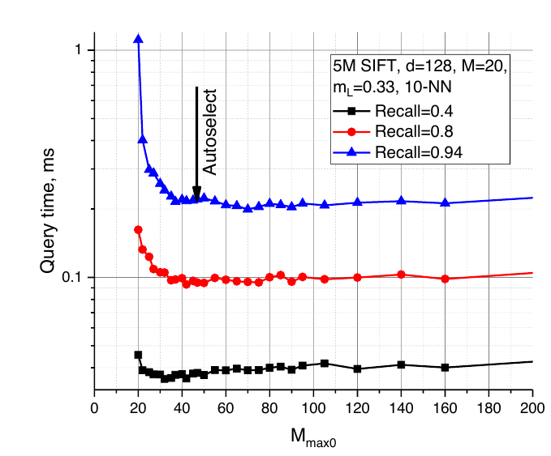

**图 6：500 万条 SIFT 学习数据上，查询时间随 Mmax0 参数变化的曲线。箭头标出自动选择的 Mmax0 值 2·M。**

在所有考察场景中，使用邻近图邻居选择启发式方法（算法 4），都能获得高于或相当于朴素最近邻连接（算法 3）的搜索性能。其效果在低维数据、中维数据的高召回率区间和高度聚类数据上最明显；从思想上看，不连续性可以视为局部低维特征。图 7 给出了 Intel Core i5 2400 CPU 上的比较。把最近邻直接作为邻近图连接时，Hierarchical NSW 在聚类数据上无法取得高召回率，因为搜索会卡在簇边界。相反，使用启发式方法并扩展候选（算法 4 第 3 行）时，聚类甚至会带来更高性能。对于均匀且维度极高的数据，两种邻居选择方法差异很小（见图 4），可能是因为启发式方法在这种情况下会选择几乎所有最近邻。

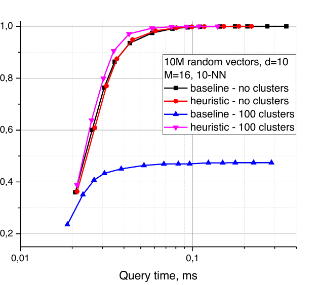

**图 7：邻居选择方法对聚类数据（100 个随机孤立簇）和非聚类十维随机向量数据的影响。基线对应算法 3，启发式方法对应算法 4。**

留给用户的唯一有实际意义的构建参数是 M，其合理范围为 5 到 48。模拟表明，较小 M 通常更适合较低召回率和/或较低维数据，较大 M 则更适合高召回率和/或高维数据，见图 8，测试使用 Intel Core i5 2400 CPU。该参数还决定算法的内存消耗，后者正比于 M，因此应谨慎选择。

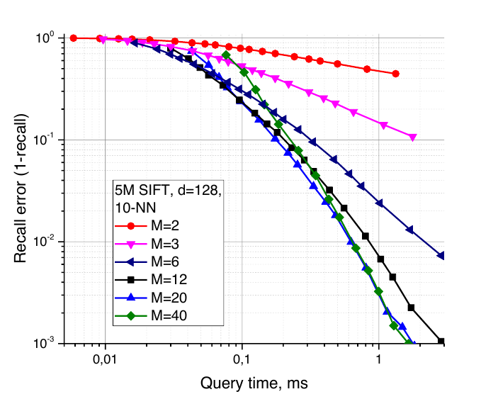

**图 8：500 万条 SIFT 学习数据上，Hierarchical NSW 采用不同 M 参数时召回误差与查询时间的曲线。**

efConstruction 参数的选择很直接。正如文献 [26] 所建议的，它应当足够大，使构建过程中的 K-ANNS 召回率接近 1；对多数用例而言，0.95 已经足够。与文献 [26] 相同，该参数可能可以使用样本数据自动配置。

构建过程可以轻松、高效地并行化，只需要少量同步点（见图 9），并且不会对索引质量造成可测量的影响。

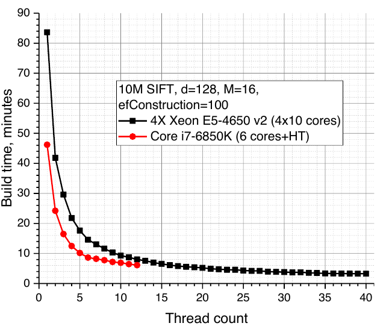

**图 9：在两种 CPU 上，Hierarchical NSW 对 1000 万条 SIFT 数据采用不同线程数时的构建时间。**

构建速度与索引质量之间的权衡由 efConstruction 参数控制。图 10 给出了 1000 万条 SIFT 数据上搜索时间与索引构建时间之间的权衡：在配备 4 路 2.4 GHz、每路 10 核 Xeon E5-4650 v2 CPU 的服务器上，efConstruction=100 时仅需 3 分钟即可构建质量合理的索引。继续增大 efConstruction 只能带来很少的额外性能，却要付出显著更长的构建时间。

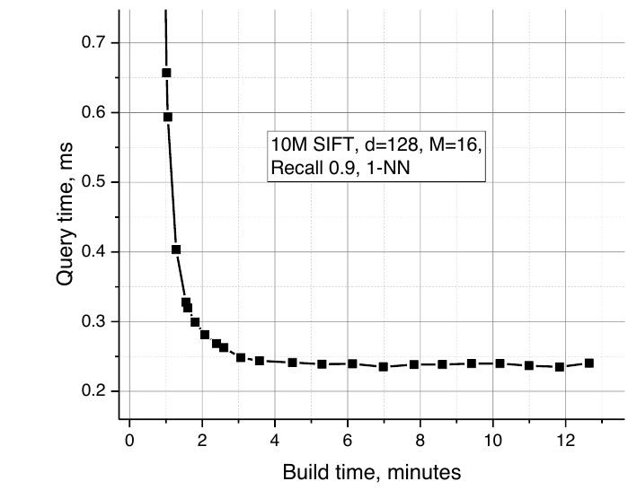

**图 10：Hierarchical NSW 在 1000 万条 SIFT 数据上查询时间与构建时间权衡的曲线。**

### 4.2 复杂度分析

#### 4.2.1 搜索复杂度

如果假设构建的是精确 Delaunay 图而非近似图，就可以严格分析单次搜索的复杂度扩展。假设已经在某一层找到最近元素（Delaunay 图保证这一点），然后下降到下一层。可以证明，在该层找到最近元素之前，平均步数受常数限制。

事实上，各层与数据元素的空间位置不相关。因此，在遍历图时，下一个节点属于上一层的概率固定为 `p=exp(-mL)`。然而，本层搜索总会在到达属于上一层的元素之前终止，否则上一层搜索就会停在另一个元素上。因此，在第 s 步仍未到达目标的概率上界为 `exp(-s·mL)`。于是，一层中的期望步数受几何级数之和 `S=1/(1-exp(-mL))` 限制，与数据集大小无关。

如果假设在大数据集极限下，Delaunay 图中节点的平均度被常数 C 限制（随机欧氏数据满足这一条件 [48]，但某些特殊空间原则上可能违反），那么一层中总的平均距离评估次数受常数 `C·S` 限制，同样与数据集大小无关。

由于构建所得最大层索引的期望按 `O(log(N))` 扩展，总体复杂度也按 `O(log(N))` 扩展，这与低维数据集上的模拟结果一致。

Hierarchical NSW 实际并不满足精确 Delaunay 图这一初始假设，因为它采用近似边选择启发式方法，并固定每个元素的邻居数。因此，为避免陷入局部极小值，贪心搜索算法会在第 0 层执行回溯。模拟表明，至少对低维数据（图 11 中 d=4）而言，随着数据集规模增大，为获得固定召回率所需的 ef 参数会趋于饱和；ef 通过回溯过程中的最少跳数决定复杂度。回溯复杂度是最终复杂度的加法项，因此根据经验数据，Delaunay 图近似的不精确性不会改变扩展规律。

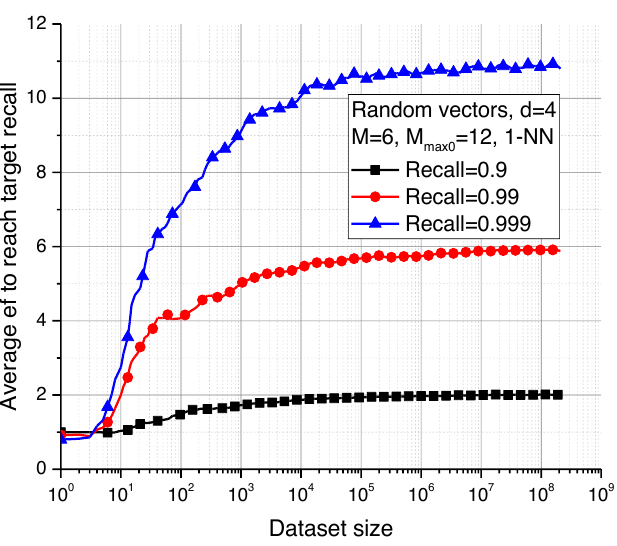

**图 11：四维随机向量数据上，为获得固定准确率所需 ef 参数随数据集规模变化的曲线。**

对 Delaunay 图近似鲁棒性进行这种经验研究，需要 Delaunay 图的平均边数与数据集规模无关，才能说明 Hierarchical NSW 用固定连接数对这些边的近似程度。然而，Delaunay 图的平均度随维度指数增长 [39]，因此对高维数据（例如 d=128）而言，上述条件要求极其庞大的数据集，使这种经验研究不可行。还需要进一步的分析证据，才能确认 Delaunay 图近似的鲁棒性是否可以推广到更高维空间。

#### 4.2.2 构建复杂度

构建通过迭代插入所有元素完成。插入一个元素只是在不同层执行一系列 K-ANN 搜索，随后使用启发式方法；当 efConstruction 固定时，该启发式方法的复杂度固定。一个元素所加入的平均层数是依赖 mL 的常数：

\[
\mathbb{E}[l+1]
= \mathbb{E}[-\ln(\operatorname{unif}(0,1))\cdot m_L] + 1
= m_L + 1
\tag{1}
\]

因此，插入复杂度的扩展规律与搜索相同；这意味着至少对相对低维的数据集，构建时间按 `O(N·log(N))` 扩展。

#### 4.2.3 内存开销

Hierarchical NSW 的内存消耗主要由图连接存储决定。每个元素在第 0 层有 Mmax0 条连接，在其他所有层有 Mmax 条连接。因此，每个元素的平均内存消耗为 `(Mmax0 + mL·Mmax)·bytes_per_link`。如果把元素总数上限限制为约 40 亿，就可以使用四字节无符号整数存储连接。测试表明，接近最优的典型 M 值通常在 6 到 48 之间。这意味着索引的典型内存需求（不含数据本身大小）约为每个对象 60-450 字节，与模拟结果非常一致。

## 5. 性能评估

Hierarchical NSW 算法以 C++ 实现于 Non Metric Space Library（nmslib）[49][^1] 之上；该库已经提供了一个可用的 NSW 实现，名为“sw-graph”。由于库本身存在若干限制，为获得更好性能，Hierarchical NSW 实现采用自定义距离函数和 C 风格内存管理，从而避免不必要的隐式寻址，并允许在图遍历期间高效进行硬件与软件预取。

比较 K-ANNS 算法的性能并非易事，因为随着新算法和新实现不断出现，先进水平也在持续变化。我们集中比较欧氏空间中具有开源实现的最佳算法。我们给出的 Hierarchical NSW 算法实现也作为开源 nmslib 库的一部分发布[^1]，同时还提供了支持增量索引构建、内存高效的外部 C++ 纯头文件版本[^2]。

比较分为四部分：与基线 NSW 比较（第 5.1 节）；与欧氏空间中的先进算法比较（第 5.2 节）；在基线 NSW 表现失败的一般度量空间上，重新运行文献 [34] 的部分测试（第 5.3 节）；以及在大型 2 亿 SIFT 数据集上与先进 PQ 算法比较（第 5.4 节）。

### 5.1 与基线 NSW 比较

基线 NSW 的实现采用 nmslib 1.1 中的“sw-graph”。与文献 [33, 34] 测试的实现相比，它略有更新。我们用它展示速度和算法复杂度（以距离计算次数衡量）的改进。

图 12(a) 比较了 Hierarchical NSW 与基本 NSW 算法在四维随机超立方体数据上的表现，测试运行于 Core i5 2400 CPU，执行 10-NN 搜索。Hierarchical NSW 搜索该数据集时使用的距离计算次数少得多，在高召回率下尤其如此。

图 12(b) 给出了两种算法在八维随机超立方体数据集上的扩展情况，搜索为召回率固定在 0.95 的 10-NN 搜索。结果清楚表明，在该设置下，Hierarchical NSW 的复杂度扩展不差于对数规律，并且在任意数据集规模上都优于 NSW。由于算法实现也得到改进，其绝对时间优势（图 12(c)）甚至更大。

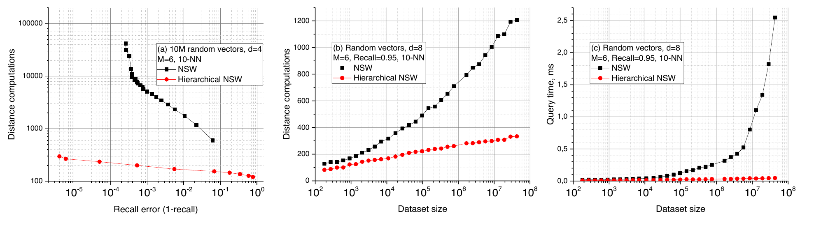

**图 12：NSW 与 Hierarchical NSW 的比较：（a）1000 万个四维随机向量数据集上，距离计算次数与准确率之间的权衡；（b-c）八维随机向量数据集上，距离计算次数（b）和原始查询时间（c）的性能扩展。**

### 5.2 欧氏空间中的比较

比较的主体在向量数据集上进行，以流行的 K-ANNS 基准 ann-benchmark[^3] 作为测试平台。测试系统使用各算法的 Python 绑定：它使用预设算法参数，对从初始数据集中随机抽取的 1000 个查询依次执行 K-ANN 搜索，输出召回率和单次搜索平均时间。所考察算法如下：

1. nmslib 1.1 中的基线 NSW 算法“sw-graph”。
2. FLANN 1.8.4 [6]。这是一个内含多种算法并集成于 OpenCV 的流行库[^4][^5]。我们多次运行其自动调优过程，以推断最佳参数。
3. Annoy[^6]，2016-02-02 构建版。一种基于随机投影树森林的流行算法。
4. VP-tree。一种带度量剪枝的一般度量空间算法 [50]，作为 nmslib 1.1 的一部分实现。
5. FALCONN[^7] 1.2 版。一种面向余弦相似性数据的新型高效 LSH 算法 [51]。

比较在配备 128 GB 内存、运行 Debian OS 的 4 路 Xeon E5-4650 v2 系统上进行。对每种算法，我们都在每个召回率区间谨慎选择最佳结果，以评估可能达到的最佳性能；初始值采用测试平台默认设置。所有测试均以单线程运行。Hierarchical NSW 使用 GCC 5.3 编译，并启用 `-Ofast` 优化标志。

使用的数据集参数和说明见表 1。除 GloVe 外，所有数据集都使用 L2 距离；GloVe 使用余弦相似度，向量归一化后它与 L2 等价。暴力搜索（BF）时间由 nmslib 库测得。

**表 1：向量空间基准所用数据集的参数。**

| 数据集 | 说明 | 规模 | d | BF 时间 | 空间 |
| --- | --- | ---: | ---: | ---: | --- |
| SIFT | 图像特征向量 [13] | 1M | 128 | 94 ms | L2 |
| GloVe | 在推文上训练的词嵌入 [52] | 1.2M | 100 | 95 ms | 余弦 |
| CoPhIR | 从图像提取的 MPEG-7 特征 [53] | 2M | 272 | 370 ms | L2 |
| 随机向量 | 超立方体中的随机向量 | 30M | 4 | 590 ms | L2 |
| DEEP | 十亿规模深度图像特征数据集的 100 万条子集 [14] | 1M | 96 | 60 ms | L2 |
| MNIST | 手写数字图像 [54] | 60k | 784 | 22 ms | L2 |

向量数据的结果见图 13。在 SIFT、GloVe、DEEP 和 CoPhIR 数据集上，Hierarchical NSW 明显大幅领先其他算法。对于低维数据（d=4），Hierarchical NSW 在高召回率下略快于 Annoy，同时显著优于其他算法。

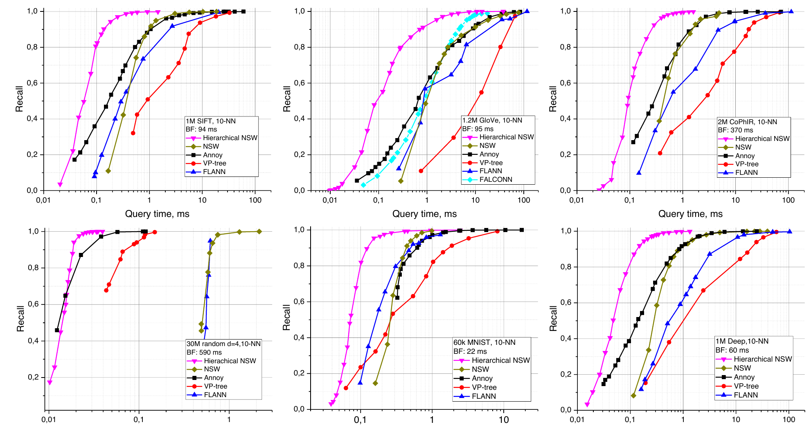

**图 13：在五个数据集上执行 10-NN 搜索时，Hierarchical NSW 与 K-ANNS 算法开源实现的比较结果。BF 表示暴力搜索时间。**

### 5.3 一般空间中的比较

近期一项面向一般空间（即距离不对称或违反三角不等式）的算法比较 [34] 表明，基线 NSW 算法在低维数据集上存在严重问题。为测试 Hierarchical NSW 的性能，我们重新运行了文献 [34] 中 NSW 表现差或次优的部分测试。为此，使用 nmslib 内置测试系统，其中包含运行文献 [34] 测试的脚本。所评估算法包括 VP-tree、置换技术（NAPP 和暴力过滤）[49, 55-57]、基本 NSW 算法和由 NNDescent 生成的邻近图 [29]；后两者均与 NSW 图搜索算法搭配。与原测试一样，每个数据集根据哪种结构表现更好，只包含 NSW 或 NNDescent 的结果。在本项测试中，Hierarchical NSW 没有使用自定义距离函数或特殊内存管理，因此有一定性能损失。

数据集汇总见表 2。关于数据集、空间和算法参数选择的更多细节见原工作 [34]。暴力搜索（BF）时间由 nmslib 库测得。

**表 2：复现非度量数据测试子集所用的数据集。**

| 数据集 | 说明 | 规模 | d | BF 时间 | 距离 |
| --- | --- | ---: | ---: | ---: | --- |
| Wiki-sparse | TF-IDF（词频-逆文档频率）向量，使用 GENSIM [58] 创建 | 4M | 10^5 | 5.9 s | 稀疏余弦 |
| Wiki-8 | 从 Wiki-sparse 数据集的稀疏 TF-IDF 向量生成的主题直方图，使用 GENSIM [58] 创建 | 2M | 8 | - | Jensen-Shannon（JS）散度 |
| Wiki-128 | 从 Wiki-sparse 数据集的稀疏 TF-IDF 向量生成的主题直方图，使用 GENSIM [58] 创建 | 2M | 128 | 1.17 s | Jensen-Shannon（JS）散度 |
| ImageNet | 从 LSVRC-2014 提取的签名，使用 SQFD（signature quadratic form distance）[59] | 1M | 272 | 18.3 s | SQFD |
| DNA | 从人类基因组 5 采样的 DNA（脱氧核糖核酸）数据集 [34] | 1M | - | 2.4 s | Levenshtein |

结果见图 14。Hierarchical NSW 显著改善了 NSW 的性能，并且在所有测试数据集上都居首。相对于 NSW，最强提升出现在维度最低的 Wiki-8（JS 散度）数据集上，幅度接近三个数量级。这是一项重要结果，表明 Hierarchical NSW 很鲁棒，因为该数据集曾是原始 NSW 的难题。请注意，为消除实现影响，Wiki-8 的结果以距离计算次数而非 CPU 时间给出。

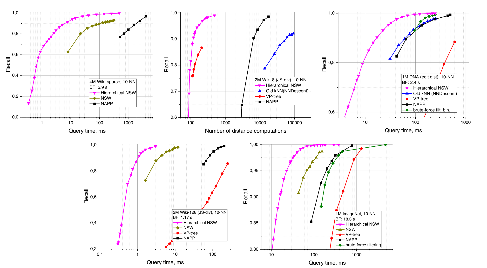

**图 14：在五个数据集上执行 10-NN 搜索时，Hierarchical NSW 与 Non Metric Space Library 中一般空间 K-ANNS 算法的比较结果。BF 表示暴力搜索时间。**

### 5.4 与基于乘积量化的算法比较

基于乘积量化的 K-ANNS 算法 [10-17] 被认为是十亿规模数据集上的先进方法，因为它们可以高效压缩存储数据，以适中的内存用量在现代 CPU 上实现毫秒级搜索时间。

为比较 Hierarchical NSW 与 PQ 算法的性能，我们采用 Facebook Faiss 库[^8] 作为基线。该库包含先进 PQ 算法 [12, 15] 的实现，在本稿提交后发布；编译时使用 OpenBLAS 后端。测试在 1B SIFT 数据集 [13] 的 2 亿条子集上进行，硬件为配备 128 GB 内存的 4 路 Xeon E5-4650 v2 服务器。ann-benchmark 测试平台依赖 32 位浮点格式，仅存储数据就需要超过 100 GB，因此不适用于这些实验。为获得 Faiss PQ 算法的结果，我们使用其内置脚本和 Faiss wiki[^9] 中的参数。Hierarchical NSW 则采用 nmslib 之外的一个特殊构建版本，该版本内存占用小，使用简单的非向量化整数距离函数，并支持增量索引构建[^10]。

结果见图 15，参数汇总于表 3。两种算法的峰值内存消耗均在索引构建后的独立测试运行中使用 Linux `time -v` 工具测量。尽管 Hierarchical NSW 需要明显更多内存，它能够达到高得多的准确率，同时显著提升搜索速度，并且索引构建快得多。

**表 3：Hierarchical NSW 与 Faiss 在 1B SIFT 的 2 亿条子集上的比较参数。**

| 算法 | 构建时间 | 峰值内存（运行时） | 参数 |
| --- | ---: | ---: | --- |
| Hierarchical NSW | 5.6 小时 | 64 GB | M=16, efConstruction=500（1） |
| Hierarchical NSW | 42 分钟 | 64 GB | M=16, efConstruction=40（2） |
| Faiss | 12 小时 | 30 GB | OPQ64, IMI2x14, PQ64（1） |
| Faiss | 11 小时 | 23.5 GB | OPQ32, IMI2x14, PQ32（2） |

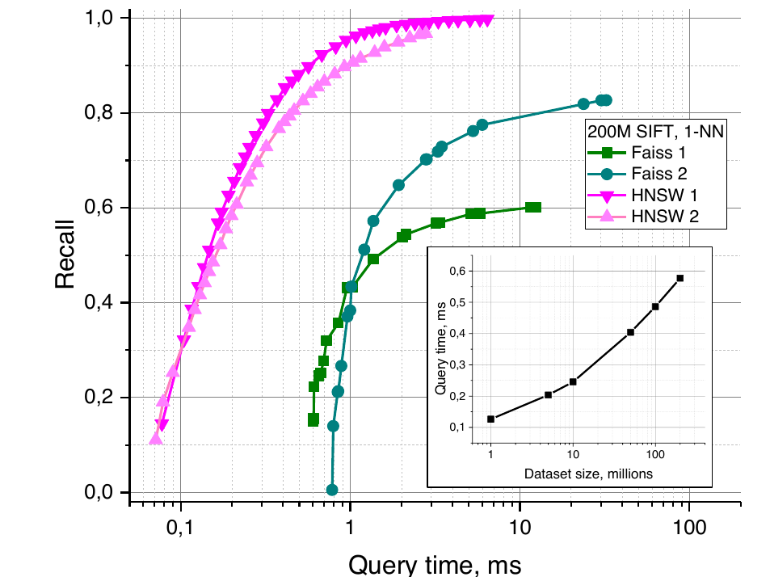

**图 15：在文献 [13] 的 2 亿条 SIFT 数据集上与 Faiss 库比较的结果。插图显示 Hierarchical NSW 查询时间随数据集规模的扩展情况。**

图 15 中的插图给出了 Hierarchical NSW 查询时间随数据集规模的扩展。请注意，该扩展偏离纯对数规律，可能是因为数据集维度较高。

[^1]: <https://github.com/searchivarius/nmslib>
[^2]: <https://github.com/nmslib/hnsw>
[^3]: <https://github.com/erikbern/ann-benchmarks>
[^4]: <https://github.com/mariusmuja/flann>
[^5]: <https://github.com/opencv/opencv>
[^6]: <https://github.com/spotify/annoy>
[^7]: <https://github.com/FALCONN-LIB/FALCONN>
[^8]: <https://github.com/facebookresearch/faiss>，2017 年 5 月构建版。自 2018 年起，Faiss 库也拥有自己的 Hierarchical NSW 实现。
[^9]: <https://github.com/facebookresearch/faiss/wiki/Indexing-1G-vectors>
[^10]: <https://github.com/nmslib/hnsw>

## 6. 讨论

通过分解可导航小世界图的结构并结合智能邻居选择启发式方法，所提 Hierarchical NSW 克服了基本 NSW 结构的若干重要问题，推进了 K-ANN 搜索的先进水平。Hierarchical NSW 表现出色，在多种数据集上明显领先；对高维数据，它大幅超越开源竞争方案。即使在此前算法 NSW 慢几个数量级的数据集上，Hierarchical NSW 仍能取得最佳表现。Hierarchical NSW 支持持续增量索引，也可以高效获得 k-NN 图和相对邻域图的近似；这些图是索引构建的副产物。

该方法的鲁棒性是一项突出优点，使其对实际应用很有吸引力。算法适用于广义度量空间，并在本文测试的每个数据集上都表现最佳，因此不再需要为具体问题复杂地选择最佳算法。我们强调算法鲁棒性的重要性，因为数据可能具有复杂结构，在不同尺度上呈现不同的有效维度。例如，一个数据集可能由位于某条曲线上的点组成，而这条曲线随机填充一个高维立方体；数据在大尺度上是高维的，在小尺度上则是低维的。要在这种数据集上高效搜索，近似最近邻算法必须同时适用于高维和低维两种情形。

还有多种方法可以进一步提高 Hierarchical NSW 的效率和适用性。目前仍有一个会强烈影响索引构建的重要参数，即每层添加的连接数 M。该参数可能可以通过不同启发式方法 [4] 直接推断。未来还值得在完整 1B SIFT 和 1B DEEP 数据集 [10-14] 上比较 Hierarchical NSW，并加入元素更新和删除支持。

与基本 NSW 相比，所提方法一个明显缺点是失去了分布式搜索的能力。Hierarchical NSW 结构中的搜索总是从顶层开始，因此受上层元素拥塞影响，不能使用文献 [26] 所述的相同技术实现分布式结构。可以采用简单的替代方案，例如文献 [6] 研究的跨集群节点数据分区；但在这种情况下，系统总并行吞吐量不能随计算节点数量良好扩展。

不过，仍有其他已知方法可以把这种特定结构分布式化。Hierarchical NSW 在思想上与著名的一维精确搜索概率跳表结构非常相似，因此可以采用相同技术实现分布式结构 [45]。得益于对数扩展和理想情况下节点间均匀的负载，这甚至可能获得比基本 NSW 更好的分布式性能。

## 7. 致谢

感谢 Leonid Boytsov 提供许多有益讨论、协助集成 Non-Metric Space Library，并对本文稿提出意见。感谢 Seth Hoffert、Azat Davletshin 对文稿和算法提出建议，也感谢在 GitHub 仓库中为算法作出贡献的各位同仁。还要感谢 Valery Kalyagin 对本工作的支持。

本研究由俄罗斯基础研究基金会（RFBR）资助，研究项目编号为 16-31-60104 mol_а_dk。

## 8. 参考文献

[1] D. G. Lowe, "Distinctive image features from scale-invariant keypoints," International Journal of Computer Vision, vol. 60, no. 2, pp. 91-110, 2004.

[2] S. Deerwester, S. T. Dumais, T. K. Landauer, G. W. Furnas, and R. A. Harshman, "Indexing by Latent Semantic Analysis," J. Amer. Soc. Inform. Sci., vol. 41, pp. 391-407, 1990.

[3] P. N. Yianilos, "Data structures and algorithms for nearest neighbor search in general metric spaces," in SODA, 1993, vol. 93, no. 194, pp. 311-321.

[4] G. Navarro, "Searching in metric spaces by spatial approximation," The VLDB Journal, vol. 11, no. 1, pp. 28-46, 2002.

[5] E. S. Tellez, G. Ruiz, and E. Chavez, "Singleton indexes for nearest neighbor search," Information Systems, 2016.

[6] M. Muja and D. G. Lowe, "Scalable nearest neighbor algorithms for high dimensional data," Pattern Analysis and Machine Intelligence, IEEE Transactions on, vol. 36, no. 11, pp. 2227-2240, 2014.

[7] M. E. Houle and M. Nett, "Rank-based similarity search: Reducing the dimensional dependence," Pattern Analysis and Machine Intelligence, IEEE Transactions on, vol. 37, no. 1, pp. 136-150, 2015.

[8] A. Andoni, P. Indyk, T. Laarhoven, I. Razenshteyn, and L. Schmidt, "Practical and optimal LSH for angular distance," in Advances in Neural Information Processing Systems, 2015, pp. 1225-1233.

[9] P. Indyk and R. Motwani, "Approximate nearest neighbors: towards removing the curse of dimensionality," in Proceedings of the thirtieth annual ACM symposium on Theory of computing, 1998, pp. 604-613: ACM.

[10] J. Wang, J. Wang, G. Zeng, R. Gan, S. Li, and B. Guo, "Fast neighborhood graph search using cartesian concatenation," in Multimedia Data Mining and Analytics: Springer, 2015, pp. 397-417.

[11] M. Norouzi, A. Punjani, and D. J. Fleet, "Fast exact search in hamming space with multi-index hashing," Pattern Analysis and Machine Intelligence, IEEE Transactions on, vol. 36, no. 6, pp. 1107-1119, 2014.

[12] A. Babenko and V. Lempitsky, "The inverted multi-index," in Computer Vision and Pattern Recognition (CVPR), 2012 IEEE Conference on, 2012, pp. 3069-3076: IEEE.

[13] H. Jegou, M. Douze, and C. Schmid, "Product quantization for nearest neighbor search," Pattern Analysis and Machine Intelligence, IEEE Transactions on, vol. 33, no. 1, pp. 117-128, 2011.

[14] A. Babenko and V. Lempitsky, "Efficient indexing of billion-scale datasets of deep descriptors," in Proceedings of the IEEE Conference on Computer Vision and Pattern Recognition, 2016, pp. 2055-2063.

[15] M. Douze, H. Jégou, and F. Perronnin, "Polysemous codes," in European Conference on Computer Vision, 2016, pp. 785-801: Springer.

[16] Y. Kalantidis and Y. Avrithis, "Locally optimized product quantization for approximate nearest neighbor search," in Proceedings of the IEEE Conference on Computer Vision and Pattern Recognition, 2014, pp. 2321-2328.

[17] P. Wieschollek, O. Wang, A. Sorkine-Hornung, and H. Lensch, "Efficient large-scale approximate nearest neighbor search on the gpu," in Proceedings of the IEEE Conference on Computer Vision and Pattern Recognition, 2016, pp. 2027-2035.

[18] S. Arya and D. M. Mount, "Approximate Nearest Neighbor Queries in Fixed Dimensions," in SODA, 1993, vol. 93, pp. 271-280.

[19] J. Wang and S. Li, "Query-driven iterated neighborhood graph search for large scale indexing," in Proceedings of the 20th ACM international conference on Multimedia, 2012, pp. 179-188: ACM.

[20] Z. Jiang, L. Xie, X. Deng, W. Xu, and J. Wang, "Fast Nearest Neighbor Search in the Hamming Space," in MultiMedia Modeling, 2016, pp. 325-336: Springer.

[21] E. Chávez and E. S. Tellez, "Navigating k-nearest neighbor graphs to solve nearest neighbor searches," in Advances in Pattern Recognition: Springer, 2010, pp. 270-280.

[22] K. Aoyama, K. Saito, H. Sawada, and N. Ueda, "Fast approximate similarity search based on degree-reduced neighborhood graphs," in Proceedings of the 17th ACM SIGKDD international conference on Knowledge discovery and data mining, 2011, pp. 1055-1063: ACM.

[23] G. Ruiz, E. Chávez, M. Graff, and E. S. Téllez, "Finding Near Neighbors Through Local Search," in Similarity Search and Applications: Springer, 2015, pp. 103-109.

[24] R. Paredes, "Graphs for metric space searching," PhD thesis, University of Chile, Chile, 2008. Dept. of Computer Science Tech Report TR/DCC-2008-10. Available at <http://www.dcc.uchile.cl/~raparede/publ/08PhDthesis.pdf>, 2008.

[25] Y. Malkov, A. Ponomarenko, A. Logvinov, and V. Krylov, "Scalable distributed algorithm for approximate nearest neighbor search problem in high dimensional general metric spaces," in Similarity Search and Applications: Springer Berlin Heidelberg, 2012, pp. 132-147.

[26] Y. Malkov, A. Ponomarenko, A. Logvinov, and V. Krylov, "Approximate nearest neighbor algorithm based on navigable small world graphs," Information Systems, vol. 45, pp. 61-68, 2014.

[27] W. Pugh, "Skip lists: a probabilistic alternative to balanced trees," Communications of the ACM, vol. 33, no. 6, pp. 668-676, 1990.

[28] C. C. Cartozo and P. De Los Rios, "Extended navigability of small world networks: exact results and new insights," Physical Review Letters, vol. 102, no. 23, p. 238703, 2009.

[29] W. Dong, C. Moses, and K. Li, "Efficient k-nearest neighbor graph construction for generic similarity measures," in Proceedings of the 20th international conference on World wide web, 2011, pp. 577-586: ACM.

[30] A. Ponomarenko, Y. Malkov, A. Logvinov, and V. Krylov, "Approximate Nearest Neighbor Search Small World Approach," in International Conference on Information and Communication Technologies & Applications, Orlando, Florida, USA, 2011.

[31] J. M. Kleinberg, "Navigation in a small world," Nature, vol. 406, no. 6798, pp. 845-845, 2000.

[32] M. Boguna, D. Krioukov, and K. C. Claffy, "Navigability of complex networks," Nature Physics, vol. 5, no. 1, pp. 74-80, 2009.

[33] A. Ponomarenko, N. Avrelin, B. Naidan, and L. Boytsov, "Comparative Analysis of Data Structures for Approximate Nearest Neighbor Search," In Proceedings of The Third International Conference on Data Analytics, 2014.

[34] B. Naidan, L. Boytsov, and E. Nyberg, "Permutation search methods are efficient, yet faster search is possible," VLDB Procedings, vol. 8, no. 12, pp. 1618-1629, 2015.

[35] D. Krioukov, F. Papadopoulos, M. Kitsak, A. Vahdat, and M. Boguná, "Hyperbolic geometry of complex networks," Physical Review E, vol. 82, no. 3, p. 036106, 2010.

[36] A. Gulyás, J. J. Bíró, A. Kőrösi, G. Rétvári, and D. Krioukov, "Navigable networks as Nash equilibria of navigation games," Nature Communications, vol. 6, p. 7651, 2015.

[37] Y. Lifshits and S. Zhang, "Combinatorial algorithms for nearest neighbors, near-duplicates and small-world design," in Proceedings of the Twentieth Annual ACM-SIAM Symposium on Discrete Algorithms, 2009, pp. 318-326: Society for Industrial and Applied Mathematics.

[38] A. Karbasi, S. Ioannidis, and L. Massoulie, "From Small-World Networks to Comparison-Based Search," Information Theory, IEEE Transactions on, vol. 61, no. 6, pp. 3056-3074, 2015.

[39] O. Beaumont, A.-M. Kermarrec, and É. Rivière, "Peer to peer multidimensional overlays: Approximating complex structures," in Principles of Distributed Systems: Springer, 2007, pp. 315-328.

[40] O. Beaumont, A.-M. Kermarrec, L. Marchal, and É. Rivière, "VoroNet: A scalable object network based on Voronoi tessellations," in Parallel and Distributed Processing Symposium, 2007. IPDPS 2007. IEEE International, 2007, pp. 1-10: IEEE.

[41] J. Kleinberg, "The small-world phenomenon: An algorithmic perspective," in Proceedings of the thirty-second annual ACM symposium on Theory of computing, 2000, pp. 163-170: ACM.

[42] J. Travers and S. Milgram, "An experimental study of the small world problem," Sociometry, pp. 425-443, 1969.

[43] D. J. Watts and S. H. Strogatz, "Collective dynamics of ‘small-world’ networks," Nature, vol. 393, no. 6684, pp. 440-442, 1998.

[44] Y. A. Malkov and A. Ponomarenko, "Growing homophilic networks are natural navigable small worlds," PLoS ONE, p. e0158162, 2016.

[45] M. T. Goodrich, M. J. Nelson, and J. Z. Sun, "The rainbow skip graph: a fault-tolerant constant-degree distributed data structure," in Proceedings of the seventeenth annual ACM-SIAM symposium on Discrete algorithm, 2006, pp. 384-393: Society for Industrial and Applied Mathematics.

[46] G. T. Toussaint, "The relative neighbourhood graph of a finite planar set," Pattern Recognition, vol. 12, no. 4, pp. 261-268, 1980.

[47] B. Harwood and T. Drummond, "FANNG: fast approximate nearest neighbour graphs," in Proceedings of the IEEE Conference on Computer Vision and Pattern Recognition, 2016, pp. 5713-5722.

[48] R. A. Dwyer, "Higher-dimensional Voronoi diagrams in linear expected time," Discrete & Computational Geometry, vol. 6, no. 3, pp. 343-367, 1991.

[49] L. Boytsov and B. Naidan, "Engineering Efficient and Effective Non-metric Space Library," in Similarity Search and Applications: Springer, 2013, pp. 280-293.

[50] L. Boytsov and B. Naidan, "Learning to prune in metric and non-metric spaces," in Advances in Neural Information Processing Systems, 2013, pp. 1574-1582.

[51] A. Andoni and I. Razenshteyn, "Optimal Data-Dependent Hashing for Approximate Near Neighbors," presented at the Proceedings of the Forty-Seventh Annual ACM on Symposium on Theory of Computing, Portland, Oregon, USA, 2015.

[52] J. Pennington, R. Socher, and C. D. Manning, "Glove: Global vectors for word representation," Proceedings of the Empiricial Methods in Natural Language Processing (EMNLP 2014), vol. 12, pp. 1532-1543, 2014.

[53] P. Bolettieri et al., "CoPhIR: a test collection for content-based image retrieval," arXiv preprint arXiv:0905.4627, 2009.

[54] Y. LeCun, L. Bottou, Y. Bengio, and P. Haffner, "Gradient-based learning applied to document recognition," Proceedings of the IEEE, vol. 86, no. 11, pp. 2278-2324, 1998.

[55] E. Chávez, M. Graff, G. Navarro, and E. Téllez, "Near neighbor searching with K nearest references," Information Systems, vol. 51, pp. 43-61, 2015.

[56] E. C. Gonzalez, K. Figueroa, and G. Navarro, "Effective proximity retrieval by ordering permutations," Pattern Analysis and Machine Intelligence, IEEE Transactions on, vol. 30, no. 9, pp. 1647-1658, 2008.

[57] E. S. Tellez, E. Chávez, and G. Navarro, "Succinct nearest neighbor search," Information Systems, vol. 38, no. 7, pp. 1019-1030, 2013.

[58] P. Sojka, "Software framework for topic modelling with large corpora," in In Proceedings of the LREC 2010 Workshop on New Challenges for NLP Frameworks, 2010: Citeseer.

[59] C. Beecks, "Distance-based similarity models for content-based multimedia retrieval," Hochschulbibliothek der Rheinisch-Westfälischen Technischen Hochschule Aachen, 2013.

## 作者简介

**Yury A. Malkov** 于 2009 年获得 Nizhny Novgorod State University 物理学硕士学位，2015 年获得俄罗斯科学院应用物理研究所激光物理学博士学位。他在物理学和计算机科学领域发表了 20 余篇论文，现任 Samsung AI Center Moscow 项目负责人。其研究兴趣包括深度学习、可扩展相似性搜索、生物神经网络和人工神经网络。

**Dmitry A. Yashunin** 于 2009 年获得 Nizhny Novgorod State University 物理学硕士学位，2015 年获得俄罗斯科学院应用物理研究所激光物理学博士学位。2008 至 2012 年间，他就职于 Mera Networks。他在物理学领域发表了 10 余篇论文，现任 Intelli-Vision 首席研究工程师。其研究兴趣包括可扩展相似性搜索、计算机视觉和深度学习。
