# Milvus: A Purpose-Built Vector Data Management System（中文译文）

## 译者说明

本文依据同目录的 `source.pdf` 翻译。章节、图表、公式、算法、代码与参考文献按原文结构保留。

## 作者与机构

Jianguo Wang、Xiaomeng Yi、Rentong Guo、Hai Jin、Peng Xu、Shengjun Li、Xiangyu Wang、Xiangzhou Guo、Chengming Li、Xiaohai Xu、Kun Yu、Yuxing Yuan、Yinghao Zou、Jiquan Long、Yudong Cai、Zhenxiang Li、Zhifeng Zhang、Yihua Mo、Jun Gu、Ruiyi Jiang、Yi Wei、Charles Xie。

第一作者同时隶属 Zilliz 与 Purdue University，邮箱为 `csjgwang@{zilliz.com; purdue.edu}`；其他作者隶属 Zilliz，邮箱为 `{firstname.lastname}@zilliz.com`。

## 出版信息

Jianguo Wang 等。2021。Milvus: A Purpose-Built Vector Data Management System。载于 *Proceedings of the 2021 International Conference on Management of Data*（SIGMOD ’21），2021 年 6 月 20–25 日，Virtual Event, China，共 14 页。DOI：[10.1145/3448016.3457550](https://doi.org/10.1145/3448016.3457550)。

## 摘要

近来，数据科学和 AI 应用迫切需要管理高维向量数据。这一趋势由非结构化数据的激增和机器学习（ML）的发展共同推动；机器学习模型通常会把非结构化数据转换为供数据分析使用的特征向量，例如用于商品推荐。现有向量数据管理系统和算法有两个局限：（1）处理大规模动态向量数据时存在严重性能问题；（2）功能有限，无法满足多样化应用的需求。

本文提出 Milvus，一个面向大规模向量数据高效管理的专用数据管理系统。Milvus 提供易用的应用接口（包括 SDK 和 RESTful API），针对现代 CPU 与 GPU 组成的异构计算平台进行优化，支持超越简单向量相似性搜索的高级查询处理，在保证高效查询的同时处理动态数据以实现快速更新，并把数据分布到多个节点以获得可扩展性和可用性。我们首先介绍 Milvus 的设计与实现，随后展示 Milvus 支撑的真实应用。具体而言，我们在 Milvus 上构建了图像/视频搜索、化学结构分析、COVID-19 数据集搜索、个性化推荐、生物多因子认证和智能问答等十个应用。最后，我们以两个开源系统 Vearch、Microsoft SPTAG 和三个商业系统为对手，系统评估 Milvus。实验表明，在提供更多功能的同时，Milvus 最多比对手快两个数量级。Milvus 已部署于全球数百家组织，并成为 LF AI & Data Foundation 的孵化阶段项目。项目开源地址为 <https://github.com/milvus-io/milvus>。

**关键词：** 向量数据库；高维相似性搜索；异构计算；数据科学；机器学习。

**CCS 概念：** 信息系统 → 数据库管理系统引擎；数据访问方法。

## 1. 引言

在 Zilliz，我们看到许多客户对管理大规模高维向量数据的需求不断增长；这些向量通常有数十至数千维，并服务于数据科学和 AI 应用。需求主要来自两个趋势。第一，智能手机、IoT 设备和社交应用普及，使图像、视频、文本、医疗和住房数据等非结构化数据爆炸式增长；IDC 预计到 2025 年，80% 的数据将是非结构化数据 [36]。第二，机器学习快速发展，能够把非结构化数据转换成学习得到的特征向量。推荐系统中流行的 vector embedding 会把对象转换为特征向量，例如 item2vec [11]、word2vec [52]、doc2vec [37] 和 graph2vec [26]，再通过寻找相似向量提供推荐 [13, 15, 25, 51]。YouTube 用向量表示视频 [15]，Airbnb 用向量表示房屋 [25]，生物科学家用向量描述药物化合物的分子结构 [13, 51]；图像和文本也可自然表示为向量 [8, 53]。

这些应用对可扩展向量数据管理系统提出了独特要求：（1）既要在大规模向量数据上快速查询，也要高效处理插入和删除等动态数据。例如，YouTube 每分钟上传 500 小时的用户视频，同时还要提供实时推荐 [67]。（2）除简单向量相似性搜索外，还要支持属性过滤 [65] 与多向量查询 [10]。属性过滤只搜索满足过滤条件的向量，例如寻找外观与查询图片相似、价格又低于 100 美元的 T 恤；多向量查询则处理由多个向量共同描述的对象，例如在计算机视觉应用中用面部向量和姿态向量刻画人物 [10, 56]。（3）系统还应利用同时包含 CPU 与 GPU 的异构计算平台；既有工作通常只优化 CPU 或 GPU，而没有整体优化两者。

现有向量数据管理工作主要聚焦向量相似性搜索 [14, 20, 22, 33, 35, 39, 45, 46, 48, 49, 57, 65, 68]，但面对大规模动态数据时性能不佳，功能也不足以支持多样的数据科学和 AI 应用。

更具体地说，我们把既有工作分为算法与系统两类。向量相似性算法 [20, 22, 33, 45, 46, 48, 49, 57] 及其开源实现库（如 Facebook Faiss [35] 和 Microsoft SPTAG [14]）有四个局限：（1）它们是算法和库，而不是管理向量数据的完整系统；通常假定数据与索引全部位于单机内存，难以管理大量数据或跨多机扩展。（2）通常假定数据摄取后保持静态，难以在动态更新下同时保证快速实时搜索。（3）不支持高级查询处理。（4）没有针对 CPU 与 GPU 组成的异构架构整体优化。

面向向量搜索的系统工作，例如 Alibaba AnalyticDB-V [65] 和 Alibaba PASE（PostgreSQL）[68]，采用 one-size-fits-all 方法：给关系数据库增加“vector column”来保存向量。但它们不是专门的向量数据系统，也没有把向量视为一等公民。遗留优化器和存储引擎妨碍针对向量的精细优化，例如优化器会错过让 CPU 与 GPU 协同处理向量数据的重要机会；这些系统也不支持多向量查询等高级处理。Vearch [4, 39] 虽专为向量搜索设计，却在大规模数据上效率不高；图 8 和图 15 的实验表明，Milvus 比它快 6.4–47.0 倍，而且 Vearch 不支持多向量查询。

本文提出 Milvus，一个为数据科学和 AI 应用高效存储、搜索大规模向量数据的专用数据管理系统。它遵循 one-size-does-not-fit-all [60] 的设计实践，而不是把关系数据库泛化为向量系统。Milvus 提供 Python、Java、Go、C++ SDK 与 RESTful API；针对现代 CPU 与多 GPU 的异构平台优化；支持多种相似性函数、属性过滤和多向量查询；提供量化索引 [33, 35]、图索引 [20, 49] 及便于纳入新索引的可扩展接口；以 LSM 结构管理插入、删除等动态数据，并通过快照隔离提供一致的实时搜索；还可跨多节点分布式部署，以获得可扩展性和可用性。表 1 总结了 Milvus 与其他系统的主要差异。

**表 1：系统比较。**

| 系统/库 | 十亿规模 | 动态数据 | GPU | 属性过滤 | 多向量查询 | 分布式 |
| --- | --- | --- | --- | --- | --- | --- |
| Facebook Faiss [3, 35] | 是 | 否 | 是 | 否 | 否 | 否 |
| Microsoft SPTAG [14] | 是 | 否 | 否 | 否 | 否 | 否 |
| ElasticSearch [2] | 否 | 是 | 否 | 是 | 否 | 是 |
| Jingdong Vearch [4, 39] | 否 | 是 | 是 | 是 | 否 | 是 |
| Alibaba AnalyticDB-V [65] | 是 | 是 | 否 | 是 | 否 | 是 |
| Alibaba PASE（PostgreSQL）[68] | 否 | 是 | 否 | 是 | 否 | 否 |
| Milvus（本文） | 是 | 是 | 是 | 是 | 是 | 是 |

Milvus 基于开源 C++ 向量相似性库 Facebook Faiss [3, 35] 构建，但在性能、功能和易用性方面显著扩展了 Faiss：包括异构计算优化（第 3 节）、动态数据管理（第 2.3 节）、分布式查询处理（第 5.3 节）、属性过滤和多向量查询（第 4 节），以及应用接口（第 2.1 节）。

Milvus 已被全球数百家组织和机构用于图像处理、计算机视觉、自然语言处理、语音识别、推荐和药物发现等领域；2020 年 1 月，它被 LF AI & Data Foundation 接纳为孵化阶段项目[^1]。

本文贡献如下：

1. **系统设计与实现（第 2、5 节）：**设计并实现专门管理大规模动态向量数据的 Milvus，并在 <https://github.com/milvus-io/milvus> 开源。
2. **异构计算（第 3 节）：**我们面向现代 CPU 与 GPU 优化 Milvus 的查询处理。CPU 侧，我们提出 cache-aware 和 SIMD-aware（SSE、AVX、AVX2、AVX512）优化；GPU 侧，我们设计结合 CPU/GPU 优势的混合索引，并开发支持多 GPU 的新调度策略。
3. **高级查询处理（第 4 节）：**除普通向量相似性搜索外，我们还让 Milvus 支持属性过滤与多向量查询；具体而言，我们设计新的属性分区算法，以及向量融合和迭代合并两种多向量算法。
4. **新应用（第 6 节）：**我们介绍由 Milvus 支撑的新应用；具体而言，我们在 Milvus 上构建了十个应用[^2]，包括图像搜索、视频搜索、化学结构分析、COVID-19 数据集搜索、个性化推荐、生物多因子认证、智能问答、图文检索、跨模态行人搜索和菜谱—食物搜索，以展示其广泛适用性。

[^1]: <https://lfaidata.foundation/projects/milvus>
[^2]: <https://github.com/milvus-io/bootcamp/tree/master/EN_solutions>

## 2. 系统设计

本节，我们概述 Milvus。图 1 展示三个主要组件：查询引擎、GPU 引擎与存储引擎。查询引擎执行向量相似性搜索、属性过滤和多向量查询，并通过减少 cache miss 和利用 SIMD 针对现代 CPU 优化；GPU 引擎利用大规模并行性加速并支持多 GPU；存储引擎以 LSM 结构支持动态数据和持久性，可运行在本地文件系统、Amazon S3 与 HDFS 上，并以内存 buffer pool 缓存。

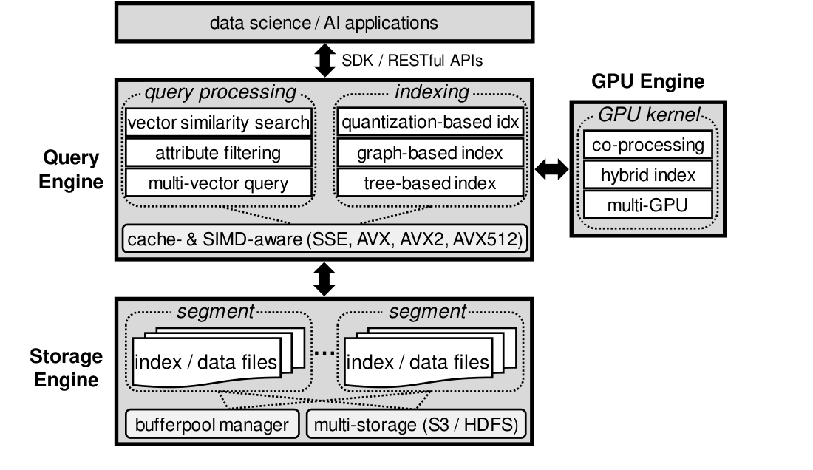

*图 1：Milvus 系统架构。*

### 2.1 查询处理

我们先介绍实体概念，随后说明查询类型、相似性函数和应用接口。

**实体。** 为覆盖多样的数据科学与 AI 应用，Milvus 同时处理向量和非向量数据。我们把实体定义为由一个或多个向量以及可选数值属性描述的对象。例如图像搜索中，除表示正脸、侧脸或姿态的多个学习特征向量外，属性还可表示人物年龄和身高 [10]。当前版本中，我们只支持在实际应用中常见的数值属性；未来，我们计划使用倒排表或位图等索引支持类别属性 [64]。

**查询类型。** Milvus 支持三类原语查询：

- **向量查询：** 传统向量相似性搜索 [33, 41, 48, 49]。每个实体由一个向量描述，系统返回用户参数 $k$ 指定的最相似 $k$ 个向量。
- **属性过滤：** 每个实体包含一个向量和若干属性 [65]，系统返回满足属性约束的 $k$ 个最相似向量。例如推荐系统中查找与查询图片相似且价格低于 100 美元的衣服。
- **多向量查询：** 每个实体存储多个向量 [10]，查询按多个向量之间的聚合函数（如加权和）返回前 $k$ 个相似实体。

**相似性函数。** Milvus 提供欧氏距离、内积、余弦相似度、汉明距离和 Jaccard 距离等常用度量。

**应用接口。** Milvus 为 Python、Java、Go、C++ 等语言提供 SDK，也为 Web 应用提供 RESTful API。

### 2.2 索引

索引对 Milvus 的查询处理至关重要。我们面临的难题是决定支持哪些索引：向量相似性索引非常多，而最新基准 [41] 表明不存在适合所有场景的赢家；每种索引都在性能、准确率和空间开销之间取舍。

在 Milvus 中，我们主要支持两类索引[^3]：量化索引，包括 IVF_FLAT [3, 33, 35]、IVF_SQ8 [3, 35] 和 IVF_PQ [3, 22, 33, 35]；图索引，包括 HNSW [49] 与 RNSG [20]。选择依据包括最新综述 [41]、工业系统（Alibaba PASE [68]、AnalyticDB-V [65]、Vearch [39]）、开源库 Faiss [3, 35] 和客户反馈。我们没有采用 LSH，因为其在十亿规模上的准确率低于量化方法 [65, 68]。

考虑到新索引不断出现，Milvus 提供高层抽象，开发者只需实现少数预定义接口即可添加新索引。我们希望 Milvus 最终成为容纳多种索引的标准向量数据管理平台。

[^3]: Milvus 也支持树索引，例如 ANNOY [1]。

### 2.3 动态数据管理

Milvus 借鉴 LSM-tree [47] 高效支持插入和删除。新实体先进入内存 MemTable；累计大小达到阈值或每隔一秒，MemTable 变为不可变并刷盘成新 segment。较小 segment 按 Apache Lucene 也采用的 tiered merge policy 合并：大小近似的 segment 逐级合并，直到可配置上限（如 1 GB）。删除采用同样的 out-of-place 方法，过期向量在 segment merge 时移除；更新由删除加插入实现。

默认只为大 segment（如大于 1 GB）构建索引，用户也可手动为任意大小 segment 建索引。索引与数据存放在同一 segment，因此 segment 是搜索、调度和缓冲的基本单位。Milvus 提供快照隔离，确保读写看到一致视图且互不干扰；我们在第 5.2 节详述快照隔离。

### 2.4 存储管理

每个实体可视作 entity table 的一行。Milvus 物理上按列存储该表。

**向量存储。** 对单向量实体，系统连续存储所有向量而不显式存 row ID；向量天然按 row ID 排序，因为长度相同，可由 row ID 直接定位。对多向量实体，不同实体的同一向量列放在一起。若实体 $A$、 $B$、 $C$ 各有 $v _ 1$、 $v _ 2$，物理布局为 $\lbrace{}A.v _ 1,B.v _ 1,C.v _ 1,A.v _ 2,B.v _ 2,C.v _ 2\rbrace{}$。

**属性存储。** 每个属性列存为按 key 排序的 $\langle\mathrm{key},\mathrm{value}\rangle$ 数组，key 是属性值，value 是 row ID。此外，我们还按 Snowflake [16] 为磁盘数据页构建 min/max skip pointer，可高效执行点查和范围查询。

**Buffer pool。** 为高性能，Milvus 假定大部分数据和索引常驻内存；否则使用 LRU buffer manager，缓存单位是 segment。

**多种存储。** 底层支持本地文件系统、Amazon S3 和 HDFS，便于可靠、灵活地部署到云上。

### 2.5 异构计算

Milvus 针对 CPU 与 GPU 的异构平台高度优化，细节见第 3 节。

### 2.6 分布式系统

Milvus 可跨多个节点部署，并采用存算分离、共享存储、读写分离和 single-writer/multi-reader 等现代分布式与云系统实践，细节见 5.3 节。

## 3. 异构计算

本节，我们介绍 Milvus 如何充分利用 CPU 与 GPU。Milvus 主要支持量化索引与图索引；以下，我们以量化索引说明我们的优化，因为它们比图索引内存占用更小、建索引更快，同时保持良好查询性能 [65, 68]。SIMD 和 GPU 等许多优化同样适用于图索引。

### 3.1 背景

在深入优化前，我们先说明向量量化和量化索引。

向量量化使用量化器 $z$ 把向量 $v$ 映射到码本 $C$ 中的码字 $z(v)$ [33]。通常用 K-means 构造码本：码字是质心， $z(v)$ 是离 $v$ 最近的质心。图 2 中，10 个向量分属三个簇，质心为 $c _ 0$ 至 $c _ 2$； $v _ 0$ 至 $v _ 3$ 都映射到 $c _ 0$。

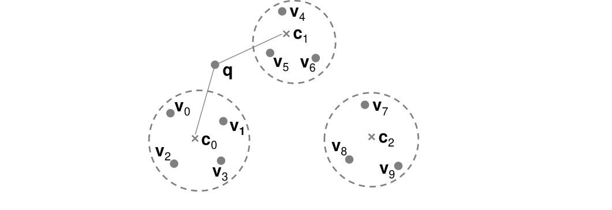

*图 2：量化示例。*

IVF_FLAT、IVF_SQ8 和 IVF_PQ 使用粗、细两个量化器。粗量化器用 K-means 把向量分成 $K$ 个桶（Milvus 和 Faiss 中 $K$ 可为 16384）；细量化器编码桶内向量。IVF_FLAT 保留原始向量；IVF_SQ8 用一维标量量化器把 4-byte float 压成 1-byte integer；IVF_PQ 用乘积量化，把向量切成多个子向量并分别 K-means。

处理查询 $q$ 分两步：（1）按 $q$ 与各桶质心的距离找最近的 $n _ {\mathrm{probe}}$ 个桶； $n _ {\mathrm{probe}}$ 越大，准确率越高而性能越差。（2）按细量化器搜索这些桶。例如图 2 中 $n _ {\mathrm{probe}}=2$，最近的是 $c _ 0$、 $c _ 1$；若为 IVF_FLAT，则扫描 $v _ 0$ 至 $v _ 6$。

### 3.2 面向 CPU 的优化

#### 3.2.1 Milvus 中的 cache-aware 优化

给定 $m$ 个查询 $\lbrace{}q _ 1,\ldots,q _ m\rbrace{}$ 和 $n$ 个数据向量 $\lbrace{}v _ 1,\ldots,v _ n\rbrace{}$，任务是快速为每个查询找出前 $k$ 个相似向量。Faiss 的 OpenMP 实现让每个线程一次处理一个查询：将该查询与全部 $n$ 个向量比较，并维护大小为 $k$ 的堆。这有两个问题：（1）每个查询都要让全部数据流过 CPU cache，下一查询无法复用，每线程访问整个数据 $m/t$ 次；（2）batch 较小时不能充分利用多核并行。

Milvus 一方面让多个查询复用已经装入的数据，重点减少代价高昂且容量相对更大的 L3 cache miss；另一方面按数据向量而非查询向量分配线程，获得细粒度并行，因为实际中 $n$ 通常远大于 $m$。

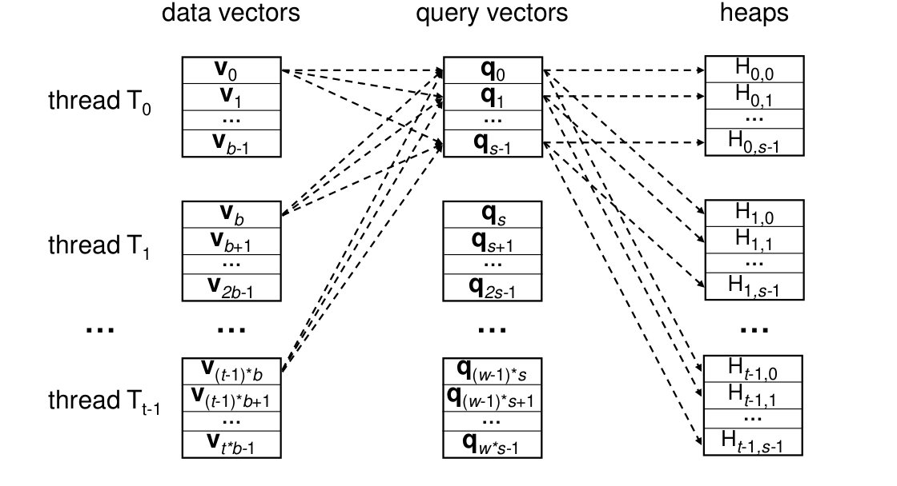

*图 3：Milvus 的 cache-aware 设计。*

如图 3，设线程数为 $t$，每个线程 $T _ i$ 分到 $b=n/t$ 个数据向量[^4]，即 $\lbrace{}v _ {(i-1)b},v _ {(i-1)b+1},\ldots,v _ {ib-1}\rbrace{}$。Milvus 把 $m$ 个查询分成大小为 $s$ 的块；该大小由我们在式 (1) 中确定，使查询块连同对应堆始终能放入 L3 cache；这里，我们假定 $m$ 可被 $s$ 整除。一个查询块由多线程共同计算；线程把自身数据装入 L3 后，与缓存中的全部 $s$ 个查询比较。为减少同步，每个线程为每个查询维护独立堆：当第 $i$ 个查询块 $\lbrace{}q _ {(i-1)s},q _ {(i-1)s+1},\ldots,q _ {is-1}\rbrace{}$ 位于 cache 中时，第 $r$ 个线程 $T _ {r-1}$ 用堆 $H _ {r-1,j-1}$ 保存第 $j$ 个查询 $q _ {(i-1)s+j-1}$ 的结果。一个查询的结果因此分散在 $t$ 个线程的堆中，最后合并这些堆得到前 $k$ 个结果。

接下来，我们说明如何确定这一查询块大小。若维度为 $d$，每个查询占 $d\times\mathrm{sizeof}(\mathrm{float})$；每个堆项包含向量 ID 与相似度，每个查询的堆总大小为 $t\times k\times(\mathrm{sizeof}(\mathrm{int64})+\mathrm{sizeof}(\mathrm{float}))$。因此：

$$
s=\frac{\text{L3 cache size}}{d\times\mathrm{sizeof}(float)+t\times k\times(\mathrm{sizeof}(int64)+\mathrm{sizeof}(float))}. \qquad \text{(1)}
$$

这样每线程只需访问全部数据 $m/(s\times t)$ 次，比 Faiss 少 $s$ 倍。7.4 节实验显示性能提高 1.5×–2.7×。

[^4]: 我们假设向量总数 n 可被线程数 t 整除。

#### 3.2.2 Milvus 中的 SIMD-aware 优化

Faiss 已用 SIMD 加速向量相似性计算，我们在 Milvus 中又做了两项工程优化。

**支持 AVX512。** 原 Faiss 不支持主流 CPU 已提供的 AVX512。我们用 `_mm512_add_ps`、`_mm512_mul_ps`、`_mm512_extractf32x8_ps` 等指令扩展相似性函数，支持 SSE、AVX、AVX2 和 AVX512。

**自动选择 SIMD 指令。** 单一 Milvus 二进制需要在不同 CPU 上自动选择合适指令，而 Faiss 要求编译时手动指定如 `-msse4` 的标志。在 Milvus 中，我们投入大量工程工作重构 Faiss 代码库。我们抽取依赖 SIMD 的公共函数，随后为每个函数实现 SSE、AVX、AVX2、AVX512 四个版本，放入不同源文件并分别用对应标志编译；运行时检查 CPU flags，通过 hooking 链接正确函数指针。

### 3.3 面向 GPU 的优化

Milvus 在 Faiss GPU 支持上增强两点。

**GPU kernel 支持更大的 $k$。** Faiss 因 shared memory 限制只支持 $k\le 1024$，而视频监控和推荐系统常需更大的 $k$ 做验证或重排 [69, 71]。Milvus 支持到 16384[^5]。当 $k$ 大于 1024 时分多轮执行：首轮取前 1024；后续记录上一轮最后结果的距离 $d _ l$，并记录距离等于 $d _ l$ 的 ID，过滤距离小于 $d _ l$ 或 ID 已出现的向量，再取接下来的 1024，合并结果，直到足量。

**支持多 GPU。** Faiss 要在编译时声明所有 GPU，导致二进制只能运行在 GPU 数不少于编译机的服务器。Milvus 允许运行时选择任意数量 GPU，并用 segment-based scheduling 把搜索任务分给可用 GPU；一个 segment 仅由一个 GPU 服务。新 GPU 加入后可立即发现并接受下一任务，适合云上弹性资源管理。

[^5]: 技术上可支持任意查询参数 k；在 Milvus 中，我们特意把 k 限制为 16384，以免网络传输过大，而且这已足以覆盖我们见过的应用。

### 3.4 GPU 与 CPU 协同设计

当数据无法完全放入 GPU 时，Faiss 使用低占用的 IVF_SQ8[^6]，并按需经 PCIe 从 CPU 内存搬到 GPU。但我们发现两个局限：（1）我们的实验表明实测 I/O 仅 1–2 GB/s，而 PCIe 3.0 ×16 可达 15.75 GB/s；（2）考虑传输成本，GPU 并非始终优于 CPU。Milvus 为此提出 SQ8H（H 表示 hybrid）。

**算法 1：SQ8H。**

```text
1  令 nq 为 batch size；
2  if nq >= threshold then
3      全部查询完全在 GPU 上运行（按需把多个桶装入 GPU memory）；
4  else
5      在 GPU 执行 SQ8 第一步：寻找 nprobe 个桶；
6      在 CPU 执行 SQ8 第二步：扫描每个相关桶；
```

我们检查 Faiss 代码后发现，它逐桶从 CPU 向 GPU 复制，桶小时不能充分利用 PCIe。Milvus 一次尽可能复制多个桶。Faiss 的原地删除方式不利于多桶复制，而 Milvus 的 LSM out-of-place 删除自然解决该问题。

我们观察到，GPU 只有在 batch 足够大时才能抵消数据移动成本并优于 CPU，因为更多查询复用同一数据、计算更密集。因此 batch 大于阈值（如 1000）时，全部在 GPU 执行，并在 GPU 内存不足时装入必要桶；否则采用混合执行：在 GPU 上找 $n _ {\mathrm{probe}}$ 个最近桶，在 CPU 上扫描桶。我们还观察到，第一步的计算/I/O 比显著高于第二步：第一步所有查询共享 $K$ 个质心，且质心可常驻 GPU；第二步访问更分散，不同查询未必访问同一桶。

[^6]: IVF_SQ8 仅占 IVF_FLAT 的 1/4 空间，而召回率只损失约 1%。本节原则也适用于 IVF_FLAT、IVF_PQ 等其他量化索引。

## 4. 高级查询处理

### 4.1 属性过滤

属性过滤同时涉及向量与非向量数据 [65]，只搜索满足属性约束的向量。例如查找尺寸在给定范围内的相似房屋。多向量查询处理留待我们在第 4.2 节说明。为简化叙述，我们假设实体只有一个向量和一个属性，多属性可直接扩展。查询含属性条件 $C _ A$ 和返回前 $k$ 个结果的向量条件 $C _ V$；不失一般性， $C _ A$ 写成 $a\ge p _ 1\land a\le p _ 2$。

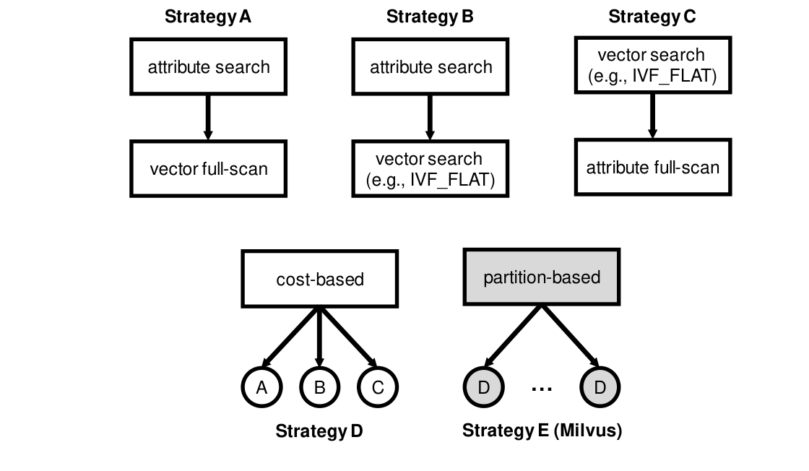

*图 4：属性过滤的不同策略。*

图 4 给出概要，下面我们介绍各策略细节。

在 Milvus 中，我们实现了 AnalyticDB-V [65] 研究的 A–D 策略，并且我们提出了实验中比最新策略 D 最多快 13.7× 的分区策略 E。

**策略 A：attribute-first-vector-full-scan。** 先按 $C _ A$ 得到实体：数据主要在内存时，我们使用二分查找；落盘时，我们使用 skip pointer，也可使用 B-tree。再全扫描这些候选并与查询向量比较。 $C _ A$ 高选择性时适用，且产生精确结果。

**策略 B：attribute-first-vector-search。** 先按 $C _ A$ 得到实体 ID bitmap，再正常执行 $C _ V$ 的向量查询；遇到向量时检查 bitmap，只有通过者进入前 $k$ 个结果。 $C _ A$ 或 $C _ V$ 中等选择性时适用。

**策略 C：vector-first-attribute-full-scan。** 先按 $C _ V$ 用 IVF_FLAT 等取实体，再全扫描验证 $C _ A$。为保证最终有 $k$ 个结果，向量阶段取 $\theta\cdot k$ 个，其中 $\theta\gt 1$； $C _ V$ 高选择性时适用。

**策略 D：cost-based。** 估计 A、B、C 成本并选择最低者，即 AnalyticDB-V [65] 的方案。已有工作和我们的实验表明它几乎适合所有情况。

**策略 E：partition-based。** 这是我们在 Milvus 中开发的分区方法：按频繁检索的属性把数据分区，每个分区内部使用策略 D。我们用 hash table 维护查询引用各属性的频率。给定查询，只搜属性范围与查询范围重叠的分区；若某分区范围完全被查询范围覆盖，则无需再检查 $C _ A$，只做 $C _ V$。

例如按 price 分为 $P _ 0=[1,100]$、 $P _ 1=[101,200]$、 $P _ 2=[201,300]$、 $P _ 3=[301,400]$、 $P _ 4=[401,500]$，查询范围 $[50,250]$ 只需搜索 $P _ 0$、 $P _ 1$、 $P _ 2$；搜索 $P _ 1$ 时无需检查属性。在当前 Milvus 中，我们根据历史数据离线创建分区，并在线处理查询。分区数 $\rho$ 由用户配置：太少则难剪枝，太多则每区向量太少、索引退化为线性搜索。根据我们的经验，我们建议每个分区约含一百万向量；十亿数据约需 1000 个分区。用机器学习和统计动态分区并选择 $\rho$ 是未来工作。

### 4.2 多向量查询

许多应用用多个向量描述实体以提高准确率：视频监控以正脸、侧脸和姿态描述人 [10]；菜谱搜索以文本和图片描述菜谱 [56]；同一对象还可能使用多个模型 [30, 69]。

形式化地，每个实体含 $\mu$ 个向量 $v _ 0,\ldots,v _ {\mu-1}$。多向量查询按聚合函数 $g$ 组合各向量的相似度函数 $f$，寻找前 $k$ 个结果：实体 $X$ 与 $Y$ 的相似度是 $g(f(X.v _ 0,Y.v _ 0),\ldots,f(X.v _ {\mu-1},Y.v _ {\mu-1}))$。我们假设 $g$ 对每个 $f(X.v _ i,Y.v _ i)$ 单调不减 [19]；加权和、均值/中位数、min/max 都满足。

**朴素方案。** 令数据集为 $D$， $D _ i=\lbrace{}e.v _ i\mid e\in D\rbrace{}$。对查询 $q$ 的每个 $q.v _ i$ 在 $D _ i$ 上分别取前 $k$ 个结果，再聚合候选。该方案曾广泛用于 AI/ML 推荐 [29, 70]，但会漏掉许多真实结果，召回率可低至 0.1。

在 Milvus 中，我们开发了面向不同场景的向量融合和迭代合并两种新方法。

**向量融合。** 我们以内积相似度为例说明向量融合，随后说明如何扩展到其他相似度函数。把实体 $e$ 的 $\mu$ 个向量连接为 $v=[e.v _ 0,e.v _ 1,\ldots,e.v _ {\mu-1}]$。查询时把聚合函数应用于 $q$ 的向量；若 $g$ 是权重 $w _ i$ 的加权和，则查询向量为 $[w _ 0\times q.v _ 0,w _ 1\times q.v _ 1,\ldots,w _ {\mu-1}\times q.v _ {\mu-1}]$，再在连接向量上搜索。内积可分解，故正确性直接成立。该方法只调用一次向量查询，简单高效，但要求可分解相似度。数据归一化后，余弦相似度和欧氏距离等也可等价转换为内积。

**迭代合并。** 若数据未归一化且相似度不可分解（如欧氏距离），我们又开发了建立在 Fagin NRA [19] 上的迭代合并算法[^7]。我们最初尝试直接使用 NRA：它把每个 $q.v _ i$ 在 $D _ i$ 上的结果当流并频繁调用 `getNext()`；但我们很快发现它效率很低。量化和图索引不能高效支持 `getNext()`，每取下一项都要完整搜索，且 NRA 每次访问都更新 heap 中对象分数，维护开销高。

迭代合并做两项优化：（1）不依赖 `getNext()`，而以自适应 $k'$ 调用 `VectorQuery`，参数为 $q.v _ i,D _ i,k'$；这样既避免每次访问都重做查询，也消除昂贵的 heap 维护。（2）由于 Milvus 返回近似结果，引入最大访问步数上界。

**算法 2：迭代合并。**

```text
1  k' <- k
2  while k' < threshold do
       // 对每个 q.vi 在 Di 上执行 top-k' 处理
3      foreach i do
4          Ri <- VectorQuery(q.vi, Di, k')
5      if 对所有 Ri 运行 NRA [19] 后可完全确定 k 个结果 then
6          return top-k 结果
7      else
8          k' <- k' * 2
9  return ∪_i R_i 中的 top-k 结果
```

算法反复为每个 $q.v _ i$ 取前 $k'$ 个结果并放入 $R _ i$，再对所有 $R _ i$ 运行 NRA。若至少 $k$ 个结果已可安全确定就终止，否则将 $k'$ 加倍，直到阈值。它不假设数据和相似度函数，适用面更广；但相似度可分解时，性能不如向量融合。数据库领域还有其他求前 $k$ 个结果的算法 [5, 12, 31, 42, 62]，但同样受底层索引不能高效 `getNext()` 的限制。算法 2 是通用框架，可替换第 5 行求前 $k$ 个结果的算法；其最优性和进一步优化仍是开放问题。

[^7]: TA 算法 [19] 需要此处不可用的随机访问，因此不能应用。

## 5. 系统实现

本节，我们介绍异步处理、快照隔离和分布式计算的实现细节。

### 5.1 异步处理

Milvus 通过异步处理尽量减少前台工作、提高吞吐。收到大量写请求时，先把操作像数据库日志一样物化到磁盘，然后向用户确认；后台线程再消费这些操作。因此用户可能不能立即看到插入数据，Milvus 提供 `flush()` API：阻塞新请求，直到所有待处理操作完成。索引也异步构建。

### 5.2 快照隔离

为让动态数据上的读写看到一致视图，Milvus 提供快照隔离。查询只在其开始时的快照上运行，后续更新创建新快照，不干扰进行中的查询。

动态数据按 LSM 风格管理：新数据先插入内存，再刷成不可变 segment。每个 segment 有多个版本，数据或索引发生 flush、merge、build index 等变化就生成新版本。任一时刻的最新 segments 组成快照，一个 segment 可被多个快照引用。假设系统启动时无 segment；t1 时插入刷盘形成 segment 1；t2 时生成 segment 2。此时 snapshot 1 指向 segment 1，snapshot 2 指向 segment 1 与 2。t2 前的查询使用 snapshot 1，之后的使用 snapshot 2。后台线程回收不再被任何快照引用的过期 segment。

快照隔离作用于 LSM 内部数据重组，因此所有内部读都不会被写阻塞。

### 5.3 分布式系统

为获得可扩展性和可用性，Milvus 使用存算分离的 shared-storage 架构。类似 Snowflake [16] 和 Aurora [63]，存储层使用高可用 Amazon S3；计算层处理插入与查询，并用本地内存和 SSD 缓存，减少 S3 访问；协调层维护分片、负载均衡等元数据，由 Zookeeper 管理三个实例以实现高可用。

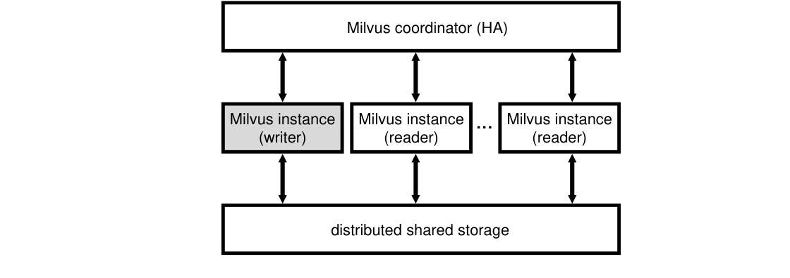

*图 5：Milvus 分布式系统。*

接下来，我们进一步说明无状态计算层。

无状态计算层包含一个 writer 和多个 reader，因为 Milvus 读多写少，单 writer 已满足当时客户需求。Writer 处理插入、删除、更新；reader 处理查询。数据用 consistent hashing 分到 reader，分片信息在协调层中。一次请求内没有混合读写，因此不存在跨分片事务。图 10 的实验显示该设计近线性扩展。

所有计算实例由 Kubernetes（K8s）管理。实例崩溃时 K8s 自动重启替代者；writer 崩溃时依赖 WAL 保证原子性。实例无状态，崩溃不影响一致性；过载时 K8s 还能弹性增加 reader。

为降低计算与存储间网络开销，Milvus 做两项优化：（1）计算层像 Aurora [63] 一样只把日志而非实际数据发送到存储层，再由后台线程异步处理。当前后台线程运行在负载不高的 writer 上，必要时可使用专用实例。（2）每个计算实例配备大量 buffer memory 与 SSD，减少 shared storage 访问。

## 6. 应用

本节，我们介绍 Milvus 支撑的应用。我们已在 Milvus 上构建十个应用：图像搜索、视频搜索、化学结构分析、COVID-19 数据集搜索、个性化推荐、生物多因子认证、智能问答、图文检索、跨模态行人搜索和菜谱—食物搜索。受篇幅限制，本节介绍两个，更多见项目 bootcamp[^2]。

### 6.1 图像搜索

图像搜索是典型向量搜索：VGG [58]、ResNet [28] 等深度模型自然地把图片转换成向量。

企查查[^8]和贝壳找房[^9]使用 Milvus 做大规模图像搜索。企查查存储并检索超过一亿家公司的工商信息；Milvus 帮助客户检索相似商标，判断商标是否已注册。贝壳找房是中国最大的在线房地产交易平台之一；Milvus 用于查找相似房屋和户型。图 6 展示商标与房屋搜索示例。

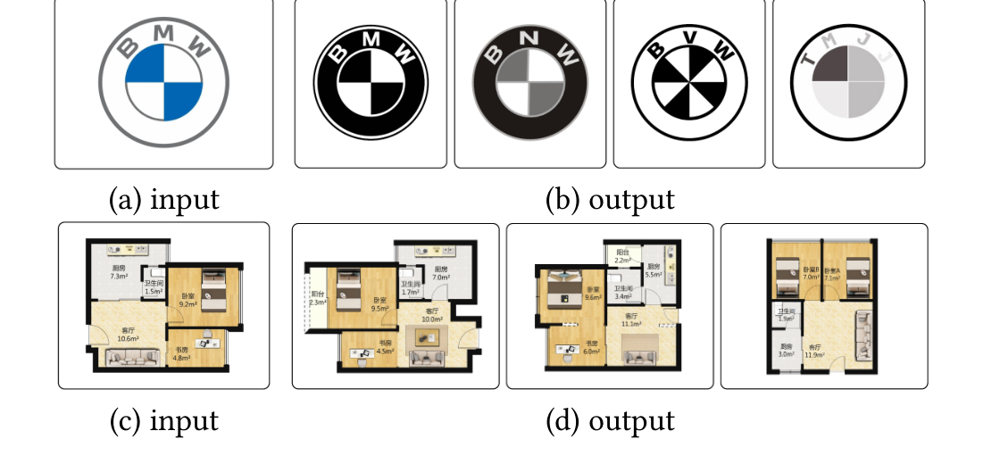

*图 6：Milvus 图像搜索。*

[^8]: <https://www.qcc.com/>
[^9]: <https://www.ke.com/>

### 6.2 化学结构分析

化学结构分析是依赖向量搜索的新兴应用。研究表明，可把化学物质结构编码成高维向量，再以向量相似性搜索（如 Tanimoto 距离 [9]）查找相似结构 [9, 66]。

大型制药企业药明康德[^10]已采用 Milvus 开发新药和医疗器械，把化学结构分析从数小时缩短到一分钟以内。图 7 给出相似结构搜索示例。

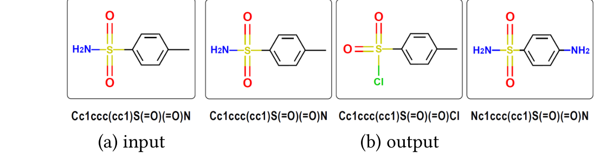

*图 7：Milvus 化学结构分析。*

[^10]: <https://www.wuxiapptec.com/>

## 7. 实验

### 7.1 实验设置

**平台。** 我们在阿里云上进行全部实验，为节省成本按实验使用不同实例，最多 12 节点。默认情况下，我们使用的 CPU 实例为 `ecs.g6e.4xlarge`：Xeon Platinum 8269 Cascade 2.5 GHz、16 vCPU、35.75 MB L3 cache、AVX512、64 GB 内存和 NAS 弹性存储。GPU 实例为 `ecs.gn6i-c16g1.4xlarge`：NVIDIA Tesla T4、64 KB private memory、512 KB local memory、16 GB global memory、PCIe 3.0 ×16。

**数据集。** 为便于复现，我们使用公开数据集 SIFT1B [34] 和 Deep1B [8]。SIFT1B 包含十亿个 128 维 SIFT 向量（512 GB）；Deep1B 包含深度神经网络抽取的十亿个 96 维图像向量（384 GB）。两者都是向量相似性和近似最近邻研究的标准数据集 [35, 41, 65, 68]。

**对手。** 我们把 Milvus 与两个开源系统 Vearch v3.2.0 [4, 39]、Microsoft SPTAG [14] 比较，并与截至 2020 年 7 月最新版本、因商业原因匿名为 A、B、C 的三个工业商业系统比较。Milvus 基于 Faiss [3, 35] 实现；第 7.4 节，我们还通过评估算法优化给出性能比较。

**指标。** 默认 $k=50$。若 ground-truth 的前 $k$ 个结果集为 $S$，系统返回的前 $k$ 个结果集为 $S'$，我们用召回率 $|S\cap S'|/|S|$ 评估准确性，并通过对数据集发出 10,000 个随机查询测量吞吐。

### 7.2 与已有系统比较

本实验中，我们比较 Milvus 与已有系统的召回率和吞吐。我们使用两个数据集的前一千万向量（SIFT10M、Deep10M），因为已有系统构建索引和查询十亿数据过慢；第 7.3 节，我们还在完整十亿向量上验证 Milvus。商业系统最低配置要求多节点：我们把 A、C 运行在两节点（每节点 64 GB），把 B 运行在四节点（每节点 128 GB）；我们把其他系统（含 Milvus）均运行在单节点。只要可行，我们统一使用多数系统都支持的 IVF_FLAT 与 HNSW。

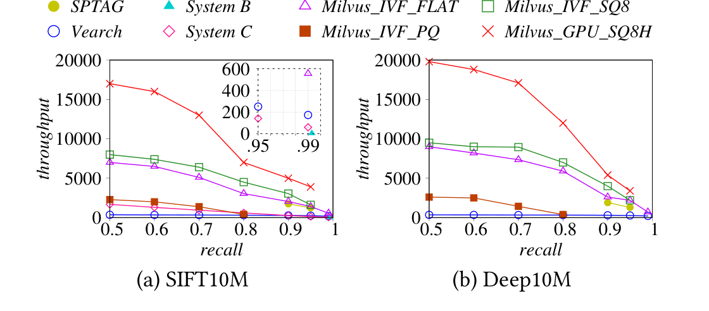

*图 8：IVF 索引上的系统评估。*

图 8 的量化索引结果表明，在召回率相近时，即便 CPU 版本 Milvus 也最多领先两个数量级：比 Vearch 快 6.4×–27.0×；比四节点 B 快 153.7×[^11]；比两节点 C 快 4.7×–11.5×；比树索引 SPTAG 快 1.3×–2.1×。SPTAG 不能达到 Milvus 的 0.99 高召回率，而且内存多 14 倍（17.88 GB 对 1.27 GB）[^12]。本设置中数据可放入 GPU，GPU 版更快。B 只支持欧氏距离，故我们省略其 Deep10M 结果；Vearch GPU 建索引存在尚未修复的 bug，我们也省略其 GPU 结果[^13]。A 只支持 HNSW，我们把结果留到图 9。

优势除工程实现外还来自：（1）同时支持 inter-query 与 intra-query 的细粒度并行；（2）cache-aware 和 SIMD-aware 优化；（3）CPU/GPU 混合执行。

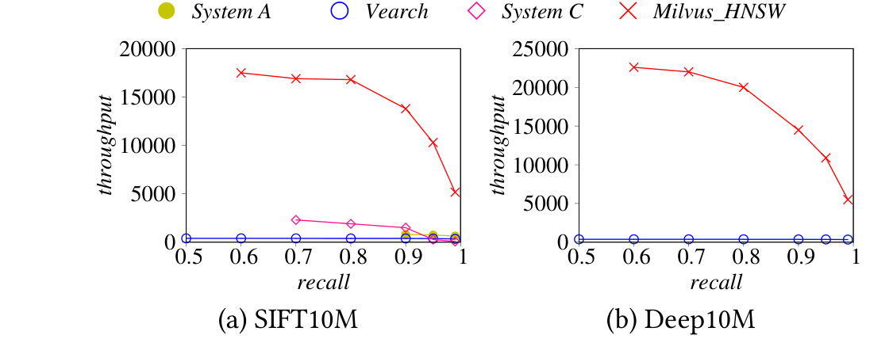

*图 9：HNSW 索引上的系统评估。*

图 9 中 Milvus 仍显著领先：比 Vearch 快 15.1×–60.4×，比 A 快 8.0×–17.1×，比 C 快 7.3×–73.9×。A 不支持内积，因此我们省略其 Deep10M 结果；C 构建 Deep10M 索引超过 100 小时仍未完成，我们也省略其相应结果。

[^11]: 我们在 2020 年 8 月测试时，系统 B 禁用了 `nprobe`、`nlist` 等参数调优，使用 brute-force，故图 8 只有一个点且性能较低。若未来开放参数以使用索引，我们预计其性能会改善。
[^12]: SPTAG 也不支持表 1 所列的动态数据管理、GPU、属性过滤、多向量查询和分布式系统。
[^13]: 我们于 2020 年 9 月提交 bug：<https://github.com/vearch/vearch/issues/252>。

### 7.3 可扩展性

在含十亿向量的 SIFT1B 上，我们使用 IVF_FLAT，并从数据规模和服务器数量两方面评估 Milvus 的可扩展性。

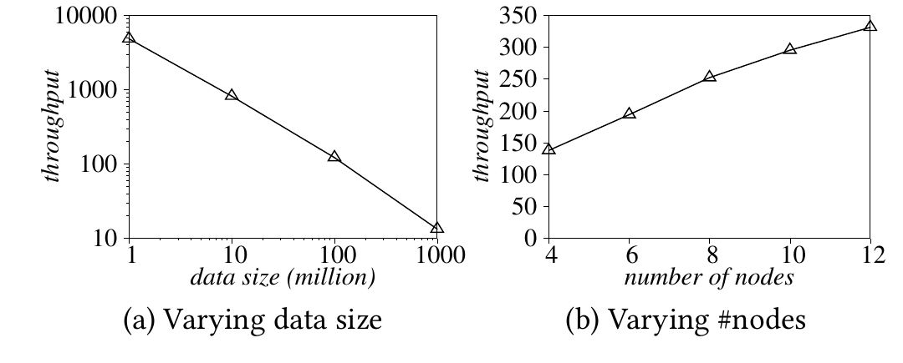

*图 10：可扩展性。*

图 10(a) 在单台 `ecs.re6.26xlarge`（104 vCPU、1.5 TB 内存，可容纳全部数据）上显示，随着数据增加，吞吐按比例平滑下降。图 10(b) 中，数据分到若干 `ecs.g6e.13xlarge` 节点（每节点 52 vCPU、192 GB）；节点增加时吞吐线性上升。我们观察到，后者吞吐反而高于 `ecs.re6.26xlarge`，原因是更多核心对共享 CPU cache 和内存带宽的争用更严重。

### 7.4 优化评估

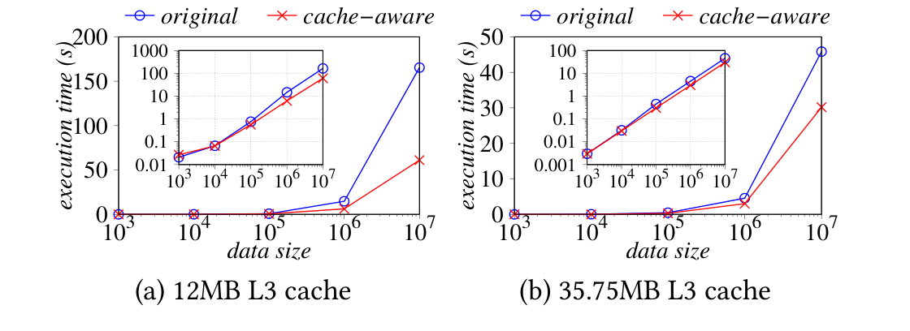

*图 11：cache-aware 设计评估。*

图 11 比较 12 MB L3（Intel Core i7-8700 3.2 GHz）和 35.75 MB L3（Xeon Platinum 8269 Cascade 2.5 GHz）CPU。我们把 batch size 设为 1000，并把数据规模从 1000 变到一千万向量。Cache-aware 设计分别最多提升 2.7× 和 1.5×。

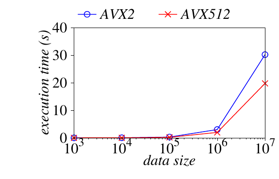

*图 12：SIMD 优化。*

图 12 沿用图 11 设置，在 Xeon 上比较 AVX2 与 AVX512；AVX512 约快 1.5×。

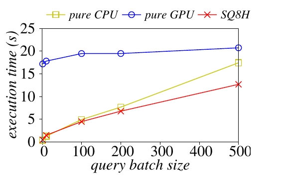

*图 13：GPU 索引。*

图 13 中，我们在数据放不进 GPU memory 的 SIFT1B 上比较 SQ8H、纯 CPU SQ8 与纯 GPU SQ8。因数据传输，GPU SQ8 比 CPU SQ8 慢；batch 增大时更多计算推到 GPU，差距缩小。所有情况下 SQ8H 都更快：它只把质心存入 GPU 完成第一步，由 CPU 完成第二步，不必运行时把 data segment 传到 GPU。

### 7.5 属性过滤评估

沿用 [65]，我们把查询选择率定义为不满足 $C _ A$ 的实体比例，因此值越高，通过 $C _ A$ 的实体越少。我们取 SIFT1B 的前一亿向量，为每个向量添加 $[0,10000]$ 的随机属性；随后依照 [65] 生成两种场景： $k=50,\ \mathrm{recall}=0.95$ 与 $k=500,\ \mathrm{recall}=0.85$。

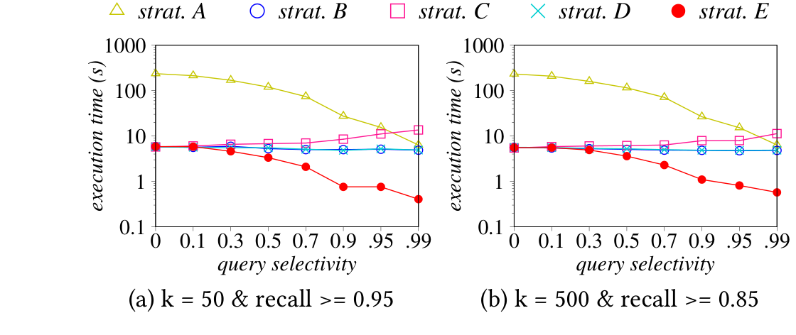

*图 14：Milvus 中的属性过滤。*

图 14 中，A 随选择率提高而更快，因为检查向量更少；B 对选择率不敏感，瓶颈是向量相似性搜索；C 比 B 慢，因为要检查 $\theta=1.1$ 倍向量；代价策略 D 在 A/B/C 中择优，因而更快；我们的新方法——分区策略 E——又比 D 最多快 13.7×。

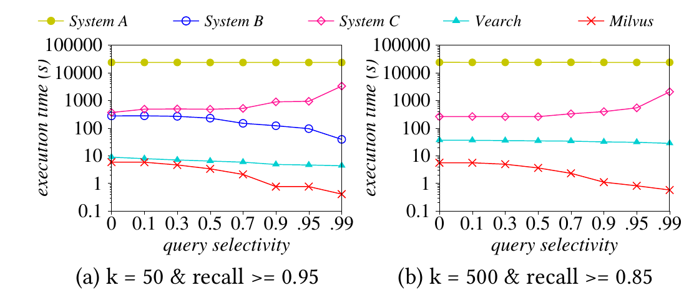

*图 15：属性过滤比较。*

图 15 比较 A、B、C、Vearch 和 Milvus，Milvus 快 48.5×–41299.5×。图 15(b) 中，我们省略 System B，因为其参数由系统固定、用户不能修改。

### 7.6 多向量查询处理评估

本实验中，我们评估多向量查询处理算法。SIFT1B 与 Deep1B 每个实体只有一个向量，因此我们改用 Recipe1M [50, 56]：一百多万份菜谱和食物图片，每个实体有文本向量（菜谱描述）和图像向量（食物图片）。我们随机选取 10,000 个查询，令 $k=50$，使用 IVF_FLAT，并使用加权和聚合。

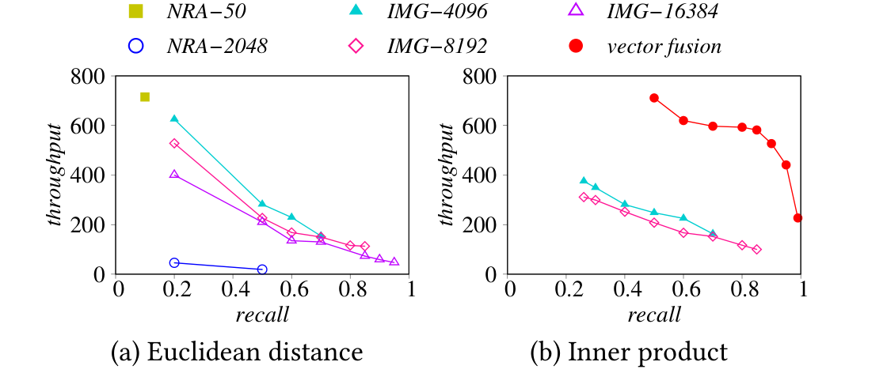

*图 16：Milvus 多向量处理。*

图 16(a) 使用欧氏距离，我们比较 $k$ 为 50、2048 的标准 NRA 与我们的迭代合并方法（IMG， $k'$ 分别为 4096、8192、16384）。NRA 要么慢，要么召回低：NRA-50 快但召回仅 0.1；NRA-2048 召回提高到最高 0.5，但性能低。我们的迭代合并算法 IMG-4096 在相似召回下快 15×，因为不必每次都调用向量查询，heap 维护也更低。

图 16(b) 使用内积，我们比较迭代合并 IMG-4096、IMG-8192 与向量融合。向量融合只需一次 top-k 搜索，因而快 3.4×–5.8×。

## 8. 相关工作

向量相似性搜索（高维最近邻）在近似搜索 [7, 41] 和精确搜索 [38, 42] 中都被广泛研究。本文关注高性能近似搜索。已有近似方法大致分四类：LSH [23, 23, 24, 32, 40, 44, 45, 48, 73]、树 [17, 46, 54, 57]、图 [20, 43, 49, 61, 72] 和量化 [3, 6, 22, 27, 33, 35]。这些工作都聚焦索引，而 Milvus 是包括索引、查询引擎、GPU 引擎、存储引擎和分布式系统的完整向量数据管理系统；其可扩展索引框架也能纳入这些及未来新索引。Faiss [35]、SPTAG [14] 等只是库，不是系统；我们在表 1 中总结了这些差异。（译者注：原文在 LSH 引用组中重复列出 [23]。）

Alibaba PASE [68] 和 AnalyticDB-V [65] 等工业系统并非专为向量优化，而是扩展关系数据库支持向量，实验显示性能严重受损。Vearch [39] 等专用向量系统又不适合十亿规模，且显著慢于 Milvus。

也有 GPU 向量搜索引擎 [35, 72]。[72] 为 GPU 优化 HNSW，却假设数据全部装入 GPU。Faiss [35] 在数据装不下时按需加载完整 data segment，性能较低；Milvus 的 SQ8H 在无需动态装载数据的情况下结合 CPU 与 GPU。

本工作也属于构建专用数据引擎的趋势，因为 one size does not fit all [60]；例子包括图引擎 [18]、IoT 引擎 [21]、时序数据库 [55] 和科学数据库 [59]。Milvus 是其中面向向量数据的专用引擎。

## 9. 结论

在本工作中，我们分享过去几年在 Zilliz 构建 Milvus 的经验。Milvus 已被数百家公司采用，并成为 LF AI & Data Foundation 的孵化项目。未来，我们计划用 FPGA 加速 Milvus：我们已在 FPGA 上实现 IVF_PQ，初步结果令人鼓舞。另一个有趣而困难的方向，是把 Milvus 构造成 cloud-native 数据管理系统，我们正在开展相关工作。

## 致谢

Milvus 是 Zilliz 众多工程师参与的多年项目。我们特别感谢 Shiyu Chen、Qing Li、Yunmei Li、Chenglong Li、Zizhao Chen、Yan Wang 和 Yunying Zhang 的贡献；也感谢 Haimeng Cai 与 Chris Warnock 校对论文；最后，我们还要感谢 Walid G. Aref 和匿名审稿人的宝贵反馈。

## 参考文献

[1] 2020. Annoy: Approximate Nearest Neighbors Oh Yeah. <https://github.com/spotify/annoy>

[2] 2020. ElasticSearch: Open Source, Distributed, RESTful Search Engine. <https://github.com/elastic/elasticsearch>

[3] 2020. Facebook Faiss. https://github.com/facebookresearch/faiss

[4] 2020. Vearch: A Distributed System for Embedding-based Retrieval. <https://github.com/vearch/vearch>

[5] Reza Akbarinia, Esther Pacitti, and Patrick Valduriez. 2007. Best Position Algorithms for Top-k Queries. In International Conference on Very Large Data Bases (VLDB). 495–506.

[6] Fabien André, Anne-Marie Kermarrec, and Nicolas Le Scouarnec. 2015. Cache locality is not enough: High-Performance Nearest Neighbor Search with Product Quantization Fast Scan. Proceedings of the VLDB Endowment (PVLDB) 9, 4 (2015), 288–299.

[7] Martin Aumüller, Erik Bernhardsson, and Alexander John Faithfull. 2018. ANN-Benchmarks: A Benchmarking Tool for Approximate Nearest Neighbor Algorithms. Computing Research Repository (CoRR) abs/1807.05614 (2018).

[8] Artem Babenko and Victor S. Lempitsky. 2016. Efficient Indexing of Billion-Scale Datasets of Deep Descriptors. In IEEE Conference on Computer Vision and Pattern Recognition (CVPR). 2055–2063.

[9] Dávid Bajusz, Anita Rácz, and Károly Héberger. 2015. Why Is Tanimoto Index An Appropriate Choice For Fingerprint-Based Similarity Calculations? Journal of Cheminformatics 7 (2015).

[10] Tadas Baltrusaitis, Chaitanya Ahuja, and Louis-Philippe Morency. 2019. Multimodal Machine Learning: A Survey and Taxonomy. IEEE Transactions on Pattern Analysis and Machine Intelligence (TPAMI) 41, 2 (2019), 423–443.

[11] Oren Barkan and Noam Koenigstein. 2016. ITEM2VEC: Neural Item Embedding for Collaborative Filtering. In IEEE International Workshop on Machine Learning for Signal Processing (MLSP). 1–6.

[12] Kaushik Chakrabarti, Surajit Chaudhuri, and Venkatesh Ganti. 2011. Interval-based Pruning for Top-k Processing over Compressed Lists. In International Conference on Data Engineering (ICDE). 709–720.

[13] Hongming Chen, Ola Engkvist, Yinhai Wang, Marcus Olivecrona, and Thomas Blaschke. 2018. The Rise of Deep Learning in Drug Discovery. Drug Discovery Today 23, 6 (2018), 1241–1250.

[14] Qi Chen, Haidong Wang, Mingqin Li, Gang Ren, Scarlett Li, Jeffery Zhu, Jason Li, Chuanjie Liu, Lintao Zhang, and Jingdong Wang. 2018. SPTAG: A Library for Fast Approximate Nearest Neighbor Search. https://github.com/Microsoft/SPTAG

[15] Paul Covington, Jay Adams, and Emre Sargin. 2016. Deep Neural Networks for YouTube Recommendations. In ACM Conference on Recommender Systems (RecSys). 191–198.

[16] Benoit Dageville, Thierry Cruanes, Marcin Zukowski, Vadim Antonov, Artin Avanes, Jon Bock, Jonathan Claybaugh, Daniel Engovatov, Martin Hentschel, Jiansheng Huang, Allison W. Lee, Ashish Motivala, Abdul Q. Munir, Steven Pelley, Peter Povinec, Greg Rahn, Spyridon Triantafyllis, and Philipp Unterbrunner. 2016. The Snowflake Elastic Data Warehouse. In ACM Conference on Management of Data (SIGMOD). 215–226.

[17] Sanjoy Dasgupta and Yoav Freund. 2008. Random Projection Trees and Low Dimensional Manifolds. In ACM Symposium on Theory of Computing (STOC). 537–546.

[18] Alin Deutsch, Yu Xu, Mingxi Wu, and Victor E. Lee. 2020. Aggregation Support for Modern Graph Analytics in TigerGraph. In ACM Conference on Management of Data (SIGMOD). 377–392.

[19] Ronald Fagin, Amnon Lotem, and Moni Naor. 2001. Optimal Aggregation Algorithms for Middleware. In ACM Symposium on Principles of Database Systems (PODS). 102–113.

[20] Cong Fu, Chao Xiang, Changxu Wang, and Deng Cai. 2019. Fast Approximate Nearest Neighbor Search With The Navigating Spreading-out Graph. Proceedings of the VLDB Endowment (PVLDB) 12, 5 (2019), 461–474.

[21] Christian Garcia-Arellano, Adam J. Storm, David Kalmuk, Hamdi Roumani, Ronald Barber, Yuanyuan Tian, Richard Sidle, Fatma Özcan, Matt Spilchen, Josh Tiefenbach, Daniel C. Zilio, Lan Pham, Kostas Rakopoulos, Alexander Cheung, Darren Pepper, Imran Sayyid, Gidon Gershinsky, Gal Lushi, and Hamid Pirahesh. 2020. Db2 Event Store: A Purpose-Built IoT Database Engine. Proceedings of the VLDB Endowment (PVLDB) 13, 12 (2020), 3299–3312.

[22] Tiezheng Ge, Kaiming He, Qifa Ke, and Jian Sun. 2014. Optimized Product Quantization. IEEE Transactions on Pattern Analysis and Machine Intelligence (TPAMI) 36, 4 (2014), 744–755.

[23] Aristides Gionis, Piotr Indyk, and Rajeev Motwani. 1999. Similarity Search in High Dimensions via Hashing. In International Conference on Very Large Data Bases (VLDB). 518–529.

[24] Long Gong, Huayi Wang, Mitsunori Ogihara, and Jun Xu. 2020. iDEC: Indexable Distance Estimating Codes for Approximate Nearest Neighbor Search. Proceedings of the VLDB Endowment (PVLDB) 13, 9 (2020), 1483–1497.

[25] Mihajlo Grbovic and Haibin Cheng. 2018. Real-time Personalization using Embeddings for Search Ranking at Airbnb. In ACM Conference on Knowledge Discovery & Data Mining (KDD). 311–320.

[26] Martin Grohe. 2020. Word2vec, Node2vec, Graph2vec, X2vec: Towards a Theory of Vector Embeddings of Structured Data. In ACM Symposium on Principles of Database Systems (PODS). 1–16.

[27] Ruiqi Guo, Philip Sun, Erik Lindgren, Quan Geng, David Simcha, Felix Chern, and Sanjiv Kumar. 2020. Accelerating Large-Scale Inference with Anisotropic Vector Quantization. In International Conference on Machine Learning (ICML).

[28] Kaiming He, Xiangyu Zhang, Shaoqing Ren, and Jian Sun. 2016. Deep Residual Learning for Image Recognition. In IEEE Conference on Computer Vision and Pattern Recognition (CVPR). 770–778.

[29] D. Frank Hsu and Isak Taksa. 2005. Comparing Rank and Score Combination Methods for Data Fusion in Information Retrieval. Information Retrieval (IR) 8, 3 (2005), 449–480.

[30] Tongwen Huang, Zhiqi Zhang, and Junlin Zhang. 2019. FiBiNET: Combining Feature Importance and Bilinear Feature Interaction for Click-through Rate Prediction. In ACM Conference on Recommender Systems (RecSys). 169–177.

[31] Ihab F. Ilyas, George Beskales, and Mohamed A. Soliman. 2008. A Survey of Top-k Query Processing Techniques in Relational Database Systems. ACM Computing Surveys (CSUR) 40, 4 (2008), 11:1–11:58.

[32] Omid Jafari, Parth Nagarkar, and Jonathan Montaño. 2020. mmLSH: A Practical and Efficient Technique for Processing Approximate Nearest Neighbor Queries on Multimedia Data. Computing Research Repository (CoRR) abs/2003.06415 (2020).

[33] Hervé Jégou, Matthijs Douze, and Cordelia Schmid. 2011. Product Quantization for Nearest Neighbor Search. IEEE Transactions on Pattern Analysis and Machine Intelligence (TPAMI) 33, 1 (2011), 117–128.

[34] Hervé Jégou, Romain Tavenard, Matthijs Douze, and Laurent Amsaleg. 2011. Searching in One Billion Vectors: Re-rank with Source Coding. In IEEE International Conference on Acoustics, Speech, and Signal Processing (ICASSP). 861–864.

[35] Jeff Johnson, Matthijs Douze, and Hervé Jégou. 2019. Billion-scale similarity search with GPUs. IEEE Transactions on Big Data (2019).

[36] Timothy King. 2019. 80 Percent of Your Data Will Be Unstructured in Five Years. <https://solutionsreview.com/data-management/80-percent-of-your-data-will-be-unstructured-in-five-years/>

[37] Quoc V. Le and Tomas Mikolov. 2014. Distributed Representations of Sentences and Documents. In International Conference on Machine Learning (ICML). 1188–1196.

[38] Hui Li, Tsz Nam Chan, Man Lung Yiu, and Nikos Mamoulis. 2017. FEXIPRO: Fast and Exact Inner Product Retrieval in Recommender Systems. In ACM Conference on Management of Data (SIGMOD). 835–850.

[39] Jie Li, Haifeng Liu, Chuanghua Gui, Jianyu Chen, Zhenyuan Ni, Ning Wang, and Yuan Chen. 2018. The Design and Implementation of a Real Time Visual Search System on JD E-Commerce Platform. In Middleware. 9–16.

[40] Mingjie Li, Ying Zhang, Yifang Sun, Wei Wang, Ivor W. Tsang, and Xuemin Lin. 2020. I/O Efficient Approximate Nearest Neighbour Search based on Learned Functions. In International Conference on Data Engineering (ICDE). 289–300.

[41] Wen Li, Ying Zhang, Yifang Sun, Wei Wang, Mingjie Li, Wenjie Zhang, and Xuemin Lin. 2020. Approximate Nearest Neighbor Search on High Dimensional Data - Experiments, Analyses, and Improvement. IEEE Transactions on Knowledge and Data Engineering (TKDE) 32, 8 (2020), 1475–1488.

[42] Yuliang Li, Jianguo Wang, Benjamin Pullman, Nuno Bandeira, and Yannis Papakonstantinou. 2019. Index-Based, High-Dimensional, Cosine Threshold Querying with Optimality Guarantees. In International Conference on Database Theory (ICDT). 11:1–11:20.

[43] Peng-Cheng Lin and Wan-Lei Zhao. 2019. A Comparative Study on Hierarchical Navigable Small World Graphs. Computing Research Repository (CoRR) abs/1904.02077 (2019).

[44] Wanqi Liu, Hanchen Wang, Ying Zhang, Wei Wang, and Lu Qin. 2019. I-LSH: I/O Efficient c-Approximate Nearest Neighbor Search in High-Dimensional Space. In International Conference on Data Engineering (ICDE). 1670–1673.

[45] Kejing Lu and Mineichi Kudo. 2020. R2LSH: A Nearest Neighbor Search Scheme Based on Two-dimensional Projected Spaces. In International Conference on Data Engineering (ICDE). 1045–1056.

[46] Kejing Lu, Hongya Wang, Wei Wang, and Mineichi Kudo. 2020. VHP: Approximate Nearest Neighbor Search via Virtual Hypersphere Partitioning. Proceedings of the VLDB Endowment (PVLDB) 13, 9 (2020), 1443–1455.

[47] Chen Luo and Michael J. Carey. 2020. LSM-based Storage Techniques: A Survey. VLDB Journal 29, 1 (2020), 393–418.

[48] Qin Lv, William Josephson, Zhe Wang, Moses Charikar, and Kai Li. 2017. Intelligent Probing for Locality Sensitive Hashing: Multi-Probe LSH and Beyond. Proceedings of the VLDB Endowment (PVLDB) 10, 12 (2017), 2021–2024.

[49] Yu A. Malkov and D. A. Yashunin. 2020. Efficient and Robust Approximate Nearest Neighbor Search Using Hierarchical Navigable Small World Graphs. IEEE Transactions on Pattern Analysis and Machine Intelligence (TPAMI) 42, 4 (2020), 824–836.

[50] Javier Marín, Aritro Biswas, Ferda Ofli, Nicholas Hynes, Amaia Salvador, Yusuf Aytar, Ingmar Weber, and Antonio Torralba. 2018. Recipe1M: A Dataset for Learning Cross-Modal Embeddings for Cooking Recipes and Food Images. Computing Research Repository (CoRR) abs/1810.06553 (2018).

[51] Adam C. Mater and Michelle L. Coote. 2019. Deep Learning in Chemistry. Journal of Chemical Information and Modeling 59, 6 (2019), 2545–2559.

[52] Tomas Mikolov, Kai Chen, Greg Corrado, and Jeffrey Dean. 2013. Efficient Estimation of Word Representations in Vector Space. In International Conference on Learning Representations (ICLR).

[53] Tomas Mikolov, Ilya Sutskever, Kai Chen, Gregory S. Corrado, and Jeffrey Dean. 2013. Distributed Representations of Words and Phrases and their Compositionality. In Annual Conference on Neural Information Processing Systems (NeurIPS). 3111–3119.

[54] Marius Muja and David G. Lowe. 2014. Scalable Nearest Neighbor Algorithms for High Dimensional Data. IEEE Transactions on Pattern Analysis and Machine Intelligence (TPAMI) 36, 11 (2014), 2227–2240.

[55] Tuomas Pelkonen, Scott Franklin, Justin Teller, Paul Cavallaro, Qi Huang, Justin Meza, and Kaushik Veeraraghavan. 2015. Gorilla: A Fast, Scalable, in-Memory Time Series Database. Proceedings of the VLDB Endowment (PVLDB) 8, 12 (2015), 1816–1827.

[56] Amaia Salvador, Nicholas Hynes, Yusuf Aytar, Javier Marin, Ferda Ofli, Ingmar Weber, and Antonio Torralba. 2017. Learning Cross-modal Embeddings for Cooking Recipes and Food Images. In IEEE Conference on Computer Vision and Pattern Recognition (CVPR). 3068–3076.

[57] Chanop Silpa-Anan and Richard I. Hartley. 2008. Optimised KD-trees for Fast Image Descriptor Matching. In IEEE Conference on Computer Vision and Pattern Recognition (CVPR). 1–8.

[58] Karen Simonyan and Andrew Zisserman. 2015. Very Deep Convolutional Networks for Large-Scale Image Recognition. In International Conference on Learning Representations (ICLR).

[59] Michael Stonebraker, Anastasia Ailamaki, Jeremy Kepner, and Alexander S. Szalay. 2012. The Future of Scientific Data Bases. In International Conference on Data Engineering (ICDE). 7–8.

[60] Michael Stonebraker and Ugur Çetintemel. 2005. "One Size Fits All": An Idea Whose Time Has Come and Gone (Abstract). In International Conference on Data Engineering (ICDE). 2–11.

[61] Suhas Jayaram Subramanya, Fnu Devvrit, Harsha Vardhan Simhadri, Ravishankar Krishnawamy, and Rohan Kadekodi. 2019. Rand-NSG: Fast Accurate Billion-point Nearest Neighbor Search on a Single Node. In Annual Conference on Neural Information Processing Systems (NeurIPS). 13748–13758.

[62] Nikolaos Tziavelis, Wolfgang Gatterbauer, and Mirek Riedewald. 2020. Optimal Join Algorithms Meet Top-k. In ACM Conference on Management of Data (SIGMOD). 2659–2665.

[63] Alexandre Verbitski, Anurag Gupta, Debanjan Saha, Murali Brahmadesam, Kamal Gupta, Raman Mittal, Sailesh Krishnamurthy, Sandor Maurice, Tengiz Kharatishvili, and Xiaofeng Bao. 2017. Amazon Aurora: Design Considerations for High Throughput Cloud-Native Relational Databases. In ACM Conference on Management of Data (SIGMOD). 1041–1052.

[64] Jianguo Wang, Chunbin Lin, Yannis Papakonstantinou, and Steven Swanson. 2017. An Experimental Study of Bitmap Compression vs. Inverted List Compression. In ACM Conference on Management of Data (SIGMOD). 1041–1052.

[65] Chuangxian Wei, Bin Wu, Sheng Wang, Renjie Lou, Chaoqun Zhan, Feifei Li, and Yuanzhe Cai. 2020. AnalyticDB-V: A Hybrid Analytical Engine Towards Query Fusion for Structured and Unstructured Data. Proceedings of the VLDB Endowment (PVLDB) 13, 12 (2020), 3152–3165.

[66] Peter Willett. 2014. The Calculation of Molecular Structural Similarity: Principles and Practice. Molecular Informatics 33, 6–7 (2014), 403–413.

[67] Susan Wojcicki. 2020. YouTube at 15: My Personal Journey and the Road Ahead. https://blog.youtube/news-and-events/youtube-at-15-my-personal-journey

[68] Wen Yang, Tao Li, Gai Fang, and Hong Wei. 2020. PASE: PostgreSQL Ultra-High-Dimensional Approximate Nearest Neighbor Search Extension. In ACM Conference on Management of Data (SIGMOD). 2241–2253.

[69] Rex Ying, Ruining He, Kaifeng Chen, Pong Eksombatchai, William L. Hamilton, and Jure Leskovec. 2018. Graph Convolutional Neural Networks for Web-Scale Recommender Systems. In ACM Conference on Knowledge Discovery & Data Mining (KDD). 974–983.

[70] Shaoting Zhang, Ming Yang, Timothée Cour, Kai Yu, and Dimitris N. Metaxas. 2015. Query Specific Rank Fusion for Image Retrieval. IEEE Transactions on Pattern Analysis and Machine Intelligence (TPAMI) 37, 4 (2015), 803–815.

[71] Shilin Zhang and Hangbin Yu. 2018. Person Re-Identification by Multi-Camera Networks for Internet of Things in Smart Cities. IEEE Access 6 (2018), 76111–76117.

[72] Weijie Zhao, Shulong Tan, and Ping Li. 2020. SONG: Approximate Nearest Neighbor Search on GPU. In International Conference on Data Engineering (ICDE). 1033–1044.

[73] Bolong Zheng, Xi Zhao, Lianggui Weng, Nguyen Quoc Viet Hung, Hang Liu, and Christian S. Jensen. 2020. PM-LSH: A Fast and Accurate LSH Framework for High-Dimensional Approximate NN Search. Proceedings of the VLDB Endowment (PVLDB) 13, 5 (2020), 643–655.
