# Pinot: Realtime OLAP for 530 Million Users（中文译文）

## 译者说明

本文依据同目录的 `source.pdf` 翻译。章节、图表、公式、算法、代码与参考文献按原文结构保留。

Jean-François Im、Kishore Gopalakrishna、Subbu Subramaniam、Mayank Shrivastava、Adwait Tumbde、Xiaotian Jiang、Jennifer Dai、Seunghyun Lee、Neha Pawar、Jialiang Li、Ravi Aringunram（LinkedIn Corp.）

## 摘要

现代用户希望在新鲜的实时数据上使用分析功能。如何向数亿用户提供这样的分析功能，是许多大型互联网公司都会遇到的现实问题。

关系数据库和键值存储可以扩展到为大量用户提供点查询，但面对高摄取速率、高查询速率和分析查询低延迟这三项要求的组合时，往往难以为继。在线分析数据库通常依赖批量装载，设计上也通常无法在严苛的 Web 环境中不间断运行。离线分析系统虽有高吞吐量，却既不能提供低查询延迟，也难以扩展到每秒服务数万次查询。

本文介绍 Pinot：LinkedIn 生产环境使用的一套统一系统。它每秒可服务数万次分析查询，能从流式数据源近实时摄取数据，并能满足大型 Web 业务的运维要求。本文还将 Pinot 与架构相近的 Druid 做性能比较。

**CCS 概念：** 信息系统 → 关系型并行与分布式 DBMS；软件及其工程 → 云计算。

**ACM 引用格式：** Jean-François Im 等，2018，*Pinot: Realtime OLAP for 530 Million Users*，SIGMOD '18，2018 年 6 月 10—15 日，美国得克萨斯州休斯敦，共 12 页。DOI：10.1145/3183713.3190661。

## 1. 引言

现代 Web 公司会产生海量数据；与此同时，日益成熟的终端用户希望分析持续增长的数据量。要在大规模条件下提供交互级性能，必须采用足够复杂的方案，才能达到用户已经习惯的响应速度。

我们认为，可扩展的近实时 OLAP 服务需要满足以下关键要求：

- **快速、交互级性能。** 用户不愿长时间等待查询结果，因为等待会破坏正确探索数据所需的紧密交互循环。
- **可扩展性。** 服务应提供近线性扩展和容错能力，以应对大规模 Web 部署的苛刻运维要求；它既要容纳大量并发查询，又要近实时摄取海量数据。
- **成本效益。** 随着数据量和查询率持续增长，服务用户请求的成本不能无限增长，因此往往需要把不同用例部署在同一套资源上。
- **低数据摄取延迟。** 用户希望近实时查询刚刚加入的数据点，而不必等待批处理作业装载数据。
- **灵活性。** 用户希望不受预聚合结果约束，能够任意下钻；同时还希望不停机地把新的固定查询模式投入生产。
- **容错。** 系统故障对最终用户应表现为平滑降级。
- **不间断运行。** 升级或 schema 变更期间，服务也应持续运行而不停机。
- **云友好架构。** 服务应能在商用云服务的约束下方便部署。

交互级响应是一个重要问题，多位研究者都把它列为关键挑战 [8, 18]。MapReduce [10]、Spark [31] 等方法具有足够的吞吐量，但其“高延迟和缺乏在线处理能力限制了流畅交互”[15]。更成熟的用户还期待响应迅速的仪表盘和复杂的数据可视化，以便快速下钻 [16]。

在 Web 规模下，可扩展性至关重要。不能提供近线性扩展的方案，最终都会在需求超过其扩展能力时被替换。大多数大规模分布式数据系统都具备这种近线性扩展能力，Pinot 也不例外。

成本效益也是可扩展查询引擎的核心问题。理论上可以靠“堆硬件”降低查询延迟、提高吞吐量，但在大规模运行时，这种做法很快就会昂贵到不可接受。性能与成本效益密不可分：正在处理某个查询的硬件资源，按定义就无法同时供其他查询使用。因此，提高性能也会连带提高成本效益。

摄取延迟是分析系统的另一个重要方面。许多商用分析系统无法处理单行装载，只能依靠批量装载摄取数据。这会延长业务事件发生到分析人员能够发现它之间的时间。

分析系统还必须足够灵活。如果只允许分析人员按预定义的维度组合下钻，或者不允许访问记录级明细，就会妨碍其日常工作，迫使他们转而查询其他系统以获得更细粒度的信息。系统还必须可重新配置，以适应不断变化的用户需求。

此外，不同近实时 OLAP 用例对复杂度和吞吐量的要求并不相同。面向数百万最终用户的仪表盘，因为查询洪峰巨大，可能只提供一两个分析切面；吞吐量较低的用例则通常会提供更复杂的下钻功能。

最后，容错与连续运行是当今全天候 Web 业务的必需条件。这些业务面向全球提供服务，因而不存在适合停机维护的良好时间窗口。

基于上述标准，本文介绍 Pinot：一套为 LinkedIn 全体用户提供近实时分析的统一系统。它既支持新闻流定制、“谁查看了我的主页”（Who Viewed My Profile，WVMP）等面向大量终端用户的简单高吞吐查询，也支持广告主分析和内部分析所需的复杂仪表盘。本文总结 Pinot 大规模运行的经验，比较其不同索引技术在生产工作负载上的性能和可扩展性，并将 Pinot 与架构相近的分析系统 Druid [30] 比较。

## 2. 相关工作

下面考察几类在线分析方案。

传统面向行的 RDBMS 也能处理 OLAP 风格查询，只是效率不高。它的优点是，可以在 OLTP 所用的同一系统中执行分析查询，避免维护多套系统。在规模较小的 Web 公司中，一种常见配置是为 OLTP 数据库建立只读副本，专门用于分析。然而，随着数据量增长，为每列维护索引的成本会限制这种配置的摄取速率。OLTP 数据库又往往采用规范化模型，而 OLAP 分析在星型 schema、雪花 schema 或完全反规范化的表上快得多，因此这类系统的分析性能最终会变得不可接受。

MonetDB [5]、C-Store [26]、Vertica [21] 等列式存储在分析查询上比行存储快得多。分析查询往往只使用全部列中的一个子集，却要扫描大量数据；列存储无需传输不参与结果计算的数据，还能采用压缩及其他在行存储中不可行的优化 [2, 14]。不过，列存储并不擅长单行插入、更新和点查询等操作。

SAP HANA [12]、DB2 BLU [25]、Oracle Database In-Memory [20] 和 MemSQL [9] 等较新的数据库，把行式与列式执行集成在同一数据库中。在这些混合事务/分析处理（HTAP）数据库里，表可以采用行式、列式，甚至同时采用两种组织方式；用户可以针对具体需求选择最优的数据组织，从而减轻任一种组织方式的缺点。

大规模场景还会采用“离线”OLAP。Hive [27]、Impala [4] 和 Presto [1] 等系统在大型数据集上执行分布式查询。它们不会让用户数据在查询间常驻内存，而依赖操作系统缓存来加速同一数据集上的重复查询；其执行模型是在一组分布式工作节点上运行查询。Spark 的性能评测 [31] 表明，每次查询都从存储加载数据的代价十分显著。这类系统无法处理尚未写入持久分布式存储的数据，实践中会造成事务系统与分析系统之间的数据可用性缺口。它们的单次查询启动时间也相对较高，从数百毫秒到数十秒不等，因而无法每秒执行数万次查询。

构建专用系统还能获得很大的性能收益。例如，[17] 的图 6 表明，专用系统相对通用方案可以实现数量级的性能提升。一种提升 OLAP 性能的办法，是先把数据预聚合为 cube，再在预聚合数据上执行查询。由于每个 cube 可以代表无上限数量的原始行，性能可能提升数个数量级；在大规模场景中，cube 还能存放在分布式键值存储中 [28, 32]。

然而，这种性能提升以查询灵活性为代价。若查询包含某个未预先聚合的维度，就无法执行，因此查询只能使用有限的维度组合。预聚合还会损失一定分辨率：无法按细粒度时间戳过滤，也不能精确计算必须依赖原始数据的汇总统计量，如中位数和精确去重计数。

Druid [30] 是另一种专用系统。与 Pinot 类似，Druid 是异步、低延迟摄取的分析存储。它不采用事务式同步装载，而是让生产者先把数据写入队列系统；Druid 和 Pinot 都使用 Kafka。异步装载使事件生产者可以迅速写入业务事件，无需等待事务完成，因此关键的前端事务处理不会被后端分析系统的可用性阻塞。事件写入 Kafka 后不久即被索引，而不是周期性批量装载，所以 Druid 的摄取延迟也很低。

Druid 和 Pinot 采用许多相同的架构选择：分布式查询执行、从流式数据源异步摄取，以及用强一致性换取最终时间线一致性（eventual timeline consistency）。不同之处在于，Pinot 同时针对高吞吐的简单分析查询和低速率的复杂分析查询做了优化。第 4 节所述的专用数据结构及优化，使它能在生产环境中以每秒数万次的速率服务低复杂度聚合查询。

**表 1：不同 OLAP 技术及其对大规模服务的适用性。**

| 技术 | 快速摄取与索引 | 高查询速率 | 查询灵活性 | 查询延迟 |
| --- | --- | --- | --- | --- |
| RDBMS | 通常不具备 | 是 | 高 | 低/中等 |
| KV 存储 | 是 | 是 | 无 | 低 |
| 在线 OLAP | 否 | 通常不具备 | 高 | 低/中等 |
| “离线”OLAP | 否 | 否 | 高 | 高 |
| Druid | 是 | 否 | 中等 | 低/中等 |
| Pinot | 是 | 是 | 中等 | 低 |

## 3. 架构

Pinot 是 LinkedIn 开发的可扩展分布式 OLAP 数据存储，用来以低延迟提供实时分析。它面向不可变、仅追加数据的分析用例做了优化，数据新鲜度可达数秒量级。LinkedIn 多年来一直在生产环境中运行 Pinot，部署覆盖数百台服务器和数百张表，每秒处理数千次查询。Pinot 尤其支撑 WVMP、新闻流定制等要求极低延迟的用户侧应用，以及允许内部业务分析人员切片和切块数据的仪表盘。

在 LinkedIn，业务事件发布到 Kafka 流，同时通过 ETL 写入 HDFS。Pinot 既能直接读取 Kafka [19] 以近实时摄取，也接受 Hadoop 等离线系统推送的数据。因此，Pinot 遵循 lambda architecture [23]，对来自 Kafka 的流式数据与来自 Hadoop 的离线数据做透明合并。Hadoop 数据是某一小时或某一天的全局视图，而不是未经整理的事件流，因而可以生成更优的 segment，并在整个时间窗口内聚合记录。

### 3.1 数据与查询模型

与常规数据库一样，Pinot 的数据由表中的记录组成。每张表具有由多列构成的固定 schema。支持的数据类型包括不同长度的整数、浮点数、字符串和布尔值，也支持这些类型的数组。每列可以是维度（dimension）或度量（metric）。

Pinot 还支持一种特殊的时间戳维度列，称为时间列（time column）。第 3.3.3 节所述的离线/实时数据合并，以及自动数据过期管理，都会使用该列。

表由 segment 构成，每个 segment 是一组记录。典型 Pinot segment 包含数千万条记录，一张表可以包含数万个 segment。segment 通过多副本保证数据可用性。segment 内的数据不可变，但整个 segment 可以用新版本替换，从而允许更新和纠正既有数据。

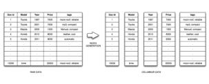

Pinot segment 按列组织数据，并用字典编码、数值位压缩等多种编码策略缩小体积，也支持倒排索引。典型 segment 的大小从数百 MB 到数 GB 不等。

Pinot 使用 PQL 查询。PQL 是 SQL 的一个子集，建模方式与 SQL 相似，支持选择、投影、聚合和 top-n 查询，但不支持连接或嵌套查询，也不提供 DDL 以及记录级创建、更新或删除。

### 3.2 组件

Pinot 有四类承担数据存储、数据管理和查询处理的主要组件：controller、broker、server 和 minion。此外，它依赖 ZooKeeper 和持久对象存储两项外部服务。Pinot 使用 Apache Helix [13] 管理集群；Helix 是一个通用集群管理框架，负责分布式系统中的分区和副本。

**Server。** Server 是托管 segment 并在其上处理查询的核心组件。一个 segment 在 UNIX 文件系统中对应一个目录，其中包含 segment 元数据文件和索引文件。元数据记录 segment 的列集合，以及各列的类型、基数、编码、统计信息和可用索引。索引文件存放所有列的索引，而且是仅追加文件，因此 server 可以按需创建倒排索引。Server 采用可插拔架构，既能加载不同存储格式的列式索引，也能在运行时生成合成列；它还可以方便地扩展为直接读取 HDFS、S3 等分布式文件系统。每个数据中心内会保留同一 segment 的多个副本，以提高可用性和查询吞吐量；所有副本都参与查询处理。

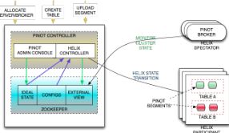

**Controller。** Controller 按可配置策略维护 segment 到 server 的权威映射。它拥有这份映射，并在运维人员发出请求或 server 可用性变化时触发调整。它还提供列出、添加和删除表或 segment 等管理操作。表可以配置保留期，controller 会垃圾回收超过保留期的 segment。全部元数据和映射都由 Apache Helix 管理。为了容错，每个数据中心运行三个 controller 实例，但只有一个 master；非 leader controller 大部分时间空闲。Master 选举由 Helix 管理。

**Broker。** Broker 把传入查询路由到适当的 server，收集部分查询响应，合并成最终结果，再返回客户端。Pinot 客户端通过 HTTP 向 broker 发送查询，所以可以在 broker 池前放置负载均衡器。

**Minion。** Minion 负责计算密集型维护任务，执行 controller 作业调度系统分配的任务。任务管理与调度框架可以扩展新的作业及调度类型，以适应业务需求变化。数据清除就是一个例子：为满足各种法律要求，LinkedIn 有时必须清除特定会员的数据。由于 Pinot 数据不可变，例行作业会下载 segment，剔除不需要的记录，重写并重新索引 segment，再上传回 Pinot，以替换旧 segment。

**ZooKeeper 与对象存储。** ZooKeeper 既是持久元数据存储，也是集群节点间的通信机制。集群状态、segment 分配和元数据都经 Helix 存入 ZooKeeper；segment 数据本身则位于持久对象存储。LinkedIn 内部的 Pinot 使用本地 NFS 挂载点存储数据，在其数据中心之外运行时也使用过 Azure Disk Storage。

### 3.3 常见操作

下面说明 Pinot 中几种常见操作的实现。

#### 3.3.1 Segment 装载

Helix 用状态机表示集群状态；集群中的每项资源都有当前状态和目标状态。任一状态变化时，Helix 都会把相应的状态转换发送给对应节点执行。

Pinot 用图 3 所示的简单状态机管理 segment。segment 最初处于 `OFFLINE`，Helix 请求 server 节点执行从 `OFFLINE` 到 `ONLINE` 的转换。Server 为完成这一转换，会从对象存储取得相应 segment，解包、加载，并使其可供查询执行；转换完成后，Helix 中该 segment 被标记为 `ONLINE`。

需要从 Kafka 消费的实时数据则从 `OFFLINE` 转到 `CONSUMING`。Server 处理该转换时，会以给定起始 offset 创建 Kafka consumer；这个 segment 的所有副本都从 Kafka 中同一位置开始消费。第 3.3.6 节的共识协议会确保全部副本最终收敛为完全一致的 segment。

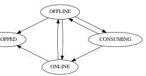

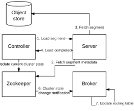

#### 3.3.2 路由表更新

segment 装载或卸载时，Helix 更新集群的当前状态。Broker 监听集群状态变化并更新路由表，即 server 与其可用 segment 之间的映射。这样，随着新副本上线或现有副本被标为不可用，broker 总能把查询路由到可用副本。路由表的创建过程见第 4.4 节。

#### 3.3.3 查询处理

查询到达 broker 后会依次经历以下步骤：

1. 解析并优化查询。
2. 随机选择该表的一张路由表。
3. 联系路由表中的所有 server，请它们在表中各自负责的一组 segment 上处理查询。
4. Server 根据索引可用性和列元数据生成逻辑与物理查询计划。
5. 调度查询计划执行。
6. 全部查询计划执行完成后，收集并合并结果，再返回 broker。
7. Broker 收齐 server 结果后，合并各 server 的部分结果。处理中的错误或超时会把结果标记为“部分结果”，客户端可以选择向用户显示不完整结果，或稍后重新提交查询。
8. 向客户端返回查询结果。

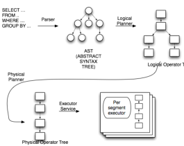

Pinot 能动态合并来自离线系统和实时系统的数据流。为此，混合表（hybrid table）的离线部分与实时部分在时间上会有重叠。图 6 的假设表每天有两个 segment，8 月 1 日和 2 日存在重叠数据。查询到达 Pinot 后，会透明地改写成两个查询：离线子查询读取时间边界之前的数据，实时子查询读取时间边界及之后的数据。

两个查询都完成后，Pinot 合并其结果，从而以很低代价融合离线和实时数据。该方案要求混合表的离线部分与实时部分共享一列时间列。实践中，这一要求并不苛刻，因为写入流式系统的数据大多本来就具有时间属性。

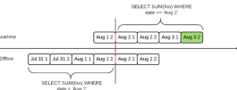

#### 3.3.4 Server 端查询执行

Server 收到查询后，会生成逻辑和物理查询计划。不同 segment 的可用索引及物理记录布局可能不同，因此计划按 segment 生成。这样，Pinot 就能针对特殊情况优化，例如某个谓词匹配 segment 中全部值。若查询能仅用 segment 元数据回答，也会生成专用计划；例如，无谓词地获取某列最大值就无需读取列数据。

物理算子根据估算执行代价选择；系统还可依据逐列统计信息重新排列算子顺序，以降低查询的总体处理代价。最终查询计划提交给查询执行调度器，并行处理。

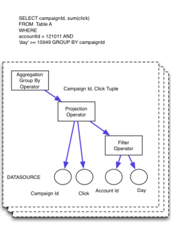

#### 3.3.5 数据上传

上传数据时，segment 通过 HTTP POST 发给 controller。Controller 收到 segment 后，先解包并检查完整性，再确认其大小不会使表超出配额，然后把 segment 元数据写入 ZooKeeper，并通过把适当数量副本的目标状态设为 `ONLINE` 来更新集群目标状态。目标状态更新后，就会触发前述 segment 装载流程。

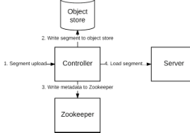

#### 3.3.6 实时 Segment 完成协议

Pinot 从 Kafka 摄取实时数据时，各副本独立消费。所有副本从同一 offset 开始，并使用相同的实时 segment 结束条件。达到结束条件后，segment 被刷盘并提交给 controller。由于 Kafka 只保留一定时间的数据，Pinot 支持按可配置的记录数或可配置的时间间隔刷出 segment。

若独立 consumer 从同一 Kafka partition 和同一 offset 开始，并消费完全相同数量的记录，它们会得到完全相同的数据；但若依据各自本地时钟消费一段时间，则很可能发生偏离。因此，Pinot 设计了 segment 完成协议，让独立副本就最终 segment 的准确内容达成共识。

某个副本完成消费后，server 开始轮询 leader controller，请求指令并报告当前 Kafka offset。Controller 每次返回下列一条指令：

- **`HOLD`：** 暂不执行操作，稍后再次轮询。
- **`DISCARD`：** 丢弃本地数据，从 controller 获取权威副本；当另一副本已经成功提交了不同版本时使用。
- **`CATCHUP`：** 继续消费到指定 Kafka offset，然后再次轮询。
- **`KEEP`：** 把当前 segment 刷盘并加载；当 server 当前 offset 与已提交副本完全相同时使用。
- **`COMMIT`：** 把当前 segment 刷盘并尝试提交；提交失败则恢复轮询，成功则加载 segment。
- **`NOTLEADER`：** 当前 controller 不是集群 leader；server 应查找当前 leader，再恢复轮询。

Controller 的回复由一个状态机管理。状态机会等待足够多的副本联系 controller，或等待从首次轮询起经过足够长时间，然后选出提交者。它尽量让所有副本追赶到各副本报告的最大 offset，并从到达最大 offset 的副本中选择一个提交者。若 controller 故障，新 leader controller 会启动一台全新的空状态机；这只会延迟 segment 提交，不影响正确性。

这一方案在确保 segment 刷出后所有副本数据完全相同的同时，尽量减少了网络传输。

### 3.4 云友好架构

Pinot 从设计之初就考虑了在云基础设施上运行。商用云供应商提供 Pinot 所需的两项关键能力：带本地临时存储的计算底座，以及持久对象存储系统。

因此，Pinot 采用无共享（shared-nothing）架构，实例本身无状态。全部持久数据位于持久对象存储，系统元数据位于 ZooKeeper；本地存储只充当缓存，可以通过从持久对象存储或 Kafka 拉取数据来重建。任何节点都能随时移除，并用一台空白节点替换，而不产生问题。

此外，Pinot 所有面向用户的操作都通过 HTTP 完成，可以复用 HAProxy、nginx 等成熟负载均衡器，也可以使用 LinkedIn D2 这样的客户端软件负载均衡器。

这套云友好架构使 Pinot 很容易迁移到现成的容器执行服务；所需代码改动仅限于适配云供应商的对象存储。借助 Kubernetes 等容器管理器，部署和扩容也很方便。

## 4. 扩展 Pinot

Pinot 的若干特性对于在大规模场景下获得可接受性能至关重要。下面说明这些特性如何支持面向 LinkedIn 用户的分析查询服务。

### 4.1 查询执行

Pinot 的查询执行模型可以容纳新的算子和查询形态。例如，早期 Pinot 不支持为 `SELECT COUNT(*)` 这类查询生成纯元数据计划。加入这项能力只需修改查询规划器并新增一个基于元数据的物理算子，无需改变整体架构。

Pinot 针对每种数据表示提供专用物理算子，不同数据编码都有相应算子。这种灵活性允许加入新的索引类型和用于查询优化的专用数据结构。由于 server 可在线重建索引，minion 子系统也能重建索引，Pinot 可以在用户无感知的情况下部署新的索引类型和编码。

### 4.2 索引与物理记录存储

与 Druid 类似，Pinot 支持基于 bitmap 的倒排索引。不过，实践发现，按主列和次列对数据做物理重排，可以显著加速某些查询。

例如，LinkedIn 的 WVMP 功能中，所有查询都在 `vieweeId` 列上带过滤条件。按 `vieweeId` 对记录做物理重排后，每个查询只需考虑列中的一段连续区域；Pinot 对每个 `vieweeId` 只需保存它在列位置中的起止索引。若没有其他谓词，这种相邻布局还允许向量化查询执行。

无法向量化时，Pinot 观察到：退回到迭代器式扫描，扫描列中的一个范围，通常比在大型 bitmap 索引上执行 bitmap 运算更快。因此，构造物理过滤算子时，先执行作用于物理有序列的算子，并把得到的列范围传给后续算子。后续算子只需评估列的一部分，性能因而大幅提高。

### 4.3 冰山查询

冰山查询（iceberg query）[11] 是一类重要查询，只返回超过某个最低标准的聚合结果。例如，分析人员可能想知道哪些国家为某个页面贡献了最多浏览量，而不需要访问过该页的全部国家列表；此时只返回超过最低浏览量阈值的国家，就足以回答问题。这在具有长尾分布的数据集上尤其重要，因为分析人员通常只关心能够“显著撬动”关键指标的因素。这类查询在仪表盘中十分常见。

冰山 cube [3] 把 OLAP cube 扩展为适合回答冰山查询。后续工作提出 star-cubing [29] 等改进；在大多数情况下，star-cubing 比其他冰山 cube 方法计算得更高效。它构建一棵经过剪枝的分层节点结构，称为 star-tree，可以高效遍历以回答查询。

Star-tree 的节点存储预聚合记录。树的每一层都包含满足某一维度冰山条件的节点，以及一个代表该层全部数据的 star 节点。沿树导航即可回答包含多个谓词的查询。图 9 的简单查询计算满足一个谓词的全部 impression 之和：逐层遍历，直到找到保存该查询所需聚合数据的节点。


图 10 的查询包含 `OR` 谓词，需要沿多条路径导航，再组合结果。


Pinot 已实现 star-tree，并经常用它加速内部数据分析工具的分析查询。Pinot 会根据可用索引决定能够使用哪些物理执行节点；若查询可以由 star-tree 优化，就透明地返回预聚合值，否则仍在原始未聚合数据上执行。

### 4.4 查询路由与分区

对于未分区表，Pinot 会预生成路由表。路由表把 server 映射到执行查询时它应处理的一组 segment。形式化地，设 segment 全集为 $U = \{S_1, S_2, \ldots, S_n\}$，集合族 $A$ 含有 $m$ 个集合，分别表示各 server 被分配的 segment。生成一个路由表条目，就是从 $A$ 的元素中选择若干子集，使这些子集的并集恰好覆盖 $U$。

Pinot 支持多种查询路由选项；这些选项在大规模运行时不可或缺。默认的均衡策略把表内所有 segment 均匀分给全部可用 server。也就是说，每次查询都会联系所有 server，让每台 server 在自己负责的 segment 上执行查询。

均衡策略适用于小型和中型集群，但在更大集群上很快就不再实用。直观地说，集群越大，至少一台主机不可用或因异常拖慢处理的概率就越高。[24] 的图 14 和图 16 也用实验表明其他系统中同样存在这种拖尾节点（straggler）。

因此，Pinot 为大型集群提供专用路由策略，尽量减少单次查询联系的主机数。这样可以降低任一异常主机的不利影响，并减少大集群的尾延迟。

寻找 $A$ 的最小子集使其覆盖 $U$ 是 NP-hard 问题。Pinot 实现了一种随机贪心策略，求得近似最小的子集，同时让所有 server 的负载保持均衡。算法 1 和算法 2 分别说明大型集群路由表的生成与筛选：系统先随机选一组 server，继续加入 server 直到完全覆盖 $U$，再把 segment 尽可能均匀地分给所选 server。每张候选路由表都用指标衡量适应度；实测表明，各 server 所分 segment 数量的方差效果很好。最终只保留指标最低的一批路由表。

```text
算法 1：生成路由表

输入：
  S：该表的 segment 集合
  I：分配给该表的实例集合
  T：每次查询的目标 server 数
  IS：instance -> 该 instance 服务的 segment 列表
  SI：segment -> 服务该 segment 的 instance 列表

过程 GenerateRoutingTable
  Sorphan <- S
  Iused <- 空集

  if length(I) <= T then
    Iused <- I
    Sorphan <- 空集
  else
    while length(Iused) <= T do
      Irandom <- PickRandom(I)
      Iused <- Iused union {Irandom}
      Sorphan <- Sorphan - IS.get(Irandom)
    end while
  end if

  while Sorphan 非空 do
    Irandom <- PickRandom(SI.get(Sorphan.first))
    Iused <- Iused union {Irandom}
    Sorphan <- Sorphan - IS.get(Irandom)
  end while

  Qsi <- 按候选实例数升序排列的优先队列
  for Scurrent in S do
    Iseg <- SI.get(Scurrent) intersect Iused
    Qsi.put(Scurrent, Iseg)
  end for

  R <- 空映射
  while Qsi 非空 do
    (Scurrent, Iseg) <- Qsi.takeFirst()
    Ipicked <- PickWeightedRandomReplica(R, Iseg)
    R.put(Scurrent, Ipicked)
  end while

  return R
end procedure
```

```text
算法 2：筛选路由表

输入：
  C：目标路由表数量
  G：要生成的路由表数量

过程 FilterRoutingTables
  H <- 保存 (routing table, metric) 的空最大堆

  for i <- 1..C do
    R <- GenerateRoutingTable()
    M <- ComputeMetric(R)
    H.put(R, M)
  end for

  for i <- C..G do
    R <- GenerateRoutingTable()
    M <- ComputeMetric(R)
    (Rtop, Mtop) <- H.top()
    if M <= Mtop then
      H.pop()
      H.put(R, M)
    end if
  end for
end procedure
```

Pinot 也支持按分区函数对数据划分的分区表。表被分区后，router 不生成上述路由表，而会根据查询过滤条件，只把查询路由到包含相关 segment 的 server。Pinot 还提供与 Kafka 分区函数行为一致的分区函数，使离线数据可以采用与实时数据相同的分区方式。

### 4.5 多租户

对大型公司而言，为每种用例建立专用集群最终会成为问题。LinkedIn 当时已有数千张表，分属 50 多个租户（tenant）。

Pinot 因而支持多租户，把多个租户共同部署在同一套硬件上。为了防止某个租户耗尽其他租户的查询资源，系统使用令牌桶按租户分配查询资源。每个查询从所属租户的桶中扣除与查询执行时间成比例的令牌；桶空时，查询进入队列，等令牌可用后再处理。令牌桶随时间缓慢补充，因此允许短暂查询尖峰，同时阻止异常租户耗尽与其共置的其他租户的资源。

## 5. 生产环境中的 Pinot

在 LinkedIn，Pinot 运行于 3,000 多台分布在不同地理位置的主机上，服务 1,500 多张表、100 多万个 segment；不计数据副本，总压缩数据量接近 30 TiB。所有数据中心合计的生产查询率超过每秒 50,000 次。下面总结 LinkedIn 大规模运行 Pinot 得到的实践经验。

### 5.1 用例类型

LinkedIn 观察到，Pinot 用户大致分为两类：

- 高吞吐、低复杂度查询，例如 WVMP、新闻流定制等相对简单的分析功能。
- 查询率较低，但查询更复杂或数据量更大的用例，例如广告主受众覆盖、自助分析工具和异常检测工具。

第一类用例为了达到每秒数万次查询，通常要求数据常驻主内存；这类用户运行的查询模式很少。

第二类用例通常共同部署在带 NVMe 存储的硬件上，因为其查询率较低、延迟要求较宽松，可以按需加载数据。这类用户平时查询率低，但在请求仪表盘或开始分析异常时会出现突发查询。对它们而言，与其他租户共置很重要；否则硬件会有相当一部分时间闲置，硬件规模也难以压缩。

### 5.2 运维问题

LinkedIn 以服务模式运行 Pinot：开发用户功能的团队像使用其他服务一样使用 Pinot，Pinot 团队则持续提供支持并负责日常运行。随着使用 Pinot 的团队数量增长，如果为每个团队配备专人支持和调优，人员需求也会持续增长。因此，Pinot 在设计上尽量支持自助服务。

例如，Pinot 允许在线修改 schema、添加新列而不停机。向既有 schema 加入新列时，所有已有 segment 都会自动以默认值补上该列，并在几分钟内可供查询。系统还会持续解析查询日志和执行统计，自动为确实有收益的列添加倒排索引。

跨多个数据中心和环境（测试、生产）复制表配置一直是一个常见难题。LinkedIn 的方案是把表配置保存在源码控制中，再通过 Pinot REST API 持续同步。这样既有完整的变更审计轨迹，也能对全部 schema、索引和配置变更复用搜索、校验与代码审查工具。

## 6. 性能

本节在从低吞吐到高吞吐的多种场景下评测 Pinot，并将其与架构相近的 Druid 比较。为保证评测真实，数据集和查询都取自生产系统：每个场景使用该场景的完整数据集，并从生产查询中抽样出数万条不同查询，以模拟生产环境。由于很难为两套系统建立可重复的共同环境，Pinot 与 Druid 均关闭了实时摄取。

两套系统都用 9 台查询处理主机，每台配备单路 2.50 GHz Xeon E5-2680 v3、64 GiB 内存和 2.8 TB NVMe 存储，操作系统为 Red Hat Enterprise Linux 6.9（Santiago）。Pinot server 安装在这些主机上；按 Druid 文档建议，Druid historical server 和 middle manager 共同运行在这些主机上。

查询分发使用 3 个 Pinot broker 实例。每台 Pinot broker 配备双路 2.60 GHz Xeon E5-2630 v2 和 64 GiB 内存；其中一台运行 RHEL 6.5，另两台运行 RHEL 6.6。Druid broker 配备单路 2.50 GHz Xeon E5-2680 v3 和 64 GiB 内存；一台运行 RHEL 6.7，另外两台运行 RHEL 6.9。其中一台 Druid broker 主机还运行 coordinator 和 overlord。

**即席报告与异常检测。**

第一个场景复现 LinkedIn 对多维关键业务指标做即席报告和异常检测的环境。异常检测系统包含用户可见组件，因此查询集既有监控所用的自动生成查询，也有用户对检测到的异常做根因分析时发出的即席查询。Pinot 必须同时为自动查询提供高吞吐，也为交互式用户查询提供低延迟。查询会聚合指标，并根据具体下钻请求包含数量不定的过滤谓词和分组子句。

该场景的数据规模在 Pinot 中为 **16 GB**，在 Druid 中为 **13.8 GB**。图 11 随查询率增加比较不同索引策略的延迟，曲线分别给出第 50、90、95、99 百分位。Druid 在该数据集上的延迟很快就高到不再适合交互；无索引 Pinot 的性能也很快下降。加入倒排索引后，Pinot 在此数据集上的可扩展性提高 **2 倍**；最大的扩展性收益则来自第 4.3 节的 star-tree。

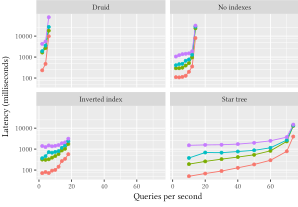

图 12 的核密度估计展示连续执行 **10,000 条查询**时，Druid 与 Pinot 各索引方案的查询延迟分布。所有系统的性能都可满足用户交互。Druid 与无索引 Pinot 的单查询性能相当：一部分查询在 Druid 上更快，但 Druid 中高延迟查询也多于无索引 Pinot。适配工作负载的索引类型均优于无索引数据。

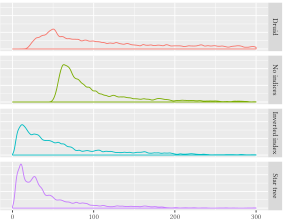

图 13 展示使用 star-tree 时扫描的预聚合记录数与原始未聚合记录数之比。比值接近 **0**，表示回答查询所用的聚合记录远少于扫描原始数据；接近 **1**，表示预聚合收益很小。可以看到，大多数查询所处理的记录显著少于在原始未聚合数据上执行时的数量。

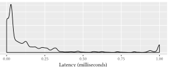

**面向最终用户的高选择性分析。**

Pinot 还用于回答终端用户发出的高选择性分析查询。例如，用户侧分析工具允许有限度地分析谁看过自己发布的内容，WVMP 也允许分析主页访客。查询通常是简单聚合，如点击/浏览量求和、访客去重计数，并针对一条分享内容或某个用户主页的访问，提供地区、资历、行业等少量分析切面。

该场景的数据规模在 Pinot 中为 **300 GB**，在 Druid 中为 **1.2 TB**。图 14 展示查询率上升时两者的性能。这个对比中有两项主要差异：倒排索引的生成方式，以及物理行排序。Druid 为所有维度列建立倒排索引，但过滤谓词并不会使用所有维度，因此 Druid 的磁盘占用大于 Pinot。两者的大部分性能差异来自 Pinot 的物理行排序：数据按分享内容标识符排序。

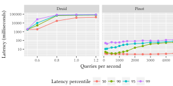

第 4.2 节已经说明，记录的物理顺序显著影响可扩展性。图 15 在 WVMP 数据集上比较 Pinot 的物理有序记录与基于 bitmap 的倒排索引。Druid 和 Pinot 的 bitmap 倒排索引都使用 Roaring Bitmap [6, 7]。图中查询率范围达到每秒 **5,000 次**，并给出第 50、90、95、99 百分位延迟。

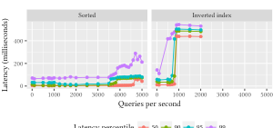

**Impression discounting 与路由优化。**

另一个有代表性的 Pinot 场景是 impression discounting [22]：系统跟踪某位用户已经看过哪些内容，并据此个性化内容展示。对用户已经见过的条目，会根据用户与这些条目的交互做“折扣”，使被忽略的条目在该用户的排序中降低。这样，用户看到的新闻流会更鲜活、更相关，较少出现已被忽略的内容。

对 Pinot 而言，每次查看新闻流都会发出多个查询，以取得该用户已经看过的条目列表。每次新闻流查看和滚动还会发送新的事件，由 Pinot 建立索引，使其近实时地供后续查询使用。

图 16 展示加入第 4.4 节查询路由优化后的结果，并以 Druid 为基线。Druid 在此数据集上的性能显著优于它在其他数据集上的表现，但扩展性仍不及 Pinot。低查询率时，未分区表与分区表性能相近；查询率升高后，在 broker 中加入分区感知限制了额外开销，使延迟曲线明显更平坦。图中 Druid 测到约每秒 **120 次**查询，无路由优化 Pinot 测到每秒 **3,000 次**，带路由优化 Pinot 测到每秒 **4,000 次**；均展示第 50、90、95、99 百分位延迟。

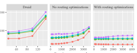

## 7. 结论

本文介绍了一套生产级系统的架构及其规模化经验。Pinot 在严苛的 Web 环境中每秒服务数万次查询；同一套系统能够处理大型网站常见的多类分析查询。

本文还使用来自大型职业社交网络的生产数据与查询，将 Pinot 与相近系统 Druid 比较，并评估 Pinot 中不同索引技术和优化的影响。

未来工作包括加入更多索引类型和用于查询优化的专用数据结构，并观察它们对查询性能及服务可扩展性的影响。

## 参考文献

- [1] 2016. *Presto: Distributed SQL Query Engine for Big Data*. https://prestodb.io/
- [2] Daniel Abadi, Samuel Madden, and Miguel Ferreira. 2006. Integrating compression and execution in column-oriented database systems. In *Proceedings of the 2006 ACM SIGMOD International Conference on Management of Data*. ACM, 671–682.
- [3] Kevin Beyer and Raghu Ramakrishnan. 1999. Bottom-up computation of sparse and iceberg cube. In *ACM SIGMOD Record*, 28(2). ACM, 359–370.
- [4] MKABV Bittorf, Taras Bobrovytsky, Casey Ching Alan Choi Justin Erickson, Martin Grund Daniel Hecht, Matthew Jacobs Ishaan Joshi Lenni Kuff, Dileep Kumar Alex Leblang, Nong Li Ippokratis Pandis Henry Robinson, David Rorke Silvius Rus, John Russell Dimitris Tsirogiannis Skye Wanderman, and Milne Michael Yoder. 2015. Impala: A modern, open-source SQL engine for Hadoop. In *Proceedings of the 7th Biennial Conference on Innovative Data Systems Research*.
- [5] Peter A. Boncz, Marcin Zukowski, and Niels Nes. 2005. MonetDB/X100: Hyper-Pipelining Query Execution. In *CIDR*, Vol. 5, 225–237.
- [6] Samy Chambi, Daniel Lemire, Robert Godin, Kamel Boukhalfa, Charles R. Allen, and Fangjin Yang. 2016. Optimizing Druid with Roaring Bitmaps. In *Proceedings of the 20th International Database Engineering & Applications Symposium*. ACM, 77–86.
- [7] Samy Chambi, Daniel Lemire, Owen Kaser, and Robert Godin. 2016. Better bitmap performance with Roaring Bitmaps. *Software: Practice and Experience* 46(5), 709–719.
- [8] C. Chen. 2005. Top 10 unsolved information visualization problems. *IEEE Computer Graphics and Applications* 25(4), 12–16. https://doi.org/10.1109/MCG.2005.91
- [9] Jack Chen, Samir Jindel, Robert Walzer, Rajkumar Sen, Nika Jimsheleishvilli, and Michael Andrews. 2016. The MemSQL Query Optimizer: A modern optimizer for real-time analytics in a distributed database. *Proceedings of the VLDB Endowment* 9(13), 1401–1412.
- [10] Jeffrey Dean, Sanjay Ghemawat, and Google Inc. 2004. MapReduce: Simplified data processing on large clusters. In *OSDI '04: Proceedings of the 6th Symposium on Operating Systems Design & Implementation*. USENIX Association.
- [11] Min Fang, Narayanan Shivakumar, Hector Garcia-Molina, Rajeev Motwani, and Jeffrey D. Ullman. 1999. Computing Iceberg Queries Efficiently. In *International Conference on Very Large Databases (VLDB '98)*. Stanford InfoLab.
- [12] Franz Färber, Sang Kyun Cha, Jürgen Primsch, Christof Bornhövd, Stefan Sigg, and Wolfgang Lehner. 2012. SAP HANA database: Data management for modern business applications. *ACM SIGMOD Record* 40(4), 45–51.
- [13] Kishore Gopalakrishna, Shi Lu, Zhen Zhang, Adam Silberstein, Kapil Surlaker, Ramesh Subramonian, and Bob Schulman. 2012. Untangling cluster management with Helix. In *ACM Symposium on Cloud Computing (SOCC '12)*, San Jose, CA, USA, October 14–17, 2012, Article 19.
- [14] Alexander Hall, Olaf Bachmann, Robert Büssow, Silviu Gănceanu, and Marc Nunkesser. 2012. Processing a trillion cells per mouse click. *Proceedings of the VLDB Endowment* 5(11), 1436–1446.
- [15] Jeffrey Heer and Ben Shneiderman. 2012. Interactive Dynamics for Visual Analysis. *Queue* 10(2), Article 30, 26 pages. https://doi.org/10.1145/2133416.2146416
- [16] Jean-François Im, Michael J. McGuffin, and Rock Leung. 2013. GPLOM: The generalized plot matrix for visualizing multidimensional multivariate data. *IEEE Transactions on Visualization and Computer Graphics* 19(12), 2606–2614.
- [17] Jean-François Im, Félix Giguère Villegas, and Michael J. McGuffin. 2013. VisReduce: Fast and responsive incremental information visualization of large datasets. In *Proceedings of the IEEE Big Data Visualization Workshop 2013*.
- [18] Chris Johnson. 2004. Top scientific visualization research problems. *IEEE Computer Graphics and Applications* 24.
- [19] Jay Kreps, Neha Narkhede, Jun Rao, et al. 2011. Kafka: A distributed messaging system for log processing. In *Proceedings of NetDB*, 1–7.
- [20] Tirthankar Lahiri, Shasank Chavan, Maria Colgan, Dinesh Das, Amit Ganesh, Mike Gleeson, Sanket Hase, Allison Holloway, Jesse Kamp, Teck-Hua Lee, et al. 2015. Oracle database in-memory: A dual format in-memory database. In *2015 IEEE 31st International Conference on Data Engineering (ICDE)*. IEEE, 1253–1258.
- [21] Andrew Lamb, Matt Fuller, Ramakrishna Varadarajan, Nga Tran, Ben Vandiver, Lyric Doshi, and Chuck Bear. 2012. The Vertica analytic database: C-Store 7 years later. *Proceedings of the VLDB Endowment* 5(12), 1790–1801.
- [22] Pei Lee, Laks V. S. Lakshmanan, Mitul Tiwari, and Sam Shah. 2014. Modeling impression discounting in large-scale recommender systems. In *Proceedings of the 20th ACM SIGKDD International Conference on Knowledge Discovery and Data Mining*. ACM, 1837–1846.
- [23] Nathan Marz and James Warren. 2015. *Big Data: Principles and Best Practices of Scalable Realtime Data Systems*. Manning Publications Co.
- [24] Sergey Melnik, Andrey Gubarev, Jing Jing Long, Geoffrey Romer, Shiva Shivakumar, Matt Tolton, and Theo Vassilakis. 2010. Dremel: Interactive analysis of web-scale datasets. *Proceedings of the VLDB Endowment* 3(1–2), 330–339.
- [25] Vijayshankar Raman, Gopi Attaluri, Ronald Barber, Naresh Chainani, David Kalmuk, Vincent KulandaiSamy, Jens Leenstra, Sam Lightstone, Shaorong Liu, Guy M. Lohman, et al. 2013. DB2 with BLU acceleration: So much more than just a column store. *Proceedings of the VLDB Endowment* 6(11), 1080–1091.
- [26] Mike Stonebraker, Daniel J. Abadi, Adam Batkin, Xuedong Chen, Mitch Cherniack, Miguel Ferreira, Edmond Lau, Amerson Lin, Sam Madden, Elizabeth O'Neil, et al. 2005. C-Store: A column-oriented DBMS. In *Proceedings of the 31st International Conference on Very Large Data Bases*. VLDB Endowment, 553–564.
- [27] Ashish Thusoo, Joydeep Sen Sarma, Namit Jain, Zheng Shao, Prasad Chakka, Suresh Anthony, Hao Liu, Pete Wyckoff, and Raghotham Murthy. 2009. Hive: A warehousing solution over a MapReduce framework. *Proceedings of the VLDB Endowment* 2(2), 1626–1629.
- [28] Lili Wu, Roshan Sumbaly, Chris Riccomini, Gordon Koo, Hyung Jin Kim, Jay Kreps, and Sam Shah. 2012. Avatara: OLAP for web-scale analytics products. *Proceedings of the VLDB Endowment* 5(12), 1874–1877.
- [29] Dong Xin, Jiawei Han, Xiaolei Li, and Benjamin W. Wah. 2003. Star-cubing: Computing iceberg cubes by top-down and bottom-up integration. In *Proceedings of the 29th International Conference on Very Large Data Bases*, Vol. 29. VLDB Endowment, 476–487.
- [30] Fangjin Yang, Eric Tschetter, Xavier Léauté, Nelson Ray, Gian Merlino, and Deep Ganguli. 2014. Druid: A real-time analytical data store. In *Proceedings of the 2014 ACM SIGMOD International Conference on Management of Data*. ACM, 157–168.
- [31] Matei Zaharia, Mosharaf Chowdhury, Michael J. Franklin, Scott Shenker, and Ion Stoica. 2010. Spark: Cluster Computing with Working Sets. *HotCloud* 10, 10–10.
- [32] Hongwei Zhao and Xiaojun Ye. 2013. A multidimensional OLAP engine implementation in key-value database systems. In *Workshop on Big Data Benchmarks*. Springer, 155–170.
