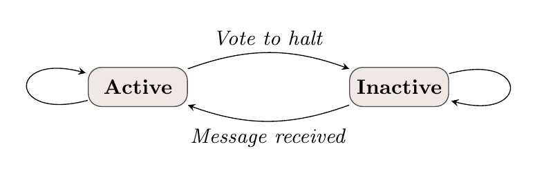
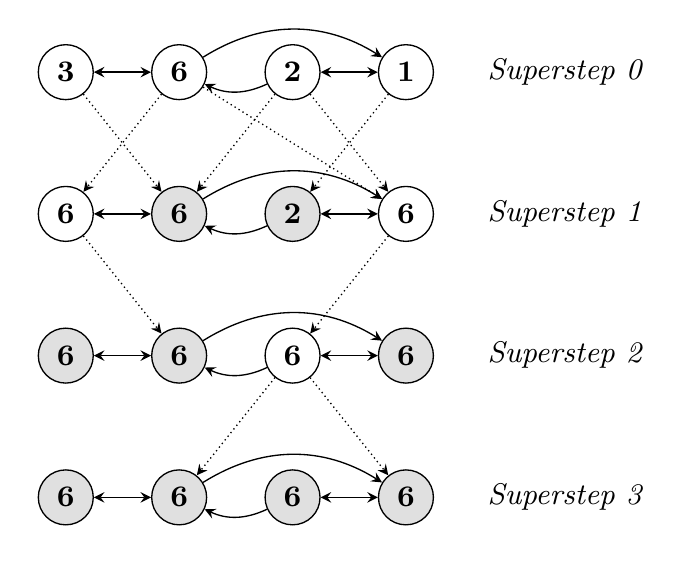
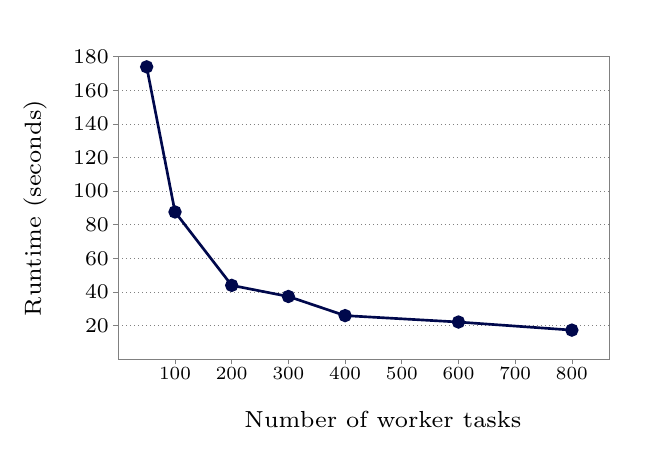
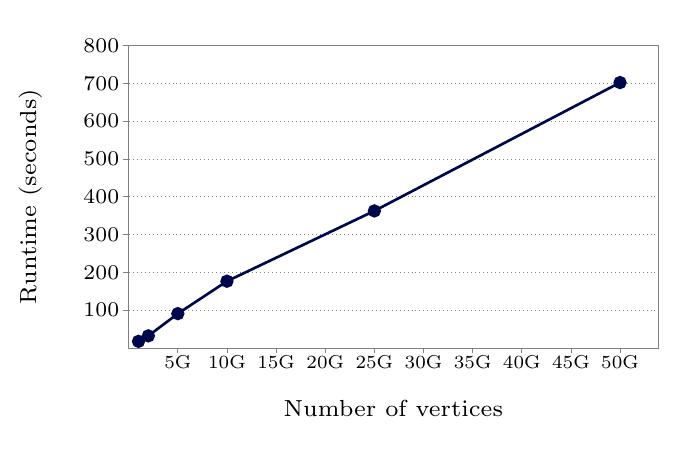
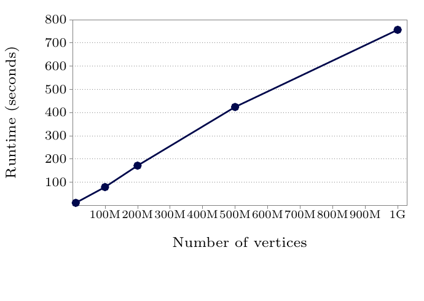

# Pregel: A System for Large-Scale Graph Processing（中文译文）

## 译者说明

本文依据同目录的 `source.pdf` 翻译。章节、图表、公式、算法、代码与参考文献按原文结构保留。

## 作者与机构

Grzegorz Malewicz、Matthew H. Austern、Aart J. C. Bik、James C. Dehnert、Ilan Horn、Naty Leiser、Grzegorz Czajkowski

Google, Inc.

电子邮箱：`{malewicz,austern,ajcbik,dehnert,ilan,naty,gczaj}@google.com`

## 摘要

许多实际计算问题都与大图有关。标准例子包括 Web 图和各种社交网络。这些图的规模——有时达到数十亿个顶点、数万亿条边——给高效处理带来了挑战。本文中，我们提出一种适合完成这项任务的计算模型。程序被表达为一系列迭代；在每次迭代中，一个顶点可以接收上一轮迭代发送的消息、向其他顶点发送消息、修改自身及其出边的状态，或改变图的拓扑。这种以顶点为中心（vertex-centric）的方法足够灵活，可以表达广泛的一组算法。该模型面向由数千台普通计算机构成的集群，旨在实现高效、可扩展且容错的执行；模型所蕴含的同步性也使程序推理更加容易。与分布式执行有关的细节被隐藏在抽象 API 之后。最终得到的是一个既有表达力又易于编程的大图处理框架。

### 类别与主题描述符

- D.1.3 [Programming Techniques]：Concurrent Programming—Distributed programming
- D.2.13 [Software Engineering]：Reusable Software—Reusable libraries

### 一般术语

设计，算法

### 关键词

分布式计算，图算法

### 出版信息

SIGMOD ’10，2010 年 6 月 6–11 日，美国印第安纳州印第安纳波利斯。

允许免费制作本作品全部或部分内容的数字或纸质副本，用于个人或课堂用途，但前提是副本不得以营利或商业优势为目的制作或分发，并且须在首页保留本声明及完整引文。以其他方式复制、再版、发布到服务器或再分发到邮件列表，须事先获得明确许可和/或支付费用。

Copyright 2010 ACM 978-1-4503-0032-2/10/06 ...\$10.00.

## 1. 引言

互联网使 Web 图成为广受关注的分析与研究对象。Web 2.0 又推动了人们对社交网络的兴趣。其他大图——例如由交通线路、报纸文章的相似性、疾病传播路径，或已发表科学工作的引用关系所形成的图——也已经被处理了几十年。经常使用的算法包括最短路径计算、不同形式的聚类，以及 PageRank 主题的各种变体。还有许多其他具有实际价值的图计算问题，例如最小割和连通分量。

高效处理大图十分困难。图算法通常表现出较差的内存访问局部性、每个顶点上的工作量很少，而且执行过程中的并行度会发生变化 [31, 39]。将计算分布到许多机器上会进一步加剧局部性问题，也会提高计算期间机器发生故障的概率。尽管大图无处不在且具有商业重要性，但据我们所知，还不存在一种可扩展的通用系统，能够在大规模分布式环境中、针对任意图表示实现任意图算法。

实现一个处理大图的算法，通常意味着要从以下方案中选择：

1. 打造定制的分布式基础设施。这通常需要投入大量实现工作，而且每遇到一个新算法或一种新图表示就必须重新进行。
2. 依赖已有的分布式计算平台，而这类平台往往不适合图处理。例如，MapReduce [14] 非常适合广泛的大规模计算问题。它有时也被用于挖掘大图 [11, 30]，但这样做可能造成次优性能和可用性问题。基础数据处理模型已经扩展到支持聚合 [41] 和类似 SQL 的查询 [40, 47]，但这些扩展通常并不适合往往更契合消息传递模型的图算法。
3. 使用单机图算法库，例如 BGL [43]、LEDA [35]、NetworkX [25]、JDSL [20]、Stanford GraphBase [29] 或 FGL [16]；这样会限制可处理问题的规模。
4. 使用已有的并行图系统。Parallel BGL [22] 和 CGMgraph [8] 库处理并行图算法，但不处理容错以及对超大规模分布式系统至关重要的其他问题。

这些方案都不符合我们的目的。为了处理大规模图的分布式计算，我们构建了一个可扩展、容错的平台，其 API 足够灵活，能够表达任意图算法。本文描述由此产生的系统 Pregel[^1]，并报告我们使用它的经验。

[^1]: 这个名字是为纪念 Leonhard Euler。启发了他著名定理的柯尼斯堡七桥横跨 Pregel 河。

Pregel 程序的高层组织方式受到 Valiant 的整体同步并行（Bulk Synchronous Parallel，BSP）模型 [45] 启发。Pregel 计算由一系列称为超步（superstep）的迭代组成。在一个超步期间，框架从概念上并行地为每个顶点调用用户定义函数。该函数规定单个顶点 $V$ 在单个超步 $S$ 中的行为。它可以读取在超步 $S-1$ 中发送给 $V$ 的消息，发送将在超步 $S+1$ 中由其他顶点接收的消息，并修改 $V$ 及其出边的状态。消息通常沿出边发送，但也可以发送到标识符已知的任意顶点。

以顶点为中心的方法让人联想到 MapReduce：用户聚焦于一种局部动作，独立处理每个数据项，而系统组合这些动作，将计算提升到大数据集之上。该模型在设计上非常适合分布式实现：它不暴露任何检测同一超步内执行顺序的机制，而且所有通信都从超步 $S$ 发往超步 $S+1$。

该模型的同步性使实现算法时更容易推理程序语义，并确保 Pregel 程序天然不存在异步系统中常见的死锁和数据竞争。原则上，只要有足够的并行余量（parallel slack）[28, 34]，Pregel 程序的性能就应当可以与异步系统竞争。由于典型图计算中的顶点数远多于机器数，应当能够平衡机器负载，使超步之间的同步不会增加过多延迟。

本文其余部分组织如下。第 2 节描述计算模型。第 3 节描述该模型如何表达为 C++ API。第 4 节讨论实现问题，包括性能与容错。在第 5 节中，我们给出该模型在若干图算法问题上的应用；在第 6 节中，我们给出性能结果。最后，我们讨论相关工作和未来方向。

## 2. 计算模型

Pregel 计算的输入是一个有向图，其中每个顶点都由一个字符串顶点标识符唯一标识。每个顶点关联一个可修改、由用户定义的值。有向边与其源顶点关联，每条边由一个可修改、由用户定义的值以及一个目标顶点标识符组成。

典型的 Pregel 计算首先执行输入阶段以初始化图，随后执行一系列由全局同步点分隔的超步，直至算法终止，最后执行输出阶段。

在每个超步内，顶点并行计算，每个顶点都执行表达给定算法逻辑的同一个用户定义函数。一个顶点可以修改自身状态或出边状态，接收上一超步发送给它的消息，向其他顶点发送消息（这些消息将在下一超步收到），甚至改变图的拓扑。边在这个模型中不是一等公民，它们没有关联的计算。

算法终止以每个顶点都投票停止为依据。在超步 0 中，每个顶点都处于活动状态；所有活动顶点都参与任一给定超步的计算。顶点通过投票停止使自身转为非活动状态。这表示该顶点在没有外部触发时已经没有工作要做；除非它收到消息，否则 Pregel 框架不会在后续超步中执行它。一个顶点若因收到消息而重新激活，就必须再次显式使自身转为非活动状态。当所有顶点同时处于非活动状态且没有传输中的消息时，整个算法终止。图 1 展示了这个简单的状态机。



**图 1：顶点状态机。** `Vote to halt` 表示“投票停止”，`Message received` 表示“收到消息”，`Active` 与 `Inactive` 分别表示“活动”和“非活动”。

Pregel 程序的输出是顶点显式输出的那组值。它通常是与输入同构的有向图，但这不是系统的必要性质，因为计算期间可以添加和删除顶点与边。例如，聚类算法可能从一个大图中选出一小组彼此断开的顶点；图挖掘算法也可能只输出从图中挖掘出的聚合统计信息。

图 2 用一个简单例子说明这些概念：给定一个强连通图，其中每个顶点都包含一个值，算法把最大值传播到每个顶点。在每个超步中，任何从消息中获知了更大值的顶点都会把该值发送给所有邻居。当某个超步中不再有顶点发生变化时，算法终止。



**图 2：最大值示例。** 虚线表示消息；带阴影的顶点已经投票停止。图中 `Superstep 0` 至 `Superstep 3` 分别表示超步 0 至超步 3。

我们选择纯消息传递模型，省略远程读取以及其他模拟共享内存的方式，原因有二。第一，消息传递的表达能力足够强，因此不需要远程读取。我们尚未发现任何消息传递不足以表达的图算法。第二，这种选择具有更好的性能。在集群环境中，从远程机器读取一个值会产生很难隐藏的高延迟。我们的消息传递模型允许我们通过异步批量投递消息来摊销延迟。

图算法可以写成一系列串联的 MapReduce 调用 [11, 30]。出于可用性和性能方面的原因，我们选择了不同的模型。Pregel 把顶点和边保留在执行计算的机器上，仅使用网络传输消息。然而，MapReduce 本质上是函数式的，因此把图算法表达成串联的 MapReduce，需要把图的完整状态从一个阶段传递到下一个阶段——通常需要更多通信以及相关的序列化开销。此外，协调串联 MapReduce 各阶段的需求会增加编程复杂度，而 Pregel 对超步的迭代避免了这一点。

## 3. C++ API

本节讨论 Pregel C++ API 最重要的方面，省略相对机械性的细节。

编写 Pregel 程序需要继承预定义的 `Vertex` 类（见图 3）。它的模板参数定义三种值类型，分别与顶点、边和消息关联。每个顶点都关联一个指定类型的值。这种一致性看起来可能有所限制，但用户可以通过使用 protocol buffers [42] 等灵活类型来处理。边类型和消息类型的行为与此类似。

用户重写虚函数 `Compute()`，框架会在每个超步中对每个活动顶点执行该函数。预定义的 `Vertex` 方法允许 `Compute()` 查询当前顶点及其边的信息，并向其他顶点发送消息。`Compute()` 可以通过 `GetValue()` 检查与其顶点关联的值，或通过 `MutableValue()` 修改该值；还可以使用出边迭代器提供的方法检查和修改出边的值。这些状态更新立即可见。由于可见范围仅限于被修改的顶点，不同顶点并发访问值时不会产生数据竞争。

与顶点及其边关联的值，是跨超步持久存在的唯一逐顶点状态。把框架管理的图状态限制为每个顶点或每条边一个值，可以简化主计算循环、图分布和故障恢复。

```cpp
template <typename VertexValue,
          typename EdgeValue,
          typename MessageValue>
class Vertex {
 public:
  virtual void Compute(MessageIterator* msgs) = 0;

  const string& vertex_id() const;
  int64 superstep() const;

  const VertexValue& GetValue();
  VertexValue* MutableValue();
  OutEdgeIterator GetOutEdgeIterator();

  void SendMessageTo(const string& dest_vertex,
                     const MessageValue& message);

  void VoteToHalt();
};
```

**图 3：`Vertex` API 的基础。**

### 3.1 消息传递

顶点通过发送消息彼此直接通信；每条消息由消息值和目标顶点名称组成。消息值的类型由用户作为 `Vertex` 类的模板参数指定。

一个顶点可以在一个超步中发送任意数量的消息。在超步 $S$ 中发送给顶点 $V$ 的所有消息，都会在超步 $S+1$ 调用 $V$ 的 `Compute()` 方法时通过迭代器提供。迭代器中的消息顺序没有保证，但系统保证消息会被投递且不会重复。

常见用法是顶点 $V$ 遍历其出边，向每条边的目标顶点发送一条消息，如下文图 4 的 PageRank 算法（第 5.1 节）所示。不过，`dest_vertex` 不必是 $V$ 的邻居。一个顶点可能从先前收到的消息中获知一个非邻居的标识符，顶点标识符也可能隐式已知。例如，图可能是一个完全图，具有众所周知的顶点标识符 $V_1$ 至 $V_n$；在这种情况下，甚至可能不需要在图中保存显式的边。

当任意消息的目标顶点不存在时，我们执行用户定义的处理器。例如，处理器可以创建缺失的顶点，或从其源顶点删除悬空边。

### 3.2 组合器

发送一条消息会产生一定开销，特别是消息发往另一台机器上的顶点时。在某些情况下，可以借助用户提供的信息减少这种开销。例如，假设 `Compute()` 接收整数消息，并且重要的是所有消息的和，而不是各个值本身。此时，系统可以把若干条发往顶点 $V$ 的消息组合成一条包含其总和的消息，从而减少必须传输和缓冲的消息数量。

组合器（combiner）默认不启用，因为无法以机械方式找到既有用、又与用户 `Compute()` 方法语义一致的组合函数。要启用这项优化，用户需要继承 `Combiner` 类并重写虚函数 `Combine()`。系统不保证哪些消息会被组合（甚至不保证一定会组合）、向组合器提供怎样的分组，也不保证组合顺序；因此，只应当为满足交换律和结合律的运算启用组合器。

对于单源最短路径（第 5.2 节）等某些算法，我们观察到使用组合器后消息流量下降了四倍以上。

### 3.3 聚合器

Pregel 聚合器（aggregator）是一种用于全局通信、监控和数据的机制。每个顶点都可以在超步 $S$ 中向某个聚合器提供一个值；系统使用归约运算符合并这些值，并在超步 $S+1$ 中把结果值提供给所有顶点。Pregel 包含许多预定义聚合器，例如对各种整数或字符串类型执行 `min`、`max` 或 `sum` 运算。

聚合器可以用于统计。例如，对每个顶点的出度应用求和聚合器，可以得到图中的边总数。更复杂的归约运算符可以生成某项统计量的直方图。

聚合器也可以用于全局协调。例如，可以在若干超步中执行 `Compute()` 的一个分支，直至一个逻辑与聚合器判定所有顶点都满足某个条件；然后再执行另一个分支，直至终止。对顶点 ID 应用最小值或最大值聚合器，可以选择一个顶点在算法中承担特殊角色。

要定义新的聚合器，用户需要继承预定义的 `Aggregator` 类，并规定如何使用第一个输入值初始化聚合值，以及如何把多个部分聚合值归约为一个值。聚合运算符应当满足交换律和结合律。

默认情况下，一个聚合器只归约单个超步中的输入值；但也可以定义一种粘性（sticky）聚合器，使其使用所有超步中的输入值。例如，这对于维护全局边数很有用：只有添加或删除边时才调整这个计数。

还可以有更高级的用法。例如，可以使用聚合器为 $\Delta$-stepping 最短路径算法 [37] 实现分布式优先队列。根据暂定距离，把每个顶点分配到一个优先级桶。在一个超步中，顶点把自己的桶索引贡献给最小值聚合器。系统在下一超步把最小值广播给所有 worker，然后最低索引桶中的顶点松弛边。

### 3.4 拓扑变更

某些图算法需要改变图的拓扑。例如，聚类算法可能用单个顶点替换每个簇，最小生成树算法可能删除除树边之外的所有边。就像用户的 `Compute()` 函数可以发送消息一样，它也可以发出添加或删除顶点或边的请求。

多个顶点可能在同一个超步中发出冲突请求（例如，两个请求都要添加顶点 $V$，但给出的初始值不同）。为了实现确定性，我们使用两种机制：偏序和处理器。

与消息一样，拓扑变更在请求发出后的下一超步生效。在该超步内，系统首先执行删除操作；其中先删除边，再删除顶点，因为删除一个顶点会隐式删除它的全部出边。添加操作在删除之后执行；其中先添加顶点，再添加边，而且所有拓扑变更都先于 `Compute()` 调用。这种偏序能使大多数冲突产生确定性结果。

剩余冲突由用户定义的处理器解决。如果在同一个超步中有多个请求要创建同一个顶点，系统默认任意选择一个；但有特殊需求的用户可以在其 `Vertex` 子类中定义适当的处理器方法，指定更好的冲突解决策略。同一种处理器机制也用于解决多个顶点删除请求，或多个边添加、删除请求造成的冲突。我们把冲突解决委托给处理器，以保持 `Compute()` 代码简单。这限制了处理器与 `Compute()` 之间的交互，但在实践中并未造成问题。

我们的协调机制是惰性的：全局拓扑变更直到实际应用时才需要协调。这项设计选择有利于流处理。其直觉是：涉及修改顶点 $V$ 的冲突由 $V$ 自身处理。

Pregel 还支持纯局部变更，即顶点添加或删除自己的出边，或删除自身。局部变更不会引入冲突；让它们立即生效，可以采用更易理解的顺序编程语义，从而简化分布式编程。

### 3.5 输入与输出

图可以采用许多文件格式，例如文本文件、关系数据库中的一组顶点，或 Bigtable [9] 中的行。为了不强制规定具体文件格式，Pregel 把“将输入文件解释为图”的任务与“执行图计算”的任务解耦。同样，输出可以按任意格式生成，并以最适合给定应用的形式存储。Pregel 库为许多常见文件格式提供 reader 和 writer；有特殊需求的用户可以通过继承抽象基类 `Reader` 和 `Writer` 编写自己的实现。

## 4. 实现

Pregel 是针对 Google 集群架构设计的，该架构在文献 [3] 中有详细描述。每个集群由数千台普通 PC 组成，这些 PC 被组织到机架中，机架内部具有高带宽。集群彼此互连，但分布在不同地理位置。

我们的应用通常运行在一个集群管理系统上，该系统通过调度作业来优化资源分配，有时会终止实例或把它们迁移到其他机器。系统包含名称服务，因此可以使用与当前物理机器绑定无关的逻辑名称引用实例。持久数据以文件形式存储在分布式存储系统 GFS [19] 中，或存储在 Bigtable [9] 中；缓冲消息等临时数据则存储在本地磁盘上。

### 4.1 基础架构

Pregel 库把图划分成多个分区；每个分区由一组顶点及这些顶点的全部出边组成。顶点被分配到哪个分区只取决于顶点 ID。这意味着，即使某个顶点归另一台机器所有，甚至该顶点尚不存在，也能知道它属于哪个分区。默认分区函数就是 $\mathrm{hash}(ID) \bmod N$，其中 $N$ 为分区数；用户可以替换这个函数。

顶点到 worker 机器的分配，是 Pregel 中分布式细节不透明的主要地方。有些应用使用默认分配就能良好运行，另一些应用则会受益于自定义分配函数，以便更充分地利用图中固有的局部性。例如，Web 图常用的一种启发式方法，是把表示同一网站页面的顶点放置在一起。

在没有故障的情况下，Pregel 程序的执行包含以下几个阶段：

1. 用户程序的许多副本开始在一个机器集群上执行。其中一个副本担任 master。它不负责图的任何部分，但负责协调 worker 的活动。worker 使用集群管理系统的名称服务发现 master 的位置，并向 master 发送注册消息。
2. master 确定图包含多少个分区，并向每台 worker 机器分配一个或多个分区。分区数可以由用户控制。每个 worker 拥有多个分区，能够在分区之间实现并行和更好的负载均衡，通常会改善性能。每个 worker 负责维护其图分片的状态，在其中的顶点上执行用户的 `Compute()` 方法，并管理发往和来自其他 worker 的消息。每个 worker 都会收到所有 worker 的完整分配集合。
3. master 把用户输入的一部分分配给每个 worker。输入被视为一组记录，其中每条记录可包含任意数量的顶点和边。输入划分与图本身的分区相互独立，通常以文件边界为依据。如果 worker 加载的顶点属于其自己的图分片，就立即更新相应数据结构（第 4.3 节）；否则，worker 向拥有该顶点的远程对等 worker 的队列中加入一条消息。输入加载完成后，所有顶点都被标记为活动状态。
4. master 指示每个 worker 执行一个超步。worker 遍历其活动顶点，每个分区使用一个线程。worker 为每个活动顶点调用 `Compute()`，并交付上一超步中发送的消息。消息以异步方式发送，以便重叠计算与通信并进行批处理，但会在超步结束前送达。worker 完成后向 master 响应，告知下一超步中将有多少个活动顶点。只要仍有任何活动顶点，或仍有任何消息在传输中，就会重复此步骤。
5. 计算停止后，master 可以指示每个 worker 保存自己负责的图分片。

### 4.2 容错

Pregel 通过检查点实现容错。在一个超步开始时，master 指示 worker 把各自分区的状态保存到持久存储，包括顶点值、边值和传入消息；master 另行保存聚合器值。

master 定期向 worker 发送“ping”消息，以检测 worker 故障。如果 worker 在指定时间间隔后仍未收到 ping 消息，该 worker 进程就会终止。如果 master 没有收到某个 worker 的响应，master 就把该 worker 进程标记为已失败。

当一个或多个 worker 发生故障时，分配给这些 worker 的分区当前状态会丢失。master 把图分区重新分配给当前可用的 worker 集合，所有 worker 随后从超步 $S$ 开始处最近可用的检查点重新加载其分区状态。该检查点可能比故障前任意分区完成的最新超步 $S'$ 早若干个超步，因此恢复必须重复缺失的超步。我们依据平均故障间隔模型 [13] 选择检查点频率，在检查点成本和预期恢复成本之间取得平衡。

为了降低恢复成本和延迟，受限恢复（confined recovery）仍在开发中。除基本检查点之外，worker 还在图加载和执行超步期间，记录从其所分配分区发出的消息。恢复随后被限制在丢失的分区上，这些分区从检查点恢复。系统利用健康分区记录的消息，以及恢复中分区重新计算出的消息，重新计算缺失的超步，直至 $S'$。

这种方法只重新计算丢失的分区，因而在恢复时节省计算资源；由于每个 worker 可能只需恢复较少的分区，它还可以缩短恢复延迟。保存发出消息会增加开销，但典型机器具有足够的磁盘带宽，可以保证 I/O 不会成为瓶颈。

受限恢复要求用户算法具有确定性，以免把原始执行保存的消息与恢复过程产生的新消息混合后出现不一致。随机算法可以根据超步和分区，以确定性的方式为伪随机数生成器设定种子，从而变得确定。非确定性算法可以禁用受限恢复，退回基本恢复机制。

### 4.3 Worker 实现

worker 机器在内存中维护自己负责的图分片状态。从概念上看，这可以视为从顶点 ID 到各顶点状态的映射；每个顶点状态由当前值、出边列表（边的目标顶点 ID 和边的当前值）、包含传入消息的队列，以及表明顶点是否活动的标志组成。

worker 执行超步时遍历所有顶点并调用 `Compute()`，向它传入当前值、传入消息的迭代器和出边迭代器。无法访问入边，因为每条入边都属于源顶点拥有的列表，而源顶点通常位于另一台机器上。

出于性能原因，活动顶点标志与传入消息队列分开存储。此外，虽然顶点值和边值都只保存一个副本，但活动顶点标志和传入消息队列各有两个副本：一个用于当前超步，一个用于下一超步。当 worker 在超步 $S$ 中处理顶点时，另一个线程同时在接收其他 worker 执行同一超步时发送的消息。由于顶点接收上一超步发送的消息（见第 2 节），必须把超步 $S$ 和 $S+1$ 的消息分开保存。同样，一条发往顶点 $V$ 的消息到达，意味着 $V$ 将在下一超步中活动，而不一定在当前超步中活动。

当 `Compute()` 请求向另一个顶点发送消息时，worker 进程首先判断目标顶点由远程 worker 机器拥有，还是由发送方所在的同一个 worker 拥有。若目标位于远程，消息会被缓冲，等待投递到目标 worker。当缓冲区大小达到阈值时，最大的缓冲区会被异步刷出，每个缓冲区作为一条网络消息投递到目标 worker。若目标位于本地，则可以进行优化：直接把消息放入目标顶点的传入消息队列。

如果用户提供了组合器（第 3.2 节），系统会在消息加入发出消息队列时，以及消息到达传入消息队列时应用它。后者不会减少网络使用，但会减少存储消息所需的空间。

### 4.4 Master 实现

master 的主要职责是协调 worker 的活动。每个 worker 在注册时都会被分配一个唯一标识符。master 维护当前已知仍然存活的全部 worker 列表，其中包括 worker 的唯一标识符、地址信息以及分配给它的图分片。master 数据结构的大小与分区数成正比，而不是与顶点数或边数成正比，因此单个 master 即使面对非常大的图也能协调计算。

master 的大多数操作——包括输入、输出、计算，以及保存检查点和从检查点恢复——都在屏障处结束：master 向操作开始时所有已知存活的 worker 发送同一个请求，然后等待每个 worker 响应。如果任何 worker 失败，master 就进入第 4.2 节所述的恢复模式。如果屏障同步成功，master 就进入下一阶段。例如，在计算屏障处，master 会增加全局超步索引并进入下一超步。

master 还维护关于计算进度和图状态的统计信息，例如图的总大小、出度分布直方图、活动顶点数、最近若干超步的耗时与消息流量，以及全部用户定义聚合器的值。为了让用户能够监控，master 运行一个 HTTP 服务器来展示这些信息。

### 4.5 聚合器

聚合器（第 3.3 节）通过对用户提供的一组值应用聚合函数，计算单个全局值。每个 worker 都维护一组聚合器实例，以类型名和实例名标识。当 worker 为图的任一分区执行超步时，它会把提供给某个聚合器实例的全部值合并成单个局部值：即在该 worker 所负责分区的所有顶点上进行了部分归约的聚合器值。

超步结束时，worker 形成一棵树，把部分归约后的聚合器继续归约成全局值，并交付给 master。我们使用基于树的归约，而不是通过 worker 链进行流水化，以便并行使用 CPU 执行归约。master 在下一超步开始时把全局值发送给所有 worker。

## 5. 应用

本节给出四个例子，它们是 Pregel 用户为解决实际问题所开发算法的简化版本：PageRank、最短路径、二分图匹配和一种半聚类算法。

### 5.1 PageRank

图 4 给出了 PageRank 算法 [7] 的 Pregel 实现。`PageRankVertex` 类继承自 `Vertex`。它的顶点值类型为 `double`，用于存储暂定 PageRank；消息类型也是 `double`，用于携带 PageRank 的一部分；边值类型为 `void`，因为边不存储信息。

我们假设图已经初始化，使超步 0 中每个顶点的值都是 `1 / NumVertices()`。在前 30 个超步中的每一步，每个顶点都会沿每条出边发送自己的暂定 PageRank 除以出边数所得的值。从超步 1 开始，每个顶点把消息中到达的值累加到 `sum`，并把自己的暂定 PageRank 设为 `0.15 / NumVertices() + 0.85 * sum`。到达超步 30 之后，不再发送消息，每个顶点都投票停止。实践中的 PageRank 算法会一直运行到收敛，并且可以使用聚合器来检测收敛条件。

```cpp
class PageRankVertex
    : public Vertex<double, void, double> {
 public:
  virtual void Compute(MessageIterator* msgs) {
    if (superstep() >= 1) {
      double sum = 0;
      for (; !msgs->Done(); msgs->Next())
        sum += msgs->Value();
      *MutableValue() =
          0.15 / NumVertices() + 0.85 * sum;
    }

    if (superstep() < 30) {
      const int64 n = GetOutEdgeIterator().size();
      SendMessageToAllNeighbors(GetValue() / n);
    } else {
      VoteToHalt();
    }
  }
};
```

**图 4：在 Pregel 中实现的 PageRank。**

### 5.2 最短路径

最短路径问题是图论中最著名的问题之一，并出现在广泛的应用中 [10, 24]；它有几个重要变体。单源最短路径问题要求找到从单个源顶点到图中每个其他顶点的最短路径。 $s\text{-}t$ 最短路径问题要求找到给定顶点 $s$ 和 $t$ 之间的一条最短路径；它有驾车路线规划等显而易见的实际应用，因而受到大量关注。它也相对容易——在道路网等典型图中，解法只访问极少一部分顶点；Lumsdaine 等人 [31] 在一个例子中观察到，3200 万个顶点中只访问了 80,000 个。第三种变体是全点对最短路径；对大图而言，它所需的 $O(|V|^2)$ 存储使其实用性不足。

为了简单和简洁，我们在这里聚焦于单源变体。它非常符合 Pregel 面向大规模图的目标，而且比 $s\text{-}t$ 最短路径问题能提供更有意义的扩展性数据。实现见图 5。

在该算法中，我们假设每个顶点关联的值都初始化为 `INF`，即一个大于图中从源顶点出发的任何可行距离的常量。在每个超步中，每个顶点首先接收邻居以消息形式发送的、从源顶点出发的最新潜在最小距离。如果这些更新中的最小值小于顶点当前关联的值，该顶点就更新自己的值，并向邻居发送潜在更新：每项更新等于新发现的最小距离加上相应出边的权重。

在第一个超步中，只有源顶点会把自己的值从 `INF` 更新为 0，并向其直接邻居发送更新。这些邻居接着更新自己的值并发送消息，于是更新以波前形式穿过整个图。当不再有更新发生时，算法终止；此后每个顶点关联的值就是从源顶点到该顶点的最小距离（值 `INF` 表示该顶点完全不可达）。只要所有边的权重都非负，就能保证算法终止。

```cpp
class ShortestPathVertex
    : public Vertex<int, int, int> {
  void Compute(MessageIterator* msgs) {
    int mindist = IsSource(vertex_id()) ? 0 : INF;
    for (; !msgs->Done(); msgs->Next())
      mindist = min(mindist, msgs->Value());
    if (mindist < GetValue()) {
      *MutableValue() = mindist;
      OutEdgeIterator iter = GetOutEdgeIterator();
      for (; !iter.Done(); iter.Next())
        SendMessageTo(iter.Target(),
                      mindist + iter.GetValue());
    }
    VoteToHalt();
  }
};
```

**图 5：单源最短路径。**

该算法中的消息由潜在的更短距离组成。由于接收顶点最终只关心最小值，该算法适合使用组合器（第 3.2 节）进行优化。图 6 所示的组合器大幅减少了 worker 之间发送的数据量，也减少了执行下一超步前需要缓冲的数据量。虽然图 5 中的代码只计算距离，但将它修改为同时计算最短路径树也相当直接。

```cpp
class MinIntCombiner : public Combiner<int> {
  virtual void Combine(MessageIterator* msgs) {
    int mindist = INF;
    for (; !msgs->Done(); msgs->Next())
      mindist = min(mindist, msgs->Value());
    Output("combined_source", mindist);
  }
};
```

**图 6：取消息值最小值的组合器。**

该算法执行的比较次数可能远多于 Dijkstra 或 Bellman–Ford [5, 15, 17, 24] 等顺序算法，但它能够以任何单机实现都不可行的规模求解最短路径问题。还有更高级的并行算法，例如 Thorup 算法 [44] 或 $\Delta$-stepping 方法 [37]；它们已经被用作专用并行最短路径实现的基础 [12, 32]。这些高级算法也可以在 Pregel 框架中表达。不过，图 5 实现的简洁性，加上已经可以接受的性能（见第 6 节），可能会吸引无法进行大量调优或定制的用户。

### 5.3 二分图匹配

二分图匹配算法的输入由两个互不相交的顶点集合构成，边只存在于两个集合之间；输出是一个没有公共端点的边子集。极大匹配是无法再添加任何一条边而仍不共享端点的匹配。我们实现了随机极大匹配算法 [1] 和最大权二分图匹配算法 [4]；这里我们描述前者。

在该算法的 Pregel 实现中，顶点值是由两个值组成的元组：一个标志表明顶点属于集合 $L$ 还是集合 $R$，另一个值在匹配顶点确定后记录其名称。边值类型为 `void`（边不携带信息），消息为布尔值。算法以四个阶段为一个循环推进，其中阶段索引就是超步索引模 4，并采用三向握手。

- 在一个循环的阶段 0，每个尚未匹配的左侧顶点向各邻居发送请求匹配的消息，然后无条件投票停止。如果它没有发送任何消息（因为它已经匹配或没有出边），或者所有消息接收者都已经匹配，它将永远不会再被激活。否则，它会在两个超步后收到响应并重新激活。
- 在阶段 1，每个尚未匹配的右侧顶点从收到的消息中随机选择一条，发送消息批准该请求，并向其他请求者发送拒绝消息。然后它无条件投票停止。
- 在阶段 2，每个尚未匹配的左侧顶点从收到的批准中选择一个，并发送接受消息。已经匹配的左侧顶点永远不会执行这个阶段，因为它们在阶段 0 不会发送消息。
- 最后，在阶段 3，一个尚未匹配的右侧顶点至多收到一条接受消息。它记录匹配的节点并无条件投票停止——它已经没有更多工作可做。

### 5.4 半聚类

Pregel 已经被用于几种不同形式的聚类。其中一种形式是出现在社交图中的半聚类（semi-clustering）。社交图中的顶点通常表示人，边表示人与人之间的联系。边可以基于显式动作（例如在社交网站中添加好友），也可以从人们的行为推断出来（例如电子邮件对话或共同发表论文）。边还可以带有权重，用来表示交互的频率或强度。

社交图中的半簇，是一组成员彼此频繁交互、而与其他人较少交互的人。半聚类与普通聚类的区别在于，一个顶点可以属于多个半簇。

本节描述一种并行贪心半聚类算法。它的输入是加权无向图（在 Pregel 中，每条边沿两个方向各构造一次来表示），输出至多为 $C _ {max}$ 个半簇，每个半簇至多包含 $V _ {max}$ 个顶点； $C _ {max}$ 和 $V _ {max}$ 是用户指定的参数。

给半簇 $c$ 赋予如下分数：

$$
S_c = \frac{I_c - f_B B_c}{V_c(V_c-1)/2}
$$

（1）

其中， $I _ c$ 是所有内部边的权重之和， $B _ c$ 是所有边界边的权重之和（即连接半簇内顶点与半簇外顶点的边）， $V _ c$ 是半簇中的顶点数， $f _ B$ 是边界边分数因子，也是一个用户指定的参数，通常位于 0 到 1 之间。分数经过归一化，即除以规模为 $V _ c$ 的完全图中的边数，从而避免大簇人为获得较高分数。

每个顶点 $V$ 都维护一个最多包含 $C _ {max}$ 个半簇、按分数排序的列表。在超步 0 中， $V$ 把自身作为一个规模为 1、分数为 1 的半簇加入该列表，并向所有邻居发布自身。在后续超步中：

- 顶点 $V$ 遍历上一超步发送给它的半簇 $c _ 1,\ldots,c _ k$。如果某个半簇 $c$ 尚不包含 $V$，并且 $V _ c \lt M _ {max}$，就把 $V$ 加入 $c$ 形成 $c'$。
- 按分数对半簇 $c _ 1,\ldots,c _ k,c' _ 1,\ldots,c' _ k$ 排序，并把其中最好的半簇发送给 $V$ 的邻居。
- 顶点 $V$ 使用 $c _ 1,\ldots,c _ k,c' _ 1,\ldots,c' _ k$ 中包含 $V$ 的半簇更新自己的半簇列表。

算法在半簇不再变化时终止；为了改善性能，也可以在超步数达到用户指定的上限时终止。此时，可以把每个顶点的最佳半簇候选列表聚合成一个全局最佳半簇列表。

## 6. 实验

我们在由 300 台多核普通 PC 组成的集群上，对第 5.2 节的单源最短路径（SSSP）实现进行了多项实验。我们报告不同图规模下二叉树的运行时间（研究扩展性）和对数正态随机图的运行时间（研究更接近实际场景的性能），所有边的权重都隐式设为 1。

测量不包含初始化集群、在内存中生成测试图以及验证结果所花的时间。由于所有实验都能在相对短的时间内运行，故障概率较低，因此禁用了检查点。

为了展示 Pregel 如何随 worker 任务数扩展，图 7 给出了一棵包含 10 亿个顶点（因而包含 10 亿减 1 条边）的二叉树，在 Pregel worker 数从 50 变化到 800 时的最短路径运行时间。worker 数增加 16 倍，时间从 174 秒降至 17.3 秒，代表约 10 倍加速。



**图 7：SSSP——包含 10 亿个顶点的二叉树。** 改变调度在 300 台多核机器上的 worker 任务数。横轴为 worker 任务数，纵轴为运行时间（秒）。

为了展示 Pregel 如何随图规模扩展，图 8 给出二叉树规模从 10 亿个顶点变化到 500 亿个顶点时的最短路径运行时间，这里固定使用调度在 300 台多核机器上的 800 个 worker 任务。运行时间从 17.3 秒增加到 702 秒，表明对于平均出度较低的图，运行时间随图规模线性增长。



**图 8：SSSP——二叉树。** 在调度到 300 台多核机器的 800 个 worker 任务上改变图规模。横轴为顶点数，纵轴为运行时间（秒）。

尽管上述实验展示了 Pregel 如何随 worker 数和图规模扩展，但二叉树显然不能代表实践中遇到的图。因此，我们还对出度服从对数正态分布的随机图进行了实验：

$$
p(d) = \frac{1}{\sqrt{2\pi}\sigma d} e^{-\frac{(\ln d-\mu)^2}{2\sigma^2}}
$$

（2）

其中 $\mu=4$、 $\sigma=1.3$，相应平均出度为 127.1。这种分布类似许多现实世界的大规模图，例如 Web 图或社交网络：大多数顶点的度相对较小，但有些离群顶点大得多，可达 10 万甚至更多。

图 9 给出了这类图的规模从 1000 万个顶点变化到 10 亿个顶点（因而边数超过 1270 亿）时的最短路径运行时间，同样使用调度在 300 台多核机器上的 800 个 worker 任务。对最大的图运行最短路径略微超过 10 分钟。



**图 9：SSSP——平均出度为 127.1 的对数正态随机图。** 因而最大用例有超过 1270 亿条边；在调度到 300 台多核机器的 800 个 worker 任务上改变图规模。横轴为顶点数，纵轴为运行时间（秒）。

在所有实验中，图都使用基于随机哈希的默认分区函数在 worker 之间划分；拓扑感知的分区函数会获得更好的性能。此外，实验使用的是朴素的并行最短路径算法；在这一点上，更高级的算法同样会有更好的表现。因此，不应把本节实验结果理解为 Pregel 上最短路径可能达到的最佳运行时间。相反，这些结果旨在表明，只需相对较少的编码工作就能获得令人满意的性能。

事实上，我们在 10 亿个顶点和 10 亿条边上的结果，与下一节提到的 Parallel BGL $\Delta$-stepping 结果 [31] 相当；后者在由 112 个处理器构成的集群上处理包含 2.56 亿个顶点和 10 亿条边的图。超过这个规模后，Pregel 的扩展性更好。

## 7. 相关工作

Pregel 是一个分布式编程框架，重点是向用户提供自然的图算法编程 API，同时不显式暴露地管理分布式执行细节，包括消息传递和容错。它在概念上与 MapReduce [14] 类似，但拥有自然的图 API，而且能更高效地支持图上的迭代计算。对图的专注也使它区别于 Sawzall [41]、Pig Latin [40] 和 Dryad [27, 47] 等隐藏分布式细节的其他框架。

Pregel 还因为采用有状态模型而不同：长生命周期进程执行计算、通信和修改局部状态；而在数据流模型中，每个进程仅根据输入数据计算，再产生由其他进程作为输入的数据。

Pregel 受到 BSP 模型 [45] 启发，后者为它提供了同步的超步计算与通信模型。已有许多通用 BSP 库实现，例如 Oxford BSP Library [38]、Green BSP library [21]、BSPlib [26] 和 Paderborn University BSP library [6]。它们提供的通信原语集合不同，处理可靠性（机器故障）、负载均衡和同步等分布式问题的方式也不同。据我们所知，BSP 实现的可扩展性和容错尚未在超过几十台机器的规模上得到评估，而且这些实现都不提供面向图的 API。

与 Pregel 最接近的是 Parallel Boost Graph Library 和 CGMgraph。Parallel BGL [22, 23] 规定了若干用于定义分布式图的关键泛型概念，提供基于 MPI [18] 的实现，并基于这些概念实现若干算法。它力图与（顺序的）BGL [43] 保持兼容，以便移植算法。它使用属性映射来保存与图中顶点和边关联的信息，并使用幽灵单元（ghost cell）保存与远程组件关联的值。如果需要引用许多远程组件，这可能导致扩展性问题。

Pregel 使用显式消息方式获取远程信息，不在本地复制远程值。最关键的差异是，Pregel 提供容错来应对计算期间的故障，从而能够在故障很常见的超大集群环境中运行；这些故障例如来自硬件故障，或被优先级更高的作业抢占。

CGMgraph [8] 的概念与 Pregel 类似，它使用基于 MPI 的粗粒度多计算机（Coarse Grained Multicomputer，CGM）模型提供若干并行图算法。其底层分布式机制更多地暴露给用户，重点也在于提供算法实现，而不是提供用于实现算法的基础设施。CGMgraph 使用面向对象的编程风格，不同于 Parallel BGL 和 Pregel 的泛型编程风格，这会带来一些性能代价。

除 Pregel 和 Parallel BGL 外，鲜有系统报告过在数十亿顶点规模图上的实验结果。规模最大的那些工作报告的是 $s\text{-}t$ 最短路径的定制实现，而不是通用框架：

- Yoo 等人 [46] 报告了在 BlueGene/L 上实现的广度优先搜索，即 $s\text{-}t$ 最短路径。该系统使用 32,768 个 PowerPC 处理器和高性能环面网络，在具有 32 亿个顶点和 320 亿条边、服从 Poisson 分布的随机图上达到 1.5 秒。
- Bader 和 Madduri [2] 报告了在 10 节点、高度多线程的 Cray MTA-2 系统上实现的类似问题；在包含 1.34 亿个顶点和 8.05 亿条边、无标度的 R-MAT 随机图上达到 0.43 秒。
- Lumsdaine 等人 [31] 把 x86-64 Opteron 集群上 200 个处理器的 Parallel BGL 结果与 BlueGene/L 实现比较；在包含 40 亿个顶点和 200 亿条边的 Erdős–Rényi 随机图上达到 0.43 秒。他们把更好的性能归因于幽灵单元，并观察到当处理器数超过 32 时，其实现的性能开始变差。

对于包含 2.56 亿个顶点、均匀出度为 4 的 Erdős–Rényi 随机图，使用 $\Delta$-stepping 算法求解单源最短路径的结果分别来自 Cray MTA-2（40 个处理器，2.37 秒，[32]）和 Opteron 上的 Parallel BGL（112 个处理器，35 秒，[31]）。后一个时间与我们使用 400 个 worker 处理包含 10 亿个节点和 10 亿条边的二叉树所得结果相近。对于我们这个包含 10 亿个顶点和 1271 亿条边的对数正态图，我们不知道有任何已报告的同等规模 SSSP 结果。

另一条研究路线使用外部磁盘存储，让单机能够处理超大问题，例如 [33, 36]；但这些实现在处理 10 亿顶点规模的图时需要数小时。

## 8. 结论与未来工作

本文的贡献，是一种适合大规模图计算的模型，以及对其生产级、可扩展、容错实现的描述。根据我们的用户提供的意见，我们认为，我们已经成功使该模型既有用又可用。数十个 Pregel 应用已经部署，还有更多应用正在设计、实现和调优。用户报告称，一旦切换到“像顶点一样思考”的编程模式，API 就直观、灵活且易于使用。

这并不令人意外，因为我们一直与早期采用者合作，而他们从一开始就影响了 API。例如，添加聚合器是为了消除用户在早期 Pregel 模型中发现的限制。由用户体验推动的其他 Pregel 可用性功能，包括一组详细展示 Pregel 程序进度的状态页面、一个单元测试框架，以及有助于快速原型开发和调试的单机模式。

对于包含数十亿个顶点的图，Pregel 的性能、可扩展性和容错已经令人满意。我们正在研究把规模扩展到更大图的技术，例如放宽模型的同步性，以避免较快 worker 不得不频繁等待超步间屏障的成本。

目前，整个计算状态都驻留在 RAM 中。我们已经把一部分数据溢写到本地磁盘，并将继续沿这个方向推进，使系统能在无法提供数 TB 主存的情况下对大图进行计算。

如何把顶点分配给机器以尽量减少机器间通信，是一个挑战。如果输入图的拓扑与消息流量相对应，基于拓扑的图分区可能就足够；但两者也可能并不对应。我们希望设计动态重分区机制。

Pregel 是为稀疏图设计的，其中通信主要沿边发生；我们不认为这个重点会发生变化。尽管系统已经认真考虑了高扇出和高扇入流量的支持，但如果多数顶点持续向多数其他顶点发送消息，性能仍会下降。不过，现实中的稠密图很少见，在稀疏图上进行稠密通信的算法也很少见。

一些这样的算法可以转换成对 Pregel 更友好的变体，例如使用组合器、聚合器或拓扑变更；当然，这类计算对于任何高度分布式系统都很困难。

一个实际问题是，Pregel 正在成为我们的用户群所依赖的生产基础设施。我们已经不能在不考虑兼容性的情况下任意改变 API。不过，我们相信，我们设计的编程接口足够抽象、足够灵活，能够经受底层系统的进一步演进。

## 9. 致谢

我们感谢 Pregel 最早期的用户 Lorenz Huelsbergen、Galina Shubina 和 Zoltan Gyongyi，他们为该模型作出了贡献。与 Adnan Aziz、Yossi Matias 和 Steffen Meschkat 的讨论帮助完善了 Pregel 的若干方面。我们的实习生 Punyashloka Biswal 和 Petar Maymounkov 提供了 Pregel 可应用于匹配和聚类的初步证据，Charles Reiss 则实现了检查点决策的自动化。

Jeff Dean、Tushar Chandra、Luiz Barroso、Urs Hölzle、Robert Henry、Marián Dvorský 以及匿名审稿人对本文早期草稿提出了意见，使论文受益。Sierra Michels-Slettvet 向 Google 内多个团队宣传 Pregel，用它计算有趣但不太知名的图。最后，我们感谢 Pregel 的所有用户，感谢他们提供反馈和许多出色的想法。

## 10. 参考文献

[1] Thomas Anderson, Susan Owicki, James Saxe, and Charles Thacker, “High-Speed Switch Scheduling for Local-Area Networks.” *ACM Trans. Comp. Syst.* 11(4), 1993, 319–352.
[2] David A. Bader and Kamesh Madduri, “Designing multithreaded algorithms for breadth-first search and st-connectivity on the Cray MTA-2,” in *Proc. 35th Intl. Conf. on Parallel Processing (ICPP’06)*, Columbus, OH, August 2006, 523–530.
[3] Luiz Barroso, Jeffrey Dean, and Urs Hoelzle, “Web search for a planet: The Google Cluster Architecture.” *IEEE Micro* 23(2), 2003, 22–28.
[4] Mohsen Bayati, Devavrat Shah, and Mayank Sharma, “Maximum Weight Matching via Max-Product Belief Propagation.” in *Proc. IEEE Intl. Symp. on Information Theory*, 2005, 1763–1767.
[5] Richard Bellman, “On a routing problem.” *Quarterly of Applied Mathematics* 16(1), 1958, 87–90.
[6] Olaf Bonorden, Ben H.H. Juurlink, Ingo von Otte, and Ingo Rieping, “The Paderborn University BSP (PUB) Library.” *Parallel Computing* 29(2), 2003, 187–207.
[7] Sergey Brin and Lawrence Page, “The Anatomy of a Large-Scale Hypertextual Web Search Engine.” in *Proc. 7th Intl. Conf. on the World Wide Web*, 1998, 107–117.
[8] Albert Chan and Frank Dehne, “CGMGRAPH/CGMLIB: Implementing and Testing CGM Graph Algorithms on PC Clusters and Shared Memory Machines.” *Intl. J. of High Performance Computing Applications* 19(1), 2005, 81–97.
[9] Fay Chang, Jeffrey Dean, Sanjay Ghemawat, Wilson C. Hsieh, Deborah A. Wallach, Mike Burrows, Tushar Chandra, Andrew Fikes, Robert E. Gruber, “Bigtable: A Distributed Storage System for Structured Data.” *ACM Trans. Comp. Syst.* 26(2), Art. 4, 2008.
[10] Boris V. Cherkassky, Andrew V. Goldberg, and Tomasz Radzik, “Shortest paths algorithms: Theory and experimental evaluation.” *Mathematical Programming* 73, 1996, 129–174.
[11] Jonathan Cohen, “Graph Twiddling in a MapReduce World.” *Comp. in Science & Engineering*, July/August 2009, 29–41.
[12] Joseph R. Crobak, Jonathan W. Berry, Kamesh Madduri, and David A. Bader, “Advanced Shortest Paths Algorithms on a Massively-Multithreaded Architecture.” in *Proc. First Workshop on Multithreaded Architectures and Applications*, 2007, 1–8.
[13] John T. Daly, “A higher order estimate of the optimum checkpoint interval for restart dumps.” *Future Generation Computer Systems* 22, 2006, 303–312.
[14] Jeffrey Dean and Sanjay Ghemawat, “MapReduce: Simplified Data Processing on Large Clusters.” in *Proc. 6th USENIX Symp. on Operating Syst. Design and Impl.*, 2004, 137–150.
[15] Edsger W. Dijkstra, “A Note on Two Problems in Connexion with Graphs.” *Numerische Mathematik* 1, 1959, 269–271.
[16] Martin Erwig, “Inductive Graphs and Functional Graph Algorithms.” *J. Functional Programming* 1(5), 2001, 467–492.
[17] Lester R. Ford, L. R. and Delbert R. Fulkerson, *Flows in Networks*. Princeton University Press, 1962.
[18] Ian Foster and Carl Kesselman (Eds), *The Grid 2: Blueprint for a New Computing Infrastructure* (2nd edition). Morgan Kaufmann, 2003.
[19] Sanjay Ghemawat, Howard Gobioff, and Shun-Tak Leung, “The Google File System.” in *Proc. 19th ACM Symp. on Operating Syst. Principles*, 2003, 29–43.
[20] Michael T. Goodrich and Roberto Tamassia, *Data Structures and Algorithms in JAVA* (second edition). John Wiley and Sons, Inc., 2001.
[21] Mark W. Goudreau, Kevin Lang, Satish B. Rao, Torsten Suel, and Thanasis Tsantilas, “Portable and Efficient Parallel Computing Using the BSP Model.” *IEEE Trans. Comp.* 48(7), 1999, 670–689.
[22] Douglas Gregor and Andrew Lumsdaine, “The Parallel BGL: A Generic Library for Distributed Graph Computations.” *Proc. of Parallel Object-Oriented Scientific Computing (POOSC)*, July 2005.
[23] Douglas Gregor and Andrew Lumsdaine, “Lifting Sequential Graph Algorithms for Distributed-Memory Parallel Computation.” in *Proc. 2005 ACM SIGPLAN Conf. on Object-Oriented Prog., Syst., Lang., and Applications (OOPSLA’05)*, October 2005, 423–437.
[24] Jonathan L. Gross and Jay Yellen, *Graph Theory and Its Applications* (2nd Edition). Chapman and Hall/CRC, 2005.
[25] Aric A. Hagberg, Daniel A. Schult, and Pieter J. Swart, “Exploring network structure, dynamics, and function using NetworkX.” in *Proc. 7th Python in Science Conf.*, 2008, 11–15.
[26] Jonathan Hill, Bill McColl, Dan Stefanescu, Mark Goudreau, Kevin Lang, Satish Rao, Torsten Suel, Thanasis Tsantilas, and Rob Bisseling, “BSPlib: The BSP Programming Library.” *Parallel Computing* 24, 1998, 1947–1980.
[27] Michael Isard, Mihai Budiu, Yuan Yu, Andrew Birrell, and Dennis Fetterly, “Dryad: Distributed Data-Parallel Programs from Sequential Building Blocks.” in *Proc. European Conf. on Computer Syst.*, 2007, 59–72.
[28] Paris C. Kanellakis and Alexander A. Shvartsman, *Fault-Tolerant Parallel Computation*. Kluwer Academic Publishers, 1997.
[29] Donald E. Knuth, *Stanford GraphBase: A Platform for Combinatorial Computing*. ACM Press, 1994.
[30] U Kung, Charalampos E. Tsourakakis, and Christos Faloutsos, “Pegasus: A Peta-Scale Graph Mining System - Implementation and Observations.” *Proc. Intl. Conf. Data Mining*, 2009, 229–238.
[31] Andrew Lumsdaine, Douglas Gregor, Bruce Hendrickson, and Jonathan W. Berry, “Challenges in Parallel Graph Processing.” *Parallel Processing Letters* 17, 2007, 5–20.
[32] Kamesh Madduri, David A. Bader, Jonathan W. Berry, and Joseph R. Crobak, “Parallel Shortest Path Algorithms for Solving Large-Scale Graph Instances.” *DIMACS Implementation Challenge – The Shortest Path Problem*, 2006.
[33] Kamesh Madduri, David Ediger, Karl Jiang, David A. Bader, and Daniel Chavarria-Miranda, “A Faster Parallel Algorithm and Efficient Multithreaded Implementation for Evaluating Betweenness Centrality on Massive Datasets,” in *Proc. 3rd Workshop on Multithreaded Architectures and Applications (MTAAP’09)*, Rome, Italy, May 2009.
[34] Grzegorz Malewicz, “A Work-Optimal Deterministic Algorithm for the Certified Write-All Problem with a Nontrivial Number of Asynchronous Processors.” *SIAM J. Comput.* 34(4), 2005, 993–1024.
[35] Kurt Mehlhorn and Stefan Näher, *The LEDA Platform of Combinatorial and Geometric Computing*. Cambridge University Press, 1999.
[36] Ulrich Meyer and Vitaly Osipov, “Design and Implementation of a Practical I/O-efficient Shortest Paths Algorithm.” in *Proc. 3rd Workshop on Multithreaded Architectures and Applications (MTAAP’09)*, Rome, Italy, May 2009.
[37] Ulrich Meyer and Peter Sanders, “Δ-stepping: A Parallelizable Shortest Path Algorithm.” *J. Algorithms* 49(1), 2003, 114–152.
[38] Richard Miller, “A Library for Bulk-Synchronous Parallel Programming.” in *Proc. British Computer Society Parallel Processing Specialist Group Workshop on General Purpose Parallel Computing*, 1993.
[39] Kameshwar Munagala and Abhiram Ranade, “I/O-complexity of graph algorithms.” in *Proc. 10th Annual ACM-SIAM Symp. on Discrete Algorithms*, 1999, 687–694.
[40] Christopher Olston, Benjamin Reed, Utkarsh Srivastava, Ravi Kumar, and Andrew Tomkins, “Pig Latin: A Not-So-Foreign Language for Data Processing.” in *Proc. ACM SIGMOD Intl. Conf. on Management of Data*, 2008, 1099–1110.
[41] Rob Pike, Sean Dorward, Robert Griesemer, and Sean Quinlan, “Interpreting the Data: Parallel Analysis with Sawzall.” *Scientific Programming Journal* 13(4), Special Issue on Grids and Worldwide Computing Programming Models and Infrastructure, 2005, 227–298.
[42] “Protocol Buffers—Google’s data interchange format.” `http://code.google.com/p/protobuf/`, 2009.
[43] Jeremy G. Siek, Lie-Quan Lee, and Andrew Lumsdaine, *The Boost Graph Library: User Guide and Reference Manual*. Addison Wesley, 2002.
[44] Mikkel Thorup, “Undirected Single-Source Shortest Paths with Positive Integer Weights in Linear Time.” *J. ACM* 46(3), May 1999, 362–394.
[45] Leslie G. Valiant, “A Bridging Model for Parallel Computation.” *Comm. ACM* 33(8), 1990, 103–111.
[46] Andy Yoo, Edmond Chow, Keith Henderson, William McLendon, Bruce Hendrickson, and Umit Catalyurek, “A Scalable Distributed Parallel Breadth-First Search Algorithm on BlueGene/L,” in *Proc. 2005 ACM/IEEE Conf. on Supercomputing (SC’05)*, 2005, 25–43.
[47] Yuan Yu, Michael Isard, Dennis Fetterly, Mihai Budiu, Ulfar Erlingsson, Pradeep Kumar Gunda, and Jon Currey, “DryadLINQ: A System for General-Purpose Distributed Data-Parallel Computing Using a High-Level Language.” in *Proc. 8th USENIX Symp. on Operating Syst. Design and Implementation*, 2008, 10–14.
