# R-trees: A Dynamic Index Structure for Spatial Searching（中文译文）

## 译者说明

本文依据同目录的 `source.pdf` 翻译。章节、图表、公式、算法、代码与参考文献按原文结构保留。

**Antonin Guttman** 
加利福尼亚大学伯克利分校

## 摘要

为了高效处理计算机辅助设计和地理数据应用所需的空间数据，数据库系统需要一种索引机制，帮助它根据数据项的空间位置快速检索数据。然而，传统索引方法并不适合位于多维空间中、尺寸非零的数据对象。在本文中，我们描述一种满足这一需求的动态索引结构 R-tree，并给出其搜索和更新算法。我们给出一系列测试的结果，这些结果表明该结构性能良好；我们据此得出结论：R-tree 适用于当前数据库系统中的空间应用。

> 本研究由美国国家科学基金会资助项目 ECS-8300463 和美国空军科学研究办公室资助项目 AFOSR-83-0254 支持。

## 1. 引言

空间数据对象通常覆盖多维空间中的区域，因而不能用点位置很好地表示。例如，县、人口普查区等地图对象在二维空间中占据非零大小的区域。空间数据上的一种常见操作，是搜索某一区域内的全部对象；例如，找出在某个给定点 20 英里范围内拥有土地的所有县。此类空间搜索经常出现在计算机辅助设计（CAD）和地理数据应用中，因此，按照对象的空间位置高效检索对象十分重要。

基于对象空间位置的索引是可取的，但经典的一维数据库索引结构不适合多维空间搜索。基于值精确匹配的结构（例如哈希表）没有用处，因为这里需要范围搜索。B-tree 和 ISAM 索引等按键值进行一维排序的结构也无法工作，因为搜索空间是多维的。

已经有人提出多种处理多维点数据的结构，文献 [5] 对这些方法进行了综述。单元格方法 [4, 8, 16] 不适合动态结构，因为单元格边界必须预先确定。Quad tree [7] 和 k-d tree [3] 没有考虑辅存分页。K-D-B tree [13] 面向分页存储器设计，但仅适用于点数据。文献 [15] 提出使用索引区间，但该方法不能用于多个维度。Corner stitching [12] 是一种适合非零尺寸数据对象的二维空间搜索结构，但它假设均质主存，并且对超大数据集合中的随机搜索效率不高。Grid file [10] 通过把每个对象映射为更高维空间中的一个点来处理非点数据。在本文中，我们描述另一种名为 R-tree 的结构，它用多个维度上的区间表示数据对象。

第 2 节概述 R-tree 的结构，第 3 节给出搜索、插入、删除和更新算法。第 4 节给出 R-tree 索引性能测试的结果。第 5 节总结我们的结论。

## 2. R-tree 索引结构

R-tree 是一种类似 B-tree [2, 6] 的高度平衡树，其叶节点中的索引记录含有指向数据对象的指针。如果索引驻留在磁盘上，节点就对应磁盘页；该结构的设计目标是让一次空间搜索只需访问少量节点。索引是完全动态的：插入和删除可以与搜索交错进行，无需周期性重组。

空间数据库由一组表示空间对象的元组组成，每个元组都有一个可用于检索它的唯一标识符。R-tree 的叶节点包含如下形式的索引记录项：

$$
(I,\ \mathit{tuple\text{-}identifier})
$$

其中， $\mathit{tuple\text{-}identifier}$ 指向数据库中的一个元组， $I$ 是所索引空间对象的边界框，即一个 $n$ 维矩形：

$$
I=(I _ 0,I _ 1,\ldots,I _ {n-1})
$$

这里， $n$ 是维数， $I _ i$ 是描述对象沿维度 $i$ 延伸范围的闭有界区间 $[a,b]$。或者， $I _ i$ 的一个或两个端点可以等于无穷大，表示对象向外无限延伸。非叶节点包含如下形式的项：

$$
(I,\ \mathit{child\text{-}pointer})
$$

其中， $\mathit{child\text{-}pointer}$ 是 R-tree 中较低层节点的地址， $I$ 覆盖该较低层节点各项中的全部矩形。

令 $M$ 为一个节点中可容纳的最大项数，令满足 $m \le M/2$ 的参数 $m$ 指定节点中的最小项数。R-tree 满足以下性质：

1. 除根节点外，每个叶节点包含 $m$ 到 $M$ 条索引记录。
2. 对叶节点中的每条索引记录 $(I,\mathit{tuple\text{-}identifier})$， $I$ 是空间上包含指定元组所表示的 $n$ 维数据对象的最小矩形。
3. 除根节点外，每个非叶节点有 $m$ 到 $M$ 个子节点。
4. 对非叶节点中的每个项 $(I,\mathit{child\text{-}pointer})$， $I$ 是空间上包含其子节点中各矩形的最小矩形。
5. 除非根节点本身是叶节点，否则根节点至少有两个子节点。
6. 所有叶节点都出现在同一层。

图 2.1a 和图 2.1b 展示了 R-tree 的结构，并说明其矩形之间可能存在的包含和重叠关系。

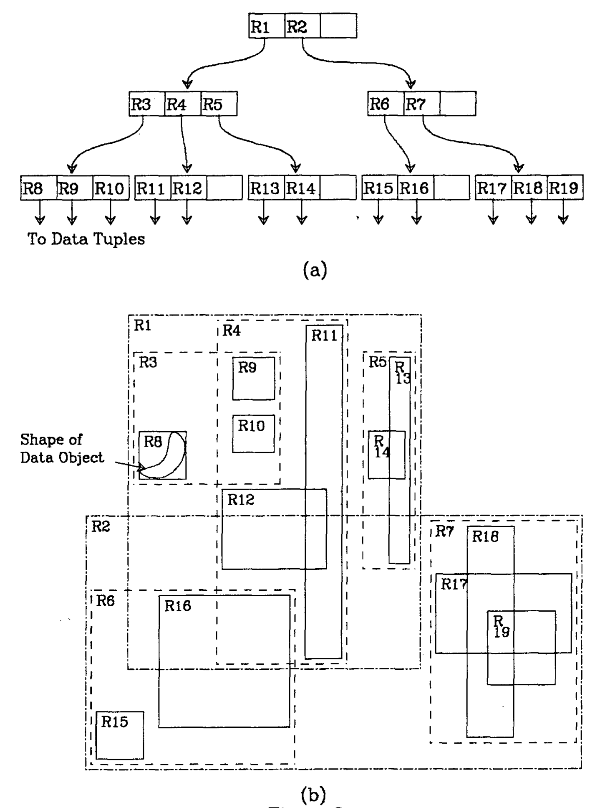

**图 2.1a、2.1b：R-tree 的结构以及矩形之间的包含和重叠关系。原 PDF 此处图注印作“Figure 3.1”。**

含有 $N$ 条索引记录的 R-tree，其高度至多为 $\lceil \log_m N \rceil - 1$，因为每个节点的分支因子至少为 $m$。节点总数最多为：

$$
\left\lceil \frac{N}{m}\right\rceil+
\left\lceil \frac{N}{m^2}\right\rceil+
\cdots+1
$$

除根节点外，所有节点在最坏情况下的空间利用率为 $m/M$。节点通常会有多于 $m$ 个项，这会降低树高并提高空间利用率。如果节点中有超过 3 或 4 个项，树就会很宽，几乎全部空间都会用于含有索引记录的叶节点。参数 $m$ 可以作为性能调优的一部分进行调整，第 4 节将对不同取值进行实验测试。

## 3. 搜索与更新

### 3.1. 搜索

搜索算法以类似 B-tree 的方式从根节点向下遍历。然而，一个已访问节点下可能有不止一棵子树需要搜索，因此无法保证良好的最坏情况性能。尽管如此，对大多数类型的数据，更新算法会把树维持在一种可使搜索算法排除索引空间中无关区域的形式，从而只检查搜索区域附近的数据。

下文我们用 $E.I$ 表示索引项 $E$ 的矩形部分，用 $E.p$ 表示其 $\mathit{tuple\text{-}identifier}$ 或 $\mathit{child\text{-}pointer}$ 部分。

**算法 Search。** 给定根节点为 $T$ 的 R-tree，找出矩形与搜索矩形 $S$ 重叠的所有索引记录。

- **S1.［搜索子树。］** 如果 $T$ 不是叶节点，检查每个项 $E$，判断 $E.I$ 是否与 $S$ 重叠。对所有发生重叠的项，在 $E.p$ 所指向的树上调用 `Search`。
- **S2.［搜索叶节点。］** 如果 $T$ 是叶节点，检查所有项 $E$，判断 $E.I$ 是否与 $S$ 重叠。若重叠，则 $E$ 是一条符合条件的记录。

### 3.2. 插入

为新数据元组插入索引记录与向 B-tree 插入类似：新的索引记录被加入叶节点；溢出的节点被分裂；分裂沿树向上传播。

**算法 Insert。** 将新的索引项 $E$ 插入 R-tree。

- **I1.［寻找新记录的位置。］** 调用 `ChooseLeaf`，选择用于放置 $E$ 的叶节点 $L$。
- **I2.［向叶节点添加记录。］** 如果 $L$ 有空间容纳另一个项，则装入 $E$；否则，调用 `SplitNode`，得到包含 $E$ 及 $L$ 全部旧项的 $L$ 和 $LL$。
- **I3.［向上传播变化。］** 对 $L$ 调用 `AdjustTree`；如果发生了分裂，同时传入 $LL$。
- **I4.［增加树高。］** 如果节点分裂的传播导致根节点分裂，则创建一个新根节点，以分裂产生的两个节点作为其子节点。

**算法 ChooseLeaf。** 选择一个叶节点，用来放置新的索引项 $E$。

- **CL1.［初始化。］** 将 $N$ 设为根节点。
- **CL2.［叶节点检查。］** 如果 $N$ 是叶节点，返回 $N$。
- **CL3.［选择子树。］** 如果 $N$ 不是叶节点，令 $F$ 为 $N$ 中这样的项：为包含 $E.I$，其矩形 $F.I$ 所需的扩大幅度最小。若有并列，选择矩形面积最小的项。
- **CL4.［下降直至到达叶节点。］** 将 $N$ 设为 $F.p$ 所指向的子节点，并从 CL2 重复。

**算法 AdjustTree。** 从叶节点 $L$ 上行至根节点，调整覆盖矩形，并按需传播节点分裂。

- **AT1.［初始化。］** 令 $N=L$。如果 $L$ 已发生分裂，则令 $NN$ 为分裂产生的第二个节点。
- **AT2.［检查是否完成。］** 如果 $N$ 是根节点，停止。
- **AT3.［调整父项中的覆盖矩形。］** 令 $P$ 为 $N$ 的父节点，令 $E _ N$ 为 $P$ 中对应 $N$ 的项。调整 $E _ N.I$，使其紧密包围 $N$ 中所有项的矩形。
- **AT4.［向上传播节点分裂。］** 如果 $N$ 有一个由先前分裂产生的伙伴节点 $NN$，则创建新项 $E _ {NN}$，其中 $E _ {NN}.p$ 指向 $NN$， $E _ {NN}.I$ 包围 $NN$ 中的全部矩形。如果 $P$ 有空间，则将 $E _ {NN}$ 加入 $P$；否则调用 `SplitNode`，产生包含 $E _ {NN}$ 和 $P$ 全部旧项的 $P$ 与 $PP$。
- **AT5.［上移到下一层。］** 令 $N=P$；若发生了分裂，则令 $NN=PP$。从 AT2 重复。

算法 `SplitNode` 在第 3.5 节中描述。

### 3.3. 删除

**算法 Delete。** 从 R-tree 中删除索引记录 $E$。

- **D1.［寻找包含记录的节点。］** 调用 `FindLeaf`，定位包含 $E$ 的叶节点 $L$。如果未找到该记录，则停止。
- **D2.［删除记录。］** 从 $L$ 中删除 $E$。
- **D3.［传播变化。］** 调用 `CondenseTree`，传入 $L$。
- **D4.［降低树高。］** 如果树调整后根节点只有一个子节点，则令该子节点成为新根节点。

**算法 FindLeaf。** 给定根节点为 $T$ 的 R-tree，找到包含索引项 $E$ 的叶节点。

- **FL1.［搜索子树。］** 如果 $T$ 不是叶节点，检查 $T$ 中的每个项 $F$，判断 $F.I$ 是否与 $E.I$ 重叠。对每个这样的项，在 $F.p$ 所指向的树上调用 `FindLeaf`，直到找到 $E$ 或检查完所有项。
- **FL2.［在叶节点中搜索记录。］** 如果 $T$ 是叶节点，检查每个项是否与 $E$ 匹配。如果找到 $E$，返回 $T$。

**算法 CondenseTree。** 给定一个已从中删除某项的叶节点 $L$，若该节点项数过少，则消除该节点并重新安置其中的项。按需向上传播节点消除操作。调整从该节点到根节点路径上的所有覆盖矩形，并在可能时缩小它们。

- **CT1.［初始化。］** 令 $N=L$。将已消除节点的集合 $Q$ 设为空集。
- **CT2.［寻找父项。］** 如果 $N$ 是根节点，转到 CT6；否则，令 $P$ 为 $N$ 的父节点，令 $E _ N$ 为 $P$ 中对应 $N$ 的项。
- **CT3.［消除填充不足的节点。］** 如果 $N$ 的项数少于 $m$，则从 $P$ 删除 $E _ N$，并将 $N$ 加入集合 $Q$。
- **CT4.［调整覆盖矩形。］** 如果 $N$ 未被消除，则调整 $E _ N.I$，使其紧密包含 $N$ 中的所有项。
- **CT5.［在树中上移一层。］** 令 $N=P$，并从 CT2 重复。
- **CT6.［重新插入失去父节点的项。］** 重新插入集合 $Q$ 中各节点的全部项。被消除叶节点中的项，按照算法 `Insert` 的方式重新插入树的叶节点；来自更高层节点的项必须放到树的更高层，使其所依赖子树的叶节点与主树的叶节点处在同一层。

上述处理填充不足节点的过程不同于 B-tree 上的相应操作；B-tree 会合并两个或更多相邻节点。R-tree 也可以采用类似 B-tree 的方法，尽管它不存在 B-tree 意义上的相邻关系：填充不足的节点可以和使面积增加最少的兄弟节点合并，或者把失去父节点的项分配给兄弟节点。这两种方法都可能导致节点分裂。我们选择重新插入有两个原因。第一，它实现相同目标，而且更容易实现，因为可以使用 `Insert` 例程。效率应当相当，因为重新插入所需的页面通常就是先前搜索期间访问过的页面，并且已经在内存中。第二，重新插入会增量改进树的空间结构，避免因每个项永久置于同一父节点之下而可能出现的逐渐劣化。

### 3.4. 更新与其他操作

如果数据元组更新后其覆盖矩形发生变化，则必须删除、更新并重新插入它的索引记录，使它能够到达树中的正确位置。

除上述搜索外，其他类型的搜索也可能有用。例如，找出完全包含在搜索区域中的所有数据对象，或者找出包含搜索区域的所有对象。这些操作可通过直接修改所给算法实现。删除算法要求预先搜索身份已知的特定项，这由算法 `FindLeaf` 实现。R-tree 也能很好地支持范围删除的变体，即删除某一特定区域中所有数据对象的索引项。

### 3.5. 节点分裂

要向一个已经包含 $M$ 个项的满节点添加新项，必须把 $M+1$ 个项分配到两个节点中。分配方式应尽可能降低后续搜索中同时检查两个新节点的可能性。是否访问一个节点取决于其覆盖矩形是否与搜索区域重叠，因此，分裂后两个覆盖矩形的总面积应当最小。图 3.1 说明了这一点：“不佳分裂”情形中的覆盖矩形面积远大于“良好分裂”情形。

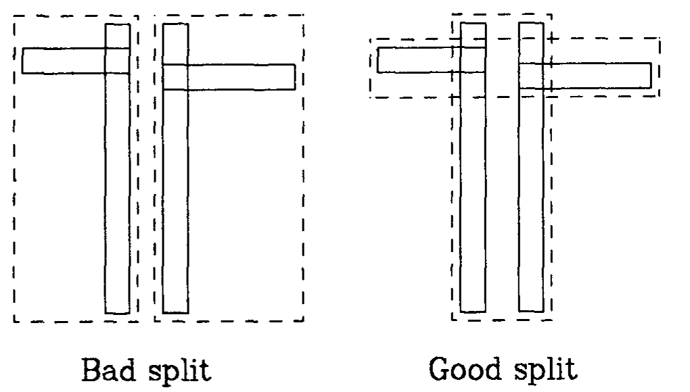

**图 3.1：不佳的分裂与良好的分裂。**

过程 `ChooseLeaf` 在决定新索引项的插入位置时采用了相同标准：在树的每一层，选择覆盖矩形所需扩大幅度最小的子树。

现在我们转而讨论把 $M+1$ 个项划分为两组的算法，每个新节点对应一组。

#### 3.5.1. 穷举算法

寻找最小面积节点分裂最直接的方法，是生成全部可能分组并选择最佳者。然而，可能性数量约为 $2^{M-1}$，而 $M$ 的一个合理取值是 50[^1]，因此可能的分裂数量极大。我们实现了一个修改过的穷举算法，把它作为其他算法的比较基准；但对较大的节点尺寸，该算法慢得无法使用。

[^1]: 一个二维矩形可由四个 4 字节数字表示。如果一个指针也占 4 字节，则每个项需要 20 字节。一个 1024 字节的页面大约可以容纳 50 个项。

#### 3.5.2. 二次代价算法

该算法试图找到面积较小的分裂，但不保证找到可能的最小面积。其代价相对于 $M$ 是二次的，相对于维数是线性的。算法从 $M+1$ 个项中选择两个作为两个新组的首个元素，选择依据是：如果把这两个项放在同一组中，它们浪费的面积最大；也就是说，覆盖两个项的矩形面积减去这两个项各自的面积后，所得值最大。随后逐个把其余项分配给组。每一步都计算把每个剩余项加入每个组所需的面积扩张量，并选择在两个组之间表现出最大差异的项进行分配。

**算法 Quadratic Split。** 将 $M+1$ 个索引项划分为两组。

- **QS1.［为每组选择第一个项。］** 应用算法 `PickSeeds`，选出两个项作为两组的首个元素，并把它们分别分配给一个组。
- **QS2.［检查是否完成。］** 如果所有项都已分配，则停止。如果某一组中的项很少，以至于必须把所有剩余项都分配给该组才能使其达到最小项数 $m$，则完成这些分配并停止。
- **QS3.［选择要分配的项。］** 调用算法 `PickNext`，选择下一个要分配的项。将它加入覆盖矩形为容纳该项而需要扩大得最少的组。若有并列，依次选择面积较小的组、项数较少的组，最后任意选择一个组。从 QS2 重复。

**算法 PickSeeds。** 选择两个项，作为两组的首个元素。

- **PS1.［计算把各项放在一起的低效程度。］** 对每一对项 $E _ 1$ 和 $E _ 2$，构造包含 $E _ 1.I$ 与 $E _ 2.I$ 的矩形 $J$，并计算 $d=\mathrm{area}(J)-\mathrm{area}(E _ 1.I)-\mathrm{area}(E _ 2.I)$。
- **PS2.［选择浪费最大的项对。］** 选择 $d$ 最大的项对。

**算法 PickNext。** 选择一个尚未分组的项，为其确定所属组。

- **PN1.［确定把每个项放入每个组的代价。］** 对尚未分组的每个项 $E$，计算为包含 $E.I$ 而使组 1 的覆盖矩形增加的面积 $d _ 1$。以同样方式计算组 2 的 $d _ 2$。
- **PN2.［寻找对某一组偏好最强的项。］** 任取一个使 $d _ 1$ 与 $d _ 2$ 之差最大的项。

#### 3.5.3. 线性代价算法

该算法相对于 $M$ 和维数都是线性的。`Linear Split` 与 `Quadratic Split` 相同，但使用不同版本的 `PickSeeds`；`PickNext` 只需任意选择一个剩余项。

**算法 LinearPickSeeds。** 选择两个项，作为两组的首个元素。

- **LPS1.［沿所有维度寻找极端矩形。］** 对每个维度，找出矩形低端点最高的项，以及矩形高端点最低的项，并记录二者的间隔。
- **LPS2.［根据矩形簇的形状调整。］** 将各间隔除以整个集合在相应维度上的宽度，对间隔进行归一化。
- **LPS3.［选择最极端的项对。］** 选择在任一维度上归一化间隔最大的项对。

## 4. 性能测试

我们在 Vax 11/780 计算机的 Unix 系统上用 C 实现了 R-tree，并使用我们的实现进行了一系列性能测试，目的是验证该结构的实用性、选择 $M$ 与 $m$ 的取值，以及评估不同的节点分裂算法。本节给出测试结果。

测试使用了五种页面大小，对应不同的 $M$ 值：

| 每页字节数 | 每页最大项数 M |
| ---: | ---: |
| 128 | 6 |
| 256 | 12 |
| 512 | 25 |
| 1024 | 50 |
| 2048 | 102 |

作为节点最小项数的 $m$，测试取值为 $M/2$、 $M/3$ 和 2。前述三种节点分裂算法分别实现在不同版本的程序中。我们的所有测试都使用二维数据，尽管该结构和算法适用于任意维数。

每次测试运行的第一阶段，程序从文件中读取几何数据并构建索引树：从空树开始，对每条新索引记录调用 `Insert`。插入性能在最后 10% 的记录上测量，此时树接近其最终大小。第二阶段，程序使用随机数构造搜索矩形，并调用函数 `Search`。每次测试运行进行 100 次搜索，每次大约检索 5% 的数据。最后，程序再次读取输入文件，对每第十个数据项调用函数 `Delete` 删除其索引记录，从而测量分散删除 10% 索引记录的性能。测试使用 RISC-II 计算机芯片 [11] 的超大规模集成电路（VLSI）版图数据。测试所用电路单元 CENTRAL 含 1057 个矩形，如图 4.1 所示。

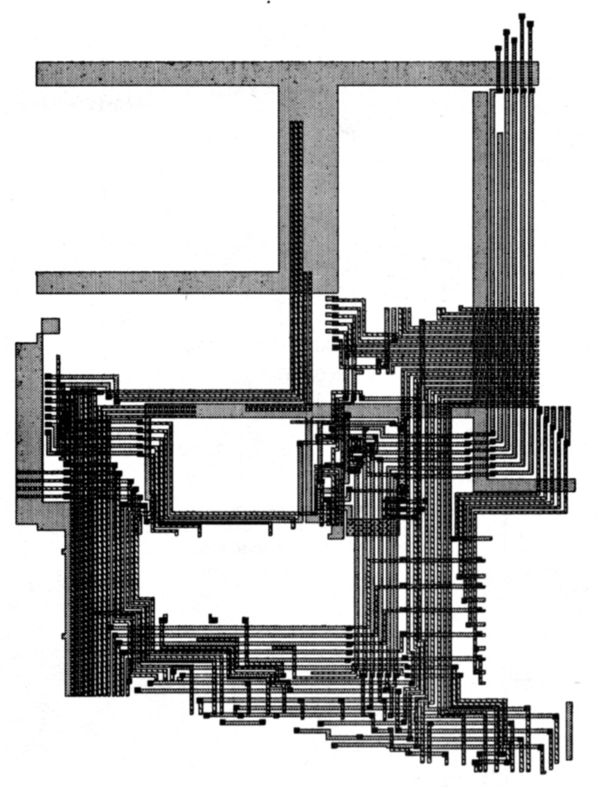

**图 4.1：电路单元 CENTRAL（1057 个矩形）。**

图 4.2 给出插入最后 10% 记录的 CPU 时间成本与页面大小之间的函数关系。穷举算法的成本随页面大小呈指数增长，可以看到它在页面较大时非常缓慢。线性算法如预期一样最快。使用该算法时，CPU 时间几乎完全不随页面大小增加，这提示节点分裂只占插入记录成本的一小部分。节点平衡要求越严格，插入成本反而越低；这是因为当一组变得过满时，所有分裂算法都会直接把剩余元素放入另一组，不再进行比较。

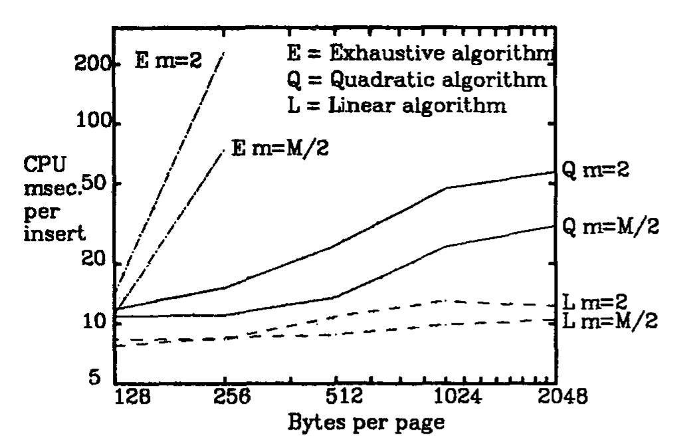

**图 4.2：插入记录的 CPU 成本。**

图 4.3 所示的索引项删除成本强烈受到最小节点填充要求的影响。当节点填充不足时，必须重新插入其中的项；重新插入有时会导致节点分裂。更严格的填充要求使节点更频繁地以更多项数进入填充不足状态。此外，由于节点往往更满，分裂也更频繁。曲线较为粗糙，因为节点消除随机而且不常发生；在我们的测试中，此类事件太少，无法平滑这些波动。

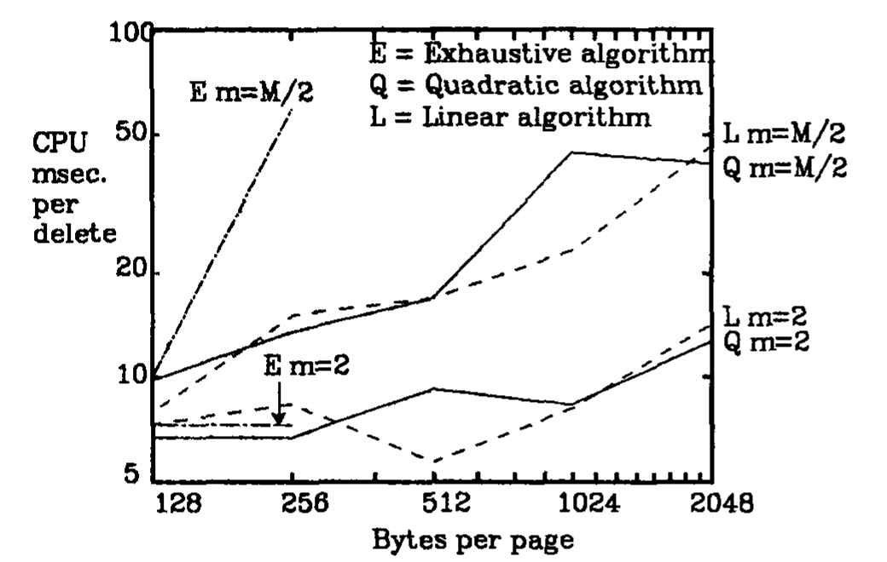

**图 4.3：删除记录的 CPU 成本。**

图 4.4 和图 4.5 表明，索引搜索性能对不同节点分裂算法和填充要求并不敏感。穷举算法产生的索引结构略好，因而访问页面更少、CPU 成本更低，但大多数组合与最佳结果的差距都在 10% 以内。所有算法都提供了合理的性能。

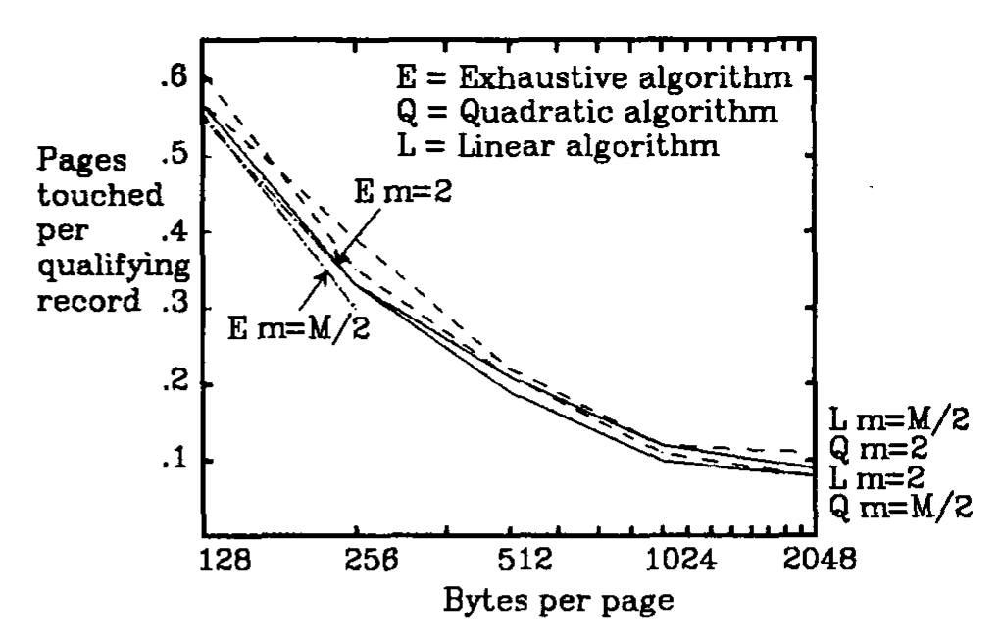

**图 4.4：搜索性能——访问的页面数。**

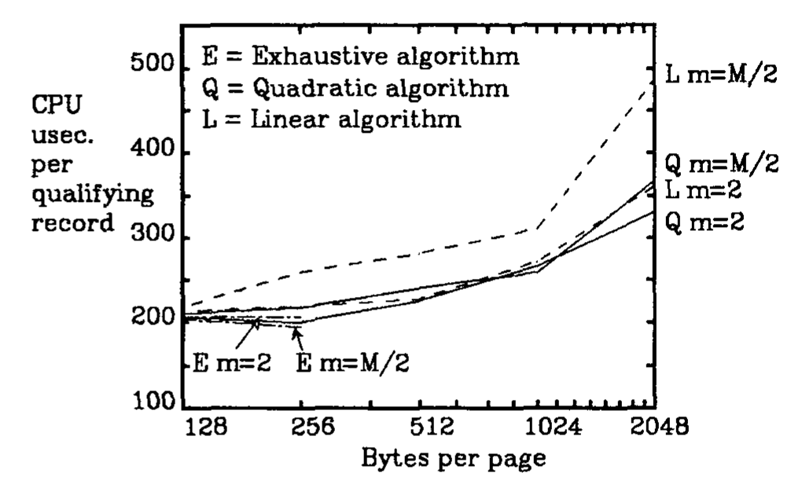

**图 4.5：搜索性能——CPU 成本。**

图 4.6 给出索引树占用的存储空间与算法、填充准则和页面大小之间的函数关系。总体上，结果验证了我们的预期：更严格的节点填充准则会产生更小的索引。密度最低的索引比密度最高的索引多占约 50% 的空间，但所有半满和三分之一满（图中未示）的结果彼此相差都在 15% 以内。

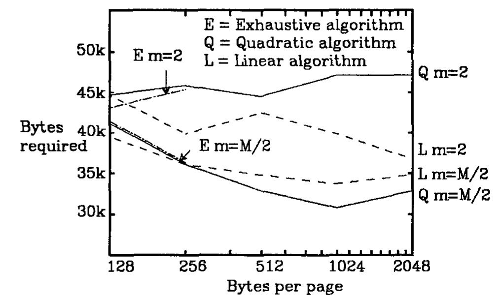

**图 4.6：空间效率。**

第二系列测试测量 R-tree 性能与索引数据量之间的函数关系。测试操作序列与前面相同，分别在包含 1057、2238、3295 和 4559 个矩形的样本上运行。第一个样本是先前使用的电路单元 CENTRAL 的版图数据；第二个样本来自一个相似但更大的、含 2238 个矩形的单元；第三个样本把 CENTRAL 和这个较大单元叠放在一起；最后一个样本由三个单元组合而成。由于这些样本采用不同方式、使用不同数据构成，性能结果不会完美地按比例变化，出现一些不均匀是预期之中的。

测试选择了两种分裂算法和节点填充要求组合：线性算法配合 $m=2$，以及二次算法配合 $m=M/3$；二者的页面大小均为 1024 字节，且 $M=50$。

图 4.7 给出判断插入和删除性能如何受树大小影响的测试结果。两种测试配置在 1057 条记录时都产生两层树，在其他样本大小下都产生三层树。图中显示，二次算法的插入成本几乎恒定，只有在树高增加处例外；该处曲线明显跳升，因为可能发生分裂的层数增加。线性算法没有出现跳升，再次说明线性节点分裂只占插入成本的一小部分。

线性配置采用宽松的节点填充要求，且数据项数量很少，因此其删除测试中没有发生节点分裂。于是，曲线在树层数增加处仅有很小的跳升。二次配置下的删除只产生 1 到 6 次节点分裂，因此所得曲线非常粗糙。考虑到小样本量造成的变化，这些测试表明：插入和删除成本与树宽无关，但会受到树高的影响；树高随数据项数量缓慢增长。

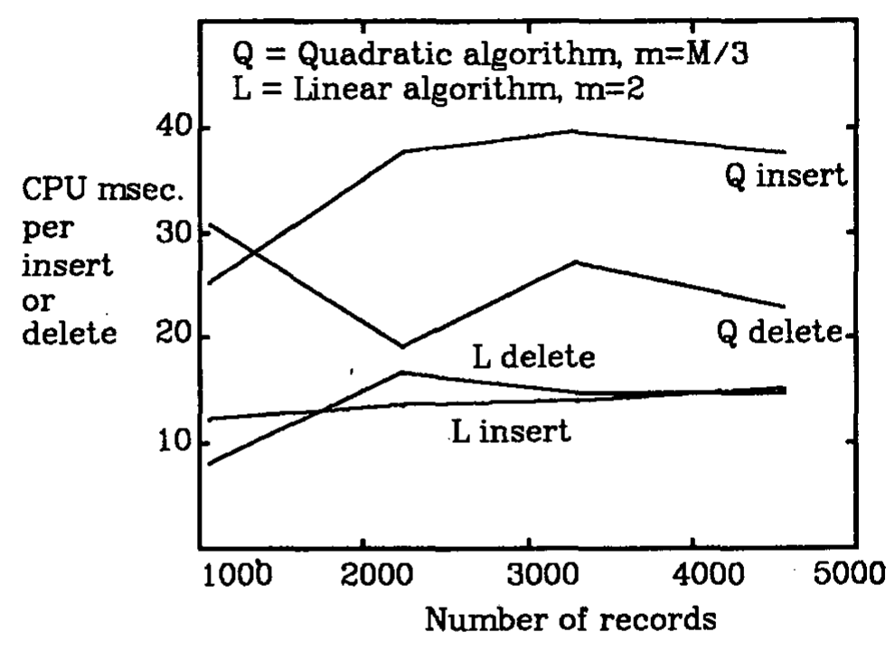

**图 4.7：插入和删除的 CPU 成本与数据量的关系。**

图 4.8 和图 4.9 确认，两种配置的搜索性能几乎相同。每次搜索检索 3% 到 6% 的数据。曲线呈下降趋势符合预期：每次搜索检索的数据量增加时，处理较高层树节点的成本所占比重会降低。树层数增加使成本在前两个数据点之间没有下降。对较大数据量，每条符合条件记录的 CPU 成本低于 150 微秒，这说明索引能非常有效地把搜索范围缩小到较小的子树。

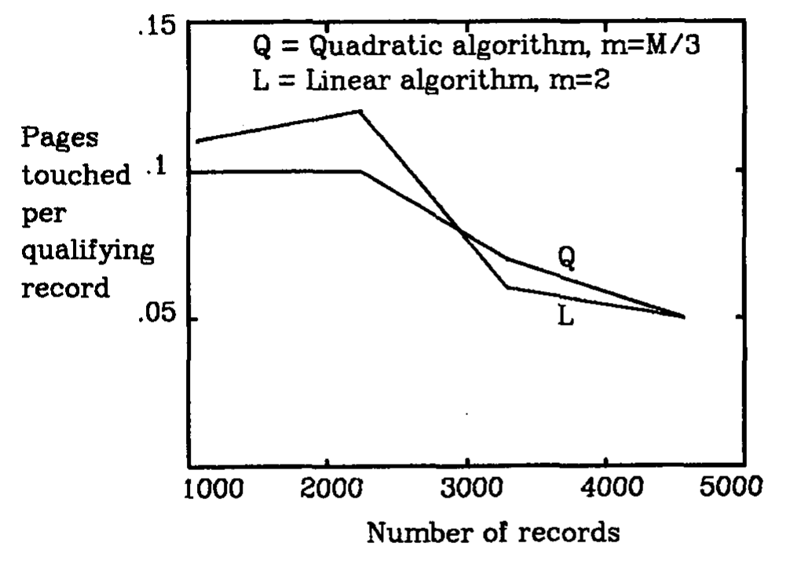

**图 4.8：搜索性能与数据量的关系——访问的页面数。**

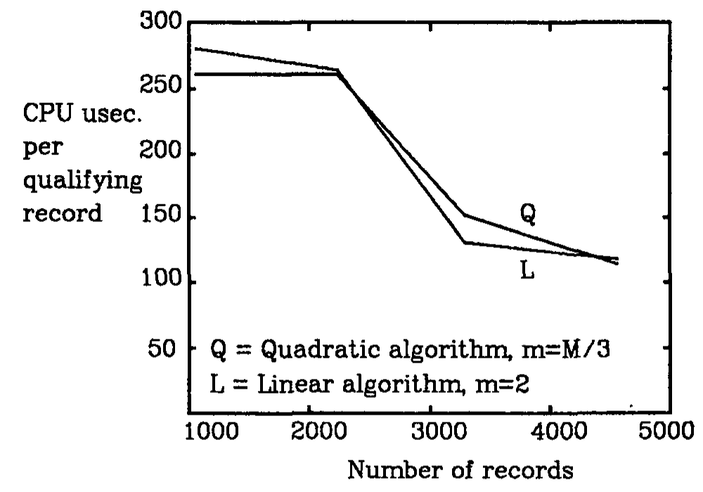

**图 4.9：搜索性能与数据量的关系——CPU 成本。**

图 4.10 中的直线反映出，R-tree 索引的几乎全部空间都用于叶节点，而叶节点数量随数据量线性变化。对 Linear-2 测试配置，R-tree 占用的总空间约为每个数据项 40 字节；相比之下，仅索引记录本身为每项 20 字节。Quadratic-1/3 配置的对应数值是每项 33 字节。

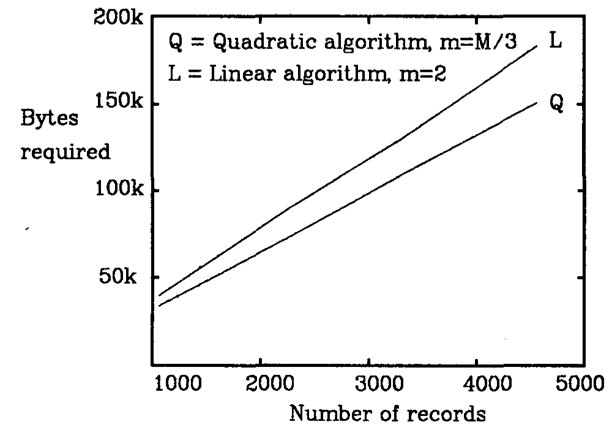

**图 4.10：R-tree 所需空间与数据量的关系。**

## 5. 结论

本文表明，R-tree 结构适合为非零尺寸的空间数据对象建立索引。对应于合理大小磁盘页（例如 1024 字节）的节点，其 $M$ 值能够产生良好性能。使用更小的节点时，该结构也应能有效充当主存索引；CPU 性能应当相当，而且不会产生 I/O 成本。

线性节点分裂算法已被证明与代价更高的技术同样出色。它速度快，而且稍差的分裂质量没有明显影响搜索性能。

初步研究表明，R-tree 应该很容易加入任何支持传统访问方法的关系数据库系统，例如 INGRES [9] 和 System-R [1]。此外，新结构与抽象数据类型和抽象索引 [14] 配合使用时应当尤其有效，从而简化空间数据的处理。

## 6. 参考文献

1. M. Astrahan, et al., “System R: Relational Approach to Database Management,” *ACM Transactions on Database Systems* 1, 2 (June 1976), 97-137.
2. R. Bayer and E. McCreight, “Organization and Maintenance of Large Ordered Indices,” *Proc. 1970 ACM-SIGFIDET Workshop on Data Description and Access*, Houston, Texas, Nov. 1970, 107-141.
3. J. L. Bentley, “Multidimensional Binary Search Trees Used for Associative Searching,” *Communications of the ACM* 18, 9 (September 1975), 509-517.
4. J. L. Bentley, D. F. Stanat and E. H. Williams, Jr., “The complexity of fixed-radius near neighbor searching,” *Inf. Proc. Lett.* 6, 6 (December 1977), 209-212.
5. J. L. Bentley and J. H. Friedman, “Data Structures for Range Searching,” *Computing Surveys* 11, 4 (December 1979), 397-409.
6. D. Comer, “The Ubiquitous B-tree,” *Computing Surveys* 11, 2 (1979), 121-138.
7. R. A. Finkel and J. L. Bentley, “Quad Trees - A Data Structure for Retrieval on Composite Keys,” *Acta Informatica* 4 (1974), 1-9.
8. A. Guttman and M. Stonebraker, “Using a Relational Database Management System for Computer Aided Design Data,” *IEEE Database Engineering* 5, 2 (June 1982).
9. G. Held, M. Stonebraker and E. Wong, “INGRES - A Relational Data Base System,” *Proc. AFIPS 1975 NCC* 44 (1975), 409-416.
10. K. Hinrichs and J. Nievergelt, “The Grid File: A Data Structure Designed to Support Proximity Queries on Spatial Objects,” Nr. 54, Institut für Informatik, Eidgenössische Technische Hochschule, Zürich, July 1983.
11. M. G. H. Katevenis, R. W. Sherburne, D. A. Patterson and C. H. Séquin, “The RISC II Micro-Architecture,” *Proc. VLSI 83 Conference*, Trondheim, Norway, August 1983.
12. J. K. Ousterhout, “Corner Stitching: A Data Structuring Technique for VLSI Layout Tools,” Computer Science Report, Computer Science Dept. 82/114, University of California, Berkeley, 1982.
13. J. T. Robinson, “The K-D-B Tree: A Search Structure for Large Multidimensional Dynamic Indexes,” *ACM-SIGMOD Conference Proc.*, April 1981, 10-18.
14. M. Stonebraker, B. Rubenstein and A. Guttman, “Application of Abstract Data Types and Abstract Indices to CAD Data Bases,” Memorandum No. UCE/ERL M83/3, Electronics Research Laboratory, University of California, Berkeley, January 1983.
15. K. C. Wong and M. Edelberg, “Interval Hierarchies and Their Application to Predicate Files,” *ACM Transactions on Database Systems* 2, 3 (September 1977), 223-232.
16. G. Yuval, “Finding Near Neighbors in k-dimensional Space,” *Inf. Proc. Lett.* 3, 4 (March 1975), 113-114.
