# SPANN: Highly-efficient Billion-scale Approximate Nearest Neighbor Search（中文译文）

## 译者说明

本文依据同目录的 `source.pdf` 翻译。章节、图表、公式、算法、代码与参考文献按原文结构保留。

Qi Chen¹*、Bing Zhao¹˒²†、Haidong Wang¹、Mingqin Li¹、Chuanjie Liu¹˒³†、Zengzhong Li¹、Mao Yang¹、Jingdong Wang¹˒⁴*†

¹ Microsoft　² Peking University　³ Tencent　⁴ Baidu

¹ {cheqi, haidwa, mingqli, jasol, maoyang}@microsoft.com
² its.bingzhao@pku.edu.cn　³ liu.chuanjie@outlook.com　⁴ wangjingdong@outlook.com

*：通讯作者。[^1]　†：本工作在 Microsoft 任职期间完成。[^2]

## 摘要

内存型近似最近邻搜索（Approximate Nearest Neighbor Search，ANNS）算法已经在快速、高召回率搜索方面取得很大成功，但处理超大规模数据库时成本极高。因此，市场日益需要只占用少量内存、使用廉价固态硬盘（SSD）的混合 ANNS 方案。我们提出一个简单而高效的内存-磁盘混合索引与搜索系统 SPANN，它遵循倒排索引方法：把倒排列表的质心点存入内存，把大型倒排列表存入磁盘。我们通过有效减少磁盘访问次数并检索高质量倒排列表，同时保证磁盘访问效率（低延迟）和高召回率。在索引构建阶段，我们采用分层平衡聚类算法来平衡倒排列表长度，并把相应簇闭包中的点加入倒排列表以扩展列表。在搜索阶段，我们使用查询感知方案动态剪除不必要的倒排列表访问。实验结果表明，在三个十亿规模数据集上，内存成本相同时，SPANN 达到 90% 的同等召回质量所需时间仅为当前先进 ANNS 方案 DiskANN 的一半。SPANN 只需要原始内存成本的大约 10%，就能在约 1 毫秒内达到 90% 的 recall@1 和 recall@10。代码地址：<https://github.com/microsoft/SPTAG>。

**关键词：** 十亿规模、向量搜索、倒排索引方案。

## 1. 引言

向量最近邻搜索在信息检索领域发挥着重要作用，例如多媒体搜索和 Web 搜索；它通过寻找与查询向量距离最小的向量来提供相关结果。由于计算成本巨大、查询延迟很高，K 近邻搜索的精确方案 [49, 40] 不适用于大数据场景。因此，研究者已经提出许多近似最近邻搜索（ANNS）算法 [11, 18, 38, 10, 14, 31, 34, 13, 29, 21, 16, 26, 43, 42, 33, 44, 37, 32, 19, 27, 9, 12, 39, 50, 20, 36]。不过，其中多数算法主要研究如何借助离线预构建索引，在内存中实现低延迟、高召回率搜索。当目标是 Web 搜索等超大规模向量搜索场景时，内存成本将变得极其昂贵。因此，越来越需要使用少量内存和廉价磁盘来服务大规模数据集的混合 ANNS 方案。

目前只有少数方法处理混合 ANNS，包括 DiskANN [39] 和 HM-ANN [36]，二者都是基于图的方案。DiskANN 使用乘积量化（Product Quantization，PQ）[25] 压缩存入内存的向量，同时把导航展开图和全精度向量放在磁盘上。查询到来时，它根据量化向量的距离遍历图，再根据全精度向量的距离对候选重新排序。HM-ANN 利用异构内存，把枢轴点放在快速内存，把可导航小世界图放在不做数据压缩的慢速内存中。不过，它消耗的快速内存比 DiskANN 多 1.5 倍以上，而且慢速内存仍远比磁盘昂贵。因此，凭借服务成本低、召回率高和延迟低的优势，DiskANN 已成为十亿规模数据集索引的先进方案。

我们论证，简单的倒排索引方法也能在召回率、延迟和内存成本方面达到大规模数据集上的先进性能。我们提出 SPANN：一个遵循倒排索引方法、简单却出人意料地高效的内存-磁盘混合向量索引与搜索系统。SPANN 只把倒排列表的质心点存入内存，把大型倒排列表放在磁盘上。我们通过大幅减少磁盘访问次数并提升倒排列表质量，同时保证低延迟和高召回率。在索引构建阶段，系统用分层平衡聚类方法平衡倒排列表长度，并加入相应簇闭包中的点来扩展列表；在搜索阶段，系统用查询感知方案动态剪除不必要的倒排列表访问。实验表明，在三个十亿规模数据集上、内存成本相同时，SPANN 达到 90% 的同等召回质量比当前先进的磁盘型 ANNS 算法 DiskANN 快两倍以上。SPANN 只需原始内存成本的大约 10%，就能在约 1 毫秒内达到 90% 的 recall@1 和 recall@10。SPANN 已部署到 Microsoft Bing，用于支持数千亿规模的向量搜索。

## 2. 背景与相关工作

给定数据向量集合 $X\in\mathbb{R}^{n\times m}$（数据集包含 $n$ 个 $m$ 维特征向量）和查询向量 $q\in\mathbb{R}^{m}$，向量搜索的目标是从 $X$ 中找出一个称为最近邻的向量 $p^\ast{}$，使得 $p^\ast{}=\arg\min_{p\in X}\mathrm{Dist}(p,q)$。K 近邻可以类似定义。穷举搜索计算成本巨大、查询延迟很高，因而 ANNS 算法旨在可接受时间内加速大型数据集中近似 K 近邻的搜索。现有 ANNS 算法主要关注内存中的快速、高召回率搜索，包括基于哈希的方法 [14, 24, 47, 48, 45, 46, 51]、基于树的方法 [11, 31, 44, 33]、基于图的方法 [21, 16, 43, 32] 和混合方法 [42, 12, 23, 22]。然而，向量规模爆炸式增长后，内存已经成为支撑大规模向量搜索的瓶颈。只有少数 ANNS 方案面向十亿规模数据集并以最小化内存成本为目标，可分为基于倒排索引和基于图两类。

IVFADC [26]、FAISS [27] 和 IVFOADC+G+P [9] 等倒排索引方法通过 KMeans 聚类把向量空间划分为 $K$ 个 Voronoi 区域，只搜索少数靠近查询的区域。为减少内存成本，它们使用 PQ [25] 等向量量化技术压缩向量并将其存入内存。倒排多重索引（Inverted Multi-Index，IMI）[7] 也使用 PQ 压缩向量：它把特征空间分成多个正交子空间，为每个子空间构造独立码本，再用相应子空间的笛卡尔积生成完整特征空间。Multi-LOPQ [28] 使用局部优化的 PQ 码本编码 IMI 结构中的位移；GNO-IMI [8] 则用非正交码本生成质心来优化 IMI。尽管这些方法能把 10 亿个 128 维向量的内存占用降到 64 GB 以下，但有损数据压缩使 recall@1 很低，只有约 60%。它们虽然可以返回多 10 到 100 倍的候选以进一步重排，从而获得更高召回率，但许多场景无法接受这种做法。

基于图的方法包括 DiskANN [39] 和 HM-ANN [36]，二者都采用混合方案。DiskANN 同样把 PQ 压缩向量存入内存，同时把导航展开图和全精度向量存入磁盘。查询到来时，它根据量化向量的距离，以最佳优先方式遍历图，再根据全精度向量的距离对候选重新排序。尽管全精度向量重排能找回部分漏掉的候选，有损压缩仍会影响召回质量，而高成本随机磁盘访问又限制了图遍历和候选重排的次数。HM-ANN 利用异构内存，把自底向上阶段提升的枢轴点放入快速内存，把不做数据压缩的可导航小世界图放入慢速内存，但会多消耗 1.5 倍以上的快速内存。此外，慢速内存仍远比磁盘昂贵，在某些平台上甚至不可用。文献 [35] 给出了基于图方法的局限与收益的理论分析。

## 3. SPANN

我们提出 SPANN，一个遵循倒排索引方法、简单而高效的向量索引与搜索系统。与此前依靠有损数据压缩降低内存成本的倒排索引方法不同，SPANN 采用简单的内存-磁盘混合方案。

**索引结构：** 数据向量 $X$ 被划分为 $N$ 个倒排列表 $\lbrace{}X_1,X_2,\ldots,X_N\rbrace{}$，且 $X_1\cup X_2\cup\cdots\cup X_N=X$。（注：为方便起见，原文同时用 $X$ 表示矩阵和向量集合。） 这些倒排列表的质心 $c_1,c_2,\ldots,c_N$ 作为快速粗粒度索引存入内存，并指向磁盘中相应倒排列表的位置。

**部分搜索：** 查询 $q$ 到来时，系统找出 $K$ 个最近质心 $\lbrace{}c_{i1},c_{i2},\ldots,c_{iK}\rbrace{}$，其中 $K\ll N$，再把与这 $K$ 个最近质心对应的倒排列表 $X_{i1},X_{i2},\ldots,X_{iK}$ 中的向量加载到内存，继续进行细粒度搜索。

### 3.1 挑战

**倒排列表长度限制：** 所有倒排列表都存放在磁盘上。为减少磁盘访问，需要限制每个倒排列表的长度，使其只需少量磁盘读取就能载入内存。这不仅要求把数据划分为大量倒排列表，还必须平衡各列表的长度。高昂的聚类成本和平衡划分问题本身都使这项工作非常困难。倒排列表不平衡会造成较高的查询延迟方差，列表位于磁盘时尤其如此。

**边界问题：** 查询 $q$ 的最近邻向量可能位于多个倒排列表的边界。由于只搜索少量相关列表，位于其他倒排列表中的某些真实邻居会被漏掉，如图 1 所示。如果红色点只由蓝色倒排列表的质心表示，在搜索黄色点的最近邻时就会漏掉这些红色点。

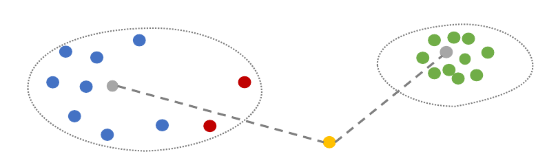

**图 1：** 部分搜索漏掉边界向量的示例。搜索黄色点时会先搜索绿色倒排列表，因为绿色列表的质心离黄色点更近；但蓝色倒排列表中有一些距离近得多的边界点（红色）。

**搜索难度不同：** 不同查询的搜索难度可能不同。有些查询只需搜索一两个倒排列表，有些则需要搜索大量列表，如图 2 所示。如果所有查询都搜索相同数量的倒排列表，就会导致召回率低或延迟很长。

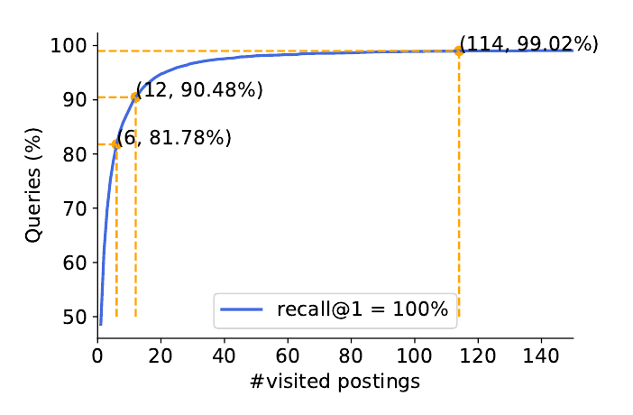

**图 2：** 不同查询需要搜索不同数量的倒排列表。在 SIFT1M 数据集上，为找回 top-1 结果，80% 的查询只需搜索 6 个倒排列表，而 99% 的查询需要搜索 114 个列表。

上述挑战正是此前所有倒排索引方法都采用有损数据压缩方案、把全部压缩向量和倒排列表存入内存的原因。

### 3.2 应对挑战的关键技术

我们引入三项关键技术来解决上述挑战，从而支持内存-磁盘混合方案。在索引构建阶段，首先限制倒排列表长度，以有效减少在线搜索中读取每个列表所需的磁盘访问；随后，通过扩展相应倒排列表闭包中的点来提高列表质量，从而增大位于列表边界的向量被召回的概率。在搜索阶段，我们提出查询感知方案，动态剪除不必要的倒排列表访问，以同时保证高召回率和低延迟。下面分别介绍各项技术的详细设计。

#### 3.2.1 倒排列表长度限制

限制倒排列表长度意味着需要把数据向量 $X$ 划分为大量倒排列表 $X_1,X_2,\ldots,X_N$。平衡列表长度意味着要最小化倒排列表长度的方差 $\sum_{i=1}^{N}(|X_i|-|X|/N)^2$。

为解决倒排列表长度平衡问题，可以利用多约束平衡聚类算法 [30]，把向量均匀划分到多个倒排列表：

$$
\min_{H,C}\Vert{}X-HC\Vert{}\relax_F^2+
\lambda\sum_{i=1}^{N}\left(\sum_{l=1}^{|X|}h_{li}-\frac{|X|}{N}\right)^2,
\quad
\text{s.t. }\sum_{i=1}^{N}h_{li}=1.
\tag{1}
$$

其中， $C\in\mathbb{R}^{N\times m}$ 表示质心， $H\in\lbrace{}0,1\rbrace{}^{|X|\times N}$ 表示聚类分配， $\sum_{l=1}^{|X|}h_{li}$ 是分配给第 $i$ 个簇的向量数，即 $|X_i|$； $\lambda$ 是聚类约束与平衡约束之间的权衡超参数。

不过，当向量数 $|X|$ 和划分数 $N$ 都很大时，直接使用多约束平衡聚类算法不可行，因为大规模 $N$ 路平衡聚类问题本身很难，聚类成本也极高。因此，我们引入分层多约束平衡聚类技术（图 3）：它既把聚类时间复杂度从 $O(|X|\cdot m\cdot N)$ 降至 $O(|X|\cdot m\cdot k\cdot\log_k(N))$，其中 $k$ 是很小的常数，又能平衡倒排列表长度。该方法反复把向量聚为少量簇（即 $k$ 个），直到每个倒排列表只含限定数量的向量。借助这项技术，可以同时大幅缩短每个倒排列表的长度、减少磁盘访问，并降低索引构建成本。

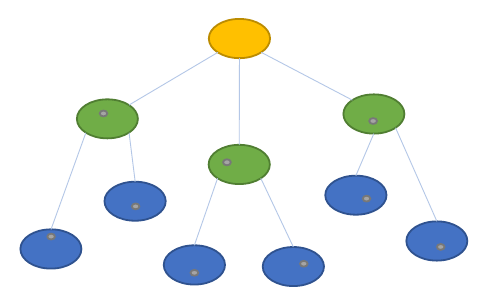

**图 3：** 分层平衡聚类。反复把一个大簇（黄色簇）中的向量平衡划分为少量小簇（绿色簇），直到每个簇只包含限定数量的向量（蓝色簇）。

此外，由于质心数量很多，为查询寻找最近倒排列表会消耗大量计算。为了让导航计算更有价值，我们用最接近质心的真实向量替代质心来表示各个倒排列表。这样，原本浪费的导航计算就转化为对一部分真实候选的距离计算。

为快速找出少量离查询最近的倒排列表，我们还为所有表示倒排列表质心的向量建立内存 SPTAG [12]（MIT 许可证）索引。SPTAG 用空间划分树和相对邻域图构造向量索引，可以把最近质心搜索加速到亚毫秒响应。

#### 3.2.2 倒排列表扩展

为处理边界问题，需要提高位于倒排列表边界的向量的可见性。一种简单方法是把每个向量分配给多个邻近簇，但这会显著增加倒排列表大小，导致大量磁盘读取。因此，我们在最终聚类步骤对边界向量采用闭包多簇分配：如果某向量到多个簇的距离几乎相同，就把它分配给多个最近簇，而不是只分配给最近的一个簇，如图 4 所示：

$$
\begin{aligned}
x\in X_{ij}
&\Longleftrightarrow
\mathrm{Dist}(x,c_{ij})
\le (1+\epsilon_1)\times\mathrm{Dist}(x,c_{i1}),\\
\mathrm{Dist}(x,c_{i1})
&\le \mathrm{Dist}(x,c_{i2})
\le \cdots
\le \mathrm{Dist}(x,c_{iK}).
\end{aligned}
\tag{2}
$$

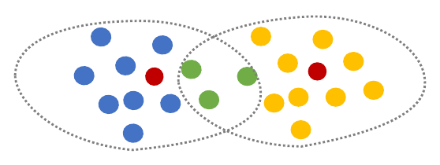

**图 4：** 闭包聚类分配。如果边界向量（绿色点）到多个最近簇的距离几乎相同，就把它们分配给多个最近簇（蓝色簇和黄色簇）。

这意味着系统只复制边界向量。非常接近某个簇质心的向量仍只保留一个副本。这样既能有效限制闭包聚类分配造成的容量增长，又能提高这些边界向量的召回概率：只要搜索它们的任一最近倒排列表，就能召回这些向量。

每个倒排列表都很小，而闭包分配会使彼此非常接近的一些倒排列表包含相同的重复向量，例如绿色向量同时属于黄色簇和蓝色簇。邻近倒排列表中重复向量过多，同样会浪费高成本磁盘读取。因此，我们进一步使用相对邻域图（RNG）规则 [41] 优化闭包聚类分配，为边界向量选择多个有代表性的簇，从而降低两个邻近倒排列表的相似度，如图 5 所示。RNG 规则可简单定义为：若 $\mathrm{Dist}(c_{ij},x)\gt{}\mathrm{Dist}(c_{i,j-1},c_{ij})$，则跳过向量 $x$ 的簇 $i_j$。其洞见是，彼此接近的两个倒排列表更可能同时被导航索引召回。与其在邻近列表中存储相似向量，不如存储不同向量，从而增加在线搜索中能够看到的向量数。从向量角度看，由不同方向的倒排列表表示它更好，例如图中的蓝色和灰色列表；只由同一方向的列表表示则较差，例如蓝色和黄色列表。

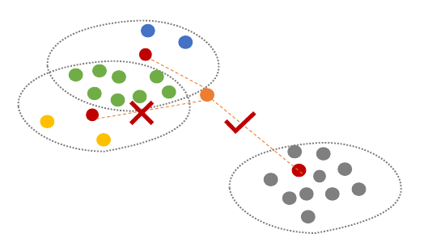

**图 5：** 代表性副本。使用 RNG 规则降低两个邻近倒排列表的相似度。尽管橙色点离黄色列表比离灰色列表更近，它仍会被分配给蓝色和灰色倒排列表。

#### 3.2.3 查询感知动态剪枝

在索引搜索阶段，为用不同资源预算有效处理难度各异的查询，我们引入查询感知动态剪枝技术，根据查询与质心之间的距离减少需要搜索的倒排列表。系统不再对所有查询都搜索最近的 $K$ 个倒排列表；只有当某个倒排列表的质心到查询的距离与最近质心到查询的距离几乎相同时，才动态决定搜索该列表：

$$
\begin{aligned}
q\xrightarrow{\mathrm{search}}X_{ij}
&\Longleftrightarrow
\mathrm{Dist}(q,c_{ij})
\le (1+\epsilon_2)\times\mathrm{Dist}(q,c_{i1}),\\
\mathrm{Dist}(q,c_{i1})
&\le \mathrm{Dist}(q,c_{i2})
\le \cdots
\le \mathrm{Dist}(q,c_{iK}).
\end{aligned}
\tag{3}
$$

通过进一步减少最近 $K$ 个倒排列表中不必要的列表访问，系统能够显著降低查询延迟，同时更合理、有效地使用资源，从而维持高召回率。

## 4. 实验

本节首先给出 SPANN 与当前先进 ANNS 算法的实验比较，然后通过消融实验进一步分析各项技术的贡献，最后用一项实验展示 SPANN 方案在分布式搜索场景中的可扩展性。

### 4.1 实验设置

所有实验均在一台运行 Ubuntu 16.04.6 LTS 的工作站上进行。该机器配备两颗 Intel Xeon 8171M CPU（频率 2600 MHz，共 52 个 CPU 核）、128 GB 内存，以及由 RAID-0 组织的 2.6 TB SSD。所用数据集如下：

1. SIFT1M [3] 是评估内存型 ANNS 算法性能最常用的图像数据集，基准集包含 100 万个 128 维浮点 SIFT 描述子，测试集包含 10,000 个查询描述子。
2. SIFT1B [3] 是评估支持大规模向量搜索的 ANNS 算法的经典数据集，基准集包含 10 亿个 128 维字节向量，测试集包含 10,000 个查询向量。
3. DEEP1B [8] 是由深度图像分类模型学习得到的数据集，基准集包含 10 亿个 96 维浮点向量，测试集包含 10,000 个查询向量。
4. SPACEV1B [6]（O-UDA 许可证）来自商业搜索引擎的生产数据，代表另一种内容编码，即深度自然语言编码。其基准集包含 10 亿个 100 维字节向量，测试集包含 29,316 个查询向量。

用于展示性能的比较指标如下：

1. **召回率：** 把 ANNS 返回的 $R$ 个向量 ID 与 $R$ 个真实向量 ID 比较，计算 recall@R。由于可能存在多个数据向量与查询向量距离相同，计算召回率时，也会用与查询距离相同的向量 ID 替换部分真实向量 ID。
2. **延迟：** 使用以毫秒计的查询响应时间作为查询延迟。
3. **VQ（Vector-Query）：** 一台机器可以服务的向量数与每秒查询数的乘积，由 GRIP [50] 引入。该指标同时考虑查询延迟和内存成本，用来表示搜索引擎的服务容量。系统的 VQ 越高，消耗的资源成本越少。我们以每 KB 向量数乘以每秒查询数作为 VQ 容量。

### 4.2 单机上的 SPANN

本节展示基于倒排索引的 SPANN 方案也能在召回率、延迟和内存成本方面达到先进性能。首先在三个十亿规模数据集上，将 SPANN 与先进的十亿规模磁盘型 ANNS 算法比较；然后在 SIFT1M 上与先进的全内存 ANNS 算法比较 VQ 容量。本节所有 SPANN 实验均使用以下超参数：1）闭包聚类分配中每个向量最多使用 8 个闭包副本；2）字节向量的最大倒排列表大小限制为 12 KB，浮点向量限制为 48 KB；3）倒排列表扩展的 $\epsilon_1$ 设为 10.0，查询感知动态剪枝在 recall@1 和 recall@10 下的 $\epsilon_2$ 分别设为 0.6 和 7.0。为了获得不同召回质量，逐步增加允许搜索的最大倒排列表数量。

#### 4.2.1 与先进十亿规模磁盘型 ANNS 算法比较

比较对象选择能够支持十亿规模数据集的先进磁盘型 ANNS 算法。HM-ANN [36] 没有开源，而且某些平台可能没有其所需的持久内存模块（PMM）硬件，因而不纳入比较；我们只把 SPANN 与当前先进的十亿规模磁盘型 ANNS 算法 DiskANN 比较。DiskANN 使用默认超参数：SIFT1B 和 SPACEV1B 沿用论文 [39] 的配置，DEEP1B 使用文献 [2] 提供的预构建索引。

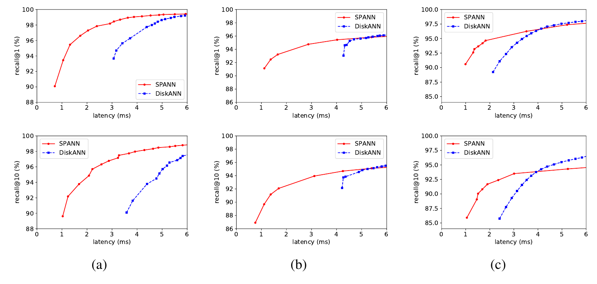

**图 6：** SPANN 与 DiskANN 在（a）SIFT1B、（b）SPACEV1B 和（c）DEEP1B 上的比较。

我们通过选择合适的倒排列表数量，约占向量总数的 10%-12%，仔细调整 SPANN 的内存导航索引大小，以保证两种算法消耗相同内存：SIFT1B 和 SPACEV1B 约 32 GB，DEEP1B 约 60 GB。图 6(a) 展示 SIFT1B 上的性能。结果表明，SPANN 在 recall@1 和 recall@10 上均显著优于 DiskANN，查询延迟预算较低、即小于 4 ms 时尤其如此。具体而言，要达到 95% 的 recall@1 和 recall@10，SPANN 比 DiskANN 快两倍以上。

SPACEV1B 和 DEEP1B 的结果分别见图 6(b) 和图 6(c)。当查询延迟预算较小、即小于 4 ms 时，SPANN 在 recall@1 和 recall@10 上同样优于 DiskANN。在 SPACEV1B 上，DiskANN 无法在 4 ms 内达到 90% 的良好召回质量，而 SPANN 只需约 1 ms 就能达到 90%。在 DEEP1B 上，SPANN 达到 90% 良好召回质量的速度也比 DiskANN 快两倍以上。

#### 4.2.2 与先进全内存 ANNS 算法比较

接下来在 SIFT1M 上，把 SPANN 的 VQ 容量与先进全内存 ANNS 算法 NSG [19]、HNSW [32]、SCANN [20]、NGT-ONNG [23]、NGT-PANNG [22] 和 N2 [4] 比较。这些算法在 ann-benchmarks [1] 中都表现出先进性能。我们选择 VQ 容量而不是延迟作为指标，因为这些算法用远多于 SPANN 的内存换取低延迟；然而，内存是一种昂贵资源，已经成为这些算法支持大规模数据集的瓶颈。因此，性能比较应同时考虑内存和延迟。受测试机内存限制，实验以 SIFT1M 为例；我们认为观察结果可以推广到十亿规模数据集。

这些算法大多基于图。NSG 使用文献 [5] 提供的预构建索引，并把控制搜索结果质量的 SEARCH_L 从 1 调到 256 进行性能测试。HNSW（nmslib）、SCANN、NGT-ONNG、NGT-PANNG 和 N2 则使用它们在 ann-benchmarks [1] 中为 SIFT1M 提供、且性能最佳的超参数。

图 7 和图 8 分别展示所有算法在 recall@1 和 recall@10 下的 VQ 容量与查询延迟。结果显示，SPANN 在几乎所有召回率水平上始终获得最佳 VQ 容量。这意味着，尽管搜索期间高成本磁盘访问使 SPANN 无法达到全内存 ANNS 算法那样低的延迟，但它在大规模向量搜索场景中能获得最佳服务容量。

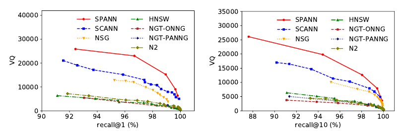

**图 7：** 不同 ANNS 索引的 VQ。

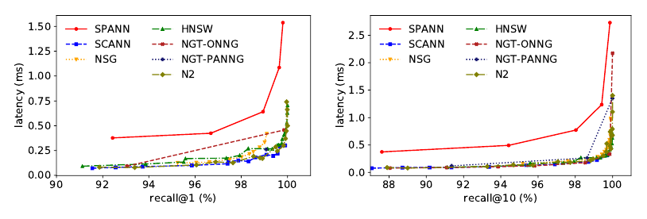

**图 8：** 不同 ANNS 索引的延迟。

#### 4.2.3 消融实验

本节在 SIFT1M 数据集上进行一组消融实验，分析各项技术。

**分层平衡聚类。** 单机把向量划分为大量倒排列表有三种快速方法：1）随机选取一组点作为倒排列表质心；2）用分层 KMeans 聚类（HC）选择质心；3）用分层平衡聚类（HBC）生成一组质心。实验用这三种方式分别选取 16% 的点作为质心，比较索引质量。

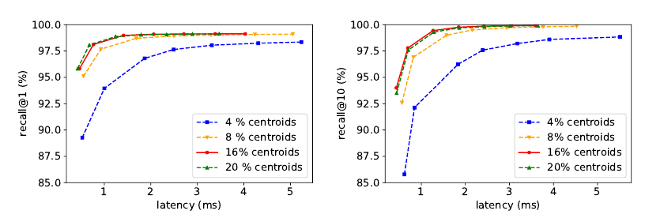

**图 9：** 不同数量的质心。

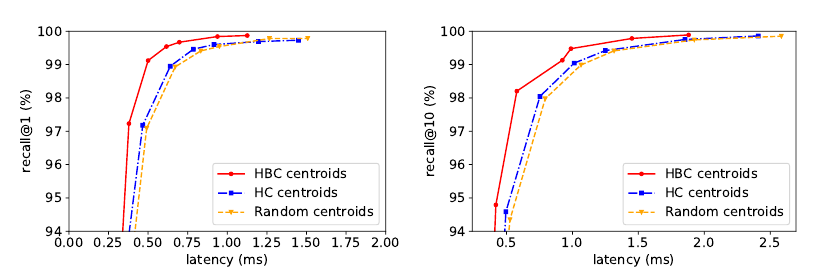

**图 10：** 不同类型的质心选择。

图 10 给出三种质心选择算法的召回率和延迟。无论 recall@1 还是 recall@10，HBC 质心选择都优于随机选择和 HC，说明平衡倒排列表长度对倒排索引方法非常重要。HBC 也很快：用 64 个线程把 100 万个点聚成 160,000 个簇只需约 50 秒，整个 SPANN 索引约 2 分钟即可建成。

还需要回答应选多少个质心。较少的质心可以减小内存导航索引，但较多的质心通常意味着更好性能，因此必须在内存用量和性能之间合理权衡。图 9 比较不同质心数量下的性能。质心较少时，数量增长会显著提高性能；但数量足够大、达到 16% 后，性能不再提升。因此，可以选取 16% 的点作为质心，同时获得良好搜索性能和较低内存用量。

**闭包聚类分配。** 为使用闭包聚类分配，需要把一个向量分配给多个邻近簇，以提高搜索期间的召回概率。那么，为保证性能，每个向量最多应复制多少个闭包副本？副本过少无法找回边界向量，过多则会大幅增加倒排列表大小并影响性能。图 11 展示不同副本数量下的闭包聚类分配性能。使用多个副本会显著改善性能；但副本数超过 8 后，性能不再提高。因此，所有实验都选择 8 个副本。

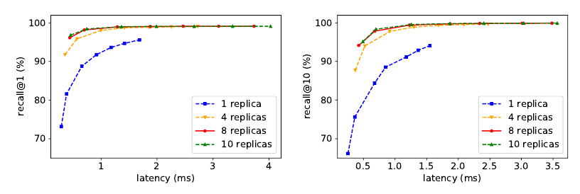

**图 11：** 不同数量的闭包副本。

**查询感知动态剪枝。** 为在在线搜索期间有效处理不同查询，我们使用查询感知动态剪枝，剪除最近 $K$ 个倒排列表中不必要的列表，从而进一步减少需要搜索的列表数量。图 12 比较采用和不采用查询感知动态剪枝时的性能。结果表明，动态剪枝能够在不降低召回率的情况下进一步缩短查询延迟，延迟预算较小时尤其明显。请注意，这项技术不仅减少查询延迟，也会降低单个查询的资源用量。

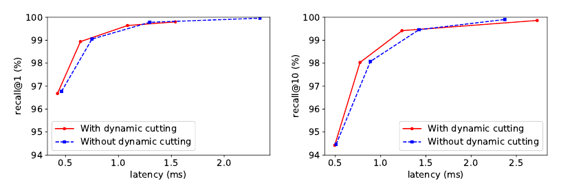

**图 12：** 采用与不采用查询感知动态剪枝的比较。

### 4.3 SPANN 向分布式搜索场景的扩展

与基于图的方法相比，基于倒排索引的 SPANN 还有一项优势：在最近倒排列表上执行部分搜索的思想很容易扩展到分布式搜索场景，从而以高效率和低服务成本处理超大规模向量搜索。Pyramid [15] 展示了平衡划分与部分搜索方法在分布式场景中的作用。为了展示 SPANN 在分布式搜索场景中的可扩展性，分布式索引构建阶段使用多约束平衡聚类和闭包聚类分配，把数据向量 $X$ 均匀划分到 $M$ 个分区 $\lbrace{}X_1,X_2,\ldots,X_M\rbrace{}$ 中，其中 $M$ 是机器数量。在线搜索阶段同样采用查询感知动态剪枝，减少查询分发到的机器数，从而有效限制单个查询的 CPU 和 I/O 总成本。

唯一的挑战是可能出现热点机器。因此，不仅要平衡每台机器的数据量，还要平衡查询访问，避免热点。为解决这个问题，我们先把向量划分为多个小分区，其数量多于机器数，再使用最佳适应装箱（best-fit bin-packing）算法 [17]，根据历史查询访问分布把小分区装入大箱；大箱数量等于机器数。这样就能同时有效平衡每台机器的数据量和处理的查询量。

我们把优化后的 SPANN 与传统随机划分及全分发方案比较，以展示 SPANN 在分布式搜索场景中的工作负载削减效果和可扩展性。实验基于 SPACEV1B，使用约 100,000 条生产查询访问历史作为测试工作负载。工作负载被均匀分为训练集、验证集和测试集：训练集用于离线分布式索引构建，测试集用于在线搜索评估。

#### 4.3.1 工作负载削减与可扩展性

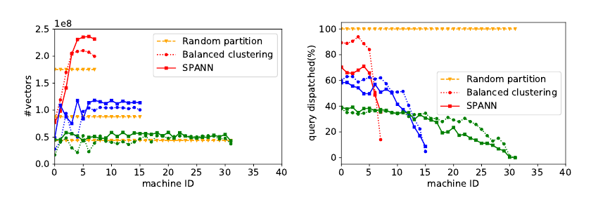

**图 13：** 不同机器上的数据量与查询访问分布。

图 13 展示把全部基准向量划分到 8、16 和 32 个分区时，每台机器上的向量数和测试查询访问数。结果表明，SPANN 能把所有数据和查询访问均匀分布到不同机器。虽然闭包分配使每台机器的向量数增加 20%，但与随机划分相比，每台机器的查询访问显著减少。此外，增加机器后，SPANN 能持续减少每台机器的查询访问，而随机划分不能。这意味着可以不断增加机器来支持更高的每秒查询数，说明系统具有良好可扩展性。之所以能够扩展良好，是因为系统有效限制了每个查询参与搜索的机器数量。

#### 4.3.2 分析

接下来分析各项技术对性能的影响，使用 32 个分区的场景进行消融实验。我们为每个分区构建单机 SPANN 索引，使用带真实答案的 29,316 个查询向量作为测试工作负载。图 14 展示端到端分布式搜索场景中的召回率、延迟和平均查询分发机器数。左图表明，SPANN 在各个延迟预算下都几乎能达到最佳召回率。右图显示，随机划分方案需要把查询分发到全部 32 台机器；多约束平衡聚类可以把分发机器数显著降到 9；加入闭包分配后进一步降到 8；应用全部技术，包括在线搜索中的查询感知动态剪枝，最终降至 6.3。这意味着单个查询可以节省约 80.3% 的计算与 I/O 成本。同时，减少单个查询搜索的机器数也减少了最终聚合的候选数量，从而进一步降低查询延迟。

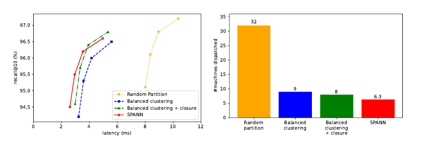

**图 14：** 端到端测试中的召回率、延迟和分发机器数比较。

## 5. 结论

我们提出 SPANN，一个简单却出人意料地高效、基于倒排索引的 ANNS 系统；它在召回率、延迟和内存成本方面都达到了大规模数据集上的先进性能。此前的倒排索引方法使用有损数据压缩解决内存瓶颈，SPANN 则采用简单的内存-磁盘混合方案，只把倒排列表质心存入内存。通过大幅减少磁盘访问次数并提升倒排列表质量，系统同时保证低延迟和高召回率。实验表明，SPANN 不仅在十亿规模数据集上建立了新的先进性能，而且扩展到分布式搜索场景后也具有良好可扩展性。这说明分层 SPANN 能以高效率和低服务成本支持超大规模向量搜索。

## 6. 致谢

感谢 Nvidia 的 Ben Karsin 和 Murat Guney 帮助我们进一步使用 GPU 加速 SPANN 索引构建；GPU 版本比 CPU 版本快五倍以上。

## 参考文献

[1] [n.d.]. Benchmarking nearest neighbors. <http://ann-benchmarks.com/>.

[2] [n.d.]. Billion-scale ANNS Benchmarks. <http://big-ann-benchmarks.com/>.

[3] [n.d.]. Datasets for approximate nearest neighbor search. <http://corpus-texmex.irisa.fr/>.

[4] [n.d.]. Lightweight approximate Nearest Neighbor algorithm (N2). <https://github.com/kakao/n2>.

[5] [n.d.]. NSG: Navigating Spread-out Graph For Approximate Nearest Neighbor Search. <https://github.com/ZJULearning/nsg>.

[6] [n.d.]. SPACEV1B: A billion-Scale vector dataset for text descriptors. <https://github.com/microsoft/SPTAG/tree/master/datasets/SPACEV1B>.

[7] Artem Babenko and Victor Lempitsky. 2014. The inverted multi-index. IEEE Transactions on Pattern Analysis and Machine Intelligence 37, 6 (2014), 1247-1260.

[8] Artem Babenko and Victor Lempitsky. 2016. Efficient indexing of billion-scale datasets of deep descriptors. In Proceedings of the IEEE Conference on Computer Vision and Pattern Recognition (CVPR). 2055-2063.

[9] Dmitry Baranchuk, Artem Babenko, and Yury Malkov. 2018. Revisiting the inverted indices for billion-scale approximate nearest neighbors. In Proceedings of the European Conference on Computer Vision (ECCV). 202-216.

[10] Jeffrey S. Beis and David G. Lowe. 1997. Shape indexing using approximate nearest-neighbour search in high-dimensional spaces. In Proceedings of the IEEE Conference on Computer Vision and Pattern Recognition (CVPR). 1000-1006.

[11] Jon Louis Bentley. 1975. Multidimensional binary search trees used for associative searching. Commun. ACM 18, 9 (1975), 509-517.

[12] Qi Chen, Haidong Wang, Mingqin Li, Gang Ren, Scarlett Li, Jeffery Zhu, Jason Li, Chuanjie Liu, Lintao Zhang, and Jingdong Wang. 2018. SPTAG: A library for fast approximate nearest neighbor search. <https://github.com/Microsoft/SPTAG>.

[13] Sanjoy Dasgupta and Yoav Freund. 2008. Random projection trees and low dimensional manifolds. Proceedings of the 40th Annual ACM Symposium on Theory of Computing (2008), 537-546.

[14] Mayur Datar, Nicole Immorlica, Piotr Indyk, and Vahab S. Mirrokni. 2004. Locality-sensitive Hashing Scheme Based on P-stable Distributions. In Proceedings of the Twentieth Annual Symposium on Computational Geometry (SCG). 253-262.

[15] Shiyuan Deng, Xiao Yan, KW Ng Kelvin, Chenyu Jiang, and James Cheng. 2019. Pyramid: A General Framework for Distributed Similarity Search on Large-scale Datasets. In Proceedings of the IEEE International Conference on Big Data (Big Data). IEEE, 1066-1071.

[16] Wei Dong, Moses Charikar, and Kai Li. 2011. Efficient k-nearest neighbor graph construction for generic similarity measures. In Proceedings of the 20th International Conference on World Wide Web (WWW). 577-586.

[17] György Dósa and Jiří Sgall. 2014. Optimal analysis of Best Fit bin packing. In International Colloquium on Automata, Languages, and Programming. 429-441.

[18] Jerome H. Freidman, Jon Louis Bentley, and Raphael Ari Finkel. 1977. An Algorithm for Finding Best Matches in Logarithmic Expected Time. ACM Trans. Math. Software 3, 3 (1977), 209-226.

[19] Cong Fu, Chao Xiang, Changxu Wang, and Deng Cai. 2019. Fast Approximate Nearest Neighbor Search With The Navigating Spreading-out Graphs. PVLDB 12, 5 (2019), 461-474.

[20] Ruiqi Guo, Philip Sun, Erik Lindgren, Quan Geng, David Simcha, Felix Chern, and Sanjiv Kumar. 2020. Accelerating Large-Scale Inference with Anisotropic Vector Quantization. In Proceedings of the 37th International Conference on Machine Learning (ICML). 3887-3896.

[21] Kiana Hajebi, Yasin Abbasi-Yadkori, Hossein Shahbazi, and Hong Zhang. 2011. Fast Approximate Nearest-Neighbor Search with k-Nearest Neighbor Graph. In Proceedings of the 22nd International Joint Conference on Artificial Intelligence (IJCAI). 1312-1317.

[22] Masajiro Iwasaki. 2016. Pruned bi-directed k-nearest neighbor graph for proximity search. In International Conference on Similarity Search and Applications. Springer, 20-33.

[23] Masajiro Iwasaki and Daisuke Miyazaki. 2018. Optimization of indexing based on k-nearest neighbor graph for proximity search in high-dimensional data. arXiv preprint arXiv:1810.07355 (2018).

[24] P. Jain, B. Kulis, and K. Grauman. 2008. Fast image search for learned metrics. In Proceedings of the IEEE Conference on Computer Vision and Pattern Recognition (CVPR). 1-8.

[25] Herve Jegou, Matthijs Douze, and Cordelia Schmid. 2010. Product quantization for nearest neighbor search. IEEE Transactions on Pattern Analysis and Machine Intelligence 33, 1 (2010), 117-128.

[26] Hervé Jégou, Romain Tavenard, Matthijs Douze, and Laurent Amsaleg. 2011. Searching in one billion vectors: re-rank with source coding. In Proceedings of the IEEE International Conference on Acoustics, Speech and Signal Processing (ICASSP). 861-864.

[27] Jeff Johnson, Matthijs Douze, and Hervé Jégou. 2019. Billion-scale similarity search with GPUs. IEEE Transactions on Big Data (2019).

[28] Yannis Kalantidis and Yannis Avrithis. 2014. Locally optimized product quantization for approximate nearest neighbor search. In Proceedings of the IEEE Conference on Computer Vision and Pattern Recognition (CVPR). 2321-2328.

[29] Brian Kulis and Trevor Darrell. 2009. Learning to Hash with Binary Reconstructive Embeddings. In Advances in Neural Information Processing Systems, Vol. 22. 1042-1050.

[30] Hongfu Liu, Ziming Huang, Qi Chen, Mingqin Li, Yun Fu, and Lintao Zhang. 2018. Fast Clustering with Flexible Balance Constraints. In Proceedings of the IEEE International Conference on Big Data (Big Data). IEEE, 743-750.

[31] Ting Liu, Andrew W. Moore, Alexander Gray, and Ke Yang. 2004. An investigation of practical approximate nearest neighbor algorithms. Advances in Neural Information Processing Systems, 825-832.

[32] Yu A. Malkov and Dmitry A. Yashunin. 2018. Efficient and robust approximate nearest neighbor search using hierarchical navigable small world graphs. IEEE Transactions on Pattern Analysis and Machine Intelligence 42, 4 (2018), 824-836.

[33] Marius Muja and David G. Lowe. 2014. Scalable Nearest Neighbour Algorithms for High Dimensional Data. IEEE Transactions on Pattern Analysis and Machine Intelligence 36, 11 (2014), 2227-2240.

[34] David Nister and Henrik Stewenius. 2006. Scalable recognition with a vocabulary tree. In Proceedings of the IEEE Conference on Computer Vision and Pattern Recognition (CVPR), Vol. 2. 2161-2168.

[35] Liudmila Prokhorenkova and Aleksandr Shekhovtsov. 2020. Graph-based nearest neighbor search: From practice to theory. In Proceedings of the International Conference on Machine Learning (ICML). 7803-7813.

[36] Jie Ren, Minjia Zhang, and Dong Li. 2020. HM-ANN: Efficient Billion-Point Nearest Neighbor Search on Heterogeneous Memory. In Proceedings of the 34th International Conference on Neural Information Processing Systems, Vol. 33.

[37] Anshumali Shrivastava and Ping Li. 2014. Asymmetric LSH (ALSH) for Sublinear Time Maximum Inner Product Search (MIPS). In Proceedings of the 27th International Conference on Neural Information Processing Systems, Vol. 2. 2321-2329.

[38] Robert F. Sproull. 1991. Refinements to nearest-neighbor searching in k-dimensional trees. Algorithmica 6, 1-6 (1991), 579-589.

[39] Suhas Jayaram Subramanya, Rohan Kadekodi, Ravishankar Krishaswamy, and Harsha Vardhan Simhadri. 2019. Diskann: Fast accurate billion-point nearest neighbor search on a single node. In Proceedings of the 33rd International Conference on Neural Information Processing Systems. 13766-13776.

[40] Eric Sadit Tellez, Guillermo Ruiz, and Edgar Chavez. 2016. Singleton indexes for nearest neighbor search. Information Systems 60 (2016), 50-68.

[41] Godfried T. Toussaint. 1980. The relative neighbourhood graph of a finite planar set. Pattern Recognition 12, 4 (1980), 261-268.

[42] Jingdong Wang and Shipeng Li. 2012. Query-driven iterated neighborhood graph search for large scale indexing. In Proceedings of the 20th ACM International Conference on Multimedia. ACM, 179-188.

[43] Jing Wang, Jingdong Wang, Gang Zeng, Zhuowen Tu, Rui Gan, and Shipeng Li. 2012. Scalable k-nn graph construction for visual descriptors. In Proceedings of the IEEE Conference on Computer Vision and Pattern Recognition (CVPR). 1106-1113.

[44] Jingdong Wang, Naiyan Wang, You Jia, Jian Li, Gang Zeng, Hongbin Zha, and Xian Sheng Hua. 2014. Trinary-projection trees for approximate nearest neighbor search. IEEE Transactions on Pattern Analysis and Machine Intelligence 36, 2 (2014), 388-403.

[45] Jingdong Wang and Ting Zhang. 2019. Composite Quantization. IEEE Transactions on Pattern Analysis and Machine Intelligence 41, 6 (2019), 1308-1322.

[46] Jingdong Wang, Ting Zhang, Jingkuan Song, Nicu Sebe, and Heng Tao Shen. 2018. A Survey on Learning to Hash. IEEE Transactions on Pattern Analysis and Machine Intelligence 40, 4 (2018), 769-790.

[47] Yair Weiss, Antonio Torralba, and Rob Fergus. 2009. Spectral hashing. In Advances in Neural Information Processing Systems. 1753-1760.

[48] Hao Xu, Jingdong Wang, Zhu Li, Gang Zeng, Shipeng Li, and Nenghai Yu. 2011. Complementary hashing for approximate nearest neighbor search. In Proceedings of the IEEE International Conference on Computer Vision (ICCV). 1631-1638.

[49] Peter N. Yianilos. 1993. Data Structures and Algorithms for Nearest Neighbor Search in General Metric Spaces. Proceedings of the Fourth Annual ACM/SIGACT-SIAM Symposium on Discrete Algorithms (1993), 311-321.

[50] Minjia Zhang and Yuxiong He. 2019. Grip: Multi-store capacity-optimized high-performance nearest neighbor search for vector search engine. In Proceedings of the 28th ACM International Conference on Information and Knowledge Management. 1673-1682.

[51] Ting Zhang, Chao Du, and Jingdong Wang. 2014. Composite Quantization for Approximate Nearest Neighbor Search. In Proceedings of the 31st International Conference on Machine Learning (ICML), Vol. 32. 838-846.

## NeurIPS 检查表

1. **面向所有本文作者：**

   1. 摘要和引言中的主要主张是否准确反映论文的贡献与范围？**[是]**
   2. 是否描述了工作的局限？**[是]**
   3. 是否讨论了工作可能带来的负面社会影响？**[不适用]**
   4. 是否阅读伦理审查指南并确认论文符合指南？**[是]**

2. **如果包含理论结果：**

   1. 是否陈述所有理论结果的完整假设集合？**[不适用]**
   2. 是否包含所有理论结果的完整证明？**[不适用]**

3. **如果进行了实验：**

   1. 是否提供复现主要实验结果所需的代码、数据和说明，或在补充材料中提供，或给出 URL？**[是]**
   2. 是否说明所有训练细节，例如数据划分、超参数及其选择方式？**[是]**
   3. 是否报告误差条，例如使用不同随机种子多次运行所得的误差条？**[否]**
   4. 是否报告总计算量和所用资源类型，例如 GPU 类型、内部集群或云服务商？**[是]**

4. **如果使用现有资产，例如代码、数据或模型，或者整理、发布了新资产：**

   1. 如果使用现有资产，是否引用其创建者？**[是]**
   2. 是否说明资产许可证？**[是]**
   3. 是否在补充材料中或通过 URL 提供任何新资产？**[否]**
   4. 是否讨论在使用或整理的数据中获得同意的方式？**[是]**
   5. 是否讨论所用或整理的数据是否包含个人身份信息或冒犯性内容？**[不适用]**

5. **如果使用众包或开展涉及人类受试者的研究：**

   1. 是否提供给予参与者的完整说明文本，以及适用时的截图？**[不适用]**
   2. 是否描述参与者可能面临的风险，并在适用时给出机构审查委员会（IRB）批准链接？**[不适用]**
   3. 是否给出支付给参与者的估计时薪和参与者报酬总额？**[不适用]**

[^1]: 原文以星号标记通讯作者。
[^2]: 原文以匕首号标记“本工作在 Microsoft 任职期间完成”。
