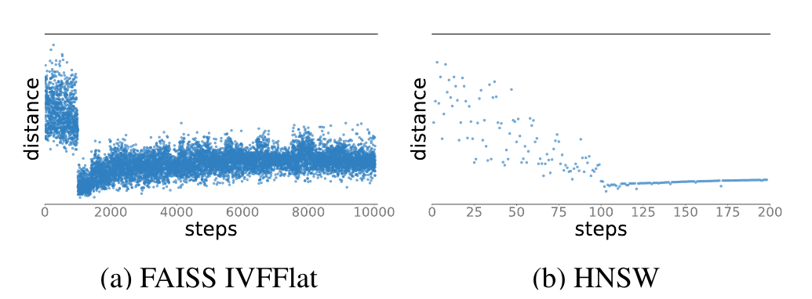
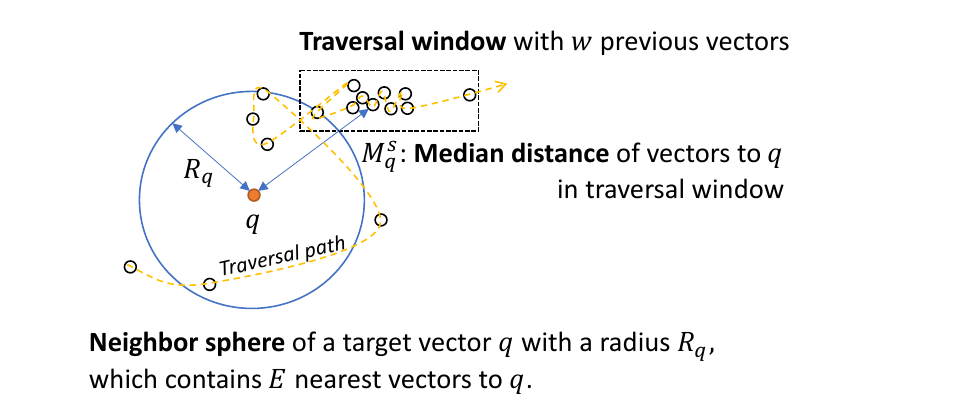
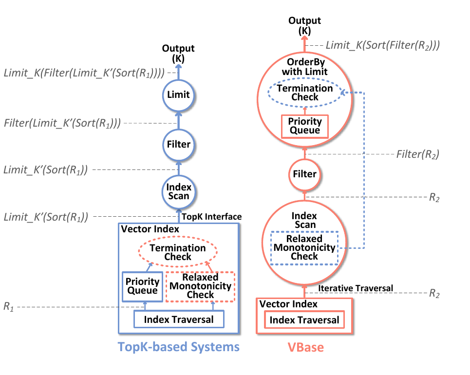
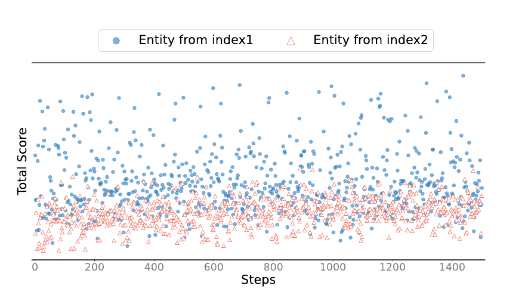
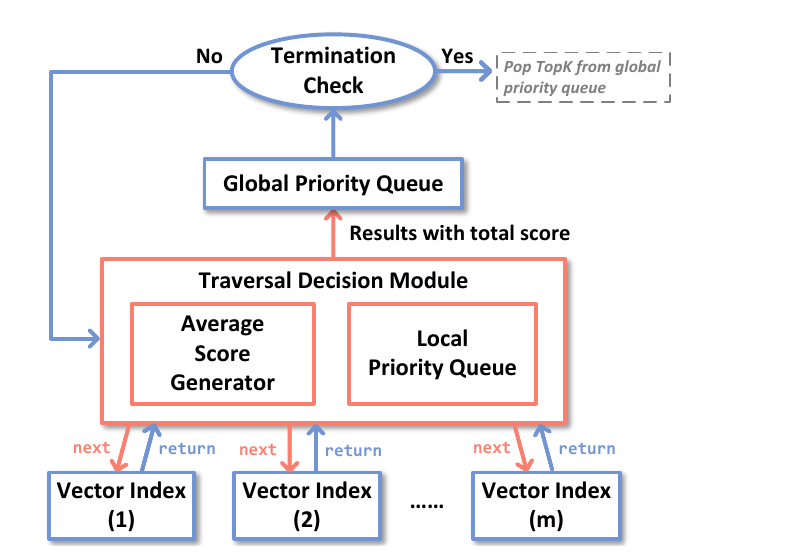
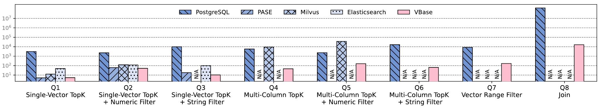
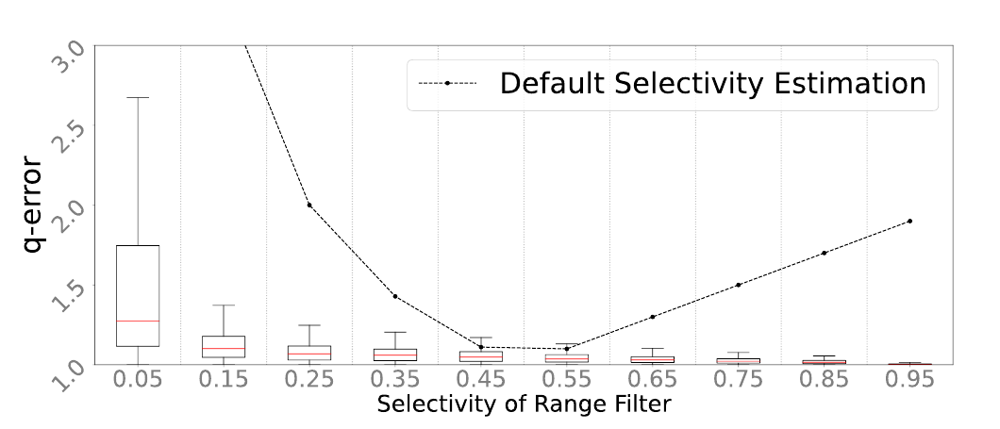
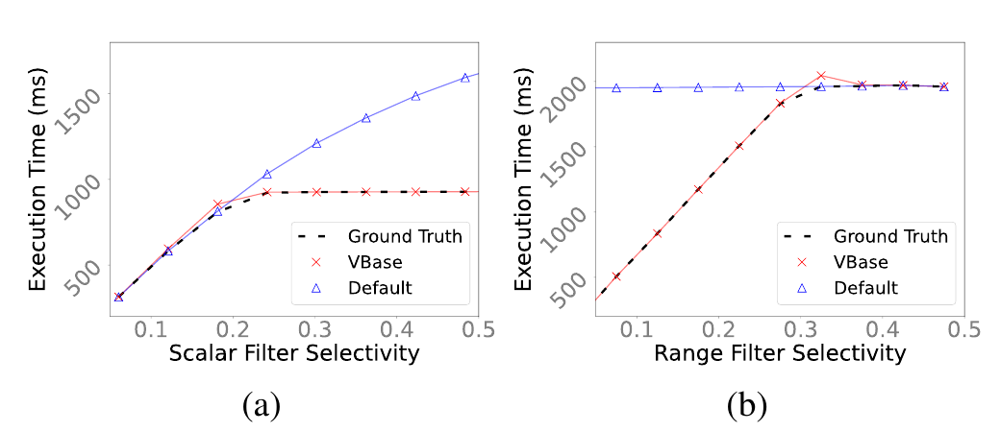

# VBASE: Unifying Online Vector Similarity Search and Relational Queries via Relaxed Monotonicity（中文译文）

## 译者说明

本文依据同目录的 `source.pdf` 翻译。章节、图表、公式、算法、代码与参考文献按原文结构保留。

Qianxi Zhang¹、Shuotao Xu¹、Qi Chen¹*、Guoxin Sui¹、Jiadong Xie¹˒²、Zhizhen Cai¹˒³、Yaoqi Chen¹˒³、Yinxuan He¹˒⁴、Yuqing Yang¹、Fan Yang¹、Mao Yang¹、Lidong Zhou¹

¹ Microsoft Research Asia　² East China Normal University　³ University of Science and Technology of China　⁴ Renmin University of China

* 通讯作者。

## 摘要

高维向量索引上的近似相似性查询已成为许多关键在线服务的基石。日益复杂的向量查询要求把向量搜索系统与关系数据库集成起来。然而，高维向量索引不具备传统索引的一项关键性质--单调性。由于缺少单调性，现有向量系统只能为目标向量的 TopK 最近邻临时建立保持单调性的暂定索引，再在其上执行关系查询；而最优 K 难以预测，因此性能不佳。

我们提出 VBASE，一个能高效支持近似相似性搜索与关系算子组合查询的系统。VBASE 识别出“松弛单调性”（relaxed monotonicity）这一共同性质，用以统一表面上不兼容的两类系统。借助该性质，VBASE 绕过仅有 TopK 接口的限制，在可证明保持 TopK 方案语义的同时显著提高效率。实验表明，在复杂在线向量查询上，VBASE 的性能最高比先进向量系统高三个数量级。VBASE 还支持既有向量系统无法执行的分析型相似性查询；在保持精确查询 99.9% 准确率时，最高加速 7,000 倍。

## 1. 引言

深度学习嵌入模型把图像、视频、文档等各种数据映射为高维向量 [60, 66, 88]。高维向量查询使复杂语义分析成为可能，并成为搜索 [25, 51]、电子商务 [54] 和推荐系统 [49, 53, 56, 84] 等在线服务的基础。在线服务要求向量搜索在毫秒内完成 [31, 36, 42, 64]，而精确搜索本身代价高昂 [28]，用户因而接受高维向量上的近似结果。随着应用发展，向量查询还常常同时处理标量和向量数据，促使向量搜索系统与关系数据库结合。

索引是两类系统加速查询的关键结构，但使用方式不同。B-tree [22] 等传统索引具有单调性，查询可沿确定方向单调遍历数据，避免全表扫描。受维数灾难影响，高维向量索引 [5, 25, 43, 55, 57, 85] 要保持这种性质代价过高，通常采用图或聚类的不规则结构，只近似遵循单调性。遍历时，到目标向量的距离不保证严格有序，但系统可以判断继续遍历是否已不太可能找到比当前 K 个候选更近的向量。因此现代向量索引主要提供近似 TopK：遍历足够多步，直到认为不太可能再找到更近邻居。

现有向量数据库 [76, 80, 86] 通过保持严格单调性来弥合差异。对 TopK 之外的相似性查询，它们先用 TopK 收集 K 个向量，再按到目标向量的距离排序，形成临时的单调索引，随后按传统方式执行关系算子。例如查询“找出 X 个与某图片最相似、且价格低于阈值的商品”，计划先取图片嵌入的 K 个最近元组，再过滤价格。但无法预知多少元组能通过过滤，也就无法知道恰好产出 X 条结果的最优 K。系统只能保守地选很大的 K，或反复尝试多个 K，性能都不理想。

VBASE 面向同时包含近似相似性搜索、关系算子、标量与向量数据集的复杂在线查询。它把“松弛单调性”抽象为向量搜索系统与关系数据库的共同性质：索引遍历只需近似遵循单调性。我们观察到，先进向量索引都呈现两阶段模式：先近似定位目标向量的最近区域，再近似、渐进地远离目标区域。我们据此形式化定义松弛单调性（3.1 节）。它是严格单调性的推广，也适用于 B-tree 等传统标量索引，因而能成为两类系统的共同基础。

VBASE 在此基础上构建统一查询执行引擎，支持标量与向量查询以及跨多个异构索引的查询。引擎以 `Next` 而非 `TopK` 为接口遍历向量和标量索引，并从松弛单调性推导通用终止条件，及时停止执行。它还能证明：查询结果等价于使用最优 $\widetilde K$ 的仅 TopK 方案（3.3 节）。VBASE 无需预先预测 $\widetilde K$，而是在遍历期间检测它；普通 TopK 的性能与充分优化的向量搜索相当，复杂查询的平均与尾延迟则最高降低三个数量级，同时保持相同或更高召回率。

此外，VBASE 能支持此前系统不具备的近似查询。例如，基于连接的向量查询在召回率超过 99.9% 时用 16 秒完成，比暴力表扫描快 7,000 倍。

我们的贡献如下：

1. 首次识别并形式化定义松弛单调性，揭示设计良好的向量索引为何有效。
2. 基于松弛单调性构建统一数据库引擎，使标量与向量索引能共同支撑复杂查询。
3. 证明统一引擎与使用向量索引的仅 TopK 方案结果等价，并采用更高效的执行计划。
4. 基于 PostgreSQL 用约 2,000 行新增代码实现 VBASE，并在同时含向量与标量属性的百万级 Recipe1M 数据集 [59] 上，以八个复杂 SQL 查询做端到端评估。我们计划将 VBASE 开源。

**表 1：向量在线相似性查询支持。**

| 系统 | S1 | S2 | S3 | S4 |
| --- | --- | --- | --- | --- |
| ANN 系统 [25, 43, 46] | 是 | 否 | 否 | 否 |
| AnalyticDB-V [80] | 是 | 是 | 否* | 否* |
| PASE [86] | 是 | 是 | 否* | 否* |
| PostgreSQL [12] | 否* | 否* | 否* | 否* |
| Milvus [76] | 是 | 是 | 是 | 否 |
| Elasticsearch [4] | 是 | 是 | 否（仅一个倒排索引与一个向量索引） | 否 |

\* 某些系统可用穷举线性扫描执行这些查询，但达不到在线服务要求。

## 2. 背景

### 2.1 新兴在线向量查询

向量已成为 AI 时代的重要数据表示。向量中心型在线应用包括基于嵌入的检索 [25, 87]、人脸识别 [69]、代码检索 [37]、问答 [52, 63]、Google Multisearch [7] 和 Facebook 近重复内容检测 [6]。ChatGPT 检索插件 [10] 还把应用的私有知识、个人文档和聊天上下文转换为向量，使系统能在价格、类别、位置或时间约束下检索相关向量来构造提示。

传统应用也受益于 AI 向量：搜索引擎同时使用词袋稀疏向量与深度学习稠密向量表示网页，推荐系统则把商品图像、视频和描述转换为不同向量，再结合价格、类别等标量数据改善推荐。论文把这些场景归为四类：

- **S1：单向量 TopK。** 基于嵌入的检索 [25]、推荐 [87] 和问答 [52, 63] 给定查询向量，在一个向量数据集中寻找 K 个最近向量，可表示为单向量列上的 TopK。
- **S2：单向量 TopK 加标量属性过滤。** 在标量约束下找 TopK，例如 Google Multisearch [7] 在图片相似性搜索中加入文字提示。
- **S3：多列 TopK。** 对不同向量属性的多个 TopK 结果求交。例如图像-菜谱检索 [68] 同时搜索向量化的配料关键词和菜品图片；研究 [70, 83] 表明多列 TopK 可提高问答质量。
- **S4：向量相似性过滤。** 人脸识别 [69] 和近重复内容检测 [6] 按相似度阈值搜索图片，可表示为基于距离的范围查询。

这些查询都有毫秒级延迟要求，而表 1 显示现有系统无法完整、高效地支持全部类型。

### 2.2 数据库与向量搜索系统之间的分歧

关系代数能够表达上述查询，但向量索引与传统数据库索引的语义不同，难以构建统一而高效的系统。

**关系数据库。** 关系数据库 [16, 24, 29, 40] 通过 B-tree [22]、B+-tree [75] 等索引满足低延迟在线查询。它们具有单调性，允许查询按升序或降序遍历。TopK 及其过滤、多列变体 [33] 可在收集 K 个结果后立即结束，但这依赖高维向量索引不具备的单调性。

**近似向量搜索。** 数百维的向量表示 [60, 66, 88] 受到维数灾难限制 [28]，没有方案能以次线性时间完成高维向量查询。近似最近邻搜索（ANNS）系统 [5, 25, 43, 55, 57, 85] 以近似换取毫秒级延迟，并保持 90% 以上召回率。向量索引可分为分区结构--聚类 [5, 17, 19, 25, 44, 45, 48, 90]、哈希 [30, 41, 79, 81, 85]、高维树 [23, 57, 62, 78]--以及邻域图 [32, 39, 43, 55, 58, 77]。遍历大致向目标向量的最近邻移动，但方向可能剧烈变化，不保证每一步更接近目标。缺少单调性正是数据库不能直接用向量索引加速查询的根源。

这类索引通常依赖质心、采样图顶点等锚点来引导查询 q 迂回靠近其近邻。单次移动可能进入一个距离更远的区域，却为随后到达更近区域提供路径，因此数据库不能把某一步的距离当成“后续只会更远”的有序保证。向量系统只能在内部综合候选队列、已访问集合和索引超参数，判断继续搜索找到更近向量的概率已经很低，再结束近似 TopK。

**以 TopK 临时索引消除分歧。** ANNS 系统仅暴露 TopK 接口；当前方案先取 K 个向量并按距离排序，创建保持单调性的临时索引，再执行数据库查询 [76, 80, 86]。但无法为 TopK 加过滤、向量范围过滤等查询预测恰当的 $\widetilde K$。保守的大 K [80, 86] 或不断尝试不同 K [76] 都产生过多数据访问和计算。

当过滤选择率很低时，临时索引中的大多数向量会被关系算子丢弃；当范围内实际向量数随查询位置变化时，也没有固定 K 能保证覆盖。K 过小会漏掉本应返回的结果，K 过大则不仅扫描更多索引节点，还要排序、物化和访问更多主表元组。反复扩大 K 的办法又会从头执行相同遍历，前一轮工作无法复用。这一结构性问题并非某个系统的参数调优可以消除。

## 3. VBASE 设计

### 3.1 松弛单调性

图 1 展示 FAISS IVFFlat [5] 和 HNSW [89] 的 TopK 遍历轨迹。到目标向量的距离会随遍历进展而振荡，不满足严格单调性。



*图 1：两个向量索引的遍历模式；左为 FAISS IVFFlat，右为 HNSW。*

**两阶段向量索引遍历模式。** 两种索引都先在大幅振荡中近似接近目标区域，随后稳定下来，并以近似方式逐步远离目标。我们在多数向量索引中都观察到该模式，认为优良索引的核心是隐式体现这种遍历模式的数据结构。TopK 一旦进入第二阶段就可提前停止，因为继续遍历不太可能找到更相似向量。



*图 2：查询向量 q 沿遍历路径发现包含其 E 个最近向量的邻域。*

**形式化定义。** 图 2 中，虚线箭头是相对查询向量 q 的遍历路径。查询先逐渐接近 q 的邻域；该邻域是在 q 周围、半径为 $R_q$ 的邻域球，包含 q 的 E 个最近向量。随后遍历离开球体进入第二阶段。

在遍历到步骤 s 时，邻域半径定义为此前所见向量中 E 个最近邻的最远距离：

$$
R_q=\mathrm{Max}\left(\mathrm{TopE}\left(\lbrace{}\mathrm{Distance}(q,v_j)\mid j\in[1,s-1]\rbrace{}\right)\right). \tag{1}
$$

TopE 表示遍历中观察到的 q 的 E 个最近邻；K 近邻查询要求 $E\ge K$。第一阶段 $R_q$ 逐步减小，第二阶段趋于稳定。

系统还要度量当前遍历位置 s 与 q 的距离 $M_q^s$。它取最近 w 步（遍历窗口）中所有向量到 q 的距离中位数，以减弱异常大或异常小距离的影响：

$$
M_q^s=\mathrm{Median}\left(\lbrace{}\mathrm{Distance}(q,v_i)\mid i\in[s-w+1,s]\rbrace{}\right). \tag{2}
$$

**定义 1（松弛单调性）。**

$$
\exists s,\ M_q^t\ge R_q,\ \forall t\ge s. \tag{3}
$$

也就是说，存在遍历步骤 s，使其之后所有步骤的位置都落在由 E 个最近邻定义的 q 邻域球之外。松弛单调性使数据库能绕过低效的仅 TopK 接口并在执行中提前终止：下游算子确认遍历进入第二阶段且结果已足够时，可停止查询，因为不太可能再发现更近元组。

**通用性。** ANN Benchmarks [2] 中主流向量索引都包含索引遍历、终止检查、单调性检查和保存当前 K 个最近向量的优先队列。不同实现的单调性检查都满足定义 1：

- **图索引（HNSW [89]）。** HNSW 从分层的粗粒度图导航到细粒度图，再通过 best-first 遍历候选队列。大小为 `ef` 的有序候选队列就是公式 1 的邻域球，因此 $E=ef$；每次只把当前向量与 $R_q$ 比较，因此 $w=1$。
- **分区索引（FAISS IVFFlat [5]、SPANN [25]）。** 先遍历质心选出 m 个最近簇，再扫描其中向量；扫描完 m 个簇即满足公式 3。这里 $E$ 取 TopK 的 K，w 是 m 个簇中的向量总数。
- **标量索引（B-tree）。** 严格单调性是松弛单调性的特例， $w=E=1$，公式 3 始终成立。

VBASE 只是把索引原有性质形式化为 E、w 等数学参数；具体索引仍负责通过 `ef`、m 等超参数保证松弛单调性。

以 HNSW 为例，best-first 搜索从固定入口出发，维护一个按距离排序、大小为 `ef` 的候选队列。遍历某顶点时，算法访问它的邻居；若邻居尚未访问且比队列中最远向量更接近 q，就用该邻居替换最远项并重新排序。队列最远项的距离正是 $R_q$，所以其内部终止逻辑已经隐含定义 1。IVFFlat 则先在第一阶段比较所有质心以找最近的 m 个簇，第二阶段完整扫描这些簇；当 m 个簇全部完成时，继续遍历已不再是该索引算法的一部分。两类实现虽然数据结构差异很大，却都能由同一组 E、w 与公式 3 描述。

松弛单调性不是 VBASE 额外强加给索引的新排序保证，而是对成熟索引已有终止行为的抽象。它把“已经进入稳定远离目标的区域”显式暴露给数据库算子，使下游过滤、排序和连接能够参与终止判断。索引设计者仍须为具体数据分布调节 `ef` 或 m；参数越保守，通常召回率越高，但遍历步数也越多。

### 3.2 统一查询执行引擎

VBASE 以传统数据库引擎和 Volcano/Iterator Model [35] 为基础，仅做少量修改：关系算子迭代地产生元组流供下游消费，满足终止条件时停止。

**迭代执行模型。** VBASE 复用 `Open`、`Next`、`Close` 接口，传统索引无需变化；对只提供 TopK 的向量索引，则暴露其内部遍历过程以适配 `Next`。

**通用终止条件。** VBASE 在原终止条件上增加松弛单调性检查。因为索引保证该性质，公式 3 可化为检查 $M_q^s\gt{}R_q$。只有原终止条件和此检查都通过，查询才停止；对传统索引，后者恒真，退化为原迭代模型。

- **带限制的 OrderBy。** 传统 TopK 收集 K 条有序结果即结束；向量近似 TopK 还必须通过松弛单调性检查，表明遍历已进入第二阶段并持续远离目标。
- **范围过滤。** 传统索引在当前元组超过范围 R 时停止；向量查询还须通过松弛单调性检查，确认处于稳定远离目标的第二阶段。

统一引擎保持与传统数据库兼容，支持 2.1 节全部查询，并带来新的优化机会。例如 VBASE 可在索引遍历中进行过滤，并按 TopK 或范围查询使用灵活终止条件，而不是先 TopK 后过滤；还能直接纳入改进的 NRA 算法 [33] 加速多列查询（4.4 节）。

统一引擎也支持向量 Join。文档自动标注 [26, 72] 可把小型已标注文档集与大型未标注文档集按嵌入距离连接，为每个未标注文档找到最近标签。VBASE 用范围过滤驱动索引嵌套循环连接；既有方案只能全表扫描，实验中 VBASE 快 7,000 倍。

这里的关键不是把所有索引强行改成有序输出，而是把数据库的迭代执行与索引自身的近似收敛信号结合起来。每个算子仍按 Volcano 模型逐条消费、产生元组；只有当业务算子的结果条件已经满足，而且上游索引确认进入第二阶段时，执行才真正结束。因此同一套机制既能表达“已有 K 个候选”的 TopK 条件，也能表达“当前距离已超过 R”的范围条件，还能让过滤算子在遍历期间直接丢弃不合格元组，避免为它们构建临时索引。

### 3.3 结果等价性

VBASE 基于松弛单调性的统一执行引擎，与使用最优 $\widetilde K$ 构建暂定单调索引的 TopK 方法产生等价结果。 $\widetilde K$ 是使 TopK 查询得到 K 个结果所需的最小 K'，因而也使延迟最小；结果召回仍由具体索引质量保证。



*图 3：仅 TopK 系统与 VBASE 的结果等价关系。*

**TopK 加过滤。** 仅 TopK 系统调用 `TopK(K')` 收集并排序 K' 个向量；底层索引实际遍历集合 $R_1$，再应用过滤与 K 限制得到：

$$
r_1=\mathrm{Limit} _ K(\mathrm{Filter}(\mathrm{Limit} _ {K'}(\mathrm{Sort}(R_1)))). \tag{4}
$$

设 `filter_selectivity` 为过滤输出量与输入量之比，可写为：

$$
\begin{aligned}
r_1&=\mathrm{Limit} _ {K''}(\mathrm{Filter}(\mathrm{Sort}(R_1))),\\
K''&=\min(K,K'\times\mathtt{filter\verb0_0selec{}tivity}).
\end{aligned} \tag{5}
$$

若能预测最优 $K'=\widetilde K=K/\mathtt{filter\verb0_0selec{}tivity}$，执行恰得 K 条结果，公式 5 化为：

$$
r_1=\mathrm{Limit} _ K(\mathrm{Filter}(\mathrm{Sort}(R_1))). \tag{6}
$$

VBASE 用同一索引遍历 $R_2$：

$$
r_2=\mathrm{Limit} _ K(\mathrm{Sort}(\mathrm{Filter}(R_2))). \tag{7}
$$

两种系统使用相同向量索引、遍历算法和松弛单调性终止检查，因此 $R_1=R_2$[^1]；Filter 与 Sort 可交换，故 $r_1=r_2$。若 TopK 系统猜得过小，会结果不足、准确率低；猜得过大或反复试探，则浪费遍历。VBASE 在执行中确定 $\widetilde K\times\mathtt{filter\verb0_0selec{}tivity}=K$，兼得准确率和性能。

**范围过滤。** 仅 TopK 方案可写为：

$$
r_1=\mathrm{Filter}(\mathrm{Limit} _ {K'}(\mathrm{Sort}(R_1))). \tag{8}
$$

进而化为：

$$
\begin{aligned}
r_1&=\mathrm{Limit} _ {K''}(\mathrm{Filter}(\mathrm{Sort}(R_1))),\\
K''&=K'\times\mathtt{filter\verb0_0selec{}tivity}.
\end{aligned} \tag{9}
$$

若查询应产生 T 个向量且 $K'=\widetilde K=T/\mathtt{filter\verb0_0selec{}tivity}$，则：

$$
r_1=\mathrm{Limit} _ T(\mathrm{Filter}(\mathrm{Sort}(R_1)))=\mathrm{Filter}(\mathrm{Sort}(R_1)). \tag{10}
$$

VBASE 的结果为：

$$
r_2=\mathrm{Filter}(R_2). \tag{11}
$$

两者遍历和终止条件相同，故 $R_1=R_2$；范围条件与顺序无关，因此 $r_1=r_2$。

[^1]: 假设向量索引遍历是确定性的；大多数向量搜索系统满足该假设。

## 4. VBASE 实现

### 4.1 松弛单调性检查

VBASE 按定义 1 为所有向量索引实现公共检查，维护两个队列：大小为 E 的优先队列 `smallestQueue` 保存已访问的 q 的最近邻；大小为 w 的 `recentQueue` 保存最近遍历窗口。每访问新向量 v 就更新两者，并基于队列中的向量按公式 3 计算当前状态。E、w 对数据分布和索引算法敏感，增大它们通常以更长延迟换取更高准确率，实践中可调节二者折中。

具体地说，`smallestQueue` 给出当前邻域球及其半径 $R_q$，`recentQueue` 给出当前位置的稳健距离 $M_q^s$。新向量到来后，若它比 `smallestQueue` 的最远成员更近，就替换该成员；同时它进入 `recentQueue`，超出窗口的旧向量被移除。随后系统比较两个队列派生的距离。这样，索引本身只需持续提供下一个遍历向量，不必在 HNSW、IVFFlat、SPANN 中分别复制松弛单调性代码。

### 4.2 查询执行引擎

VBASE 以 PostgreSQL 为基础，仅扩展索引遍历和终止条件相关模块。

**向量索引集成。** VBASE 把向量索引内部遍历改造成 `Open`、`Next`、`Close` 接口，已集成 HNSW [89]、IVFFlat [5] 和适合十亿规模的 SPANN [25]。

- **HNSW。** 该索引从上层粗粒度邻域图按 best-first 方式导航到下层细粒度图。VBASE 移除 TopK 结果队列，只保留遍历所需状态：已访问位图、当前向量、后续候选向量。`Open` 搜索高层图，`Next` 返回当前最近的未访问节点、记录它并展开其邻居，`Close` 清理状态。集成改动少于 200 行代码。
- **IVFFlat。** 该索引把向量聚为多个列表并以质心代表。`Open` 按目标到质心的距离由近到远排序列表；`Next` 逐个返回最近列表中的向量；`Close` 销毁有序列表和当前位置。

**索引扫描算子。** VBASE 使用 PostgreSQL 索引扩展接口 [12] 新增 `vectorindex` 类型，索引扫描把迭代接口调用转发给底层向量索引的 `Next`。表中用数组存储高维向量，在索引元数据中记录元组地址。读出向量时同步返回地址，以定位主表元组。松弛单调性检查放在索引扫描算子中，避免各索引重复实现。

一次查询中，`Open` 先建立可持续跨调用保存的遍历状态；随后每个 `Next` 只推进一次索引并返回当前向量及其主表地址，下游算子立即处理对应元组；`Close` 最后释放候选集合、访问位图、排序列表等状态。与只在 TopK 完成后批量返回 K 个 ID 的接口相比，这种逐步暴露使过滤与终止条件能够在扫描过程中生效。

**带限制的 OrderBy。** VBASE 用 `OrderBy with limit` 加索引扫描实现 TopK，并以优先队列保存候选。上游索引扫描通过松弛单调性检查且队列已有 K 个向量时终止。向量索引默认找最近向量；若查询最远 TopK，创建索引前需反转距离计算方法。

**范围过滤与 Join。** 范围过滤与索引扫描串联，只有满足距离条件的向量进入后续算子。当前向量距离超过约束且索引扫描通过松弛单调性检查时停止。向量 Join 用索引搜索的嵌套循环实现；文档自动标注等场景中，相比暴力扫描快 7,000 倍，召回率为 0.999。

对连接的外表每个元组，VBASE 以其向量作为内表索引查询目标，执行一次距离范围扫描；这仍是标准嵌套循环连接，只是内层由向量索引而非全表扫描实现。距离条件同时决定输出与终止，因而可以把近似索引的低延迟延伸到传统数据库 Join 语义。多个 OrderBy、Filter、Join 与索引扫描还可以继续组合，统一引擎不需要为每种新查询设计独立 TopK 协议。

上述算子还可组合支持更复杂查询。

### 4.3 查询规划

复杂查询需要估计多种计划的代价，包括向量代数计算、过滤选择率和索引扫描。

**向量计算。** 传统数据库以常数 t（如 0.0025）估计标量运算成本；向量距离成本与维度成正比：

$$
t_v(\mathrm{dim})=t\cdot c\cdot\mathrm{dim},
$$

其中 c 表示 SIMD 优化系数，dim 为向量维度。

**选择率估计。** VBASE 用采样方法 [67, 82] 估计高维向量分布：均匀采样并把样本保存到数据库元数据；查询 q 到来时在样本上运行过滤，估计完整数据集选择率：

$$
\mathrm{Sel} _ {sample}(q)\approx\mathrm{Sel} _ {full\verb0_0data}(q).
$$

实验中采样率 0.001 通常使 q-error 小于 1.1，额外延迟不足 1 ms。

**索引扫描成本。** 每个遍历步骤包含磁盘读取 $t _ {IO}$ 与距离计算：

索引扫描成本分为启动成本与遍历成本。启动阶段负责在返回首条向量前定位目标附近区域；遍历阶段迭代访问匹配元组。向量索引的单步工作既可能从磁盘读取索引块，也必须计算向量距离，因此不能沿用标量索引的固定单步常数。

$$
C _ {step}=t_v(\mathrm{dim})+t _ {IO}.
$$

对 IVFFlat、SPANN 等分区索引：

$$
C_p=N_cC _ {step}+\max\left(\left\lceil\mathrm{Sel}(q)N/N_p\right\rceil,m\right)N_pC _ {step},
$$

其中 N 是表大小， $N_c$ 是质心数， $N_p$ 是每分区平均数据量，m 是满足松弛单调性所需遍历的分区数。

对 HNSW 等图索引：

$$
C_g=N _ {start}C _ {step}+\max(\mathrm{Sel}(q)N,N_E)R _ {iter}C _ {step},
$$

其中 $N _ {start}$ 是 `Open` 遍历上层图的步数， $N_E$ 是满足松弛单调性所需步数， $R _ {iter}$ 是每个 `Next` 步骤调用距离函数的平均次数。这些量依赖索引超参数与数据分布，可通过采样自动估计并嵌入数据库 `Analyze`。

分区索引公式的第一项是比较 $N_c$ 个质心的启动成本；第二项估计为覆盖过滤结果需要扫描的分区数，但绝不能少于满足松弛单调性所需的 m 个分区。图索引公式同理：先付出上层导航的 $N _ {start}$ 步，再在细粒度图中遍历选择率预期所需的向量数；即使预期结果很少，也至少执行 $N_E$ 步以获得可靠终止信号。`Analyze` 通过采样记录这些统计量，让 PostgreSQL 能把向量路径与 B-tree、顺序扫描等传统路径放在同一成本空间比较。

### 4.4 多列扫描优化

仅 TopK 系统只能在多个 TopK 有序结果集上执行多列扫描。Milvus 以 NRA [33] 做多列扫描，结果不足时把 K 加倍并从头重跑；每个更大的 K 都独立遍历底层索引，造成重复访问和计算。VBASE 则直接在索引扫描算子上实现 NRA，避免重复执行。

传统 NRA 轮询每个索引，但各向量索引返回结果的质量可能不同，尤其排名函数对不同索引赋予不同权重时。图 4 中权重比为 1:2，轮询会遍历过多低质量向量（蓝点）。



*图 4：Recipe1M 上双索引查询；总分是两个向量距离按 1:2 加权求和，分数越低越接近目标。蓝点和红色三角分别表示经 index1 与 index2 得到的实体总分。*

VBASE 更频繁地扫描高质量索引，使查询更早结束且结果更准。但纯贪心可能陷入局部最优：图 4 中它可能只访问 index2，虽然 index1 偶尔也会给出高质量向量。



*图 5：假设有 m 个索引的多列遍历优化。*

为平衡探索与利用，VBASE 把遍历分为多轮，增加遍历决策模块。局部优先队列保存上一轮结果，以判断下一轮更可能返回好结果的索引；模块还维护每个索引全部已遍历实体的平均分 $avg_i$，作为全局信息。每轮额外遍历索引 i 的次数为：

$$
W_i=\left\lceil n_2\times\frac{1/avg_i}{\sum _ {j=1}^{m}1/avg_j}\right\rceil,
$$

其中 $n_2$ 是超参数。平均分低的高质量索引被访问更多，但每轮仍至少访问一次低质量索引。5.3 节表 7 展示收益。

每个索引返回的局部候选先进入遍历决策模块，模块计算完整排名函数所需的总分，再把候选放入全局优先队列。局部优先队列反映最近一轮的短期质量，平均分则避免短期偶然性把某个索引永久饿死。终止检查通过时，从全局队列弹出 TopK；未通过则依据新一轮统计重新分配各索引的访问次数。这套方法保留 NRA 不做随机访问的特点，同时减少在低收益索引上的无效扫描。

## 5. VBASE 评估

本节把 VBASE 与先进的向量搜索系统、支持向量的数据库比较，评估基于 TopK 的向量相似性查询，展示 VBASE 的性能和准确率优势。

### 5.1 评估基准

现有向量基准 [2, 3] 只有向量数据，数据库基准 [13, 14] 只有标量数据，因此我们扩展 Recipe1M [68] 构造向量-标量混合基准。Recipe1M 包含一百多万份菜谱，每份含配料、烹饪说明和成品图片。评估数据由 Recipe 表与 Tag 表组成。

**表 2：Recipe 表模式。**

| 列名 | 数据类型 | 示例 |
| --- | --- | --- |
| `recipe_id` | identifier | `1` |
| `images` | string list | `["data/images/1/0.jpg", ...]` |
| `description` | text | `[ingredients] + [instruction]` |
| `images_embedding` | vector | `[0.0421, 0.0296, ..., 0.0273]` |
| `description_embedding` | vector | `[0.0056, 0.0487, ..., 0.0034]` |
| `popularity` | integer | `300` |

**表 3：Tag 表模式。**

| 列名 | 数据类型 | 示例 |
| --- | --- | --- |
| `id` | identifier | `1` |
| `tag_name` | text | `"salad"` |
| `tag_vector` | vector | `[0.0137, 0.0421, ..., 0.0183]` |

Recipe 表保存 Recipe1M 中 330,922 份配料、说明和图片都完整的菜谱[^2]。它继承 `recipe_id` 与图片 URI，把配料和说明合并成 `description`；`images_embedding` 与 `description_embedding` 是基于 [68] 跨模态模型得到的 1,024 维向量，`popularity` 是 `[0,10000]` 的随机整数。

Tag 表从 Recipe1M 抽取 10,000 份菜谱并人工分配 `dessert`、`main course`、`salad`、`pizza` 等标签；`id` 是标签集的唯一整数，`tag_vector` 是由同一模型生成的 1,024 维菜谱图片嵌入。

[^2]: 我们剔除了缺少配料、烹饪说明或相关图片的菜谱。

**SQL 向量相似性查询。** 我们设计 Q1-Q7 模拟 2.1 节各种在线向量场景，并用 Q8 评估基于向量相似性匹配的分析型连接。八个查询覆盖 Projection、Index Scan、Sort with Limit、Filter 和 Join。

**Q1：单向量 TopK。**

```sql
SELECT recipe_id FROM Recipe
ORDER BY INNER_PRODUCT(images_embedding,
                       ${p_images_embedding})
LIMIT 50;
```

**Q2：单向量 TopK 加数值过滤。**

```sql
SELECT recipe_id FROM Recipe
WHERE popularity <= ${p_popularity}
ORDER BY INNER_PRODUCT(images_embedding,
                       ${p_images_embedding})
LIMIT 50;
```

**Q3：单向量 TopK 加字符串过滤。**

```sql
SELECT recipe_id FROM Recipe
WHERE description NOT LIKE "%${p_ingredient}%"
ORDER BY INNER_PRODUCT(images_embedding,
                       ${p_images_embedding})
LIMIT 50;
```

**Q4：多列 TopK。**

```sql
SELECT recipe_id FROM Recipe
ORDER BY INNER_PRODUCT(images_embedding,
                       ${p_images_embedding})
       + WEIGHT * INNER_PRODUCT(description_embedding,
                                ${p_description_embedding})
LIMIT 50;
```

**Q5：多列 TopK 加数值过滤。**

```sql
SELECT recipe_id FROM Recipe
WHERE popularity <= ${p_popularity}
ORDER BY INNER_PRODUCT(images_embedding,
                       ${p_images_embedding})
       + WEIGHT * INNER_PRODUCT(description_embedding,
                                ${p_description_embedding})
LIMIT 50;
```

**Q6：多列 TopK 加字符串过滤。**

```sql
SELECT recipe_id FROM Recipe
WHERE description NOT LIKE "%${p_ingredient}%"
ORDER BY INNER_PRODUCT(images_embedding,
                       ${p_images_embedding})
       + WEIGHT * INNER_PRODUCT(description_embedding,
                                ${p_description_embedding})
LIMIT 50;
```

**Q7：向量范围过滤。**

```sql
SELECT recipe_id FROM Recipe
WHERE INNER_PRODUCT(images_embedding,
                    ${p_images_embedding}) <= ${D};
```

**Q8：连接。**

```sql
SELECT Recipe.recipe_id, Tag.tag_name
FROM Recipe JOIN Tag
ON INNER_PRODUCT(Recipe.images_embedding,
                 Tag.tag_vector) <= ${D};
```

每个查询生成 10,000 组替换参数以覆盖不同条件。TopK 的 K 设为 50，与 Milvus 实验 [76] 一致。数值过滤覆盖高低选择率：`p_popularity` 从 1 增到 10,000；`p_ingredient` 从 Recipe1M 配料词中抽样；`WEIGHT=1`；Q7 的 `D=0.1`，Q8 的 `D=0.01`。

**指标。** 近似查询用召回率评价相对 ground truth 的准确率，用延迟评价性能。TopK 总返回 K 条时召回率等于精确率；范围过滤只要遵守约束，精确率恒为 1，因此统一报告召回率。Q1-Q7 对全部参数测平均、中位数和第 99 百分位延迟；Q8 执行三次并报告平均执行时间。

### 5.2 实验设置

所有实验在 Azure `Standard_F64s_v2` [1] 虚拟机上独立运行：64 vCPU、128 GiB 内存、Ubuntu 20.04 LTS。

**基线。** 向量系统选 Milvus [76] 与 Elasticsearch [4]。二者没有 SQL 接口，因此手工实现基准查询；我们还按 Milvus 论文 [76] 实现其开源代码 [8] 尚未提供的 Iterative Merging 多列 TopK。Elasticsearch 使用支持 HNSW 的 Open Distro 1.13 [9]。数据库基线为开源 PASE [11, 86]，并把最大维度从 512 扩到 1,024；另用 PostgreSQL 13 [12] 展示传统数据库的暴力向量查询性能。

所有系统统一使用 HNSW [89]：`M=16`、`ef_construction=200`、`ef_search=64`。HNSW 使用时驻留内存；为排除各系统主表缓存策略影响，也把主表数据保存在内存。数据库基线与 VBASE 都在 `popularity` 上建立 B-tree。

### 5.3 评估结果

**总览。** 表 4 汇总结果。PostgreSQL 能执行全部查询并给出精确结果，但暴力扫描比近似系统慢约 1,000 倍，不适合在线场景，主要用于生成 ground truth。其他基于近似索引的基线只能执行部分查询，VBASE 则全部支持。Q1 中算法相同，VBASE 性能相近或更好；复杂查询中，VBASE 能在线决定最优 $\widetilde K$，比必须试探 K 的系统快 100-1,000 倍，同时召回率相当或更高。

**表 4：八个查询结果总览（延迟：ms）。**

| 系统 | Q1 Recall | Q1 avg/med/p99 | Q2 Recall | Q2 avg/med/p99 | Q3 Recall | Q3 avg/med/p99 | Q4 Recall | Q4 avg/med/p99 |
| --- | ---: | --- | ---: | --- | ---: | --- | ---: | --- |
| PostgreSQL | 1 | 2,980.1 / 3,021.7 / 3,133.6 | 1 | 1,108.3 / 1,124.1 / 2,286.2 | 1 | 4,322.2 / 3,529.3 / 9,953.0 | 1 | 5,610.0 / 5,604.7 / 5,769.8 |
| PASE | 0.9949 | 4.8 / 3.5 / 5.1 | 0.9987 | 29.3 / 28.7 / 61.7 | 0.9982 | 13.2 / 10.7 / 17.9 | - | - |
| Milvus | 0.9949 | 9.4 / 9.0 / 12.7 | 0.9919 | 33.7 / 23.9 / 121.4 | - | - | 0.9041 | 6,696.4 / 8,349.3 / 9,299.0 |
| Elasticsearch | 0.9949 | 43.1 / 41.8 / 48.9 | 0.5010 | 97.9 / 98.1 / 118.1 | 0.8378 | 79.9 / 90.0 / 100.9 | - | - |
| VBASE | 0.9949 | 4.9 / 3.9 / 5.3 | 0.9989 | 11.7 / 6.3 / 51.7 | 0.9983 | 7.9 / 6.7 / 10.4 | 0.9696 | 19.8 / 18.4 / 46.4 |

| 系统 | Q5 Recall | Q5 avg/med/p99 | Q6 Recall | Q6 avg/med/p99 | Q7 Recall | Q7 avg/med/p99 | Q8 Recall | Q8 avg |
| --- | ---: | --- | ---: | --- | ---: | --- | ---: | ---: |
| PostgreSQL | 1 | 1,192.9 / 1,234.4 / 2,343.6 | 1 | 6,543.2 / 5,996.3 / 16,734.6 | 1 | 8,244.9 / 8,212.6 / 8,641.6 | 1 | 129,051,273.9 |
| PASE | - | - | - | - | - | - | - | - |
| Milvus | 0.9691 | 12,637.9 / 5,617.4 / 36,887.9 | - | - | - | - | - | - |
| Elasticsearch | - | - | - | - | - | - | - | - |
| VBASE | 0.9805 | 35.8 / 24.9 / 160.7 | 0.9626 | 21.6 / 18.3 / 64.8 | 0.9840 | 10.8 / 2.2 / 168.9 | 0.9992 | 16,335.9 |

Q8 只有一组查询参数，因此平均、中位数和第 99 百分位相同。



*图 6：Q1-Q8 的第 99 百分位查询延迟（ms，对数坐标）。*

**Q1--单向量 TopK。** 所有近似系统运行相同算法并产生相同结果，召回率完全一致。延迟差异首先来自实现语言：Milvus 使用 Go/C++，Elasticsearch 使用 Java/C++，PASE 与 VBASE 使用 C，后者通常快 2-10 倍。其次，VBASE 的 Iterator Model 在遍历中为每个向量取主表元组，而 PASE 只在得到 TopK 后取 K 个元组；因此 VBASE 平均和 p99 比 PASE 慢 2.8%。

该结果也说明，VBASE 的通用接口没有改变底层近似算法或牺牲召回率。它与 PASE 访问相同数量的索引向量；额外成本来自为了让下游算子逐条工作而提前访问主表。即使如此，Q1 的差距仍很小，而复杂查询能够利用这些逐条元组避免远大于此的重复遍历。

**Q2-Q3--单向量 TopK 加标量过滤。** Q2 用整数 `popularity` 过滤，Q3 用正则表达式过滤字符串；除 Milvus 不支持字符串外，各基线都能执行。近似基线只尝试一次 K'。Elasticsearch 低估 K，结果不足且准确率低；PASE 与 Milvus 高估 K，准确率接近 VBASE，但遍历更多。Q3 选择率约 0.9；Q2 的 10,000 个查询使选择率在 0-1 均匀分布。表 5 比较 VBASE 与 PASE 在 0.03、0.3、0.9 三种代表值下的结果。选择率越低，需要检查的数据和最优 $\widetilde K$ 越大；即使选择率相同，不同查询的 $\widetilde K$ 也有很大方差。PASE 的静态 K' 无法持续兼得召回率和性能，VBASE 在线确定 $\widetilde K$，表现最好。

Elasticsearch 虽因低估 K 而访问更少数据，延迟仍是近似系统中最差，说明其实现开销与 Q1 的趋势一致。PASE 若把 K' 固定为 10,000，可在三种选择率下得到近乎精确的结果，但平均延迟分别升至 62.8、48.9、41.8 ms；若固定为 100，则低选择率下召回率仅 0.0567。VBASE 不把某个选择率的安全值强加给全部查询，而是随实际通过过滤的元组数量继续推进同一次索引遍历。

**表 5：带标量过滤的向量搜索（延迟：ms）。**

| 选择率 | 系统 | Recall | avg | median | p99 |
| ---: | --- | ---: | ---: | ---: | ---: |
| 0.03， $avg(\widetilde K)=1,772,\sigma=224.16$ | PASE(K'=100) | 0.0567 | 5.1 | 5.1 | 6.3 |
|  | PASE(K'=1,000) | 0.5885 | 21.5 | 21.2 | 30.8 |
|  | PASE(K'=10,000) | 1 | 62.8 | 62.5 | 78.7 |
|  | VBASE | 0.9987 | 34.5 | 34.0 | 44.8 |
| 0.3， $avg(\widetilde K)=291,\sigma=59.65$ | PASE(K'=100) | 0.5844 | 5.9 | 5.9 | 9.1 |
|  | PASE(K'=1,000) | 0.9998 | 15.4 | 15.0 | 21.5 |
|  | PASE(K'=10,000) | 1 | 48.9 | 49.3 | 61.1 |
|  | VBASE | 0.9966 | 7.6 | 7.0 | 8.5 |
| 0.9， $avg(\widetilde K)=188,\sigma=50.33$ | PASE(K'=100) | 0.9947 | 5.5 | 5.7 | 10.4 |
|  | PASE(K'=1,000) | 1 | 10.1 | 10.0 | 16.3 |
|  | PASE(K'=10,000) | 1 | 41.8 | 41.7 | 53.1 |
|  | VBASE | 0.9990 | 5.7 | 5.3 | 7.2 |

**Q4-Q6--多列 TopK。** 只有 Milvus 与 VBASE 支持 Q4-Q6；Q5、Q6 分别增加 Q2、Q3 的标量过滤，Milvus 又不支持 Q6 的字符串。Milvus 反复猜 K'，直到多个 TopK 结果交集足够大；多轮随机访问甚至使它慢于 PostgreSQL 顺序扫描。VBASE 对每个索引按松弛单调性确定最优 $\widetilde K$，延迟快 200-300 倍且召回率超过 96%。

Milvus 的每次猜测都会从头执行多个索引 TopK，再把结果交给 NRA；猜测失败后，前一轮访问不能复用。随着 K' 增长，多个大结果集的随机主表读取不断累积。VBASE 让每个向量索引保留自己的迭代状态，并由统一 NRA 决定下一步推进哪个索引，所以同一候选只访问一次；Q4、Q5 的平均延迟分别为 19.8 和 35.8 ms，而 Milvus 为 6,696.4 和 12,637.9 ms。

表 7 还比较四种排名权重与三种索引遍历策略。权重差异大（1:10）时，贪心能迅速识别低权重、低质量索引并少访问它，性能最好；权重接近时，贪心容易陷入局部最优，1:1 下扫描最多且召回最低。VBASE 动态切换索引，在所有设置下召回率更高，并比轮询低约 5% 延迟。

**表 7：多列 TopK 比较（延迟：ms）。**

| 权重比 | 算法 | 扫描次数 | 延迟 | Recall |
| --- | --- | ---: | ---: | ---: |
| 1:1 | Round-Robin | 651.93 | 20.91 | 0.9715 |
|  | Greedy | 699.02 | 21.70 | 0.9313 |
|  | VBASE | 638.56 | 20.56 | 0.9705 |
| 1:2 | Round-Robin | 617.22 | 20.25 | 0.9802 |
|  | Greedy | 612.51 | 19.94 | 0.9655 |
|  | VBASE | 593.99 | 19.78 | 0.9818 |
| 1:5 | Round-Robin | 463.39 | 16.93 | 0.9946 |
|  | Greedy | 372.96 | 14.90 | 0.9949 |
|  | VBASE | 409.31 | 15.69 | 0.9961 |
| 1:10 | Round-Robin | 363.47 | 14.81 | 0.9981 |
|  | Greedy | 274.86 | 12.69 | 0.9985 |
|  | VBASE | 311.66 | 13.97 | 0.9987 |

扫描次数是两个向量索引的平均扫描次数。Greedy 先各遍历 20 次，找出平均距离最低的索引，随后只从该索引取候选。

**Q7--向量范围过滤。** 默认只有 VBASE 支持。我们为 PASE 增加带手工 K' 的 `Order By distance` 来模拟。表 6 显示固定 K' 同样难以预设，最优 $\widetilde K$ 的平均值为 590、标准差为 1,758.48，个别查询需要 2,300 以上。VBASE 在线确定 $\widetilde K$，兼顾延迟与召回率。Q7 通常返回很少结果，但少数查询最多返回 10,000 条，因此 p99 为 168.9 ms，远大于平均 10.8 ms，而中位数仅 2.2 ms。

PASE 的模拟方案再次呈现静态 K' 的两难：K'=100 时只有 0.7103 召回率，K'=10,000 时召回率达 0.9991，却需要 392.1 ms。VBASE 的 0.9840 召回率与 10.8 ms 平均延迟表明，范围谓词可以直接作为统一引擎的输出和终止条件，而不必先人为转换成 TopK。

**表 6：范围过滤（延迟：ms）。**

| 系统 | Recall | average | median | p99 |
| --- | ---: | ---: | ---: | ---: |
| PASE(K'=100) | 0.7103 | 7.3 | 6.9 | 8.8 |
| PASE(K'=1,000) | 0.9387 | 44.3 | 43.6 | 54.7 |
| PASE(K'=10,000) | 0.9991 | 392.1 | 390.5 | 484.9 |
| VBASE | 0.9840 | 10.8 | 2.2 | 168.9 |

**Q8--连接。** PostgreSQL 用表扫描嵌套循环得到精确结果；VBASE 在召回率 0.9992 时快 7,900 倍。其他系统缺少统一查询引擎，无法执行。

### 5.4 使用 SPANN 的 VBASE

我们在带 NVMe 的 Azure `Standard_L16s_v3` 上评估外存分区索引 SPANN [25]。由于 SPANN 使用磁盘，延迟通常高于内存 HNSW，但结果表明 VBASE 同时支持分区/图索引和内存/磁盘索引。

SPANN 的 `Open` 先定位近邻分区，后续 `Next` 需要从 NVMe 读取候选，因此 Q1-Q7 延迟相对 HNSW 普遍上升；Q8 连接需要大量内层索引查找，平均达到 87,729.3 ms。尽管存储介质和遍历算法都改变，统一执行引擎仍复用同一松弛单调性检查、关系算子和 SQL 语义，说明设计不依赖某个特定内存图索引。

**表 8：使用 SPANN 的 VBASE 查询（延迟：ms）。**

| 查询 | Recall | average | median | p99 |
| --- | ---: | ---: | ---: | ---: |
| Q1 | 0.9911 | 9.4 | 9.2 | 11.6 |
| Q2 | 0.9214 | 10.7 | 9.3 | 44.9 |
| Q3 | 0.9847 | 9.7 | 9.4 | 11.8 |
| Q4 | 0.9481 | 32.2 | 28.7 | 68.2 |
| Q5 | 0.9757 | 87.4 | 55.9 | 519.7 |
| Q6 | 0.9516 | 40.1 | 32.1 | 126.2 |
| Q7 | 0.9923 | 17.8 | 9.3 | 283.5 |
| Q8 | 0.9638 | 87,729.3 | - | - |

Q8 只有一组查询参数。

### 5.5 成本估计

**选择率估计准确度。** 我们用 q-error [61] 评价向量范围过滤的选择率估计：

$$
Q _ {err}=\max\left(\frac{Sel _ {esti}}{Sel _ {real}},\frac{Sel _ {real}}{Sel _ {esti}}\right).
$$



*图 7：不同范围过滤选择率下的 q-error；默认估计选择率为 0.5。*

采样估计在多数情况下 q-error 小于 1.1。选择率最低为 0.05 时，样本分辨率不足，q-error 最高到 1.27。提高采样率可继续降低误差，但会增加规划时间，不适合在线查询；现有准确度已足以生成好计划。PASE [11] 没有选择率估计，默认取 0.5。

q-error 对高估和低估对称：估计值与真实值完全相同为 1，偏差越大则值越高。图 7 的箱线图显示，在 0.15-0.95 的大多数选择率上，采样分布紧贴 1；而固定 0.5 的默认估计随真实选择率变化显著偏离。低选择率的稀有事件在 0.001 样本中数量有限，解释了 0.05 处更宽的误差分布。

**查询规划。** 使用以下查询评估规划效果：

```sql
SELECT recipe_id FROM Recipe
WHERE INNER_PRODUCT(q, images_embedding) < ${r}
  AND popularity < ${p};
```

向量范围过滤可由向量索引加速，标量过滤可由 B-tree 加速。VBASE 的选择率、向量计算和索引扫描估计足够准确，可复用 PostgreSQL 内置机制选择最佳计划。



*图 8：不同估计策略的执行时间；(a) 固定范围过滤选择率为 0.13，(b) 固定标量过滤选择率为 0.90。*

图 8(a) 改变标量选择率：当它低于 0.18，VBASE 正确判断 B-tree 成本更低；超过 0.18，则选择向量索引。图 8(b) 改变向量范围过滤选择率，也表明准确成本估计能生成接近 ground truth 的计划。PASE 不准确估计选择率、向量计算与向量索引遍历成本，在该实验中始终选择 B-tree。

图中的 ground truth 是分别实际执行候选路径后的最佳时间。VBASE 计划曲线几乎与它重合，只有切换点附近出现轻微误差；默认策略则可能在选择率变化后仍坚持错误索引。该实验把前述采样选择率、按维度计价的向量计算和索引启动/遍历成本联系起来，证明这些模型已足以驱动真实 PostgreSQL 规划器，而不只是离线预测查询时间。

## 6. 相关工作

**数据库中的相似性查询。** 工作 [20, 21, 71, 73, 74] 把数据库扩展到低维向量的精确相似性查询，描述 K-NN/TopK 和范围过滤；可使用 R-Tree [38]、KD-Tree [34]、M-Tree [27]、Slim-Tree [47]。工作 [20] 把相似性查询加入 SQL 并在 SIREN [21] 上执行；[71] 提出相似性 Join 与 Group-by。高维向量的相似性 Group-by 等价于聚类 [15, 18, 50, 65]，但这些工作聚类的是主表数据而非向量索引。

**向量索引。** 高维向量索引通过 TopK 接口高效支持近似最近邻，可分为分区与图两类。分区方案把空间分成子空间，以质心、哈希值或分割平面代表其中向量，再按查询到代表的距离导航到近似最近子空间；包括聚类 [5, 17, 19, 25, 44, 45, 48, 90]、哈希 [30, 41, 79, 81, 85] 和树 [23, 57, 62, 78]。图方案把向量作为顶点，用边连接最近邻并增加远距离捷径，从固定入口逐步向查询的最近邻导航 [32, 39, 43, 55, 58, 77]。仅 TopK 接口限制了表达能力。

**基于 TopK 的向量数据库。** AnalyticDB-V [80]、PASE [86]、Milvus [76] 和 Elasticsearch [4] 都从原始 TopK 接口支持复杂查询。AnalyticDB-V 与 PASE 把向量索引接入数据库引擎提供 SQL；Elasticsearch 是基于 HNSW [89] 的分布式全文搜索引擎。前三者逐步支持向量搜索加标量过滤；Milvus 还通过不断增大 K 支持多列 TopK。VBASE 不依赖 TopK 收集的临时索引。

## 7. 结论

我们提出 VBASE：把高维向量索引集成到关系数据库 PostgreSQL，以执行复杂近似相似性查询。传统方法先用 TopK 收集目标向量的 K 个最近邻，再为查询建立传统索引；VBASE 则基于传统索引与高维索引共有的松弛单调性，构建统一查询执行引擎。它产生与使用最优 $\widetilde K$ 的 TopK 方案等价的结果，并在复杂向量查询上显著优于先进向量系统。

## 8. 致谢

我们感谢论文 shepherd Marco Serafini 和匿名审稿人的深刻意见。

## 参考文献

[1] Azure VM Fsv2-series. <https://learn.microsoft.com/en-us/azure/virtual-machines/fsv2-series>.

[2] Benchmarking Nearest Neighbors. <http://ann-benchmarks.com/>.

[3] Billion-Scale ANNS Benchmarks. <https://big-ann-benchmarks.com/>.

[4] Elasticsearch. <https://www.elastic.co/>.

[5] Facebook Faiss. <https://github.com/facebookresearch/faiss>.

[6] Facebook SimSearchNet. <https://ai.facebook.com/blog/using-ai-to-detect-covid-19-misinformation-and-exploitative-content/>.

[7] Google Multisearch. <https://blog.google/products/search/multisearch/>.

[8] Milvus. <https://github.com/milvus-io/milvus>.

[9] Open Distro. <https://github.com/opendistro-for-elasticsearch/>.

[10] OpenAI ChatGPT Retrieval Plugin. <https://github.com/openai/chatgpt-retrieval-plugin>.

[11] PASE. <https://github.com/forrest-2007/PASE>.

[12] PostgreSQL. <https://www.postgresql.org/>.

[13] The TPC-C Benchmark. <http://www.tpc.org/tpcc/>.

[14] The TPC-H Benchmark. <http://www.tpc.org/tpch/>.

[15] Saurabh Arora and Inderveer Chana. A survey of clustering techniques for big data analysis. In *2014 5th International Conference - Confluence The Next Generation Information Technology Summit (Confluence)*, pages 59-65, 2014.

[16] M. M. Astrahan, M. W. Blasgen, D. D. Chamberlin, K. P. Eswaran, J. N. Gray, P. P. Griffiths, W. F. King, R. A. Lorie, P. R. McJones, J. W. Mehl, G. R. Putzolu, I. L. Traiger, B. W. Wade, and V. Watson. System R: Relational approach to database management. *ACM Trans. Database Syst.*, 1(2):97-137, June 1976.

[17] Artem Babenko and Victor Lempitsky. The inverted multi-index. *IEEE Transactions on Pattern Analysis and Machine Intelligence*, 37(6):1247-1260, 2014.

[18] B. Hari Babu, N. Subhash Chandra, and T. V. Gopal. Clustering algorithms for high dimensional data - a survey of issues and existing approaches. 2012.

[19] Dmitry Baranchuk, Artem Babenko, and Yury Malkov. Revisiting the inverted indices for billion-scale approximate nearest neighbors. In *Proceedings of the European Conference on Computer Vision (ECCV)*, pages 202-216, 2018.

[20] M. C. N. Barioni, H. L. Razente, A. J. M. Traina, and C. Traina. Seamlessly integrating similarity queries in SQL. *Softw. Pract. Exper.*, 39(4):355-384, March 2009.

[21] Maria Camila N. Barioni, Humberto Razente, Agma Traina, and Caetano Traina. SIREN: A similarity retrieval engine for complex data. In *Proceedings of the 32nd International Conference on Very Large Data Bases*, VLDB ’06, pages 1155-1158. VLDB Endowment, 2006.

[22] Rudolf Bayer and Edward McCreight. Organization and maintenance of large ordered indices. In *Proceedings of the 1970 ACM SIGFIDET (now SIGMOD) Workshop on Data Description, Access and Control*, pages 107-141, 1970.

[23] Jon Louis Bentley. Multidimensional binary search trees used for associative searching. *Communications of the ACM*, 18(9):509-517, 1975.

[24] Donald D. Chamberlin. Early history of SQL. *IEEE Annals of the History of Computing*, 34(4):78-82, 2012.

[25] Qi Chen, Bing Zhao, Haidong Wang, Mingqin Li, Chuanjie Liu, Zengzhong Li, Mao Yang, and Jingdong Wang. SPANN: Highly-efficient billion-scale approximate nearest neighborhood search. In M. Ranzato, A. Beygelzimer, Y. Dauphin, P. S. Liang, and J. Wortman Vaughan, editors, *Advances in Neural Information Processing Systems*, volume 34, pages 5199-5212. Curran Associates, Inc., 2021.

[26] Sheng Chen, Akshay Soni, Aasish Pappu, and Yashar Mehdad. DocTag2Vec: An embedding based multi-label learning approach for document tagging. *arXiv preprint arXiv:1707.04596*, 2017.

[27] Paolo Ciaccia, Marco Patella, and Pavel Zezula. M-tree: An efficient access method for similarity search in metric spaces. *International Conference on Very Large Data Bases (VLDB)*, August 2001.

[28] Kenneth L. Clarkson. An algorithm for approximate closest-point queries. In *Proceedings of the Tenth Annual Symposium on Computational Geometry*, pages 160-164, 1994.

[29] E. F. Codd. A relational model of data for large shared data banks. *Commun. ACM*, 13(6):377-387, June 1970.

[30] Mayur Datar, Nicole Immorlica, Piotr Indyk, and Vahab S. Mirrokni. Locality-sensitive hashing scheme based on p-stable distributions. In *Proceedings of the Twentieth Annual Symposium on Computational Geometry*, SCG ’04, pages 253-262, 2004.

[31] Jeffrey Dean and Luiz André Barroso. The tail at scale. *Communications of the ACM*, 56(2):74-80, 2013.

[32] Wei Dong, Moses Charikar, and Kai Li. Efficient k-nearest neighbor graph construction for generic similarity measures. In *Proceedings of the 20th International Conference on World Wide Web*, WWW 2011, Hyderabad, India, March 28-April 1, 2011, pages 577-586, 2011.

[33] Ronald Fagin, Amnon Lotem, and Moni Naor. Optimal aggregation algorithms for middleware. In Peter Buneman, editor, *Proceedings of the Twentieth ACM SIGACT-SIGMOD-SIGART Symposium on Principles of Database Systems*, May 21-23, 2001, Santa Barbara, California, USA. ACM, 2001.

[34] Jerome H. Friedman, Jon Louis Bentley, and Raphael Ari Finkel. An algorithm for finding best matches in logarithmic expected time. *ACM Trans. Math. Softw.*, 3(3):209-226, September 1977.

[35] G. Graefe. Volcano-an extensible and parallel query evaluation system. *IEEE Trans. on Knowl. and Data Eng.*, 6(1):120-135, February 1994.

[36] Wayne D. Gray and Deborah A. Boehm-Davis. Milliseconds matter: An introduction to microstrategies and to their use in describing and predicting interactive behavior. *Journal of Experimental Psychology: Applied*, 6(4):322, 2000.

[37] Daya Guo, Shuai Lu, Nan Duan, Yanlin Wang, Ming Zhou, and Jian Yin. UniXcoder: Unified cross-modal pre-training for code representation. In *Proceedings of the 60th Annual Meeting of the Association for Computational Linguistics (Volume 1: Long Papers)*, pages 7212-7225, 2022.

[38] Antonin Guttman. R-trees: A dynamic index structure for spatial searching. In *Proceedings of the 1984 ACM SIGMOD International Conference on Management of Data*, SIGMOD ’84, pages 47-57, New York, NY, USA, 1984. Association for Computing Machinery.

[39] Kiana Hajebi, Yasin Abbasi-Yadkori, Hossein Shahbazi, and Hong Zhang. Fast approximate nearest-neighbor search with k-nearest neighbor graph. In *IJCAI 2011: Proceedings of the 22nd International Joint Conference on Artificial Intelligence*, Barcelona, Catalonia, Spain, July 16-22, 2011, pages 1312-1317, 2011.

[40] G. D. Held, M. R. Stonebraker, and E. Wong. INGRES: A relational data base system. In *Proceedings of the May 19-22, 1975, National Computer Conference and Exposition*, AFIPS ’75, pages 409-416, New York, NY, USA, 1975. Association for Computing Machinery.

[41] P. Jain, B. Kulis, and K. Grauman. Fast image search for learned metrics. In *2008 IEEE Conference on Computer Vision and Pattern Recognition*, pages 1-8, June 2008.

[42] Virajith Jalaparti, Peter Bodik, Srikanth Kandula, Ishai Menache, Mikhail Rybalkin, and Chenyu Yan. Speeding up distributed request-response workflows. *ACM SIGCOMM Computer Communication Review*, 43(4):219-230, 2013.

[43] Suhas Jayaram Subramanya, Fnu Devvrit, Harsha Vardhan Simhadri, Ravishankar Krishnawamy, and Rohan Kadekodi. DiskANN: Fast accurate billion-point nearest neighbor search on a single node. *Advances in Neural Information Processing Systems*, 32, 2019.

[44] Herve Jegou, Matthijs Douze, and Cordelia Schmid. Product quantization for nearest neighbor search. *IEEE Transactions on Pattern Analysis and Machine Intelligence*, 33(1):117-128, 2010.

[45] Hervé Jégou, Romain Tavenard, Matthijs Douze, and Laurent Amsaleg. Searching in one billion vectors: Re-rank with source coding. In *2011 IEEE International Conference on Acoustics, Speech and Signal Processing (ICASSP)*, pages 861-864. IEEE, 2011.

[46] Jeff Johnson, Matthijs Douze, and Hervé Jégou. Billion-scale similarity search with GPUs. *IEEE Trans. Big Data*, 7(3):535-547, 2021.

[47] Caetano Jr., Agma Traina, Bernhard Seeger, and Christos Faloutsos. Slim-trees: High performance metric trees minimizing overlap between nodes. March 2000.

[48] Yannis Kalantidis and Yannis Avrithis. Locally optimized product quantization for approximate nearest neighbor search. In *Proceedings of the IEEE Conference on Computer Vision and Pattern Recognition (CVPR)*, pages 2321-2328, 2014.

[49] Noam Koenigstein, Parikshit Ram, and Yuval Shavitt. Efficient retrieval of recommendations in a matrix factorization framework. In *Proceedings of the 21st ACM International Conference on Information and Knowledge Management*, pages 535-544, 2012.

[50] Hans-Peter Kriegel, Peer Kröger, and Arthur Zimek. Clustering high-dimensional data: A survey on subspace clustering, pattern-based clustering, and correlation clustering. *ACM Trans. Knowl. Discov. Data*, 3(1), March 2009.

[51] Brian Kulis and Kristen Grauman. Kernelized locality-sensitive hashing for scalable image search. In *2009 IEEE 12th International Conference on Computer Vision*, pages 2130-2137, 2009.

[52] Tom Kwiatkowski, Jennimaria Palomaki, Olivia Redfield, Michael Collins, Ankur Parikh, Chris Alberti, Danielle Epstein, Illia Polosukhin, Jacob Devlin, Kenton Lee, et al. Natural questions: A benchmark for question answering research. *Transactions of the Association for Computational Linguistics*, 7:453-466, 2019.

[53] Hui Li, Tsz Nam Chan, Man Lung Yiu, and Nikos Mamoulis. FEXIPRO: Fast and exact inner product retrieval in recommender systems. In *Proceedings of the 2017 ACM International Conference on Management of Data*, pages 835-850, 2017.

[54] Jie Li, Haifeng Liu, Chuanghua Gui, Jianyu Chen, Zhenyuan Ni, Ning Wang, and Yuan Chen. The design and implementation of a real time visual search system on JD e-commerce platform. In *Proceedings of the 19th International Middleware Conference, Middleware Industrial Track 2018*, Rennes, France, December 10-14, 2018, pages 9-16. ACM, 2018.

[55] Jie Ren, Minjia Zhang, and Dong Li. HM-ANN: Efficient billion-point nearest neighbor search on heterogeneous memory. In *Advances in Neural Information Processing Systems*, 2020.

[56] Defu Lian, Haoyu Wang, Zheng Liu, Jianxun Lian, Enhong Chen, and Xing Xie. LightRec: A memory and search-efficient recommender system. In *Proceedings of The Web Conference 2020*, pages 695-705, 2020.

[57] Ting Liu, Andrew W. Moore, Alexander Gray, and Ke Yang. An investigation of practical approximate nearest neighbor algorithms. *Advances in Neural Information Processing Systems 17*, pages 825-832, 2004.

[58] Yu A. Malkov and Dmitry A. Yashunin. Efficient and robust approximate nearest neighbor search using hierarchical navigable small world graphs. *arXiv preprint arXiv:1603.09320*, 2016.

[59] Javier Marin, Aritro Biswas, Ferda Ofli, Nicholas Hynes, Amaia Salvador, Yusuf Aytar, Ingmar Weber, and Antonio Torralba. Recipe1M+: A dataset for learning cross-modal embeddings for cooking recipes and food images. *IEEE Transactions on Pattern Analysis and Machine Intelligence*, 43(1):187-203, 2019.

[60] Antoine Miech, Dimitri Zhukov, Jean-Baptiste Alayrac, Makarand Tapaswi, Ivan Laptev, and Josef Sivic. HowTo100M: Learning a text-video embedding by watching hundred million narrated video clips. In *Proceedings of the IEEE/CVF International Conference on Computer Vision*, pages 2630-2640, 2019.

[61] Guido Moerkotte, Thomas Neumann, and Gabriele Steidl. Preventing bad plans by bounding the impact of cardinality estimation errors. *Proc. VLDB Endow.*, 2(1):982-993, August 2009.

[62] Marius Muja and David G. Lowe. Scalable nearest neighbour algorithms for high dimensional data. *IEEE Transactions on Pattern Analysis and Machine Intelligence*, 36(11):2227-2240, 2014.

[63] Tri Nguyen, Mir Rosenberg, Xia Song, Jianfeng Gao, Saurabh Tiwary, Rangan Majumder, and Li Deng. MS MARCO: A human generated machine reading comprehension dataset. In *CoCo@NIPS*, 2016.

[64] Rajesh Nishtala, Hans Fugal, Steven Grimm, Marc Kwiatkowski, Herman Lee, Harry C. Li, Ryan McElroy, Mike Paleczny, Daniel Peek, Paul Saab, et al. Scaling Memcache at Facebook. In *10th USENIX Symposium on Networked Systems Design and Implementation (NSDI 13)*, pages 385-398, 2013.

[65] Divya Pandove, Shivan Goel, and Rinkl Rani. Systematic review of clustering high-dimensional and large datasets. *ACM Trans. Knowl. Discov. Data*, 12(2), January 2018.

[66] Mattis Paulin, Matthijs Douze, Zaid Harchaoui, Julien Mairal, Florent Perronnin, and Cordelia Schmid. Local convolutional features with unsupervised training for image retrieval. In *Proceedings of the IEEE International Conference on Computer Vision*, pages 91-99, 2015.

[67] Jianbin Qin, Wei Wang, Chuan Xiao, and Ying Zhang. Similarity query processing for high-dimensional data. *Proc. VLDB Endow.*, 13(12):3437-3440, September 2020.

[68] Amaia Salvador, Nicholas Hynes, Yusuf Aytar, Javier Marin, Ferda Ofli, Ingmar Weber, and Antonio Torralba. Learning cross-modal embeddings for cooking recipes and food images. In *Proceedings of the IEEE Conference on Computer Vision and Pattern Recognition*, pages 3020-3028, 2017.

[69] Florian Schroff, Dmitry Kalenichenko, and James Philbin. FaceNet: A unified embedding for face recognition and clustering. In *Proceedings of the IEEE Conference on Computer Vision and Pattern Recognition*, pages 815-823, 2015.

[70] Minjoon Seo, Jinhyuk Lee, Tom Kwiatkowski, Ankur P. Parikh, Ali Farhadi, and Hannaneh Hajishirzi. Real-time open-domain question answering with dense-sparse phrase index. *arXiv preprint arXiv:1906.05807*, 2019.

[71] Yasin N. Silva, Walid G. Aref, Per-Ake Larson, Spencer S. Pearson, and Mohamed H. Ali. Similarity queries: Their conceptual evaluation, transformations, and processing. *The VLDB Journal*, 22(3):395-420, June 2013.

[72] Yukihiro Tagami. AnnexML: Approximate nearest neighbor search for extreme multi-label classification. In *Proceedings of the 23rd ACM SIGKDD International Conference on Knowledge Discovery and Data Mining*, pages 455-464, 2017.

[73] Caetano Traina, Andre Moriyama, Guilherme Rocha, Robson Cordeiro, Cristina D. A. Ciferri, and Agma Traina. The SimilarQL framework: Similarity queries in plain SQL. In *Proceedings of the 34th ACM/SIGAPP Symposium on Applied Computing*, SAC ’19, pages 468-471, New York, NY, USA, 2019. Association for Computing Machinery.

[74] Caetano Traina, Agma J. M. Traina, Marcos R. Vieira, Adriano S. Arantes, and Christos Faloutsos. Efficient processing of complex similarity queries in RDBMS through query rewriting. In *Proceedings of the 15th ACM International Conference on Information and Knowledge Management*, CIKM ’06, pages 4-13, New York, NY, USA, 2006. Association for Computing Machinery.

[75] Robert E. Wagner. Indexing design considerations. *IBM Systems Journal*, 12(4):351-367, 1973.

[76] Jianguo Wang, Xiaomeng Yi, Rentong Guo, Hai Jin, Peng Xu, Shengjun Li, Xiangyu Wang, Xiangzhou Guo, Chengming Li, Xiaohai Xu, et al. Milvus: A purpose-built vector data management system. In *Proceedings of the 2021 International Conference on Management of Data*, pages 2614-2627, 2021.

[77] Jing Wang, Jingdong Wang, Gang Zeng, Zhuowen Tu, Rui Gan, and Shipeng Li. Scalable k-NN graph construction for visual descriptors. In *Computer Vision and Pattern Recognition (CVPR), 2012 IEEE Conference on*, pages 1106-1113. IEEE, 2012.

[78] Jingdong Wang, Naiyan Wang, You Jia, Jian Li, Gang Zeng, Hongbin Zha, and Xian Sheng Hua. Trinary-projection trees for approximate nearest neighbor search. *IEEE Transactions on Pattern Analysis and Machine Intelligence*, 36(2):388-403, 2014.

[79] Jingdong Wang, Ting Zhang, Jingkuan Song, Nicu Sebe, and Heng Tao Shen. A survey on learning to hash. *IEEE Transactions on Pattern Analysis and Machine Intelligence*, 40(4):769-790, 2018.

[80] Chuangxian Wei, Bin Wu, Sheng Wang, Renjie Lou, Chaoqun Zhan, Feifei Li, and Yuanzhe Cai. AnalyticDB-V: A hybrid analytical engine towards query fusion for structured and unstructured data. *Proceedings of the VLDB Endowment*, 13(12):3152-3165, 2020.

[81] Yair Weiss, Antonio Torralba, and Rob Fergus. Spectral hashing. In *Advances in Neural Information Processing Systems*, pages 1753-1760, 2009.

[82] Xian Wu, Moses Charikar, and Vishnu Natchu. Local density estimation in high dimensions. In Jennifer Dy and Andreas Krause, editors, *Proceedings of the 35th International Conference on Machine Learning*, volume 80 of *Proceedings of Machine Learning Research*, pages 5296-5305. PMLR, July 10-15, 2018.

[83] Xiang Wu, Ruiqi Guo, David Simcha, Dave Dopson, and Sanjiv Kumar. Efficient inner product approximation in hybrid spaces. *arXiv*, abs/1903.08690, 2019.

[84] Shitao Xiao, Zheng Liu, Weihao Han, Jianjin Zhang, Yingxia Shao, Defu Lian, Chaozhuo Li, Hao Sun, Denvy Deng, Liangjie Zhang, et al. Progressively optimized bi-granular document representation for scalable embedding based retrieval. In *Proceedings of the ACM Web Conference 2022*, pages 286-296, 2022.

[85] Hao Xu, Jingdong Wang, Zhu Li, Gang Zeng, Shipeng Li, and Nenghai Yu. Complementary hashing for approximate nearest neighbor search. In *Computer Vision (ICCV), 2011 IEEE International Conference on*, pages 1631-1638. IEEE, 2011.

[86] Wen Yang, Tao Li, Gai Fang, and Hong Wei. PASE: PostgreSQL ultra-high-dimensional approximate nearest neighbor search extension. In *Proceedings of the 2020 ACM SIGMOD International Conference on Management of Data*, pages 2241-2253, 2020.

[87] Ian En-Hsu Yen, Satyen Kale, Felix Yu, Daniel Holtmann-Rice, Sanjiv Kumar, and Pradeep Ravikumar. Loss decomposition for fast learning in large output spaces. In *International Conference on Machine Learning*, pages 5640-5649. PMLR, 2018.

[88] Zeynep Akkalyoncu Yilmaz, Shengjin Wang, Wei Yang, Haotian Zhang, and Jimmy Lin. Applying BERT to document retrieval with Birch. In *Proceedings of the 2019 Conference on Empirical Methods in Natural Language Processing and the 9th International Joint Conference on Natural Language Processing (EMNLP-IJCNLP): System Demonstrations*, pages 19-24, 2019.

[89] Malkov. D. A. Yashunin. Yu A. Efficient and robust approximate nearest neighbor search using hierarchical navigable small world graphs. *IEEE Transactions on Pattern Analysis and Machine Intelligence*, pages 824-836, 2018.

[90] Ting Zhang, Chao Du, and Jingdong Wang. Composite quantization for approximate nearest neighbor search. In *Proceedings of the 31st International Conference on Machine Learning (ICML)*, volume 32, pages 838-846, 2014.
