# The Adaptive Radix Tree: ARTful Indexing for Main-Memory Databases（中文译文）

## 译者说明

本文依据同目录的 `source.pdf` 翻译。章节、图表、公式、算法、代码与参考文献按原文结构保留。

Viktor Leis、Alfons Kemper、Thomas Neumann

慕尼黑工业大学，信息学系（Fakultät für Informatik, Technische Universität München）<br>
Boltzmannstrae 3, D-85748 Garching<br>
`<lastname>@in.tum.de`

## 摘要

主存容量已经增长到足以容纳大多数数据库。对内存数据库系统而言，索引结构的性能是一个关键瓶颈。平衡二叉搜索树等传统内存数据结构无法最优地利用 CPU 内部的缓存，因此在现代硬件上效率不高。另一种常用的内存索引结构是哈希表，它速度很快，却只支持点查询。

为克服这些不足，我们提出 ART：一种用于高效内存索引的自适应基数树（adaptive radix tree，也称 trie）。其查找性能超过了经过高度调优的只读搜索树，同时还支持非常高效的插入和删除。此外，ART 具有很高的空间效率：它自适应地为内部节点选择紧凑而高效的数据结构，从而解决了困扰大多数基数树的最坏情况下空间开销过大的问题。尽管 ART 的性能与哈希表相当，它仍保持数据有序，因而能够支持范围扫描和前缀查找等额外操作。

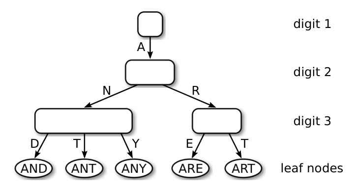

图 1. 我们的基数树中大小自适应的节点。

## I. 引言

经过数十年的增长，主存容量如今甚至可以容纳大型事务数据库。当大部分数据都已缓存时，传统数据库系统会受限于 CPU，因为它们为了避免磁盘访问而付出了相当大的代价。这推动了内存数据库系统领域极为活跃的研究与商业活动，例如 H-Store/VoltDB [1]、SAP HANA [2] 和 HyPer [3]。这些系统针对新的硬件环境进行了优化，因此速度快得多。例如，我们的 HyPer 系统将事务编译为机器码，并消除了缓冲区管理、锁（locking）和闩锁（latching）的开销。对于 OLTP 工作负载，生成的执行计划往往就是一系列索引操作。因此，索引效率是决定性能的因素。

早在 25 年多以前，T-tree [4] 就被提出作为内存索引结构。遗憾的是，处理器体系结构的巨大变化使 T-tree 与所有传统二叉搜索树一样，在现代硬件上变得低效。原因在于，CPU 缓存不断增大，主存速度与 CPU 速度之间的差距不断扩大，使其所依赖的内存访问时间一致这一假设不再成立。缓存敏感 B+ 树 [5] 等 B+ 树变体具有更有利于缓存的内存访问模式，但其更新操作代价更高。此外，二叉树和 B+ 树的效率还受到现代 CPU 的另一项特征影响：比较结果不易预测，现代 CPU 的长流水线因此会停顿，平均每两次比较就会产生一次额外延迟。

近年来，专门针对现代硬件体系结构设计高效数据结构的研究着手解决传统搜索树的这些问题。k 叉搜索树 [6] 和快速体系结构敏感树（Fast Architecture Sensitive Tree，FAST）[7] 利用数据级并行，通过单指令多数据（SIMD）指令同时完成多次比较。此外，FAST 采用一种能最优利用缓存行和地址转换后备缓冲器（TLB）的数据布局来避免缓存未命中。虽然这些优化改善了搜索性能，但两种数据结构都不支持增量更新。对于需要持续插入、更新和删除的 OLTP 数据库系统，一个显而易见的解决办法是差分文件（delta）机制；不过，这会带来额外成本。

哈希表是另一类流行的内存数据结构。与访问时间为 $O(\log n)$ 的搜索树不同，哈希表的期望访问时间为 $O(1)$，因此在内存中快得多。然而，哈希表作为数据库索引的使用却相对较少。其中一个原因是哈希表将键随机分散，因此只支持点查询。另一个问题是，大多数哈希表无法平稳地处理增长，而是在溢出时需要执行复杂度为 $O(n)$ 的昂贵重组。因此，现有系统不得不在仅支持点查询的快速哈希表与功能齐全但相对较慢的搜索树之间作出取舍。

第三类数据结构如图 1 所示，有 trie、基数树、前缀树和数字搜索树等名称。这类结构直接使用键的数字表示，而不对键做哈希或比较。其基本思想类似于许多按字母排序的词典中的拇指索引：利用单词的第一个字符，可以直接跳转到所有以该字符开头的单词。在计算机中，可以继续使用后续字符重复这一过程，直到找到匹配项。因此，所有操作的复杂度都是 $O(k)$，其中 $k$ 为键的长度。在数据集极其庞大、 $n$ 的增长比 $k$ 更快的时代，时间复杂度与 $n$ 无关这一点很有吸引力。

本文提出自适应基数树（ART），这是一种专为现代硬件调优、快速且节省空间的内存索引结构。大多数基数树通过设置全局统一的扇出参数来权衡树高与空间效率，而 ART 会调整每个节点各自的表示方式，如图 1 所示。通过对每个内部节点进行局部调整，它同时优化了全局空间利用率和访问效率。节点由少数几种高效而紧凑的数据结构表示，具体使用哪一种取决于子节点数，并在运行时动态选择。另外两项技术——路径压缩和延迟展开——通过折叠节点来降低树高，使 ART 能够高效地索引长键。

基数树的一个有用性质是：键的顺序不像哈希表那样随机，而是按位字典序排列。我们将展示如何高效地重新编码典型数据类型，从而支持所有需要数据有序的操作，例如范围扫描、前缀查找、top-k、最小值和最大值。

本文作出以下贡献：

- 我们设计了自适应基数树（ART），一种用于内存数据库系统的快速、节省空间的通用索引结构。
- 我们证明，即使键可以任意长，每个键的空间开销也不超过 52 字节。实验表明，实际空间开销远低于这一界限，常常低至每个键 8.1 字节。
- 我们说明了如何在基数树中存储常见的内置数据类型，同时保留它们的顺序。
- 我们通过实验评估了 ART 与其他先进内存索引结构，其中包括效率最高的搜索树方案。
- 我们将 ART 集成到内存数据库系统 HyPer 中，并运行 TPC-C 基准，证明了它在“现实”事务处理应用中优越的端到端性能。

本文其余部分安排如下。下一节讨论相关工作。第 III 节介绍自适应基数树并分析其空间开销。第 IV 节引入二进制可比较键的概念，并说明如何转换常见内置类型。第 V 节描述实验结果，包括若干微基准和 TPC-C 基准。最后，第 VI 节总结全文并讨论未来工作。

## II. 相关工作

在基于磁盘的数据库系统中，B+ 树 [8] 无处不在 [9]。它从磁盘读取较大的块，以减少访问次数。红黑树 [10]、[11] 和 T-tree [4] 则是为内存数据库系统提出的。Rao 和 Ross [5] 表明，T-tree 与所有二叉搜索树一样，缓存行为不佳，因此在现代硬件上往往比 B+ 树更慢。作为替代，他们提出了缓存感知的 B+ 树变体 CSB+ 树 [12]。Graefe 和 Larson [13] 综述了 B+ 树的进一步缓存优化。

现代 CPU 允许一条 SIMD 指令执行多次比较。Schlegel 等人 [6] 提出的 k 叉搜索将比较次数从 $\log_2 n$ 降为 $\log_K n$，其中 $K$ 是一个 SIMD 向量可以容纳的键数。与二叉树相比，这项技术还减少了缓存未命中次数，因为从主存加载的每个缓存行可以执行 $K$ 次比较。Kim 等人通过提出 FAST 扩展了这一研究；FAST 是一种按体系结构特征布局二叉搜索树的方法 [7]。它在 SIMD、缓存行和页三个层次分块，以最优地利用可用缓存和内存带宽。此外，他们提出交错执行多个查询的不同阶段，以提高搜索算法的吞吐量。FAST 树和 k 叉搜索树都是无指针数据结构，将所有键存储在单个数组中，并通过偏移量计算遍历树。虽然这种表示高效且节省空间，但也意味着无法在线更新。Kim 等人还给出了 FAST 的 GPU 实现，并将其性能与现代 CPU 进行了比较。结果表明，由于内存带宽更高，GPU 可以达到比 CPU 更高的吞吐量。然而，使用 GPU 作为专门的索引硬件目前还不实用，因为 GPU 的内存容量有限，与主存的通信成本很高，而且需要数百个并行查询才能达到高吞吐量。因此，我们关注面向 CPU 的索引结构。

利用 trie 索引字符串的研究已十分广泛。最早的两种变体分别使用链表 [14] 和数组 [15] 表示内部节点。Morrison 引入了路径压缩，以高效存储长字符串 [16]。Knuth [17] 分析了这些早期 trie 变体。较近期的 burst trie 方案在树的上层使用 trie 节点，而当某个子树只剩少量元素时，就切换为链表。HAT-trie [18] 将链表替换为哈希表，从而提高性能。大部分研究关注字符串索引，而我们的目标还包括其他数据类型的索引。因此，我们更倾向于使用“基数树”而非“trie”这一术语，因为它突出了与基数排序算法的相似性，并强调可以索引任意数据，而不只是字符串。

Boehm 等人 [19] 提出的通用前缀树（Generalized Prefix Tree）是一种通用索引结构。它是一棵扇出为 16 的基数树，曾入围 2009 年 SIGMOD 编程竞赛的决赛。KISS-Tree [20] 是效率更高的基数树方案，只有三层，但只能存储 32 位键。它对键的前 16 位使用开放寻址方案，并依靠虚拟内存系统节省空间。第二层负责接下来的 10 位，使用数组表示；最后一层用位向量压缩 6 位。惠普研究实验室开发的 Judy 数组数据结构采用了动态改变内部节点表示的思想 [21]、[22]。

Graefe 曾讨论过二进制可比较（“规范化”）键，例如文献 [23] 将其用作简化并加快键比较的方法。我们使用这一概念，使基数树中存储的键具有符合其语义的顺序。

## III. 自适应基数树

本节介绍自适应基数树（ART）。我们先对基数树相较于基于比较的树的优势作一些一般性观察。接着，通过展示传统基数树可能存在的过大空间开销，说明采用自适应节点的动机。然后，我们介绍 ART 及其搜索和插入算法。最后分析空间开销。

### A. 预备知识

基数树具有一些有趣的性质，使其有别于基于比较的搜索树：

- 基数树的高度（和复杂度）取决于键的长度，一般不取决于树中元素的数量。
- 基数树不需要重新平衡操作，所有插入顺序都会产生相同的树。
- 键按字典序存储。
- 通往叶节点的路径表示该叶节点的键。因此，键被隐式存储，并可从路径中重建。

基数树包含两种节点：内部节点将部分键映射到其他节点；叶节点存储与键对应的值。内部节点最有效的表示是包含 $2^s$ 个指针的数组。遍历树时，将键中的一个 $s$ 位片段用作该数组的索引，从而无需任何额外比较就能确定下一个子节点。我们将参数 $s$ 称为跨度（span）；它对基数树的性能至关重要，因为在键长给定时，它决定了树高：存储 $k$ 位键的基数树有 $\lceil k/s\rceil$ 层内部节点。例如，对于 32 位键，使用 $s=1$ 的基数树有 32 层，而跨度为 8 时只有 4 层。

由于基于比较的搜索树是数据库系统中最常用的索引结构，将基数树的高度与完全平衡搜索树所需的比较次数作对照很有启发性。在最佳情况下，每次比较能排除一半值；而在 $s\gt1$ 时，一个基数树节点能够排除更多值。因此，当 $n\gt2^{k/s}$ 时，基数树的高度比二叉搜索树更小。图 2 展示了这种关系；这里假设键可以在 $O(1)$ 时间内比较。对于大键，比较实际上需要 $O(k)$ 时间，因此搜索树的复杂度为 $O(k\log n)$，而基数树的复杂度为 $O(k)$。这些观察表明，基数树，尤其是跨度较大的基数树，可以比传统搜索树更加高效。

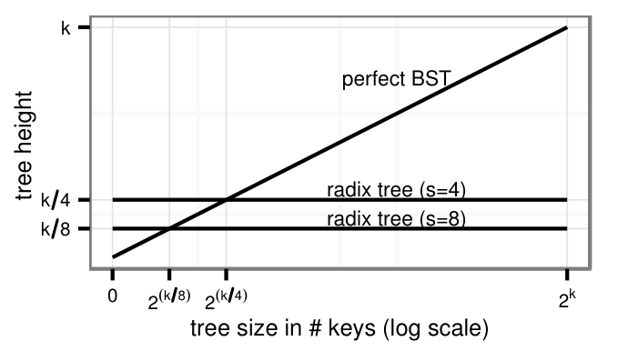

图 2. 完全平衡二叉搜索树与基数树的树高。

### B. 自适应节点

如前所述，从纯查找性能的角度看，较大的跨度是理想选择。如果用指针数组表示内部节点，大跨度的缺点也很明显：当大多数子指针为空时，空间开销可能非常大。图 3 展示了这种权衡：存储 1M 个均匀分布的 32 位整数时，不同跨度参数所对应的树高和空间开销。随着跨度增大，树高线性降低，而空间开销呈指数增长。因此，在实践中，只有某些 $s$ 值能够在时间与空间之间提供合理的权衡。例如，通用前缀树（GPT）使用 4 位跨度 [19]，Linux 内核中的基数树（LRT）使用 6 位跨度 [24]。图 3 还表明，与只使用统一数组节点的基数树相比，我们的自适应基数树（ART）同时具有更低的空间开销和更小的高度。

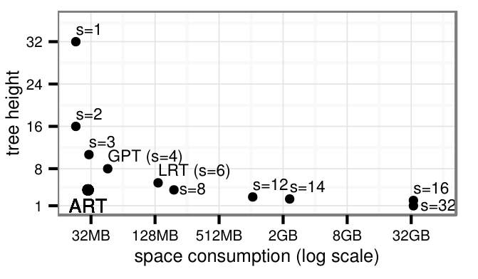

图 3. 存储 1M 个均匀分布的 32 位整数时，不同跨度参数 $s$ 对应的树高与空间开销。指针长 8 字节，节点采用延迟展开。

同时实现空间和时间效率的关键思想是：自适应地采用不同大小的节点，使它们具有相同且相对较大的跨度，但具有不同扇出。图 4 展示了这一思想，并说明自适应节点只影响节点大小，不影响树的结构（即高度）。自适应节点减少了空间开销，因此可以采用更大的跨度，也就提升了性能。

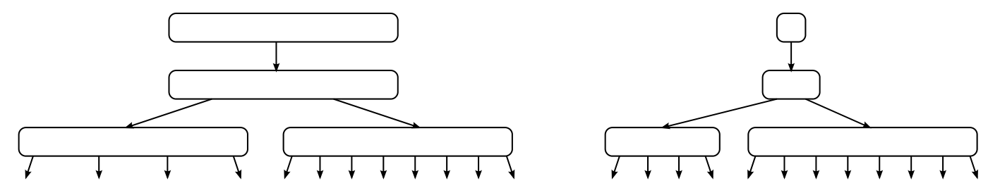

图 4. 使用数组节点的基数树（左）与我们的自适应基数树 ART（右）的示意图。

为高效支持增量更新，在每次更新后都调整节点大小的代价过高。因此，我们只使用少数几种节点类型，各自具有不同扇出。根据非空子节点的数量，选用适当的节点类型。当插入导致节点容量耗尽时，将其替换为更大的节点类型。相应地，当删除键导致节点过空时，将其替换为更小的节点类型。

### C. 内部节点的结构

从概念上说，内部节点将部分键映射为子指针。在内部实现中，我们采用四种容量不同的数据结构。给定键的下一个字节，每种数据结构都能高效地查找、添加和删除子节点。此外，子指针可以按排序顺序扫描，以实现范围扫描。我们使用 8 位跨度，对应于 1 字节的部分键，并产生相对较大的扇出。这一选择还有简化实现的好处，因为字节可以直接寻址，无需位移和掩码操作。

图 5 展示了这四种节点类型，它们按各自的最大容量命名。我们没有使用键值对列表，而是将其拆分为键部分和指针部分。这样既保持表示紧凑，又允许高效搜索：

**Node4：** 最小的节点类型最多存储 4 个子指针，使用一个长度为 4 的数组存储键，另一个同样长度的数组存储指针。键与指针存储在对应位置，且键按顺序排列。

**Node16：** 这种节点类型用于存储 5～16 个子指针。与 Node4 一样，键和指针分别存储在两个数组的对应位置，但两个数组都能容纳 16 个条目。通过二分搜索，或在现代硬件上用 SIMD 指令进行并行比较，可以高效地查找键。

**Node48：** 随着节点条目数增加，搜索键数组的代价变高。因此，超过 16 个指针的节点不再显式存储键，而改用一个含 256 个元素、可直接用键字节索引的数组。当节点包含 17～48 个子指针时，这个数组存储的是第二个数组的索引，而第二个数组最多包含 48 个指针。与 256 个 8 字节指针相比，这一层间接访问节省了空间，因为索引只需 6 位（为简化实现，我们使用 1 字节）。

**Node256：** 最大的节点类型就是一个包含 256 个指针的数组，用于存储 49～256 个条目。在这种表示下，只需使用键字节在该数组中查找一次，就能极其高效地找到下一个节点，无需额外的间接访问。如果大多数条目非空，这种表示的空间效率也很高，因为只需存储指针。

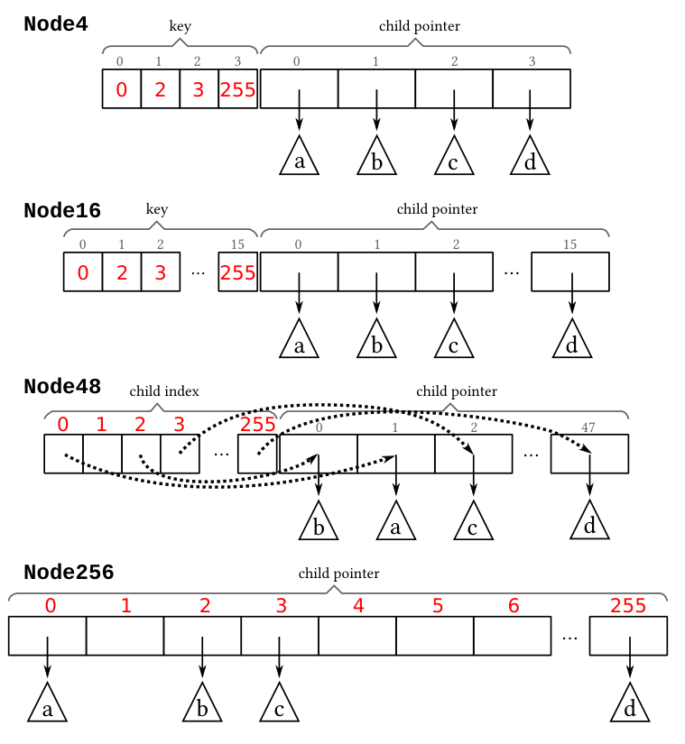

图 5. 内部节点的数据结构。每种情况下，部分键 0、2、3 和 255 分别映射到子树 a、b、c 和 d。

此外，每个内部节点的开头还有一个固定大小的头部（例如 16 字节），用于存储节点类型、子节点数和压缩路径（参见第 III-E 节）。

### D. 叶节点的结构

除了像上一节所述那样用内部节点存储路径，基数树还必须存储与键关联的值。我们假设只存储唯一键，因为可以通过在每个键后附加元组标识符来打破相等关系，从而实现非唯一索引。值可以按不同方式存储：

- **单值叶节点：** 使用一种额外的叶节点类型，每个节点存储一个值。
- **多值叶节点：** 值存储在四种叶节点类型之一中。这些类型与内部节点结构对应，但存储的是值而非指针。
- **指针／值共用槽：** 如果指针槽能够容纳值，就不需要单独的节点类型。内部节点中的每个指针存储位置都可以存储指针或值。可以为每个指针增加一位，或使用指针标记，来区分值和指针。

单值叶节点是最通用的方法，因为它允许在同一棵树中存储长度不同的键和值。然而，由于树高增加，每次查找会多一次指针遍历。多值叶节点避免了这一开销，但要求一棵树中的所有键具有相同长度。指针／值共用槽高效且允许变长键，因此在适用时应当使用。它尤其适合存储元组标识符的数据库二级索引，因为元组标识符的大小与指针相同。

### E. 折叠内部节点

基数树有一个有用性质：每个内部节点都代表键的一个前缀。因此，键隐式存储在树结构中，并可从通往叶节点的路径重建。这省去了显式存储键的空间。尽管如此，即使具备这种隐式的键前缀压缩并采用自适应节点，某些情况下每个键的空间开销仍然很大，尤其是长键。因此，我们又采用了两项众所周知的技术，通过减少节点数来降低树高。这些技术对长键非常有效，能显著提高这类索引的性能。同样重要的是，它们减少了空间开销，并保证了较小的最坏情况空间上界。

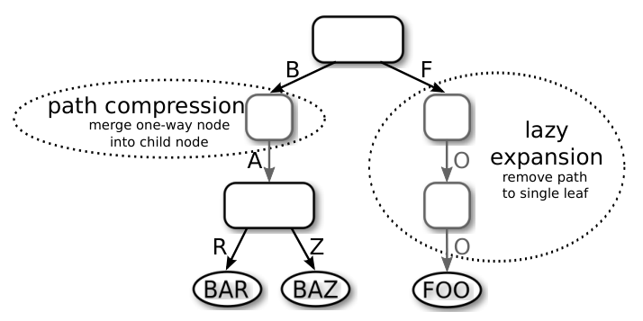

图 6. 延迟展开与路径压缩示意图。

第一项技术是**延迟展开**（lazy expansion）：只有在需要区分至少两个叶节点时才创建内部节点。图 6 给出一个例子：延迟展开通过截短通往叶节点“FOO”的路径，省去了两个内部节点。如果插入另一个带有前缀“F”的叶节点，就会展开该路径。注意，由于通往叶节点的路径可能被截短，这项优化要求键存储在叶节点中，或者可以从数据库获取。

第二项技术是**路径压缩**（path compression）：去除所有仅有一个子节点的内部节点。图 6 中，存储部分键“A”的内部节点被去掉。当然，这个部分键不能简单地忽略。处理它有两种办法：

- **悲观方式：** 每个内部节点存储一个变长（可能为空）的部分键向量，其中包含此前被去除的所有单分支节点的键。查找时，在进入下一个子节点前，将该向量与搜索键比较。
- **乐观方式：** 只存储此前单分支节点的数量（等于悲观方式中向量的长度）。查找时直接跳过相应数量的字节，不作比较。作为替代，当查找到达叶节点时，必须将它的键与搜索键比较，以确保没有“走错路”。

两种方式都保证每个内部节点至少有两个子节点。乐观方式对长字符串尤其有利，但需要一次额外检查；悲观方式使用更多空间，而且节点大小可变，会加重内存碎片。因此，我们采用混合方式：与悲观方式一样，每个节点都存储一个向量，但所有节点的向量大小固定为 8 字节。只有超出这一大小时，查找算法才动态切换为乐观策略。在我们考察的情况中，这种方式无需浪费过多空间或造成内存碎片，就能避免额外检查。

### F. 算法

下面给出搜索和更新算法。

**搜索：** 图 7 展示搜索的伪代码。遍历树时依次使用键数组的各字节，直到遇到叶节点或空指针。第 4 行通过检查所遇叶节点是否与键完全匹配来处理延迟展开。第 7、8 行处理悲观路径压缩：若压缩路径与键不匹配，则终止搜索。下一个子节点由图 8 中的 `findChild` 函数查找。它根据节点类型执行相应的搜索算法。

图 7. 搜索算法。

```text
   search (node, key, depth)
 1 if node==NULL
 2   return NULL
 3 if isLeaf(node)
 4   if leafMatches(node, key, depth)
 5     return node
 6   return NULL
 7 if checkPrefix(node,key,depth)!=node.prefixLen
 8   return NULL
 9 depth=depth+node.prefixLen
10 next=findChild(node, key[depth])
11 return search(next, key, depth+1)
```

由于 Node4 只有 2～4 个条目，我们使用简单循环。对于 Node16，伪代码展示的是使用 SSE 指令的 SIMD 实现，可以用一条指令并行比较 16 个键。首先复制待搜索的键（第 7 行），然后将它与内部节点中存储的 16 个键比较（第 8 行）。接着创建掩码（第 9 行），因为节点可能少于 16 个有效条目。将比较结果转换为位域，并应用该掩码（第 10 行）。最后使用末尾零位计数指令，将位域转换为索引（第 12 行）。如果没有 SIMD 指令，也可以改用二分搜索。Node48 的查找首先检查 `childIndex` 条目是否有效，然后返回相应指针。Node256 的查找只需一次数组访问。

图 8. 给定部分键，在内部节点中寻找子节点的算法。

```text
   findChild (node, byte)
 1 if node.type==Node4 // simple loop
 2   for (i=0; i<node.count; i=i+1)
 3     if node.key[i]==byte
 4       return node.child[i]
 5   return NULL
 6 if node.type==Node16 // SSE comparison
 7   key=_mm_set1_epi8(byte)
 8   cmp=_mm_cmpeq_epi8(key, node.key)
 9   mask=(1<<node.count)-1
10   bitfield=_mm_movemask_epi8(cmp)&mask
11   if bitfield
12     return node.child[ctz(bitfield)]
13   else
14     return NULL
15 if node.type==Node48 // two array lookups
16   if node.childIndex[byte]!=EMPTY
17     return node.child[node.childIndex[byte]]
18   else
19     return NULL
20 if node.type==Node256 // one array lookup
21   return node.child[byte]
```

**插入：** 图 9 展示了伪代码。通过第 29 行的递归调用遍历树，直到找到新叶节点的位置。通常，只需将叶节点插入已有内部节点，必要时先扩大该节点（第 31～33 行）。若由于延迟展开而遇到已有叶节点，则用一个同时存储已有叶节点和新叶节点的新内部节点来替换它（第 5～13 行）。另一种特殊情况是，新叶节点的键与压缩路径不同：在当前节点上方创建一个新内部节点，并相应调整压缩路径（第 17～24 行）。由于篇幅所限，我们省略了部分辅助函数：`replace` 将树中的一个节点替换为另一个节点；`addChild` 向内部节点添加一个新子节点；`checkPrefix` 将节点的压缩路径与键比较，并返回相同字节的数量；`grow` 将节点替换为更大的节点类型；`loadKey` 从数据库获取叶节点的键。

图 9. 插入算法。

```text
   insert (node, key, leaf, depth)
 1 if node==NULL // handle empty tree
 2   replace(node, leaf)
 3   return
 4 if isLeaf(node) // expand node
 5   newNode=makeNode4()
 6   key2=loadKey(node)
 7   for (i=depth; key[i]==key2[i]; i=i+1)
 8     newNode.prefix[i-depth]=key[i]
 9   newNode.prefixLen=i-depth
10   depth=depth+newNode.prefixLen
11   addChild(newNode, key[depth], leaf)
12   addChild(newNode, key2[depth], node)
13   replace(node, newNode)
14   return
15 p=checkPrefix(node, key, depth)
16 if p!=node.prefixLen // prefix mismatch
17   newNode=makeNode4()
18   addChild(newNode, key[depth+p], leaf)
19   addChild(newNode, node.prefix[p], node)
20   newNode.prefixLen=p
21   memcpy(newNode.prefix, node.prefix, p)
22   node.prefixLen=node.prefixLen-(p+1)
23   memmove(node.prefix,node.prefix+p+1,node.prefixLen)
24   replace(node, newNode)
25   return
26 depth=depth+node.prefixLen
27 next=findChild(node, key[depth])
28 if next // recurse
29   insert(next, key, leaf, depth+1)
30 else // add to inner node
31   if isFull(node)
32     grow(node)
33   addChild(node, key[depth], leaf)
```

**批量加载：** 为已有关系创建索引时，可以用下面的递归算法加速索引构建：根据每个键的首字节，将键值对做基数分区，分到 256 个分区，并创建适当类型的内部节点。在返回该内部节点之前，对每个分区使用各键的下一个字节，递归应用批量加载过程，创建其子节点。

**删除：** 删除的实现与插入对称。从内部节点中删除叶节点，并在必要时缩小内部节点。如果该节点现在只剩一个子节点，就用其子节点替换它，并调整压缩路径。

### G. 空间开销

虽然拥有数 TB RAM 的服务器已很容易获得，但主存仍是宝贵资源，因此索引结构应当尽量紧凑。基数树的空间开销取决于所存储键的分布。稠密键（例如从 1 到 $n$ 的整数）是最佳情况，即使跨度较大且不采用自适应节点，也能节省空间。反之，当键稀疏时，内部节点的许多指针为空，造成空间浪费。倾斜的键会使一些节点大部分为 NULL 指针，而另一些节点则紧密填充。自适应节点通过在每个节点上局部优化空间开销，解决了这些问题，确保任何键分布都能紧凑存储。

下面我们分析每个键的最坏情况空间开销，并计入自适应节点、延迟展开和路径压缩。在以下分析中，我们假设指针长 8 字节，每个节点有一个 16 字节头部，存储节点类型、非空子节点数和压缩路径。我们只考虑内部节点，忽略叶节点，因为使用带标记指针的指针／值共用槽时，叶节点不产生额外空间开销。在这些假设下，各类内部节点的空间开销如表 I 所示。

表 I. 节点类型汇总（16 字节头部，64 位指针）。

| 类型 | 子节点数 | 空间（字节） |
| --- | --- | --- |
| Node4 | 2～4 | $16+4+4\cdot8=52$ |
| Node16 | 5～16 | $16+16+16\cdot8=160$ |
| Node48 | 17～48 | $16+256+48\cdot8=656$ |
| Node256 | 49～256 | $16+256\cdot8=2064$ |

可以把每个叶节点看作提供 $x$ 字节预算，而内部节点消耗其子节点提供的空间。如果一棵树中的每个节点都具有正预算，那么这棵树的每个键使用的空间就少于 $x$ 字节。内部节点的预算等于其所有子节点的预算之和减去该节点自身的空间开销。形式上，设节点 $n$ 的子节点集合为 $c(n)$，空间开销为 $s(n)$，其预算 $b(n)$ 定义为：

$$
b(n)=\begin{cases}
x, & \mathrm{isLeaf}(n),\\
\left(\sum _ {i\in c(n)} b(i)\right)-s(n), & \text{其他情况。}
\end{cases}
$$

下面按节点类型进行归纳，证明当 $x=52$ 时，每个 ART 节点 $n$ 都满足 $b(n)\ge52$。对于叶节点，根据预算函数的定义，该命题显然成立。为了证明该命题对内部节点也成立，我们使用归纳假设以及每种节点类型的最少子节点数，计算 $\sum _ {i\in c(n)}b(i)$ 的下界。减去相应的空间开销后，就得到每种节点类型预算的下界。四种情况下，该下界都大于或等于 52，因此归纳完成。总之，我们证明了当 $x=52$ 时，不可能构造出预算为负的自适应基数树节点。因此，对于任何自适应基数树，即使键可以任意长，其最坏情况空间开销也为每个键 52 字节。类似地，还可以证明，采用六种节点类型时[^1]，最坏情况空间开销可以降至每个键 34 字节。正如第 V-D 节将展示的那样，即使键相对较长，实际空间开销也远小于最坏情况。不过，8.1 字节的最佳情况确实经常出现，因为代理整数键往往是稠密的。

[^1]: 将 Node4 类型替换为新的 Node2 和 Node5 类型，并将 Node48 类型替换为新的 Node32 和 Node64 类型。

最后，我们将其与其他基数树进行比较，结果汇总于表 II。由于通用前缀树和 Linux 内核基数树没有使用路径压缩，其内部节点数与键长成正比。因此，每个键的最坏情况空间开销没有上界。此外，即使对于短键，这两种数据结构的最坏情况空间开销也远高于 ART，因为它们不使用自适应节点。KISS-Tree 每个键的最坏情况空间开销超过 4KB，例如使用以下无符号整数键时就会出现：

$$
\lbrace i\cdot2^{16}\mid i\in\lbrace 0,1,\ldots,2^{16}-1\rbrace \rbrace .
$$

表 II. 不同基数树变体在采用 64 位指针时，每个键的最坏情况空间开销（字节）。

| 结构 | $k=32$ | $k\to\infty$ |
| --- | --- | --- |
| ART | 43 | 52 |
| GPT | 256 | $\infty$ |
| LRT | 2048 | $\infty$ |
| KISS | >4096 | 不适用 |

## IV. 构造二进制可比较键

选择索引结构时，一个重要方面是数据是否按排序顺序存储。按排序顺序遍历索引结构，有助于高效实现有序范围扫描，以及最小值、最大值、top-N 等查找。默认情况下，只有基于比较的树按排序顺序存储数据，这也是它们在数据库索引结构中占据主流的原因。虽然已有研究提出使用保序哈希，使哈希表元素可以排序，但它在实际系统中并不常见。原因是：对于分布未知的值，很难构造出既能将输入值均匀分散到哈希表中，又能保持输入顺序的函数。

基数树中的键按位字典序排列。对于某些数据类型，例如 ASCII 编码的字符串，这能得到预期的顺序；但对大多数数据类型并非如此。例如，以二进制补码表示的有符号整数中，负整数的字典序大于正整数。不过，可以通过变换键来获得期望的顺序。我们将这种变换得到的值称为**二进制可比较键**（binary-comparable keys）。如果只将二进制可比较键用作基数树的键，数据就会按排序顺序存储，并能支持所有依赖这一顺序的操作。注意，上一节介绍的算法不需要作任何修改。只需在存储或查找每个键之前，将其转换为二进制可比较键即可。

二进制可比较键还有其他用途。正如这一概念可以用基数树替代基于比较的树，它也可以用基数排序替代快速排序、归并排序等基于比较的排序算法，而基数排序可能具有更优的渐近复杂度。

### A. 定义

设变换函数 $t:D\to\lbrace 0,1,\ldots,255\rbrace ^k$ 将定义域 $D$ 中的值转换为长度为 $k$ 的二进制可比较键。它须满足以下等价关系，其中 $x,y\in D$：

- $x\lt y\Leftrightarrow\mathrm{memcmp} _ k(t(x),t(y))\lt0$
- $x\gt y\Leftrightarrow\mathrm{memcmp} _ k(t(x),t(y))\gt0$
- $x=y\Leftrightarrow\mathrm{memcmp} _ k(t(x),t(y))=0$

运算符 $\lt$、 $\gt$、 $=$ 表示输入类型上的通常关系运算符； $\mathrm{memcmp} _ k$ 则逐分量比较两个输入向量。如果所有参与比较的值都相等，它返回 0；如果在首个不相等的位置，第一个向量的值小于第二个向量中对应的字节，它返回负值；否则返回正值。

对于有限定义域，任何具有严格全序的定义域中的值，总能转换为二进制可比较键：将大小为 $n$ 的定义域中每个值映射为一个 $\lceil\log_2n\rceil$ 位串，其中存储经零扩展的“秩减一”。

### B. 变换

下面讨论如何将常见数据类型转换为二进制可比较键。

**a) 无符号整数：** 无符号整数的二进制表示已经具有期望的顺序。不过，将值存入主存时，必须考虑机器的字节序。在小端机器上，必须交换字节顺序，以确保结果从最高有效字节到最低有效字节排列。

**b) 有符号整数：** 二进制补码有符号整数必须重新排序，因为负整数按降序排列，且大于正值。对于 $b$ 位整数 $x$，只需翻转符号位（使用 $x\mathbin{\mathrm{XOR}}2^{b-1}$），即可极其高效地完成变换。之后，将结果像无符号值一样存储。

> 译注：原文此处明确写作“negative integers are ordered descending”。对二进制补码而言，按无符号位串比较时，负数区间内部仍保持数值递增关系，问题在于负数整体排在非负数之后；原文给出的翻转符号位变换予以保留。

**c) IEEE 754 浮点数：** 对浮点值的变换更加复杂，但概念上并不困难。首先将每个值按正负分类，再分为规格化数、非规格化数、NaN、 $\infty$ 或 0。这 10 个类别互不重叠，因此很容易计算新的秩，再像无符号值一样存储。一次键变换需要 3 条 `if` 语句、1 次整数乘法和 2 次加法。

**d) 字符串：** Unicode 排序算法（UCA）定义了比较 Unicode 字符串的复杂规则。已有开源库实现这一算法，并提供将 Unicode 字符串转换为二进制可比较键的函数[^2]。一般而言，每个字符串必须以一个不会出现在任何字符串其他位置的值结尾，例如 0 字节。这很重要，因为键不能是其他键的前缀。

[^2]: 例如，C/C++ 库 “International Components for Unicode”（<http://site.icu-project.org/>）为此提供了 `ucol_getSortKey` 函数。

**e) Null：** 要使 null 值能够按二进制比较，必须给它分配一个具有特定秩的值。对大多数数据类型而言，所有可能的值都已被使用。一个简单办法是，将所有值的键长增加一个字节，为 null 腾出空间；例如，将 4 字节整数变为 5 字节。更高效的办法是只增加定义域中部分值的长度。例如，假设 null 应小于所有其他 4 字节整数，可以将 null 映射为字节序列 `0,0,0,0,0`，将原来的最小值 0 映射为 `0,0,0,0,1`，而所有其他值保持其 4 字节表示。

**f) 复合键：** 多个属性组成的键很容易处理：分别变换每个属性，然后将结果连接起来即可。

## V. 评估

本节通过实验评估 ART，并将其性能与其他内存数据结构比较，包括基于比较的树、哈希和基数树。评估分为两部分。首先，我们对所有参评数据结构运行若干以独立程序实现的微基准。第二部分将其中一些数据结构集成到内存数据库系统 HyPer 中，从而执行更加真实的工作负载，即标准 OLTP 基准 TPC-C。

我们使用一台高端桌面系统，配备 Intel Core i7 3930K CPU，具有 6 个核、12 个线程、3.2 GHz 时钟频率和 3.8 GHz 睿频。系统拥有 12 MB 共享末级缓存，以及 32 GB 四通道 DDR3-1600 RAM。操作系统使用 64 位模式的 Linux 3.2，编译器使用 GCC 4.6。

参与比较的数据结构包括：

- 一种针对主存优化的 B+ 树：缓存敏感 B+ 树（CSB）。
- 两种针对现代 x86 CPU 优化的只读搜索结构：k 叉搜索树（kary）和快速体系结构敏感树（FAST）。
- 一种基数树：通用前缀树（GPT）。
- 两种教科书式数据结构：红黑树（RB），以及使用面向 64 位平台的 MurmurHash64A [25] 的链式哈希表（HT）。

为公平比较，在作者提供源代码的情况下，我们使用他们的代码。CSB+ 树 [26]、k 叉搜索 [27] 和通用前缀树 [28] 都属于这种情况。其余数据结构使用我们自己的实现。

我们验证了自己的 FAST 实现能够达到原论文发表的性能数字，并已将该实现公开于网上 [29]。为校准硬件差异，我们使用了同一篇论文中发表的 k 叉搜索结果。按照 Yamamuro 等人 [30] 的建议，我们的 FAST 实现使用 2 MB 内存页，并将所有缓存行块对齐到 64 字节边界。不过，因为 FAST 和 k 叉搜索返回的是键的秩，而不是元组标识符，以下结果还包含一次对独立元组标识符数组的额外查找，以评估数据库语境下有实际意义的查找操作。

由于某些实现仅支持 32 位整数键，微基准不得不使用 32 位整数作为键。对于这么短的键，路径压缩通常会增加而非减少空间开销。因此，我们在微基准中去除了这一功能。在更真实的第二部分评估中，路径压缩是启用的。与基于比较的树和哈希表不同，基数树的性能随键分布而变化。因此，我们分别展示稠密键与稀疏键的结果：稠密键取从 1 到 $n$ 的值（ $n$ 表示以键数计量的树大小），稀疏键的每一位取 0 和 1 的概率相同。我们对稠密键进行了随机置换。

### A. 搜索性能

第一个实验测量随机查找已有键的性能[^3]。图 10 表明，ART 和哈希表的性能最好。ART 的速度是 GPT 的两倍以上；GPT 也是一种基数树，其跨度只有 ART 的一半，因此高度是 ART 的两倍。红黑树是最慢的基于比较的树，随后依次为 CSB+ 树、k 叉搜索，最后是 FAST。尽管 FAST 不支持更新，并且针对现代体系结构进行了优化，它仍比 ART 和哈希表慢。三种索引规模下，各数据结构的相对性能十分相似。这表明，小索引（65K）比大索引（256M）快约 10 倍，主要是由缓存效应造成的，而不是数据结构的渐近性质。

[^3]: 在基数树中，成功的搜索比不成功的搜索更慢。

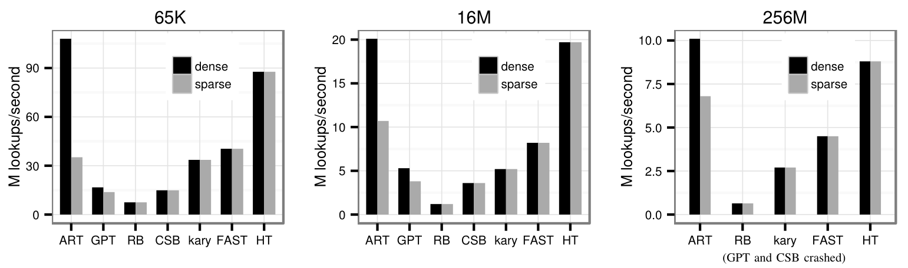

图 10. 包含 65K、16M 和 256M 个键的索引的单线程查找吞吐量。图中 dense 与 sparse 分别表示稠密键和稀疏键，纵轴单位为百万次查找／秒；256M 子图注明 GPT 与 CSB 崩溃。

为更好地理解这些结果，考察表 III。它展示了三种最快的数据结构（ART、FAST 和哈希表）每次随机查找的性能计数器。在 16M 个键时，只有部分索引结构被缓存，查找受内存限制。FAST、哈希表及使用稀疏键的 ART 的缓存未命中次数相近。对于稠密键，ART 产生的缓存未命中次数只有它们的一半，因为其紧凑节点能够被有效缓存。对于小树，查找性能主要取决于指令数和分支预测错误数。ART 处理稠密键时几乎没有分支预测错误；处理稀疏键时，每次查找约有 0.85 次分支预测错误，发生在按节点类型进行分派时。稠密键还需要更少的指令，因为在 Node256 中寻找下一个子节点不需要计算，而其他节点类型则需要更多工作。FAST 有效避免了普通搜索树中出现的预测错误，但为此需要相当多的指令，每次比较约 5 条。哈希表也有少量预测错误，发生在处理冲突时。

表 III. 每次查找的性能计数器。ART 单元格中的数值依次对应稠密键／稀疏键（d./s.）。

| 计数器 | 65K：ART（d./s.） | 65K：FAST | 65K：HT | 16M：ART（d./s.） | 16M：FAST | 16M：HT |
| --- | --- | --- | --- | --- | --- | --- |
| 周期数 | 40/105 | 94 | 44 | 188/352 | 461 | 191 |
| 指令数 | 85/127 | 75 | 26 | 88/99 | 110 | 26 |
| 分支预测错误 | 0.0/0.85 | 0.0 | 0.26 | 0.0/0.84 | 0.0 | 0.25 |
| L3 命中 | 0.65/1.9 | 4.7 | 2.2 | 2.6/3.0 | 2.5 | 2.1 |
| L3 未命中 | 0.0/0.0 | 0.0 | 0.0 | 1.2/2.6 | 2.4 | 2.4 |

到目前为止，查找都在单个线程中一次执行一个查询。下一个实验旨在使用多个无同步线程，找出可以达到的最大吞吐量。除了使用多线程，已有研究表明，通过软件流水线交错执行多次树遍历，也可以提高吞吐量 [7]。这项技术能更好地利用现代超标量 CPU，但会增加延迟，而且只有在有多个查询可执行时才适用，例如索引嵌套循环连接期间。FAST 从软件流水线中受益最大，达到 2.5 倍加速，因为比较和地址计算中相对较大的延迟可以被有效隐藏。ART 本身需要的计算就较少，因此加速幅度较小，但仍很显著，为 1.6～1.7 倍。链式哈希表可以看作一棵只有两层的树：哈希表数组，以及键值对链表，所以加速幅度相对较小，为 1.2 倍。不过，图 11 表明，即使采用 12 个线程、每个线程交错执行 8 个查询，ART 也只在稀疏键情况下略慢于 FAST，而在稠密键情况下明显更快。

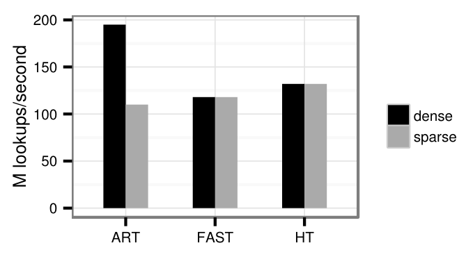

图 11. 含 16M 个键的索引的多线程查找吞吐量（12 个线程，每线程用软件流水线执行 8 个查询）。

### B. 缓存效应

下面考察缓存效应。缓存对现代 CPU 极其重要，因为 DRAM 延迟达到数百个 CPU 周期。树结构尤其受益于缓存，因为频繁访问的节点和上层节点通常已经缓存。为量化这些缓存效应，我们将两种树结构——使用稠密键的 ART 和 FAST——与哈希表进行比较。

此前执行的随机查找对缓存而言是最坏情况，因为这种访问模式的时间局部性很差。实践中，倾斜的访问模式十分常见，例如近期订单比旧订单访问得更频繁。我们通过查找服从 Zipf 分布的键而非随机键来模拟这种场景。图 12 展示了倾斜程度增大对三种数据结构性能的影响。存在倾斜时，所有数据结构的性能都明显提高，因为缓存未命中次数减少。随着倾斜程度增大，ART 和哈希表的性能接近它们在驻留缓存的小树中的速度。FAST 的加速幅度较小，因为它需要更多比较和偏移量计算，而这些不会因缓存而改善。

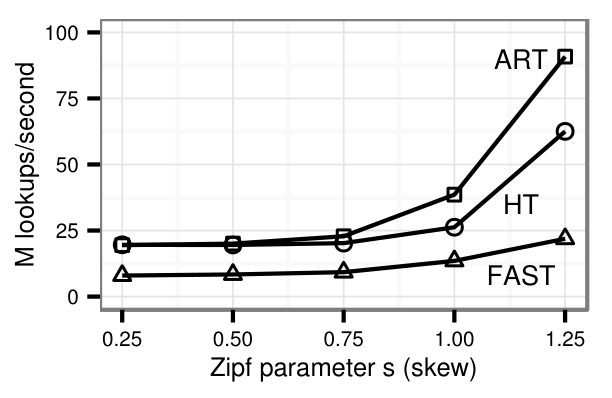

图 12. 倾斜程度对搜索性能的影响（16M 个键）。

接下来关注缓存大小的影响。在前面的实验中，我们只在一棵树中执行查找。因此，不存在竞争性内存访问，整个缓存都可用于该树。实际中，缓存通常包含多个索引和其他数据。为模拟竞争性访问，以及由此变小的有效缓存，我们以轮转方式在多个数据结构中查找键。每个数据结构存储 16M 个随机排列的稠密键，占用超过 128MB。图 13 表明，哈希表基本不受影响，因为它本来就不能有效利用缓存；而树的性能随着缓存增大而提高，因为更多频繁遍历的路径能够被缓存。只有完整缓存的 $1/64$，即 192KB 时，ART 只能达到使用整个 12MB 缓存时约三分之一的性能。

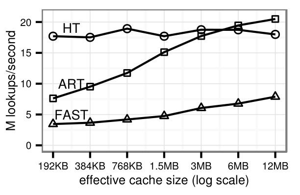

图 13. 缓存大小对搜索性能的影响（16M 个键）。

### C. 更新

除了高效搜索，索引结构还必须支持高效更新。图 14 展示向空结构中插入 16M 个随机键时的吞吐量。尽管 ART 必须随着树的增长动态替换其内部数据结构，它仍比其他数据结构更加高效。对于包含 16M 个稠密键的树，与仅使用 Node256 相比，自适应节点对插入性能的影响为 20%。由于自适应节点可以节省大量空间，这通常是值得的权衡。与增量插入相比，批量插入使稀疏键的性能达到原来的 2.5 倍，使稠密键的性能提高 17%。插入已经排序的键（例如代理主键）时，缓存效应会提高有序搜索树的性能。ART 每秒可以插入 5000 万个已排序的稠密键。只有哈希表无法受益于排序顺序，因为哈希将访问模式随机化了。

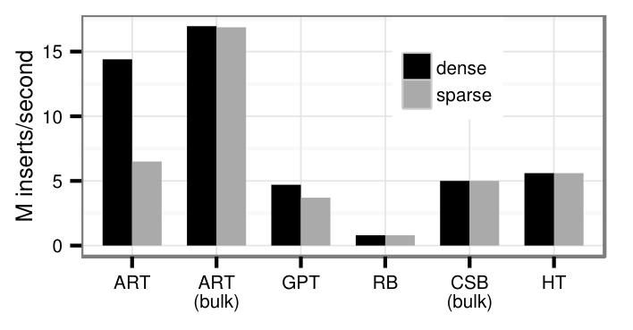

图 14. 向空索引结构插入 16M 个键。图中的 bulk 表示批量插入。

FAST 和 k 叉搜索树是静态数据结构，只能通过重建来更新，因此没有纳入上一个实验。在需要增量更新的应用中使用只读数据结构，一种可能的方法是采用 delta 机制：第二个支持在线更新的数据结构存储差异，并定期与只读结构合并。为评估这一方法的可行性，我们使用红黑树存储 delta，以 FAST 作为主要搜索结构，并将其与 ART（稠密键）和哈希表比较。FAST 与 delta 的合并频率采用了我们通过实验确定的最优值。工作负载是在一棵约有 16M 个元素的树中随机执行插入、删除和查找。图 15 展示了查找与插入、删除所占比例不同时的结果。随着查找比例降低，FAST+delta 的性能下降，因为它需要额外执行周期性的 $O(n)$ 合并步骤。

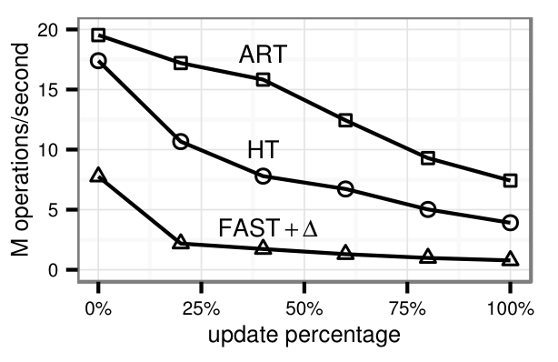

图 15. 查找、插入和删除的混合（16M 个键）。

### D. 端到端评估

端到端应用实验使用内存数据库系统 HyPer。它的一项独特之处是能够同时非常高效地支持事务（OLTP）和分析（OLAP）工作负载 [3]。事务使用脚本语言实现，并被编译为类似汇编的 LLVM 指令 [31]。此外，HyPer 没有缓冲区管理、锁或闩锁开销。因此，它的性能很大程度上取决于所用索引结构的效率。HyPer 允许为每个索引决定使用哪种数据结构。最初可用的是红黑树和哈希表。我们又集成了 ART，包括路径压缩和延迟展开优化。我们还为所有内置类型实现了第 IV 节讨论的键变换方案，使范围扫描、前缀查找、最小值和最大值操作按预期工作。

下面的实验使用 TPC-C，这是一项标准 OLTP 基准，模拟一家负责管理、销售和分销产品的商贸公司。它包含多种 select 语句（包括点查询、范围扫描和前缀查找）、insert 语句和 delete 语句。虽然通常认为它是写密集型基准，但所有 SQL 语句中有 54% 是查询 [32]。我们的实现省去了客户端思考时间，并使用一个包含 5 个仓库的单分区。我们持续运行基准，直到大部分可用 RAM 被耗尽。索引配置分别采用 ART、红黑树，以及哈希表与红黑树的组合。不能对所有索引都使用哈希表，因为 TPC-C 的某些索引需要基于前缀的范围扫描。

图 16 表明，索引结构的选择对 HyPer 的 OLTP 性能至关重要。ART 的速度几乎是哈希表／红黑树组合的两倍，也几乎是单独使用红黑树的四倍。与仅使用红黑树相比，哈希表显著改善了性能，但也引入了不可接受的重新哈希延迟，图中的尖峰清楚地显示了这一点。

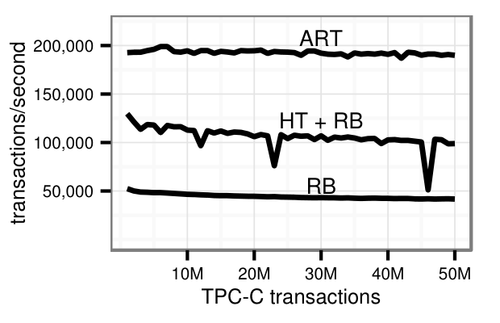

图 16. TPC-C 性能。

下面关注 TPC-C 基准的空间开销，我们在各次基准运行结束时测量这一指标。为节省空间，HyPer 的红黑树和哈希表实现不存储键，只存储元组标识符，再利用元组标识符按需从数据库加载键。尽管如此，而且尽管 ART 在最坏情况下每个元素可能使用更多空间，ART 实际使用的空间只有哈希表和红黑树的一半。表 IV 给出了每个主要索引的结构信息及其每个键的空间开销，可以据此更详细地理解空间使用情况。索引 3 每个键使用的空间最多，因为它存储的是相对较长的字符串。不过，其空间开销仍远低于 52 字节的最坏情况。索引 1、2、4 和 5 每个键只使用 8.1 字节，因为它们存储的是相对稠密的整数。索引 6 和 7 则介于这两个极端之间。

> 译注：原文正文将索引 2 与索引 1、4、5 一并描述为每键 8.1 字节，但表 IV 中索引 2 的数值为 8.3；此处保留两处原始表述。

表 IV. 主要 TPC-C 索引及使用 ART 时每个键的空间开销。

| 编号 | 关系 | 基数 | 属性类型 | 空间（字节／键） |
| --- | --- | --- | --- | --- |
| 1 | item | 100,000 | int | 8.1 |
| 2 | customer | 150,000 | int,int,int | 8.3 |
| 3 | customer | 150,000 | int,int,varchar(16),varchar(16),TID | 32.6 |
| 4 | stock | 500,000 | int,int | 8.1 |
| 5 | order | 22,177,650 | int,int,int | 8.1 |
| 6 | order | 22,177,650 | int,int,int,int,TID | 24.9 |
| 7 | orderline | 221,712,415 | int,int,int,int | 16.8 |

最后一个实验测量路径压缩和延迟展开对平均树高的影响，结果如图 17 所示。默认情况下，基数树的高度等于键长（ART 中以字节计）。例如，若不作任何优化，索引 3 的高度将为 40。路径压缩和延迟展开将其平均高度降至 8.1。延迟展开对长字符串（例如索引 3）特别有效，对主要包含唯一值的非唯一索引也特别有效，因为附加的 8 字节元组标识符可以被截短（例如索引 6）。路径压缩有助于长字符串（例如索引 3），也有助于由具有共同前缀的稠密整数构成的复合索引（例如索引 2、4、5 和 7）。这两项优化对空间开销的影响与对树高的影响相似，因此我们没有单独展示。总之，除短整数外，路径压缩和延迟展开对于基数树实现高性能和低内存开销至关重要。

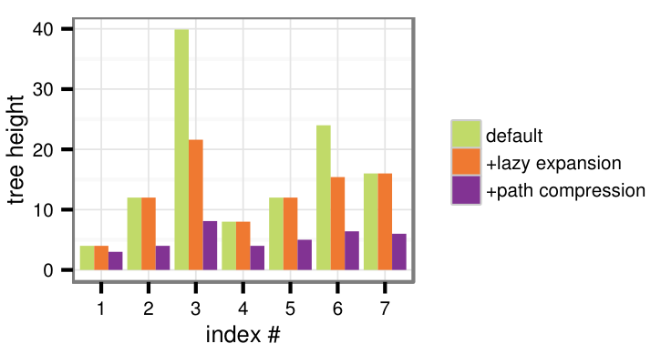

图 17. 延迟展开和路径压缩对 TPC-C 索引高度的影响。图例依次为默认情况、加上延迟展开、再加上路径压缩。

## VI. 结论与未来工作

我们提出了自适应基数树（ART），一种用于内存数据库系统的快速、节省空间的索引结构。高扇出、路径压缩和延迟展开降低了树高，从而带来优异性能。基数树常见的最坏情况空间开销问题，通过动态选择紧凑的内部数据结构得到了限制。我们将 ART 与其他先进内存数据结构进行了比较。结果表明，ART 远快于红黑树、缓存敏感 B+ 树，以及另一种基数树方案 GPT。即使是不考虑更新，专为现代 CPU 设计、具有体系结构敏感性的只读搜索树 FAST，也比 ART 慢。在所有参评数据结构中，只有哈希表具有竞争力。但哈希表无序，因此不适合作为通用索引结构。通过将 ART 集成到内存数据库系统 HyPer 中并执行 TPC-C 基准，我们证明了它对于事务工作负载而言，是一种优于传统索引结构的替代方案。

未来，我们计划研究并发更新的同步。尤其是，我们打算利用比较并交换等原子原语，设计一种无闩锁同步方案。另一个想法是设计一种节点大小相等、空间效率高的基数树。它不是根据键的稀疏程度动态调整扇出，而是在扇出大致不变的同时，动态改变从键中使用的位数。这样的树还可以用于磁盘存储的数据。

## 参考文献

[1] R. Kallman, H. Kimura, J. Natkins, A. Pavlo, A. Rasin, S. Zdonik, E. P. C. Jones, S. Madden, M. Stonebraker, Y. Zhang, J. Hugg, and D. J. Abadi, “H-store: a high-performance, distributed main memory transaction processing system,” *PVLDB*, vol. 1, 2008.

[2] F. Färber, S. K. Cha, J. Primsch, C. Bornhövd, S. Sigg, and W. Lehner, “SAP HANA database: data management for modern business applications,” *SIGMOD Record*, vol. 40, no. 4, 2012.

[3] A. Kemper and T. Neumann, “HyPer: A hybrid OLTP&OLAP main memory database system based on virtual memory snapshots,” in *ICDE*, 2011.

[4] T. J. Lehman and M. J. Carey, “A study of index structures for main memory database management systems,” in *VLDB*, 1986.

[5] J. Rao and K. A. Ross, “Cache conscious indexing for decision-support in main memory,” in *VLDB*, 1999.

[6] B. Schlegel, R. Gemulla, and W. Lehner, “k-ary search on modern processors,” in *DaMoN workshop*, 2009.

[7] C. Kim, J. Chhugani, N. Satish, E. Sedlar, A. D. Nguyen, T. Kaldewey, V. W. Lee, S. A. Brandt, and P. Dubey, “FAST: fast architecture sensitive tree search on modern cpus and gpus,” in *SIGMOD*, 2010.

[8] R. Bayer and E. McCreight, “Organization and maintenance of large ordered indices,” in *SIGFIDET*, 1970.

[9] D. Comer, “Ubiquitous B-tree,” *ACM Comp. Surv.*, vol. 11, no. 2, 1979.

[10] R. Bayer, “Symmetric binary B-trees: Data structure and maintenance algorithms,” *Acta Informatica*, vol. 1, 1972.

[11] L. Guibas and R. Sedgewick, “A dichromatic framework for balanced trees,” *IEEE Annual Symposium on the Foundations of Computer Science*, vol. 0, 1978.

[12] J. Rao and K. A. Ross, “Making B+ trees cache conscious in main memory,” in *SIGMOD*, 2000.

[13] G. Graefe and P.-A. Larson, “B-tree indexes and CPU caches,” in *ICDE*, 2001.

[14] R. De La Briandais, “File searching using variable length keys,” in *western joint computer conference*, 1959.

[15] E. Fredkin, “Trie memory,” *Commun. ACM*, vol. 3, September 1960.

[16] D. R. Morrison, “PATRICIA-practical algorithm to retrieve information coded in alphanumeric,” *J. ACM*, vol. 15, no. 4, 1968.

[17] D. E. Knuth, *The art of computer programming, volume 3: (2nd ed.) sorting and searching*, 1998.

[18] N. Askitis and R. Sinha, “Engineering scalable, cache and space efficient tries for strings,” *The VLDB Journal*, vol. 19, no. 5, 2010.

[19] M. Böhm, B. Schlegel, P. B. Volk, U. Fischer, D. Habich, and W. Lehner, “Efficient in-memory indexing with generalized prefix trees,” in *BTW*, 2011.

[20] T. Kissinger, B. Schlegel, D. Habich, and W. Lehner, “KISS-Tree: Smart latch-free in-memory indexing on modern architectures,” in *DaMoN workshop*, 2012.

[21] D. Baskins, “A 10-minute description of how judy arrays work and why they are so fast,” <http://judy.sourceforge.net/doc/10minutes.htm>, 2004.

[22] A. Silverstein, “Judy IV shop manual,” <http://judy.sourceforge.net/doc/shop_interm.pdf>, 2002.

[23] G. Graefe, “Implementing sorting in database systems,” *ACM Comput. Surv.*, vol. 38, no. 3, 2006.

[24] J. Corbet, “Trees I: Radix trees,” <http://lwn.net/Articles/175432/>.

[25] A. Appleby, “MurmurHash64A,” <https://sites.google.com/site/murmurhash/>.

[26] J. Rao, “CSB+ tree source,” <http://www.cs.columbia.edu/~kar/software/csb+/>.

[27] B. Schlegel, “K-ary search source,” <http://wwwdb.inf.tu-dresden.de/team/staff/dipl-inf-benjamin-schlegel/>.

[28] M. Boehm, “Generalized prefix tree source,” <http://wwwdb.inf.tu-dresden.de/research-projects/projects/dexter/core-indexing-structure-and-techniques/>.

[29] V. Leis, “FAST source,” <http://www-db.in.tum.de/~leis/index/fast.cpp>.

[30] T. Yamamuro, M. Onizuka, T. Hitaka, and M. Yamamuro, “VAST-Tree: A vector-advanced and compressed structure for massive data tree traversal,” in *EDBT*, 2012.

[31] T. Neumann, “Efficiently compiling efficient query plans for modern hardware,” *PVLDB*, vol. 4, 2011.

[32] J. Krueger, C. Kim, M. Grund, N. Satish, D. Schwalb, J. Chhugani, H. Plattner, P. Dubey, and A. Zeier, “Fast updates on read-optimized databases using multi-core CPUs,” *PVLDB*, vol. 5, 2011.
