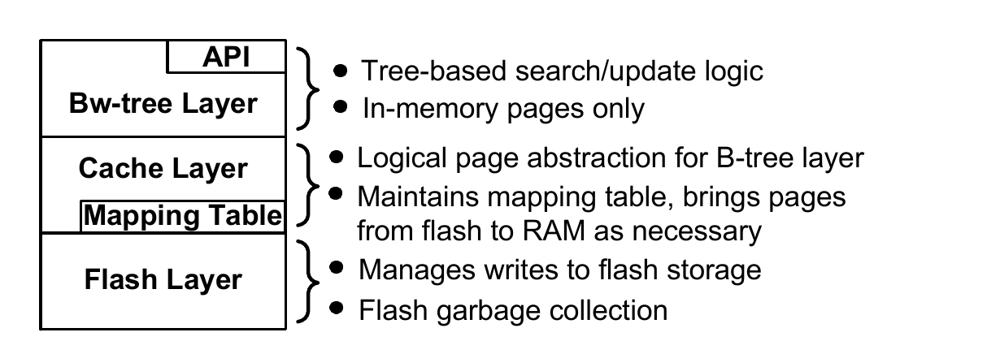
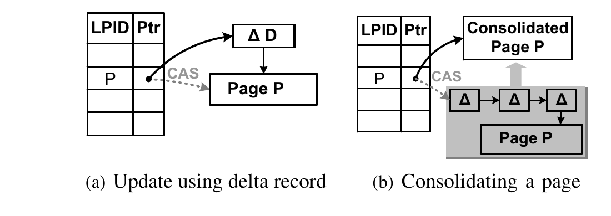
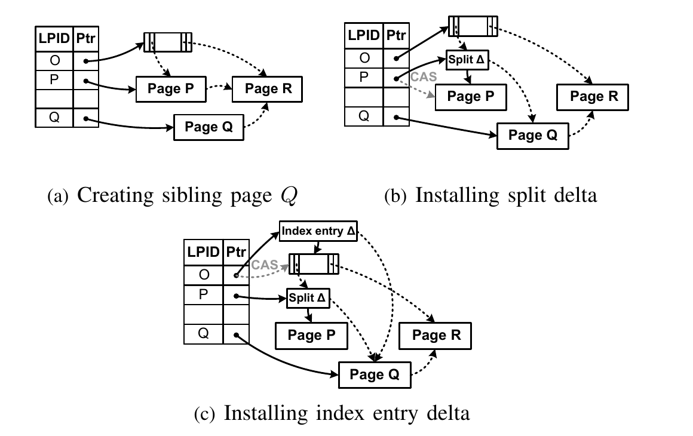
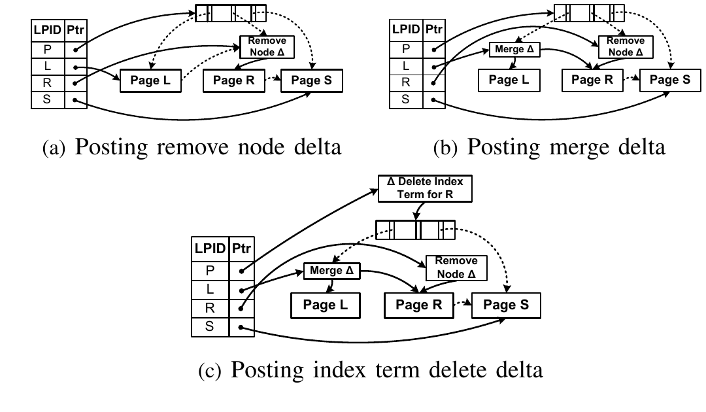
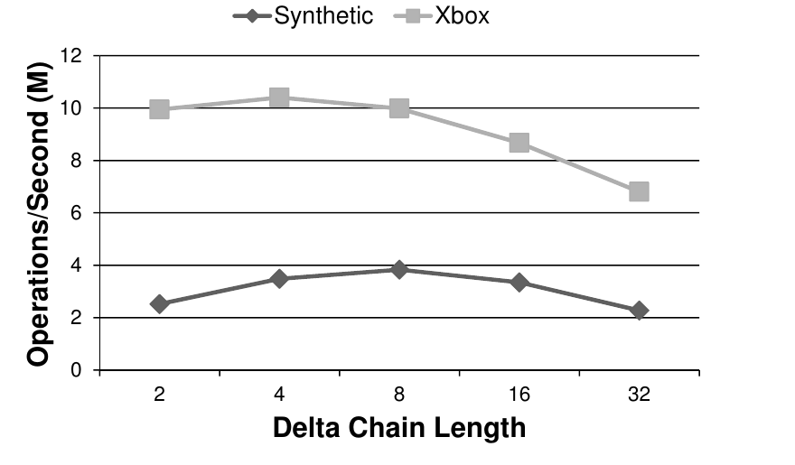
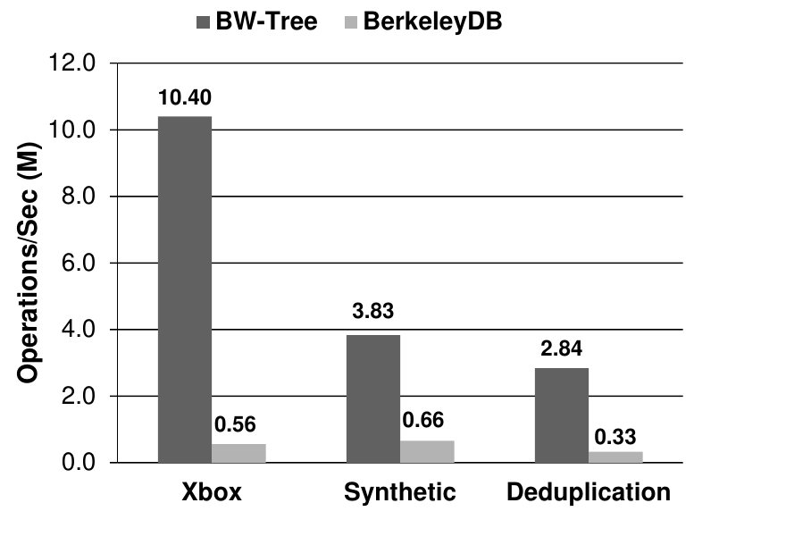
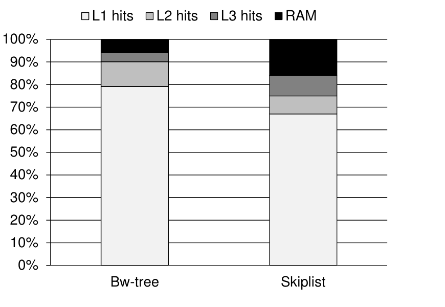

# The Bw-Tree: A B-tree for New Hardware Platforms（中文译文）

## 译者说明

本文依据同目录的 `source.pdf` 翻译。章节、图表、公式、算法、代码与参考文献按原文结构保留。

Justin J. Levandoski¹，David B. Lomet²，Sudipta Sengupta³

Microsoft Research，Redmond, WA 98052, USA

¹ justin.levandoski@microsoft.com；² lomet@microsoft.com；³ sudipta@microsoft.com

## 摘要

新硬件与新平台的出现，促使人们重新思考数据管理系统的设计方式。然而，按键索引访问记录等某些基本功能依然不可或缺。我们沿用了以往系统常见的分层架构，但对每一层都作出了全新的设计选择。我们把这种新型 B-tree 称为 Bw-tree；它采用无闩锁（latch-free）方法，有效利用现代多核芯片的处理器缓存，从而实现极高性能。我们的存储管理器采用一种独特的日志结构化形式，模糊了页存储与记录存储的界线，并且很适合闪存。本论文描述 Bw-tree 的体系结构和算法，重点讨论其主存部分；论文还给出我们的实验结果，证明这种新方法能够取得出色的性能。

## I. 引言

### A. 原子记录存储

近来，人们对 No-SQL 系统进行了大量讨论；这些系统本质上是原子记录存储（atomic record store，ARS）[1]。其中一些系统旨在作为独立产品，但只要具备适当的控制操作 [2]、[3]，原子记录存储也可以成为更完整事务系统中的一个组件。事实上，可以把数据库系统看作在内核中包含了一个原子记录存储。

ARS 支持读写单条记录，每条记录由一个键标识。此外，基于树的 ARS 还支持对指定键子范围进行高性能的按键顺序访问。正是随机访问与按键顺序访问的结合，使 B-tree 成为数据库系统中首选的索引方法。

然而，ARS 不只是一种访问方法。它还包括稳定存储的管理，以及系统崩溃时保证其更新可恢复的要求。这种更完整意义上的 ARS 的性能，是嵌入它的任何系统——包括全功能数据库系统——取得性能的基础。

本文提出一种可提供极高性能的新型 ARS。我们的 ARS 基于一种新的 B-tree 形式，我们称之为 Bw-tree。我们引入的技术，使 Bw-tree 及其配套存储管理器尤其适合过去几年间出现的新硬件环境。

我们在本文中聚焦 Bw-tree 的主存部分。我们详细说明我们的无闩锁技术，即我们如何不设置闩锁就完成更新与结构修改操作。我们的方法还谨慎地避免缓存行失效，因而也能获得明显更好的缓存性能。我们只从高层说明我们如何使用我们的日志结构化存储管理器，但具体细节留待另一篇论文。

### B. 新环境

自 20 世纪 70 年代以来，数据库系统大体一直利用相同的存储与 CPU 基础设施。该基础设施用磁盘作为持久存储；磁盘延迟如今可类比为一次往返冥王星的旅程 [4]。它使用的处理器，其单处理器性能会随摩尔定律增长，因此单机上不太需要很高程度的并发执行。处理器已不再提供不断提高的单核性能。简言之，“情况变了”。

#### 1）面向多核的设计

我们身处一个多核、高峰值性能的世界。单核速度至多只会温和增长，所以我们需要更善于利用大量核心；为此至少要处理两个重要方面：

1. 多核 CPU 要求高并发。但并发度越高，闩锁越可能造成阻塞，从而限制可扩展性 [5]。
2. 良好的多核处理器性能取决于较高的 CPU 缓存命中率。原地更新内存会导致缓存失效，因此必须非常谨慎地决定如何以及何时更新。

针对第一个问题，Bw-tree 采用无闩锁设计，保证线程在发生冲突时既不会让出执行，也不会重定向其活动。针对第二个问题，Bw-tree 执行“delta”更新，不原地更新页，从而保留页中此前已经缓存的缓存行。

#### 2）面向现代存储设备的设计

磁盘延迟是个大问题，而磁盘每秒 I/O 操作数过低则更具限制性。闪存能够以更低成本提供更高的每秒 I/O 操作数，这是降低 OLTP 系统成本的关键。Amazon 的 DynamoDB 确实明确提供了利用闪存的能力 [6]。因此，Bw-tree 以闪存为目标存储。

不过，闪存也有一些性能特性。闪存的随机读和顺序读很快，但写入前需要执行擦除周期，因此随机写慢于顺序写 [7]。闪存 SSD 通常通过映射层（FTL）向用户隐藏这种差异，但仍存在明显的速度下降。截至 2011 年，即使高端 FusionIO 设备的顺序写性能也比随机写快 3 倍 [8]。Bw-tree 自己在存储层执行日志结构化；这种方法不依赖 FTL，并保证无论使用高端还是低端闪存设备，我们的写入性能都尽可能高，因而不会成为系统瓶颈。

### C. 我们的贡献

我们在此列出我们的贡献：

1. Bw-tree 围绕一张映射表组织，该表同时虚拟化页的位置与大小。这种虚拟化既是我们的主存无闩锁方法所必需的，也是我们的日志结构化存储所必需的。
2. 我们通过把更新 delta 前置到先前页状态来更新 Bw-tree 节点。由于我们的 delta 更新保留先前页状态，它改善了处理器缓存性能。把新节点状态放在新的存储位置，使我们能够使用原子比较并交换指令来更新状态。因此，Bw-tree 在经典意义上是无闩锁的，允许多个线程并发访问页。
3. 我们为 Bw-tree 设计了页分裂和合并这两类结构修改操作（structure modification operation，SMO）。SMO 由多个原子操作实现，每个原子操作都让 Bw-tree 保持良构。此外，观察到一个正在进行的 SMO 的线程不会阻塞，而会采取步骤完成该 SMO。
4. 我们的日志结构化存储（log structured store，LSS）名义上是页存储，但它主要提交页变化 delta（一个或少数几条记录），因而存储利用率很高。最终，通过合并 delta 更新以及闪存“清理”过程，可将页变成连续布局。另一篇论文将完整描述 LSS。
5. 我们设计并实现了一个基于 Bw-tree 和 LSS 的 ARS。我们使用真实和合成工作负载测量了它的性能，并报告其极高的性能：它大幅胜过为磁盘设计的现有系统 BerkeleyDB，也大幅胜过主存中的无闩锁跳表。

从这项工作中归纳更广泛的经验，我们认为，无闩锁技术与避免原地更新的状态变更，是现代处理器上取得高性能的关键。进一步说，我们认为，不仅对闪存如此，对磁盘同样如此：日志结构化才是提供高存储性能的方式。我们认为这些“设计范式”可以更广泛地用于实现高性能数据管理系统。

### D. 论文结构

我们在第 II 节概述 Bw-tree 体系结构。在第 III 至 V 节，我们描述我们所构建的系统：我们在第 III 节从顶层的内存页组织开始，第 IV 节接着介绍 Bw-tree 的组织方式与结构修改，第 V 节详述缓存如何管理。在第 VI 节，我们描述我们的实验及其性能结果。第 VII 节介绍相关工作，以及我们的方法与它们有何显著区别。我们在第 VIII 节以简短讨论作结。

**图 1：我们的 Bw-tree 原子记录存储体系结构。** API 之下是 Bw-tree 层，负责基于树的搜索/更新逻辑且只处理内存页；缓存层向 B-tree 层提供逻辑页抽象，并维护映射表、按需把页从闪存取入 RAM；闪存层管理对闪存的写入和闪存垃圾回收。

## II. Bw-tree 体系结构

Bw-tree 原子记录存储（ARS）在许多方面都是经典的 B+tree [9]。它能以对数时间访问一维键范围中的带键记录，同时能以线性时间访问子范围。我们的 ARS 采用图 1 所示的经典体系结构。最上层是访问方法层，即我们的 Bw-tree 层；它与中间的缓存层交互。缓存管理器构建在存储层之上，而存储层实现我们的日志结构化存储（LSS）。LSS 目前利用闪存，但也可以管理闪存或磁盘。

该设计在体系结构上兼容现有数据库内核，也适合在解耦事务系统 [2]、[3] 中充当独立的“数据组件”。不过，它与经典图景存在显著差异。本节中，我们给出 Bw-tree ARS 的体系结构概览，并说明它为什么尤其适合多核处理器和基于闪存的稳定存储。

### A. 面向现代硬件

在我们的 Bw-tree 设计中，线程几乎从不阻塞。消除闩锁是我们的主要技术。我们不使用闩锁，而用原子比较并交换（compare and swap，CAS）指令安装状态变更。Bw-tree 只会在需要从稳定存储（LSS）取页时阻塞；有较大的主存缓存时，这种情况很少发生。线程持续执行有助于保留核心的指令缓存，并避免线程空闲时间与上下文切换成本。此外，Bw-tree 通过“delta 更新”（把更新附加到现有页）更新节点，而不是通过原地更新（修改现有页内存）来更新。避免原地更新可减少 CPU 缓存失效，从而提高缓存命中率；减少缓存未命中则可增加每周期执行的指令数。

数据管理系统的性能经常受 I/O 访问速率限制。我们选择以闪存为目标，以缓解这一问题。但即使使用闪存，当它以 SSD 形式连接时，I/O 访问速率仍会限制性能。我们的日志结构化存储层允许写入大缓冲区，实际消除了任何写瓶颈。闪存很高的随机读访问速率与大型主存缓存结合，可把读取造成的阻塞降至最低。写入大型多页缓冲区，使我们可以写可变大小的页，而不用填入“填充物”将其对齐到统一大小边界。

本节余下部分概述使上述要点得以落实的主要体系结构和算法创新。

### B. 映射表

我们的缓存层维护一张映射表，把逻辑页映射到物理页；逻辑页由逻辑“页标识符”（page identifier，PID）标识。映射表把 PID 转换为两者之一：（1）闪存偏移，即稳定存储上的页地址；或（2）内存指针，即该页在内存中的地址。因此，映射表是管理我们的“分页式”树的中心位置。虽然这种间接寻址技术并非我们独有，但我们把它作为多项创新的基础。我们在 Bw-tree 中用 PID 连接树节点；例如，Bw-tree 节点之间所有向下的“搜索”指针都是 PID，而不是物理指针。

映射表切断了物理位置与节点间链接的联系。于是，每次更新以及每次把页写入稳定存储时，都可以改变 Bw-tree 节点的物理位置，而不必把位置变化一路传播到树根（即不必更新节点间链接）。这种对“重定位”的容忍直接支持下文所述的内存节点 delta 更新与稳定存储日志结构化。

因此，Bw-tree 节点是逻辑节点，在稳定存储或主存中都不占用固定物理位置。我们于是可以按我们的需要塑造节点。对节点而言，“页”表示一种策略，而不是我们如何表示节点或节点可增长到多大这两方面的硬性要求。我们允许页大小具有弹性，也就是说，由于大小约束并不强制分裂，我们可以在方便时再分裂。

### C. Delta 更新

页状态的改变，是通过创建一条描述该变化的 delta 记录并将其前置到现有页状态来完成的。然后，我们用原子 CAS 指令[^1]，把 delta 记录的（新）内存地址安装到映射表中该页的物理地址槽位。若 CAS 成功，delta 记录地址就成为页的新物理地址。数据变化（例如插入记录）和管理变化（例如页分裂或把页刷入稳定存储）都使用这一策略。

我们偶尔会合并页：创建一个应用所有 delta 变化的新页，从而既减少内存占用，又改善搜索性能。页的合并形式同样用 CAS 安装，而先前的页结构会被垃圾回收（即回收其内存）。包含所有 delta 在内的整份页数据结构引用会放入一个待处理列表；安全后，该列表中的对象都将被回收。我们使用一种 epoch 机制来安全地完成垃圾回收 [10]。

我们的 delta 更新既让 Bw-tree 支持无闩锁访问，又通过避免原地更新保留处理器数据缓存。映射表能够把节点更新的影响隔离在该节点内，是实现这些特性的关键。

[^1]: CAS 是一条原子指令：它把给定旧值与内存位置 L 上的当前值比较；若两值相等，该指令就把一个新值写入 L，替换当前值。

### D. Bw-tree 结构修改

执行页分裂等结构修改操作（SMO）时，并没有闩锁保护我们的索引树的各个部分。这带来一个问题。例如，一次页分裂会改变多个页：原来过大的页 $O$、接收 $O$ 一半内容的新页 $N$，以及父索引页 $P$； $P$ 原来向下指向 $O$，随后则必须同时指向 $O$ 和 $N$。因此，我们无法用一次 CAS 安装一项页分裂。我们合并已经过小的节点时，会出现类似但更困难的问题。

为解决这个问题，我们把 SMO 分解成一系列原子动作，每个动作都可以用 CAS 安装。我们使用 B-link 设计 [11] 来简化这一过程。每个页都有侧向链接，因此我们可以把一次节点分裂分解为两个“半分裂”原子动作。为确保没有线程必须等待 SMO 完成，看到部分完成 SMO 的线程会先完成该 SMO，再继续自己的操作。这样便保证任何线程都无需等待 SMO 完成。

### E. 日志结构化存储

我们的 LSS 具备日志结构化的一般优势 [12]。页以大批次顺序写入，大幅减少所需的独立写 I/O 次数。不过，由于垃圾回收，日志结构化通常会产生额外写入：必须重定位仍存活于日志待回收存储区域中的页。我们的 LSS 设计大幅减轻了这个问题。

刷写一个页时，LSS 只需刷写自上次刷写以来对该页作出的变化 delta。这会显著减少每次刷写的数据量，使刷写缓冲区可容纳更多页，从而减少平均每页的 I/O 次数。不过，读取会付出代价，因为要把一个页放回主存缓存，必须读入该页所有不连续的组成部分。正是在这里，闪存极高的随机读性能真正有助于我们的 ARS 性能。

LSS 会清理闪存中表示旧日志存储部分的先前区域。Delta 刷写减少了每页使用的存储量，从而减轻 LSS 清理器的压力；这又减少了日志结构化固有的“写放大”。清理期间，LSS 会把页及其 delta 变为连续布局，以改善访问性能。

### F. 管理事务日志

与常规数据库系统一样，我们的 ARS 必须保证更新在系统崩溃后依然存在。我们为每个更新操作加上唯一标识符；该标识符通常是事务日志（在别处维护，例如由事务组件维护）上该更新的日志序列号（log sequence number，LSN）。LSN 的管理方式支持恢复幂等性，即确保操作最多执行一次。

与常规系统一样，页在遵守预写日志（write-ahead log，WAL）协议的前提下惰性刷写。但不同的是，我们不会为了执行 WAL 而阻塞页刷写。由于最近的更新以独立于页其余部分的 delta 存在，我们可以在刷页时剔除尚未进入稳定事务日志的“近期”更新。

**图 2：内存页。** 页更新在映射表中的物理指针上使用比较并交换（CAS）。（a）使用 delta 记录更新；（b）合并一个页。图中 `LPID` 表示逻辑页标识符，`Ptr` 表示物理指针。

## III. 内存中的无闩锁页

本节描述 Bw-tree 的内存页。我们首先讨论基本页结构，以及如何以无闩锁方式更新页；随后讨论偶尔执行的页合并，它可提高搜索效率。基于树的索引支持范围扫描，我们也会说明如何实现它。最后，我们讨论采用 epoch 安全机制的内存垃圾回收。

### A. 弹性虚拟页

Bw-tree 页中存储的信息与典型 B+tree 相似。内部索引节点包含按键排序的（分隔键，指针）对，用来引导搜索沿树向下进行；数据（叶）节点包含（键，记录）对。此外，页还包含：（1）低键，表示可存储在该页（以及其下子树）中的最小键值；（2）高键，表示可存储在该页中的最大键值；（3）侧向链接指针，指向树中同一层上该节点紧邻的右兄弟，如 B-link tree [11] 所示。

Bw-tree 的页设计有两个独特特征。第一，Bw-tree 页是逻辑的，也就是说，它们既不占用固定物理位置，也没有固定大小。（1）我们用 PID——映射表中的索引——标识页。访问者通过映射表把 PID 转换成当前物理地址。Bw-tree 节点之间的所有链接（“搜索”指针和侧向链接）都是 PID。（2）页具有弹性，即页可增长到多大并没有硬限制。页通过在前部加入“delta 记录”来增长。一条 delta 记录表示一次记录修改（例如插入、更新），或一次系统管理操作（例如页分裂）。

**更新。** 我们从不原地更新 Bw-tree 页（即修改其内存内容）。相反，我们创建一条描述更新的 delta 记录，并把它前置到现有页。Delta 记录让我们能以无闩锁方式增量更新页状态。我们首先创建一条新 delta 记录 $D$，使它（在物理上）指向页的当前地址 $P$；我们从映射表中的该页条目取得 $P$。Delta 记录的内存地址将充当该页的新内存地址（新状态）。

为了在映射表中安装新页状态（使其在索引中“生效”），我们使用第 II 节所述的原子 CAS 指令，以 $D$ 的地址替换当前地址 $P$。CAS 把 $P$ 与映射表中的当前地址比较。若当前地址等于 $P$，CAS 就成功安装 $D$；否则失败（我们稍后讨论 CAS 失败）。由于 Bw-tree 节点间的所有指针都通过 PID 表示，因此只需改变映射表条目中的这一处物理指针，便可安装页更新。而且，这种无闩锁技术是更新 Bw-tree 页的唯一方式，所有修改页的操作都统一使用它。在本文余下部分，我们把使用 CAS 更新页称为“安装”一项操作。

图 2(a) 展示了更新过程：delta 记录 $D$ 被前置到页 $P$。映射表指向 $P$ 的虚线表示 $P$ 的旧地址，指向 delta 记录的实线表示 $P$ 的新物理地址。由于更新是原子的，如果多个线程竞争在映射表中同一“旧”状态之上安装 delta，只有一个更新者能够“获胜”。失败的线程必须重试其更新。[^2]

经过若干次更新后，页上会形成一条“delta 链”，如图 2(b) 右下角所示（图中有三条 delta 组成的链）。每次成功的新更新都会成为 delta 链的新“根”。这意味着，一个 Bw-tree 页的物理结构，是在一个基页（即合并后的 B-tree 节点）前面加上一条 delta 链。为明确起见，我们把 delta 链所前置到的结构称为基页，把基页连同其（可能为空的）delta 链称为页。

**叶级更新操作。** 在叶页层级，更新（delta）分为三类：（1）插入，表示在页中插入新记录；（2）修改，表示修改页中已有记录；（3）删除，表示移除页中已有记录。所有更新 delta 都包含发出更新的客户端提供的 LSN。我们把该 LSN 用于涉及事务日志管理器的事务恢复，并满足其执行 WAL 协议的需要（我们将在第 V-A 节进一步讨论 WAL 与 LSN）。插入和修改 delta 包含表示新载荷的记录；删除 delta 只包含要移除记录的键。在本节余下部分，我们只讨论叶页的记录更新，其他更新（例如索引页、分裂和刷写）留到后文。

**页搜索。** 搜索叶页时要遍历 delta 链（如果存在）。在链中第一次遇到搜索键时，搜索就停止。若包含该键的 delta 表示插入或修改，搜索成功并返回记录；若它表示删除，搜索失败。如果 delta 链不含该键，则以典型 B-tree 方式对基页执行二分搜索。我们将在第 IV 节讨论带 delta 链的索引页搜索。

### B. 页合并

如果 delta 链增长过长，搜索性能最终会下降。为抵消这一影响，我们偶尔执行页合并，创建一个重新组织的新基页，其中包含原始基页中的所有条目，并应用 delta 链中的更新进行修改。如果访问线程在页搜索期间发现 delta 链长度超过系统阈值，我们就会触发合并。该线程在尝试完自己的更新（或读取）操作后执行合并。

执行合并时，线程先创建一个新基页（一块新的内存），再用一个已排序向量填充它；向量包含来自 delta 链或旧基页的每条记录的最新版本，已删除记录则丢弃。随后，线程用 CAS 把合并后页的新地址安装到映射表。如果成功，线程请求对旧页状态执行垃圾回收（内存回收）。图 2(b) 给出了页 $P$ 的合并示例：delta 被并入新的“合并后页 $P$”。如果 CAS 失败，线程释放新页并放弃该操作。线程不会重试，因为之后某个线程最终会成功完成合并。

### C. 范围扫描

范围扫描由一个键范围（低键，高键）指定。任一边界键都可省略，表示范围的对应一端没有边界。扫描还会指定以键升序或降序交付记录。我们这里的说明假定两个边界键都已给出，并按升序交付；其他扫描选项只是简单变体。

扫描维护一个游标，其中的键表示搜索已经进行到何处。对于新扫描，所记忆的键是 `lowkey`。第一次访问包含范围内数据的数据页时，我们构建一个记录向量，纳入该页上要作为本次扫描一部分处理的所有记录。只要扫描期间该页没有变化，这就让我们能够高效地提供“下一条记录”功能。这是常见情形，必须高性能执行。

我们把每次“下一条记录”操作视为一个原子单元；整个扫描并非原子的。事务锁会阻止修改我们已经看到的记录（假设采用可串行化事务），但对于我们尚未交付的记录，我们不知道其采用何种并发控制。因此，从我们的向量交付一条记录之前，我们会检查是否有更新影响了记录向量中尚未返回的子范围。若发生了这种更新，我们会相应地重建记录向量。

### D. 垃圾回收

无闩锁环境不允许独占访问共享数据结构（例如 Bw-tree 页），这意味着，即使页状态正在更新，一个或多个读取者也可能仍在其中活动。我们不希望释放仍由其他线程访问的内存。例如，在合并期间，一个线程会用新的合并状态“换出”页的旧状态（即 delta 链加基页），并请求垃圾回收旧状态。然而，我们必须小心，不能在另一线程仍访问旧页状态时释放它。从 Bw-tree 移除一个页时也有类似问题：其他线程可能仍能访问刚刚移除的页。我们必须延迟回收，直到这种访问不再可能，从而保护这些线程，使其不会访问已被回收并可能已“改作他用”的对象。这通过让线程在一个“epoch”中执行来实现。

Epoch 机制用于防止正在释放的对象过早被复用 [10]。线程想保护自己正在使用（例如搜索）的对象不被回收时，会加入一个 epoch；依赖结束时退出该 epoch。通常，线程处于一个 epoch 中的持续时间只覆盖单次操作（例如插入或“下一条记录”）。加入 epoch $E$ 的线程，可能见过正在 epoch $E$ 中释放的对象的早期版本；但它不可能见过 epoch $E-1$ 中释放的对象，因为当时它还没有开始自己的依赖区间。因此，一旦所有加入 epoch $E$ 的线程都完成并退出该 epoch（即该 epoch 已“排空”），便可安全复用在 epoch $E$ 中释放的对象。我们用 epoch 同时保护存储空间和已释放的 PID；在 epoch 排空之前，这些对象不得复用。

**图 3：分裂示例。** 虚线箭头表示逻辑指针，实线箭头表示物理指针。（a）创建兄弟页 $Q$；（b）安装分裂 delta；（c）安装索引项 delta。

## IV. Bw-tree 结构修改

所有 Bw-tree 结构修改操作（SMO）都以无闩锁方式执行。据我们所知，以前从未有人这样做过，而它对我们的设计至关重要。我们先描述节点分裂，再描述节点合并；然后讨论如何保证在执行依赖某个 SMO 的动作之前，该 SMO 已经完成。这一点既是为了避免主存中的混乱，也是为了防止系统在不合时宜的时刻崩溃时可能导致树损坏。

### A. 节点分裂

访问线程发现页大小增长超过系统阈值时会触发分裂。该线程先尝试自己的操作，然后执行分裂。

Bw-tree 使用分两个阶段工作的 B-link 原子分裂安装技术 [11]。我们先在子节点（例如叶节点）层原子地安装分裂；这称为半分裂。随后，我们用一个包含新分隔键和指向新建分裂页的指针的新索引项，原子地更新父节点。必要时，这一过程可以沿树向上递归继续。由于侧向链接在子节点层分裂安装后仍能提供一棵有效搜索树，B-link 结构使我们可以把分裂拆成两个原子动作。

**子节点分裂。** 为分裂节点 $P$，B-tree 层向缓存层请求在映射表中为新节点 $Q$ 分配条目（ $Q$ 是 $P$ 的新右兄弟）。然后，我们从 $P$ 中找到能实现均衡分裂的适当分隔键 $K_P$，并为 $Q$ 创建一个新的合并基状态，其中包含 $P$ 中键大于 $K_P$ 的记录。页 $Q$ 还含有指向 $P$ 原右兄弟（称为页 $R$）的侧向链接。接下来，我们把 $Q$ 的物理地址安装到映射表；由于此时只有执行分裂的线程能看到 $Q$，该安装不使用 CAS。

图 3(a) 展示了这一情形：新兄弟页 $Q$ 包含 $P$ 的一半记录，并（在逻辑上）指向页 $R$（ $P$ 的右兄弟）。此时，映射表中仍是 $P$ 原来的未分裂状态，索引的其余部分看不到 $Q$。

我们通过在 $P$ 前置一条分裂 delta 记录，原子地安装分裂。分裂 delta 包含两项信息：（1）分隔键 $K_P$，用来使 $P$ 中所有大于 $K_P$ 的记录失效，因为这些记录现在位于 $Q$；（2）指向新兄弟 $Q$ 的逻辑侧向指针。这次安装完成第一个“半分裂”。图 3(b) 展示了向页 $P$ 前置分裂 delta 后的情形，该 delta 指向新兄弟页 $Q$。即使父节点 $O$ 中尚无 $Q$ 的索引项，此时索引仍然有效。对 $Q$ 所含键的所有搜索都会先到达 $P$；在 $P$ 上遇到分裂 delta 后，若搜索键大于分隔键 $K_P$，搜索便沿侧向链接到 $Q$。与此同时，对小于 $K_P$ 的键的所有搜索仍停留在 $P$。

**更新父节点。** 为让搜索直接到达 $Q$，我们在 $P$ 和 $Q$ 的父节点前置一条索引项 delta 记录，完成第二个半分裂。该索引 delta 包含：（1） $P$ 与 $Q$ 之间的分隔键 $K_P$；（2）指向 $Q$ 的逻辑指针；（3） $Q$ 的分隔键 $K_Q$（此前负责把搜索引向 $P$ 的分隔键）。我们记住沿树向下经过的路径（即路径上节点的 PID），因此可以立即识别父节点。多数时候，路径中记住的父节点仍然正确，我们可以立即提交该 delta。偶尔，父节点可能已经被并入另一个节点；但我们的 epoch 机制保证我们会看到适当的已删除状态，并据此知道合并已经发生。换言之，我们可以得到父节点 PID 不会成为悬空引用这一保证。检测到已删除状态时，我们沿树上行至祖父节点等处，再向下重新遍历树，找到仍然“存活”的父节点。

边界键 delta 同时带有 $K_P$ 和 $K_Q$，是为了优化搜索速度。由于搜索现在必须遍历索引节点上的 delta 链，如果在链中找到一条边界键 delta，使搜索键 $v$ 大于 $K_P$ 且小于或等于 $K_Q$，搜索便可立即结束，并沿逻辑指针向下到达 $Q$。否则，搜索继续进入基页，用简单的二分搜索找出应跟随的正确指针。图 3(c) 展示了我们持续使用的分裂示例：在父页 $O$ 前置索引项 delta 后，虚线表示指向页 $Q$ 的逻辑指针。

**合并。** 与创建并安装全新基页相比，提交 delta 能降低安装分裂的延迟。延迟降低也减少了“分裂失败”的机会，即在我们尝试安装分裂前有其他更新抢先进入、导致安装失败的情形。不过，我们最终会在稍后合并分裂过的页。对带有分裂 delta 的页，合并会创建一个新基页，其中包含键小于分裂 delta 中分隔键的记录。对带有索引项 delta 的页，我们创建一个新的合并基页，其中包含新的分隔键和指针。

**图 4：合并示例。** 虚线箭头表示逻辑指针，实线箭头表示物理指针。（a）提交移除节点 delta；（b）提交合并 delta；（c）提交索引项删除 delta。

### B. 节点合并

与分裂一样，线程遇到低于某个大小阈值的节点时会触发节点合并。我们以无闩锁方式执行节点合并，如图 4 所示。合并显然比分裂复杂，我们需要更多原子动作才能完成。

**标记为待删除。** 要合并（移除）的节点 $R$ 会用一条移除节点 delta 更新，如图 4(a) 所示。这会停止对节点 $R$ 的一切进一步使用。线程在 $R$ 中遇到移除节点 delta 后，若要读写此前位于 $R$ 中的内容，必须前往它的左兄弟； $R$ 的数据将并入该左兄弟。

**合并子节点。** $R$ 的左兄弟 $L$ 会用一条节点合并 delta 更新；该 delta 通过内存地址在物理上指向 $R$ 的内容。图 4(b) 展示了节点合并期间 $L$ 和 $R$ 的状态。注意，节点合并 delta 表明 $R$ 的内容要纳入 $L$，并直接指向这一状态；从逻辑上说，该状态现在已经是 $L$ 的一部分。除移除节点 delta 本身外， $R$ 的这块状态存储现在转移给 $L$，只有在 $L$ 被合并时才会回收。这使先前用线性 delta 链表示的页状态变成了一棵树。

当我们搜索 $L$ 时——此时 $L$ 同时负责自己原来的键空间和合并前属于 $R$ 的键空间——搜索会变成一次树搜索，把访问线程引向 $L$ 的原页，或引向 $L$ 因合并而从 $R$ 吸收的页。为了实现这一点，节点合并 delta 包含一个分隔键，用来把搜索引向正确节点。

**更新父节点。** 接着更新 $R$ 的父节点 $P$，删除与 $R$ 关联的索引项，如图 4(c) 所示。为此会提交一条索引项删除 delta；它不仅表示要删除 $R$，还表示 $L$ 现在将包含此前属于 $R$ 键空间的数据。 $L$ 的新范围会显式写入：低键等于 $L$ 原来的低键，高键等于 $R$ 原来的高键。与节点分裂一样，这使我们能够识别搜索何时应被引向树中新近改变的部分。此外，任何一路穿过所有 delta 到达基页的搜索，都能通过简单的二分搜索找到正确索引项。

索引项删除 delta 一经提交，通往 $R$ 的所有路径都会被阻断。此时，我们开始回收 $R$ 的 PID：把该 PID 加入当前活动 epoch 的 PID 待删除列表。在所有可能看到过 $R$ 早期状态的其他线程退出 epoch 前， $R$ 的 PID 不会被复用。这就是我们用来防止页内存过早复用的同一 epoch 机制（第 III-D 节）。

### C. 串行化结构修改与更新

我们的 Bw-tree 实现假设，冲突的数据更新操作由系统其他位置的并发控制阻止。并发控制可以位于集成数据库系统的锁管理器中，可以位于解耦事务系统（例如 Deuteronomy [2]）的事务组件中，也可以是原子记录存储所允许的并发更新任意交错。

然而，在 Bw-tree“内部”，我们需要正确地串行化数据更新与 SMO，也要串行化 SMO 与其他 SMO。也就是说，我们必须能够为 Bw-tree 中发生的一切构造一个串行调度，并把数据更新和 SMO 视为原子性单元。这并非易事。

我们希望把 SMO 当作原子操作（可把它们看成系统事务），但我们又没有使用闩锁来掩盖一个 SMO 实际由多个步骤组成这一事实。可以这样理解：如果线程偶然遇到未完成的 SMO，就如同看到了未提交状态。Bw-tree 是无闩锁的，无法阻止这种情况发生。我们的处理方式是要求该线程先完成并提交它遇到的 SMO，然后才能（1）提交自己的更新，或（2）继续自己的 SMO。

对于页分裂，这意味着：如果更新者或另一个 SMO 必须沿侧向指针遍历才能到达正确页，它就必须先把新的索引项 delta 提交到父节点，完成分裂 SMO；只有这样，它才能继续自己的活动。这样会迫使未完成的 SMO“提交”，并使它在该线程已开始但被打断的动作之前串行化。

无论 SMO 是分裂还是节点合并，同一原则都适用。删除节点 $R$ 时，我们访问其左兄弟 $L$ 以提交合并 delta。如果发现 $L$ 正在被删除，我们看到的就是一个进行中且尚未完成的、更“早”的系统事务。在这种情况下，我们需要让 $R$ 的删除在 $L$ 的删除之后串行化。因此，删除 $R$ 的线程必须先完成 $L$ 的删除，之后才能完成 $R$ 的删除。各种 SMO 组合都以相同方式串行化。这可能导致处理一“栈”SMO，但考虑到这种情况很少见，它应当不会频繁发生，而且以递归方式实现也相当直接。

[^2]: 重试协议取决于具体的更新操作。我们会在适当之处讨论具体重试协议。

## V. 缓存管理

缓存层负责在内存与闪存之间读取、刷写和换入换出页。它维护映射表，并向 Bw-tree 层提供逻辑页抽象。当 Bw-tree 层使用 PID 请求页引用时，如果映射表中的地址是内存指针，缓存层就返回该地址。否则，如果地址是闪存偏移（即该页不在内存中），缓存层会把页从 LSS 读入内存，使用 CAS 在映射表中安装内存地址，然后返回新的内存指针。对页的一切更新，包括分裂和页刷写等页管理操作，都要在映射表中由 PID 索引的位置上执行 CAS。

主存中的页偶尔会因为多种原因刷入稳定存储。例如，当 Bw-tree 是事务系统的一部分时，缓存层会刷写更新，以便为事务日志建立检查点。页换出之前也要刷写：为减少内存用量，在映射表中安装闪存偏移，并回收页内存。当多个线程向闪存刷页时，需要保持正确顺序的多项页刷写必须非常谨慎地执行。本节中，我们会描述其中一种与节点分裂有关的情形。

为了跟踪稳定存储（LSS）上是哪一个页版本以及它位于何处，我们使用刷写 delta 记录，并通过 CAS 把它安装到映射表中的页条目。刷写 delta 记录还会记下页的哪些变化已经刷写，从而让后续刷写只把增量页变化发送到稳定存储。一次页刷写成功时，刷写 delta 包含新的闪存偏移，以及描述已刷页状态的字段。

本节余下部分聚焦缓存层如何准备和执行页刷写，从而与 LSS 层交互（LSS 的细节留待未来工作）。我们先说明如何协调刷入 LSS 的操作与独立事务机制的要求，然后说明刷写的执行机制。

### A. 预写日志协议与 LSN

Bw-tree 是可以纳入事务系统的 ARS。被纳入事务系统后，它需要管理该系统施加给它的事务方面要求。Deuteronomy [2] 体系结构把这些方面显式表示为事务组件（transactional component，TC）与数据组件（data component，DC）之间协议的一部分，因此我们使用 Deuteronomy 术语描述这项功能；其他事务环境中也有类似考虑。

**LSN。** Bw-tree 页中的记录插入和修改 delta，都带有相应操作的日志序列号（LSN）。已刷写更新中的最大 LSN，会记录在描述该次刷写的刷写 delta 中。LSN 由更高层的 TC 生成，并供其事务日志使用。

**事务日志协调。** 每当 TC 追加（刷写）其稳定事务日志时，它都会更新稳定日志末尾（End of Stable Log，ESL）的 LSN 值。ESL 是这样一个 LSN：所有比它小的 LSN 都确定已经进入稳定日志。TC 会定期把更新后的 ESL 值发送给 DC。为通过 WAL 协议执行因果关系，DC 不得使任何 LSN 大于最新 ESL 的操作持久化；这保证就已经持久化的操作而言，DC“落后于”TC。为执行这条规则，页上 LSN 大于 ESL 的记录在该页刷入 LSS 时不会包含在内。

当 TC 推进其重做扫描起点（Redo-Scan-Start-Point，RSSP）时，会要求 DC 刷写页。TC 想推进 RSSP 时，会向 DC 提议一个 $RSSP _ {it}$。其意图是让 TC 可以截断（丢弃）事务日志中早于 RSSP 的部分。随后，TC 等待 DC 确认：DC 已使每个 LSN 小于 RSSP 的更新稳定。由于这些操作的结果已稳定，重做恢复期间 TC 不再需要把它们发送给 DC。

为遵从这一要求，DC 必须先刷写每个页上 LSN 小于 RSSP 的记录，再向 TC 确认。这种刷写永远不会阻塞，因为缓存管理器可以排除每条 LSN 大于 ESL 的记录。使用单个页级 LSN 的常规原地更新方法无法做到不阻塞。

为实现这种非阻塞行为，我们限制页合并（第 III-B 节）只纳入 LSN 小于或等于 ESL 的更新 delta。正因如此，刷页时我们总能排除这些 delta。

**Bw-tree 结构修改。** 我们用一个系统事务 [3] 包裹作为 Bw-tree SMO 一部分而记录的页。这解决了我们的无闩锁方法可能导致的并发 SMO 问题（例如两个线程都试图分裂同一页）。为了使 LSS 中的内容与主存保持一致，直到我们知道线程已在竞争中“获胜”、成功把 SMO delta 记录安装到适当页后，我们才提交包含其更新页的 SMO 系统事务。因此，我们允许并发 SMO，但保证至多一个能够提交。系统事务的开始和结束记录，是刷入 LSS 的对象中极少数并非页实例的对象。

### B. 把页刷入 LSS

LSS 提供一个大缓冲区，缓存管理器会向其中提交页以及描述 Bw-tree 结构修改的系统事务。我们在此简要概述这项功能，详细内容将由另一篇论文说明。

**页编组。** 缓存管理器把主存中页的指针表示所对应的字节，编组为可写入刷写缓冲区的线性表示。页状态在预定刷写时刻被捕获。这一点很重要，因为后续更新可能违反 WAL 协议，也可能发生页分裂，移除本应捕获到 LSS 的记录。例如，在一个较早的页刷写请求正被提交到刷写缓冲区时，该页可能发生分裂并被合并。如果对较早刷写所需字节的编组，发生在分裂已从分裂前的页中移除较高键之后，那么 LSS 捕获到的页版本不会包含这些记录。若系统在分裂的其余部分被刷写前崩溃，这些记录便会丢失。

编组页中待刷记录时，会合并多条 delta 记录，使它们在 LSS 中连续出现。

**增量刷写。** 刷写页时，缓存管理器只编组 LSN 位于该页上此前已刷写的最大 LSN 与当前 ESL 值之间的 delta 记录。该页最新的刷写 delta 记录中包含此前已刷写的最大 LSN 信息。

对页执行增量刷写，意味着 LSS 为一个页消耗的存储远少于整页刷写。对像我们的 LSS 这样的日志结构化存储来说，这有两个非常重要的好处：（1）与刷写每个页的完整状态相比，刷写缓冲区可以容纳分布在不同页上的多得多的更新，从而提高平均每页的写入效率；（2）由于存储空间消耗较慢，日志结构化存储清理器（垃圾回收器）无需如此繁重地工作，从而降低清理器在每页上的执行成本。它还会减少“写放大”，即清理器遇到未改变的页时仍需重写它们的要求。

**刷写活动。** 刷写缓冲区会聚合发往 LSS 的写入，直到达到可配置阈值（目前设为 1 MB），以减少 I/O 开销。它使用乒乓式（双）缓冲区，并通过对 LSS 的异步 I/O 调用在两者之间交替；当前一批页正在刷写时，下一批页刷写所用的缓冲区便可同时准备。

一个刷写缓冲区的 I/O 完成后，各页的状态会在映射表中更新。刷写结果由一条描述本次刷写的刷写 delta 捕获；与其他 delta 一样，它被前置到现有状态并通过 CAS 安装到映射表中。如果该次刷写已经捕获页上的全部更新，该页就是“干净”的，即不存在尚未被捕获、尚未在 LSS 上稳定的更新。

缓存管理器监控 Bw-tree 使用的内存；当内存用量超过可配置阈值时，它会尝试把页换出到 LSS。页一旦干净，就可以从缓存中驱逐。被驱逐页的状态存储通过我们基于 epoch 的内存垃圾回收器（第 III-D 节）回收。

## VI. 性能评估

本节实验评估 Bw-tree，并把它与“传统”B-tree 体系结构（以 B-tree 模式运行的 BerkeleyDB）及无闩锁跳表比较。我们的实验在真实系统实现上运行，使用真实与合成工作负载的组合。由于本文聚焦 Bw-tree 的内存部分，我们的实验明确聚焦内存系统性能；对二级存储的性能评估将是未来工作的主题。

### A. 实现与设置

**Bw-tree。** 我们用大约 10,000 行 C++ 代码，把 Bw-tree 实现为一个独立原子记录存储。我们使用 Win32 原生的 `InterlockedCompareExchange64` 执行 CAS 更新安装。我们的整个实现都无闩锁。

**BerkeleyDB。** 我们把 Bw-tree 与 BerkeleyDB 键值数据库比较。之所以选择 BerkeleyDB，是因为它作为独立存储引擎有良好性能；而且它不像完整数据库系统那样需要穿过查询处理层。我们使用 BerkeleyDB 的 C 实现，以 B-tree 模式运行；它是建立在管理页的缓冲池缓存之上的独立 B-tree 索引，代表典型的 B-tree 体系结构。我们以非事务模式使用 BerkeleyDB（这意味着性能更好）；该模式采用页级闩锁（BerkeleyDB 中最细的闩锁粒度）支持单写者和多读取者，以最大化并发。采用这种配置，我们认为 BerkeleyDB 可以与 Bw-tree 公平比较。在所有实验中，BerkeleyDB 缓冲池都足以容纳整个工作负载，因此不会访问二级存储。

**跳表。** 我们还把 Bw-tree 与一种无闩锁跳表实现 [13] 比较。跳表已经成为内存优化数据库中 B-tree 的一种常见替代方案，[^3] 因为它可以实现为无闩锁结构、插入性能快，并保持对数搜索开销。我们的实现通过 CAS 改变前驱元素的指针，把一个元素安装到最底层（链表）。它以 $\frac{1}{2}$ 的概率决定是否把一个元素安装到再高一层（跳表的“塔”或“快速通道”）。我们的跳表最大高度为 32 层。

**实验机器。** 我们的实验机器配备 Intel Xeon W3550（3.07 GHz）和 24 GB RAM。机器有 4 个核心；在我们的所有实验中，我们通过超线程把它们作为 8 个逻辑核心使用。

**评估数据集。** 我们的实验使用三个工作负载，其中两个来自真实应用，一个是合成工作负载。

1. **Xbox LIVE。** 该工作负载包含 2700 万次 get-set 操作，取自 Microsoft 的 Xbox LIVE Primetime 在线多人游戏 [15]。键是平均 94 字节的字母数字字符串，载荷平均 1200 字节。读写比约为 7.5:1。
2. **存储去重踪迹。** 该工作负载来自真实的企业去重踪迹；该踪迹用于为一个根文件目录生成数据块哈希序列，并计算去重后的数据块数量和存储字节数。踪迹共含 2700 万个数据块，其中 1200 万个唯一，读写比为 2.2:1。键是唯一标识数据块的 20 字节 SHA-1 哈希值，值载荷是 44 字节元数据字符串。
3. **合成。** 我们还使用生成 8 字节整数键和 8 字节整数载荷的合成数据集。工作负载开始时，索引中有用均匀随机分布生成的 100 万个条目。它执行 4200 万次操作，读写比为 5:1。

**默认值。** 除非另有说明，我们的主要性能指标都是以每秒百万次操作为单位测量的吞吐量。我们为每个工作负载使用 8 个工作线程，与我们的实验机器的逻辑核心数相等。BerkeleyDB 与 Bw-tree 的默认页大小均为 8 KB；跳表是链表，不采用页组织。

### B. Bw-tree 调优与特性

本节中，我们评估 Bw-tree 的两个方面：（1）delta 链长度对性能的影响；（2）提交 delta 更新时的无闩锁失败率。

#### 1）Delta 链长度

图 5 展示 Bw-tree 在 Xbox 和合成工作负载上、采用不同 delta 链长度阈值时的性能；该阈值就是我们触发页合并前 delta 链允许增长到的最大长度。阈值较小时，工作线程会频繁执行合并，其开销侵蚀系统整体性能。对 Xbox 工作负载而言，delta 超过 4 条后，顺序扫描的搜索性能开始下降。沿相连 delta 链的顺序扫描通常有利于分支预测与预取，但 Xbox 工作负载的记录较大，为 100 字节，这意味着扫描期间能放入 L1 缓存的 delta 更少。合成工作负载使用较小的 8 字节键，更适合预取与缓存。因此，其 delta 链可以增长得更长（约 8 条），而不产生性能后果。

**图 5：Delta 链长度的影响。** 横轴为 delta 链长度（2、4、8、16、32），纵轴为每秒百万次操作。Xbox 曲线在长度 4 左右达到峰值，随后下降；合成工作负载在长度约 8 时达到峰值，随后下降。

#### 2）无闩锁环境中的更新失败

由于 Bw-tree 的无闩锁性质，一些操作在竞争更新页状态时不可避免会失败。表 I 给出每种工作负载中分裂、合并和记录更新的失败率。

**表 I：无闩锁 delta 更新失败率**

| 工作负载 | 分裂失败 | 合并失败 | 更新失败 |
| --- | ---: | ---: | ---: |
| 去重 | 0.25% | 1.19% | 0.0013% |
| Xbox | 1.27% | 0.22% | 0.0171% |
| 合成 | 8.88% | 7.35% | 0.0003% |

记录更新（例如插入、修改、删除）的失败率极低，所有工作负载都低于 0.02%。分裂与合并操作的失败率高于更新失败：Xbox 与去重工作负载约为 1.25%，合成工作负载则达到 8.88%。这是预期结果，因为分裂和合并必须与更快的记录更新操作竞争。不过，我们认为这些比率仍可控制。合成工作负载的失败率代表最坏情形：合成数据中的记录极小，所以准备并安装记录更新 delta 极快；此时，竞争在同一页安装自己 delta 的分裂操作成本更高，因而失败概率很大。

### C. 与传统 B-tree 体系结构比较

该实验把 Bw-tree 的内存性能与代表传统 B-tree 体系结构的 BerkeleyDB 比较。[^4] 图 6 报告两个系统运行 Xbox、去重和合成工作负载的结果。对于 Xbox 工作负载，Bw-tree 吞吐量为每秒 1040 万次操作，BerkeleyDB 为每秒 55.5 万次，Bw-tree 加速 18.7 倍。两个系统在更新密集的去重工作负载上吞吐量都会下降，但 Bw-tree 对 BerkeleyDB 仍保持 8.6 倍加速。合成工作负载上的性能差距较小，Bw-tree 加速 5.8 倍；这是因为第 VI-B.2 节观察到 Bw-tree 在该负载下的无闩锁失败率较高。

**图 6：Bw-tree 与 BerkeleyDB。** 单位为每秒百万次操作。Xbox：10.40 对 0.56；合成：3.83 对 0.66；去重：2.84 对 0.33。

总体而言，我们认为 Bw-tree 的优越性能主要来自两个方面：（1）**无闩锁。** Bw-tree 上没有线程会因更新或读取而阻塞；BerkeleyDB 则在更新期间用页级闩锁阻塞读取者，降低并发。Bw-tree 执行时处理器利用率约为 99%，BerkeleyDB 约为 60%。（2）**CPU 缓存效率。** Bw-tree 使用 delta 记录更新不可变基页，因此更新很少使其他线程的 CPU 缓存失效；BerkeleyDB 则原地更新页。向典型 B-tree 页插入记录时，需要把新元素加入按键排序的记录向量，平均要移动一半元素，并使多个缓存行失效。

### D. 与无闩锁跳表比较

我们还把 Bw-tree 与一种无闩锁跳表实现比较。跳表以对数搜索开销提供按键顺序访问，并且很容易实现为无闩锁结构。因此，它作为 B-tree 在内存优化数据库中的替代方案，正开始受到关注 [14]。表 II 第一行给出 Bw-tree 与无闩锁跳表运行合成工作负载的结果；Bw-tree 胜过跳表 3.7 倍。为进一步研究 Bw-tree 性能优势的来源，我们让两个系统都运行只读工作负载：在含 3000 万条记录的索引上执行 3000 万次键查找。我们在表 II 第二行报告这些结果，Bw-tree 具有 4.4 倍性能优势。这些结果表明 Bw-tree 在搜索性能上具有明显优势。我们推测，这是因为 Bw-tree 的 CPU 缓存效率高于跳表；我们将在下一节对此展开分析。

**表 II：Bw-tree 与无闩锁跳表**

| 工作负载 | Bw-tree | 跳表 |
| --- | ---: | ---: |
| 合成工作负载 | 3.83M ops/sec | 1.02M ops/sec |
| 只读工作负载 | 5.71M ops/sec | 1.30M ops/sec |

### E. 缓存性能

该实验测量 Bw-tree 相对于跳表的 CPU 缓存效率。我们使用 Intel VTune 分析器[^5]，在两个系统上运行只读工作负载时捕获 CPU 缓存命中事件。为收集准确统计数据，工作负载以单线程运行。图 7 绘出每个系统中已退役内存加载在 CPU 缓存层次结构上的分布。正如我们预期，Bw-tree 的缓存效率明显优于跳表。Bw-tree 几乎 90% 的内存读取来自 L1 或 L2 缓存，跳表则为 75%。我们推测，Bw-tree 的搜索效率是这一差异的主要原因。跳表为了移动到下一座“塔”或某一层的下一条链表记录，每次比较前都必须遍历一个物理指针；这可能导致不规则的 CPU 缓存行为，在分支预测失败时尤为如此。

**图 7：缓存效率。** 纵轴为已退役内存加载的分布，分为 L1 命中、L2 命中、L3 命中和 RAM；横轴比较 Bw-tree 与跳表。

相比之下，Bw-tree 搜索对缓存友好，因为它大部分时间都在一个基页上执行二分搜索，而键被紧凑存放在一块连续内存中（也可能带有少数 delta）。这意味着 Bw-tree 追逐指针的次数远少于跳表。

当我们考察每种数据结构在到达数据页之前所访问的节点集合时，Bw-tree 对缓存的友好性会更加清楚。在所有可能的搜索路径上，这个集合恰好是 Bw-tree 的内部节点集合，只占已用内存的 1% 或更少；对跳表而言，该集合约占节点总数的 50%。因此，在给定缓存大小下，Bw-tree 搜索中的内存访问比跳表有更多能够命中缓存。

[^3]: MemSQL 内存数据库使用跳表作为有序索引 [14]。

[^4]: 我们使用 BerkeleyDB 的 `memp_stat` 函数确保它在内存中运行。

[^5]: <http://software.intel.com/en-us/articles/intel-vtune-amplifier-xe/>

## VII. 相关工作

我们受益于以往工作，并在某些情形下以其为基础继续构建。

### A. B-tree

任何从事 B-tree 工作的人都受惠于 Bayer 和 McCreight [16]。我们使用的变体是 B+tree [9]。我们利用由不连续片段组成的弹性页，扩展了“面向页”的含义。弹性页的概念源自 SkimpyStash 使用的哈希访问方法记录列表 [8]。与 SkimpyStash 一样，我们在垃圾回收时会合并一个“页”的不连续片段。

### B. 无闩锁

在我们的工作之前，人们尚不清楚能否使 B-tree 无锁或无闩锁。当多个线程必须访问同一页时，跳表 [13] 可作为无闩锁“树”的替代方案。分区是另一种避免闩锁的方法，让每个线程拥有自己的键空间分区 [17]、[18]。Bw-tree 对所有状态变更——包括 SMO 与刷写等“管理”状态变更——都使用 CAS 指令，从而避免分区的开销。

### C. 基于闪存与日志结构化

早期闪存工作采用页内日志 [19]：把日志记录放在 B-tree 页附近，而不是原地更新页，因为后者需要执行擦除周期。我们的 delta 记录虽然有些类似页内日志记录，但与事务恢复毫无关系。我们不把它们视为日志记录，而是视为记录的新版本。事务日志记录即使存在，也位于别处。我们同样从这些 delta 获得无闩锁能力。

我们把自己的闪存 SSD 当作通用存储设备。因此，我们没有像文献 [20] 那样尝试利用其内部并行性。利用这种并行性，很可能取得比我们迄今达到的性能更高的性能。

日志结构化最初应用于文件系统 [12]，但如今已更广泛地用于磁盘，也用作闪存的转换层。在我们的系统中，我们使用固态磁盘，也就是通过传统 I/O 接口访问并使用转换层的闪存设备。即便如此，我们还是实现了自己的日志结构化存储。这样，我们可以在我们的缓冲区中把页紧密打包，使闪存上不存在空白空间；同时也可以模糊页存储与记录存储之间的界线，进一步减少刷页所消耗的存储。存储节省会改善 LSS 性能，因为垃圾回收会消耗周期、放大写入并磨损闪存，是日志结构化的最大成本。

### D. 组合式工作

早期索引已经使用上述一些要素，只是使用方式并不完全相同。Hyder [21] 使用构建在闪存之上的日志结构化存储。在 Hyder 中，所有变化都传播到树根；根部的变化会批量处理，并压缩其中所含路径。Hyder 至少在一种模式下直接支持事务，其日志结构化存储同时充当数据库和日志。我们没有这样做；需要事务支持时，我们依靠事务组件。

BFTL [22] 是在日志结构化闪存上实现索引的另一个例子。在以往工作中，它的 B-tree 管理存储的方式或许最接近 Bw-tree。它有一张称为节点转换表的映射表，也会把 delta（采用我们的术语）写入闪存。当 delta 数量变多时，它还有一个使这些 delta 在闪存上连续的过程。然而，BFTL B-tree 不处理多线程、并发控制与缓存管理；我们认为这些主题对原子记录存储提供高吞吐性能至关重要。

## VIII. 讨论

### A. 性能结果

我们的 Bw-tree 实现取得了极高性能，而且已经足够完整，使我们能够可靠、一致地测量正常运行性能。我们利用数据库把更新缓存到适合提交到稳定存储的时刻这一能力。这是数据库系统取得性能的关键，并由 Deuteronomy 体系结构中 TC 与 DC 之间接口的控制操作显式提供。不过，像我们这样利用该能力，也意味着把 Bw-tree 的性能与立即使更新操作稳定的原子记录存储比较时，需要十分谨慎。

### B. 日志结构化存储

我们在本文中聚焦我们的原子记录存储（ARS）或数据组件（DC）中的 Bw-tree 部分。因此，我们没有讨论与 LSS 管理有关的问题。无闩锁环境对数据管理系统的许多组成部分都极具挑战性，其中包括我们的 LSS 所执行的存储管理。我们会在另一篇论文中说明 LSS 的实现细节。这里，我们只概括几个需要关注的方面：

- 我们以无闩锁方式管理我们的刷写缓冲区。据我们所知，以前从未有人这样做过。这意味着向缓冲区提交条目时没有线程阻塞。
- 我们使用系统事务捕获 Bw-tree 的结构修改操作（SMO），从而保证恢复期间可以把每个 SMO 视为原子的。
- 我们必须使主存状态与正在写入 LSS 的状态保持一致；在没有闩锁的情况下，这并非易事。在设计 LSS 接口时，我们对这一细微问题进行了深入考虑。

### C. 页内搜索优化

我们取得上述优异性能结果时，尚未用缓存敏感的页搜索技术 [23]、[24] 调优搜索性能。我们预计，实现这类技术会进一步提高 Bw-tree 的搜索性能。对于更新性能，我们没有顾虑，因为我们仍会继续使用我们的 delta 记录技术，并保留它的全部优势。

### D. 结论

我们设计并实现了 Bw-tree，使它既可作为独立原子记录存储存在，也可作为 Deuteronomy 风格系统中的数据组件，还可嵌入传统数据库系统。我们沿用了访问方法层、缓存管理器层、存储管理器层依次叠加的经典体系结构，但在每一层都引入创新，扩展以往方法，使我们的系统适合多核处理器与闪存这一较新的硬件环境。

我们的创新包括弹性页、delta 更新、共享只读状态、无闩锁操作和日志结构化存储；它们消除线程阻塞，提高处理器缓存效率，并降低 I/O 需求。这些技术在其他场景中也应能良好工作，包括哈希访问方法和多属性访问方法。

我们非常清楚，自己正在实现一个此前已经被成功实现过无数次的组件。在这种情况下，归根结底，是系统性能决定这项努力是否结出成果。尽管我们对自己的设计选择“有信心”，结果之好仍令我们感到惊喜。在一颗普通 CPU 上支持每秒数百万次操作，有力地印证了我们的设计选择。我们以如此大的优势胜过非常优秀的竞争方案，则是“锦上添花”。

## 参考文献

[1] “MongoDB. <http://www.mongodb.org/>.”

[2] J. J. Levandoski, D. B. Lomet, M. F. Mokbel, and K. Zhao, “Deuteronomy: Transaction Support for Cloud Data,” in CIDR, 2011, pp. 123–133.

[3] D. Lomet, A. Fekete, G. Weikum, and M. Zwilling, “Unbundling Transaction Services in the Cloud,” in CIDR, 2009, pp. 123–133.

[4] C. Nyberg, T. Barclay, Z. Cvetanovic, J. Gray, and D. B. Lomet, “AlphaSort: A Cache-Sensitive Parallel External Sort,” VLDB Journal, vol. 4, no. 4, pp. 603–627, 1995.

[5] A. Ailamaki, D. J. DeWitt, M. D. Hill, and D. A. Wood, “DBMSs on a Modern Processor: Where Does Time Go?” in VLDB, 1999, pp. 266–277.

[6] “Amazon DynamoDB. <http://aws.amazon.com/dynamodb/>.”

[7] X.-Y. Hu, E. Eleftheriou, R. Haas, I. Iliadis, and R. Pletka, “Write amplification analysis in flash-based solid state drives,” in Proceedings of SYSTOR 2009: The Israeli Experimental Systems Conference, ser. SYSTOR ’09, 2009, pp. 10:1–10:9.

[8] B. Debnath, S. Sengupta, and J. Li, “SkimpyStash: RAM Space Skimpy Key-Value Store on Flash-based Storage,” in SIGMOD, 2011, pp. 25–36.

[9] D. Comer, “The Ubiquitous B-Tree,” ACM Comput. Surv., vol. 11, no. 2, pp. 121–137, 1979.

[10] H. T. Kung and P. L. Lehman, “Concurrent manipulation of binary search trees,” TODS, vol. 5, no. 3, pp. 354–382, 1980.

[11] P. L. Lehman and S. B. Yao, “Efficient Locking for Concurrent Operations on B-Trees,” TODS, vol. 6, no. 4, pp. 650–670, 1981.

[12] M. Rosenblum and J. Ousterhout, “The Design and Implementation of a Log-Structured File System,” ACM Trans. Comput. Syst., vol. 10, no. 1, pp. 26–52, 1992.

[13] W. Pugh, “Skip Lists: A Probabilistic Alternative to Balanced Trees,” Commun. ACM, vol. 33, no. 6, pp. 668–676, 1990.

[14] “MemSQL Indexes. <http://developers.memsql.com/docs/1b/indexes.html>.”

[15] “Xbox LIVE. <http://www.xbox.com/live>.”

[16] R. Bayer and E. M. McCreight, “Organization and Maintenance of Large Ordered Indices,” Acta Inf., vol. 1, no. 1, pp. 173–189, 1972.

[17] I. Pandis, P. Tözün, R. Johnson, and A. Ailamaki, “PLP: Page Latch-free Shared-everything OLTP,” PVLDB, vol. 4, no. 10, pp. 610–621, 2011.

[18] J. Sewall, J. Chhugani, C. Kim, N. Satish, and P. Dubey, “PALM: Parallel Architecture-Friendly Latch-Free Modifications to B+ Trees on Many-Core Processors,” PVLDB, vol. 4, no. 11, pp. 795–806, 2011.

[19] S.-W. Lee and B. Moon, “Design of Flash-Based DBMS: An In-Page Logging Approach,” in SIGMOD, 2007, pp. 55–66.

[20] H. Roh, S. Park, S. Kim, M. Shin, and S.-W. Lee, “B+-tree Index Optimizations by Exploiting Internal Parallelism of Flash-based Solid State Drives,” PVLDB, vol. 5, no. 4, pp. 286–297, 2012.

[21] P. A. Bernstein, C. W. Reid, and S. Das, “Hyder - a transactional record manager for shared flash,” in CIDR, 2011, pp. 9–20.

[22] C.-H. Wu, T.-W. Kuo, and L. P. Chang, “An Efficient B-tree Layer Implementation for Flash-Memory Storage Systems,” ACM Trans. Embed. Comput. Syst., vol. 6, no. 3, July 2007.

[23] S. Chen, P. B. Gibbons, T. C. Mowry, and G. Valentin, “Fractal Prefetching B±Trees: Optimizing Both Cache and Disk Performance,” in SIGMOD, 2002, pp. 157–168.

[24] D. B. Lomet, “The Evolution of Effective B-tree: Page Organization and Techniques: A Personal Account,” SIGMOD Record, vol. 30, no. 3, pp. 64–69, 2001.
