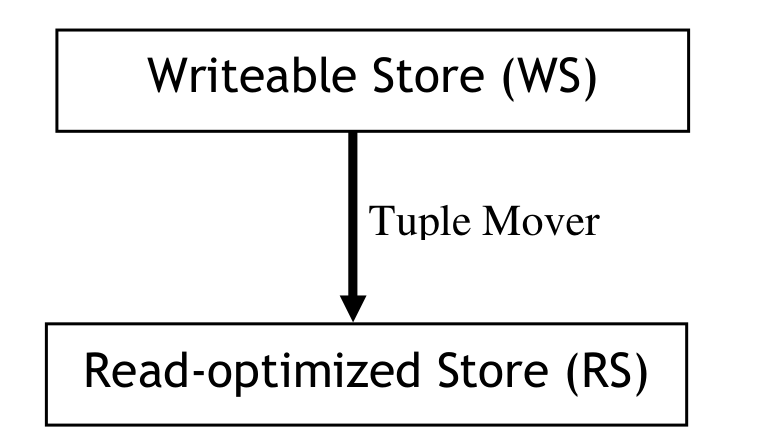
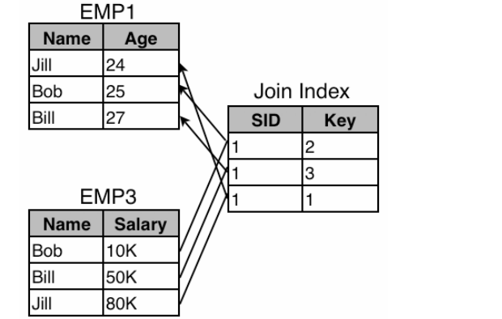
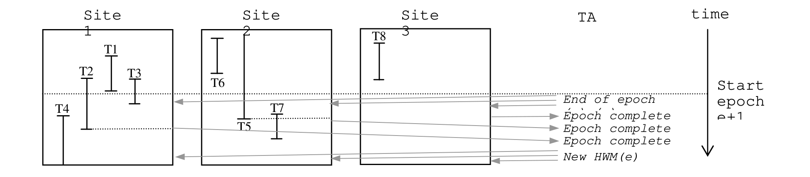

# C-Store: A Column-oriented DBMS（中文译文）

## 译者说明

本文依据同目录的 `source.pdf` 翻译。章节、图表、公式、算法、代码与参考文献按原文结构保留。

Mike Stonebraker、Daniel J. Abadi、Adam Batkin、Xuedong Chen、Mitch Cherniack、Miguel Ferreira、Edmond Lau、Amerson Lin、Sam Madden、Elizabeth O’Neil、Pat O’Neil、Alex Rasin、Nga Tran、Stan Zdonik

MIT CSAIL；Brandeis University；UMass Boston；Brown University

## 摘要

我们给出一种面向读取优化的关系 DBMS 设计，与当前大多数面向写入优化的系统形成鲜明对比。它在设计上的诸多差异包括：按列而非按行存储数据；在存储中谨慎编码并紧凑打包对象，查询处理期间的主存表示也不例外；存储彼此重叠的一组列式投影，而不是传统的表与索引；采用非传统事务实现，为只读事务提供高可用与快照隔离；广泛使用位图索引来补充 B-tree。

我们给出 TPC-H 子集上的初步性能数据，表明正在构建的 C-Store 明显快于流行商业产品。因此，这一架构很有前景。

## 1. 引言

多数主流 DBMS 厂商实现面向记录的存储系统，把一条记录（tuple）的各属性连续放置。使用这种 row store 架构，一次磁盘写即可把一条记录的全部字段写出，因此写入性能很高；我们把它称作 write-optimized system。这类系统尤其适合 OLTP 应用。

与之相反，对大量数据执行 ad-hoc 查询的系统应面向读取优化。数据仓库是一类典型场景：周期性批量载入新数据，随后经历较长的 ad-hoc 查询阶段。其他 read-mostly 应用还包括客户关系管理（CRM）、电子图书馆卡片目录和各种临时查询系统。在这些环境中，把单列值连续存储的 column store 架构应当更高效；Sybase IQ [FREN95, SYBA04]、Addamark [ADDA04] 和 KDB [KDB04] 已在仓库市场证明这一点。我们讨论的 C-Store 在已有系统之上引入了多项新特性。

Column store 只需读取处理查询所需的列值，避免把无关属性带入内存。在典型查询会对大量数据项做聚合的数据仓库中，这带来显著优势。不过，read-optimized 与 write-optimized 架构之间还有几项重要区别。

传统关系 DBMS 把属性填充到 byte 或 word 边界，并以原生格式存值，因为过去认为在内存处理中把值移到边界的代价太高。然而 CPU 速度增长远快于磁盘带宽，因此应当用充裕的 CPU 周期交换稀缺的磁盘带宽，这在 read-mostly 环境尤为划算。

Column store 可以用两种方式花费 CPU 来节省磁盘带宽。第一，把数据元素编码得更紧凑。例如，美国各州可编码为 6 bit，而两字符缩写需要 16 bit，变长全名更多。第二，在存储中 dense-pack：N 个、每个 K bit 的值可以直接放入 `N×K` bit。列存相对行存的编码和可压缩性优势此前已有论述 [FREN95]。查询执行器还应尽可能直接处理压缩表示，至少到向应用呈现值之前都避免解压。

商业关系 DBMS 存储完整 tuple，并在表属性上建立辅助 B-tree；索引可为 primary（使底层行尽量按指定属性排序）或 secondary（不调整底层记录顺序）。它们在 OLTP write-optimized 环境有效，但在 read-optimized 世界并不理想。后者更适合 bitmap index [ONEI97]、cross-table index [ORAC04] 和 materialized view [CERI91]。Read-optimized DBMS 可以只存这些读取优化结构，完全不支持面向写入的结构。

C-Store 因而物理存储一组列，每列按某些属性排序。按同一属性排序的一组列称为 projection；同一列可出现在多个投影中，并在各处按不同属性排序。激进压缩应能在不造成空间爆炸的情况下支持许多排序顺序，而多种顺序也为优化创造机会。

C-Store 并不是简单地把既有行存逐列拆开。它有意放弃 write-optimized 的 base table 与传统辅助索引组合，把投影本身作为唯一物理数据副本。不同投影可重叠、可按不同键排序，还可跨 n:1 外键关系携带属性。这样，冗余既承担容错职责，也直接为查询提供合适的访问顺序；压缩则使多份冗余仍能维持较低空间开销。

廉价的 blade/grid 计算机集合将成为 DBMS 等计算和存储密集应用最经济的硬件 [DEWI92]。新架构应假设包含 G 个节点的 grid，每节点有私有磁盘和内存，并以 shared-nothing [STON86] 水平划分数据。未来 grid 可能有数十至数百节点，节点既可共置也可组成多个共置集群。DBA 很难手工优化 grid，因此必须自动把数据结构分配到节点。水平划分还便利 intra-query parallelism，C-Store 在这点上沿用 Gamma [DEWI90]。

许多仓库系统（如 Walmart [WEST00]）保留两份数据，因为在 TB 级数据上依靠 DBMS 日志恢复代价太高。磁盘单字节成本下降使复制更具吸引力，grid 可把副本放在不同处理节点上，实现 Tandem 风格的高可用 [TAND89]。副本不必用完全相同的布局：C-Store 允许冗余对象按不同顺序存储，在高可用之外提高检索性能。只要冗余设计确保任一 G 个站点中的一个失效后仍可访问全部数据，重叠投影也能继续提高性能。能容忍 K 个故障的系统称为 K-safe，C-Store 可配置不同 K。

即使 read-mostly 环境也必须支持事务更新：仓库需要在线修错，实时仓库还要求数据几乎立即可见；CRM 等系统更需要一般在线更新。但更新能力与读取优化结构之间存在张力。KDB 与 Addamark 按 entry sequence 维护列，新数据可高效追加，但查询通常会偏好别的顺序；而让列按非进入顺序排列又使插入昂贵。

C-Store 用新视角解决这一矛盾：在同一软件中组合 read-optimized column store 与面向更新/插入的 writable store，并由 tuple mover 连接。小型 Writeable Store（WS）支持高性能插入和更新；大得多的 Read-optimized Store（RS）容纳大量信息并面向读取优化，只支持一种受限插入：由 tuple mover 把记录从 WS 批量移入 RS。



*图 1：C-Store 架构。*

查询必须同时访问两个存储。插入发往 WS；删除在 RS 中标记，稍后由 tuple mover 清除；更新实现为一次插入加一次删除。为实现高速 tuple mover，C-Store 采用 LSM-tree [ONEI96] 的变体：merge-out 把有序 WS 对象与大型 RS block 高效合并，形成 RS 的新副本，完成后切换安装。

系统必须在大型 ad-hoc 查询、较小更新事务以及可能连续插入的环境中支持事务。盲目使用动态锁会造成严重读写冲突、阻塞和死锁。因此只读查询在 historical mode 下运行：选择一个小于最近已提交事务时间的时间戳 T，语义上保证返回历史时刻 T 的正确答案。快照隔离 [BERE95] 要求插入时给数据元素加时间戳，运行时忽略晚于 T 的元素。

传统优化器和执行器也都面向行存。RS 与 WS 均为列式，因此 C-Store 构建全新的列式优化器和执行器。我们设计的可更新列存同时追求仓库查询的极高性能与 OLTP 事务的合理速度，其创新包括：

1. 混合架构：WS 为频繁插入/更新优化，RS 为查询优化。
2. 以不同顺序冗余存储多组重叠投影，让查询选择最有利者。
3. 用多种编码方案高度压缩列。
4. 采用与行式系统原语不同的列式优化器和执行器。
5. 通过足够多重叠投影实现 K-safety，提高可用性和性能。
6. 用快照隔离避免查询使用 2PC 和锁。

这些主题单独看都与既有研究相似，真正使 C-Store 独特的是把它们组合进一个实际系统。第 2 节介绍数据模型，第 3、4 节分别介绍 RS、WS，第 5 节讨论 grid 上的数据结构分配，第 6 节介绍更新与事务，第 7 节介绍 tuple mover，第 8 节介绍优化器和执行器，第 9 节与商业行存、列存比较，第 10、11 节分别讨论相关工作与结论。第 9 节性能比较尚属初步，因为 WS 与 tuple mover 尚未完全集成，其开销可能显著。

## 2. 数据模型

C-Store 支持标准关系逻辑模型：数据库由命名表组成，每表含命名属性（列）；属性或属性集合可构成唯一主键，也可作为引用另一表主键的外键。查询语言假定为具备标准语义的 SQL。物理存储却不直接使用这一逻辑模型：行存通常先实现物理表再加索引，C-Store 则只实现 projections。

C-Store 投影锚定在逻辑表 T 上，包含 T 的一个或多个属性；也可包含其他表属性，只要从 anchor table 到目标表存在一条 n:1 外键关系链。形成投影时，从 T 投出所需属性并保留重复行，再通过适当的 value-based foreign-key join 获得非 anchor table 属性。因此投影行数与 anchor table 相同。虽然可以支持更复杂投影，但这一简单方案应已能在确保高性能的同时满足需求。这里 projection 一词不同于通常含义，因为系统不存储生成它的 base table。

**表 1：EMP 示例数据。**

| Name | Age | Dept | Salary |
| --- | ---: | --- | ---: |
| Bob | 25 | Math | 10K |
| Bill | 27 | EECS | 50K |
| Jill | 24 | Biology | 80K |

把表 t 的第 i 个投影记为 `ti`，后接投影字段；来自其他表的属性带原逻辑表名前缀。考虑 `EMP(name, age, salary, dept)` 与 `DEPT(dname, floor)`，一种投影集合为：

```text
EMP1(name, age)
EMP2(dept, age, DEPT.floor)
EMP3(name, salary)
DEPT1(dname, floor)
```

*示例 1：EMP 与 DEPT 的可能投影。*

投影中的 tuple 按列存储。若投影有 K 个属性，就有 K 个单列数据结构，全部按同一 sort key 排列；sort key 可以是投影中的任意一列或多列，tuple 按 key 从左到右排序。用竖线分隔投影与 sort key：

```text
EMP1(name, age | age)
EMP2(dept, age, DEPT.floor | DEPT.floor)
EMP3(name, salary | salary)
DEPT1(dname, floor | floor)
```

*示例 2：示例 1 投影及其排序顺序。*

每个投影再水平划分为一个或多个 segment，segment identifier 记为 `Sid>0`。C-Store 只支持基于投影 sort key 的 value-based partitioning；每个 segment 对应一段 key range，全部区间共同划分完整 key space。

为回答任意 SQL 查询，每张表必须有覆盖投影集，使每一列至少出现在一个投影中；同时系统还要从所存 segments 重建完整行。它通过 storage key 与 join index 连接不同投影的 segment。

**Storage key。** 每个 segment 把每列的每个值关联到 storage key（SK）。同 segment 各列中 SK 相同的值属于同一逻辑行。RS 的 SK 编号为 1、2、3……，不物理存储，而由 tuple 在列中的位置推导。WS 则显式保存整数 SK，且大于 RS 任一 segment 的最大整数 SK。

**Join index。** 若 T1、T2 是覆盖表 T 的两个投影，从 T1 的 M 个 segment 到 T2 的 N 个 segment 的 join index 在逻辑上是 M 张表，每张对应 T1 的一个 segment S，行格式为：

```text
(s: T2 中的 SID, k: segment s 中的 storage key)
```

T1 某 tuple 的 join-index 项给出 T2 中对应 tuple 的 segment ID 和 storage key。因 join index 只连接锚定于同一表的投影，该映射总是一对一；也可把它看作将顺序 O 的 T1 逻辑重排为 T2 的顺序 O'。

要从 T1…Tk 的 segments 重建 T，必须存在一条 join-index 路径，把 T 的每个属性映射到某共同顺序 O*。路径从某投影 Ti 的排序开始，经过零个或多个中间 join index，终止于按 O* 排序的投影。对示例 2，可选择 age 为共同顺序，分别把 EMP2、EMP3 映到 EMP1；也可把 EMP2 映到 EMP3，再把 EMP3 映到 EMP1。



*图 2：从 EMP3 到 EMP1 的 join index。假设每个投影只有一个 segment；EMP3 第一项 `(Bob,10K)` 对应 EMP1 第二项，因此 join index 第一项的 storage key 为 2。*

实际中每列会出现在多个投影，所需 join index 因而较少。Join index 很昂贵：投影每次修改都要求更新所有指入或指出它的 join index。

数据库投影 segments 及其 join indexes 必须分配到 C-Store 节点。管理员可要求数据库 K-safe：丢失 K 个 grid 节点后仍能重建全部表，也就是剩余站点上仍有覆盖投影集及将其映射到共同排序的 join indexes。故障发生时系统以 K-1 safety 继续运行，直到节点修复并追平。

因此物理设计问题是：在空间预算 B 内，为逻辑表集合确定 projections、segments、sort keys 与 join indices，使其满足 K-safety，并对管理员提供的训练负载获得最佳整体性能。C-Store 还可记录全部查询，周期性用作训练负载。由于熟练 DBA 稀缺，我们正在编写自动 schema design 工具，相关问题见 [PAPA04]。

## 3. RS

RS 是 read-optimized column store。任一投影 segment 都分解为组成它的列，每列按投影 sort key 顺序存放。每个 tuple 在 RS 中的 storage key 是它在 segment 内的序号，不实际存储，按需计算。

### 3.1 编码方案

RS 的列使用四种编码之一。选择取决于列的顺序（按本列值排序，即 self-order；或按同投影另一列对应值排序，即 foreign-order）以及 distinct value 比例。

**Type 1：self-order，distinct value 少。** 列表示为三元组 `(v,f,n)` 序列：v 是值，f 是它首次出现的位置，n 是出现次数。例如值 4 位于位置 12-18，则记为 `(4,12,7)`。Self-ordered 列每个 distinct value 只需一个三元组。为了按值搜索，Type 1 列在 value 字段上建立 clustered B-tree。RS 没有在线更新，索引可无空隙 dense-pack；使用 64-128KB 大 block 时，高度可保持在 2 或更低。

**Type 2：foreign-order，distinct value 少。** 列表示为 `(v,b)` 序列，v 是值，b 是指出各出现位置的 bitmap。例如整数列 `0,0,1,1,2,1,0,2,1` 编成：

```text
(0, 110000100)
(1, 001101001)
(2, 000010010)
```

每个 bitmap 很稀疏，可用 run-length encoding 节省空间。为高效找到 Type 2 列第 i 个值，系统加入 offset indexes，即把列位置映到列值的 B-tree。

**Type 3：self-order，distinct value 多。** 每个值编码为相对前一值的 delta。例如 `1,4,7,7,8,12` 表示为 `1,3,3,0,1,4`：第一项为列首值，之后均为 delta。Type 3 是 block-oriented：每个 block 第一项保存实际值及 storage key，后续保存相对前值的 delta，类似 VSAM 对 B-tree key 的编码 [VSAM04]。可在 block 层用 dense-pack B-tree 索引这些对象。

**Type 4：foreign-order，distinct value 多。** 值多时可能应保持未编码，但我们仍在研究压缩方案；索引仍可使用 dense-pack B-tree。

### 3.2 Join indexes

Join index 连接锚定在同一表上的各投影，由 `(sid,storage_key)` 对组成，两个字段都可作为普通列存储。它放在哪里会影响物理设计，第 5 节讨论；它还必须打通 RS 与 WS，因此下一节补充其设计。

## 4. WS

为避免编写两个优化器，WS 也是列存并实现与 RS 相同的物理设计，即包含相同 projections 与 join indexes。但它必须支持事务更新，存储表示因而完全不同。

每条记录的 SK 在各 WS segment 中显式存储。插入逻辑表 T 的一个 tuple 时分配唯一 SK，执行引擎确保 T 的每个相关投影都记录相同 SK。它是大于数据库最大 RS segment 记录数的整数。为简化并扩展，WS 与 RS 以同样方式水平划分，因此 RS、WS segments 一一对应；`(sid,storage_key)` 可标识任一容器中的记录。

WS 相对 RS 很小，不压缩数据值，直接表示。每个投影用 B-tree 保持逻辑 sort-key 顺序。每个列表示为 `(v,sk)` 对集合，并在第二字段上用传统 B-tree；投影 sort key 另表示为 `(s,sk)` 对，其中 s 是 sort-key value，sk 指出 s 首次出现位置，也在 sort-key 字段上建 B-tree。按 sort key 搜索时，先用后者找目标 storage keys，再用前一组 B-tree 找记录其他字段。

Join index 现在可以完整描述：每个投影由一对 segments 表示，一个在 WS，一个在 RS。对 sender 中每条记录，保存 receiver 对应记录的 sid 与 storage key。Join index 按 sender 投影相同方式水平划分，并与对应 sender segment 共置；每个 `(sid,storage key)` 都是指向 RS 或 WS 记录的指针。

需要注意，RS 与 WS 共享逻辑 schema，却针对完全不同的数据生命周期使用不同表示：RS 的 ordinal storage key、dense-packed 编码与不可变 block 面向扫描；WS 的显式 storage key、普通值和可更新 B-tree 面向小规模事务写入。Join index 中的 `(sid,storage_key)` 因而必须能跨越两种存储，tuple mover 在记录迁移并重新分配 RS storage key 时还必须同步维护这些映射。

## 5. 存储管理

存储管理的核心是在 grid 节点间分配 segments，C-Store 用 storage allocator 自动完成。单个投影 segment 的所有列应共置；join index 应与 sender segment 共置；每个 WS segment 也与包含相同 key range 的 RS segment 共置。我们正在实现支持初始分配和负载不均时重分配的 allocator，细节超出本文范围。

所有对象都是列，持久化只是持久化列集合。分析表明，raw device 相对当时文件系统收益很小，因此大型列（MB 级）各自存进底层操作系统文件。

## 6. 更新与事务

一次插入在 WS 中表示为一组新对象（每个投影的每列一个），外加 sort-key 结构；同一逻辑记录的所有插入共享 SK。接收更新的站点分配 SK。为避免节点间同步，各节点维护 local unique counter，并附加 local site id 形成 global unique SK。Counter 初值设为 RS 最大 key 加 1，保持与 RS 一致。

WS 构建在 BerkeleyDB [SLEE04] 之上，用其 B-tree 支持数据结构。插入一个投影会在不同磁盘页执行多次物理插入，每列每投影一次。为避免性能低下，计划利用主存单字节成本不断下降来配置很大的 buffer pool，使“热”WS 结构大部分常驻内存。

C-Store 面对大量大读取集 ad-hoc 查询和少量小记录集 OLTP 事务；传统锁会导致严重争用。系统因此用 snapshot isolation 隔离只读事务：只读事务访问近期过去某一时刻的数据库，系统保证此前没有未提交事务，故无需加锁。允许快照读取的最近过去时刻称 high water mark（HWM），C-Store 用低开销机制在多站点跟踪它。若只读事务能任意设置 effective time，就必须支持昂贵的通用 time travel，因此还设 low water mark（LWM），表示只读事务可使用的最早时刻。更新事务仍用读写锁并遵守 strict two-phase locking。

### 6.1 提供快照隔离

关键是确定 effective time 为 ET 的只读事务能看见 WS、RS 中哪些记录。系统不能原地更新，而把更新拆成插入和删除；记录在 ET 前插入且在 ET 后删除时可见。为节省空间，时间戳使用粗粒度 epoch。

每个 WS 投影 segment 维护 insertion vector（IV），逐记录保存插入 epoch。Tuple mover 保证 RS 中没有晚于 LWM 插入的记录，因此 RS 不需 IV。每个投影还维护 deleted record vector（DRV），每条投影记录一项：未删除为 0，否则为删除 epoch。DRV 大多为 0，可用 Type 2 紧凑编码；它必须可更新，故存在 WS。运行时逐记录查询 IV、DRV 计算可见性。

#### 6.1.1 维护 High Water Mark

指定一个站点为 timestamp authority（TA），负责向其他站点分配时间戳。时间分为 epochs，epoch number 是从时间起点以来经过的 epoch 数。每个 epoch 可持续许多秒，具体随部署而变。初始 HWM 为 epoch 0，current epoch 从 1 开始。

TA 周期性决定进入下一 epoch，向各站点发送 end-of-epoch 消息。站点把 current epoch 从 e 加到 e+1，新到事务因而带时间戳 e+1；站点等待所有始于 epoch e 或更早的事务完成，再向 TA 发 epoch-complete。TA 收到所有站点关于 e 的完成消息后，把 HWM 设为 e，并广播各站点。



*图 3：HWM 选择算法。灰箭头表示 TA 与各站点之间的消息；epoch e 的所有事务提交后才能读取时间戳 e 的 tuple。HWM 增加时 T4 仍在执行，但只读事务看不到其更新，因为它运行在 epoch e+1。*

TA 广播 HWM=e 后，只读事务可读取 epoch e 或更早的数据，并确信都已提交。为让用户指定真实世界时间，系统维护 epoch 到时间的映射表，并从最接近用户指定时间的 epoch 开始查询。

为防 epoch number 无界增长并浪费空间，系统计划回收不再需要的 epoch：像 TCP 等协议一样 wrap 时间戳，复用旧编号。仓库记录通常保留固定时长（如两年），系统只需跟踪任一 DRV 中最老 epoch，并保证绕回 0 不越过它。不能有效 wrap 的环境只能增大 wrap length 或 epoch 大小。

### 6.2 基于锁的并发控制

读写事务用 strict 2PL [GRAY92]。各站点对运行时读写对象加锁，形成与多数分布式数据库相同的 distributed lock table。恢复使用标准 WAL 和 NO-FORCE/STEAL [GRAY92]，但仅记录 UNDO；REDO 按 6.3 节完成；也不使用严格 2PC，而按 6.2.1 节省略 PREPARE。死锁通过 timeout 解决，按标准做法中止一个死锁事务。

#### 6.2.1 分布式 COMMIT 处理

每个事务有 master，负责把工作单元分配到站点并决定最终提交状态。协议不同于 2PC：不发送 PREPARE。Master 收到事务 COMMIT 后，等待所有 worker 完成未决动作，再向每个站点发送 commit（或 abort）。站点收到 commit 后释放相关锁，删除事务 UNDO log。

因为没有 PREPARE，已被告知提交的站点可能在把更新或日志写到稳定存储前崩溃。此时故障站点恢复期间从其他站点的其他投影恢复状态，重现已提交事务的更新。

#### 6.2.2 事务回滚

用户或系统中止事务时，从后向前扫描 UNDO log 回滚。日志对 segment 的每次逻辑更新保存一项；由于 WS 数据结构会让物理日志产生许多记录，系统像 ARIES [MOHA92] 一样使用 logical logging。

### 6.3 恢复

崩溃站点通过查询其他投影（复制状态）恢复。K-safety 保证在恢复时间 t 内可有 K 个站点失效，系统仍保持事务一致性。分三种情况：

1. 故障站点无数据丢失：执行网络中为它排队的更新即可追平。Read-mostly 环境下 roll-forward 开销不大，这是最常见且直接的恢复。
2. 灾难性故障同时破坏 RS、WS：必须从其他投影和 join indexes 重建二者，还需可从远端取 IV、DRV 等辅助结构；恢复后再执行排队更新。
3. WS 损坏而 RS 完整：RS 只由 tuple mover 写，通常能幸存，下面详述这一常见情形。

#### 6.3.1 高效恢复 WS

考虑恢复站点 r 上投影的 WS segment Sr，其 sort key 为 K、key range 为 R；另有包含 Sr sort key 的其他投影集合 `C={M1,…,Mb}`。Tuple mover 保证每个 WS segment S 包含所有插入时间晚于 $t _ {\mathrm{lastmove}}(S)$ 的 tuple；该时间表示 S 对应 RS segment 中任一记录的最近插入时间。

恢复时先检查 C 中各投影，寻找覆盖 key range K 的列集合，并要求各 segment 都满足 $t _ {\mathrm{lastmove}}(S) \le t _ {\mathrm{lastmove}}(S_r)$。若成功，执行如下查询：

```sql
SELECT desired_fields,
       insertion_epoch,
       deletion_epoch
FROM recovery_segment
WHERE insertion_epoch > t_lastmove(Sr)
      AND insertion_epoch <= HWM
      AND deletion_epoch = 0
          OR deletion_epoch >= LWM
      AND sort_key in K
```

只要查询返回 storage key，就能沿合适 join indexes 找到 segment 其他字段。只要存在覆盖 Sr key range 的 segment 集，即可把 Sr 恢复到当前 HWM，再执行排队更新完成恢复。

若不存在这种 cover，说明 Sr 某些 tuple 已在远端站点移入 RS。虽然仍可查询远端，但若不取回整个 RS 并与本地 RS segment 求差，就难以识别目标 tuple，代价显然很高。

若这种情况常见，可让 tuple mover 为每个移动 tuple 记录：其在 RS 中的 storage key，以及它移出 WS 前的 storage key 和 epoch number。日志可截断到所有站点 WS 中最老 tuple 的时间戳，因为更早 tuple 不会再需恢复。恢复站点可结合远端 WS segment S 与 tuple-mover log 执行上述查询，即使 $t _ {\mathrm{lastmove}}(S) \gt{} t _ {\mathrm{lastmove}}(S_r)$。

站点 r 还需重建本地存储、由 Sr 充当 sender 的 join-index WS 部分。只需查询远端 receivers；对方生成 tuple 时计算 join index，并将对应 WS partition 连同恢复列传回。

## 7. Tuple mover

Tuple mover 在后台寻找值得处理的 `(RS,WS)` segment pair，把 WS segment 中的 blocks 移到对应 RS，并更新 join indexes。找到一对后执行 merge-out process（MOP）。

MOP 找出所选 WS segment 中 insertion time 不晚于 LWM 的记录，分为两组：

- 在 LWM 或之前已删除：丢弃，因为用户已不能查询它们存在的时期。
- 未删除或在 LWM 后删除：移入 RS。

MOP 创建新 RS segment `RS'`，读入旧 RS 各列 block，删除 DRV 值不晚于 LWM 的 RS 项，并合并 WS 列值；合并数据持续写入增长中的 `RS'`。`RS'` 最近插入时间成为新的 $t _ {\mathrm{lastmove}}$，且始终不晚于 LWM。由于几乎所有对象都会移动，old-master/new-master 优于原地更新。记录在 `RS'` 中获得新 storage key，必须维护 join index；RS 项也可能被删，DRV 同样必须维护。`RS'` 含全部 WS 数据且 join index 更新后，系统从 RS 切换到 `RS'`，释放旧 RS 空间。

TA 周期性向各站点发送新 LWM epoch；LWM 追赶 HWM，二者间差值在用户历史访问需求与 WS 空间限制之间折中。

## 8. C-Store 查询执行

查询优化器接收 SQL 并构建 execution node 组成的 query plan。下面介绍节点与优化器架构。

### 8.1 查询算子与计划格式

共有十类节点，各自接受或产生 projection（Proj）、column（Col）或 bitstring（Bits）。Projection 是一组 cardinality、ordering 相同的列；bitstring 是 0/1 列表，指出相关值是否存在于所描述的记录子集中。算子还可接受 predicate（Pred）、join index（JI）、attribute name（Att）和 expression（Exp）。Join index 和 bitstring 都是特殊列，也可放入投影并在适当位置作为算子输入。

1. **Decompress**：把压缩列转换为未压缩 Type 4 表示。
2. **Select**：相当于关系代数选择 σ，但输出结果的 bitstring，而不是输入的子集。
3. **Mask**：接受 bitstring B 与投影 Cs，只输出 B 中对应 bit 为 1 的值。
4. **Project**：相当于关系代数投影 π。
5. **Sort**：按投影中某些列排序全部列。
6. **Aggregation Operators**：对命名列、按投影值标识的各 group 计算 SQL 风格聚合。
7. **Concat**：把同序排列的一个或多个投影合为单一投影。
8. **Permute**：按 join index 定义的顺序重排投影。
9. **Join**：按关联两个投影的 predicate 执行 join。
10. **Bitstring Operators**：`BAnd` 求两个 bitstrings 的逐位 AND，`BOr` 求 OR，`BNot` 求补。

Query plan 是上述算子组成的树，叶节点是 access method，相连节点以 iterator 为接口。非叶节点通过修改后的标准 iterator [GRAE93] 调用 `get_next` 消费子节点数据。为降低节点间调用次数，C-Store iterator 每次返回单列的 64K block；仍保留 iterator 将数据流与控制流耦合的优点，但把粒度调整为适合列模型。

### 8.2 查询优化

计划使用 Selinger 风格 [SELI79] 的 cost-based optimizer，并用 two-phase optimizer [HONG92] 限制搜索空间复杂度。这里至少有两点不同于传统优化：必须考虑数据的压缩表示，并决定何时用 bitstring mask 投影。

C-Store 算子能处理压缩或未压缩输入，这是第 9 节性能优势的关键。执行成本（I/O 和 memory buffer）取决于输入压缩类型。例如，对 Type 2 数据执行 Select 时，只需从磁盘读 predicate 匹配值的 bitmaps，即使列本身未排序；但接受 Type 2 的算子比其他三种压缩需要大得多的 buffer：每个可能值一页内存。因此成本模型必须理解输入、输出列的表示。

主要优化决策是查询使用哪组 projections。为每种可能性构建计划再择优太慢，重点是剪枝搜索空间。优化器还要决定计划中何时按 bitstring mask 投影：有时应早推 Mask，例如避免在 Type 2 压缩数据上选择时产生 bitstring；另一些情况则应延后，直到 bitstring 可直接交给只处理 bitstring 就能给出结果的下一算子（如 COUNT）。

## 9. 性能比较

当时 RS storage engine 与 executor 已可运行；WS 与 tuple mover 只有早期实现，尚不能做实验。因此性能分析只涵盖只读查询，不能报告更新；RS 也尚不支持 segments 或多个 grid nodes，以下均为单站点数字。其他组件完成后还需更全面研究。

测试机器为 3.0GHz Pentium，运行 RedHat Linux，配 2GB 内存、750GB 磁盘。决策支持市场以 TPC-H 为标准，我们采用当时引擎可运行的简化版本：

```sql
CREATE TABLE LINEITEM (
  L_ORDERKEY INTEGER NOT NULL,
  L_PARTKEY INTEGER NOT NULL,
  L_SUPPKEY INTEGER NOT NULL,
  L_LINENUMBER INTEGER NOT NULL,
  L_QUANTITY INTEGER NOT NULL,
  L_EXTENDEDPRICE INTEGER NOT NULL,
  L_RETURNFLAG CHAR(1) NOT NULL,
  L_SHIPDATE INTEGER NOT NULL
);

CREATE TABLE ORDERS (
  O_ORDERKEY INTEGER NOT NULL,
  O_CUSTKEY INTEGER NOT NULL,
  O_ORDERDATE INTEGER NOT NULL
);

CREATE TABLE CUSTOMER (
  C_CUSTKEY INTEGER NOT NULL,
  C_NATIONKEY INTEGER NOT NULL
);
```

为简化实现，只选择 INTEGER 与 CHAR(1)。TPC-H `scale_10` 的标准数据共 60,000,000 个 lineitems（1.8GB），由 TPC 网站生成器产生。

比较 C-Store、一个流行商业 row store 和一个流行商业 column store，三者都关闭 locking 与 logging。每个系统原则上获得 2.7GB（约原始数据 1.5 倍）的数据加索引预算，并分别针对自身能力优化 schema。行存无法在预算内运行，放宽到它存储表与索引所需的 4.5GB。

| 系统 | 实际磁盘用量 |
| --- | ---: |
| C-Store | 1.987GB |
| Row Store | 4.480GB |
| Column Store | 2.650GB |

C-Store 即使存储冗余 schema，也只用行存约 40% 空间，主要原因是压缩以及不向 word/block 边界 padding。商业列存比 C-Store 多用 30%，同样说明 C-Store 可凭更好压缩和无 padding 在更少空间中保存冗余 schema。

在各系统运行以下七个查询：

**Q1：求 D 日之后每天发运的 lineitem 总数。**

```sql
SELECT l_shipdate, COUNT(*)
FROM lineitem
WHERE l_shipdate > D
GROUP BY l_shipdate;
```

**Q2：求 D 日每个 supplier 发运的 lineitem 总数。**

```sql
SELECT l_suppkey, COUNT(*)
FROM lineitem
WHERE l_shipdate = D
GROUP BY l_suppkey;
```

**Q3：求 D 日之后每个 supplier 发运的 lineitem 总数。**

```sql
SELECT l_suppkey, COUNT(*)
FROM lineitem
WHERE l_shipdate > D
GROUP BY l_suppkey;
```

**Q4：对 D 日后的每个日期，求该日所下订单中所有 item 的最晚 shipdate。**

```sql
SELECT o_orderdate, MAX(l_shipdate)
FROM lineitem, orders
WHERE l_orderkey = o_orderkey
  AND o_orderdate > D
GROUP BY o_orderdate;
```

**Q5：对每个 supplier，求日期 D 所下订单中一个 item 的最晚 shipdate。**

```sql
SELECT l_suppkey, MAX(l_shipdate)
FROM lineitem, orders
WHERE l_orderkey = o_orderkey
  AND o_orderdate = D
GROUP BY l_suppkey;
```

**Q6：对每个 supplier，求 D 日之后所下订单中一个 item 的最晚 shipdate。**

```sql
SELECT l_suppkey, MAX(l_shipdate)
FROM lineitem, orders
WHERE l_orderkey = o_orderkey
  AND o_orderdate > D
GROUP BY l_suppkey;
```

**Q7：返回客户所代表全部 nation 的标识符及其退回 parts 的总损失收入；这是 TPC-H Q10 的简化版。**

```sql
SELECT c_nationkey, SUM(l_extendedprice)
FROM lineitem, orders, customers
WHERE l_orderkey = o_orderkey
  AND o_custkey = c_custkey
  AND l_returnflag = 'R'
GROUP BY c_nationkey;
```

三套 schema 分别针对七查询负载调优。C-Store 使用：

```text
D1: (l_orderkey, l_partkey, l_suppkey,
     l_linenumber, l_quantity,
     l_extendedprice, l_returnflag, l_shipdate
     | l_shipdate, l_suppkey)
D2: (o_orderdate, l_shipdate, l_suppkey
     | o_orderdate, l_suppkey)
D3: (o_orderdate, o_custkey, o_orderkey
     | o_orderdate)
D4: (l_returnflag, l_extendedprice, c_nationkey
     | l_returnflag)
D5: (c_custkey, c_nationkey | c_custkey)
```

D2、D4 是 materialized join views。D3、D5 没被七个查询使用，只为保证 schema 仍可像产品 schema 一样回答任意查询而加入。商业行存使用上述普通关系 schema 和厂商特定调优参数；商业列存也使用自身特定参数。我们认为选择合理，但不能保证最优。

以下为专用机器上的执行时间（秒）：

| Query | C-Store | Row Store | Column Store |
| --- | ---: | ---: | ---: |
| Q1 | 0.03 | 6.80 | 2.24 |
| Q2 | 0.36 | 1.09 | 0.83 |
| Q3 | 4.90 | 93.26 | 29.54 |
| Q4 | 2.09 | 722.90 | 22.23 |
| Q5 | 0.31 | 116.56 | 0.93 |
| Q6 | 8.50 | 652.90 | 32.83 |
| Q7 | 2.54 | 265.80 | 33.24 |

C-Store 明显更快，主要原因是：列表示避免读取未使用属性；重叠 projections 而非整表允许保存适合查询的多种列顺序；更好压缩能在同一空间容纳更多排序；算子直接处理压缩表示，缓解处理器的 storage barrier。

为尽量给商业系统优势，进一步让它们使用与 C-Store projections 对应的 materialized views。此时空间为：

| 系统 | 磁盘用量 |
| --- | ---: |
| C-Store | 1.987GB |
| Row Store | 11.900GB |
| Column Store | 4.090GB |

相对执行时间（秒）变为：

| Query | C-Store | Row Store | Column Store |
| --- | ---: | ---: | ---: |
| Q1 | 0.03 | 0.22 | 2.34 |
| Q2 | 0.36 | 0.81 | 0.83 |
| Q3 | 4.90 | 49.38 | 29.10 |
| Q4 | 2.09 | 21.76 | 22.23 |
| Q5 | 0.31 | 0.70 | 0.63 |
| Q6 | 8.50 | 47.38 | 25.46 |
| Q7 | 2.54 | 18.47 | 6.28 |

性能差距收窄，但商业系统空间显著增大。七查询空间受限情形下，C-Store 平均比商业行存快 164 倍、比商业列存快 21 倍；空间不受限时，比行存快 6.4 倍，但行存空间为其 6 倍；比列存快 16.5 倍，而列存空间为其 1.83 倍。这些数据仍很初步，WS 和 tuple mover 完成后才能做全面研究。

## 10. 相关工作

仓库市场的一条路线是维护 data cubes。该方向始于 1990 年代初 Arbor 的 Essbase，擅长对大数据“slice and dice”[GRAY97]。高效构建和维护特定聚合已有大量研究 [KOTI99, ZHAO97]；预计算这些聚合及更一般的 materialized views [STAU96]，对定期执行的预知查询尤为有效。但工作负载不可预知时，很难决定预计算什么；C-Store 完全面向后一问题。

把两种不同架构 DBMS 合入单一系统曾见于 data mirrors [RAMA02]，目标是在仓库环境取得优于任一底层系统的查询性能。C-Store 则要同时在更新负载和 ad-hoc 查询上表现良好，设计因而截然不同。

Sybase IQ、Addamark、Bubba [COPE88]、Monet [BONC04] 和 KDB 都实现了列式存储；Monet 的设计理念可能最接近 C-Store。但这些系统通常按 entry sequence 存数据，没有 C-Store 的混合架构或重叠物化投影模型。

使用 inverted organization 存表也早已存在：每个属性都以某种索引保存，用 record identifier 在其他列找对应属性。C-Store 在 WS 中采用类似组织，但用 RS 和 tuple mover 扩展架构。

数据库压缩已有大量研究，Roth 与 Van Horn [ROTH93] 总结了许多技术。C-Store 编码与其中一些相似，均来自计算机科学领域更长的压缩研究史 [WITT87]。直接操作压缩数据也已有先例 [GRAE91, WESM00]。Materialized view、snapshot isolation、transaction management 和 high availability 同样被广泛研究；C-Store 的贡献是创新组合这些技术，同时获得更高性能、K-safety、高效检索和高性能事务。

## 11. 结论

本文给出 C-Store 的设计，它从根本上偏离当时 DBMS 架构，面向商业系统未重点服务的 read-mostly 市场。主要创新包括：

- 列式存储及相应查询执行引擎。
- 允许在列存上执行事务的混合架构。
- 通过编码数据值和 dense-packing 节约磁盘表示。
- 用重叠表投影代替传统表、secondary indexes 与 projections 的数据模型。
- 针对 shared-nothing 机器优化的设计。
- 不使用 REDO log 或 two-phase commit 的分布式事务。
- 高效 snapshot isolation。

## 致谢

感谢 David DeWitt 提供有益反馈和想法。本工作由美国国家科学基金会 NSF grant IIS-0086057 与 IIS-0325525 支持。

## 参考文献

- [ADDA04] <http://www.addamark.com/products/sls.htm>
- [BERE95] Hal Berenson et al. A Critique of ANSI SQL Isolation Levels. In Proceedings of SIGMOD, 1995.
- [BONC04] Peter Boncz et al. MonetDB/X100: Hyper-pipelining Query Execution. In Proceedings CIDR 2004.
- [CERI91] S. Ceri and J. Widom. Deriving Production Rules for Incremental View Maintenance. In VLDB, 1991.
- [COPE88] George Copeland et al. Data Placement in Bubba. In Proceedings SIGMOD 1988.
- [DEWI90] David Dewitt et al. The GAMMA Database machine Project. IEEE Transactions on Knowledge and Data Engineering, 2(1), March, 1990.
- [DEWI92] David Dewitt and Jim Gray. Parallel Database Systems: The Future of High Performance Database Processing. Communications of the ACM, 1992.
- [FREN95] Clark D. French. One Size Fits All Database Architectures Do Not Work for DSS. In Proceedings of SIGMOD, 1995.
- [GRAE91] Goetz Graefe, Leonard D. Shapiro. Data Compression and Database Performance. In Proceedings of the Symposium on Applied Computing, 1991.
- [GRAE93] G. Graefe. Query Evaluation Techniques for Large Databases. Computing Surveys, 25(2), 1993.
- [GRAY92] Jim Gray and Andreas Reuter. Transaction Processing Concepts and Techniques. Morgan Kaufman, 1992.
- [GRAY97] Gray et al. DataCube: A Relational Aggregation Operator Generalizing Group-By, Cross-Tab, and Sub-Totals. Data Mining and Knowledge Discovery, 1(1), 1997.
- [HONG92] Wei Hong and Michael Stonebraker. Exploiting Inter-operator Parallelism in XPRS. In SIGMOD, 1992.
- [KDB04] <http://www.kx.com/products/database.php>
- [KOTI99] Yannis Kotidis, Nick Roussopoulos. DynaMat: A Dynamic View Management System for Data Warehouses. In Proceedings of SIGMOD, 1999.
- [MOHA92] C. Mohan et al. ARIES: A Transaction Recovery Method Supporting Fine-granularity Locking and Partial Rollbacks Using Write-ahead Logging. TODS, March 1992.
- [ONEI96] Patrick O'Neil, Edward Cheng, Dieter Gawlick, and Elizabeth O'Neil. The Log-Structured Merge-Tree. Acta Informatica 33, June 1996.
- [ONEI97] P. O’Neil and D. Quass. Improved Query Performance with Variant Indexes. In Proceedings of SIGMOD, 1997.
- [ORAC04] Oracle Corporation. Oracle 9i Database for Data Warehousing and Business Intelligence. White Paper. <http://www.oracle.com/solutions/business_intelligence/Oracle9idw_bwp>
- [PAPA04] Stratos Papadomanolakis and Anastassia Ailamaki. AutoPart: Automating Schema Design for Large Scientific Databases Using Data Partitioning. In SSDBM 2004.
- [RAMA02] Ravishankar Ramamurthy, David Dewitt. Qi Su: A Case for Fractured Mirrors. In Proceedings of VLDB, 2002.
- [ROTH93] Mark A. Roth, Scott J. Van Horn. Database Compression. SIGMOD Record 22(3), 1993.
- [SELI79] Patricia Selinger, Morton Astrahan, Donald Chamberlain, Raymond Lorie, Thomas Price. Access Path Selection in a Relational Database. In Proceedings of SIGMOD, 1979.
- [SLEE04] <http://www.sleepycat.com/docs/>
- [STAU96] Martin Staudt, Matthias Jarke. Incremental Maintenance of Externally Materialized Views. In VLDB, 1996.
- [STON86] Michael Stonebraker. The Case for Shared Nothing. In Database Engineering, 9(1), 1986.
- [SYBA04] <http://www.sybase.com/products/databaseservers/sybaseiq>
- [TAND89] Tandem Database Group. NonStop SQL, A Distributed High Performance, High Availability Implementation of SQL. In Proceedings of HPTPS, 1989.
- [VSAM04] <http://www.redbooks.ibm.com/redbooks.nsf/0/8280b48d5e3997bf85256cbd007e4a96?OpenDocument>
- [WESM00] Till Westmann, Donald Kossmann, Sven Helmer, Guido Moerkotte. The Implementation and Performance of Compressed Databases. SIGMOD Record 29(3), 2000.
- [WEST00] Paul Westerman. Data Warehousing: Using the Wal-Mart Model. Morgan-Kaufmann Publishers, 2000.
- [WITT87] I. Witten, R. Neal, and J. Cleary. Arithmetic coding for data compression. Communications of the ACM, 30(6), June 1987.
- [ZHAO97] Y. Zhao, P. Deshpande, and J. Naughton. An Array-Based Algorithm for Simultaneous Multidimensional Aggregates. In Proceedings of SIGMOD, 1997.
