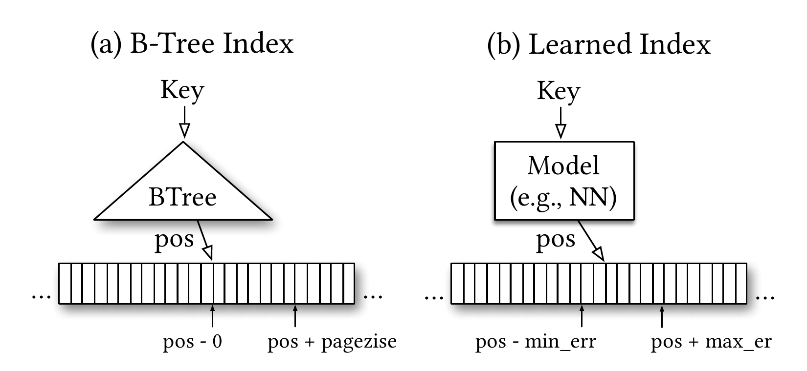
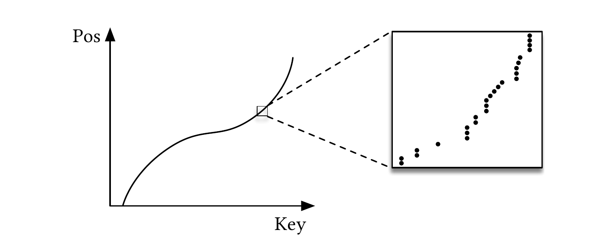
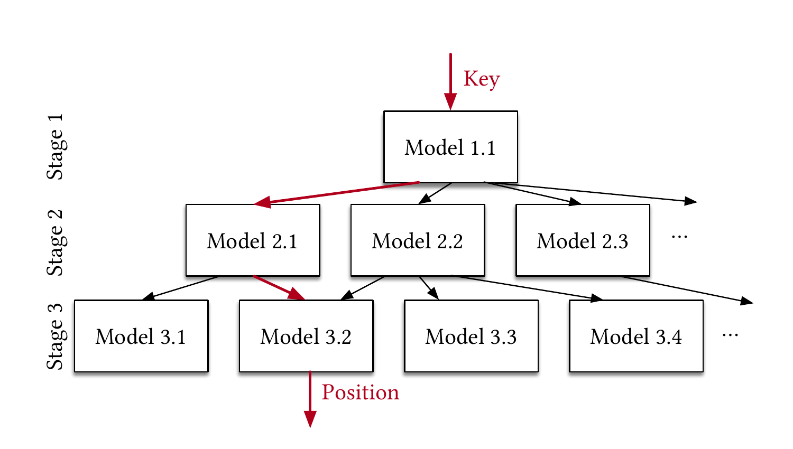
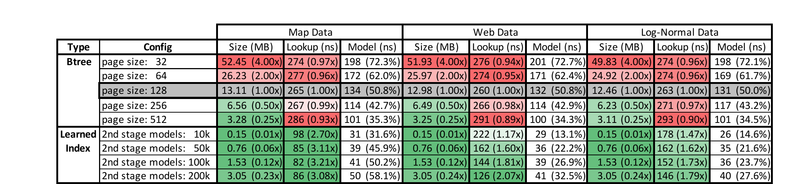
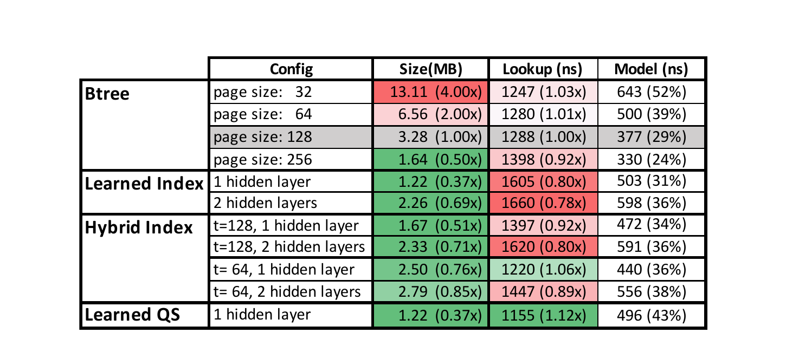
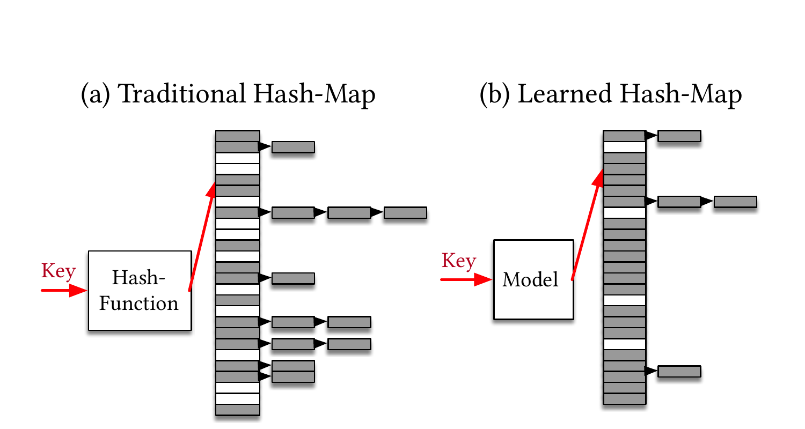
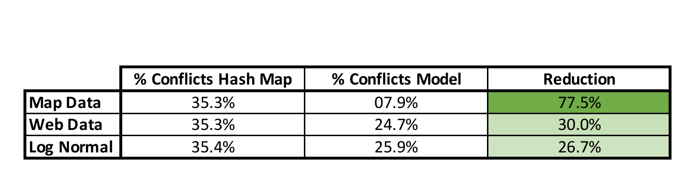
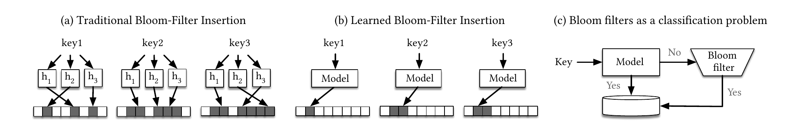
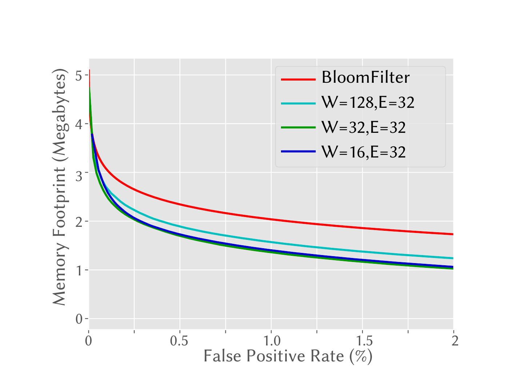
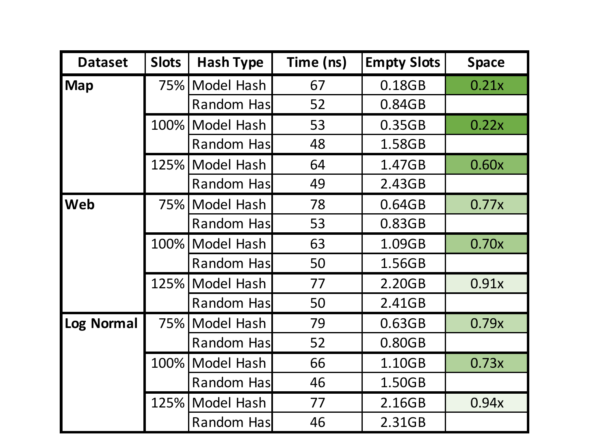

# The Case for Learned Index Structures（中文译文）

## 译者说明

本文依据同目录的 `source.pdf` 翻译。章节、图表、公式、算法、代码与参考文献按原文结构保留。

Tim Kraska¹\*，Alex Beutel²，Ed H. Chi²，Jeffrey Dean²，Neoklis Polyzotis²<br>
¹ MIT，Cambridge, MA；² Google, Inc.，Mountain View, CA<br>
kraska@mit.edu；alexbeutel@google.com；edchi@google.com；jeff@google.com；npolyzotis@google.com

\* 本工作在第一作者任职 Google 期间完成。

## 摘要

索引就是模型：B 树索引可视为把键映射到有序数组中记录位置的模型，哈希索引是把键映射到无序数组中记录位置的模型，位图索引则是判断某条数据记录是否存在的模型。本文是一项探索性研究：从这一前提出发，我们认为所有现有索引结构都可以由其他类型的模型替代，包括我们称为“学习型索引”的深度学习模型。其核心思想是，模型可以学习查找键的排序规律或结构，并用这些信号有效预测记录的位置或存在性。我们从理论上分析学习型索引在何种条件下优于传统索引结构，并说明设计学习型索引结构的主要挑战。初步结果表明，在若干真实数据集上，神经网络的速度最多可比缓存优化的 B 树快 70%，同时节省一个数量级的内存。更重要的是，我们相信，用学习模型替换数据管理系统的核心组件会对未来系统设计产生深远影响，而本文仅展示了这种可能性的一角。

## 1 引言

凡是需要高效访问数据之处，索引结构都是答案；针对不同访问模式已有多种选择。例如，B 树最适合范围请求（如取出某一时间段内的全部记录），哈希表在单键查找上很难被击败，Bloom 过滤器则通常用于检查记录是否存在。由于索引对数据库系统及许多其他应用都极为重要，过去几十年里，人们一直在优化它们的内存、缓存和 CPU 效率 [36, 59, 29, 11]。

但这些索引仍然都是通用数据结构：它们不对数据分布作任何假设，也没有利用真实数据中普遍存在的模式。例如，若要构建一个高度调优的系统，在连续整数键（如 1 到 1 亿）上存储并查询定长记录的范围，就不会使用传统 B 树，因为键本身可以直接作为偏移量，使查找任意键或范围起点从 $O(\log n)$ 变成 $O(1)$，索引内存也从 $O(n)$ 降为 $O(1)$。也许出人意料的是，其他数据模式也能进行类似优化。换言之，准确了解数据分布，几乎可以高度优化任何索引结构。

当然，在大多数真实场景中，数据并不完美服从某个已知模式，为每种用途打造专用方案的工程成本通常也过高。我们主张，机器学习（ML）提供了学习数据模式的机会，从而能以较低工程成本自动合成专用索引结构，即学习型索引。

我们探索学习模型（包括神经网络）能够在多大程度上增强乃至替代从 B 树到 Bloom 过滤器的传统索引结构。这个想法看似反直觉，因为 ML 无法直接提供我们通常与索引联系起来的语义保证，而且最强大的 ML 模型——神经网络——通常被认为计算代价很高。但我们认为，这些表面障碍并不像看起来那样严重；尤其在下一代硬件上，使用学习模型可能带来显著收益。

就语义保证而言，索引本身在很大程度上已经是学习模型，所以用其他 ML 模型替换它们出奇地直接。B 树可以视为输入键并预测其在有序集合中记录位置的模型；Bloom 过滤器则是根据键预测它是否属于集合的二元分类器。当然，二者存在细微但重要的差别，例如 Bloom 过滤器允许假阳性而不允许假阴性。我们将说明，可用新的学习技术和/或简单辅助数据结构处理这些差别。

就性能而言，每个 CPU 已经具备强大的 SIMD 能力，我们推测许多笔记本和手机不久也会拥有 GPU 或 TPU。神经网络只使用受限的并行数学运算，比通用指令集更容易扩展，因此 CPU-SIMD、GPU 和 TPU 很可能持续增强。未来执行神经网络或其他 ML 模型的高成本可能变得可以忽略。例如，Nvidia GPU 和 Google TPU 已能在单周期完成数千乃至数万次神经网络运算 [3]；还有观点认为，到 2025 年 GPU 性能会提升 1000 倍，而 CPU 的摩尔定律实际上已经终结 [5]。用神经网络替换分支密集的索引结构，可使数据库和其他系统受益于这些硬件趋势。尽管我们认为学习型索引的未来在 TPU 等专用硬件上，我们完全聚焦 CPU，并且即便如此也得到了显著收益。

需要强调的是，我们并不主张用学习型索引彻底替代传统索引结构。我们的主要贡献，是勾勒并评估一种构建索引的新方法：它补充既有工作，并可能为一个已有数十年历史的领域开辟全新的研究方向。关键观察是，许多数据结构都可分解为学习模型与提供同等语义保证的辅助结构。描述数据分布的连续函数可用于构建更高效的数据结构或算法，这正是该方法的潜在力量。我们在面向只读分析工作负载的合成与真实数据集上得到了很有希望的结果，但仍有许多开放挑战，例如如何处理写密集工作负载；我们也给出多个未来方向。我们还相信，同一原理能替换（数据库）系统常用的其他组件与操作。如果成功，把学习模型深度嵌入算法和数据结构的核心思想，可能彻底改变当前系统开发方式。

下文首先以 B 树介绍学习型索引的一般思想；第 4 节把它扩展到哈希表，第 5 节扩展到 Bloom 过滤器，各节均有独立评估；第 6 节讨论相关工作，第 7 节总结。



**图 1：为什么 B 树也是模型。**

## 2 范围索引

B 树等范围索引结构本来就是模型：给定键，它们“预测”值在按键排序集合中的位置。以图 1(a) 为例，考虑只读分析型内存数据库在有序主键列上建立的 B 树。B 树把查找键映射到有序记录数组中的一个位置，并保证该位置的记录键是第一个大于等于查找键的键。为支持高效范围请求，数据必须有序。同一概念也适用于二级索引，此时数据是 `<key, record_pointer>` 对的列表，键是被索引值，指针引用记录。[^1]

为提高效率，通常不会索引每条有序记录，而只索引每第 $n$ 条记录，也就是每页的第一个键。此处只考虑连续内存区域（单个数组）上的定长记录和逻辑分页，不考虑位于不同内存区域的物理页；物理页与变长记录见附录 D.2。只索引每页首键能显著减少索引保存的键数，而性能几乎不受影响。因此，B 树是一个模型；用 ML 术语说，它是回归树：把键映射到位置，并带有最小、最大误差（最小误差为 0，最大误差为页大小），保证键若存在便能在该区域找到。只要其他 ML 模型也能给出类似的最小、最大误差强保证，就能用包括神经网络在内的模型替代索引。

乍看之下，其他 ML 模型很难给出相同保证，实际上却很简单。第一，B 树只对已存储的键提供强误差保证，而非对所有可能键。加入新数据时，B 树需要重新平衡——用 ML 术语说就是重新训练——才能维持保证。对于单调模型，只需在每个键上执行模型，记录位置预测的最大高估与低估，即可算出最小、最大误差。[^2] 第二，更重要的是，其实并不需要强误差界。为支持范围查询，数据本来就必须排序；任何误差都可通过预测位置附近的局部搜索（如指数搜索）纠正，因此甚至允许非单调模型。于是，B 树可以由线性回归、神经网络等任意回归模型替换，如图 1(b) 所示。

真正替换前仍有其他技术挑战：B 树的插入与查找成本有界，善于利用缓存，也能把键映射到不连续的内存或磁盘页。这些都是有趣的挑战或研究问题，我们将在各节和附录中讨论可能的解决办法。

另一方面，以其他模型充当索引可带来巨大收益，最重要的是可能把 B 树查找的 $\log n$ 成本变成常数操作。假设数据集有 100 万个唯一键，取值为 100 万到 200 万（所以值 1,000,009 位于位置 10）。仅含一次乘法和一次加法的线性模型即可完美预测点查或范围扫描中任意键的位置，而 B 树需要 $\log n$ 次操作。机器学习、尤其神经网络的美妙之处，在于能学习多种数据分布、混合分布以及其他数据特性和模式；挑战则是平衡模型复杂度与精度。

在本文的大多数讨论中，我们沿用简化假设：只索引按键排序的内存稠密数组。虽然看似限制严格，FAST [44] 等现代硬件优化 B 树也采用相同假设，而且由于优于扫描和二分查找 [44, 48]，这类索引在内存数据库中很常见。某些技术可很好地迁移到其他场景，例如使用很大块的磁盘驻留数据（Bigtable [23]）；细粒度分页、插入密集工作负载等场景则需要更多研究。附录 D.2 进一步讨论这些挑战和方案。

### 2.1 我们能承受多复杂的模型？

为了理解可接受的模型复杂度，需要知道遍历 B 树所需的同一时间内能执行多少运算，以及模型达到何种精度才比 B 树更高效。

考虑一棵索引 1 亿条记录、页大小为 100 的 B 树。每个节点都在划分空间、减小“误差”并缩小数据所在区域，因此每个节点带来 $1/100$ 的精度增益，总共需遍历 $\log _ {100}N$ 个节点：第一层把 1 亿缩到 100 万，第二层把 100 万缩到 1 万，依此类推，直至找到记录。用二分搜索遍历单个 B 树页约需 50 个周期，而且很难并行化。[^3] 相比之下，现代 CPU 每周期可完成 8–16 次 SIMD 运算。因此，只要模型每 $50\times8=400$ 次算术运算取得的精度增益优于 $1/100$，就会更快。该估算还假定所有 B 树页都在缓存中；一次缓存未命中另需 50–100 个周期，因而允许更复杂的模型。

机器学习加速器则彻底改变了局面：它们可在同样时间内运行复杂得多的模型，并把计算从 CPU 卸载。例如 NVIDIA Tesla V100 可达到 120 TFLOPS 的低精度深度学习算力，约合每周期 60,000 次操作。若整个学习型索引能装入 GPU 内存（第 3.7 节表明这是合理假设），仅 30 个周期就可执行 100 万次神经网络运算。输入传输和结果取回的延迟仍高，但可通过批处理以及 CPU/GPU/TPU 日益紧密的集成缓解 [4]。GPU/TPU 的浮点和整数算力预计会继续增长，而 CPU 执行条件分支的性能进步已近停滞 [5]。尽管 GPU/TPU 是我们认为实际采用学习型索引的主要动力之一，为排除硬件变化影响，我们仍聚焦较受限的 CPU。



**图 2：索引即 CDF。**

### 2.2 范围索引模型就是 CDF 模型

索引输入一个键并预测记录位置。点查询不关心记录顺序，而范围查询要求数据按查找键排序，以便高效取出一个范围内的全部项。这导出一个有趣观察：给定键、预测其在有序数组中位置的模型，实际上是在逼近累积分布函数（CDF）。可用数据的 CDF 预测位置：

$$
p=F(\mathrm{Key})\times N. \tag{1}
$$

其中 $p$ 是位置估计， $F(\mathrm{Key})$ 是数据的估计累积分布函数，即观测到小于等于查找键的键的概率 $P(X\leq\mathrm{Key})$； $N$ 是键总数，见图 2。

这一观察开启了多条方向。第一，索引从字面上说就是学习数据分布；B 树通过构建回归树“学习”分布，线性回归则通过最小化线性函数的平方误差学习分布。第二，估计数据分布是研究已久的问题，学习型索引可以利用数十年成果。第三，学习 CDF 也在优化其他索引结构和潜在算法时扮演关键角色。第四，理论 CDF 与经验 CDF 的逼近程度有长期研究积累，可作为理解本方法理论收益的基础 [28]。附录 A 给出高层次的扩展性分析。

### 2.3 第一个朴素学习型索引

为理解用学习模型替代 B 树的要求，我们用 TensorFlow [9] 在 2 亿条 Web 服务器日志上，以时间戳建立二级索引。模型是两层全连接网络，每层 32 个 ReLU 神经元；时间戳为特征，有序数组位置为标签。随后用 TensorFlow、以 Python 为前端，测量随机键的平均查找时间（多次运行并舍弃最初若干次）。

该设置每秒约完成 1,250 次预测，即仅执行 TensorFlow 模型、尚不计从预测位置找到真实记录的搜索时间，就约需 80,000ns。相比之下，同一数据上的 B 树遍历约需 300ns，整个数据上的二分搜索约需 900ns。仔细分析可见，朴素方法有三项主要限制：

1. TensorFlow 面向高效运行大模型，而非小模型；尤其以 Python 为前端时，调用开销显著。
2. B 树或一般决策树只用少量操作递归划分空间，很擅长过拟合数据。其他模型可以更高效地逼近 CDF 的总体形状，却难以精确到单条数据。图 2 从宏观看很平滑规整，放大到记录粒度则出现越来越多的不规则性，这是熟知的统计现象。神经网络、多项式回归等也许能以更少 CPU 和空间，把位置从全数据集缩小到数千条的区域，但单个网络要完成“最后一英里”、把误差从数千进一步降至数百，通常需要明显更多空间和 CPU 时间。
3. B 树极其节省缓存与操作：顶部节点常驻缓存，只按需访问其他页。标准神经网络却需要全部权重来计算预测，乘法次数代价很高。

## 3 RM-Index

为克服上述挑战并探索以模型替代或优化索引的潜力，我们开发了学习型索引框架（LIF）、递归模型索引（RMI）和基于标准误差的搜索策略。我们主要使用简单全连接神经网络，因为它们简单而灵活；其他模型也可能带来额外收益。

### 3.1 学习型索引框架（LIF）

LIF 可视为索引合成系统：给定索引规格，自动生成、优化并测试不同配置。LIF 可即时学习线性回归等简单模型，复杂模型（如神经网络）则依赖 TensorFlow；但推理阶段从不使用 TensorFlow。它从训练好的 TensorFlow 模型抽取全部权重，并按模型规格生成高效 C++ 索引结构。代码生成专为小模型设计，去除了 TensorFlow 管理大模型所需的不必要开销与监测逻辑，并借鉴 [25] 避免 Spark 运行时开销的思想。因此，简单模型可在约 30ns 内执行。

不过，LIF 仍是实验框架，为快速评估不同模型、页大小、搜索策略等配置而加入了计数器、虚函数调用等额外开销。除编译器自动向量化外，我们也没有使用专门的 SIMD 内建函数。在框架内进行公平比较时这些低效并不影响结论，但用于生产或与其他实现的报告数字比较时应予以考虑并消除。



**图 3：分阶段模型。**

### 3.2 递归模型索引

第 2.3 节指出，替代 B 树的学习模型面临“最后一英里”精度挑战：用单一模型把 1 亿条记录的预测误差降到数百通常很困难；但把误差从 1 亿降到 1 万，也就是获得 $100\times100=10,000$ 倍精度、替代 B 树前两层，就算用简单模型也容易得多。类似地，把误差从 1 万降到 100 也更简单，因为模型只需关注数据子集。

受专家混合模型 [62] 启发，我们据此提出递归回归模型（图 3）：建立模型层次，每阶段模型输入键并选择下一阶段模型，直到最后阶段预测位置。形式化地，对模型 $f(x)$， $x$ 为键， $y\in[0,N)$ 为位置，假设第 $\ell$ 阶段有 $M _ \ell$ 个模型。先训练第 0 阶段 $f_0(x)\approx y$；第 $\ell$ 阶段第 $k$ 个模型记为 $f _ \ell^{(k)}$，损失为：

$$
L _ \ell=\sum _ {(x,y)}\left(f _ \ell^{\left(\left\lfloor M _ \ell f _ {\ell-1}(x)/N\right\rfloor\right)}(x)-y\right)^2,
\qquad
L_0=\sum _ {(x,y)}(f_0(x)-y)^2.
$$

这里的 $f _ {\ell-1}(x)$ 表示递归执行前一阶段。逐阶段以 $L _ \ell$ 训练即可构建完整模型。每个模型对键的位置作出带误差的预测，该预测选择负责相应键空间区域的下一个模型，使后者作出误差更小的预测。但 RMI 不必是树：同一阶段的不同模型可以选择下一阶段的同一模型；每个模型覆盖的记录数也不必像 B 树页那样相同。[^4] 依所用模型而定，阶段间输出甚至不一定应解释为位置估计，更适合解释为选择对某些键更了解的专家 [62]。

该架构有四项收益：（1）模型大小和复杂度与执行成本分离；（2）利用总体分布形状易学这一事实；（3）像 B 树一样把空间划为较小子范围，以更少操作取得最后一英里精度；（4）阶段之间不需要搜索，模型 1.1 的输出可直接选取下一阶段模型。这既减少了管理结构的指令，也允许把整个索引表示为适合 TPU/GPU 的稀疏矩阵乘法。

### 3.3 混合索引

RMI 的另一项优势是可以混合模型。顶层可能以小型 ReLU 网络最合适，因为它能学习复杂分布；底层则可使用数千个空间和执行成本都低的线性回归模型。若某段数据尤其难学，底层甚至可以使用传统 B 树。

我们关注两类模型：具有 0–2 个全连接隐藏层、ReLU 激活且每层最多 32 个神经元的简单神经网络，以及 B 树（即决策树）。零隐藏层网络等价于线性回归。给定以数组指定阶段数和每阶段模型数的索引配置，混合索引的端到端训练如下。

**输入：** `int threshold`、`int stages[]`、NN 复杂度<br>
**数据：** `record data[]`、`Model index[][]`<br>
**结果：** 训练好的 `index`

```text
1  M = stages.size
2  tmp_records[][]
3  tmp_records[1][1] = all_data
4  for i ← 1 to M do
5      for j ← 1 to stages[i] do
6          index[i][j] = 在 tmp_records[i][j] 上训练的新 NN
7          if i < M then
8              for r ∈ tmp_records[i][j] do
9                  p = index[i][j](r.key) / stages[i + 1]
10                 tmp_records[i + 1][p].add(r)
11 for j ← 1 to index[M].size do
12     index[M][j].calc_err(tmp_records[M][j])
13     if index[M][j].max_abs_err > threshold then
14         index[M][j] = 在 tmp_records[M][j] 上训练的新 B-Tree
15 return index
```

**算法 1：混合索引端到端训练。**

算法从全数据集（第 3 行）训练顶层模型，再按其预测选择下一阶段模型（第 9–10 行），把落入该模型的所有键加入相应集合。对混合索引，最后还会把绝对最小/最大误差超过阈值的神经网络替换为 B 树（第 11–14 行）。

我们为最后阶段的每个模型保存标准误差以及最小、最大误差，因此能按每个键实际使用的模型单独限制搜索空间。目前通过简单网格搜索调整阶段数、每模型隐藏层数等参数；从 ML 自动调优到采样，都可进一步加速训练。混合索引还能把最坏性能限制在 B 树水平：遇到极难学习的分布时，所有模型都会自动换成 B 树，索引实际上就退化为一棵完整 B 树。

### 3.4 搜索策略与单调性

范围索引通常实现 `upper_bound(key)` / `lower_bound(key)` 接口，找出有序数组中第一个大于等于 / 小于等于查找键的位置。学习型范围索引同样要从预测出发找到这个边界。多项研究反复指出 [8]，对于小负载记录，二分搜索或扫描通常最快，因为替代技术的复杂度很少能抵偿收益。但学习型索引有一项优势：模型预测的是键的位置，而不只是它所在的页。我们讨论两种利用这一信息的策略：

- **模型偏置搜索：** 默认策略，仅把传统二分搜索的第一个中点设为模型预测值。
- **偏置四分搜索：** 每轮使用三个分点，希望硬件一次预取三处数据，在数据不在缓存时取得更好性能。初始三个中点设为 $pos-\sigma$、 $pos$、 $pos+\sigma$，即先假设大多数预测准确，把注意力集中在位置估计附近，之后继续传统四分搜索。

所有实验都使用最小、最大误差定义搜索区域：在每个键上执行 RMI，并按末级模型保存最大高估与低估。这保证能找到全部已存在的键，但若 RMI 非单调，对不存在的键可能返回错误的上下界。一个办法是像 [41, 71] 所研究的那样强制 RMI 单调。另一办法是自动调整非单调模型的搜索区域：若找到的上（下）界键位于误差定义的搜索边界，就逐步扩大区域；还可使用指数搜索。若误差服从正态分布，指数搜索平均表现应与其他策略相当，且无须存储最小、最大误差。

### 3.5 字符串索引

前文主要索引实数键，但许多数据库依赖字符串索引，而机器学习界已有大量字符串建模研究。我们同样需要设计既高效又有表达力的字符串模型，这带来独特挑战。

首要问题是如何把字符串转换为模型特征，即分词。为简单高效，把长度为 $n$ 的字符串视为特征向量 $\mathbf{x}\in\mathbb{R}^n$，其中 $x_i$ 是 ASCII 十进制值（或依字符串使用 Unicode 十进制值）。多数 ML 模型在输入等长时更高效，因此设最大输入长度为 $N$。由于数据按字典序排序，先把键截断为 $N$ 再分词；若字符串长度 $n\lt{}N$，则对 $i\gt{}n$ 令 $x_i=0$。

建模方式仍是小型前馈网络的层次结构，只是输入从一个实数 $x$ 变为向量 $\mathbf{x}$。线性模型 $\mathbf{w}\cdot\mathbf{x}+b$ 的乘加次数随 $N$ 线性增长；即使只有一层、宽度为 $h$ 的前馈网络，也需要 $O(hN)$ 次乘加。字符串学习型索引还有大量优化空间，例如采用 NLP 中把字符串分成更有用片段的分词方法（如机器翻译中的 wordpiece [70]）、把后缀树思想与学习型索引结合，或探索循环、卷积网络等复杂架构。



**图 4：学习型索引与 B 树。**

### 3.6 训练

训练（即装载）时间不是我们的重点，但无论浅层神经网络还是简单线性/多元回归，训练都相对很快。简单网络可用随机梯度下降高效训练，在随机化数据上少于一次到数次遍历便可收敛；线性多元模型（包括零层网络）有闭式解，可单次扫描有序数据完成训练。对 2 亿条记录，简单 RMI 的训练只需数秒左右，具体取决于自动调优量；神经网络则依复杂度每个模型约需数分钟。通常也不必让顶层模型遍历全部数据，因为它往往在对全部随机数据扫描一次之前便已收敛。原因之一是模型简单，而且索引性能对精度末几位并不敏感。ML 社区改善学习时间的研究 [27, 72] 同样适用于此，预计该方向会有大量后续工作。

### 3.7 结果

我们在多个真实与合成数据集上，从空间和速度两方面，将学习型范围索引与其他读优化索引结构比较。

#### 3.7.1 整数数据集

第一项实验比较两阶段 RMI（第二阶段分别有 10k、50k、100k、200k 个模型）与多种页大小的读优化 B 树，数据为两个真实数据集和一个合成数据集：（1）Weblogs，（2）Maps [56]，（3）Lognormal。Weblogs 含某大型大学网站多年间每次请求的 2 亿条日志，以唯一请求时间戳为索引键。课程安排、周末、节假日、午休、院系活动和学期间歇形成复杂时间模式，因而几乎是学习型索引的最坏情况。Maps 索引全球约 2 亿个用户维护地物（道路、博物馆、咖啡店等）的经度；位置经度较为线性，异常少于 Weblogs。为测试重尾分布，又从 $\mu=0$、 $\sigma=2$ 的对数正态分布采样 1.9 亿个唯一值，缩放为最大 10 亿的整数；其 CDF 高度非线性，神经网络更难学习。所有 B 树实验使用 64 位键和 64 位负载/值。

基线是一份生产质量 B 树实现，与 `stx::btree` 相似，但进一步做了缓存行优化、使用 100% 填充的稠密页，性能很有竞争力。两阶段学习型索引用网格搜索调优 0–2 个隐藏层、每层 4–32 个节点的神经网络。总体而言，第一阶段以简单（零隐藏层）到中等复杂（两层、宽 8 或 16）的模型最佳；第二阶段则以简单线性模型最佳，因为最后一英里通常不值得执行复杂模型，而线性模型能最优学习。

**学习型索引与 B 树。** 主要结果见图 4。B 树页大小表示每页键数而不是字节数；指标包括 MB 大小、总查找时间（ns），以及模型执行时间（B 树遍历或 ML 模型，以 ns 和总时间百分比表示）。大小与查找列括号中给出相对页大小 128 的 B 树的加速和空间节省；选择它作为固定参照，是因为它的 B 树查找性能最佳。颜色表示相对参照更快/更慢或更小/更大。

几乎所有配置中，学习型索引都占优：快 1.5–3 倍，体积最多小两个数量级。B 树当然可用压缩换取解压 CPU 时间，但多数优化彼此正交，也同样甚至更适用于神经网络。例如可用 4/8 位整数而非 32/64 位浮点数表示参数，即量化，从而进一步获益。第二阶段大小显著影响索引体积和查找性能。第二阶段使用 10,000 个或更多模型尤其印证第 2.1 节：第一阶段模型取得的精度跃迁远大于 B 树单节点。我们未报告这些数据集上的混合模型和二分搜索以外策略，因为收益不显著。

**学习型索引与替代基线。** 除详细比较读优化 B 树外，我们还在公平条件下比较第三方实现等基线：

- **直方图：** B 树逼近底层分布的 CDF，直方图原则上也可充当 CDF 模型；但要快速访问，直方图必须低误差，通常需要大量桶，使搜索直方图本身代价很高。为处理倾斜而使用不同桶边界时尤甚。解决这些问题最终会得到一棵 B 树，因此不再讨论。
- **查找表：** 固定大小、固定结构的层次查找表（如每层 64 槽）可用 AVX 高度优化。实验使用三阶段表：每取第 64 个键放入带填充的数组，使其长度为 64 的倍数，再对该数组重复一次但不填充，总计两个数组。查找时对顶层二分搜索，再用 AVX 优化的无分支扫描 [14] 搜索第二层和数据本身；该配置优于扫描顶层或对第二层、数据二分搜索等变体。
- **FAST：** FAST [44] 是高度 SIMD 优化的数据结构，比较采用 [47] 的代码。为使用无分支 SIMD，它必须按 2 的幂分配内存，索引可能明显更大。
- **定高 B 树与插值搜索：** 依 [1] 构造固定高度、采用插值搜索的 B 树，使总大小为 1.5MB，与学习模型相近。
- **去除框架开销的学习型索引：** 使用两阶段 RMI，顶层为多元线性回归，底层为简单线性模型。顶层自动创建并选择 `key`、 $\log(key)$、 $key^2$ 等特征。多元线性回归只用少数操作就能拟合非线性模式，是神经网络之外的有趣选择。为公平比较，该实现位于基准框架之外。


**图 5：替代基线。**

比较使用对数正态数据和 8 字节指针负载，结果见图 5。在公平条件下，学习型索引总体性能最好，并显著节省内存；FAST 体积大源于对齐要求。不过，我们绝不声称学习型索引在大小或速度上总是最佳。它提供的是思考索引的新方式，其完整影响仍需大量研究。

#### 3.7.2 字符串数据集

为测试字符串，我们在 Google 真实产品所用的大型 Web 索引中，对 1,000 万个不连续文档 ID 建立二级索引。结果见图 6，其中加入了混合模型。最佳模型 `Learned QS` 是采用四分搜索的非混合 RMI。所有 RMI 第二阶段均有 10,000 个模型；混合索引以 128 和 64 为绝对误差上限，超过时把模型替换为 B 树。



**图 6：字符串数据——学习型索引与 B 树。**

字符串上的加速不如整数明显，部分原因是模型执行成本较高，而 GPU/TPU 可消除这一问题。字符串搜索本身也更昂贵，所以更高精度往往值得；混合索引用 B 树替换表现差的模型，因而有帮助。由于搜索成本高，不同策略差异也更大：一隐藏层网络配偏置二分搜索需 1102ns，同一模型配偏置四分搜索只需 658ns。二者表现更好，是因为利用了模型误差。

## 4 点索引

除范围索引外，用于点查的哈希表在 DBMS 中同样重要。概念上，哈希表用哈希函数把键确定性映射到数组位置（图 7(a)）。任何高效实现的关键，都是防止过多不同键映射到同一位置，即冲突。假设有 1 亿条记录和 1 亿槽位；若哈希函数把键均匀随机化，期望冲突数可按生日悖论类似地推导，约为 33%，即 3,300 万槽。架构必须处理每个冲突，例如分离链接法会建立链表。其他方案还有二次探测、多槽桶、同时使用多个哈希函数（如 Cuckoo Hashing [57]）。

无论采用何种架构，冲突都会显著影响性能和/或存储需求，机器学习模型可能提供减少冲突的另一方案。学习模型作为哈希函数并非新思想，但既有技术没有利用底层数据分布。各种完美哈希 [26] 也试图避免冲突，可其哈希函数中所用数据结构随数据规模增长；学习模型未必如此（回忆索引 1 到 1 亿全部键的例子）。据我们所知，尚无人探索学习模型能否得到更高效的点索引。



**图 7：传统哈希表与学习型哈希表。**

### 4.1 哈希模型索引

出人意料的是，学习键分布的 CDF 正是学习更好哈希函数的一种方式。与范围索引不同，我们不要求记录紧凑或严格有序；把 CDF 按目标哈希表大小 $M$ 缩放，即以

$$
h(K)=F(K)\times M
$$

作为键 $K$ 的哈希函数。若 $F$ 完美学习键的经验 CDF，就不会发生冲突。该函数与具体哈希表架构正交，可同分离链接法或任何其他类型结合。模型仍可采用上一节的递归架构，索引大小与性能之间同样存在由模型和数据集决定的权衡。

插入、查找和冲突的处理取决于哈希表架构。因此，相较把键映射到均匀分布空间的传统哈希，学习型哈希的收益取决于两点：（1）模型表示观测 CDF 的精度。若数据由均匀分布生成，线性模型能学到总体分布，但不会优于足够随机的哈希函数。（2）哈希表架构。架构、实现细节、负载/值、冲突解决策略以及可多分配多少槽位都会显著影响性能。小键和小值或无值时，传统哈希函数加 Cuckoo hashing 很可能很好；负载较大或分布式哈希表则可能更受益于避免冲突，从而更适合学习型哈希。

### 4.2 结果

我们在上一节三个整数数据集上评估冲突率。模型哈希采用两阶段 RMI、第二阶段 100k 个模型且无隐藏层；基线是类似 MurmurHash3 的简单函数，比较槽位数与记录数相同的表。图 8 显示，学习经验 CDF 可把冲突最多减少 77%，而模型执行代价合理，与图 4 相同，约 25–40ns。



**图 8：冲突减少比例。**

考虑模型执行时间后，减少冲突是否划算，取决于哈希表架构、负载等因素。附录 B 的实验表明，对于 20 字节记录的分离链接哈希表，学习型哈希可减少最多 80% 的浪费空间，延迟仅比随机哈希增加 13ns。增加量不是 40ns，是因为冲突减少往往也减少缓存未命中。很小的负载下，标准哈希加 Cuckoo hashing 可能仍是最佳；但附录 C 表明，负载较大时，学习型哈希加链接法可快于 Cuckoo hashing 和/或传统随机哈希。

潜力最大的场景是分布式系统。例如 NAM-DB [74] 通过哈希函数定位远程机器上的数据，再用 RDMA 读取；每次冲突都要多发一次微秒级 RDMA 请求，因此模型时间可忽略，冲突率即使略降也会显著改善总体性能。总之，学习型哈希函数独立于哈希表架构，其复杂度是否值得由具体架构决定。

## 5 存在性索引

DBMS 中最后一类常见索引是存在性索引，最重要的例子是 Bloom 过滤器：一种空间高效的概率数据结构，用来检验元素是否属于集合，常用于判断键是否存在于冷存储。例如 Bigtable 用它判断某键是否包含在 SSTable 中 [23]。

Bloom 过滤器内部使用大小为 $m$ 的位数组和 $k$ 个哈希函数，每个函数把键映射到 $m$ 个位置之一（图 9(a)）。加入元素时，对键执行 $k$ 个函数并把所得位置设为 1；查询时再次得到 $k$ 个位置，只要任一位为 0，该键便不属于集合。因此 Bloom 过滤器保证没有假阴性，但可能有假阳性。

Bloom 过滤器虽极省空间，仍会占用可观内存：10 亿条记录约需 1.76GB；若要求 0.01% 的假阳性率（FPR），约需 2.23GB。已有多项工作尝试改进 [52]，但总体观察不变。若集合内外之间存在可学习结构，则可能构造更高效的表示。数据库中的存在性索引与前文的延迟、空间权衡不同：访问磁盘甚至磁带等冷存储延迟很高，因而可承受更复杂的模型；首要目标是减少索引空间和假阳性。下面给出两种学习型存在性索引。

### 5.1 学习型 Bloom 过滤器

范围与点索引学习键分布，而存在性索引要学习把键与其他一切分开的函数。换言之，点索引的好哈希函数应尽量减少键之间的冲突；Bloom 过滤器的好哈希函数则应让键之间、非键之间冲突很多，却让键与非键之间冲突很少。下面说明如何学习这样的 $f$ 并将其纳入存在性索引。

传统 Bloom 过滤器对事先选定的任意查询集保证零假阴性率（FNR）和特定 FPR [22]；我们则希望对特别是现实查询提供特定 FPR，同时维持零 FNR。也就是说，像评估 ML 系统一样，在留出的查询集上测量 FPR [30]。两种定义不同，但在许多应用、尤其数据库中，可从历史日志观察查询分布的假设是合理的。[^5]

传统存在性索引不利用键分布以及键与非键的差异，学习型 Bloom 过滤器可以。例如，若数据库恰含所有满足 $0\le x\lt{}n$ 的整数，只需计算 $f(x)\equiv\mathbf{1}[0\le x\lt{}n]$，便能以常数时间和近乎零内存判断存在性。

用于 ML 时还需考虑非键数据集。我们假定非键来自可观测的历史查询，未来查询与历史查询同分布。若假设不成立，可采用随机生成的键、由 ML 模型生成的非键 [34]、直接处理协变量偏移的重要性加权 [18]，或用于稳健性的对抗训练 [65]；这些留作未来工作。以 $\mathcal K$ 表示键集合，以 $\mathcal U$ 表示非键集合。



**图 9：Bloom 过滤器架构。**

#### 5.1.1 把 Bloom 过滤器视为分类问题

可把存在性索引表述为二元概率分类任务：学习模型 $f$，预测查询 $x$ 是键还是非键。对字符串，可训练 RNN 或 CNN [64, 37]，数据集为

$$
\mathcal D=\lbrace{}(x_i,y_i=1)\mid x_i\in\mathcal K\rbrace{}\cup
\lbrace{}(x_i,y_i=0)\mid x_i\in\mathcal U\rbrace{}.
$$

作为二元分类器，网络用 sigmoid 输出概率，并训练以最小化对数损失：

$$
L=\sum _ {(x,y)\in\mathcal D}y\log f(x)+(1-y)\log(1-f(x)).
$$

 $f(x)$ 可解释为 $x$ 是数据库键的概率。选择阈值 $\tau$，若输出高于阈值便认为键存在。模型与 Bloom 过滤器不同，很可能同时有非零 FPR 和 FNR，而且降低 FPR 会提高 FNR。为保持存在性索引无假阴性的约束，建立溢出 Bloom 过滤器：

$$
\mathcal K^- _ \tau=\lbrace{}x\in\mathcal K\mid f(x)\lt{}\tau\rbrace{}
$$

是 $f$ 的假阴性键集合，为其建立一个 Bloom 过滤器。查询流程如图 9(c)：若 $f(x)\ge\tau$，认为键存在；否则检查溢出过滤器。

为使整体达到目标 FPR $p^{\ast}$，在留出的非键集合 $\widetilde{\mathcal U}$ 上定义模型 FPR：

$$
\mathrm{FPR} _ \tau=\frac{\sum _ {x\in\widetilde{\mathcal U}}\mathbf 1(f(x)\gt{}\tau)}{|\widetilde{\mathcal U}|}.
$$

令溢出 Bloom 过滤器的假阳性率为 $\mathrm{FPR} _ B$，则整体为 [53]：[^6]

$$
\mathrm{FPR} _ O=\mathrm{FPR} _ \tau+(1-\mathrm{FPR} _ \tau)\mathrm{FPR} _ B.
$$

为简单起见，取 $\mathrm{FPR} _ \tau=\mathrm{FPR} _ B=p^{\ast}/2$，于是 $\mathrm{FPR} _ O\le p^{\ast}$，并在 $\widetilde{\mathcal U}$ 上调节 $\tau$。学习模型相对数据可很小；Bloom 过滤器大小随键集合大小增长，因此溢出过滤器会随 FNR 缩放。实验将表明该组合可减小存在性索引内存。此外，模型计算能受益于 ML 加速器，而传统 Bloom 过滤器高度依赖内存随机访问延迟。

#### 5.1.2 采用模型哈希的 Bloom 过滤器

另一方案是学习哈希函数，最大化键内部与非键内部冲突，同时最小化键与非键冲突。仍可使用上述概率分类模型：把 $f$ 的输出缩放并映射到大小为 $m$ 的位数组，形成

$$
d=\lfloor f(x)\times m\rfloor.
$$

像普通 Bloom 过滤器一样把 $d$ 用作哈希函数。训练后的 $f$ 会把大多数键映射到位数组高端、非键映射到低端（图 9(b)）。附录 E 详述此方法。

### 5.2 结果

实验应用是记录钓鱼 URL 黑名单。键集合取自 Google 透明度报告，共 170 万个唯一 URL；负集合混合随机有效 URL 与可能被误判为钓鱼页面的白名单 URL，并随机划分为训练、验证和测试集。训练字符级 RNN（具体为 GRU [24]）判断 URL 属于哪个集合，在验证集上设置 $\tau$，并报告测试集 FPR。

目标 FPR 为 1% 的普通 Bloom 过滤器需 2.04MB。模型为 16 维 GRU，每个字符有 32 维嵌入，模型大小 0.0259MB。构建可比较的学习型索引时，在验证集把 $\tau$ 设到 0.5% FPR，此时 FNR 为 55%；测试集 FPR 为 0.4976%，验证了阈值选择。溢出 Bloom 过滤器大小随 FNR 缩放，模型与它合计 1.31MB，节省 36%。若要求整体 FPR 为 0.1%，FNR 为 76%，总大小从 3.06MB 降至 2.59MB，节省 15%。图 10 展示一般关系，也可看到不同大小模型对精度与内存的权衡不同。



**图 10：学习型 Bloom 过滤器在广泛 FPR 范围内改善内存占用。 $W$ 为 RNN 宽度， $E$ 为每字符嵌入大小。**

若查询分布存在模型未处理的协变量偏移，只用随机 URL 作为验证和测试集时，相对 FPR 为 1% 的 Bloom 过滤器可节省 60%；只用白名单 URL 时可节省 21%。负集合的选择取决于应用，协变量偏移也可更直接地处理；这些实验旨在展示方法如何适应不同情况。

模型越准确，Bloom 过滤器节省越多。模型无须使用与 Bloom 过滤器相同的特征，例如已有大量研究用 ML 预测网页是否为钓鱼页 [10, 15]；加入 WHOIS 数据或 IP 信息可提高精度、减小过滤器，同时仍保持零假阴性。第 5.1.2 节方法的更多结果见附录 E。

## 6 相关工作

学习型索引建立在机器学习与索引技术的广泛研究之上，下面概述最重要的相关领域。

**B 树及其变体。** 几十年来提出了多种索引 [36]，如磁盘系统的 B+ 树 [17]，内存系统的 T 树 [46]、平衡树/红黑树 [16, 20]。早期内存树缓存行为差，于是出现 CSB+ 树等缓存感知变体 [58]，以及利用 SIMD 的 FAST [44] 和 GPU 方案 [44, 61, 43]。许多内存索引还以偏移代替节点指针，减少存储。文本索引则包括 trie/radix tree [19, 45, 31]，以及结合 B 树与 trie 的结构 [48]。这些方法都没有学习数据分布来压缩表示或提升性能，因而与学习型索引正交；也可像混合索引一样，把硬件感知策略与模型更紧密结合。

B+ 树占用大量内存，故还有前后缀截断、字典压缩、键规范化 [36, 33, 55] 以及冷热混合索引 [75]。我们提供了根本不同的压缩方式：依分布可把索引缩小数个数量级并加快查找，甚至可能改变空间复杂度（如从 $O(n)$ 到 $O(1)$）。某些既有压缩也可互补，例如字典压缩可视为一种嵌入，即以唯一整数表示字符串。

与我们的工作最接近的是 A-Tree [32]、BF-Tree [13] 和 B 树页内插值搜索 [35]。BF-Tree 用 B+ 树保存数据区域信息，但叶节点为 Bloom 过滤器，并不逼近 CDF；A-Tree 用分段线性函数减少 B 树叶节点；[35] 在 B 树页内采用插值搜索。学习型索引更进一步，提出用学习模型替换整个索引结构。Hippo [73]、块范围索引 [63] 和小型物化聚合（SMA）[54] 等稀疏索引也保存值域信息，但同样没有利用底层数据分布属性。

**为 ANN 索引学习哈希函数。** 学习哈希函数已有大量研究 [49, 68, 67, 59]，尤其是为近似最近邻（ANN）索引学习局部敏感哈希。文献 [66, 68, 40] 探索神经网络哈希，[69] 甚至尝试保持多维输入空间的顺序。但 LSH 的一般目标，是把相似项放入同一桶以支持最近邻查询，通常在高维空间用汉明距离的变体学习近似相似度。既有方法无法直接适配本文的基础数据结构，也不清楚能否改造。

**完美哈希。** 完美哈希 [26] 与模型哈希表密切相关，二者都试图避免冲突。但据我们所知，既有方案没有考虑学习技术，函数大小也随数据规模增长；学习型哈希可以与规模无关。例如，用线性模型映射 0 到 2 亿之间每隔一个的整数，不会冲突，模型大小也不随数据增长。完美哈希还不能用于 B 树或 Bloom 过滤器。

**Bloom 过滤器。** 我们的存在性索引直接建立在 Bloom 过滤器研究 [29, 11] 上，但视角不同：用分类模型增强 Bloom 过滤器，或把模型用作特殊哈希函数，其优化目标也不同于哈希表的哈希模型。

**简洁数据结构。** 学习型索引与简洁数据结构、特别是 wavelet tree 等 rank-select 字典 [39, 38] 存在有趣联系。许多简洁结构关注 $H_0$ 熵，即编码索引中每个元素所需位数；学习型索引则学习底层分布来预测元素位置。因此，学习型索引可能以较慢操作为代价，达到高于 $H_0$ 熵的压缩率。简洁结构通常需为每种用途精心构造，而学习型索引通过 ML 将过程“自动化”；反过来，简洁结构也可提供进一步研究学习型索引的框架。

**CDF 建模。** 范围、点索引模型都与 CDF 模型紧密相关。估计 CDF 并不简单，ML 社区已有研究 [50]，也用于排序等任务 [42]；怎样最有效地建模仍是开放问题。

**专家混合。** RMI 沿袭了为数据子集建立专家的长期研究 [51]，在神经网络发展后更常见并显示出更大价值 [62]。在本场景中，它恰好能解耦模型大小与计算量，使模型更复杂却不增加单次执行成本。

## 7 结论与未来工作

我们表明，利用被索引数据的分布，学习型索引可带来显著收益，也由此开启许多有趣问题。

**其他 ML 模型。** 我们聚焦线性模型以及采用专家混合的神经网络，仍有许多其他模型类型及其与传统数据结构的组合值得探索。

**多维索引。** 也许最令人兴奋的方向是扩展到多维索引。模型、尤其神经网络，极擅长捕捉复杂高维关系；理想情况下，模型应能估计按任意属性组合过滤后全部记录的位置。

**超越索引：学习型算法。** CDF 模型不只可加速索引，还可能加速排序和连接。例如，可用已有 CDF 模型 $F$ 先把记录放到近似有序的位置，再用插入排序等算法修正几乎已完全有序的数据。

**GPU/TPU。** GPU/TPU 会进一步提高学习型索引的价值，但也有高调用延迟等挑战。凭借前述压缩率，几乎所有学习型索引都应能装入 GPU/TPU；然而调用任一操作仍需 2–3 微秒。随着 ML 加速器与 CPU 的集成改善 [6, 4]，以及以批处理摊销调用成本，我们不认为这会构成真正障碍。

总之，我们证明了机器学习模型相对于最先进索引具有带来显著收益的潜力，并相信这是一个富有成果的未来研究方向。

**致谢。** 感谢 Michael Mitzenmacher、Chris Olston、Jonathan Bischof 以及 Google 的许多同事在论文准备过程中提出宝贵意见。

## 参考文献

[1] Database architects blog: The case for b-tree index structures. http://databasearchitects.blogspot.de/2017/12/the-case-for-b-tree-index-structures.html.

[2] Google’s sparsehash documentation. https://github.com/sparsehash/sparsehash/blob/master/src/sparsehash/sparse_hash_map.

[3] An in-depth look at Google’s first tensor processing unit (TPU). https://cloud.google.com/blog/big-data/2017/05/an-in-depth-look-at-googles-first-tensor-processing-unit-tpu.

[4] Intel Xeon Phi. https://www.intel.com/content/www/us/en/products/processors/xeon-phi/xeon-phi-processors.html.

[5] Moore Law is Dead but GPU will get 1000X faster by 2025. https://www.nextbigfuture.com/2017/06/moore-law-is-dead-but-gpu-will-get-1000x-faster-by-2025.html.

[6] NVIDIA NVLink High-Speed Interconnect. http://www.nvidia.com/object/nvlink.html.

[7] Stanford DAWN cuckoo hashing. https://github.com/stanford-futuredata/index-baselines.

[8] Trying to speed up binary search. http://databasearchitects.blogspot.com/2015/09/trying-to-speed-up-binary-search.html.

[9] M. Abadi, P. Barham, J. Chen, Z. Chen, A. Davis, J. Dean, M. Devin, S. Ghemawat, G. Irving, M. Isard, et al. Tensorflow: A system for large-scale machine learning. In OSDI, volume 16, pages 265–283, 2016.

[10] S. Abu-Nimeh, D. Nappa, X. Wang, and S. Nair. A comparison of machine learning techniques for phishing detection. In eCrime, pages 60–69, 2007.

[11] K. Alexiou, D. Kossmann, and P.-A. Larson. Adaptive range filters for cold data: Avoiding trips to siberia. Proc. VLDB Endow., 6(14):1714–1725, Sept. 2013.

[12] M. Armbrust, A. Fox, D. A. Patterson, N. Lanham, B. Trushkowsky, J. Trutna, and H. Oh. SCADS: scale-independent storage for social computing applications. In CIDR, 2009.

[13] M. Athanassoulis and A. Ailamaki. BF-tree: Approximate Tree Indexing. In VLDB, pages 1881–1892, 2014.

[14] Performance comparison: linear search vs binary search. https://dirtyhandscoding.wordpress.com/2017/08/25/performance-comparison-linear-search-vs-binary-search/.

[15] R. B. Basnet, S. Mukkamala, and A. H. Sung. Detection of phishing attacks: A machine learning approach. Soft Computing Applications in Industry, 226:373–383, 2008.

[16] R. Bayer. Symmetric binary b-trees: Data structure and maintenance algorithms. Acta Inf., 1(4):290–306, Dec. 1972.

[17] R. Bayer and E. McCreight. Organization and maintenance of large ordered indices. In SIGFIDET (Now SIGMOD), pages 107–141, 1970.

[18] S. Bickel, M. Brückner, and T. Scheffer. Discriminative learning under covariate shift. Journal of Machine Learning Research, 10(Sep):2137–2155, 2009.

[19] M. Böhm, B. Schlegel, P. B. Volk, U. Fischer, D. Habich, and W. Lehner. Efficient in-memory indexing with generalized prefix trees. In BTW, pages 227–246, 2011.

[20] J. Boyar and K. S. Larsen. Efficient rebalancing of chromatic search trees. Journal of Computer and System Sciences, 49(3):667–682, 1994. 30th IEEE Conference on Foundations of Computer Science.

[21] M. Brantner, D. Florescu, D. A. Graf, D. Kossmann, and T. Kraska. Building a database on S3. In SIGMOD, pages 251–264, 2008.

[22] A. Broder and M. Mitzenmacher. Network applications of bloom filters: A survey. Internet mathematics, 1(4):485–509, 2004.

[23] F. Chang, J. Dean, S. Ghemawat, W. C. Hsieh, D. A. Wallach, M. Burrows, T. Chandra, A. Fikes, and R. Gruber. Bigtable: A distributed storage system for structured data (awarded best paper!). In OSDI, pages 205–218, 2006.

[24] K. Cho, B. van Merrienboer, Ç. Gülçehre, D. Bahdanau, F. Bougares, H. Schwenk, and Y. Bengio. Learning phrase representations using RNN encoder-decoder for statistical machine translation. In EMNLP, pages 1724–1734, 2014.

[25] A. Crotty, A. Galakatos, K. Dursun, T. Kraska, C. Binnig, U. Çetintemel, and S. Zdonik. An architecture for compiling udf-centric workflows. PVLDB, 8(12):1466–1477, 2015.

[26] M. Dietzfelbinger, A. Karlin, K. Mehlhorn, F. Meyer auf der Heide, H. Rohnert, and R. E. Tarjan. Dynamic perfect hashing: Upper and lower bounds. SIAM Journal on Computing, 23(4):738–761, 1994.

[27] J. Duchi, E. Hazan, and Y. Singer. Adaptive subgradient methods for online learning and stochastic optimization. Journal of Machine Learning Research, 12(Jul):2121–2159, 2011.

[28] A. Dvoretzky, J. Kiefer, and J. Wolfowitz. Asymptotic minimax character of the sample distribution function and of the classical multinomial estimator. The Annals of Mathematical Statistics, pages 642–669, 1956.

[29] B. Fan, D. G. Andersen, M. Kaminsky, and M. D. Mitzenmacher. Cuckoo filter: Practically better than bloom. In CoNEXT, pages 75–88, 2014.

[30] T. Fawcett. An introduction to roc analysis. Pattern recognition letters, 27(8):861–874, 2006.

[31] E. Fredkin. Trie memory. Commun. ACM, 3(9):490–499, Sept. 1960.

[32] A. Galakatos, M. Markovitch, C. Binnig, R. Fonseca, and T. Kraska. A-tree: A bounded approximate index structure. CoRR, abs/1801.10207, 2018.

[33] J. Goldstein, R. Ramakrishnan, and U. Shaft. Compressing Relations and Indexes. In ICDE, pages 370–379, 1998.

[34] I. Goodfellow, J. Pouget-Abadie, M. Mirza, B. Xu, D. Warde-Farley, S. Ozair, A. Courville, and Y. Bengio. Generative adversarial nets. In NIPS, pages 2672–2680, 2014.

[35] G. Graefe. B-tree indexes, interpolation search, and skew. In DaMoN, 2006.

[36] G. Graefe and P. A. Larson. B-tree indexes and CPU caches. In ICDE, pages 349–358, 2001.

[37] A. Graves. Generating sequences with recurrent neural networks. arXiv preprint arXiv:1308.0850, 2013.

[38] R. Grossi, A. Gupta, and J. S. Vitter. High-order entropy-compressed text indexes. In SODA, pages 841–850. Society for Industrial and Applied Mathematics, 2003.

[39] R. Grossi and G. Ottaviano. The wavelet trie: Maintaining an indexed sequence of strings in compressed space. In PODS, pages 203–214, 2012.

[40] J. Guo and J. Li. CNN based hashing for image retrieval. CoRR, abs/1509.01354, 2015.

[41] M. Gupta, A. Cotter, J. Pfeifer, K. Voevodski, K. Canini, A. Mangylov, W. Moczydlowski, and A. Van Esbroeck. Monotonic calibrated interpolated look-up tables. The Journal of Machine Learning Research, 17(1):3790–3836, 2016.

[42] J. C. Huang and B. J. Frey. Cumulative distribution networks and the derivative-sum-product algorithm: Models and inference for cumulative distribution functions on graphs. J. Mach. Learn. Res., 12:301–348, Feb. 2011.

[43] K. Kaczmarski. B+-Tree Optimized for GPGPU. 2012.

[44] C. Kim, J. Chhugani, N. Satish, E. Sedlar, A. D. Nguyen, T. Kaldewey, V. W. Lee, S. A. Brandt, and P. Dubey. Fast: Fast architecture sensitive tree search on modern cpus and gpus. In SIGMOD, pages 339–350, 2010.

[45] T. Kissinger, B. Schlegel, D. Habich, and W. Lehner. Kiss-tree: Smart latch-free in-memory indexing on modern architectures. In DaMoN, pages 16–23, 2012.

[46] T. J. Lehman and M. J. Carey. A study of index structures for main memory database management systems. In VLDB, pages 294–303, 1986.

[47] V. Leis. FAST source. http://www-db.in.tum.de/leis/index/fast.cpp.

[48] V. Leis, A. Kemper, and T. Neumann. The adaptive radix tree: Artful indexing for main-memory databases. In ICDE, pages 38–49, 2013.

[49] W. Litwin. Readings in database systems. chapter Linear Hashing: A New Tool for File and Table Addressing., pages 570–581. Morgan Kaufmann Publishers Inc., 1988.

[50] M. Magdon-Ismail and A. F. Atiya. Neural networks for density estimation. In M. J. Kearns, S. A. Solla, and D. A. Cohn, editors, NIPS, pages 522–528. MIT Press, 1999.

[51] D. J. Miller and H. S. Uyar. A mixture of experts classifier with learning based on both labelled and unlabelled data. In NIPS, pages 571–577, 1996.

[52] M. Mitzenmacher. Compressed bloom filters. In PODC, pages 144–150, 2001.

[53] M. Mitzenmacher. A model for learned bloom filters and related structures. arXiv preprint arXiv:1802.00884, 2018.

[54] G. Moerkotte. Small Materialized Aggregates: A Light Weight Index Structure for Data Warehousing. In VLDB, pages 476–487, 1998.

[55] T. Neumann and G. Weikum. RDF-3X: A RISC-style Engine for RDF. Proc. VLDB Endow., pages 647–659, 2008.

[56] OpenStreetMap database © OpenStreetMap contributors. https://aws.amazon.com/public-datasets/osm.

[57] R. Pagh and F. F. Rodler. Cuckoo hashing. Journal of Algorithms, 51(2):122–144, 2004.

[58] J. Rao and K. A. Ross. Making b+-trees cache conscious in main memory. In SIGMOD, pages 475–486, 2000.

[59] S. Richter, V. Alvarez, and J. Dittrich. A seven-dimensional analysis of hashing methods and its implications on query processing. Proc. VLDB Endow., 9(3):96–107, Nov. 2015.

[60] D. G. Severance and G. M. Lohman. Differential files: Their application to the maintenance of large data bases. In SIGMOD, pages 43–43, 1976.

[61] A. Shahvarani and H.-A. Jacobsen. A hybrid b+-tree as solution for in-memory indexing on cpu-gpu heterogeneous computing platforms. In SIGMOD, pages 1523–1538, 2016.

[62] N. Shazeer, A. Mirhoseini, K. Maziarz, A. Davis, Q. Le, G. Hinton, and J. Dean. Outrageously large neural networks: The sparsely-gated mixture-of-experts layer. arXiv preprint arXiv:1701.06538, 2017.

[63] M. Stonebraker and L. A. Rowe. The Design of POSTGRES. In SIGMOD, pages 340–355, 1986.

[64] I. Sutskever, O. Vinyals, and Q. V. Le. Sequence to sequence learning with neural networks. In NIPS, pages 3104–3112, 2014.

[65] F. Tramèr, A. Kurakin, N. Papernot, D. Boneh, and P. McDaniel. Ensemble adversarial training: Attacks and defenses. arXiv preprint arXiv:1705.07204, 2017.

[66] M. Turcanik and M. Javurek. Hash function generation by neural network. In NTSP, pages 1–5, Oct. 2016.

[67] J. Wang, W. Liu, S. Kumar, and S. F. Chang. Learning to hash for indexing big data: a survey. Proceedings of the IEEE, 104(1):34–57, Jan. 2016.

[68] J. Wang, H. T. Shen, J. Song, and J. Ji. Hashing for similarity search: A survey. CoRR, abs/1408.2927, 2014.

[69] J. Wang, J. Wang, N. Yu, and S. Li. Order preserving hashing for approximate nearest neighbor search. In MM, pages 133–142, 2013.

[70] Y. Wu, M. Schuster, Z. Chen, Q. V. Le, M. Norouzi, W. Macherey, M. Krikun, Y. Cao, Q. Gao, K. Macherey, et al. Google’s neural machine translation system: Bridging the gap between human and machine translation. arXiv preprint arXiv:1609.08144, 2016.

[71] S. You, D. Ding, K. Canini, J. Pfeifer, and M. Gupta. Deep lattice networks and partial monotonic functions. In NIPS, pages 2985–2993, 2017.

[72] Y. You, Z. Zhang, C. Hsieh, J. Demmel, and K. Keutzer. Imagenet training in minutes. CoRR, abs/1709.05011, 2017.

[73] J. Yu and M. Sarwat. Two Birds, One Stone: A Fast, Yet Lightweight, Indexing Scheme for Modern Database Systems. In VLDB, pages 385–396, 2016.

[74] E. Zamanian, C. Binnig, T. Kraska, and T. Harris. The end of a myth: Distributed transaction can scale. PVLDB, 10(6):685–696, 2017.

[75] H. Zhang, D. G. Andersen, A. Pavlo, M. Kaminsky, L. Ma, and R. Shen. Reducing the storage overhead of main-memory OLTP databases with hybrid indexes. In SIGMOD, pages 1567–1581, 2016.

## 附录 A 学习型范围索引扩展性的理论分析

把学习型范围索引表述为对数据累积分布函数（CDF）建模的一项优势，是可利用关于 CDF 建模的长期研究。大量研究考察了理论 CDF $F(x)$ 与从 $F(x)$ 采样得到的数据的经验 CDF 之间的关系。设从某分布独立同分布采样 $N$ 个数据点，集合为 $Y$；经验累积分布函数记为：

$$
\widehat F_N(x)=\frac{\sum _ {y\in Y}\mathbf 1 _ {y\le x}}{N}. \tag{2}
$$

学习型索引的一项理论问题是：它如何随数据规模 $N$ 扩展？在我们的设置中，学习模型 $F(x)$ 来逼近数据分布 $\widehat F_N(x)$。这里假定已知生成数据的分布 $F(x)$，并分析数据从该分布采样所固有的误差。（注：学习 $F(x)$ 可能改善也可能恶化误差；对某些应用，例如数据以随机哈希为键时，我们把它作为合理假设。） 也就是说，考察数据分布 $\widehat F_N(x)$ 与分布模型 $F(x)$ 的误差。因为 $\widehat F_N(x)$ 是均值为 $F(x)$ 的二项随机变量，数据与模型之间的期望平方误差为：

$$
\mathbb E\negthinspace{}\left[\left(F(x)-\widehat F_N(x)\right)^2\right]
=\frac{F(x)(1-F(x))}{N}. \tag{3}
$$

在我们的应用中，查找时间随有序数据中的平均位置误差增长，也就是关注模型 $NF(x)$ 与键位置 $N\widehat F_N(x)$ 的误差。对式（3）稍作变换可得，预测位置的平均误差以 $O(\sqrt N)$ 增长。对固定大小模型而言，这种次线性误差扩展优于固定大小 B 树的线性扩展。这初步解释了方法的可扩展性，也说明把索引表述为学习 CDF 很适合理论分析。

## 附录 B 分离链接哈希表

我们用分离链接哈希表评估学习型哈希函数：记录直接存于数组，仅发生冲突时才把记录接到链表上。无冲突时最多一次缓存未命中；多个键映射到同一位置时才可能增加未命中。选择这一设计，是因为即使负载较大，它也有最佳查找性能。我们还测试了商用级稠密哈希表，它以桶内原地溢出减少开销 [2]。该技术占用可更小，但速度是分离链接法的约一半；内存利用率达到 80% 或更高时，性能进一步下降。还有许多正交优化可做，我们并不声称实现的内存或 CPU 效率最优，目标只是展示学习型哈希的一般潜力。

基线是我们的哈希表实现加类似 MurmurHash3 的函数；数据为第 3.7 节三个整数数据集；模型哈希表采用两阶段 RMI，第二阶段 100k 个模型、无隐藏层。所有实验把槽位数从数据量的 75% 变到 125%；75% 即槽位比记录少 25%，以更长链表为代价减少空槽。

哈希表存储完整记录：64 位键、64 位负载，以及用于删除标志、版本号等的 32 位元数据，因此记录定长 20 字节；链接哈希表另加 32 位指针，每槽共 24 字节。



**图 11：模型哈希表与随机哈希表。**

图 11 列出平均查找时间、空槽 GB 数，以及相对随机哈希函数的空间比例。与 B 树实验不同，这里计入数据大小，因为要实现一次缓存未命中的查找，数据本身必须放入哈希表；前文只计有序数组之外的索引开销。

总体上，模型哈希的性能相近而内存利用更好。例如 Maps 数据集上，模型哈希只在空槽浪费 0.18GB，相比随机哈希减少近 80%。当表扩大到槽位比记录多 25% 时，随机哈希也能更好地分散键，节省自然缩小。令人意外的是，槽位降到键数 75% 时，生日悖论仍然存在，学习型哈希仍有优势。

## 附录 C 与替代哈希表基线的比较

除分离链接架构外，我们还比较了以下架构和配置：

- **AVX Cuckoo 哈希表：** 使用 [7] 的 AVX 优化实现。
- **商用 Cuckoo 哈希表：** [7] 高度调优但未处理所有边界情况，故另测一份商用实现。
- **采用学习型哈希的原地链接哈希表：** 分离链接需要额外链表内存。替代实现采用两遍算法：第一遍用学习型哈希把项放进槽，槽已占用则跳过；随后对跳过项使用分离链接，但以剩余空槽保存项，并用偏移作指针。因此在不考虑插入时利用率可达 100%；学习型哈希质量只影响性能，不影响大小——冲突越少，缓存未命中越少。哈希函数是单阶段多元模型；为公平比较，哈希表与模型都在基准框架之外实现。

**表 1：哈希表替代基线。**

| 类型 | 时间 | 利用率 |
| --- | ---: | ---: |
| AVX Cuckoo，32 位值 | 31ns | 99% |
| AVX Cuckoo，20 字节记录 | 43ns | 99% |
| 商用 Cuckoo，20 字节记录 | 90ns | 95% |
| 采用学习型哈希的原地链接哈希表，完整记录 | 35ns | 100% |

与附录 B 相同，记录长 20 字节，由 64 位键、64 位负载和 32 位元数据组成。除 AVX Cuckoo 另测 32 位值外，所有架构都尽量提高利用率并使用完整记录；数据为对数正态数据，硬件同前。结果见表 1。

AVX Cuckoo 的结果表明，负载显著影响性能：从 8 字节增加到 20 字节，性能下降近 40%；处理所有边界情况但 AVX 优化较少的商用实现又慢约一倍。相比之下，学习型哈希加原地链接在我们的记录上甚至比 Cuckoo 哈希表更快。主要结论是：学习型哈希可用于不同哈希表架构，其利弊高度依赖实现、数据和工作负载。

## 附录 D 学习型 B 树的未来方向

正文聚焦只读内存数据库索引；本附录概述学习型索引结构未来可如何扩展。

### D.1 插入与更新

乍看之下，模型训练成本可能使插入成为学习型索引的阿喀琉斯之踵；但对某些工作负载，学习型索引也可能显著占优。插入可分为两类：（1）追加；（2）中间插入，例如在订单表上更新按客户 ID 建立的二级索引。

先看追加。对于前文 Web 日志的时间戳索引，大多数乃至全部插入很可能是时间戳递增的追加。再假定模型能泛化，学到的模式对未来数据仍成立，那么更新索引就是 $O(1)$：简单追加即可，无须改变模型；B 树却需 $O(\log n)$ 次操作保持平衡。中间插入也可作类似论证，但可能需要移动数据或预留空间，以便把新项放入正确位置。

这也提出数个问题。第一，模型泛化能力与最后一英里性能之间似乎有权衡：最后一英里预测越精确，模型可能越过拟合，越难泛化到新数据。第二，若分布改变会怎样？能否检测，又能否像始终保证 $O(\log n)$ 查找和插入成本的 B 树那样给出强保证？回答超出本文范围，但我们相信某些模型可以做到。更重要的是，机器学习还提供在线学习等适应分布变化的新方式，可能比传统 B 树平衡更有效，值得探索。

还有一种更简单的插入方案：建立增量索引 [60]。所有插入先放入缓冲区，周期性合并，并可能重训模型。Bigtable [23] 等许多系统已广泛采用类似方式，[32] 最近也将其用于学习型索引。

### D.2 分页

正文假设真实记录或 `<key, pointer>` 对存储在连续块中。但磁盘数据索引常把数据划分为大页，存于不同磁盘区域。此时 $pos=\Pr(X\lt{}\mathrm{Key})\times N$ 不再成立，模型学习 CDF 的观察也被破坏。可考虑以下方案：

- **利用 RMI 结构：** RMI 已把空间划分为多个区域；稍改训练过程便可减少各模型覆盖区域的重叠，也可复制可能被多个模型访问的记录。
- **增加转换表：** 使用 `<first_key, disk-position>` 形式的表，其余索引不变。磁盘页很大时最有效；还可用预测位置及最小、最大误差减少从大页读取的字节数，使页大小影响变得可忽略。
- **学习页指针：** 更复杂的模型可能直接学习真实页指针。若文件系统按系统化方式给磁盘块编号（如 `block1,...,block100`），学习过程甚至可以保持不变。

磁盘系统中的学习型索引仍需深入研究，但显著的空间和速度收益使其成为很有吸引力的方向。

## 附录 E 更多 Bloom 过滤器结果

第 5.1.2 节提出另一种学习型 Bloom 过滤器：离散化分类器输出，并把它作为传统 Bloom 过滤器中的额外哈希函数。初步结果在一些情况下优于第 5.2 节，但结果依赖离散化方案，值得进一步分析。

仍假设模型 $f(x)\to[0,1]$。为位图 $M$ 分配 $m$ 位，对每个插入键 $x\in\mathcal K$ 设置：

$$
M[\lfloor m f(x)\rfloor]=1.
$$

验证集非键映射到值为 1 的位图位置的比例，就是：

$$
\mathrm{FPR} _ m=
\frac{\sum _ {x\in\widetilde{\mathcal U}}M[\lfloor f(x)m\rfloor]}
{|\widetilde{\mathcal U}|}.
$$

此外再用假阳性率为 $\mathrm{FPR} _ B$ 的传统 Bloom 过滤器。只有当 $M[\lfloor f(q)m\rfloor]=1$ 且 Bloom 过滤器也返回存在时，查询 $q$ 才被判为键。因此整体假阳性率为 $\mathrm{FPR} _ m\times\mathrm{FPR} _ B$；若系统目标为 $p^{\ast}$，传统过滤器取：

$$
\mathrm{FPR} _ B=\frac{p^{\ast}}{\mathrm{FPR} _ m}.
$$

实验仍采用 Google 透明度报告数据，以及宽度 16、字符嵌入 32 维的同一字符 RNN。扫描不同 $m$，计算模型、学习型位图与传统 Bloom 过滤器的总大小。目标 $p^{\ast}=0.1\verb0%0$ 时， $m=1{,}000{,}000$ 的总大小为 2.21MB，内存减少 27.4%，优于第 5.1.1/5.2 节的 15%；目标 $p^{\ast}=1\verb0%0$ 时总大小 1.19MB，减少 41%，也优于第 5.2 节的 36%。

这些结果显著改善了第 5.2 节，但通常的准确率或校准指标并不匹配这一离散化过程，仍需进一步分析模型精度与其作为哈希函数适用性之间的关系。

[^1]: 与某些二级索引定义不同，我们不把 `<key, record_pointer>` 对算作索引的一部分，而把它们视为二级索引所作用的数据。这类似键值存储中的索引实现 [12, 21]，也类似现代硬件上的 B 树设计 [44]。
[^2]: 若还要为存储集合中不存在的查找键保证最小、最大误差，模型必须单调。
[^3]: FAST [44] 等 SIMD 优化索引能把控制依赖转换为内存依赖，但通常仍明显慢于对简单缓存内数据依赖执行乘法；实验也表明，FAST 等结构没有显著更快。
[^4]: 当前训练是逐阶段的，而非完全端到端；端到端训练可能更好，留作未来工作。
[^5]: 感谢 Michael Mitzenmacher 就这些定义之间的关系进行宝贵讨论，并以富有洞见的意见改进本章。
[^6]: 再次感谢 Michael Mitzenmacher 在审阅论文时指出这一关系。
