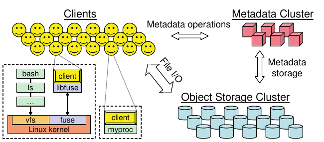
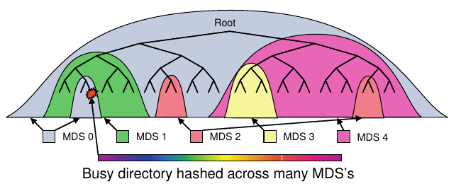
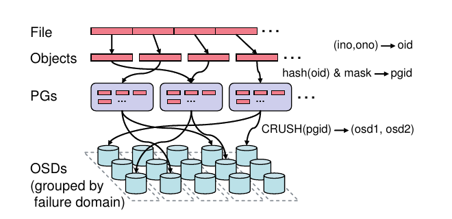
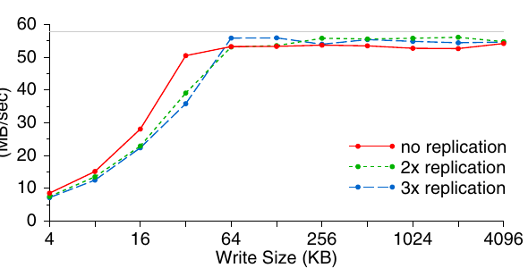
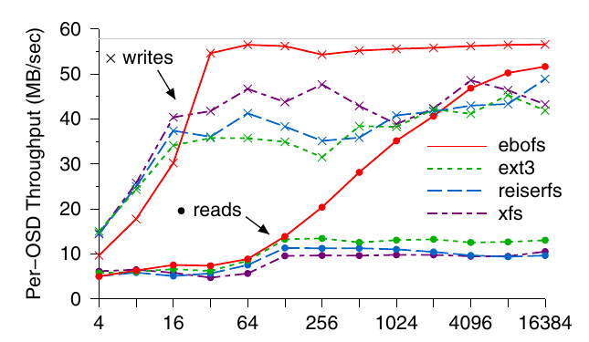
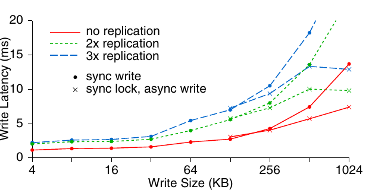
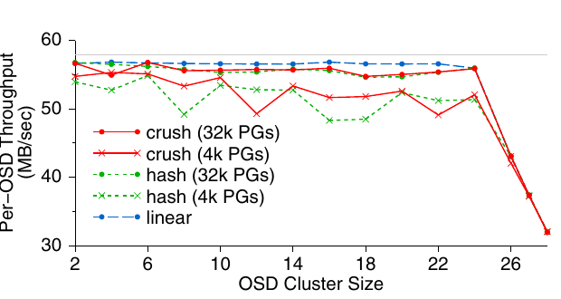
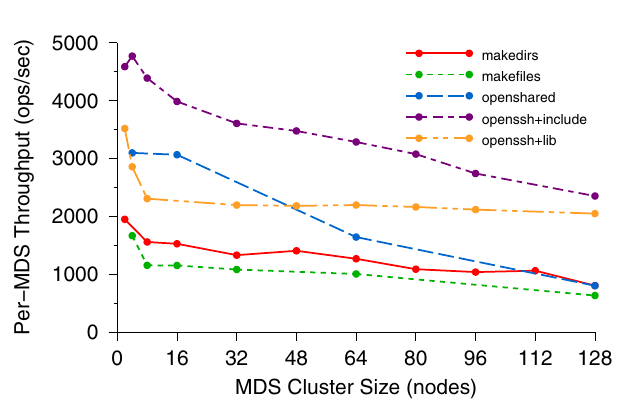

# Ceph: A Scalable, High-Performance Distributed File System（中文译文）

## 译者说明

本文依据同目录的 `source.pdf` 翻译。章节、图表、公式、算法、代码与参考文献按原文结构保留。

Sage A. Weil、Scott A. Brandt、Ethan L. Miller、Darrell D. E. Long、Carlos Maltzahn

美国加州大学圣克鲁兹分校

## 摘要

我们开发了 Ceph，一种具有出色性能、可靠性和可扩展性的分布式文件系统。Ceph 用面向异构动态集群、不可靠对象存储设备（OSD）的伪随机数据分布函数 CRUSH 替代分配表，最大限度地分离数据管理与元数据管理。我们利用设备智能，把数据复制、故障检测和恢复分发给半自治 OSD；这些 OSD 运行特制的本地对象文件系统。动态分布式元数据集群提供极为高效的元数据管理，并能无缝适应各种通用计算和科学计算文件系统工作负载。多种工作负载下的性能测量表明，Ceph 具有出色的 I/O 性能和可扩展的元数据管理能力，每秒可支持超过 250,000 次元数据操作。

## 1. 引言

长期以来，系统设计者一直努力提高文件系统性能，因为文件系统对极其广泛的应用类别的总体性能都至关重要。科学计算和高性能计算社区尤其推动了分布式存储系统在性能与可扩展性方面的发展，通常会比通用需求提前数年预见未来。以 NFS [20] 为代表的传统解决方案采用一种直观模型：服务器导出文件系统层次结构，客户端可将其映射到本地命名空间。尽管应用广泛，客户端/服务器模型固有的中心化已经成为实现可扩展性能的重大障碍。

较新的分布式文件系统采用基于对象存储的架构：传统硬盘被智能对象存储设备（OSD）取代；OSD 将 CPU、网络接口和本地缓存与底层磁盘或 RAID 结合起来 [4, 7, 8, 32, 35]。OSD 不再提供传统块级接口，而允许客户端在更大、常常大小可变的具名对象中读写字节范围，把底层块分配决策分散到设备本身。客户端通常与元数据服务器（MDS）交互以执行元数据操作，例如 `open`、`rename`；执行文件 I/O，例如读写时，则直接与 OSD 通信，从而显著提高总体可扩展性。

采用这种模型的系统仍然受到可扩展性限制，因为元数据工作负载很少分布，甚至完全不分布。它们继续依赖分配列表、inode 表等传统文件系统原则，又不愿把智能委托给 OSD，进一步限制了可扩展性和性能，还提高了实现可靠性的成本。

本文提出 Ceph：一种具有出色性能和可靠性，并有望提供无可比拟可扩展性的分布式文件系统。我们的架构基于这样一个假设：PB 级系统天然是动态的。大型系统不可避免地以增量方式建设；节点故障是常态而非例外；工作负载的质量和特征会随时间不断变化。

Ceph 通过去除文件分配表并以生成函数取代，实现数据操作与元数据操作解耦。这使 Ceph 能够利用 OSD 的智能，把围绕数据访问、更新串行化、复制与可靠性、故障检测和恢复的复杂性分散出去。Ceph 采用高度自适应的分布式元数据集群架构，显著提高元数据访问的可扩展性，并由此提高整个系统的可扩展性。本文讨论驱动架构选择的目标和工作负载假设，分析这些选择对系统可扩展性和性能的影响，并介绍实现可用系统原型的经验。

## 2. 系统概览

Ceph 文件系统有三个主要组件：客户端，每个实例向一台主机或一个进程提供近 POSIX 文件系统接口；OSD 集群，共同存储全部数据和元数据；元数据服务器集群，管理命名空间，即文件名与目录，同时协调安全性、一致性和连贯性，见图 1。我们称 Ceph 接口为“近 POSIX”，因为为了更好地符合应用需求并提高系统性能，扩展接口并有选择地放宽一致性语义是合适的。

该架构的首要目标是可扩展性（达到数百 PB 乃至更大规模）、性能和可靠性。可扩展性包含多个维度，包括系统总体存储容量和吞吐量，以及单个客户端、目录或文件层面的性能。目标工作负载可能包括极端情况，例如数万乃至数十万台主机并发读写同一文件，或在同一目录中创建文件。这类场景在超级计算集群上运行的科学应用中很常见，也越来越能代表未来的通用工作负载。更重要的是，我们认识到分布式文件系统工作负载天然是动态的；随着活跃应用和数据集随时间变化，数据与元数据访问都会显著改变。Ceph 通过三个基本设计特征直接解决可扩展性问题，同时获得高性能、高可靠性和高可用性：数据与元数据解耦、动态分布式元数据管理，以及可靠自治的分布式对象存储。

**数据与元数据解耦。** Ceph 最大限度地把文件元数据管理与文件数据存储分离。元数据操作，例如 `open`、`rename`，由元数据服务器集群共同管理；客户端则直接与 OSD 交互以执行文件 I/O，即读写。对象存储长期以来一直有望通过把底层块分配决策委托给单个设备来提高文件系统可扩展性。不过，与现有对象文件系统 [4, 7, 8, 32] 用较短对象列表替代每个文件的长块列表不同，Ceph 完全消除了分配列表。文件数据被条带化到名称可预测的对象上，特制的数据分布函数 CRUSH [29] 则把对象分配给存储设备。因此，任何一方都能计算，而非查找，构成文件内容的对象名称及位置；这样无需维护和分发对象列表，简化了系统设计，并减少元数据集群工作负载。

**动态分布式元数据管理。** 文件系统元数据操作可能占典型工作负载的一半 [22]，因此有效的元数据管理对系统总体性能至关重要。Ceph 采用一种基于动态子树分区 [30] 的新型元数据集群架构，根据工作负载自适应、智能地把管理文件系统目录层次结构的职责分配给数十甚至数百个 MDS。动态层次分区保留每个 MDS 工作负载中的局部性，有助于高效更新和积极预取，从而提高常见工作负载的性能。尤为重要的是，元数据服务器之间的工作负载分布完全依据当前访问模式，使 Ceph 在任何工作负载下都能有效利用可用 MDS 资源，并随着 MDS 数量近线性扩展。

**可靠自治的分布式对象存储。** 由数千个设备构成的大型系统天然是动态的：它们以增量方式建设；随着新存储部署和旧设备退役而扩张、收缩；设备故障频繁发生且在意料之中；大量数据不断创建、移动和删除。所有这些因素都要求数据分布不断演化，以有效利用可用资源并维持所需的数据复制级别。Ceph 把数据迁移、复制、故障检测和故障恢复的责任交给存储数据的 OSD 集群；在高层上，OSD 则共同向客户端和元数据服务器提供一个逻辑对象存储。该方法让 Ceph 能更有效地利用每个 OSD 上的智能，即 CPU 和内存，在实现线性扩展的同时提供可靠、高可用的对象存储。

下面介绍 Ceph 客户端、元数据服务器集群和分布式对象存储的运行方式，以及架构关键功能对它们的影响；同时介绍原型的状态。

## 3. 客户端操作

下面通过描述 Ceph 客户端操作，介绍 Ceph 各组件的整体运行方式及其与应用的交互。每台执行应用代码的主机上都运行 Ceph 客户端，并向应用提供文件系统接口。在 Ceph 原型中，客户端代码完全运行在用户空间；应用既可以直接链接到它，也可以通过 FUSE [25] 把它作为已挂载文件系统访问。FUSE 是用户空间文件系统接口。每个客户端维护自己的文件数据缓存，与内核 page cache 或 buffer cache 相互独立，因此直接链接客户端的应用也能访问该缓存。

### 3.1 文件 I/O 与 capability

进程打开文件时，客户端向 MDS 集群发送请求。一个 MDS 遍历文件系统层次结构，把文件名转换成文件 inode；inode 包含唯一 inode 编号、文件所有者、模式、大小和其他逐文件元数据。如果文件存在且访问获准，MDS 返回 inode 编号、文件大小，以及把文件数据映射到对象所用条带化策略的信息。MDS 还可能向客户端签发一个 capability（如果客户端尚未持有），规定允许的操作。当前 capability 包含四个 bit，控制客户端能否读取、缓存读取、写入和缓冲写入。未来 capability 还将包含安全密钥，使客户端能向 OSD 证明自己有权读写数据 [13, 19]；当前原型信任所有客户端。此后，MDS 对文件 I/O 的参与仅限于管理 capability，以维持文件一致性并实现正确语义。

Ceph 把多种条带化策略泛化，用于将文件数据映射到对象序列。为彻底消除文件分配元数据，对象名只需组合文件 inode 编号与条带编号。随后，使用全局已知的映射函数 CRUSH 把对象副本分配给 OSD，详见第 5.1 节。

例如，如果一个或多个客户端以读取方式打开文件，MDS 就向它们授予读取和缓存文件内容的 capability。客户端获得 inode 编号、布局和文件大小后，便能命名并定位包含文件数据的所有对象，直接从 OSD 集群读取。不存在的任何对象或字节范围都被定义为文件“空洞”，即零。类似地，如果客户端以写入方式打开文件，就会获得带缓冲写入的 capability；它在文件任意偏移生成的数据，直接写入相应 OSD 上的适当对象。关闭文件时，客户端交还 capability，并把新的文件大小，即写入过的最大偏移，提供给 MDS；这重新界定了可能存在并包含文件数据的对象集合。

### 3.2 客户端同步

POSIX 语义合理地要求读取反映此前写入的数据，并要求写入具有原子性，即重叠并发写入的结果会体现某个明确的发生顺序。当文件由多个客户端打开，且存在多个 writer 或 reader 与 writer 混合访问时，MDS 会撤销此前签发的读取缓存与写入缓冲 capability，迫使该文件的客户端 I/O 同步执行。也就是说，每次应用读写都会阻塞，直到 OSD 确认；对存储各对象的 OSD 而言，这等于承担了更新串行化和同步的责任。写入跨越对象边界时，客户端在受影响对象上取得排他锁，由相应 OSD 授予，并立即提交写入和解锁操作，实现所需串行化。对象锁同样可以掩盖大写入的延迟：先取得锁，再异步刷写数据。

不出所料，同步 I/O 会严重损害应用性能；由于至少需要与 OSD 一次往返，执行小读写的应用尤其如此。读写共享在通用工作负载中相对少见 [22]，却在性能往往至关重要的科学计算应用中更常见 [27]。因此，当应用并不依赖严格一致性时，往往值得以放宽一致性为代价，降低对标准的严格遵循。Ceph 可以通过一个全局开关实现这种放宽，许多其他分布式文件系统则干脆回避这个问题 [20]；但这是一种不精确且不令人满意的方案：要么性能受损，要么整个系统都失去一致性。

正因如此，高性能计算（HPC）社区提出了一组 POSIX I/O 接口的高性能计算扩展 [31]，Ceph 实现了其中一部分。最重要的是，`open` 可以带 `O_LAZY` 标志，让应用显式放宽共享写文件通常需要的连贯性要求。自行管理一致性的性能敏感型应用，例如写入同一文件不同区域这一 HPC 工作负载中的常见模式 [27]，可以在原本必须同步执行 I/O 时缓冲写入或缓存读取。如有需要，应用还可以用两个额外调用显式同步：`lazyio propagate` 把给定字节范围刷写到对象存储；`lazyio synchronize` 则确保此前 propagate 的效果反映在后续读取中。由此，Ceph 同步模型仍保持简单：通过同步 I/O 在客户端之间提供正确的读写和共享写语义，同时扩展应用接口，允许性能敏感型分布式应用放宽一致性。

### 3.3 命名空间操作

客户端与文件系统命名空间的交互由元数据服务器集群管理。MDS 同步应用读取操作，例如 `readdir`、`stat`，以及更新操作，例如 `unlink`、`chmod`，以保证串行化、一致性、正确的安全性和安全持久性。为保持简单，系统不向客户端签发元数据锁或 lease。对于 HPC 工作负载，回调带来的收益很小，却可能付出很高的复杂度成本。

Ceph 转而优化最常见的元数据访问场景。先执行 `readdir`、再对每个文件执行 `stat`，例如 `ls -l`，是一种极常见的访问模式，也是大目录中臭名昭著的性能杀手。Ceph 中的 `readdir` 只需一次 MDS 请求，就会获取整个目录，包括 inode 内容。默认情况下，如果 `readdir` 后立即执行一个或多个 `stat`，客户端就返回短暂缓存的信息；否则便将其丢弃。由于中间发生的 inode 修改可能未被察觉，这会稍微放宽连贯性；为了显著提高性能，我们愿意作此权衡。`readdirplus` 扩展 [31] 明确表达了这一行为：它把 `lstat` 结果随目录项一起返回，某些操作系统特定的 `getdir` 实现已经如此。

Ceph 也可以像早期 NFS 那样长时间缓存元数据，从而进一步放宽一致性；早期 NFS 通常缓存 30 秒。但这种方法会以一种对应用常常至关重要的方式破坏连贯性。例如，应用用 `stat` 判断文件是否更新时，要么行为错误，要么只能等待旧缓存值超时。

我们仍然选择提供正确行为，并在行为不利于性能时扩展接口。多个客户端当前同时打开一个文件进行写入时，对它执行 `stat` 最能说明这种选择。为了返回正确的文件大小和修改时间，MDS 会撤销所有写入 capability，暂时停止更新，并从所有 writer 收集最新的大小和 `mtime`。`stat` 响应返回各值中的最大值，然后重新签发 capability，允许执行继续。虽然停止多个 writer 似乎很激进，却是保证正确可串行化所必需的；若只有一个 writer，则可直接从写入客户端取得正确值而不打断执行。不需要连贯行为的应用，也就是 POSIX 接口与其需求不匹配的受害者，可以使用 `statlite` [31]；它接受一个 bit mask，指定哪些 inode 字段无需保持连贯。

## 4. 动态分布式元数据

元数据操作经常占文件系统工作负载的一半 [22]，且位于关键路径上，因此 MDS 集群对总体性能至关重要。元数据管理也给分布式文件系统带来关键的扩展挑战：增加存储设备几乎可以任意扩展容量和总 I/O 速率，但元数据操作具有更强的相互依赖性，更难以可扩展地管理一致性和连贯性。

Ceph 的文件和目录元数据很小，几乎完全由目录项（文件名）和 inode（80 字节）组成。与传统文件系统不同，它无需任何文件分配元数据；对象名由 inode 编号构造，并用 CRUSH 分发给 OSD。这简化了元数据工作负载，使 MDS 无论文件大小如何，都能高效管理很大的文件工作集。我们的设计还采用两层存储策略，尽量减少元数据相关磁盘 I/O；并使用动态子树分区 [30]，最大化局部性和缓存效率。

### 4.1 元数据存储

尽管 MDS 集群力求从内存缓存满足大部分请求，元数据更新仍必须提交到磁盘以保证安全。每个 MDS 都使用一组大型、有界、惰性刷写的 journal，把更新后的元数据快速、流式、高效且分布式地写入 OSD 集群。每个 MDS 的 journal 都有数百 MB，还会吸收大多数工作负载中常见的重复元数据更新；因此，旧 journal 项最终刷写到长期存储时，其中许多已失效。

原型尚未实现 MDS 恢复，但 journal 的设计允许在 MDS 故障时由另一节点迅速重新扫描 journal，恢复故障节点内存缓存中的关键内容以快速启动，并在此过程中恢复文件系统状态。

这种策略兼得两方面优势：以高效的顺序方式把更新流式写入磁盘，同时大幅减少重写工作负载，使长期磁盘存储布局可以针对未来读取访问优化。尤其是，inode 直接嵌入目录，MDS 只需一次 OSD 读取请求即可预取整个目录，并利用大多数工作负载中高度的目录局部性 [22]。每个目录的内容都使用与元数据 journal 和文件数据相同的条带化及分发策略写入 OSD 集群。原型按区间向元数据服务器分配 inode 编号，并视其为不可变；未来可在删除文件时轻易回收。辅助 anchor 表 [28] 使少见的多硬链接 inode 能按 inode 编号全局寻址，又不必让占绝大多数的单链接文件承担一个巨大、稀疏填充且笨重的 inode 表。

### 4.2 动态子树分区

我们的主副本缓存策略为每份元数据指定一个权威 MDS，由其管理缓存连贯性并串行化更新。大多数现有分布式文件系统使用某种静态的子树分区来委托这种权威，通常迫使管理员把数据集划成更小的静态“卷”；一些较新的实验性文件系统则使用哈希函数分发目录和文件元数据 [4]，实际上牺牲局部性换取负载分布。两种方法都有关键局限：静态子树分区无法应对动态工作负载和数据集，哈希则破坏元数据局部性，以及高效预取与存储元数据的重要机会。

Ceph 的 MDS 集群基于动态子树分区策略 [30]，如图 2 所示，在一组节点间自适应地按层次分发缓存的元数据。每个 MDS 使用带指数时间衰减的计数器，测量目录层次结构内元数据的热度。任何操作都会增加受影响 inode 及其一直到根目录的所有祖先的计数器，从而为每个 MDS 提供一棵描述近期负载分布的加权树。系统定期比较 MDS 负载值，迁移大小合适的目录子树，使工作负载均匀分布。

共享的长期存储与精心构造的命名空间锁结合，使系统只需把内存缓存中的适当内容转移给新权威，就能完成迁移，对连贯性锁或客户端 capability 的影响很小。导入的元数据会写入新 MDS 的 journal 以保证安全；两端的额外 journal 项则保证权威转移不受中间故障影响，类似两阶段提交。所得子树分区保持较粗粒度，以尽量降低前缀复制开销并保留局部性。

当元数据在多个 MDS 节点间复制时，inode 内容被分成三组，每组具有不同的一致性语义：安全性字段（`owner`、`mode`）、文件字段（`size`、`mtime`）和不可变字段（inode 编号、`ctime`、布局）。不可变字段从不改变；安全性锁和文件锁则分别由独立有限状态机管理，每个状态机有不同的状态与转换集合，用于适应不同的访问和更新模式，同时尽量减少锁竞争。例如，路径遍历中的安全检查需要 `owner` 和 `mode`，但它们很少变化，所以只需很少的状态；文件锁控制 MDS 签发客户端 capability 的能力，要反映更多客户端访问模式，因此状态范围更广。

### 4.3 流量控制

把目录层次结构分区到多个节点可以平衡广泛工作负载，但并不总能应对热点或突发访问，即大量客户端访问同一目录或文件。Ceph 利用对元数据热度的了解，只在需要时广泛分布热点，同时避免在一般情况下承担相关开销和目录局部性损失。大量读取的目录，例如发生许多 `open` 的目录，其内容会选择性地复制到多个节点以分散负载。特别大或写入负载很重的目录，例如创建大量文件的目录，其内容会按文件名在集群范围哈希，以牺牲目录局部性换取均衡分布。该自适应方法让 Ceph 覆盖广泛的分区粒度；在适合粗粒度或细粒度策略的具体情形与文件系统区域中，分别获得两者的优势。

每个 MDS 响应都会向客户端提供有关相应 inode 及其祖先权威归属和复制情况的最新信息，使客户端逐渐了解自己交互的文件系统部分如何进行元数据分区。后续元数据操作依据给定路径最深的已知前缀，定向到权威节点（更新）或随机副本（读取）。通常，客户端获知不热门且未复制的元数据位置，可以直接联系适当 MDS。访问热门元数据的客户端则会被告知元数据位于不同或多个 MDS 节点上；这实际上限制了认为特定元数据位于某个特定 MDS 的客户端数量，在潜在热点和突发访问出现前就将其分散。

## 5. 分布式对象存储

从高层看，Ceph 客户端和元数据服务器把对象存储集群，可能包含数万或数十万个 OSD，视为一个逻辑对象存储和命名空间。Ceph 的可靠自治分布式对象存储（Reliable Autonomic Distributed Object Store，RADOS）把对象复制、集群扩展、故障检测和恢复的管理以分布式方式委托给 OSD，因此容量和总性能都能线性扩展。

### 5.1 使用 CRUSH 分布数据

Ceph 必须在一个不断演化、含数千个存储设备的集群中分布 PB 级数据，并有效利用设备的存储与带宽资源。为避免不均衡，例如新部署设备大多空闲或空置，或负载不对称，例如新的热门数据只在新设备上，我们采用一种策略：随机分布新数据，把现有数据的一个随机子样本迁移到新设备，并均匀地重新分布从已移除设备取得的数据。这种随机方法很稳健，在任何潜在工作负载下都表现相同。

Ceph 首先使用简单哈希函数把对象映射到 placement group（PG），并用可调整的 bit mask 控制 PG 数量。我们选择一个使每个 OSD 约有 100 个 PG 的值，在 OSD 利用率方差与每个 OSD 维护的复制相关元数据量之间取得平衡。随后，使用 CRUSH（Controlled Replication Under Scalable Hashing）[29] 把 PG 分配给 OSD。CRUSH 是伪随机数据分布函数，可高效地把每个 PG 映射到一个有序 OSD 列表，在这些 OSD 上存储对象副本。

这种做法与传统方法，包括其他对象文件系统的不同之处在于，数据放置不依赖任何块列表或对象列表元数据。为定位任意对象，CRUSH 只需要 placement group 和 OSD 集群映射；后者是对存储集群所含设备的紧凑层次化描述。该方法有两项关键优势。第一，它完全分布式，任何一方，客户端、OSD 或 MDS，都能独立计算任意对象的位置。第二，映射很少更新，几乎不必交换任何分布相关元数据。因此，CRUSH 同时解决了数据分布问题“数据应存在哪里”和数据定位问题“数据存到了哪里”。按设计，对存储集群的小改动只会轻微影响现有 PG 映射，从而尽量减少设备故障或集群扩展造成的数据迁移。

集群映射的层次结构与集群的物理或逻辑组成，以及潜在故障源对齐。例如，一套安装可以构成四层层次结构：OSD 装满机架单元，机柜装满这些单元，多个机柜又排成一列。每个 OSD 还有一个权重值，控制分配给它的相对数据量。CRUSH 依据 placement rule 把 PG 映射到 OSD；规则定义复制级别及任何放置约束。例如，每个 PG 可以在三个 OSD 上复制，三者位于同一排以限制跨排复制流量，但分处不同机柜，以尽量减少电路或边缘交换机故障的影响。

集群映射还包含 down 或 inactive 设备列表和 epoch 编号；每次映射改变时 epoch 都会增加。所有 OSD 请求都带有客户端的映射 epoch，使各方能就当前数据分布达成一致。增量映射更新在相互协作的 OSD 之间共享；如果客户端映射过时，OSD 响应还会捎带更新。

### 5.2 复制

Lustre [4] 等系统假设可以通过 RAID 或 SAN failover 等机制构建足够可靠的 OSD；与之不同，我们假设在 PB 或 EB 级系统中，故障是常态而非例外，任意时刻都很可能有多个 OSD 无法运行。为了以可扩展方式维持系统可用性并保证数据安全，RADOS 使用主副本复制 [2] 的一个变体自行管理数据复制，同时采取措施尽量降低性能影响。

数据以 PG 为单位复制；对于 n 路复制，每个 PG 映射到 n 个 OSD 的有序列表。客户端把所有写入发给对象所在 PG 中第一个未故障的 OSD，即 primary。Primary 为对象和 PG 分配新版本号，再把写入转发给其他 replica OSD。每个 replica 应用更新并响应 primary 后，primary 在本地应用更新，再向客户端确认写入。读取发往 primary。这样，副本之间同步或串行化的复杂性便不由客户端承担；在存在其他 writer 或故障恢复时，这类工作可能很繁重。复制所消耗的带宽也从客户端转移到 OSD 集群内部网络，我们预计后者有更多可用资源。中途发生的 replica OSD 故障会被忽略，因为后续恢复（见第 5.5 节）会可靠地恢复副本一致性。

### 5.3 数据安全

在分布式存储系统中，把数据写入共享存储主要有两个原因。第一，客户端希望其他客户端能看到自己的更新；这应该很快，写入应尽早可见，尤其当多个 writer 或 reader/writer 混合访问迫使客户端同步运行时。第二，客户端需要确切知道写入的数据已安全复制、落盘，并能挺过断电或其他故障。RADOS 在确认更新时把同步与安全解耦，使 Ceph 既能以低延迟更新实现高效应用同步，又能提供定义明确的数据安全语义。

图 4 展示对象写入期间发送的消息。Primary 把更新转发给 replica；更新应用到所有 OSD 的内存 buffer cache 后，primary 回复 `ack`，使客户端的同步 POSIX 调用能够返回。数据安全提交到磁盘后，系统再发送最终 `commit`，这可能是许多秒之后。只有更新完整复制后，系统才向客户端发送 `ack`，从而无缝容忍任意单个 OSD 故障，尽管这会增加客户端延迟。默认情况下，客户端也会缓冲写入直到 commit，以免同一 PG 中所有 OSD 同时断电时丢失数据。在这种情况下恢复时，RADOS 允许在一个固定时间区间内重放此前已确认、因而已有序的更新，然后才接受新更新。

### 5.4 故障检测

及时检测故障对维持数据安全至关重要，但集群扩展到数千个设备后会变得困难。磁盘错误或数据损坏等故障可由 OSD 自行报告；使 OSD 在网络上不可达的故障则需要主动监控。RADOS 把这种监控分散出去，让每个 OSD 监控与自己共享 PG 的 peer。大多数情况下，现有复制流量可以被动确认存活，不产生额外通信开销。如果 OSD 最近没有收到 peer 的消息，就显式发送 ping。

RADOS 从两个维度判断 OSD 存活性：OSD 是否可达，以及 CRUSH 是否向其分配数据。无响应 OSD 最初被标记为 down，它在各 PG 中承担的 primary 职责，例如更新串行化和复制，会暂时转移给下一个 OSD。如果 OSD 未能迅速恢复，就将其标记为 out，不再参与数据分布；另一个 OSD 加入每个 PG，重新复制内容。客户端若有提交给故障 OSD 的待处理操作，只需重新提交给新 primary。

多种网络异常都可能造成 OSD 连接间歇中断，因此一个小型 monitor 集群会收集故障报告，在中心过滤瞬时或系统性问题，例如网络分区。Monitor 尚未完整实现；它们使用选举、主动 peer 监控、短期 lease 和两阶段提交，共同提供对集群映射的一致且可用访问。映射更新以反映故障或恢复时，受影响 OSD 会收到增量映射更新；这些更新再通过现有 OSD 间通信捎带传播至整个集群。分布式检测既能快速发现故障而不过度增加 monitor 负担，又能通过集中仲裁解决不一致的发生。最重要的是，RADOS 对系统性问题只把 OSD 标为 down 而非 out，避免启动大范围数据重新复制；例如，全部 OSD 中一半断电时就是如此。

### 5.5 恢复与集群更新

OSD 故障、恢复和部署新存储等显式集群变更都会改变 OSD 集群映射；Ceph 以相同方式处理所有这些变化。为便于快速恢复，OSD 为每个对象维护版本号，并为每个 PG 维护最近变更日志，记录更新或删除的对象名称及版本，类似 Harp 的复制日志 [14]。

活跃 OSD 收到更新后的集群映射时，会遍历本地存储的全部 PG，计算 CRUSH 映射，确定自己负责哪些 PG，以及身份是 primary 还是 replica。如果 PG 成员发生变化，或 OSD 刚启动，该 OSD 必须与 PG 的其他 OSD 建立 peer 关系。对于复制的 PG，OSD 向 primary 提供当前 PG 版本号；如果它本身是 PG 的 primary，则收集当前和此前 replica 的 PG 版本。如果 primary 没有最新 PG 状态，就从 PG 当前或此前的 OSD 获取近期 PG 变更日志，必要时获取完整内容摘要，以确定正确且最新的 PG 内容。随后 primary 向每个 replica 发送增量日志更新，必要时发送完整内容摘要，使各方即使本地对象集合不匹配，也都知道 PG 应有的内容。只有 primary 确定正确 PG 状态并与 replica 共享后，才允许对 PG 内对象执行 I/O。此后，各 OSD 独立负责从 peer 取回缺失或过时对象。如果 OSD 收到对过时或缺失对象的请求，就延迟处理，并把该对象移到恢复队列最前方。

例如，假设 `osd1` 崩溃并被标为 down，`osd2` 接管 `pgA` 的 primary。如果 `osd1` 恢复，它启动时会请求最新映射，monitor 将其标为 up。`osd2` 收到相应映射更新后，会发现自己不再是 `pgA` 的 primary，并把 `pgA` 版本号发给 `osd1`。`osd1` 从 `osd2` 取回近期 `pgA` 日志项，告知 `osd2` 自己的内容已经是最新，然后开始处理请求；任何更新过的对象都在后台恢复。

因为故障恢复完全由单个 OSD 驱动，受故障 OSD 影响的每个 PG 都会并行恢复，而且很可能恢复到不同的替代 OSD。该方法基于快速恢复机制（Fast Recovery Mechanism，FaRM）[37]，可以缩短恢复时间，提高总体数据安全性。

### 5.6 使用 EBOFS 存储对象

多种分布式文件系统使用 ext3 等本地文件系统管理底层存储 [4, 12]；我们发现，它们的接口和性能很不适合对象工作负载 [27]。现有内核接口限制我们判断对象更新何时安全提交到磁盘。同步写入或 journal 可以提供所需安全性，却带来很高的延迟和性能代价。更重要的是，POSIX 接口不支持数据和元数据，例如属性，的原子更新事务，而这对维持 RADOS 一致性很重要。

因此，每个 Ceph OSD 使用 EBOFS 管理本地对象存储；EBOFS 是基于 extent 和 B-tree 的对象文件系统。EBOFS 完全在用户空间实现，直接与裸块设备交互，使我们可以定义自己的底层对象存储接口和更新语义，把用于同步的更新串行化与用于安全性的磁盘提交分开。EBOFS 支持原子事务，例如对多个对象执行写入和属性更新；内存缓存更新后，更新函数就会返回，同时异步通知 commit。

用户空间方法除带来更大灵活性和更容易的实现外，还避免了与 Linux VFS 和 page cache 进行繁琐交互；二者原本为不同的接口和工作负载设计。大多数内核文件系统会在一定时间后惰性地把更新刷写到磁盘，EBOFS 则积极调度磁盘写入；如果后续更新使待处理 I/O 变得多余，它会取消该 I/O。这样，底层磁盘调度器能获得更长的 I/O 队列，相应提高调度效率。用户空间调度器也便于未来区分工作优先级，例如客户端 I/O 与恢复，或提供服务质量保证 [36]。

EBOFS 设计的核心是一套健壮、灵活、完全集成的 B-tree 服务，用于定位磁盘上的对象、管理块分配，并索引 collection，即 PG。块分配以 extent，即起始位置与长度对，为单位，而非使用块列表，以保持元数据紧凑。磁盘上的空闲块 extent 按大小分箱、按位置排序，使 EBOFS 能迅速找到靠近写入位置或磁盘相关数据的空闲空间，同时限制长期碎片。除每个对象的块分配信息外，全部元数据都保存在内存中，以获得高性能和简单性；即使卷很大，它们也相当小。最后，EBOFS 积极采用写时复制：除 superblock 更新外，数据始终写入磁盘尚未分配的区域。

## 6. 性能与可扩展性评估

我们用一组 microbenchmark 评估原型，展示其性能、可靠性和可扩展性。在所有测试中，客户端、OSD 和 MDS 都是运行在双处理器 Linux 集群上的用户进程，使用 SCSI 磁盘并通过 TCP 通信。通常每个 OSD 或 MDS 独占一台主机；生成工作负载时，数十或数百个客户端实例可能共享同一台主机。

### 6.1 数据性能

EBOFS 提供优越的性能和安全语义；CRUSH 生成的均衡数据分布，以及把复制和故障恢复委托出去，则使总 I/O 性能能够随 OSD 集群规模扩展。

#### 6.1.1 OSD 吞吐量

首先测量 14 节点 OSD 集群的 I/O 性能。图 5 展示不同写入大小和复制级别下的单 OSD 吞吐量。工作负载由另外 20 个节点上的 400 个客户端生成。性能最终受原始磁盘带宽限制，约为 58 MB/s，图中的水平线表示这一限制。复制会使磁盘 I/O 增加一倍或两倍；OSD 数固定时，客户端数据率相应下降。

图 6 比较 EBOFS 与通用文件系统 ext3、ReiserFS、XFS 处理 Ceph 工作负载时的性能。客户端同步写入按 16 MB 对象条带化的大文件，然后再把文件读回。虽然粗粒度线程和锁使 EBOFS 的小读写性能受损，但写入大小超过 32 KB 后，EBOFS 几乎能用满可用磁盘带宽；在读取工作负载上也显著优于其他系统，因为数据在磁盘上按与写入大小相匹配的 extent 布局，即使写入很大也是如此。

性能测量使用新建文件系统。此前 EBOFS 设计的经验表明，它产生的碎片会显著少于 ext3，但我们尚未在老化文件系统上评估当前实现。无论如何，我们预期 EBOFS 老化后的性能不会差于其他系统。

#### 6.1.2 写入延迟

图 7 展示单个 writer 在不同写入大小和复制级别下的同步写入延迟。Primary OSD 会同时把更新重传给所有 replica，因此副本超过两个时，小写入只会增加很少延迟。对于较大的写入，重传成本占主导地位：1 MB 写入未在图中展示，在一个副本时耗时 13 ms，在三个副本时长 2.5 倍，为 33 ms。

对于超过 128 KB 的同步写入，Ceph 客户端先取得排他锁，再异步把数据刷到磁盘，从而掩盖一部分延迟。共享写入的应用也可选择 `O_LAZY`。一致性放宽后，客户端可以缓冲小写入，只向 OSD 提交大的异步写入；应用观察到的唯一延迟来自客户端缓存已满、等待数据刷到磁盘。

#### 6.1.3 数据分布与可扩展性

Ceph 的数据性能几乎随 OSD 数量线性扩展。CRUSH 以伪随机方式分布数据，因此 OSD 利用率可以用二项分布或正态分布精确建模，这正是完美随机过程的预期结果 [29]。利用率方差随 PG 数增加而下降：每个 OSD 有 100 个 PG 时，标准差为 10%；有 1000 个 PG 时为 3%。

图 8 展示随着集群扩展，使用 CRUSH、简单哈希函数和线性条带化策略，把数据以 4096 或 32768 个 PG 分布到可用 OSD 时的单 OSD 写入吞吐量。线性条带化能完美平衡负载并获得最大吞吐量，所以作为比较基准；但与简单哈希函数一样，它无法应对设备故障或其他 OSD 集群变化。

使用 CRUSH 或哈希时，数据放置具有随机性，因此 PG 较少时吞吐量更低：OSD 利用率方差更大，使交织客户端工作负载下的请求队列长度逐渐分离。设备有很小概率变得过满或过度利用并拖慢性能；CRUSH 可以在集群映射中特别标记相应 OSD，把其任意比例的分配量卸载出去，纠正这种情况。与哈希和线性策略不同，CRUSH 在保持均衡分布的同时，还能尽量减少集群扩展期间的数据迁移。对于含 n 个 OSD 的集群，CRUSH 计算复杂度为 $O(\log n)$，只需数十微秒，使集群可扩展到数十万个 OSD。

### 6.2 元数据性能

Ceph 的 MDS 集群既提供增强的 POSIX 语义，又具有出色的可扩展性。我们使用不含任何数据 I/O 的部分工作负载测量性能；这些实验中的 OSD 只用于存储元数据。

#### 6.2.1 元数据更新延迟

我们首先考察 `mknod` 或 `mkdir` 等元数据更新的延迟。单个客户端创建一系列文件和目录，MDS 必须为安全起见把更新同步写入 OSD 集群的 journal。我们同时考察两种 MDS：无盘 MDS 把所有元数据存储在共享 OSD 集群；另一种 MDS 还有一块本地磁盘，作为其 journal 的 primary OSD。

图 9(a) 展示两种情况下，随元数据复制级别变化的元数据更新延迟，其中零表示完全不写 journal。Journal 项先写入 primary OSD，再复制到其他 OSD。使用本地磁盘时，从 MDS 到本地 primary OSD 的第一次传输几乎不耗时，因此 2 路复制的更新延迟与无盘模型中的 1 路复制相近。两种情况下，超过两个副本都只会增加很少延迟，因为副本并行更新。

#### 6.2.2 元数据读取延迟

元数据读取，例如 `readdir`、`stat`、`open`，行为更复杂。图 9(b) 展示客户端遍历 10,000 个嵌套目录所消耗的累计时间；它在每个目录中执行一次 `readdir`，并对每个文件执行 `stat`。预热的 MDS 缓存会缩短 `readdir` 时间。后续 `stat` 不受影响，因为 inode 内容嵌入目录，一次 OSD 访问就能把整个目录内容取入 MDS 缓存。对于更大的目录，累计 `stat` 时间通常会占据主导。使用 `readdirplus` 把 `stat` 与 `readdir` 结果显式绑定到一次操作，或放宽 POSIX 语义，使紧跟 `readdir` 的 `stat` 从客户端缓存得到服务（默认行为），都能消除后续 MDS 交互。

#### 6.2.3 元数据扩展

我们使用劳伦斯利弗莫尔国家实验室（LLNL）`alc` Linux 集群的一个 430 节点分区评估元数据可扩展性。图 10 展示单 MDS 吞吐量随 MDS 集群规模变化的情况，水平线代表完美线性扩展。

`makedirs` 工作负载中，每个客户端创建一棵四层嵌套目录树，每个目录内有十个文件和十个子目录。单 MDS 平均吞吐量从小集群中的每秒 2000 次操作，下降到 128 个 MDS 时的每秒约 1000 次操作，即 50% 效率，总吞吐量超过每秒 100,000 次操作。

`makefiles` 工作负载中，每个客户端在同一目录创建数千个文件。Ceph 检测到高写入水平后，会哈希共享目录并放宽其 `mtime` 连贯性，把工作负载分散到全部 MDS 节点。`openshared` 工作负载让每个客户端反复打开、关闭十个共享文件，展示读取共享。`openssh` 工作负载中，每个客户端在私有目录中重放一次编译所捕获的文件系统 trace。一个变体共享 `/lib`，共享程度中等；另一个共享读取非常频繁的 `/usr/include`。

`openshared` 和 `openssh+include` 的读取共享最重，扩展行为最差；我们认为原因在于客户端选择副本的策略不佳。`openssh+lib` 的扩展性能优于可以轻易彼此分离的 `makedirs`，因为它包含的元数据修改相对较少，共享也很少。我们认为，消息层中的网络或线程竞争进一步降低了较大 MDS 集群的性能；但我们独占访问大型集群的时间有限，无法进行更深入调查。

图 11 对 `makedirs` 工作负载下的 4、16 和 64 节点 MDS 集群，绘制延迟与单 MDS 吞吐量的关系；图例把第三组标为 128 MDS。较大集群的负载分布不够完美，因此单 MDS 平均吞吐量较低，当然总吞吐量高得多，延迟也略高。

尽管没有实现完美线性扩展，运行原型的 128 节点 MDS 集群每秒仍能服务超过 250,000 次元数据操作，即 128 个节点、每节点每秒 2000 次操作。由于元数据事务与数据 I/O 无关，且元数据大小与文件大小无关，这相当于潜在拥有数百 PB 乃至更多存储的安装，具体取决于平均文件大小。

例如，在 LLNL 的 BlueGene/L 上创建 checkpoint 的科学应用可能有 64,000 个节点，每个节点含两个处理器，分别向同一目录中的不同文件写入数据，与 `makefiles` 工作负载相同。当前存储系统的峰值为每秒 6000 次元数据操作，每次 checkpoint 需要数分钟；128 节点 Ceph MDS 集群可在两秒内完成。如果每个文件只有 10 MB，按 HPC 标准相当小，且 OSD 能维持 50 MB/s，这种集群可以达到 1.25 TB/s 写入速度，至少使 25,000 个 OSD 饱和，启用复制时为 50,000 个。若 OSD 容量为 250 GB，系统规模将超过 6 PB。

更重要的是，Ceph 的动态元数据分布使任意规模的 MDS 集群都能根据当前工作负载重新分配资源；即使全部客户端都访问此前分配给一个 MDS 的元数据也能做到。因此，它比任何静态分区策略都更加通用、更具适应性。

## 7. 实践经验

用分布函数替代文件分配元数据，竟能在如此大程度上简化设计，这令我们惊喜。虽然这对函数本身提出了更高要求，但一旦明确具体要求，CRUSH 就能提供所需的可扩展性、灵活性和可靠性。它大幅简化了元数据工作负载，同时让客户端和 OSD 都完整、独立地了解数据分布。后一点使我们可以把数据复制、迁移、故障检测和恢复的责任委托给 OSD，以分布式方式实现这些机制，并有效利用 OSD 自带的 CPU 和内存。RADOS 还为一系列能够自然映射到 OSD 模型的未来增强打开了大门，例如像 Google File System [7] 那样检测 bit error，以及像 AutoRAID [34] 那样根据工作负载动态复制数据。

使用现有内核文件系统存储本地对象很有诱惑力，许多其他系统也这样做 [4, 7, 9]；但我们很早就认识到，针对对象工作负载定制的文件系统能够提供更好性能 [27]。我们没有预见到的，是现有文件系统接口与需求之间的巨大差距；开发 RADOS 复制和可靠性机制时，这一点变得很明显。EBOFS 在用户空间中的开发速度出人意料地快，性能令人非常满意，还提供了完全符合需求的接口。

Ceph 最大的经验之一，是 MDS 负载均衡器对总体可扩展性极其重要，以及决定何时、把何种元数据迁移到何处极其复杂。设计与目标原则上似乎很简单，但把不断变化的工作负载分布到一百个 MDS 的现实揭示了更多微妙之处。最明显的是，MDS 存在多种性能边界，包括 CPU、内存与缓存效率，以及网络或 I/O 限制；任一项都可能在某时刻限制性能。此外，总吞吐量与公平性之间的平衡很难定量描述；某些情况下，不均衡的元数据分布反而能提高总吞吐量 [30]。

客户端接口的实现比预期更具挑战。使用 FUSE 避开内核，大幅简化了实现，但也引入一组独特问题。`DIRECT_IO` 绕过内核 page cache，却不支持 `mmap`，迫使我们修改 FUSE，把失效干净页作为变通方案。FUSE 坚持自行执行安全检查，导致即使简单的应用调用也产生大量 `getattr`（`stat`）。最后，内核与用户空间之间基于 page 的 I/O 限制了总体 I/O 速率。直接链接客户端可以避开 FUSE 问题，但在用户空间重载系统调用又引入一组新问题，其中大部分尚未充分研究；因此，内核内客户端模块不可避免。

## 8. 相关工作

高性能可扩展文件系统长期以来都是 HPC 社区的目标；HPC 往往给文件系统施加很重的负载 [18, 27]。许多文件系统试图满足这种需求，但无法达到 Ceph 的可扩展性水平。

OceanStore [11] 和 Farsite [1] 等大型系统旨在提供 PB 级高可靠存储，可以让数千个客户端同时访问数千个不同文件；但名称查找等子系统中的瓶颈，使其无法让数万个协作客户端高性能访问少量文件。相反，Vesta [6]、Galley [17]、PVFS [12] 和 Swift [5] 等并行文件和存储系统广泛支持跨多个磁盘条带化数据，以达到很高的传输速率，却没有强力支持可扩展元数据访问或用于高可靠性的稳健数据分布。

例如，Vesta 允许应用在磁盘上布局数据，还允许在不引用共享元数据的情况下独立访问每块磁盘上的文件数据。但是，与许多其他并行文件系统相同，Vesta 没有为元数据查找提供可扩展支持。因此，这类文件系统在访问许多小文件或需要大量元数据操作的工作负载上通常表现很差。它们还普遍受到块分配问题困扰：块要么集中分配，要么通过基于锁的机制分配，无法很好地扩展到从数千个客户端向数千块磁盘发出的写入请求。GPFS [24] 和 StorageTank [16] 部分解耦了元数据管理与数据管理，却受到块设备使用方式和元数据分布架构的限制。

LegionFS [33] 等基于网格的文件系统用于协调广域访问，并未针对本地文件系统的高性能优化。类似地，Google File System [7] 针对超大文件，以及以读取和文件 append 为主的工作负载优化。与 Sorrento [26] 一样，它面向使用非 POSIX 语义的一类狭窄应用。

最近，Federated Array of Bricks（FAB）[23] 和 pNFS [9] 等许多文件系统与平台都围绕网络附加存储 [8] 设计。Lustre [4]、Panasas 文件系统 [32]、zFS [21]、Sorrento 和 Kybos [35] 都基于对象存储范式 [3]，与 Ceph 最相似。然而，这些系统都没有同时具备 Ceph 所提供的可扩展自适应元数据管理、可靠性和容错能力。Lustre 和 Panasas 尤其没有把责任委托给 OSD，对高效分布式元数据管理的支持也有限，制约了可扩展性与性能。

此外，除 Sorrento 使用一致性哈希 [10] 外，所有这些系统都用显式分配映射规定对象存储位置；部署新存储时，它们对重新均衡的支持有限。这会造成负载不对称和资源利用率低下。Sorrento 的哈希分布则不具备 CRUSH 在高效数据迁移、设备加权和故障域方面的支持。

## 9. 未来工作

Ceph 的一些核心元素尚未实现，包括 MDS 故障恢复和若干 POSIX 调用。我们正在考虑两种安全架构和协议变体，但都尚未实现 [13, 19]。我们还计划研究客户端针对“命名空间到 inode 转换元数据”使用回调的实用性。对于文件系统的静态区域，这可以使只读 `open` 无需 MDS 交互。还计划进行其他 MDS 增强，包括为目录层次结构的任意子树创建 snapshot [28]。

当突发访问作用于单个目录或文件时，Ceph 会动态复制元数据，但文件数据尚不能如此。我们计划让 OSD 根据工作负载动态调整单个对象的复制级别，并把读取流量分发到 PG 中的多个 OSD。这将允许可扩展地访问少量数据，也可能通过类似 D-SPTF [15] 的机制实现细粒度 OSD 负载均衡。

最后，我们正在开发服务质量架构，既支持按类别对总流量确定优先级，也支持由 OSD 管理、基于预留的带宽和延迟保证。除支持有 QoS 要求的应用外，它还有助于在 RADOS 复制及恢复操作与常规工作负载之间取得平衡。EBOFS 还规划了多项增强，包括改进分配逻辑、数据巡检，以及通过 checksum 或其他 bit error 检测机制提高数据安全性。

## 10. 结论

Ceph 在设计空间中占据独特位置，解决存储系统的三项关键挑战：可扩展性、性能和可靠性。它抛弃几乎所有现有系统都有的分配列表等设计假设，最大限度地分离数据管理与元数据管理，使两者能够独立扩展。这种分离依赖 CRUSH：一个生成伪随机分布的数据分布函数，使客户端可以计算而不是查找对象位置。CRUSH 强制把数据副本分散到不同故障域，提高数据安全；同时高效应对大型存储集群固有的动态特征，在这类集群中，设备故障、扩容和集群重构都是常态。

RADOS 利用智能 OSD 管理数据复制、故障检测与恢复、底层磁盘分配、调度和数据迁移，不会给任何中心服务器增加负担。虽然对象可以被视为文件，存放在通用文件系统中，EBOFS 却针对 Ceph 的具体工作负载和接口要求，提供更合适的语义和更优的性能。

最后，Ceph 的元数据管理架构解决了高度可扩展存储中最棘手的问题之一：如何高效提供一套遵循 POSIX 语义的统一目录层次结构，并让性能随元数据服务器数量扩展。Ceph 的动态子树分区是一种独特、可扩展的方法，既高效又能适应变化的工作负载。

Ceph 采用 LGPL 许可证，可从 <http://ceph.sourceforge.net/> 获取。

## 致谢

本工作由美国能源部委托加州大学劳伦斯利弗莫尔国家实验室执行，合同号 W-7405-Eng-48。研究部分由劳伦斯利弗莫尔、洛斯阿拉莫斯和桑迪亚国家实验室资助。感谢 Bill Loewe、Tyce McLarty、Terry Heidelberg，以及 LLNL 所有与我们讨论存储实践成败、并帮助安排我们两天独占使用 `alc` 时间的人。还要感谢 IBM 捐赠 32 节点集群，为大量 OSD 性能测试提供帮助；感谢国家科学基金会资助交换机升级。Chandu Thekkath（本文 shepherd）、匿名评审和 Theodore Wong 都提出了宝贵反馈；同时感谢 Storage Systems Research Center 的学生、教师和赞助方给予意见与支持。

## 参考文献

- [1] A. Adya, W. J. Bolosky, M. Castro, R. Chaiken, G. Cermak, J. R. Douceur, J. Howell, J. R. Lorch, M. Theimer, and R. Wattenhofer. FARSITE: Federated, available, and reliable storage for an incompletely trusted environment. In *Proceedings of the 5th Symposium on Operating Systems Design and Implementation (OSDI)*, Boston, MA, Dec. 2002. USENIX.
- [2] P. A. Alsberg and J. D. Day. A principle for resilient sharing of distributed resources. In *Proceedings of the 2nd International Conference on Software Engineering*, pages 562-570. IEEE Computer Society Press, 1976.
- [3] A. Azagury, V. Dreizin, M. Factor, E. Henis, D. Naor, N. Rinetzky, O. Rodeh, J. Satran, A. Tavory, and L. Yerushalmi. Towards an object store. In *Proceedings of the 20th IEEE / 11th NASA Goddard Conference on Mass Storage Systems and Technologies*, pages 165-176, Apr. 2003.
- [4] P. J. Braam. The Lustre storage architecture. <http://www.lustre.org/documentation.html>, Cluster File Systems, Inc., Aug. 2004.
- [5] L.-F. Cabrera and D. D. E. Long. Swift: Using distributed disk striping to provide high I/O data rates. *Computing Systems*, 4(4):405-436, 1991.
- [6] P. F. Corbett and D. G. Feitelson. The Vesta parallel file system. *ACM Transactions on Computer Systems*, 14(3):225-264, 1996.
- [7] S. Ghemawat, H. Gobioff, and S.-T. Leung. The Google file system. In *Proceedings of the 19th ACM Symposium on Operating Systems Principles (SOSP '03)*, Bolton Landing, NY, Oct. 2003. ACM.
- [8] G. A. Gibson, D. F. Nagle, K. Amiri, J. Butler, F. W. Chang, H. Gobioff, C. Hardin, E. Riedel, D. Rochberg, and J. Zelenka. A cost-effective, high-bandwidth storage architecture. In *Proceedings of the 8th International Conference on Architectural Support for Programming Languages and Operating Systems (ASPLOS)*, pages 92-103, San Jose, CA, Oct. 1998.
- [9] D. Hildebrand and P. Honeyman. Exporting storage systems in a scalable manner with pNFS. Technical Report CITI-05-1, CITI, University of Michigan, Feb. 2005.
- [10] D. Karger, E. Lehman, T. Leighton, M. Levine, D. Lewin, and R. Panigrahy. Consistent hashing and random trees: Distributed caching protocols for relieving hot spots on the World Wide Web. In *ACM Symposium on Theory of Computing*, pages 654-663, May 1997.
- [11] J. Kubiatowicz, D. Bindel, Y. Chen, P. Eaton, D. Geels, R. Gummadi, S. Rhea, H. Weatherspoon, W. Weimer, C. Wells, and B. Zhao. OceanStore: An architecture for global-scale persistent storage. In *Proceedings of the 9th International Conference on Architectural Support for Programming Languages and Operating Systems (ASPLOS)*, Cambridge, MA, Nov. 2000. ACM.
- [12] R. Latham, N. Miller, R. Ross, and P. Carns. A next-generation parallel file system for Linux clusters. *LinuxWorld*, pages 56-59, Jan. 2004.
- [13] A. Leung and E. L. Miller. Scalable security for large, high performance storage systems. In *Proceedings of the 2006 ACM Workshop on Storage Security and Survivability*. ACM, Oct. 2006.
- [14] B. Liskov, S. Ghemawat, R. Gruber, P. Johnson, L. Shrira, and M. Williams. Replication in the Harp file system. In *Proceedings of the 13th ACM Symposium on Operating Systems Principles (SOSP '91)*, pages 226-238. ACM, 1991.
- [15] C. R. Lumb, G. R. Ganger, and R. Golding. D-SPTF: Decentralized request distribution in brick-based storage systems. In *Proceedings of the 11th International Conference on Architectural Support for Programming Languages and Operating Systems (ASPLOS)*, pages 37-47, Boston, MA, 2004.
- [16] J. Menon, D. A. Pease, R. Rees, L. Duyanovich, and B. Hillsberg. IBM Storage Tank - a heterogeneous scalable SAN file system. *IBM Systems Journal*, 42(2):250-267, 2003.
- [17] N. Nieuwejaar and D. Kotz. The Galley parallel file system. In *Proceedings of 10th ACM International Conference on Supercomputing*, pages 374-381, Philadelphia, PA, 1996. ACM Press.
- [18] N. Nieuwejaar, D. Kotz, A. Purakayastha, C. S. Ellis, and M. Best. File-access characteristics of parallel scientific workloads. *IEEE Transactions on Parallel and Distributed Systems*, 7(10):1075-1089, Oct. 1996.
- [19] C. A. Olson and E. L. Miller. Secure capabilities for a petabyte-scale object-based distributed file system. In *Proceedings of the 2005 ACM Workshop on Storage Security and Survivability*, Fairfax, VA, Nov. 2005.
- [20] B. Pawlowski, C. Juszczak, P. Staubach, C. Smith, D. Lebel, and D. Hitz. NFS version 3: Design and implementation. In *Proceedings of the Summer 1994 USENIX Technical Conference*, pages 137-151, 1994.
- [21] O. Rodeh and A. Teperman. zFS - a scalable distributed file system using object disks. In *Proceedings of the 20th IEEE / 11th NASA Goddard Conference on Mass Storage Systems and Technologies*, pages 207-218, Apr. 2003.
- [22] D. Roselli, J. Lorch, and T. Anderson. A comparison of file system workloads. In *Proceedings of the 2000 USENIX Annual Technical Conference*, pages 41-54, San Diego, CA, June 2000. USENIX Association.
- [23] Y. Saito, S. Frølund, A. Veitch, A. Merchant, and S. Spence. FAB: Building distributed enterprise disk arrays from commodity components. In *Proceedings of the 11th International Conference on Architectural Support for Programming Languages and Operating Systems (ASPLOS)*, pages 48-58, 2004.
- [24] F. Schmuck and R. Haskin. GPFS: A shared-disk file system for large computing clusters. In *Proceedings of the 2002 Conference on File and Storage Technologies (FAST)*, pages 231-244. USENIX, Jan. 2002.
- [25] M. Szeredi. File System in User Space. <http://fuse.sourceforge.net>, 2006.
- [26] H. Tang, A. Gulbeden, J. Zhou, W. Strathearn, T. Yang, and L. Chu. A self-organizing storage cluster for parallel data-intensive applications. In *Proceedings of the 2004 ACM/IEEE Conference on Supercomputing (SC '04)*, Pittsburgh, PA, Nov. 2004.
- [27] F. Wang, Q. Xin, B. Hong, S. A. Brandt, E. L. Miller, D. D. E. Long, and T. T. McLarty. File system workload analysis for large scale scientific computing applications. In *Proceedings of the 21st IEEE / 12th NASA Goddard Conference on Mass Storage Systems and Technologies*, pages 139-152, College Park, MD, Apr. 2004.
- [28] S. A. Weil. Scalable archival data and metadata management in object-based file systems. Technical Report SSRC-04-01, University of California, Santa Cruz, May 2004.
- [29] S. A. Weil, S. A. Brandt, E. L. Miller, and C. Maltzahn. CRUSH: Controlled, scalable, decentralized placement of replicated data. In *Proceedings of the 2006 ACM/IEEE Conference on Supercomputing (SC '06)*, Tampa, FL, Nov. 2006. ACM.
- [30] S. A. Weil, K. T. Pollack, S. A. Brandt, and E. L. Miller. Dynamic metadata management for petabyte-scale file systems. In *Proceedings of the 2004 ACM/IEEE Conference on Supercomputing (SC '04)*. ACM, Nov. 2004.
- [31] B. Welch. POSIX IO extensions for HPC. In *Proceedings of the 4th USENIX Conference on File and Storage Technologies (FAST)*, Dec. 2005.
- [32] B. Welch and G. Gibson. Managing scalability in object storage systems for HPC Linux clusters. In *Proceedings of the 21st IEEE / 12th NASA Goddard Conference on Mass Storage Systems and Technologies*, pages 433-445, Apr. 2004.
- [33] B. S. White, M. Walker, M. Humphrey, and A. S. Grimshaw. LegionFS: A secure and scalable file system supporting cross-domain high-performance applications. In *Proceedings of the 2001 ACM/IEEE Conference on Supercomputing (SC '01)*, Denver, CO, 2001.
- [34] J. Wilkes, R. Golding, C. Staelin, and T. Sullivan. The HP AutoRAID hierarchical storage system. In *Proceedings of the 15th ACM Symposium on Operating Systems Principles (SOSP '95)*, pages 96-108, Copper Mountain, CO, 1995. ACM Press.
- [35] T. M. Wong, R. A. Golding, J. S. Glider, E. Borowsky, R. A. Becker-Szendy, C. Fleiner, D. R. Kenchammana-Hosekote, and O. A. Zaki. Kybos: self-management for distributed brick-base storage. Research Report RJ 10356, IBM Almaden Research Center, Aug. 2005.
- [36] J. C. Wu and S. A. Brandt. The design and implementation of AQuA: an adaptive quality of service aware object-based storage device. In *Proceedings of the 23rd IEEE / 14th NASA Goddard Conference on Mass Storage Systems and Technologies*, pages 209-218, College Park, MD, May 2006.
- [37] Q. Xin, E. L. Miller, and T. J. E. Schwarz. Evaluation of distributed recovery in large-scale storage systems. In *Proceedings of the 13th IEEE International Symposium on High Performance Distributed Computing (HPDC)*, pages 172-181, Honolulu, HI, June 2004.
