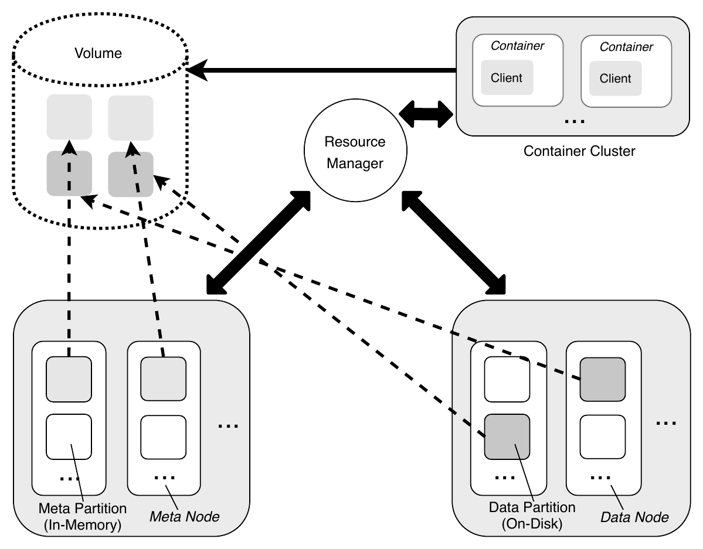
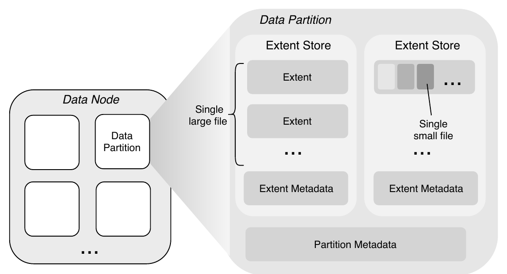
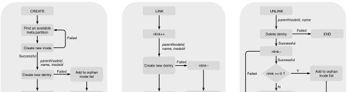
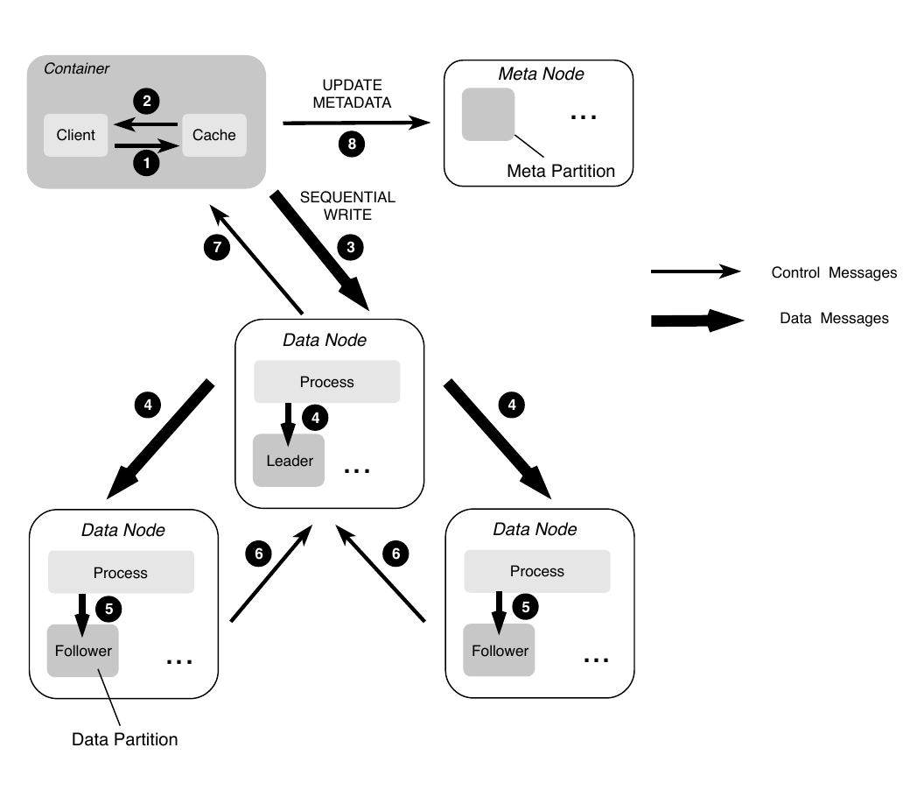
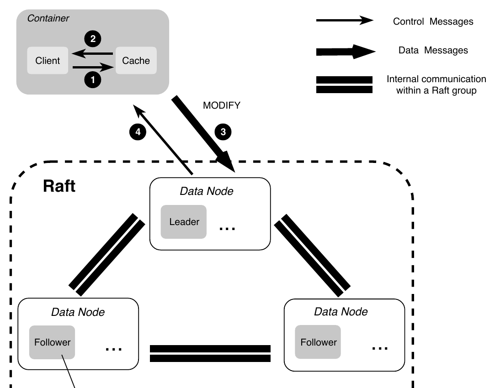
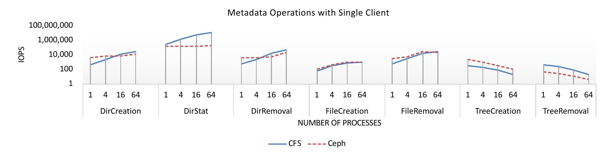
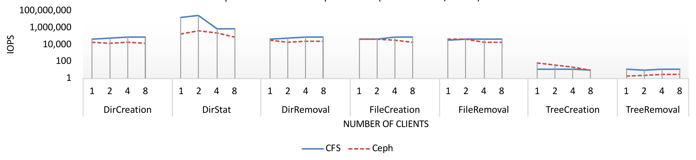
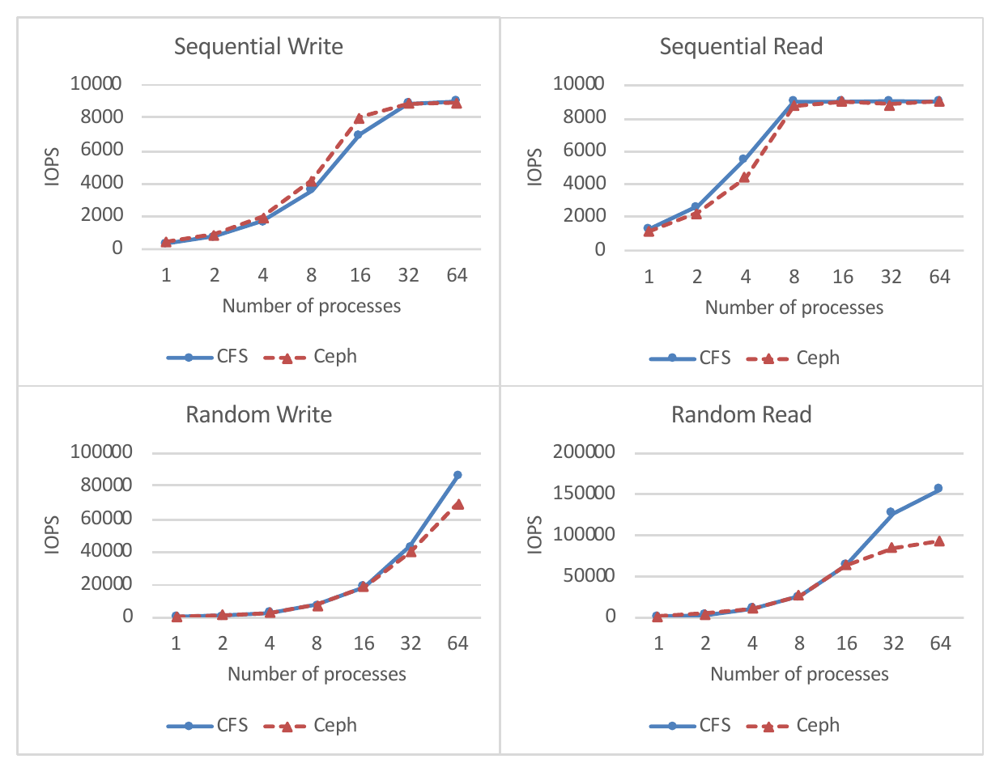
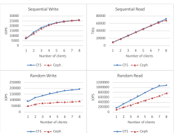
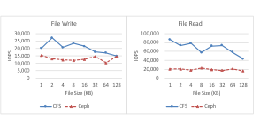

# CFS: A Distributed File System for Large Scale Container Platforms（中文译文）

## 译者说明

本文依据同目录的 `source.pdf` 翻译。章节、图表、公式、算法、代码与参考文献按原文结构保留。

## 作者与出处

Haifeng Liu（§†）、Wei Ding（†）、Yuan Chen（†）、Weilong Guo（†）、Shuoran Liu（†）、Tianpeng Li（†）、Mofei Zhang（†）、Jianxing Zhao（†）、Hongyin Zhu（†）、Zhengyi Zhu（†）

- § 中国科学技术大学，中国合肥
- † 京东，中国北京
- **CCS 概念：** 信息系统 → 分布式存储
- **关键词：** 分布式文件系统；容器；云原生
- **出版信息：** SIGMOD '19，2019 年 6 月 30 日至 7 月 5 日，荷兰阿姆斯特丹；ACM，14 页。DOI：<https://doi.org/10.1145/3299869.3314046>
- **预印本：** arXiv:1911.03001v1 [cs.DC]，2019 年 11 月 8 日

## 摘要

我们提出 CFS，这是一个面向大规模容器平台的分布式文件系统。CFS 同时支持顺序和随机文件访问，针对大文件和小文件优化存储，并针对不同写入场景采用不同复制协议来提升复制性能。它使用元数据子系统存储文件元数据，并根据内存使用量把元数据分布到不同存储节点；这种元数据放置策略避免了扩容时的数据重平衡。CFS 还提供 POSIX 兼容 API，同时放松部分语义和元数据原子性要求，以提升系统性能。

我们与容器平台广泛使用的分布式文件系统 Ceph 进行了全面比较。实验结果表明，在 7 种常用元数据操作测试中，CFS 平均带来约 3 倍的性能提升；此外，在多客户端、多进程的高并发环境中，CFS 表现出更好的随机读写性能。

## 1. 引言

近年来，容器化和微服务给云环境及其架构带来了革命性变化 [1, 3, 17]。应用可以通过持续交付更快地构建、部署和管理，越来越多的公司因此开始把遗留应用和核心业务功能迁移到容器化环境。

每组容器中运行的微服务通常独立于本地磁盘存储。计算与存储解耦使企业能更高效地扩展容器资源，但也产生了对独立存储的需求：第一，容器关闭后仍可能需要保留应用数据；第二，不同容器可能需要同时访问同一文件；第三，不同服务和应用可能需要共享存储资源。没有数据持久化能力，容器在许多负载中的用途会受到限制，尤其是有状态应用。

一种选择是通过 [Container Storage Interface（CSI）](https://github.com/container-storage-interface/spec) 把现有分布式文件系统引入云原生环境。Kubernetes [5]、Mesos [13] 等多种容器编排器已经支持 CSI；也可以使用 [Rook](https://rook.io/) 之类的存储编排器。京东容器平台上的应用和服务工程团队为选取分布式文件系统提供了许多宝贵反馈，但这些反馈也表明：受性能和可扩展性所限，我们很难直接采用任何现有开源方案。

例如，为降低存储成本，不同应用和服务通常需要共享同一存储基础设施。组合负载中的文件大小可能从几 KB 到数百 GB 不等，访问方式也可能是顺序或随机。许多分布式文件系统只针对 HDFS [22] 这类大文件系统，或 Haystack [2] 这类小文件系统进行优化；同时优化大文件和小文件存储的系统很少 [6, 12, 20, 26]。此外，这些文件系统通常使用一刀切的复制协议，无法针对不同写入场景优化复制性能。

大量客户端还可能同时密集访问文件。创建、追加、删除等多数文件操作都需要更新文件元数据，因此把全部文件元数据放在单节点上，很容易受硬件上限影响，成为性能或存储瓶颈 [22, 23]。可以用独立集群存储元数据，但沿这一方向的多数既有工作 [4] 在扩容时需要重平衡存储节点，可能显著降低读写性能。

最后，POSIX 兼容文件系统接口虽能大幅简化上层应用开发，POSIX I/O 标准定义的强一致语义也会显著影响性能。多数 POSIX 兼容文件系统通过放松 POSIX 语义缓解这一问题，但同一文件 inode 与 dentry 之间的原子性要求仍可能限制元数据操作性能。

为解决这些问题，我们提出 Chubao File System（CFS），一个面向大规模容器平台设计的分布式文件系统。CFS 使用 Go 编写，代码公开在 [ChubaoFS/cfs](https://github.com/ChubaoFS/cfs)。其关键特性包括：

- **通用高性能存储引擎。** CFS 高效存储大文件和小文件，并针对不同文件访问模式优化性能。它使用 Linux 的 punch-hole 接口 [21] 异步释放已删除小文件占用的磁盘空间，大幅简化小文件删除的工程实现。
- **场景感知复制。** 现有开源方案通常只允许始终使用一种复制协议 [22, 26, 27]；CFS 则针对追加与覆盖两种写入场景采用不同的强一致复制协议，以提升复制性能。
- **基于利用率的元数据放置。** CFS 使用独立集群存储文件元数据，并根据内存使用量把元数据分布到不同存储节点。该策略的一个优点是扩容时无需重平衡元数据。MooseFS [23] 已将类似思想用于选择 chunk server；据我们所知，CFS 是首个把这一技术用于元数据放置的开源方案。
- **放松 POSIX 语义和元数据原子性。** POSIX 兼容分布式文件系统在多个客户端节点上服务多个进程时，其行为应与本地文件系统在直连存储的单节点上服务多个进程相同。CFS 提供 POSIX 兼容 API，但审慎地放松 POSIX 一致性语义，以及同一文件 inode 与 dentry 之间的原子性要求，使其更符合应用需求并提升系统性能。

## 2. 设计与实现

如图 1 所示，CFS 由元数据子系统、数据子系统和资源管理器组成；容器中托管的各组应用进程可通过不同客户端访问 CFS。



元数据子系统存储文件元数据，由一组 meta node 组成；每个 meta node 又包含一组 meta partition。数据子系统存储文件内容，由一组 data node 组成；每个 data node 又包含一组 data partition。后续小节将详细介绍这两个子系统。

Volume 是 CFS 中的逻辑概念，由一组 meta partition 和 data partition 构成；每个 partition 只能分配给一个 volume。从客户端视角看，volume 是一个包含容器可访问数据的文件系统实例。一个 volume 可挂载到多个容器，使不同客户端能够同时共享文件；任何文件操作之前必须先创建 volume。

Resource manager 通过处理创建/删除 partition、创建新 volume、增加/移除节点等任务来管理文件系统。它还跟踪 meta node 和 data node 的内存/磁盘利用率与存活状态。Resource manager 有多个副本，副本间通过 Raft [16] 等共识算法维持强一致性，并持久化到 [RocksDB](https://rocksdb.org/) 等 key-value store 以供备份和恢复。

### 2.1 元数据存储

#### 2.1.1 内部结构

Metadata subsystem 可以看作一个分布式内存元数据存储。它包含多个 meta node，每个 meta node 可以有数百个 meta partition。每个 meta partition 在内存中保存同一 volume 中文件的 inode 和 dentry，并使用两个 B-tree 加速查找：`inodeTree` 按 inode id 索引，`dentryTree` 按 parent inode id 与 dentry name 索引。

下面的代码片段给出 CFS 中 meta partition、inode 和 dentry 的定义。

```go
type metaPartition struct {
    config        *MetaPartitionConfig
    size          uint64
    dentryTree    *BTree // btree for dentries
    inodeTree     *BTree // btree for inodes
    raftPartition raftstore.Partition
    freeList      *freeList // free inode list
    vol           *Vol
    ... // other fields
}

type inode struct {
    inode      uint64 // inode id
    type       uint32 // inode type
    linkTarget []byte // symLink target name
    nLink      uint32 // number of links
    flag       uint32
    ... // other fields
}

type dentry struct {
    parentId uint64 // parent inode id
    name     string // name of the dentry
    inode    uint64 // current inode id
    type     uint32 // dentry type
}
```

#### 2.1.2 基于 Raft 的复制

文件写入期间的复制以 meta partition 为单位执行。副本间的强一致性由 Raft 共识协议 [16] 的一种修订版本 [MultiRaft](https://github.com/cockroachdb/cockroach/tree/v0.1-alpha/multiraft) 保证；与原始版本相比，它能减少网络中的心跳流量。

#### 2.1.3 故障恢复

内存中缓存的 meta partition 通过快照和日志 [16] 持久化到本地磁盘，用于备份和恢复。系统使用日志压缩等技术缩小日志文件并缩短恢复时间。

值得注意的是，元数据操作期间的故障可能产生没有任何 dentry 关联的 orphan inode，其占用的内存和磁盘空间难以释放。为尽量降低这种情况发生的概率，客户端在故障后始终重试，直到请求成功或达到最大重试次数。

### 2.2 数据存储

#### 2.2.1 内部结构

Data subsystem 同时为大文件和小文件优化存储，并支持顺序与随机访问。它包含一组 data node，每个 data node 又包含一组 data partition。每个 data partition 保存 partition id、replica 地址等 partition metadata，并包含一个称为 extent store 的存储引擎（见图 2）；extent store 由一组称为 extent 的存储单元构成。每个 extent 的 CRC 缓存在内存中，以加快数据完整性检查。

下面的代码片段给出 CFS 中 data partition 的结构。



```go
type dataPartition struct {
    clusterID       string
    volumeID        string
    partitionID     uint64
    partitionStatus int
    partitionSize   int
    replicas        []string // replica addresses
    disk            *Disk
    isLeader        bool
    isRaftLeader    bool
    path            string
    extentStore     *storage.ExtentStore
    raftPartition   raftstore.Partition
    ... // other fields
}
```

大文件和小文件采用不同存储方式。阈值 $t$（默认 128 KB）决定文件是否视为“小文件”：大小不超过 $t$ 的文件是小文件。该阈值可在启动时配置，通常与数据传输包大小对齐，以避免组包或拆包。

#### 2.2.2 大文件存储

大文件内容存为一个或多个 extent 组成的序列，这些 extent 可分布在不同 data node 的不同 data partition 上。向 extent store 写入新文件时，数据总是从新 extent 的零 offset 开始写，因此无需记录 extent 内 offset。文件的最后一个 extent 不需要通过 padding 填满，即 extent 中没有 hole；它也绝不存储其他文件的数据。

#### 2.2.3 小文件存储与打孔

多个小文件的内容聚合存储在一个 extent 中，每个文件内容在 extent 中的物理 offset 记录在相应 meta node。CFS 依赖 [`fallocate()`](http://man7.org/linux/man-pages/man2/fallocate.2.html) 的 punch-hole 接口异步释放待删除文件占用的磁盘空间。这样无需实现垃圾回收机制，也避免维护 extent 内逻辑 offset 到物理 offset 的映射 [2]。这与删除大文件不同：大文件的 extent 可以直接从磁盘移除。

#### 2.2.4 场景感知复制

虽然可以简单地对所有数据使用基于 Raft 的复制来保证强一致性，CFS 的数据子系统仍采用两种复制协议，以在性能和代码复用之间取得更好平衡。文件写入期间的复制以 partition 为单位执行：顺序写（即 append）采用 primary-backup replication [25, 27]；overwrite 则采用与元数据子系统类似的 MultiRaft 复制协议。

原因之一是 primary-backup replication 不适合 overwrite，否则必须牺牲复制性能。覆盖写至少创建一个新 extent 来保存新内容，并把部分原 extent 在逻辑上拆成多个 fragment；这些 fragment 通常像链表一样连接，原 fragment 的指针会替换成与新 extent 关联的 fragment。随着更多内容被覆盖，data partition 上最终会出现过多 fragment，需要进行 defragmentation，从而显著影响复制性能。

另一个原因是 MultiRaft 会额外写日志文件，存在写放大问题，可能直接影响 read-after-write 性能。不过，我们的应用和微服务中 overwrite 远少于顺序写，因此这一性能问题可以接受。

#### 2.2.5 故障恢复

由于存在两种复制协议，发现副本故障时，系统先在 primary-backup replication 中检查并对齐所有 extent；该过程结束后，再开始 MultiRaft 复制的恢复。

顺序写期间允许 partition 上存在 stale data，只要永远不把它返回给客户端即可，因为某个 offset 上的数据提交也意味着该 offset 之前的全部数据都已提交。因此，可以用 offset 表示所有副本均已提交的数据范围；leader 始终向客户端返回所有副本均已提交的最大 offset，客户端随后在相应 meta node 更新该 offset。客户端请求读取时，无论是否存在未完全提交的 stale data，meta node 都只提供副本地址和全部副本已提交数据的 offset。

因此，无需恢复副本上不一致的那部分数据。如果客户端发送一个 $k$ MB 文件的写请求，而所有副本只提交了前 $p$ MB，客户端会把剩余 $k-p$ MB 数据重新写到不同 data partition/node 的 extent。该设计大幅简化了 CFS 顺序写文件时维持强复制一致性的实现。

### 2.3 Resource Manager

Resource manager 通过处理不同类型的任务来管理文件系统。

#### 2.3.1 基于利用率的放置

CFS 根据内存/磁盘使用量把文件元数据和内容分布到不同存储节点，大幅简化了分布式文件系统中的资源分配问题。据我们所知，CFS 是首个把这一思想用于元数据放置的开源方案。Hashing 和 subtree partition [4] 等常用元数据放置策略在增加服务器时，通常需要移动不成比例的大量元数据；容器环境要求短时间完成扩容，这种迁移可能很棘手。Lazy hybrid [4] 和 dynamic subtree partition [28] 等方法延迟迁移数据，或用代理隐藏迁移延迟，却增加了未来开发和维护的工程工作量。相比之下，基于利用率的放置虽然简单，在扩容增加存储节点时却无需重平衡数据；均匀分布还降低了多个客户端同时访问同一存储节点数据的概率，可能提高文件系统的性能稳定性。

创建 volume 后，客户端向 resource manager 请求若干可用 meta/data partition；这些 partition 通常位于内存或磁盘使用率最低的节点。写文件时，客户端从已分配 partition 中随机选择，避免每次写入都与 resource manager 通信来获取实时利用率。

当 resource manager 发现某个 volume 的所有 partition 即将写满时，会自动为该 volume 增加一批新 partition，同样优先选择内存或磁盘利用率最低的节点。一个 partition 已满或达到阈值（即 meta partition 上的文件数，或 data partition 上的 extent 数）后，便不能再存入新数据，但已有数据仍可修改或删除。

#### 2.3.2 Meta partition 拆分

当某个 meta partition 即将达到所存 inode 和 dentry 的数量上限时，resource manager 还必须处理一项特殊的拆分要求：保证新建 partition 中的 inode id 与原 partition 中的 inode id 唯一且不重叠。

算法 1：拆分元数据分区。

```text
procedure PARTITIONING
  mp <- current meta partition
  c <- current cluster
  v <- cluster.getVolume(mp.volName)
  maxPartitionID <- v.getMaxPartitionID()
  if metaPartition.ID < maxPartitionID then return
  if mp.end == math.MaxUint64 then
    end <- maxInodeID + ∆            // 截断 inode 范围
    mp.end <- end
    task <- newSplitTask(c.Name, mp.partitionID, end)
    c.addTask(task)                  // 与 meta node 同步
    c.updateMetaPartition(mp.volName, mp)
    c.createMetaPartition(mp.volName, mp.end + 1)
```

算法 1 给出伪代码。Resource manager 先提前把 meta partition 的 inode 范围截断到上界 $end$，其值大于当前已使用的最大 inode id $\mathit{maxInodeID}$；然后向 meta node 发送拆分请求：把原 meta partition 的 inode id 范围更新为 $[1,end]$，并创建范围为 $[end+1,\infty)$ 的新 meta partition。这样两个 partition 的范围分别为 $[1,end]$ 和 $[end+1,\infty)$。再创建文件时，其 inode id 将取原 partition 中的 $\mathit{maxInodeID}+1$，或新 partition 中的 $end+1$。

每个 meta partition 的 $\mathit{maxInodeID}$ 由 resource manager 与 meta node 的周期通信获得。

#### 2.3.3 异常处理

当发往 meta/data partition 的请求超时（例如网络中断）时，其余副本会先被标记为只读，防止在状态不明时继续接收修改。当某个 partition 因硬件故障等原因长期不可用，节点连续上报多次失败后，系统才判定其不可用；该 partition 上的数据随后由运维流程迁移到新 partition。论文所述版本的这一步仍需人工触发。

### 2.4 客户端

CFS 客户端已与 [FUSE](https://github.com/libfuse/libfuse) 集成，在用户态提供文件系统接口。客户端进程连同自身缓存完全运行在用户态。为减少与 resource manager 的通信，客户端启动时取得并缓存分配给挂载 volume 的可用 meta/data partition 地址，之后周期性地与 resource manager 同步这些可用 partition。

为减少与 meta node 的通信，客户端缓存创建文件时返回的 inode 和 dentry；文件成功写入 data node 后，还缓存 data partition id、extent id 与 offset。打开文件进行读写时，客户端会强制把这些缓存元数据与 meta node 同步，避免使用过期映射。

客户端还缓存最近识别出的 data partition leader。故障恢复可能改变 leader；如果没有缓存，读请求就要逐个尝试每个副本。由于 leader 变更并不频繁，缓存上次的 leader 能在绝大多数情况下把重试次数降到最低。

### 2.5 优化

CFS 部署在京东集群中时主要采用了以下两项优化。

#### 2.5.1 减少心跳

京东生产环境中的 CFS 集群可能有大量 partition 分布在不同 meta/data node 上。即使采用 MultiRaft 协议，每个节点仍可能从同一 Raft group 的其余节点收到爆发式心跳，造成显著通信开销。为缓解这一问题，CFS 在节点之上增加称为 Raft set 的抽象层，进一步减少 Raft group 之间交换的心跳数量：系统把全部节点划分为若干 Raft set，每个集合维护自己的 Raft group；创建新 partition 时优先从同一 Raft set 选择副本。这样每个节点只需与同一 Raft set 中的节点交换心跳。

#### 2.5.2 非持久连接

同一 CFS 集群可能同时服务数万客户端。如果所有客户端都与 resource manager 保持长连接，resource manager 会承受不必要的连接压力。因此客户端与 resource manager 之间使用非持久连接，只在请求分配或同步信息时建立通信。

### 2.6 元数据操作

在大多数现代 POSIX 兼容文件系统和分布式文件系统中 [26]，文件的 inode 与 dentry 通常位于同一存储节点，以保留目录局部性。这里的“目录局部性”是指，同一目录下文件的元数据很可能被反复访问：访问一个文件的元数据后，往往还会访问同目录其他文件或目录本身的元数据。CFS 采用基于利用率的元数据放置，同一文件的 inode 与 dentry 因而可能分布在不同 meta node 上。若为 inode 与 dentry 操作执行完整的分布式事务，其开销会显著影响系统性能。

CFS 的取舍是放松这一原子性要求，只保证一个 dentry 始终至少关联一个 inode；所有元数据操作都遵循这一原则。代价是仍有机会产生 orphan inode，即没有任何 dentry 与之关联的 inode，而它们可能难以从内存中释放。为降低这一概率，CFS 仔细设计了每种元数据操作的工作流。实践中，meta node 内存里很少积累过多 orphan inode；若确实发生，管理员可用 `fsck` 等工具修复文件。



#### 2.6.1 Create

创建文件时，客户端先请求一个可用 meta node 创建 inode。该 meta node 为新 inode 选择本 partition 中尚未使用的最小 inode id，并相应更新该 partition 已使用的最大 inode id。只有 inode 创建成功后，客户端才请求创建对应 dentry。若创建 dentry 失败，客户端会发送 unlink 请求，并把新建 inode 放入本地 orphan inode list；meta node 收到客户端的 evict 请求后才会删除该 inode。需要注意，同一文件的 inode 与 dentry 无需存储在同一个 meta node 上。

#### 2.6.2 Link

为文件创建链接时，客户端先请求 inode 所在的 meta node 把 `nlink`（关联链接数量）加一，然后请求目标父 inode 所在的 meta node，在同一 meta partition 上创建 dentry。若创建 dentry 失败，则把 `nlink` 减一。

#### 2.6.3 Unlink

取消文件链接时，客户端先请求对应 meta node 删除 dentry。只有删除成功，客户端才向目标 inode 所在的 meta node 发送 unlink 请求，把 `nlink` 减一。当 `nlink` 达到阈值（文件为 0，目录为 2）时，客户端把该 inode 放入本地 orphan inode list；meta node 收到客户端的 evict 请求后删除它。若减少 `nlink` 失败，客户端会重试数次；若全部失败，该 inode 最终会变成 orphan inode，可能需要管理员手工处理。

### 2.7 文件操作

CFS 放松了 POSIX 一致性语义：它只保证文件/目录操作的顺序一致性，不提供租约机制来阻止多个客户端写入同一文件或目录。若需要更严格的一致性级别，须由上层应用负责维持。

#### 2.7.1 顺序写

如图 4 所示，顺序写文件时，客户端先从缓存中随机选择一个可用 data partition，再持续向 leader 发送固定大小（例如 128 KB）的数据包。每个数据包都包含各副本地址、目标 extent id、extent 内 offset 和文件内容。副本地址由 resource manager 以数组形式提供并缓存在客户端；数组下标规定复制顺序，下标为 0 的副本就是 leader。因此客户端总能直接向 leader 发送写请求，不引入额外通信；之后 primary-backup replication 按该顺序执行。客户端收到 leader 的 commit 后，立即更新本地缓存，并周期性地与 meta node 同步，或在上层应用调用 [`fsync()`](http://man7.org/linux/man-pages/man2/fdatasync.2.html) 时同步。



#### 2.7.2 随机写

CFS 的随机写是 in-place 写。随机写文件时，客户端先比较原数据和新数据的 offset，把数据分为需要追加和需要覆盖的部分，再分别处理。追加部分按前述顺序写流程处理；覆盖部分则按图 5 所示流程写入，文件在 data partition 上的 offset 不变。



#### 2.7.3 删除

Delete 是异步操作。删除文件时，客户端向对应 meta node 发送 delete 请求；meta node 收到请求后更新目标 inode 的 `nlink`。若 `nlink` 达到阈值（文件为 0，目录为 2），该 inode 会被标记为已删除（参见 2.1 节给出的 inode 结构）。之后由独立进程清理该 inode，并与 data node 通信以删除文件内容。

#### 2.7.4 读取

读操作只能在 Raft leader 上执行；primary-backup group 的 leader 与 Raft group 的 leader 可能不同。读取文件时，客户端向对应 data node 发送读请求，请求由客户端缓存中的 data partition id、extent id、extent offset 等数据构造。

## 3. 设计选择讨论

本节重点说明构建 CFS 时所作的若干设计选择。

### 3.1 中心化与去中心化

中心化和去中心化是分布式系统的两种设计范式 [7]。前者 [10, 22] 相对容易实现，但单个 master 可能成为可扩展性瓶颈；后者 [8] 通常更可靠，却也更复杂。

设计 CFS 时，我们选择中心化，主要原因是它更简单。但是，若单个 resource manager 保存全部文件元数据，元数据操作的可扩展性就会受限，而元数据操作在典型文件系统工作负载中可能占到一半 [18]。因此，CFS 使用独立集群保存元数据，显著提高整个文件系统的可扩展性。从这一角度看，CFS 尽量减少 resource manager 的参与，使其不易成为瓶颈。即便如此，resource manager 的可扩展性仍可能受到内存和磁盘空间限制；但根据我们的经验，这从未成为问题。

### 3.2 独立 meta node 与数据节点上的元数据

一些分布式文件系统把文件元数据和内容存储在同一台机器上 [15, 26]；另一些则由专门的元数据服务器独立管理元数据 [11, 22]。

CFS 选择使用独立 meta node，并把全部文件元数据保存在内存中以便快速访问。这样可为 meta node 选择内存密集型机器，为 data node 选择磁盘密集型机器，从而提高成本效益。另一个优点是部署灵活：若一台机器同时拥有大容量内存和磁盘，仍可把 meta node 与 data node 物理部署在一起。

### 3.3 一致性模型和保证

CFS 的存储层和文件系统层采用不同的一致性模型。

存储引擎通过 primary-backup 或基于 Raft 的复制协议保证副本间强一致。选择这两种协议是因为：前者不适合 overwrite，否则必须牺牲复制性能；后者会额外写日志，存在写放大问题。

文件系统本身虽然提供 POSIX 兼容 API，却有选择地放松了 POSIX 一致性语义，以更好地契合应用需求并提升系统性能。例如，POSIX 语义要求写入具有强一致性：写操作必须阻塞应用，直到系统能够保证之后的任何读取都看到刚写入的数据。这在本地很容易实现，但在分布式文件系统上，锁竞争和同步引起的性能下降使其很难做到。CFS 在不同客户端修改文件中互不重叠的部分时提供一致性；若两个客户端试图修改同一部分，则不提供一致性保证。该设计基于这样的事实：在容器化环境中，许多场景并不严格需要 POSIX 语义的刚性保证，即应用很少依赖文件系统提供完整强一致性，多租户系统中的两个独立作业也很少共同写入同一共享文件。

## 4. 评估

Ceph 是一种广泛用于容器平台的分布式文件系统。本节通过一组实验，从多个方面比较 CFS 与 Ceph。

### 4.1 实验设置

表 1：系统配置。

| 项目 | 配置 |
| --- | --- |
| Processor Number | Xeon E5-2683V4 |
| Number of Cores | 16 |
| Max Turbo Frequency | 3.00 GHz |
| Processor Base Frequency | 2.10 GHz |
| Network Bandwidth | 1000 Mbps |
| Memory | DDR4 2400MHz, 8 x 32 GB |
| Disk | 16 x 960 GB SSD |
| Operating System | Linux 4.17.12 |

CFS 在 10 台机器组成的同一集群上同时部署 meta node 和 data node，另部署一个含 3 个副本的 resource manager。每台机器有 10 个 meta partition 和 1500 个 data partition。Ceph 采用类似配置：在相同的 10 台机器上部署 OSD 和 MDS，每台机器运行 16 个 OSD 进程和 1 个 MDS 进程。Ceph 版本为 12.2.11，存储引擎配置为经 TCP/IP 网络栈使用 Bluestore。除非另有说明，以下实验中的 CFS 和 Ceph 均使用默认配置。

### 4.2 元数据操作

表 2：`mdtest` 中测试项说明。

| 测试 | 描述 |
| --- | --- |
| DirCreation | 创建目录 |
| DirStat | 列出当前目录中的所有文件 |
| DirRemoval | 删除目录 |
| FileCreation | 创建文件 |
| FileRemoval | 删除文件属性 |
| TreeCreation | 创建包含多个文件、呈树形结构的目录 |
| TreeRemoval | 删除包含多个文件、呈树形结构的目录 |

表 2 给出各项测试的定义；表 3 则列出高并发配置下的详细结果。

表 3：8 个客户端、每客户端 64 个进程时的元数据操作 IOPS。

| Test Name | CFS (multi) | Ceph (multi) | % of Improv. |
| --- | ---: | ---: | ---: |
| DirCreation | 83,729 | 16,627 | 404 |
| DirStat | 875,867 | 91,050 | 862 |
| DirRemoval | 94,235 | 23,807 | 296 |
| FileCreation | 85,556 | 21,919 | 290 |
| FileRemoval | 50,119 | 22,573 | 122 |
| TreeCreation | 10 | 11 | -9 |
| TreeRemoval | 12 | 3 | 300 |





为评估元数据子系统的性能和可扩展性，我们聚焦 [`mdtest`](https://github.com/hpc/ior) 中 7 种常用元数据操作；表 2 给出其说明。`TreeCreation` 和 `TreeRemoval` 主要关注把目录作为树形结构中的非叶节点来操作。

图 6 给出单客户端、不同进程数下各项测试的 IOPS；图 7 给出相同测试在多客户端环境中的 IOPS，每个客户端运行 64 个进程。为便于展示数量级不同的结果，纵轴使用对数刻度。单客户端、单进程时，Ceph 在 7 项测试中的 5 项领先（`DirStat` 和 `TreeRemoval` 除外）；随着客户端和进程数增加，CFS 开始追上。在 8 个客户端、每客户端 64 个进程时，CFS 在 7 项测试中的 6 项领先（`TreeCreation` 除外）。表 3 给出此时的详细 IOPS，平均性能约提升 3 倍。这表明，随着客户端和进程数增多，CFS 基于利用率的元数据放置所带来的性能收益，可能超过 Ceph 目录局部性感知元数据放置的优势。

`DirStat` 中，CFS 在单客户端和多客户端两种情况下均优于 Ceph，主要因为二者处理 `readdir` 请求的方式不同。Ceph 的每个 `readdir` 请求之后，都要发出一组 `inodeGet` 请求，从不同 MDS 获取当前目录中的全部 inode；请求到的 inode 通常缓存在 MDS 中以便后续快速访问。CFS 则用一次 `batchInodeGet` 取代这些 `inodeGet` 请求以降低通信开销，并把结果缓存在客户端，使后续请求无需再与同一组 meta node 通信即可快速响应。多客户端情况下图 7 中突然出现的性能下降，可能由 CFS 客户端缓存未命中引起。

`TreeCreation` 中，Ceph 在单客户端情况下表现优于 CFS；但客户端增多后，两者差距缩小。客户端较少时，目录局部性允许复用同一 MDS 中缓存的 dentry 和 inode，因而使 Ceph 受益。客户端增多后，特定 MDS 的压力上升，Ceph 需要把同一目录下文件的元数据动态放置到不同 MDS，并把相应请求重定向到代理 MDS [28]；额外开销缩小了 Ceph 与 CFS 的差距。

`TreeRemoval` 中，CFS 在单客户端和多客户端两种情况下均优于 Ceph。与 `DirStat` 类似，CFS 处理 `readdir` 的方式是原因之一。此外，客户端较少时，同一目录下文件的元数据通常集中在单个 MDS，Ceph 的元数据删除请求可能需要排队；随着客户端增多，先前测试触发的重平衡可能已把文件元数据分布到不同 MDS，Ceph 的目录局部性收益也可能降低。

### 4.3 大文件

大文件实验先考察单客户端环境中不同进程数的结果，每个进程操作一个独立的 40 GB 文件。我们使用 [`fio`](https://github.com/axboe/fio) 的 direct I/O 模式生成不同工作负载；CFS 和 Ceph 的客户端与服务器均部署在不同机器上。为了让 Ceph 达到最佳性能，需要调节控制队列数和队列处理线程数的 `osd_op_num_shards` 与 `osd_op_num_threads_per_shard`，我们分别将其设为 6 和 4；继续增大任一值都会因 CPU 压力过高而降低写性能。





如图 8 所示，二者在不同进程数下的性能很相近；例外是进程数超过 16 后，CFS 在随机读写测试中具有更高 IOPS。这可能有两个原因。第一，Ceph 的每个 MDS 只在内存中缓存部分文件元数据；随机读取时，缓存未命中率会随进程数增加而大幅上升，导致频繁磁盘 I/O。相比之下，CFS 的每个 meta node 都把全部文件元数据缓存在内存中，从而避免昂贵磁盘 I/O。第二，CFS 的 overwrite 是 in-place 写，无需更新文件元数据；Ceph 的 overwrite 通常需要经过多个队列，只有数据和元数据都持久化并同步后，才能向客户端返回 commit 消息。

随后，我们用同一组测试考察多客户端环境。随机读写测试中，每个客户端运行 64 个进程；顺序读写测试中，每个客户端运行 16 个进程；每个进程仍操作一个独立的 40 GB 文件。Ceph 的每个客户端操作不同文件目录，每个目录绑定到一个特定 MDS，以最大化并发度并提升性能稳定性。图 9 显示，CFS 在随机读写测试中具有显著性能优势，而二者在顺序读写测试中的性能相近；这些结果与单客户端实验一致，原因也相同。总之，在高并发环境下，CFS 在我们的大文件随机读写测试中优于 Ceph。

### 4.4 小文件

小文件实验使用 `mdtest` 操作大小从 1 KB 到 128 KB 的小文件，模拟产品图片这一通常创建后不再修改的用例。在 CFS 配置中，128 KB 是决定文件是否聚合到单个 extent、即是否视为“小文件”的阈值。Ceph 中每个客户端操作不同目录，并把每个目录绑定到一个特定 MDS，以最大化并发度并提升性能稳定性。



CFS 在小文件读写中优于 Ceph。读场景中，CFS 将所有文件元数据保存在内存中，避免昂贵磁盘 I/O；写场景中，小文件继续使用已分配 extent，客户端不必向 resource manager 请求新 extent，而可直接把写请求发给 data node，从而进一步减少网络开销。

## 5. 相关工作

GFS [10] 及其开源实现 HDFS [22] 面向以顺序方式访问的大文件。二者都采用 master-slave 架构 [24]，由单个 master 保存全部文件元数据。与 GFS 和 HDFS 不同，CFS 使用独立的元数据子系统提供可扩展的元数据存储方案，使 resource manager 更不容易成为瓶颈。

Haystack [2] 借鉴日志结构文件系统 [19]，用于服务大型社交网络中共享照片所形成的长尾请求。其核心思想是访问元数据时避免磁盘操作。CFS 采用相似思路，把文件元数据放入主内存；但与 Haystack 不同，内存中保存的是文件内容的实际物理 offset，而非逻辑索引，删除文件则使用底层文件系统提供的 punch-hole 接口，无需依赖垃圾收集器定期合并和压实来提高磁盘利用率。此外，Haystack 删除文件时不保证副本间强一致，并且需要定期合并和压实，这可能成为性能杀手。一些工作 [9, 29] 提出通过智能地把相关文件和元数据分组，更高效地管理小文件和元数据。CFS 采用不同的设计原则，把文件元数据和内容分开存储，从而使 meta node 和 data node 的部署更灵活、更具成本效益。

Windows Azure Storage（WAS）[6] 是向客户端提供强一致性和多租户能力的云存储系统。与 CFS 不同，它在把数据流式写入下层之前，构建了一个额外 partition 层来处理随机写。AWS EFS [20] 是提供可扩展、弹性文件存储的云存储服务。由于 Azure 和 AWS EFS 均未开源，我们无法评估它们相对于 CFS 的性能。

PolarFS [7] 是为阿里巴巴数据库服务设计的分布式文件系统，它利用轻量级网络栈和 I/O 栈来使用 RDMA、NVMe 与 SPDK 等新兴技术。OctopusFS [14] 是基于 HDFS 的分布式文件系统，利用自动化、数据驱动的策略，在内存、SSD、HDD 和远程存储等集群存储层级之间管理数据放置和检索。这些工作与 CFS 正交；CFS 也可以采用类似技术，以充分利用新兴硬件和存储层级。

已有若干分布式文件系统与 Kubernetes 集成 [12, 23, 26]。Ceph [26] 是 PB 级对象/文件存储系统，它使用为不可靠对象存储设备（OSD）组成的异构动态集群设计的伪随机数据分布函数 CRUSH，最大限度地分离数据与元数据管理。本文已对 Ceph 做了全面比较。GlusterFS [12] 是可扩展分布式文件系统，把多台服务器的磁盘存储资源聚合成单一全局命名空间。MooseFS [23] 是容错、高可用、POSIX 兼容且可扩展的分布式文件系统；但与 HDFS 类似，它使用单个 master 管理文件元数据。[MapR-FS](https://mapr.com/products/mapr-fs/) 是 POSIX 兼容的分布式文件系统，提供可靠、高性能、可扩展且支持完整读写的数据存储；与 Ceph 类似，它把元数据与数据本身一起进行分布式存储。

## 6. 结论与未来工作

本文介绍了 CFS，一种为京东电商业务提供服务的分布式文件系统。CFS 具有若干区别于其他开源方案的独特特性。例如，它的通用存储引擎采用场景感知复制，以针对不同文件访问模式优化性能；它还使用独立集群，以简单而高效的元数据放置策略分布式存储文件元数据；此外，它提供 POSIX 兼容 API，同时放松 POSIX 语义和元数据原子性，以获得更好的系统性能。

论文所述实现已完成大多数 POSIX 操作，团队仍在补充 `xattr`、`fcntl`、`ioctl`、`mknod` 和 `readdirplus`。后续计划包括利用 Linux page cache 加速文件操作、改进文件锁与缓存一致性、支持 RDMA 等新硬件标准，并开发内核态 POSIX 文件系统接口，以完全消除 FUSE 开销。

## 致谢

我们感谢匿名评审提出的建议和意见，并感谢中国科学技术大学陈恩红教授对本工作的帮助。

## 参考文献

- [1] Balalaie, A., Heydarnoori, A., and Jamshidi, P. Microservices architecture enables devops: Migration to a cloud-native architecture. IEEE Software 33, 3 (May 2016), 42–52.
- [2] Beaver, D., Kumar, S., Li, H. C., Sobel, J., and Vajgel, P. Finding a needle in haystack: Facebook’s photo storage. In Proceedings of the 9th USENIX Conference on Operating Systems Design and Implementation (Berkeley, CA, USA, 2010), OSDI’10, USENIX Association, pp. 47–60.
- [3] Bernstein, D. Containers and cloud: From lxc to docker to kubernetes. IEEE Cloud Computing 1, 3 (Sept. 2014), 81–84.
- [4] Brandt, S. A., Miller, E. L., Long, D. D. E., and Xue, L. Efficient metadata management in large distributed storage systems. In Proceedings of the 20th IEEE/11th NASA Goddard Conference on Mass Storage Systems and Technologies (MSS’03) (Washington, DC, USA, 2003), MSS ’03, IEEE Computer Society, pp. 290–298. DOI: <https://doi.org/10.1109/MASS.2003.1194865>.（目标 PDF 的页码尾值缺失；此处依据 DOI 登记恢复。）
- [5] Brewer, E. A. Kubernetes and the path to cloud native. In Proceedings of the Sixth ACM Symposium on Cloud Computing (New York, NY, USA, 2015), SoCC ’15, ACM, pp. 167–167.
- [6] Calder, B., Wang, J., Ogus, A., Nilakantan, N., Skjolsvold, A., McKelvie, S., Xu, Y., Srivastav, S., Wu, J., Simitci, H., Haridas, J., Uddaraju, C., Khatri, H., Edwards, A., Bedekar, V., Mainali, S., Abbasi, R., Agarwal, A., Haq, M. F. u., Haq, M. I. u., Bhardwaj, D., Dayanand, S., Adusumilli, A., McNett, M., Sankaran, S., Manivannan, K., and Rigas, L. Windows azure storage: A highly available cloud storage service with strong consistency. In Proceedings of the Twenty-Third ACM Symposium on Operating Systems Principles (New York, NY, USA, 2011), SOSP ’11, ACM, pp. 143–157.
- [7] Cao, W., Liu, Z., Wang, P., Chen, S., Zhu, C., Zheng, S., Wang, Y., and Ma, G. Polarfs: An ultra-low latency and failure resilient distributed file system for shared storage cloud database. Proc. VLDB Endow. 11, 12 (Aug. 2018), 1849–1862.
- [8] DeCandia, G., Hastorun, D., Jampani, M., Kakulapati, G., Lakshman, A., Pilchin, A., Sivasubramanian, S., Vosshall, P., and Vogels, W. Dynamo: Amazon’s highly available key-value store. In Proceedings of Twenty-first ACM SIGOPS Symposium on Operating Systems Principles (New York, NY, USA, 2007), SOSP ’07, ACM, pp. 205–220.
- [9] Ganger, G. R., and Kaashoek, M. F. Embedded inodes and explicit grouping: Exploiting disk bandwidth for small files. In Proceedings of the Annual Conference on USENIX Annual Technical Conference (Berkeley, CA, USA, 1997), ATEC ’97, USENIX Association, pp. 1–1.
- [10] Ghemawat, S., Gobioff, H., and Leung, S.-T. The google file system. In Proceedings of the Nineteenth ACM Symposium on Operating Systems Principles (New York, NY, USA, 2003), SOSP ’03, ACM, pp. 29–43.
- [11] Gibson, G. A., and Van Meter, R. Network attached storage architecture. Commun. ACM 43, 11 (Nov. 2000), 37–45.
- [12] Hat, R. Gluster file system. "https://github.com/gluster/glusterfs", 2005.
- [13] Hindman, B., Konwinski, A., Zaharia, M., Ghodsi, A., Joseph, A. D., Katz, R., Shenker, S., and Stoica, I. Mesos: A platform for fine-grained resource sharing in the data center. In Proceedings of the 8th USENIX Conference on Networked Systems Design and Implementation (Berkeley, CA, USA, 2011), NSDI’11, USENIX Association, pp. 295–308.
- [14] Kakoulli, E., and Herodotou, H. Octopusfs: A distributed file system with tiered storage management. In Proceedings of the 2017 ACM International Conference on Management of Data (New York, NY, USA, 2017), SIGMOD ’17, ACM, pp. 65–78.
- [15] Morris, J. H., Satyanarayanan, M., Conner, M. H., Howard, J. H., Rosenthal, D. S., and Smith, F. D. Andrew: A distributed personal computing environment. Commun. ACM 29, 3 (Mar. 1986), 184–201.
- [16] Ongaro, D., and Ousterhout, J. In search of an understandable consensus algorithm. In Proceedings of the 2014 USENIX Conference on USENIX Annual Technical Conference (Berkeley, CA, USA, 2014), USENIX ATC’14, USENIX Association, pp. 305–320.
- [17] Pahl, C. Containerization and the paas cloud. IEEE Cloud Computing 2, 3 (May-June 2015), 24–31.
- [18] Roselli, D., Lorch, J. R., and Anderson, T. E. A comparison of file system workloads. In Proceedings of the Annual Conference on USENIX Annual Technical Conference (Berkeley, CA, USA, 2000), ATEC ’00, USENIX Association, pp. 4–4.
- [19] Rosenblum, M., and Ousterhout, J. K. The design and implementation of a log-structured file system. ACM Trans. Comput. Syst. 10, 1 (Feb. 1992), 26–52.
- [20] Service, A. W. Amazon elastic file system. "https://docs.aws.amazon.com/efs/latest/ug/efs-ug.pdf", 2016.
- [21] Shen, K., Park, S., and Zhu, M. Journaling of journal is (almost) free. In Proceedings of the 12th USENIX Conference on File and Storage Technologies (FAST 14) (Santa Clara, CA, 2014), USENIX, pp. 287–293.
- [22] Shvachko, K., Kuang, H., Radia, S., and Chansler, R. The hadoop distributed file system. In Proceedings of the 2010 IEEE 26th Symposium on Mass Storage Systems and Technologies (MSST) (Washington, DC, USA, 2010), MSST ’10, IEEE Computer Society, pp. 1–10.
- [23] Technology, C. Moosefs 3.0 storage classes manual. "https://moosefs.com/Content/Downloads/moosefs-storage-classes-manual.pdf", 2016.
- [24] Thekkath, C. A., Mann, T., and Lee, E. K. Frangipani: A scalable distributed file system. In Proceedings of the Sixteenth ACM Symposium on Operating Systems Principles (New York, NY, USA, 1997), SOSP ’97, ACM, pp. 224–237.
- [25] van Renesse, R., and Schneider, F. B. Chain replication for supporting high throughput and availability. In Proceedings of the 6th Conference on Symposium on Opearting Systems Design & Implementation - Volume 6 (Berkeley, CA, USA, 2004), OSDI’04, USENIX Association, pp. 7–7.
- [26] Weil, S. A., Brandt, S. A., Miller, E. L., Long, D. D. E., and Maltzahn, C. Ceph: A scalable, high-performance distributed file system. In Proceedings of the 7th Symposium on Operating Systems Design and Implementation (Berkeley, CA, USA, 2006), OSDI ’06, USENIX Association, pp. 307–320.
- [27] Weil, S. A., Leung, A. W., Brandt, S. A., and Maltzahn, C. Rados: A scalable, reliable storage service for petabyte-scale storage clusters. In Proceedings of the 2Nd International Workshop on Petascale Data Storage: Held in Conjunction with Supercomputing ’07 (New York, NY, USA, 2007), PDSW ’07, ACM, pp. 35–44.
- [28] Weil, S. A., Pollack, K. T., Brandt, S. A., and Miller, E. L. Dynamic metadata management for petabyte-scale file systems. In Proceedings of the 2004 ACM/IEEE Conference on Supercomputing (Washington, DC, USA, 2004), SC ’04, IEEE Computer Society, pp. 4–4. DOI: <https://doi.org/10.1109/SC.2004.22>.（目标 PDF 的页码尾值缺失；此处依据 DOI 登记恢复。）
- [29] Zhang, Z., and Ghose, K. hfs: A hybrid file system prototype for improving small file and metadata performance. In Proceedings of the 2Nd ACM SIGOPS/EuroSys European Conference on Computer Systems 2007 (New York, NY, USA, 2007), EuroSys ’07, ACM, pp. 175–187.
