# Data Blocks: Hybrid OLTP and OLAP on Compressed Storage using both Vectorization and Compilation（中文译文）

## 译者说明

本文依据同目录的 `source.pdf` 翻译。章节、图表、公式、算法、代码与参考文献按原文结构保留。

## 摘要

本文目标是在高性能混合 OLTP 和 OLAP 数据库中降低主内存占用，同时保持较高的查询性能与事务吞吐。为此，我们提出一种面向冷数据的创新压缩列式存储格式，称为 Data Blocks。Data Blocks 还包含一种新的轻量索引结构 Positional SMA，它可以在整个块无法被排除时进一步缩小块内扫描范围。

为了保持最高 OLTP 性能，Data Blocks 使用非常轻量的压缩方案，使 OLTP 事务仍可快速访问单个元组。这一点不同于许多专用分析数据库的存储方案，后者通常需要先做 bit-unpacking。此前高性能分析系统通常选择向量化查询执行或 JIT 查询编译。Data Blocks 的细粒度自适应性要求把二者的优点结合起来：由解释型向量化扫描子系统向 JIT 编译的查询管线供给数据。我们在完整的混合 OLTP/OLAP 主内存数据库 HyPer 上评估后表明，Data Blocks 能在多种查询负载上提升性能，同时保持高事务吞吐。

## 1. 引言

近年出现了一类专门面向 OLAP 工作负载的新数据库架构。这些系统以压缩列式格式存储数据，并通过提升 CPU 执行效率，相比传统行存数据库获得超过一个数量级的查询性能提升。这种效率提升通常来自向量化执行：不再逐元组解释查询表达式，而是对一批值执行操作。块级操作的虚函数一次处理数千个元组，降低了解释开销；函数内部针对块的循环也能受益于循环优化和自动 SIMD 指令生成。IBM BLU、SQL Server Column Index、SAP HANA 和 Vectorwise 都属于这一类。

另一种近期用于加速查询求值的方法是把 SQL 查询 JIT 编译为可执行代码。它完全避免查询解释及其开销。Drill、HyPer 和 Impala 都使用了 JIT。

本文描述 HyPer 的演进：HyPer 原本是一个使用 JIT 编译查询引擎的完整主内存数据库，现在为了引入新的压缩列式存储格式 Data Blocks，需要在执行引擎中加入向量化。HyPer 的不同之处在于，它希望在同一个数据库状态和同一套存储后端上同时支持高性能 OLTP 与 OLAP。本文的主要目标是通过压缩降低 HyPer 的主内存占用，同时保持原系统的 OLTP 与 OLAP 性能。

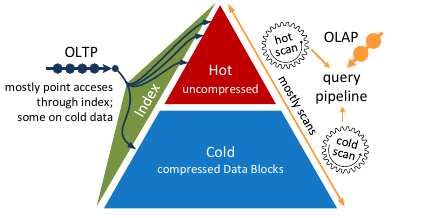

本文贡献包括：

- 提出面向混合数据库系统的新型压缩列式存储格式 Data Blocks。
- 在压缩数据上使用轻量索引以提升扫描性能。
- 给出 SIMD 优化的谓词求值算法。
- 展示如何用向量化把多种存储布局组合接入一个 JIT 编译、逐元组执行的查询引擎。

混合数据库系统难以设计，因为 OLTP 和 OLAP 对物理优化的要求常常相互矛盾。压缩可以降低内存占用，并因减少带宽消耗而改善分析查询性能；但高性能事务系统通常避免压缩，以便快速访问单个元组。混合系统与专用分析系统的根本区别在于，它必须在一个数据库实例中同时有效管理热数据与冷数据。

一种做法是把关系划分为读优化分区和写优化分区。更新只发生在写优化分区中，然后周期性地合并到读优化的压缩分区。但合并过程复杂度为 O(n)，其中 n 是关系基数，并且需要重新压缩整个关系，因此非常昂贵。本文提出另一种策略：在 HyPer 中，关系被划分为固定大小的 chunk；当某个 chunk 被识别为冷数据后，就按该 chunk 的最优压缩方案独立压缩为只读不可变 Data Block。一个 chunk 被打包为 Data Block 后，内部数据被冻结。更新仍然可行，但会把冷记录置为无效，并把新版本插入热区；内部等价于删除后插入。

为了通过元组位置高效访问单条记录，Data Blocks 只采用轻量压缩方案。许多 OLAP 系统使用 bit-packing 提高压缩率，但本文有意避免。实验表明，即使使用近年的 SIMD bit-packed 算法，扫描也只有在早期过滤极端选择性、或整个块全部命中时才很快；若早期过滤得到稀疏位置集合，bit-unpacking 扫描列的代价会掩盖早期过滤收益。Data Blocks 的设计目标是让 OLTP 的压缩数据位置访问保持低成本，同时让扫描型 OLAP 负载受益于早期过滤。

为加速 Data Block 扫描，我们提出 Positional SMA。PSMA 是一种轻量索引，即使块无法依据最小值/最大值完全跳过，也可以缩小块内扫描范围。

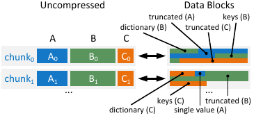

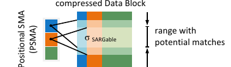

逐元组 JIT 编译的强项是为 OLTP 和 OLAP 查询生成每个元组所需指令数很少的高效代码。向量化通过内存把数据在算子间传递，而逐元组 JIT 可以通过 CPU 寄存器传递数据，避免性能关键的 load/store 指令。向量化对 OLTP 没有直接 CPU 效率收益，因为其效率依赖同时处理大量元组，而 OLTP 查询通常触及极少元组并避免扫描。

但按 chunk 选择不同压缩方案会给 JIT 编译的逐元组引擎带来挑战：每个压缩块可能有不同内存布局，扫描所需编译代码路径数量会指数级增长，导致临时查询和事务的编译时间不可接受。此时向量化扫描的优势出现了：扫描可以保持解释式并预编译；向量化扫描还易于利用 SIMD，并可表达自适应算法。我们最终展示了如何将 JIT 编译与向量化融合：解释型向量化扫描子系统把结果送入 JIT 编译的逐元组查询管线。对于向量化谓词求值，我们还给出了新的 SSE/AVX2 SIMD 算法。

## 2. 相关工作

与 Data Blocks 最接近的是 IBM DB2 BLU 的存储格式。BLU 也把一段元组的所有列以压缩列式形式放在块中，这与 PAX 概念类似，并且能在扫描中早期求值范围过滤。主要差异在于：HyPer 避免 bit-packing 以保持位置访问快速，并引入 PSMA 进一步提升早期选择求值。

近年关于高级 bit-packing 及其 SIMD 实现的研究强调早期过滤收益，但往往忽略 bit-unpacking 的高逐元组成本，或把这类格式定位为辅助存储结构。本文选择字节对齐存储，主要是为了避免这一惩罚，使早期过滤能在更广泛的查询负载中受益。

Vectorwise 提出把数据 chunk 解压到 CPU cache 中并在缓存中处理。Vectorwise 不在扫描中做早期过滤，而是完全解压所有扫描列范围，因为它认为位置式解压过于低效。HyPer 的高效位置访问则允许在中等选择性场景下也受益于扫描内部 SARGable 谓词的早期求值。取决于选择性，HyPer 的早期过滤可比 Vectorwise 快数倍；代价是字节对齐压缩平均增加不超过 1.25 倍空间。

Abadi 等人系统评估了列式数据库中的压缩方案，结论是轻量压缩优于重量压缩，因为可以直接在压缩数据上操作。本文只考虑压缩数据上的过滤操作和点查，不把压缩数据传递给连接等更复杂算子。Oracle Database 使用块级压缩，但压缩方案较少，也不是为现代 CPU 上的高效处理设计。SAP HANA 面向混合负载优化，但采用另一条路线：整体关系优化内存与扫描性能，更新发生在单独分区后周期性合并。Microsoft Hekaton 的 Siberia 框架用于管理冷数据，但主要通过把冷数据驱逐到磁盘来降低 RAM 使用，与 Data Blocks 不同。

关于 JIT 与向量化结合，Vectorwise 曾尝试 JIT 编译投影和 hash join，但收益有限。Impala 的 JIT 方式也不同于 HyPer 的逐元组 JIT。Impala 为每个物理算子提供 C++ 模板类，预先编译为 LLVM 中间代码；查询编译时只编译处理元组和表达式的方法并链接到模板类中。不同算子没有融合，算子之间仍通过 tuple buffer 通信，因此某种意义上仍是向量化算子。这样做丢失了 JIT 的主要优势：减少指令数、通过寄存器传递数据、避免 load/store。向量化则方便使用 SIMD，在数据库中已用于选择扫描、bit unpacking、批量加载、排序和图遍历等。

## 3. Data Blocks

Data Blocks 是自包含容器，用字节可寻址压缩格式存储一个或多个属性 chunk。目标是在保持高 OLTP 与 OLAP 性能的同时节省内存。Data Block 维护无指针的扁平结构，也适合驱逐到二级存储。一个 Data Block 包含重建属性值所需的全部数据，以及 PSMA 轻量索引结构，但不包含 schema 等元数据，因为每个块重复保存会浪费空间。

Data Blocks 还面向未来的 NVRAM 和字节可寻址 flash 设计。存放在这类设备上的 Data Block 可以直接寻址和读取，无需把整个块读入 RAM。

在 HyPer 中，Data Blocks 用作冷数据的压缩内存存储格式，也用于持久化。识别冷 chunk 是正交问题。一旦记录被打包到 Data Block 中，内部数据不可变；只允许删除操作，即用标志标记冷记录。更新会转换为删除冷记录并向关系的热未压缩 chunk 插入新记录。

Data Blocks 具有如下性质：

- 每个 chunk 中每个属性根据实际值分布选择最优压缩方法，因此能获得较高压缩率。
- 只使用字节可寻址压缩格式，拒绝 BitWeaving 等 sub-byte 编码，以支持 OLTP 和 OLAP 所需的高效点查。
- SARGable 扫描限制，如 `=`, `is`, `<`, `<=`, `>`, `>=`, `between`，可在压缩表示上通过 SIMD 方法求匹配。Data Block 中多数压缩数据为 1、2 或 4 字节整数，因此 SIMD 加速甚至可能高于未压缩数据。
- Data Blocks 包含每个属性的 SMA，即最小值和最大值，可用于扫描时跳过整个 Data Block。
- Data Blocks 还包含 PSMA，它把值映射到块内可能出现该值的位置范围，即使值域较大且整个块不能跳过，也能进一步缩小扫描范围。

SMA 和 PSMA 并不局限于 Data Blocks，也可用于未压缩 chunk。但在 HyPer 中，我们不对热未压缩数据使用它们，因为维护 min/max 信息和更新 PSMA 会显著影响事务处理性能，而数据库热区通常较小，额外开销不值得。

### 3.1 存储布局

Data Block 的第一个值是记录数。通常一个 Data Block 最多存储 `2^16` 条记录。记录数之后是每个属性的信息：所用压缩方法，以及到该属性 SMA、字典、压缩数据向量和字符串数据的偏移。属性信息后面是实际数据，从第一个属性的 SMA 和 PSMA 开始。由于 Data Blocks 用列式布局存储数据，但同一个块中可以包含一个元组的所有属性，因此它类似于 PAX 存储格式。

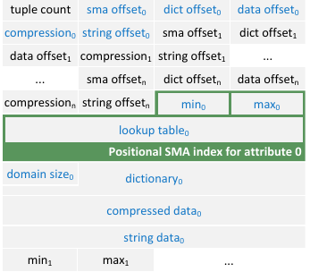

### 3.2 Positional SMAs

Data Blocks 为每个属性保存 SMA。基础 SMA 是该属性在块中的最小值和最大值。类似 ORC 文件格式，HyPer 使用这些域知识在 SARGable 谓词不落入块的 min/max 范围时排除整个 Data Block。min/max SMA 对有序属性效果尤其好，例如日期或递增 key。若 TPC-H 的 `lineitem` 按 `l_shipdate` 排序，Q6 对 `l_shipdate` 的高选择性谓词就只需访问少量 Data Blocks。

如果值在关系中均匀分布，SMA 通常没有帮助；一个离群值即可扩大 min/max 范围，使块无法被排除。TPC-H 的 `dbgen` 生成数据就属于这种情况。我们在 TPC-H 评估中保留 CSV 插入顺序，相关属性值在块上均匀分布，因此查询处理时没有块被跳过。不过在一个 Data Block 内，通常仍只有部分记录符合条件。

为进一步缩小扫描范围，我们扩展每个属性的基础 min/max 信息，加入 PSMA。PSMA 内部是一个紧凑查找表，在冷 chunk 冻结为 Data Block 时计算。每个表项包含一个扫描范围 `[b, e)`，指向 Data Block 压缩数据中可能匹配的元组。对固定大小类型，查找表为数据类型每个字节提供 `2^8` 个表项。例如 4 字节整数属性的查找表包含 `4 * 2^8 = 1024` 项。

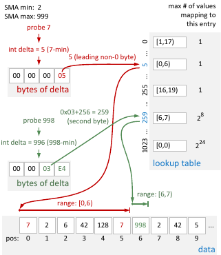

多个值可能映射到同一个查找表项。若 n 个值映射到索引 i，且对应范围为 `[b0, e0) ... [b_{n-1}, e_{n-1})`，则表项 i 存储合并后的范围：

```text
[min_j b_j, max_j e_j)
```

由于设计上小值的表项更精确，HyPer 不直接使用属性值 v，而使用它相对于 SMA 最小值的距离：

```text
Delta(v) = v - min
```

Delta 越大，与其共享表项的 Delta 值越多。单字节 Delta 值独占表项；2 字节 Delta 有 `2^8` 个值共享表项；3 字节和 4 字节分别有 `2^16` 和 `2^24` 个值共享。

等值查找过程如下：先计算探测值 v 与 SMA 最小值之间的 Delta；然后取 Delta 的最高非零字节和剩余字节数 r，计算查找表索引：

```text
i = Delta_highest_nonzero_byte + r * 256
```

等值谓词只需一次查表。对于 `between` 等非等值谓词，HyPer 对范围边界计算表索引，并合并中间非空表项的范围：

```text
range = [min_{ia <= i <= ib} b_i, max_{ia <= i <= ib} e_i)
```

构建查找表是 O(n) 操作。先初始化空范围，然后扫描列，对每个值找到对应表项；如果表项为空，则设置为 `[i, i+1)`，否则把范围结束位置更新为 `i+1`。每个属性单独保存查找表。若多个属性上存在 SARGable 谓词，分别查询其查找表并求返回范围交集，可进一步缩小扫描范围。

PSMA 空间占用很小。每个表项是两个 4 字节无符号整数。当索引 n 字节值时，查找表共有 `n * 2^8` 项，因此 1、2、4 字节整数的典型占用分别为 2 KB、4 KB、8 KB。它远小于针对一个 `2^16` 值 Data Block 的树形索引。由于 PSMA 只是限制扫描范围，访问路径仍与全扫描相同，因此相比传统索引查找更稳健；即使潜在命中范围很大，也不会带来明显惩罚。

PSMA 的范围裁剪能力取决于值域与物理顺序。当相似值在物理上聚簇时，映射到同一表项的值也具有相似范围，裁剪更有效。Data Blocks 可以在冻结时根据排序准则重排数据；若系统有工作负载知识，或在未压缩 chunk 上处理查询时收集了信息，就可以按该准则冻结 Data Block 以提升类似查询的 PSMA 精度。

### 3.3 属性压缩

Data Blocks 的压缩方案首要要求是压缩数据仍保持字节可寻址，以支持高效点查。sub-byte 编码可获得更高压缩率，但会让低选择性扫描和点查成本提升数个数量级。我们认为以下方案在压缩率、扫描性能和点查性能之间较适合 Data Blocks：

- 单值压缩（single value compression）。
- 有序字典压缩（ordered dictionary compression）。
- 截断（truncation）。

每个属性选择使内存占用最小的压缩方案；只有极少数情况下不压缩更优，才以未压缩形式存储。压缩方案选择高度依赖该属性在具体块中的值域，因此同一关系同一属性的不同块可能采用多种压缩方案。

单值压缩是 run-length encoding 的特例，用于块内某属性所有值都相同的情况，也包括全 NULL。

由于 Data Blocks 不可变，有序字典压缩无需支持新值插入或更新。这使 HyPer 可以使用保持顺序的字典压缩：若未压缩值 `k < k'`，则对应字典编码也满足 `d_k < d_{k'}`。不可变性也免除了引用计数和空闲空间管理。字典 key 的字节宽度根据不同 key 数量选择：最多 256 个 key 使用 8 位整数，最多 `2^16` 使用 16 位，最多 `2^32` 使用 32 位。保持顺序和使用字节截断 key 的优点是可以直接用 SIMD 优化算法在压缩数据上找匹配；由于只需比较截断值，可能比未压缩数据更快。

截断压缩通过计算每个值与属性最小值之间的 Delta 来降低内存占用。给定未压缩数据：

```text
A = (a0, ..., am)
Delta(A) = (a0 - min(A), ..., am - min(A))
```

再把这些 Delta 截断为 8、16 或 32 位整数。字符串和 double 不使用截断；例外是 `char(1)` 总表示为 32 位整数，以存储任意 UTF-8 字符。该截断方案是 Frame of Reference 编码的特例，其中最小值是 reference，每个 Data Block 正好包含一个 frame。

虽然这些压缩方案很轻量，我们在 HyPer 中仍观察到相比未压缩存储最高 5 倍的压缩率。与 Vectorwise 压缩存储相比，Data Blocks 约多消耗 25% 空间。

块级压缩也有缺点。例如字典压缩字符串时，相同字符串若出现在多个 chunk 中，需要存入多个字典，带来冗余。但块级压缩可为每个块的每列选择最适合的方案，并可根据 OLTP 访问频率在压缩和未压缩表示间迁移 chunk。

### 3.4 查找与解包匹配项

Data Block 中查找与解包匹配项的流程如下：

1. 使用块的 SMA 和 PSMA 根据扫描限制缩小扫描范围。
2. 若范围非空，在真正扫描前执行额外检查。例如字典压缩加等值谓词时，可在字典上二分查找，若无对应项则排除整块。
3. 若块不能排除，则在压缩列上求值所有限制。
4. 扫描产生一个向量，包含匹配元组的位置或偏移。
5. 按位置解包这些匹配项，再推送给消费算子。

该 vector-at-a-time 流程会重复，直到 Data Block 中没有更多匹配项。

不同于未压缩 chunk 扫描，Data Block 在压缩数据上求值限制。由于 Data Blocks 拒绝 sub-byte 压缩，多数情况下查找匹配项退化为对小整数做简单比较。字符串类型也总被压缩为整数。压缩数据上的谓词求值只在每块引入少量开销，因为需要把限制常量转换为压缩表示。

对 Data Block 中元组的点查不需要上述扫描步骤；系统直接从单个位置解压所需属性。

## 4. 编译查询引擎中的向量化扫描

Data Blocks 为每个块、每列独立选择最合适的压缩方案。多样的物理表示提高压缩率，但给 JIT 编译的逐元组引擎带来问题：不同存储布局组合和提取例程，要么需要生成多条代码路径，要么在每个元组上承担运行时分支开销。

HyPer 使用以数据为中心的编译（data-centric compilation），把关系代数树通过 LLVM 编译成高效本地机器码。常见查询从 LLVM IR 到优化后机器码的编译时间通常为毫秒级。与传统执行模型不同，HyPer 为整个查询管线生成代码。一个管线从物化状态加载元组，执行无需中间物化的所有算子逻辑，最后把输出物化到下一个 pipeline breaker。扫描是向初始查询管线供给数据的叶算子。

若要在不同存储布局组合上扫描，一种方式是在每个属性上加 jump table，根据压缩方法跳到对应解压逻辑。虽然分支结果在 chunk 内相同，CPU 分支预测较准，但这些指令仍增加最热内层循环的延迟；实践中扫描代码几乎慢 3 倍。

另一种方式是展开所有存储布局组合，并为每种组合生成专门代码。对每个 chunk 可用 computed goto 选择对应扫描代码。但组合数量随属性数指数增长。如果 n 个属性每个有 p 种表示，则路径数为 `p^n`。即使实际只出现部分组合，少量组合也会显著增加代码体积和编译时间。图 5 展示了一个扫描 8 个属性的简单查询，在基础关系存储布局组合数量变化时的编译时间。

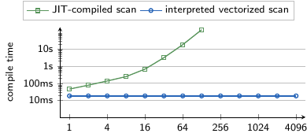

因此，我们转向调用预编译的解释型向量化扫描代码，每次处理例如 8K 个元组。返回元组再由生成代码逐个消费并推入后续算子。这样，无论扫描多少存储布局组合，编译时间都保持较低。SARGable 谓词也可下推到扫描算子中，对元组向量求值。

### 4.1 在 HyPer 中的集成

HyPer 的向量化扫描在热未压缩 chunk 和压缩 Data Blocks 上共享同一接口；JIT 编译查询管线不感知底层存储布局。执行过程如下：

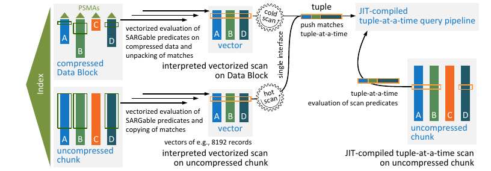

1. 对关系的每个 chunk 判断是否冻结，即是否压缩。
2. 若压缩，则启动 Data Block 扫描；否则启动未压缩数据的向量化扫描。
3. JIT 编译的 scan glue code 调用函数，生成包含下一个 n 个命中记录位置的 match vector。n 是向量大小，决定每次推入消费管线前抓取多少记录。
4. 对冷压缩 Data Block，glue code 调用函数把匹配项解包到临时存储；对未压缩 chunk，则把匹配所需属性复制到临时存储。
5. 临时存储中的元组再逐个推给消费算子。

拆分为多次扫描调用的原因是 cache 效率。找匹配、必要时解包匹配项、再传给消费者，这些步骤会多次访问相同数据；以 cache-friendly 的块处理能降低 cache miss。HyPer 中向量大小设为 8192 条记录。

虽然向量化扫描会复制更多数据，但评估显示大部分情况下复制成本可忽略，向量化谓词求值可超过逐元组求值。TPC-H Q1 和 Q6 代表两个极端。Q1 中大多数元组满足扫描限制，向量化扫描几乎复制所有数据，因此运行时间下降；Q6 中只有小比例元组命中，未压缩数据上的向量化谓词求值最多可比 JIT 扫描快 2.3 倍。使用压缩 Data Blocks 后，Q6 运行时间提升 6.7 倍，22 个 TPC-H 查询的几何平均运行时间提升 1.27 倍。

### 4.2 使用 SIMD 指令查找匹配项

向量化处理允许用 SIMD 指令求值 SARGable 谓词。求值阶段会把命中元素的位置存入向量，本文称为 match positions，也称 selection vector。若对属性向量 `A = (0, 1, 5, 2, 3, 1)` 应用谓词 `P(a): 3 <= a <= 5`，结果位置为 `(2, 4)`。

若存在额外的合取限制，只需对 match vector 指向的元组应用这些限制。因此底层区分两类操作：

- finding initial matches：填充 match vector。
- reduce matches：收缩已有 match vector。

标量代码一次只处理一个属性值，结果是单个布尔值。SIMD 比较一次并行处理多个值，产生一个 bit-mask，标识哪些 SIMD lane 命中。挑战在于根据 bit-mask 计算命中记录位置。直接遍历 bit-mask 或树形归约的复杂度分别为 O(n) 或 O(log n)，仍过于昂贵。

我们使用预计算表把 bit-mask 映射到位置，`movemask` 指令提供表偏移。每个表项对应一个 n 路 SIMD 比较可能结果。例如 8 路比较中第 0、3、4、6 个 lane 命中，`movemask` 得到二进制 `10011010`，即十进制 154；用它作为查表偏移，获得本地命中位置 `(0, 3, 4, 6)`，再加上全局扫描位置后写入 match vector。

表项数为 `2^n`，因此需要限制大小。例如 8 位整数用 256 位 AVX2 寄存器可做 32 路比较，完整表会有 `2^32` 项，约 512 GB。我们把表限制为 `2^8` 项，必要时多次查表。每个表项最多存 8 个匹配位置，每个位置为 32 位无符号整数，整个表大小为 `2^8 * 8 * 4B = 8KB`，可放入 L1 cache。

额外限制的应用与初始匹配不同：访问元素不再连续，因为只读取已满足第一个谓词的元素；且已有 match vector 需要收缩。我们仍使用类似方法，但从内存位置 gather 到 SIMD 寄存器，查找表项则用作 shuffle 控制掩码。若 8 个元素中第 0、2、4、5 个命中，match positions 会按表项重排到前几个 lane，再写回 match vector，剩余 lane 是无关值，会在下一次迭代覆盖。

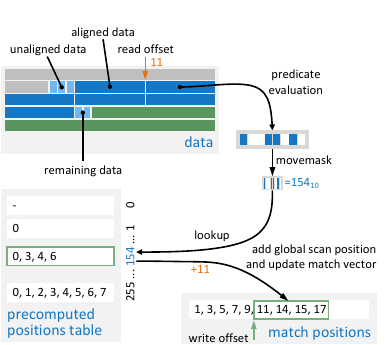

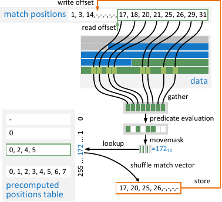

gather 指令只支持 32 位和 64 位类型。对 8 位和 16 位值，我们也使用 32 位 gather，因此并行度分别降低 4 倍或 2 倍。在 Haswell 桌面 CPU 的微基准中，between 谓词、20% 选择性时，SSE 加速接近 4 倍，AVX2 超过 5 倍。底层类型位宽越小，并行度和收益越高；64 位整数上 AVX2 约 1.5 倍，SSE 并行度不足以带来明显收益。

初始匹配实现由于预计算位置表，对选择性变化不敏感；性能主要只受写入 match vector 的位置数量影响，而向量大小固定，影响不明显。收缩 match vector 的实现也对第二个谓词选择性不敏感，但高度依赖前置谓词选择性，因为访问模式变为非连续。对最多 32 位整数，随着前置谓词选择性提高，AVX2 相比无分支标量代码可获得 1.0 到 1.25 倍收益；64 位整数上，高选择性时 SIMD 甚至可能更慢。

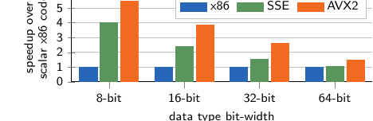

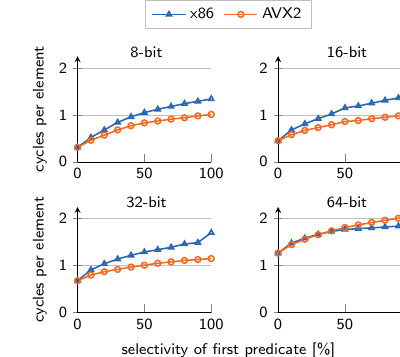

这些 SIMD 算法只适用于整数数据。其他数据类型和非 SARGable 谓词回退到标量实现。不过 Data Blocks 会把数据压缩为字节可寻址整数，包括字符串属性，因此当 OLAP 负载访问大量 Data Blocks 时能显著受益。

## 5. 评估

我们在 HyPer 查询引擎中评估了解释型向量化扫描、SIMD 优化谓词求值和压缩 Data Blocks。HyPer 支持 SQL-92 查询和 ACID 事务。实验还比较了字节可寻址压缩与 SIMD 优化水平 bit-packing，以解释为何拒绝 sub-byte 编码。

除特别说明外，实验运行在 4 路 Intel Xeon X7560 NUMA 机器上，2.27 GHz，1 TB DDR3 内存，Linux 3.19。针对 AVX2 的实验使用 Intel Haswell i5-4670T，16 GB DDR3。

### 5.1 压缩率

我们使用 TPC-H scale factor 100、IMDB 最大关系 `cast_info`、以及美国商业航班到达/起飞数据集评估压缩率。Vectorwise 是 MonetDB/X100 的商业版本，使用 PFOR、PFOR-DELTA、PDICT 和 run-length encoding 等轻量压缩技术。相比 HyPer，Vectorwise 平均节省约 25% 更多空间，但查询性能较差。Vectorwise 的压缩方案主要面向数据库不能放入内存时加速磁盘加载；内存驻留压缩数据的处理速度可接受，但可能慢于未压缩数据。

表 1 给出三个数据集的实际空间占用：

| 存储状态 | 系统/来源 | TPC-H SF100 | IMDB cast_info | Flights |
| --- | --- | ---: | ---: | ---: |
| 未压缩 | CSV | 107 GB | 1.4 GB | 12 GB |
| 未压缩 | HyPer | 126 GB | 1.8 GB | 21 GB |
| 未压缩 | Vectorwise | 105 GB | 0.72 GB | 11 GB |
| 压缩 | HyPer | 66 GB | 0.50 GB | 4.2 GB |
| 压缩 | Vectorwise | 54 GB | 0.24 GB | 3.2 GB |

Data Blocks 则假设大部分数据在主内存中，性能目标是压缩后查询和事务处理至少不慢于未压缩内存存储。实验显示，Data Block 大小太小时，块元数据开销会恶化压缩率；默认每块 `2^16` 条记录在压缩率和查询处理速度之间取得良好平衡。

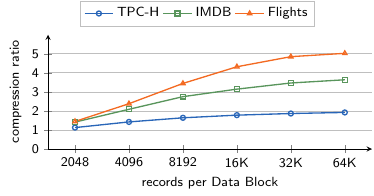

### 5.2 查询性能

TPC-H scale factor 100 实验比较了 HyPer 中未压缩存储上的 JIT 扫描、未压缩存储上的向量化扫描，以及压缩 Data Block 上的向量化扫描。64 个硬件线程参与，运行时间取多次测量中位数。

结果表明，用向量化扫描替代 JIT 扫描不会显著改变查询性能；把 SARGable 谓词下推到向量化扫描也类似。但向量化扫描的编译时间几乎只有 JIT 扫描代码的一半。仅使用 Data Blocks 的压缩方面时，查询性能也基本不变。若把 SARGable 谓词和 SMA 下推到 Data Block 扫描中，TPC-H 几何平均运行时间提升约 26%。由于 TPC-H 值均匀分布，实验中没有块被跳过，因此收益主要来自在压缩数据向量上的高效 SIMD 谓词求值。加入 PSMA 后，在默认 TPC-H 上没有显著额外收益。

为了展示 PSMA 在更现实场景中的影响，我们又把 `lineitem` 的每个 Data Block 按 `l_shipdate` 块内排序。虽然每块仍覆盖数据集的所有年份，但块内日期有序。对 TPC-H Q6，PSMA 带来显著额外加速。航班数据集上的一个查询收益更高：查询 1998 到 2008 年飞往 SFO 的 carrier 及平均到达延迟。关系天然按日期排序，大多数块被 SMA 跳过，剩余块再由 PSMA 根据目的机场限制缩小扫描范围；相比未压缩格式上的 JIT 扫描，运行时间提升超过 20 倍。


表 2 的核心结论如下：

| 扫描类型 | 几何平均 | 总时间 | 相对 JIT |
| --- | ---: | ---: | ---: |
| HyPer JIT 未压缩扫描 | 0.586s | 21.7s | 1.00x |
| HyPer 向量化未压缩扫描 | 0.583s | 21.6s | 1.01x |
| + SARG | 0.577s | 21.8s | 1.02x |
| Data Blocks 压缩扫描 | 0.555s | 21.5s | 1.06x |
| + SARG/SMA | 0.466s | 20.3s | 1.26x |
| + PSMA | 0.463s | 20.2s | 1.27x |

### 5.3 OLTP 性能

为了衡量访问 Data Block 中单条记录相对未压缩 chunk 的开销，我们在 TPC-H `customer` 关系上做随机点查实验。若存在主键索引，访问 Data Block 中记录约有 60% 开销。若没有主键索引，所有查找都以扫描完成；此时 Data Block 扫描可能快于未压缩 chunk，因为 SMA 和 PSMA 可以缩小扫描范围。若 `customer` 按 `c_custkey` 保持 `dbgen` 生成顺序，SMA/PSMA 有帮助；若打乱顺序，则不能缩小扫描范围。因此，SMA/PSMA 并不是 OLTP 负载中传统索引结构的通用替代。

表 3 的点查吞吐（lookups/s）如下：

| 存储/扫描方式 | 索引 | Ordered | Shuffled |
| --- | --- | ---: | ---: |
| 未压缩 JIT | PK index | 551,268 | 545,554 |
| 未压缩 JIT | no index | 36 | 36 |
| 未压缩 Vectorized | PK index | 550,661 | 566,893 |
| 未压缩 Vectorized | no index | 26 | 26 |
| Data Blocks | PK index | 301,750 | 274,198 |
| Data Blocks | no index | 17,508 | 41 |
| Data Blocks + PSMA | PK index | 276,014 | 294,291 |
| Data Blocks + PSMA | no index | 71,587 | 40 |

我们还运行了 5 warehouse 的 TPC-C。第一组实验只压缩旧的 `neworder` 记录，这符合冷数据使用场景：未压缩存储吞吐 89,229 tps，冷 `neworder` 记录存 Data Blocks 时为 88,699 tps。开销来自每次访问时判断 chunk 是否压缩。第二组实验只执行只读 TPC-C 事务 `order status` 和 `stock level`，并比较完整未压缩 TPC-C 数据库与完全存入 Data Blocks 的数据库：未压缩为 119,889 tps，Data Blocks 为 109,649 tps，差异 9%。这说明即使单记录查找吞吐下降 60%，在真实事务负载中，如果冷压缩数据访问比例有限，总体开销仍较低。

### 5.4 字节可寻址性的优势

sub-byte 编码可获得更高压缩率，但会伤害点查和低选择性扫描。我们构造三列 A、B、C，各含 `2^16` 个整数值，其中 A/B 值域为 `[0, 2^16]`，C 为 `[0, 2^8]`。这使水平 bit-packing 可压成 17 位或 9 位，同时对 Data Blocks 是最差情况，因为它被迫使用 4 字节和 2 字节代码。此时 bit-packing 压缩率几乎高一倍。

工作负载是对 `A` 求值 `l <= A <= r`，并把匹配元组解包到输出缓冲区。我们使用 Haswell i5-4670T 和 AVX2，bit-packing 代码来自高度 SIMD 优化实现。

首先比较不解包时的谓词求值成本。bit-packing 返回 bitmap，Data Blocks API 返回 32 位整数位置向量。为公平起见，bit-packing 的 bitmap 被转换为位置向量。结果显示 Data Blocks 对选择性变化很稳健；水平 bit-packing 则受分支预测失败影响。使用预计算位置表后 bit-packing 也更稳健，但 Data Blocks 的谓词求值仍快 1.8 倍。

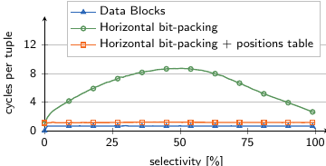

然后比较解包性能。bit-packing 有两种替代：

- 位置访问：按匹配位置用标量代码逐个解包。
- 全部解包再过滤：先用 SIMD 解包所有元组，再按位置向量过滤。

Data Blocks 在几乎所有情况下都优于 bit-packing，只有 100% 元组都命中时 bit-packing 约快 9%。当命中率低于 20% 时，bit-packing 的位置访问表现较好；超过 20% 时，全解包再过滤因 SIMD 更好。中等选择性下，bit-packing 的解包成本显著更高，因为大量非命中元组也被解包。选择 10% 均匀分布元组时，Data Block 提取所选元组超过 3 倍更快，选择本身也快 1.8 倍。

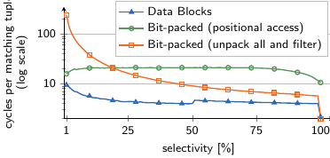

由于 HyPer 必须支持快速访问单条压缩记录，并在中等选择性扫描上保持稳健性能，我们决定不在 Data Blocks 中使用 bit-packing。

## 6. 结论

本文目标是在高性能混合 OLTP/OLAP 数据库中降低主内存占用，同时不牺牲查询和事务性能。为此，我们提出 Data Blocks：一种面向混合数据库系统的新型压缩列式存储格式。该格式进一步使用 PSMA 进行轻量块内索引以提升扫描性能，并使用 SIMD 优化谓词求值。

Data Blocks 的细粒度自适应性要求把 JIT 编译查询执行与向量化扫描结合，才能同时获得较低编译时间和较高查询执行性能。本文展示了将这些技术整合到完整混合 OLTP/OLAP 系统中的蓝图，并在附录中讨论了进一步优化机会。

## 附录

### A. 向量大小对查询性能的影响

TPC-H 100 实验显示，向量过小时查询运行时间略升，原因是函数调用等解释开销更高；向量大到超过 cache 后，记录在被推入 JIT 编译查询管线前会被驱逐到较慢主内存，查询性能也会下降。

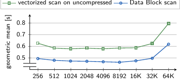

### B. PSMA 实现

PSMA 构建和探测前，值先转换为相对当前 Data Block 最小值的 Delta。构建过程扫描数据块一次，记录某个值对应槽位中的首次和最后一次出现范围。查询等值谓词时，直接用查询常量计算表项，得到潜在扫描范围。

**代码清单：PSMA 的构建与探测。**

```cpp
// Compute the PSMA slot for a given value
uint32_t getPSMASlot(T value, T min) {
  // d = delta
  uint64_t d = value - min;
  // r = remaining bytes (note: clz is undefined for 0)
  uint32_t r = d ? (7 - (__builtin_clzll(d) >> 3)) : 0;
  // m = most significant non-zero byte
  uint64_t m = (d >> (r << 3));
  // return the slot in PSMA array
  return m + (r << 8);
}

// Initialize all slots to empty ranges
for (auto& entry : psma)
  entry = {0, 0};
// Update ranges for all attribute values
for (uint32_t tid = 0; tid != values.size(); ++tid) {
  auto& entry = psma[getPSMASlot(values[tid],min)];
  if (entry.empty())
    entry = {tid, tid + 1};
  else entry.end = tid + 1;
}

// value = query constant of an equality predicate
auto scanRange = psma[getPSMASlot(value, min)];
```

### C. 查找初始匹配项的 SIMD 实现

下面的代码清单给出 `find-matches` 实现的细节：它使用预计算表把 bit mask 映射为匹配位置。`matchTable` 只有 256 个表项，每项可保存 8 个匹配位置；通常一次并行比较的元素更多，因此需要多次查表。这里每轮对 32 个 8 位整数求值，所以共执行 4 次查表。

**代码清单：查找初始匹配项所用的声明（Declarations）。**

```cpp
// Vector of 8 32-bit integers.
typedef union {
  int32_t cell[8];
  __m256i reg256;
  __m128i reg128[2];
} vector8_int32;

using matchTableEntry = vector8_int32;
const matchTableEntry matchTable[256]{
  {{-256,-256,-256,-256,-256,-256,-256,-256}},
  {{1,-255,-255,-255,-255,-255,-255,-255}},
  {{257,-255,-255,-255,-255,-255,-255,-255}},
  // ...
  {{263,519,775,1031,1287,1543,1799,-249}},
  {{8,264,520,776,1032,1288,1544,1800}}
};
```

**代码清单：查找匹配函数（Find matches function）。**

```cpp
if (reinterpret_cast<uintptr_t>(&column[from])%32) {
  // Process non-32-byte aligned elements sequentially
  ...
  // Recurse
} else {
  // Process 32-byte aligned elements (using SIMD/AVX2)
  const uint32_t simdWidth=32;
  const uint32_t numSimdIterations=(to-from)/simdWidth;
  const __m256i comparisonValueVec=set(comparisonValue);
  const __m256i vec16=_mm256_set1_epi32(16);
  uint32_t* writer=matches;
  for (uint32_t i=0; i!=numSimdIterations; i++) {
    uint32_t scanPos=from+(i*simdWidth);
    // Load and compare 32 values
    __m256i attributeVec=_mm256_load_si256(
      reinterpret_cast<__m256i*>(&column[scanPos]));
    __m256i selMask=cmp(attributeVec,comparisonValueVec);
    int bitMask=_mm256_movemask_epi8(selMask);
    // Lookup match positions and update positions vector
    auto& matchEntry0=matchTable[bitMask&0xFF];
    __m256i scanPosVec0=_mm256_set1_epi32(scanPos);
    _mm256_storeu_si256(reinterpret_cast<__m256i*>(writer),
      _mm256_add_epi32(scanPosVec0,
        _mm256_srai_epi32(matchEntry0.reg256,8)));
    writer+=static_cast<uint8_t>(matchEntry0.cell[0]);
    auto& matchEntry1=matchTable[(bitMask>>8)&0xFF];
    __m256i scanPosVec1=_mm256_set1_epi32(scanPos+8);
    _mm256_storeu_si256(reinterpret_cast<__m256i*>(writer),
      _mm256_add_epi32(scanPosVec1,
        _mm256_srai_epi32(matchEntry1.reg256,8)));
    writer+=static_cast<uint8_t>(matchEntry1.cell[0]);
    auto& matchEntry2=matchTable[(bitMask>>16)&0xFF];
    __m256i scanPosVec2=
      _mm256_add_epi32(scanPosVec0,vec16);
    _mm256_storeu_si256(reinterpret_cast<__m256i*>(writer),
      _mm256_add_epi32(scanPosVec2,
        _mm256_srai_epi32(matchEntry2.reg256,8)));
    writer+=static_cast<uint8_t>(matchEntry2.cell[0]);
    auto& matchEntry3=matchTable[(bitMask>>24)&0xFF];
    __m256i scanPosVec3=
      _mm256_add_epi32(scanPosVec1,vec16);
    _mm256_storeu_si256(reinterpret_cast<__m256i*>(writer),
      _mm256_add_epi32(scanPosVec3,
        _mm256_srai_epi32(matchEntry3.reg256,8)));
    writer+=static_cast<uint8_t>(matchEntry3.cell[0]);
  }
  // [...] Process remaining elements sequentially
  return writer-matches; // Number of matches
}
```

### D. 航班数据查询

附录中的航班查询按 carrier 计算飞往 SFO、年份在 1998 到 2008 之间的平均到达延迟，并按延迟降序排序。该查询展示了日期有序数据上 SMA 与 PSMA 的叠加收益。

```sql
select
  uniquecarrier as carrier,
  avg(arrdelay) as avgdelay
from
  flights
where
  year between 1998 and 2008
  and dest = 'SFO'
group by
  uniquecarrier
order by
  avgdelay desc
```

### E. 进一步优化

向量化扫描向 JIT 编译管线供给数据后，打开了更多优化空间。一个方向是在扫描中加入 eager aggregation，只对一个 chunk 内的数据计算表达式和非整体聚合，再由真正的聚合算子重新聚合，适合 TPC-H Q1、Q6 这类依赖扫描且分组较少的聚合。

另一个方向是对上游 hash join 做早期探测。向量化扫描探测端开始运行时，JIT 管线中 hash join 的 build 端已经物化。若 join 高选择性，例如事实表探测受限维表，在扫描中提前探测可避免扫描和解压后续会被 join 消除的记录。Vectorwise 使用 bloom filter 实现类似优化；HyPer 的 hash table pointer 中也有类似 tagged pointer 的早期探测。初步实验中，对 TPC-H 多个查询可带来收益，几何平均运行时间提升 1.2 倍，但对一些查询也有减速。因此需要自适应策略，例如 Vectorwise 的 Micro Adaptivity：运行时尝试不同向量化函数实现，监控性能，并选择当下表现最好的实现。

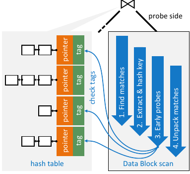

### F. TPC-H 结果

附录完整列出 TPC-H 22 个查询在多种扫描类型下的运行时间和编译时间。总体上，Data Blocks 加 SARG/SMA/PSMA 的几何平均时间为 0.463s，相比未压缩 JIT 扫描的 0.586s 提升 1.27 倍；Q6、Q14、Q19 等高选择性查询收益最明显。

表 4：TPC-H SF100 各查询运行时间；括号内为编译时间。

| 查询 | JIT scan | Vectorized scan | +SARG | Data Block scan | +SARG/SMA | +PSMA | over JIT |
| --- | ---: | ---: | ---: | ---: | ---: | ---: | ---: |
| Q1 | 0.388s (45ms) | 0.373s (29ms) | 0.539s | 0.431s | 0.477s | 0.478s | 0.81x |
| Q2 | 0.085s (177ms) | 0.097s (89ms) | 0.086s | 0.092s | 0.086s | 0.086s | 1.00x |
| Q3 | 0.731s (64ms) | 0.723s (34ms) | 0.812s | 0.711s | 0.634s | 0.627s | 1.17x |
| Q4 | 0.491s (50ms) | 0.508s (27ms) | 0.497s | 0.502s | 0.457s | 0.454s | 1.08x |
| Q5 | 0.655s (120ms) | 0.662s (57ms) | 0.645s | 0.691s | 0.658s | 0.655s | 1.00x |
| Q6 | 0.267s (20ms) | 0.180s (11ms) | 0.114s | 0.188s | 0.040s | 0.040s | 6.70x |
| Q7 | 0.600s (124ms) | 0.614s (62ms) | 0.659s | 0.632s | 0.557s | 0.548s | 1.09x |
| Q8 | 0.409s (171ms) | 0.420s (78ms) | 0.401s | 0.505s | 0.458s | 0.460s | 0.89x |
| Q9 | 2.429s (121ms) | 2.380s (59ms) | 2.357s | 2.423s | 2.439s | 2.453s | 0.99x |
| Q10 | 0.638s (96ms) | 0.633s (50ms) | 0.691s | 0.614s | 0.521s | 0.512s | 1.25x |
| Q11 | 0.094s (114ms) | 0.092s (56ms) | 0.092s | 0.087s | 0.082s | 0.081s | 1.16x |
| Q12 | 0.413s (58ms) | 0.447s (32ms) | 0.430s | 0.381s | 0.305s | 0.305s | 1.35x |
| Q13 | 6.695s (45ms) | 6.766s (27ms) | 6.786s | 7.260s | 7.132s | 7.098s | 0.94x |
| Q14 | 0.466s (41ms) | 0.410s (22ms) | 0.438s | 0.213s | 0.145s | 0.140s | 3.33x |
| Q15 | 0.441s (48ms) | 0.440s (37ms) | 0.434s | 0.359s | 0.278s | 0.275s | 1.60x |
| Q16 | 0.831s (99ms) | 0.836s (55ms) | 0.842s | 0.662s | 0.669s | 0.664s | 1.25x |
| Q17 | 0.427s (74ms) | 0.439s (41ms) | 0.436s | 0.504s | 0.490s | 0.487s | 0.88x |
| Q18 | 2.496s (91ms) | 2.418s (49ms) | 2.401s | 2.379s | 2.366s | 2.394s | 1.04x |
| Q19 | 1.061s (70ms) | 1.119s (34ms) | 1.125s | 0.682s | 0.528s | 0.521s | 2.04x |
| Q20 | 0.602s (108ms) | 0.596s (54ms) | 0.610s | 0.577s | 0.529s | 0.530s | 1.14x |
| Q21 | 1.223s (129ms) | 1.176s (65ms) | 1.166s | 1.212s | 1.142s | 1.136s | 1.08x |
| Q22 | 0.265s (81ms) | 0.321s (48ms) | 0.261s | 0.391s | 0.278s | 0.277s | 0.96x |
| Sum | 21.708s (1945ms) | 21.649s (1016ms) | 21.822s | 21.497s | 20.271s | 20.179s |  |
| Geometric mean | 0.586s (78ms) | 0.583s (42ms) | 0.577s | 0.555s | 0.466s | 0.463s | 1.27x |

## 参考文献

- [1] D. Abadi, S. Madden, and M. Ferreira. Integrating Compression and Execution in Column-oriented Database Systems. In SIGMOD, 2006.
- [2] Actian Corporation. Actian Analytics Database - Vector Edition 3.5, 2014.
- [3] A. Ailamaki, D. J. DeWitt, M. D. Hill, and M. Skounakis. Weaving Relations for Cache Performance. In VLDB, 2001.
- [4] R. Barber, G. Lohman, V. Raman, R. Sidle, S. Lightstone, and B. Schiefer. In-memory BLU acceleration in IBM's DB2 and dashDB: Optimized for modern workloads and hardware architectures. In ICDE, 2015.
- [5] P. A. Boncz, M. Zukowski, and N. Nes. MonetDB/X100: Hyper-Pipelining Query Execution. In CIDR, 2005.
- [6] J. Chhugani, A. D. Nguyen, V. W. Lee, W. Macy, M. Hagog, Y.-K. Chen, et al. Efficient Implementation of Sorting on Multi-core SIMD CPU Architecture. PVLDB, 1(2), 2008.
- [7] R. L. Cole, F. Funke, L. Giakoumakis, W. Guy, A. Kemper, S. Krompass, H. A. Kuno, R. O. Nambiar, T. Neumann, M. Poess, K. Sattler, M. Seibold, E. Simon, and F. Waas. The mixed workload CH-benCHmark. In Proceedings of the Fourth International Workshop on Testing Database Systems, DBTest 2011, Athens, Greece, June 13, 2011, page 8, 2011.
- [8] J. DeBrabant, J. Arulraj, A. Pavlo, M. Stonebraker, S. Zdonik, et al. A Prolegomenon on OLTP Database Systems for Non-Volatile Memory. PVLDB, 7(14), 2014.
- [9] J. DeBrabant, A. Pavlo, S. Tu, M. Stonebraker, and S. B. Zdonik. Anti-Caching: A New Approach to Database Management System Architecture. PVLDB, 6(14), 2013.
- [10] C. Diaconu, C. Freedman, E. Ismert, P. Larson, P. Mittal, R. Stonecipher, et al. Hekaton: SQL Server's Memory-Optimized OLTP Engine. In SIGMOD, 2013.
- [11] A. Eldawy, J. J. Levandoski, and P. Larson. Trekking Through Siberia: Managing Cold Data in a Memory-Optimized Database. PVLDB, 7(11), 2014.
- [12] F. Färber, S. K. Cha, J. Primsch, C. Bornhövd, S. Sigg, and W. Lehner. SAP HANA Database: Data Management for Modern Business Applications. SIGMOD Record, 40(4), 2011.
- [13] Z. Feng, E. Lo, B. Kao, and W. Xu. ByteSlice: Pushing the Envelope of Main Memory Data Processing with a New Storage Layout. In SIGMOD, 2015.
- [14] A. Floratou, U. F. Minhas, and F. Özcan. SQL-on-Hadoop: Full Circle Back to Shared-nothing Database Architectures. PVLDB, 7(12), 2014.
- [15] F. Funke, A. Kemper, and T. Neumann. Compacting Transactional Data in Hybrid OLTP&OLAP Databases. PVLDB, 5(11), 2012.
- [16] A. Kemper and T. Neumann. HyPer: A Hybrid OLTP&OLAP Main Memory Database System based on Virtual Memory Snapshots. In ICDE, 2011.
- [17] J. Krüger, C. Kim, M. Grund, N. Satish, D. Schwalb, J. Chhugani, et al. Fast Updates on Read-Optimized Databases Using Multi-Core CPUs. PVLDB, 5(1), 2011.
- [18] P. Larson, C. Clinciu, E. N. Hanson, A. Oks, S. L. Price, S. Rangarajan, et al. SQL Server Column Store Indexes. In SIGMOD, 2011.
- [19] C. Lattner and V. Adve. LLVM: A Compilation Framework for Lifelong Program Analysis & Transformation. In CGO, 2004.
- [20] V. Leis, P. A. Boncz, A. Kemper, and T. Neumann. Morsel-driven Parallelism: A NUMA-aware Query Evaluation Framework for the Many-Core Age. In SIGMOD, 2014.
- [21] Y. Li, C. Chasseur, and J. M. Patel. A Padded Encoding Scheme to Accelerate Scans by Leveraging Skew. In SIGMOD, 2015.
- [22] Y. Li and J. M. Patel. BitWeaving: Fast Scans for Main Memory Data Processing. In SIGMOD, 2013.
- [23] G. Moerkotte. Small Materialized Aggregates: A Light Weight Index Structure for Data Warehousing. In VLDB, 1998.
- [24] T. Mühlbauer, W. Rödiger, R. Seilbeck, A. Reiser, A. Kemper, and T. Neumann. Instant Loading for Main Memory Databases. PVLDB, 6(14), 2013.
- [25] T. Neumann. Efficiently Compiling Efficient Query Plans for Modern Hardware. PVLDB, 4(9), 2011.
- [26] O. Polychroniou, A. Raghavan, and K. A. Ross. Rethinking SIMD Vectorization for In-Memory Databases. In SIGMOD, 2015.
- [27] O. Polychroniou and K. A. Ross. Efficient Lightweight Compression Alongside Fast Scans. In DaMoN, 2015.
- [28] M. Pöss and D. Potapov. Data Compression in Oracle. In VLDB, 2003.
- [29] B. Raducanu, P. A. Boncz, and M. Zukowski. Micro Adaptivity in Vectorwise. In SIGMOD, 2013.
- [30] V. Raman, G. Attaluri, R. Barber, N. Chainani, D. Kalmuk, V. KulandaiSamy, et al. DB2 with BLU Acceleration: So Much More Than Just a Column Store. PVLDB, 6(11), 2013.
- [31] J. Sompolski, M. Zukowski, and P. A. Boncz. Vectorization vs. Compilation in Query Execution. In DaMoN, 2011.
- [32] M. Then, M. Kaufmann, F. Chirigati, T.-A. Hoang-Vu, K. Pham, et al. The More the Merrier: Efficient Multi-source Graph Traversal. PVLDB, 8(4), 2014.
- [33] S. D. Viglas. Data Management in Non-Volatile Memory. In SIGMOD, 2015.
- [34] S. Wanderman-Milne and N. Li. Runtime Code Generation in Cloudera Impala. DEBU, 37(1), 2014.
- [35] T. Willhalm, N. Popovici, Y. Boshmaf, H. Plattner, A. Zeier, et al. SIMD-scan: Ultra Fast In-memory Table Scan Using On-chip Vector Processing Units. PVLDB, 2(1), 2009.
- [36] W. Yan and P.-A. Larson. Eager aggregation and lazy aggregation. In VLDB, 1995.
- [37] J. Zhou and K. A. Ross. Implementing Database Operations Using SIMD Instructions. In SIGMOD, 2002.
- [38] M. Zukowski and P. A. Boncz. Vectorwise: Beyond Column Stores. DEBU, 35(1), 2012.
- [39] M. Zukowski, S. Héman, N. Nes, and P. A. Boncz. Super-Scalar RAM-CPU Cache Compression. In ICDE, 2006.
- [40] M. Zukowski, M. van de Wiel, and P. A. Boncz. Vectorwise: A Vectorized Analytical DBMS. In ICDE, 2012.
