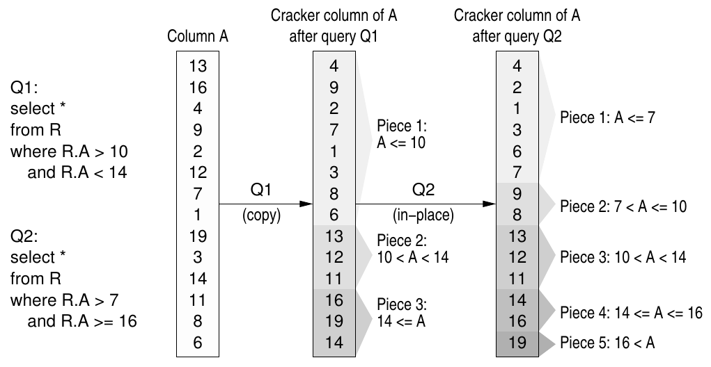
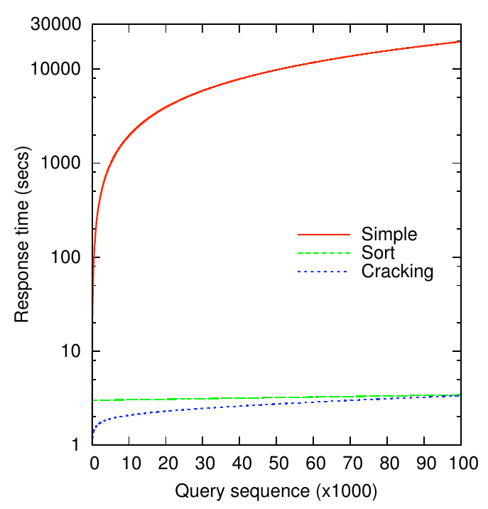
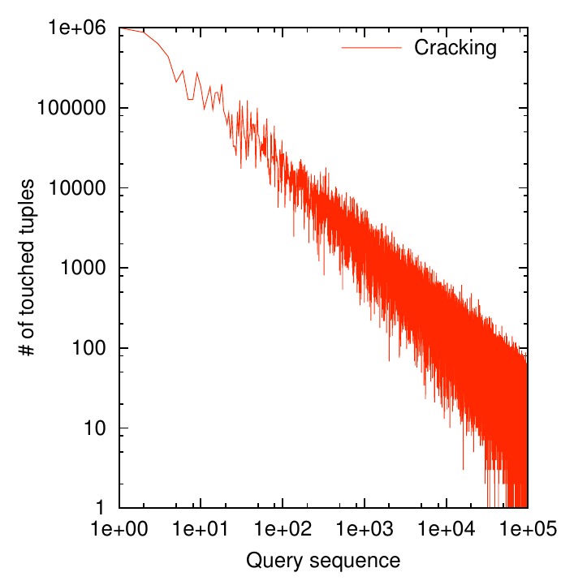
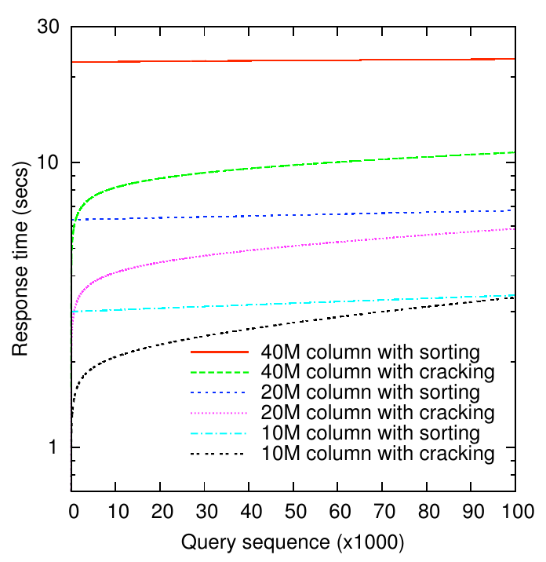
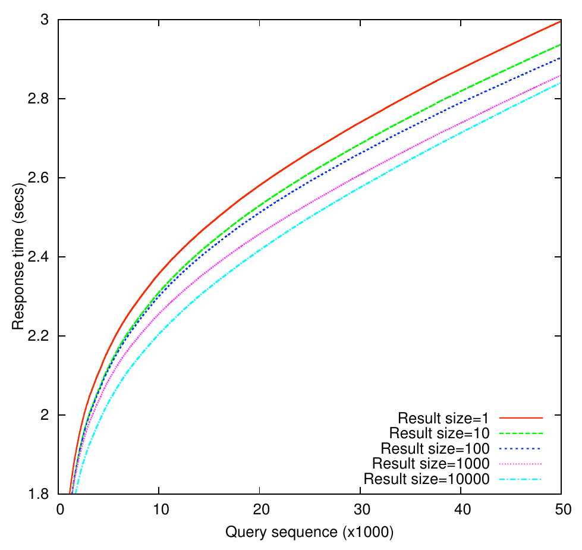
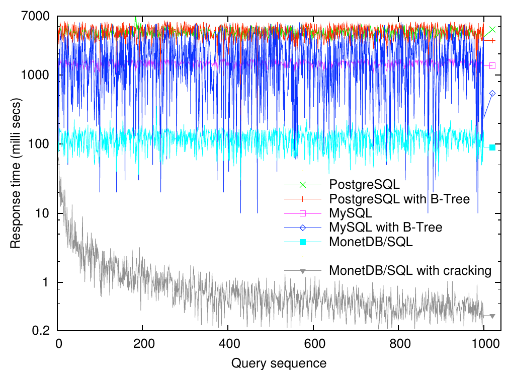
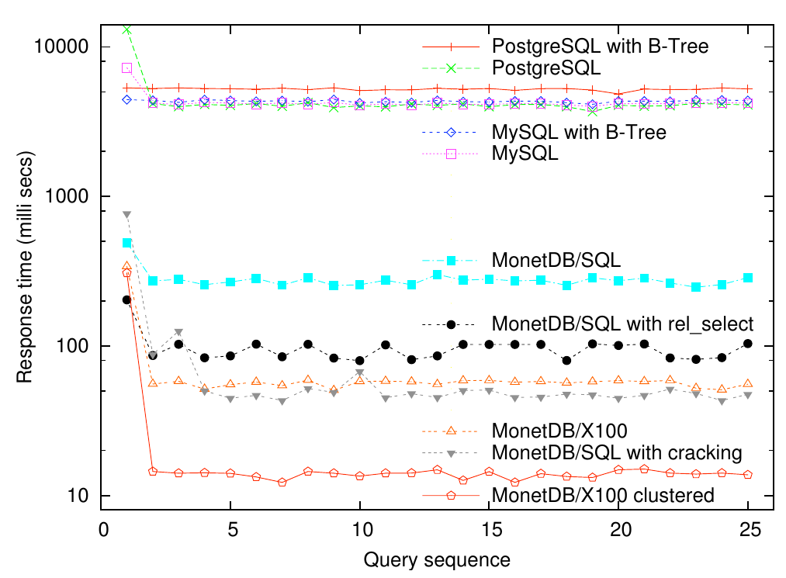
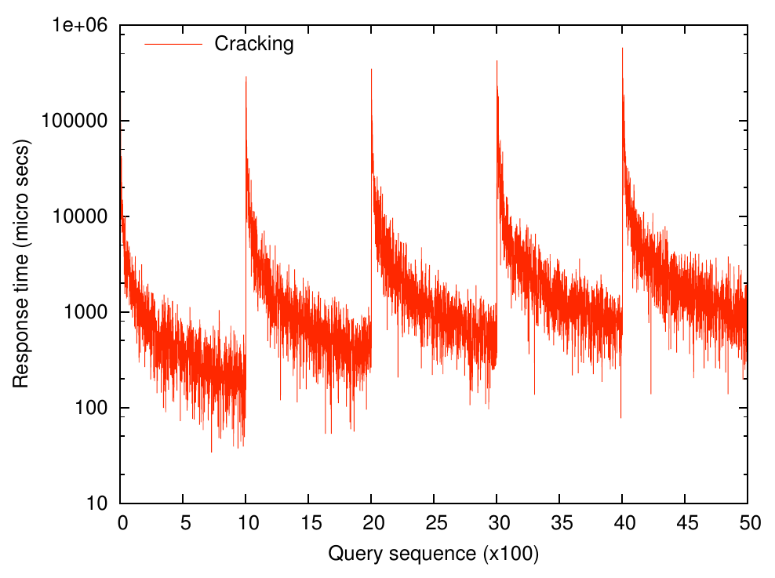

# Database Cracking（中文译文）

## 译者说明

本文依据同目录的 `source.pdf` 翻译。章节、图表、公式、算法、代码与参考文献按原文结构保留。

- Stratos Idreos，CWI Amsterdam，荷兰；Stratos.Idreos@cwi.nl。
- Martin L. Kersten，CWI Amsterdam，荷兰；Martin.Kersten@cwi.nl。
- Stefan Manegold，CWI Amsterdam，荷兰；Stefan.Manegold@cwi.nl。

第三届创新数据系统研究双年会议（CIDR），2007 年 1 月 7—10 日，美国加利福尼亚州 Asilomar。

## 摘要

数据库索引提供一种不加区别的导航基础设施，用于定位感兴趣的元组，其维护成本在数据库更新期间承担。本文研究一种互补的方法：通过持续的物理重组，将索引维护作为查询处理的一部分，也就是把数据库裂解为可管理的分片。其动机是，按用户请求数据的方式自动组织数据，能够实现快速访问以及人们十分期望的自组织行为。

我们提出第一个成熟的裂解体系结构，并报告在一个功能完备的关系系统中实现裂解的情况。这只需对该系统的关系代数内核做少量增强，就能将裂解附带到查询处理中，而不引入过多处理开销。此外，我们展示动态重组对 SQL 优化器生成的查询计划所产生的连锁影响。所得经验与结果表明，系统复杂性有望显著降低。我们证明，得到的系统能够根据到来的请求进行自组织，并带来明显的性能收益。即便用户关注点随机转向数据的不同部分，也能观察到这种行为。

## 1. 引言

如今，数据库体系结构设计的挑战并不在于获得超高性能，而在于设计简单、灵活的系统。数据库系统应能处理庞大的数据集，并根据环境，如工作负载、可用资源等进行自组织。文献 [6] 对这些问题有很好的讨论。此外，通过分布式环境加速计算的趋势要求新的体系结构设计。开始主导市场的多核 CPU 体系结构也有同样的要求，它们为数据管理带来了新的可能性和挑战。文献 [2, 3, 9, 14] 是数据库体系结构设计中一些明显偏离惯常路线的工作。

本文探索一种全新的数据库体系结构方法，称为数据库裂解（database cracking）。裂解方法基于如下假设：索引维护应当是查询处理的副产品，而不是更新的副产品。每条查询不仅被解释为对特定结果集的请求，还被解释为一条建议，指导系统将数据库的物理存储裂解为更小的分片。每个分片由一条查询描述，这些描述共同组成裂解索引（cracker index），以加速后续搜索。裂解索引以有区别的索引取代不加区别的索引（例如 B 树和哈希表）：只有过去受到关注的数据库部分容易定位，其余部分仍是未探索的区域，在有查询对它感兴趣之前一直不建立索引。持续响应查询请求带来了强大的自组织特性。裂解索引在处理查询时动态建立，并适应不断变化的查询工作负载。

裂解技术自然地为应对本节开头所述挑战提供了一个有前景的基础。采用裂解后，数据的物理存储方式按照查询工作负载自行组织。即使数据集很大，也只需接触感兴趣的元组，从而显著提高查询性能。如果关注点转移到数据的另一部分，裂解索引会自动随之调整。另外，将数据库裂解成分片，就能得到针对特定查询的互不相交的数据集合。这些信息可以很好地用作高速分布式查询处理和多核查询处理的基础。

依据到来的查询对数据库进行物理重组的思想最早由文献 [10] 提出。本文贡献如下。我们在面向列的数据库背景下，提出第一个成熟的裂解体系结构，即完整的裂解软件栈。我们报告在面向列的数据库系统 MonetDB/SQL 上实现裂解的情况，说明裂解易于实现，并可能进一步简化系统。我们介绍对数据存储进行物理重组的裂解算法，以及为 MonetDB 启用裂解的新裂解算子。利用 SQL 微基准，我们在算子层面评估系统的效率与有效性。我们还进行了使用完整软件栈的实验，证明感知裂解的查询优化器能够成功生成使用这些新裂解算子的查询计划，从而利用数据库裂解的收益。此外，我们评估当前实现，并讨论一些有前景的结果。我们清楚地证明，得到的系统能够根据查询工作负载进行自组织，而且能显著改善数据访问响应时间。即使用户关注点随机转移到数据的不同部分，这种行为仍然可见。

最后，我们勾勒一个研究版图，其中包含裂解为数据库设计带来的大量挑战和机会。我们认为，可以在数据库研究的多个领域探索裂解，以引入自组织特性，例如分布式与并行数据库、P2P 数据库等。

本文其余部分安排如下。第 2 节简要回顾 MonetDB 系统。第 3 节更详细地讨论数据库裂解并介绍裂解体系结构。第 4 节通过与传统基于索引的策略比较，说明裂解的动机。第 5 节介绍执行物理重组的算法，第 6 节描述一些裂解算子及其对查询计划的影响。第 7 节评估当前实现。第 8 节讨论开放研究问题与机会。最后，第 9 节讨论相关工作，第 10 节总结全文。

## 2. MonetDB 系统

本节简要描述 MonetDB 系统，为后文介绍必要的背景。

MonetDB[^1] 与主流系统的不同之处在于，它依赖分解式存储方案、简单的（封闭的）二元关系代数，以及便于扩展关系引擎的钩子。在 MonetDB 中，每个 n 元关系表由一组称为 BAT 的二元关系表示 [5]。一个 BAT 表示从 `oid` 键到单个属性 `attr` 的映射。它的元组在物理上相邻存储，以加速遍历，也就是说，数据结构中没有空洞。`oid` 表示原始 n 元元组的身份，将存储同一个 n 元表的各个 BAT 中的属性值联系起来。对于基表，`oid` 构成一个稠密的升序序列，因而可以进行非常高效的位置查找。编译器将 SQL 语句翻译为查询执行计划，计划由一系列简单的二元关系代数操作组成。在 MonetDB 中，每个关系算子都将结果物化为临时 BAT，或已有 BAT 上的视图。例如，考虑下列查询：

```sql
select R.c from R where 5 ≤ R.a ≤ 10 and 9 ≤ R.b ≤ 20
```

该查询被翻译为如下（部分）计划：

```text
Ra1 := algebra.select(Ra, 5, 10);
Rb1 := algebra.select(Rb, 9, 20);
Ra2 := algebra.OIDintersect(Ra1, Rb1);
Rc1 := algebra.fetch(Rc, Ra2);
```

此计划使用三种二元关系代数操作：

- `algebra.select(b,low,high)` 搜索 `b` 中所有满足谓词 $low \le attr \le high$ 的 `(oid,attr)` 对。
- `algebra.OIDintersect(r,s)` 返回 `r` 中所有其 `r.oid` 能在 `s.oid` 中找到的 `(oid,attr)` 对，实现选择谓词的合取。
- `algebra.fetch(r,s)` 返回 `r` 中位于 `s.oid` 所指定位置上的所有 `(oid,attr)` 对，执行投影。

这些关系操作被分组到模块中，例如 `algebra`、`aggr` 和 `bat`。模块表示逻辑分组，并提供命名空间来区分相似操作。

实际实现包含数十种关系原语实现，为简洁起见此处略去。它们也没有引入额外复杂性。每个关系算子都是用 C 实现的函数，通过数据库内核的扩展机制注册到内核中。

接下来，我们继续介绍裂解，看看裂解体系结构以及如何在真实的查询计划中实现裂解。后文将使用本节给出的简单 MonetDB 查询计划示例，展示裂解如何影响它，以及为正确、高效地接入裂解必须做出哪些修改。

[^1]: 完整说明见 MonetDB 第 5 版文档：http://monetdb.cwi.nl/。

## 3. 裂解

本节介绍裂解体系结构，说明所需的数据结构，并给出一个简单示例。先描述裂解在面向列的数据库中如何发生：

- 第一次对属性 $A$ 提出范围查询时，裂解数据库会复制列 $A$。该副本称为 $A$ 的裂解列（cracker column），记为 $A _ {\mathrm{CRK}}$。
- 根据需要接触属性 $A$ 的查询，持续对 $A _ {\mathrm{CRK}}$ 进行物理重组。

**定义。** 根据属性 $A$ 上的查询 $q$ 进行裂解，是指物理重组 $A _ {\mathrm{CRK}}$，使 $A$ 中满足 $q$ 的值存储在一段连续空间内。

创建列的副本并在副本上裂解是有益的：它让原始列保持不变，因而能利用插入顺序快速重构记录。在面向列的数据库系统中，关系的每个属性都表示为一列。因此，当一条查询需要查看同一关系的多个属性时，必须组合多个列中的元组以产生结果。如文献 [4, 11] 所示，如果所有具有相同 ID 的元组（即属于同一行的属性值）都放在各列的相同位置，并且这个位置由 ID 值反映出来，那么就可以通过避免随机访问，高效地完成这种组合。在裂解列中，元组的原始位置（插入序列）被物理重组打乱。因此，我们使用裂解列进行快速值选择，使用原始列进行高效投影，利用元组 ID 执行位置查找。

随着查询到来，裂解列不断被切分成越来越多的分片。因此，我们需要一种能在裂解列中快速定位感兴趣分片的方法。为此，对每个裂解列 $c$，我们引入一个裂解索引，用来维护值在 $c$ 中如何分布的信息。在当前实现中，裂解索引是一棵 AVL 树。树中每个节点保存一个值 $v$ 的信息，即存储一个指向裂解列的位置 $p$，使位置 $p$ 之前的所有值都小于 $v$，之后的所有值都大于 $v$。边界值 $v$ 包含在左侧还是右侧，也由节点内一个单独的字段维护。

这些信息能显著加速后续查询：如果查询请求的范围与索引中已知的值精确匹配，那么仅需搜索索引就能回答该查询。即使不能精确匹配，索引也能显著限制查询需要分析的列值范围。



图 1：裂解一列。

> 译注：原图 Q2 写作 `R.A > 7 and R.A >= 16`，而图中分片及下文“连续的分片 2—4”对应的范围为 $7 \lt A \le 16$。两处原文不一致，此处保留原图与正文各自的表述。

考虑图 1 的示例。首先，查询 Q1 触发创建裂解列 $A _ {\mathrm{CRK}}$，即列 $A$ 的一个副本，其中元组被聚簇为三个分片，反映谓词定义的各个范围。随后，Q1 的结果作为分片 2 上的视图取得，不需要额外成本，因为不必再复制相应的数据。我们也将这样的视图称为列切片（column slice）。之后，查询 Q2 受益于裂解索引中的信息，只需对分片 1 和 3 进行原地细分，将它们分别拆成两个新分片，而分片 2 保持不动。Q2 的结果同样是一个零成本的列切片，覆盖连续的分片 2—4。若第三条查询请求 $A \gt 16$，甚至可以精确匹配已有的分片 5。

这里的观察是，通过“学习”单条查询能够“教给”我们的内容，我们就能加速未来在同一属性上请求相似、重叠、甚至互不相交数据的多条查询。随即出现的一些问题如下：

1. 这与排序相比如何，也就是说，为什么不预先排序？
2. 每次对列或列的一部分进行物理重组有多昂贵，又该如何进行？
3. 裂解如何融入现代 DBMS 的查询计划？

我们将尝试详细回答这些问题，并说明每一步选择的理由。问题 1 在第 4 节讨论，问题 2 在第 5 节讨论，最后问题 3 在第 6 节讨论。此时需要指出，裂解是一个开放的研究课题，我们的目标是仔细识别研究空间、机会与陷阱。本文并非要对出现的每个问题都给出完备的解决方案，而是要说明裂解方向值得关注与研究，因为：（a）设计并实现裂解数据库系统是可能的；（b）初步结果呈现了明显收益；（c）许多令人振奋的机会为裂解建立了有前景的未来研究议程。

### 3.1 裂解面向行的数据库

本文在面向列的数据库背景下描述裂解。不过，我们设想裂解也可能成为面向行数据库的有效策略。例如，本节描述的方案只需少量修改，也能用于面向行数据库。面向行数据库需要为待裂解的属性创建一个裂解列。它可以是一个存储“引用—值” $(r,v)$ 对的二元关系；对每个值 $v$，引用 $r$ 指向 $v$ 所属实际记录的存储位置。这种体系结构也可以作为 DSM/NSM 混合系统的基础：裂解列在查询计划中提供通向感兴趣数据的快速入口，随后由面向行系统中的原始记录提供其余数据，无需组合多个列来重构记录。

## 4. 裂解与排序及索引的比较

一个主要问题是，裂解与基于排序的策略以及传统索引相比如何。本节尝试说明裂解作为替代策略的动机，它面向的是基于排序或传统索引的策略不能高效处理的特定环境条件。

先考虑排序，因为这可能是一个更自然的问题。裂解策略最终会在裂解列中建立顺序，即裂解列的各个分片是有序的。裂解分片 $p$ 中的每个值，都大于在裂解列中位于 $p$ 之前的所有分片 $p_i$ 中的每个值。同样， $p$ 中的每个值都小于位于 $p$ 之后的所有分片 $p_j$ 中的每个值。因此，下面讨论这一裂解方案与排序策略的比较，后者预先将数据排序，然后执行非常快速的二分查找操作。

假设在一个环境中，事先就知道用户或查询对哪些数据感兴趣，即主要请求哪个单一属性或哪些属性的组合，因而知道应该由什么来决定元组的物理顺序。再假设有充足的时间与资源，在任何查询到来之前就建立这种物理顺序；而且没有更新，或者任何一次更新与下一条查询到来之间的间隔，都足以维护该物理顺序（或维护提供顺序的适当索引，例如 B 树）。如果这些条件都成立，那么排序就是更优的策略。

裂解并不挑战这种条件下的任何策略。相反，它主要针对这样的环境：

- 完全不知道哪部分数据会受到关注，即不知道将请求哪些属性、哪些范围以及何种选择性。
- 更新之后没有足够的时间恢复或维护物理顺序。

此外，裂解允许为每个属性维护各自独立的物理顺序。在实验一节中，我们将裂解与排序方法比较，以展示这些问题。我们将清楚地表明，相对于排序，裂解是一种轻量级操作，而且裂解策略无需预先掌握工作负载信息就能实现快速数据访问。

相同论据也适用于任何基于索引的策略，或任何试图通过巧妙地将感兴趣数据聚簇在一起来预作准备的策略。这类策略需要工作负载知识，才能识别感兴趣的数据。此外，必须预先投入时间与资源准备数据。因此，与前面的讨论类似，如果一种策略知道查询模式，并且有能力适当地准备和维护数据，那么它就优于裂解。但若这些条件不成立，裂解就是一种有前景的替代方案。

## 5. 裂解算法

本节介绍对列进行物理重组的算法。

物理重组或裂解可以作用于整个列，也可以作用于列切片。我们考虑两种基本裂解操作，分别称为二分片裂解（two-piece cracking）和三分片裂解（three-piece cracking）。两者都根据一个范围谓词对属性 $A$ 的列进行物理重组，使 $A$ 中满足谓词的所有值位于连续空间内。前者利用单边谓词 $A\thinspace{}\theta\thinspace{}med$ 将给定列拆成两个新分片，后者使用双边谓词 $low\thinspace{}\theta_1\thinspace{}A\thinspace{}\theta_2\thinspace{}high$。其中 $low$、 $high$ 和 $med$ 是 $A$ 的值域中的值， $\theta$、 $\theta_1$ 和 $\theta_2$ 是边界条件。三分片裂解在语义上等价于连续两次二分片裂解（ $low\thinspace{}\theta_1\thinspace{}A$ 与 $A\thinspace{}\theta_2\thinspace{}high$）。不过，它本身是单趟算法，因此对于双边谓词是一种更快的替代方案。

算法 1 和算法 2 给出裂解算法的形式化描述。两个算法都尽可能少地接触数据。核心思想是，在使用两个或三个读指针遍历列中元组时，仔细识别可以交换两个元组的情形。裂解算法具有缓存感知性：如果某个刚读过的元组之后还必须再次接触，它们总是尽量利用这个元组。

**算法 1：`CrackInTwo(c,posL,posH,med,inc)`**。对列 `c` 中 `posL` 与 `posH` 之间的分片进行物理重组，使所有小于 `med` 的值位于连续空间内。`inc` 表示是否包含 `med`；例如，若 `inc = false`，则 $\theta_1$ 为 `<`， $\theta_2$ 为 `>=`。

```text
 1: x1 = point at position posL
 2: x2 = point at position posH
 3: while position(x1) < position(x2) do
 4:     if value(x1) θ1 med then
 5:         x1 = point at next position
 6:     else
 7:         while value(x2) θ2 med &&
                  position(x2) > position(x1) do
 8:             x2 = point at previous position
 9:         end while
10:         exchange(x1,x2)
11:         x1 = point at next position
12:         x2 = point at previous position
13:     end if
14: end while
```

**算法 2：`CrackInThree(c,posL,posH,low,high,incL,incH)`**。对列 `c` 中 `posL` 与 `posH` 之间的分片进行物理重组，使范围 `low high` 内的所有值位于连续空间内。`incL` 和 `incH` 分别表示是否包含 `low` 和 `high`；例如，若 `incL = false` 且 `incH = false`，则 $\theta_1$ 为 `>=`， $\theta_2$ 为 `>`， $\theta_3$ 为 `<`。

```text
 1: x1 = point at position posL
 2: x2 = point at position posH
 3: while value(x2) θ1 high &&
          position(x2) > position(x1) do
 4:     x2 = point at previous position
 5: end while
 6: x3 = x2
 7: while value(x3) θ2 low &&
          position(x3) > position(x1) do
 8:     if value(x3) θ1 high then
 9:         exchange(x2,x3)
10:         x2 = point at previous position
11:     end if
12:     x3 = point at previous position
13: end while
14: while position(x1) <= position(x3) do
15:     if value(x1) θ3 low then
16:         x1 = point at next position
17:     else
18:         exchange(x1,x3)
19:         while value(x3) θ2 low &&
                  position(x3)>position(x1) do
20:             if value(x3) θ1 high then
21:                 exchange(x2,x3)
22:                 x2 = point at previous position
23:             end if
24:             x3 = point at previous position
25:         end while
26:     end if
27: end while
```

在最终采用这两个简单算法之前，我们构造过多个算法。那些试图巧妙识别可减少交换操作或提前结束的情形的算法，因代码更复杂（例如分支更多），反而代价更高。

我们还试验了“稳定”的裂解算法，即对处于同一值域中的元组（也就是属于裂解列同一分片的元组）保留插入顺序。算法变得更复杂，速度慢了一倍。快速的稳定算法需要缓冲空间，临时存放将被移动的值，这又带来了额外的内存开销。目的是利用这种顺序更快地重构记录，但这一点尚未得到验证。本文报告的实验使用非稳定裂解。

本节提出的两个算法，足以满足面向列的裂解 DBMS 在物理重组方面的需求。显然，执行三分片裂解的第二个算法比二分片裂解算法昂贵得多。它更复杂，有更多指针、更多分支等。不过，实际使用得更频繁的是二分片裂解算法，即使查询使用双边谓词也是如此。只有当选择算子所请求范围内的所有元组都落在裂解列同一分片中时，才会使用三分片裂解。这更可能发生在最早对列进行物理重组的几条查询中。随着列被切分为多个分片，请求结果只落在一个分片中的概率就会降低。一般而言，请求的范围会跨越裂解列中多个连续分片，此时只需用二分片裂解对首尾两个分片进行物理重组。例如，回想图 1。查询 Q1 使用双边谓词，而且它是裂解该列的第一条查询，所以使用三分片裂解。但是，第二条查询 Q2 虽然也使用双边谓词，却不必采用三分片裂解。Q2 感兴趣的元组跨越分片 1、2 和 3。裂解不必分析分片 2，因为已知其中所有元组都满足结果条件。因此，只需用二分片裂解物理重组分片 1，产生两个新分片，一个满足结果条件，另一个不满足。分片 3 同理。

## 6. 裂解查询计划

接下来说明如何将裂解技术纳入查询计划生成器。我们的描述基于 MonetDB，其关系代数被扩展了一小组感知裂解的操作。关系查询计划很容易转换成使用基于裂解算法的计划。最终，我们设想许多算子都能够利用裂解索引和裂解列中的信息，从裂解中受益。

### 6.1 crackers.select 算子

第一步是替换 `algebra.select` 算子。回想前面的动机：裂解在处理查询的过程中发生，并以查询为依据。选择算子通常是提供数据访问的主要算子，也通常向查询计划中的其余算子提供输入。因此，首先选择这个算子开展实验是很自然的一步。

如前所述，MonetDB 中的算子会物化其结果。简单选择操作的工作方式如下：它接收存储某个属性的列，扫描该列，创建一个新列，其中只包含属性值满足选择谓词的元组。在我们的情形中，为了探索裂解，选择操作还将负责物理重组。因此，这个新操作应执行如下步骤：

1. 搜索裂解索引，确定应该接触或物理重组裂解列的哪些分片。
2. 对裂解列进行物理重组。
3. 更新裂解索引。
4. 返回裂解列的一个切片作为结果（零成本）。

我们用执行上述步骤的 `crackers.select` 算子扩展了关系代数。乍看之下，这似乎给选择操作增加了额外开销，但事实并非如此。需要接触或分析的元组数显著减少，加之精心设计的物理重组实现，使该操作比 MonetDB 中每条查询都必须扫描列中全部元组的 `algebra.select` 快几个数量级。对某个属性首次调用 `crackers.select` 通常比 `algebra.select` 慢 30%，因为它必须重组列的大部分内容。不过，所有后续调用都会更快。随着更多查询到来，同一属性上的选择操作会变得更便宜，因为裂解索引学到了更多信息，使我们能够接触或分析列中更小的分片（详细实验分析见第 7 节）。

### 6.2 crackers.rel_select 算子

前面几段描述了裂解选择函数。现在看看，在 MonetDB 查询计划中用裂解选择替换简单选择会有什么影响。以第 2 节的查询计划为例，它将被替换为如下计划：

```text
Ra1 := crackers.select(Ra, 5, 10);
Rb1 := crackers.select(Rb, 9, 20);
Ra2 := algebra.OIDintersect(Ra1, Rb1);
Rc1 := algebra.fetch(Rc, Ra2);
```

尽管 `crackers.select` 快得多，但最初它对整个计划的效果却几乎可以忽略。原因在于 `OIDintersect` 变得更昂贵了。MonetDB 的 `algebra.select` 产生的结果列按照 `oid` 值的插入顺序排列。因此，后续的 `OIDintersect` 可以采用类似归并的实现，利用两个操作数的 `oid` 顺序，在 MonetDB 中非常快速地执行（也就是避免任何随机内存访问模式）。但是，`crackers.select` 返回的列经过物理重组，已经不再按 `oid` 排序。这使裂解场景中的 `OIDintersect` 更昂贵，必须采用天然具有随机访问的哈希实现。例如，在比例因子为 0.1 的 TPC-H 查询 6 实验中，`OIDintersect` 的代价变为原来的 7 倍。

这个副作用为详细研究所用的代数操作和 SQL 编译器的计划生成方式开辟了道路。我们需要感知裂解的查询计划。新的裂解算子 `rel_select` 就是一个例子。目标是完全避免 `OIDintersect`。`rel_select` 用一个操作替换一对 `select` 和 `OIDintersect`，同时执行二者的工作。它以中间列 $c_1$ 和基列 $c_2$ 为参数。由于裂解， $c_1$ 已经不再按 `oid` 排序。然而， $c_2$ 是未经裂解的基列，具有按升序存储的稠密 `oid` 序列。因此，`rel_select` 在遍历 $c_1$ 时，利用对 $c_2$ 的非常快速的位置查找找到匹配的元组（`c1.oid = c2.oid`），随后在 `c2.attr` 上检查选择谓词。优化器基础设施很容易地完成了这种计划变换，为本例生成如下计划：

```text
Ra1 := crackers.select(Ra, 5, 10);
Rb1 := crackers.rel_select(Rb, 9, 20, Ra1);
Rc1 := algebra.fetch(Rc, Rb1);
```

本节介绍的仅由两个裂解算子组成的最小集合，就足以显著改善 SQL 查询的性能。我们正在探索更大的一组代数裂解算子，以利用裂解列和裂解索引中已有的信息。

## 7. 实验

本节简要展示对当前实现的实验分析。裂解是在 MonetDB 5.0alpha 及其 SQL 2.12 版本中开发的。所有实验均在一台配备 2.4 GHz AMD Athlon64、2 GB 内存和 7200 rpm SATA 磁盘的机器上完成。实验基于一个完整实现。我们首先讨论用于评估各个关系操作的微基准，然后给出使用完整软件栈获得的结果。二者共同展示数据库裂解的影响。

### 7.1 选择算子基准

在为获得高效实现而开展的大量微实验中，我们概括裂解选择与传统方法相比的表现。对给定属性 $A$ 上的一系列范围查询，我们测试了三个选择算子变体：（a）简单扫描（simple），（b）排序（sort），（c）裂解（crack）。方案（a）使用 MonetDB 默认的选择算子，即扫描该列，取出值满足谓词的元组，每条查询都这样做。方案（b）首先执行排序，根据已有元组的值对列进行物理重组；然后，对于每条到来的查询，使用二分查找取出值满足条件的元组（例如，结果总是位于有序列的一段连续空间中）。最后，方案（c）使用裂解，即每条查询都对该列或其中一部分进行物理重组。该列有 $10^7$ 个元组（从 1 到 $10^7$ 的不同整数）。每条查询的形式为 $v_1 \lt A \lt v_2$，其中 $v_1$ 与 $v_2$ 随机选择。

图 2：将裂解选择与简单扫描策略和排序策略比较。



（a）在含 1000 万个值的列上进行选择。



（b）裂解选择所接触的部分。



（c）裂解更大的列。

图 2(a) 展示此实验的结果。横轴按执行顺序排列查询，纵轴表示各策略的累计时间，即每个点 $(x,y)$ 表示前 $x$ 条查询的成本之和 $y$。显然，从长期来看，裂解和排序都优于简单扫描方法。简单扫描的成本随查询数量线性增长。数据排序后，在列中选择任意范围的成本仅为几微秒，开销在于排序阶段。排序给第一条查询增加了 3 秒的额外成本，而简单扫描选择需要 0.27 秒，第一次裂解操作耗时 0.38 秒。对于裂解，只有第一条查询比简单选择略贵。所有后续查询都受益于之前的查询，而且由于不必分析列中的每个值而变得更快。

裂解成本高度依赖正在进行物理重组的分片大小，因此查询越多，裂解越便宜。观察图 2(a) 中裂解曲线的增长速度，就能看出这一点：起初曲线增长较快；之后，随着更多查询到来，被裂解的分片变小，曲线以较慢速度增长。注意，在图 2(a) 的实验中，裂解的成本介于 10 到 100 微秒。我们的数据表明，这种变化源于每次被裂解部分的大小。图 2(b) 展示裂解选择算子每次分析的列的部分。到来的查询越多，需要接触或进行物理重组的数据就越少。

比较裂解与排序时，一个关键是确定收支平衡点，即二者累计成本相等的时刻。对于一个含 1000 万个值的表，在当前实现中，这大约发生在 $10^5$ 条查询时（见图 2(a)）。从这时起，排序投入开始获得回报。不过，让最早几条查询承担额外成本的问题依然存在。

图 2(c) 展示排序和裂解在更大列上的伸缩表现。随着规模增大，裂解变得更有优势。例如，观察 $10^5$ 条查询之后的点，就能看到裂解的收益。这一现象可以从算法复杂度解释：首次裂解操作的复杂度为 $O(N)$，其中 $N$ 为列的大小；而排序成本为 $O(N\log N)$。

采用更“智能”的维护策略，可以显著改善图 2 的结果，并将收支平衡点进一步推迟。例如，图 2(b) 显示，仅在最初 8—10 条查询之后，裂解所接触的数据量就减少了一个数量级，速度也显著提高（比简单选择快 10 倍）。在迄今为止的实验中，裂解索引始终都会更新，某一部分也始终会进行物理重组。截断策略在这里被证明有效：一旦后续选择操作的增量成本降到给定阈值以下，就可以禁用索引更新。每次更新索引，我们都要支付更新成本，而且未来在索引中的搜索会更昂贵。我们正在探索可以选择是否更新索引的策略。在若干条查询之后手动禁用索引更新的实验，加速了未来的裂解选择调用，从而验证了这一想法。这里需要一个成本模型，根据当前工作负载、列大小等做出适当决策。



图 3：选择性对学习过程的影响。

图 3 展示选择性对裂解的影响。与之前一样，我们对含 $10^7$ 个元组的列发出一系列范围查询。这一次通过请求使结果大小始终为 $S$ 个元组的范围来改变选择性。查询范围落在值空间中的位置仍然是随机的。我们分别在 $S=10^0,10^1,10^2,10^3,10^4$ 时重复实验。

图 3 展示每轮实验的累计成本。主要结果是：选择性越低，裂解达到最优性能所需的努力越少。解释如下。选择性较高时，裂解会在裂解列中创建小分片作为当前查询结果，却留下大分片（当前查询结果集之外的那些分片）供未来查询分析。这样，未来查询就有较高概率对大分片进行物理重组。反之，当选择较大的分片时，裂解列会更快地（用更少查询）划分为大小更均匀的分片。不过，图 3 清楚地显示，虽然可以观察到这一模式，但它并不会剧烈影响裂解性能。此外，请求范围是随机的，这清楚地表明，无论采用何种选择性，裂解都成功带来了自组织特性。在所有情形下，所得结果都以类似图 2 所示的方式，优于基于排序或基于扫描的策略。

> 译注：本段按原文用法，“选择性较高”表示筛选更严格、返回结果更小；图 3 中结果大小为 1 的曲线最高，结果大小为 10000 的曲线最低。

### 7.2 完整查询评估

一种新的查询处理技术需要在功能完备的系统背景下评估。本节通过 MonetDB/SQL 处理的 SQL 查询，展示裂解评估的概况。图 4(a) 给出如下查询的结果：

```sql
select count(*) from R where R.a > v1 and R.a < v2
```

图 4：裂解在一些简单查询中的效果。



（a）简单的 `count(*)` 范围查询。



（b）TPC-H 查询 6。

相同实验也在 PostgreSQL 和 MySQL 上进行，分别测试在该属性上使用和不使用 B 树的情况。为避免 DSM/NSM 的影响，我们使用一个单列表，其中填入 $10^7$ 个随机生成的、介于 0 与 9999 之间的值。我们发出一个含 1000 条随机查询的序列。裂解迅速学习，显著降低 MonetDB 的成本（最终降低超过两个数量级），而其他系统则保持相当稳定的性能。由于查询是随机的，选择性也是随机的。这个例子清楚地展示了裂解适应事先不知道会发出哪些查询的环境的能力。例如，观察可知，使用 B 树的 MySQL 对某些查询也达到很高性能。这些查询具有较高选择性，B 树在此时发挥作用。但是，要维持这种性能水平，传统系统需要预先掌握工作负载信息，并且要求查询工作负载稳定。

图 4(b) 展示 TPC-H 查询 6 的结果。裂解再次显著改善了 MonetDB 的性能。由于 `lineitem` 的 `shipdate` 属性（被裂解的属性）的取值变化有限，曲线很快趋于平坦。所有系统的第一条查询都有额外成本，因为它包含获取数据的成本。由于此查询使用了 `rel_select` 算子，我们也加入了一次使用新 `rel_select` 算子但不使用裂解的运行，以清楚展示裂解的正面效果。对执行轨迹的详细分析表明，通过让其他算子也利用裂解信息，仍有进一步改进的空间。

我们还给出 MonetDB/X100 原型 [15, 16] 的结果。其体系结构以纯流水线查询性能为目标，目前没有 SQL 前端。启用裂解后，MonetDB/SQL 在未聚簇数据上的表现略好于 MonetDB/X100。使用预先聚簇、压缩的表以及手工编译的查询计划，并忽略管理开销和事务开销时，MonetDB/X100 可以胜过它。此外，这里还忽略了初始聚簇的成本。这样展示的是理想情况下能够达到的基线性能。由于这两个代码分支中的技术彼此正交，我们预计在 MonetDB/X100 中应用裂解也会产生显著效果。

## 8. 研究版图

当前研究正在探索裂解对数据库系统体系结构各个角落的影响。这要求重新考虑系统的代数核心及其对计划生成的影响。本节简要介绍正在研究的主题、开放研究问题，以及现代 DBMS 中裂解所面临的富有挑战性的机会。

### 8.1 优化裂解查询计划

裂解查询计划中存在一些明显的优化机会。例如，TPC-H 的裂解查询计划展示了许多查询优化机会。引入 `crackers.rel_select` 算子后，一条查询涉及的每个不同关系都只有一个属性或列会被物理重组。因此，每次必须决定裂解哪个属性，而这一选择会显著影响性能。可能的判据包括是否已经存在裂解索引和裂解列。例如，在属性 $A_1$ 和 $A_2$ 之间选择时，若 $A_1$ 过去已经裂解而 $A_2$ 尚未裂解，那么选择裂解 $A_1$ 可能有利。因为如果裂解 $A_2$，就必须先复制 $A_2$ 列作为裂解列，而且由于这是该属性上的第一次裂解操作，裂解算法必须遍历 $A_2$ 的所有元组。不过，这个方向是否总是正确的选择，并不清楚。例如，如果查询在 $A_1$ 上选择性不足，而在 $A_2$ 上具有很高选择性，那么就会产生更大的中间结果，使查询计划中的后续操作更昂贵。如果选择裂解 $A_2$，在裂解时多付出一些成本，就可以避免这一点。即使总体成本相同，我们也为将来加速涉及 $A_2$ 的查询做出了投入。另一种可能性，是把裂解对第一条查询的“负面”影响分摊给多个用户。

不过，还可能需要考虑更多参数，例如存储空间限制。在这种情况下，我们会努力尽量减少被裂解的属性数量，从而避免复制列。

但要注意，裂解索引和裂解列是完全可以丢弃的信息，即它们可以在任何时候被删除，而没有任何开销或持久性问题。这个观察意味着，一种潜在的自组织策略可能是：数据库中所有已有裂解列的总大小不得超过给定的最大存储容量 $S$。这样，每一时刻可用的裂解列就由查询工作负载决定，即经常使用的属性会被裂解，以加速未来查询。 $S$ 可以随时间变化，使系统同时适应查询工作负载和资源限制。

与上述讨论类似，查询计划中作用于同一关系的各个 `crackers.rel_select` 算子的顺序也存在优化机会。显然，我们希望把产生较小中间结果的 `crackers.rel_select` 放在查询计划更靠下的位置，以加速后续算子。

### 8.2 免费得到的直方图

到目前为止，我们只在选择操作中“使用”了裂解数据结构。接下来两小节将给出两个例子，说明裂解索引和裂解列也能用于其他操作。

裂解索引包含给定属性的实际值域信息。这些信息很有用，可能用于选择算子之外的更多场景。例如，裂解索引可以充当“直方图”，帮助我们做出加速查询处理的决策。有了裂解索引，就能知道列中有多少个元组位于某个给定范围内。这可以是有价值的近似信息，例如，当给定范围与裂解索引中已有的范围并不精确匹配时。

传统上，直方图需要单独维护，因而带来额外的存储和操作成本。而且，它们并不总能及时反映数据库的当前状态。相比之下，采用裂解后，类似直方图的信息是免费得到的，因为维护这些信息无需额外存储或操作。一个有趣的观察是，这里的直方图本身也是一种自组织数据结构：它只为用户感兴趣的数据部分创建和维护信息。对于一种可能影响查询处理性能许多方面的结构来说，这是一个强大的特性。

### 8.3 裂解连接

如上一小节所述，裂解数据结构可以用于多种操作，例如连接算子。传统上，连接一直是数据库系统中最昂贵、最具挑战性的算子。如今，现代数据库系统使用大量连接算法，为各种不同情形提供高效计算。裂解数据结构可以使连接问题更简单。

对于每个被裂解的属性，都存在一个裂解列，其中元组按不同值域聚簇，而这些簇是部分排序或聚簇的。因此，很容易设计一个类似排序归并的算法，直接在裂解列上操作。优势在于，这时无需为连接做准备而投入时间与资源，例如排序数据或创建哈希表；相反，连接可以直接开始。

我们设想，这不仅能显著加速计算，还可能通过消除对各种不同连接实现的需要，简化现代 DBMS 的代码库。此外，在多核或分布式环境中，裂解列的固有性质使我们能够从两个连接操作数中识别出互不相交的集合，将其放到不同 CPU 或站点上计算。

### 8.4 更多裂解算子

到目前为止，我们讨论的开放研究方向，是如何优化裂解查询计划，或如何利用已经存在的裂解数据结构。裂解的未来研究议程还包括设计利用裂解基本概念的新算子。

裂解操作的核心原则是对数据进行物理重组，使一个算子的结果元组聚簇在一起。这个过程在查询处理期间发生，并以查询为依据，因此带来自组织特性。挑战是研究能否在选择算子之外的更多算子中设计和实现这种方法。例如，能否将该策略用于连接或聚合操作？这包括创建执行物理重组的新算法，研究其对已有查询计划的影响，以及为实现裂解收益而可能需要的新算子或修改。如果能够做到，就会大幅提升数据库整体性能，因为连接和聚合是需求最重的操作之一。

这一领域的一个重要挑战，是在查询计划中高效支持同一属性上的多个裂解算子。例如，同一条查询能否对同一属性同时执行裂解选择操作和裂解连接操作？

### 8.5 并发问题

裂解意味着物理重组，这自然会带来各种并发方面的考虑。例如，一条查询正在使用某个裂解列，为其查询计划中的下一个算子提供输入；与此同时，另一条查询想在同一属性、因而也是同一个裂解列上启动裂解选择操作。可以设想许多会产生并发问题的情形。支持对裂解列的并发访问，是一个具有多种机会的开放领域。

例如，第一个简单方案是在算子层面限制访问：只要查询 $q_2$ 中的另一个算子还需要读取裂解列 $c$，就不允许查询 $q_1$ 对 $c$ 进行物理重组。这时， $q_1$ 可以等待 $q_2$ 释放 $c$，也可以退回到原始列上的传统非裂解选择算子。还可以设计更令人振奋的方案：仔细识别裂解列中互不相交的部分，让查询可以在这些部分上安全地并行操作，即读取和／或物理重组。例如，锁表可以用裂解索引来定义。

### 8.6 更新

另一个重要问题是更新。实践中，表不会在第一次查询之前就已经完全填好；它们会随时间增长。对于保持插入顺序的原始列，更新可以转化为追加新元组。关键问题是如何更新裂解列。

在 MonetDB 中，我们正在试验一种推迟更新的体系结构：使用增量表存放待处理的插入、删除和简单更新。在事务提交时，修改才传播到原始列。对于裂解，一种方法是在这些修改所占表大小超过阈值之前，将修改单独保存。裂解优化器会把待处理更新表合并到查询计划中，以补偿过时的原始列和裂解索引。

在只有插入的情形中，可以简单地把所有新元组追加到裂解列末尾，并“忘掉”裂解索引。对该属性感兴趣的查询很快就会重建索引。由于裂解列已经部分有序，后续裂解操作会更快。图 5 展示批量插入情况下的一个例子。先对一个含 1000 万个值的列发出 $10^3$ 条查询，然后再批量插入 1000 万个元组，将它们追加到裂解列。删除裂解索引，继续执行另外 $10^3$ 条查询，如此反复。图中清楚地显示，每次插入之后，裂解都能迅速恢复到高性能。



图 5：批量插入之后裂解的行为。

### 8.7 内存放不下时的裂解

本文展示的实验都在内存环境中进行。这是一个合理的起点，可以避免看到换页开销。裂解接下来的工作之一，是妥善处理超出内存容量的数据，即当列不能放进内存时，如何裂解该列？我们的初步实验表明，与排序或扫描一列相比，裂解仍然是一种明显更轻量的操作。不过，显然这一领域还有更多机会。

一种方案是预先在逻辑上将列切分为多个分区，每个分区都能放入内存。例如，第一个分区包含前 $x$ 个元组，第二个分区包含接下来的 $x$ 个元组，依此类推。因此，分区是一个零成本操作，因为它只需要用每个分区在裂解列中的起止位置来标记分区。然后，分别裂解各个分区，即每个分区都有一对独立的裂解列与裂解索引。处理查询时，选择算子会搜索给定属性的所有裂解索引，并且仅在需要时分别物理重组各个分区。结果可以在查询计划中合并，而各个分区最终也可以合并，或进一步拆成更小的分区。

这是一种非常灵活的方法，它不改变核心裂解例程，主要只需在更高层做一些调度。

### 8.8 何时裂解

前面对裂解体系结构的描述基于一个基本假设或步骤：对每条到来的查询都进行物理重组。然而，根据我们的实验和经验，当针对非常长的查询序列执行裂解时，可能出现不再继续划分裂解列反而更有利的情形。随着分片数量增加，对裂解列与裂解索引这一对结构的管理和维护显然变得更昂贵。

这里有大量可供探索的机会，以进一步优化数据访问。例如，我们设想可以按照裂解列中分片的最小大小设定一个截断点，例如一个磁盘页或一个缓存行，从而得到更具缓存感知性的体系结构。此外，遵循裂解的自组织思想，还可以研究这样的算法：裂解列中的分片不仅会随查询到来而拆分，还会被合并，以降低裂解索引的维护和访问成本。这里需要适当的成本模型，在处理查询时在线做出各种决策。

### 8.9 预先裂解

我们已经讨论过，裂解针对的是没有足够时间准备数据（排序、聚簇或创建适当索引），并且没有工作负载知识的环境。但也可能存在这样的情况：空闲时间确实不足以支持传统的基于索引的策略；然而，由于裂解操作十分轻量，可能足够执行若干次裂解。实验中的一个关键观察是，由于数据访问范围受到限制，裂解操作之后的第二条查询就已经显示出显著的响应时间改善。因此，只要系统处于空闲状态，就可以在某个属性上运行一些模拟查询，使未来的真实查询受益于已经存在并且已划分的裂解列。

### 8.10 分布式裂解

裂解是一种根据查询工作负载将数据划分为“感兴趣”分片的自然方法。因此，可以通过将数据库分片分配到多个节点，在分布式或并行环境中探索裂解。例如，每个节点持有一个或多个分片。所有节点都可以知道裂解索引，从而将查询引导到持有所需数据的适当节点。还可以探索更复杂的体系结构，把裂解索引本身也分布到多个节点，以降低维护成本（分布式环境中的维护更昂贵，主要由于产生的网络流量和延迟）。这样，每个节点只知道部分索引和部分数据，因此需要适当的分布式协议或查询计划，才能正确且完整地解析查询。不过，这些都是任何分布式环境中常见的要求或研究挑战。这里的关键在于，数据分布方式根据查询工作负载进行自组织。我们设想，这可以产生网络开销更小的分布式系统，因为查询感兴趣的数据已经放在一起。

分布式裂解是一个广阔的开放研究领域。可以在分布式或并行数据库背景下探索它，也可以在 P2P 数据管理体系结构中探索它。目前，后者的研究通常着重于放宽严格的数据库 ACID 属性，以实现更灵活、更能容错的体系结构。分布式裂解可以利用这些新趋势，潜在地尽量减少裂解自组织步骤引起的流量，也就是分布式环境中的数据迁移。

### 8.11 更远的前景

本节指出了裂解的大量开放研究问题和潜在机会。在现代 DBMS 中设计并实现裂解是可行的，这为实验开辟了广阔空间。我们预计，裂解的核心思想，即响应用户请求、在处理查询的同时执行自组织步骤，可以在 DBMS 内部得到广泛探索，并带来有趣的结果。此外，裂解也很自然地适合在分布式与并行环境中探索。

## 9. 相关研究

本节简要讨论相关工作。最近提出的系统 C-Store [14] 在许多有趣的方面与裂解有关。首先，C-Store 本身也是对数据库体系结构惯常路线的大胆偏离。C-Store 同样是面向列的数据库系统。它在体系结构上的主要创新是：将每个列或属性排序，并把该顺序传播到关系的其他列，以实现快速记录重构。这样，同一关系可以维护多个投影，最多每个属性一个。为了处理所需的额外存储空间，系统使用压缩，而压缩也已被证明能加速面向列数据库中的查询执行 [1, 16]。因此，C-Store 同样对数据存储进行物理重组。在许多方面，裂解方法与 C-Store 方法的比较，会包含前面与排序策略比较时使用的论据。裂解的主要特点是根据查询工作负载进行自组织，只做足够的工作，每次只接触足够的数据，并能够动态地把关注点转到数据的不同部分。C-Store 方法没有探索这些性质。另一方面，采取极端路线，超出“只做足够的工作”（即将数据完全排序），使 C-Store 能以一种在裂解环境中可能很难证明合理的方式利用压缩。另一个重要问题是如何处理更新。虽然这对前述所有系统仍是开放问题，但对裂解而言，更新似乎更简单，因为：（a）需要更新的数据更少，例如每个属性至多增加一个额外列，而 C-Store 中一个列有多个副本参与不同投影；（b）维护部分有序列比维护完全有序列便宜。

作为组织导航访问的主要方案，部分索引尚未受到太多关注。已有研究提出，仅对统计上可能有益于查询处理的数据库部分建立部分索引 [13, 12]。它们是带有范围过滤器的辅助索引结构，用来忽略应由索引引用的元素。在 Postgres 中已经开展了模拟和部分实现，并展示了其潜力。本文提出的裂解索引更进一步：它动态地在存储空间上创建部分索引，而不依赖 DBA 指示。此外，它还聚簇数据，从而显著改善处理性能，而且已在一个 SQL 引擎中得到完整实现。

> 译注：上一段原文写作 “ignore elements that should be referenced from the index”，字面为“忽略应由索引引用的元素”，与范围过滤的通常含义存在张力。此处保留原文表述，未擅自补入否定词。

语义查询缓存是一种通过跟踪查询及其答案，优化客户端—服务器交互（Web 和移动环境中）的方法 [7, 8]。当查询能通过缓存结果回答时，可以显著改善性能。我们的裂解映射描述了先前的查询，裂解索引则标识相应答案。因此，它可以充当服务器端语义查询缓存。我们预计裂解映射维护算法会工作得更好，因为聚簇结果保存在持久存储中。即使必须裁剪裂解索引，也能清楚了解在合并后的分片上重新裂解所需的成本。

分区数据库是另一个利用物理重组加速数据访问的领域。数据按照某些准则分布到多个磁盘或站点，例如基于哈希或范围的分区等。与前面对索引的一般讨论类似，在分区数据库中，我们需要决定一种分区方案，然后准备数据，因此不存在边处理查询边自组织的概念。分区也已在并行和分布式数据库中得到探索。此外，它是当前 P2P 数据库研究中大量使用的概念，例如使用分布式哈希表，通过哈希把数据分配到多个节点。我们设想裂解技术也可以应用于这样的分布式环境，因为分区是裂解为数据库带来的自然特性。

## 10. 结论

本文介绍了一种基于裂解的数据库体系结构。我们表明，裂解是可行的，而且容易实现；在实验平台 MonetDB 的各模块中所需的修改都很直接。我们清楚地证明，所得系统能够根据到来的用户请求，通过显著限制数据访问范围进行自组织。我们展示了明显的性能收益，并提出了有前景的未来研究议程。

## 11. 参考文献

[1] D. J. Abadi, S. R. Madden, and M. C. Ferreira. Integrating compression and execution in column-oriented database systems. In *Proc. of the ACM SIGMOD Int’l. Conf. on Management of Data*, 2006.

[2] A. Ailamaki, D. DeWitt, M. D. Hill, and M. Skounakis. Weaving relations for cache performance. In *Proc. of the Int’l. Conf. on Very Large Data Bases*, 2001.

[3] R. Avnur and J. M. Hellerstein. Eddies: Continuously adaptive query processing. In *Proc. of the ACM SIGMOD Int’l. Conf. on Management of Data*, 2000.

[4] P. Boncz and M. Kersten. MIL Primitives For Querying a Fragmented World. *The VLDB Journal*, 8(2):101–119, Mar. 1999.

[5] P. Boncz, A. Wilschut, and M. Kersten. Flattening an Object Algebra to Provide Performance. In *Proc. of the IEEE Int’l. Conf. on Data Engineering*, 1998.

[6] S. Chaudhuri and G. Weikum. Rethinking database system architecture: Towards a self-tuning risc-style database system. In *Proc. of the Int’l. Conf. on Very Large Data Bases*, 2000.

[7] P. Godfrey and J. Gryz. Semantic query caching for hetereogeneous databases. In *Proc. of the Int’l Workshop on Knowledge Representation Meets Databases*, 1997.

[8] P. Godfrey and J. Gryz. Answering queries by semantic caches. In *Proc. of the Int’l. Conf. on Database and Expert Systems Application*, 1999.

[9] S. Harizopoulos, V. Shkapenyuk, and A. Ailamaki. Qpipe: A simultaneously pipelined relational query engine. In *Proc. of the ACM SIGMOD Int’l. Conf. on Management of Data*, 2005.

[10] M. Kersten and S. Manegold. Cracking the database store. In *Proc. of the Conf. on Innovative Data Systems Research*, 2005.

[11] S. Manegold, P. A. Boncz, N. Nes, and M. L. Kersten. Cache-conscious radix-decluster projections. In *Proc. of the Int’l. Conf. on Very Large Data Bases*, 2004.

[12] P. Seshadri and A. N. Swami. Generalized partial indexes. In *Proc. of the IEEE Int’l. Conf. on Data Engineering*, 1995.

[13] M. Stonebraker. The case for partial indexes. *SIGMOD Record*, 18(4):4–11, 1989.

[14] M. Stonebraker, D. Abadi, A. Batkin, X. Chen, M. Cherniack, M. Ferreira, E. Lau, A. Lin, S. Madden, E. O’Neil, P. O’Neil, A. Rasin, N. Tran, and S. Zdonik. C-store: A column oriented dbms. In *Proc. of the Int’l. Conf. on Very Large Data Bases*, 2005.

[15] M. Zukowski, P. Boncz, and N. Nes. Monetdb/x100: Hyper-pipelining query execution. In *Proc. of the Conf. on Innovative Data Systems Research*, 2003.

[16] M. Zukowski, S. Heman, N. Nes, and P. Boncz. Super-scalar ram-cpu cache compression. In *Proc. of the IEEE Int’l. Conf. on Data Engineering*, 2006.
