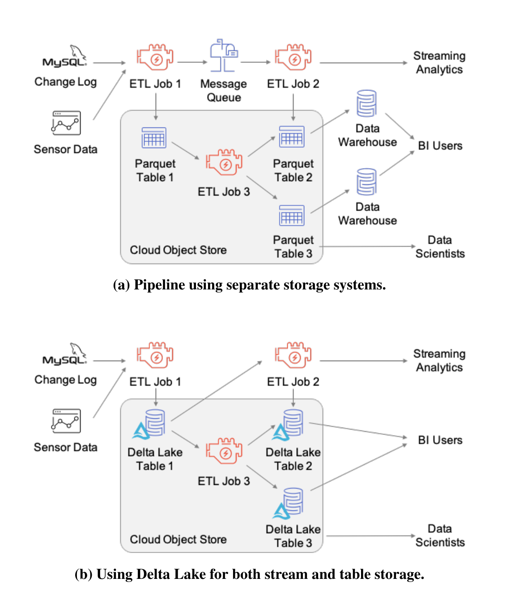
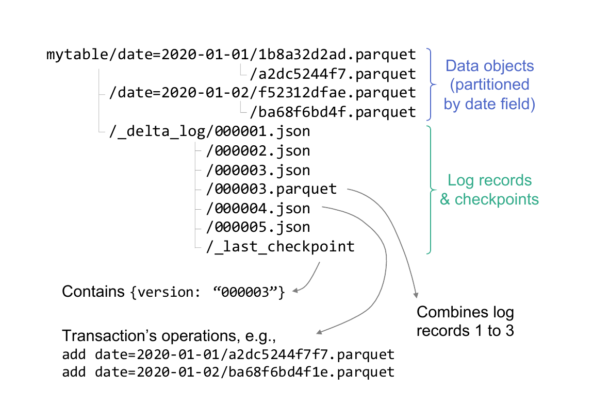
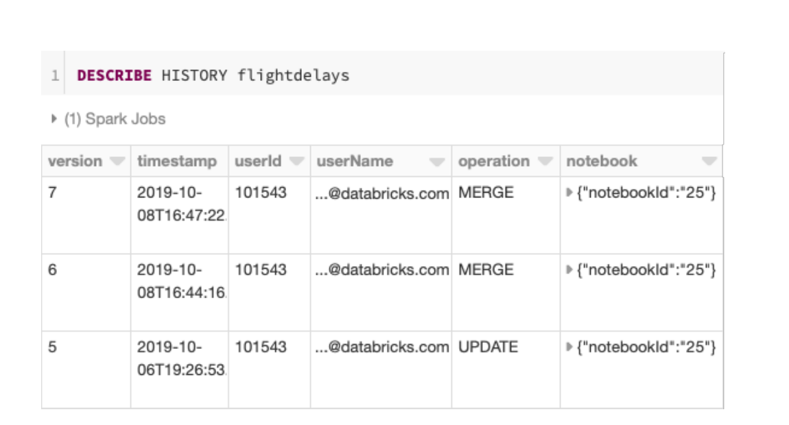
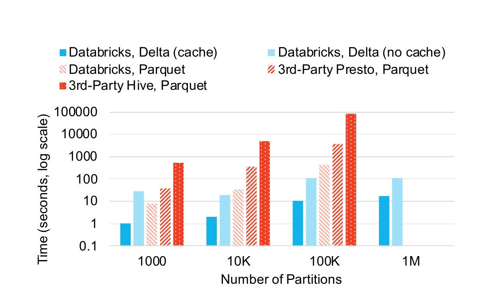
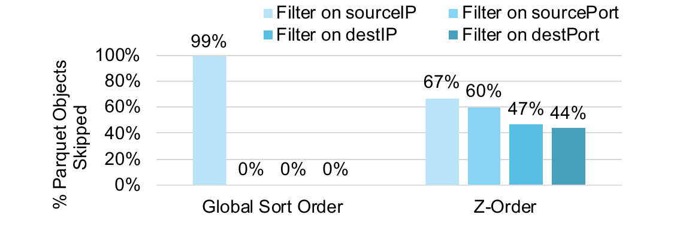
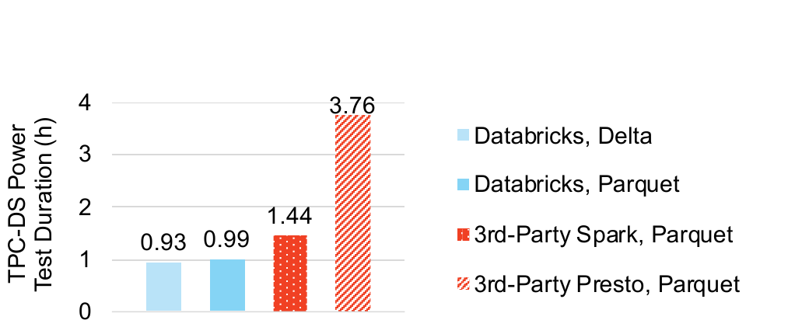
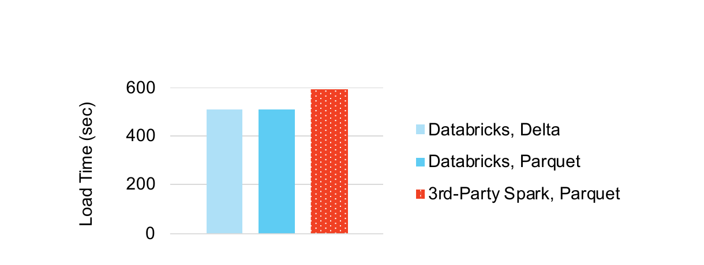

# Delta Lake: High-Performance ACID Table Storage over Cloud Object Stores（中文译文）

## 译者说明

本文依据同目录的 `source.pdf` 翻译。章节、图表、公式、算法、代码与参考文献按原文结构保留。

Michael Armbrust、Tathagata Das、Liwen Sun、Burak Yavuz、Shixiong Zhu、Mukul Murthy、Joseph Torres、Herman van Hovell、Adrian Ionescu、Alicja Łuszczak、Michał Świtakowski、Michał Szafrański、Xiao Li、Takuya Ueshin、Mostafa Mokhtar、Peter Boncz¹、Ali Ghodsi²、Sameer Paranjpye、Pieter Senster、Reynold Xin、Matei Zaharia³

Databricks；¹ CWI；² UC Berkeley；³ Stanford University

`delta-paper-authors@databricks.com`

## 摘要

Amazon S3 等云对象存储是全球规模最大、成本效益最高的存储系统之一，因此非常适合存放大型数据仓库和数据湖。然而，它们以键值存储实现，难以同时获得 ACID 事务和高性能：列举对象等元数据操作代价高昂，一致性保证也很有限。我们介绍 Delta Lake，这是最初由 Databricks 开发、构建在云对象存储之上的开源 ACID 表存储层。Delta Lake 使用事务日志，并把日志压缩成 Apache Parquet 格式，以提供 ACID 属性、时间旅行，以及面向大型表格数据集的显著更快的元数据操作，例如从数十亿个表分区中迅速找出与查询相关的分区。该设计还支持自动数据布局优化、upsert、缓存和审计日志等高级功能。Apache Spark、Hive、Presto、Redshift 等系统都能访问 Delta Lake 表。Delta Lake 已部署于数千家 Databricks 客户，每天处理 EB 级数据；其中最大的实例管理 EB 级数据集和数十亿个对象。

**PVLDB 引用格式：** Armbrust et al. Delta Lake: High-Performance ACID Table Storage over Cloud Object Stores. PVLDB, 13(12): 3411-3424, 2020. DOI: <https://doi.org/10.14778/3415478.3415560>

## 1. 引言

Amazon S3 [4]、Azure Blob Storage [17] 等云对象存储已经成为全球规模最大、使用最广泛的存储系统之一，为数百万客户保存 EB 级数据 [46]。除按用量付费、规模经济和专业化管理等云服务传统优势 [15] 外，云对象存储尤其吸引人的一点是可以分别扩展计算和存储资源。例如，用户可以保存 1 PB 数据，但只在执行查询的几个小时内启动集群。

因此，许多组织开始使用云对象存储管理数据仓库和数据湖中的大型结构化数据集。Apache Spark、Hive、Presto 等主要开源大数据系统 [45, 52, 42] 支持通过 Apache Parquet、ORC 等文件格式 [13, 12] 读写云对象存储。AWS Athena、Google BigQuery、Redshift Spectrum 等商业服务 [1, 29, 39] 也能直接查询这些系统和开放文件格式。

遗憾的是，虽然许多系统支持读写云对象存储，但要在其上实现高性能、可变的表存储并不容易，因而很难获得数据仓库能力。与 HDFS [5] 等分布式文件系统或 DBMS 的定制存储引擎不同，多数云对象存储只是键值存储，不提供跨键一致性保证；其性能特征也与分布式文件系统差异很大，需要专门设计。

在云对象存储中保存关系数据集，最常见的做法是使用 Parquet、ORC 等列式文件格式：每张表由一组对象，也就是 Parquet 或 ORC “文件”组成，并可按某些字段聚集成“分区”，例如每天使用一组单独对象 [45]。只要对象文件足够大，这种方式对扫描工作负载可以获得尚可的性能，但更复杂的工作负载会遇到正确性和性能问题。

第一，多对象更新不是原子的，查询之间没有隔离。例如，某查询需要更新表中的多个对象，删除散布在所有 Parquet 文件中的某位用户记录时，读者会在查询逐个更新对象的过程中看到部分更新。写入也很难回滚；更新查询一旦崩溃，表就处于损坏状态。第二，拥有数百万对象的大表会产生昂贵的元数据操作。Parquet 文件页脚含有 min/max 统计信息，可用于选择性查询的数据跳过。在 HDFS 上读取一个页脚可能只需几毫秒，但云对象存储延迟高得多，执行这些跳过检查的耗时甚至可能超过查询本身。

根据我们与云客户合作的经验，这些一致性和性能问题给企业数据团队造成了重大困难。多数企业数据集持续更新，需要原子写入方案；多数用户相关数据集都需要全表更新，以实施 GDPR 等隐私政策 [27]；即使纯内部数据集也可能要修复错误数据、纳入迟到记录等。在 Databricks 云服务早期的 2014-2016 年间，我们收到的升级支持请求约有一半源于云存储策略导致的数据损坏、一致性或性能问题，例如撤销崩溃更新作业的影响，或提升需要读取数万个对象的查询性能。

为解决这些问题，我们设计了 Delta Lake：云对象存储之上的 ACID 表存储层，2017 年开始向客户提供，2019 年开源 [26]。其核心思想很简单：使用同样保存在云对象存储中的预写日志，以 ACID 方式维护哪些对象属于某张 Delta 表。对象本身编码为 Parquet，因此已有 Parquet 处理能力的引擎很容易编写连接器。客户端可按可串行化方式一次更新多个对象、用一组对象替换另一组对象，同时仍可直接从对象中获得与原始 Parquet 相近的高并行读写性能。日志还保存每个数据文件的 min/max 统计等元数据，元数据搜索速度可比“对象存储中的文件”方案快一个数量级。

关键在于，Delta Lake 的全部元数据都保存在底层对象存储中，事务通过面向对象存储的乐观并发协议实现，具体细节随云提供商而异。维护 Delta 表状态不需要持续运行任何服务器；用户只在执行查询时启动服务器，仍然享有计算与存储分别扩展的优势。

基于这一事务设计，Delta Lake 还提供传统云数据湖没有的多项功能，以解决常见客户痛点：

- **时间旅行：** 查询某个时点的快照，或回滚错误的数据更新。
- **UPSERT、DELETE 与 MERGE：** 高效重写相关对象，以更新归档数据并执行 GDPR 等合规流程 [27]。
- **高效流式 I/O：** 流作业可用小对象低延迟写入表，稍后再以事务方式将其合并为大对象以提高性能；系统还支持快速“追尾”读取表中新加入的数据，使作业可把 Delta 表当成消息总线。
- **缓存：** Delta 表中的对象和日志不可变，集群节点可以安全地缓存在本地存储。Databricks 云服务据此为 Delta 表实现透明 SSD 缓存。
- **数据布局优化：** 云服务自动优化表内对象大小和数据记录的聚集方式，例如用 Z-order 存储记录，在多个维度上获得局部性，并且不影响正在运行的查询。
- **模式演化：** 表模式变化时，Delta 仍可读取旧 Parquet 文件而不必重写。
- **基于事务日志的审计日志。**

这些功能共同改善了云对象存储中数据的可管理性与性能，并支持“湖仓”（lakehouse）范式：把数据仓库和数据湖的关键能力结合起来，直接在低成本对象存储上使用标准 DBMS 管理功能。我们发现，许多 Databricks 客户可以用 Delta Lake 简化整体数据架构，以同时具备适当特性的 Delta 表替换原本分离的数据湖、数据仓库和流式存储系统。

图 1 展示了一个极端示例。原数据管道包含对象存储、消息队列，以及供两个商业智能团队使用的两个数据仓库，每个团队运行自己的计算资源；新方案仅在对象存储上使用 Delta 表，借助 Delta 的流式 I/O 与性能特性运行 ETL 和 BI。新管道只使用低成本对象存储，创建的数据副本更少，因而降低存储成本和维护开销。



*图 1：数据管道可以使用三种存储系统（消息队列、对象存储和数据仓库），也可以让 Delta Lake 同时承担流与表存储。Delta Lake 版本无需管理多份数据副本，并且只使用低成本对象存储。（a）使用分离存储系统的管道；（b）使用 Delta Lake 同时进行流与表存储。*

如今，Databricks 的多数大型客户都在使用 Delta Lake，每天处理 EB 级数据，约占我们的总工作负载一半。Google Cloud、Alibaba、Tencent、Fivetran、Informatica、Qlik、Talend 等产品也支持它 [50, 26, 33]。Databricks 客户的用例十分多样，从传统 ETL 和数据仓库，到生物信息学、实时网络安全分析（每天数百 TB 流式事件数据）、GDPR 合规，以及机器学习数据管理。最后一种用例把数百万张图像当作 Delta 表中的记录，而非独立 S3 对象，以获得 ACID 和更高性能。第 5 节详述这些用例。

从经验看，Delta Lake 把 Databricks 中与云存储相关的支持问题占比从约一半降到几乎为零。它也提升了多数客户工作负载的性能；在数据布局优化和快速统计访问用于查询高维数据集时，极端情况下加速可达 100 倍，例如网络安全与生物信息学用例。

开源 Delta Lake 项目 [26] 包含 Apache Spark（批处理与流处理）、Hive、Presto、AWS Athena、Redshift 和 Snowflake 的连接器，可运行在多种云对象存储或 HDFS 之上。在本文余下部分，我们将介绍 Delta Lake 的动机与设计，以及推动这些设计的客户用例和性能实验。

## 2. 动机：对象存储的特征与挑战

本节介绍云对象存储的 API 与性能特征，说明为何在这些系统上实现高效表存储颇具挑战，并概述现有表格数据管理方案。

### 2.1 对象存储 API

Amazon S3 [4]、Azure Blob Storage [17]、Google Cloud Storage [30]、OpenStack Swift [38] 等云对象存储提供简单、易扩展的键值接口。用户可创建 bucket，每个 bucket 保存多个对象；对象是最大可达数 TB 的二进制 blob，例如 S3 的对象大小上限为 5 TB [4]。每个对象由字符串 key 标识。

人们通常把 key 写成文件系统路径，例如 `warehouse/table1/part1.parquet`，但云对象存储不像文件系统那样提供廉价的对象或“目录”重命名。它们也提供元数据 API，例如 S3 的 LIST 操作 [41]，一般可以给定起始 key，按 key 的字典序列出 bucket 中的对象。因此，如果采用文件系统式路径，可以从目录前缀所代表的 key（如 `warehouse/table1/`）开始 LIST，从而高效列出某个“目录”中的对象。

遗憾的是，这些元数据 API 通常很昂贵。例如，S3 的 LIST 每次最多返回 1000 个 key，一次调用需要几十到几百毫秒；顺序实现列举包含数百万对象的数据集可能耗时数分钟。

读取对象时，云对象存储通常支持字节范围请求，因此可以只读取大对象中的某个范围，例如第 10,000 到 20,000 字节，从而利用把常用值聚集在一起的存储格式。更新对象通常需要一次重写整个对象；更新可以是原子的，让读者只看到新版本或旧版本。一些系统还支持向对象追加内容 [48]。

部分云厂商也在 blob 存储上实现分布式文件系统接口，例如 Azure ADLS Gen2 [18]，提供与 Hadoop HDFS 相似的语义，包括目录和原子重命名。不过，即使使用分布式文件系统，Delta Lake 所解决的许多问题仍然存在，例如小文件问题 [36] 和跨多个目录的原子更新。事实上，许多用户在 HDFS 上运行 Delta Lake。

### 2.2 一致性属性

最流行的云对象存储对单个 key 提供最终一致性，对跨 key 操作不提供一致性保证，因此管理由多个对象构成的数据集会遇到引言所述的问题。客户端上传新对象后，其他客户端不一定能立刻在 LIST 或读取操作中看到它；对现有对象的更新也不一定立即可见。视对象存储而定，执行写入的客户端自身甚至可能无法立即看到新对象。

具体一致性模型随云提供商而异，而且可能非常复杂。以 Amazon S3 为例，它对新对象写入提供 read-after-write 一致性，也就是 PUT 后 GET 会返回对象内容。但有一种例外：如果客户端在 PUT 前曾对尚不存在的 key 执行 GET，后续 GET 可能在一段时间内读不到对象，原因很可能是 S3 使用了负缓存。此外，S3 的 LIST 操作始终为最终一致，PUT 后的 LIST 可能不返回新对象 [40]。其他云对象存储提供更强保证 [31]，但仍缺少跨多个 key 的原子操作。

### 2.3 性能特征

我们的经验是，要在对象存储上取得高吞吐量，需要谨慎平衡大块顺序 I/O 与并行性。

对读取而言，最细粒度的操作是前述顺序字节范围读取。每次读取通常至少有 5-10 ms 基础延迟，之后可按约 50-100 MB/s 读取数据。因此，一次操作至少要读取数百 KB 才能达到顺序读峰值吞吐量的一半；要接近峰值则需读取数 MB。典型 VM 配置还要求应用并行执行多次读取以最大化吞吐量。例如，AWS 上最常用于分析的 VM 类型至少有 10 Gbps 网络带宽，需要并行执行 8-10 次读取才能完全利用带宽。

LIST 操作同样需要高度并行才能快速列举大量对象。S3 LIST 每次最多返回 1000 个对象，耗时几十到几百毫秒，客户端需要并行发出数百个 LIST 才能列出大型 bucket 或“目录”。我们为云端 Apache Spark 优化的运行时有时除在 driver 节点使用线程外，还把 LIST 操作并行分配到 Spark 集群 worker 节点。Delta Lake 把可用对象的元数据，包括名称和数据统计，保存在 Delta 日志中，但同样会在集群中并行读取日志。

如 2.1 节所述，写操作通常必须替换整个对象或向其追加。这意味着，如果表预计接收点更新，其中的对象应保持较小，但这又与大块读取的需求冲突。另一种选择是采用日志结构化存储格式。

**对表存储的影响。** 对象存储的性能特征为分析工作负载带来三点设计考虑：

1. 把经常一起访问的数据顺序放在邻近位置，通常意味着选用列式格式。
2. 对象要大，但不能过大。大对象会增加数据更新代价，例如删除某位用户的全部数据，因为必须完整重写对象。
3. 避免 LIST 操作；无法避免时尽量请求按字典序排列的 key 范围。

### 2.4 现有表存储方案

基于对象存储的上述特征，目前主要有三类表格数据管理方案。下面概述它们及其挑战。

**1. 文件目录。** 最常见的方案由开源大数据栈和许多云服务支持：把表保存为一组对象，通常采用 Parquet 等列式格式。还可以根据一个或多个属性把记录“分区”进不同目录。例如，对含 date 字段的表，可以为每天建立单独目录：1 月 1 日数据为 `mytable/date=2020-01-01/obj1`、`mytable/date=2020-01-01/obj2`，1 月 2 日数据为 `mytable/date=2020-01-02/obj1`，并按该字段把传入数据拆到多个对象。只访问少数分区的查询可因此降低 LIST 和读取代价。

这一方案很有吸引力，因为表“只是一组对象”，无需运行额外数据存储或系统即可被多种工具访问。它源自 HDFS 上的 Apache Hive [45]，也符合 Parquet、Hive 等大数据软件在文件系统上的工作方式。

**该方案的挑战。** 如引言所述，在云对象存储上，“只是一组文件”的方案同时存在性能和一致性问题。客户最常遇到的挑战包括：

- **跨多个对象无原子性：** 任何需要写入或更新多个对象的事务，都可能把部分写入暴露给其他客户端；事务失败还会让数据保持在损坏状态。
- **最终一致性：** 即使事务成功，客户端也可能只看到部分更新对象。
- **性能差：** 为查询列举相关对象代价高昂，即便对象已按 key 分到目录。读取 Parquet 或 ORC 文件中的逐对象统计同样昂贵，因为每项都需要额外的高延迟读取。
- **缺少管理功能：** 对象存储不提供数据仓库中熟悉的表版本管理、审计日志等标准工具。

**2. 定制存储引擎。** Snowflake 数据仓库 [23] 等为云构建的“封闭世界”存储引擎，可以在独立的强一致服务中自行管理元数据，记录组成表的对象这一“事实来源”，从而绕过云对象存储的许多一致性问题。此时对象存储只是简单块设备，系统可在云对象之上使用标准技术实现高效元数据存储、搜索和更新。

不过，该方案需要持续运行高可用元数据服务，成本可能很高；外部计算引擎查询数据时可能产生额外开销；用户还可能被锁定在单一提供商上。

**该方案的挑战。** 尽管从头设计的“封闭世界”方案有诸多优点，我们仍遇到以下问题：

- 表的所有 I/O 都需要联系元数据服务，增加资源成本，并可能降低性能和可用性。例如 Spark 访问 Snowflake 数据集时，Snowflake Spark 连接器会经由 Snowflake 服务传输读取数据，性能低于直接读取云对象存储。
- 计算引擎连接器比复用 Parquet 等开放格式需要更多工程投入。数据团队希望在数据上使用 Spark、TensorFlow、PyTorch 等多种计算引擎，因此连接器是否易于实现十分重要。
- 专有元数据服务把用户绑定到特定服务商；直接访问云存储对象的方案则让用户始终可以使用其他技术访问自己的数据。

Apache Hive ACID [32] 在 HDFS 或对象存储上实现了类似方案：用 Hive Metastore（MySQL 等事务 RDBMS）跟踪多个文件，这些文件保存 ORC 表的更新。但根据我们的经验，元数据存储的性能会限制该方案，在拥有数百万对象的表中可能成为瓶颈。

**3. 把元数据放在对象存储中。** Delta Lake 的方案是把事务日志和元数据直接保存在云对象存储内，并在对象存储操作之上用一组协议实现可串行化。表数据采用 Parquet，因此只要有一个最小连接器来发现需要读取的对象集合，任何已支持 Parquet 的软件都很容易访问数据。[^1]

我们认为 Delta Lake 是首个使用该设计的系统，始于 2016 年；现在 Apache Hudi [8] 和 Apache Iceberg [10] 也支持这一设计。Delta Lake 还提供这些系统没有的 Z-order 聚集、缓存和后台优化等特性。第 8 节将进一步讨论它们的异同。

[^1]: 如 4.8 节所述，多数 Hadoop 生态项目已经支持一种只读取目录内文件子集的简单机制，称为“manifest 文件”，最初用于支持 Hive 中的符号链接。Delta Lake 可以为每张表维护 manifest 文件，让这些系统执行一致性读取。

## 3. Delta Lake 存储格式与访问协议

一张 Delta Lake 表是云对象存储或文件系统中的目录，其中保存承载表内容的数据对象，以及记录事务操作并间歇创建 checkpoint 的日志。客户端使用专门适配云对象存储特征的乐观并发控制协议更新这些数据结构。本节介绍 Delta Lake 的存储格式、访问协议和事务隔离级别；单表内支持可串行化与快照隔离。

### 3.1 存储格式

图 2 展示 Delta 表的存储格式。每张表保存在一个文件系统目录中，示例为 `mytable`；在对象存储中，则表现为一组共享同一“目录”key 前缀的对象。



*图 2：示例 Delta 表中保存的对象。数据对象按 date 字段分区；`_delta_log` 中包含日志记录与 checkpoint，`_last_checkpoint` 指向最近 checkpoint；事务记录用 add 操作把数据对象纳入表。*

#### 3.1.1 数据对象

表内容保存在 Apache Parquet 对象中，并可按 Hive 的分区命名约定组织为目录。图 2 中，表按 date 列分区，因此不同日期的数据对象位于不同目录。

我们选择 Parquet 作为底层数据格式，因为它面向列，提供多种压缩方式，支持半结构化数据所需的嵌套类型，而且已有多个引擎提供高性能实现。建立在既有开放文件格式之上，还能让 Delta Lake 持续受益于新版 Parquet 库，并简化其他引擎连接器的开发（4.8 节）。ORC [12] 等其他开源格式很可能也能工作，但当时 Parquet 在 Spark 中的支持最成熟。

Delta 中每个数据对象都有唯一名称，通常由 writer 生成 GUID。但表的每个版本包含哪些对象，由事务日志决定。

#### 3.1.2 日志

日志保存在表内 `_delta_log` 子目录中。它包含一系列 JSON 对象，使用递增且补零的数字 ID 保存日志记录；此外还会不时为特定日志对象创建 checkpoint，以 Parquet 格式汇总截至该点的日志。[^2] 如 3.2 节所述，客户端使用一组简单访问协议创建新日志项或 checkpoint，并就事务顺序达成一致；具体协议取决于各对象存储提供的原子操作。

每个日志记录对象，例如 `000003.json`，都包含一个 action 数组；把这些 action 应用于表的前一版本即可生成下一版本。可用 action 如下。

**修改元数据。** `metaData` action 修改表的当前元数据。表的第一个版本必须包含 `metaData`；后续 `metaData` 会完整覆盖当前元数据。元数据结构包含 schema、分区列名称（示例中的 date）、数据文件存储格式（通常为 Parquet，也可扩展），以及把表标为 append-only 等其他配置项。

**添加或删除文件。** `add` 和 `remove` action 分别添加或删除单个数据对象，以修改表内数据。客户端搜索日志，找到所有尚未被删除的已添加对象，即可确定组成当前表的对象集合。

数据对象的 `add` 记录还可以包含数据统计，例如总记录数、逐列 min/max 值和 null 数。若某路径已存在于表中，又遇到针对它的 `add`，则最新版本的统计会替换之前版本。这可以在新版 Delta Lake 中为旧表“升级”更多类型的统计信息。

`remove` action 含有删除发生时间的 timestamp。数据对象的物理删除可以延迟到用户配置的保留时间阈值之后；这样并发读者仍可继续读取旧数据快照。在底层数据对象真正删除之前，`remove` action 应作为 tombstone 保留在日志及其 checkpoint 中。

`add` 或 `remove` action 的 `dataChange` 标志可以设为 `false`，表示它与同一日志记录对象中的其他 action 组合后，只重新排列已有数据或增加统计信息。例如，追读事务日志的流查询可用该标志跳过不会影响结果的 action，如调整早期数据文件的排序顺序。

**协议演化。** `protocol` action 用于提高读取或写入某张表所要求的 Delta 协议版本。系统借此为格式增加新功能，同时标识哪些客户端仍兼容。

**添加来源信息。** 每个日志记录对象还可以在 `commitInfo` action 中加入来源信息，例如记录执行操作的用户。

**更新应用事务 ID。** Delta Lake 还允许应用把自己的数据写入日志记录，这对实现端到端事务应用很有用。例如，向 Delta 表写入的流处理系统要实现“exactly-once”语义，就必须知道哪些写入已经提交；流作业崩溃后，需要识别已进入表的写入，才能从输入流的正确 offset 开始重放后续写入。

为支持该用例，Delta Lake 允许应用在日志对象中写入自定义 `txn` action，其中有 `appId` 和 `version` 字段，可跟踪应用特定信息，例如对应的输入流 offset。该信息与相应的 Delta `add`、`remove` 操作放在同一条原子插入的日志记录中，应用便能确保 Delta Lake 原子地加入新数据并保存 `version`。每个应用只需随机生成 `appId` 即可取得唯一 ID。Apache Spark Structured Streaming 的 Delta Lake 连接器 [14] 使用了这一能力。

[^2]: 日志记录 ID 补零后，客户端可利用对象存储提供的字典序 LIST，从 checkpoint 之后高效找出所有新记录。

#### 3.1.3 日志 checkpoint

为了提高性能，必须定期把日志压缩为 checkpoint。Checkpoint 使用 Parquet 格式，保存截至某个日志记录 ID 的所有非冗余 action。以下冗余 action 可以删除或合并：

- 针对同一数据对象的 `add` 后跟 `remove`。由于对象已不在表中，可以删除 `add`；`remove` 则应按表的数据保留配置继续保留为 tombstone。客户端根据 `remove` 中的 timestamp 决定何时从存储中物理删除对象。
- 同一对象的多个 `add` 可由最后一个替代，因为新的 `add` 只能增加统计信息。
- 同一 `appId` 的多个 `txn` 可由最后一个替代，其中含最新的 `version` 字段。
- `changeMetadata` 与 `protocol` action 也可合并，只保留最新元数据和协议。

Checkpoint 最终是一个 Parquet 文件，其中包含表中仍存在的每个对象的 `add` 记录；已删除但在保留期结束前仍需保存的对象的 `remove` 记录；以及少量 `txn`、`protocol`、`changeMetadata` 等其他记录。这种列式文件非常适合查询表元数据，也适合根据统计信息找出可能含有选择性查询相关数据的对象。根据我们的经验，使用 Delta Lake checkpoint 找出查询所需对象，几乎总比在对象存储上执行 LIST 并读取 Parquet 页脚更快。

任何客户端都可尝试创建截至给定日志记录 ID 的 checkpoint，成功时应把它写成相应 ID 的 `.parquet` 文件。例如，`000003.parquet` 表示包含截至 `000003.json` 的所有记录。默认情况下，客户端每 10 个事务创建一次 checkpoint。

客户端还需要在不列举 `_delta_log` 目录全部对象的情况下，高效找到最后一个 checkpoint 及日志尾部。Checkpoint writer 在新 checkpoint ID 晚于 `_delta_log/_last_checkpoint` 中当前 ID 时，把新 ID 写入该文件。即使云对象存储的最终一致性使 `_last_checkpoint` 过时也没有关系，因为客户端仍会继续搜索该 ID 之后的新 checkpoint。

### 3.2 访问协议

Delta Lake 的访问协议只依赖对象存储操作，就能让客户端在对象存储只有最终一致性保证时实现可串行化事务。关键选择是：`000003.json` 这样的日志记录对象，是客户端读取表的特定版本时必须知道的“根”数据结构。获得该对象内容后，客户端即可向对象存储查询其他对象；如果对象因最终一致性延迟尚不可见，可以等待后读取表数据。

对写事务而言，客户端还要确保只有一个 writer 能创建下一条日志记录，例如 `000003.json`，再以此实现乐观并发控制。

#### 3.2.1 读取表

只读事务安全地读取表的某个版本，共有五个步骤：

1. 如果表的日志目录中存在 `_last_checkpoint` 对象，读取它以取得最近 checkpoint ID。
2. 执行 LIST：若有最近 checkpoint ID，就以它为起始 key，否则以 0 为起点；寻找表日志目录中更新的 `.json` 和 `.parquet` 文件。所得文件列表可用于从最近 checkpoint 重建表状态。由于对象存储是最终一致的，LIST 可能返回不连续对象，例如有 `000004.json`、`000006.json`，但没有 `000005.json`。客户端仍可把返回的最大 ID 作为目标表版本，并等待缺失对象变为可见。
3. 使用 checkpoint（若有）和上一步识别的后续日志记录重建表状态，即找出存在 `add`、但没有对应 `remove` 的数据对象集合及其统计信息。格式经过专门设计，可以并行完成该任务。例如 Spark 连接器用 Spark 作业读取 checkpoint Parquet 文件和日志对象。
4. 利用统计信息识别与读查询相关的数据对象文件集合。
5. 查询对象存储以读取相关数据对象，并可在集群中并行执行。由于对象存储是最终一致的，一些 worker 节点可能暂时查询不到 query planner 在日志中发现的对象；稍等片刻重试即可。

该协议的每一步都可容忍最终一致性。例如，客户端即使读到旧版 `_last_checkpoint`，仍可在后续 LIST 中发现更新日志文件，重建较新的表快照。`_last_checkpoint` 只是提供最近 checkpoint ID，降低 LIST 代价。同样，客户端可以容忍近期日志记录列表不一致，例如 ID 有缺口，也可以容忍日志所引用的数据对象暂时不可读。

#### 3.2.2 写事务

写数据的事务一般最多执行以下五步，具体取决于事务操作：

1. 使用读协议的第 1-2 步，从最后一个 checkpoint ID 向前查找，确定最近日志记录 ID，记为 `r`。事务随后按需读取表版本 `r`，并尝试写入日志记录 `r + 1`。
2. 如果需要，按读协议相同步骤读取表版本 `r`：合并之前的 checkpoint 和后续日志记录，再读取其中引用的数据对象。
3. 把事务计划加入表的新数据对象写进正确数据目录的新文件，使用 GUID 生成对象名称。该步骤可并行执行。结束后，新对象已经可以被新日志记录引用。
4. 如果没有其他客户端写入 `r + 1.json`，尝试把事务日志记录写入该对象。此步骤必须原子完成，下文讨论不同对象存储上的实现。失败后可重试事务；视查询语义而定，客户端也可复用第 3 步写入的新数据对象，只在新日志记录中再次尝试把它们加入表。
5. 可选地，为日志记录 `r + 1` 写入新 `.parquet` checkpoint。实际实现默认每 10 条记录执行一次。写入完成后，把 `_last_checkpoint` 更新为指向 checkpoint `r + 1`。

第 5 步只影响性能。客户端在写 checkpoint 或更新 `_last_checkpoint` 的任何位置失败，都不会损坏数据。例如，即使客户端未能写入 checkpoint，或已写 checkpoint Parquet 对象但未更新 `_last_checkpoint`，其他客户端仍可用更早的 checkpoint 读取表。第 4 步成功时，事务即原子提交。

**原子添加日志记录。** 写协议第 4 步，即创建 `r + 1.json` 日志对象，必须具有原子性：只有一个客户端能成功创建该名称的对象。并非所有大规模存储系统都有原子 put-if-absent 操作，因此我们针对不同系统采用不同方案：

- Google Cloud Storage 和 Azure Blob Store 支持原子 put-if-absent，直接使用即可。
- HDFS 等分布式文件系统支持原子 rename：把临时文件重命名为目标名称，例如 `000004.json`；目标已存在时失败。Azure Data Lake Storage [18] 也提供原子重命名的文件系统 API，使用相同方案。
- Amazon S3 没有原子“put if absent”或 rename。在 Databricks 服务部署中，我们用单独的轻量协调服务，确保每个日志 ID 只能由一个客户端添加记录。该服务只用于日志写入，不参与读取和数据操作，因此负载很低。开源 Apache Spark Delta Lake 连接器利用内存状态，确保经同一个 Spark driver 程序（`SparkContext` 对象）的写入取得不同日志记录 ID，用户因此仍可在单一 Spark 集群中并发操作 Delta 表。系统还提供 API，可插入自定义 `LogStore` 类；用户若希望运行单独的强一致存储，可用它实现其他协调机制。

### 3.3 可用隔离级别

根据 Delta Lake 的并发控制协议，所有执行写入的事务均可串行化，串行顺序就是递增的日志记录 ID。原因是写事务提交协议只允许一个事务写入每个记录 ID。读事务则可以获得快照隔离或可串行化。

3.2.1 节的读协议只读取表的一个快照，使用它的客户端获得快照隔离。希望执行可串行化读的客户端，例如要让读操作位于其他可串行化事务之间，可以执行一次含 dummy write 的读写事务。实际 Delta Lake 连接器还在内存中缓存访问过的每张表的最新日志记录 ID，因此即使读使用快照隔离，客户端也会“读到自己的写入”，并在多次读取时看到单调递增的表版本序列。

需要强调的是，Delta Lake 目前只支持单表内事务。未来也可以扩展对象存储日志设计，在同一日志中管理多张表。

### 3.4 事务速率

Delta Lake 写事务速率受 3.2.2 节写新日志记录的 put-if-absent 延迟限制。与所有乐观并发控制协议一样，写事务速率过高会导致提交失败。实际对象存储写入延迟可能为几十到几百毫秒，写事务速率因此限制在每秒数个事务。

不过，我们发现该速率足以满足几乎所有现有 Delta Lake 应用。即便是向云存储摄取流数据的应用，通常也只有少量高度并行的写作业，例如 Spark Streaming 作业，并且可把多个新数据对象批量放入一个事务。

如果未来需要更高速率，我们认为类似 S3 commit service 的定制 `LogStore` 可以协调日志访问并显著缩短提交时间，例如把日志尾部持久化进低延迟 DBMS，再异步写入对象存储。快照隔离级别的读事务只读对象存储中的对象，不产生竞争，因此可以任意并发执行。

## 4. Delta 的高级功能

Delta Lake 的事务设计支持多种高级数据管理功能，与传统分析型 DBMS 的许多设施相似。本节介绍其中使用最广泛的功能，以及推动它们产生的客户用例或痛点。

### 4.1 时间旅行与回滚

数据工程管道经常出错，尤其是在摄取外部系统的“脏”数据时；传统数据湖却很难撤销向表中加入对象的更新。机器学习训练等工作负载还要求忠实重现旧版数据，例如在同一数据上比较新旧训练算法。在 Delta Lake 出现之前，这两个问题都给 Databricks 用户带来重大挑战，迫使他们为数据管道错误设计复杂的补救方案，或复制整个数据集。

由于 Delta Lake 的数据对象和日志不可变，查询过去的数据快照与典型 MVCC 实现一样直接：客户端只需根据旧日志记录 ID 读取表状态。为支持时间旅行，Delta Lake 允许用户逐表配置数据保留间隔，并支持 SQL `AS OF timestamp` 与 `VERSION AS OF commit_id` 语法读取历史快照。客户端也可以通过 Delta Lake API 得知某次操作刚刚读取或写入的 commit ID。例如，开源项目 MLflow [51] 使用该 API 自动记录 ML 训练工作负载所读的表版本。

用户发现时间旅行对修复数据管道错误尤其有帮助。例如，要高效撤销覆盖了部分用户数据的更新，分析师可以把表与其旧版本做 SQL MERGE：

```sql
MERGE INTO mytable target
USING mytable TIMESTAMP AS OF <old_date> source
ON source.userId = target.userId
WHEN MATCHED THEN UPDATE SET *
```

我们还在开发 `CLONE` 命令，从表的某个既有快照开始创建 copy-on-write 新版本。

### 4.2 高效 UPSERT、DELETE 与 MERGE

企业中的许多分析数据集都需要随时间修改。为遵守 GDPR [27] 等数据隐私法规，企业必须能按要求删除特定用户的数据。即使内部数据集不涉及个人，旧记录也可能因上游采集错误或迟到数据而需要修正。计算聚合数据集的应用，例如供业务分析师查询的表摘要，也需要持续更新。

在 S3 Parquet 文件目录等传统数据湖格式中，如果不停掉并发读者，很难完成这些更新。即便停掉读者，更新作业也必须十分谨慎，因为中途失败会让表处于部分更新状态。Delta Lake 可以事务化地执行所有这些操作，通过 Delta 日志中的新 `add`、`remove` 记录替换被更新对象。Delta Lake 支持标准 SQL UPSERT、DELETE 和 MERGE 语法。

### 4.3 流式摄取与消费

许多数据团队希望部署流式管道，实时执行 ETL 或聚合，但传统云数据湖很难用于这一目的。团队因此部署 Apache Kafka [11]、Kinesis [2] 等独立流式消息总线，既重复保存数据，又增加管理复杂度。

Delta Lake 的设计让生产者和消费者都能借助表日志把 Delta 表当作消息队列，从而在许多场景中取消独立消息总线。该能力来自三个主要特性。

**写入压缩。** 由对象集合组成的简单数据湖很容易插入数据，只需写新对象，但写延迟与查询性能之间存在令人不快的权衡。Writer 若通过写小对象快速加入新记录，reader 最终会因顺序读取更小、元数据操作更多而变慢。Delta Lake 允许后台进程以事务方式压缩小数据对象，不影响 reader。3.1.2 节所述的压缩日志记录把 `dataChange` 设为 `false` 后，已经读过小对象的流消费者可以完全忽略压缩操作。因此，流式应用能通过小对象快速传输数据，同时保持旧数据查询的高性能。

**Exactly-once 流写入。** Writer 可使用 3.1.2 节的日志记录 `txn` action，跟踪已写入 Delta 表的数据并实现 exactly-once 写入。一般来说，更新外部存储的流处理系统需要让写入幂等，避免故障恢复后重复写。覆盖场景可以要求每条记录有唯一 key；更一般的做法是每次写入时原子更新“最后写入版本”记录，之后只写入更新的变化。

Delta Lake 允许应用在每个事务中更新一个 `(appId, version)` 对，直接支持后一模式。Structured Streaming [14] 连接器用它为追加、聚合、upsert 等任意流计算提供 exactly-once 写入。

**高效追读日志。** 要把 Delta 表当作消息队列，消费者最后还需要高效发现新写入。日志由 ID 按字典序递增的一系列 `.json` 对象组成，消费者只需从已见的最后日志记录 ID 开始执行对象存储 LIST，即可发现新记录。日志中的 `dataChange` 让流消费者跳过只压缩或重排已有数据的记录，只读取新数据对象。流应用也很容易记住处理完成的最后记录 ID，在同一位置停止和重启。

结合这三个特性，许多用户不再需要运行独立消息总线，而是以低成本云对象存储和 Delta 实现秒级延迟的流式管道。

### 4.4 数据布局优化

数据布局对分析系统查询性能影响很大，尤其是大量分析查询具有高度选择性。Delta Lake 可以事务化更新表示表的数据结构，因此能在不影响并发操作的情况下实施多种布局优化。后台进程可压缩数据对象、改变对象内记录顺序，甚至更新数据统计和索引等辅助结构，不影响其他客户端。我们据此实现了多项数据布局优化。

**OPTIMIZE 命令。** 用户可对表手工运行 `OPTIMIZE`，在不影响正在进行的事务时压缩小对象，并计算缺失统计。默认目标是让每个数据对象达到 1 GB；实践表明该值适合许多工作负载，用户也可自定义。

**按多个属性进行 Z-order。** 许多数据集会沿多个属性接收高度选择性查询。我们接触的一个网络安全数据集用 `(sourceIp, destIp, time)` tuple 保存网络传输信息，查询会沿每个维度做高选择性过滤。Apache Hive [45] 式简单目录分区可以在写入后按少数属性切分数据，但属性一多，分区数就会大到难以承受。

Delta Lake 支持沿一组指定属性按 Z-order [35] 重排表中记录，从而在多个维度上获得高局部性。Z-order 曲线是一种易于计算的空间填充曲线，可在所有指定维度上形成局部性。实践中，组合这些维度的查询工作负载可因此显著提速，第 6 节给出了实验。用户可以为表指定 Z-order，再运行 `OPTIMIZE`，把所需数据子集，例如最新记录，移动到按所选属性 Z-order 排列的对象中；之后也可改变顺序。

Z-order 与数据统计配合，使查询读取更少数据。Z-order 会让每个数据对象只包含所选属性各自可能值域中的一小段，选择性查询因而可以跳过更多对象。

**AUTO OPTIMIZE。** 在 Databricks 云服务中，用户可设置表的 `AUTO OPTIMIZE` 属性，让服务自动压缩新写入的数据对象。

更一般地，Delta Lake 的设计允许在更新表时维护索引或计算昂贵的统计信息。我们正在探索该领域的多项新功能。

### 4.5 缓存

许多云用户为 ad-hoc 查询运行相对长寿命的集群，并可能根据负载自动扩缩。在这些集群中，可把经常访问的对象存储数据缓存到本地设备，加速查询。例如，AWS i3 实例每个 core 提供 237 GB NVMe SSD，本身成本只比对应 m5 通用实例高约 50%。

Databricks 构建了透明缓存 Delta Lake 数据的集群功能，把数据对象和日志对象缓存在本地，从而同时加速数据查询和元数据查询。由于 Delta 表中的数据、日志和 checkpoint 对象不可变，这种缓存是安全的。第 6 节表明，从缓存读取可以显著提高查询性能。

### 4.6 审计日志

Delta Lake 的事务日志还可根据 `commitInfo` 记录实现审计日志。Databricks 为 Spark 集群提供锁定执行模式：用户自定义函数不能直接访问云存储，也不能调用 Apache Spark 私有 API。系统因此可以确保只有 runtime engine 能写 `commitInfo`，形成不可变审计日志。

用户可用 `DESCRIBE HISTORY` 命令查看 Delta Lake 表的历史，如图 3 所示。开源版本同样提供 commit 信息记录。审计日志是数据安全最佳实践；随着监管加强，越来越多企业必须使用它。



*图 3：Databricks 上 Delta Lake 表的 `DESCRIBE HISTORY` 输出，显示每次更新的来源。*

### 4.7 模式演化与强制执行

长期维护的数据集经常需要更新 schema，但若数据集“只是一组对象”，旧对象，例如旧 Parquet 文件，可能使用“错误”的 schema。Delta Lake 可以事务化执行 schema 变更，并按需随变更更新底层对象，例如删除用户不再希望保留的列。

事务日志保存 schema 更新历史后，某些 schema 变更，例如增加列，可以继续使用旧 Parquet 对象而无需重写。与此同样重要的是，Delta 客户端会确保新写入数据符合表 schema。这些简单检查捕获了许多用户错误；在使用 Delta Lake 之前，各作业只是向同一目录写 Parquet 文件，追加错误 schema 的数据很难追查。

### 4.8 查询与 ETL 引擎连接器

Delta Lake 通过 Apache Spark data source API [16] 为 Spark SQL 和 Structured Streaming 提供完整连接器。此外，它目前还与 Apache Hive、Presto、AWS Athena、AWS Redshift 和 Snowflake 提供只读集成，用户可用熟悉工具查询 Delta 表，并与这些系统中的数据连接。Fivetran、Informatica、Qlik、Talend 等 ETL 与 Change Data Capture（CDC）工具也可写入 Delta Lake [33, 26]。

多个查询引擎集成采用 Hive 最初为符号链接引入的 `symlink manifest` 文件。Symlink manifest 是对象存储或文件系统中的文本文件，列出某个目录中应当可见的 path。各种 Hive 兼容系统读取目录时会寻找这种文件，通常名为 `_symlink_format_manifest`，并把其中 path 当作目录内容。

在 Delta Lake 中，只需创建列出组成表的 Parquet 数据对象的 manifest 文件，即可把静态快照暴露给支持该输入格式的 reader。该文件可在每个目录中原子写入，因此读取未分区 Delta 表的系统会看到完整一致的只读快照；读取分区表的系统会看到各分区目录的一致快照。

用户运行一条简单 SQL 命令即可为表生成 manifest，之后可把数据作为外部表加载到 Presto、Athena、Redshift 或 Snowflake。Apache Hive 等其他系统则由开源社区利用现有插件 API 设计原生 Delta Lake 连接器。

## 5. Delta Lake 用例

Delta Lake 已在数千家 Databricks 客户中投入使用，每天处理 EB 级数据；开源社区的其他组织也在使用 [26]。这些用例涵盖多种数据源和应用。所存数据类型包括企业 OLTP 系统的 Change Data Capture 日志、应用日志、时序数据、图、报告聚合表，以及机器学习所用的图像或特征数据。运行于其上的应用包括最常见的 SQL 工作负载，以及商业智能、流处理、数据科学、机器学习和图分析。

Delta Lake 适合多数原本会用 Parquet 或 ORC 等结构化格式的数据湖应用，以及许多传统数据仓库工作负载。我们发现客户经常用它简化企业数据架构：更多工作负载直接在云对象存储上运行，构成兼具数据湖和事务能力的 lakehouse。

例如，一个典型数据管道从多个来源加载记录，如 OLTP 数据库 CDC 日志和设施传感器数据，再经 ETL 生成供数据仓库与数据科学工作负载使用的派生表（图 1）。传统实现需要组合 Apache Kafka [11] 等消息队列以计算实时结果，用数据湖长期保存数据，再用 Redshift [3] 等数据仓库为依赖索引和快速节点本地 SSD 的用户提供快速分析查询。这会生成多份数据，并要求每个系统持续运行摄取作业。

使用 Delta Lake 后，可以根据工作负载把其中多个存储系统替换为对象存储表，再利用 ACID 事务、流式 I/O 与 SSD 缓存等特性恢复各专用系统的部分优化。Delta Lake 显然不能替代上述系统的全部功能，但在许多场景中至少可以替换其中一部分。4.8 节的连接器也让多种既有引擎能够查询 Delta。

### 5.1 数据工程与 ETL

许多组织正把 ETL/ELT 和数据仓库工作负载迁往云端以简化管理；另一些组织则在传统企业数据源之外，例如 OLTP 销售点事件，引入规模大得多的新数据流，例如网站访问或库存跟踪，供下游数据与机器学习应用使用。所有这些应用都需要可靠且易维护的数据工程或 ETL 流程。

组织部署云工作负载时，往往选择云对象存储作为落地区域，也就是数据湖，以降低存储成本，再计算派生数据集并加载到更优化的数据仓库系统，后者可能使用节点本地存储。Delta Lake 的 ACID 事务、UPSERT/MERGE 和时间旅行让组织可以复用既有 SQL 查询，直接在对象存储上执行 ETL，并使用回滚、时间旅行、审计日志等熟悉的维护能力。

只使用 Delta Lake 一个存储系统而不分设数据湖和数据仓库，还取消了独立摄取流程，缩短新数据可查询的延迟。Delta Lake 同时支持 SQL 和 Apache Spark 程序化 API，便于用多种工具编写数据工程管道。

这种数据工程用例几乎出现在我们见过的所有数据与 ML 工作负载中，覆盖金融服务、医疗、媒体等行业。基本 ETL 管道完成后，组织经常把部分数据开放给新工作负载，让新集群直接访问同一对象存储中的 Delta Lake，例如用 PySpark 进行数据科学分析。另一些组织使用 Spark Structured Streaming [14] 等工具，把管道的一部分改造成流查询。这些工作负载都可轻易运行在新云 VM 上并访问同一批表。

### 5.2 数据仓库与 BI

传统数据仓库把 ETL/ELT 功能与高效查询工具结合，面向商业智能等交互式查询。支持这类负载通常需要高效列式存储、聚集和索引等访问优化、快速存储硬件，以及经过充分优化的查询引擎 [43]。

Delta Lake 结合列式格式、数据布局优化、min/max 统计和 SSD 缓存，可直接为云对象存储中的表提供这些能力；事务设计保证它们能被可靠实现。因此，大多数 Delta Lake 用户还会直接通过 SQL 或 Tableau 等 BI 软件，对 lakehouse 数据集运行 ad-hoc 查询与 BI 工作负载。该用例足够普遍，Databricks 为 BI 工作负载开发了新的向量化执行引擎 [21]，并优化 Spark runtime。与 ETL 场景一样，直接在 Delta Lake 上运行 BI 的优势之一是更容易让分析师使用新鲜数据，因为无需把数据加载到独立系统。

### 5.3 合规与可复现性

传统数据湖存储格式主要为不可变数据设计，但欧盟 GDPR [27] 等新数据隐私法规和行业最佳实践要求组织能够高效删除或修正个人数据。我们看到多个行业的组织把既有云数据集转成 Delta Lake，以使用高效 UPSERT、MERGE、DELETE。用户也利用 4.6 节的审计日志执行数据治理。

Delta Lake 时间旅行也有助于可复现的数据科学与机器学习。我们把 Delta Lake 与 Databricks 开发的开源模型管理平台 MLflow [51] 集成，自动记录训练 ML 模型所用的数据集版本，并让开发者重新载入它。

### 5.4 专门用例

#### 5.4.1 计算机系统事件数据

我们见过的最大单体用例之一，是一家大型科技公司把 Delta Lake 部署为安全信息与事件管理（SIEM）平台。它把全公司的多种计算机系统事件，包括网络 TCP/UDP 流、认证请求、SSH 登录等，集中写入总量远超 PB 级的一组 Delta Lake 表。多个程序化 ETL、SQL、图分析和机器学习作业在这些表上搜索表示入侵的已知模式，例如可疑用户登录事件，或一组服务器在导出大量数据。许多作业采用流处理以缩短问题发现时间。此外，超过 100 名分析师会直接查询源表和派生表，调查可疑告警或设计新的自动监控作业。

该信息安全用例有几个特点：系统很容易自动收集海量数据，该部署每天达数百 TB；数据必须长期保留，以便对后来发现的入侵进行取证分析，可能在事发数月后；数据还要沿多个维度查询。

例如，分析师发现某台服务器曾被攻陷后，可能希望按源 IP 查询网络流量，以了解攻击者从那里访问了哪些其他服务器；按目标 IP 查询，以了解攻击者如何登录原服务器；按时间查询；还可按攻击者获得的员工 access token 等任意维度查询。为这些数 PB 数据集维护重型索引代价太高，因此该组织使用 Delta Lake `ZORDER BY`，在 Parquet 对象内部重排记录，让多个维度都获得聚集。

这些维度上的取证查询具有高度选择性，例如从数百万 IP 中查一个。Z-order 配合 Delta Lake 基于 min/max 统计的数据跳过，可以显著减少每个查询需要读取的对象数。尽管数百名开发者共同维护数据管道，Delta Lake 的 `AUTO OPTIMIZE`、时间旅行和 ACID 事务仍在保持数据正确、快速可访问方面发挥重要作用。

#### 5.4.2 生物信息学

生物信息学是另一个广泛使用 Delta Lake 管理机器生成数据的领域。DNA 测序、RNA 测序、电子病历、医疗设备时序数据等多种来源，使生物医学公司能够收集患者与疾病的详细信息。这些数据源经常与公共数据集连接，例如 UK Biobank [44] 保存了 500,000 人的测序信息和病历。

传统生物信息学工具使用 SAM、BAM、VCF 等定制格式 [34, 24]，但许多组织开始以 Parquet 等数据湖格式保存数据。Big Data Genomics 项目 [37] 首创了这一做法。Delta Lake 进一步利用 Z-order 支持快速多维查询，并提供 ACID 事务及高效 UPSERT、MERGE。在多个案例中，这些功能相对既有 Parquet 实现带来超过 100 倍加速。2019 年，Databricks 与 Regeneron 发布开源基因组数据工具包 Glow [28]，使用 Delta 存储。

#### 5.4.3 面向机器学习的媒体数据集

一个较出人意料的应用是用 Delta Lake 管理多媒体数据集，例如网站上传、需要用于机器学习的一组图像。图像和其他媒体文件虽然已经采用高效二进制格式编码，但作为数百万个对象保存在云对象存储时仍很难管理，因为每个对象只有数 KB。对象存储 LIST 可能需要几分钟，也很难并行读取足够多的对象，为 GPU 上运行的机器学习推理作业供数。

我们看到多个组织把媒体文件保存成 Delta 表中的 `BINARY` 记录，借助 Delta 获得更快的推理查询、流处理和 ACID 事务。领先的电子商务和旅游公司正在用这种方式管理数百万张用户上传图像。

## 6. 性能实验

本节通过性能实验说明 Delta Lake 若干特性的动机。首先研究开源大数据系统中对象或分区数量很大时的影响，这说明 Delta Lake 为什么把元数据和统计集中在 checkpoint 中；其次研究一个大型 Delta Lake 用例中的 Z-order 对选择性查询工作负载的影响；最后说明 Delta 相对 Parquet 能提高 TPC-DS 查询性能，并且不会为写工作负载增加显著开销。

### 6.1 大量对象或分区的影响

Delta Lake 的许多设计决定都源于云对象存储列举与读取对象的高延迟。把流写成数千个小对象，或创建含数千分区的 Hive 式分区表，都会因此变得昂贵。小文件在 HDFS 中也经常造成问题 [36]，但云存储上的性能影响更加严重。

为评估对象数量很大时的影响，我们建立了 16 节点 AWS 集群，每个节点使用一台 i3.2xlarge VM，含 8 个 vCPU、61 GB RAM、1.9 TB SSD。实验分别使用 Databricks，以及一家提供托管 Apache Hive 与 Presto 的流行云厂商。我们在 S3 中创建含 33,000,000 行的小表，分区数从 1,000 到 1,000,000 不等，以便只测量大量分区的元数据开销，并运行一个对全部记录求和的简单查询。

我们在 Databricks Runtime [25] 提供的 Apache Spark 上执行查询；该 runtime 含有对开源 Spark 的优化。同时也使用另一厂商提供的 Hive 与 Presto。各系统分别查询 Parquet 表和 Delta Lake 表。



*图 4：不同系统查询含大量分区的小表时的性能。非 Delta 系统在 100 万分区时耗时超过一小时，因此图中不列结果。纵轴为秒，采用对数刻度。*

图 4 表明，即使不使用 SSD cache，Databricks Runtime 与 Delta Lake 的组合也显著快于其他系统。Hive 仅查找含 10,000 个分区的表对象就超过一小时；表按日期和另一个属性分区时，10,000 是完全可能出现的规模。Presto 在 100,000 分区时超过一小时。Databricks Runtime 列举 Parquet 文件在 100,000 分区时需要 450 秒，主要因为我们已优化它，让 LIST 请求在集群中并行执行。Delta Lake 即使有 100 万分区也只需 108 秒；日志缓存在 SSD 时只需 17 秒。

数百万 Hive 分区看似不现实，但现实中的 PB 级 Delta Lake 表确实可能含数亿对象；列举这些大对象，与列举实验中的小对象一样昂贵。

### 6.2 Z-order 的影响

为说明 Z-order 的动机，我们比较 Z-order 与按单列分区或排序时，表中可跳过的数据对象比例。数据集受 5.4.1 节信息安全用例启发，包含四个字段：`sourceIP`、`sourcePort`、`destIP` 和 `destPort`，每条记录表示一个网络流。记录从均匀分布的 32-bit IP 地址和 16-bit 端口号生成，表保存为 100 个 Parquet 对象。

随后，对每个维度运行查找特定值的查询，例如：

```sql
SELECT SUM(col) WHERE sourceIP = "127.0.0.1"
```

实验评估查询可以跳过多少对象。图 5 比较两种布局：（1）按 `sourceIP`、`sourcePort`、`destIP`、`destPort` 依次进行全局排序；（2）按这四个字段做 Z-order。



*图 5：在含 100 个对象的 Parquet 表中，分别使用四字段全局排序或 Z-order 后，基于 min/max 统计可跳过的对象百分比。*

使用全局顺序时，按源 IP 搜索可以借助 Parquet 对象的 min/max 列统计有效跳过数据，多数查询只需读取 100 个 Parquet 对象中的 1 个。但按其他字段搜索基本无效，因为每个文件包含许多记录，这些列的 min/max 接近整个数据集的范围。

四列 Z-order 则让每个维度的查询都能跳过至少 43% 的 Parquet 对象。若假设各维度查询概率相同，平均跳过 54%，而单一排序顺序只有 25%。表中 Parquet 对象越多，这种改善越明显，因为每个对象只含 Z-order 曲线的一小段，也就只覆盖各维度较小的值域。

例如，5.4.1 节组织的一张 500 TB 网络流量表，按与本实验相似的多个字段 Z-order 后，多属性查询可以跳过表中 93% 的数据。

### 6.3 TPC-DS 性能

为在标准 DBMS benchmark 上评估 Delta Lake 的端到端性能，我们在 Databricks Runtime（Databricks 的 Apache Spark 实现）上分别使用 Delta Lake 与 Parquet 运行 TPC-DS power test [47]，同时在一家流行云服务的 Spark、Presto 实现上运行。每套系统使用 1 个 master 和 8 个 worker，均为含 8 个 vCPU 的 AWS i3.2xlarge VM。S3 中共有 1 TB TPC-DS 数据，事实表按 surrogate key date 列分区。图 6 给出每种配置三次运行的平均时长。



*图 6：Databricks 上的 Spark，以及第三方云服务上的 Spark、Presto 执行 TPC-DS power test 的时长。四种配置分别为 0.93、0.99、1.44、3.76 小时。*

Databricks Runtime 与 Delta Lake 的组合优于所有其他配置。实验中许多表较小，Delta Lake 处理大量分区的部分优势（6.1 节）没有显现，但 Delta Lake 仍比 Parquet 更快，主要来自 benchmark 中耗时较长查询的加速。Databricks Runtime 的执行和查询规划优化解释了它与第三方 Spark 服务的差异；两者都基于 Apache Spark 2.4。

### 6.4 写入性能

我们还比较把大型数据集加载进 Delta Lake 与 Parquet 的性能，以检验 Delta 的统计收集是否产生显著开销。图 7 给出加载 400 GB TPC-DS `store_sales` 数据的时间。



*图 7：把 400 GB TPC-DS `store_sales` 数据加载为 Delta 或 Parquet 格式的时间。*

初始数据为 CSV 格式；集群有 1 台 i3.2xlarge master 和 8 台 i3.2xlarge worker，结果取 3 次运行平均值。Spark 写 Delta Lake 与写 Parquet 的性能相近，说明相对于其他数据加载工作，统计收集没有增加显著开销。

## 7. 讨论与局限

Delta Lake 的实践表明，许多企业数据处理工作负载都能在云对象存储上实现 ACID 事务，并支持大规模流处理、批处理和交互式负载。其设计尤其有吸引力，因为不需要其他重量级系统介入云存储访问，部署简单，而且支持 Parquet 的多种查询引擎都能直接访问。ACID 支持又进一步启用了强大的性能与管理功能。

不过，Delta Lake 的设计与当前实现仍有一些限制，也是值得研究的未来方向。

第一，Delta Lake 当前只在单表内提供可串行化事务，因为每张表有独立事务日志。多张表共享日志可以消除该限制，但也可能增加乐观并发追加日志记录时的竞争。面对很高的事务量，还可以用协调器介入日志写入，而不让它进入数据对象的读写路径。

第二，流工作负载受底层云对象存储延迟限制。例如，利用对象存储操作很难实现毫秒级流延迟。不过，我们发现对于需要运行并行作业的大规模企业工作负载，Delta Lake 表的数秒延迟可以接受。

第三，Delta Lake 当前不支持二级索引，逐数据对象的 min/max 统计除外；我们已开始制作基于 Bloom filter 的索引原型。Delta 的 ACID 事务允许索引随基础数据变更进行事务化更新。

## 8. 相关工作

多个研究与工业项目都试图让数据管理系统适应云环境。Brantner 等人研究了在 S3 上构建 OLTP 数据库 [20]；bolt-on consistency [19] 在最终一致的键值存储上实现因果一致性；AWS Aurora [49] 是计算和存储分别扩展的商业 OLTP DBMS；Google BigQuery [29]、AWS Redshift Spectrum [39]、Snowflake [23] 是 OLAP DBMS，可让计算集群独立于存储扩展，并从云对象存储读取数据。Relational Cloud [22] 等其他研究则考虑如何让 DBMS 引擎自动适应弹性、多租户工作负载。

Delta Lake 与这些工作一样希望利用广泛可得的云基础设施，但面向不同需求。之前多数“云存储上的 DBMS”要求 DBMS 介入客户端与存储之间的交互，例如让客户端连接 Aurora 或 Redshift 前端服务器。这增加了运维负担，因为前端节点必须持续运行；大量数据经前端节点传输时，还会产生扩展性、可用性或成本问题。

Delta Lake 则让许多彼此独立的客户端直接通过云对象存储操作协调表访问，多数情况下无需单独运行服务；唯一例外是 3.2.2 节所述 S3 日志记录 ID 的轻量协调器。该设计对用户而言运维简单，并以与底层对象存储相同的成本提供高度可扩展的读写。系统可用性也与底层云对象存储相同：灾难恢复时无需加固或重启其他组件。

该设计之所以可行，是因为 Delta Lake 面向的 OLAP 工作负载每秒写事务较少，但事务规模较大，正适合乐观并发方案。

在设计与目标上最接近 Delta Lake 的系统是 Apache Hudi [8] 和 Apache Iceberg [10]；二者同样定义数据格式与访问协议，在云对象存储上实现事务操作。这些系统与 Delta Lake 同期开发，并不具备其全部功能。例如，它们都没有 Delta Lake 的 `ZORDER BY` 数据布局优化（4.4 节）、供应用高效扫描表中新记录的流式 input source（4.3 节），也不支持 Databricks 服务的本地缓存（4.5 节）。此外，Apache Hudi 只支持一个 writer，但允许多个 reader [9]。

两个项目都提供 Spark、Presto 等开源引擎连接器，但没有连接 Redshift、Snowflake 等商业数据仓库；Delta Lake 利用 manifest 文件实现了这些连接器（4.8 节），并连接商业 ETL 工具。

Apache Hive ACID [32] 也在对象存储或分布式文件系统上实现事务，但依赖运行于 OLTP DBMS 中的 Hive Metastore 跟踪每张表的状态。在数百万分区的表中，它可能成为瓶颈，也增加用户运维负担。Hive ACID 还不支持时间旅行（4.1 节）。HBase [7]、Kudu [6] 等 HDFS 上的低延迟存储可以先合并小写入再写 HDFS，但必须运行独立分布式系统。

将高性能事务处理与分析处理结合已有很长的研究历史，C-Store [43] 与 HTAP 系统是其中代表。这些系统通常有面向 OLTP 优化的独立可写存储，以及面向分析优化的长期存储。Delta Lake 反而希望不运行独立高可用写存储，直接针对对象存储设计并发协议，在此基础上支持适中的事务速率。

## 9. 结论

我们介绍 Delta Lake：云对象存储上的 ACID 表存储层，可让低成本云存储中的数据获得多种类似 DBMS 的性能和管理功能。Delta Lake 完全实现为一种存储格式和一组客户端访问协议，因此运维简单、可用性高，并让客户端直接以高带宽访问对象存储。

数千家组织使用 Delta Lake，每天处理 EB 级数据；它经常替换原本涉及多个数据管理系统的复杂架构。Delta Lake 以 Apache 2 许可证开源：<https://delta.io>。

## 参考文献

[1] Amazon Athena. <https://aws.amazon.com/athena/>.

[2] Amazon Kinesis. <https://aws.amazon.com/kinesis/>.

[3] Amazon Redshift. <https://aws.amazon.com/redshift/>.

[4] Amazon S3. <https://aws.amazon.com/s3/>.

[5] Apache Hadoop. <https://hadoop.apache.org>.

[6] Apache Kudu. <https://kudu.apache.org>.

[7] Apache HBase. <https://hbase.apache.org>.

[8] Apache Hudi. <https://hudi.apache.org>.

[9] Apache Hudi GitHub issue: Future support for multi-client concurrent write? <https://github.com/apache/incubator-hudi/issues/1240>.

[10] Apache Iceberg. <https://iceberg.apache.org>.

[11] Apache Kafka. <https://kafka.apache.org>.

[12] Apache ORC. <https://orc.apache.org>.

[13] Apache Parquet. <https://parquet.apache.org>.

[14] M. Armbrust, T. Das, J. Torres, B. Yavuz, S. Zhu, R. Xin, A. Ghodsi, I. Stoica, and M. Zaharia. Structured streaming: A declarative API for real-time applications in Apache Spark. In SIGMOD, page 601-613, New York, NY, USA, 2018. Association for Computing Machinery.

[15] M. Armbrust, A. Fox, R. Griffith, A. Joseph, R. Katz, A. Konwinski, G. Lee, D. Patterson, A. Rabkin, I. Stoica, and M. Zaharia. A view of cloud computing. Communications of the ACM, 53:50-58, 04 2010.

[16] M. Armbrust, R. S. Xin, C. Lian, Y. Huai, D. Liu, J. K. Bradley, X. Meng, T. Kaftan, M. J. Franklin, A. Ghodsi, and M. Zaharia. Spark SQL: Relational data processing in Spark. In SIGMOD, 2015.

[17] Azure Blob Storage. <https://https://azure.microsoft.com/en-us/services/storage/blobs/>.

[18] Azure Data Lake Storage. <https://azure.microsoft.com/en-us/services/storage/data-lake-storage/>.

[19] P. Bailis, A. Ghodsi, J. Hellerstein, and I. Stoica. Bolt-on causal consistency. pages 761-772, 06 2013.

[20] M. Brantner, D. Florescu, D. Graf, D. Kossmann, and T. Kraska. Building a database on S3. pages 251-264, 01 2008.

[21] A. Conway and J. Minnick. Introducing Delta Engine. <https://databricks.com/blog/2020/06/24/introducing-delta-engine.html>.

[22] C. Curino, E. Jones, R. Popa, N. Malviya, E. Wu, S. Madden, H. Balakrishnan, and N. Zeldovich. Relational cloud: A database-as-a-service for the cloud. In CIDR, pages 235-240, 04 2011.

[23] B. Dageville, J. Huang, A. Lee, A. Motivala, A. Munir, S. Pelley, P. Povinec, G. Rahn, S. Triantafyllis, P. Unterbrunner, T. Cruanes, M. Zukowski, V. Antonov, A. Avanes, J. Bock, J. Claybaugh, D. Engovatov, and M. Hentschel. The Snowflake elastic data warehouse. pages 215-226, 06 2016.

[24] P. Danecek, A. Auton, G. Abecasis, C. A. Albers, E. Banks, M. A. DePristo, R. E. Handsaker, G. Lunter, G. T. Marth, S. T. Sherry, G. McVean, R. Durbin, and . G. P. A. Group. The variant call format and VCFtools. Bioinformatics, 27(15):2156-2158, 06 2011.

[25] Databricks runtime. <https://databricks.com/product/databricks-runtime>.

[26] Delta Lake website. <https://delta.io>.

[27] General Data Protection Regulation. Regulation (EU) 2016/679 of the European Parliament and of the Council of 27 April 2016 on the protection of natural persons with regard to the processing of personal data and on the free movement of such data, and repealing Directive 95/46. Official Journal of the European Union, 59:1-88, 2016.

[28] Glow: An open-source toolkit for large-scale genomic analysis. <https://projectglow.io>.

[29] Google BigQuery. <https://cloud.google.com/bigquery>.

[30] Google Cloud Storage. <https://cloud.google.com/storage>.

[31] Google Cloud Storage consistency documentation. <https://cloud.google.com/storage/docs/consistency>.

[32] Hive 3 ACID documentation from Cloudera. <https://docs.cloudera.com/HDPDocuments/HDP3/HDP-3.1.5/using-hiveql/content/hive_3_internals.html>.

[33] H. Jaani. New data ingestion network for Databricks: The partner ecosystem for applications, database, and big data integrations into Delta Lake. <https://databricks.com/blog/2020/02/24/new-databricks-data-ingestion-network-for-applications-database-and-big-data-integrations-into-delta-lake.html>, 2020.

[34] H. Li, B. Handsaker, A. Wysoker, T. Fennell, J. Ruan, N. Homer, G. Marth, G. Abecasis, R. Durbin, and 1000 Genome Project Data Processing Subgroup. The sequence alignment/map format and SAMtools. Bioinformatics, 25(16):2078-2079, Aug. 2009.

[35] G. M. Morton. A computer oriented geodetic data base; and a new technique in file sequencing. IBM Technical Report, 1966.

[36] S. Naik and B. Gummalla. Small files, big foils: Addressing the associated metadata and application challenges. <https://blog.cloudera.com/small-files-big-foils-addressing-the-associated-metadata-and-application-challenges/>, 2019.

[37] F. A. Nothaft, M. Massie, T. Danford, Z. Zhang, U. Laserson, C. Yeksigian, J. Kottalam, A. Ahuja, J. Hammerbacher, M. Linderman, and et al. Rethinking data-intensive science using scalable analytics systems. In SIGMOD, page 631-646, New York, NY, USA, 2015. ACM.

[38] OpenStack Swift. <https://www.openstack.org/software/releases/train/components/swift>.

[39] Querying external data using Amazon Redshift Spectrum. <https://docs.aws.amazon.com/redshift/latest/dg/c-using-spectrum.html>.

[40] S3 consistency documentation. <https://docs.aws.amazon.com/AmazonS3/latest/dev/Introduction.html#ConsistencyModel>.

[41] S3 ListObjectsV2 API. <https://docs.aws.amazon.com/AmazonS3/latest/API/API_ListObjectsV2.html>.

[42] R. Sethi, M. Traverso, D. Sundstrom, D. Phillips, W. Xie, Y. Sun, N. Yegitbasi, H. Jin, E. Hwang, N. Shingte, and C. Berner. Presto: SQL on everything. In ICDE, pages 1802-1813, April 2019.

[43] M. Stonebraker, D. J. Abadi, A. Batkin, X. Chen, M. Cherniack, M. Ferreira, E. Lau, A. Lin, S. Madden, E. O’Neil, P. O’Neil, A. Rasin, N. Tran, and S. Zdonik. C-store: A column-oriented dbms. In Proceedings of the 31st International Conference on Very Large Data Bases, VLDB ’05, page 553-564. VLDB Endowment, 2005.

[44] C. Sudlow, J. Gallacher, N. Allen, V. Beral, P. Burton, J. Danesh, P. Downey, P. Elliott, J. Green, M. Landray, B. Liu, P. Matthews, G. Ong, J. Pell, A. Silman, A. Young, T. Sprosen, T. Peakman, and R. Collins. UK Biobank: An open access resource for identifying the causes of a wide range of complex diseases of middle and old age. PLOS Medicine, 12(3):1-10, 03 2015.

[45] A. Thusoo, J. S. Sarma, N. Jain, Z. Shao, P. Chakka, N. Zhang, S. Anthony, H. Liu, and R. Murthy. Hive - a petabyte scale data warehouse using hadoop. In ICDE, pages 996-1005. IEEE, 2010.

[46] M.-L. Tomsen Bukovec. AWS re:Invent 2018. Building for durability in Amazon S3 and Glacier. <https://www.youtube.com/watch?v=nLyppihvhpQ>, 2018.

[47] Transaction Processing Performance Council. TPC benchmark DS standard specification version 2.11.0, 2019.

[48] Understanding block blobs, append blobs, and page blobs. <https://docs.microsoft.com/en-us/rest/api/storageservices/understanding-block-blobs--append-blobs--and-page-blobs>.

[49] A. Verbitski, X. Bao, A. Gupta, D. Saha, M. Brahmadesam, K. Gupta, R. Mittal, S. Krishnamurthy, S. Maurice, and T. Kharatishvili. Amazon Aurora: Design considerations for high throughput cloud-native relational databases. In SIGMOD, pages 1041-1052, 05 2017.

[50] R. Yao and C. Crosbie. Getting started with new table formats on Dataproc. <https://cloud.google.com/blog/products/data-analytics/getting-started-with-new-table-formats-on-dataproc>.

[51] M. Zaharia, A. Chen, A. Davidson, A. Ghodsi, S. A. Hong, A. Konwinski, S. Murching, T. Nykodym, P. Ogilvie, M. Parkhe, F. Xie, and C. Zumar. Accelerating the machine learning lifecycle with MLflow. IEEE Data Eng. Bull., 41:39-45, 2018.

[52] M. Zaharia, M. Chowdhury, T. Das, A. Dave, J. Ma, M. McCauley, M. J. Franklin, S. Shenker, and I. Stoica. Resilient Distributed Datasets: A Fault-tolerant Abstraction for In-memory Cluster Computing. In NSDI, pages 15-28, 2012.
