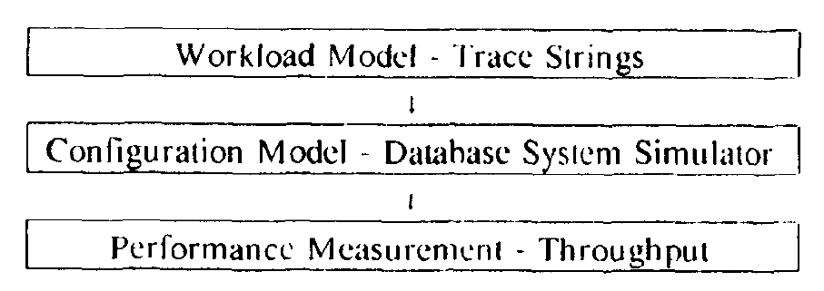
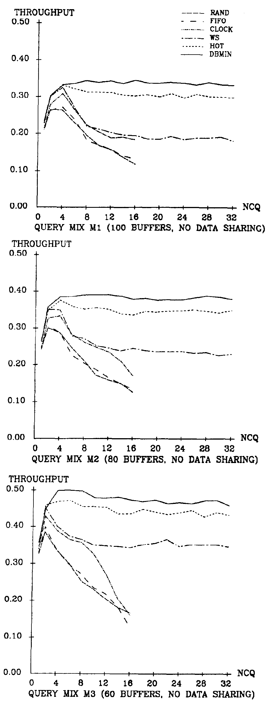
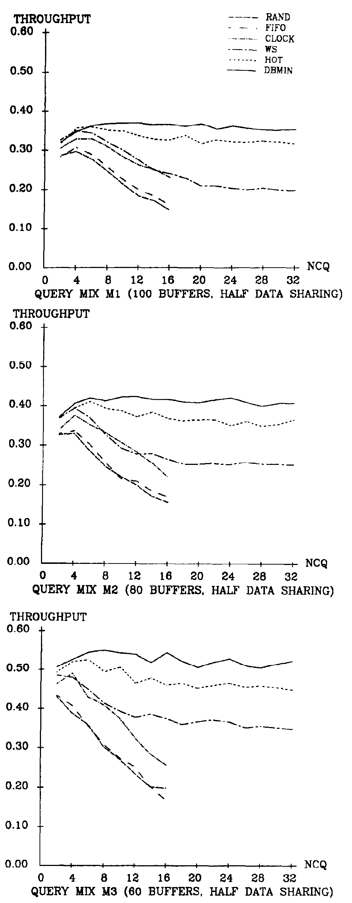
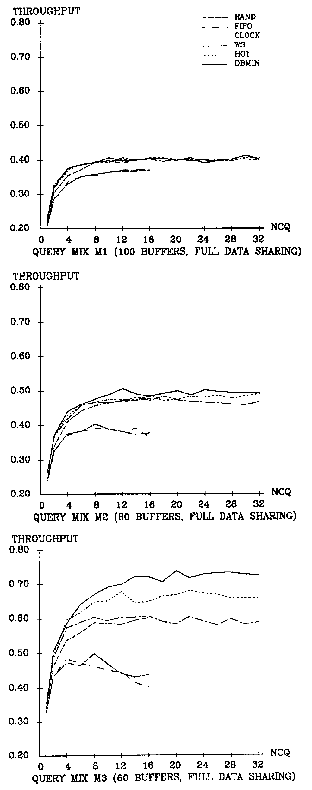
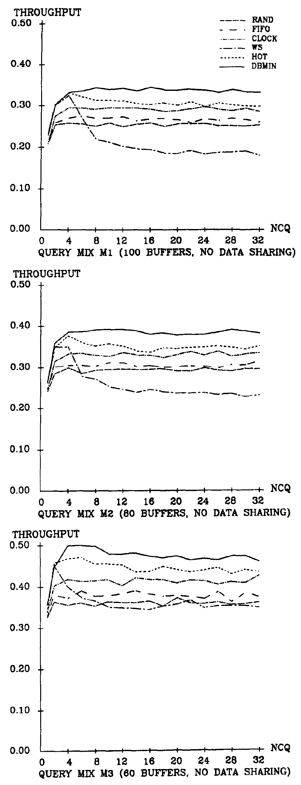

# An Evaluation of Buffer Management Strategies for Relational Database Systems（中文译文）

## 译者说明

本文依据同目录的 `source.pdf` 翻译。章节、图表、公式、算法、代码与参考文献按原文结构保留。

Hong-Tai Chou†、David J. DeWitt

威斯康星大学计算机科学系

† 作者现址：Microelectronics and Computer Technology Corporation, 9430 Research Blvd., Echelon Bldg. #1, Austin, TX 78759。

## 摘要

本文提出一种管理关系数据库管理系统缓冲池的新算法 DBMIN。DBMIN 基于一种新的关系查询行为模型，即查询局部性集合模型（query locality set model，QLSM）。与热集模型一样，QLSM 能够预测未来的访问行为，因此比随机模型更有优势。不过，QLSM 将访问行为建模与任何特定的缓冲区管理算法分离，从而避免了热集模型的潜在问题。介绍 QLSM 和 DBMIN 算法之后，我们提出一种用于评估多用户环境下缓冲区管理算法的性能评估方法。该方法采用混合模型，兼有轨迹驱动和分布驱动仿真模型的特点。借助这一模型，我们将多用户环境下 DBMIN 算法的性能与热集算法及另外四种较传统的缓冲区置换算法作比较。

## 1. 引言

本文提出一种管理关系数据库管理系统缓冲池的新算法 DBMIN。DBMIN 基于一种新的关系查询行为模型，即查询局部性集合模型（QLSM）。与热集模型 [Sacc82] 一样，QLSM 能够预测未来的访问行为，因此比随机模型更有优势。不过，QLSM 将访问行为建模与任何特定的缓冲区管理算法分离，从而避免了热集模型的潜在问题。介绍 QLSM 和 DBMIN 算法之后，我们将多用户环境下 DBMIN 算法的性能与热集算法及另外四种较传统的缓冲区置换算法作比较。

开展这项研究有几个原因。首先，尽管 Stonebraker [Ston81] 已有力地论证了传统的虚拟内存页面置换算法（例如 LRU）通常不适合关系数据库环境，缓冲区管理这个领域在很大程度上仍被忽视了（可以将该领域的研究活跃程度与并发控制领域比较）。其次，虽然热集算法的结果令人鼓舞，但我们认为还不足以下定论。具体而言，[Sacc82] [Sacc85] 只给出了热集算法的有限仿真结果。我们认为，对热集算法与传统置换策略进行广泛的多用户测试，将有助于深入理解缓冲区管理器对整体系统性能的影响。

第 2 节回顾数据库系统缓冲区管理策略的早期工作。第 3 节介绍 QLSM 与 DBMIN 算法。第 4 节给出不同缓冲区置换策略的多用户性能评估。第 5 节总结结论，并提出未来研究的建议。

## 2. 数据库系统的缓冲区管理

许多早期数据库缓冲区管理研究集中于双重分页问题 [Fern78] [Lang77] [Sher76a] [Sher76b] [Tuel76]；近期的研究则侧重于寻找“理解”数据库系统 [Ston81]，并知道如何利用数据库访问行为可预测性的缓冲区管理策略。本节回顾其中一些算法。

### 2.1. 域分离算法

考虑一个通过 B 树索引随机访问记录的查询。B 树的根页显然比数据页更重要，因为每次检索记录都要访问它。基于这一观察，Reiter [Reit76] 提出一种称为域分离（domain separation，DS）的缓冲区管理算法：将页面分成若干类型，每种类型在与之对应的缓冲区域中单独管理。需要某种类型的页面时，就从相应的域中分配缓冲区。如果由于某种原因没有可用缓冲区，例如该域的所有缓冲区都正在进行 I/O，就从另一个域借用一个。各域内部的缓冲区按 LRU 策略管理。Reiter 建议一种简单的类型分配方案：B 树结构中的每个非叶层各分配一个域，叶层与数据一起分配一个域。实验数据[^1] 表明，与 LRU 算法相比，这种 DS 算法将吞吐量提高了 8–10%。

DS 算法的主要局限是其域的概念是静态的。页面的重要性可能随查询而变，因而该算法未能反映页面访问的动态变化。当一个数据页在嵌套循环连接中被反复访问时，显然希望让它驻留内存；但在顺序扫描中访问同一页时，情况并非如此。其次，DS 算法不区分不同类型页面的相对重要性。在 DS 算法下，一个索引页会被另一个新到的索引页覆盖，尽管前者可能比另一个域中的数据页更重要。内存划分是另一个潜在问题。按域而非按查询划分缓冲区，不能防止相互竞争的用户之间的干扰。最后，由于 DS 算法没有内建的负载控制设施，需要另行加入机制来防止抖动。

已有研究提出 DS 算法的若干扩展。Hawthorn 提出的分组 LRU（group LRU，GLRU）算法 [Nybe84] 与 DS 相似，但不同组（域）之间有固定的优先级次序。每次寻找空闲缓冲区，都从优先级最低的组开始。Effelsberg 和 Haerder [Effe84] 提出的另一种方案，采用类似工作集 [Denn68] 的划分方式，动态改变各域的大小。在该方案中，域 $i$ 中在最近 $\tau _ i$ 次访问内被访问过的页面不参与置换。各域的“工作集”可随用户查询的访问行为而增大或缩小。虽然实验数据表明，与静态域划分相比，动态域划分能够减少系统的缺页次数，但 Effelsberg 和 Haerder 的结论是：没有令人信服的证据表明，面向页面类型的方案[^2] 明显优于 LRU、CLOCK 等全局算法。

[^1]: Reiter 的仿真实验假设使用共享缓冲池，工作负载由 8 个并发用户组成。
[^2]: [Effe84] 将 DS 算法称为面向页面类型的缓冲区分配方案。

### 2.2. “New”算法

在为 INGRES [Ston76] 寻找更好的缓冲区管理算法的研究中，Kaplan [Kapl80] 从查询访问模式中得出两个观察：页面应得到的优先级不是页面本身的属性，而是其所属关系的属性；每个关系都需要一个“工作集”。基于这些观察，Kaplan 设计了称为“new”的算法，将缓冲池按关系细分和分配。在“new”算法中，每个活动关系都被分配一个初始为空的驻留集。各关系的驻留集链接成一个优先级列表，列表最前面是一个全局空闲列表。发生缺页时，从优先级列表的头部开始查找，直至找到合适的缓冲区。随后将所缺的页面读入该缓冲区，并加入所属关系的驻留集。各关系内部采用 MRU 策略。不过，每个关系都有权获得一个不参与置换的活动缓冲区。关系的排列次序由一组启发式规则决定，随后也可据此调整。如果某关系的页面不太可能重用，就把该关系放在靠近列表头部的位置；否则，将它放在底部加以保护。Kaplan 的仿真实验结果表明，“new”算法的表现远好于 UNIX 缓冲区管理器。但是，在一次试验性实现 [Ston82] 中，“new”算法未能改善采用 LRU 算法的实验版 INGRES 的性能。

“new”算法提出了一种新的缓冲区管理途径，即通过关系跟踪查询的局部性。不过，算法本身存在一些弱点。使用 MRU 只在有限的情况下有充分理由。Kaplan 建议的、在优先级列表中排列关系次序的规则，完全基于直觉。此外，在内存争用严重时，沿优先级列表查找空闲缓冲区的代价可能很高。最后，将“new”算法扩展到多用户环境还存在其他问题，因为如何确定并发执行的不同查询所用关系之间的优先级，尚不清楚。

### 2.3. 热集算法

Sacco 和 Schkolnick [Sacc82] 提出的热集（hot set）模型，是一种将访问模式的先验知识纳入其中的关系数据库查询行为模型。在该模型中，具有循环访问行为的一组页面称为热集。如果给查询分配的缓冲区足以容纳热集，那么处理将是高效的，因为循环中访问的页面会保留在缓冲区内。另一方面，如果分配给查询的内存不足以容纳一个热集，就可能产生大量缺页。把缺页次数画成缓冲区大小的函数，就会在上述情况发生的缓冲区大小附近观察到不连续。曲线上可能有多个这样的不连续点，每一个都称为一个热点（hot point）。

对于两个关系都采用顺序扫描的嵌套循环连接，查询的一个热点是内关系的页数加一。其推导方法是：预留足够缓冲区以容纳会被反复扫描的整个内关系，再为只扫描一次的外关系预留一个缓冲区。如果改为对外关系进行索引扫描，则还需要一个额外缓冲区来存放索引叶页。通过类似论证，可以确定不同查询的热点。

通过利用查询访问模式的可预测性，热集模型比随机模型提供了更准确的关系数据库访问模型。不过，热集模型的推导部分地基于 LRU 置换算法，而 LRU 并不适合某些循环访问行为。实际上，与 LRU 相反的 MRU（Most-Recently-Used，最近使用）算法更适合循环访问 [Thor72]，因为循环中最近使用的页面，恰好是在最长时间之后才会再次访问的页面。回到嵌套循环连接的例子，如果使用 MRU 算法，即使缓冲区数降到“热点”以下，缺页次数也不会急剧增加。从这个角度说，热集模型并未真正反映某些访问模式的内在行为，而是反映了 LRU 算法下的行为。

在热集（HOT）算法中，每个查询都有一个独立的缓冲区列表，按 LRU 策略管理。各查询有权获得的缓冲区数量根据热集模型预测，也就是说，查询得到一个大小等于其热集大小的局部缓冲池。只有新查询的热集大小不超过可用缓冲空间，才允许它进入系统。

如上所述，热集模型采用 LRU 缺乏逻辑依据。有些情况下，在严格的内存限制下，LRU 可能是最差的策略。热集算法通过始终分配足够内存，保证同一查询中对不同数据结构的访问互不干扰，以此避开这一问题。因此，它往往会过量分配内存，这意味着内存可能未得到充分利用。另一个相关问题是：对于有些访问模式，LRU 确实表现很好，但并无必要，因为另一种开销更低的策略可以取得同样好的效果。

## 3. DBMIN 缓冲区管理算法

本节首先介绍一种新的数据库系统查询行为模型，即查询局部性集合模型（QLSM）。通过对页面访问模式进行分类，我们说明如何将常见数据库操作的访问行为描述为一组简单且有规律的访问模式的组合。与热集模型一样，QLSM 能预测未来访问行为，因此比随机模型更有优势。不过，QLSM 将访问行为建模与任何特定缓冲区管理算法分离，从而避免了热集模型的潜在问题。

接着介绍基于 QLSM 的新缓冲区管理算法 DBMIN。该算法以文件实例为单位分配和管理缓冲区。每个文件实例都有一个局部缓冲池，用来容纳其局部性集合（locality set），即与该文件实例关联的一组已缓冲页面。从每个文件实例的局部性集合类似于每个进程的工作集这一意义上，可以把 DBMIN 看作工作集算法 [Denn68] 和 Kaplan 的“new”算法的结合。不过，局部性集合的大小预先确定，无须随着查询执行而重新计算。DBMIN 的这种预测性与热集算法接近。与 WS 和热集算法[^3] 类似，DBMIN 采用动态划分方案，分配给查询的缓冲区总数可随文件（关系）的打开和关闭而变化。

[^3]: [Sacc82] 没有明确讨论内存划分问题。但后来的 [Sacc85] 说明，可将查询分解成子求值计划，每个子计划都由热集模型独立刻画，从而实现动态内存划分。

### 3.1. 查询局部性集合模型

QLSM 基于这样一个观察：关系数据库系统支持的操作集合有限，而且这些操作表现出的页面访问模式十分规律、可以预测。此外，一个数据库操作的访问模式可以分解为若干简单访问模式的组合。例如，考虑内关系的连接属性上建有索引的索引连接。QLSM 会为该操作识别两个局部性集合：一个对应外关系的顺序扫描，另一个对应内关系的索引页和数据页。本节给出一种分类法，用于对常见访问方法与数据库操作所表现的页面访问模式分类[^4]。

[^4]: [Sacc85] 独立得出了对查询访问行为的类似分析。

#### 顺序访问

顺序扫描按顺序逐页访问和处理页面。许多情况下，顺序扫描只做一次，不会重复。例如，在无序关系上执行选择操作时，文件中的每一页都恰好访问一次。一个页框就能提供所需的全部缓冲空间。我们将这种访问模式称为直接顺序（straight sequential，SS）。

某些数据库操作的顺序扫描过程中会出现局部重扫。也就是说，扫描偶尔会后退一小段距离，然后再次向前扫描。这可能发生在归并连接 [Blas77] 中：内关系中具有相同键值的记录被反复扫描，并与外关系中的记录匹配。我们将这种访问模式称为聚簇顺序（clustered sequential，CS）。显然，如果可能，应当把一个簇（一组具有相同键值的记录）中的记录同时保留在内存中。

有些情况下，对文件的顺序访问可能重复多次。例如，在嵌套循环连接中，内关系被反复扫描，直到外关系耗尽。我们将其称为循环顺序（looping sequential，LS）模式。如果可能，应将这个被反复扫描的文件整体保留在内存中。如果文件太大、无法装入内存，就应使用 MRU 置换算法管理缓冲池。

#### 随机访问

独立随机（independent random，IR）访问模式由一系列相互独立的访问组成。例如，通过非聚簇索引进行索引扫描时，对数据页的访问是随机的。有些情况下，一系列“随机”访问中也存在访问局部性。这可能出现在如下连接求值中：内关系是一个带有非聚簇、非唯一索引的文件，而外关系是一个键非唯一的聚簇文件。这种访问模式称为聚簇随机（clustered random，CR）。CR 访问的行为类似于 CS 扫描。如果可能，应将包含簇中记录的每一页保留在内存中。

#### 层次访问

层次访问是一系列页面访问，构成从索引根部向下到叶子的遍历路径。如果只遍历索引一次（例如检索单个元组），一个页框就足以缓冲所有索引页。我们称其为直接层次（straight hierarchical，SH）访问。树遍历之后继续顺序扫描叶子的情形有两种：如果叶子扫描为 SS，则称为层次加直接顺序（hierarchical with straight sequential，H/SS）；否则称为层次加聚簇顺序（hierarchical with clustered sequential，H/CS）。注意，H/SS 和 H/CS 的访问模式分别类似于 SS 和 CS 的访问模式。

在内关系的连接字段上建有索引的连接求值中，可以观察到对索引结构的重复访问。我们将这种访问模式称为循环层次（looping hierarchical，LH）。在 LH 访问中，靠近根部的页面比靠近叶子的页面更有可能被访问。假设根位于第 0 层，第 $i$ 层索引页的访问概率与索引页扇出的 $i$ 次方成反比。因此，上层（更靠近根部）页面应比下层页面拥有更高的优先级。在许多情况下，由于索引页的扇出通常很高，根可能是唯一值得保留在内存中的页面。

### 3.2. DBMIN——基于 QLSM 的缓冲区管理算法

DBMIN 以文件实例为单位分配和管理缓冲区[^5]。与一个文件实例关联的一组已缓冲页面称为其局部性集合。每个局部性集合独立管理，采用的策略根据文件实例的预期用途选择。如果缓冲区中的页面不属于任何局部性集合，就把该缓冲区放入全局空闲列表。为简化实现，我们限制缓冲区中的一个页面最多只能属于一个局部性集合。文件实例被视为其局部性集合中所有页面的所有者。为了允许并发查询共享数据，内存中的所有缓冲区还可以通过全局缓冲区表访问。以下符号用于描述算法：

- $N$：系统中的缓冲区（页框）总数。
- $l _ {ij}$：最多可以分配给查询 $i$ 的文件实例 $j$ 的缓冲区数。
- $r _ {ij}$：已经分配给查询 $i$ 的文件实例 $j$ 的缓冲区数。

注意， $l$ 是局部性集合的期望大小， $r$ 是其实际大小。

启动时，DBMIN 初始化全局表，并把系统中的所有缓冲区链接到全局空闲列表上。打开文件时，将与之关联的局部性集合大小和置换策略交给缓冲区管理器。随后为该文件实例初始化一个空的局部性集合。与文件实例关联的两个控制变量 $r$ 和 $l$ 分别初始化为 0 和给定的局部性集合大小。

当查询请求一个页面时，先查找全局表，再调整相应的局部性集合。可能有三种情况：

1. **在全局表和局部性集合中都找到页面。** 此时只需按局部置换策略的要求，在必要时更新使用统计。
2. **在内存中找到页面，但它不在局部性集合中。** 如果页面已有所有者，就直接把它交给请求查询，无须其他操作。否则，将该页加入文件实例的局部性集合，并将 $r$ 加一。如果此时 $r \gt l$，就按局部置换策略选出一个页面，释放回全局空闲列表，并把 $r$ 设为 $l$。按局部置换策略的要求更新使用统计。
3. **页面不在内存中。** 调度一次磁盘读，将页面从磁盘读入由全局空闲列表分配的缓冲区。页面进入内存后，按情况 2 继续处理。

注意，与文件实例关联的局部置换策略不会实际换入换出页面。其真正目的是维护查询“工作集”的映像。磁盘读写由维护全局表和全局空闲列表的机制发出。

打开或关闭文件时会激活负载控制器。文件打开后，负载控制器立即检查所有活动查询 $i$ 及其文件实例 $j$ 是否满足：

$$
\sum _ i\sum _ j l _ {ij} \lt N
$$

若满足，允许查询继续；否则将其挂起，放到等待队列的最前面。文件关闭时，其局部性集合关联的缓冲区被释放回全局空闲列表。随后，如果不会违反上述条件，负载控制器就激活等待队列中的第一个查询。

接下来还要说明如何利用 QLSM，为每个文件实例选择局部置换策略并估计局部性集合大小。

[^5]: 同一文件的不同活动实例被分配不同的缓冲池，分别独立管理。不过，正如后面将解释的那样，只要可能，所有文件实例都会通过全局表机制共享某个已缓冲页面的同一副本。

#### 直接顺序（SS）访问

对于 SS 访问，局部性集合的大小显然为 1。如果请求的页面不在缓冲区中，就从磁盘取回该页，覆盖缓冲区中原有的内容。

#### 聚簇顺序（CS）访问

对于 CS 访问，如果可能，应将一个簇的所有成员（即具有相同键值的记录）都保留在内存中。因此，局部性集合的大小等于最大簇的记录数除以分块因子（即每页记录数）。只要分配的空间足够，FIFO 和 LRU 都会产生最少的缺页次数。

#### 循环顺序（LS）访问

当文件以 LS 访问模式被反复扫描时，MRU 是最佳置换算法。为文件分配尽可能多的缓冲区是有益的，直到整个文件都能装入内存。因此，局部性集合的大小对应于文件的总页数。

#### 独立随机（IR）访问

当文件的记录被随机访问时，例如通过哈希表访问，选择哪种置换算法并不重要，因为所有算法的表现都一样好 [King71]。Yao 公式 [Yao77] 估计一系列 $k$ 次随机记录访问中所访问的总页数 $b$，从而为局部性集合大小提供一个近似上界。如果页面访问很稀疏，就没有必要在首次访问后继续把页面保留在内存中。因此，局部性集合有两个合理的大小：1 和 $b$，取决于各页被再次访问的可能性。例如，可将页面的剩余价值（residual value）定义为：

$$
r = \frac{k-b}{b}
$$

若 $r \leq \beta$，局部性集合大小取 1，否则取 $b$；其中 $\beta$ 是一个阈值，超过该阈值的页面被认为具有较高的再次访问概率。

译注：会议版扫描中，上式与下文 LH 公式分子中的减号，以及此处的比较符号模糊；这三处依据同作者、同题名的 [1985 年 2 月技术报告 TR584](https://research.cs.wisc.edu/techreports/1985/TR584.pdf) 印刷页 10–11（PDF 第 15–16 页）的对应段落转写。

#### 聚簇随机（CR）访问

CR 访问类似于 CS 访问。唯一的区别是，在 CR 访问中，一个“簇”中的记录在物理上并不相邻，而是随机分布在整个文件中。此时，局部性集合的大小可用最大簇的记录数近似[^6]。

[^6]: 利用 Yao 公式计算一个簇中访问的不同页数，可以得到更准确的估计。

#### 直接层次（SH）、H/SS 和 H/CS 访问

对于 SH 和 H/SS 访问，每个索引页都只遍历一次。因此，两者的局部性集合大小均为 1，只需一个缓冲页。关于 CS 访问的讨论同样适用于 H/CS，只是此时簇中的每个成员是键—指针对，而非数据记录。

#### 循环层次（LH）访问

在 LH 访问中，索引被反复从根遍历到叶层。在这种访问中，靠近根部的页面比靠近底部的页面更有可能被访问 [Reit76]。考虑一棵高度为 $h$、扇出为 $f$ 的树。不失一般性，假设树是完全的，即每个非叶节点都有 $f$ 个子节点。每次从第 0 层的根遍历到第 $h$ 层的一个叶子时，第 $i$ 层的 $f^i$ 个页面中会有一个被访问。因此，上层（更靠近根部）页面比下层页面更重要。理想的置换算法应使树的上层活动页面驻留内存，而让其余页面复用一个临时缓冲区。可以利用 IR 访问模式中定义的“剩余价值”概念，估计应将多少层保留在内存中。令 $b _ i$ 为使用 Yao 公式估计的第 $i$ 层被访问的页数，则局部性集合大小可近似为：

$$
\left(1+\sum _ {i=1}^{j} b _ i\right)+1
$$

其中， $j$ 是满足下式的最大 $i$：

$$
\frac{k-b _ i}{b _ i}\gt\beta
$$

由于索引页的扇出通常很高，许多情况下根可能是唯一值得保留在内存中的页面。若确实如此，采用 LIFO 算法和 3–4 个缓冲区就可能取得合理的性能，因为根始终保留在内存中。

## 4. 缓冲区管理算法评估

本节比较多用户环境下 DBMIN 算法、热集算法和另外四种缓冲区管理策略的性能。首先介绍评估方法，再给出所测试的六种缓冲区管理算法的实现细节，最后展示部分实验结果。更完整的结果见 [Chou85]。

### 4.1. 性能评估方法

评估不同缓冲区管理算法有三种选择：直接测量、解析建模和仿真。直接测量虽然可行，但因计算代价过高而被排除。解析建模虽具有很好的成本效益，却无法在保持方程可解的同时，对不同算法进行足够详细的建模。因此，我们选择仿真作为评估基础。

广泛使用的仿真有两类 [Sher73]：由实际系统记录的轨迹驱动的**轨迹驱动仿真**，以及由具有某种随机结构的随机过程生成事件的**分布驱动仿真**。轨迹驱动模型有若干优点，包括可信度高，以及能够细致刻画工作负载、保留事件之间微妙的相关性。不过，许多情况下很难选出“有代表性”的工作负载。此外，很难刻画多用户环境中并发活动之间的干扰和相关性，使轨迹数据能够在配置改变后的模型中得到恰当处理。为避免这些问题，我们设计了兼具轨迹驱动与分布驱动模型特点的**混合仿真模型**。在此模型中，每个查询的行为由一个轨迹串描述，系统工作负载则通过合并并发执行查询的轨迹串来动态合成。

仿真模型的另一个组件是数据库系统模拟器，管理三种重要资源：CPU、一个 I/O 设备和内存。新查询到达时，负载控制器（如果存在）根据当时的资源可用情况，决定激活还是延迟该查询。查询激活后，在 CPU 与 I/O 设备之间循环竞争资源，直到执行完成。一个查询终止后，工作负载模型生成另一个新查询。不过，检测到过载时，负载控制器可能暂时挂起活动查询。

虽然缺页率常被用于衡量内存管理策略的性能，但在多道程序环境中，使缺页次数最少并不保证系统行为最优。因此，我们选择吞吐量作为性能指标，即每秒完成查询数的平均值。以下各节介绍仿真模型的三个关键方面（图 1）：工作负载刻画、配置模型和性能测量。

图 1. 数据库系统的仿真模型。工作负载模型：轨迹串；配置模型：数据库系统模拟器；性能测量：吞吐量。

#### 4.1.1. 工作负载合成

构造工作负载的第一步，是在 Wisconsin Storage System[^7]（WiSS）[Chou83] 上执行查询，获取单查询轨迹串。WiSS 支持多种存储结构及相应的扫描操作，但不直接支持高层查询接口，因此测试查询是“手工编码”的。实验使用一个具有明确定义的分布结构的合成数据库 [Bitt83]。每个查询执行期间，记录若干类型的事件及精确的时间信息，包括页面访问、磁盘 I/O 和文件操作（即打开和关闭文件）。

轨迹串可视为事件记录数组，每条记录都有一个标记字段来标识事件类型。有六种重要的事件类型：页读、页写、磁盘读、磁盘写、文件打开和文件关闭。磁盘读写事件成对出现，界定磁盘操作的时间区间[^8]。轨迹串中相应的记录格式为：

**页读写**

| 页读／写 | 文件 ID | 页面 ID | 时间戳 |
| --- | --- | --- | --- |
| page read / write | file ID | page ID | time stamp |

**磁盘读写**

| 磁盘读／写 | 文件 ID | 页面 ID | 时间戳 |
| --- | --- | --- | --- |
| disk read / write | file ID | page ID | time stamp |

**文件打开**

| 文件打开 | 文件 ID | 局部性集合大小 | 置换策略 |
| --- | --- | --- | --- |
| file open | file ID | locality set size | replacement policy |

**文件关闭**

| 文件关闭 | 文件 ID |
| --- | --- |
| file close | file ID |

最初记录的时间戳是系统的实际经过时间。出于后面将解释的原因，我们从轨迹串中移除了磁盘读写事件，并相应调整了其他事件的时间戳。因此，修改后的轨迹串中的时间戳实质上反映查询的虚拟时间（即 CPU 时间）。

以如此细的粒度记录事件，需要约 100 微秒量级的精确计时。因此，轨迹采集在一台专用 VAX-11/750 上完成，运行一个为 CRYSTAL 多计算机系统 [DeWi84] 设计的非常简单的操作内核。为减少获取轨迹串的开销，先将事件记录在主存中，待跟踪结束后再写入由 WiSS 提供的文件。

[Bora84] 所述的多用户基准测试方法识别了三个影响多用户环境吞吐量的因素：并发查询数[^9]、数据共享程度和查询混合。

各次仿真的并发查询数（NCQ）从 1 到 32 变化。为研究数据共享的影响，我们复制了测试数据库的 32 份副本，每份存放在磁盘的独立区域。根据平均有多少个并发查询访问同一数据库副本，定义三种数据共享级别：

1. 完全共享：所有查询访问同一个数据库。
2. 半共享：每两个查询共享一个数据库副本。
3. 不共享：每个查询都有自己的副本。

[^7]: WiSS 在 UNIX 环境下提供类似 RSS [Astr76] 的功能。
[^8]: 用于采集轨迹串的 WiSS 版本不重叠执行 CPU 与 I/O 操作。
[^9]: [Bora84] 使用“多道程序级别”（multiprogramming level，MPL）这一术语。不过，为区分外部工作负载情况与内部多道程序程度，本文改用“并发查询数”（NCQ）。按我们的定义，在具有负载控制的缓冲区管理器下， MPL ≤ NCQ。

[Bora84] 选择查询混合的方法，基于对 CPU 周期和磁盘带宽这两种系统资源消耗的二分。在本研究中，这种分类方式被扩展，加入查询使用的主存量（表 1）。经过一些初步测试，我们选择了六个查询作为合成多用户工作负载的基础查询（表 2）。查询的 CPU 和磁盘消耗由单查询轨迹串计算，相应的内存需求则由热集模型估计（结果与查询局部性集合模型几乎相同）。表 3 概述了这些查询。

表 1. 查询分类。

| 查询类型 | CPU 需求 | 磁盘需求 | 内存需求 |
| --- | --- | --- | --- |
| I | 低 | 低 | 低 |
| II | 低 | 高 | 低 |
| III | 高 | 低 | 低 |
| IV | 高 | 高 | 低 |
| V | 高 | 低 | 高 |
| VI | 高 | 高 | 高 |

表 2. 代表性查询。

| 查询编号 | CPU 使用量（秒） | 磁盘 I/O 次数 | 热集大小（4K 页） |
| --- | --- | --- | --- |
| I | 0.53 | 17 | 3 |
| II | 0.67 | 99 | 3 |
| III | 2.95 | 53 | 5 |
| IV | 3.09 | 120 | 5 |
| V | 3.47 | 55 | 17 |
| VI | 3.50 | 138 | 24 |

表 3. 基础查询说明。A、B：10K 个元组；A′：1K 个元组；B′：300 个元组；每个元组 182 字节。

| 查询编号 | 查询操作 | 选择率 | 选择的访问路径 | 连接方法 | 连接的访问路径 |
| --- | --- | --- | --- | --- | --- |
| I | select(A) | 1% | 聚簇索引 | — | — |
| II | select(B) | 1% | 非聚簇索引 | — | — |
| III | select(A) join B | 2% | 聚簇索引 | 索引连接 | B 上的聚簇索引 |
| IV | select(A′) join B | 10% | 顺序扫描 | 索引连接 | B 上的非聚簇索引 |
| V | select(A) join B′ | 3% | 聚簇索引 | 嵌套循环 | 顺序扫描 B′ |
| VI | select(A) join A′ | 4% | 聚簇索引 | 哈希连接 | 对 select(A) 的结果做哈希 |

仿真时，按给定概率向量动态合并单查询轨迹串，以构造多用户工作负载。该向量描述各查询类型的相对频率。当 CPU 为某个活动查询提供服务时，CPU 模拟器逐事件读取并处理其轨迹串。对于页读或页写事件，CPU 模拟器依据事件记录中的时间戳推进查询的 CPU 时间，并将页面请求交给缓冲区管理器。如果所请求页面不在缓冲区中，查询就在从磁盘取回该页期间阻塞。并发查询事件的确切次序，由模拟系统的行为及轨迹串记录的时间戳共同决定。

#### 4.1.2. 配置模型

模型模拟三种硬件组件：一个 CPU、一个磁盘和一个缓冲池。轮转调度器将 CPU 周期分配给相互竞争的查询。每个查询的 CPU 使用量由关联轨迹串决定，其中记录了详细的时间信息。从这一点看，模拟器的 CPU 具有 VAX-11/750 CPU 的特性。模拟器内核按先来先服务的方式调度磁盘请求。此外，维护一个辅助磁盘队列，用于实现延迟异步写；只有磁盘即将空闲时，才启动这些写操作。

轨迹串记录的磁盘时间往往小于“真实”环境中的时间，原因有二：（1）采集轨迹时使用的数据库相对较小；（2）单用户系统的磁盘臂移动通常少于多用户环境。此外，磁盘操作请求还会受到运行条件和缓冲区管理算法的影响。因此，我们用一个随机磁盘模型替换所记录的磁盘时间，该模型假设磁头位置遵循随机过程。在磁盘模拟器中，磁盘操作的访问时间根据 Fujitsu Eagle 磁盘驱动器的时序规格 [Fuji82] 计算。访问一个 4K 页平均约需 27.6 毫秒。

缓冲池由采用某种缓冲区管理算法的缓冲区管理器控制。不过，I/O 操作进行期间，操作系统可以将缓冲区固定在内存中。每次仿真的缓冲池大小按下式决定：

$$
8\cdot\frac{\sum _ i p _ i t _ i h _ i}{\sum _ i p _ i t _ i}
$$

其中， $p _ i$ 是查询混合概率向量的第 $i$ 个元素， $t _ i$ 和 $h _ i$ 分别是查询 $i$ 的 CPU 使用量和热集大小。其目的是让内存在八个并发查询的负载下饱和，从而观察不同缓冲区管理算法下过载对性能的影响。

#### 4.1.3. 性能测量的统计有效性

我们选择分批均值法 [Sarg76] 来估计置信区间。每次仿真的批次数设为 20。对吞吐量测量结果的分析表明，许多置信区间位于均值的 1% 以内。对于发生抖动的实验，延长每批的长度，以保证所有置信区间都在均值的 5% 以内。

### 4.2. 缓冲区管理算法

实验包括六种缓冲区管理算法，分为两组。第一组包括 RAND、FIFO 和 CLOCK 三种简单算法。选择它们是因为它们是典型的置换算法，而且易于实现。将它们与更复杂算法的性能进行比较，可以判断后者增加的复杂性是否值得。第二组除了 DBMIN，还包括 WS（工作集算法）和 HOT（热集算法）。WS 是虚拟内存系统中最高效的内存策略之一 [Denn78]，因此很值得了解它用于数据库系统时的表现。热集算法则作为此前面向数据库系统提出的算法的代表。

第一组的算法都是全局算法，因为置换策略作用于系统中的全部缓冲区。这三种算法都维护一个全局表，为每个缓冲区记录其中驻留页面的标识，以及缓冲区是否正在进行 I/O 操作的标志。具体算法可能需要其他数据结构或标志。RAND 和 FIFO 采用常规实现，无须进一步解释。实验中的 CLOCK 算法优先保护脏页，即已被修改的页面。第一轮扫描时，对未被访问的脏页安排写出，而未被访问的干净页则立即被选中置换。如果第一轮完整扫描未找到合适的缓冲区，第二轮扫描对脏页和干净页同等对待。这三种算法均没有内建负载控制。不过，后面我们将研究如何加入负载控制器，以及它会如何影响这些算法的性能。

第二组算法均采用局部策略，置换决策在局部作出。每个查询或文件实例都有一个局部表，用来维护其驻留集。不属于任何驻留集的缓冲区被放入全局 LRU 列表。为了允许并发查询共享数据，第二组的每种局部算法也维护一个类似于全局算法所用的全局表。请求页面时，先查找全局表，再按需调整适当的局部表。作为优化，每当脏页被释放回全局空闲列表，就为其调度一次异步写。第二组的三种算法均根据提交查询的估计内存需求进行负载控制。系统剩余空闲空间足够时，激活新查询；另一方面，一旦检测到主存过量承诺，就挂起一个活动查询。我们采用 VMOS 操作系统 [Foge74] 实现的去激活规则，选择发生缺页的进程（即请求更多内存的进程）挂起[^10]。以下讨论第二组各算法特有的实现选择。

[^10]: 我们也实现了 Opderbeck 和 Chu [Opde74] 建议的去激活规则，即去激活累计 CPU 时间最少的进程。不过，没有观察到明显的性能差异。

#### 工作集算法

为使 WS 更具竞争力，我们实现了一个双参数 WS 算法。也就是说，根据哪一种窗口大小对进程更有利，为每个进程选择两个窗口大小之一。这两个窗口大小 $\tau _ 1=10\thinspace{}\mathrm{ms}$ 和 $\tau _ 2=15\thinspace{}\mathrm{ms}$，由对单查询轨迹串的工作集函数分析得出。算法不在每次页面访问后计算查询工作集，而只在查询发生缺页或用完当前时间片时重新计算。

#### 热集算法

热集算法按 [Sacc82] 描述的框架实现。基础查询对应的热集大小依据热集模型手工计算（见前面的表 2），随后存入一个表中，供缓冲区管理器在仿真时访问。

#### DBMIN 算法

每个文件实例的局部性集合大小与置换策略都由人工确定。记录单查询轨迹串时，由实现查询的程序在适当时刻把这些信息传给轨迹串记录器。仿真时，DBMIN 利用轨迹串中的这些信息，在打开文件时为该文件实例确定适当的驻留集大小和置换策略。

### 4.3. 仿真结果

虽然比较不同查询类型下各算法的性能有助于理解单个算法的效率，但更有意义的是比较混合查询类型工作负载下的性能[^11]。我们定义三种查询混合，以覆盖广泛的工作负载：

- M1：六种查询类型被请求的概率相同。
- M2：有一半的概率选中两个简单查询（I 和 II）之一。
- M3：两个简单查询的合计概率为 75%。

三种查询混合的具体概率分布见表 4。

表 4. 查询混合的组成（%）。

| 查询混合 | 类型 I | 类型 II | 类型 III | 类型 IV | 类型 V | 类型 VI |
| --- | --- | --- | --- | --- | --- | --- |
| M1 | 16.67 | 16.67 | 16.67 | 16.67 | 16.66 | 16.66 |
| M2 | 25.00 | 25.00 | 12.50 | 12.50 | 12.50 | 12.50 |
| M3 | 37.50 | 37.50 | 6.25 | 6.25 | 6.25 | 6.25 |

第一组测试中，并发执行的查询之间没有数据共享。图 2 给出各查询混合下六种缓冲区管理算法的吞吐量。每张图的横轴是并发查询数（NCQ），纵轴是以每秒查询数度量的系统吞吐量。三种简单算法明显发生了抖动[^12]。大多数情况下都可以观察到相当急剧的性能下降。RAND 和 FIFO 的性能最差，不过 RAND 的曲线比 FIFO 略平滑，从这个意义上说，RAND 可能更加稳定。在发生严重抖动之前，CLOCK 通常优于 RAND 和 FIFO。

WS 表现不佳，因为它未能捕获查询 V 和 VI 中连接的主要循环。随着查询 V 和 VI 的频率下降，WS 的性能有所改善。热集算法的效率接近 DBMIN。系统负载较轻时，DBMIN 仅略优于其余算法。但当并发查询数增至 8 或更多时，DBMIN 的吞吐量比热集算法高 7–13%[^13]，比 WS 算法高 25–45%。

图 2. 不共享数据时的吞吐量。横轴为并发查询数 NCQ，纵轴为吞吐量（查询／秒）。从上到下分别为：M1（100 个缓冲区）、M2（80 个缓冲区）、M3（60 个缓冲区）。

[^11]: 单一查询类型的性能测试见 [Chou85]。总体而言，这些测试中各算法的行为与三种查询混合下类似。
[^12]: 三种简单算法的数据只采集到 16 个并发查询，因为当模拟系统陷于抖动状态时，要获取置信区间为 ±5% 的吞吐量测量结果十分耗时。
[^13]: 性能差异的百分比是相对于表现较好的算法计算的。

#### 数据共享的影响

为研究数据共享对算法性能的影响，我们又进行了两组实验，每组采用不同的数据共享程度。结果见图 3 和图 4。可以观察到，对每一种算法，吞吐量都随着数据共享程度提高而增加。这进一步支持了如下观点：在多道程序数据库系统中，允许并发查询共享数据十分重要 [Reit76] [Bora84]。

图 3. 半共享数据时的吞吐量。横轴为并发查询数 NCQ，纵轴为吞吐量（查询／秒）。从上到下分别为：M1（100 个缓冲区）、M2（80 个缓冲区）、M3（60 个缓冲区）。

图 4. 完全共享数据时的吞吐量。横轴为并发查询数 NCQ，纵轴为吞吐量（查询／秒）。从上到下分别为：M1（100 个缓冲区）、M2（80 个缓冲区）、M3（60 个缓冲区）。

半共享数据时，各算法的相对性能与不共享数据时相似。但完全共享数据时则不同。对查询混合 M1 和 M2，各算法的效率接近。由于所有查询都访问同一个数据库副本，任何算法都很容易将数据库的重要部分保留在内存中。不出所料，RAND 和 FIFO 因为在捕获访问局部性方面有固有不足，表现略差于其他算法。不过，对查询混合 M3，各算法的性能再次拉开差距。这可能归因于小查询主导了 M3 的性能。大量小查询进入和离开系统，使数据库的“工作”部分变得不那么明确。（相比之下，在 M1 和 M2 中起更重要作用的是较大查询，它们在相对较长时间内集中访问有限的一组页面。）因此，努力识别局部性的算法比不这样做的算法表现更好。

#### 负载控制的影响

前面的实验表明，简单算法缺少负载控制，因而在高工作负载下发生抖动。值得研究加入负载控制器后，这些算法的效果如何。我们选择了“50% 规则”[Lero76]，即让分页设备约有一半时间保持忙碌，一部分原因是实现简单，另一部分原因是有实验证据支持 [Denn76]。

基于“50% 规则”的负载控制器通常包含三个主要组件：

1. **估计器**：测量设备利用率。
2. **优化器**：分析估计器提供的测量结果，决定适当的负载调整。
3. **控制开关**：根据优化器的决策激活或去激活进程。

图 5 展示了负载控制机制对三种简单缓冲区管理算法的影响。一组初步实验确定，当磁盘利用率为 87% 时，吞吐量达到最大。加入负载控制后，实验中的每种简单算法都优于 WS。带负载控制的 CLOCK 算法性能非常接近热集算法。不过，不能仅按这些结果的表面含义来理解。由于负载控制器具有反馈性质，这种负载控制机制存在若干潜在问题：

1. 如果采样过于频繁，运行时开销可能很高。另一方面，如果对测量结果的分析不够频繁，优化器就可能无法足够迅速地响应，因而不能有效调整负载。
2. 与预测式负载控制器不同，反馈式控制器只能在检测到不良情况之后作出响应。这可能造成不必要的进程激活和去激活，而预测式负载控制机制原本可能避免这些动作。
3. 如果环境中存在大量小事务，这些事务在其影响尚未得到评估之前就进入并离开系统，反馈式负载控制器的效果就不好。图 5 中随着小查询比例增加，可以看到这种影响。注意，实验中所谓的“小查询”（即查询 I 和 II），仍然从源关系中检索 100 个元组。在大量查询只检索单个元组的系统中，反馈式负载控制器的缺点可能更加明显。

图 5. 加入负载控制后的吞吐量，不共享数据。横轴为并发查询数 NCQ，纵轴为吞吐量（查询／秒）。从上到下分别为：M1（100 个缓冲区）、M2（80 个缓冲区）、M3（60 个缓冲区）。

## 5. 结论

本文提出了一种管理关系数据库管理系统缓冲池的新算法 DBMIN。DBMIN 基于一种新的关系查询行为模型，即查询局部性集合模型（QLSM）。与热集模型一样，QLSM 使缓冲区管理器能够预测未来访问行为。但与热集模型不同，QLSM 将访问行为建模与任何特定缓冲区管理算法分离。DBMIN 以文件为单位管理缓冲池。分配给每个文件实例的缓冲区数量，以该实例的局部性集合大小为依据，并随文件的访问方式而变化。此外，每个文件实例关联的缓冲池采用与文件访问方式相适应的置换策略管理。

我们还提出了用于评估多用户环境下缓冲区管理算法的性能评估方法。该方法采用兼有轨迹驱动和分布驱动仿真模型特点的混合模型。借助这一模型，我们比较了六种缓冲区管理算法的性能。三种简单算法 RAND、FIFO 和 CLOCK 出现了严重抖动。虽然加入反馈式负载控制器缓解了问题，但也产生了新的潜在问题。如预期所料，WS、HOT 和 DBMIN 这三种更复杂的算法优于简单算法。然而，WS 算法的表现并不像它在虚拟内存系统中所“宣传”的那样好 [Denn78]。最后两种算法 HOT 和 DBMIN 成功展示了其效率。相比之下，在所做测试的广泛运行条件下，DBMIN 的吞吐量比 HOT 高 7–13%。

在 [Chou85] 中，我们还考察了 WS、HOT 和 DBMIN 各算法的相关开销。根据我们的分析，除非缺页率保持得很低，否则 WS 的代价高于 HOT。相比之下，由于需要维护的使用统计更少，DBMIN 的开销低于 WS 和 HOT。

## 致谢

本研究部分得到美国能源部合同 #DE-AC02-81ER10920 和美国国家科学基金会资助 MCS82-01870 的支持。

## 6. 参考文献

- [Astr76] Astrahan, M. M., et al. System R: A Relational Approach to Database Management. ACM Transactions on Database Systems, vol. 1, no. 2, June 1976.
- [Bitt83] Bitton, Dina, David J. DeWitt, and Carolyn Turbyfill. Benchmarking Database Systems: A Systematic Approach. Proceedings of the Ninth International Conference on Very Large Data Bases, November 1983.
- [Blas77] Blasgen, M. W. and K. P. Eswaran. Storage and Access in Relational Data Base. IBM System Journals, no. 4, pp. 363–377, 1977.
- [Bora84] Boral, Haran and David J. DeWitt. A Methodology For Database System Performance Evaluation. Proceedings of the International Conference on Management of Data, pp. 176–185, ACM, Boston, June 1984.
- [Chou83] Chou, Hong-Tai, David J. DeWitt, Randy H. Katz, and Anthony C. Klug. Design and Implementation of the Wisconsin Storage System. Computer Sciences Technical Report #524, Department of Computer Sciences, University of Wisconsin, Madison, November 1983.
- [Chou85] Chou, Hong-Tai. Buffer Management in Database Systems. Ph.D. Thesis, University of Wisconsin, Madison, 1985.
- [DeWi84] DeWitt, David J., Raphael Finkel, and Marvin Solomon. The CRYSTAL Multicomputer: Design and Implementation Experience. Computer Sciences Technical Report #553, Department of Computer Sciences, University of Wisconsin, Madison, September 1984.
- [Denn68] Denning, Peter J. The Working Set Model for Program Behavior. Communications of the ACM, vol. 11, no. 5, pp. 323–333, May 1968.
- [Denn76] Denning, Peter J., Kevin C. Kahn, Jacques Leroudier, Dominique Potier, and Rajan Suri. Optimal Multiprogramming. Acta Informatica, vol. 7, no. 2, pp. 197–216, 1976.
- [Denn78] Denning, Peter J. Optimal Multiprogrammed Memory Management. In Current Trends in Programming Methodology, Vol. III Software Modeling, ed. Raymond T. Yeh, pp. 298–322, Prentice-Hall, Englewood Cliffs, 1978.
- [Effe84] Effelsberg, Wolfgang and Theo Haerder. Principles of Database Buffer Management. ACM Transactions on Database Systems, vol. 9, no. 4, pp. 560–595, December 1984.
- [Fern78] Fernandez, E. B., T. Lang, and C. Wood. Effect of Replacement Algorithms on a Paged Buffer Database System. IBM Journal of Research and Development, vol. 22, no. 2, pp. 185–196, March 1978.
- [Foge74] Fogel, Marc H. The VMOS Paging Algorithm, a Practical Implementation of the Working Set Model. ACM Operating System Review, vol. 8, January 1974.
- [Fuji82] Fujitsu, Limited. M2351A/AF Mini-Disk Drive CE manual, 1982.
- [Kapl80] Kaplan, Julio A. Buffer Management Policies in a Database Environment. Master Report, UC Berkeley, 1980.
- [King71] King, W. F. III. Analysis of Demand Paging Algorithms. In Proceedings of IFIP Congress (Information Processing 71), pp. 485–490, North Holland Publishing Company, Amsterdam, August 1971.
- [Lang77] Lang, Tomas, Christopher Wood, and Eduardo B. Fernandez. Database Buffer Paging in Virtual Storage Systems. ACM Transactions on Database Systems, vol. 2, no. 4, December 1977.
- [Lero76] Leroudier, J. and D. Potier. Principles of Optimality for Multi-Programming. Proceedings of the International Symposium on Computer Performance Modeling, Measurement, and Evaluation, ACM SIGMETRICS (IFIP WG. 7.3), pp. 211–218, Cambridge, March 1976.
- [Nybe84] Nyberg, Chris. Disk Scheduling and Cache Replacement for a Database Machine. Master Report, UC Berkeley, July 1984.
- [Opde74] Opderbeck, Holger and Wesley W. Chu. Performance of the Page Fault Frequency Replacement Algorithm in a Multiprogramming Environment. In Proceedings of IFIP Congress, Information Processing 74, pp. 235–241, North Holland Publishing Company, Amsterdam, August 1974.
- [Reit76] Reiter, Allen. A Study of Buffer Management Policies For Data Management Systems. Technical Summary Report #1619, Mathematics Research Center, University of Wisconsin-Madison, March 1976.
- [Sacc82] Sacco, Giovanni Maria and Mario Schkolnick. A Mechanism For Managing the Buffer Pool In A Relational Database System Using the Hot Set Model. Proceedings of the 8th International Conference on Very Large Data Bases, pp. 257–262, Mexico City, September 1982.
- [Sacc85] Sacco, Giovanni Maria and Mario Schkolnick. Buffer Management in Relational Database Systems. 待发表于 ACM Transactions on Database Systems。
- [Sarg76] Sargent, Robert G. Statistical Analysis of Simulation Output Data. Proceedings of ACM Symposium on Simulation of Computer Systems, August 1976.
- [Sher73] Sherman, Stephen W. and J. C. Browne. Trace Driven Modeling: Review and Overview. Proceedings of ACM Symposium on Simulation of Computer Systems, pp. 201–207, June 1973.
- [Sher76a] Sherman, Stephen W. and Richard S. Brice. I/O Buffer Performance in a Virtual Memory System. Proceedings of ACM Symposium on Simulation of Computer Systems, pp. 25–35, August 1976.
- [Sher76b] Sherman, Stephen W. and Richard S. Brice. Performance of a Database Manager in a Virtual Memory System. ACM Transactions on Database Systems, vol. 1, no. 4, December 1976.
- [Ston76] Stonebraker, Michael, Eugene Wong, and Peter Kreps. The Design and Implementation of INGRES. ACM Transactions on Database Systems, vol. 1, no. 3, pp. 189–222, September 1976.
- [Ston81] Stonebraker, Michael. Operating System Support for Database Management. Communications of the ACM, vol. 24, no. 7, pp. 412–418, July 1981.
- [Ston82] Stonebraker, Michael, John Woodfill, Jeff Ranstrom, Marguerite Murphy, Marc Meyer, and Eric Allman. Performance Enhancements to a Relational Database System. 发表于 TODS, vol. 8, no. 2, June 1983 的论文的初稿。
- [Thor72] Thorington, John M. Jr. and David J. IRWIN. An Adaptive Replacement Algorithm for Paged Memory Computer Systems. IEEE Transactions on Computers, vol. C-21, no. 10, pp. 1053–1061, October 1972.
- [Tuel76] Tuel, W. G. Jr. An Analysis of Buffer Paging in Virtual Storage Systems. IBM Journal of Research and Development, pp. 518–520, September 1976.
- [Yao77] Yao, S. B. Approximating Block Accesses in Database Organizations. Communications of the ACM, vol. 20, no. 4, pp. 260–261, April 1977.
