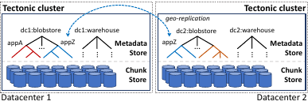
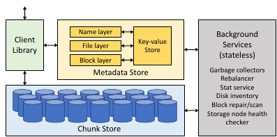
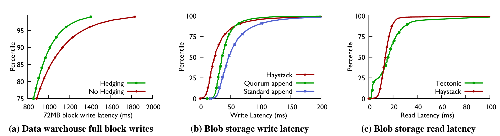
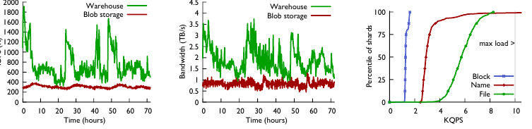

# Facebook's Tectonic Filesystem: Efficiency from Exascale（中文译文）

## 译者说明

本文依据同目录的 `source.pdf` 翻译。章节、图表、公式、算法、代码与参考文献按原文结构保留。

## 出版信息

- 作者：Satadru Pan¹、Theano Stavrinos¹,²、Yunqiao Zhang¹、Atul Sikaria¹、Pavel Zakharov¹、Abhinav Sharma¹、Shiva Shankar P¹、Mike Shuey¹、Richard Wareing¹、Monika Gangapuram¹、Guanglei Cao¹、Christian Preseau¹、Pratap Singh¹、Kestutis Patiejunas¹、JR Tipton¹、Ethan Katz-Bassett³、Wyatt Lloyd²
- 机构：¹ Facebook, Inc.；² Princeton University；³ Columbia University
- 收录会议：第 19 届 USENIX Conference on File and Storage Technologies（FAST '21），2021 年 2 月 23–25 日
- 论文页面：https://www.usenix.org/conference/fast21/presentation/pan
- 会议论文集 ISBN：978-1-939133-20-5

## 摘要

Tectonic 是 Facebook 的 exabyte 级分布式文件系统。它把过去使用服务专用系统的大型租户整合到通用多租户文件系统实例中，同时达到与专用系统相当的性能。exabyte 级整合实例相比我们原先的方案带来更好的资源利用、更简单的服务和更低的运维复杂度。

本文描述 Tectonic 的设计，解释它如何实现可扩展性、支持多租户，并允许租户按不同工作负载做专门优化。论文还总结了设计、部署和运维 Tectonic 得到的经验。

## 1. 引言

Tectonic 是 Facebook 的分布式文件系统。它目前服务约十个租户，包括 blob storage 和 data warehouse，二者都存储 exabytes 级数据。在 Tectonic 之前，Facebook 的存储基础设施由一组更小、更专用的存储系统组成。Blob storage 分散在 Haystack [11] 和 f4 [34] 中；data warehouse 分散在许多 HDFS 实例 [15] 中。

这种星座式方案运维复杂：多个系统需要分别开发、优化和管理。它也低效，因为资源被困在专用系统里，无法重新分配给存储负载中的其他部分。

Tectonic 集群可扩展到 exabytes，一个集群能够覆盖整个数据中心。多 exabyte 容量使同一个集群可承载 blob storage、data warehouse 等多个大型租户，每个租户又支持数百个应用。作为 exabyte 级多租户文件系统，相比通过联邦方式组合多个 petabyte 级集群的存储架构 [8, 17]，Tectonic 提供了更简单的运维和更高的资源效率。

Tectonic 简化运维，因为多样化存储需求只需开发、优化和管理一个系统。它提高资源效率，因为集群租户之间可以共享资源。例如，Haystack 专门存新 blob，瓶颈是硬盘 IOPS，但有多余磁盘容量；f4 存旧 blob，瓶颈是磁盘容量，但有多余 IO 能力。Tectonic 通过整合和资源共享，用更少磁盘支撑相同负载。

构建 Tectonic 时，我们面对三个高层挑战：

- 扩展到 exabyte 级。
- 在租户之间提供性能隔离。
- 支持租户特定优化。

exabyte 级集群对运维简单性和资源共享很重要；性能隔离和租户特定优化则让 Tectonic 能匹配专用存储系统性能。

为扩展元数据，Tectonic 把文件系统元数据拆成可独立扩展的层，类似 ADLS [42]。不同之处是 Tectonic 对每一层做 hash partition，而不是 range partition。hash partition 有效避免元数据层热点。再结合可高度扩展的 chunk storage layer，分离式元数据使 Tectonic 能扩展到 exabytes 存储和 billions 级文件。

Tectonic 通过降低资源管理问题的基数来简化性能隔离：它不是在数百个应用之间直接管理资源，而是在每个租户中按相似流量模式和延迟需求分组后管理几十个 traffic groups。

Tectonic 使用租户特定优化来匹配专用存储系统性能。这些优化由 client-driven microservice 架构支持，客户端配置丰富，可控制租户如何与 Tectonic 交互。Data warehouse 对大写入使用 RS 编码写入，以提高空间、IO 和网络效率；blob storage 则对小写入使用复制仲裁追加协议以降低延迟，之后再 RS 编码以提高空间效率。

Tectonic 已在单租户集群中托管 blob storage 和 data warehouse 多年，并完全替代 Haystack、f4 和 HDFS。多租户集群则按步骤推出，以保证可靠性并避免性能回退。

采用 Tectonic 带来了多项运维和效率收益。例如 data warehouse 从 HDFS 迁移到 Tectonic 后，数据仓库集群数量缩减为原来的约十分之一（10× reduction），因需管理的集群更少而简化了运维。将 blob storage 和 data warehouse 整合到多租户集群后，data warehouse 可利用 blob storage 闲置的 IO 容量处理流量尖峰。Tectonic 在提供这些效率提升的同时，性能达到或超过原先专用存储系统。

## 2. Facebook 之前的存储基础设施

Tectonic 之前，每个主要存储租户都把数据存放在一个或多个专用系统中。这里我们聚焦两个大型租户：blob storage 和 data warehouse。我们将讨论每个租户的性能要求、它们之前使用的存储系统，以及这些系统效率低下的原因。

### 2.1 Blob Storage

Blob storage 存储和提供二进制大对象，包括 Facebook 应用的媒体文件，如照片、视频、消息附件，也包括内部应用数据，如 core dump 和 bug report。Blob 不可变且不透明，大小从几 KB 的小照片到数 MB 的高清视频 chunk 不等 [34]。由于 blob 经常位于交互式 Facebook 应用请求路径上，blob storage 期望低延迟读写 [29]。

#### Haystack 与 f4

在 Tectonic 之前，blob storage 由 Haystack 和 f4 两个专用系统组成。Haystack 处理高访问频率的热 blob [11]，以复制形式存储数据，提供持久性和快速读写。随着 blob 变旧且访问频率下降，它们被移动到 f4，即温 blob 存储 [34]。f4 使用 RS 编码 [43]，空间效率更高，但吞吐更低，因为每个 blob 可直接从两个磁盘访问，而 Haystack 是三个。f4 的较低吞吐可接受，因为请求率较低。

但热 blob 与温 blob 分离导致资源利用率差，且硬件趋势和 blob 使用趋势加剧了这个问题。Haystack 理想有效复制因子为 3.6×：每个逻辑字节复制 3×，再乘以 RAID-6 的 1.2× 开销 [19]。但随着硬盘密度提升而单盘 IOPS 基本不变，每 TB 容量对应的 IOPS 持续下降。

因此 Haystack 变成 IOPS 受限系统，必须额外配置硬盘处理热 blob 的高 IOPS 负载。多余磁盘容量使 Haystack 实际有效复制因子升至 5.3x。相反，f4 使用两个数据中心的 RS(10,4) 编码，有效复制因子为 2.8x。与此同时，blob storage 的使用趋势转向更多短生命周期媒体，这些数据存在 Haystack 中，还没移动到 f4 就被删除。因此越来越多 blob 数据以 Haystack 的高有效复制因子存储。

最后，由于 Haystack 和 f4 是独立系统，各自都有无法与其他系统共享的 stranded resources。Haystack 为峰值 IOPS 超配容量，f4 因存储大量低频数据而有充足 IOPS。迁移到 Tectonic 后，这些资源被整合利用，blob storage 的有效复制因子约为 2.8x。

### 2.2 Data Warehouse

Data warehouse 为数据分析提供存储。应用存储大规模 map-reduce 表、社交图快照、AI 训练数据和模型等对象。Presto [3]、Spark [10]、AI 训练流水线 [4] 等多个计算引擎访问这些数据，处理后再存储派生数据。Warehouse 数据按 dataset 分区，dataset 保存 Search、Newsfeed、Ads 等产品组的相关数据。

Data warehouse 相比低延迟更重视读写吞吐，因为应用通常批处理数据。其工作负载的读写通常大于 blob storage：读取平均多个 MB，写入平均数十 MB。

#### 用于 data warehouse 存储的 HDFS

在 Tectonic 之前，data warehouse 使用 HDFS [15, 50]。但 HDFS 集群规模受限，因为它用单机保存和服务元数据。因此，为了存储分析数据，我们在每个数据中心需要数十个 HDFS 集群。这带来运维低效：每个服务都必须知道数据在集群之间的位置和移动。单个 data warehouse dataset 常常大到超过一个 HDFS 集群容量，导致相关数据分散在多个集群，计算引擎逻辑复杂。

把 dataset 分配到多个 HDFS 集群还造成二维 bin-packing 问题：既要满足每个集群的容量约束，也要满足可用吞吐。Tectonic 的 exabyte 级规模消除了 bin-packing 和 dataset 分裂问题。

## 3. 架构与实现

本节描述 Tectonic 架构和实现，重点是通过可扩展的 chunk store 与 metadata store 实现 exabyte 级单集群。

### 3.1 Tectonic 鸟瞰

集群是 Tectonic 顶层部署单元。Tectonic 集群位于单个数据中心内，提供可抵抗主机、机架和电力域故障的持久存储。租户可以在 Tectonic 之上构建地理复制，以防数据中心级故障。

一个 Tectonic 集群由 storage nodes、metadata nodes 和用于后台操作的 stateless nodes 组成。Client Library 编排到元数据节点和存储节点的远程调用。Tectonic 集群可以非常大，单个集群能服务一个数据中心内所有租户的存储需求。

Tectonic 集群是多租户的，同一个存储 fabric 支持约十个租户。租户是不会相互共享数据的分布式系统，例如 blob storage 和 data warehouse。租户又服务数百个应用，包括 Newsfeed、Search、Ads 和内部服务；这些应用有不同流量模式和性能要求。

同一套存储和元数据组件上，Tectonic 支持任意数量、任意大小的 namespace，即文件系统目录层次。集群中每个租户通常拥有一个 namespace。namespace 大小只受集群规模限制。

应用通过一个类似 HDFS [15] 的层次化文件系统 API 与 Tectonic 交互，语义是 append-only。不同于 HDFS，Tectonic API 可在运行时配置，而不是按集群或租户预配置。租户利用这一灵活性来匹配专用存储系统性能。

#### Tectonic 组件

Tectonic 的主要组件如下：

- Chunk Store：存储节点集群，负责保存和访问硬盘上的数据 chunk。
- Metadata Store：由可扩展 key-value store 和无状态元数据服务组成，在 key-value store 上构建文件系统逻辑。
- Client Library：把客户端文件系统 API 调用转换为 Chunk Store 和 Metadata Store 的 RPC，并负责按租户需求编排操作。
- 后台服务：维护集群一致性和容错，包括 garbage collector、rebalancer、stat service、disk inventory、block repair/scan 和 storage node health checker 等。

Chunk Store 与 Metadata Store 的可扩展性使 Tectonic 能够存储 exabytes 数据。Tectonic 是一个由客户端驱动、基于 microservice 的系统，这一设计支持租户特定优化。Chunk Store 和 Metadata Store 分别运行独立服务，处理数据和元数据读写请求；Client Library 编排这些服务，把客户端文件系统 API 调用转换为发往 Chunk Store 和 Metadata Store 服务的 RPC。

### 3.2 Chunk Store：exabyte 级存储

Chunk Store 是一个扁平分布式对象存储，存储单元是 chunk。chunk 组成 block，block 再组成 Tectonic 文件。

Chunk Store 的两个特性帮助 Tectonic 扩展并支持多租户。第一，Chunk Store 是扁平的；存储 chunk 数量随存储节点数量线性增长，因此可扩展到 exabytes 数据。第二，它不了解 block 或 file 等高层抽象；这些抽象由 Client Library 结合 Metadata Store 构建。把数据存储与文件系统抽象分离，简化了在同一集群上为多种租户提供良好性能的问题。这种分离还意味着，可以按租户的性能需求专门优化对 storage node 的读写，而无需改变文件系统管理方式。

#### 高效存储 chunk

单个 chunk 作为文件存储在集群 storage node 上，每个节点运行本地 XFS [26]。Storage node 暴露 get、put、append、delete chunk 的核心 IO API，以及列出和扫描 chunk 的 API。storage node 还负责在 Tectonic 租户之间公平共享本地资源。

每个 storage node 有 36 块硬盘用于存储 chunk [5]，还有 1 TB SSD 用于存储 XFS 元数据并缓存热 chunk。节点运行一个可把本地 XFS 元数据放在 flash 上的 XFS 版本 [47]。这对 blob storage 特别有用，因为新 blob 以 append 写入，会更新 chunk 大小。SSD 热 chunk cache 由感知 flash endurance 的 cache library 管理 [13]。

#### 作为持久存储单元的 block

在 Tectonic 中，block 是隐藏原始数据存储和持久性复杂性的逻辑单元。对上层而言，block 是字节数组；实际由多个 chunk 组成，共同提供 block 持久性。Tectonic 在每个 block 粒度提供持久性，让租户可调节存储容量、容错和性能之间的取舍。block 可用 Reed-Solomon 编码 [43] 或复制实现持久性。 $\mathrm{RS}(r,k)$ 会把 block 数据拆成 $r$ 个相等 chunk（必要时通过填充数据实现），并由这些 data chunks 生成 $k$ 个 parity chunk；复制则创建多个与 block 等大的 data chunk 副本。一个 block 中的 chunk 存储在不同故障域，例如不同机架。后台服务会修复损坏或丢失 chunk。

### 3.3 Metadata Store：命名 exabytes 数据

Tectonic Metadata Store 保存文件系统层次结构和 block 到 chunk 的映射。它通过细粒度划分元数据获得运维简单性和可扩展性。文件系统元数据首先被 disaggregated，即把 Name、File 和 Block 层逻辑分离；然后每一层按 hash 分区。正如我们在本节所述，该设计本身就带来可扩展性和负载均衡；与此同时，还必须谨慎处理元数据操作，才能在细粒度分区下保持文件系统一致性。

#### 在 key-value store 中存储元数据，以获得可扩展性和运维简单性

Tectonic 把元数据委托给 ZippyDB [6]，这是一个线性一致、容错、分片的 key-value store。key-value store 以 shard 为粒度管理数据；所有操作都限定在 shard 内，shard 是复制单元。节点内部运行基于 SSD 的单节点 key-value store RocksDB [23] 来保存 shard 副本，并用 Paxos [30] 复制以容错。任何副本都可服务读请求，但强一致读由 primary 服务。key-value store 不提供跨 shard 事务，这限制了某些文件系统元数据操作。shard 大小设计为每个 metadata node 可承载多个 shard，这让节点失败时可以并行重新分布 shard，缩短恢复时间，也支持细粒度负载均衡；key-value store 会透明迁移 shard，以控制各节点负载。

#### 文件系统元数据层

表 1：Tectonic 的分层元数据 schema。`dirname` 和 `filename` 是应用可见字符串；`dir_id`、`file_id` 和 `block_id` 是内部对象引用；多数映射采用 expanded mapping 以便高效更新。

| 层 | Key | Value | 分片依据 | 映射 |
| --- | --- | --- | --- | --- |
| Name | `(dir_id, subdirname)` | `subdir_info, subdir_id` | `dir_id` | directory 到子目录列表 |
| Name | `(dir_id, filename)` | `file_info, file_id` | `dir_id` | directory 到文件列表 |
| File | `(file_id, blk_id)` | `blk_info` | `file_id` | file 到 block 列表 |
| Block | `blk_id` | `list<disk_id>` | `blk_id` | block 到 disk/chunk 列表 |
| Block | `(disk_id, blk_id)` | `chunk_info` | `blk_id` | disk 到 block 列表 |

Name 层把每个目录映射到其子目录和文件；File 层把文件对象映射到 block 列表；Block 层把每个 block 映射到 disk（即 chunk）位置列表。Block 层还保存 disk 到其所含 block 的反向索引，供维护操作使用。Name、File 和 Block 层分别按 directory ID、file ID 和 block ID 做 hash partition。

Name、File 和 disk-to-block list 使用 expanded mapping。一个 key 映射到列表时，把列表中每个元素都存成以真实 key 为前缀的独立 key。例如目录 d1 包含文件 `foo` 和 `bar`，我们就在 d1 的 Name shard 中存两个 key：`(d1, foo)` 和 `(d1, bar)`。expanded mapping 允许修改一个 key 的内容时不必读取和重写整个列表。在目录可包含百万文件的文件系统中，这能显著降低创建和删除文件等操作开销。列出 expanded key 内容则通过 prefix scan。

#### 细粒度元数据分区以避免热点

文件系统中目录操作常导致元数据热点，尤其是 data warehouse 中相关数据被分组到目录里，短时间内大量读取同一目录下文件。Tectonic 的分层元数据通过把查找和列目录内容的 Name 层，与读取文件数据的 File/Block 层分离，自然减少目录和其他层热点。这类似 ADLS 的元数据层分离 [42]。但 ADLS 对元数据层做 range partition，而 Tectonic 做 hash partition。range partition 倾向把相关数据放在同一 shard，例如目录树子树，若不精心分片容易产生热点。

我们发现 hash partition 能有效均衡元数据操作负载。例如，Name 层中一个目录的直接目录列表总是保存在单个 shard 中，但同一目录下两个子目录的列表很可能位于不同 shard。Block 层的 block 定位信息按 hash 分散到各 shard，与 block 所属目录或文件无关。Tectonic 约三分之二的元数据操作由 Block 层服务，但 hash partition 使这些流量均匀分布在 Block 层的各个 shard 上。

#### 缓存 sealed 对象元数据以降低读负载

metadata shard 的可用吞吐有限，因此为降低读负载，Tectonic 允许 block、file 和 directory 被 sealed。目录 sealing 不递归，只会阻止在该目录的直接下一层新增对象。sealed 对象内容不能改变，其元数据可在 metadata node 和 client 缓存，不破坏一致性。例外是 block-to-chunk 映射，因为 chunk 可在 disk 间迁移，会使 Block 层缓存失效；读过程中可检测 stale Block cache 并刷新。

#### 提供一致的元数据操作

Tectonic 依赖 key-value store 的强一致操作和 shard 内 atomic read-modify-write 事务来保证同目录内操作的一致性。它保证数据操作、单对象文件/目录操作、同父目录内 move 操作的 read-after-write 一致性。同一目录中的文件位于该目录的 shard（表 1），因此 file create、delete 和同一父目录内的 move 等元数据操作可以保持一致。由于 key-value store 不支持跨 shard 一致事务，跨目录 move 是非原子的两阶段过程：我们先在新父目录创建链接，再从旧父目录删除链接。被移动目录保留指向父目录的 backpointer，用于检测 pending move，确保同一时间只有一个 move 操作活跃。跨目录移动文件则会复制文件对象并从源目录删除它；复制阶段创建一个引用源文件底层 blocks 的新文件对象，因此不需要移动数据。

没有跨 shard 事务时，涉及同一文件的多 shard 元数据操作必须小心实现以避免竞态。设目录 `d` 中的文件 `f1` 正被改名为 `f2`，同时另一个操作以 `f1` 为名创建新文件；create 语义会覆写同名文件。以下括号依次给出元数据层和 shard 查找键 `shard(x)`：

- R1：取得 `f1` 的 file ID `fid`（Name，`shard(d)`）。
- R2：把 `f2` 添加为 `fid` 的 owner（File，`shard(fid)`）。
- R3：在原子事务中创建映射 `f2` → `fid`，并删除 `f1` → `fid`（Name，`shard(d)`）。
- C1：创建新 file ID `fid_new`（File，`shard(fid_new)`）。
- C2：创建映射 `f1` → `fid_new`，并删除 `f1` → `fid`（Name，`shard(d)`）。

如果 C1、C2 在 R1 之后、R3 之前执行，R3 就会抹掉 create 操作刚建立的映射，使文件系统不一致。因此 R3 使用 shard 内事务，保证 `f1` 指向的文件对象自 R1 以来未被修改。

### 3.4 Client Library

Tectonic Client Library 编排 Chunk Store 和 Metadata Store 服务，向应用暴露文件系统抽象，并让应用按操作控制读写配置。Client Library 以 chunk 粒度执行读写，这是 Tectonic 中最细粒度，因此它几乎可以自由地用最适合应用的方式执行操作。

Client Library 负责复制或 RS 编码数据，并直接把 chunk 写入 Chunk Store。它从 Chunk Store 读取并重建 chunk，向应用返回数据。它查询 Metadata Store 以定位 chunk，并在文件系统操作中更新 Metadata Store。

#### 以单 writer 语义实现简单、可优化的写入

Tectonic 通过允许每个文件只有一个 writer 来简化 Client Library 编排。单写语义避免序列化多个 writer 写同一文件的复杂性。Client Library 可以直接并行写 storage node，从而并行复制 chunk 并执行 hedged writes。需要多写语义的租户可以在 Tectonic 上层构建序列化语义。

Tectonic 用每个文件的 write token 强制单写语义。writer 想向文件添加 block 时，必须在元数据写入中包含匹配 token。进程以 append 方式打开文件时，文件元数据中会加入 token；后续写必须携带它才能更新元数据。若第二个进程尝试打开文件，它会生成新 token 并覆盖第一个进程的 token，成为新的唯一 writer；新 writer 的 Client Library 会在打开文件调用中 seal 前一 writer 打开的 block。

### 3.5 后台服务

后台服务维护元数据层之间的一致性，通过修复丢失数据维持持久性，跨 storage node 重平衡数据，处理 rack drain，并发布文件系统使用统计。后台服务与 Metadata Store 类似分层，并一次处理一个 shard。图 2 列出了重要的后台服务。

每个元数据层之间有 garbage collector 清理可接受的元数据不一致。不一致可能来自失败的多步骤 Client Library 操作。延迟对象删除也会造成不一致：删除时只把对象标记为删除以优化实时延迟，而不立即真正移除。

rebalancer 和 repair service 协同移动或删除 chunk。rebalancer 识别需要移动的 chunk，例如硬件故障、新增存储容量、rack drain。repair service 通过对系统中每个 disk 按 Block 层 shard 对账 chunk list 与 disk-to-block map，执行实际数据移动。disk-to-block reverse index 使该服务可横向扩展。

#### 大规模 copyset

copyset 是为同一个 block 提供冗余的一组 disk。例如 RS(10,4) block 的 copyset 包含 14 个 disk [20]。copyset 太多会在意外磁盘故障尖峰时增加数据不可用风险；copyset 太少则在单盘故障时让 peer disk 承受高重建负载。Block Layer 和 rebalancer 共同尝试维持一个固定 copyset 数，在不可用风险和重建负载之间折中。二者各自在内存中保留约一百个全体 disk 的 consistent shuffle；Block Layer 从 shuffle 中连续的 disk 组成 copyset。写入时，Block Layer 根据 block ID 选择对应的 shuffle，并把其中一个 copyset 交给 Client Library；rebalancer 则尽力让该 block 的 chunks 留在这个 shuffle 指定的 copyset 中。由于集群 disk 成员持续变化，copyset 是 best-effort。

## 4. 多租户

租户从专用存储系统迁移到整合文件系统时，Tectonic 需要提供可比性能，面临两个挑战：第一，租户必须共享资源，同时每个租户获得公平份额，即至少获得单租户系统中的资源；第二，租户仍应像专用系统那样优化性能。本节说明 Tectonic 如何以保持运维简单性的清晰设计支持资源共享；第 5 节则说明租户特定优化如何让租户获得与专用存储系统相当的性能。

### 4.1 有效共享资源

作为 Facebook 内部多样化租户的共享文件系统，Tectonic 需要近似加权公平共享、租户间性能隔离，并能弹性转移资源以保持高利用率。它还必须识别延迟敏感请求，避免被大请求阻塞。

#### 资源类型

Tectonic 区分两类资源：

- 非瞬时资源（non-ephemeral）：存储容量。它变化慢且可预测，一旦分配给租户就不能自动给其他租户。容量在租户粒度管理，每个租户有预定义容量配额和严格隔离；租户之间容量重配置手工完成，但不需停机，因此遇到紧急容量短缺时可以立即执行。各租户负责在自己的应用之间分配并跟踪存储容量。
- 瞬时资源（ephemeral）：需求随时变化、分配可实时改变的资源，例如存储 IOPS 能力和元数据查询能力。瞬时资源需要更细粒度实时自动管理，以保证公平共享、隔离和高利用率。

本节余下部分，我们说明 Tectonic 如何有效共享瞬时资源。

#### 在租户之间及租户内部分配瞬时资源

瞬时资源共享难点在于 Tectonic 不仅租户多样，每个租户还服务许多具有不同流量模式和性能要求的应用。若按租户粒度管理太粗；若按应用粒度管理，数百应用又过于复杂。

因此，Tectonic 在每个租户内部按 application group 管理瞬时资源，这些组称为 TrafficGroups。TrafficGroup 降低了资源共享问题的基数，从而减少多租户管理开销。一个 TrafficGroup 中的应用有相似资源和延迟需求。例如一个组可以是后台流量，另一个是生产流量。Tectonic 每个集群支持约 50 个 TrafficGroups，各租户拥有的数量可以不同。租户负责为应用选择合适 TrafficGroup。

每个 TrafficGroup 又被赋予一个 TrafficClass，表示延迟要求并决定谁获得 spare resources。TrafficClass 包括 Gold、Silver、Bronze，分别对应延迟敏感、普通、后台应用。租户内部 spare resources 按 TrafficClass 优先级分配。

#### 强制执行全局资源共享

Tectonic 以租户、TrafficGroup 和 TrafficClass 共同实现隔离和高利用率。每个租户获得集群瞬时资源的保证配额，该配额再分到租户的 TrafficGroups。每个 TrafficGroup 获得保证资源配额，在租户之间和 TrafficGroups 之间提供隔离。租户内部剩余瞬时资源按 TrafficClass 下降顺序共享给本租户 TrafficGroups；剩余资源再按 TrafficClass 下降顺序给其他租户 TrafficGroups。当一个 TrafficGroup 使用另一个 TrafficGroup 的资源时，该流量使用两者 TrafficClass 的较低者，以维持各类流量比例，使节点仍能满足各 TrafficClass 的延迟特征。

Client Library 使用 rate limiter 实现上述弹性。rate limiter 用高性能近实时分布式计数器跟踪最近一个很短的时间窗口内，每个租户和 TrafficGroup 对每种资源的需求。它实现修改版 leaky bucket 算法。请求到达时递增对应 demand counter；Client Library 依次检查本 TrafficGroup、本租户其他 TrafficGroups、其他租户是否有 spare capacity，并遵循 TrafficClass 优先级。若有容量则发送到后端，否则按请求超时延迟或拒绝。客户端限流可在发出可能浪费的后端请求前对客户端施加 backpressure。

#### 强制执行本地资源共享

客户端 rate limiter 保证近似的全局公平共享和隔离；metadata node 和 storage node 还必须管理本地资源以避免局部热点。本地 resource sharing 由这些节点使用 weighted round-robin scheduler 实现；如果某 TrafficGroup 会超过配额，调度器可临时跳过它。storage nodes 还需要保证小 IO 请求不会因与大而尖峰的 IO 请求共置而延迟升高。为保证 Gold 请求低延迟，storage nodes 使用三项优化：

- WRR 贪心优化：低 TrafficClass 请求若让出 turn 后仍有时间完成，可让高 TrafficClass 先执行。
- 我们限制每个 disk 上非 Gold IO 的在途数量；若有 pending Gold 请求且非 Gold 达到限制，阻止调度新的非 Gold。
- 若某 disk 上 Gold 请求 pending 超过阈值，停止向该 disk 调度非 Gold 请求，以抵消磁盘内部重排 IO 的影响。

三项技术结合后，即使大 IO 的数量更多，也能有效维持小 IO 的延迟特征。

### 4.2 多租户访问控制

Tectonic 遵循常见安全原则，确保通信和依赖安全。它还提供租户之间的粗粒度访问控制，以及租户内部的细粒度访问控制。由于 Client Library 直接访问每一层，访问控制必须在每层执行；且访问控制位于每次读写路径上，必须轻量。

Tectonic 使用 token-based authorization，token 中包含可访问资源 [31]。授权服务为顶层客户端请求授权，例如打开文件，并为文件系统下一层生成授权 token；每个后续层同样为下一层授权。token payload 描述被授予访问的资源，从而支持细粒度访问控制。每层在内存中验证 token 和资源，验证可在几十微秒内完成。把 token 传递 piggyback 到现有协议中降低了访问控制开销。

## 5. 租户特定优化

Tectonic 在同一共享文件系统中支持约十个租户，每个租户有特定性能需求和工作负载特征。两项机制支持租户特定优化：

- 客户端几乎完全控制应用如何与 Tectonic 交互；Client Library 在 chunk 粒度操纵数据，这是系统中最细粒度。
- 客户端按每次调用执行配置。许多文件系统把配置固化在系统中，或按整个文件/namespace 应用；例如 HDFS 按目录配置持久性 [7]，Tectonic 则可按 block write 配置持久性。

这种由 Client Library 驱动的设计使 Tectonic 能按应用性能需求执行操作。per-call 配置由 Metadata Store 的可扩展性支撑；Metadata Store 能轻松承载该方式增加的元数据。下面我们说明 data warehouse 和 blob storage 如何用 per-call 配置实现高效写入。

### 5.1 Data Warehouse 写优化

Data warehouse 常见模式是写一次、之后多次读取。文件只有在创建者关闭后才对读者可见，此后整个生命周期内不可变。由于文件完全写好后才被读取，应用更重视低文件写入总时间，而不是低 append 延迟。

#### 完整 block 的异步 RS 编码写入，以提高空间、IO 和网络效率

Tectonic 利用 write-once-read-many 模式提升 IO 和网络效率，同时最小化总写入时间。没有 partial file reads 意味着应用可以缓冲写入直到 block 大小，然后在内存中 RS 编码 block，并把 data chunks 写到 storage nodes。长生命周期数据通常使用 RS(9,6)，短生命周期数据如 map-reduce shuffle 通常用 RS(3,3)。

完整 block 的 RS 编码写入相比复制节省空间、网络带宽和磁盘 IO。写 RS(9,6) 的 15 个磁盘需要更多 IOPS，但每次写较小，总写入数据量远少于复制。由于 block 足够大，完整 block 写入的瓶颈是磁盘带宽而非 IOPS，因此磁盘 IO 更高效。

write-once-read-many 还允许应用异步并行写入文件 blocks，显著降低文件写延迟。所有 blocks 写完后再一次性更新文件元数据。文件完全写好后才可见，因此不会产生不一致风险。

#### 通过 hedged quorum writes 改善尾延迟

为改进完整 block 写的尾延迟，Tectonic 使用 quorum writing 变体，不增加额外 IO。它不把 chunk write payload 发给额外节点，而是在发送数据前先发 reservation requests，然后把 chunk 写给最先接受 reservation 的节点。reservation 类似 hedging [22]，但避免向会因缺资源或请求方超出该节点资源份额而拒绝请求的节点传输数据。

例如写 RS(9,6) 编码 block 时，Client Library 向不同故障域的 19 个 storage nodes 发送 reservation，比实际需要多 4 个。然后向最先响应的 15 个节点写 data 和 parity chunks。只要 15 个节点中 14 个成功就向客户端确认；若第 15 个失败，对应 chunk 后台修复。集群负载越高，hedging 步骤越有效；测试集群 80% 吞吐利用率时，RS(9,6) 72 MB full-block write 的 99 分位延迟改善约 20%。

### 5.2 Blob Storage 优化

Blob storage 对文件系统有挑战，因为需要索引的对象数量巨大，Facebook 存储 tens of trillions 级 blobs。Tectonic 通过把许多 blob 一起存入 log-structured files 来管理 blob storage 元数据规模，新 blob append 到文件末尾；blob ID 映射到 blob 在文件中的位置。

Blob storage 位于许多用户请求路径上，因此低延迟重要。blob 通常远小于 Tectonic block。因此 blob storage 把新 blob 写成小型复制 partial block appends 以降低延迟。partial block appends 需要 read-after-write consistent，以便上传成功后立即可读。缺点是复制数据比 full-block RS 编码占用更多磁盘空间。

#### 低延迟的一致 partial block append

Tectonic 使用 partial block quorum append 实现持久、低延迟、一致的 blob 写入。在 quorum append 中，Client Library 在部分 storage nodes 成功把数据写入磁盘后就确认写入，例如三副本中两个节点成功。临时的持久性降低是可接受的，因为 block 很快会被重新编码，且 blob storage 会在另一个数据中心写第二份。

partial block quorum append 的挑战是 straggler append 可能让副本 chunk 长度不同。Tectonic 通过严格控制谁能 append 一个 block，以及 append 何时可见来维护一致性。block 只能被创建该 block 的 writer append。append 完成后，Tectonic 在确认 quorum append 前，把 append 后 block 大小和 checksum 提交到 block metadata。这样，若 block metadata 报告大小 $S$，则 block 中 $S$ 之前所有字节都至少写入两个 storage nodes；读者可访问偏移 $S$ 之前数据。所有向应用确认的写入也已更新到 block metadata，因此对未来读取可见。

Tectonic 的 blob storage 读写延迟与 Haystack 相当，说明通用性没有带来显著性能成本。

#### 为提高存储效率而重新编码 block

为了空间效率，Tectonic 在 block sealed 后把复制形式重新编码为 RS(10,4)。直接对小 partial-block append 做 RS 编码会造成 IO 低效，因为小磁盘写受 IOPS 限制；RS(10,4) 会产生 14 次 IO，而三副本只需 3 次。sealed 后 reencode 只需对 14 个目标 storage nodes 各执行一次大 IO，相比 append 时 RS 编码更高效。这种优化由 Client Library 驱动设计实现，几乎同时获得了复制小 append 的低延迟和 RS 编码的高空间效率。

## 6. 生产环境中的 Tectonic

本节展示 Tectonic 在 exabyte 规模运行，说明存储整合收益，并讨论元数据热点、设计取舍和经验。

### 6.1 Exabyte 级多租户集群

生产 Tectonic 集群以 exabyte 规模运行。表 2 给出一个代表性多租户集群的统计数据，本节所有结果均来自该集群。

表 2：代表性多租户 Tectonic 生产集群统计；文件数和 block 数以十亿为单位。

| 容量 | 已用字节 | 文件数 | Block 数 | Storage nodes |
| ---: | ---: | ---: | ---: | ---: |
| 1590 PB | 1250 PB | 10.7 B | 15 B | 4208 |

该快照中 1250 PB 存储约占集群容量 70%，包含 107 亿文件和 150 亿 blocks。

> **译者注：** 原文称 1250 PB 约占 1590 PB 集群容量的 70%；按表中两数计算约为 78.6%。上文按原文保留这一比例表述。

### 6.2 来自存储整合的效率

代表性集群托管两个租户：blob storage 和 data warehouse。blob storage 使用约 49% 已用空间，data warehouse 使用约 51%。图 4a 和图 4b 展示集群在同一个三天周期内处理存储负载：图 4a 是集群 aggregate IOPS，图 4b 是 aggregate disk bandwidth。三天期间，data warehouse 工作负载有由大型作业触发的巨大规律性 load spikes；相比之下，blob storage 流量平滑且可预测。

#### 共享剩余 IOPS 容量

集群利用与 blob storage 整合后释放的 surplus IOPS capacity 来处理 data warehouse 存储负载尖峰。blob storage 请求通常较小，受 IOPS 限制；data warehouse 请求通常较大，受带宽限制。因此仅用 IOPS 或带宽都无法公平描述磁盘 IO 使用。我们使用 disk time 表示某磁盘忙碌程度，用它公平度量不同请求类型的资源使用。例如某磁盘一秒内完成 10 次 IO，每次寻道和读取耗时 50 ms，则这 1000 ms 中磁盘共忙碌 500 ms。

表 3：Tectonic 将 data warehouse 与 blob storage 合并部署后，data warehouse 可利用原本属于 blob storage 的剩余 disk time 来处理大规模负载尖峰；表中展示代表性集群三个日常峰值期间的标准化 disk time 需求与供给。

| 项 | Warehouse | Blob storage | Combined |
| --- | ---: | ---: | ---: |
| Supply | 0.51 | 0.49 | 1.00 |
| Peak 1 | 0.60 | 0.12 | 0.72 |
| Peak 2 | 0.54 | 0.14 | 0.68 |
| Peak 3 | 0.57 | 0.11 | 0.68 |

> **译者注：** 原文标题明确标为 Table 3，但图注正文误称 “This figure”；此处按资源类型译为“表”。

表 3 中的 Supply 是 data warehouse 和 blob storage 各自单独运行集群时可获得的 disk time；我们按集群中已用空间对应的 total disk time 对其归一化。三个 daily peaks 对应图 4a、图 4b 所示同一三天的流量。data warehouse 在三个峰值中需求都超过自身供给，若单独运行需要超配磁盘。为了处理三天窗口中的峰值，集群需要约 17% overprovisioning。blob storage 则有剩余 disk time，若单独集群运行会被浪费。整合到同一个 Tectonic 集群后，blob storage 的剩余 disk time 可供 data warehouse 处理负载尖峰。

### 6.3 元数据热点

Metadata Store 的 load spikes 可能导致 metadata shard 热点。服务元数据操作的瓶颈资源是 QPS；处理负载尖峰要求 Metadata Store 的每个 shard 都能跟上 QPS 需求。生产中每个 shard 可服务最多 10 KQPS，该限制来自当前 metadata nodes 资源隔离机制。

代表性集群中，File 和 Block 层所有 shard 都低于该限制。约 1% Name 层 shard 达到 QPS 限制，因为它们保存非常热的目录。未即时处理的小部分元数据请求会 backoff 后重试，让 metadata nodes 清理初始尖峰并成功服务重试请求。结合其他 shard 都低于最大值，Tectonic 能成功处理 data warehouse 的大元数据负载尖峰。

Name、File、Block 层的 shard 负载分布不同。越高层会把更多租户操作共置在一起，因此每 shard QPS 分布更宽。例如某目录的所有 directory-to-file lookups 都由一个 shard 处理。若像 ADLS [42] 那样使用 range partition，更多租户操作会共置，负载尖峰更大。data warehouse 作业常读取许多名称相似的目录，若目录按 range 分区会导致极端热点；它们也常读取一个目录中的许多文件，造成 Name 层尖峰。若 File 层也 range partition，把同一目录下文件放同一 shard，会因 File 层操作更多而产生更大尖峰。Tectonic 的 hash partition 减少共置，使系统可用更少节点处理元数据尖峰。

Tectonic 也与 data warehouse 协同设计以降低元数据热点。例如计算引擎常用 orchestrator 列出目录文件，再把文件分给 workers；workers 并行打开并处理文件。在 Tectonic 中，这会向单个 directory shard 发送大量近同时的 file open 请求。为避免该反模式，Tectonic 的 list-files API 返回文件名同时返回 file IDs。orchestrator 把 file IDs 和 names 发送给 workers，workers 可直接按 file ID 打开文件，不再查询 directory shard。

### 6.4 简单性与性能的取舍

Tectonic 设计总体优先简单性而非效率。下面我们讨论两个为了提高性能而选择引入额外复杂性的实例。

#### 管理重建负载

第一是管理 reconstruction load。RS 编码数据可连续存储，即一个 data block 被切成 chunk，每个 chunk 连续写入 storage node；也可 striped 存储，即切成更小 chunk 并在 storage nodes 间轮转分布 [51]。由于 Tectonic 使用 contiguous RS encoding，且多数读取小于 chunk size，因此读取通常是 direct reads，不需要 RS 重建，只需要一次磁盘 IO。对 RS(10,4)，reconstruction read 所需 IO 是 direct read 的 10 倍。硬件故障和节点过载都会触发重建，比例难预测。我们发现，如果不加控制，这种大幅变化的资源需求会导致影响系统可用性和性能的 cascading failures。

若部分 storage nodes 过载，direct reads 失败并触发 reconstructed reads，增加其他节点负载，进一步触发更多重建，形成 reconstruction storm。简单方案是使用 striped RS encoding，让所有读取都重建，避免失败时 IO 数量变化；但这会让正常读取昂贵得多。我们改为把 reconstructed reads 限制为所有 reads 的 10%，从而防止 reconstruction storm。该比例通常足以处理我们的生产集群中的磁盘、主机和机架故障。作为付出一些调优复杂性的交换，我们避免了磁盘资源过度配置。

#### 在数据中心内外高效访问数据

第二是数据中心内外的访问效率。Tectonic 允许客户端直接访问 storage nodes；替代设计可以使用 front-end proxies 中介所有客户端访问。把 Client Library 暴露给客户端会增加复杂性，因为库中的 bug 会成为应用二进制中的 bug。但直接访问 storage nodes 相比 proxy 设计节省一个网络 hop，对每秒 TB 级数据非常重要。

直接访问不适合远程请求，即客户端地理位置远离 Tectonic 集群。网络往返开销使编排低效。因此 Tectonic 区分本地和远程数据访问：远程请求转发到与 storage nodes 同数据中心的无状态 proxy。

### 6.5 取舍与妥协

迁移到 Tectonic 也带来一些取舍。本小节列出相较 Facebook 先前基础设施不够灵活或性能较低的若干方面；我们还说明使用 hash-partitioned metadata 的影响。

#### 更高元数据延迟的影响

Data warehouse 应用看到更高元数据延迟。HDFS 元数据操作在内存中完成，且一个 namespace 的所有元数据在单节点上；Tectonic 则把元数据放在分片 key-value store 中，并分离元数据层。因此 Tectonic 的元数据操作可能需要一次或多次网络调用，例如一次 file open 会同时访问 Name 和 File 层。data warehouse 必须调整某些元数据操作处理方式，例如计算完成后按顺序重命名一组文件；在 HDFS 中每次 rename 都很快，而在 Tectonic 中，计算引擎改为并行执行该步骤，以隐藏单次 rename 的额外延迟。

#### 应对 hash-partitioned metadata

Hash-partitioned metadata 也带来工作绕行。由于 Tectonic 目录 hash sharded，递归列目录需要查询许多 shards。Tectonic 不提供 recursive list API，租户需要基于单次 list 调用构建客户端 wrapper。因此不同于 HDFS，Tectonic 没有直接查询目录聚合空间使用的 `du` 功能；它周期性聚合每目录使用统计，可能是 stale 的。

### 6.6 设计与部署经验

#### 高可扩展性是由 microservice 架构支持的迭代过程

高可扩展性是迭代过程，microservice 架构使其成为可能。Tectonic 多个组件经历多次迭代。例如第一版 Chunk Store 为减少元数据而把 blocks 分组：相同冗余方案的多个 blocks 组成 group，一起 RS 编码并一起存放 chunks；每个 block group 映射到一组 storage nodes。这种技术很常见，且能显著减少元数据 [37, 53]，但对我们的生产环境过于不灵活。仅 5% storage nodes 不可用时，80% block groups 会变为不可写。该设计还阻碍 hedged quorum writes 和 quorum appends（§5）等优化。我们最初的 Metadata Store 架构也没有分离 Name 和 File 层，导致目录查找和文件 block 列表都访问同一 shard，从而因元数据热点引发不可用，促使我们进一步 disaggregate metadata。

Tectonic 的演进说明，接近性能目标需要不断尝试新设计；我们的开发经验还表明，基于 microservice 的架构有利于试验：我们可以在系统其余部分无感知的情况下迭代组件。

#### 内存损坏在大规模系统中很常见

在这个规模上，内存损坏是常见现象。数千机器每天读写大量数据，in-memory data corruption 会规律发生；其他大规模系统也观察到这一现象 [12, 27]。我们通过在进程边界内外强制执行 checksum 检查来处理。对数据 $D$ 及其校验和 $C _ D$，若我们要执行内存变换 $F$，使 $D' = F(D)$，就同时为 $D'$ 生成校验和 $C _ {D'}$。检查 $D'$ 时，我们必须用 $F$ 的逆函数 $G$ 把 $D'$ 转回 $D$，并比较 $C _ {G(D')}$ 与 $C _ D$。计算逆函数 $G$ 可能很昂贵，例如 RS 解码或解密，但为保证数据完整性，这是可接受的成本。

所有涉及移动、复制或变换数据的 API 边界都必须改造为包含 checksum 信息。客户端写入时向 Client Library 传递 checksum；Tectonic 不仅跨进程边界传递 checksum，也在进程内部变换后继续传递。检查变换完整性能防止损坏在 storage node failure 后传播到 reconstructed chunks。

### 6.7 不使用 Tectonic 的服务

一些 Facebook 内部服务不使用 Tectonic。Bootstrap 服务，例如软件二进制包部署系统，必须没有依赖，因此不能使用 Tectonic，因为 Tectonic 依赖 key-value store、配置管理、部署管理等服务。Graph storage [16] 也不使用 Tectonic，因为 Tectonic 尚未针对 key-value store 工作负载优化，而这类负载通常需要 SSD 的低延迟。

许多其他服务不直接使用 Tectonic，而是通过 blob storage 或 data warehouse 等主要租户使用它。这来自 Tectonic 的核心设计理念：关注点分离。内部软件层各自聚焦一小组核心职责，例如 storage nodes 只知道 chunks，不知道 blocks 或 files。这一理念也延伸到 Tectonic 与其他存储基础设施的关系。Tectonic 负责单数据中心内的容错，不负责数据中心故障；地理复制由大型租户在其上解决。容量管理、跨数据中心部署和重平衡也由租户处理。若小型应用直接对接 Tectonic 并满足自身存储需求，就必须重新实现大型租户已经提供的功能，因此单个应用会通过这些租户来使用 Tectonic。

## 7. 相关工作

Tectonic 结合了既有系统和文献中的技术，展示如何把它们组合为一个支持共享存储 fabric 上多样负载的 exabyte 级单集群。

### 单元数据节点的分布式文件系统

HDFS [15]、GFS [24] 等单元数据节点分布式文件系统 [38, 40, 44] 受元数据节点限制，每个实例或集群只能到 tens of petabytes，而 Tectonic 单集群可到 exabytes。

### 通过联邦 namespace 提升容量

Federated HDFS [8] 和 Windows Azure Storage（WAS）[17] 通过组合较小存储集群来提升容量。例如 Federated HDFS [8] 即使让多个 namespace 共享 storage nodes，各 namespace 仍分别由独立的单 NameNode 管理。联邦系统仍有 dataset bin-packing 的运维复杂性；实例之间迁移或共享数据以负载均衡或扩容，需要跨 namespace 的高成本数据复制 [33, 46, 54]。

### 通过基于 hash 的数据定位实现元数据可扩展性

Ceph [53] 和 FDS [36] 通过 object ID hash 定位数据，消除集中式元数据。但在更大集群中，故障更频繁，hash-to-location map 更新必须传播到所有节点，成为扩展瓶颈。Yahoo Cloud Object Store [41] 通过联邦多个 Ceph 实例来隔离故障影响。此外，Ceph 缺乏受控数据迁移支持，使添加硬件和排空节点变得复杂 [52]。Tectonic 显式把 chunk 映射到 storage node，使受控迁移可行。

### 通过 disaggregated 或 sharded metadata 实现可扩展性

ADLS [42] 和 HopsFS [35] 与 Tectonic 一样，通过把元数据拆到分层分片数据存储中提升文件系统容量。Tectonic 对目录做 hash partition，而 ADLS 和 HopsFS 会把一些相关目录元数据放在同一 shard。hash partition 帮助 Tectonic 避免目录树局部热点。ADLS 使用 WAS 的联邦架构 [17] 保存 block；Tectonic 的 block storage 则是扁平的。

与 Tectonic 类似，Colossus [28, 32] 也提供集群级 multi-exabyte 存储，客户端库直接访问 storage nodes；Colossus 使用全球一致数据库 Spanner [21] 保存元数据。Tectonic 元数据基于分片 key-value store，只提供 shard 内强一致，不提供跨 shard 操作；这些限制在实践中不是问题。

### Blob 和对象存储

Blob 和对象存储 [14, 18, 36, 37] 比层次化分布式文件系统更容易扩展，因为没有需要保持一致的目录树或 namespace。但多数 warehouse 工作负载需要层次化 namespace。

### 其他大规模存储系统

Lustre [1] 和 GPFS [45] 针对高吞吐并行访问调优，但 Lustre 对 metadata node 数量有限制，从而限制扩展性；GPFS 遵循 POSIX，在我们的场景中会引入不必要的元数据管理开销。HBase [9] 是基于 HDFS 的 key-value store，但其 HDFS 集群不与 data warehouse 工作负载共享。AWS [2] 的设计未公开，因此我们无法与之比较。

### 多租户技术

Tectonic 的多租户技术与文件系统和租户共同设计，不追求最优公平共享，因此相比其他系统更容易提供性能隔离。相关系统使用更复杂的资源管理技术，以适应租户和资源使用策略的变化，或在租户间提供最优公平资源共享 [25, 48, 49]。

此前的演讲 [39, 47] 已介绍过 Tectonic 的部分细节，当时该系统称为 Warm Storage。

## 8. 结论

本文介绍 Tectonic，Facebook 的分布式文件系统。一个 Tectonic 实例可以支持一个数据中心内 Facebook 的所有主要存储租户，带来更好的资源利用率和更低运维复杂度。Tectonic 的 hash-sharded、disaggregated metadata 与扁平 data chunk storage 使其能够寻址和存储 exabytes 数据。其降低基数的资源管理方式能高效、公平地共享资源，并分配剩余资源以获得高利用率。Tectonic 的 client-driven tenant-specific optimizations 使其能匹配或超过之前专用存储系统性能。

## 致谢

我们感谢 shepherd Peter Macko，以及 FAST 程序委员会匿名审稿人；他们详尽的意见显著改进了本文。我们还感谢 Nar Ganapathy、Mihir Gorecha、Morteza Ghandehari、Bertan Ari、John Doty 以及 Facebook 内部其他项目贡献者，并感谢 Jason Flinn 和 Qi Huang 为改进论文提出建议。Theano Stavrinos 在 Princeton University 期间由美国国家科学基金会 grant CNS-1910390 支持。

## 参考文献

- [1] Lustre Wiki. https://wiki.lustre.org/images/6/64/LustreArchitecture-v4.pdf, 2017.
- [2] AWS Documentation. https://docs.aws.amazon.com/, 2020.
- [3] Presto. https://prestodb.io/, 2020.
- [4] Aditya Kalro. Facebook's FBLearner Platform with Aditya Kalro. https://twimlai.com/twiml-talk-197-facebooks-fblearner-platform-with-aditya-kalro/, 2018.
- [5] J. Adrian. Introducing Bryce Canyon: Our next-generation storage platform. https://tinyurl.com/yccx2x7v, 2017.
- [6] M. Annamalai. ZippyDB - A Distributed key value store. https://www.youtube.com/embed/ZRP7z0HnClc, 2015.
- [7] Apache Software Foundation. HDFS Erasure Coding. https://hadoop.apache.org/docs/r3.1.1/hadoop-project-dist/hadoop-hdfs/HDFSErasureCoding.html, 2018.
- [8] Apache Software Foundation. HDFS Federation. https://hadoop.apache.org/docs/current/hadoop-project-dist/hadoop-hdfs/Federation.html, 2019.
- [9] Apache Software Foundation. Apache HBase. https://hbase.apache.org/, 2020.
- [10] Apache Software Foundation. Apache Spark. https://spark.apache.org/, 2020.
- [11] D. Beaver, S. Kumar, H. C. Li, J. Sobel, and P. Vajgel. Finding a Needle in Haystack: Facebook's Photo Storage. In Proceedings of the 9th USENIX Symposium on Operating Systems Design and Implementation (OSDI'10), Vancouver, BC, Canada, 2010. USENIX Association.
- [12] D. Behrens, M. Serafini, F. P. Junqueira, S. Arnautov, and C. Fetzer. Scalable error isolation for distributed systems. In Proceedings of the 12th USENIX Symposium on Networked Systems Design and Implementation (NSDI'15), Oakland, CA, USA, 2015. USENIX Association.
- [13] B. Berg, D. S. Berger, S. McAllister, I. Grosof, J. Gunasekar, Sathya Lu, M. Uhlar, J. Carrig, N. Beckmann, M. Harchol-Balter, and G. R. Ganger. The CacheLib Caching Engine: Design and Experiences at Scale. In 14th USENIX Symposium on Operating Systems Design and Implementation (OSDI'20), Online, 2020. USENIX Association.
- [14] A. Bigian. Blobstore: Twitter's in-house photo storage system. https://blog.twitter.com/engineering/en_us/a/2012/blobstore-twitter-s-in-house-photo-storage-system.html, 2012.
- [15] D. Borthakur. HDFS Architecture Guide. https://hadoop.apache.org/docs/r1.2.1/hdfs_design.html, 2019.
- [16] N. Bronson, Z. Amsden, G. Cabrera, P. Chakka, P. Dimov, H. Ding, J. Ferris, A. Giardullo, S. Kulkarni, H. Li, M. Marchukov, D. Petrov, L. Puzar, Y. J. Song, and V. Venkataramani. TAO: Facebook's Distributed Data Store for the Social Graph. In Proceedings of the 2013 USENIX Annual Technical Conference. USENIX, 2013.
- [17] B. Calder, J. Wang, A. Ogus, N. Nilakantan, A. Skjolsvold, S. McKelvie, Y. Xu, S. Srivastav, J. Wu, H. Simitci, J. Haridas, C. Uddaraju, H. Khatri, A. Edwards, V. Bedekar, S. Mainali, R. Abbasi, A. Agarwal, M. F. u. Haq, M. I. u. Haq, D. Bhardwaj, S. Dayanand, A. Adusumilli, M. McNett, S. Sankaran, K. Manivannan, and L. Rigas. Windows Azure Storage: A Highly Available Cloud Storage Service with Strong Consistency. In Proceedings of the 23rd ACM Symposium on Operating Systems Principles (SOSP'11), Cascais, Portugal, 2011. Association for Computing Machinery (ACM).
- [18] J. Chen, C. Douglas, M. Mutsuzaki, P. Quaid, R. Ramakrishnan, S. Rao, and R. Sears. Walnut: a unified cloud object store. 2012.
- [19] P. M. Chen, E. K. Lee, G. A. Gibson, R. H. Katz, and D. A. Patterson. RAID: High-performance, reliable secondary storage. ACM Computing Surveys (CSUR), 26(2):145-185, 1994.
- [20] A. Cidon, S. Rumble, R. Stutsman, S. Katti, J. Ousterhout, and M. Rosenblum. Copysets: Reducing the Frequency of Data Loss in Cloud Storage. In Proceedings of the 2013 USENIX Annual Technical Conference (USENIX ATC'13), San Jose, CA, USA, 2013. USENIX Association.
- [21] J. C. Corbett, J. Dean, M. Epstein, A. Fikes, C. Frost, J. J. Furman, S. Ghemawat, A. Gubarev, C. Heiser, P. Hochschild, W. Hsieh, S. Kanthak, E. Kogan, H. Li, A. Lloyd, S. Melnik, D. Mwaura, D. Nagle, S. Quinlan, R. Rao, L. Rolig, Y. Saito, M. Szymaniak, C. Taylor, R. Wang, and D. Woodford. Spanner: Google's globally distributed database. ACM Trans. Comput. Syst., 31(3), Aug. 2013. ISSN 0734-2071. doi: 10.1145/2491245. URL https://doi.org/10.1145/2491245.
- [22] J. Dean and L. A. Barroso. The tail at scale. Commun. ACM, 56(2):74-80, Feb. 2013. ISSN 0001-0782. doi: 10.1145/2408776.2408794. URL http://doi.acm.org/10.1145/2408776.2408794.
- [23] Facebook Open Source. RocksDB. https://rocksdb.org/, 2020.
- [24] S. Ghemawat, H. Gobioff, and S.-T. Leung. The Google File System. In Proceedings of the 19th ACM Symposium on Operating Systems Principles (SOSP'03), Bolton Landing, NY, USA, 2003. Association for Computing Machinery (ACM).
- [25] R. Gracia-Tinedo, J. Sampé, E. Zamora, M. Sánchez-Artigas, P. García-López, Y. Moatti, and E. Rom. Crystal: Software-defined storage for multi-tenant object stores. In Proceedings of the 15th USENIX Conference on File and Storage Technologies (FAST'17), Santa Clara, CA, USA, 2017. USENIX Association.
- [26] X. F. Group. The XFS Linux wiki. https://xfs.wiki.kernel.org/, 2018.
- [27] A. Gupta, F. Yang, J. Govig, A. Kirsch, K. Chan, K. Lai, S. Wu, S. Dhoot, A. Kumar, A. Agiwal, S. Bhansali, M. Hong, J. Cameron, M. Siddiqi, D. Jones, J. Shute, A. Gubarev, S. Venkataraman, and D. Agrawal. Mesa: Geo-replicated, near real-time, scalable data warehousing. In Proceedings of the 40th International Conference on Very Large Data Bases (VLDB'14), Hangzhou, China, 2014. VLDB Endowment.
- [28] D. Hildebrand and D. Serenyi. A peek behind the VM at the Google Storage infrastructure. https://www.youtube.com/watch?v=q4WC_6SzBz4, 2020.
- [29] Q. Huang, P. Ang, P. Knowles, T. Nykiel, I. Tverdokhlib, A. Yajurvedi, P. Dapolito IV, X. Yan, M. Bykov, C. Liang, M. Talwar, A. Mathur, S. Kulkarni, M. Burke, and W. Lloyd. SVE: Distributed video processing at Facebook scale. In Proceedings of the 26th ACM Symposium on Operating Systems Principles (SOSP'17), Shanghai, China, 2017. Association for Computing Machinery (ACM).
- [30] L. Leslie. The part-time parliament. ACM Transactions on Computer Systems, 16(2):133-169, 1998.
- [31] K. Lewi, C. Rain, S. A. Weis, Y. Lee, H. Xiong, and B. Yang. Scaling backend authentication at facebook. IACR Cryptol. ePrint Arch., 2018:413, 2018. URL https://eprint.iacr.org/2018/413.
- [32] M. K. McKusick and S. Quinlan. GFS: Evolution on Fast-forward. Queue, 7(7):10:10-10:20, Aug. 2009. ISSN 1542-7730. doi: 10.1145/1594204.1594206. URL http://doi.acm.org/10.1145/1594204.1594206.
- [33] P. A. Misra, I. n. Goiri, J. Kace, and R. Bianchini. Scaling Distributed File Systems in Resource-Harvesting Datacenters. In Proceedings of the 2017 USENIX Annual Technical Conference (USENIX ATC'17), Santa Clara, CA, USA, 2017. USENIX Association.
- [34] S. Muralidhar, W. Lloyd, S. Roy, C. Hill, E. Lin, W. Liu, S. Pan, S. Shankar, V. Sivakumar, L. Tang, and S. Kumar. f4: Facebook's Warm BLOB Storage System. In Proceedings of the 11th USENIX Symposium on Operating Systems Design and Implementation (OSDI'14), Broomfield, CO, USA, 2014. USENIX Association.
- [35] S. Niazi, M. Ismail, S. Haridi, J. Dowling, S. Grohsschmiedt, and M. Ronström. HopsFS: Scaling hierarchical file system metadata using NewSQL databases. In Proceedings of the 15th USENIX Conference on File and Storage Technologies (FAST'17), Santa Clara, CA, USA, 2017. USENIX Association.
- [36] E. B. Nightingale, J. Elson, J. Fan, O. Hofmann, J. Howell, and Y. Suzue. Flat Datacenter Storage. In Proceedings of the 10th USENIX Symposium on Operating Systems Design and Implementation (OSDI'12), Hollywood, CA, USA, 2012. USENIX Association.
- [37] S. A. Noghabi, S. Subramanian, P. Narayanan, S. Narayanan, G. Holla, M. Zadeh, T. Li, I. Gupta, and R. H. Campbell. Ambry: Linkedin's scalable geo-distributed object store. In Proceedings of the 2016 International Conference on Management of Data (SIGMOD'16), San Francisco, California, USA, 2016. Association for Computing Machinery (ACM).
- [38] M. Ovsiannikov, S. Rus, D. Reeves, P. Sutter, S. Rao, and J. Kelly. The Quantcast File System. In Proceedings of the 39th International Conference on Very Large Data Bases (VLDB'13), Riva del Garda, Italy, 2013. VLDB Endowment.
- [39] K. Patiejunas and A. Jaiswal. Facebook's disaggregated storage and compute for Map/Reduce. https://atscaleconference.com/videos/facebooks-disaggregated-storage-and-compute-for-mapreduce/, 2016.
- [40] A. J. Peters and L. Janyst. Exabyte scale storage at CERN. Journal of Physics: Conference Series, 331(5):052015, Dec. 2011. doi: 10.1088/1742-6596/331/5/052015. URL https://doi.org/10.1088/1742-6596/331/5/052015.
- [41] N. P. P. S, S. Samal, and S. Nanniyur. Yahoo Cloud Object Store - Object Storage at Exabyte Scale. https://yahooeng.tumblr.com/post/116391291701/yahoo-cloud-object-store-object-storage-at, 2015.
- [42] R. Ramakrishnan, B. Sridharan, J. R. Douceur, P. Kasturi, B. Krishnamachari-Sampath, K. Krishnamoorthy, P. Li, M. Manu, S. Michaylov, R. Ramos, N. Sharman, Z. Xu, Y. Barakat, C. Douglas, R. Draves, S. S. Naidu, S. Shastry, A. Sikaria, S. Sun, and R. Venkatesan. Azure Data Lake Store: a hyperscale distributed file service for big data analytics. In Proceedings of the 2017 International Conference on Management of Data (SIGMOD'17), Chicago, IL, USA, 2017. Association for Computing Machinery (ACM).
- [43] I. S. Reed and G. Solomon. Polynomial codes over certain finite fields. Journal of the Society for Industrial and Applied Mathematics, 8(2):300-304, 1960.
- [44] Rousseau, Hervé, Chan Kwok Cheong, Belinda, Contescu, Cristian, Espinal Curull, Xavier, Iven, Jan, Gonzalez Labrador, Hugo, Lamanna, Massimo, Lo Presti, Giuseppe, Mascetti, Luca, Moscicki, Jakub, and van der Ster, Dan. Providing large-scale disk storage at CERN. EPJ Web Conf., 214:04033, 2019. doi: 10.1051/epjconf/201921404033. URL https://doi.org/10.1051/epjconf/201921404033.
- [45] F. Schmuck and R. Haskin. GPFS: A Shared-Disk File System for Large Computing Clusters. In Proceedings of the 1st USENIX Conference on File and Storage Technologies (FAST'02), Monterey, CA, USA, 2002. USENIX Association.
- [46] R. Shah. Enabling HDFS Federation Having 1B File System Objects. https://tech.ebayinc.com/engineering/enabling-hdfs-federation-having-1b-file-system-objects/, 2020.
- [47] S. Shamasunder. Hybrid XFS - Using SSDs to Supercharge HDDs at Facebook. https://www.usenix.org/conference/srecon19asia/presentation/shamasunder, 2019.
- [48] D. Shue, M. J. Freedman, and A. Shaikh. Performance isolation and fairness for multi-tenant cloud storage. In Proceedings of the 10th USENIX Symposium on Operating Systems Design and Implementation (OSDI'12), Hollywood, CA, USA, 2012. USENIX Association.
- [49] A. K. Singh, X. Cui, B. Cassell, B. Wong, and K. Daudjee. Microfuge: A middleware approach to providing performance isolation in cloud storage systems. In Proceedings of the 34th IEEE International Conference on Distributed Computing Systems (ICDCS'14), Madrid, Spain, 2014. IEEE Computer Society.
- [50] A. Thusoo, Z. Shao, S. Anthony, D. Borthakur, N. Jain, J. Sarma, R. Murthy, and H. Liu. Data warehousing and analytics infrastructure at facebook. In Proceedings of the 2010 ACM SIGMOD International Conference on Management of Data (SIGMOD'10), Indianapolis, IN, USA, 2010. Association for Computing Machinery (ACM).
- [51] A. Wang. Introduction to HDFS Erasure Coding in Apache Hadoop. https://blog.cloudera.com/introduction-to-hdfs-erasure-coding-in-apache-hadoop/, 2015.
- [52] L. Wang, Y. Zhang, J. Xu, and G. Xue. MAPX: Controlled Data Migration in the Expansion of Decentralized Object-Based Storage Systems. In Proceedings of the 18th USENIX Conference on File and Storage Technologies (FAST'20), Santa Clara, CA, USA, 2020. USENIX Association.
- [53] S. A. Weil, S. A. Brandt, E. L. Miller, D. D. Long, and C. Maltzahn. Ceph: A scalable, high-performance distributed file system. In Proceedings of the 7th USENIX Symposium on Operating Systems Design and Implementation (OSDI'06), Seattle, WA, USA, 2006. USENIX Association.
- [54] A. Zhang and W. Yan. Scaling Uber's Apache Hadoop Distributed File System for Growth. https://eng.uber.com/scaling-hdfs/, 2018.
