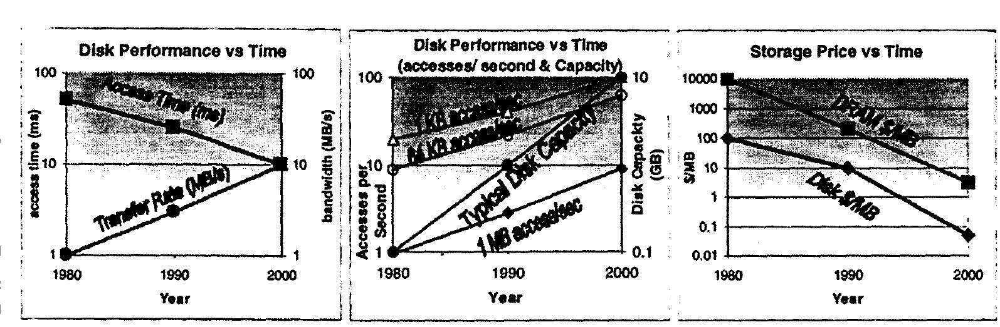
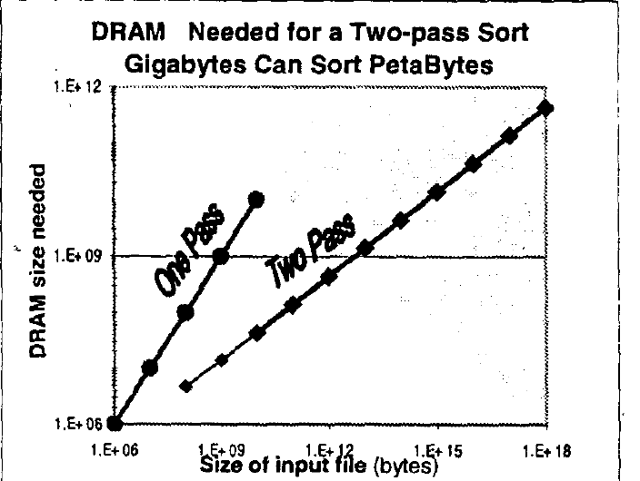
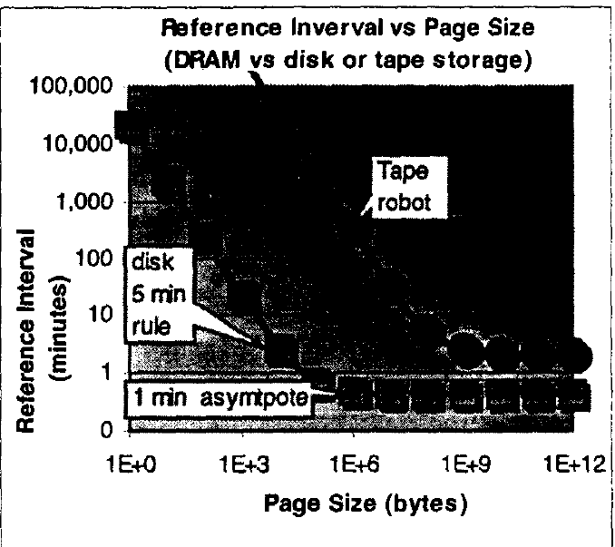
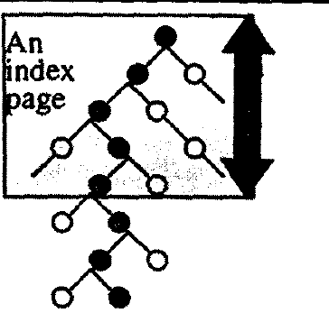
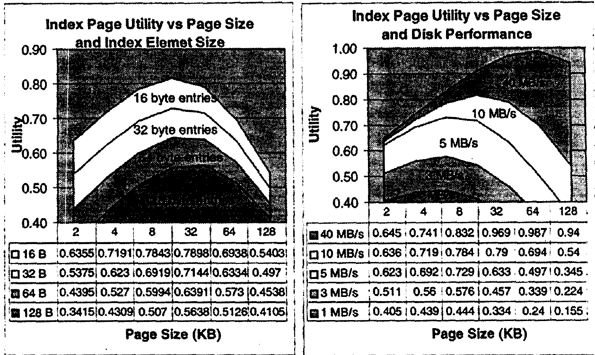

# The Five-Minute Rule Ten Years Later, and Other Computer Storage Rules of Thumb（中文译文）

## 译者说明

本文依据同目录的 `source.pdf` 翻译。章节、图表、公式、算法、代码与参考文献按原文结构保留。

Jim Gray、Goetz Graefe。Microsoft Research，301 Howard St. #830，SF，CA 94105；电子邮箱为 `{Gray, GoetzG}@Microsoft.com`。发表于 *SIGMOD Record* 26(4): 63–68，1997 年 12 月。

## 摘要

简单的经济和性能分析可以推导主存页面适宜的驻留时间以及最优页大小。根本性的权衡取决于 RAM 和磁盘的价格与带宽。按本文写作时的技术条件，分析表明：随机访问的页面适宜保留五分钟；两趟顺序访问的页面适宜保留一分钟；索引页适宜采用 16 KB。这些经验法则会随着技术参数比例的变化而以可预测的方式变化。它们也说明，新的 Kaps、Maps、Scans 以及 每 Kaps 成本、每 Maps 成本、每 TB 扫描成本 指标十分重要。

## 1. 五分钟法则十年后

存储性能的各个方面都在改善，但改善速度各不相同。图 1 大致描绘了磁盘系统性能随时间变化的情况；图注解释了每幅子图。

1986 年，随机访问页面遵循五分钟法则 [1]：如果某页面每五分钟被引用一次，就应该将它保留在内存，而不是每次都从磁盘读取。实际上，当时的盈亏平衡点是 100 秒；这条法则预见了未来技术参数的变化会把平衡点推向五分钟。

五分钟法则基于 RAM 成本与磁盘访问成本之间的权衡。额外内存缓存页面，便可以节省磁盘 I/O。当额外缓存内存的租用成本（每页每秒的美元成本）恰好等于节省的磁盘访问成本（每次磁盘访问每秒的美元成本）时，便达到盈亏平衡点。相应的引用间隔为：

$$
\mathrm{BreakEvenReferenceInterval}\quad (\mathrm{s}) =
\frac{\mathrm{PagesPerMBofRAM}}{\mathrm{AccessesPerSecondPerDisk}}
\times
\frac{\mathrm{PricePerDiskDrive}}{\mathrm{PricePerMBofDRAM}}.\qquad \text{(1)}
$$

磁盘价格还包括机柜和控制器的成本，通常另加 30%。[1] 中的公式更复杂，因为当时未发现折旧期可以约去。最近一次 DELL TPC-C 基准测试 [2] 给出公式 (1) 的参数：

| 参数 | 数值 |
| --- | --- |
| `PagesPerMBofRAM` | 128 页/MB（8 KB 页） |
| `AccessesPerSecondPerDisk` | 64 次访问/秒/磁盘 |
| `PricePerDiskDrive` | 2000 美元/磁盘（9 GB，加控制器） |
| `PricePerMBofDRAM` | 15 美元/MB DRAM |

**图 1：** 磁存储盘的性能随时间变化。前两幅图显示有些指标提高了 10 倍或 100 倍，而第三幅图显示另一些指标同期提高了 10,000 倍。访问时间改善相对有限，价格则下降了 10,000 倍；单元容量和每秒访问次数增长了 100 倍。更高的带宽和更便宜的 DRAM 缓冲区使页面可以更大，这是本文的一条主线。

代入上述数值，公式 (1) 得到 266 秒，约五分钟¹。因此，即使在 1997 年，每五分钟引用一次的数据也应保留在主存中。

同样设备的价格差异很大，但我们考察的各类设备都大致遵循五分钟法则。服务器硬件价格往往是相同部件街价的三倍。DEC Polaris 的 RAM 价格只有 DELL 的一半。近期 Compaq 的 TPC-C 报告中，RAM 价格高三倍（47 美元/MB），磁盘价格高 1.5 倍（3129 美元/盘），因而得到两分钟法则。1997 年 3 月的 SUN+Oracle TPC-C 基准测试 [3] 报价甚至优于 DELL：RAM 为 13 美元/MB，4 GB 磁盘及控制器为 1690 美元。这些系统都接近五分钟法则。大型机的 RAM 为 130 美元/MB，处理能力为 1 万美元/MIPS，磁盘为 1.2 万美元/盘；因此大型机遵循三分钟法则。

可以把公式 (1) 的第一个比率（每 MB RAM 的页数/每盘每秒访问次数）视为技术比率，第二个比率（磁盘价格/每 MB RAM 价格）视为经济比率。从图 1 的趋势线可见，技术比率正在变化。页面大小随着每秒访问次数增大，因此技术比率降低了十倍：从 512/30 = 17 降至 128/64 = 2。磁盘价格降为原来的十分之一，RAM 价格降为原来的二百分之一，因此经济比率增长了十倍：从 20,000/2,000 = 10 增至 2,000/15 = 133。公式 (1) 的引用间隔于是从 170 秒（17×10）变为 266 秒（2×133）。

尽管这些参数发生了 10 倍、100 倍乃至 1000 倍的变化，上述计算显示公式 (1) 的引用间隔几乎未变，仍在 1 至 10 分钟之间。**随机访问页面仍适用五分钟法则。**

原论文 [1] 还提出以 DRAM 换取 CPU 指令的“十字节法则”：当时一条指令的成本相当于十字节。如今 PC 遵循“一字节法则”，小型机遵循“十字节法则”；由于处理器价格过高，大型机则遵循“千字节法则”。

¹ Microsoft SQL Server 6.5 当前采用 2 KB 页面，对应 20 分钟的引用间隔。MS SQL 将在 1998 年版本中改为 8 KB 页面。

### 1.2 顺序数据访问：一分钟顺序法则

迄今讨论的是对小型（8 KB）页面的随机访问。对大页面的顺序访问行为不同。现代磁盘顺序访问时传输速度可达 10 MB/s（图 1a）；这是峰值，下面的分析采用更实际的 5 MB/s。若应用从磁盘随机取 8 KB 页面，磁盘带宽会下降十倍，至 0.5 MB/s。因此，排序、cube 和连接等顺序 I/O 操作有不同的 RAM/磁盘权衡，也就不足为奇。下面将说明，它们遵循“一分钟顺序法则”。

如果顺序操作读取数据后再也不引用，就不必把数据缓存在 RAM 中。这类单趟算法只需要足够的缓冲内存，让数据从磁盘流入主存。通常，两三个单磁道缓冲区（约 100 KB）就够了。对单趟顺序操作，每盘不需要超过 1 MB RAM，即可缓冲磁盘操作并让设备向应用持续输送数据。

许多顺序操作读取大型数据集后，还会再次访问部分数据。数据库连接、cube、rollup 和排序算子都如此。特别考察排序的磁盘访问行为：排序通过顺序访问数据和大块磁盘传输提高磁盘利用率与带宽。它读入输入文件，按排序后的顺序重组记录，再顺序写出结果文件。如果文件放不进主存，第一趟会产生有序游程，第二趟则把这些游程归并成有序文件。哈希连接也具有类似的单趟/两趟行为。

两趟排序所需内存大致由公式 (2) 给出：

$$
\mathrm{MemoryForTwoPassSort}
\approx 6\mathrm{BufferSize}
+\sqrt{3\mathrm{BufferSize}\mathrm{FileSize}}.\qquad \text{(2)}
$$

推导如下：排序第一趟产生约 `File_Size/Memory_Size` 条游程，第二趟可以归并 `Memory_Size/Buffer_Size` 条游程。令两者相等，再求解内存大小，即得到平方根项。常数 3 和 6 取决于具体排序算法。图 2 对从 MB 到 EB 的文件大小绘制了公式 (2)。

排序清楚地展示了内存和磁盘 I/O 之间的权衡。单趟排序只用一半磁盘 I/O，却需要多得多的内存。什么时候应该使用单趟排序？只需把公式 (1) 应用于盈亏平衡的引用间隔。采用上一节的 DEC TPC-C 价格 [2] 与部件参数。若排序使用 64 KB 传输，则每 MB 有 16 页，磁盘每秒执行 80 次访问（约 5 MB/s）：

| 参数 | 数值 |
| --- | --- |
| `PagesPerMBofRAM` | 16 页/MB |
| `AccessesPerSecondPerDisk` | 80 次访问/秒/磁盘 |

这两个参数给出 26 秒的盈亏平衡引用间隔，即 (16/80)×(2000/15)。实际上，排序要先写后读这些页面，I/O 成本翻倍，平衡点就移到 52 秒。考虑到未来带宽更高、RAM 更便宜，我们预测这一数值将缓慢增长。因此，我们建议**一分钟顺序法则**：如果哈希连接、排序、cube 等顺序操作将在一分钟内再次访问数据，就应该使用主存缓存它。

例如，已知单趟排序约以 5 GB/分钟运行 [4]。这类排序使用许多磁盘和大量 RAM，但其 I/O 带宽需求只有两趟排序的一半，因为它仅遍历数据一次。应用一分钟顺序法则，文件小于 5 GB 时适合单趟排序；超过该规模则适合两趟排序。使用 5 GB RAM，两趟排序可以处理 100 TB 数据，覆盖当时所有排序需求。

**图 2：** 使用 5 GB DRAM 缓冲区，两趟排序可以处理 100 TB 文件。两趟排序在游程长度与第二趟待归并游程数之间取得平衡。若生成 1000 条、每条 100 MB 的游程，第二阶段可用 100 MB 归并缓冲区将它们合并，这是一次 100 GB 排序。按当时技术，文件不超过 5 GB 时使用单趟排序；更大文件使用两趟排序。

分组、rollup、cube、哈希连接、索引构建等其他顺序操作也适用类似判断。一般来说，顺序操作应采用高带宽的磁盘传输；如果将在一分钟内重访数据，就应缓存它。

当传输块很大时，顺序访问成本最终退化为带宽成本。公式 (1) 的技术比率变为带宽（以字节/秒计）的倒数乘以每 MB 的字节数：

$$
\begin{aligned}
\mathrm{TechnologyRatio}
&=\frac{\mathrm{PagesPerMB}}{\mathrm{AccessesPerSecond}}\\
&=\frac{10^6/\mathrm{TransferSize}}
{\mathrm{DiskBandwidth}/\mathrm{TransferSize}}
\quad\text{（纯顺序访问）}\\
&=\frac{10^6}{\mathrm{DiskBandwidth}}.\qquad \text{(3)}
\end{aligned}
$$

这是一个有趣的结果，也解释了图 3 中引用间隔随页大小变化的渐近线。按当时的磁盘技术，页面增大时引用间隔渐近趋向 40 秒。

**图 3：** 按当时技术，磁盘相对于 DRAM 的盈亏平衡引用间隔渐近接近一分钟。渐近值是技术比率（最终为 `10^6/带宽`）与经济比率的乘积。后文讨论磁盘和磁带之间的权衡。磁带访问成本极高，因此适合极大的磁带页与极冷的数据。磁带渐近线在 10 GB 时接近（磁带硬件见表 4）。

### 1.4 RAID 与磁带

RAID 0（条带化）把 I/O 分散到各磁盘，从而使传输块变小；除此之外，它不改变上述分析。RAID 1（镜像）略微降低读成本，却使写成本几乎翻倍。RAID 5 可能使写成本增加至四倍；其控制器通常还有溢价。这些因素往往会抬高经济比率（磁盘更贵），也会抬高技术比率（每秒访问次数更少）。总体上，它们倾向于将随机访问的引用间隔提高 2 至 5 倍。

磁带技术的容量进展迅速。当时 Quantum DLTstor™ 是高性能机械手系统的典型产品；表 4 列出其性能。

**表 4：磁带机械手价格与性能（来源：Quantum DLTstor™）。**

| 指标 | Quantum DLT 磁带机械手 |
| --- | ---: |
| 价格 | 9,000 美元 |
| 磁带容量 | 35 GB |
| 磁带数量 | 14 |
| 机械手容量 | 490 GB |
| 装载时间（倒带、卸载、放回、取出、装载、定位） | 30 秒 |
| 传输速率 | 5 MB/s |

随机访问磁带记录，必须先装载磁带、移动到正确位置，再读取。如果下一次访问落在另一盘磁带，还要把当前磁带倒带放回，取出另一盘，扫描到正确位置再读取。这可能需要几分钟；上表中的规格已经宽厚地假设平均仅需 30 秒。

何时应把数据存到磁带，而不是 RAM？应用公式 (1)，8 KB 磁带块的盈亏平衡引用间隔约为两个月：如果两个月内还会访问这个页面，就把它放在 RAM 而不是磁带上。

另一种选择是保存在磁盘上。磁盘相对于磁带的权衡是什么？磁带空间租金便宜十倍，但访问昂贵得多：小块访问贵 10 万倍，大块（1 GB）访问贵五倍。引用间隔正是在较低的磁带空间租金与较高的访问成本之间取得平衡。结果曲线见图 3。

### 1.5 从五分钟法则看检查点策略

缓冲区管理器通常用 LRU 或 Clock2（两轮时钟）算法管理缓冲池。一般在以下情况下刷写页面：①缓存空间发生竞争；②页面已脏了很久，必须建立检查点。检查点间隔通常是五分钟，因而恢复时只需重做最近五到十分钟的日志。

热备和异地灾难恢复系统持续在自己的数据库副本上运行恢复，数秒内即可接管，因此降低了对检查点的需求。在这些容灾系统中，检查点可以非常稀少，几乎所有刷写都由空间竞争引起。

为了对竞争性刷写和淘汰实施 N 分钟法则，缓冲区管理器保存过去 N 分钟内所有被访问页面的名称列表。当某页面再次从磁盘读入时，若其名称在 N 分钟列表中，就赋予它 N 分钟的生命周期，即未来 N 分钟不淘汰它。这个简单算法保证频繁访问的页面留在缓冲池，而不会再次被访问的页面则被积极淘汰。

### 1.6 五分钟法则小结

总之，五分钟法则仍似乎适用于随机访问页面，主要因为页面从 1 KB 增长到 8 KB，补偿了技术比率的变化。对于采用两趟顺序访问的大页面（64 KB），当时适用一分钟法则。

## 2. 索引页应该有多大？

内部索引页的大小决定其读取成本和扇出（`EntriesPerPage`）。为 N 个条目建立索引的 B 树，其高度（以页数计）为：

$$
\mathrm{IndexHeight}\approx
\frac{\log_2 N}{\log_2(\mathrm{EntriesPerPage})}
\quad\text{页。}\qquad \text{(4)}
$$

索引页的效用衡量它让关联搜索向目标数据记录靠近多少，也就是一页里容纳了二叉树的多少层。它是公式 (4) 的分母：

$$
\mathrm{IndexPageUtility}
=\log_2(\mathrm{EntriesPerPage}).\qquad \text{(5)}
$$

例如，若每个索引条目为 20 字节，则装满率 70% 的 2 KB 索引页约有 70 个条目，效用为 6.2，约为 128 KB 索引页效用的一半（见表 6）。读取每个索引页需要一次逻辑磁盘访问，但每页让我们向答案前进 `IndexPageUtility` 步。此项成本收益权衡产生一个最优页大小，平衡每次 I/O 的索引页访问成本与效用。

**图 5：** 索引页的效用是它跨越的二叉树层数。效用随页大小呈对数增长，访问成本则随页大小线性增长。因此，对给定磁盘延迟和传输速率，存在最优索引页大小。图中仅画出搜索路径；若画成平衡树，会过于拥挤。

在平均访问时间（寻道加旋转）为 10 ms、传输速率为 10 MB/s 的磁盘上，读取 2 KB 页占用 10.2 ms 的磁盘设备时间，因此读取成本是 10.2 ms。一般而言，访问索引页的成本，要么是其缓存在主存中的存储成本，要么是其保存在磁盘上的访问成本。若索引根附近的页面缓存在主存中，平均能节省常数次 I/O；若只优化 I/O 子系统，可忽略此常数。索引页的磁盘访问成本为：

$$
\mathrm{IndexPageAccessCost}
=\mathrm{DiskLatency}
+\frac{\mathrm{PageSize}}{\mathrm{DiskTransferRate}}.\qquad \text{(6)}
$$

给定页大小和条目大小时，收益/成本比就是上述两个量的比值：

$$
\frac{\mathrm{IndexPageBenefit}}{\mathrm{Cost}}
=\frac{\mathrm{IndexPageUtility}}
{\mathrm{IndexPageAccessCost}}.\qquad \text{(7)}
$$

表 6 右列针对 20 字节索引条目，列出各页大小对应的计算结果。按这些参数，8 至 32 KB 的页接近最优。

**表 6：** 假设索引条目为 20 字节、各页填充率 70%、延迟 10 ms、传输速率 10 MB/s，索引页效用与收益/成本比的计算。

| 页大小（KB） | 每页条目数/扇出 | 索引页效用 | 索引页访问成本（ms） | 索引页收益/成本（20 B） |
| ---: | ---: | ---: | ---: | ---: |
| 2 | 68 | 6.1 | 10.2 | 0.60 |
| 4 | 135 | 7.1 | 10.4 | 0.68 |
| 8 | 270 | 8.1 | 10.8 | 0.75 |
| 16 | 541 | 9.1 | 11.6 | 0.78 |
| 32 | 1081 | 10.1 | 13.2 | 0.76 |
| 64 | 2163 | 11.1 | 16.4 | 0.68 |
| 128 | 4325 | 12.1 | 22.8 | 0.53 |

图 7 对当时和下一代磁盘的各种条目大小、页大小绘制收益/成本比。图示表明：小页面的效用低，且磁盘读取的固定成本高，所以收益低；大页面的效用只随页大小按对数增长，传输成本却随页大小线性增长，收益同样低。

表 6 和图 7 表明，对于当时的设备，8 至 32 KB 的索引页优于更小或更大的页面。到 2005 年，磁盘传输速率预计将达到 40 MB/s，因此 8 KB 页面届时可能太小。

表 6 和图 7 表明，对于当时的设备，8 至 32 KB 的索引页优于更小或更大的页面。到 2005 年，磁盘传输速率预计将达到 40 MB/s，因此 8 KB 页面届时可能太小。

**图 7：** (a) 左图针对高性能磁盘（延迟 10 ms、传输速率 10 MB/s），展示不同索引条目大小下索引页效用与页大小的关系。(b) 右图固定 16 字节条目，展示磁盘性能如何影响最优页大小。高性能磁盘下，最优索引页大小从 8 KB 增至 64 KB。

## 3. 新的存储指标

这些讨论指出一个有趣现象：基本存储指标正在变化。传统上，磁盘和磁带按容量衡量。当磁盘和磁带容量趋向无限（当时 50 GB 磁盘和 100 GB 磁带处于测试阶段），每 GB 成本趋于零，而每次访问成本成为主导性能指标。

传统性能指标有：

- **GB**：以 GB 为单位的存储容量。
- **每 GB 价格**：设备价格除以容量。
- **Latency（延迟）**：发出 I/O 请求到开始数据传输之间的时间。
- **Bandwidth（带宽）**：设备可持续传输速率。

后两者常被合并为单一的访问时间指标，即从设备随机读取 1 KB 所需时间。另有 **Kaps**：每秒千字节访问次数。

随着设备容量增长，还需要其他指标。传输块越来越大；实际上，对磁带而言，经济上合算的最小传输块可能是 1 MB 对象。应用也越来越多地采用数据流编程，让数据不断流经设备；当时数据挖掘与归档应用是最常见的例子。这提示两个新的存储指标：

- **Maps**：每秒兆字节访问次数。
- **Scan**：顺序读写设备中全部数据需要多久？

把这些指标与设备租金（按三年折旧）结合，就得到价格/性能指标。Scan 指标也可衡量在扫描介质时，占用其中 1 TB 空间的租金。表 8 列出了当时设备的指标。

**表 8：约 1997 年高性能设备的性能指标。**

| 指标 | RAM | 磁盘 | 磁带机械手 |
| --- | ---: | ---: | ---: |
| 单元容量 | 1 GB | 9 GB | 14 × 35 GB |
| 单元价格 | 15,000 美元 | 2,000 美元 | 10,000 美元 |
| 每 GB 价格 | 15,000 美元/GB | 222 美元/GB | 20 美元/GB |
| 延迟 | 0.1 微秒 | 10 毫秒 | 30 秒 |
| 带宽 | 500 MB/s | 5 MB/s | 5 MB/s |
| Kaps | 500,000 | 100 | 0.03 |
| Maps | 500 | 4.8 | 0.03 |
| 扫描时间 | 2 秒 | 30 分钟 | 27 小时 |
| 每 Kaps 成本 | 0.3 纳美元 | 0.2 微美元 | 3 毫美元 |
| 每 Maps 成本 | 0.3 微美元 | 4 微美元 | 3 毫美元 |
| 每 TB 扫描成本 | 0.32 美元 | 4.23 美元 | 296 美元 |

## 4. 总结

过去二十年磁盘访问速度提高十倍，令人印象深刻；但与磁盘单元容量增长百倍、存储成本下降万倍相比，仍相形见绌（图 1）。页面从 512 字节增大十六倍至 8 KB，在一定程度上缓解了这些增长率差异，使五分钟法则对随机访问页面仍然成立。排序等两趟顺序算法使用的页面，则适用一分钟法则。随着技术进步，二级存储容量越来越大。衡量访问速率和每次访问价格的 Kaps、Maps 和 Scans 指标因此愈发重要。

## 5. 致谢

Paul Larson、Dave Lomet、Len Seligman 和 Catharine Van Ingen 帮助我们厘清最优索引页大小的论述。Kaps、Maps 和 Scans 指标源于我们与 Richie Larry 的讨论。

## 6. 参考文献

[1] J. Gray & G. F. Putzolu, "The Five-minute Rule for Trading Memory for Disc Accesses, and the 10 Byte Rule for Trading Memory for CPU Time", *Proceedings of SIGMOD 87*，1987 年 6 月，页 395–398。

[2] Dell-Microsoft TPC-C Executive summary: `http://www.tpc.org/results/individual_results/Dell/dell.6100.es.pdf`。

[3] Sun-Oracle TPC-C Executive summary: `http://www.tpc.org/results/individual_results/Sun/sun.ue6000.oracle.es.pdf`。

[4] Ordinal Corp. `http://www.ordinal.com/`。
