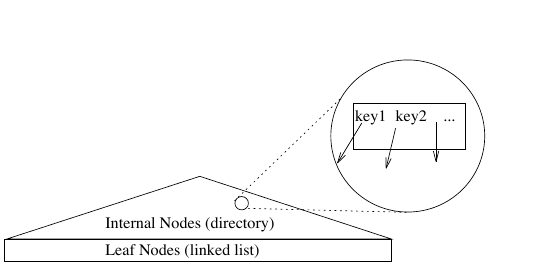
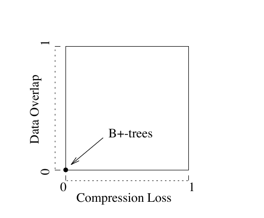
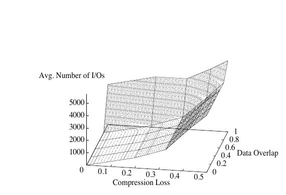

# Generalized Search Trees for Database Systems（中文译文）

## 译者说明

本文依据同目录的 `source.pdf` 翻译。章节、图表、公式、算法、代码与参考文献按原文结构保留。

## 数据库系统的广义搜索树

### （扩展摘要）

| 作者 | 单位 | 联系方式 |
| --- | --- | --- |
| Joseph M. Hellerstein | University of Wisconsin, Madison | jmh@cs.berkeley.edu |
| Jeffrey F. Naughton | University of Wisconsin, Madison | naughton@cs.wisc.edu |
| Avi Pfeffer | University of California, Berkeley | avi@cs.berkeley.edu |

Hellerstein 与 Naughton 的研究得到美国国家科学基金会 IRI-9157357 号资助。

本文发表于第 21 届 VLDB 会议论文集，瑞士苏黎世，1995 年。

## 摘要

本文提出广义搜索树（Generalized Search Tree，GiST），这是一种支持可扩展查询集合与数据类型集合的索引结构。GiST 允许按照自然适合某种新数据类型的查询方式为其建立索引；这不同于此前有关树可扩展性的工作，后者只支持传统的等值谓词和范围谓词。GiST 用一个数据结构提供数据库系统所需的全部基本搜索树逻辑，从而把 B+-树、R-树等彼此不同的结构统一到同一份代码中，并让搜索树能够普遍支持扩展。

为展示 GiST 的灵活性，我们给出几组简单的方法实现，使其分别表现为 B+-树、R-树和 RD-树；RD-树是一种面向集合值属性数据的新索引。我们还给出 RD-树的初步性能分析，并由此讨论树索引的性质，以及它们面对不同数据集时的行为。

## 1. 引言

高效实现搜索树，对任何数据库系统都至关重要。在传统关系系统中，面对通常的字母数字数据类型及其查询，B+-树 [Com79] 已经足够。如今，数据库系统越来越多地用于支持地理信息系统、多媒体系统、CAD 工具、文档库、序列数据库、指纹识别系统、生化数据库等新应用。为了支持不断增长的应用集合，搜索树必须尽可能灵活地扩展。这项要求推动了两条扩展搜索树技术的主要研究路线：

1. **专用搜索树。** 人们已经针对特定问题开发出大量搜索树，其中最著名的包括 R-树 [Gut84] 等空间搜索树。尽管其中一些工作在特定领域产生了重大影响，但开发领域专用搜索树的路线存在问题：实现并维护这些数据结构需要付出很大代价。每当需要支持新应用，就必须从头开发新的树结构，并重新实现通常的搜索、维护、并发控制和恢复功能。
2. **面向可扩展数据类型的搜索树。** 另一条路线不是开发新数据结构，而是扩展 B+-树、R-树等既有数据结构所支持的数据类型 [Sto86]。例如，B+-树可以为任何具有线性序的数据建立索引，并支持其上的等值查询或线性范围查询。这扩展了可被索引的数据，却没有扩展树所能支持的查询集合。无论 B+-树存储何种数据，只有包含等值谓词和线性范围谓词的查询能够从树中获益。同理，在 R-树中，只有包含等值、重叠和包含谓词的查询能够使用树。对于新应用，这种不灵活性会造成严重问题，因为线性序和空间位置上的传统查询不太可能恰好适合新的数据类型。

我们在本文中提出扩展搜索树技术的第三条路线。我们引入一种名为广义搜索树（GiST）的新数据结构，它既容易扩展所能索引的数据类型，也容易扩展所能支持的查询。查询可扩展性尤其重要，因为它允许以支持某类数据自然查询的方式为新数据类型建立索引。GiST 除了为新数据类型提供可扩展性，还统一了当前常见数据类型所使用的、此前互不相同的结构。例如，B+-树和 R-树都可以实现为 GiST 的扩展，从而用同一套代码为多种差异很大的应用建立索引。

GiST 很容易配置：只需向数据库系统注册六个方法，就能使树适应不同用途；这些方法封装了树中键对象类的结构和行为。为展示这种灵活性，我们给出让 GiST 用作 B+-树、R-树和 RD-树的方法实现。GiST 还可适配为其他多种已知搜索树结构，例如部分和树 [WE80]、k-D-B-树 [Rob81]、Ch-树 [KKD89]、EXODUS 大对象 [CDG+90]、hB-树 [LS90]、V-树 [MCD94]、TV-树 [LJF94] 等。为 GiST 实现一组新方法，远比从头实现新的树软件包容易。例如，POSTGRES [Gro94] 和 SHORE [CDF+94] 的 R-树与 B+-树实现各约有 3000 行 C 或 C++ 代码，而我们针对 GiST 的每组方法实现约有 500 行 C 代码。

GiST 不仅提供统一而高度可扩展的数据结构；我们对搜索树的一般化处理，还初步揭示了一个更根本的问题：既然任何数据集都可以用 GiST 建立索引，所得树是否总能提供高效查找？答案是“否”。在讨论中，我们说明了一些可能影响搜索树效率的因素。由此产生一个有趣的问题：对于非标准领域上的查询，如何以及何时能够构建高效搜索树？现在可以通过 GiST 实验进一步探索这个问题。

### 1.1 论文结构

第 2 节中，我们以直观方式说明并概括数据库搜索树的基本性质。第 3 节介绍广义搜索树对象，包括其结构、性质和行为。第 4 节中，我们给出三种不同搜索树的 GiST 实现。第 5 节通过若干性能结果，探索构建有效搜索树所涉及的问题。第 6 节讨论在功能完备的 DBMS 中实现 GiST 时需要考虑的一些细节。第 7 节总结本文工作的意义，并讨论未来研究方向。

### 1.2 相关工作

Knuth [Knu73] 对搜索树做了很好的综述，Comer [Com79] 则更详细地介绍了 B-树及其变体。多维搜索树有很多种，包括 R-树 [Gut84] 及其变体 R*-树 [BKSS90]、R+-树 [SRF87]，也包括四叉树 [FB74]、k-D-B-树 [Rob81] 和 hB-树 [LS90]。多维数据还可通过空间填充曲线转换为一维数据 [Jag90]，随后使用 B+-树为转换后的一维数据建立索引。

可扩展键索引最先在 POSTGRES [Sto86, Aok91] 中提出，也包含在 Illustra [Ill94] 中；二者都有彼此独立的可扩展 B+-树和 R-树实现。这些可扩展索引允许为多种数据类型建立索引，但只支持固定的查询谓词集合。例如，POSTGRES B+-树支持通常的排序谓词 $\lt{},\le,=,\ge,\gt{}$，POSTGRES R-树则只支持 Left、Right、OverLeft、Overlap、OverRight、Right、Contains、Contained 和 Equal 谓词 [Gro94]。

可扩展 R-树实际上已经提供 GiST 功能的很大一个子集。据我们所知，本文首次证明 R-树能够为未映射到空间领域的数据建立索引。不过，可扩展 R-树除了扩展能力有限之外，还缺少 GiST 支持的许多其他特性。R-树只提供一种键谓词 Contains，不允许用户指定下文介绍的 `PickSplit` 和 `Penalty` 算法，也缺少针对线性有序领域数据的优化。尽管存在这些限制，可扩展 R-树与 GiST 已经足够接近，因此能够支持我们在第 5 节介绍的初始方法实现和性能实验。

[FK94] 与 [PSTW93] 分析了 R-树性能。这些工作依赖典型 R-树数据的空间性质，因此不能普遍适用于 GiST。不过，其中类似的思想或许有助于回答我们的问题：在任意领域中，何时以及如何能够构建高效索引？

## 2. 数据库搜索树的要义

作为 GiST 的引介，先以简化方式回顾搜索树会很有帮助。多数有数据库经验的人都对搜索树如何工作有一种直觉认识，所以我们在这里有意只作粗略讨论：目的只是说明，这种认识留下了许多未规定的细节。指出这些细节之后，我们就能描述一种允许用户自行指定它们的结构。



数据库搜索树的典型粗略图景如图 1 所示。它是一棵高扇出的平衡树，内部节点用作目录，叶节点包含指向实际数据的指针，并以链表形式存储，以支持局部扫描或完整扫描。

每个内部节点中都有一系列键和指针。为了搜索匹配查询谓词 $q$ 的元组，从根节点开始。对于节点上的每个指针，如果相关键与 $q$ 一致，即该键没有排除指针下方数据可能匹配 $q$ 的可能性，就遍历该指针下的子树，直至找到全部匹配数据。作为说明，我们用一些熟悉的树结构回顾“一致”的含义。在 B+-树中，查询采用范围谓词形式（例如“找到所有满足 $c_1\le i\le c_2$ 的 $i$”），键在逻辑上划定指针下数据所在的范围。如果查询范围与指针的键范围重叠，二者就是一致的，应当遍历该指针。在 R-树中，查询采用区域谓词形式（例如“找到所有与 $(x_1,y_1,x_2,y_2)$ 重叠的 $i$”），键划定指针下数据所在的边界框。如果查询区域与指针的键框重叠，就遍历该指针。

注意，在上述描述中，键所受的唯一限制是：它必须在逻辑上匹配其下方存储的每项数据，从而保证一致性检查不会遗漏任何有效数据。在 B+-树和 R-树中，键本质上是“包含”谓词：它们描述一个连续区域，指针下方的全部数据都包含在其中。但包含谓词并非唯一可能的键结构。例如，只要相关指针下方存储的每个数据项 $i$ 都满足谓词，`elected_official(i)` $\land$ `has_criminal_record(i)` 就是一个可接受的键。与 R-树一样，同一节点上的键可能“重叠”，即同一元组可能同时满足该节点上的两个键。

这种灵活性使我们能够推广搜索键的概念：搜索键可以是任意谓词，只要该谓词对键下方的每项数据都成立。若数据结构具有这样灵活的搜索键，用户就可以把数据组织到任意的嵌套子类别中，并用某个特征谓词标记每一类，以此构成一棵树。这又让我们能够抓住数据库搜索树的本质：它是数据集分区的层次结构，其中每个分区都有一个对分区内全部数据成立的类别描述。系统可依据这些类别描述，对任意谓词执行搜索。为了支持谓词 $q$ 上的搜索，用户必须提供一个布尔方法，判断 $q$ 是否与给定搜索键一致；若一致，搜索便沿该搜索键关联的指针继续。数据如何分组为不同类别，可由用户提供的节点分裂算法控制；类别如何刻画，则可由用户提供的搜索键控制。因此，只要把键方法和树的分裂方法开放给用户，就能构建支持可扩展查询集合的任意搜索树。这些思想构成 GiST 的基础，下面我们将对其做详细说明。

## 3. 广义搜索树

在本节中，我们介绍抽象数据类型（或“对象”）广义搜索树（GiST）。我们定义它的结构、不变性质、可扩展方法和内置算法。按照约定，我们把每项被索引的数据称为“元组”；在面向对象或对象关系 DBMS 中，每项被索引的数据可以是任意数据对象。

### 3.1 结构

GiST 是一棵可变扇出的平衡树。除根节点外，每个节点的扇出介于 $kM$ 与 $M$ 之间，其中

$$
\frac{2}{M}\le k\le\frac{1}{2}.
$$

根节点的扇出可以介于 2 与 $M$ 之间。常数 $k$ 称为树的最小填充因子。叶节点包含 $(p,\mathrm{ptr})$ 对，其中 $p$ 是用作搜索键的谓词， $\mathrm{ptr}$ 是数据库中某个元组的标识符。非叶节点也包含 $(p,\mathrm{ptr})$ 对，其中 $p$ 是用作搜索键的谓词， $\mathrm{ptr}$ 则是指向另一树节点的指针。

谓词可以包含任意数量的自由变量，只要树叶所引用的任一单独元组都能实例化全部变量。注意，利用“键压缩”，给定谓词 $p$ 甚至可以只占零字节存储空间。不过，为便于说明，我们假定树中各条目的大小一致；第 6 节再讨论可变长度条目。我们还假定，在实现中，给定条目 $E=(p,\mathrm{ptr})$，可以访问 $E$ 当前所在的节点。这对实现下文所述的键方法会有帮助。

### 3.2 性质

GiST 始终保持以下不变性质：

1. 除根节点外，每个节点都包含 $kM$ 到 $M$ 个索引条目。
2. 对于叶节点中的每个索引条目 $(p,\mathrm{ptr})$，用所指元组的值实例化 $p$ 时， $p$ 为真；也就是说，该元组满足 $p$。
3. 对于非叶节点中的每个索引条目 $(p,\mathrm{ptr})$，用从 $\mathrm{ptr}$ 可达的任意元组之值实例化 $p$ 时， $p$ 为真。注意，与 R-树不同，对于从 $\mathrm{ptr}$ 可达的某个条目 $(p',\mathrm{ptr}')$，我们不要求 $p'\rightarrow p$；只要求对从 $\mathrm{ptr}'$ 可达的全部元组， $p$ 和 $p'$ 都成立。
4. 除非根节点本身就是叶节点，否则根至少有两个子节点。
5. 所有叶节点都处在同一层。

性质 3 尤其值得关注。R-树要求 $p'\rightarrow p$，因为 R-树的边界框构成包含层次。然而，这种做法施加了不必要的限制：节点 $N$ 上方各键的谓词必须对 $N$ 下方的数据成立，所以 $N$ 上的键没有必要以更精细的形式重新陈述这些谓词。相反，人们可以让 $N$ 上的键依据某种完全正交的分类来刻画其下方的数据集合。这可能同时改善键的信息含量和键的大小。

### 3.3 键方法

原则上，GiST 的键可以是任意谓词。实践中，键来自用户实现的对象类，该类提供 GiST 所要求的一组特定方法。键结构的例子包括：对来自 $\mathbb{Z}$ 的数据使用整数范围（如 B+-树），对 $\mathbb{R}^n$ 中的区域使用边界框（如 R-树），以及对集合值数据使用边界集合，即来自 $\mathcal{P}(\mathbb{Z})$ 的数据（如第 4.3 节介绍的 RD-树）。用户可以重新定义键类，但 GiST 要求它提供以下六个方法：

**`Consistent(E,q)`：** 给定条目 $E=(p,\mathrm{ptr})$ 和查询谓词 $q$，如果能够保证 $p\land q$ 不可满足，则返回 `false`，否则返回 `true`。这里不要求精确判定可满足性：`Consistent` 错误地返回 `true` 不会影响树算法的正确性。此类错误只会带来性能代价，因为搜索期间可能因此探索无关子树。

**`Union(P)`：** 给定条目集合

$$
P=\lbrace{}(p _ 1,\mathrm{ptr} _ 1),\ldots,(p _ n,\mathrm{ptr} _ n)\rbrace{},
$$

返回某个谓词 $r$，该谓词对 $\mathrm{ptr} _ 1$ 至 $\mathrm{ptr} _ n$ 下方存储的全部元组成立。可以通过寻找满足下式的 $r$ 来完成：

$$
(p _ 1\lor\cdots\lor p _ n)\rightarrow r.
$$

**`Compress(E)`：** 给定条目 $E=(p,\mathrm{ptr})$，返回条目 $(\pi,\mathrm{ptr})$，其中 $\pi$ 是 $p$ 的压缩表示。

**`Decompress(E)`：** 给定压缩表示 $E=(\pi,\mathrm{ptr})$，其中 $\pi=\mathrm{Compress}(p)$，返回满足 $p\rightarrow r$ 的条目 $(r,\mathrm{ptr})$。这种压缩可能是“有损”的，因为我们不要求 $p\leftrightarrow r$。

**`Penalty(E_1,E_2)`：** 给定条目 $E _ 1=(p _ 1,\mathrm{ptr} _ 1)$ 与 $E _ 2=(p _ 2,\mathrm{ptr} _ 2)$，返回把 $E _ 2$ 插入以 $E _ 1$ 为根的子树所产生的、由领域决定的代价。`Split` 和 `Insert` 算法（见下文）用它辅助决策。通常，这个代价指标表示从 $E _ 1.p _ 1$ 到 $\mathrm{Union}(\lbrace{}E _ 1,E _ 2\rbrace{})$ 的大小增量。例如，对来自 $\mathbb{R}^2$ 的键，可以把 `Penalty` 定义为

$$
\mathrm{area}(\mathrm{Union}(\lbrace{}E _ 1,E _ 2\rbrace{}))-\mathrm{area}(E _ 1.p _ 1)
$$

[Gut84]。

**`PickSplit(P)`：** 给定含 $M+1$ 个 $(p,\mathrm{ptr})$ 条目的集合 $P$，把 $P$ 分成两个条目集合 $P _ 1,P _ 2$，每个集合的大小都至少为 $kM$。树的最小填充因子在这里得到控制。通常希望以某种方式分裂，使一个类似多路 `Penalty` 的劣化指标最小，但具体办法留给用户决定。

以上就是 GiST 用户需要提供的全部方法。注意，`Consistent`、`Union`、`Compress` 和 `Penalty` 必须能够处理其输入中的任何谓词。在完全一般的情形下，这可能极其困难，对 `Consistent` 尤其如此；但任一棵树通常只使用有限的谓词集合，方法实现可以对该集合施加约束。

键压缩有多种选择。简单实现可以让 `Compress` 和 `Decompress` 都采用恒等函数。更复杂的实现可以让 `Compress((p,ptr))` 生成一个有效但更紧凑的谓词 $r$，其中 $p\rightarrow r$，并让 `Decompress` 使用恒等函数。例如，SHORE 的 R-树就采用这种技术：插入多边形时，把它压缩成自身也是合法多边形的边界框。前缀 B+-树 [Com79] 也使用这种技术，将分裂键截断为初始子串。更复杂的实现还可以同时为 `Compress` 和 `Decompress` 使用复杂方法。

### 3.4 树方法

上一节的键方法必须由键类设计者提供。本节的树方法由 GiST 提供，并可调用所需的键方法。注意，键放入节点时会被 `Compress`，从节点读出时会被 `Decompress`。我们把这些操作视为隐式步骤，并在下文描述各方法时不再逐一说明。

#### 3.4.1 搜索

搜索有两种形式。本节给出的第一种方法可对任意数据集使用任意查询谓词；它按需遍历足够多的树，以满足查询。这是最通用的搜索技术，与 R-树的搜索类似。下一节介绍对线性序查询更高效的技术。

### 算法：`Search(R,q)`

```text
输入：以 R 为根的 GiST，谓词 q
输出：满足 q 的全部元组
概要：递归下降树中所有其键与 q 一致的路径。

S1 [搜索子树]
   若 R 不是叶节点，检查 R 上的每个条目 E，判断 Consistent(E,q)。
   对所有一致的条目，在 E.ptr 所引用的根节点上递归调用 Search。

S2 [搜索叶节点]
   若 R 是叶节点，检查 R 上的每个条目 E，判断 Consistent(E,q)。
   若 E 一致，它就是符合条件的条目。
   此时可以取出 E.ptr，精确检查 q；也可以把这项检查留给调用进程。
```

查询谓词 $q$ 可以是精确匹配（等值）谓词，也可以是由许多值满足的谓词。后一类包括 B+-树或 R-树中的“范围”或“窗口”谓词，也包括并非基于连续区域的更一般谓词，例如“找到 $\lbrace{}6,7,68\rbrace{}$ 的全部超集”这样的集合包含谓词。

#### 3.4.2 线性有序领域中的搜索

若被索引领域具有线性序，而查询通常是等值谓词或范围包含谓词，就可以使用本节定义的 `FindMin` 和 `Next` 方法进行更高效的搜索。为启用该选项，用户在创建树时必须额外完成以下工作：

1. 把 `IsOrdered` 标志设为 `true`。`IsOrdered` 是创建树时设置的静态属性，默认值为 `false`。
2. 额外注册 `Compare(E_1,E_2)` 方法。给定条目 $E _ 1=(p _ 1,\mathrm{ptr} _ 1)$ 与 $E _ 2=(p _ 2,\mathrm{ptr} _ 2)$，`Compare` 报告 $p _ 1$ 位于 $p _ 2$ 之前、位于 $p _ 2$ 之后，还是二者在顺序上等价。`Compare` 用于在每个节点内按顺序插入条目。
3. `PickSplit` 方法必须保证：对于 $P_1$ 上的任意条目 $E_1$ 与 $P_2$ 上的任意条目 $E_2$，`Compare(E_1,E_2)` 都报告“位于之前”。
4. 各方法必须保证同一节点上没有两个键重叠；也就是说，对节点上任意一对条目 $E_1,E_2$，都有 `Consistent(E_1,E_2.p) = false`。

完成这四步后，等值查询和范围包含查询可以通过调用 `FindMin` 并反复调用 `Next` 来求值，其他查询谓词仍可用通用 `Search` 方法求值。`FindMin`/`Next` 比用 `Search` 遍历树更高效，因为它们只访问一条根到叶路径上的非叶节点。这项技术来自 B+-树中典型的范围查找。

### 算法：`FindMin(R,q)`

```text
输入：以 R 为根的 GiST，谓词 q
输出：线性序中满足 q 的最小元组
概要：沿其键与 q 一致的最左分支下降。
      到达叶节点后，返回第一个与 q 一致的键。

FM1 [搜索子树]
    若 R 不是叶节点，按顺序找到第一个满足 Consistent(E,q) 的条目 E。
    若能找到 E，就在 E.ptr 所引用的根节点上调用 FindMin。
    若找不到，返回 NULL。

FM2 [搜索叶节点]
    若 R 是叶节点，找到 R 上第一个满足 Consistent(E,q) 的条目 E，并返回 E。
    若不存在这样的条目，返回 NULL。
```

**脚注 1：** 相应条目可以通过在节点条目上做二分搜索找到。第 6 节进一步讨论节点内搜索优化。

给定一个满足谓词 $q$ 的元素 $E$，`Next` 方法返回下一个满足 $q$ 的已有元素；若不存在，则返回 `NULL`。`Next` 足够一般，也能在树的非叶层找到下一条目，这会在第 4 节派上用场。不过，就搜索而言，只会对叶条目调用 `Next`。

### 算法：`Next(R,q,E)`

```text
输入：以 R 为根的 GiST，谓词 q，当前条目 E
输出：线性序中下一个满足 q 的条目
概要：若树中同一层的下一条目满足 q，则返回它；否则返回 NULL。

N1 [节点内的下一条目]
   若 E 不是所在节点最右侧的条目，且 N 是顺序上紧邻 E 右侧的条目，
   并且 Consistent(N,q)，则返回 N；若 ¬Consistent(N,q)，则返回 NULL。

N2 [相邻节点上的下一条目]
   若 E 是所在节点最右侧的条目，令 P 为树中同一层紧邻 R 右侧的节点
   （可以通过遍历树找到；如果树有横向指针，也可以借助它找到 [LY81]）。
   若 P 不存在，返回 NULL。否则令 N 为 P 上最左侧的条目。
   若 Consistent(N,q)，返回 N；否则返回 NULL。
```

#### 3.4.3 插入

插入例程保证 GiST 维持平衡。它们与 R-树的插入例程非常相似，而 R-树的插入例程又推广了 B+-树较简单的插入例程。插入操作允许指定插入层级，使后续方法可以用 `Insert` 重新插入树内部节点的条目。我们假定层号随树向上递增，叶节点位于第 0 层。因此，向树中加入新条目时使用 $l=0$。

### 算法：`Insert(R,E,l)`

```text
输入：以 R 为根的 GiST，条目 E=(p,ptr)，以及层级 l；
      对从 ptr 可达的全部元组，谓词 p 都成立
输出：在第 l 层插入 E 后得到的新 GiST
概要：找到 E 应放置的位置并加入；如果空间不足，就执行分裂。

I1 [调用 ChooseSubtree 寻找 E 应放置的位置]
   令 L = ChooseSubtree(R,E,l)。

I2
   若 L 上有空间容纳 E，就把 E 安装到 L 上
   （若 IsOrdered 为真，则按 Compare 给出的顺序安装）。
   否则调用 Split(R,L,E)。

I3 [向上传播变化]
   调用 AdjustKeys(R,L)。
```

`ChooseSubtree` 可以寻找树中任意层上最适合插入的节点。当 `IsOrdered` 属性成立时，必须谨慎编写 `Penalty` 方法，确保 `ChooseSubtree` 按顺序到达正确叶节点。第 4.1 节给出一种实现示例。

### 算法：`ChooseSubtree(R,E,l)`

```text
输入：以 R 为根的子树，条目 E=(p,ptr)，层级 l
输出：第 l 层上最适合容纳特征谓词 E.p 的条目的节点
概要：递归下降树，并使 Penalty 最小。

CS1
    若 R 位于第 l 层，返回 R。

CS2
    否则，在 R 上全部条目 F=(q,ptr') 中，找到使 Penalty(F,E) 最小者。
    返回 ChooseSubtree(F.ptr',E,l)。
```

`Split` 算法调用用户定义的 `PickSplit` 方法，决定如何划分节点中的元素以及要插入树的新元组。元素被分成两组后，`Split` 为其中一组生成新节点，把它插入树中，并更新新节点上方的键。

### 算法：`Split(R,N,E)`

```text
输入：包含节点 N 的 GiST R，以及新条目 E=(p,ptr)
输出：把 N 分为两个节点并插入 E 后的 GiST
概要：依据 PickSplit，把 N 的键连同 E 分成两组。
      把其中一组放入新节点，再把新节点插入 N 的父节点。

SP1
    对 N 的元素与 {E} 的并集调用 PickSplit。
    把两个分区之一放在节点 N 上，把另一个分区放在新节点 N' 上。

SP2 [在父节点中插入 N' 的条目]
    令 E_N'=(q,ptr')，其中 q 是 N' 上全部条目的 Union，
    ptr' 是指向 N' 的指针。
    若 Parent(N) 上有空间容纳 E_N'，就把 E_N' 安装到 Parent(N)
    （若 IsOrdered 为真，则按顺序安装）。
    否则调用 Split(R,Parent(N),E_N')。

SP3
    修改指向 N 的条目 F，使 F.p 成为 N 上全部条目的 Union。
```

**脚注 2：** 我们在这里有意不规定用何种技术寻找节点的 `Parent`，因为该实现会与第 6 节讨论的并发控制问题相互作用。取决于所采用的技术，可以通过指针、栈或重新遍历树来找到 `Parent`。

`Split` 的 SP3 步修改父节点，以反映 $N$ 中的变化。`Insert` 算法的 I3 步把这些变化继续向树上方传播，同时也传播插入 $N'$ 所产生的变化。

`AdjustKeys` 算法保证一组谓词上方的键对下方元组成立即为真，并且具有适当的精确度。

### 算法：`AdjustKeys(R,N)`

```text
输入：以 R 为根的 GiST，树节点 N
输出：N 的祖先包含正确且足够具体的键之后的 GiST
概要：从 N 沿父节点向上，使谓词准确刻画各子树。
      越过根之后停止；若发现某个谓词已经准确，也停止。

PR1
    若 N 是根，或者指向 N 的条目已经准确表示 N 上全部条目的 Union，
    则返回。

PR2
    否则，修改指向 N 的条目 E，使 E.p 成为 N 上全部条目的 Union。
    然后调用 AdjustKeys(R,Parent(N))。
```

当 `IsOrdered = true` 时，`AdjustKeys` 通常无需做任何工作，因为在这样的领域中，各节点上的谓词通常把整个领域划分为若干范围，简单插入或删除不需要修改它们。`AdjustKeys` 例程在 PR1 步检测这种情况，避免继续对更高层节点调用 `AdjustKeys`。如果愿意，对此类领域可以完全绕过 `AdjustKeys`。

#### 3.4.4 删除

删除算法维持树的平衡，并尽量让键保持具体。当键具有线性序时，它们使用 B+-树风格的“借用或合并”技术；否则使用 R-树风格的重新插入技术。受篇幅限制，本文省略删除算法；[HNP95] 给出了完整算法。

## 4. GiST 的三种应用

在本节中，我们简要介绍三种键类的实现，它们分别让 GiST 表现为 B+-树、R-树和 RD-树。RD-树是一种面向集合值数据、类似 R-树的新索引。

### 4.1 $\mathbb{Z}$ 上的 GiST（B+-树）

在本例中，我们为整数数据建立索引。压缩之前，树中的每个键都是一对整数，表示该键下方所包含的区间。具体而言，键 $\langle a,b\rangle$ 表示含自由变量 $v$ 的谓词 $\mathrm{Contains}([a,b),v)$。

我们在该键类中支持的查询谓词是 `Contains(interval,v)` 和 `Equal(number,v)`。`Contains` 查询中的区间可以在任一端闭合或开放。整数区间的边界可以轻易在闭、开形式之间转换，所以不失一般性，我们在下文假设所有区间都是左闭右开。

`Contains` 与 `Equal` 查询谓词实现如下：

- **`Contains([x,y),v)`：** 若 $x\le v\lt{}y$，返回 `true`；否则返回 `false`。
- **`Equal(x,v)`：** 若 $x=v$，返回 `true`；否则返回 `false`。

GiST 方法实现如下：

**`Consistent(E,q)`：** 给定条目 $E=(p,\mathrm{ptr})$ 和查询谓词 $q$，我们知道 $p=\mathrm{Contains}([x _ p,y _ p),v)$，而 $q$ 为 $\mathrm{Contains}([x _ q,y _ q),v)$ 或 $\mathrm{Equal}(x _ q,v)$。第一种情况下，若

$$
(x _ p\lt{}y _ q)\land(y _ p\gt{}x _ q)
$$

则返回 `true`，否则返回 `false`。第二种情况下，若 $x _ p\le x _ q\lt{}y _ p$，则返回 `true`，否则返回 `false`。

**`Union({E_1,\ldots,E_n})`：** 给定

$$
E _ 1=([x _ 1,y _ 1),\mathrm{ptr} _ 1),\ldots,E _ n=([x _ n,y _ n),\mathrm{ptr} _ n),
$$

返回

$$
[\min(x _ 1,\ldots,x _ n),\max(y _ 1,\ldots,y _ n)).
$$

**`Compress(E=([x,y),ptr))`：** 若 $E$ 是非叶节点上最左侧的键，返回零字节对象；否则返回 $x$。

**`Decompress(E=(\pi,ptr))`：** 我们必须构造区间 $[x,y)$。若 $E$ 是非叶节点上最左侧的键，令 $x=-\infty$；否则令 $x=\pi$。若 $E$ 是非叶节点上最右侧的键，令 $y=+\infty$。若 $E$ 是非叶节点上的其他键，令 $y$ 为下一键中存储的值（通过 `Next` 方法找到）。若 $E$ 位于叶节点，令 $y=x+1$。返回 $([x,y),\mathrm{ptr})$。

**`Penalty(E,F)`：** 给定 $E=([x _ 1,y _ 1),\mathrm{ptr} _ 1)$ 和 $F=([x _ 2,y _ 2),\mathrm{ptr} _ 2)$。若 $E$ 是所在节点最左侧的指针，返回 $\max(y _ 2-y _ 1,0)$；若 $E$ 是所在节点最右侧的指针，返回 $\max(x _ 1-x _ 2,0)$；否则返回

$$
\max(y _ 2-y _ 1,0)+\max(x _ 1-x _ 2,0).
$$

**`PickSplit(P)`：** 按顺序把前 $\lfloor |P|/2\rfloor$ 个条目放入左组，把后 $\lceil |P|/2\rceil$ 个条目放入右组。注意，这保证最小填充因子为 $M/2$。

针对有序键，还要补充：

- **`IsOrdered = true`。**
- **`Compare(E_1,E_2)`：** 给定 $E _ 1=(p _ 1,\mathrm{ptr} _ 1)$ 与 $E _ 2=(p _ 2,\mathrm{ptr} _ 2)$，其中 $p _ 1=[x _ 1,y _ 1)$、 $p _ 2=[x _ 2,y _ 2)$。若 $x _ 1\lt{}x _ 2$，返回“位于之前”；若 $x _ 1=x _ 2$，返回“等价”；若 $x _ 1\gt{}x _ 2$，返回“位于之后”。

这组方法有若干值得注意的特征。首先，`Compress` 和 `Decompress` 方法会产生 B+-树常见的“分裂键”： $n$ 个指针对应 $n-1$ 个存储键，节点最左和最右边界不予指定，即分别为 $-\infty$ 与 $+\infty$。尽管 GiST 使用键/指针对而非分裂键，这个 GiST 在键上占用的空间并不多于传统 B+-树，因为它把每个节点的第一个指针所对应的键压缩为零字节。

其次，`Penalty` 方法让 GiST 能选择正确插入点。把新键值 $k$ 插入（即并入 `Union`）区间 $[x,y)$ 时，只有当 $k$ 尚未包含在该区间内，`Penalty` 才为正。因此，在 CS2 步，`ChooseSubtree` 会把新数据放到恰当位置：节点上的各键集合划分整个领域，所以为使 `Penalty` 最小，`ChooseSubtree` 会选择已经包含 $k$ 的那个分区。

最后还可以看到，支持更复杂的谓词也相当容易，例如查询谓词中的区间析取，或键谓词中的带排序区间，以支持高效采样 [WE80]。

### 4.2 $\mathbb{R}^2$ 中多边形上的 GiST（R-树）

在本例中，我们的数据是笛卡尔平面上的二维多边形。压缩之前，树中的键是实数四元组，表示二维多边形直线边界框的左上角和右下角。键 $(x _ {ul},y _ {ul},x _ {lr},y _ {lr})$ 表示谓词

$$
\mathrm{Contains}((x _ {ul},y _ {ul},x _ {lr},y _ {lr}),v),
$$

其中 $(x _ {ul},y _ {ul})$ 是边界框左上角， $(x _ {lr},y _ {lr})$ 是右下角， $v$ 是自由变量。我们在该键类中支持 `Contains(box,v)`、`Overlap(box,v)` 和 `Equal(box,v)` 查询谓词，其中 `box` 是上述四元组。

查询谓词实现如下：

**`Contains`：** 对两个框

$$
B _ 1=(x^1 _ {ul},y^1 _ {ul},x^1 _ {lr},y^1 _ {lr}),\qquad
B _ 2=(x^2 _ {ul},y^2 _ {ul},x^2 _ {lr},y^2 _ {lr}),
$$

若

$$
(x^1 _ {lr}\ge x^2 _ {lr})\land
(x^1 _ {ul}\le x^2 _ {ul})\land
(y^1 _ {lr}\le y^2 _ {lr})\land
(y^1 _ {ul}\ge y^2 _ {ul}),
$$

则 `Contains(B_1,B_2)` 返回 `true`，否则返回 `false`。

**`Overlap`：** 对上述两个框，若

$$
(x^1 _ {ul}\le x^2 _ {lr})\land
(x^2 _ {ul}\le x^1 _ {lr})\land
(y^1 _ {lr}\le y^2 _ {ul})\land
(y^2 _ {lr}\le y^1 _ {ul}),
$$

则 `Overlap(B_1,B_2)` 返回 `true`，否则返回 `false`。

**`Equal`：** 对上述两个框，若

$$
(x^1 _ {ul}=x^2 _ {ul})\land
(y^1 _ {ul}=y^2 _ {ul})\land
(x^1 _ {lr}=x^2 _ {lr})\land
(y^1 _ {lr}=y^2 _ {lr}),
$$

则 `Equal(B_1,B_2)` 返回 `true`，否则返回 `false`。

GiST 方法实现如下：

**`Consistent(E,q)`：** 给定条目 $E=(p,\mathrm{ptr})$，我们知道

$$
p=\mathrm{Contains}((x^1 _ {ul},y^1 _ {ul},x^1 _ {lr},y^1 _ {lr}),v),
$$

且 $q$ 是以 $(x^2 _ {ul},y^2 _ {ul},x^2 _ {lr},y^2 _ {lr})$ 为参数的 `Contains`、`Overlap` 或 `Equal`。对于这三种查询，只要两个框满足 `Overlap`，就返回 `true`；否则返回 `false`。

**`Union({E_1,\ldots,E_n})`：** 对 $E _ i=((x^i _ {ul},y^i _ {ul},x^i _ {lr},y^i _ {lr}),\mathrm{ptr} _ i)$，返回

$$
\left(
\min _ i x^i _ {ul},
\max _ i y^i _ {ul},
\max _ i x^i _ {lr},
\min _ i y^i _ {lr}
\right).
$$

**`Compress(E=(p,ptr))`：** 构造多边形 $p$ 的边界框。也就是说，若多边形以线段集合 $l _ i=(x^i _ 1,y^i _ 1,x^i _ 2,y^i _ 2)$ 存储，则构造

$$
\pi=
\left(
\min _ i x^i _ {ul},
\max _ i y^i _ {ul},
\max _ i x^i _ {lr},
\min _ i y^i _ {lr}
\right),
$$

并返回 $(\pi,\mathrm{ptr})$。

**`Decompress(E=((x_{ul},y_{ul},x_{lr},y_{lr}),ptr))`：** 使用恒等函数，即返回 $E$。

**`Penalty(E_1,E_2)`：** 给定 $E _ 1=(p _ 1,\mathrm{ptr} _ 1)$ 与 $E _ 2=(p _ 2,\mathrm{ptr} _ 2)$，计算 $q=\mathrm{Union}(\lbrace{}E _ 1,E _ 2\rbrace{})$，返回

$$
\mathrm{area}(q)-\mathrm{area}(E _ 1.p).
$$

这个“面积变化”指标由 Guttman [Gut84] 提出。

**`PickSplit(P)`：** 已经有多种 R-树分裂算法。因此，我们在这里的讨论中省略该方法的实现，并请感兴趣的读者参阅 [Gut84] 和 [BKSS90]。

以上实现结合前面各节介绍的 GiST 算法，会产生与 Guttman R-树完全相同的行为。人们还提出过一系列 R-树变体，其中尤其值得注意的是 R*-树 [BKSS90] 和 R+-树 [SRF87]。

R*-树与基本 R-树有三处不同：它的 `PickSplit` 算法包含若干小修改；它的 `ChooseSubtree` 算法略有变化；它在节点分裂期间还会重新插入若干键。用 GiST 实现 R*-树并不困难：可以把 R*-树的 `PickSplit` 算法实现为 GiST 的 `PickSplit` 方法；可以通过谨慎实现 `Penalty` 方法来引入对 `ChooseSubtree` 的修改；还可以轻易把 R*-树的重新插入策略加入 GiST 的内置树方法（见第 7 节）。

另一方面，GiST 无法模仿 R+-树。这是因为 R+-树会把数据条目的重复副本放入多个叶节点，从而违反 GiST 的原则：搜索树应当是数据分区的层次结构。

同样可以看到，支持更复杂的谓词并不困难。这包括为 B+-树提到的析取查询与带排序键的 $n$ 维类比，也包括 Papadias 等人 [PTSE95] 的拓扑关系。其他例子还包括常见重叠查询或排序查询的任意变体，例如“找到与这个框重叠超过 30% 的全部多边形”，或“找到与 12 点到 1 点钟方向重叠的全部多边形”。对于给定点 $p$，后一查询返回由两条从 $p$ 出发、在极坐标中分别呈 $90^\circ$ 与 $60^\circ$ 的射线所界定区域内的全部多边形。注意，该无限区域无法定义为由线段构成的多边形，所以不能用典型 R-树谓词表达此查询。

### 4.3 $\mathcal{P}(\mathbb{Z})$ 上的 GiST（RD-树）

在前两节中，我们证明了 GiST 可以提供两种已知数据结构——B+-树与 R-树——的功能。在本节中，我们证明 GiST 还能支持一种为集合值数据建立索引的新搜索树。

如何处理集合值数据正日益受到面向对象数据库社区的关注 [KG94]，即使对传统关系数据库应用，这种数据也十分自然。例如，一所大学的数据库可能包含学生表，每个学生都有一个 `courses_passed` 属性，其类型为 `setof(integer)`。人们会希望高效支持包含查询，例如“找到已通过先修课程集合 $\lbrace{}101,121,150\rbrace{}$ 中全部课程的所有学生”。

我们在 GiST 中用集合作为包含键来处理该问题，方式与 R-树用边界框作为包含键类似。我们把所得结构称为 RD-树，即“俄罗斯套娃”（Russian Doll）树。RD-树的键是整数集合；它之所以得名，是因为沿树的某个分支向下遍历时，每个键都包含该分支中位于其下方的键。下面我们给出 RD-树的 GiST 方法实现。

压缩之前，我们的 RD-树中的键是整数集合。键 $S$ 表示集合值自由变量 $v$ 上的谓词 $\mathrm{Contains}(S,v)$。RD-树允许的查询谓词是 `Contains(set,v)`、`Overlap(set,v)` 和 `Equal(set,v)`。

查询谓词的实现很直接：

- **`Contains(S,T)`：** 若 $T\subseteq S$，返回 `true`；否则返回 `false`。
- **`Overlap(S,T)`：** 若 $S\cap T\ne\varnothing$，返回 `true`；否则返回 `false`。
- **`Equal(S,T)`：** 若 $S=T$，返回 `true`；否则返回 `false`。

GiST 方法实现如下：

**`Consistent(E,q)`：** 给定我们的键和谓词，我们知道 $E=(p,\mathrm{ptr})$ 中 $p=\mathrm{Contains}(S,v)$，而 $q$ 为 $\mathrm{Contains}(T,v)$、 $\mathrm{Overlap}(T,v)$ 或 $\mathrm{Equal}(T,v)$。对于这三种查询，只要 `Overlap(S,T)`，就返回 `true`；否则返回 `false`。

**`Union({E_1,\ldots,E_n})`：** 给定 $E _ i=(S _ i,\mathrm{ptr} _ i)$，返回

$$
S _ 1\cup\cdots\cup S _ n.
$$

**`Compress(E=(S,ptr))`：** [HP94] 给出了多种集合压缩技术，我们在这里简述其中一种。先将 $S$ 的元素排序，再把它转换为 $n$ 个互不相交的区间所构成的集合

$$
\lbrace{}[l _ 1,h _ 1],[l _ 2,h _ 2],\ldots,[l _ n,h _ n]\rbrace{},
$$

其中 $l _ i\le h _ i$ 且 $h _ i\lt{}l _ {i+1}$。转换使用以下算法：

```text
初始化：把每个元素 a_m ∈ S 看作区间 [a_m,a_m]。
while（剩余区间数超过 n）{
    找到间隔最小的一对相邻区间；
    将这一对合并成一个区间；
}
```

所得结构称为区间集（rangeset）。可以证明，该算法产生含 $n$ 项的区间集，并且加入其中但不属于 $S$ 的元素数量最少 [HP94]。

**`Decompress(E=(rangeset,ptr))`：** 枚举各区间中的元素，就可以轻易把区间集转换回集合。

**`Penalty(E_1,E_2)`：** 给定 $E _ 1=(S _ 1,\mathrm{ptr} _ 1)$ 与 $E _ 2=(S _ 2,\mathrm{ptr} _ 2)$，返回

$$
|E _ 1.S _ 1\cup E _ 2.S _ 2|-|E _ 1.S _ 1|.
$$

另一种做法是返回加权基数的变化，其中 $\mathbb{Z}$ 的每个元素都有一个权重， $|S|$ 表示 $S$ 中各元素的权重之和。

**`PickSplit(P)`：** Guttman 为 R-树分裂提出的二次算法可自然用于这里；细节参见 [Gut84]。

这个 GiST 支持通常的 R-树查询谓词，采用包含键，并用传统 R-树算法实现 `PickSplit`。因此，我们得以在 Illustra 的可扩展 R-树中实现这些方法，并获得与 GiST 完全相同的行为。这个练习让我们了解了实现一个 GiST 类的复杂度（约 500 行 C 代码），也使我们能够开展下一节介绍的性能研究。使用 R-树确实限制了我们选择谓词、分裂算法和代价算法的自由；当我们使用 GiST 构建 RD-树时，这些选择值得进一步探索。

## 5. GiST 性能问题

在 B+-树这类键互不重叠的平衡树中，需要检查的最大节点数（因而也是 I/O 数）很容易界定：对于无重复数据上的点查询，该数目就是树高，即包含 $n$ 个元组的数据库上的 $O(\log n)$。但是，如果节点上的键可以重叠——R-树或 GiST 就是如此——则无法保证这个上界，因为重叠键可能导致搜索沿树中的多条路径进行。GiST 的性能会直接随节点键倾向于重叠的程度而变化。

键重叠有两大原因：数据重叠，以及键压缩造成的信息损失。第一个问题很直观：如果许多数据对象显著重叠，树中的键也很可能重叠。例如，完全由相同数据项组成的任何数据集，面对匹配这些数据项的查询时都会产生低效索引。这类工作负载根本不适合索引技术，应改用顺序扫描处理。

键压缩损失导致问题的方式稍微隐蔽一些：即使两组数据互不重叠，如果 `Compress`/`Decompress` 方法不能产生精确键，代表两组数据的键仍可能重叠。例如，在 R-树中，`Compress` 方法生成边界框。如果对象并不近似方框，表示它们的键就不准确，可能报告实际并不存在的重叠。R-树研究很大程度上忽略了压缩损失问题，因为大多数空间数据对象（地理实体、大脑区域等）往往比较接近方框。[^3] 但情况并非总是如此。例如，考虑一棵为一盘意大利面所对应数据建立的三维 R-树索引：尽管三维空间中没有一根面条与其他面条相交，它们的边界框很可能全都相交。

[^3]: 人们曾为执行空间连接研究过比边界框更好的近似 [BKSS94]。不过，该工作建议在 R*-树中仍使用边界框，仅在后处理阶段于内存中使用更精确的近似。



图 2 用一个图表示上述两个性能问题。位于图中原点的树既没有数据重叠，也采用无损键压缩，因而具备前述最优的对数性能。注意，无重复数据上的 B+-树就在原点。沿任一坐标轴向 1 移动时，可以预期性能逐步下降。在横轴最坏点，键与任意查询都一致，任何查询都必须遍历整棵树；在纵轴最坏点，所有数据都相同，任何与数据一致的查询都必须遍历整棵树。

在本节中，我们给出了一些使用 RD-树探索图 2 所示空间的初步实验。我们选择 RD-树有两个原因：

1. 我们能够在 Illustra R-树中实现所需方法。
2. 集合数据可以被“烹制”成几乎任意的重叠程度；相比之下，多边形数据在边界内连续，因而更难操纵。例如，在 RD-树中构造由所有集合共享的 $n$ 个彼此相距很远的“热点”很容易，而在 R-树中对多边形做同样的事，在几何上却很困难。因此，我们认为集合值数据尤其适合用来实验重叠。

为验证我们对性能空间的直觉，我们生成了 30 个数据集，每个数据集对应图 2 空间中的一个点。每个数据集包含 10000 个集合值对象。每个对象都是一组等距区间，就像放在数轴上的一把梳子，例如

$$
\lbrace{}[1,10],[100001,100010],[200001,200010],\ldots\rbrace{}.
$$

每把梳子的“齿”宽 10 个整数，相邻齿之间的间隔宽 99990 个整数，足以容纳数据集中每个其他对象的一根齿。30 个数据集由改变两个变量生成：`numranges` 是每个集合中的区间数，`overlap` 是每把梳子与前一把梳子的重叠量。

改变 `numranges` 会调整压缩损失：我们的 `Compress` 方法规定每个区间集最多包含 20 个区间，所以一把有 $t\gt{}20$ 根齿的梳子，会在压缩表示中错误地纳入 $t-20$ 个齿间空隙。每把梳子左边缘的位置控制重叠量：当 `overlap` 为 0 时，第一把梳子从 1 开始，第二把从 11 开始，第三把从 21 开始，依此类推，因此任意两把梳子都不重叠；当 `overlap` 为 2 时，第一把梳子从 1 开始，第二把从 9 开始，第三把从 17 开始，依此类推。把

$$
\mathtt{numranges}\in\lbrace{}20,25,30,35,40\rbrace{}
$$

与

$$
\mathtt{overlap}\in\lbrace{}0,2,4,6,8,10\rbrace{}
$$

的所有取值组合起来，就生成了 30 个数据集。

对 30 个数据集中的每一个，我们都执行了五个查询。每个查询寻找与第一把梳子的某根不同梳齿相重叠的对象。查询性能以 I/O 数衡量，并对每个数据集的五个数值取平均。[HNP95] 给出了性能图表。图 3 中的三维图更具说明力：横轴和纵轴与图 2 相同，竖轴表示平均 I/O 数。所得地形与我们的预期非常一致：沿任一坐标轴离开 0 时，曲面都向上倾斜。



图 3 的曲面根据 [HNP95] 所示数据生成。压缩损失按

$$
\frac{\mathtt{numranges}-20}{\mathtt{numranges}}
$$

计算，数据重叠按

$$
\frac{\mathtt{overlap}}{10}
$$

计算。

尽管该实验验证了我们有关数据重叠与压缩损失的一般认识，仍有许多性能变量尚未探索。两个值得关注的问题是热点，以及跨热点的相关因子。在 RD-树中，热点是出现在许多集合中的整数。一般而言，热点可视为由数据集中许多元组满足的非常具体的谓词。

对于 RD-树中的两个整数 $j$ 与 $k$，相关因子是：若某集合包含 $j$ 或 $k$ 中至少一个，它同时包含二者的概率。一般而言，对两个热点 $p,q$，相关因子是：若某元组满足 $p\lor q$，它也满足 $p\land q$ 的概率。一个有趣的问题是：随着数据集被反规范化而产生热点及热点间相关性，GiST 的行为会如何变化？这个问题以及类似问题，应当会形成一片内容丰富的未来研究领域。

## 6. 实现问题

在前面各节中，我们描述了 GiST，展示了其灵活性，并讨论了它作为二级存储索引的性能。然而，功能完备的数据库系统并不只是二级存储管理器。在本节中，我们指出实现 GiST 时需要考虑的若干重要数据库系统问题。受篇幅限制，这里仅作概述；[HNP95] 提供了进一步讨论。

- **内存效率。** 前面的讨论说明 GiST 如何提高磁盘访问效率。为了精简内存计算，我们开放 `Node` 对象的实现，使其可扩展。例如，对具有线性序的 GiST，可以重载 `Node` 实现以支持二分搜索；为支持 hB-树，也可以重载 `Node` 实现，以支持 hB-树所需的专用内部结构。
- **并发控制、恢复与一致性。** 高并发、可恢复性和三级一致性是功能完备数据库系统的关键因素。我们正在考虑把 Kornacker 与 Banks 针对 R-树所得的结果 [KB95] 扩展到我们的 GiST 实现。
- **可变长度键。** 允许键的长度变化通常很有用，特别是考虑到 GiST 提供了 `Compress` 方法。这样做要求实现 `Insert`、`Split` 等树方法时格外谨慎。
- **批量装载。** 在无序领域中，如何为大型既有数据集高效建立索引尚不明确。GiST 应实现可扩展的 `BulkLoad` 方法，以适应不同领域的批量装载。
- **优化器集成。** 要把 GiST 与查询优化器集成，必须让优化器知道哪些查询谓词与每个 GiST 匹配。估计探测 GiST 的代价更加困难，需要进一步研究。
- **编码细节。** 我们建议用两种方式实现 GiST。可扩展 GiST（Extensible GiST）像 POSTGRES 或 Illustra 一样在运行时可扩展，以取得最大的便利性；模板 GiST（Template GiST）像 SHORE 一样在编译时可扩展，以取得最高效率。只要稍加注意，这两种实现可以建立在同一代码库之上，而无需重复逻辑。

## 7. 总结与未来工作

要把新数据类型纳入当今的数据库系统，就需要支持可扩展查询集合的索引。为此，我们提炼出搜索树的本质，清晰刻画了不同搜索树之间的共性。利用这一认识，我们开发了广义搜索树，把此前彼此不同的搜索树结构统一起来。GiST 具有极强的可扩展性，允许为任意数据集建立索引，并以新的方式高效查询。这种灵活性进一步提出了一个问题：何时以及如何能够生成有效的搜索树？

GiST 把 B+-树和 R-树统一到一个结构中，因此对同时需要两者功能的系统立即就有实用价值。此外，GiST 的可扩展性还引出了若干我们准备继续研究的有趣问题：

- **可索引性。** GiST 提出的首要理论问题，是能否对适合建立索引的工作负载做出一般性刻画。GiST 能够在任意领域上针对任意查询建立索引，但我们目前还没有一套“可索引性理论”，能够说明针对给定查询集合，尝试为某个数据集建立索引是否切实可行。
- **为非标准领域建立索引。** 从实践角度看，我们有兴趣为集合、词项、图像、序列、图、视频与声音片段、指纹、分子结构等非常规领域构建索引。追求这些应用成果，应能与上述理论探索形成有趣的反馈循环。我们对集合数据 RD-树的研究已经开始：我们已经在 SHORE 和 Illustra 中使用 R-树而非 GiST 实现了 RD-树。从 R-树转向 GiST 后，我们还能够为集合实验新的 `PickSplit` 方法和新谓词。
- **查询优化与代价估计。** 查询优化所需的代价估计必须考虑搜索 GiST 的代价。当前，这类估计对 B+-树已经相当准确，对 R-树则不够准确。最近已有一些研究讨论 R-树代价估计 [FK94]，但要把这些成果普遍应用到 GiST，还需要更多工作。另一个问题是，用户定义的 GiST 方法可能是耗时操作，其 CPU 代价应向优化器注册 [HS93]。随后，优化器必须把这些方法的 CPU 代价正确纳入探测某个 GiST 的代价估计。
- **有损键压缩技术。** 随着人们为新数据领域建立索引，很可能需要找到新的有损压缩技术，并保证它们仍保留 GiST 的性质。
- **算法改进。** GiST 的插入算法以 R-树算法为基础。第 4.2 节已经提到，R*-树使用有所修改的算法，这些算法似乎能提高空间数据上的性能。特别是，R*-树在分裂期间采用的“强制重新插入”策略或许普遍有益。需要在非空间领域中研究 R*-树的这些修改。如果技术确实有益，就将其作为可选行为或默认行为纳入 GiST。还需要进一步工作，把 R*-树的修改与 R-树的并发控制和恢复技术统一起来。

最后，我们认为，未来面向特定领域的搜索树改进，应当考虑 GiST 所提出的一般性问题。如果统一框架能够取得相当的性能，就没有充分理由继续开发新的、相互独立的搜索树结构。GiST 提供了这样的框架；我们计划在一个现有可扩展系统中实现它，并把它实现为独立的 C++ 库软件包，以便各种系统利用。

## 致谢

感谢 Praveen Seshadri、Marcel Kornacker、Mike Olson、Kurt Brown、Jim Gray 和匿名评审对本文提出有益意见。我们尤其感谢 Illustra Information Systems 的工作人员：感谢 Mike Stonebraker 与 Paula Hawthorn 提供灵活的工业研究环境，感谢 Mike Olson、Jeff Meredith、Kevin Brown、Michael Ubell 和 Wei Hong 在技术问题上提供帮助。还要感谢 Shel Finkelstein 对 RD-树的深刻见解。GiST 这个缩写由 Simon Hellerstein 构思。Ira Singer 出借的硬件使本文得以完成。最后，感谢 Adene Sacks，她在整个研究过程中一直是至关重要的支持。

## 参考文献

- [Aok91] P. M. Aoki. Implementation of Extended Indexes in POSTGRES. *SIGIR Forum*, 25(1):2–9, 1991.
- [BKSS90] Norbert Beckmann, Hans-Peter Kriegel, Ralf Schneider, and Bernhard Seeger. The R*-tree: An Efficient and Robust Access Method For Points and Rectangles. In *Proc. ACM-SIGMOD International Conference on Management of Data*, pages 322–331, Atlantic City, May 1990.
- [BKSS94] Thomas Brinkhoff, Hans-Peter Kriegel, Ralf Schneider, and Bernhard Seeger. Multi-Step Processing of Spatial Joins. In *Proc. ACM-SIGMOD International Conference on Management of Data*, Minneapolis, May 1994, pages 197–208.
- [CDF+94] Michael J. Carey, David J. DeWitt, Michael J. Franklin, Nancy E. Hall, Mark L. McAuliffe, Jeffrey F. Naughton, Daniel T. Schuh, Marvin H. Solomon, C. K. Tan, Odysseas G. Tsatalos, Seth J. White, and Michael J. Zwilling. Shoring Up Persistent Applications. In *Proc. ACM-SIGMOD International Conference on Management of Data*, Minneapolis, May 1994, pages 383–394.
- [CDG+90] M. J. Carey, D. J. DeWitt, G. Graefe, D. M. Haight, J. E. Richardson, D. H. Schuh, E. J. Shekita, and S. L. Vandenberg. The EXODUS Extensible DBMS Project: An Overview. In Stan Zdonik and David Maier, editors, *Readings In Object-Oriented Database Systems*. Morgan-Kaufmann Publishers, Inc., 1990.
- [Com79] Douglas Comer. The Ubiquitous B-Tree. *Computing Surveys*, 11(2):121–137, June 1979.
- [FB74] R. A. Finkel and J. L. Bentley. Quad-Trees: A Data Structure For Retrieval On Composite Keys. *ACTA Informatica*, 4(1):1–9, 1974.
- [FK94] Christos Faloutsos and Ibrahim Kamel. Beyond Uniformity and Independence: Analysis of R-trees Using the Concept of Fractal Dimension. In *Proc. 13th ACM SIGACT-SIGMOD-SIGART Symposium on Principles of Database Systems*, pages 4–13, Minneapolis, May 1994.
- [Gro94] The POSTGRES Group. *POSTGRES Reference Manual, Version 4.2*. Technical Report M92/85, Electronics Research Laboratory, University of California, Berkeley, April 1994.
- [Gut84] Antonin Guttman. R-Trees: A Dynamic Index Structure For Spatial Searching. In *Proc. ACM-SIGMOD International Conference on Management of Data*, pages 47–57, Boston, June 1984.
- [HNP95] Joseph M. Hellerstein, Jeffrey F. Naughton, and Avi Pfeffer. *Generalized Search Trees for Database Systems*. Technical Report #1274, University of Wisconsin at Madison, July 1995.
- [HP94] Joseph M. Hellerstein and Avi Pfeffer. *The RD-Tree: An Index Structure for Sets*. Technical Report #1252, University of Wisconsin at Madison, October 1994.
- [HS93] Joseph M. Hellerstein and Michael Stonebraker. Predicate Migration: Optimizing Queries With Expensive Predicates. In *Proc. ACM-SIGMOD International Conference on Management of Data*, Minneapolis, May 1994, pages 267–276.
- [Ill94] Illustra Information Technologies, Inc. *Illustra User’s Guide, Illustra Server Release 2.1*, June 1994.
- [Jag90] H. V. Jagadish. Linear Clustering of Objects With Multiple Attributes. In *Proc. ACM-SIGMOD International Conference on Management of Data*, Atlantic City, May 1990, pages 332–342.
- [KB95] Marcel Kornacker and Douglas Banks. High-Concurrency Locking in R-Trees. In *Proc. 21st International Conference on Very Large Data Bases*, Zurich, September 1995.
- [KG94] Won Kim and Jorge Garza. Requirements For a Performance Benchmark For Object-Oriented Systems. In Won Kim, editor, *Modern Database Systems: The Object Model, Interoperability and Beyond*. ACM Press, June 1994.
- [KKD89] Won Kim, Kyung-Chang Kim, and Alfred Dale. Indexing Techniques for Object-Oriented Databases. In Won Kim and Fred Lochovsky, editors, *Object-Oriented Concepts, Databases, and Applications*, pages 371–394. ACM Press and Addison-Wesley Publishing Co., 1989.
- [Knu73] Donald Ervin Knuth. *Sorting and Searching*, volume 3 of *The Art of Computer Programming*. Addison-Wesley Publishing Co., 1973.
- [LJF94] King-Ip Lin, H. V. Jagadish, and Christos Faloutsos. The TV-Tree: An Index Structure for High-Dimensional Data. *VLDB Journal*, 3:517–542, October 1994.
- [LS90] David B. Lomet and Betty Salzberg. The hB-Tree: A Multiattribute Indexing Method. *ACM Transactions on Database Systems*, 15(4), December 1990.
- [LY81] P. L. Lehman and S. B. Yao. Efficient Locking For Concurrent Operations on B-trees. *ACM Transactions on Database Systems*, 6(4):650–670, 1981.
- [MCD94] Mauricio R. Mediano, Marco A. Casanova, and Marcelo Dreux. V-Trees—A Storage Method For Long Vector Data. In *Proc. 20th International Conference on Very Large Data Bases*, pages 321–330, Santiago, September 1994.
- [PSTW93] Bernd-Uwe Pagel, Hans-Werner Six, Heinrich Toben, and Peter Widmayer. Towards an Analysis of Range Query Performance in Spatial Data Structures. In *Proc. 12th ACM SIGACT-SIGMOD-SIGART Symposium on Principles of Database Systems*, pages 214–221, Washington, D. C., May 1993.
- [PTSE95] Dimitris Papadias, Yannis Theodoridis, Timos Sellis, and Max J. Egenhofer. Topological Relations in the World of Minimum Bounding Rectangles: A Study with R-trees. In *Proc. ACM-SIGMOD International Conference on Management of Data*, San Jose, May 1995.
- [Rob81] J. T. Robinson. The k-D-B-Tree: A Search Structure for Large Multidimensional Dynamic Indexes. In *Proc. ACM-SIGMOD International Conference on Management of Data*, pages 10–18, Ann Arbor, April/May 1981.
- [SRF87] Timos Sellis, Nick Roussopoulos, and Christos Faloutsos. The R+-Tree: A Dynamic Index For Multi-Dimensional Objects. In *Proc. 13th International Conference on Very Large Data Bases*, pages 507–518, Brighton, September 1987.
- [Sto86] Michael Stonebraker. Inclusion of New Types in Relational Database Systems. In *Proceedings of the IEEE Fourth International Conference on Data Engineering*, pages 262–269, Washington, D.C., February 1986.
- [WE80] C. K. Wong and M. C. Easton. An Efficient Method for Weighted Sampling Without Replacement. *SIAM Journal on Computing*, 9(1):111–113, February 1980.
