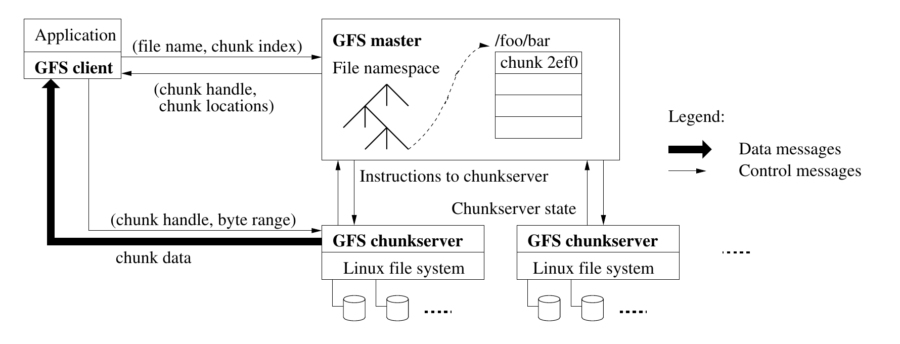
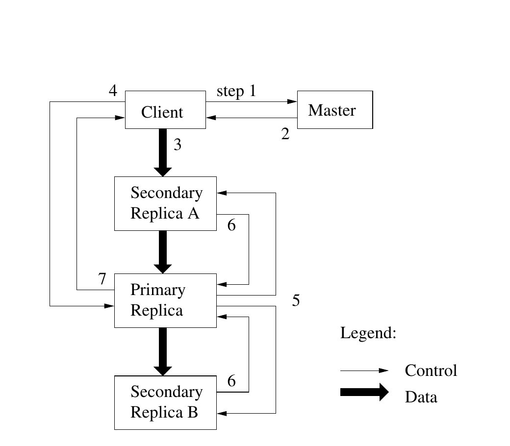
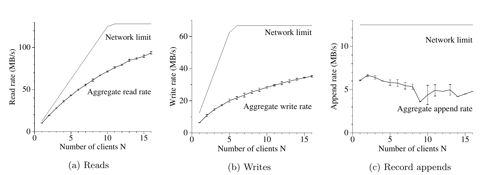

# The Google File System（中文译文）

## 译者说明

本文依据同目录的 `source.pdf` 翻译。章节、图表、公式、算法、代码与参考文献按原文结构保留。

## 作者与出处

Sanjay Ghemawat、Howard Gobioff、Shun-Tak Leung

Google[^author-contact]

[^author-contact]: 本文作者联系地址：{sanjay,hgobioff,shuntak}@google.com。

SOSP’03，2003 年 10 月 19–22 日，美国纽约州 Bolton Landing。

## 摘要

我们设计并实现了 Google 文件系统（Google File System，GFS），这是一个面向大型分布式数据密集型应用、可扩展的分布式文件系统。它在廉价商用硬件上运行时提供容错能力，并向大量客户端提供很高的聚合性能。

尽管我们的目标与以往分布式文件系统的许多目标相同，但我们的设计受到了当前及预期的应用工作负载和技术环境观察结果的驱动；这些观察与一些早期文件系统的设计假设存在显著差异。因此，我们重新审视了传统选择，并探索了截然不同的设计点。

该文件系统已成功满足我们的存储需求。它在 Google 内部得到广泛部署，既作为生成和处理我们的服务所用数据的存储平台，也支持需要大型数据集的研究与开发工作。截至当时，最大的集群在一千多台机器的数千块磁盘上提供数百 TB 的存储，并由数百个客户端并发访问。

在本文中，我们介绍为支持分布式应用而设计的文件系统接口扩展，讨论我们设计中的多个方面，并报告微基准测试和实际使用中的测量结果。

**类别与主题描述符：** D [4]: 3—分布式文件系统

**一般术语：** 设计、可靠性、性能、测量

**关键词：** 容错、可扩展性、数据存储、集群存储

## 1. 引言

我们设计并实现了 Google 文件系统（GFS），以满足 Google 快速增长的数据处理需求。GFS 与以往分布式文件系统有许多共同目标，例如性能、可扩展性、可靠性和可用性。不过，它的设计受到了我们当前及预期的应用工作负载与技术环境中若干关键观察的驱动；这些观察与一些早期文件系统设计假设存在显著差异。我们重新审视了传统选择，并探索了设计空间中截然不同的设计点。

第一，组件故障是常态，而非例外。文件系统由数百乃至数千台采用廉价商用部件的存储机器组成，并由数量相当的客户端机器访问。组件的数量和质量几乎注定了任一时刻都有一些组件无法工作，而且有些组件不会从当前故障中恢复。我们见过由应用程序缺陷、操作系统缺陷、人为错误，以及磁盘、内存、连接器、网络和电源故障引起的问题。因此，持续监控、错误检测、容错和自动恢复必须成为系统不可分割的一部分。

第二，按照传统标准，文件非常大。数 GB 的文件很常见。每个文件通常包含许多应用对象，例如 Web 文档。当我们经常处理由数十亿对象组成、快速增长至数 TB 的数据集时，即使文件系统能够支持，管理数十亿个大小约为数 KB 的文件也十分笨拙。因此，必须重新审视 I/O 操作大小、块大小等设计假设和参数。

第三，大多数文件通过追加新数据来修改，而不是覆盖已有数据。文件内的随机写入几乎不存在。文件写成后只会被读取，而且通常只做顺序读取。多种数据都具有这些特征：有些是供数据分析程序扫描的大型资料库；有些是运行中的应用持续生成的数据流；有些是归档数据；还有些是在一台机器上产生、同时或稍后在另一台机器上处理的中间结果。面对巨型文件上的这种访问模式，追加成为性能优化和原子性保证的重点，而在客户端缓存数据块的吸引力随之降低。

第四，协同设计应用程序与文件系统 API 可以提高灵活性，从而使整个系统受益。例如，我们放宽了 GFS 的一致性模型，在不给应用程序带来沉重负担的前提下大幅简化文件系统。我们还引入了原子追加操作，使多个客户端无需彼此额外同步便可并发追加到同一文件。本文后续将更详细地讨论这些内容。

当时已经为不同用途部署了多个 GFS 集群。最大的集群拥有 1000 多个存储节点、300 TB 以上的磁盘存储，并持续承受位于不同机器上的数百个客户端的大量访问。

## 2. 设计概览

### 2.1 假设

在为我们的需求设计文件系统时，我们遵循了一组既带来挑战也提供机会的假设。前文已经提及其中若干关键观察，下面更详细地列出这些假设。

- 系统由许多经常发生故障的廉价商用组件构成。系统必须持续自我监控，并能在组件的日常故障中及时检测、容忍并恢复。

- 系统存储数量适中的大型文件。我们预计有数百万个文件，每个文件通常为 100 MB 或更大。数 GB 的文件是常见情况，应能高效管理。系统必须支持小文件，但我们无需专门优化。

- 工作负载主要包含两类读取：大型流式读取和小型随机读取。大型流式读取的单次操作通常读取数百 KB，更常见的是 1 MB 或更多。同一客户端的连续操作常常读取文件的一段连续区域。小型随机读取通常在某个任意偏移处读取数 KB。重视性能的应用往往会批处理并排序小型读取，使其在文件中稳定向前推进，而不是来回跳转。

- 工作负载还包含许多向文件追加数据的大型顺序写入。典型操作大小与读取相近。数据一旦写入，之后很少再次修改。系统支持在文件任意位置进行小型写入，但这些操作不必高效。

- 系统必须高效实现定义明确的语义，供多个客户端并发追加到同一文件。我们的文件经常用作生产者–消费者队列或多路合并的目标。数百个生产者各自在一台机器上运行，并发追加同一文件。以最低同步开销保证原子性至关重要。文件可以稍后读取，也可以由消费者同时持续读取。

- 高持续带宽比低延迟更重要。我们的多数目标应用重视以高吞吐率批量处理数据，只有少数应用对单次读写的响应时间有严格要求。

### 2.2 接口

GFS 提供熟悉的文件系统接口，但不实现 POSIX 等标准 API。文件按目录层次组织，并以路径名标识。我们支持创建、删除、打开、关闭、读取和写入文件等常规操作。

此外，GFS 还提供快照（snapshot）和记录追加（record append）操作。快照能以很低的成本复制一个文件或一棵目录树。记录追加允许多个客户端并发向同一文件追加数据，同时保证每个客户端单次追加的原子性。它适合实现多路合并结果和生产者–消费者队列：许多客户端可以同时追加，无需额外加锁。我们发现，这类文件对于构建大型分布式应用价值极高。第 3.4 节和第 3.3 节将分别进一步讨论快照和记录追加。

### 2.3 架构

如图 1 所示，一个 GFS 集群由一个主控节点（master）和多个块服务器（chunkserver）组成，并由多个客户端访问。这些角色通常都运行在商用 Linux 机器上的用户态服务器进程中。只要机器资源允许，并且能够接受运行可能不稳定的应用代码所带来的较低可靠性，就可以很容易地在同一台机器上同时运行块服务器和客户端。

文件被划分为固定大小的块（chunk）。每个块由主控节点在创建时分配一个不可变、全局唯一的 64 位块句柄。块服务器把块作为 Linux 文件存储在本地磁盘上，并按照块句柄和字节范围读取或写入块数据。为保证可靠性，每个块会复制到多个块服务器。默认情况下，我们保存三个副本，但用户可以为文件命名空间的不同区域指定不同复制级别。

主控节点维护文件系统的全部元数据，包括命名空间、访问控制信息、文件到块的映射，以及块副本的当前位置。它还控制系统范围的活动，例如块租约管理、孤儿块的垃圾回收，以及块服务器之间的块迁移。主控节点定期通过 HeartBeat 消息与各块服务器通信，向其下达指令并收集状态。

链接进每个应用程序的 GFS 客户端代码实现文件系统 API，并与主控节点和块服务器通信，代表应用程序读写数据。客户端通过主控节点完成元数据操作，但所有承载数据的通信都直接发往块服务器。我们不提供 POSIX API，因此也无需接入 Linux vnode 层。

客户端和块服务器都不缓存文件数据。客户端缓存收益很小，因为多数应用会流式扫过巨型文件，或者工作集大到无法缓存。不设置这类缓存消除了缓存一致性问题，简化了客户端和整个系统。（不过，客户端会缓存元数据。）块服务器也无需缓存文件数据，因为块以本地文件形式存储，Linux 缓冲区缓存已经会把频繁访问的数据保留在内存中。

**图 1：GFS 架构。** 粗箭头表示数据消息，细箭头表示控制消息。

### 2.4 单一主控节点

单一主控节点大幅简化了我们的设计，并使主控节点能够利用全局信息作出复杂的块放置和复制决策。不过，我们必须尽量减少它对读写的参与，以免其成为瓶颈。客户端从不经由主控节点读写文件数据。客户端会向主控节点询问应联系哪些块服务器，在有限时间内缓存这些信息，随后在多次操作中直接与块服务器交互。

下面让我们结合图 1 说明一次简单读取的交互。首先，客户端利用固定块大小，把应用程序指定的文件名和字节偏移转换成文件内的块索引。随后，它向主控节点发送包含文件名和块索引的请求。主控节点返回相应的块句柄和副本位置。客户端以文件名和块索引为键缓存这些信息。

然后，客户端向某个副本发送请求，通常选择最近的一个。请求指定块句柄和块内的字节范围。在缓存信息过期或文件被重新打开之前，继续读取同一块不再需要客户端与主控节点交互。实际上，客户端通常在一次请求中查询多个块；主控节点还可以附带紧随所请求块之后的若干块的信息。这些额外信息几乎不增加成本，却能省去未来多次客户端–主控节点交互。

### 2.5 块大小

块大小是关键设计参数之一。我们选择 64 MB，远大于典型文件系统的块大小。块的每个副本在块服务器上保存为普通 Linux 文件，并且只按需扩展。延迟分配空间可避免因内部碎片浪费空间，而内部碎片或许是反对如此大块尺寸的最大理由。

大块尺寸具有几个重要优点。第一，同一块上的读写只需最初向主控节点请求一次块位置信息，因此减少了客户端与主控节点交互的需要。对于我们的工作负载，这一减少尤其显著，因为应用主要顺序读写大型文件。即使面对小型随机读取，客户端也能轻松缓存一个数 TB 工作集的全部块位置信息。第二，块越大，客户端越可能在给定块上执行多次操作，因此可以长期维持到块服务器的持久 TCP 连接，降低网络开销。第三，它减小了主控节点存储的元数据规模，使我们能够把元数据保留在内存中，并获得我们将在第 2.6.1 节讨论的其他优势。

大块尺寸即使配合延迟空间分配也有缺点。小文件只包含少量块，甚至只有一个块。若许多客户端访问同一小文件，保存这些块的块服务器可能成为热点。实际中，热点不是主要问题，因为我们的应用大多顺序读取包含多个块的大文件。

不过，GFS 首次用于批处理队列系统时确实出现过热点：一个可执行文件作为单块文件写入 GFS，随后同时在数百台机器上启动。保存该可执行文件的少数块服务器被数百个并发请求压垮。我们通过提高这类可执行文件的复制因子，并让批处理队列系统错开应用启动时间解决了问题。一种潜在的长期方案是在这类情形下允许客户端从其他客户端读取数据。

### 2.6 元数据

主控节点存储三类主要元数据：文件和块的命名空间、文件到块的映射，以及各块副本的位置。所有元数据都保存在主控节点内存中。前两类数据（命名空间和文件到块的映射）还会持久化：系统把变更记录在主控节点本地磁盘的操作日志中，并将日志复制到远程机器。日志使我们能够简单可靠地更新主控节点状态，并避免主控节点崩溃时产生不一致。主控节点不持久保存块位置信息，而是在启动时以及任何块服务器加入集群时，向各块服务器查询其拥有的块。

#### 2.6.1 内存数据结构

元数据保存在内存中，因此主控节点操作很快。主控节点还能够轻松高效地定期在后台扫描其全部状态。这类定期扫描用于实现块垃圾回收、块服务器故障后的重新复制，以及为平衡块服务器负载和磁盘空间而进行的块迁移。第 4.3 节和第 4.4 节将进一步讨论这些活动。

纯内存方法可能带来一个疑虑：块的数量乃至整个系统的容量受主控节点内存大小限制。实践中，这并非严重限制。主控节点为每个 64 MB 块维护的元数据少于 64 字节。大多数块都是满的，因为多数文件包含许多块，只有最后一块可能没有填满。同样，文件命名空间数据通常每个文件少于 64 字节，因为文件名通过前缀压缩紧凑存储。

即使需要支持更大的文件系统，相对于我们把元数据置于内存而获得的简单性、可靠性、性能和灵活性，为主控节点增加内存所付出的成本也很低。

#### 2.6.2 块位置

主控节点不持久记录哪些块服务器拥有给定块的副本。它只在启动时向块服务器轮询这些信息。之后，主控节点可以保持信息最新，因为所有块放置都由它控制，而且它通过定期 HeartBeat 消息监控块服务器状态。

我们曾经尝试在主控节点持久保存块位置信息，但发现启动时并定期向块服务器请求这些数据要简单得多。这样消除了在块服务器加入或离开集群、更名、故障、重启等情况下保持主控节点与块服务器同步的问题。在拥有数百台服务器的集群里，这类事件实在太常见。

理解这一设计决策的另一种方式是认识到：块服务器对自己的磁盘上有哪些块拥有最终发言权。试图让主控节点维持这一信息的一致视图没有意义，因为块服务器错误可能使块自发消失（例如磁盘损坏并被禁用），操作员也可能重命名块服务器。

#### 2.6.3 操作日志

操作日志包含关键元数据变更的历史记录，是 GFS 的核心。它既是元数据唯一的持久记录，也充当定义并发操作顺序的逻辑时间线。文件、块及其版本（见第 4.5 节）都由创建时的逻辑时间唯一且永久地标识。

操作日志至关重要，因此我们必须可靠地存储它，而且在元数据变更持久化前不能让客户端看到这些变更。否则，即使块本身幸存，我们实际上也会丢失整个文件系统或最近的客户端操作。因此，我们把操作日志复制到多台远程机器，只有当对应日志记录在本地和远程都刷入磁盘后，才响应客户端操作。主控节点会批量刷入多条日志记录，以减小刷盘和复制对系统总吞吐量的影响。

主控节点通过重放操作日志恢复文件系统状态。为缩短启动时间，我们必须让日志保持较小。每当日志增长到一定规模，主控节点就为状态创建检查点；恢复时可从本地磁盘加载最新检查点，并只重放此后的有限日志记录。检查点采用紧凑、类似 B-tree 的格式，可以直接映射到内存并用于命名空间查找，无需额外解析，从而进一步加快恢复并提高可用性。

创建检查点可能耗时较长，因此主控节点的内部状态经过组织，可在不延迟新变更的情况下生成新检查点。主控节点切换到新的日志文件，并在单独线程中创建新检查点。新检查点包含切换前的全部变更。对于包含数百万个文件的集群，创建过程约需一分钟。完成后，检查点同时写入本地和远程磁盘。

恢复只需要最近一个完整检查点及其后的日志文件。旧检查点和日志文件可以自由删除，不过我们会保留若干份以防灾难。检查点生成过程中发生故障不会影响正确性，因为恢复代码会检测并跳过不完整的检查点。

### 2.7 一致性模型

GFS 采用宽松的一致性模型。它既能良好支持我们的高度分布式应用，又相对简单高效。下面我们讨论 GFS 提供的保证及其对应用程序的含义。我们还概述 GFS 如何维持这些保证；具体细节留到本文其他部分。

#### 2.7.1 GFS 提供的保证

文件命名空间变更（例如创建文件）是原子的。它们完全由主控节点处理：命名空间锁保证原子性和正确性（第 4.1 节），主控节点的操作日志为这些操作定义全局全序（第 2.6.3 节）。

数据变更后文件区域的状态取决于变更类型、成功或失败，以及是否存在并发变更。表 1 总结了结果。如果所有客户端无论从哪个副本读取都总能看到相同数据，则文件区域是“一致的”（consistent）。如果一个区域在文件数据变更后既一致，而且客户端会完整看到该次变更所写入的内容，则该区域是“已定义的”（defined）。一次变更在没有并发写入者干扰的情况下成功时，受影响区域为已定义状态（因而也一致）：所有客户端总能看到该次变更写入的内容。多个并发变更全部成功时，区域保持一致但未定义：所有客户端看到相同数据，但这些数据可能不反映任何一次变更写入的内容，通常由多个变更的片段混合而成。失败的变更会使区域不一致（因而也未定义）：不同客户端在不同时间可能看到不同数据。下面我们说明我们的应用程序如何区分已定义和未定义区域。应用程序无需进一步区分不同类别的未定义区域。

**表 1：变更后的文件区域状态**

| 结果 | 写入 | 记录追加 |
| --- | --- | --- |
| 串行成功 | 已定义 | 已定义区域之间夹有不一致区域 |
| 并发成功 | 一致但未定义 | 不一致 |
| 失败 | 不一致 | 不一致 |

数据变更可以是写入或记录追加。写入把数据放到应用程序指定的文件偏移处。记录追加即使存在并发变更，也会在 GFS 选择的偏移处把数据（即“记录”）以原子方式至少追加一次（第 3.3 节）。（相比之下，“普通”追加只是在客户端认为是当前文件末尾的偏移处执行一次写入。）该偏移返回给客户端，并标记包含这条记录的已定义区域起点。此外，GFS 可能在其间插入填充或记录副本；它们占据的区域被视为不一致区域，其数据量通常远小于用户数据。

一系列成功变更完成后，最后一次变更涉及的文件区域保证处于已定义状态，并包含最后一次变更写入的数据。GFS 通过两项措施实现这一点：（a）在一个块的所有副本上以相同顺序应用变更（第 3.1 节）；（b）使用块版本号检测因块服务器停机期间漏掉变更而过期的副本（第 4.5 节）。过期副本绝不会参与变更，也不会由主控节点返回给查询块位置的客户端；系统会尽早将其作为垃圾回收。

客户端会缓存块位置，因此在信息刷新前可能从过期副本读取。这个窗口受缓存项超时时间限制；下一次打开文件也会从缓存中清除该文件的全部块信息。此外，由于我们的多数文件只追加，过期副本通常会过早返回块末尾，而不是返回旧数据。读取者重试并联系主控节点时，会立即得到最新块位置。

成功变更很久以后，组件故障当然仍可能破坏或销毁数据。GFS 通过主控节点与所有块服务器之间的定期握手识别失效块服务器，并通过校验和检测数据损坏（第 5.2 节）。问题一旦暴露，系统会尽快从有效副本恢复数据（第 4.3 节）。只有当一个块的所有副本都在 GFS 作出反应前丢失时，该块才会不可逆地丢失；GFS 通常会在数分钟内反应。即使如此，该块也只是不可用，并未悄然损坏：应用程序会收到明确错误，而不是损坏的数据。

#### 2.7.2 对应用程序的含义

GFS 应用程序可以用几种因其他目的本来就需要的简单技术适应宽松一致性模型：依赖追加而非覆盖、创建检查点，以及写入可自我验证、自我标识的记录。

我们的应用程序几乎都通过追加而不是覆盖来修改文件。一种典型用法是写入者从头到尾生成一个文件，写完全部数据后以原子方式把文件重命名为永久名称，或者定期记录已成功写入多少数据的检查点。检查点还可以包含应用层校验和。读取者只验证并处理截至最后一个检查点的文件区域，该区域已知处于已定义状态。无论存在怎样的一致性和并发问题，这种方法对我们一直很有效。追加远比随机写入高效，也更能抵御应用程序故障。检查点使写入者可以增量重启，并防止读取者处理那些从文件系统角度已经成功写入、但从应用程序角度仍不完整的文件数据。

另一种典型用法是许多写入者为合并结果或生产者–消费者队列并发追加同一文件。记录追加的“至少追加一次”语义保留每个写入者的输出。读取者按以下方式处理偶尔出现的填充和重复记录：写入者准备的每条记录包含校验和等额外信息，以便验证其有效性；读取者可用校验和识别并丢弃多余填充和记录片段。如果读取者无法容忍偶发重复（例如重复会触发非幂等操作），可以利用记录中的唯一标识符过滤；这类标识符通常本来就用于命名对应的应用实体，例如 Web 文档。这些记录 I/O 功能（重复消除除外）位于我们的应用共享库代码中，也适用于 Google 内部其他文件接口实现。这样，记录读取者总能得到相同的记录序列，外加少量重复项。

## 3. 系统交互

我们在设计系统时尽量减少主控节点参与任何操作。基于这一背景，下面我们说明客户端、主控节点和块服务器如何交互，以实现数据变更、原子记录追加和快照。

### 3.1 租约与变更顺序

变更（mutation）是改变块内容或元数据的操作，例如写入或追加。每次变更都在块的全部副本上执行。我们使用租约（lease）在副本间维持一致的变更顺序。主控节点把块租约授予某个副本，我们称其为主副本（primary）。主副本为该块的全部变更选择串行顺序，所有副本应用变更时都遵循这一顺序。因此，全局变更顺序首先由主控节点选择的租约授予顺序决定；在单个租约期内，则由主副本分配的序列号决定。

租约机制旨在尽量降低主控节点的管理开销。租约初始超时时间为 60 秒。只要块仍在被修改，主副本就可以请求续期，而且通常可以无限期获准。续期请求和批准搭载在主控节点与所有块服务器定期交换的 HeartBeat 消息上。主控节点有时可能尝试在租约到期前撤销它，例如主控节点希望禁止修改一个正在重命名的文件。即使主控节点失去与主副本的通信，也可以在旧租约到期后安全地向另一个副本授予新租约。

我们在图 2 中用以下编号步骤展示一次写入的控制流。

**图 2：写入控制流与数据流。** 细箭头表示控制，粗箭头表示数据。

1. 客户端向主控节点询问哪个块服务器持有该块的当前租约，以及其他副本的位置。如果没有副本持有租约，主控节点会把租约授予其选择的一个副本（图中未画出）。

2. 主控节点返回主副本的身份和其他次副本（secondary）的位置。客户端缓存这些数据以供后续变更使用。只有当主副本无法访问，或回复称其不再持有租约时，客户端才需要再次联系主控节点。

3. 客户端把数据推送到全部副本，顺序可以任意。各块服务器会把数据保存在内部 LRU 缓冲区缓存中，直到数据被使用或因老化而淘汰。把数据流与控制流解耦后，无论哪个块服务器是主副本，我们都可以根据网络拓扑调度代价高昂的数据流，以提高性能。第 3.2 节将进一步讨论。

4. 所有副本确认收到数据后，客户端向主副本发送写入请求。请求标识之前推送到全部副本的数据。主副本为收到的所有变更分配连续序列号，这些变更可能来自多个客户端，从而提供必要的串行化。主副本按序列号顺序把变更应用到本地状态。

5. 主副本把写入请求转发给全部次副本。每个次副本按照主副本分配的相同序列号顺序应用变更。

6. 所有次副本回复主副本，说明操作已经完成。

7. 主副本回复客户端。任何副本遇到的错误都会报告给客户端。发生错误时，写入可能已经在主副本和任意一部分次副本上成功。（如果主副本执行失败，就不会为其分配序列号，也不会转发。）客户端请求被视为失败，已修改区域保持不一致状态。我们的客户端代码通过重试失败的变更处理这类错误。它会对步骤 3 至步骤 7 尝试数次，随后才退回到从该次写入开头重试。

如果应用程序的一次写入很大或跨越块边界，GFS 客户端代码会把它拆成多个写入操作。所有操作都遵循上述控制流，但可能与其他客户端的并发操作交错，也可能被其覆盖。因此，共享文件区域最后可能包含不同客户端的片段；不过，由于各次操作都以相同顺序在全部副本上成功完成，副本仍然彼此相同。如第 2.7 节所述，这会使文件区域处于一致但未定义状态。

### 3.2 数据流

我们把数据流与控制流分离，以高效利用网络。控制从客户端流向主副本，再流向所有次副本；数据则以流水线方式，沿精心选择的块服务器线性链路推送。我们的目标是充分利用每台机器的网络带宽，避开网络瓶颈和高延迟链路，并尽量降低把全部数据推送完毕的延迟。

为了充分利用每台机器的网络带宽，数据沿块服务器链线性推送，而不采用其他分发拓扑（例如树）。这样，每台机器的全部出站带宽都用于尽快传输数据，而不必分摊给多个接收者。

为了尽量避开网络瓶颈和高延迟链路（交换机间链路往往兼有这两类问题），每台机器都把数据转发给网络拓扑中尚未接收数据的“最近”机器。假设客户端要向块服务器 S1 至 S4 推送数据。它先把数据发给最近的块服务器，例如 S1。S1 再从 S2 至 S4 中选择离自己最近的块服务器，例如 S2。类似地，S2 再向 S3 或 S4 中离自己较近的一个转发，以此类推。我们的网络拓扑足够简单，可以根据 IP 地址准确估算“距离”。

最后，我们在 TCP 连接上以流水线方式传输数据来缩短延迟。块服务器一收到部分数据就立即开始转发。流水线对我们尤其有用，因为我们使用具有全双工链路的交换式网络；立即发送数据不会降低接收速率。在没有网络拥塞时，把 $B$ 字节传给 $R$ 个副本的理想耗时为：

$$
B/T + RL
$$

其中， $T$ 是网络吞吐量， $L$ 是两台机器之间传输字节的延迟。我们的网络链路通常为 100 Mbps（ $T$），而 $L$ 远低于 1 ms。因此，理想情况下分发 1 MB 数据约需 80 ms。

### 3.3 原子记录追加

GFS 提供一种名为记录追加的原子追加操作。在传统写入中，客户端指定写入数据的偏移。对同一区域的并发写入无法串行化：该区域最后可能包含多个客户端的数据片段。在记录追加中，客户端只指定数据。GFS 在自己选择的偏移处，以原子方式（即作为一段连续字节序列）把数据至少追加到文件一次，并把该偏移返回客户端。这类似于写入一个在 Unix 中以 `O_APPEND` 模式打开的文件，同时避免多个写入者并发操作时的竞态条件。

记录追加被我们的分布式应用广泛使用；其中，许多位于不同机器上的客户端会并发追加同一文件。若使用传统写入，客户端还需要复杂且昂贵的额外同步，例如分布式锁管理器。在我们的工作负载中，这类文件经常充当多生产者/单消费者队列，或包含来自许多不同客户端的合并结果。

记录追加属于一种变更，遵循第 3.1 节的控制流，只在主副本增加少量逻辑。客户端把数据推送到文件最后一个块的全部副本，然后向主副本发送请求。主副本检查追加记录是否会使当前块超过最大尺寸 64 MB。若会超过，主副本把块填充到最大尺寸，要求次副本执行相同操作，然后回复客户端，指示其在下一个块上重试。（记录追加被限制为不超过最大块尺寸的四分之一，以便把最坏情况下的碎片控制在可接受水平。）若记录能够放入当前块——这是常见情况——主副本就把数据追加到自己的副本，要求次副本把数据写到完全相同的偏移，最后向客户端返回成功。

如果记录追加在任何一个副本上失败，客户端会重试。因此，同一块的不同副本可能包含不同数据，其中可能完整或部分地重复同一条记录。GFS 不保证所有副本在逐字节意义上相同，只保证数据作为一个原子单元至少写入一次。该性质来自一个简单观察：只有当数据已写入某个块的全部副本的同一偏移时，操作才会报告成功。而且此后所有副本至少都延伸到该记录末尾，因此即便另一个副本随后成为主副本，未来任何记录也会被分配到更高偏移或不同块。按照我们的一致性保证，成功记录追加所写入的区域是已定义区域（因而一致），中间区域则不一致（因而未定义）。我们的应用程序可以像我们在第 2.7.2 节讨论的那样处理不一致区域。

### 3.4 快照

快照操作几乎瞬间就能复制一个文件或一棵目录树（即“源”），同时尽量减少对进行中变更的干扰。我们的用户利用快照快速为巨型数据集创建分支副本（而且经常递归地复制这些副本），也会在尝试变更前保存当前状态，以便随后轻松提交或回滚。

与 AFS [5] 类似，我们用标准写时复制技术实现快照。主控节点收到快照请求后，首先撤销待快照文件所含块上的全部未到期租约。这样，对这些块的任何后续写入都必须与主控节点交互以查找租约持有者，使主控节点有机会先创建块的新副本。

租约撤销或到期后，主控节点把操作记入磁盘日志。随后，它复制源文件或目录树的元数据，把该日志记录应用到内存状态。新创建的快照文件指向与源文件相同的块。

快照完成后，客户端第一次要写入块 $C$ 时，会向主控节点请求当前租约持有者。主控节点发现块 $C$ 的引用计数大于一，于是暂缓响应客户端，改为选择一个新的块句柄 $C'$。随后，它要求拥有块 $C$ 当前副本的每个块服务器创建名为 $C'$ 的新块。我们把新块建在与原块相同的块服务器上，以保证数据可以在本地复制而不经过网络；我们的磁盘约比 100 Mb 以太网链路快三倍。此后，请求处理与其他块没有区别：主控节点向新块 $C'$ 的一个副本授予租约并回复客户端，客户端可以正常写入该块，并不知道它刚从一个已有块创建而来。

## 4. 主控节点操作

主控节点执行全部命名空间操作。此外，它还管理整个系统中的块副本：作出放置决策，创建新块及其副本，并协调多种系统范围活动，以保持块的完整复制、平衡所有块服务器之间的负载，以及回收未使用的存储。下面我们分别讨论这些主题。

### 4.1 命名空间管理与锁

许多主控节点操作可能持续很长时间。例如，快照操作必须撤销快照范围内所有块服务器租约。我们不希望这类操作运行时延迟其他主控节点操作。因此，我们允许多个操作同时处于活动状态，并对命名空间区域加锁以保证正确的串行化。

与许多传统文件系统不同，GFS 没有按目录保存、列出该目录全部文件的数据结构，也不支持同一文件或目录的别名（即 Unix 意义上的硬链接或符号链接）。GFS 在逻辑上把命名空间表示为从完整路径名到元数据的查找表。借助前缀压缩，这张表可以高效地表示在内存中。命名空间树中的每个节点——绝对文件名或绝对目录名——都关联一个读写锁。

每个主控节点操作在运行前获取一组锁。通常，如果操作涉及 `/d1/d2/.../dn/leaf`，就会在目录名 `/d1`、`/d1/d2`、……、`/d1/d2/.../dn` 上获取读锁，并在完整路径名 `/d1/d2/.../dn/leaf` 上获取读锁或写锁。根据操作不同，`leaf` 可以是文件，也可以是目录。

下面我们以一个例子说明该锁机制如何阻止在把 `/home/user` 快照到 `/save/user` 时创建文件 `/home/user/foo`。快照操作在 `/home` 和 `/save` 上获取读锁，在 `/home/user` 和 `/save/user` 上获取写锁。文件创建操作在 `/home` 和 `/home/user` 上获取读锁，在 `/home/user/foo` 上获取写锁。两个操作会正确串行化，因为它们试图在 `/home/user` 上获取冲突的锁。创建文件无需在父目录上获取写锁，因为不存在需要保护以防修改的“目录”数据结构或类似 inode 的数据结构；在名称上获取读锁已经足以保护父目录不被删除。

这种锁方案的一个良好性质，是允许同一目录中的并发变更。例如，可以在同一目录中并发创建多个文件：每个操作在目录名上获取读锁，在文件名上获取写锁。目录名上的读锁足以防止目录被删除、重命名或创建快照；文件名上的写锁则会把两次创建同名文件的尝试串行化。

命名空间可能包含许多节点，因此读写锁对象按需分配，不再使用时即删除。为避免死锁，系统还按照一致的全序获取锁：先按命名空间树中的层级排序，同一层级内再按字典序排序。

### 4.2 副本放置

GFS 集群在多个层次上高度分布。一个集群通常有数百个块服务器，分布在许多机架中；数百个客户端又可能从相同或不同机架访问这些块服务器。不同机架上的两台机器通信时，可能跨越一个或多个网络交换机。此外，进出一个机架的带宽可能小于该机架内所有机器的聚合带宽。多层分布为如何分发数据以实现可扩展性、可靠性和可用性带来了独特挑战。

块副本放置策略有两个目的：最大化数据可靠性与可用性，以及最大化网络带宽利用率。为实现这两个目的，只把副本分散到不同机器还不够；这只能防范磁盘或机器故障，并充分利用每台机器的网络带宽。我们还必须把块副本分散到不同机架。这样，即使整个机架受损或离线（例如网络交换机、电源回路等共享资源发生故障），块的部分副本仍能幸存并保持可用；同一块的流量，尤其是读取流量，也可以利用多个机架的聚合带宽。代价是写入流量必须跨越多个机架，而我们愿意接受这一权衡。

### 4.3 创建、重新复制与再平衡

系统会因三种原因创建块副本：块创建、重新复制和再平衡。

主控节点创建块时，要选择初始空副本的放置位置，并考虑多个因素。（1）我们希望把新副本放在磁盘空间利用率低于平均水平的块服务器上；长期而言，这会均衡各块服务器的磁盘利用率。（2）我们希望限制每个块服务器上“最近”创建的数量。创建操作本身成本很低，但能可靠预示即将到来的大量写入流量，因为块会在写入需要时创建；在我们“追加一次、读取多次”的工作负载中，块写满后通常几乎变为只读。（3）如上文所述，我们希望把同一块的副本分散到不同机架。

只要可用副本数低于用户指定目标，主控节点就重新复制该块。导致这种情况的原因很多：块服务器不可用；块服务器报告自己的副本可能损坏；某块磁盘因错误而禁用；或者复制目标提高。每个需要重新复制的块会依据多个因素设置优先级。因素之一是距离复制目标还有多远。例如，我们赋予丢失两个副本的块比只丢失一个副本的块更高的优先级。我们还优先重新复制活动文件的块，而不是最近删除文件的块（见第 4.4 节）。最后，为减轻故障对运行中应用的影响，我们会提高任何阻塞客户端进度的块的优先级。

主控节点选出优先级最高的块，并指示某个块服务器直接从已有有效副本复制块数据，以“克隆”该块。新副本的放置目标与创建时相似：均衡磁盘空间利用率、限制任一块服务器上的活动克隆操作，并把副本分散到不同机架。为了不让克隆流量淹没客户端流量，主控节点限制整个集群和每个块服务器上的活动克隆操作数。每个块服务器还会节流向源块服务器发出的读取请求，从而限制每项克隆操作消耗的带宽。

最后，主控节点定期再平衡副本：检查当前副本分布并移动副本，以改善磁盘空间和负载平衡。通过该过程，主控节点还会逐步填充新块服务器，而不会立即用新块及其伴随的大量写流量将其淹没。新副本的放置标准与上文相似。主控节点还必须选择删除哪个已有副本；通常优先删除位于可用空间低于平均水平的块服务器上的副本，以均衡磁盘空间使用。

### 4.4 垃圾回收

文件删除后，GFS 不会立即回收空出的物理存储，而是在文件层和块层的定期垃圾回收中延迟完成。我们发现，这种方法使系统简单、可靠得多。

#### 4.4.1 机制

应用程序删除文件时，主控节点与处理其他变更一样，立即记录删除操作。不过，系统不会马上回收资源，只会把文件重命名为包含删除时间戳的隐藏名称。主控节点定期扫描文件系统命名空间时，会移除存在超过三天的此类隐藏文件（该间隔可配置）。在此之前，文件仍可以通过新的特殊名称读取，也可以重新改回普通名称以撤销删除。隐藏文件从命名空间移除时，其内存元数据也被删除，从而实际切断文件到全部块的链接。

在对块命名空间的类似定期扫描中，主控节点识别孤儿块——即无法从任何文件到达的块——并删除这些块的元数据。每个块服务器会在与主控节点定期交换的 HeartBeat 消息中报告其拥有的一部分块；主控节点返回所有已经不在自身元数据中的块标识。块服务器随后可以自由删除这些块的副本。

#### 4.4.2 讨论

分布式垃圾回收在编程语言环境中是需要复杂方案的难题，但在我们的情形下非常简单。我们很容易识别块的全部引用：它们都位于仅由主控节点维护的文件到块映射中。我们也很容易识别全部块副本：它们是各块服务器指定目录下的 Linux 文件。主控节点不知道的任何此类副本都是“垃圾”。

采用垃圾回收来回收存储，相比立即删除有多个优点。第一，在组件故障常见的大规模分布式系统中，它简单而可靠。块创建可能在一些块服务器上成功、另一些上失败，留下主控节点不知道的副本。副本删除消息可能丢失，主控节点还必须在自身或块服务器发生故障后记得重发消息。垃圾回收以统一可靠的方式清理所有未知的无用副本。第二，它把存储回收合并到主控节点的常规后台活动中，例如定期扫描命名空间和与块服务器握手。因此可以批量完成并分摊成本，而且只在主控节点相对空闲时进行，使主控节点能更及时地响应有时效要求的客户端请求。第三，延迟回收存储为意外且不可逆的删除提供了一张安全网。

根据我们的经验，主要缺点是：存储紧张时，这种延迟有时会妨碍用户精细调整用量。反复创建和删除临时文件的应用可能无法立即复用存储。若已删除文件又被明确删除一次，我们会加速回收该存储，以应对这类问题。我们还允许用户对命名空间的不同部分应用不同的复制和回收策略。例如，用户可以指定某棵目录树内全部文件的块都不做复制，并让删除的文件立即、不可逆地从文件系统状态中移除。

### 4.5 过期副本检测

如果块服务器发生故障，并在停机期间错过了对块的变更，块副本就可能过期。主控节点为每个块维护一个块版本号，以区分最新副本与过期副本。

每当主控节点向块授予新租约时，它都会提高块版本号并通知所有最新副本。主控节点和这些副本都把新版本号记录到持久状态中。这发生在通知任何客户端之前，因而也发生在客户端开始写入该块之前。如果另一个副本当前不可用，它的块版本号就不会提高。该块服务器重启并报告自己拥有的块及相应版本号时，主控节点会发现其过期副本。如果主控节点看到一个高于自身记录的版本号，就会认为自己在授予租约期间发生过故障，因此把较高版本视为最新版本。

主控节点在定期垃圾回收中移除过期副本。在此之前，它回复客户端的块信息请求时，实际上会把过期副本视为根本不存在。另一项防护措施是：主控节点通知客户端哪个块服务器持有块租约时，或在克隆操作中指示块服务器从另一块服务器读取块时，会附带块版本号。客户端或块服务器执行操作时会验证版本号，以保证始终访问最新数据。

## 5. 容错与诊断

设计该系统时，我们最大的挑战之一是处理频繁的组件故障。组件的质量与数量共同使这些问题成为常态：我们既不能完全信任机器，也不能完全信任磁盘。组件故障可能使系统不可用，更糟时还会损坏数据。下面我们讨论我们如何应对这些挑战，以及我们为诊断必然发生的问题构建了哪些工具。

### 5.1 高可用性

一个 GFS 集群包含数百台服务器，因此任一时刻必然有一些服务器不可用。我们采用两种简单而有效的策略维持整个系统的高可用：快速恢复和复制。

#### 5.1.1 快速恢复

无论主控节点和块服务器以何种方式终止，它们都被设计成在数秒内恢复状态并启动。实际上，我们不区分正常终止与异常终止；服务器通常直接通过杀死进程来关闭。客户端和其他服务器只会遇到短暂中断：未完成请求超时后，它们重新连接到已经重启的服务器并重试。第 6.2.2 节报告了实际观察到的启动时间。

#### 5.1.2 块复制

如前文所述，每个块会复制到位于不同机架的多个块服务器。用户可以为文件命名空间的不同部分指定不同复制级别，默认值为三。随着块服务器离线，或校验和验证发现损坏副本（见第 5.2 节），主控节点会按需克隆已有副本，保持每个块完整复制。复制一直很好地满足我们的需求，但面对不断增长的只读存储需求，我们也在探索奇偶校验、纠删码等其他跨服务器冗余形式。我们预期，在这个高度松耦合的系统中，实现这类更复杂的冗余方案会有挑战，但仍可管理，因为我们的流量以追加和读取为主，而不是小型随机写入。

#### 5.1.3 主控节点复制

为保证可靠性，主控节点状态也会复制。操作日志和检查点复制到多台机器。一项状态变更只有在对应日志记录已刷入本地磁盘和所有主控节点副本的磁盘后，才被视为提交。为保持简单，由一个主控进程负责所有变更，以及垃圾回收等会在内部改变系统的后台活动。主控进程发生故障时几乎可以立即重启。如果机器或磁盘发生故障，GFS 外部的监控基础设施会在别处利用复制的操作日志启动新主控进程。客户端只使用主控节点的规范名称，例如 `gfs-test`；该名称是 DNS 别名，当主控节点迁移到另一台机器时可以修改。

此外，即使主主控节点宕机，“影子”主控节点仍能提供文件系统只读访问。它们是影子而非镜像，因为可能略微落后于主主控节点，通常只有几分之一秒。它们提高了未被主动修改的文件，以及可以接受略微过期结果的应用的读取可用性。实际上，文件内容从块服务器读取，因此应用程序不会观察到过期文件内容；短时间内可能过期的是目录内容、访问控制信息等文件元数据。

为了保持信息最新，影子主控节点读取仍在增长的操作日志副本，并把与主主控节点完全相同的变更序列应用到自己的数据结构。与主主控节点一样，它在启动时轮询块服务器以定位块副本，此后也会偶尔轮询，并频繁交换握手消息来监控块服务器状态。只有在获取主主控节点创建和删除副本的决策所引起的副本位置更新时，影子主控节点才依赖主主控节点。

### 5.2 数据完整性

每个块服务器都使用校验和检测已存储数据的损坏。一个 GFS 集群通常在数百台机器上拥有数千块磁盘，因此经常出现磁盘故障，导致读写路径上的数据损坏或丢失。（其中一种原因见第 7 节。）我们可以使用其他块副本从损坏中恢复，但通过跨块服务器比较副本来检测损坏并不实际。而且，副本不同可能完全合法：GFS 的变更语义，特别是前文讨论的原子记录追加，并不保证副本相同。因此，每个块服务器必须维护校验和，独立验证自己副本的完整性。

一个块被分成多个 64 KB 数据块，每个数据块对应一个 32 位校验和。与其他元数据一样，校验和保存在内存中，并通过日志与用户数据分开持久存储。

对于读取，块服务器在向请求方——客户端或另一块服务器——返回任何数据之前，会验证与读取范围重叠的数据块校验和。因此，块服务器不会把损坏传播到其他机器。如果数据块与记录的校验和不符，块服务器向请求方返回错误，并向主控节点报告不匹配。请求方随后从其他副本读取，主控节点则从另一副本克隆该块。有效的新副本就位后，主控节点指示报告不匹配的块服务器删除自己的副本。

校验和对读取性能影响很小，原因有几项。我们的多数读取跨越至少几个数据块，因此验证时我们只需额外读取并计算相对少量的数据。GFS 客户端代码还会尝试把读取对齐到校验和数据块边界，以进一步降低开销。块服务器上的校验和查找与比较不需要 I/O，校验和计算也经常能与 I/O 重叠。

针对在块末尾追加的写入，校验和计算经过了大量优化，因为这类写入在我们的工作负载中占主导地位；覆盖已有数据的写入则不同。我们只需增量更新最后一个未满校验和数据块的校验和，并为追加所填满的全新校验和数据块计算新校验和。即使最后一个未满数据块已经损坏而我们此时没有发现，新校验和值也不会与所存数据匹配；下一次读取该数据块时，损坏仍会像往常一样被发现。

相比之下，如果一次写入覆盖块中的已有范围，我们必须先读取并验证被覆盖范围的第一个和最后一个数据块，再执行写入，最后计算并记录新校验和。如果我们在部分覆盖首尾数据块前不做验证，新校验和可能掩盖未被覆盖区域中已有的损坏。

在空闲期间，块服务器可以扫描并验证不活跃块的内容。这使我们能够发现很少读取的块中的损坏。一旦发现损坏，主控节点可以创建新的未损坏副本并删除损坏副本，防止一个不活跃但已损坏的块副本使主控节点误以为该块仍拥有足够多的有效副本。

### 5.3 诊断工具

全面而详细的诊断日志对问题隔离、调试和性能分析帮助极大，成本却很低。没有日志就很难理解机器之间短暂且不可复现的交互。GFS 服务器生成诊断日志，记录许多重要事件（例如块服务器上线和下线）以及全部 RPC 请求与回复。这些诊断日志可自由删除而不影响系统正确性，但只要空间允许，我们都会尽量保留。

RPC 日志包含线路上发送的精确请求和响应，唯独不包含实际读写的文件数据。通过匹配请求与回复，并整理不同机器上的 RPC 记录，我们可以重建完整交互历史以诊断问题。日志还可作为负载测试和性能分析的跟踪数据。

日志对性能的影响很小，而且远低于它带来的收益，因为日志以顺序、异步方式写入。最新事件还保留在内存中，可供持续在线监控。

## 6. 测量

本节我们给出若干微基准测试，用来说明 GFS 架构和实现中固有的瓶颈，并提供 Google 实际使用集群的一些数据。

### 6.1 微基准测试

我们在一个由 1 个主控节点、2 个主控节点副本、16 个块服务器和 16 个客户端组成的 GFS 集群上测量性能。需要说明的是，这一配置为了便于测试而搭建；典型集群拥有数百个块服务器和数百个客户端。

所有机器均配备双路 1.4 GHz PIII 处理器、2 GB 内存、两块 80 GB 5400 rpm 磁盘，以及连接到 HP 2524 交换机的 100 Mbps 全双工以太网。19 台 GFS 服务器机器全部连接到一台交换机，16 台客户端机器全部连接到另一台交换机；两台交换机通过 1 Gbps 链路相连。

#### 6.1.1 读取

$N$ 个客户端同时从文件系统读取。每个客户端从一个 320 GB 文件集中随机选择一段 4 MB 区域读取，重复 256 次，因此每个客户端最终读取 1 GB 数据。全部块服务器合计只有 32 GB 内存，所以我们预计 Linux 缓冲区缓存的命中率最高为 10%。我们的结果应当接近冷缓存结果。

图 3(a) 展示了 $N$ 个客户端的聚合读取速率及其理论上限。上限在以下两者先饱和处达到峰值：两台交换机之间的 1 Gbps 链路饱和时，聚合上限为 125 MB/s；单个客户端的 100 Mbps 网络接口饱和时，每个客户端上限为 12.5 MB/s。只有一个客户端读取时，观测读取速率为 10 MB/s，即单客户端上限的 80%。16 个读取者时，聚合读取速率达到 94 MB/s，约为 125 MB/s 链路上限的 75%，即每个客户端 6 MB/s。效率从 80% 降至 75%，因为读取者数量增加时，多个读取者同时从同一块服务器读取的概率也随之提高。

#### 6.1.2 写入

$N$ 个客户端同时写入 $N$ 个不同文件。每个客户端通过一系列 1 MB 写入，向一个新文件写入 1 GB 数据。聚合写入速率及其理论上限见图 3(b)。由于我们必须把每个字节写入 16 个块服务器中的 3 个，而每个块服务器的输入连接为 12.5 MB/s，理论上限稳定在 67 MB/s。

一个客户端的写入速率为 6.3 MB/s，约为上限的一半，主要原因是我们的网络栈与我们用于向块副本推送数据的流水线方案配合不佳。数据从一个副本传播到下一个副本的延迟降低了总体写入速率。

16 个客户端时，聚合写入速率达到 35 MB/s，即每客户端 2.2 MB/s，约为理论上限的一半。与读取相同，客户端越多，多个客户端并发写入同一块服务器的概率越高。16 个写入者的冲突概率还高于 16 个读取者，因为每次写入涉及三个不同副本。

写入速度低于我们的期望。实际中，这不是主要问题，因为它虽然增加单个客户端感知到的延迟，却不会显著影响系统向大量客户端提供的聚合写入带宽。

#### 6.1.3 记录追加

图 3(c) 展示了记录追加性能。 $N$ 个客户端同时追加同一文件。无论客户端数量多少，性能都受存储该文件最后一个块的块服务器网络带宽限制。一个客户端时为 6.0 MB/s，16 个客户端时降至 4.8 MB/s，主要原因是不同客户端观察到的网络传输速率存在拥塞和差异。

我们的应用通常并发生成多个此类文件。换言之， $N$ 个客户端同时追加 $M$ 个共享文件， $N$ 和 $M$ 都可能达到数十或数百。因此，我们实验中的块服务器网络拥塞在实践中不是显著问题：当一个文件的块服务器繁忙时，客户端仍可以继续写另一个文件。

**图 3：聚合吞吐量。** 上方曲线显示网络拓扑施加的理论上限，下方曲线显示实测吞吐量。误差条表示 95% 置信区间；由于测量方差很低，其中一些误差条难以辨认。（a）读取；（b）写入；（c）记录追加。

### 6.2 实际集群

下面我们考察 Google 内部使用的两个集群，它们可以代表其他几个类似集群。集群 A 由一百多名工程师经常用于研究与开发。典型任务由人工用户发起，最长运行数小时，读取几 MB 到几 TB 数据，转换或分析后把结果写回集群。集群 B 主要用于生产数据处理。其任务持续时间长得多，持续生成并处理数 TB 数据，只有偶尔的人工干预。两种情况下，一个“任务”都由许多机器上的许多进程组成，同时读写许多文件。

**表 2：两个 GFS 集群的特征**

| 指标 | 集群 A | 集群 B |
| --- | ---: | ---: |
| 块服务器 | 342 | 227 |
| 可用磁盘空间 | 72 TB | 180 TB |
| 已用磁盘空间 | 55 TB | 155 TB |
| 文件数 | 735 k | 737 k |
| 死文件数 | 22 k | 232 k |
| 块数 | 992 k | 1550 k |
| 块服务器上的元数据 | 13 GB | 21 GB |
| 主控节点上的元数据 | 48 MB | 60 MB |

#### 6.2.1 存储

表中前五项显示，两个集群都有数百个块服务器，支持数十乃至数百 TB 的磁盘空间，并且已相当满但尚未完全占满。“已用空间”包括全部块副本。几乎所有文件都复制三份，因此两个集群分别存储了 18 TB 和 52 TB 的文件数据。

两个集群的文件数相近，但集群 B 的死文件比例更高。死文件是已经删除或被新版本替换、但存储尚未回收的文件。集群 B 的块也更多，因为其文件通常更大。

#### 6.2.2 元数据

全部块服务器合计存储数十 GB 元数据，主要是用户数据中每个 64 KB 数据块的校验和。块服务器保留的其他元数据只有第 4.5 节讨论的块版本号。

主控节点保留的元数据小得多，只有数十 MB，平均每个文件约 100 字节。这与我们的假设一致：主控节点内存大小在实践中不会限制系统容量。每文件元数据的大部分是以前缀压缩形式存储的文件名。其他元数据包括文件所有权和权限、文件到块的映射，以及每个块的当前版本。此外，我们还为每个块存储当前副本位置和一个用于实现写时复制的引用计数。

每台服务器——块服务器和主控节点均包括在内——只有 50 至 100 MB 元数据。因此恢复很快：从磁盘读取这些元数据只需数秒，随后服务器即可响应查询。不过，在主控节点从全部块服务器取得块位置信息前，它会有一段受限期，通常持续 30 至 60 秒。

#### 6.2.3 读写速率

表 3 给出了不同时间段的读写速率。取得这些测量时，两个集群都已经运行约一周。（为了升级到新版 GFS，这些集群不久前刚重启。）

自重启以来，平均写入速率低于 30 MB/s。我们测量时，集群 B 正处于写入活动高峰，数据生成速率约为 100 MB/s；由于写入会传播到三个副本，这产生了 300 MB/s 网络负载。

**表 3：两个 GFS 集群的性能指标**

| 指标 | 集群 A | 集群 B |
| --- | ---: | ---: |
| 读取速率（最近 1 分钟） | 583 MB/s | 380 MB/s |
| 读取速率（最近 1 小时） | 562 MB/s | 384 MB/s |
| 读取速率（自重启以来） | 589 MB/s | 49 MB/s |
| 写入速率（最近 1 分钟） | 1 MB/s | 101 MB/s |
| 写入速率（最近 1 小时） | 2 MB/s | 117 MB/s |
| 写入速率（自重启以来） | 25 MB/s | 13 MB/s |
| 主控节点操作（最近 1 分钟） | 325 Ops/s | 533 Ops/s |
| 主控节点操作（最近 1 小时） | 381 Ops/s | 518 Ops/s |
| 主控节点操作（自重启以来） | 202 Ops/s | 347 Ops/s |

读取速率远高于写入速率，说明总工作负载正如我们的假设，读取多于写入。两个集群都处于大量读取活动中。集群 A 在此前一周持续维持 580 MB/s 的读取速率；其网络配置可支持 750 MB/s，因此资源利用率很高。集群 B 的峰值读取能力为 1300 MB/s，但应用程序只使用了 380 MB/s。

#### 6.2.4 主控节点负载

表 3 还显示，发送给主控节点的操作速率约为每秒 200 至 500 次。主控节点可以轻松跟上，因此不会成为这些工作负载的瓶颈。

在 GFS 的一个早期版本中，主控节点偶尔会成为某些工作负载的瓶颈。它的大部分时间用于顺序扫描包含数十万个文件的大型目录，以查找特定文件。我们后来修改了主控节点数据结构，使其能够在命名空间中高效进行二分查找。现在，它可以轻松支持每秒数千次文件访问。如有必要，我们还可以在命名空间数据结构前增加名称查找缓存，进一步提高速度。

#### 6.2.5 恢复时间

块服务器故障后，一些块的副本数会不足，必须克隆以恢复复制级别。恢复全部此类块所需时间取决于可用资源。在一项实验中，我们关闭了集群 B 的一台块服务器。该服务器约有 15,000 个块，包含 600 GB 数据。为了限制对运行中应用的影响，并为调度决策留出余量，默认参数把该集群的并发克隆数限制为 91，即块服务器数量的 40%；每项克隆操作最多消耗 6.25 MB/s（50 Mbps）。全部块在 23.2 分钟内恢复，有效复制速率为 440 MB/s。

另一项实验中，我们关闭了两台块服务器；每台约有 16,000 个块和 660 GB 数据。这次双重故障使 266 个块只剩一个副本。系统以更高优先级克隆这 266 个块，并在 2 分钟内全部恢复到至少双副本状态，使集群重新具备再容忍一台块服务器故障而不丢失数据的能力。

### 6.3 工作负载分解

本节我们详细分解两个 GFS 集群的工作负载。这两个集群与第 6.2 节中的集群相似，但并不相同。集群 X 用于研究与开发，集群 Y 用于生产数据处理。

#### 6.3.1 方法与注意事项

这些结果只包含客户端发起的请求，以反映应用程序对整个文件系统产生的工作负载。它们不包含为执行客户端请求而产生的服务器间请求，也不包含内部后台活动，例如转发写入或再平衡。

I/O 操作统计基于 GFS 服务器实际记录的 RPC 请求，以启发式方法重建。例如，GFS 客户端代码可能为提高并行度而把一次读取拆成多个 RPC，我们据此推断原始读取。由于访问模式高度程式化，我们预计任何误差都淹没在噪声中。由应用程序显式记录也许能提供略微更准确的数据，但重新编译并重启数千个运行中的客户端在后勤上不可行，从如此多的机器收集结果也十分繁琐。

不应把我们的工作负载过度泛化。Google 完全控制 GFS 及其应用，因此应用往往会针对 GFS 调优，GFS 也反过来为这些应用设计。通用应用与文件系统之间也可能存在这种相互影响，但在我们的情形下可能更加显著。

#### 6.3.2 块服务器工作负载

表 4 展示了按大小划分的操作分布。读取大小呈双峰分布。小型读取（小于 64 KB）来自寻道密集型客户端，它们在巨型文件中查找小片数据。大型读取（大于 512 KB）来自贯穿整个文件的长顺序读取。

在集群 Y 中，相当一部分读取完全不返回数据。我们的应用，尤其是生产系统中的应用，经常把文件用作生产者–消费者队列。生产者并发追加文件，消费者则读取文件末尾。当消费者速度超过生产者时，偶尔不会返回任何数据。集群 X 中这种情况少得多，因为它通常用于短期数据分析任务，而不是长时间运行的分布式应用。

写入大小也呈双峰分布。大型写入（大于 256 KB）通常源于写入者内部的大量缓冲。缓冲较少数据、更频繁地创建检查点或同步，或者本来就生成较少数据的写入者，构成了小型写入（小于 64 KB）。

至于记录追加，集群 Y 的大型记录追加比例远高于集群 X，因为我们的生产系统使用集群 Y，并针对 GFS 进行了更积极的调优。

**表 4：按大小划分的操作比例（%）**

| 操作大小 | 读取 X | 读取 Y | 写入 X | 写入 Y | 记录追加 X | 记录追加 Y |
| --- | ---: | ---: | ---: | ---: | ---: | ---: |
| 0K | 0.4 | 2.6 | 0 | 0 | 0 | 0 |
| 1B..1K | 0.1 | 4.1 | 6.6 | 4.9 | 0.2 | 9.2 |
| 1K..8K | 65.2 | 38.5 | 0.4 | 1.0 | 18.9 | 15.2 |
| 8K..64K | 29.9 | 45.1 | 17.8 | 43.0 | 78.0 | 2.8 |
| 64K..128K | 0.1 | 0.7 | 2.3 | 1.9 | < .1 | 4.3 |
| 128K..256K | 0.2 | 0.3 | 31.6 | 0.4 | < .1 | 10.6 |
| 256K..512K | 0.1 | 0.1 | 4.2 | 7.7 | < .1 | 31.2 |
| 512K..1M | 3.9 | 6.9 | 35.5 | 28.7 | 2.2 | 25.5 |
| 1M..inf | 0.1 | 1.8 | 1.5 | 12.3 | 0.7 | 2.2 |

对于读取，大小指实际读取并传输的数据量，而不是请求的数据量。

表 5 展示了不同大小操作传输的数据总量。对于所有操作类型，大型操作（大于 256 KB）通常占传输字节的大部分。由于随机寻道工作负载，小型读取（小于 64 KB）也传输了少量但不可忽视的读取数据。

**表 5：按操作大小划分的传输字节比例（%）**

| 操作大小 | 读取 X | 读取 Y | 写入 X | 写入 Y | 记录追加 X | 记录追加 Y |
| --- | ---: | ---: | ---: | ---: | ---: | ---: |
| 1B..1K | < .1 | < .1 | < .1 | < .1 | < .1 | < .1 |
| 1K..8K | 13.8 | 3.9 | < .1 | < .1 | < .1 | 0.1 |
| 8K..64K | 11.4 | 9.3 | 2.4 | 5.9 | 2.3 | 0.3 |
| 64K..128K | 0.3 | 0.7 | 0.3 | 0.3 | 22.7 | 1.2 |
| 128K..256K | 0.8 | 0.6 | 16.5 | 0.2 | < .1 | 5.8 |
| 256K..512K | 1.4 | 0.3 | 3.4 | 7.7 | < .1 | 38.4 |
| 512K..1M | 65.9 | 55.1 | 74.1 | 58.0 | .1 | 46.8 |
| 1M..inf | 6.4 | 30.1 | 3.3 | 28.0 | 53.9 | 7.4 |

对于读取，大小指实际读取并传输的数据量，而不是请求的数据量。若读取尝试越过文件末尾，两者可能不同；按照设计，这在我们的工作负载中并不少见。

#### 6.3.3 追加与写入

记录追加被广泛使用，尤其是在我们的生产系统中。对集群 X，按传输字节数计算，写入与记录追加之比为 108:1；按操作数计算则为 8:1。对生产系统使用的集群 Y，这两个比例分别为 3.7:1 和 2.5:1。这些比例还表明，两个集群的记录追加往往都大于写入。不过，集群 X 在测量期内的记录追加总体使用量很低，因此结果很可能被一两个采用特定缓冲区大小的应用所偏斜。

正如预期，我们的数据变更工作负载由追加而非覆盖主导。我们测量了主副本上被覆盖的数据量，这近似代表客户端有意覆盖旧数据而非追加新数据的情况。对集群 X，覆盖占变更字节数不到 0.0001%，占变更操作数不到 0.0003%。对集群 Y，这两个比例均为 0.05%。数值虽极小，仍高于我们的预期。事实表明，大多数覆盖来自错误或超时后的客户端重试。它们不是工作负载本身的一部分，而是重试机制的结果。

#### 6.3.4 主控节点工作负载

表 6 按类型分解了发往主控节点的请求。大多数请求要么为读取查询块位置（FindLocation），要么为数据变更查询租约持有者信息（FindLeaseLocker）。

**表 6：按类型划分的主控节点请求比例（%）**

| 请求类型 | 集群 X | 集群 Y |
| --- | ---: | ---: |
| Open | 26.1 | 16.3 |
| Delete | 0.7 | 1.5 |
| FindLocation | 64.3 | 65.8 |
| FindLeaseHolder | 7.8 | 13.4 |
| FindMatchingFiles | 0.6 | 2.2 |
| 其他全部类型合计 | 0.5 | 0.8 |

> **原文一致性说明：** 本节正文把租约请求写作 `FindLeaseLocker`，表 6 写作 `FindLeaseHolder`；译文分别按源 PDF 保留。

集群 X 与 Y 的 Delete 请求数量差异显著，因为集群 Y 存储的生产数据集会定期重新生成并替换为新版本。部分差异还隐藏在 Open 请求的差异中，因为从头以写入方式打开文件（Unix open 术语中的 “w” 模式）可能会隐式删除文件旧版本。

FindMatchingFiles 是一种模式匹配请求，支持 “ls” 及类似文件系统操作。与发往主控节点的其他请求不同，它可能处理命名空间的很大一部分，因此成本可能很高。集群 Y 中该请求更常见，因为自动化数据处理任务往往会检查文件系统的某些部分，以了解应用程序的全局状态。相比之下，集群 X 的应用受到更明确的用户控制，通常预先知道所需全部文件的名称。

## 7. 经验

在构建和部署 GFS 的过程中，我们遇到了各种问题，其中既有运维问题，也有技术问题。

GFS 起初被设想为我们的生产系统的后端文件系统。随着时间推移，其用途扩展到研究和开发任务。系统起初几乎不支持权限和配额等功能，现在已经包含这些功能的基本形式。生产系统纪律严明、控制严格，用户有时却并非如此。我们需要更多基础设施，防止用户相互干扰。

我们的一些最大问题与磁盘和 Linux 有关。我们的许多磁盘向 Linux 驱动程序声称自己支持一系列 IDE 协议版本，实际却只能可靠响应较新的版本。由于各协议版本非常相似，这些磁盘大多数时候能够工作，但偶尔出现的不匹配会使磁盘与内核对磁盘状态产生分歧，并因内核中的问题悄然损坏数据。该问题促使我们使用校验和来检测数据损坏，同时也修改内核以处理这些协议不匹配。

较早时，我们因 Linux 2.2 内核中 `fsync()` 的成本遇到过问题。它的成本与文件大小成正比，而不是与修改部分的大小成正比。对于我们的大型操作日志，这一点尤其成问题，在我们实现检查点之前更为严重。我们一度通过同步写入绕过该问题，最终迁移到 Linux 2.4。

Linux 的另一个问题是一个单一读写锁：一个地址空间中的任何线程在从磁盘换页载入数据时必须持有其读锁，在 `mmap()` 调用中修改地址空间时则必须持有写锁。我们曾在轻负载下观察到短暂超时，并花费大量精力查找资源瓶颈或偶发硬件故障。我们最终发现，磁盘线程在换入此前已映射的数据时，这个单一锁会阻止主网络线程把新数据映射到内存。由于我们的主要限制来自网络接口，而非内存复制带宽，我们以额外一次复制为代价，用 `pread()` 替换 `mmap()` 来绕过问题。

尽管偶尔会遇到问题，Linux 源代码的可用性一次又一次帮助我们探索并理解系统行为。在适当情况下，我们会改进内核，并与开源社区分享变更。

## 8. 相关工作

与 AFS [5] 等其他大型分布式文件系统一样，GFS 提供位置无关的命名空间，使数据能够为负载平衡或容错而透明迁移。与 AFS 不同，GFS 以更接近 xFS [1] 和 Swift [3] 的方式把文件数据分散到多个存储服务器，从而提供聚合性能并提高容错能力。

磁盘相对廉价，而且复制比更复杂的 RAID [9] 方法简单，因此 GFS 当时只用复制实现冗余，消耗的原始存储多于 xFS 或 Swift。

与 AFS、xFS、Frangipani [12] 和 Intermezzo [6] 等系统不同，GFS 不在文件系统接口之下提供任何缓存。我们的目标工作负载在单次应用运行中几乎没有数据复用，因为应用要么流式扫过大型数据集，要么在其中随机寻道，每次只读取少量数据。

Frangipani、xFS、Minnesota 的 GFS [11] 和 GPFS [10] 等一些分布式文件系统移除了集中式服务器，依靠分布式算法实现一致性和管理。我们选择集中式方法，以简化设计、提高可靠性并获得灵活性。尤其是，集中式主控节点使复杂块放置和复制策略更容易实现，因为主控节点已经掌握大多数相关信息，并控制这些信息如何变化。我们让主控节点状态保持较小，并在其他机器上完整复制，以实现容错。可扩展性和读取的高可用性当时由影子主控节点机制提供。主控节点状态更新通过追加到预写日志来持久化。因此，我们可以采用 Harp [7] 中的主副本方案，提供比当前方案一致性保证更强的高可用。

在向大量客户端提供聚合性能方面，我们所解决的问题与 Lustre [8] 类似。不过，我们专注于自身应用需求，而不是构建兼容 POSIX 的文件系统，因而显著简化了问题。此外，GFS 假设存在大量不可靠组件，所以容错是设计核心。

GFS 与 NASD 架构 [4] 最为相似。NASD 架构基于网络附加磁盘驱动器，而 GFS 像 NASD 原型一样使用商用机器作为块服务器。与 NASD 工作不同，我们的块服务器使用延迟分配的固定大小块，而不是可变长度对象。此外，GFS 实现了生产环境所需的再平衡、复制和恢复等功能。

与 Minnesota 的 GFS 和 NASD 不同，我们无意改变存储设备模型。我们专注于利用现有商用组件满足复杂分布式系统的日常数据处理需求。

原子记录追加所支持的生产者–消费者队列，解决了与 River [2] 中分布式队列相似的问题。River 使用分布在多台机器上的内存队列和谨慎的数据流控制；GFS 则使用许多生产者可以并发追加的持久文件。River 模型支持 m-to-n 分布式队列，但缺少持久存储带来的容错；GFS 只能高效支持 m-to-1 队列。多个消费者可以读取同一文件，但必须相互协调以划分输入负载。

## 9. 结论

Google 文件系统展示了在商用硬件上支持大规模数据处理工作负载所必需的特性。尽管一些设计决策针对我们的独特环境，但许多决策也可能适用于规模和成本意识相近的数据处理任务。

我们首先根据当前及预期的应用工作负载和技术环境，重新审视传统文件系统假设。我们的观察结果把我们引向了设计空间中截然不同的设计点。我们把组件故障视为常态；针对主要以追加方式写入（可能并发追加）、随后读取（通常顺序读取）的巨型文件优化；同时扩展并放宽标准文件系统接口，以改善整个系统。

我们的系统通过持续监控、复制关键数据以及快速自动恢复来提供容错。块复制使我们能够容忍块服务器故障。故障的频繁出现促成了一种新颖的在线修复机制，它定期且透明地修复损坏，并尽快补偿丢失的副本。我们还使用校验和检测磁盘或 IDE 子系统层面的数据损坏；由于系统中的磁盘数量庞大，这种损坏变得十分常见。

我们的设计为执行各种任务的大量并发读取者和写入者提供很高的聚合吞吐量。我们通过把经由主控节点的文件系统控制流，与直接在块服务器和客户端之间传输的数据流分离来实现这一点。大块尺寸和块租约把数据变更权限委托给主副本，尽量减少主控节点在常见操作中的参与。因此，一个简单、集中式的主控节点也不会成为瓶颈。我们相信，改进我们的网络栈后，单个客户端当前遇到的写入吞吐量限制会得到提升。

GFS 已成功满足我们的存储需求，并在 Google 内部广泛用作研究开发和生产数据处理的存储平台。它是一项重要工具，使我们能够继续创新并解决整个 Web 规模的问题。

## 致谢

我们感谢以下人员对系统或本文所作的贡献。Brain Bershad（我们的论文指导人）和匿名审稿人向我们提供了宝贵意见和建议。Anurag Acharya、Jeff Dean 和 David desJardins 参与了早期设计。Fay Chang 完成了跨块服务器副本比较工作。Guy Edjlali 负责存储配额。Markus Gutschke 开发了测试框架和安全增强。David Kramer 负责性能增强。Fay Chang、Urs Hoelzle、Max Ibel、Sharon Perl、Rob Pike 和 Debby Wallach 对本文早期草稿提出了意见。我们在 Google 的许多同事勇敢地把数据托付给一个新文件系统，并向我们提供了有用反馈。Yoshka 协助了早期测试。

> **原文一致性说明：** 源 PDF 将论文指导人姓名印作 `Brain Bershad`，并将参考文献 [11] 的题名印作 *The Gobal File System*；译文分别按可见原文保留。

## 参考文献

- [1] Thomas Anderson, Michael Dahlin, Jeanna Neefe, David Patterson, Drew Roselli, and Randolph Wang. Serverless network file systems. In *Proceedings of the 15th ACM Symposium on Operating System Principles*, pages 109–126, Copper Mountain Resort, Colorado, December 1995.

- [2] Remzi H. Arpaci-Dusseau, Eric Anderson, Noah Treuhaft, David E. Culler, Joseph M. Hellerstein, David Patterson, and Kathy Yelick. Cluster I/O with River: Making the fast case common. In *Proceedings of the Sixth Workshop on Input/Output in Parallel and Distributed Systems (IOPADS ’99)*, pages 10–22, Atlanta, Georgia, May 1999.

- [3] Luis-Felipe Cabrera and Darrell D. E. Long. Swift: Using distributed disk striping to provide high I/O data rates. *Computer Systems*, 4(4):405–436, 1991.

- [4] Garth A. Gibson, David F. Nagle, Khalil Amiri, Jeff Butler, Fay W. Chang, Howard Gobioff, Charles Hardin, Erik Riedel, David Rochberg, and Jim Zelenka. A cost-effective, high-bandwidth storage architecture. In *Proceedings of the 8th Architectural Support for Programming Languages and Operating Systems*, pages 92–103, San Jose, California, October 1998.

- [5] John Howard, Michael Kazar, Sherri Menees, David Nichols, Mahadev Satyanarayanan, Robert Sidebotham, and Michael West. Scale and performance in a distributed file system. *ACM Transactions on Computer Systems*, 6(1):51–81, February 1988.

- [6] InterMezzo. http://www.inter-mezzo.org, 2003.

- [7] Barbara Liskov, Sanjay Ghemawat, Robert Gruber, Paul Johnson, Liuba Shrira, and Michael Williams. Replication in the Harp file system. In *13th Symposium on Operating System Principles*, pages 226–238, Pacific Grove, CA, October 1991.

- [8] Lustre. http://www.lustreorg, 2003.

- [9] David A. Patterson, Garth A. Gibson, and Randy H. Katz. A case for redundant arrays of inexpensive disks (RAID). In *Proceedings of the 1988 ACM SIGMOD International Conference on Management of Data*, pages 109–116, Chicago, Illinois, September 1988.

- [10] Frank Schmuck and Roger Haskin. GPFS: A shared-disk file system for large computing clusters. In *Proceedings of the First USENIX Conference on File and Storage Technologies*, pages 231–244, Monterey, California, January 2002.

- [11] Steven R. Soltis, Thomas M. Ruwart, and Matthew T. O’Keefe. The Gobal File System. In *Proceedings of the Fifth NASA Goddard Space Flight Center Conference on Mass Storage Systems and Technologies*, College Park, Maryland, September 1996.

- [12] Chandramohan A. Thekkath, Timothy Mann, and Edward K. Lee. Frangipani: A scalable distributed file system. In *Proceedings of the 16th ACM Symposium on Operating System Principles*, pages 224–237, Saint-Malo, France, October 1997.
