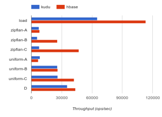

# Kudu: Storage for Fast Analytics on Fast Data（中文译文）

## 译者说明

本文依据同目录的 `source.pdf` 翻译。章节、图表、公式、算法、代码与参考文献按原文结构保留。

Todd Lipcon、David Alves、Dan Burkert、Jean-Daniel Cryans、Adar Dembo、Mike Percy、Silvius Rus、Dave Wang、Matteo Bertozzi、Colin Patrick McCabe、Andrew Wang

Cloudera, Inc.

2015 年 9 月 28 日

> 原文说明：本文档为草稿，后续修订将持续发布到 Kudu 开源项目网站。

## 摘要

Kudu 是一个面向结构化数据的开源存储引擎，既支持低延迟随机访问，也支持高效的分析型访问模式。Kudu 通过水平分区来分布数据，并使用 Raft 共识协议复制每个分区，从而实现较低的平均故障恢复时间和较低的尾延迟。Kudu 的设计以 Hadoop 生态系统为背景，可通过 Cloudera Impala [20]、Apache Spark [28] 和 MapReduce [17] 等工具以多种方式访问。

## 1. 引言

近年来，企业生成并采集的数据量爆炸式增长，推动了能够以低成本、可扩展方式存储海量数据集的开源技术迅速普及。尤其是 Hadoop 生态系统，已经成为此类“大数据”工作负载的核心平台，因为许多传统开源数据库系统迟迟未能提供可扩展的替代方案。

Hadoop 生态中的结构化存储通常采用两种方式。对于静态数据集，数据一般以 Apache Avro [1] 或 Apache Parquet [3] 等二进制格式存储在 HDFS 上；然而，无论 HDFS 还是这些格式，都不支持更新单条记录，也无法高效执行随机访问。可变数据集则通常存放在 Apache HBase [2] 或 Apache Cassandra [21] 等半结构化存储中。这些系统支持低延迟的记录级读写，但在 SQL 分析或机器学习等应用所需的顺序读取吞吐量方面，远远落后于静态文件格式。

HDFS 静态数据集的分析性能与 HBase、Cassandra 的低延迟行级随机访问能力之间存在明显鸿沟。当单个应用同时需要这两种访问模式时，实践者不得不构建复杂架构。Cloudera 的许多客户采用这样的数据流水线：先把流式摄取和更新写入 HBase，再通过周期性作业把表导出为 Parquet，以供后续分析。这类架构有多个缺点：

1. 应用架构师必须编写复杂代码，管理两个系统之间的数据流动与同步。
2. 运维人员必须跨多个不同系统统一管理一致性备份、安全策略和监控。
3. 新数据到达 HBase“暂存区”之后，可能要经过很长时间才能供分析使用。
4. 真实系统经常需要处理迟到数据、对历史记录的修正，或者删除已经迁移到不可变存储中的隐私相关数据。完成这些操作可能需要高代价地重写并交换分区，还可能需要人工干预。

Kudu 是一个从头设计和实现的新存储系统，目标是填补 HDFS [27] 这类高吞吐顺序访问系统与 HBase、Cassandra 这类低延迟随机访问系统之间的空白。现有系统在某些场景中仍有各自优势，而 Kudu 提供一种折中方案，可以显著简化许多常见工作负载的架构。具体而言，Kudu 提供简单的行级插入、更新和删除 API，同时提供与常用静态列式格式 Parquet 相近吞吐量的表扫描。

本文介绍 Kudu 的体系结构。第 2 节从用户视角描述系统，包括数据模型、API 和运维人员可见的系统构件；第 3 节介绍 Kudu 如何跨节点分区和复制数据、如何从故障中恢复，以及如何执行常见操作；第 4 节说明 Kudu 如何在磁盘上组织数据，以兼顾快速随机访问和高效分析；第 5 节讨论 Kudu 与 Hadoop 生态其他项目的集成；第 6 节给出合成工作负载上的初步性能结果。

## 2. Kudu 概览

### 2.1 表与模式

从用户角度看，Kudu 是一个结构化数据表存储系统。一个 Kudu 集群可以包含任意数量的表，每张表都有定义明确的模式，由有限个列组成。每列都有名称、类型（例如 `INT32` 或 `STRING`）以及可选的可空属性。列中一个有序子集被指定为表的主键。主键施加唯一性约束，即给定主键元组至多对应一行；它也是唯一能够支持高效行更新或删除的索引。这种数据模型为关系数据库用户所熟悉，但不同于 Cassandra、MongoDB [6]、Riak [8]、BigTable [12] 等许多其他分布式数据存储。

与关系数据库相同，用户必须在建表时定义表模式。向未定义列插入数据会报错，违反主键唯一性约束也会报错。用户可以随时发出 `ALTER TABLE` 命令来添加或删除列，但不能删除主键列。

Kudu 选择显式指定列类型，而不是采用 NoSQL 风格的“所有值都是字节”，主要有两个原因：

1. 显式类型使系统能够采用特定于类型的列式编码，例如整数位打包。
2. 显式类型使系统能够向常用商业智能或数据探索工具等外部系统暴露类似 SQL 的元数据。

与多数关系数据库不同，Kudu 当前没有二级索引，也没有主键之外的唯一性约束。Kudu 当前要求每张表都定义主键，但我们预计未来版本会增加自动生成代理键的功能。

### 2.2 写操作

创建表后，用户通过 `Insert`、`Update` 和 `Delete` API 修改表。无论哪种操作，用户都必须完整指定主键；基于谓词的删除或更新必须由更高层访问机制处理，参见第 5 节。

Kudu 提供 Java 和 C++ API，并提供实验性的 Python 支持。这些 API 允许精确控制批处理和异步错误处理，以便在批量数据操作（例如数据加载或大规模更新）中摊薄往返通信成本。Kudu 当前没有多行事务 API：从概念上说，每次修改都作为独立事务执行，尽管系统会自动把多次修改批处理以提高性能。同一行内跨列的修改始终原子执行。

### 2.3 读操作

Kudu 只提供 `Scan` 操作来从表中读取数据。扫描时，用户可以添加任意数量的谓词来过滤结果。当前仅支持两类谓词：列与常量值之间的比较，以及复合主键范围。客户端 API 和服务器都会解释这些谓词，以有效减少从磁盘读取以及通过网络传输的数据量。

除谓词外，用户还可以为扫描指定投影。投影是需要读取的列子集。由于 Kudu 的磁盘存储采用列式布局，指定列子集能够显著提高典型分析工作负载的性能。

### 2.4 其他 API

除数据路径 API 外，Kudu 客户端库还提供其他实用功能。Hadoop 生态系统很大一部分性能来自数据本地性调度。Kudu 提供 API，使调用者能够确定数据范围到具体服务器的映射，从而帮助 Spark、MapReduce 或 Impala 等分布式执行框架进行任务调度。

### 2.5 一致性模型

Kudu 允许客户端在两种一致性模式之间选择。默认模式是快照一致性：扫描保证得到一个不会违反因果关系的快照[^1]，因此也保证来自同一客户端的“读己之写”一致性。

默认情况下，Kudu 不提供外部一致性保证。也就是说，如果一个客户端先执行一次写入，再通过外部机制（例如消息总线）与另一个客户端通信，而后者又执行写入，那么这两次写入之间的因果依赖不会被 Kudu 捕获。第三个读取者可能看到包含第二次写入、却不包含第一次写入的快照。

根据我们支持 HBase 等同样不提供外部一致性保证的系统的经验，这对许多用例已经足够。不过，对需要更强保证的用户，Kudu 允许在客户端之间手工传播时间戳：完成写入后，用户可以向客户端库请求一个时间戳令牌；令牌可经外部通道传播给另一个客户端，再传给另一端的 Kudu API，由此维持两个客户端写入之间的因果关系。

如果传播令牌过于复杂，Kudu 还可以像 Spanner [14] 那样使用提交等待（commit-wait）。启用提交等待后，客户端完成写入时可能被延迟一段时间，以确保任何后续写入都能得到正确的因果排序。没有专用计时硬件时，这会给写入带来显著延迟；在默认 NTP 配置下约为 100-1000 毫秒。因此，我们预计只有少数用户会采用该选项。Spanner 发表后，已有若干数据存储开始利用实时时钟；据此，未来几年云服务商有可能把严格的全球时间同步作为差异化服务。

操作时间戳由一种名为 HybridTime [15] 的时钟算法分配，具体细节参见该文献。

[^1]: 在论文所述的 Kudu beta 版本中，这项一致性支持尚未完全实现。本文描述的是系统体系结构和设计，尽管当时仍存在一些已知的一致性缺陷。

### 2.6 时间戳

Kudu 在内部使用时间戳实现并发控制，但不允许用户手工设置写操作的时间戳。这一点不同于 Cassandra 和 HBase；后两者把单元格时间戳视为数据模型的一等组成部分。根据我们支持这些系统用户的经验，虽然高级用户可以有效利用时间戳维度，绝大多数用户却会对该模型感到困惑，并容易产生错误，尤其难以正确理解回填历史时间的插入和删除语义。

不过，Kudu 允许用户为读操作指定时间戳。用户因此可以执行过去某一时点的查询，也可以保证共同构成一次查询的不同分布式任务（例如 Spark 或 Impala 中的任务）读取一致的快照。

## 3. 体系结构

### 3.1 集群角色

Kudu 沿用了 BigTable 和 GFS [18] 及其开源对应系统 HBase、HDFS 的设计：一个 Master 服务器负责元数据，任意数量的 Tablet Server 负责数据。为容错，Master 可以复制；发生故障时，其全部职责都能快速故障切换。所有角色通常都部署在普通商用硬件上，Master 节点没有额外硬件要求。

### 3.2 分区

与多数分布式数据库系统一样，Kudu 中的表采用水平分区。Kudu 沿用 BigTable 的术语，把这些水平分区称为 tablet。根据主键值，任意一行都恰好映射到一个 tablet，因此插入、更新等随机访问操作只影响单个 tablet。对于重视吞吐量的大表，我们建议每台机器配置约 10-100 个 tablet；每个 tablet 可以达到数十 GB。

BigTable 只支持基于键范围的分区，Cassandra 则几乎总是采用哈希分区；Kudu 与二者不同，它支持灵活组合的分区方案。创建表时，用户为表指定一个分区模式。该模式相当于一个函数，把主键元组映射为二进制分区键。每个 tablet 覆盖这些分区键的一个连续范围。因此，客户端执行读写时可以轻易判断给定键应属于哪个 tablet，并据此路由请求。

分区模式由零条或多条哈希分区规则，以及其后可选的一条范围分区规则组成：

- 哈希分区规则由一个主键列子集和桶数构成。例如，在 Kudu 的 SQL 方言中可以写成 `DISTRIBUTE BY HASH(hostname, ts) INTO 16 BUCKETS`。系统先拼接指定列的值，再计算所得字符串哈希码对桶数取模，把元组转换为二进制键。所得桶号以 32 位大端整数编码到最终分区键中。
- 范围分区规则由主键列的一个有序子集构成。它使用保序编码拼接指定列的值，把元组映射成二进制字符串。

借助这些规则，用户可以针对具体工作负载，在查询并行度和查询并发能力之间权衡。例如，考虑一个时间序列应用，行形式为 `(host, metric, time, value)`，插入时 `time` 几乎总是单调递增。如果按时间戳哈希分区，插入负载可以最均匀地分散到所有服务器；但是，查询某台主机上某个指标的一小段时间范围时，就必须扫描所有 tablet，从而限制并发能力。另一种方案是按时间戳范围分区，同时为指标名和主机名分别添加哈希分区规则；这样可以在写入并行度与读取并发能力之间取得较好平衡。

尽管用户必须理解分区概念才能最优地使用 Kudu，分区键编码细节对用户完全透明：API 不暴露编码后的分区键。用户始终使用结构化行对象或 SQL 元组语法指定行、分区切分点和键范围。这种分区灵活性在“NoSQL”领域相对少见，但分析型 MPP 数据库管理系统的用户和管理员对此应当十分熟悉。

### 3.3 复制

为了在大型商用硬件集群上提供高可用性和持久性，Kudu 把所有表数据复制到多台机器。建表时，用户根据应用的可用性服务等级协议指定复制因子，通常为 3 或 5。Kudu Master 力求始终维持所需的副本数，参见第 3.4.2 节。

Kudu 使用 Raft [25] 共识算法复制 tablet。具体而言，Kudu 使用 Raft 让各副本就每个 tablet 的逻辑操作日志（例如插入、更新、删除）达成一致。客户端执行写入时，首先定位 leader 副本，参见第 3.4.3 节，然后向它发送 `Write` RPC。如果客户端信息已经过期，而目标副本不再是 leader，该副本会拒绝请求；客户端随即使本地元数据缓存失效并刷新，再把请求发给新 leader。如果该副本仍是 leader，它会使用本地锁管理器，把本次操作与其他并发操作串行化，选择一个 MVCC 时间戳，然后通过 Raft 向 follower 提议该操作。

如果多数副本接受写入，并把它记录到各自的本地预写日志[^2]，该写入就被视为已经持久复制，可以在所有副本上提交。leader 不必先把操作写入自己的本地日志再提交；即使 leader 磁盘性能不佳，这一设计也有利于平滑延迟。

少数副本发生故障时，leader 仍可继续向 tablet 的复制日志提议并提交操作。leader 自身发生故障时，Raft 会快速选举新 leader。Kudu 默认心跳间隔为 500 毫秒，选举超时为 1500 毫秒，因此 leader 故障后通常能在数秒内选出新 leader。

[^2]: 管理员可以选择在预写日志条目写入操作系统缓冲区缓存后就视为提交，也可以要求执行显式 `fsync` 后才视为提交。后者即使在整个数据中心断电时也能提供持久性，但会显著降低旋转磁盘上的写性能。

Kudu 对 Raft 算法做了两项小幅改进：

1. 按照文献 [19] 的建议，leader 选举失败后采用指数退避。Raft 的持久元数据通常提交到存在竞争的机械硬盘，因此我们发现，要让繁忙集群中的选举收敛，这一扩展是必要的。
2. 新 leader 联系日志与自身分歧的 follower 时，Raft 原方案要求逐条操作向后回退，直至发现分歧点。Kudu 则立即跳回最后一个已知的 `committedIndex`，因为任何存在分歧的 follower 都保证拥有这个位置。代价是网络上可能传输冗余操作，但潜在往返次数被最小化。这种方案实现简单，并确保一次往返后就能中止分歧操作。

Kudu 复制的是 tablet 的操作日志，而不是磁盘存储本身。一个 tablet 的各副本具有完全解耦的物理存储。这带来两个优点：

- 当某个副本执行 flush 或 compaction 等物理层后台操作时，其他节点不太可能恰好同时在同一 tablet 上执行相同操作。Raft 得到多数副本确认即可提交，因此这种解耦减轻了物理层操作对客户端写入尾延迟的影响。我们计划未来实现文献 [16] 所述的推测性读请求等技术，进一步降低并发读写工作负载中的读取尾延迟。
- 开发过程中，团队在 Kudu tablet 的物理存储层发现过一些罕见竞态条件。由于各副本存储层彼此解耦，这些竞态从未造成不可恢复的数据丢失：系统总能检测到某个副本已经损坏或悄然偏离多数派，并对它进行修复。

#### 3.3.1 配置变更

Kudu 按照文献 [24] 提出的一次一个（one-by-one）算法实现 Raft 配置变更。每次配置变更中，Raft 配置的投票者数量最多变化 1。把 3 副本配置扩展为 5 副本时，必须分别提议并提交两次配置变更，即 `3 -> 4` 和 `4 -> 5`。

Kudu 通过远程引导（remote bootstrap）添加新服务器。为增加新副本，系统首先把它加入 Raft 配置，甚至早于通知目标服务器即将向它复制新副本。配置变更提交后，当前 Raft leader 副本发起 `StartRemoteBootstrap` RPC，使目标服务器从当前 leader 拉取 tablet 数据与日志的快照。传输完成后，新服务器按照重启后的相同流程打开 tablet。当它打开 tablet 数据并重放必要的预写日志后，就完整复制了传输开始时 leader 的状态，可以作为功能完整的副本响应 Raft RPC。

当前实现会立即把新服务器添加为 `VOTER` 副本。这有一个缺点：从 3 服务器配置变成 4 服务器配置后，每个操作都需要 4 台服务器中的 3 台确认。新服务器正在复制，无法确认操作；如果快照传输期间又有一台服务器崩溃，在远程引导完成前，tablet 将无法执行写入。

为解决这个问题，我们计划实现 `PRE_VOTER` 副本状态。在该状态下，leader 会向目标副本发送 Raft 更新并触发远程引导，但计算多数派规模时不把它计为投票者。当检测到 `PRE_VOTER` 已完全追上当前日志时，leader 自动提议并提交另一次配置变更，把新副本转换为完整 `VOTER`。

从 tablet 移除副本时采用类似方式：当前 Raft leader 提议新的配置，其中不再包含要驱逐的节点。变更提交后，其余节点不再向被驱逐节点发消息，但被驱逐节点本身并不知道自己已被移除。配置变更提交后，剩余节点向 Master 报告；Master 负责清理这个孤儿副本，参见第 3.4.2 节。

### 3.4 Kudu Master

Kudu 的中央 Master 进程承担三项关键职责：

1. 充当目录管理器，跟踪系统中存在的表和 tablet，以及它们的模式、期望复制级别等元数据。创建、修改或删除表时，Master 跨 tablet 协调这些操作，并确保它们最终完成。
2. 充当集群协调器，跟踪集群中仍存活的服务器，并在服务器故障后协调数据重新分布。
3. 充当 tablet 目录，跟踪每个 tablet 的副本由哪些 Tablet Server 承载。

我们选择集中式、可复制的 Master，而不是完全对等的体系结构，原因是这种设计更易实现、调试和运维。

#### 3.4.1 目录管理器

Master 自身承载一张仅含一个 tablet、且禁止用户直接访问的表。Master 在内部把目录信息写入该 tablet，并始终在内存中维护目录的完整写穿缓存。现代商用硬件内存容量很大，而每个 tablet 的元数据量很小，因此短期内这不太可能成为可扩展性问题；如果未来遇到瓶颈，把它演进为分页缓存也很直接。

目录表为系统中的每张表维护少量状态，尤其包括当前表模式版本、表状态（正在创建、运行中、正在删除等）以及组成该表的 tablet 集合。Master 处理建表请求时，首先在目录表中写入一条状态为 `CREATING` 的表记录。随后，它异步选择承载 tablet 副本的 Tablet Server，创建 Master 侧的 tablet 元数据，并异步发送创建副本请求。如果多数副本上的创建失败或超时，可以安全地删除该 tablet，再用一组新副本重新创建。如果 Master 在操作中途故障，表记录会表明需要继续向前执行，Master 可以从中断处恢复。

模式变更和删除等操作采用类似方案：Master 先确保变更传播到相关 Tablet Server，再把新状态写入自身存储。Master 发往 Tablet Server 的消息在所有情况下都设计为幂等，因此崩溃重启后可以安全重发。

由于目录表本身持久化在 Kudu tablet 中，Master 可以使用 Raft 把持久状态复制给备用 Master 进程。当前备用 Master 只作为 Raft follower，不处理客户端请求。备用 Master 被 Raft 选为 leader 后，会扫描目录表、加载内存缓存，然后按照 Master 重启的相同流程开始作为活动 Master 工作。

#### 3.4.2 集群协调

Kudu 集群中的每台 Tablet Server 都静态配置了一组 Kudu Master 主机名。Tablet Server 启动时向 Master 注册，并随后发送 tablet 报告，说明本机承载的全部 tablet。第一份报告包含所有 tablet，后续报告则是增量的，只包含新建、删除或发生修改（例如处理了模式变更或 Raft 配置变更）的 tablet。

Kudu 的一个关键设计点是：Master 是目录信息的事实来源，但只是动态集群状态的观察者。Tablet Server 才是 tablet 副本位置、当前 Raft 配置、当前 tablet 模式版本等信息的权威来源。由于 tablet 副本通过 Raft 对所有状态变更达成一致，每个变更都可以映射到其提交时对应的 Raft 操作索引。Master 因此可以让所有 tablet 状态更新保持幂等并抵御传输延迟：它只需比较更新携带的 Raft 操作索引，如果不比当前视图中的索引新，就丢弃该更新。

这一设计把许多责任交给 Tablet Server。例如，Kudu 不由 Master 检测 Tablet Server 崩溃，而把该职责委托给所有在故障机器上拥有副本的 tablet 的 Raft `LEADER`。leader 跟踪自己最后一次与每个 follower 成功通信的时间；如果长时间无法通信，就宣布该 follower 已死，并提议 Raft 配置变更将它驱逐。变更成功提交后，其余 Tablet Server 向 Master 发送 tablet 报告，告知 leader 已做出的决定。

为使 tablet 恢复到期望副本数，Master 根据集群全局视图选择一台 Tablet Server 承载新副本，然后向该 tablet 当前 leader 建议一次配置变更。但 Master 自身无权修改 tablet 配置；它必须等待 leader 提议并提交配置变更，之后再通过 tablet 报告获知成功。如果 Master 的建议失败，例如消息丢失，它会周期性地持续重试直至成功。操作带有发生降级时配置的唯一索引，因此即使 Master 发出多个相互冲突的建议（例如刚完成 Master 故障切换时），这些操作也完全幂等且无冲突。

Master 对多余 tablet 副本的处理也类似。如果 tablet 报告表明某副本已从 tablet 配置移除，Master 会持续向被移除节点发送 `DeleteTablet` RPC，直到调用成功。为保证 Master 崩溃后最终仍能完成清理，如果 tablet 报告显示某 Tablet Server 承载的副本不在最新已提交 Raft 配置中，Master 也会发送此 RPC。

#### 3.4.3 Tablet 目录

为了在不增加中间网络跳数的情况下高效读写，客户端向 Master 查询 tablet 位置信息。客户端是“厚客户端”，会维护本地元数据缓存，记录此前访问过的每个 tablet 的最新信息，包括 tablet 的分区键范围和 Raft 配置。

客户端缓存随时可能过期。如果客户端把写入发给已经不再是某 tablet leader 的服务器，服务器会拒绝请求，客户端再联系 Master 查询新 leader。如果客户端与其认定的 leader 通信时遇到网络错误，也采取相同策略，并假定该 tablet 很可能已经选出新 leader。我们计划未来在客户端误联系非 leader 副本时，把当前 Raft 配置附带在错误响应中，从而在 leader 选举后省去一次到 Master 的额外往返，因为 follower 通常拥有最新信息。

Master 把所有 tablet 分区范围信息保存在内存中，因此能扩展到很高的每秒请求数，并以很低延迟响应。在一个包含 270 个节点、运行数千个 tablet 基准负载的集群中，tablet 位置查询 RPC 的第 99.99 百分位延迟为 3.2 毫秒，第 95 百分位为 374 微秒，第 75 百分位为 91 微秒。因此，在当前目标集群规模下，tablet 目录查询预计不会成为扩展瓶颈。即便未来成为瓶颈，由于提供过期位置信息始终是安全的，这部分 Master 功能也可以轻易地分区并复制到任意数量的机器。

## 4. Tablet 存储

在 Tablet Server 内，每个 tablet 副本都作为完全独立的实体运行，与第 3.2、3.3 节所述的分区和复制系统高度解耦。Kudu 开发过程中，团队发现可以在一定程度上独立开发存储层；事实上，许多功能测试和单元测试完全局限于 tablet 实现内部。

由于这种解耦，团队正在探索按表、按 tablet、甚至按副本选择底层存储布局，使其成为文献 [26] 所提“分裂镜像”（Fractured Mirrors）的分布式对应方案。不过，当前只提供本节介绍的一种存储布局。

### 4.1 概览

Kudu 的 tablet 存储实现有三个目标：

1. 快速列式扫描。要提供与 Parquet、ORCFile [7] 等先进不可变格式相当的分析性能，绝大多数扫描必须由高效编码的列式数据文件提供服务。
2. 低延迟随机更新。为了快速更新或读取任意行，随机访问查找复杂度必须为 `O(log n)`。
3. 性能一致性。根据我们支持其他数据存储系统的经验，用户愿意牺牲峰值性能来换取可预测性。

为了同时满足这些要求，Kudu 没有复用现有存储引擎，而是实现了一种新的混合列式存储体系结构。

### 4.2 RowSet

Kudu 的 tablet 进一步划分为更小的 RowSet。只存在于内存中的 RowSet 称为 MemRowSet；同时存在于磁盘和内存中的称为 DiskRowSet。任意一条仍存活、未删除的行恰好存在于一个 RowSet 中，所以各 RowSet 构成互不相交的行集合；但不同 RowSet 的主键区间可以相交。

任意时刻，一个 tablet 都有一个 MemRowSet，用于保存最近插入的所有行。它完全位于内存中，因此后台线程会周期性地把 MemRowSet flush 到磁盘；调度机制见第 4.11 节。

当某个 MemRowSet 被选中 flush 时，一个新的空 MemRowSet 会替换它。旧 MemRowSet 被写入磁盘，变成一个或多个 DiskRowSet。flush 完全并发执行：读者在旧 MemRowSet flush 期间仍能访问它；对该 MemRowSet 中行的更新和删除会被谨慎跟踪，并在 flush 完成时前滚到磁盘数据中。

### 4.3 MemRowSet 实现

MemRowSet 由支持乐观锁的内存并发 B-tree 实现，大体基于 MassTree [22]，但有以下变化：

1. 不支持从树中移除元素，而使用 MVCC 记录表示删除。MemRowSet 最终会 flush 到其他存储，因此可以把这些记录的真正移除延后到系统其他部分。
2. 不支持任意的原地记录更新，只允许不改变值大小的修改。这样就能使用原子的比较并交换操作，把修改追加到每条记录的链表中。
3. 与 B+-tree [13] 一样，用 `next` 指针连接叶节点，从而改善关键的顺序扫描性能。
4. 不实现完整的“树的 trie”，而只使用单棵树，因为相比 MassTree 的原始应用，Kudu 没那么强调极高的随机访问吞吐量。

为了优化扫描而非随机访问，内部节点和叶节点都稍大，尺寸为 4 个缓存行，即 256 字节。

不同于 Kudu 中的大多数数据，MemRowSet 采用行式布局存储行。由于数据始终位于内存，性能仍可接受。为了在行式存储下最大化吞吐量，扫描器使用 SSE2 内存预取指令提前预取一个叶节点，并通过 LLVM [5] 即时编译记录投影操作。与朴素实现相比，这些优化显著提升了性能。

插入 B-tree 时，系统按照第 3.2 节所述的保序编码对每行主键编码。这样，树遍历时只需使用 `memcmp` 比较；MemRowSet 的有序性也让主键范围扫描和单键查找更加高效。

### 4.4 DiskRowSet 实现

MemRowSet flush 到磁盘后成为 DiskRowSet。flush 过程中，每写入 32 MB I/O 就切换到新的 DiskRowSet，保证任一 DiskRowSet 都不会太大，从而支持第 4.10 节介绍的高效增量 compaction。MemRowSet 已经有序，因此 flush 得到的 DiskRowSet 也有序，而且各切分段拥有互不相交的主键区间。

DiskRowSet 由两类主要组件组成：基础数据（base data）和 delta 存储。基础数据是 DiskRowSet 中各行按列组织的表示。每个列分别写入磁盘上的单个连续数据块；列内部又划分为小页面，以支持细粒度随机读取；嵌入式 B-tree 索引根据页面在 RowSet 中的序数偏移高效定位页面。

列页面可以使用字典编码、bitshuffle [23]、前缀编码等多种编码，也可以选择 LZ4、gzip、bzip2 等通用二进制压缩。用户可以按列显式指定编码与压缩选项，例如让很少访问的大文本列使用 gzip，而通常保存小整数的列使用位打包。Kudu 支持的若干页面格式也为 Parquet 所用，其实现与 Impala 的 Parquet 库共享大量代码。

除了为用户在表中定义的每列写数据，Kudu 还写入一个主键索引列，保存每行编码后的主键；同时写入一个分块 Bloom filter [10]，可根据编码主键检测某行是否可能存在。

列式编码难以原地更新，所以基础数据中的列一经 flush 就视为不可变。更新和删除改由 delta 存储跟踪。delta 存储可以是内存中的 DeltaMemStore，也可以是磁盘上的 DeltaFile。DeltaMemStore 是并发 B-tree，与前述 MemRowSet 共享实现；DeltaFile 是二进制类型的列块。

两种 delta 存储都维护从 `(行偏移, 时间戳)` 元组到 `RowChangeList` 记录的映射。行偏移只是行在 RowSet 内的序数索引，例如主键最小的行偏移为 0；时间戳是操作最初写入时分配的 MVCC 时间戳；`RowChangeList` 是二进制编码的行变更列表，例如“把列 id 3 设为 `foo`”或“删除”。

更新 DiskRowSet 中的数据时，系统首先查询主键索引列。利用嵌入的 B-tree 索引，可以高效定位含目标行的页面；利用页面级元数据，可以确定页面内第一个单元格的全局行偏移；再通过页内搜索（例如内存二分搜索）计算目标行在整个 DiskRowSet 中的偏移。确定偏移后，系统向该 RowSet 的 DeltaMemStore 插入一条新的 delta 记录。

### 4.5 Delta flush

DeltaMemStore 位于内存，因此容量有限。调度 MemRowSet flush 的同一后台进程也会调度 DeltaMemStore flush。执行 flush 时，系统用新的空存储替换现有 DeltaMemStore，再把旧存储写到磁盘，形成 DeltaFile。DeltaFile 是一个简单的二进制列，其中包含此前内存数据的不可变副本。

### 4.6 INSERT 路径

如前所述，每个 tablet 有一个 MemRowSet 保存最近插入的数据。但不能简单地把所有插入直接写入当前 MemRowSet，因为 Kudu 强制主键唯一性约束。换言之，与许多 NoSQL 存储不同，Kudu 区分 `INSERT` 与 `UPSERT`。

为执行唯一性约束，Kudu 插入新行之前必须查询所有现有 DiskRowSet。一个 tablet 可能有数百乃至数千个 DiskRowSet，因此必须既减少需要查询的 DiskRowSet 数量，又提高单个 DiskRowSet 内的查找效率。

为了筛除不必查询的 DiskRowSet，每个 DiskRowSet 都保存现有键集合的 Bloom filter。由于现有 DiskRowSet 永远不会插入新键，Bloom filter 是静态数据。系统把 Bloom filter 划分成 4 KB 页面，每页对应一小段键范围，再用不可变 B-tree 索引这些页面。页面及其索引都缓存在服务器级 LRU 页面缓存中，因此绝大多数 Bloom filter 访问不需要物理磁盘寻道。

此外，每个 DiskRowSet 还保存最小、最大主键，系统利用这些键界把各 DiskRowSet 组织到区间树中，进一步筛除给定键查找中不必查询的 DiskRowSet。第 4.10 节所述后台 compaction 会重新组织 DiskRowSet，提高区间树筛选的有效性。

对于无法筛除的 DiskRowSet，系统最终在其编码主键列中查找待插入键。主键列内嵌 B-tree 索引，保证最坏情况下只需对数次磁盘寻道。访问同样经过页面缓存，因此对键空间热点区域无需物理磁盘寻道。

### 4.7 读取路径

与 X100 [11] 等系统相似，Kudu 读取路径始终按批处理行，以摊薄函数调用开销，并为循环展开和 SIMD 指令提供更多优化机会。Kudu 的内存批格式包含一个顶层结构，其中保存指向每个待读列小数据块的指针。因此批数据在内存中也是列式的，从磁盘列存复制到批中时无需计算行内偏移。

读取 DiskRowSet 时，Kudu 首先判断能否使用扫描中的范围谓词筛减该 DiskRowSet 内的行范围。例如，如果扫描设置了主键下界，系统在主键列中执行 seek 来确定下界行偏移；上界同理。这样，键范围谓词就被转换为行偏移范围谓词，后者无需昂贵的字符串比较，更容易执行。

接下来，Kudu 每次扫描一列。首先把目标列定位到正确行偏移；如果没有谓词，偏移为 0，否则使用此前确定的起始行。然后使用对应页面编码的解码器，把源列的单元格复制到行批。最后查询 delta 存储，根据当前扫描的 MVCC 快照判断是否有更晚更新把单元格替换成新版本，并按需把这些变更应用到内存批。

delta 基于数字行偏移而非主键存储，所以应用 delta 非常高效：不需要逐行分支，也不需要昂贵的字符串比较。对投影中的每一列完成上述过程后，系统返回批结果；这些结果通常会复制到 RPC 响应中发回客户端。Tablet Server 为每个扫描器维护有状态的服务器端迭代器，后续请求无需重新 seek，而能从各列文件中的上一位置继续。

### 4.8 延迟物化

如果扫描器指定了谓词，Kudu 会对列数据执行延迟物化 [9]。具体而言，系统优先读取带有关联范围谓词的列，再读取其他列。每读完这样一列，就立即计算对应谓词。如果谓词过滤掉当前批中的所有行，系统直接跳过其他列。对选择性较强的谓词，这会显著提高速度，因为其他被选列的大部分数据永远不必从磁盘读取。

### 4.9 Delta compaction

delta 并非列式存储；随着越来越多的 delta 应用于基础数据，tablet 的扫描速度会逐渐下降。因此，Kudu 的后台维护管理器会周期性扫描 DiskRowSet，寻找累积大量 delta 的情况；判断依据是基础数据行数与 delta 数量的比率。随后调度 delta compaction，把这些 delta 合并回基础数据列。

delta compaction 会专门识别这样一种常见情况：大多数 delta 只影响列的一个子集。例如，SQL 批操作经常只更新宽表的一列。此时 delta compaction 只重写该列，避免对其他未修改列执行 I/O。

### 4.10 RowSet compaction

除把 delta 合并回基础数据外，Kudu 还会周期性地把不同 DiskRowSet 合并，这一过程称为 RowSet compaction。它对两个或更多 DiskRowSet 执行基于键的归并，产生有序的输出行流。输出重新写入新的 DiskRowSet，仍然每 32 MB 切换一次，确保系统中没有过大的 DiskRowSet。

RowSet compaction 有两个目标：

1. 借此移除已经删除的行。
2. 减少键范围相互重叠的 DiskRowSet 数量。重叠减少后，随机选择的某个键预期可能出现的 RowSet 数量也会减少。这个数量构成了 tablet 内执行一次写操作所需 Bloom filter 查找次数、进而所需磁盘寻道次数的上界。

### 4.11 维护调度

如前文所述，Kudu 执行多种后台维护操作，以降低内存用量并改善磁盘布局性能。这些操作由 Tablet Server 进程内的一组维护线程执行。为实现性能一致性的设计目标，这些线程始终运行，而不是由特定事件或条件触发。一次维护操作完成后，调度器评估磁盘存储状态，并通过一组启发式规则选择下一项操作，以平衡内存用量、预写日志保留量以及未来读写操作的性能。

为选择需要 compact 的 DiskRowSet，维护调度器求解一个优化问题：给定 I/O 预算（通常为 128 MB），选择一组 DiskRowSet，使 compaction 最大程度降低前述预期寻道次数。这个优化可以化为一系列经典整数背包问题实例，并能在数毫秒内高效求解。

维护线程持续运行小粒度工作，因此操作能快速响应工作负载变化。例如，插入负载增加时，调度器迅速把内存存储 flush 到磁盘；插入负载降低后，服务器在后台执行 compaction，提高未来写入的性能。这样可使性能平滑过渡，方便开发人员和运维人员进行容量规划并估计工作负载的延迟分布。

## 5. Hadoop 集成

### 5.1 MapReduce 与 Spark

Kudu 在 Hadoop 生态背景下构建，团队优先实现了与其他 Hadoop 组件的若干关键集成。Kudu 提供绑定，使 MapReduce 作业能够从 Kudu 表读取或向 Kudu 表输出数据；这些绑定也可直接用于 Spark [28]。一层轻量适配代码把 Kudu 表绑定到 DataFrame、Spark SQL 表等更高层 Spark 概念。

这些绑定原生支持以下功能：

- 数据本地性：输入格式在内部查询 Kudu Master，确定每个 tablet 的当前位置，从而支持数据本地处理。
- 列投影：输入格式提供简单 API，让用户选择作业需要的列，从而尽量减少 I/O。
- 谓词下推：输入格式提供简单 API 来指定谓词；谓词在服务器端求值，行通过筛选后才传给作业。谓词下推提高性能，也可通过 Spark SQL 等更高层接口轻松使用。

### 5.2 Impala

Kudu 也与 Cloudera Impala [20] 深度集成。事实上，Kudu 自身不提供 shell 或 SQL 解析器；其 SQL 操作支持完全来自 Impala 集成。该集成包括以下关键功能：

- 数据本地性：Impala 规划器使用 Kudu Java API 检查 tablet 位置信息，把后端查询处理任务分发到存储对应数据的节点。典型查询无需通过网络把数据从 Kudu 传给 Impala。团队当时还在研究基于共享内存传输的进一步优化。
- 谓词下推：Impala 规划器能够识别可下推到 Kudu 的谓词。因为 Kudu 只在谓词通过后才延迟物化其他列，下推谓词在许多情况下能显著减少 I/O。
- DDL 扩展：Impala 的 `CREATE TABLE` 等 DDL 语句已扩展，可指定 Kudu 分区模式、复制因子和主键定义。
- DML 扩展：Kudu 是 Hadoop 生态中第一个适合快速分析的可变存储，Impala 此前不支持 `UPDATE`、`DELETE` 等修改语句。为 Kudu 表集成时实现了这些语句。

Impala 的模块化体系结构允许单个查询透明连接来自不同存储组件的数据。例如，可以把 HDFS 上的文本日志文件与 Kudu 中的大型维表连接。

## 6. 性能评估

### 6.1 与 Parquet 的比较

为评估 Kudu 的分析工作负载性能，我们在一个 75 节点集群上加载了业界标准 TPC-H 数据集，规模因子为 100。每个节点有 64 GB 内存、12 块机械硬盘和两颗 2 GHz 的 6 核 Xeon E5-2630L 处理器。集群总内存远大于查询数据量，因此所有查询完全基于缓存数据运行；不过，全部数据都已经完整持久化到 Kudu 的列式 DiskRowSet，而不是仍留在内存存储中。

我们使用 Impala 2.2，在 Parquet 与 Kudu 存储的同一数据集上分别运行全部 22 条 TPC-H 查询。对于 Kudu 表，除很小的 `nation` 和 `region` 维表各自存储在单个 tablet 中外，其余每张表都按主键哈希分成 256 个桶。所有数据都通过 Impala 内的 `CREATE TABLE AS SELECT` 语句加载。

当时尚未进行包含并发工作负载的深入基准测试，我们先比较了两种系统中各 TPC-H 查询的墙钟时间。结果见表 1。全部查询的平均结果中，Kudu 比 Parquet 快 31%。我们认为优势来自两个因素：

1. 延迟物化。TPC-H 中若干查询在 `lineitem` 等大表上包含选择性较强的谓词。Kudu 支持延迟物化，当谓词不匹配时可避免其他列的 I/O 和 CPU 开销；Impala 当时的 Parquet 实现不支持该功能。
2. CPU 效率。Impala 的 Parquet reader 尚未充分优化，当时会执行许多逐行函数调用，这些分支限制了 CPU 效率。

随着 Parquet 实现持续优化，Kudu 相对于 Parquet 的优势预计会逐渐缩小。此外，在磁盘驻留工作负载上，Parquet 可能表现更好，因为它执行 8 MB 的大块 I/O，而 Kudu 执行粒度较小的页面级访问。尽管 Kudu 与列式格式之间的性能对比仍值得深入研究，但结果已经表明：Kudu 在提供可变性的同时，可以达到与不可变存储相近的扫描速度。

**表 1：TPC-H 查询时间，Impala on Kudu 与 Impala on Parquet/HDFS 对比（秒，越低越好）**

| 存储 | Q1 | Q2 | Q3 | Q4 | Q5 | Q6 | Q7 | Q8 |
| --- | ---: | ---: | ---: | ---: | ---: | ---: | ---: | ---: |
| HDFS | 4.1 | 10.4 | 7.6 | 9.2 | 17.5 | 3.5 | 12.7 | 31.5 |
| Kudu | 4.3 | 9.1 | 6.1 | 7.5 | 16.0 | 1.4 | 13.8 | 10.5 |

| 存储 | Q9 | Q10 | Q11 | Q12 | Q13 | Q14 | Q15 | Q16 |
| --- | ---: | ---: | ---: | ---: | ---: | ---: | ---: | ---: |
| HDFS | 49.7 | 6.9 | 3.3 | 8.5 | 6.1 | 3.3 | 4.2 | 2.8 |
| Kudu | 47.7 | 3.8 | 3.4 | 3.0 | 5.5 | 1.4 | 3.9 | 2.4 |

| 存储 | Q17 | Q18 | Q19 | Q20 | Q21 | Q22 | 几何平均 |
| --- | ---: | ---: | ---: | ---: | ---: | ---: | ---: |
| HDFS | 23.4 | 14.8 | 19.4 | 6.1 | 22.4 | 3.6 | 8.8 |
| Kudu | 17.7 | 19.0 | 17.8 | 7.0 | 12.0 | 3.6 | 6.7 |

### 6.2 与 Phoenix 的比较

Apache Phoenix [4] 是 Hadoop 生态中的另一种 SQL 实现，在 HBase 上提供 SQL 查询层。Phoenix 的主要目标并非分析工作负载，我们仍进行了一组小规模比较，以说明 Kudu 与 HBase 在以扫描为主的分析工作负载上存在数量级的性能差异。

为排除可扩展性影响并比较原始扫描性能，实验使用较小的集群：9 个工作节点和 1 个 Master 节点；每个节点有 48 GB 内存、3 块数据盘和两颗 2.13 GHz 的 4 核 Xeon L5630 处理器。软件版本为 Phoenix 4.3 和 HBase 1.0。

实验通过 Phoenix 提供的 `CsvBulkLoadTool` MapReduce 作业，把同一张 TPC-H `lineitem` 表（CSV 格式 62 GB）加载到 Phoenix。Phoenix 表配置为 100 个哈希分区，Kudu 中创建相同数量的 tablet。由于 Kudu 当时不支持 `DECIMAL` 类型，两套系统都用 `DOUBLE` 保存非整数数值列。

HBase 采用默认块缓存设置，因此每台服务器有 9.6 GB 堆上缓存。Kudu 只配置 1 GB 进程内块缓存，主要依赖操作系统缓冲区缓存避免物理磁盘 I/O。HBase 使用 Phoenix 提供的默认表属性：`FAST_DIFF` 编码、不压缩、每个单元格保留一个历史版本。Impala 对不能从运行时代码生成中获益的查询设置了单查询选项，关闭代码生成，从而消除与存储引擎无关的固定开销。

数据加载后，我们显式执行 major compaction 以确保 100% HDFS 块本地性，并保证表 region（相当于 Kudu tablet）均匀分布到 9 个工作节点。62 GB 数据在 HBase 中经过复制后膨胀到约 570 GB；Kudu 中经过复制后为 227 GB[^3]。HBase Region Server 与 Kudu Tablet Server 都分配 24 GB 内存，并在各自基准测试期间单独运行。两个工作负载都确认没有产生硬盘读取，以便聚焦 CPU 效率；我们预计在磁盘驻留工作负载上，Kudu 的列式布局和更高存储效率会进一步扩大优势。

为聚焦扫描速度而非连接性能，测试只选择读取 `lineitem` 表的 TPC-H Q1；另运行表 2 中几条简单查询，以量化相同硬件上 Impala-Kudu 与 Phoenix-HBase 的性能差异。每条查询运行 10 次，报告中位运行时间。对分析型查询，Impala-Kudu 比 Phoenix-HBase 快 16-187 倍。对于较短的主键范围扫描，两者都在 1 秒内返回；Phoenix 因查询规划固定开销更小而胜出。结果见表 3。

[^3]: 当时的 `CREATE TABLE AS SELECT` 实现实际上没有启用字典压缩；启用后，Kudu 表大小还能再减半。

**表 2：比较 Impala-Kudu 与 Phoenix-HBase 所用查询**

| 查询 | 类型 | SQL |
| --- | --- | --- |
| Q1 | 扫描 6 列 | `[TPC-H Q1]` |
| Q2 | 不读取数据列的扫描 | `SELECT COUNT(*) FROM lineitem;` |
| Q3 | 非键谓词 | `SELECT COUNT(*) FROM lineitem WHERE l_quantity = 48;` |
| Q4 | 键查找 | `SELECT COUNT(*) FROM lineitem WHERE l_orderkey = 2000;` |

**表 3：Phoenix-HBase、Impala-Kudu 与 Impala-Parquet 对比（查询时间单位为秒）**

| 系统 | 加载 | Q1 | Q2 | Q3 | Q4 |
| --- | ---: | ---: | ---: | ---: | ---: |
| Phoenix-HBase | 2152 秒* | 219 | 76 | 131 | 0.04 |
| Impala-Kudu | 1918 秒 | 13.2 | 1.7 | 0.7 | 0.15 |
| Impala-Parquet | 155 秒 | 9.3 | 1.4 | 1.5 | 1.37 |

* Phoenix 加载时间不包括为确保数据本地性而执行 major compaction 的时间；该操作还需要约 20 分钟。

### 6.3 随机访问性能

Kudu 并非以 OLTP 存储为目标，但其关键目标之一是适合较轻量的随机访问工作负载。我们在第 6.2 节使用的同一个 10 节点集群上，用 Yahoo Cloud Serving Benchmark（YCSB）评估 Kudu 的随机访问性能。实验从 YCSB 主分支构建[^4]，并添加了 Kudu 绑定。

Kudu 和 HBase 都配置为最多使用 24 GB 内存。HBase 自动分配 9.6 GB 给块缓存，其余堆空间供内存存储使用；Kudu 只为块缓存分配 1 GB，更依赖 Linux 缓冲区缓存。没有进行其他调优。两套系统都把表预先切分成 100 个 tablet 或 region，并均匀分布到各节点。

YCSB 加载的数据集有 1 亿行，每行 10 个数据列，每列 100 字节。由于 Kudu 没有特殊“行键列”概念，Kudu 模式中增加了显式键列。该数据集完全装入内存。我们计划未来继续测试闪存驻留和磁盘驻留工作负载，但认为随着廉价内存容量增长，大多数对延迟敏感的在线工作负载将主要驻留在内存。

五个 YCSB 工作负载见表 4。执行顺序为：先加载表，然后连续运行 A、B、C、D，中间不停顿；每个工作负载执行 1000 万次操作。加载数据时使用 16 个客户端线程，并启用客户端缓冲，以向后端存储引擎发送更大批次；其他工作负载使用 64 个客户端线程，并关闭客户端缓冲。

每种存储引擎都完整运行两轮，两轮之间删除并重新加载表。第二轮把 A、B、C 的默认 Zipf（幂律）访问分布替换为均匀分布。工作负载 D 使用特殊访问分布：随机插入行，并随机读取最近插入的行。

实验没有运行执行短范围扫描的工作负载 E，因为当时 Kudu 客户端无法限制返回行数；也没有运行工作负载 F，因为它依赖 Kudu 尚不支持的原子比较并交换原语。我们计划在这些功能加入 Kudu 后补测。

[^4]: YCSB Git 提交哈希为 `1f8cc5abdcad206c37039d9fbaea7cbf76089b48`。

**表 4：YCSB 工作负载**

| 工作负载 | 说明 |
| --- | --- |
| Load | 加载表 |
| A | 50% 随机读，50% 更新 |
| B | 95% 随机读，5% 更新 |
| C | 100% 随机读 |
| D | 95% 随机读，5% 插入 |

**图 1：YCSB 随机访问工作负载的操作吞吐量，比较 Kudu 与 HBase。纵轴依次为加载、Zipf 分布 A/B/C、均匀分布 A/B/C 和工作负载 D；横轴为每秒操作数。**

图 1 给出了 YCSB 报告的各工作负载吞吐量。几乎所有工作负载中，HBase 的吞吐量都高于 Kudu。Kudu 在 Zipf 更新负载中表现尤其差，因为读取所耗 CPU 时间主要花在应用 delta 存储中很长的修改链上[^5]。HBase 长期以来一直以这类在线负载为目标，因此在两种访问分布下表现相近。

由于在 Kudu 首个 beta 版本发布前准备论文的时间有限，我们尚无足够数据报告更长时间运行的工作负载，也没有给出延迟百分位摘要；后续获得结果后将更新论文。

[^5]: 团队已经识别出该代码路径中的若干潜在优化，记录在 `KUDU-749` 中。

## 7. 致谢

除本文作者外，Kudu 还受益于许多贡献者的工作。原文特别感谢 Chris Leroy、Binglin Chang、Guangxiang Du、Martin Grund、Eli Collins、Vladimir Feinberg、Alex Feinberg、Sarah Jelinek、Misty Stanley-Jones、Brock Noland、Michael Crutcher、Justin Erickson 和 Nong Li。

## 参考文献

- [1] Apache Avro. http://avro.apache.org.
- [2] Apache HBase. http://hbase.apache.org.
- [3] Apache Parquet. http://parquet.apache.org.
- [4] Apache Phoenix. http://phoenix.apache.org.
- [5] LLVM. http://www.llvm.org.
- [6] MongoDB. http://www.mongodb.org.
- [7] Orcfile. https://cwiki.apache.org/confluence/display/Hive/LanguageManual+ORC.
- [8] Riak. https://github.com/basho/riak.
- [9] D. Abadi, D. Myers, D. DeWitt, and S. Madden. Materialization strategies in a column-oriented DBMS. In Data Engineering, 2007. ICDE 2007. IEEE 23rd International Conference on, pages 466-475, April 2007.
- [10] B. H. Bloom. Space/time trade-offs in hash coding with allowable errors. Communications of the ACM, 13(7):422-426, July 1970.
- [11] P. Boncz, M. Zukowski, and N. Nes. MonetDB/X100: Hyper-pipelining query execution. In CIDR, 2005.
- [12] F. Chang, J. Dean, S. Ghemawat, W. C. Hsieh, D. A. Wallach, M. Burrows, T. Chandra, A. Fikes, and R. E. Gruber. Bigtable: A distributed storage system for structured data. ACM Transactions on Computer Systems, 26(2):4:1-4:26, June 2008.
- [13] D. Comer. Ubiquitous B-tree. ACM Computing Surveys, 11(2):121-137, June 1979.
- [14] J. C. Corbett, J. Dean, M. Epstein, A. Fikes, C. Frost, J. J. Furman, S. Ghemawat, A. Gubarev, C. Heiser, P. Hochschild, W. Hsieh, S. Kanthak, E. Kogan, H. Li, A. Lloyd, S. Melnik, D. Mwaura, D. Nagle, S. Quinlan, R. Rao, L. Rolig, Y. Saito, M. Szymaniak, C. Taylor, R. Wang, and D. Woodford. Spanner: Google's globally-distributed database. In Proceedings of the 10th USENIX Conference on Operating Systems Design and Implementation, OSDI'12, pages 251-264, Berkeley, CA, USA, 2012. USENIX Association.
- [15] T. L. David Alves and V. Garg. HybridTime - accessible global consistency with high clock uncertainty. Technical report, UT Austin, Cloudera Inc., April 2014.
- [16] J. Dean and L. A. Barroso. The tail at scale. Communications of the ACM, 56(2):74-80, February 2013.
- [17] J. Dean and S. Ghemawat. MapReduce: Simplified data processing on large clusters. Communications of the ACM, 51(1):107-113, January 2008.
- [18] S. Ghemawat, H. Gobioff, and S.-T. Leung. The Google file system. SIGOPS Operating Systems Review, 37(5):29-43, October 2003.
- [19] H. Howard, M. Schwarzkopf, A. Madhavapeddy, and J. Crowcroft. Raft refloated: Do we have consensus? SIGOPS Operating Systems Review, 49(1):12-21, January 2015.
- [20] M. Kornacker, A. Behm, V. Bittorf, T. Bobrovytsky, C. Ching, A. Choi, J. Erickson, M. Grund, D. Hecht, M. Jacobs, I. Joshi, L. Kuff, D. Kumar, A. Leblang, N. Li, I. Pandis, H. Robinson, D. Rorke, S. Rus, J. Russell, D. Tsirogiannis, S. Wanderman-Milne, and M. Yoder. Impala: A modern, open-source SQL engine for Hadoop. In CIDR 2015, Seventh Biennial Conference on Innovative Data Systems Research, Asilomar, CA, USA, January 4-7, 2015, Online Proceedings. www.cidrdb.org, 2015.
- [21] A. Lakshman and P. Malik. Cassandra: A decentralized structured storage system. SIGOPS Operating Systems Review, 44(2):35-40, April 2010.
- [22] Y. Mao, E. Kohler, and R. T. Morris. Cache craftiness for fast multicore key-value storage. In Proceedings of the 7th ACM European Conference on Computer Systems, EuroSys '12, pages 183-196, New York, NY, USA, 2012. ACM.
- [23] K. Masui. Bitshuffle. https://github.com/kiyo-masui/bitshuffle.
- [24] D. Ongaro. Consensus: Bridging Theory and Practice. PhD thesis, Stanford University, 2014.
- [25] D. Ongaro and J. Ousterhout. In search of an understandable consensus algorithm. In Proceedings of the 2014 USENIX Conference on USENIX Annual Technical Conference, USENIX ATC'14, pages 305-320, Berkeley, CA, USA, 2014. USENIX Association.
- [26] R. Ramamurthy, D. J. DeWitt, and Q. Su. A case for fractured mirrors. The VLDB Journal, 12(2):89-101, August 2003.
- [27] K. Shvachko, H. Kuang, S. Radia, and R. Chansler. The Hadoop Distributed File System. In Proceedings of the 2010 IEEE 26th Symposium on Mass Storage Systems and Technologies (MSST), MSST '10, pages 1-10, Washington, DC, USA, 2010. IEEE Computer Society.
- [28] M. Zaharia, M. Chowdhury, M. J. Franklin, S. Shenker, and I. Stoica. Spark: Cluster computing with working sets. In Proceedings of the 2nd USENIX Conference on Hot Topics in Cloud Computing, HotCloud'10, pages 10-10, Berkeley, CA, USA, 2010. USENIX Association.
