# LeanStore: In-Memory Data Management Beyond Main Memory（中文译文）

## 译者说明

本文依据同目录的 `source.pdf` 翻译。章节、图表、公式、算法、代码与参考文献按原文结构保留。

Viktor Leis、Michael Haubenschild*、Alfons Kemper、Thomas Neumann

慕尼黑工业大学（Technische Universität München）；*Tableau Software

`{leis,kemper,neumann}@in.tum.de`；`mhaubenschild@tableau.com`*

## 摘要

磁盘数据库系统使用缓冲区管理器，透明地管理大于主存的数据集。这种传统方法能够有效减少 I/O 操作的次数，但与内存系统相比，它也是开销的主要来源。为避免这种开销，内存数据库系统索性完全放弃缓冲区管理，这使得处理大于主存的数据集十分困难。

在本文中，我们重新审视这一根本性的二分格局，设计了一种针对现代硬件优化的新型存储管理器。基于 TPC-C 和微基准的评估表明，当所有数据都位于主存中时，我们的方法与纯内存系统相比仅有很小的开销。同时，它像传统缓冲区管理器一样完全透明，能够有效管理非常大的数据集。此外，由于同步开销低，我们的实现在多核 CPU 上也具有很好的可扩展性。

## I. 引言

管理大数据集始终是数据库系统存在的理由。传统系统使用缓冲区管理器缓存页；缓冲区管理器掌握所有页访问信息，透明地从磁盘载入页或将页逐出到磁盘。通过将全部数据存储在固定大小的页中，任意数据结构——包括数据库表和索引——都可以得到统一、透明的处理。

这种设计虽然成功地减少了 I/O 操作次数，却给日益普遍的内存工作负载带来了巨大开销。在典型的缓冲池实现 [1] 中，每次页访问都需要查找哈希表，将逻辑页标识符转换为内存指针。更糟的是，典型实现使用多个闩锁同步所涉及的数据结构，无法在现代多核 CPU 上扩展。因此，如图 1 所示，BerkeleyDB 或 WiredTiger 这样的传统缓冲区管理器实现，只能达到内存 B 树 TPC-C 性能的一小部分。

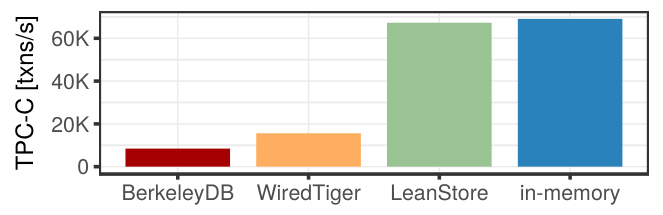

图 1. 单线程内存 TPC-C 性能（100 个仓库）。

这正是 H-Store [2]、Hekaton [3]、HANA [4]、HyPer [5] 或 Silo [6] 等主存数据库系统完全避开缓冲区管理的原因。关系和索引都直接存储在主存中，使用虚拟内存指针替代页标识符。这种方法当然很高效。然而，随着数据量增长，要求用户购买更多 RAM 或丢弃数据并不是可行的解决方案。横向扩展内存数据库或许是一种选择，但也有硬件和管理成本等缺点。因此，在任何主存系统的演进过程中，设计者迟早都必须实现对超大数据集的支持。

Anti-Caching [7] 和 Siberia [8]、[9]、[10] 是主存系统高效管理大于 RAM 的数据集的两个代表性方案。与传统缓冲区管理器相比，这些方法有一个主要弱点：它们无法对关系数据和索引数据维护统一的替换策略。索引可能占总数据量的相当大一部分 [11]，却要么必须始终驻留 RAM，要么需要独立机制处理。这使得这些技术的通用性和透明性都不及传统缓冲区管理器。

重新考虑缓冲区管理器的另一个原因，是通过 PCIe/M2 连接的固态硬盘（SSD）越来越普遍。SSD 是需要按页访问的块设备。这些设备不受相对缓慢的 SATA 接口限制，每秒可访问数 GB 数据。虽然现代 SSD 的带宽仍比 DRAM 至少低 10 倍，但其价格也以类似比例低于 DRAM。因此，仅从经济原因 [12] 出发，缓冲区管理器就重新变得有吸引力。考虑到缓冲区管理器的优点，只剩一个问题：能否为现代硬件设计高效的缓冲区管理器？

在本文中，我们通过设计、实现并评估一个名为 LeanStore 的高效存储引擎，对这一问题给出肯定回答。我们的设计提供了与传统缓冲区管理器功能类似的抽象，却没有其开销。如图 1 所示，执行 TPC-C 时，LeanStore 的性能非常接近内存 B 树。这种低开销源于：访问内存页只涉及一个简单、易于正确预测的 `if` 语句，而非昂贵的哈希表查找。通过避免在热路径上使用细粒度闩锁，我们也在现代多核 CPU 上获得了出色的可扩展性。总体而言，如果工作集能放入 RAM，我们的设计可达到先进主存数据库系统的同等性能。同时，我们的缓冲区管理器可以透明地管理后备存储上的超大数据集；借助现代 SSD，当工作集开始超过主存时，吞吐量会平缓下降。

## II. 相关工作

缓冲区管理是传统数据库体系结构的基础组件 [13]。在经典设计中，全部数据结构都以无需转换的形式（无需编组/解组）存储在固定大小的页中。系统的其余部分使用简单接口，隐藏 I/O 缓冲机制的复杂性，并在全部数据结构之间提供全局替换策略。运行时对 `pinPage`/`unpinPage` 的函数调用，提供了决定哪些页需要保留在 RAM、哪些页可以逐出到外存所需的信息（基于最近最少使用或第二次机会等替换策略）。这种优雅的设计是经典数据库系统的支柱之一。然而，也有研究表明，对于完全驻留内存的事务工作负载，典型缓冲区管理器是效率损失的最大来源 [14]。

主存数据库的一个决定性特征，就是没有缓冲区管理器。它们按需分配大小可变的内存块，数据结构直接使用虚拟内存指针而不是页标识符。为支持大于 RAM 的数据集，一些主存数据库系统实现了独立机制，将元组划分为“热”或“冷”。热元组保留在高效的内存数据库中，冷元组则存储在磁盘或 SSD 上（通常采用完全不同的存储格式）。Ma 等人 [15] 和 Zhang 等人 [16] 调查并评估了一些重要的设计决策。下面我们简要介绍主要方法。

**Anti-Caching** [7] 由 DeBrabant 等人为 H-Store 提出。它以元组而非页为粒度跟踪访问。为实现这一点，每个关系都有一个嵌入各元组的 LRU 链表，带来每元组 8 字节的空间开销。在内存压力下，部分最近最少使用的元组被移到冷存储（磁盘或 SSD）。索引同时覆盖热元组和冷元组。由于在 OLTP 数据库中索引消耗总内存的一半并不少见 [11]，无法把索引移到冷存储是一项重大限制。因此，Anti-Caching 只能缓解那些几乎可以放入主存的应用的内存压力，并非通用解决方案。

微软的 **Siberia** [10] 项目可能是主存数据库系统管理大数据集最全面的方法。它使用元组访问日志 [8]，离线将元组划分为热或冷。另一个离线进程以事务方式，在高性能内存数据库和独立冷存储之间迁移不常访问的元组 [10]。为保持较小的索引，Siberia 的内存索引只覆盖热元组 [10]。此外，它在主存中保留每个键约需 10 位的布隆过滤器，以及自适应范围过滤器 [9]，以免每次元组查找都访问冷存储。然而，Siberia 的方法十分复杂（多个具有许多参数的离线进程、两个独立存储管理器），这可能阻碍了其广泛采用。

一种截然不同、看似很有前景的替代方案，是依靠操作系统的**交换（分页）**功能。例如，Stoica 和 Ailamaki [17] 在 H-Store 中研究了这种方法。交换的主要优势在于，得益于硬件支持（TLB 和 CPU 内部页表遍历），热访问没有额外开销。缺点是数据库系统失去了对页逐出的控制，这实际上几乎排除了原地更新和完整 ARIES 风格恢复的可能。Graefe 等人 [18] 讨论了让操作系统决定何时逐出页的问题。另一个缺点是，操作系统没有关于访问模式的数据库专用知识（例如大表扫描）。此外，实验结果（参见 [18] 和图 9）表明，最常见的服务器操作系统 Linux 的交换机制，在数据库工作负载上表现不佳。因此，我们认为，依赖操作系统的交换/`mmap` 机制并不是软件管理方法的可行替代方案。事实上，主存数据库厂商建议仔细监控主存消耗，以避免交换 [19]、[20]。MonetDB 这类针对 OLAP 优化的系统是例外，依赖操作系统对它们而言效果很好。

Funke 等人 [21] 提出了一种**硬件辅助的访问跟踪**机制，用于在 HyPer 中分离冷热元组。通过修改 Linux 内核并利用处理器的内存管理单元（MMU），可以以极低开销跟踪页访问。他们的实现利用内核实现交换的同一机制，同时不失去对页逐出决策的控制。不过，它不处理索引结构。相比之下，我们的方法无需修改操作系统，因而可移植，并能透明地处理索引。将我们的方法与硬件辅助的页访问跟踪结合，可以进一步提升性能，代价则是放弃可移植性。

**SAP HANA** 始终被作为内存系统来宣传，而且很长一段时间内，一个列只能整体地移入 SSD 或从 SSD 移出 [22]。Sherkat 等人 [22] 在最近的一篇论文中介绍了一个新功能，支持以块为单位访问列式数据。不过，索引和 delta store 仍然驻留主存，这对大型事务数据库是一项重大限制。

几乎所有内存系统都增加了某种形式的大于 RAM 数据集支持，这清楚表明了该功能的重要性。然而，我们认为，上述技术虽然富有创意，却尚不足以成为事务系统或混合事务/分析处理（HTAP）系统中冷存储问题的稳健、高效解决方案。事后才向现有内存系统加入这样一个基础性功能，无法得到尽可能好的设计。因此，我们接下来讨论若干从一开始就被设计为存储管理器的近期系统方案。

**Bw-tree/LLAMA** [23]、[24] 是针对多核 CPU 和 SSD 优化的存储引擎。与我们的设计不同，它通过创建被修改条目的新版本（“delta”）进行非原地更新。这一设计决策有其好处：它实现了无闩锁，并且对于某些写密集型工作负载，可以降低 SSD 写放大。缺点是，创建和遍历 delta 会产生不可忽略的开销。因此，其性能低于进行原地更新的内存系统。

**FOEDUS** [25] 是另一个近期提出的存储管理器。它避免不必要的闩锁获取，在多核 CPU 上具有很好的可扩展性；与我们的设计一样，它使用缓冲区管理器在主存中缓存固定大小的页。不过，FOEDUS 针对的是相变内存这类字节可寻址的存储级内存，其性质（即字节可寻址性）与 SSD 不同。

指针转换（pointer swizzling）是我们设计中的关键，它是一项曾在面向对象数据库系统 [26] 中广泛使用的老技术。**用于缓冲区管理器的 swizzling** 直到最近才由 Graefe 等人 [18] 提出，他们在基于页的 Shore-MT 系统中实现了这一想法。他们的设计与我们的方案有一些重要的共同特征。然而，虽然其方法成功降低了页地址转换的开销，却没有解决页级闩锁和强制页固定带来的多核可扩展性问题。尽管存在可降低竞争成本的闩锁实现（例如 MCS 锁 [27]），但获取闩锁过程中的缓存失效仍会降低可扩展性。相比之下，乐观锁不实际获取锁，因此具有更好的可扩展性。

## III. 基本构件

本节介绍 LeanStore 的高层设计思想。LeanStore 是面向现代硬件（即大容量 DRAM、高速 SSD 和多核）的存储管理器。

### A. 指针转换（Pointer Swizzling）

在磁盘数据库系统中，最重要的数据结构（例如堆文件、B 树索引）都组织为固定大小的页。为引用其他页，数据结构存储逻辑页标识符，必须在每次页访问前将它们转换为内存地址。如图 2a 所示，这种转换通常由包含当前主存中所有缓存页的哈希表完成。如今，数据库服务器配备的主存容量足以容纳大多数工作负载的工作集。因此，I/O 操作越来越少见，传统缓冲区管理器常常成为性能瓶颈 [14]。

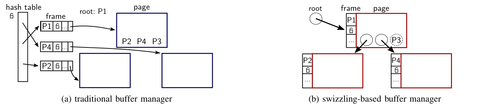

图 2. 一棵由根页 P1 和三个叶页 P2、P4、P3 构成的树，其中两个叶页（P2 和 P4）位于 RAM 中。（a）传统缓冲区管理器；（b）基于 swizzling 的缓冲区管理器。

在我们的设计中，主存中的页直接通过虚拟内存地址（即指针）引用，访问这些页无需查找哈希表。另一方面，当前位于后备存储中的页仍通过页标识符引用。图 2b 展示了这一点：页引用画为圆圈，其中要么包含指针，要么包含页标识符。我们使用指针标记（8 字节引用中的一位）来区分这两种状态。因此，访问热页所需的缓冲区管理开销，仅仅是检查这一位的条件语句。

这种技术称为**指针转换（pointer swizzling）** [28]，在对象数据库 [29]、[26] 中很常见。包含内存指针的引用称为 swizzled，存储磁盘页标识符的引用称为 unswizzled。注意，即使是 swizzled 页也有逻辑页标识符，只是标识符仅存储在缓冲帧中，而不是引用中。下文以 swizzling 表示将引用转为内存指针，以 unswizzling 表示将其还原为页标识符。

### B. 高效的页替换

指针转换是一种简单且高效的热页访问方式。然而，它并没有解决缓冲池所有页都被占用后，该决定逐出哪些页到持久存储的问题。传统缓冲区管理器使用最近最少使用或第二次机会等策略，每次页访问都需要额外工作。此外，对于频繁访问的页（例如 B 树根页），更新访问跟踪信息（例如 LRU 链表、第二次机会位）有时会成为可扩展性瓶颈。由于我们的目标是与内存系统竞争，使用极低开销的替换策略至关重要。对于没有昂贵页地址转换开销的指针转换方法而言，这一点尤其重要。

因此，我们认为每次页访问都更新跟踪信息过于昂贵，并在设计中避免这样做。我们的替换策略体现了一种视角变化：它不跟踪频繁访问的页来避免逐出，而是识别**不常访问的页**。我们认为，在如今常见的大缓冲池条件下，这样要高效得多，因为访问热页时无需任何额外工作（上述 `if` 语句除外）。

替换策略的主要机制，是试探性地对页引用进行 unswizzling，但不立即逐出对应的页。如果系统意外地对频繁访问的页做了 unswizzling，该页会很快重新 swizzling，而不会产生任何磁盘 I/O。因此，与第二次机会替换策略类似，试探性 unswizzling 的页在逐出前有一个宽限期。由于有这一宽限期，选择候选页的策略可以非常简单（因而开销很低）：我们只从池中随机选择一个页。

我们将已经 unswizzling 但仍位于主存中的页状态称为**冷却（cooling）**。任何时刻，我们都会让一定比例（例如 10%）的页保持该状态。冷却状态的页组织在一个 FIFO 队列中。随着时间推移，页逐渐移向队尾，到达队尾时被逐出。不过，访问处于冷却状态的页会阻止逐出，因为这会使该页从 FIFO 队列移除，并对它进行 swizzling。

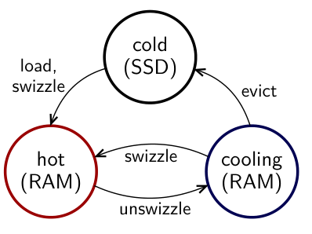

图 3. 页可能处于的状态。

页的“生命周期”及其可能的状态见图 3。页从 SSD 载入后，就进行 swizzling 并成为热页。热页可以被试探性地 unswizzling，从而转入冷却状态。冷却页可以在访问时变热，也可以在逐出时变冷。

概括而言，通过试探性地对随机页进行 unswizzling，我们无需跟踪每次访问即可识别不常访问的页。此外，FIFO 队列提供了一个作为观察期的冷却阶段，期间页有机会重新 swizzling。这些技术结合起来，以低成本实现了有效的替换策略。

### C. 可扩展的同步

目前介绍的设计实现了存储引擎的基本功能，但尚不支持并发。线程同步与缓冲区管理紧密耦合，因此不能忽略。例如，在逐出某个页之前，缓冲区管理器必须确保其他线程当前没有访问该页。

大多数缓冲区管理器使用闩锁实现同步。当前位于主存中的每个页都有一个关联的闩锁。额外的闩锁保护页标识符到缓冲帧的映射哈希表。调用 `pinPage` 时，先获取一个或多个闩锁（并在不久后释放），然后再锁住页本身。页保持被闩锁保护——因此无法被逐出——直到调用 `unpinPage`。注意，页闩锁有两种不同用途：防止逐出，以及实现数据结构特定的同步协议（例如 B 树中的锁耦合）。

基于闩锁的同步是传统缓冲区管理器主要的开销来源之一。一个问题是获取闩锁的次数非常多。例如在 Shore-MT 中，更新单行的事务会为缓冲池和页闩锁执行 15 次闩锁获取 [30]。更严重的问题是，有些闩锁被不同线程频繁获取。例如，B 树根页的闩锁，以及用于页标识符转换的哈希表全局闩锁，常常是关键竞争点。由于典型多核 CPU 实现缓存一致性的方式，这类“热”闩锁会妨碍良好扩展，即出现“缓存行乒乓”。

一般来说，频繁写入由多个线程访问的内存位置的程序不具有可扩展性。因此，LeanStore 通过三项技术精心避免这类写入。第一，指针转换消除了转换哈希表闩锁的开销与可扩展性问题。第二，我们使用基于 epoch 的技术，避免写入每个被访问的页，而不是通过递增每页的固定计数器来防止页逐出。第三，LeanStore 提供一组基于时间戳的乐观原语 [31]、[32]、[33]，供缓冲区管理的数据结构大幅减少闩锁获取次数。这些技术将在 IV-F 和 IV-G 节详细说明；它们共同构成高效同步任意缓冲区管理数据结构的通用框架。在 LeanStore 中，对 swizzled 页的查找完全不获取闩锁；插入、更新和删除操作通常只在叶节点上获取一个闩锁（发生分裂/合并时除外）。因此，对性能至关重要的内存操作具有很好的可扩展性。

## IV. LeanStore

本节介绍如何利用第 III 节的基本构件实现 LeanStore。

### A. 数据结构概览

在传统缓冲区管理器中，缓冲池状态由一个将页标识符映射到缓冲帧的哈希表表示。缓冲帧包含各种“管理”信息，包括：（1）指向页内容的内存指针；（2）替换策略所需的状态（例如 LRU 链表或第二次机会位）；（3）有关磁盘页状态的信息（例如脏标志、页是否正在从磁盘载入）。这些信息对应任何缓冲区管理器都必须实现的三项功能：（1）判定页是否位于缓冲池中，以及必要时进行页地址转换；（2）决定哪些页应当位于主存中；（3）管理进行中的 I/O 操作。LeanStore 需要类似的信息，但出于性能原因，使用三个独立的定制数据结构。图 4 上半部分表明，传统的页地址转换表不再需要，因为它的状态被嵌入缓冲区管理的数据结构本身。实现替换策略所需的信息被移入独立结构，称为冷却阶段，见图 4 左下角。最后，进行中的 I/O 操作由图 4 右下角的另一个结构管理。

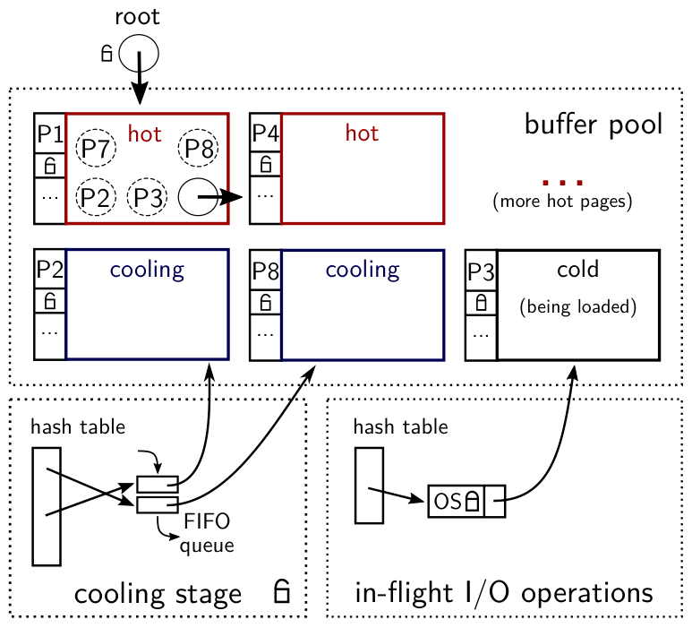

图 4. LeanStore 的数据结构概览。P1 表示一个根页（例如 B 树根页），有五个子页 P7、P8、P2、P3、P4。P1 和 P4 是热页（swizzled），P2 和 P8 正在冷却（unswizzled）。（实际上，绝大多数内存页都被归类为热页。）P7 和 P3 位于持久存储中，其中 P3 正在载入。

### B. 指针转换的细节

指针转换在我们的设计中发挥关键作用。我们将引用，即引用一个页的 8 字节内存位置，称为 **swip**。swip 可以处于 swizzled 状态（存储内存指针），也可以处于 unswizzled 状态（存储磁盘页标识符）。图 4 中，swip 画为圆圈，里面要么存储指针（箭头），要么存储页标识符（P……）。虽然多数 swip 通常位于缓冲区管理的页上，但部分 swip，例如指向 B 树根页的 swip，存储在缓冲池不管理的内存区域。图中标注为“root”的 swip 就是如此，它存储在缓冲区管理器之外。

在传统缓冲区管理器中，页标识符到指针的转换表，是表示缓冲池状态的唯一权威来源。页始终通过这层间接寻址访问，使用闩锁同步。因此，实现页逐出等操作相当直接。相比之下，在指针转换方案中，转换表信息分散并嵌入缓冲区管理的数据结构自身，使事情更复杂。例如，考虑一个同时被 Py 和 Pz 两页引用的页 Px。此时，Px 可以同时被一个 swizzled swip 和一个 unswizzled swip 引用。维护一致性，尤其在不使用全局闩锁的情况下，非常困难且低效。因此，在 LeanStore 中，**每个页都有唯一的所属 swip**，从而避免对其进行 swizzling 或 unswizzling 时的一致性问题。于是，每个缓冲区管理的数据结构都变成树状，整个缓冲池则构成一片页的森林。由于缓冲池中的每个页都恰好被一个 swip 引用，我们也会根据引用它的 swip 状态，称一个页被 swizzling 或 unswizzling。

另一个设计决策是，我们绝不对存在 swizzled 子页的页进行 unswizzling（因而也绝不逐出它）。例如，B 树内部节点必须在全部子节点都已 unswizzling 后，才能被 unswizzling（并最终逐出）。否则，包含内存指针的页可能写入磁盘，这会造成严重问题，因为指针只在当前程序运行期间有效。为避免这种情况，缓冲区管理的数据结构实现了一种特殊的 swip 迭代机制，详见 IV-E 节。它保证：如果碰巧选中一个内部页进行试探性 unswizzling，而它至少还有一个 swizzled 子页，就改为选中其中一个子页。虽然在正常运行中这种情况不多见（叶页通常远多于内部页），但为保证正确性必须处理。还要注意，对于树状数据结构，阻止父页先于子页逐出，在任何情况下都有好处，因为这可以减少缺页。

### C. 冷却阶段

只有在缓冲池的空闲页开始不足时，才会使用冷却阶段。从那时起，缓冲区管理器开始维持一个随机页子集（例如占整个池的 10%）处于冷却状态。大多数内存页仍处于热状态。与纯内存系统相比，访问它们的额外开销非常小，只需检查 swip 的一位。

如图 4 左下角所示，冷却页组织在一个 FIFO 队列中。队列按照 unswizzling 的顺序维护指向冷却页的指针，即最近 unswizzling 的页位于队首，更早的页位于队尾。需要为新页提供内存时，使用最早 unswizzling 的页（若它是脏页，先将其刷出）。

即将访问一个 unswizzled swip 时（例如 P1 页上的 swip P8），必须检查它所引用的页是否在冷却阶段中。因此，除队列外，冷却阶段还维护一个将页标识符映射到相应队列项的哈希表。如果在哈希表中找到该页，则先将它从哈希表和 FIFO 队列中移除，再进行 swizzling，使它再次可供访问。

把页移入冷却阶段，可以（1）由后台线程异步执行，也可以（2）由访问缓冲池的工作线程同步执行。我们选择第二种，以避免后台线程过慢的风险。每当线程请求一个新的空页，或者对某页进行 swizzling 时，它都会检查冷却页比例是否低于阈值，并在必要时对一个页进行 unswizzling。

我们的实现用一个闩锁保护冷却阶段的数据结构。全局闩锁虽然经常成为可扩展性瓶颈，但在这里不会造成性能问题。只有冷路径上需要 I/O 操作时才需要这一闩锁。I/O 比获取闩锁昂贵多个数量级，而且无论如何都会获取操作系统内部的粗粒度锁。因此，无论是内存工作负载还是 I/O 主导的工作负载，这个全局闩锁都可以接受。

### D. 输入/输出

访问冷页之前，必须先从持久存储载入它。一个潜在问题是，多个线程可能同时尝试载入同一个页。为保证正确性，必须防止同一页在缓冲池中出现多次。同时，显然只调度一次 I/O 操作也更高效。

因此，与传统缓冲区管理器一样，我们显式管理并串行化进行中的 I/O 操作。如图 4 右下角所示，我们为所有当前正从磁盘载入的页（图中的 P3）维护哈希表。它将页标识符映射到 I/O 帧，I/O 帧包含一个操作系统互斥锁和一个指向新分配页的指针。触发载入的线程先获取全局闩锁，创建 I/O 帧并获取其互斥锁；随后释放全局闩锁，使用阻塞系统调用（例如 Unix 上的 `pread`）载入页。其他线程会找到现有 I/O 帧，并阻塞在它的互斥锁上，直到第一个线程完成读操作。

我们目前使用同一个闩锁同时保护冷却阶段和 I/O 组件，这显著简化了实现。但需要强调，在执行任何 I/O 系统调用之前都会释放该闩锁。这使并发 I/O 成为可能，而并发 I/O 对 SSD 的高性能至关重要。再次强调，这一全局闩锁不会成为可扩展性瓶颈，因为即便使用高速 SSD，I/O 操作仍远比获取闩锁昂贵。

### E. 缓冲区管理的数据结构

缓冲区管理器的主要特点，是在整个缓冲池上维护统一替换策略的同时支持任意数据结构。另一个优点是，它无需了解页的物理组织（例如 B 树叶节点布局）就能做到这一点，因此可以在不修改缓冲区管理器代码的情况下实现受其管理的数据结构。下面介绍 LeanStore 如何以类似的非侵入方式支持几乎任意数据结构。

如 IV-B 节所述，我们的指针转换方案要求子页先于父页 unswizzling。为实现这一点，缓冲区管理器必须能够遍历页上的全部 swip。为避免要求它了解页布局，每个缓冲区管理的数据结构都实现一个“迭代回调”。对叶页调用时，回调什么也不做；对内部页调用时，则遍历该页存储的全部 swip。任何缓冲区管理的数据结构都必须实现这一回调，并将其注册到缓冲区管理器。此外，页必须能够自我描述，即必须能确定该页关联哪一个回调函数。因此，每个页存储一个标记，指明页的结构（例如 B 树叶节点或 B 树内部节点）。

利用回调机制，缓冲区管理器能够确定页是否可以 unswizzling。如果页没有子页，或者全部子页都已经 unswizzling，那么就可以对该页进行 unswizzling。另一方面，如果遇到 swizzled 子 swip，缓冲区管理器就中止对该节点的 unswizzling，转而尝试对遇到的某个 swizzled 子页进行 unswizzling（在这些子页中随机选择一个）。注意，图 5 所示的这一机制，在替换时隐式地让内部页比叶页享有更高优先级。

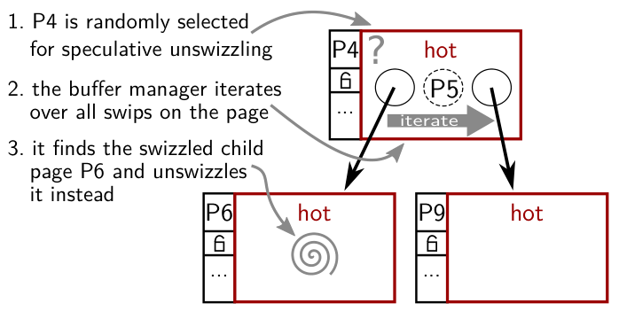

图 5. 内部页只有在全部子页之后才能进行 unswizzling。图中步骤为：（1）随机选中 P4，准备试探性 unswizzling；（2）缓冲区管理器遍历页上的全部 swip；（3）找到 swizzled 子页 P6，改为对它进行 unswizzling。

为了对一个页进行 unswizzling，除回调机制外，还必须找到逐出候选页的父页。我们的实现使用存储在缓冲帧中的父指针。父指针使 unswizzling 时容易访问父页，但必须由每个数据结构负责维护。在我们的设计中维护父指针并不昂贵，因为子节点总是先于父节点 unswizzling，而且父指针不会持久化。

如前所述，当前实现中的每个页只有一个 swip，即一个入引用。这一设计决策简化了 unswizzling 的管理工作；Graefe 等人基于 swizzling 的缓冲区管理器 [18] 也做出了同样选择。不过，这并不是我们方法的根本限制。也可以采用另一种实现，让一个页拥有多个入指针。一种做法是在每个帧中存储多个父指针，这就已足以实现 B+ 树的叶间指针。更通用的做法是，每个页仍只存储一个父页，但引入两类 swip：普通 swip 与当前设计一样通过父指针关联；另有“胖”swip，同时包含页标识符和指针。

虽然我们的设计对数据结构施加了一些约束（固定大小的页与父指针），但页内布局和结构组织仍然灵活。例如，在先前工作 [34] 中，我们开发了一种可直接用于 LeanStore 之上的哈希索引：其固定大小的根页使用若干哈希位划分键空间（类似可扩展哈希），然后每个分区用空间高效的哈希表表示（同样使用固定大小的页）。堆可以类似 B 树实现，以元组标识符为键。由于元组标识符常常是密集或近乎密集的，可以用特殊节点布局避免 B 树中的二分查找，并支持非常快的扫描。定制节点布局还允许实现列式存储和压缩。

### F. 乐观闩锁

如图 4 所示，缓冲池中的每个页都关联一个闩锁。原则上可以实现与传统缓冲区管理器类似的同步机制：每次页访问都获取逐页闩锁，将页“固定”在缓冲池中，防止逐出。不幸的是，如 III-C 节所述，要求频繁获取闩锁，将使任何缓冲区管理的数据结构都无法在多核 CPU 上扩展。为在性能和可扩展性方面与纯内存系统竞争，缓冲区管理器必须提供高效同步手段。

第一项重要技术，是用**乐观闩锁** [31]、[32]、[33] 替换传统逐页闩锁。这些闩锁内部有一个更新计数器，每次修改之后都会递增。读者可以不获取任何闩锁而继续执行，转而使用版本计数器验证其读取（类似乐观并发控制）。实际同步协议取决于数据结构，可基于乐观闩锁实现不同变体。一种可行技术是乐观锁耦合（Optimistic Lock Coupling）[33]，它在树遍历期间无需实际获取任何闩锁，即可保证一致读取。已有研究表明，乐观锁耦合很适合同步自适应基数树 [35]、[33] 和 B 树 [36]。在该方案中，写者通常只为被修改的页获取一个闩锁；只有结构修改操作（例如分裂）才锁住多个页。

### G. 基于 epoch 的回收

使用乐观闩锁时，正在被读取的页既没有加闩锁，也没有被固定。如果一个线程想逐出或删除某页，而另一个线程仍在读取它，就可能产生问题。为解决这一问题，我们采用基于 epoch 的机制，它常用于实现无闩锁数据结构中的内存回收 [6]、[32]、[23]。

基本思想是设置一个周期性增长的全局 epoch 计数器，以及每个线程各自的局部 epoch 计数器，见图 6 右侧。线程在访问任何缓冲区管理的数据结构之前，将自己的局部 epoch 设置为当前全局 epoch，概念上意味着线程进入了该 epoch。图 6 中，线程 1 已进入 e9，而线程 3 仍位于 e5。当线程完成对数据结构的访问时，将局部 epoch 设为特殊值 $\infty$，表示该线程目前没有访问任何数据（示例中的线程 2）。

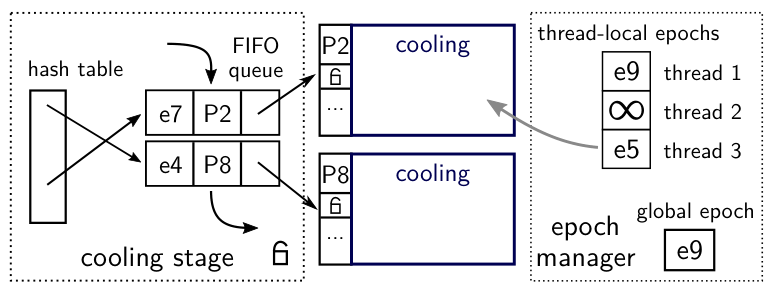

图 6. 基于 epoch 的回收。

对页进行 unswizzling 后不能立即重用它，因为其他线程可能仍在读取它。因此，我们为冷却阶段的页关联其 unswizzling 时的全局 epoch。（注意，只有冷却页需要关联 epoch，热页不需要。）图 6 示例中，P8 在 e4 期间被放入冷却阶段，P2 则在 e7。页实际逐出之前（即到达 FIFO 队尾时），将其关联的 epoch 与所有局部 epoch 的最小值比较。只有当最小值大于关联的 epoch 时，才可安全重用该页，因为此时可以确保已无线程能继续读取该页。在该示例中，所有线程观察到的最小 epoch 是 e5，因此 P8 可以安全逐出，而 P2 要保留在冷却阶段，直到线程 3 完成当前操作。由于页到达 FIFO 队尾本就要花相当长时间，这项检查不太可能进一步延迟逐出。不过，为保证正确性，仍必须检查这一条件。

注意，过于频繁地递增全局 epoch，可能导致所有核上出现不必要的缓存失效；而递增过于稀疏，则可能使 unswizzled 页无法及时回收。因此，全局 epoch 的递增频率应与删除/逐出的页数成比例，但低一个常数因子（例如 100）。

为使 epoch 机制稳健，线程应频繁退出其 epoch，因为任何长期停留在同一 epoch 的线程，都可能完全阻止页逐出和回收。例如，在同一个局部 epoch 中执行大型全表扫描，可能造成灾难性后果。因此，我们将表扫描等大型操作拆为较小操作，为每个小操作进入和退出 epoch。我们还保证，可能耗时较长的 I/O 操作绝不在持有 epoch 时执行。具体实现如下：发生缺页时，触发缺页的线程（1）释放所有页锁；（2）退出 epoch；（3）执行 I/O 操作。I/O 请求完成后，我们通过抛出 C++ 异常触发当前数据结构操作重新开始。每个数据结构操作都安装一个异常处理器，从头重新执行操作（即进入当前全局 epoch，并重新遍历树）。这种简单、稳健的方法效果很好，原因有二：第一，与 I/O 相比，内存操作非常便宜；第二，大型逻辑操作（例如大扫描）已被拆成许多小操作，重启后只需重复少量工作。

### H. 内存分配与 NUMA 感知

除支持大于 RAM 的数据集外，缓冲区管理器还隐式提供内存管理功能，类似于内存系统的内存分配器。不过，固定大小的页意味着只有一种分配大小，简化了缓冲池的内存管理。缓冲区管理的系统还可避免常常困扰长期运行内存系统的内存碎片。

LeanStore 按所需缓冲池大小执行一次内存分配。其物理内存既可以由操作系统按需（即首次访问时）提供，也可以在启动时预先触发缺页、建立物理映射（pre-fault）。LeanStore 还支持非一致内存访问（NUMA）感知分配，以改善多插槽系统性能。在这一模式中，新页分配在请求线程所在的 NUMA 节点。NUMA 感知通过将缓冲池和空闲链表逻辑地划分成与 NUMA 节点数相同的分区实现。除缓冲池内存本身外，全部其他数据结构（包括冷却阶段）都是集中式的，以维护全局替换策略。NUMA 感知是一种尽力而为的优化：如果没有更多本地页可用，就分配一个远端 NUMA 页。

### I. 实现细节与优化

本节最后介绍一些对性能很重要的实现细节和优化。

我们在 LeanStore 之上实现了一棵相当直接的 B+ 树（值只存储在叶节点）。实现中最值得关注的是同步机制。读取使用每个闩锁内嵌的版本计数器进行验证，检测到冲突时可能需要重启。跨多个叶节点的范围扫描，使用栅栏键（fence key）[37] 拆成多个独立查找。范围查找的拆分与高效同步协议相结合，消除了对传统磁盘 B+ 树常见叶间链接的需求。插入、删除或更新操作首先像查找一样遍历树，不获取任何闩锁。找到需要修改的叶页后，对它加闩锁，排除潜在写者（并使潜在读者的验证失败）。如果不需要结构修改操作（例如节点分裂）——比如仍有空间再插入一个条目——就可直接执行操作并释放闩锁。结构修改操作则释放叶闩锁，从根节点重新开始，但这一次会对所有受影响的内部节点加闩锁。

在 LeanStore 中，缓冲帧与页内容在物理上交错存放（图 2b）。多数传统缓冲区管理器则在缓冲帧中存储一个指向页内容的指针（图 2a）。由于每个页的头部被频繁访问，交错存放缓冲帧可改善局部性，从而减少缓存未命中。第二个更微妙的优势，是避免 CPU 缓存相联度有限所造成的性能问题：采用典型的二次幂页大小且不交错存放时，所有页的头部都会落入同一个缓存组，只有很少的页头能够驻留缓存（例如 Intel CPU 的 L1 缓存中为 8 个）。

由于我们避免固定页，页在 unswizzling 后不能立即重用。这不仅适用于试探性 unswizzling 的页，也适用于显式删除的页（例如 B 树合并操作中的页）。一种解决方案是使用 IV-G 节的同一机制，即把已删除页放入冷却阶段。在我们的实现中，每个线程有一个用于已删除页的小型线程本地缓存。与冷却阶段一样，其中的条目都关联一个 epoch（删除时的 epoch）。当线程请求新的空页时，会检查本地缓存；如果全局 epoch 已充分推进，就从本地缓存选页，而不是从冷却阶段选页。因此，已删除页能够较快重用，改善缓存局部性，并避免对替换策略造成负面影响。

前面我们反对采用异步后台进程，因为它们可能导致不可预测的行为，而且常有复杂、难以调优的参数。对于后台写出脏页，我们作了一个例外。与传统缓冲区管理器一样，我们使用独立的后台写线程，隐藏本来会由工作线程承担的写延迟。后台写线程循环遍历冷却阶段的 FIFO 队列，刷出脏页并清除脏标志。

为实现快速扫描，LeanStore 实现了 I/O 预取。借助进行中的 I/O 组件，扫描可在不阻塞的情况下调度多个页请求，随后在后台执行这些 I/O。预取请求完成后，相应页通过冷却阶段供其他线程使用。另一项大扫描优化是提示（hinting）：扫描访问的叶页从 SSD 载入后，可以被归类为冷却页而不是热页，因此很可能很快被逐出。此外，由于冷却阶段大小有限，不需要对热页进行 unswizzling。于是，扫描只会使缓冲池中的一小部分内容失效，从而避免抖动。

## V. 内存内评估

本节使用能够放入主存的数据集，研究 LeanStore 的性能与可扩展性。超出内存的工作负载将在第 VI 节评估。

### A. 实验设置

LeanStore 和 B 树（实际上是 B+ 树）的实现合计约 4 千行大量使用模板的 C++11 代码（不包括基准代码）。内存 B 树和缓冲区管理的 B 树具有相同的页布局和同步协议，使我们能够清楚地量化缓冲区管理的开销。

我们使用 BerkeleyDB 6.0 和 WiredTiger 2.9，将我们的设计与传统缓冲区管理器比较。BerkeleyDB 虽然最初发布于 1994 年，但仍被广泛使用，例如作为 Oracle NoSQL Database 的存储管理器。WiredTiger 是较新的系统，已经成为 MongoDB 的默认存储引擎。两者都是独立存储管理器，实现缓冲区管理器，并使用细粒度闩锁支持并发。我们将 BerkeleyDB 和 WiredTiger 配置为使用 B 树（BerkeleyDB 还支持哈希，WiredTiger 还支持 LSM 树）。在两个存储管理器中，我们都禁用了事务、日志、整合（compaction）和压缩。

这些存储管理器直接链接/编译进我们的测试驱动程序。驱动程序实现了 TPC-C（不含“思考”时间）以及若干微基准。注意，即使没有事务语义，包含插入、更新、删除和范围扫描的 TPC-C，对任何存储管理器而言仍是相当复杂的工作负载。就访问模式而言，既有高度局部性的表，也有随机访问的表，而且该基准的插入比例很高。我们使用 16 KB 页，每个关系以单棵 B 树表示（不水平分区为多棵独立树）。

实验在一台 Linux 4.8 系统上执行，使用 Intel Xeon E5-2687W v3 CPU（3.1 GHz、Haswell EP、10 核、20 个硬件线程），配备 64 GB 主存。

### B. TPC-C

我们先进行若干内存内 TPC-C 实验。使用 100 个仓库，初始数据量为 10 GB，缓冲池足以容纳全部数据。如第 1 页的图 1 所示，单线程下 LeanStore 达到每秒 67 K 个事务。内存 B 树略快，为 69 K tps。BerkeleyDB 和 WiredTiger 分别仅达到 10 K 和 16 K tps。

为更好地理解 LeanStore 哪些设计决策最重要，我们禁用了其中一些关键特性。具体来说，将指针转换替换为传统哈希表查找，使用 LRU 替代我们的轻量逐出策略，并使用传统闩锁替代乐观闩锁。这样得到的系统类似于传统缓冲区管理器，其性能在图 7 中标为“baseline”。图中也展示了逐步启用指针转换、我们的替换策略和乐观闩锁后的性能。单线程情况下，指针转换和我们的替换策略（标为“lean evict”）是最大的影响因素，二者合计带来约 2 倍性能提升。乐观闩锁仅略快于传统闩锁，因为单线程执行不存在闩锁竞争。多线程结果则截然不同。首先，性能差异大得多。其次，三项特性对于获得高性能都至关重要，因为任何可扩展性瓶颈都会导致性能大幅下降。无论使用全局页地址转换哈希表、单一 LRU 链表，还是传统闩锁，都会立即阻碍扩展到 10 个线程。这些结果凸显了传统缓冲区管理器的巨大开销，尤其是在多线程环境下；但它们也表明，确实可以实现额外开销很小的缓冲区管理器。

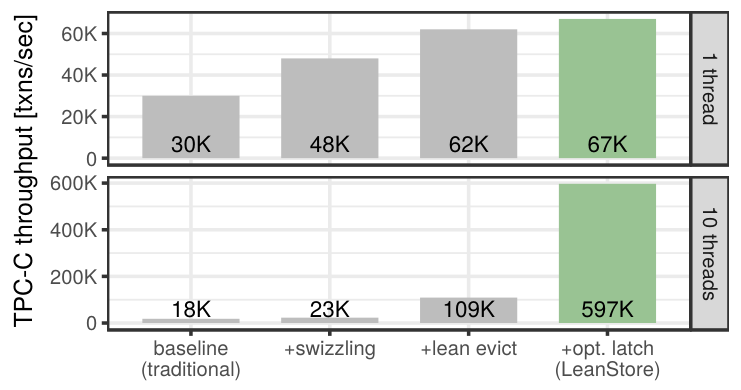

图 7. LeanStore 三项主要特性的影响。单线程下，传统基线、加指针转换、再加轻量逐出、再加乐观闩锁（LeanStore）的吞吐量分别为 30 K、48 K、62 K、67 K 事务/秒；10 线程下分别为 18 K、23 K、109 K、597 K 事务/秒。

使用多个线程时，传统存储引擎与 LeanStore 的性能差距进一步扩大。如图 8 所示，BerkeleyDB 几乎无法扩展。其峰值性能在 5 线程时达到每秒 20 K 个事务（加速比 2.4 倍）。WiredTiger 的可扩展性优于 BerkeleyDB，20 线程时达到 8.8 倍加速比。内存 B 树和 LeanStore 都使用相同的乐观同步协议，从而具有出色的可扩展性。此外，内存工作负载不使用冷却阶段，因此其闩锁上没有竞争。LeanStore 在 10 线程时达到 8.8 倍加速比，启用超线程时达到 12.6 倍。

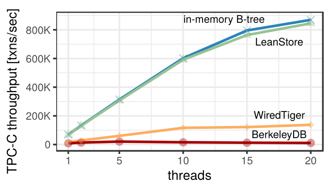

图 8. 10 核系统上的多线程内存 TPC-C。

### C. 系统比较

现在看看 BerkeleyDB 和 WiredTiger 之外的系统。一个相关比较对象是基于 swizzling 的 Shore-MT 变体 [18]。在与我们实验非常相似的设置中（100 个仓库的内存 TPC-C、12 个客户端、无锁、无日志），它达到约每秒 70 K 个事务（参见 [18] 的图 14），约为 LeanStore 的十分之一。我们认为，这是因为 Shore-MT 针对磁盘场景设计（因而 CPU 开销更高），以及细粒度闩锁存在可扩展性问题。

Silo [6] 和 FOEDUS [25] 是较新的系统。虽然它们无法配置为禁用事务，且使用不同的 TPC-C 实现，但与它们比较仍然很有价值。在我们的机器上，Silo 达到每秒 805 K 个 TPC-C 事务，FOEDUS 达到 1,109 K。LeanStore 的性能介于二者之间，为 845 K 事务/秒。FOEDUS 优于 LeanStore 和 Silo，是因为进行了工作负载特定的访问路径优化（例如，不增长的表存储为固定大小数组而不是树；表按静态和动态属性进行垂直分区；一张表实现为仅追加结构）。虽然我们使用通用 B 树，但定制结构也可以集成到 LeanStore 中（参见 IV-E 节）。

### D. 众核系统上的可扩展性

除 10 核系统外，我们还在一个 60 核 NUMA 系统上研究了 LeanStore 的可扩展性。该系统由四颗 15 核 Intel Xeon E7-4870 v2 CPU（Ivy Bridge、2.3 GHz）构成。在这样的系统上实现良好扩展很有挑战，需要额外优化，原因在于：（1）核数众多；（2）缺少共享 L3 缓存，同步成本高；（3）NUMA。表 I 展示了 60 线程、60 个仓库下的 TPC-C 性能和加速比。给每个工作线程分配一个本地仓库，可将基线加速比从 33.3 倍提高到 50.4 倍。这种广为人知的 TPC-C 专用优化 [6] 降低了工作负载中的竞争。另一项优化是预先触发缓冲池内存缺页，以避免操作系统的可扩展性问题，将加速比提高到 52.7 倍。最后一项修改是显式 NUMA 感知，它将远端 NUMA DRAM 访问比例从 75% 降至 14%，并将性能提高 8%。启用全部优化、使用 60 线程时，LeanStore 达到 56.9 倍加速比。

表 I. LeanStore 在 60 核 NUMA 系统上运行 TPC-C 的可扩展性。

| 配置 | 事务/秒 | 加速比 | 远端访问 |
| --- | ---: | ---: | ---: |
| 1 线程 | 45 K | 1.0× | 7% |
| 60 线程：基线 | 1,500 K | 33.3× | 77% |
| + 仓库亲和性 | 2,270 K | 50.4× | 77% |
| + 内存预触页 | 2,370 K | 52.7× | 75% |
| + NUMA 感知 | 2,560 K | 56.9× | 14% |

## VI. 超出内存的评估

现在转向大于主存的数据集实验，毕竟这才是缓冲区管理器存在的理由。存储方面，系统配备一块通过 PCIe 连接的 400 GB Intel DC P3700 SSD，其顺序读/写吞吐量为每秒 2,700/1,080 MB；与多数 SSD 一样，它在随机 I/O 下也能获得相近性能。这类高性能 SSD 已商用一段时间，价格也相当实惠。例如，新近发布的 Samsung 960 PRO SSD，以低于每 GB 0.7 美元的价格，提供与我们设备类似的性能。

使用采用新近引入的 NVMe 接口的高端 SSD 时，我们遇到了若干 Linux 可扩展性问题，尤其在同时执行大量随机读写时。因此，I/O 操作使用直接 I/O（`O_DIRECT`），避免操作系统缓存，使性能更稳定。我们还发现，尽管数据库组织为单个大文件，文件系统（ext4）仍是可扩展性瓶颈。因此，除直接 I/O 外，我们还直接把 SSD 作为块设备访问，彻底避免文件系统开销。

### A. TPC-C

在第一个超出内存的实验中，数据最初可以放入主存，但由于 TPC-C 的高写入速率，很快增长到缓冲池大小的两倍以上。对于 LeanStore、BerkeleyDB 和 WiredTiger，缓冲池设为 20 GB。我们也测量了内存限制为 20 GB、以 SSD 作为交换设备时的内存 B 树性能。

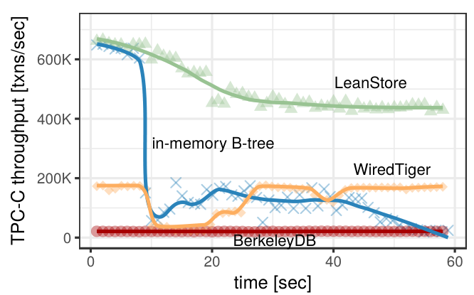

图 9. 20 GB 缓冲池下的 TPC-C（100 个仓库、20 线程）。数据从 10 GB 增长到 50 GB，超过缓冲池容量。

图 9 的结果表明，虽然后台每秒向 SSD 写出约 500 MB，LeanStore 的性能仍接近内存内性能。性能保持很高，是因为替换策略成功识别出了工作集，并将其保留在缓冲池中。采用交换时则完全不同：性能大幅下降且极不稳定，说明当前的交换实现并不是可行替代方案。BerkeleyDB 的性能总体很低，超过 10 分钟之后才耗尽缓冲池（图中没有完整展示）。WiredTiger 明显优于 BerkeleyDB，但 LeanStore 仍比它快两倍以上。

在另一个基于 I/O 的实验中，我们测量了 10 GB 数据库从冷缓存启动后的“爬升时间”（例如数据库干净关闭后再次启动）。除 PCIe SSD（Intel DC P3700 SSD）外，我们还使用低端消费级 SATA SSD（Crucial m4）和机械硬盘（Western Digital Red），测量不同存储设备的影响。PCIe SSD 约 8 秒后达到峰值性能，而 SATA SSD 需要更长的 35 秒。另一方面，机械硬盘在约 15 分钟内只能达到每秒约 10 个（！）事务，因为 TPC-C 的工作集以随机访问模式载入。机械硬盘向缓冲池载入页的速度只有约 5 MB/秒，而随机访问模式不会妨碍 SSD 的性能。机械硬盘与主存之间的巨大性能鸿沟，很可能是磁盘系统不再流行的原因之一。一旦需要 I/O，性能常常出现“断崖式”下降。相比之下，现代 SSD 的性能下降平缓得多。因此，LeanStore 这类高性能存储引擎只应与 SSD 等高速存储设备配合使用，而不应使用机械硬盘。

### B. 点查

迄今为止的实验都基于 TPC-C。虽然它确实很有挑战性，却未必能代表许多真实世界的工作负载。特别是，TPC-C 的插入非常密集（查询与插入之比较低）；它有若干完全随机访问的大关系（`stock`、`customer`）；最大的关系 `orderline` 则具有非常特殊的访问模式。因此，工作集占总数据量的比例相当大。

为模拟常见工作负载，我们实现了一个类似 YCSB 工作负载 C 的只读微基准。数据集为 5 GB，由一棵存储 41 M 个键值对的 B 树构成（键长 8 字节，值长 120 字节），缓冲池大小为 1 GB。我们使用 20 个线程，从均匀分布或 Zipf 分布抽取键执行查找，冷却阶段大小设为 10%。图 10 展示不同倾斜程度下的查找性能和每秒读 I/O 次数。在低倾斜情况下，绝大多数查找都会导致缺页，因此吞吐量接近 I/O 操作数。随着倾斜增大、缺页次数减少，性能显著提高。这些结果说明，我们的替换策略能够有效识别工作集。

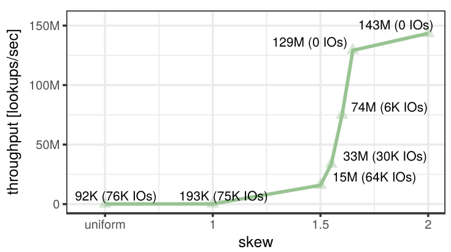

图 10. 查找性能和每秒 I/O 操作数（20 线程、5 GB 数据集、1 GB 缓冲池）。

替换策略唯一的参数，是冷却阶段中的页占比。为找到合适设置，我们将冷却阶段大小从 1% 变化到 50%。图 11 给出不同倾斜程度下、以 10% 设置归一化后的结果。在不同冷却阶段大小下，性能相当稳定，尤其是 5% 至 20% 这类“合理”设置。低倾斜（低于 1.55）时，性能随着冷却阶段变大而下降，因为基本没有可识别的工作集，为冷却阶段浪费任何内存都没有必要。另一方面，在非常高的倾斜（高于 1.7）下，工作集很小，无论冷却阶段较小还是较大，都能很快识别出来。

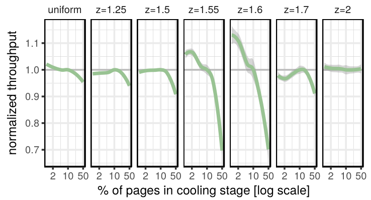

图 11. 冷却阶段大小对吞吐量的影响。吞吐量按 10% 冷却页设置归一化。

只有在非常特定的倾斜设置（约 1.6）下，才会观察到比最优性能低 10% 以上的情况。在这些设置下，工作集接近缓冲池大小。如果冷却阶段太大，频繁且不必要地对热页进行 swizzling 和 unswizzling 会影响性能。在其他设置（例如 1.7）中，如果冷却阶段参数太小，就无法有效识别工作集。一般而言，我们建议将冷却阶段默认设为 10%，因为它在上述因素间提供了良好折中。

除直接在 LeanStore 中执行工作负载外，我们还跟踪了全部页访问，并模拟不同替换策略。对于 5 GB 数据集、1 GB 缓冲池和 Zipf 因子 1.0，页命中率如下：

| 替换策略 | 页命中率 |
| --- | ---: |
| Random | 92.5% |
| FIFO | 92.5% |
| LeanEvict，5% | 92.7% |
| LeanEvict，10% | 92.8% |
| LeanEvict，20% | 92.9% |
| LeanEvict，50% | 93.0% |
| LRU | 93.1% |
| 2Q | 93.8% |
| OPT | 96.3% |

这些结果表明，我们的替换策略“LeanEvict”的页命中率，介于极简单策略（随机和 FIFO）与更复杂技术（LRU、2Q）之间。然而，除仅有理论意义的最优替换策略“OPT”外，所有方法都相当接近。还要注意，页命中率并不直接等于性能，因为 LRU 和 2Q 等更复杂策略也会带来更高的运行时开销，而页命中率并未体现这一点。因此我们认为，在现代硬件环境中，简单策略由于运行时开销更低，常常更可取。

### C. 扫描

目前为止，评估侧重于大量使用索引的工作负载，这对存储引擎颇有挑战。由于我们将 LeanStore 设计为通用存储引擎，也进行了全表扫描实验。我们用两个线程执行两次全表扫描：一个线程持续扫描 10 GB 的 `orderline` 表，另一个持续扫描 0.7 GB 的 `order` 表（使用 400 个仓库的 TPC-C 数据）。我们将缓冲池大小从 2 GB 变化到 12 GB，并启用 I/O 预取。图 12 上半部分显示两个线程的扫描速度。较小表的扫描以黑色虚线表示，不受缓冲池大小影响，因为替换策略始终成功地将它的页保留在缓冲池中。另一方面，较大表的扫描性能取决于缓冲池大小，见图 12 的四条绿色曲线。

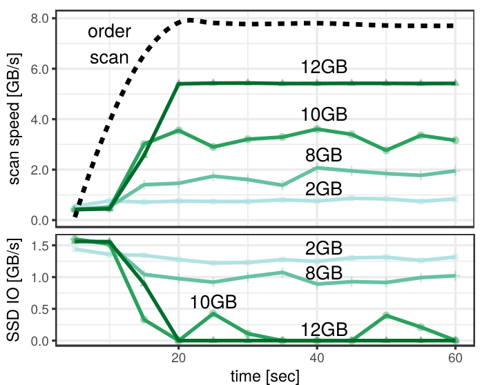

图 12. 使用 2 GB 至 12 GB 缓冲池，并发扫描 0.7 GB 的 `order` 表和 10 GB 的 `orderline` 表。

缓冲池小于 12 GB 时，无法完整缓存较大的表。因此，它的一部分必须不断从 SSD 读取，图 12 下半部分显示的 SSD 读取量反映了这一点。一个有趣的情况是 10 GB 设置：缓冲池略小于两张表的总大小。由于每轮扫描都必须从 SSD 读取部分数据，我们看到周期性的 I/O 模式（在 25 秒和 50 秒处）。尽管偶尔产生 I/O，扫描性能仍然很高，因为大部分数据已被缓存。

## VII. 总结

我们提出了 LeanStore，一种基于指针转换、低开销替换策略和可扩展同步框架的新型存储管理器。实验表明，这一设计与内存数据结构相比，开销可以忽略，同时支持与传统缓冲区管理器相同的功能。

## 参考文献

[1] W. Effelsberg and T. Härder, “Principles of database buffer management,” ACM Trans. Database Syst., vol. 9, no. 4, 1984.

[2] A. Pavlo, “On scalable transaction execution in partitioned main memory database management systems,” Ph.D. dissertation, Brown University, 2013.

[3] C. Diaconu, C. Freedman, E. Ismert, P. Larson, P. Mittal, R. Stonecipher, N. Verma, and M. Zwilling, “Hekaton: SQL server’s memory-optimized OLTP engine,” in SIGMOD, 2013.

[4] F. Färber, N. May, W. Lehner, P. Große, I. Müller, H. Rauhe, and J. Dees, “The SAP HANA database – an architecture overview,” IEEE Data Eng. Bull., vol. 35, no. 1, 2012.

[5] A. Kemper and T. Neumann, “HyPer: A hybrid OLTP&OLAP main memory database system based on virtual memory snapshots,” in ICDE, 2011.

[6] S. Tu, W. Zheng, E. Kohler, B. Liskov, and S. Madden, “Speedy transactions in multicore in-memory databases,” in SOSP, 2013.

[7] J. DeBrabant, A. Pavlo, S. Tu, M. Stonebraker, and S. B. Zdonik, “Anti-Caching: A new approach to database management system architecture,” PVLDB, vol. 6, no. 14, 2013.

[8] J. J. Levandoski, P. Larson, and R. Stoica, “Identifying hot and cold data in main-memory databases,” in ICDE, 2013.

[9] K. Alexiou, D. Kossmann, and P. Larson, “Adaptive range filters for cold data: Avoiding trips to Siberia,” PVLDB, vol. 6, no. 14, 2013.

[10] A. Eldawy, J. J. Levandoski, and P. Larson, “Trekking through Siberia: Managing cold data in a memory-optimized database,” PVLDB, vol. 7, no. 11, 2014.

[11] H. Zhang, D. G. Andersen, A. Pavlo, M. Kaminsky, L. Ma, and R. Shen, “Reducing the storage overhead of main-memory OLTP databases with hybrid indexes,” in SIGMOD, 2016.

[12] J. Gray and G. Graefe, “The five-minute rule ten years later, and other computer storage rules of thumb,” SIGMOD Record, vol. 26, no. 4, 1997.

[13] J. M. Hellerstein, M. Stonebraker, and J. R. Hamilton, “Architecture of a database system,” Foundations and Trends in Databases, vol. 1, no. 2, 2007.

[14] S. Harizopoulos, D. J. Abadi, S. Madden, and M. Stonebraker, “OLTP through the looking glass, and what we found there,” in SIGMOD, 2008.

[15] L. Ma, J. Arulraj, Z. Zhao, A. Pavlo, S. Dulloor, M. Giardino, J. Parkhurst, J. Gardner, K. Doshi, and S. Zdonik, “Larger-than-memory data management on modern storage hardware for in-memory OLTP database systems,” in DaMoN, 2016.

[16] H. Zhang, G. Chen, B. C. Ooi, W. Wong, S. Wu, and Y. Xia, “"Anti-Caching"-based elastic memory management for Big Data,” in ICDE, 2015.

[17] R. Stoica and A. Ailamaki, “Enabling efficient OS paging for main-memory OLTP databases,” in DaMoN, 2013.

[18] G. Graefe, H. Volos, H. Kimura, H. A. Kuno, J. Tucek, M. Lillibridge, and A. C. Veitch, “In-memory performance for Big Data,” PVLDB, vol. 8, no. 1, 2014.

[19] “SAP HANA memory usage explained,” https://hcp.sap.com/content/dam/website/saphana/en_us/Technology%20Documents/HANA_Memory_Usage_SPS8.pdf.

[20] “MemSQL memory management,” https://docs.memsql.com/docs/memory-management.

[21] F. Funke, A. Kemper, and T. Neumann, “Compacting transactional data in hybrid OLTP&OLAP databases,” PVLDB, vol. 5, no. 11, 2012.

[22] R. Sherkat, C. Florendo, M. Andrei, A. K. Goel, A. Nica, P. Bumbulis, I. Schreter, G. Radestock, C. Bensberg, D. Booss, and H. Gerwens, “Page as you go: Piecewise columnar access in SAP HANA,” in SIGMOD, 2016.

[23] J. J. Levandoski, D. B. Lomet, and S. Sengupta, “The Bw-Tree: A B-tree for new hardware platforms,” in ICDE, 2013.

[24] J. Levandoski, D. Lomet, and S. Sengupta, “LLAMA: a cache/storage subsystem for modern hardware,” PVLDB, vol. 6, no. 10, 2013.

[25] H. Kimura, “FOEDUS: OLTP engine for a thousand cores and NVRAM,” in SIGMOD, 2015.

[26] A. Kemper and D. Kossmann, “Adaptable pointer swizzling strategies in object bases: Design, realization, and quantitative analysis,” VLDB Journal, vol. 4, no. 3, 1995.

[27] J. M. Mellor-Crummey and M. L. Scott, “Algorithms for scalable synchronization on shared-memory multiprocessors,” ACM Trans. Comput. Syst., vol. 9, no. 1, pp. 21–65, 1991.

[28] H. Garcia-Molina, J. D. Ullman, and J. Widom, Database systems - the complete book (2. ed.). Pearson Education, 2009.

[29] S. J. White and D. J. DeWitt, “QuickStore: A high performance mapped object store,” in SIGMOD, 1994.

[30] R. Johnson, I. Pandis, and A. Ailamaki, “Eliminating unscalable communication in transaction processing,” VLDB Journal, vol. 23, no. 1, 2014.

[31] S. K. Cha, S. Hwang, K. Kim, and K. Kwon, “Cache-conscious concurrency control of main-memory indexes on shared-memory multiprocessor systems,” in PVLDB, 2001.

[32] Y. Mao, E. Kohler, and R. T. Morris, “Cache craftiness for fast multicore key-value storage,” in EuroSys, 2012.

[33] V. Leis, F. Scheibner, A. Kemper, and T. Neumann, “The ART of practical synchronization,” in DaMoN, 2016.

[34] R. J. Barber, V. Leis, G. M. Lohman, V. Raman, and R. S. Sidle, “Fast multi-tier indexing supporting dynamic update,” US Patent 20 160 283 538, 2015.

[35] V. Leis, A. Kemper, and T. Neumann, “The adaptive radix tree: ARTful indexing for main-memory databases,” in ICDE, 2013.

[36] Z. Wang, A. Pavlo, H. Lim, V. Leis, H. Zhang, M. Kaminsky, and D. Andersen, “Building a bw-tree takes more than just buzz words,” in SIGMOD, 2018.

[37] G. Graefe, “A survey of B-tree locking techniques,” ACM Trans. Database Syst., vol. 35, no. 3, 2010.
