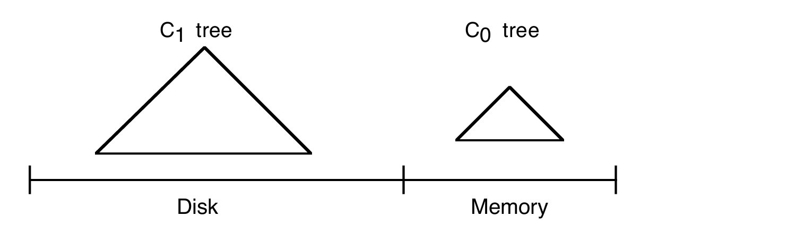
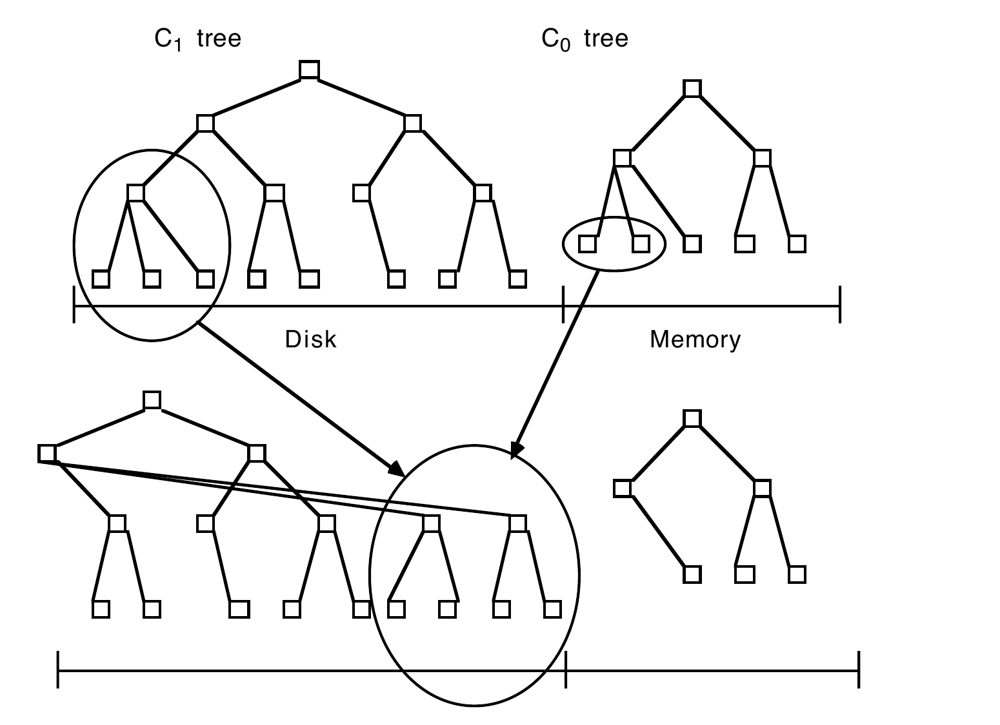
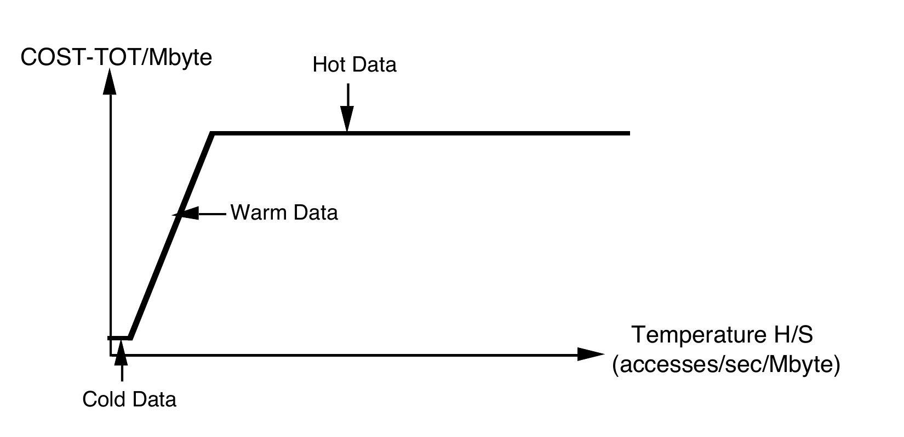
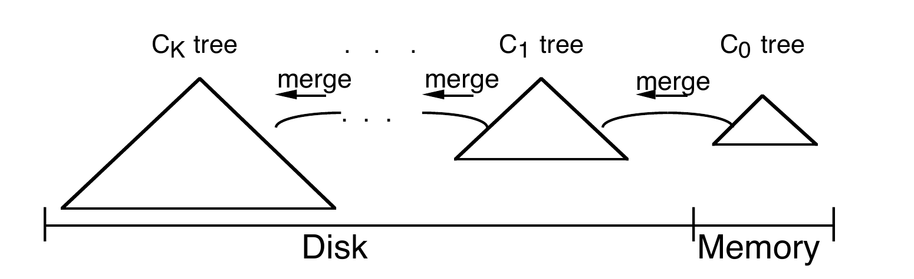
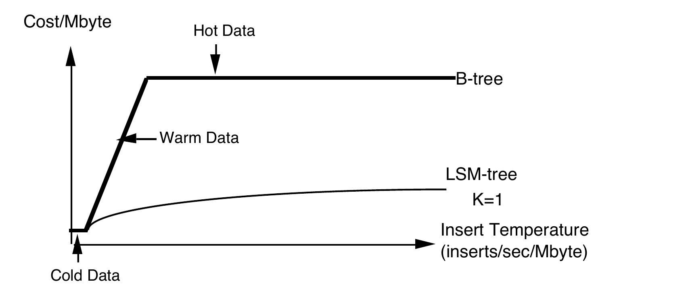

# The Log-Structured Merge-Tree (LSM-Tree)（中文译文）

## 译者说明

本文依据同目录的 `source.pdf` 翻译。章节、图表、公式、算法、代码与参考文献按原文结构保留。

Patrick O'Neil¹，Edward Cheng²，Dieter Gawlick³，Elizabeth O'Neil¹

1. 马萨诸塞大学波士顿分校数学与计算机科学系，Boston, MA 02125-3393，`{poneil | eoneil}@cs.umb.edu`
2. Digital Equipment Corporation，Palo Alto, CA 94301，`edwardc@pa.dec.com`
3. Oracle Corporation，Redwood Shores, CA，`dgawlick@us.oracle.com`

即将发表于：*Acta Informatica*

## 摘要

高性能事务系统应用通常会向 History 表插入行以留下活动轨迹；与此同时，事务系统还会生成用于系统恢复的日志记录。这两类信息都能从高效索引中获益。一个著名场景是经过修改的 TPC-A 基准应用：为了高效查询特定账户的活动历史，需要在快速增长的 History 表上建立按账户标识符组织的索引。遗憾的是，B-tree 等标准磁盘索引结构若要实时维护这种索引，实际上会使事务的 I/O 成本翻倍，令系统总成本最多增加 50%。因此，显然需要一种低成本维护实时索引的方法。

日志结构合并树（Log-Structured Merge-tree，LSM-tree）是一种磁盘数据结构，旨在以较低成本为长期承受高记录插入（及删除）速率的文件建立索引。LSM-tree 采用延迟并批量执行索引变更的算法：变更从内存组件开始，以类似归并排序的高效方式逐级流经一个或多个磁盘组件。在此过程中，除极短的加锁时段外，所有索引值始终可供检索——它们或者位于内存组件，或者位于某个磁盘组件。与 B-tree 等传统访问方法相比，该算法显著减少磁盘臂移动；当传统方法的插入磁盘臂成本压倒存储介质成本时，它能改善成本性能。LSM-tree 方法还可推广到插入和删除之外的操作。不过，要求立即响应的索引查找在某些情况下会损失 I/O 效率，所以 LSM-tree 最适合索引插入比条目检索更常见的应用；History 表和日志文件通常正有此性质。第 6 节的结论会把 LSM-tree 中内存/磁盘组件的混合使用，与把磁盘页缓存在内存中的常见混合方法相比较。

## 1. 引言

随着活动流管理系统中的长事务逐渐商用（[10]、[11]、[12]、[20]、[24]、[27]），事务日志记录的索引访问需求也会增长。传统事务日志主要服务于中止和恢复：正常处理中只需偶尔回看较短期的历史以回滚事务，恢复则使用成批顺序读。然而，当系统开始负责更复杂的活动时，一个长生命周期活动的持续时间和事件数量会增长到需要实时回顾过去事务步骤、提醒用户已经完成了什么的程度。同时，系统所知的活动事件总量会增长到现有的内存日志跟踪结构不再可行，尽管内存成本仍会继续下降。要查询海量的历史活动日志，就意味着索引化日志访问会越来越重要。

即使对当前事务系统，为高插入量 History 表上的查询提供索引也很有价值。网络、电子邮件及其他近似事务型系统会产生巨量日志，而且常常拖累宿主系统。为给出具体而熟悉的例子，下面的例 1.1 和例 1.2 考察一个修改后的 TPC-A 基准。本文示例为便于说明采用特定数值参数，推广这些结果并不困难。还要注意，History 表与日志虽都涉及时间序列数据，LSM-tree 索引项却不假定具有相同的时间键顺序；提高效率所需的唯一假设，是更新速率相对于检索速率较高。

### 五分钟法则

下面两个例子都依赖五分钟法则 [13]。这一基本结果指出：当页面引用频率高于大约每 60 秒一次时，购买内存缓冲空间并把页面留在内存中、从而避免磁盘 I/O，可以降低系统成本。60 秒只是近似值，它等于每秒提供一次 I/O 的磁盘臂摊销成本，与每秒缓冲一个 4 KB 磁盘页的内存摊销成本之比。用第 3 节的记号，就是 `COST_P/COST_m` 再除以以 MB 为单位的页大小。这里做的只是当交换具有经济收益时，用内存缓冲来换取更少的磁盘访问。随着内存价格比磁盘臂价格下降得更快，预计该时间区间会逐年增长。它在 1995 年反而短于 1987 年提出时的五分钟，一部分原因是技术上的缓冲假设不同，另一部分是其间出现了极廉价的大规模生产磁盘。

**例 1.1。** 考虑 TPC-A 基准 [26] 所设想的多用户应用，以每秒 1000 个事务运行（这一速率可以缩放，以下只讨论 1000 TPS）。每个事务从三个表中各随机选择一个 100 字节的行，对其中的 Balance 列减去金额 Delta：Branch 表有 1000 行，Teller 表有 10,000 行，Account 表有 100,000,000 行。提交前，事务再向 History 表写一个 50 字节的行，其列为 Account-ID、Branch-ID、Teller-ID、Delta 和 Timestamp。

公认的磁盘与内存成本推算表明，未来若干年 Account 表页都不会常驻内存（见 [6]），而 Branch 与 Teller 表现在就应能完全驻留内存。在上述假设下，对 Accounts 表同一磁盘页的重复引用约相隔 2500 秒，即引用频率约为每 2500 秒一次，远低于五分钟法则约每 60 秒一次的驻留阈值。每个事务因此约需两次磁盘 I/O：一次读入所需的 Account 记录（忽略目标页恰在缓冲区中的罕见情况），另一次写出先前的脏 Account 页以腾出读缓冲空间（稳态运行所必需）。于是 1000 TPS 对应约 2000 IOPS。按 [13] 假设的每个磁盘臂每秒 25 次 I/O，需要 80 个磁盘臂；1987 至 1995 的八年中该速率年增不足 10%，目前名义速率约为 40 IOPS，因此 2000 IOPS 需 50 个磁盘臂。[6] 估计 TPC 应用的磁盘成本约占系统总成本的一半；IBM 大型机上的比例略低。但由于内存与 CPU 成本下降都快于磁盘，支持 I/O 的成本显然正成为总成本中不断增长的部分。

**例 1.2。** 现在考虑高插入量 History 表上的索引，并说明它会令 TPC 应用的磁盘成本大致翻倍。要高效查询某个账户最近的活动，History 表必须有一个以“Account-ID 与 Timestamp 拼接值”（`Acct-ID||Timestamp`）为键的索引，例如：

**(1.1)**

```sql
SELECT * FROM History
WHERE History.Acct-ID = %custacctid
  AND History.Timestamp > %custdatetime;
```

没有 `Acct-ID||Timestamp` 索引，该查询必须直接搜索 History 表的所有行，因而不可行。仅对 Acct-ID 建索引已能获得大部分收益，但后续成本分析并不因省略 Timestamp 而改变，所以这里采用更有用的拼接索引。实时维护这种二级 B-tree 需要多少资源？B-tree 每秒生成 1000 个条目；若积累 20 个工作日、每天 8 小时、每条 16 字节，则共有 576,000,000 个条目，占 9.2 GB 磁盘，即使没有空间浪费，叶层也约需 230 万页。由于事务的 Acct-ID 随机选择，每个事务至少要从该索引读取一页，稳态下还要写回一页。按五分钟法则，这些索引页不会驻留缓冲区（同一磁盘页约每 2300 秒才读一次），所有 I/O 都落到磁盘。它在更新 Account 表所需的 2000 IOPS 之外再增加 2000 IOPS，需要多买 50 个磁盘臂，使磁盘需求翻倍。这一估算还乐观地假定，把日志文件索引限制为 20 天所需的删除能在低负载时批量完成。

我们选择 B-tree，是因为它是商用系统中最常见的磁盘访问方法，而且经典磁盘索引结构确实没有一种能始终提供更好的 I/O 成本性能。第 5 节会讨论这一判断。我们提出的 LSM-tree 能以少得多的磁盘臂资源执行频繁索引插入，成本低一个数量级。它延迟并批量处理索引变更，再以类似归并排序的高效方式把变更迁移到磁盘。把条目的最终磁盘位置延后确定至关重要；一般的 LSM-tree 还会形成级联的延迟放置序列。删除、更新乃至允许长延迟的查找也能获得同类效率，只有必须立即返回的查找仍较昂贵。例 1.2 正是 LSM-tree 的典型用途：读取远少于插入，但仍频繁到必须维护索引，不能顺序扫描全部记录。

下文安排如下：第 2 节介绍双组件 LSM-tree 算法；第 3 节分析其性能并引出多组件结构；第 4 节勾勒并发与恢复；第 5 节考察竞争访问方法及其在目标应用中的性能；第 6 节总结其含义并提出若干扩展方向。

## 2. 双组件 LSM-tree 算法

LSM-tree 由两个或更多树状组件数据结构构成。本节讨论最简单的双组件情形，并继续假设它为例 1.2 的 History 表行建立索引。



*图 2.1：双组件 LSM-tree 的示意图。*

双组件 LSM-tree 有一个完全驻留内存的较小组件，称为 `C_0` 树（或 `C_0` 组件）；还有一个驻留磁盘的较大组件，称为 `C_1` 树（或 `C_1` 组件）。虽然 `C_1` 位于磁盘，其常用页仍会像普通磁盘树一样留在内存缓冲区，因此高层热门目录节点可以视为常驻内存。

每生成一个新的 History 行，系统先按通常方式向顺序日志文件写入恢复该插入所需的日志记录，再把该行的索引项插入内存中的 `C_0`；该条目随后会迁移到磁盘上的 `C_1`。查找一个索引项时先查 `C_0`，再查 `C_1`。`C_0` 条目迁往 `C_1` 存在一定延迟，崩溃前尚未落盘的条目必须恢复。第 4 节会讨论恢复；目前只需指出，恢复 History 新插入所用的日志可视作逻辑日志：恢复时既重建已插入的 History 行，也重建其索引项，从而找回丢失的 `C_0` 内容。

向 `C_0` 插入索引项不产生 I/O，但内存容量远贵于磁盘，限制了 `C_0` 的大小。为高效把条目迁移到低成本磁盘，每当插入令 `C_0` 接近分配上限，持续运行的滚动合并（rolling merge）就从 `C_0` 删除一段键值连续的条目，并把它们合并进 `C_1`。

`C_1` 的目录结构与 B-tree 类似，却针对顺序磁盘访问优化：节点 100% 填满，根以下各层的连续单页节点成组装入相邻的多页磁盘块，以提高磁盘臂效率；SB-tree [21] 也采用了这种优化。滚动合并和长范围检索使用多页块 I/O，索引匹配查找则使用单页节点以减小缓冲需求。设想根以下节点采用 256 KB 多页块；按定义，根节点始终只占一页。

滚动合并由一系列合并步骤组成。读入包含 `C_1` 叶节点的一个多页块后，一段 `C_1` 条目进入缓冲区。每个步骤取缓冲块中的一个磁盘页大小的 `C_1` 叶节点，把它与 `C_0` 叶层取出的条目合并——这会缩小 `C_0`——再形成新的 `C_1` 叶节点。



*图 2.2：滚动合并步骤的概念图，结果被写回磁盘。*

合并前包含旧 `C_1` 节点的缓冲多页块称为**清空块**（emptying block），新叶节点则写入另一个缓冲多页块，称为**填充块**（filling block）。填充块被新合并的 `C_1` 叶节点装满后，写入磁盘上的新空闲区域。后续步骤依次处理越来越大的键值区间；到达最大键值后，滚动合并再从最小键值开始。

新合并块写到新的磁盘位置，因而不会覆盖旧块；崩溃恢复仍可使用旧块。缓存在内存的 `C_1` 父目录节点会更新以反映新叶结构，但通常会在缓冲区停留更久以减少 I/O。步骤完成后，旧 `C_1` 叶节点失效，再从目录删除。一次合并通常不会恰好在旧叶节点耗尽时填满新节点，因此会留下尚未写盘的合并后 `C_1` 叶条目；多页块层面也一样，填充块装满时，清空块往往仍有许多节点。剩余条目和更新后的目录信息会在块缓冲区中停留一段时间。第 4 节详述合并并发和崩溃后内存丢失的恢复。为缩短恢复重建时间，系统定期设置合并检查点，强制所有缓冲信息落盘。

### 2.1 双组件 LSM-tree 如何生长

从空树开始，第一条记录先插入内存 `C_0`。与 `C_1` 不同，`C_0` 不必采用 B-tree 结构：它从不直接驻留磁盘，节点无需等于磁盘页大小，也不必为降低树高牺牲 CPU 效率，因此可采用 2-3 树或 AVL 树等结构 [1]。当增长中的 `C_0` 首次达到阈值时，系统批量删除最左侧的一段条目，将其重组为 100% 填满的 `C_1` 叶节点。连续叶节点从左到右放进内存里的多页块缓冲区；块满后写盘，成为 `C_1` 磁盘叶层的第一部分。随着叶节点增加，系统也在内存缓冲中建立 `C_1` 目录。

为使 `C_0` 不超过阈值，`C_1` 叶层的多页块按递增键序陆续写盘。上层目录节点保存在单独的多页块或单页缓冲区，具体选择取决于总内存和磁盘臂成本。与 B-tree 一样，目录项中的分隔键把访问引向下层单页节点。设计目标是让精确匹配沿单页索引节点路径到达叶层，从而避免多页读取和过高缓冲需求；滚动合并及长范围检索用多页块，索引查找用单页节点。`C_1` 目录节点被迫写到新磁盘位置有三种情形：目录多页块缓冲已满；根分裂而令树深超过两层；或执行检查点。

更精确地说，目录节点的多页块缓冲区装满时，只需把这个已满的块写盘；根分裂或建立检查点时，则要把全部多页块和目录节点缓冲区一并刷新。第一次把 `C_0` 最右侧叶条目写到 `C_1` 后，流程回到两棵树的左端。此后每一圈都不再只是创建 `C_1`：系统先把 `C_1` 的多页叶块读入缓冲，与 `C_0` 的相应条目合并，再写出新的 `C_1` 叶块。

可以把滚动合并想成一个按离散步骤缓慢循环的概念游标，它在 `C_0` 与 `C_1` 的相同键值位置同步前进。游标不仅在 `C_1` 叶层有位置，在每个更高目录层也有位置。在任一层，正在合并的 `C_1` 多页块通常分成两块：清空块中的一部分条目已耗尽，但仍保存游标尚未到达的信息；填充块保存目前为止的合并结果。对应地，游标处始终有一个清空节点和一个填充节点常驻缓冲区。为了并发访问，每块都由整数个页大小的普通 `C_1` 节点组成；只有实际重构个别节点的短暂步骤会阻止其他访问。

每当必须把全部缓冲节点刷盘时，各层缓冲信息都写到新位置，上层目录随之更新，并写顺序恢复日志。某层填充块日后再次装满时，也写到另一个新位置。恢复仍可能需要的旧信息从不被覆盖；只有更近信息成功写出后才令其失效。持续采用新空间意味着写入区域最终会环绕磁盘，必须重用废弃块。可在内存表中记账，并以整个多页块为单位失效和重用，检查点保证恢复安全。日志结构文件系统 [23] 回收的块往往只释放了一部分，必须额外读写来整理；LSM-tree 在滚动合并尾部会完整释放旧块，因此重用不增加 I/O。这一“总在新位置写多页块”的思想正是 LSM-tree 名称受日志结构文件系统启发之处。

### 2.2 LSM-tree 中的查找

要求立即响应的精确匹配或范围查找先搜索 `C_0`，再搜索 `C_1`，因此相较 B-tree 可能多一点搜索两个目录的 CPU 开销。对多组件 LSM-tree，一般必须通过每个 `C_i` 的索引结构访问所有组件，才能保证检查过全部条目，因此还可能产生额外 I/O。

有几种优化可以把搜索限制在最前面的若干组件。若生成逻辑保证索引值唯一，例如时间戳彼此不同，一旦在较早的 `C_i` 中找到目标，查找便已完成。若条件只涉及很新的时间戳，也可以排除条目尚不可能迁入的最大组件。

还可以在组件 `C_i` 合并到 `C_{i+1}` 时保留最近 `τ_i` 秒生成的条目，只让较旧条目迁出。若最常见的查找引用新插入值，许多查找可在 `C_0` 完成，`C_0` 因而承担了很有价值的内存缓冲功能；[23] 也指出了这一点。短期事务 UNDO 日志通常会在创建后不久因事务中止而被访问。只要跟踪每个事务的开始时间，系统便能保证：最近 `τ_0` 秒内开始的事务，其全部日志索引仍在 `C_0`，无需触及磁盘组件。

### 2.3 删除、更新与长延迟查找

删除可表示为插入一个**删除条目**（tombstone）。它在滚动合并中遇到所指向的旧条目时，两者一起消除；若目标还停留在较小组件，删除甚至可以在数据到达大组件前完成。更新可以表示为一次删除加一次插入。对“删除早于 20 天的所有 History 条目”之类的谓词删除，也可让合并过程在扫描时批量识别并丢弃符合谓词的条目，而无需逐条随机访问。

具体而言，删除某个被索引行时，若在 `C_0` 的相应键位置找不到实际索引项，就插入带有待删行 RID 的删除节点。删除节点在后续合并中向较大组件迁移，直至遇到并湮灭目标项。在此之前，查找必须先经过较新组件中的删除节点过滤，不能返回已删除记录的引用。由于删除节点位于与目标相同的键位置、但处于更早搜索的组件，这种过滤很自然，而且常能减少判断“条目已删除”的开销。会改变索引键的记录更新并不常见，但可用同一机制延迟执行：先放置删除节点，再插入新键条目。

允许长延迟的查找同样可以利用延迟处理：把查找请求编码成一个特殊条目，随滚动合并迁移。它经过各组件时收集所有匹配记录的 RID，最终返回累积结果。这不适合交互式即时响应，却能以顺序、多页 I/O 的成本完成后台查询。由此可见，LSM-tree 的合并思想不仅适用于插入和删除，也适用于能够交换响应延迟以换取批处理效率的操作。

## 3. 成本性能与多组件 LSM-tree

本节分析 LSM-tree 的成本性能，从双组件结构开始，将其与提供同等索引能力的 B-tree 类比，比较高速新增条目所消耗的 I/O 资源。第 5 节将论证，其他磁盘访问方法的新索引项插入 I/O 成本也与 B-tree 相当。两种结构很容易比较：它们都在叶层按排序顺序为每个被索引行保存条目，再用高层目录把访问沿一条页大小节点组成的路径引到叶层。因此，可以用效率较低但容易理解的 B-tree 行为，直观说明 LSM-tree 新增条目的 I/O 优势。

第 3.2 节将证明，双组件 LSM-tree 与 B-tree 的插入 I/O 成本比由两个因素相乘而成。第一个是 `COST_π/COST_P`：`COST_π` 表示作为多页块一部分读写一页所需的磁盘臂成本，`COST_P` 表示随机读写一页的成本；多页块摊销了大量寻道和旋转等待时间。第二个是 `1/M`，表示合并步骤的批处理效率；`M` 是每个 `C_1` 单页叶节点平均从 `C_0` 接收的条目数。

B-tree 的叶页按五分钟法则通常不会在短暂缓冲期间再因另一次插入而被引用：每次都是读页、插入一条、再写页，没有批处理效应。LSM-tree 则不同：只要 `C_0` 相对 `C_1` 足够大，条目便能在 `C_0` 中积累，让每个 `C_1` 叶页的一次往返 I/O 合入多个新条目。例如 16 字节条目在填满的 4 KB 节点中约可放 250 条；若 `C_0` 大小为 `C_1` 的 `1/25`，一次 `C_1` 节点 I/O 平均可接收约 10 个新条目。滚动合并正是同时获得多页顺序访问与批量摊销的关键。

`COST_π/COST_P` 由多页块与随机单页 I/O 的相对效率决定，是 LSM-tree 结构无法改变的常数。但 `1/M` 取决于 `C_0` 与 `C_1` 的大小比：`C_0` 越大，合并的批处理效率越高，可节省更多磁盘臂成本，但也要支付更多内存成本。二者存在使总成本最小的最优组合，可是对很大的索引，最优 `C_0` 仍可能需要非常昂贵的内存。这正是引入多组件 LSM-tree 的动机。

三组件 LSM-tree 包含内存常驻的 `C_0` 和磁盘常驻的 `C_1`、`C_2`，下标越大，组件越大。`C_0→C_1` 和 `C_1→C_2` 各有一个独立的滚动合并，小组件超过阈值时就把条目向较大组件迁移。适当选择中间组件 `C_1`，可在 `C_0:C_1` 和 `C_1:C_2` 两个大小比上以几何级数改善批量合并效率，从而显著缩小内存组件相对于总索引的比例。第 3.4 节将推导多组件间的最优相对大小，以使内存与磁盘总成本最小。

### 3.1 磁盘模型

相对 B-tree，LSM-tree 的主要优势是降低 I/O 成本（磁盘组件 100% 填满，还会比其他已知的灵活磁盘结构节省介质容量）。其中一项 I/O 优势，就是把一页的成本与同一多页块内许多其他页共同摊销。

**定义 3.1.1（I/O 成本与数据温度）。** 当表行或索引条目这类数据的存储量增加时，给定应用中的磁盘臂利用率通常也会增加。购买磁盘同时是在购买两种资源：容量与 I/O 速率。实际工作中通常有一种先成为限制：如果容量是限制，磁盘被装满时磁盘臂只被应用利用了一小部分；如果 I/O 速率是限制，磁盘还只装了一部分，磁盘臂就已达到满负载。

高峰期的一次随机页 I/O 成本记为 `COST_P`，它反映磁盘臂的公平租用成本；一页作为大型多页块的一部分读写时，成本记为 `COST_π`。因为寻道和旋转等待可以在多页间摊销，后者小得多。本文采用以下记号：

- `COST_d` 为每 MB 磁盘存储介质的成本；
- `COST_m` 为每 MB 内存的成本；
- `COST_P` 为磁盘臂每秒提供一次随机单页 I/O 的成本；
- `COST_π` 为磁盘臂每秒提供一次多页块中的页面 I/O 的成本。

考虑一个应用引用的数据集，它占 `S` MB，且在不做数据缓冲的假设下产生每秒 `H` 个随机页 I/O。磁盘臂租用成本是 `H COST_P`，介质成本是 `S COST_d`；限制因素所需的配置会同时带来另一种资源，所以无缓冲的磁盘成本为：

$$
COST_D = \max(S\thinspace{}COST_d,\thickspace{} H\thinspace{}COST_P).
$$

在 `S` 不变时，该成本会随随机 I/O 率 `H` 线性增长。内存缓冲的作用，是在 `H` 增加到某个点时用内存取代磁盘 I/O。如果缓冲页能预先驻留内存，磁盘成本便只剩介质成本；数据仍须在磁盘保留一份，因而缓冲驻留数据的成本为：

$$
COST_B = S\thinspace{}COST_m + S\thinspace{}COST_d.
$$

因此，支持该应用数据访问的总成本取两种方案中的较小者：

$$
COST _ {TOT}=\min\left(\max(S\thinspace{}COST_d,H\thinspace{}COST_P),\thickspace{}S\thinspace{}COST_m+S\thinspace{}COST_d\right).
$$

对固定数据量 `S`，`H` 增加时会经过三个成本区间。访问率低时，总成本由磁盘介质 `S COST_d` 限制，这是**冷数据**；访问率增大后，磁盘臂 `H COST_P` 成为限制，这是**温数据**；最后，五分钟法则表明数据应常驻内存，总成本由 `S COST_m+S COST_d` 限制，对当时的价格而言主要是内存项，这是**热数据**。沿用 Copeland 等人 [6] 的定义，把单位数据访问率 `H/S` 称为数据的**温度**。冷、温与热三个区间的冻结点和沸点分别为：

$$
T_f=\frac{COST_d}{COST_P},\qquad T_b=\frac{COST_m}{COST_P}.
$$



*图 3.1：单位 MB 总成本与温度 `H/S`（每秒每 MB 访问次数）的关系。冷数据由介质容量决定成本，温数据由磁盘臂决定，热数据则适合缓存在内存。*

数据表在访问均匀时很容易计算逻辑温度，但相关温度还取决于访问方法：真正决定成本的是实际磁盘访问率，而不是包含批量缓冲插入在内的逻辑插入率。因此，也可以说 LSM-tree 通过减少实际磁盘访问，降低了被索引数据的有效温度。第 6 节结论将再回到这一观点。

#### 多页块 I/O 的优势

多页块 I/O 的优势也是 Bounded Disorder file [16]、SB-tree [21] 和日志结构文件系统 [23] 等早期方法的核心。1989 年 IBM 对 3380 磁盘上 DB2 实用程序性能的分析 [29] 估计：随机读一页约需 20 ms（10 ms 寻道、8.3 ms 旋转延迟、1.7 ms 读取）；顺序预取 64 个连续页约需 125 ms（10 ms 寻道、8.3 ms 旋转延迟和 106.9 ms 的 64 页读取），即每页约 2 ms。所以多页块中每页 2 ms 与随机每页 20 ms 的比率，意味着磁盘臂成本比 `COST_π/COST_P≈1/10`。较新的 SCSI-2 磁盘也给出相同比例：随机读取一个 4 KB 页约需 16 ms（9 ms 寻道、5.5 ms 旋转延迟、1.2 ms 读取），连续读取 64 个 4 KB 页约需 95 ms，即每页约 1.5 ms。

我们分析的工作站服务器使用容量 1 GB、价格约 1000 美元的 SCSI-2 磁盘，峰值约为每秒 60-70 次 I/O；为避免长 I/O 队列，可用的名义速率取每秒约 40 次 I/O。在这一模型下，1995 年的典型成本正是前述每 MB 内存 100 美元、每 MB 磁盘 1 美元、随机 I/O 每 IOPS 25 美元、多页块 I/O 每 IOPS 2.5 美元。

使用 `T_b` 可以推出五分钟法则的引用间隔 `τ`。若数据每 `τ` 秒引发一次页 I/O，它造成的成本与保留该页所需的内存成本相同：

$$
\frac{1}{\tau}COST_P=\text{page-size}\cdot COST_m.
$$

因此：

$$
\tau=\frac{1}{\text{page-size}}\frac{COST_P}{COST_m}
=\frac{1}{\text{page-size}\cdot T_b}.
$$

以 1995 年的典型值计算，`T_f=1/25=0.04` IOPS/MB，`T_b=100/25=4` IOPS/MB。对于 `0.004` MB 的 4 KB 页，`\tau=1/(0.004\times4)=62.5` 秒/次 I/O。

**例 3.1。** 例 1.1 的 Account 表有 1 亿个 100 字节行，共 10 GB；达到 1000 TPS 时，需要 `H=2000` IOPS。磁盘容量成本约 10,000 美元，I/O 能力成本为 50,000 美元，故数据温度为 `0.2` IOPS/MB，比冻结点高五倍、又远低于沸点，属于温数据。按 I/O 配置的磁盘只使用约五分之一容量；支付的是磁盘臂而不是容量。例 1.2 的 20 天 `Acct-ID||Timestamp` 索引情形相似：叶层条目为 9.2 GB，而增长中的 B-tree 仅约 70% 填满，整棵树约需 13.8 GB，但仅插入就具有与 Account 表相同的 I/O 率，因此温度相近。

### 3.2 LSM-tree 与 B-tree 的 I/O 成本比较

这里比较我们所称的**可合并操作**，包括插入、删除、更新和长延迟查找。

#### B-tree 插入成本公式

插入 B-tree 首先要沿树搜索到条目应放置的位置。我们假定连续插入在叶层的位置是随机的，因此访问路径上的节点页不会因为过去的插入而持续驻留缓冲区。键值一直增大、总是在最右侧插入是一个不满足此假设的常见特例；B-tree 本身已能高效处理这种情况，因为树持续向右增长时 I/O 很少，这也正是 B-tree 批量装载的基本情形。还有一些结构专门处理按递增值对日志记录建索引 [8]。

[21] 把 B-tree 的**有效深度** `D_e` 定义为：在随机键值搜索沿目录向下进行时，平均有多少个页不在缓冲区。对例 1.2 中 `Acct-ID||Timestamp` 索引这样的大型 B-tree，`D_e` 的典型值约为 2。一次插入要以 `D_e` 次 I/O 搜索到叶页，更新它，再在稳态中以 1 次 I/O 写出相应的脏叶页。节点分裂的频率很低，对本分析影响可忽略。这些读写都是成本为 `COST_P` 的随机访问，所以：

$$
COST _ {B\text{-}ins}=COST_P(D_e+1). \tag{3.1}
$$

#### LSM-tree 插入成本公式

评估 LSM-tree 的插入成本必须对多次插入做摊销，因为单次向内存组件 `C_0` 的插入只会偶尔产生 I/O 影响。LSM-tree 有两层批处理效应：第一层是多页块使每页 I/O 的成本降为 `COST_π`；第二层是新条目在 `C_0` 中累积后，一个 `C_1` 叶页的一次读入与写回通常能合入多个条目。B-tree 叶页的引用频率则太低，往往来不及接收第二个插入就已被逐出缓冲区。

**定义 3.2.1（批量合并参数 `M`）。** 对给定 LSM-tree，把滚动合并期间每个 `C_1` 单页叶节点平均接收的 `C_0` 条目数定义为 `M`。`M` 是相对稳定的 LSM-tree 特征值，由索引项大小和 `C_0`、`C_1` 叶层的大小比决定。令 `S_e` 为一个索引项的字节数，`S_p` 为页大小，`S_0`、`S_1` 分别为 `C_0`、`C_1` 叶层的 MB 数。每页约有 `S_p/S_e` 个条目，全树条目中位于 `C_0` 的比例为 `S_0/(S_0+S_1)`，所以：

$$
M=\left(\frac{S_p}{S_e}\right)\left(\frac{S_0}{S_0+S_1}\right). \tag{3.2}
$$

例如每页 200 个条目、`S_1=40S_0` 时，`M≈5`。`C_0` 相对 `C_1` 越大，`M` 也越大。每个合并页需要一次读和一次写，共计 `2COST_π`，其成本由 `M` 个新条目分摊，所以：

$$
COST _ {LSM\text{-}ins}=\frac{2COST _ \pi}{M}. \tag{3.3}
$$

B-tree 和 LSM-tree 的这两个粗略公式都忽略了更新上层索引信息时相对很小的 I/O 成本。

#### LSM-tree 与 B-tree 插入成本比较

比较式 (3.1) 与式 (3.3)，两者之比为：

$$
\frac{COST _ {LSM\text{-}ins}}{COST _ {B\text{-}ins}}
=K_1\left(\frac{COST _ \pi}{COST_P}\right)\left(\frac{1}{M}\right),
\qquad K_1=\frac{2}{D_e+1}\approx0.67. \tag{3.4}
$$

式中 `K_1` 是近似常数；对本文所考察的索引大小，`D_e≈2`，所以 `K_1≈0.67`。成本比正比于前述两种批处理效应：`COST_π/COST_P` 是多页块每页 I/O 成本相对随机页 I/O 的小比率；`1/M` 由滚动合并时每页批量处理的条目数决定。若 `COST_π/COST_P≈0.1` 且 `M≈5`，两项因素相乘可让插入成本比 B-tree 低近两个数量级。当然，只有索引在 B-tree 形态下温度较高、改用 LSM-tree 能大幅减少磁盘数量时，才能真正实现这样的成本改善。

**例 3.2。** 假定一种索引的数据本身占 1 GB，但 B-tree 为获得所需的磁盘臂访问率而必须铺在 10 GB 磁盘容量上。若式 (3.4) 给出的 LSM/B-tree 插入成本比为 `0.02=1/50`，LSM-tree 因条目紧密排列且磁盘臂利用率降低，只需约 0.7 GB 磁盘。不过，成本最低只能降到容纳数据所需的磁盘容量成本；若最初这棵 1 GB 的 B-tree 为获得磁盘臂服务而必须铺在 35 GB 磁盘上，才可以完整实现 `1/50` 的成本改善。

### 3.3 多组件 LSM-tree

参数 `M` 是滚动合并期间每个 `C_1` 单页叶节点平均接收的 `C_0` 条目数。前面一直假定 `M>1`，因为新条目在并入 `C_1` 前有时间在 `C_0` 积累。但式 (3.2) 表明，若 `C_1` 比 `C_0` 大得多，或者条目大到一页只能放很少几个，`M` 也可能小于 1。这意味着每从 `C_0` 合入一个条目，平均必须让不止一个 `C_1` 叶页进出内存。如果 `M<K_1(COST_π/COST_P)`，过小的 `M` 甚至会抵消多页块读取的批处理收益，此时普通 B-tree 的插入反而更好。

双组件 LSM-tree 要避免过小的 `M`，只能增大 `C_0` 相对 `C_1` 的比例。设总叶条目大小 `S=S_0+S_1` 大致稳定，新条目以每秒 `R` 字节进入 `C_0`。为简化分析，假定条目到达 `C_1` 前都不会被删除，所以为使 `C_0` 保持在阈值附近，条目必须以同样的速率通过滚动合并迁到 `C_1`。总大小 `S` 大致稳定还意味着，`C_0` 的插入率必须由 `C_1` 的稳定删除率平衡，例如通过持续的谓词删除实现。

改变 `C_0` 的大小会改变合并游标的巡回速度。迁往 `C_1` 的字节速率为常数，因此游标也必须以固定的字节速率经过 `C_0`。`C_0` 越小，游标从最小键到最大键的巡回频率越高，用于合并的 `C_1` 多页块 I/O 也越多。概念上的极端是 `C_0` 只有一个条目：每新增一个条目都要巡回 `C_1` 的全部多页块，这会造成巨大 I/O 需求，滚动合并反而成为负担。增大 `C_0` 能减慢游标巡回并降低插入 I/O，但会提高内存成本。

从较大的 `C_0` 开始、把 `C_1` 紧密铺在磁盘上，随后逐步用廉价磁盘换掉昂贵内存，直到 `C_1` 所在磁盘臂满载。继续缩小 `C_0` 时，为降低每块磁盘的磁盘臂负载，只能把 `C_1` 分散到更多、未充分使用容量的磁盘；最终会达到总成本最小点。双组件情形的最优 `C_0` 有时仍很昂贵，此时可在内存与最大磁盘组件之间增加一个或多个中等大小的磁盘组件，既限制磁盘臂成本又缩小 `C_0`。



*图 3.1：含 `K+1` 个组件的 LSM-tree。原文与前面的温度图重复使用了 Figure 3.1 编号。*

一般地，一个 `K+1` 组件的 LSM-tree 包含大小递增的 `C_0,C_1,…,C_K`。`C_0` 常驻内存，其余组件驻留磁盘（热门页照常缓冲）。所有相邻组件对 `(C_{i-1},C_i)` 之间都有异步滚动合并；每当较小组件超过阈值，条目就从它移到较大组件。一个长寿命条目从 `C_0` 开始，最终经过 `K` 次异步合并迁到 `C_K`。这种设计针对插入占主导的环境；查找三个或更多组件时，通常每多一个磁盘组件就多一次页 I/O。

### 3.4 LSM-tree：组件大小

本节推导多组件 LSM-tree 的插入 I/O 成本，并说明如何选择各组件的最优阈值。定义组件 `C_i` 的大小 `S(C_i)=S_i`，即其叶层条目总字节数；全树大小：

$$
S=\sum_i S_i.
$$

假定新条目以较稳定的 `R` 字节/秒进入 `C_0`，所有新条目都通过连续滚动合并存活到 `C_K`。`C_0` 至 `C_{K-1}` 接近各自待定的最大阈值；`C_K` 因删除抵消插入而大小相对稳定。令相邻组件的大小比：

$$
r_i=\frac{S_i}{S _ {i-1}},\qquad i=1,\ldots,K.
$$

假定各组件块混合条带化到不同磁盘臂，使磁盘利用率均衡。在磁盘臂而非容量主导的区间，最小化总 I/O 率 `H` 就等同于最小化磁盘臂成本。

**定理 3.1。** 给定一个 `K+1` 组件 LSM-tree，固定最大组件大小 `S_K`、插入率 `R` 和内存组件大小 `S_0`，当所有比值 `r_i` 都等于同一个 `r` 时，执行全部合并的总页 I/O 率 `H` 最小。于是总大小为：

$$
S=S_0+rS_0+r^2S_0+\cdots+r^KS_0, \tag{3.5}
$$

可由 `S` 和 `S_0` 解出 `r`；总页 I/O 率为：

$$
H=\left(\frac{2R}{S_p}\right)\left(K(1+r)-\frac{1}{2}\right), \tag{3.6}
$$

其中 `S_p` 是每页字节数。

**证明。** 稳态下，条目在到达 `C_K` 前不删除，因此进入 `C_0` 的速率 `R` 也等于从每个 `C_{i-1}` 迁往 `C_i` 的速率。若 `C_{i-1}` 在磁盘上，该层合并以 `R/S_p` 页/秒读取 `C_{i-1}`；因为 `C_i` 大 `r_i` 倍，还以 `r_iR/S_p` 页/秒读 `C_i`；写出扩大后的 `C_i` 需要 `(r_i+1)R/S_p` 页/秒。对所有磁盘组件求和：

$$
H=\frac{R}{S_p}\bigl((2r_1+2)+(2r_2+2)+\cdots+(2r _ {K-1}+2)+(2r_K+1)\bigr). \tag{3.7}
$$

即：

$$
H=\frac{2R}{S_p}\left(\sum _ {i=1}^{K}r_i+K-\frac{1}{2}\right). \tag{3.8}
$$

约束为：

$$
\prod _ {i=1}^{K}r_i=\frac{S_K}{S_0}=C.
$$

用 `r_K=C\prod_{i=1}^{K-1}r_i^{-1}` 消去 `r_K`，对其余变量求偏导并令其为零，所得同形方程由 `r_1=\cdots=r_K=C^{1/K}` 解出。因此中间组件应在最小和最大组件之间构成几何级数。证毕。

**定理 3.2。** 若改为固定总大小 `S` 而非最大组件 `S_K`，用拉格朗日乘子可得到更复杂的最优关系：

$$
\begin{aligned}
r _ {K-1}&=r_K+1,\\
r _ {K-2}&=r _ {K-1}+\frac{1}{r _ {K-1}},\\
r _ {K-3}&=r _ {K-2}+\frac{1}{r _ {K-1}r _ {K-2}},\\
&\ \vdots
\end{aligned}
$$

证明从略。实用的 `r_i` 通常较大，例如 20 以上，所以 `S_K` 支配总大小 `S`，相邻 `r_i` 只相差很小比例。后续示例采用定理 3.1 的等比近似。

#### 最小化总成本

当固定 `R` 和 `S_K`、允许 `S_0` 变化时，式 (3.5) 表明缩小 `S_0` 会增大 `r`，式 (3.6) 又表明 `H` 随之增大。总成本是内存成本与磁盘容量/I/O 成本之和：

$$
COST _ {tot}=COST_mS_0+\max(COST_dS_1,COST _ \pi H).
$$

对双组件情形，`K=1`、`r=S_1/S_0`。令：

$$
s=\frac{COST_mS_0}{COST_dS_1},
$$

表示内存成本相对于存放 `S_1` 的磁盘成本；令：

$$
t=2\left(\frac{R/S_p}{S_1}\right)
\left(\frac{COST _ \pi}{COST_d}\right)
\left(\frac{COST_m}{COST_d}\right),
$$

表示归一化温度，并令：

$$
C=\frac{COST _ {tot}}{COST_dS_1}.
$$

在 `S_0/S_1` 很小时，近似为：

$$
C\approx s+\max(1,t/s).
$$

最简单的选型沿 `s=t`，此时磁盘容量与 I/O 能力都充分利用，`C=s+1`；这对 `t≤1` 成本最优。若 `t>1`，最小值沿 `s=\sqrt t`，此时 `C=2\sqrt t`。还原量纲，对 `t≥1`：

$$
COST _ {min}=2\left[(COST_mS_1)\left(\frac{2COST _ \pi R}{S_p}\right)\right]^{1/2}. \tag{3.8}
$$

原文把这一最小成本公式也编号为 (3.8)，与前面的总 I/O 率公式编号重复。其含义是：最小总成本等于“把全部 LSM 数据放内存的极高成本”和“以最便宜方式用多页 I/O 把插入写盘的极低成本”之几何平均数的两倍；一半付给 `S_0` 内存，另一半付给 `S_1` 的磁盘 I/O。随着 `R→∞`，LSM-tree 成本按 `R^{1/2}` 增长，而 B-tree 按 `R` 增长。若 `t≤1`，最小点在 `s=t`，`C=t+1<2`，系统先按存储容量配置磁盘，再用其全部 I/O 能力尽量减少内存。

**例 3.3。** 回到例 3.1 的 `Account-ID||Timestamp` 索引。插入率为每秒 1000 个 16 字节条目，即 `R=16,000` 字节/秒；20 天共 5.76 亿条、9.2 GB。

用 B-tree 时，叶数据属于温数据，磁盘 I/O 是瓶颈。随机更新叶页需要 `H=2000` IOPS，按 `COST_P=25` 美元/IOPS，I/O 成本为 50,000 美元。若叶节点 70% 填满，每页约 `0.7×(4K/16)=180` 个条目；叶上一层要保存约 `5.76亿/180=320万` 个指针。若前缀压缩后每节点容纳 200 条，该层约有 16,000 个 4 KB 页，即 64 MB 内存，成本 6400 美元；更高层忽略不计。B-tree 总成本因此为 56,400 美元。

双组件 LSM-tree 的 `C_1` 需 9.2 GB 磁盘，介质成本 9200 美元。把数据紧密放置并令磁盘臂成本与容量成本相等，可支持 `H=9200/COST_π=3700` 页/秒。把 `H`、`R=16,000`、`S_p=4K` 代入式 (3.6)，得到 `r=S_1/S_0=460`，故 `C_0` 为 20 MB、成本 2000 美元。这是 `s=t` 解，`t=0.22<1`，容量和 I/O 都充分利用，成本 11,200 美元；再加 2 MB 合并块缓冲的 200 美元，总计 11,400 美元。

直观地说，每秒 16,000 字节等于每秒 4 页从 `C_0` 合入 `C_1`。`C_1` 大 460 倍，每个 `C_0` 页平均要与 `C_1` 中相隔 460 个条目的位置合并，因此每秒读写 `4×460×2=3680` 页；9.2 块磁盘按每块 400 页/秒的多页 I/O 正好可提供这一能力。由于双组件已经充分利用资源，本例无需第三组件。

**例 3.4。** 把例 3.3 的 `R` 提高十倍。B-tree 需要 20,000 IOPS，磁盘成本 500,000 美元，相当于 500 GB 磁盘，其中 491 GB 容量闲置；再加 6400 美元目录缓冲，共 506,400 美元。

LSM-tree 的 `t` 同样增十倍至 2.2。它大于 1，最优双组件方案不再充分利用磁盘容量。式 (3.8) 给出最低成本 27,000 美元：一半购买 13.5 GB 磁盘，一半购买 135 MB 内存，其中 4.3 GB 磁盘容量闲置。加 2 MB 缓冲后总成本 27,200 美元。此时 `R=160,000` 字节/秒即 40 页/秒，`C_1/C_0=68`，读写合计 `40×68×2≈5450` 页/秒，正好是 13.5 块磁盘的多页能力。

三组件方案按定理 3.1 令两个大小比都为 `r=23`。`C_0=17` MB（1700 美元），`C_1=400` MB，`C_2=9.2` GB。加上两次滚动合并所需 4 MB 缓冲（400 美元），总成本为 9200 美元磁盘加 2100 美元内存，即 11,300 美元。每秒 40 页在 `C_0→C_1` 合并时造成 `40×23×2=1840` 页 I/O，在 `C_1→C_2` 又造成同量 I/O，总计 3680 页/秒，恰为 9.2 GB 磁盘的多页能力。

双、三组件 LSM-tree 的查找会比简单 B-tree 多一些 I/O。最大组件与对应 B-tree 类似，但前述 LSM 成本没有包含叶上一层目录的 6400 美元缓存。若查找足够频繁，可购买这些缓存：双组件情形可达到 B-tree 的查找速度；三组件情形有时多读一页。若把三组件的目录都按需缓存，总成本升至 17,700 美元，仍远低于 B-tree。不过更完整的分析应在包含更新和检索的整个工作负载上最小化总成本。

增加组件数会继续缩小 `S_0`，直到相邻大小比接近 `e=2.71…` 或进入冷数据区。但组件越多，继续缩小已经很小的 `S_0` 对总成本的影响越弱，同时增加滚动合并的 CPU、合并节点缓冲内存以及即时查找成本。实际中三个组件很可能就是上限。

## 4. LSM-tree 的并发与恢复

本节考察 LSM-tree 的并发与恢复方法，需要把滚动合并的设计再展开一层。我们把并发和恢复算法的形式化正确性证明留给后续工作，这里只说明设计动机。

### 4.1 LSM-tree 中的并发

给定大小递增的 `K+1` 个组件 `C_0,C_1,…,C_K`，相邻组件之间各自运行异步滚动合并。需要处理三类主要冲突。

1. 查找操作与正在修改同一磁盘组件节点的合并步骤冲突。
2. 对内存 `C_0` 的查找或插入，与从 `C_0` 删除一批条目的合并步骤冲突。
3. 内层合并游标可能追上外层游标，例如 `(C_0,C_1)` 的游标推进得比 `(C_1,C_2)` 快，二者同时触及 `C_1` 的相邻区间。

每个磁盘组件都由 B-tree 式的页大小节点构成，但根以下各层按键序排列的多个节点放在同一个多页块中。上层目录既把访问沿单页节点引向下层，也记录哪些连续节点位于同一多页块，从而能一次读写整个块。多数多页块装满节点；少数未满块的有效节点仍占据一段连续页面，但不一定从块的第一页开始。除这一点外，组件结构与 [21] 的 SB-tree 相同。

一个磁盘节点在精确匹配时可以单独位于单页缓冲，也可作为其多页块的一部分驻留内存。长范围查找或高速经过该块的合并游标会使整个多页块进入缓冲。无论哪种情况，所有未锁节点都始终可以从目录查找访问；磁盘访问在真正发起 I/O 前还会做旁查（lookaside），发现目标节点已作为滚动合并块的一部分驻留内存时直接使用它。这一点保证“在多页块中参与合并”不会让节点从普通索引访问路径消失。

磁盘组件以节点为加锁单位。滚动合并修改的节点取得写锁，查找读取的节点取得读锁；避免目录锁死锁的方法已有成熟结论 [3]。

`C_0` 的锁法依赖其具体数据结构：若采用 2-3 树，可写锁一个目录节点下、覆盖本次向 `C_1` 合并键区间的子树；查找则读锁访问路径上的全部 2-3 节点，使两类访问互斥。这里仅讨论 [28] 多层锁中的最低物理层；用于事务隔离的键范围锁等更抽象锁以及幻影更新问题留待他处，参见 [4][14]。查找扫描完叶层目标项就释放读锁；游标每从较大组件合并完一个节点，就释放游标下全部节点的写锁。这给长范围查找或更快游标越过较慢游标留下机会。

由于从较小组件迁出的速率至少与从较大组件迁出的速率一样快，`(C_{i-1},C_i)` 的游标有时必须越过 `(C_i,C_{i+1})` 的游标。并发方法必须允许这一越过发生，不能让一个迁移过程在交点处长期阻塞在另一个过程之后。

对于两个磁盘组件之间的合并，称 `C_{i-1}` 为内层组件、`C_i` 为外层组件。游标在 `C_{i-1}` 叶节点中有一个明确位置，指向下一条将迁往 `C_i` 的条目；在通往该叶的每一级目录上也有对应位置。外层 `C_i` 的叶层及上层同样有位置，指向即将参与比较的条目。随着游标同时推进，新生成的 `C_i` 叶节点立即按从左到右的顺序放入新的内存多页块。因此外层游标周围一般同时存在部分填充的清空块和填充块：前者已消耗一部分但仍含未处理信息，后者含已完成的合并结果但尚不足以写盘。

更一般地，游标可能要让某些条目继续留在 `C_{i-1}`。这时内层组件也有自己的清空块和填充块：前者保存游标尚未处理的节点，后者按键序保存游标已经经过、但决定保留在内层的条目。于是一个时刻会影响四个节点——内外层各自清空块中即将处理的节点，以及内外层填充块中正在写入的节点。四个节点和其块都可能未满。实际修改结构时对四者都加写锁；每当外层清空块的一个节点完全耗尽便在离散时刻释放锁，即使另外三个节点仍未满也没有问题，因为普通树访问能够处理未满节点和未满块。

一个游标越过另一个游标尤其需要小心：被越过的合并在其内层组件上的位置通常会失效，必须重新定向。相同问题也发生在因游标移动而改变的各级目录；高层目录节点通常不作为完整多页块驻留，因此算法会略有不同，但任一时刻仍有填充节点和清空节点。我们把这些复杂细节留到实现积累经验后再解决。

从 `C_0` 到 `C_1` 的滚动合并比磁盘内层情形简单。与所有合并步骤一样，最好让一个 CPU 在该步骤期间专门执行合并，以把写锁排斥其他访问的时间降到最短。系统预先计算本次要合并的 `C_0` 条目范围并锁住整个范围；随后批量删除这些条目，不为每条删除单独重平衡内存树，待步骤结束后再一次性完全重平衡，以节省 CPU。

### 4.2 恢复

检查点开始时，系统先让当前合并步骤完成并释放锁，短暂停止新插入。随后把 `C_0` 写到预知的磁盘位置；插入可恢复执行，但新的合并先暂缓。接着把所有磁盘组件中缓存在内存的脏节点强制落盘。检查点日志记录：

- `LSN_0`：已经反映进索引的最后一个 History 行插入日志序列号；
- 各组件根节点的位置；
- 各组件中所有合并游标的位置；
- 动态磁盘块分配信息。

恢复时从检查点位置读回 `C_0`，恢复各组件根和合并游标，并按块分配记录辨别有效的新旧块。然后重放 `LSN_0` 之后的逻辑插入日志，重建检查点后进入 `C_0` 的条目，再重新启动滚动合并。因为合并结果总写到新磁盘位置，崩溃不会破坏作为恢复基线的旧块；只有在新块和相应目录指针都被检查点确认后，旧块才可安全回收。

新记录的事务插入日志通常已经包含全部字段值以及记录放置位置 RID，所以无需为索引项另建专用日志。恢复算法只需把这些普通插入日志当作重建索引项的逻辑依据。这样做必须集成到系统恢复流程中，并可能稍微延后 History 插入日志占用空间的回收时点，但影响很小。检查点的关键，是明确顺序日志从哪里开始，以及如何依次应用日志，从而确定性重放所有待恢复索引更新。

在检查点时刻 `T_0`，已落盘的各磁盘组件位置都能从组件目录追溯，而根地址记录在检查点日志中。后续多页块写始终采用新位置，所以它们不会擦除这个基线；直到下一检查点确认，旧块仍保留。恢复把 `LSN_0` 后每条被索引行的插入日志转成新条目放入 `C_0`，然后重新运行滚动合并。检查点后写过但未被确认的多页块可以覆盖或回收；当最近插入的行重新进入索引时，恢复完成。

把 `C_0` 写盘需要短暂停顿，但检查点可低频执行，且其余大量磁盘组件页面可在插入恢复后继续刷新。设计的要点不是让每次索引插入同步写磁盘，而是通过日志重放恢复 `C_0`，并通过新位置写入和检查点恢复滚动合并的原子可见状态。

检查点可能因多次磁盘写而暂停较久，但写完 `C_0` 后就能恢复向 `C_0` 插入，其余页面继续刷新；代价只是这段时间新索引项留在 `C_0` 的延迟较长，检查点结束后合并可以追赶。动态多页块分配状态也必须恢复，以确定哪些块可用；这比 [23] 需要解决的块内碎片垃圾收集问题简单。

目录信息还有一个细节：滚动合并每次从磁盘读入一个待清空的多页块或高层目录节点时，都必须立即给它分配新的磁盘位置，以防清空尚未完成就发生检查点、必须把剩余缓冲内容刷盘。指向这些清空节点的目录项要立刻改指新位置；新创建的节点也要立即预分配位置，让树中目录项随时都有确定目标。指向滚动合并所缓冲低层节点的目录节点本身也必须保持缓冲，否则检查点会因修正目录而等待额外 I/O。

检查点后重新读入合并块继续执行时，所有相关块还要再分配新位置，并修正上层指针。工作看似很多，但无需额外 I/O；一个块涉及的指针大概只有 64 个，而且变更会摊到大量已合并节点上。只要检查点频率足以把恢复时间控制在几分钟以内，检查点之间本来就会有数分钟的 I/O，可充分摊销这些目录修改。

## 5. 与其他访问方法的成本性能比较

本节解释为什么经典磁盘索引在例 1.2 中通常需要与 B-tree 相近的每次插入 I/O，并比较几种会把条目从一个分段迁移到另一个分段的方法。例 1.2 的 `Acct-ID||Timestamp` 条目长 16 字节，其中 Acct-ID 占 4 字节、时间戳占 8 字节、History 行 RID 占 4 字节；按每秒 1000 条、20 个八小时工作日计算，共有 9.2 GB 条目，即使没有空间浪费也约占 230 万个 4 KB 页。

**定义 5.1（连续体结构，Continuum Structure）。** 若一种磁盘访问结构在插入新索引项时，立即根据键值把它放到相对于所有现有条目的最终排序位置，则称它为连续体结构。

TPC 应用的连续事务从 1 亿个可能值中随机生成 Acct-ID。原文此处把刚给出的定义误引为“定义 1.1”，上下文实际指定义 5.1。按该定义，`Acct-ID||Timestamp` 的每个新条目会落到 230 万个既有叶页中近乎随机的一页。B-tree 的 5.76 亿条目平均每个 Acct-ID 有 5.76 条，时间戳各异；新条目虽会放在同一 Acct-ID 的既有条目右边，但仍有 1 亿个随机插入点。可扩展哈希 [9] 只是用哈希值计算排序位置，对全部现有条目而言，新位置同样近乎随机。

9.2 GB 条目至少占 230 万页；每秒 1000 次插入意味着同一页约每 2300 秒才因插入被访问一次，按五分钟法则不值得把所有页缓存在内存。像 Bounded Disorder file [16] 那样增大节点也无帮助：引用变频繁的同时，缓冲节点所需内存同比增加，两者抵消。因此一次插入通常要把目标页读入缓冲，之后又为其他页腾出空间而将其逐出。采用原地更新的事务系统必须在逐出前再写一次页，所以不延迟更新的连续体结构每个索引插入至少需要两次 I/O，与 B-tree 大致相同。

B-tree [5] 及其大量变体（如 SB-tree [21]）、Bounded Disorder File [16]、可扩展哈希 [9] 等大多数既有磁盘访问方法都是连续体结构。但有少数方法会在分段间迁移条目，包括 Kolovson 与 Stonebraker 的 MD/OD R-tree [15]、Lomet 与 Salzberg 的 Time-Split B-tree [17][18]，以及把变更积累在小组件、之后合并到完整结构的 Differential File [25]。

LSM-tree 能在某些场景把磁盘臂负载降低近两个数量级，依靠两个条件：（1）保证 `C_0` 常驻内存；（2）谨慎地延迟最终放置。第一次插入必须发生在内存组件中。若 `C_0` 只是一个小磁盘结构碰巧有较多页面被缓存，随着它增长，越来越多插入就会产生额外 I/O，性能会严重退化。保证初始插入零 I/O 后，还必须把条目有控制地延迟放入较大的索引连续体，防止昂贵的 `C_0` 无限增长；多组件 LSM-tree 以一系列延迟放置来最小化总成本。下面几种非连续体结构虽会延迟最终放置，却没有保证初始组件常驻内存；其定义论文把该组件视为磁盘结构。因此它最终可能退化到每次插入至少两次 I/O。

### Time-Split B-tree

Lomet 与 Salzberg 的 Time-Split B-tree（TSB-tree）[17][18] 是按时间戳和键值两个维度定位记录的搜索结构。每当某键值的新记录插入，旧记录就过时，但系统永久保留所有新旧记录的索引。当前节点已满时，可以依情形按键或按时间 `t` 分裂：时间范围早于 `t` 的条目进入历史节点，跨越 `t` 的条目进入当前节点。目标是最终把过时记录迁到廉价的一次写入存储中的历史组件。

这与我们的模型不同：同一 Acct-ID 的新 History 行出现时，旧行并不“过时”。TSB-tree 的当前节点集合确实是延迟更新长期组件的独立组件，但设计并未像 LSM 的 `C_0` 那样让它常驻内存；当前树位于磁盘，历史树位于一次写入存储。TSB-tree 的目标是提供涵盖全部历史记录的时间索引，而非加速插入。没有保证常驻内存的初始组件，每个条目仍需约两次 I/O。

### MD/OD R-tree

Kolovson 与 Stonebraker 的 MD/OD R-tree [15] 同样使用二维访问方法的变体，按时间范围和键值聚簇并索引历史记录。其关键变化是跨越磁盘（MD）与光盘（OD）：最终把过时记录迁到廉价的一次写入光盘中的归档 R-tree，包括叶页及所需目录页。磁盘 R-tree 达到阈值后，Vacuum Cleaner Process（VCP）把一部分最旧叶页移入归档树；论文考察了不同清理比例以及当前树/归档树是一棵还是两棵结构的两个变体 `MD/OT-RT-1` 和 `MD/OT-RT-2`。

和 TSB-tree 一样，当前 MD R-tree 被表示为磁盘常驻，归档 OD R-tree 位于一次写入存储；设计没有声称加速插入。光盘目标也排除了滚动合并。没有保证常驻内存的初始组件，又回到每次插入两次 I/O；[15] 图 4 的模拟即使数据很少，两个变体每次插入的平均读页数也从未低于 2。若把 MD/OD R-tree 在存储层次中整体上移一级、改用内存与磁盘，它与 LSM-tree 有粗略对应，但三种介质特性不同，许多细节并不相同。

### Differential File

Differential File [25] 从一个长期不变的主数据文件开始，把新记录放到专门的溢出区，即差分文件。将来某个未精确定义的时刻，变更会并入主文件，再开启新的差分文件。论文主要讨论较小动态区的优势，以及如何避免按唯一记录标识查找时先查差分文件、再查主文件的双重访问；主要机制是 Bloom filter。

它仍没有让差分文件常驻内存。论文第 3.4 节建议，在转储差分文件并合并到主文件期间，可把一个“差分—差分文件”保存在内存缓存中，以便在线重组，但未进一步分析。这类似于 `C_1` 与 `C_2` 合并时在内存维护 `C_0`，不过论文显然假设较低插入率：第 3.2 节的例子是 1000 万条记录每小时只有 100 次变更。它没有建议让差分—差分文件始终常驻内存，也未讨论插入 I/O 节省。

### 选择性延迟文本索引更新

Dadam、Lum、Praedel 与 Schlageter [7] 的文本索引维护方法也通过延迟实际磁盘写来改善更新性能。索引更新缓存在内存，直到与查询冲突而被强制写出，或由后台任务逐步排出。对文本系统，冲突是被更新文档的关键词与查询关键词重叠；更新写盘后，查询在磁盘索引上运行。因此，与 LSM-tree 不同，内存缓存不是权威索引的一部分。延迟能在强制写与后台写两种情况下批处理一部分更新，但整体更新模式仍像连续体结构。

## 6. 结论与建议扩展

B-tree 会把热门目录节点缓存在内存，因此本来就是一种混合数据结构：大部分数据利用低成本磁盘介质，最热门数据则利用高成本内存的可访问性。LSM-tree 把该层次扩展到一个以上层级，并利用合并 I/O 的多页磁盘读优势。



*图 6.1：单位 MB 访问成本与插入温度的关系，比较 B-tree 和磁盘组件数 `K=1` 的双组件 LSM-tree。*

在最低访问率处，冷数据成本与承载它的磁盘介质成正比。按前述典型值，在冻结点 `0.04` IOPS/MB 以前，磁盘访问成本为每 MB 1 美元。进入温数据区后，磁盘臂成为瓶颈而介质容量利用不足；例如 1 IOPS/MB 成本为每 MB 25 美元。访问足够频繁时成为热数据，B-tree 页面应留在内存：每 MB 内存成本 100 美元，对应至少 4 IOPS/MB 的沸点。

B-tree 缓冲会在进入热数据区后把成本曲线压平，避免成本继续沿温数据斜线增长。LSM-tree 则对插入、删除等可合并操作，把任何现实访问率下的成本都强烈拉向冷数据成本。许多按逻辑访问率应属热数据、因而需让 B-tree 常驻内存的场景，LSM-tree 却能大部分放在磁盘：数据的逻辑温度（每秒插入数）很高，但由于批处理效应，物理磁盘访问率只属温数据。这对可合并操作占压倒性多数的应用非常重要。原文此处把图 6.1 误称为 Figure 4.1；上下文与可见图题都确认指的是图 6.1。

### 6.1 LSM-tree 应用扩展

首先，LSM-tree 条目可以直接包含记录，而不只是指向磁盘其他位置记录的 RID，从而按键值聚簇记录。代价是条目更大，使按字节计的插入率 `R`、游标移动速度和总 I/O 率 `H` 都提高。不过例 3.3 表明，三组件 LSM-tree 能用存储记录和索引所需的磁盘介质成本提供必要巡回；即使不聚簇，这些磁盘也本来要用来存放行。聚簇可能有重要性能收益。

例如，Escrow 事务方法 [20] 因长生命周期更新不阻塞，适合作为工作流管理的支撑层。一个长事务可能对多个聚合 Escrow 字段产生增量变更：系统先留出所请求的增量（Escrow quantity），再解锁聚合记录供并发请求使用。必须保存这些增量日志，可考虑两种聚簇索引：生成事务的事务 ID（TID）与取得 Escrow 数量的字段 ID（FID）。一个 TID 可能在较长时间里对应 20 条日志，久到经典日志结构无法让它们都常驻内存；在事务提交或中止前，按 TID 聚簇很重要。提交时取走的数量永久生效，日志可丢弃；中止时则需把数量归还日志 FID 指定的字段。

处理中止时，应按 TID 聚簇读取该事务全部日志并修正相应 FID 字段。若字段不在内存，与其读入包含它的记录，不如把日志重新反转索引：放入另一棵按 FID 聚簇的 LSM-tree。某个 Escrow 字段日后读回内存时，再访问按 FID 聚簇、可能要作用于它的全部日志。这里也可能访问大量日志，LSM-tree 聚簇能显著节省 I/O。先按 TID、再在字段不驻留内存时按 FID 聚簇 Escrow 日志，可以在长事务大量更新冷/温数据时节省许多 I/O，优于 [20] 的“扩展字段”概念。

另一变体来自第 2.2 节：在 `C_i` 向 `C_{i+1}` 合并时，把最近 `τ_i` 秒生成的条目保留在 `C_i`。这会引出多种方案。例如，游标巡回时可以生成 TSB-tree 一类时间—键索引；滚动合并高效插入新版本，多组件结构最终还能迁移到一次写入存储，并精确控制归档时间和时间—键索引。这一方向值得深入研究，已形成会议论文 [22]。

其他后续研究包括：

1. 把定理 3.1 和例 3.3 的成本分析扩展到同时包含一定比例查找的情形。额外磁盘负载意味着不能再把全部 I/O 能力都分配给滚动合并；必须为查找工作负载预留部分容量。还可允许条目在到达 `C_K` 前删除，并考虑 `(C_{i-1},C_i)` 合并时在内层 `C_{i-1}` 保留一定比例的近期条目。
2. 把维护 LSM-tree 的 CPU 工作卸载到生成日志记录的 CPU 之外。只需把日志传给另一 CPU，稍后再传递查找请求；若共享内存，查找几乎可以不增加延迟。此类分布式工作的设计仍需谨慎研究。

## 致谢

本文作者感谢 Jim Gray 和 Dave Lomet 的帮助；二人阅读了本文早期版本并提出了宝贵的改进建议。本文期刊版本的审稿人也提出了许多有价值的意见。

## 参考文献

[1] Alfred V. Aho, John E. Hopcroft, and Jeffrey D. Ullman, "The Design and Analysis of Computer Algorithms", Addison-Wesley.

[2] Anon et al., "A Measure of Transaction Processing Power", Readings in Database Systems, edited by Michael Stonebraker, pp 300-312, Morgan Kaufmann, 1988.

[3] R. Bayer and M Schkolnick, "Concurrency of Operations on B-Trees", Readings in Database Systems, edited by Michael Stonebraker, pp 129-139, Morgan Kaufmann 1988.

[4] P. A. Bernstein, V. Hadzilacos, and N. Goodman, "Concurrency Control and Recovery in Database Systems", Addison-Wesley, 1987.

[5] D. Comer, "The Ubiquitous B-tree", Comput. Surv. 11, (1979), pp 121-137.

[6] George Copeland, Tom Keller, and Marc Smith, "Database Buffer and Disk Configuring and the Battle of the Bottlenecks", Proc. 4th International Workshop on High Performance Transaction Systems, September 1991.

[7] P. Dadam, V. Lum, U. Praedel, G. Shlageter, "Selective Deferred Index Maintenance & Concurrency Control in Integrated Information Systems," Proceedings of the Eleventh International VLDB Conference, August 1985, pp. 142-150.

[8] Dean S. Daniels, Alfred Z. Spector and Dean S. Thompson, "Distributed Logging for Transaction Processing", ACM SIGMOD Transactions, 1987, pp. 82-96.

[9] R. Fagin, J. Nievergelt, N. Pippenger and H.R. Strong, Extendible Hashing — A Fast Access Method for Dynamic Files, ACM Trans. on Database Systems, V 4, N 3 (1979), pp 315-344.

[10] H. Garcia-Molina, D. Gawlick, J. Klein, K. Kleissner and K. Salem, "Coordinating Multi-Transactional Activities", Princeton University Report, CS-TR-247-90, February 1990.

[11] Hector Garcia-Molina and Kenneth Salem, "Sagas", ACM SIGMOD Transactions, May 1987, pp. 249-259.

[12] Hector Garcia-Molina, "Modelling Long-Running Activities as Nested Sagas", IEEE Data Engineering, v 14, No 1 (March 1991), pp. 14-18.

[13] Jim Gray and Franco Putzolu, "The Five Minute Rule for Trading Memory for Disk Accesses and The 10 Byte Rule for Trading Memory for CPU Time", Proceedings of the 1987 ACM SIGMOD Conference, pp 395-398.

[14] Jim Gray and Andreas Reuter, "Transaction Processing, Concepts and Techniques", Morgan Kaufmann 1992.

[15] Curtis P. Kolovson and Michael Stonebraker, "Indexing Techniques for Historical Databases", Proceedings of the 1989 IEEE Data Engineering Conference, pp 138-147.

[16] Lomet, D.B.: A Simple Bounded Disorder File Organization with Good Performance, ACM Trans. on Database Systems, V 13, N 4 (1988), pp 525-551.

[17] David Lomet and Betty Salzberg, "Access Methods for Multiversion Data", Proceedings of the 1989 ACM SIGMOD Conference, pp 315-323.

[18] David Lomet and Betty Salzberg, "The Performance of a Multiversion Access Method", Proceedings of the 1990 ACM SIGMOD Conference, pp 353-363.

[19] Patrick O'Neil, Edward Cheng, Dieter Gawlick, and Elizabeth O'Neil, "The Log-Structured Merge-Tree (LSM-tree)", UMass/Boston Math & CS Dept Technical Report, 91-6, November, 1991.

[20] Patrick E. O'Neil, "The Escrow Transactional Method", TODS, v 11, No 4 (December 1986), pp. 405-430.

[21] Patrick E. O'Neil, "The SB-tree: An index-sequential structure for high-performance sequential access", Acta Informatica 29, 241-265 (1992).

[22] Patrick O'Neil and Gerhard Weikum, "A Log-Structured History Data Access Method (LHAM)," Presented at the Fifth International Workshop on High-Performance Transaction Systems, September 1993.

[23] Mendel Rosenblum and John K. Ousterhout, "The Design and Implementation of a Log Structured File System", ACM Trans. on Comp. Sys., v 10, no 1 (February 1992), pp 26-52.

[24] A. Reuter, "Contracts: A Means for Controlling System Activities Beyond Transactional Boundaries", Proc. 3rd International Workshop on High Performance Transaction Systems, September 1989.

[25] Dennis G. Severance and Guy M. Lohman, "Differential Files: Their Application to the Maintenance of Large Databases", ACM Trans. on Database Systems, V 1, N 3 (Sept. 1976), pp 256-267.

[26] Transaction Processing Performance Council (TPC), "TPC BENCHMARK A Standard Specification", The Performance Handbook: for Database and Transaction Processing Systems, Morgan Kauffman 1991.

[27] Helmut Wächter, "ConTracts: A Means for Improving Reliability in Distributed Computing", IEEE Spring CompCon 91.

[28] Gerhard Weikum, "Principles and Realization Strategies for Multilevel Transaction Management", ACM Trans. on Database Systems, V 16, N 1 (March 1991), pp 132-180.

[29] Wodnicki, J.M. and Kurtz, S.C.: GPD Performance Evaluation Lab Database 2 Version 2 Utility Analysis, IBM Document Number GG09-1031-0, September 28, 1989.
