# Mainlining Databases: Supporting Fast Transactional Workloads on Universal Columnar Data File Formats（中文译文）

## 译者说明

本文依据同目录的 `source.pdf` 翻译。章节、图表、公式、算法、代码与参考文献按原文结构保留。

Tianyu Li、Matthew Butrovich、Amadou Ngom、Wan Shen Lim、Wes McKinney、Andrew Pavlo<br>
Massachusetts Institute of Technology、Carnegie Mellon University、Ursa Labs<br>
{litianyu,ngom}@mit.edu；{mbutrovi,wanshenl,pavlo}@cs.cmu.edu；wes@ursalabs.org

PVLDB 14(4)：534–546，2021。<br>
DOI：10.14778/3436905.3436913

## 摘要

现代数据处理工具的普及催生了开源列式数据格式。这些格式帮助组织避免为每个应用反复把数据转换为新格式。但这些格式是只读的，组织必须使用重量级转换过程从在线事务处理（OLTP）系统加载数据。结果是，数据库管理系统（DBMS）在传输数据时常常无法充分利用网络带宽。

本文目标是减少甚至消除这种开销：为内存数据库管理系统设计一种感知数据最终用途的存储架构，使其能直接输出通用开源格式的列式存储块。我们对常见分析数据格式做出放宽，使其能高效更新记录，并依赖轻量转换过程在块变冷后把它们转为读优化布局。论文还描述如何以最小序列化开销从第三方分析工具访问数据。

我们基于 Apache Arrow 格式实现存储引擎，并把它集成到 NoisePage DBMS 中评估。实验表明，该方法达到与专用 OLTP DBMS 相当的性能，同时相比现有方法，对外部数据科学和机器学习工具的数据导出快数个数量级。

## 1. 引言

数据分析流水线让组织从 OLTP 系统中的数据提取洞察。这些流水线中的工具常使用 Parquet [10]、ORC [9] 和 Arrow [4] 等开源二进制格式。此类格式使异构系统可通过通用接口交换数据，而不必在私有格式之间转换。但这些格式面向只读负载，不适合 OLTP 系统。因此，数据科学家必须通过计算昂贵的过程转换 OLTP 数据，阻碍及时分析。

尽管混合事务/分析处理（HTAP）DBMS 的进展已经使在 OLTP 负载旁运行 OLAP 查询变得可行，现代数据科学流水线仍包含 TensorFlow、PyTorch、Pandas 等专用框架。组织也大量投资了 Python 工具生态。DBMS 高效导出大量数据给外部工具的需求会长期存在。

为了让数据一到达数据库就能接受分析，并在整个数据分析流水线上获得性能收益，必须改善 DBMS 与外部工具的互操作性。已有工作考察了 DBMS 数据导出方法，并指出从原生存储转换到线格式（wire format）的低效率会拖累这些方法 [47]。如果 OLTP DBMS 以被下游应用直接使用的格式存储数据，导出成本就只剩网络传输成本。实现这一目标有两个挑战。第一，大多数开源列式格式为读/追加优化，而 OLTP DBMS 需要高效原地更新。第二，OLTP DBMS 的并发控制协议通常与存储格式共同设计，以包含版本、时间戳等事务元数据。开发者必须实现与存储格式无关的事务组件。

本文展示可以克服这些挑战：在开源列式格式上构建高性能 OLTP 系统，并支持近零开销的数据导出。我们利用数据自然变冷的过程：数据热时放宽列式格式以获得事务吞吐；写访问不频繁后把数据转换回 canonical format。该后台转换过程与并发控制协议集成，避免 writer 长时间阻塞。

我们在 NoisePage [23] 中实现该存储和并发控制架构，目标格式是 Apache Arrow，但方法也可应用于其他列式格式。结果表明，在 relaxed Arrow format 上运行 OLTP 负载性能良好；Arrow 导出层可以让系统向外部工具进行数量级更快的数据导出。

本文贡献：

1. 提出据我们所知第一个原生运行在流行开源数据格式上的事务系统，并讨论设计和工程考量。
2. 提出一种新的后台转换算法，可扩展到其他任务和格式。
3. 评估 NoisePage 的 Arrow 存储引擎，展示其 OLTP 竞争力以及向下游 Arrow 应用导出数据时的数量级加速。

本文余下部分组织如下：第 2 节讨论研究动机；第 3 节介绍存储架构和并发控制；第 4 节给出转换算法；第 5 节讨论如何向外部工具导出数据；第 6 节给出评估；第 7 节讨论相关工作。

## 2. 背景

本节讨论使用外部工具分析 OLTP DBMS 中数据的挑战，先解释数据转换和移动瓶颈，再介绍 Apache Arrow 及其优缺点。

### 2.1 数据移动与转换

数据处理流水线通常包括前端 OLTP 层和多个分析层。OLTP 引擎使用 n-ary storage model，即行存，以支持高效单元组操作；分析层则使用 decomposition storage model，即列存，以加速大扫描 [25, 31, 40, 44]。由于这两类用例的优化策略冲突，组织常组合多个专用系统。

这种分叉方案最突出的问题是层之间的数据转换与移动。机器学习负载让问题更严重，因为它们常加载整个数据集，而不是小查询结果。例如，数据科学家会先执行 SQL 从 PostgreSQL 导出数据，再在本地 Jupyter notebook 中用 Pandas 加载和准备数据，最后用 TensorFlow 训练模型。每一步都把数据转换为目标框架的原生格式：PostgreSQL 的磁盘优化行存、Pandas 的 DataFrame、TensorFlow 的 tensor。最慢的转换通常是从 DBMS 到 Pandas，因为它通过 DBMS 网络协议取回数据，再重写为所需列式格式。许多组织使用昂贵的夜间 ETL 流水线，从而引入分析延迟。

为理解该问题，我们测量从 DBMS 抽取数据并加载到 Pandas 程序的时间。实验创建 8 GB CSV 文件，包含 TPC-H LINEITEM 表（scale factor 10，6000 万元组），加载到 PostgreSQL v10.6 和 SAP HANA v2.0。比较四种方式：

1. 通过 Python ODBC 连接执行 PostgreSQL SQL。
2. 使用 PostgreSQL `COPY` 命令导出 CSV 到磁盘，再加载到 Pandas。
3. 使用 HANA `EXPORT` 命令写二进制文件，再用 SAP Python 库加载到 Pandas [3]。
4. 直接从 Python runtime 内存中的 buffer 加载数据，作为理论最佳上界。

最后一种方式代表理论最佳情况，用来给数据导出速度提供上界。实验通过 `pg_warm` 扩展把整张表预加载到 PostgreSQL buffer pool。为简化配置，Python 程序和 DBMS 运行在同一台机器上；机器有 128 GB 内存，其中 15 GB 预留给 shared buffers。第 6 节给出该实验环境的完整说明。

结果显示，ODBC 和 CSV 比可能达到的速度慢数个数量级。差异来自转换为不同格式的开销，以及 PostgreSQL wire protocol 中过多序列化。查询处理本身只占总导出时间的 0.004%，其余时间花在序列化层和数据转换上。HANA 虽以 HTAP 为目标，但导出到 Python 的性能几乎和 PostgreSQL 一样慢；HANA 导出表到自有二进制磁盘格式只需约 45 秒，说明多数时间消耗在转换到 Python 格式。优化这一导出过程可以加速分析流水线。

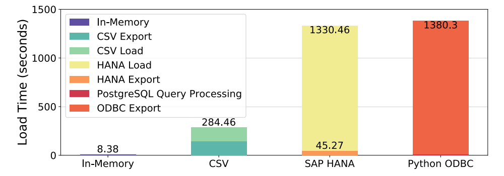

### 2.2 列存与 Apache Arrow

当前数据导出低效要求重新思考导出过程并避免昂贵转换。行存与列式格式之间缺乏互操作性是主要开销来源。传统观点认为列存不适合 OLTP，但近期工作表明列存也能支持高性能事务处理 [46, 50]。本文提出在分析工具使用的数据格式上直接实现 OLTP DBMS。我们选择 Apache Arrow 作为代表格式，分析它对 OLTP 的优缺点。

Apache Arrow 是面向内存数据的跨语言开发平台 [4]。2015 年，Apache Drill、Impala、Kudu、Pandas 等项目开发者共同开发一种通用内存列式数据格式。Arrow 于 2016 年推出，已成为内存列式分析和异构系统接口的标准。其生态包括多种语言 API 和库，TensorFlow 也通过 Python 模块集成 Arrow [19]。

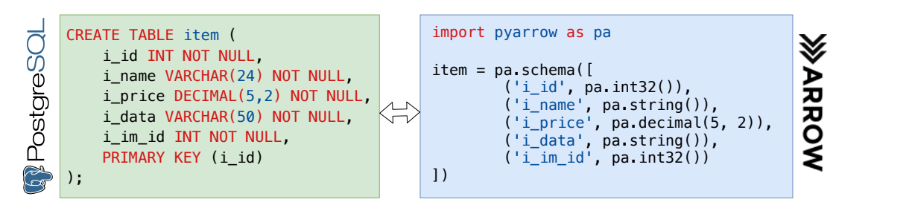

图 2 的完整 schema 示例为：

```sql
CREATE TABLE item (
  i_id INT NOT NULL,
  i_name VARCHAR(24) NOT NULL,
  i_price DECIMAL(5,2) NOT NULL,
  i_data VARCHAR(50) NOT NULL,
  i_im_id INT NOT NULL,
  PRIMARY KEY (i_id)
);
```

```python
import pyarrow as pa

item = pa.schema([
  ('i_id', pa.int32()),
  ('i_name', pa.string()),
  ('i_price', pa.decimal(5, 2)),
  ('i_data', pa.string()),
  ('i_im_id', pa.int32())
])
```

Arrow 核心是用于扁平和层次数据的列式内存格式。它带来两点：

- 快速分析数据处理和向量化执行。
- 零反序列化的数据交换。

为实现前者，Arrow 把数据组织在 8 字节对齐的连续 buffers 中，并用单独 bitmap 表示 NULL。为实现后者，Arrow 指定标准内存表示，并提供类似 C 的数据定义语言描述 schema。Arrow 使用单独的元数据结构，把 buffer 集合组织成类似表的结构；论文以 TPC-C `ITEM` 表展示如何用 Arrow API 描述 SQL 表 schema。

Arrow 的设计目标是只读分析负载，但其对齐要求和 NULL bitmaps 也有利于定长值上的写密集负载。问题出现在变长值（如 `VARCHAR`）上。Arrow 把变长值存为 offset 数组，索引到连续字节 buffer。长度隐含在下一个值的起始 offset 中。若把值 `"JOE"` 更新为 `"ANNA"`，程序必须把整个 values buffer 复制到更大的 buffer，并更新 offsets 数组，产生写放大。

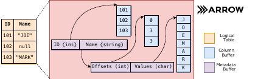

核心问题是单一存储格式很难同时实现 [29]：

1. 数据局部性和值邻接。
2. 常数时间随机访问。
3. 可变性。

已有研究提出行存/列存混合方案绕开这一取舍，其中两个代表是 Peloton [28] 和 H2O [27]。Peloton 在存储引擎之上使用抽象层，把冷行式数据转换为列式格式。H2O 在物理算子层使用抽象层，并按查询生成适合格式的代码。两者都增加工程复杂性，并在 OLTP 场景提供有限加速（第 6.1 节给出结果）。本文认为，虽然按访问模式优化数据布局是合理的，但列存对 OLTP 和 OLAP 都足够好。

## 3. 系统概览

本节介绍 NoisePage 架构：事务引擎如何以最少侵入方式适配 Arrow 布局，表组织、垃圾回收和恢复组件如何工作。为简化说明，先假设数据定长；变长数据在下一节讨论。

### 3.1 并发控制协议

系统要求事务和版本元数据与实际数据分离；若交错存储，会使向外部工具暴露 Arrow 数据的机制复杂化。NoisePage 使用多版本 delta storage 实现这一点 [30]。

DBMS 把元组 delta 存在事务本地 buffer 中，而不是 Arrow 存储中。系统额外使用一列保存 version chain 头指针，对外部读者隐藏。事务只通过 Data Table API 与 Arrow 交互，该 API 抽象底层存储。

读者通过 Data Table 层遍历 version chain，重建正确版本并 materialize。写者则把被修改元组属性的 before-image 复制到事务本地 buffer，安装到 version chain 上，然后把变更原地写入 Arrow 存储。delete 和 insert 通过操纵元组 validity bit 类似处理。

每个事务维护两个本地 buffer：

- undo buffer：修改前镜像，保存版本 delta 并跟踪事务写集。
- redo buffer：修改后镜像，用于日志。

图 4 给出 version chain 例子。事务 2 先插入 `(id=12, val="foo")` 并填充 redo buffer；version chain 指向事务 2 undo buffer 中的条目，表示该元组之前不存在。事务 1 把元组改为 `(id=13)` 时，先把旧值 12 写入 undo buffer，把记录加入 version chain，再把 13 写到底层 data block。为支持任意大写集，DBMS 必须动态扩展 undo buffer，同时保持早期条目的内存地址不变，因为 version chain 中有指针指向它们。NoisePage 把 undo buffer 实现为固定大小 segment（当前 4096 字节）的链表，并按需添加 segment。随后，系统会把 undo 和 redo buffers 分别交给垃圾回收和日志组件；第 3.3、3.4 节将进一步讨论。

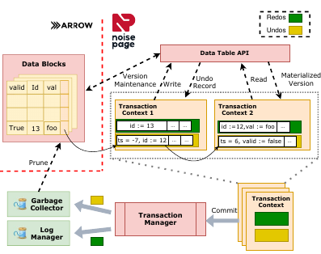

NoisePage 在该存储架构上实现乐观并发控制（Optimistic Concurrency Control）协议的一个变体 [55]。事务引擎为每个事务分配 `(start, commit)` 时间戳对，二者来自同一计数器。事务开始时，`commit` 与 `start` 相同但翻转符号位，表示未提交。version chain 上每次更新存储事务 commit 时间戳。读者通过复制最新版本并沿 version chain 应用 before-images，直到遇到小于自身 start 的时间戳。由于系统用无符号比较时间戳，未提交版本永不可见。系统禁止 write-write 冲突以避免级联回滚。以图 4 为例，时间戳为 8 的读者先读到 `id=13`，然后沿 version pointer 找到事务 1 的 undo record，其时间戳为 `-7`。读者识别出该值尚未提交，应用 delta 得到 `id=12`；继续看到事务 2 的 undo record 后，因为时间戳 6 小于自身时间戳 8，便以正确的 `id=12` 返回。

事务提交时，DBMS 在小 critical section 中获取 commit 时间戳，更新 delta records 的 commit 时间戳，并把它们加入 log manager 队列。critical section 期间新事务不能启动，以避免 fractured reads；现有事务仍可继续操作、提交或 abort。abort 时，系统用事务 undo records 回滚原地更新。但出于竞态风险，不能直接从 version chain unlink records。若某活跃事务在 aborting transaction 回滚前复制了新版本，随后 abort 又 unlink undo record，读者可能无法识别自己看到的是 aborted version。

简单检查 version pointer 在复制期间是否变化也不够，因为会遇到 A-B-A 问题。为避免这一问题，DBMS 在“提交” undo record 前先恢复正确版本，即翻转该版本时间戳的符号位。该记录对已复制正确版本的读者是冗余的，但可修复复制到 aborted version 的读者。该实现提供 Snapshot Isolation；若用 validation phase 替换 critical section，可实现完整 serializability [46]。

在 NoisePage 的存储方案中，事务引擎只用 delta records 和 version column 判断元组可见性。这对读者有成本，因为读者被迫较早 materialize 元组，降低扫描性能。但许多负载中任意时刻只有数据库一小部分有版本信息。因此 DBMS 可以在大部分数据库上忽略每个元组的 version column 检查，进行原地扫描。第 4 节进一步讨论。

### 3.2 Blocks 与物理-逻辑标识

把元组和事务元数据分离带来另一个挑战：系统需要全局唯一的 tuple identifiers，把这两部分关联起来。物理标识如指针对性能最好，但列存中一个元组不在单一物理位置。逻辑标识需要通过查找转换为内存位置，例如 hash table；该转换可能使每元组内存访问翻倍，是 OLTP 瓶颈。

为解决该问题，DBMS 把存储组织为 1 MB blocks，并使用 physiological scheme 标识元组。DBMS 以类似 PAX [26] 的方式在每个 block 中安排数据：一个元组的所有属性都在同一个 block 内。每个 block 有 layout object，包含：

- block 中 slot 数。
- 属性大小列表。
- 每列相对 block 头部的位置偏移。

每列及其 bitmap 都按 8 字节对齐。系统在应用创建表时为每张表计算一次 layout，并用于处理该表所有 blocks。

每个元组由 `TupleSlot` 标识，它结合了元组所在 block 的物理内存地址和 block 内逻辑 offset。结合预计算 layout 后，DBMS 可常数时间计算每个属性的物理指针。为把两者打包进单个 64 位值，系统用 C++11 `alignas` 强制所有 blocks 在地址空间中以 1 MB 边界存储。block 指针低 20 位总为 0，可用于存储 offset；因为一个 block 内元组数永远不会超过字节数，位数足够。

### 3.3 垃圾回收

垃圾回收器（GC）[42, 43, 53, 56] 负责裁剪 version chains 并释放相关内存。删除 slot 的回收在转换到 Arrow 时处理（第 4.3 节）。由于版本信息存储在事务 buffer 中，GC 只检查 transaction objects。

每次运行开始时，GC 先检查事务引擎的 transactions table，找到最老活跃事务的 start timestamp。早于该时间戳提交的事务变更不再可见，可安全移除。GC 检查这些事务，计算 version chain 中有不可见记录的 `TupleSlots`，并且每个 slot 只截断一次。但此时直接释放对象不安全，因为并发事务可能仍在读取已 unlink 的 records。

为此，GC 从事务引擎获取代表 unlink 时间的 timestamp。任何在此时间后启动的事务都不可能访问 unlink record；当系统中最老运行事务的 start timestamp 大于 unlink time 后，records 可释放。该方法类似 epoch protection [32]，并可泛化为 DBMS 其他线程安全场景。系统暴露注册 action 到 GC 的功能，确保该 action 只在注册时并发的所有事务都结束后执行。

### 3.4 日志与恢复

系统通过 write-ahead logging 和 checkpoints 实现持久性 [34, 45]。日志过程类似 GC。每个事务维护 redo buffer，保存物理 after-images。事务按发生顺序把变更写入 redo buffer。提交时，事务向 redo buffer 附加 commit record，并把自身加入 DBMS flush queue。log manager 异步把这些 buffer 中的变更序列化为磁盘格式，再 flush 到持久存储。系统依赖记录按各事务 commit timestamp 的隐式顺序，而不是 log sequence numbers。

redo buffer 与 undo buffer 类似，由全局对象池中的 buffer segments 构成。系统可在事务提交前增量 flush redo records。若 abort 或 crash，事务的 commit record 不会写入，恢复过程忽略它。实现中我们把 redo buffer 限制为单个 buffer segment，并观察到由于 cache 复用更好而有中等加速。

系统在 commit record 加入 flush queue 后就把事务视为 committed。该事务写集上的后续操作在日志落盘前是 speculative。系统为每个提交事务分配 callback，让 log manager 在事务持久后通知。DBMS 在 callback 被调用前不会把事务结果返回给客户端。在这一方案中，若一个事务的修改曾推测性地访问或更新另一事务的写集，则 log manager 处理完它的 commit record 前，系统不会发布这些修改。实现 callback 的方式是在 commit record 中嵌入 function pointer；log manager 写 commit record 时，把该 pointer 加入下次 `fsync` 后调用的 callback 列表。为防止前述异常，read-only transactions 也需要获取一个 non-persisted commit record。

日志记录在磁盘上用 `TupleSlots` 标识元组，尽管重启后指针无效。恢复模式中，系统维护旧 tuple slots 到新物理位置的映射表。checkpoint 是自上次 checkpoint 以来所有变化 blocks 的一致快照；由于多版本机制，只需以事务方式扫描 blocks 就能产生一致 checkpoint。系统在 checkpoint 完成后，把扫描事务的 timestamp 作为记录写入 WAL。恢复时，系统保证恢复到一个一致快照，再应用 commit timestamp 晚于最新 checkpoint 的所有变更。也可以支持 semi-fuzzy checkpoints [48]，其中所有 checkpointed tuples 都已提交，但不一定来自同一快照。

## 4. 块转换

如第 2.2 节所述，在 Arrow 上运行事务的主要障碍是写放大。系统使用 relaxed Arrow format 获得良好写性能，然后在块变冷后用轻量转换步骤把它恢复为完整 Arrow 格式。接下来介绍修改后的格式、转换算法，以及 NoisePage 的重要假设和实现细节。

### 4.1 Relaxed Columnar Format

典型 OLTP 负载任意时刻只修改数据库的一小部分，而其他部分大多被只读查询访问 [41]。因此对热区，系统可以牺牲少量读速度换取写性能，对整体读性能影响较小。我们修改 Arrow 格式来提升热区更新性能。

Arrow 有两个写放大来源：

- 不允许列中有空洞。
- 把变长值连续存储在单个 buffer 中。

relaxed format 在 block header 中增加 validity bitmap，并为每个变长值增加元数据。对于 `VarlenEntry` 字段，系统维护 4 字节 size 和 8 字节指向底层值的 pointer。为对齐，每个 `VarlenEntry` 填充到 16 字节；额外 4 字节存储值的 prefix。若值短于 12 字节，系统把它完整存入对象本身，写入 pointer 字段。事务只访问 `VarlenEntry`，不直接访问 Arrow storage。这样，变长更新变成对 `VarlenEntry` 的定长常数时间更新。


直接访问 Arrow storage 的读者不会看到 `VarlenEntry` 中的更新。系统在 block header 中增加 status flag 和 counter 协调访问。NoisePage 中 block 有三种状态：

- hot：事务活跃修改。
- cooling：正在转换。
- frozen：可按 Arrow 格式原地扫描。

每个 block 的 access counter 充当 shared latch。原地读者开始扫描时加一，结束时减一。当事务更新 frozen block 时，先把该 block 状态设为 hot，迫使未来读者 materialize 而不是原地读；然后在 counter 上自旋等待遗留读者离开该 block。block 成为 hot 后，事务访问不再需要 latch 保护，而依赖 MVCC 实现线程安全。除了翻转 flag，事务修改 frozen block 不需要转换过程，因为 relaxed format 是原始 Arrow format 的泛化。block 一旦成为 hot，就保持 hot，直到后台进程把它转换回完全 Arrow 合规。

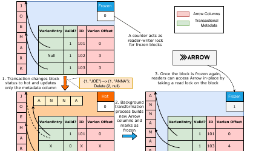

转换流水线有两个组件，即图 7 中以虚线框标出的 access observer 和 block transformer：

- access observer：搭载在 DBMS 正常 GC 上，检查近期变更，识别候选 block 并放入队列（第 4.2 节）。
- block transformer：从队列轮询 block。为正确性，每个 block 在输出为 Arrow block 前至少处理两次。第一遍是事务性的，重排 block 中元组使其连续；该事务会经过 access observer，再次把 block 入队（第 4.3 节）。

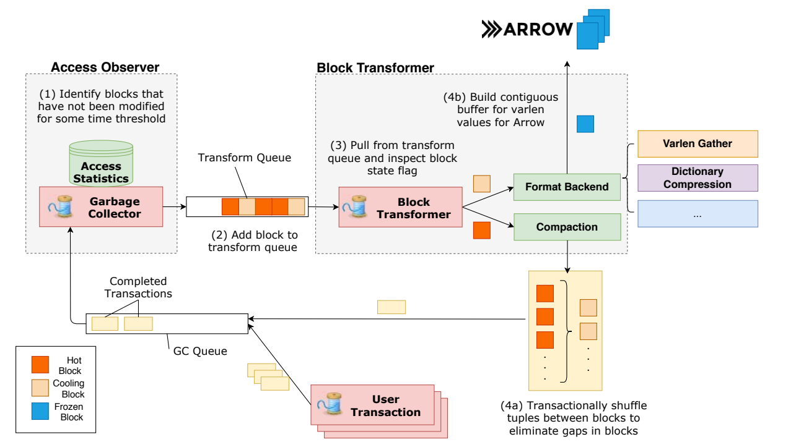

### 4.2 识别冷块

DBMS 维护每个 block 的统计信息以判断是否 cooling。若在事务操作数据库时收集这些统计，会给关键路径增加开销 [33, 36]，OLTP 无法接受。系统用统计质量换取性能，并在转换算法中处理潜在误判。

简单启发是：对每张表，把超过阈值时间未被修改的 block 标为 cold。系统不是在事务关键路径测量，而是利用 GC 扫描 undo records 的过程（第 3.3 节）。每个 undo record 提供修改类型和对应 `TupleSlot`。时间测量较难，因为系统不知道修改和 GC 调用之间经过了多久；DBMS 用 GC 中周期递增的粗粒度计数器近似，例如每 10 ms 增一次。若事务生命周期短于该 GC clock 频率，近似时间不会早于真实修改时间，最多晚一个 tick，对短事务 OLTP 足够 [51]。识别出冷 block 后，系统把它加入后台处理队列。

该方案可能因 access observation 延迟而误把正在更新的 block 识别为 cold。系统通过保证转换算法快速轻量来降低影响。失败情况有两种：用户事务因与转换过程冲突而 abort，或用户事务 stall。两者无法同时完全消除。解决方案是两阶段算法：第一阶段事务性执行，微秒级完成，最小化 abort 可能；第二阶段最终获取短临界区 block-level lock，但尽可能让位给用户事务。

### 4.3 转换算法

识别 cooling blocks 后，系统执行两次转换 pass 以准备 Arrow 读者：

1. compact 每个 block，消除空洞。
2. 把变长值复制到新的连续 buffer，形成 Arrow 的 varlen 表示。

并发事务下有三种安全方案：block copying、transactional operations、block-level locks。都不理想。block copying 昂贵，尤其大部分数据未变化时；transactional operations 增加额外开销并提升 abort；block-level locks 会 stall 用户事务，并在无转换的常见情况下限制并发。

NoisePage 使用混合两阶段方法：事务性的元组移动，加上独占访问下的原始操作；并通过新的多阶段锁方案与 GC 协作以防竞态。block status flag 扩展出两个额外值：

- cooling：转换线程意图获取锁。
- freezing：独占锁，阻止用户事务。

> 源文用语说明：第 4.1 节已把 `cooling` 列为三种 block 状态之一，但此处仍称 `cooling` 与 `freezing` 为“两个额外值”；译文保留这一原文表述。

**算法 1：Block Transformer 伪代码。**

```text
groups := {}
while true do
  block := transformQueue.Dequeue()
  switch block.status do
    case hot:
      AssignGroup(groups, block)
    case cooling:
      if not CheckForLiveVersions(block) then break
      if not block.status.CompareAndSwap(cooling, freezing) then break
      Format(block)
      block.status = frozen
  for group in groups ready for compaction do
    begin txn
    if Compact(group, txn) then
      for block in group do block.status = cooling
      commit txn
    else
      abort txn
```

block transformer 持续从 transform queue 轮询待处理 block。当 hot block 到达时，它把该 block 分配到 compaction group。compaction group 是具有相同 layout 的 blocks 集合。组内系统用未满 block 中的元组填充其他 block 的空洞，并在 block 变空时回收它们。更大的 compaction group 更节省内存，但 compact 更慢。DBMS 在该阶段对每组使用一个事务执行所有操作；移动等价于删除后插入。若事务无冲突执行成功，就把 block 标为 cooling 并提交。用户事务修改 cooling block 时，会 compare-and-swap flag 回 hot。

接下来系统把 cooling block 格式化为 Arrow。核心挑战是用户事务可能触发 check-and-miss race：用户检查 flag 和后续修改之间，转换线程可能把 flag 翻为 cooling。NoisePage 用 GC 防护该问题，因为 GC 不裁剪运行中事务可见的版本。易受该竞态影响的用户事务必然与 compaction 并发，因此 compaction transaction 的版本必须保留。只有在扫描末尾看不到 versioned entry 时，block transformer 才安全地把 block 状态翻为 freezing。任何与扫描并发的修改都会把状态改为 hot，最终 compare-and-swap 到 freezing 时会检测到。

获得 block 独占访问后，转换算法扫描每个变长列，把值连接到连续 buffer，并在无事务保护下更新 pointer。同一 pass 中也计算 metadata，例如 Arrow block header 中的 null count。完成后，系统把 block 标为 frozen，允许原地读者。虽然事务写不被允许，读仍可继续，因为 formatting phase 只改变值的物理位置，不改变表的逻辑内容。由于对任意对齐 8 字节地址的写是原子的 [2]，且 DBMS 对齐 block 内所有属性，读不会不安全。

**算法 2：Compact 伪代码。**

```text
cg := compaction_group.blocks
txn := compaction_group.txn
sort cg by number of empty slots
for (taker = 0, giver = cg.size - 1;
     taker <= giver and taker < cg.size;
     taker++) do
  for each unfilled slot in cg[taker] do
    tuple := last filled tuple in cg[giver]
    txn.Delete(tuple)
    txn.Insert(tuple, slot)
    if txn has conflict then return false
    if cg[giver] is empty then
      add cg[giver] to GC for later deallocation if compaction succeeds
    if taker == giver and taker is contiguous then return true
return true
```

若一组共有 $t$ 个元组、 $b$ 个 blocks、每个 block 有 $s$ 个 slots，则例程结束后恰有 $\lfloor t/s \rfloor$ 个 block 完全填满，一个 block 从开头填到第 $t \bmod s$ 个 slot，其余 block 为空。DBMS 先按空 slot 数排序 blocks，再用后面 blocks 中的元组逐个填补前面 blocks 的空 slot。

移动次数是算法效率指标，因为每次移动都可能触发影响性能的 index update。论文证明该算法至多比最优方案多 $t \bmod s$ 次移动。算法选择 block 集合 $F$，使其成为最终填满的 $\lfloor t/s \rfloor$ 个 blocks；选择 $p$ 作为最终部分填充、容纳 $t \bmod s$ 个元组的 block；其余 blocks 组成最终为空的集合 $E$。随后，算法用 $E \cup \lbrace{}p\rbrace{}$ 中的元组填满 $F \cup \lbrace{}p\rbrace{}$ 的所有空洞，并在 $p$ 内重排元组，使其连续。

对任意 block $f$，令：

- $\mathrm{Gap} _ f$ 为 $f$ 中未填充 slots 的集合；
- $\mathrm{Gap}' _ f$ 为 $f$ 的前 $t \bmod s$ 个 slots 中未填充 slots 的集合；
- $\mathrm{Filled} _ f$ 为 $f$ 中已填充 slots 的集合；
- $\mathrm{Filled}' _ f$ 为 $f$ 中不属于前 $t \bmod s$ 个 slots 的已填充 slots 集合。

由于总共只有 $t$ 个元组，对于任意有效的 $F$、 $p$、 $E$ 选择，都有：

$$
\left|\mathrm{Gap}' _ p\right| + \sum _ {f \in F}\left|\mathrm{Gap} _ f\right| = \left|\mathrm{Filled}' _ p\right| + \sum _ {e \in E}\left|\mathrm{Filled} _ e\right|.
$$

因此，最优移动就是在 $\mathrm{Filled}' _ p \cup \bigcup _ {e \in E}\mathrm{Filled} _ e$ 与 $\mathrm{Gap}' _ p \cup \bigcup _ {f \in F}\mathrm{Gap} _ f$ 之间建立任意一一对应。该算法把已填 slots 最多的 $\lfloor t/s \rfloor$ 个 blocks 选入 $F$； $F$ 中的每个空洞都需要一次移动，而这种 $F$ 的选法比其他选择需要更少移动。最坏情况下，算法选择的 $p$（即已填 slots 数量次多的 block）在前 $t \bmod s$ 个 slots 中全为空，而最优方案选择的 $p$ 在这些位置已填满，因此该算法至多比最优方案多 $t \bmod s$ 次移动。要得到严格最优解，算法必须扫描 blocks，把每个 block 都尝试为候选 $p$；第 6 节的实验只观察到很小的移动次数下降，不足以抵消这项开销。

### 4.4 其他考量

至此已介绍把冷 blocks 转换为 Arrow 的算法。下面通过讨论转换算法的替代输出格式来展示其灵活性，并进一步说明内存管理问题以及面向更大负载的扩展性。

**替代格式。** 转换算法的 formatting phase 可输出不同格式，但目标格式越接近事务表示，性能越好。例如系统可在 formatting 阶段编码 block 并写 Parquet 文件到磁盘，同时保留内存内容用于高效读。我们还实现了一种带 dictionary compression 的替代列式格式 [38]，类似 Parquet [10] 和 ORC [9]。此时 formatting critical section 会扫描 block 两次：第一次构建 dictionary corpus，并把 `VarlenEntry` 内 pointer 改为指向 dictionary words；第二次排序 dictionary 并构建 dictionary codes 数组。

**工作负载假设。** 该算法假设 block 在短时间内频繁修改，随后变冷并变为只读。对于 write-mostly 负载，block 不会被 access observer 认为 cooling，因此方案没有收益也没有额外开销。某些负载可能周期性在只读和写密集间切换，打破假设；此时转换算法在毫秒内完成，并允许 writer 通过重置 flag 快速原地更新 frozen blocks，事务影响被缓解；这不同于更重量级、且只允许对 frozen blocks 执行 read-copy-update 的早期工作 [41]。

**内存管理。** 由于算法从不阻塞读者，转换后不能立即释放内存，因为并发事务可能仍能看到内容。compaction 阶段写操作是事务性的，GC 可以处理内存管理。移动元组时，系统深拷贝变长值，从而无需处理 buffer ownership transfer 问题。gathering 阶段，GC 扩展为接受带 timestamp 的任意 callback action，并承诺在系统中最老活跃事务晚于该 timestamp 启动后执行；如第 3.3 节所述，这类似 epoch protection [32]。转换线程在完成所有原地修改后注册 reclaim memory action，从而避免事务读到已释放内存。

**转换与 GC 的扩展。** 单个 GC 或 transformation thread 无法跟上许多 worker threads 的事务吞吐。DBMS 使用分区并行化。GC 按事务 identifier 分配给 GC thread。虽然 version chain pruning 本身线程安全，但多个 GC thread 可能用不同 safe timestamp 视图裁剪同一 chain 并错误释放不同部分；每个 GC thread 会在刷新全局 safe timestamp 之间启动一个空事务，防止其他线程释放它正在遍历的 chain 部分。转换并行化则由多个线程从同一队列轮询；由于 compaction groups 之间独立，线程互不干扰。

## 5. 外部访问

既然 DBMS 能把 data blocks 转成 Arrow 格式，本节讨论如何向外部应用暴露访问。原生 Arrow 存储对 “data ships to compute” 和 “compute ships to data” 两种模式都有帮助。本节还给出利用原生 Arrow 存储集成下游流水线的策略。

### 5.1 数据导出

与数据科学生态集成的最低侵入方式是保持 data-ships-to-compute 模型，并加速数据导出。我们讨论两种方式，并在第 6 节对它们作实验评估。

**改进 wire protocol。** 许多应用仍有理由只通过 SQL 接口与 DBMS 交互，例如开发者熟悉、生态既有。已有研究指出，wire format 中使用 column batches 而不是 rows 能显著提升性能 [47]。按 block 组织的 Arrow 数据天然适合这类 wire protocol。但仅把 wire protocol 替换为 Arrow 并不能充分发挥存储方案潜力，因为 DBMS 仍需把数据序列化为 wire format，客户端也必须解析数据。若 DBMS 和 client 都原生 Arrow，这两步不必要。DBMS 应能把存储数据直接发送到网络并落入客户端程序工作区，无需写入或读取 wire format。

Arrow 提供基于 gRPC 的原生 RPC 框架 Flight [5]，可在传输数据时避免序列化，并有工作在定义标准 SQL 查询/结果协议 [22]。Flight 让 DBMS 能以零拷贝方式向客户端发送大量冷数据。当大多数数据为冷数据时，Flight 传输速度显著快于真实 DBMS protocol。对热数据，系统需要启动事务并 materialize block snapshot 后再调用 Flight；即便如此，我们观察到 Flight 表现不差于已有最先进方案 [47]。

**通过 RDMA 传输数据。** RDMA 绕过操作系统网络栈，支持高吞吐、低延迟数据传输。DBMS 可 RDMA 写客户端内存，即 client-side RDMA。此时服务器保留对自身数据访问的控制，并且不需要修改并发控制方案。除了提高导出速度，client-side 方法的另一个好处是 RDMA 期间客户端 CPU 空闲，可在部分数据可用时开始处理，形成流水线。DBMS 周期性发送数据部分可用消息。该方法把网络流量降到接近理论下界，但服务器仍需额外处理请求。

对不需要服务器端计算的负载，也可以让客户端直接读 DBMS 内存，绕过 DBMS CPU。这让 OLTP DBMS 不再在事务负载和 bulk export jobs 之间分配 CPU，但会带来问题：DBMS 失去对数据访问的控制，客户端绕过 CPU 后难以锁住 Arrow block 防止更新；此外客户端必须预先知道需要访问哪些 blocks，需要额外代码路径传递信息。

### 5.2 Early ETL 与计算下推

在快速数据导出基础上进一步加速，需要减少需要导出的数据量。可把 ETL 流水线后段计算，如过滤，提前到 DBMS 层执行。以下三类 Early ETL 功能只是论文对未来工作的方案勾勒，并非本文已经实现或评估的能力。

**Early ETL。** 我们举例说明可在转换过程中支持三类基本 ETL 功能：

- 过滤：一种方式是在 formatting pass 中对元组求谓词，生成 bit vector；另一种是定制 compaction algorithm，根据谓词结果把元组分组。前者开销小，但因为过滤后数据可能不连续，会排除使用 RDMA 导出；后者增加 compaction 开销，且无法容纳多个谓词。
- 聚合：可利用每个 block 上的 formatting pass 做块内预聚合。
- 去重：可使用 dictionary-encoding formatting pass，但不生成 dictionary codes。

**把计算送到数据。** RDMA 让外部工具以极低导出开销访问数据，但需要专用硬件，且只有应用具备到 DBMS 的此类连接时才可行；在个人工作站上工作的数据科学家通常不具备这种条件。更深层的问题是，RDMA 仍要求 DBMS 把数据“拉”到执行查询的计算资源，而这种方式的局限早已广为人知，尤其难以完成服务器端过滤。这促使系统考虑 push 模式，即把计算送到数据上。

若采用 push 模式，原生 Arrow 存储不直接改善网络速度，而是把 Arrow 用作 DBMS 和外部工具之间的 API，提高可编程性。若外部工具支持 Arrow 作为输入，就可以把 Arrow references 替换为 DBMS 进程中的 mapped memory images，在 DBMS 上运行程序。这会引入安全、资源分配和软件工程问题，但也允许分析任务跨机器迁移。结合 RDMA 后，可形成真正的 serverless HTAP：客户端指定任务集合，DBMS 动态组装低数据移动成本的异构流水线。

## 6. 评估

我们在 NoisePage DBMS [23] 中实现存储引擎，并在双路 10 核 Intel Xeon E5-2630v4、128 GB DRAM、500 GB Samsung 970 EVO Plus SSD 的机器上评估。每个实验使用 `numactl` 在 NUMA 区域间交错分配内存。所有事务以 stored procedures 执行。实验运行十次并报告平均值。评估先考察 OLTP 性能并量化转换过程的性能干扰，再用一组微基准细查转换算法，最后把数据导出性能与现有方法比较。

### 6.1 OLTP 性能

我们使用 TPC-C [52] 测量 DBMS 的 OLTP 性能，展示存储架构可行且转换过程轻量。每个客户端一个 warehouse。NoisePage 使用 OpenBw-Tree [54] 作为索引。报告吞吐以及每次运行结束时 blocks 的状态。实验用 `taskset` 限制可用 CPU cores，保证开启转换的配置不会额外获得 CPU 资源。系统有一个 logging thread、一个 transformation thread，并且每 8 个 worker threads 有一个 GC thread。转换配置包括：

1. 关闭转换。
2. variable-length gather。
3. dictionary compression。

开启 block transformation 时使用激进的 10 ms 阈值，并只针对产生冷数据的表：ORDER、ORDER_LINE、HISTORY、ITEM。每次运行中，compactor 尝试把同一表的所有 blocks 放入同一组处理。

结果显示，DBMS 具有良好扩展性，转换引入很小开销，最多约 10%。worker 数增加时干扰更明显，因为转换线程工作更多。20 worker threads 时，DBMS 扩展性下降，因为机器只有 20 个物理 CPU cores。dictionary compression 影响稍大，因为计算更密集。实验还测量 abort rate 和因转换 stall 的事务数，没有观察到统计显著的 abort rate 变化，stall 事务数量可忽略（小于 0.01%）。除高线程数下 dictionary compression 外，benchmark 结束时几乎所有可转换 blocks 都 frozen。原因是 compression 比 gather 慢一个数量级（第 6.2 节进一步展示）；此时转换进程会把资源让给用户事务，因此事务吞吐没有显著下降。若 transformation thread 落后，DBMS 可按 block address 分区来并行转换。在该配置下增加 transformation threads 以完成全部转换后，又观察到约 15% 的吞吐下降。

作为 baseline，我们部署 TimesTen Classic v18.1 内存 DBMS [24]，设置 `DurableCommits=false` 关闭 WAL，并用 OLTP-Bench [35] 测量其 TPC-C 性能。TimesTen 的 TPC-C 性能随执行线程增加基本持平。由于 NoisePage 以 stored procedures 运行 TPC-C，而 TimesTen 通过 JDBC 执行，这并不意味着 NoisePage 优于 TimesTen；它说明在真实 OLTP 部署中，事务处理不是存储性能的唯一瓶颈。总体而言，该存储架构性能有竞争力，转换技术只增加可忽略开销。

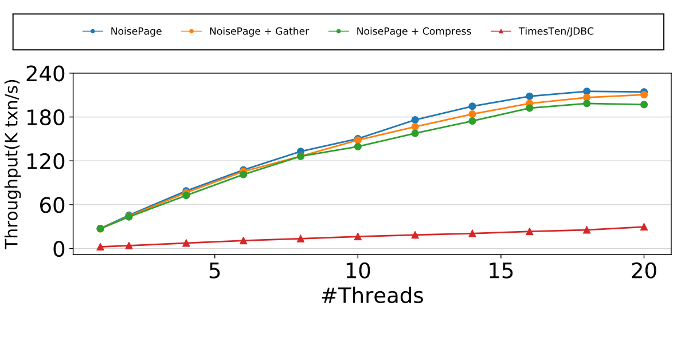

**行存与列存。** 我们还比较行存与列存对 OLTP 的影响。通过声明一个大列保存元组所有属性来模拟 row-store；每个属性是 8 字节定长整数。固定查询线程数，扩大每元组属性数；负载分别为插入或更新，各执行 1000 万条查询。实验忽略索引维护，因为两种存储模型开销相同。结果显示二者性能差异不大。插入负载差距不超过 40%。更新负载中，当复制属性数较少时，列存因内存 footprint 更小优于行存；属性数增加时，行存略快。这表明在内存环境中，优化行存未必带来压倒性性能提升。

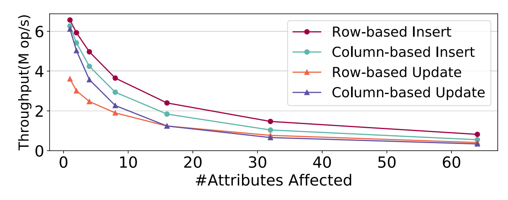

**吞吐与 compaction 随时间的变化。** 系统运行期间的 compaction backlog 实验使用 varlen gather backend、两个 compaction threads 和三个 GC threads，让 20 个线程按前述方式执行 TPC-C。系统每 100 ms 采样一次总 compaction queue size 和事务吞吐；图中给出五分钟运行，并裁掉启动与收尾阶段以便阅读。结果显示 compaction algorithm 能跟上吞吐。事务吞吐波动来自 CPU scaling，与 compaction queue size 没明显相关；dictionary compression 下也观察到类似模式。

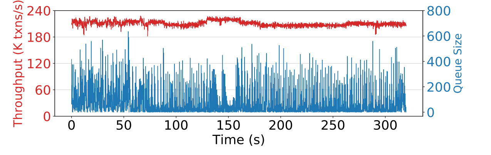

### 6.2 转换为 Arrow

我们用微基准分析转换算法和各子组件。数据库有一张约 1600 万元组的表，两列：一个 8 字节定长列，一个 12–24 字节变长列。该布局下每个 block 约 32K 元组。实验也在列数更多或变长值更大的表上重复运行，没有观察到趋势差异。初始事务填充表，并随机插入空元组模拟删除。

**吞吐。** 实验假设没有并发事务，连续运行两个阶段。比较两种方案：

- Hybrid-Gather：收集变长值并复制到连续 buffer。
- Hybrid-Compress：对变长值使用 dictionary compression。

baseline 包括：

- Snapshot：在事务中读取 block snapshot，并用 Arrow API 复制到 Arrow buffer。
- In-Place：整个转换在事务中原地执行。

每种算法处理 500 个 1 MB blocks，并改变空 slot 百分比。结果显示 Hybrid-Gather 优于替代方案；block 大多填满时（空 slot 小于 5%）达到亚毫秒级性能。空 slot 比例增加后性能下降，因为需要移动更多元组。移动因随机内存访问模式比 Snapshot 昂贵一个数量级。当 block 超过一半为空时，需要移动的元组减少。In-Place 因版本维护开销表现较差。Hybrid-Compress 也比 Hybrid-Gather 和 Snapshot 慢一个数量级，因为计算昂贵。由于性能跨度很大，图 11 使用对数刻度。

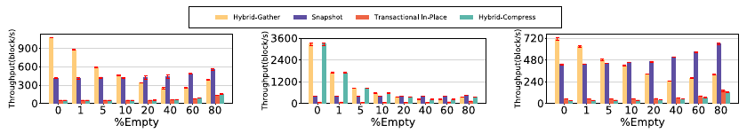

分解实验表明，空 slot 很低时，compaction 阶段只需 bitmap scan，微秒级完成；此时变长 gather 成本占主导。空 slot 增加后，compaction 性能下降，在 5% empty 左右开始主导 Hybrid-Gather 成本。dictionary compression 始终是 Hybrid-Compress 瓶颈。实验还把表布局改为全部定长列或全部变长列重复同一微基准；数据布局变化没有改变总体性能趋势。因此，后续实验只报告 50% 变长列的结果。

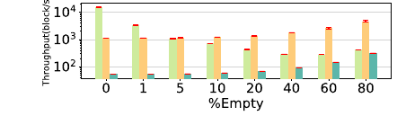

**写放大。** 虽然 Snapshot 在 block 约 20% empty 时吞吐优于 hybrid algorithm，但该测量没有捕获由于元组物理位置改变导致的 index entry 更新开销 [55]。该开销由每次元组移动触发；其具体影响取决于索引，但每次移动的成本为常数，因而测量会触发 index update 的总 tuple movements 即可。Snapshot 总是移动 compacted blocks 中每个元组；实验把它与第 4.3 节的 compaction algorithms 比较。结果显示，本文算法在最佳情况下比 Snapshot 高效数个数量级；block 半空时仍高效约两倍。空 slot 增加时差距缩小。approximate approach 生成的物理配置几乎与 optimal approach 相同；而 optimal algorithm 需要多一次 block 扫描，因此后续实验都使用 approximate algorithm。

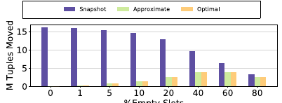

**Compaction group size 敏感性。** 该实验沿用前一实验的配置，对 500 个 blocks 执行一次 transformation pass，同时改变 group size。结果显示，blocks 仅有 1% empty 时，需要较大的 groups 才能释放任何内存；空洞比例增加后，较小 groups 的效果越来越好，而进一步增大 group size 只带来边际收益。较大 group size 还会增加事务 write-set size，却对释放 block 数产生递减收益。理想固定 group size 在 10 到 50 之间，能在良好内存回收和较小 write-set 之间平衡。最佳性能需要 DBMS 根据当前需求动态形成 groups，我们留作未来工作。

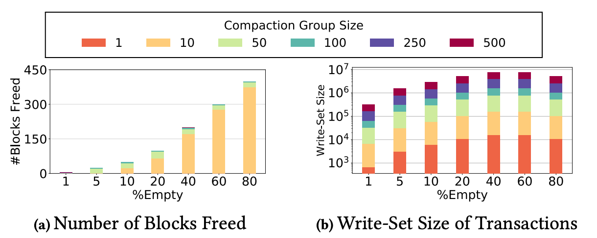

### 6.3 数据导出

最后，我们评估 DBMS 向外部工具导出数据的能力。比较 NoisePage 中第 5 节讨论的四种方法：

1. client-side RDMA。
2. Arrow Flight RPC。
3. 相关工作 [47] 的 vectorized wire protocol。
4. PostgreSQL wire protocol。

实验使用两台服务器，各有 8 核 Intel Xeon D-1548、64 GB RAM 和双端口 Mellanox ConnectX-3 10 GB NIC（PCIe v3.0、8 lanes）。使用 TPC-C ORDER_LINE 表，6000 blocks，总大小约 7 GB。客户端运行 Python 应用，测量从发送数据请求到开始分析执行之间的时间。每种导出方法都有对应 C++ 客户端协议，并用 Arrow 跨语言 API [21] 导入 Python 程序。客户端运行一个 TensorFlow 程序，把数据经过单个 linear unit；该组件性能与系统无关。实验改变 DBMS 中 frozen blocks 百分比，研究并发事务对导出速度的影响。

结果显示，NoisePage 的数据导出比 baseline 快数个数量级。当所有 blocks 都 frozen 时，RDMA 达到可用网络带宽上限，Arrow Flight 可利用最多 80% 可用网络带宽。结合第 2 节的转换成本，NoisePage 可在约 15 秒完成导出任务。当系统必须 materialize 每个 block 时，Arrow Flight 性能下降到与 vectorized wire protocol 相当。热 block 较多时，RDMA 稍慢于 Arrow Flight，因为 Flight 物化后的 block 位于 CPU cache，而 NIC 发送数据会绕过该 cache。PostgreSQL wire protocol 和 vectorized protocol 都不能从冷只读数据上 eliding transactions 中受益。

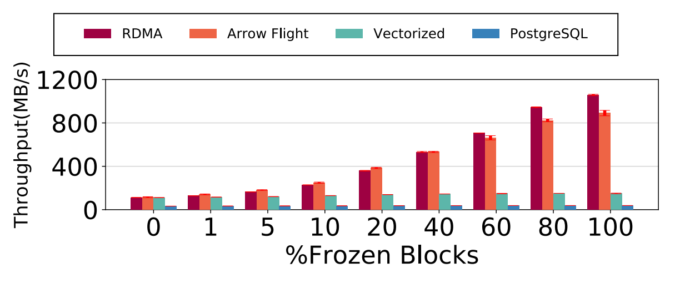

实验说明，DBMS 数据导出的主要瓶颈是 serialization/deserialization。仅在当前架构中把 Arrow 当作 drop-in replacement wire protocol 无法充分发挥潜力；把数据直接存成通用格式才能减少成本并提升导出性能。

## 7. 相关工作

我们讨论三类相关工作。

**通用存储格式。** Apache Hive [6]、Apache Impala [7]、Dremio [12]、OmniSci [17] 等系统支持从通用存储格式 ingestion，以降低数据转换成本。本文的 DBMS 则原生生成该存储格式，作为这些系统的数据源。ORC [9] 与本文最接近，因为它是自描述、类型感知的 Hadoop 列式文件格式，并支持 ACID 事务。Databricks Delta Lake [11] 则是在 cloud storage 之上的 ACID 事务引擎。这些方案面向只读数据集的增量维护，不面向高吞吐 OLTP；目标是大写集、低频、非性能关键事务。Apache Kudu [8] 是架构类似的分析系统，并原生集成 Hadoop 生态，但 Kudu 事务语义限制为单表更新或多表扫描 [20]。

**列存上的 OLTP。** PAX [26] 以列式格式在一个磁盘页内保存单个元组所有属性以降低 IO 成本。HYRISE [37] 根据访问模式垂直分区每张表。SAP HANA [50] 支持从 row-store 到 column-store 的迁移和分区。MemSQL/SingleStore [14] 通过添加 hash indexes、sub-segment access 和细粒度锁改善列式数据上的事务性能。Peloton [28] 的 logical tile 抽象允许迁移而不需要不同执行引擎。本文系统最类似 HyPer [36, 39, 41, 46] 和 L-Store [49]。HyPer 只运行在列式格式上，用与本文类似的 multi-versioned delta concurrency control 保障 ACID，并通过 OS 访问观察压缩冷数据 chunk。差异在于本文系统围绕开源 Arrow 格式构建并提供原生访问；HyPer 的 hot-cold transformation 假设重量压缩，而本文转换过程快速且计算开销低，允许 block 状态更流动。L-Store 也利用 tuple access 的冷热分离，把更新写到 tail-pages，而不是昂贵冷存储；不同的是 L-Store 使用 append-only storage 和 data lineage tracing。

**DBMS 网络优化。** 已有工作 [47] 说明通过现有行式 wire protocols 传输大量数据昂贵，并展示了用向量化 result set 提升传输性能。olap4j 的 JDBC 扩展在 2000 年代初也提出了类似技术 [1]。这些工作优化 DBMS 网络层；本文通过共同设计 DBMS storage 和 export protocols 更广泛地解决问题。RDMA 加速 DBMS 负载也已有大量工作：DB2 pureScale [13] 和 Oracle RAC [18] 用 RDMA 在节点间交换 database pages 并实现 shared storage；Microsoft Analytics Platform Systems [15] 和 SQL Server with SMB Direct [16] 用 RDMA 把数据从独立存储层送到执行层。它们主要优化分布式 DBMS，本文则通过更好的外部工具互操作改善整个数据处理流水线效率。

## 8. 结论

本文提出 NoisePage 面向内存 OLTP 负载的 Arrow-native 存储架构。系统实现一个 multi-versioned delta-store 事务引擎，可直接向外部分析工具输出 Arrow 数据。为保证 OLTP 性能，系统允许事务使用 relaxed Arrow format，并使用轻量内存转换过程在毫秒级把冷数据转换为完整 Arrow。这让 DBMS 能以零序列化开销支持向外部分析工具批量导出数据。评估显示，该实现具有良好 OLTP 性能，同时相比当前方法实现数量级更快的数据导出。

## 致谢

该工作部分由 National Science Foundation（IIS-1846158、IIS-1718582、SPX-1822933）、Google Research Grants、Alfred P. Sloan Research Fellowship program 和 Siebel Scholars program 支持。我们感谢 Carnegie Mellon University 的 David Andersen、Yu Xiang Zhu 和 Tan Li 的反馈。

TKBM.

## 参考文献

- [1] 2013. olap4j: Open Java API for OLAP. http://www.olap4j.org.
- [2] 2016. Guaranteed Atomic Operations on Intel Processors. https://www.intel.com/content/dam/www/public/us/en/documents/manuals/64-ia-32-architectures-software-developer-system-programming-manual-325384.pdf.
- [3] 2018. Diving into the HANA DataFrame: Python Integration. https://blogs.sap.com/2018/12/17/diving-into-the-hana-dataframe-python-integration-part-1/.
- [4] 2019. Apache Arrow. https://arrow.apache.org/.
- [5] 2019. Apache Arrow Source Code. https://github.com/apache/arrow.
- [6] 2019. Apache Hive. https://hive.apache.org/.
- [7] 2019. Apache Impala. https://hive.apache.org/.
- [8] 2019. Apache Kudu. https://kudu.apache.org/overview.html.
- [9] 2019. Apache ORC. https://orc.apache.org/.
- [10] 2019. Apache Parquet. https://parquet.apache.org/.
- [11] 2019. Databricks Delta Lake. https://databricks.com/blog/2019/04/24/open-sourcing-delta-lake.html.
- [12] 2019. Dremio. https://docs.dremio.com/.
- [13] 2019. IBM DB2 Pure Scale. https://www.ibm.com/support/knowledgecenter/en/SSEPGG10.5.0/com.ibm.db2.luw.licensing.doc/doc/c0057442.html.
- [14] 2019. MemSQL SingleStore. https://www.memsql.com/blog/memsql-singlestore-then-there-was-one/.
- [15] 2019. Microsoft Analytics Platform System. https://www.microsoft.com/en-us/sql-server/analytics-platform-system.
- [16] 2019. Microsoft SQL Server with SMB Direct. https://docs.microsoft.com/en-us/previous-versions/windows/it-pro/windows-server-2012-R2-and-2012/jj134210(v=ws.11).
- [17] 2019. OmniSci GPU-Accelerated Analytics. https://www.omnisci.com/.
- [18] 2019. Oracle Real Application Cluster. https://www.oracle.com/technetwork/server-storage/networking/documentation/o12-020-1653901.pdf.
- [19] 2019. TensorFlow I/O Apache Arrow Datasets. https://github.com/tensorflow/io/tree/master/tensorflowio/arrow.
- [20] 2019. Transaction Semantics in Apache Kudu. https://kudu.apache.org/docs/transactionsemantics.html.
- [21] 2019. Using PyArrow from C++ and Cython Code. https://arrow.apache.org/docs/python/extending.html.
- [22] 2020. Add a "Flight SQL" extension on top of FlightRPC. https://lists.apache.org/thread.html/rc4717b78f09bbf7a69347b6c126849e17323c491338fc73457cf7558%40%3Cdev.arrow.apache.org%3E.
- [23] 2020. NoisePage. https://noise.page.
- [24] 2020. Oracle TimesTen In-Memory Database. https://www.oracle.com/database/technologies/related/timesten.html.
- [25] Daniel J. Abadi, Samuel R. Madden, and Nabil Hachem. 2008. Column-stores vs. Row-stores: How Different Are They Really?. In SIGMOD. 967-980.
- [26] Anastassia Ailamaki, David J. DeWitt, and Mark D. Hill. 2002. Data Page Layouts for Relational Databases on Deep Memory Hierarchies. The VLDB Journal 11, 3 (Nov. 2002), 198-215.
- [27] Ioannis Alagiannis, Stratos Idreos, and Anastasia Ailamaki. 2014. H2O: A Hands-free Adaptive Store. In Proceedings of the 2014 ACM SIGMOD International Conference on Management of Data (Snowbird, Utah, USA) (SIGMOD '14). 1103-1114.
- [28] Joy Arulraj, Andrew Pavlo, and Prashanth Menon. 2016. Bridging the Archipelago Between Row-Stores and Column-Stores for Hybrid Workloads. In Proceedings of the 2016 International Conference on Management of Data (SIGMOD '16). 583-598.
- [29] Manos Athanassoulis, Michael S. Kester, Lukas M. Maas, Radu Stoica, Stratos Idreos, Anastasia Ailamaki, and Mark Callaghan. 2016. Designing Access Methods: The RUM Conjecture. In EDBT. 461-466.
- [30] Philip A. Bernstein and Nathan Goodman. 1983. Multiversion Concurrency Control - Theory and Algorithms. ACM Trans. Database Syst. 8, 4 (Dec. 1983).
- [31] Peter Boncz, Marcin Zukowski, and Niels Nes. 2005. MonetDB/X100: Hyper-pipelining query execution. In CIDR.
- [32] Badrish Chandramouli, Guna Prasaad, Donald Kossmann, Justin Levandoski, James Hunter, and Mike Barnett. 2018. FASTER: A Concurrent Key-Value Store with In-Place Updates. In Proceedings of the 2018 International Conference on Management of Data (Houston, TX, USA) (SIGMOD '18). 275-290.
- [33] Justin DeBrabant, Andrew Pavlo, Stephen Tu, Michael Stonebraker, and Stan Zdonik. 2013. Anti-Caching: A New Approach to Database Management System Architecture. Proc. VLDB Endow. 6 (September 2013), 1942-1953. Issue 14.
- [34] David J. DeWitt, Randy H. Katz, Frank Olken, Leonard D. Shapiro, Michael R. Stonebraker, and David A. Wood. 1984. Implementation Techniques for Main Memory Database Systems. In Proceedings of the 1984 ACM SIGMOD International Conference on Management of Data (Boston, Massachusetts) (SIGMOD '84). 1-8.
- [35] Djellel Eddine Difallah, Andrew Pavlo, Carlo Curino, and Philippe Cudré-Mauroux. 2013. OLTP-Bench: An Extensible Testbed for Benchmarking Relational Databases. PVLDB 7, 4 (2013), 277-288.
- [36] Florian Funke, Alfons Kemper, and Thomas Neumann. 2012. Compacting Transactional Data in Hybrid OLTP & OLAP Databases. Proc. VLDB Endow. 5, 11 (July 2012), 1424-1435.
- [37] Martin Grund, Jens Krüger, Hasso Plattner, Alexander Zeier, Philippe Cudre-Mauroux, and Samuel Madden. 2010. HYRISE: A Main Memory Hybrid Storage Engine. Proc. VLDB Endow. 4, 2 (Nov. 2010), 105-116.
- [38] Allison L. Holloway and David J. DeWitt. 2008. Read-optimized Databases, in Depth. Proc. VLDB Endow. 1, 1 (Aug. 2008), 502-513.
- [39] Alfons Kemper and Thomas Neumann. 2011. HyPer: A Hybrid OLTP&OLAP Main Memory Database System Based on Virtual Memory Snapshots. In Proceedings of the 2011 IEEE 27th International Conference on Data Engineering (ICDE '11). 195-206.
- [40] Timo Kersten, Viktor Leis, Alfons Kemper, Thomas Neumann, Andrew Pavlo, and Peter Boncz. 2018. Everything You Always Wanted to Know About Compiled and Vectorized Queries But Were Afraid to Ask. Proc. VLDB Endow. 11 (September 2018), 2209-2222. Issue 13.
- [41] Harald Lang, Tobias Mühlbauer, Florian Funke, Peter A. Boncz, Thomas Neumann, and Alfons Kemper. 2016. Data Blocks: Hybrid OLTP and OLAP on Compressed Storage Using Both Vectorization and Compilation. In Proceedings of the 2016 International Conference on Management of Data (San Francisco, California, USA) (SIGMOD '16). 311-326.
- [42] Per-Ake Larson, Spyros Blanas, Cristian Diaconu, Craig Freedman, Jignesh M. Patel, and Mike Zwilling. 2011. High-performance Concurrency Control Mechanisms for Main-memory Databases. Proc. VLDB Endow. 5, 4 (Dec. 2011), 298-309.
- [43] Juchang Lee, Hyungyu Shin, Chang Gyoo Park, Seongyun Ko, Jaeyun Noh, Yongjae Chuh, Wolfgang Stephan, and Wook-Shin Han. 2016. Hybrid Garbage Collection for Multi-Version Concurrency Control in SAP HANA. In Proceedings of the 2016 International Conference on Management of Data (San Francisco, California, USA) (SIGMOD '16). 1307-1318.
- [44] Prashanth Menon, Todd C. Mowry, and Andrew Pavlo. 2017. Relaxed Operator Fusion for In-Memory Databases: Making Compilation, Vectorization, and Prefetching Work Together At Last. Proc. VLDB Endow. 11, 1 (September 2017), 1-13.
- [45] C. Mohan, Don Haderle, Bruce Lindsay, Hamid Pirahesh, and Peter Schwarz. 1992. ARIES: A Transaction Recovery Method Supporting Fine-granularity Locking and Partial Rollbacks Using Write-ahead Logging. ACM Trans. Database Syst. 17, 1 (March 1992), 94-162.
- [46] Thomas Neumann, Tobias Mühlbauer, and Alfons Kemper. 2015. Fast Serializable Multi-Version Concurrency Control for Main-Memory Database Systems. In Proceedings of the 2015 ACM SIGMOD International Conference on Management of Data (SIGMOD '15). 677-689.
- [47] Mark Raasveldt and Hannes Mühleisen. 2017. Don't Hold My Data Hostage: A Case for Client Protocol Redesign. Proc. VLDB Endow. 10, 10 (June 2017), 1022-1033.
- [48] Kun Ren, Thaddeus Diamond, Daniel J. Abadi, and Alexander Thomson. 2016. Low-Overhead Asynchronous Checkpointing in Main-Memory Database Systems. In Proceedings of the 2016 International Conference on Management of Data (San Francisco, California, USA) (SIGMOD '16). ACM, New York, NY, USA, 1539-1551. https://doi.org/10.1145/2882903.2915966
- [49] Mohammad Sadoghi, Souvik Bhattacherjee, Bishwaranjan Bhattacharjee, and Mustafa Canim. 2018. L-Store: A Real-time OLTP and OLAP System. In Extending Database Technology. 540-551.
- [50] Vishal Sikka, Franz Färber, Wolfgang Lehner, Sang Kyun Cha, Thomas Peh, and Christof Bornhövd. 2012. Efficient transaction processing in SAP HANA database: the end of a column store myth. In SIGMOD. 731-742.
- [51] Michael Stonebraker, Samuel Madden, Daniel J. Abadi, Stavros Harizopoulos, Nabil Hachem, and Pat Helland. 2007. The end of an Architectural Era: (It's Time for a Complete Rewrite). In VLDB '07: Proceedings of the 33rd international conference on Very large data bases. 1150-1160.
- [52] The Transaction Processing Council. 2007. TPC-C Benchmark (Revision 5.9.0). http://www.tpc.org/tpcc/spec/tpcccurrent.pdf.
- [53] Stephen Tu, Wenting Zheng, Eddie Kohler, Barbara Liskov, and Samuel Madden. 2013. Speedy Transactions in Multicore In-memory Databases. In Proceedings of the Twenty-Fourth ACM Symposium on Operating Systems Principles (Farminton, Pennsylvania) (SOSP '13). 18-32.（地点拼写 `Farminton` 为原文如此。）
- [54] Ziqi Wang, Andrew Pavlo, Hyeontaek Lim, Viktor Leis, Huanchen Zhang, Michael Kaminsky, and David G. Andersen. 2018. Building a Bw-Tree Takes More Than Just Buzz Words. In Proceedings of the 2018 ACM International Conference on Management of Data (SIGMOD '18). 473-488.
- [55] Yingjun Wu, Joy Arulraj, Jiexi Lin, Ran Xian, and Andrew Pavlo. 2017. An Empirical Evaluation of In-Memory Multi-Version Concurrency Control. Proc. VLDB Endow. 10, 7 (March 2017), 781-792.
- [56] Xiangyao Yu, George Bezerra, Andrew Pavlo, Srinivas Devadas, and Michael Stonebraker. 2014. Staring into the Abyss: An Evaluation of Concurrency Control with One Thousand Cores. Proc. VLDB Endow. 8, 3 (Nov. 2014), 209-220.
