# Weaving Relations for Cache Performance（中文译文）

## 译者说明

本文依据同目录的 `source.pdf` 翻译。章节、图表、公式、算法、代码与参考文献按原文结构保留。

## 摘要

关系数据库系统传统上针对 I/O 性能优化，并使用 N-ary Storage Model（NSM，也称 slotted pages）把记录顺序组织在磁盘页上。然而，近期研究表明，在现代平台上缓存利用率和缓存性能正变得越来越重要。本文首先证明页内数据放置是获得高缓存性能的关键，并说明 NSM 在现代平台上的缓存利用率较低。

接着，我们提出一种新的数据组织模型 PAX（Partition Attributes Across）。PAX 在每个页内把同一属性的所有值分组存放，从而显著提升缓存性能。由于 PAX 只影响页内布局，它没有存储空间惩罚，也不会影响 I/O 行为。实验结果表明，与 NSM 相比：

- PAX 的缓存和内存带宽利用率更高，至少节省了 NSM 中 75% 的数据缓存访问停顿时间。
- 主存驻留关系上的范围选择查询和更新快 17-25%。
- 涉及 I/O 的 TPC-H 查询快 11-48%。

## 1. 引言

CPU 与二级存储之间的通信，即 I/O，传统上被视为数据库性能的主要瓶颈。为了优化与大容量存储之间的数据传输，关系 DBMS 长期使用 NSM，把记录组织在带槽磁盘页中。NSM 从每个磁盘页开头开始连续存储记录，并在页尾使用偏移量（slot）表定位每条记录的起始位置。

问题在于，大多数查询只使用每条记录的一小部分。为减少不必要的 I/O，研究者在 1985 年提出 DSM。DSM 把一个 n 属性关系垂直划分为 n 个子关系，每个子关系只在对应属性被需要时访问。然而，涉及同一关系多个属性的查询必须花费大量额外时间把参与的子关系连接回来。除 Sybase-IQ 外，当时通用关系 DBMS 基本使用 NSM 作为通用数据放置方法。

近期研究显示，现代数据库负载（例如决策支持系统和空间应用）经常受处理器和内存子系统相关延迟约束，而不再只是受 I/O 约束。在现代处理器上运行商业数据库系统时，缓存层次中未命中的数据请求是关键内存瓶颈。并且，从内存传入缓存的数据中只有一部分对查询有用，因为查询处理算法请求的数据项与内存到处理器之间的传输单位通常大小不同。把无用数据装入缓存会浪费带宽、污染缓存，并可能替换未来需要的信息，从而引入更多延迟。

本文的挑战是：修复 NSM 的缓存行为，同时不牺牲 NSM 相对 DSM 的优势。PAX 试图结合两者优点。对给定关系，PAX 在每个页上存储与 NSM 相同的数据，但在页内把每个属性的所有值聚集到一个 minipage 中。顺序扫描时，如果查询只对记录的一部分应用谓词，PAX 每次缓存未命中会把多个同一属性的值一起载入缓存，因此充分利用缓存资源。同时，记录的所有部分仍然在同一页上；重构记录只需在页内 minipage 之间做微型连接，成本很低。

我们在 Shore 存储管理器上实现并评估 PAX、NSM 和 DSM，使用数值数据上的谓词选择查询以及 TPC-H 数据集上的多种查询。实验改变选择率、投影度、谓词数量、投影属性与谓词属性之间的距离以及关系宽度。结果显示，PAX 比 NSM 少 50-75% 的二级缓存数据未命中；范围选择和更新快 17-25%；涉及 I/O 的 TPC-H 查询快 11-42%。与 DSM 相比，PAX 更快，并且当查询涉及更多属性时性能保持稳定，而 DSM 由于记录重构成本上升而变慢。

PAX 的其他优势包括：在使用 NSM 的 DBMS 中实现 PAX 只需要修改页级数据操作代码；存储管理器可以按关系决定是否使用 PAX；PAX 同时具备垂直分区和页内局部性，因此有利于页级压缩；PAX 只作用在页级，因此可与 affinity graph-based partitioning 等其他存储决策正交组合。

## 2. 相关工作

多项近期工作负载特征研究报告称，在现代平台上，数据库系统会遭受较高的内存相关处理器延迟。已有研究大体一致认为，数据缓存未命中造成的停顿时间占总内存相关停顿时间的 50-70%（OLTP）到 90%（DSS）。即使在执行 OLTP 负载时指令缓存未命中率通常更高的架构上，数据缓存未命中仍然是主要停顿来源。

计算机体系结构、编译器和数据库系统领域都研究过面向缓存性能的数据放置优化。编译器导向方法会 profile 程序，并用启发式算法寻找优化缓存利用率的数据放置方案。程序员也可手工对基于指针的数据结构使用 clustering、compression、coloring 等技术来提升缓存性能。在 DBMS 中，属性聚簇能够改善压缩效果和关系查询处理性能。

### 2.1 N-ary Storage Model

传统上，关系记录存放在遵循 NSM 的带槽磁盘页中。NSM 在数据页上顺序存储记录。每条记录有记录头（record header），其中包含 null bitmap、变长值偏移量以及其他实现相关信息。新记录通常插入从页首开始的第一个可用空闲空间。由于记录可以是变长的，系统会在页尾下一个可用 slot 中存储指向新记录开头的指针。访问页内第 n 条记录时，只需跟随页尾第 n 个指针。


但在谓词求值期间，NSM 的缓存性能较差。例如：

```sql
select name
from R
where age < 40;
```

为了求值谓词，扫描算子需要从关系中每条记录取出 `age` 属性。假设 NSM 页已经在主存中，且缓存块大小小于记录大小，那么扫描算子几乎每条记录都会产生一次缓存未命中。除了所需的 `age` 值，每次缓存未命中还会把记录中相邻的其他值带入缓存，浪费缓存空间并引入不必要的主存访问。

### 2.2 Decomposition Storage Model

垂直分区把一个关系拆成若干子关系，每个子关系包含原关系一部分属性的值，以降低 I/O 成本。完全分解的垂直分区，即每个 stripe 只含一个属性，称为 DSM。DSM 把 n 属性关系垂直划分为 n 个子关系；每个子关系包含逻辑记录 ID（surrogate）和一个属性值，本质上是属性上的聚簇索引。子关系作为常规关系存放在带槽页中，使每个属性可以独立扫描。

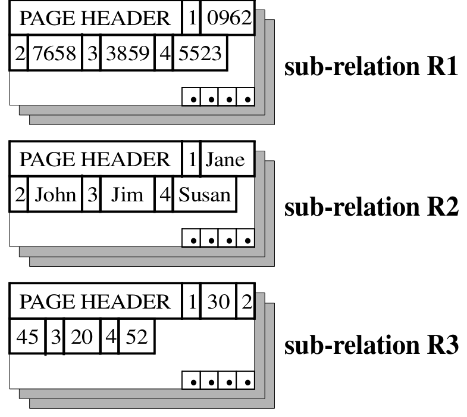

与 NSM 不同，DSM 在顺序访问单个属性值时具有很高的空间局部性。单属性扫描时，DSM 的 I/O 和缓存性能都很好。对于只使用关系中少量属性的 DSS 负载，DSM 表现良好；Sybase-IQ 就把垂直分区与 bitmap index 结合用于数据仓库应用。如果记录重构成本较低，DSM 也可改善主存数据库系统的缓存性能。

DSM 的问题在于：当查询涉及每个参与关系的多个属性时，性能会显著下降。系统必须基于 surrogate 连接参与的子关系来重构被分解的记录，连接耗时会随结果关系涉及的属性数增加而增加。另一类方法基于属性亲和图分区关系，但其性能高度依赖查询属性是否落在同一片段中，因此能力受限。

## 3. PAX

PAX 是一种新的页内记录放置策略。它的目标是：

- 最大化页内每列的跨记录空间局部性（inter-record spatial locality），从而减少无用主存请求且不增加空间开销。
- 保持很低的记录重构成本。
- 与其他设计决策正交，因为它只影响单个页内的数据布局。

### 3.1 概览

PAX 的动机是：像 NSM 一样把每条记录的属性值放在同一页上，但在页内使用缓存友好的放置算法。PAX 在每个页内对记录做垂直分区，把每个属性的值存放在对应的 minipage 中。使用 PAX 时，每条记录会落在与 NSM 相同的页上，但所有 SSN 值、name 值和 age 值分别聚集到各自 minipage。PAX 因此提升跨记录空间局部性，同时只轻微影响记录内部空间局部性。虽然 PAX 做页内垂直分区，但重构结果元组不需要跨页连接。

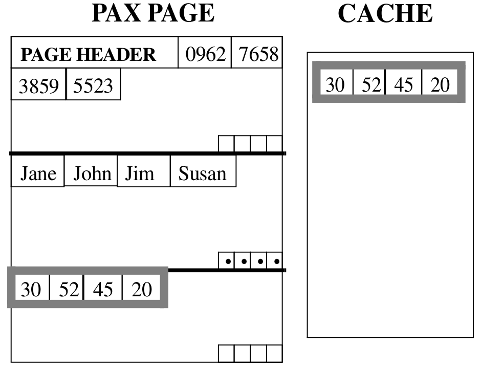

### 3.2 设计

对于 degree 为 n 的关系，PAX 把每个页划分为 n 个 minipage。第一个属性的值存入第一个 minipage，第二个属性的值存入第二个 minipage，依此类推。页首的 page header 包含每个 minipage 起始位置的指针。记录头信息分布到 minipage 中。

minipage 的结构如下：

- 定长属性值存储在 F-minipage 中。每个 F-minipage 末尾有 presence bit vector，每条记录一个 entry，用于表示可空属性的 null 值。
- 变长属性值存储在 V-minipage 中。V-minipage 是带槽的，包含指向每个值末尾的指针。null 值由 null pointer 表示。

每个新分配页包含 page header 和与关系 degree 相同数量的 minipage。page header 记录属性数量、定长属性大小、各 minipage 起始偏移、当前页内记录数和页内总可用空间。记录可按顺序或随机访问。顺序访问某些属性时，算法访问相应 minipage 中的值；索引扫描可在给定 record id 时读取某属性值。

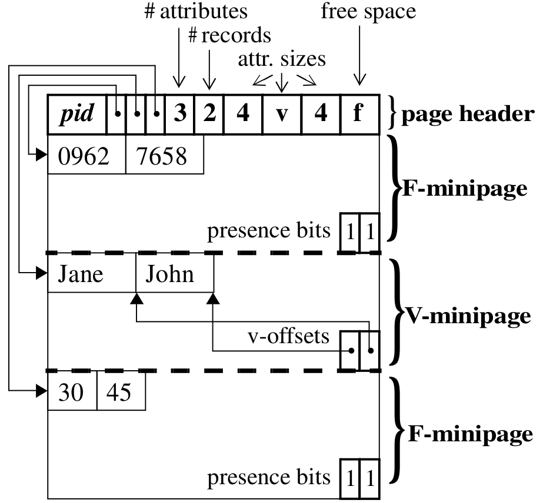

PAX 与 NSM 需要相同数量的空间。NSM 连续存放每条记录的属性，因此每条记录需要一个 offset，并且每条记录中每个变长属性还需要额外 offset。PAX 为每个变长值存一个 offset，并为 n 个 minipage 各存一个 offset。因此从模型上看，无论使用 NSM 还是 PAX，关系占用页数相同；实现细节可能造成轻微差异。

### 3.3 评价

数据放置方案影响两个性能因素。第一是跨记录空间局部性，它在对记录字段子集执行迭代器时减少数据缓存延迟。DSM 具备跨记录空间局部性，因为属性连续存放；NSM 不具备。第二是记录重构成本，它影响检索同一记录多个字段时的延迟。

NSM 缓存行为不理想；DSM 虽有跨记录空间局部性，但需要昂贵连接来重构记录；PAX 兼具二者关键特性：跨记录空间局部性和低记录重构成本，因为一条记录的所有部分仍在同一页中。另一个优点是，在已有 DBMS 中实现 PAX 只需修改页级数据操作代码。

表 1：NSM、DSM 与 PAX 的特性对比。

| 特性 | NSM | DSM | PAX |
| --- | :---: | :---: | :---: |
| 跨记录空间局部性 |  | √ | √ |
| 低记录重构成本 | √ |  | √ |

## 4. 系统实现

我们在 Shore 存储管理器中实现 NSM、PAX 和 DSM。Shore 提供现代存储管理器的特性，包括 B-tree、R-tree、ARIES 风格恢复、分层锁和 clock-hand buffer manager。通常 Shore 把记录存为连续字节序列。

NSM 通过在 Shore file manager 上增加属性级功能实现。DSM 通过把初始关系分解为 n 个 Shore 文件实现，每个子关系包含逻辑 record id 和属性值两列，并使用 NSM 形式的带槽页存储。PAX 则作为 Shore 中另一种数据页组织方式实现。所有方案都使用记录级锁和 Shore 提供的 ARIES 风格日志/恢复机制，只有恢复系统需要少量改动以处理 PAX 记录。

### 4.1 记录实现

NSM 记录先存定长属性值，随后存偏移数组和包含变长属性值的 mini-heap。Shore 在每条记录前增加 12 字节 tag，包含 serial number、record type、header length、record length 等信息；页尾还使用 4 字节 slot。总计每条记录约 16 字节开销。

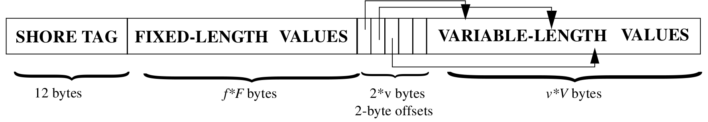

在当前实现中，TPC-H 表使用 PAX 比使用 NSM 少 8% 空间。最多一半节省来自消除页尾 slot table，其余来自避免 Shore 的 12 字节记录 tag。商业 DBMS 通常在每条记录前存记录头，包含 NULL bitmap、记录分配空间、真实记录大小、定长部分大小和其他 flag。对于 TPC-H 的 `Lineitem` 表，记录头约 8 字节；因此 Shore tag 比常见 NSM 头多约 4 字节。

### 4.2 数据操作算法

**批量加载和插入。** PAX 的 bulk-loading 算法根据属性值大小为每个 minipage 分配空间。对于变长属性，初始使用 DBMS 提供的 hint 或前几条记录的平均长度，并根据实际插入值反馈调整平均值。PAX 插入记录时把每个值复制到对应 minipage。如果存在变长值，插入过程中可能需要调整 minipage 边界。若记录整体能放入页中，但单个属性值放不进当前 minipage，算法会基于当前页平均值大小和新记录大小重新计算 minipage 大小，并移动边界重组页结构。页满后，新页的初始 minipage 大小使用上一页最终大小，从而快速适应真实平均值。

**更新。** NSM 使用 Shore 底层基础设施在记录内更新属性值。变长属性更新可能使记录伸缩，进而需要页重组和 slot table 更新；若记录增长超过页内空闲空间，则移动到其他页。PAX 通过计算属性值偏移更新该值。若变长 minipage 没有足够空间，同样需要移动边界或把记录移到其他页。

**删除。** NSM 使用 slot array 标记删除记录，后续插入可填充空闲空间。PAX 在页首使用 bitmap 跟踪删除记录，并通过位运算判断记录是否已删。删除时，PAX 重组 minipage 内容以填补空洞，尽量减少会影响缓存利用率的碎片。对于删除密集型负载，可以只标记删除并延后重组，再通过周期性文件重组维持缓存性能；本文实验实现的是更彻底的即时重组方案。

### 4.3 查询算子

**扫描算子。** 我们在 Shore 上实现支持 sargable predicates 的 scan operator。NSM 查询调用一个扫描算子，逐条读取记录并提取谓词相关属性。PAX 为查询涉及的每个属性调用一个扫描算子，每个算子顺序读取对应 minipage 中的值。对满足条件记录的投影属性通过计算偏移从对应 minipage 取出。DSM 则为谓词涉及的每个属性调用一个子关系扫描算子，生成满足条件的 record id 列表，再通过 record id 上的 B-tree 索引从对应子关系取回投影属性。

**连接算子。** 我们实现了 adaptive dynamic hash join。算法按连接属性把左表分区为主存哈希表；主存耗尽时，除一个 bucket 外其余 bucket 写到磁盘。随后以类似方式分区右表，并用右表连接属性动态探测左表在主存中的部分。算法只使用查询需要的属性构建包含子记录的哈希表。

## 5. 数据放置影响分析

为了评估 PAX 对缓存性能的影响，我们首先在由定长数值属性组成的主存驻留关系上运行简单范围选择查询。受控负载有助于理解事实并做敏感性分析。

### 5.1 实验设置与方法

实验平台是 Dell 6400 PII Xeon/MT，运行 Windows NT 4.0，处理器为 400MHz Pentium II Xeon，512MB 主存，100MHz 系统总线。处理器包含分离的 16KB L1 数据/指令缓存，以及统一的 512KB L2 缓存。两级缓存都是 non-blocking，缓存块大小 32 字节。我们使用硬件计数器和既有方法获得实验结果。

负载使用一个关系和如下范围选择查询的变体：

```sql
select avg(a_p)
from R
where a_q > Lo and a_q < Hi;
```

该查询足以考察在顺序或按 record id 随机访问记录时，各数据布局的净效应。

### 5.2 实验结果

当查询涉及的属性数从 1 增加到 7 时，NSM 和 PAX 对变化相对不敏感，而 DSM 对查询属性数非常敏感。查询只涉及一两个属性时，DSM 因记录重构成本低而表现不错；属性数增加后，DSM 必须连接更多子关系，性能迅速恶化。NSM 和 PAX 因记录所有属性在同一页，避免了昂贵重构连接，性能保持稳定。

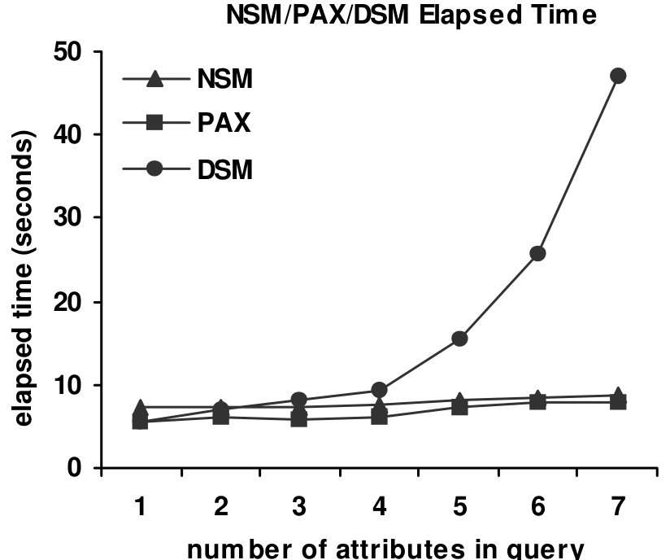

#### 5.2.1 NSM 与 PAX 的缓存行为影响

PAX 的缓存行为显著优于 NSM。对属性 `a_q` 应用谓词时，NSM 几乎每条记录产生一次缓存未命中。PAX 把属性值聚集在页内，因此每 n 条记录才产生一次 miss，其中 n 等于缓存块大小除以属性大小。在实验中，32 字节缓存块和 8 字节属性意味着 PAX 每 4 条记录 miss 一次，因此 PAX 节省约 75% 的 L2 数据未命中。

PAX 减少数据访问相关缓存延迟，从而更快执行查询。L1 数据缓存 miss 的惩罚较小，不显著影响总时间；L2 miss 每次代价约 70-80 cycles。PAX 将总体 L2 数据 miss 惩罚降低约 70%，因此总体处理器停顿时间下降约 75%。使用 NSM 时，内存相关惩罚占执行时间 22%；使用 PAX 时降为 10%。

PAX 还降低 L2 指令 miss，因为统一 L2 同时保存数据和指令。NSM 会把未引用数据装入缓存，可能替换未来需要的指令；PAX 只带入有用数据，减少这种替换概率。PAX 与 NSM 指令 footprint 相近，但 PAX 的计算时间更少，主要是因为内存相关延迟降低后，处理器能更好利用超标量能力。

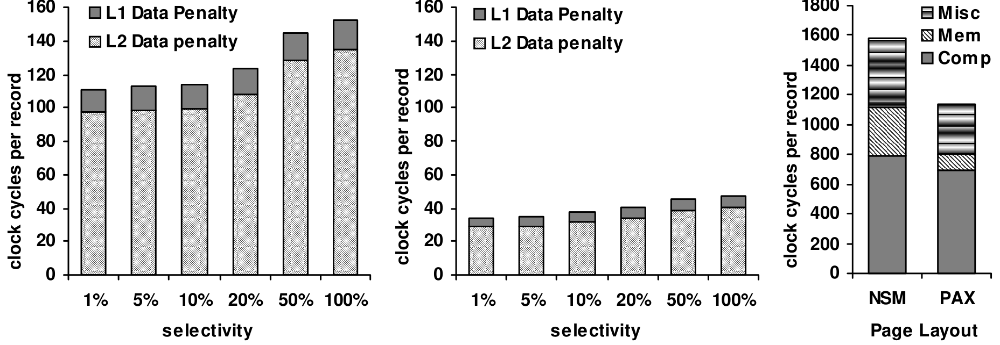

#### 5.2.2 敏感性分析

随着查询涉及的属性数增加，NSM 与 PAX 的执行时间逐渐收敛。即使结果关系包含所有属性，在我们的实验中 PAX 仍更快，因为选择率为 50%，PAX 在谓词和投影属性上都利用了空间局部性，而 NSM 有一半时间会把无用信息带入缓存。改变选择谓词中的属性数也有类似效果。在这些实验中，DSM 比 NSM 和 PAX 慢约 9 倍，因为它必须连接相应数量的子关系。

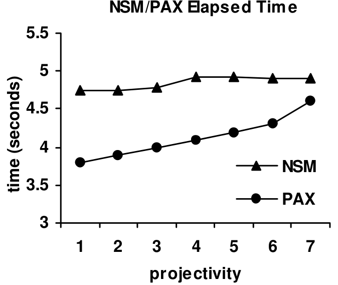

关系中属性数增加时，每页记录数减少。为了保持关系驻留主存，记录大小翻倍意味着基数减半。按基数归一化后，PAX 仍比 NSM miss 更少，但执行时间逐渐受其他因素支配，例如扫描完当前页后 buffer manager 获取下一页的开销。因此随着关系 degree 增加，PAX 与 NSM 每条记录处理时间趋于接近。

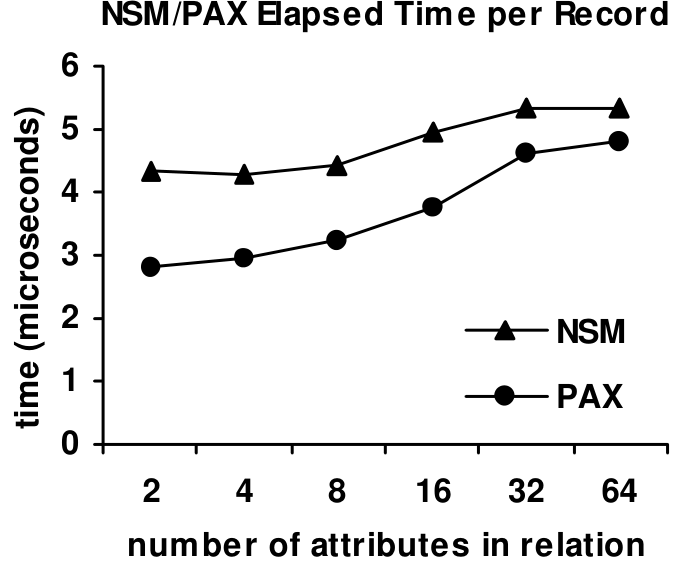

## 6. 使用 DSS 负载评估

本节在 TPC-H 决策支持负载上比较 PAX 与 NSM。决策支持应用通常是内存和计算密集型，关系一般不完全驻留主存，查询包含投影、选择、聚合和连接。结果显示，在该负载的所有 TPC-H 查询上，PAX 都优于 NSM。

### 6.1 设置与方法

实验仍使用第 5 节平台，buffer pool 为 128MB，hash join heap 为 64MB。负载包括 TPC-H 数据库和多种查询。数据库和查询使用 TPC 发布的 dbgen 与 qgen 生成。实验包括：

- **Bulk-loading**：比较三种布局加载 100MB、200MB、500MB TPC-H 数据集的耗时，三种实现均开启完整恢复。
- **Range selections**：在 `Lineitem` 表上执行范围选择，并把投影属性写到输出关系；没有表上索引。
- **TPC-H queries**：在 Shore 上实现 Q1、Q6、Q12、Q14。Q1 和 Q6 是带多个聚合和谓词的范围选择；Q12 和 Q14 是带额外谓词并计算条件聚合的等值连接。
- **Updates**：在 `Lineitem` 属性上执行如下更新，并改变更新字段数、谓词字段数和选择率：

```sql
update R
set a_p = a_p + b
where a_q > Lo and a_q < Hi;
```

### 6.2 批量加载

DSM 加载时间远高于 NSM 和 PAX，因为 DSM 为每个属性创建一个关系，并为每个值存储一条 NSM-like 记录及其 record id。此前实验已经显示，当查询涉及多个属性时，DSM 不会优于其他两种方案，因此后续重点比较 NSM 和 PAX。

NSM 只是追加记录；PAX 在存在变长属性时可能需要额外页重组。PAX 在新页中基于平均属性大小为 V-minipage 分配空间，有时会高估或低估 minipage 大小。若一条记录能放入 NSM 页，却不能直接放入当前 PAX 页，就必须移动 minipage 边界。实验中，PAX 使用上一页平均属性大小作为新页初始 minipage 大小，可以在无需重组的情况下使用约 80% 页空间。强行把每页填满 100% 会导致平均每页 2.5 次重组，相比 NSM 有 2-10% 性能惩罚。若仅在空闲空间超过 5% 或 10% 时才重组，平均重组次数下降，PAX 相对 NSM 的加载惩罚变得很小。

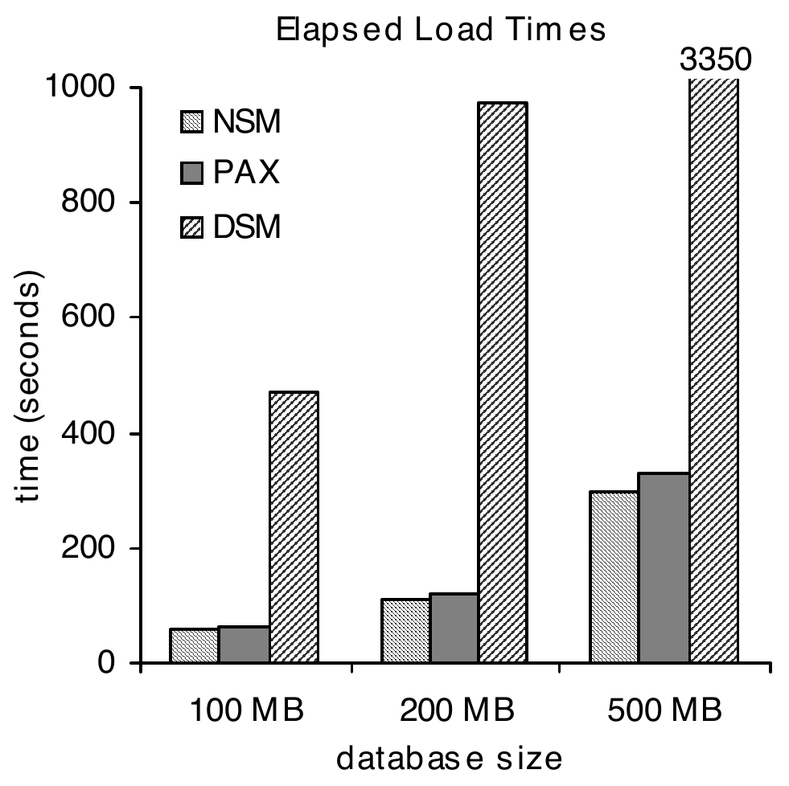

表 2：`reorganization-worthy` 阈值对 PAX 批量加载性能的影响。

| `reorganization-worthy` 阈值 | 平均重组次数/页 | 相对 NSM 的惩罚 |
| --- | ---: | ---: |
| 0%（总是重组） | 2.25 | 10.1% |
| 5%（低于 95% 满时重组） | 1.14 | 4.9% |
| 10%（低于 90% 满时重组） | 0.85 | 0.8% |

### 6.3 查询

第 5 节解释过，随着投影度增加、查询访问记录更大部分，PAX 的性能提升会下降。在 `Lineitem` 上的范围选择中，PAX 相对 NSM 的平均加速在 100MB、200MB、500MB 数据集上分别约为 14%、13%、10%。

原文用如下公式定义 PAX/NSM speedup：

$$
\text{Speedup}=\left(\frac{\text{ExecutionTime(NSM)}}{\text{ExecutionTime(PAX)}} - 1\right) \times 100\char"0025{}
$$

在四个 TPC-H 查询上，PAX 均优于 NSM。Q1 和 Q6 本质上是访问 `Lineitem` 约三分之一记录字段并计算聚合的范围查询。与普通范围选择相比，它们会多次访问投影数据计算聚合值，因此更能利用空间局部性，PAX 加速在小数据库上可达约 42%，在 500MB 数据库上约 15%。

Q12 和 Q14 更复杂，涉及两表连接和范围谓词。虽然 NSM 与 PAX 的 hash join 实现都只复制记录中有用部分，PAX 仍更快，因为有用属性值天然隔离，并且 PAX bucket 以 PAX 格式落盘，在连接第二阶段访问时继续保持局部性。PAX 执行 Q12 比 NSM 少 37-48% 时间；Q14 访问属性更少、计算更少，因此 PAX 优势为 6-32%。

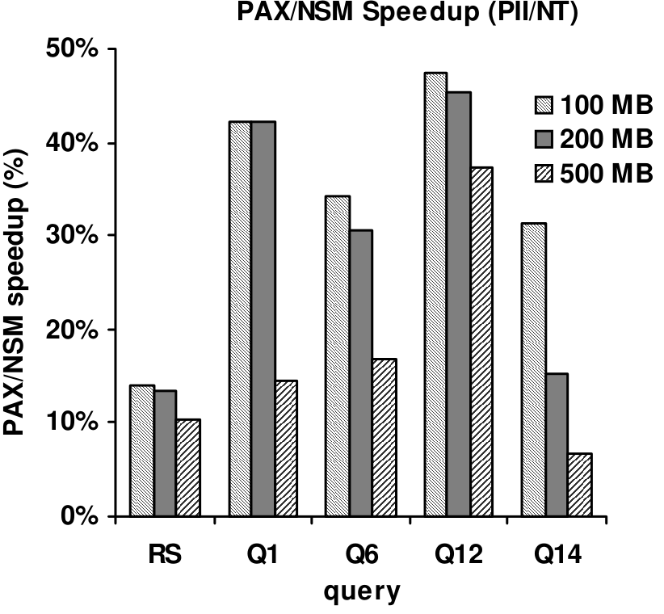

### 6.4 更新

NSM 和 PAX 的更新算法思想相同：尽量原地更新属性值，并在必要时重组。差异主要在变长属性更新。替换为更长变长值时，PAX 平均只需移动 V-minipage 一半数据；NSM 平均要移动页内一半数据，因为它移动的是包含无关属性的完整记录。较少情况下，两种方案都需要页重组。

执行更新时，PAX 始终比 NSM 快，提供 10-16% 加速。加速取决于访问记录的比例和选择率。

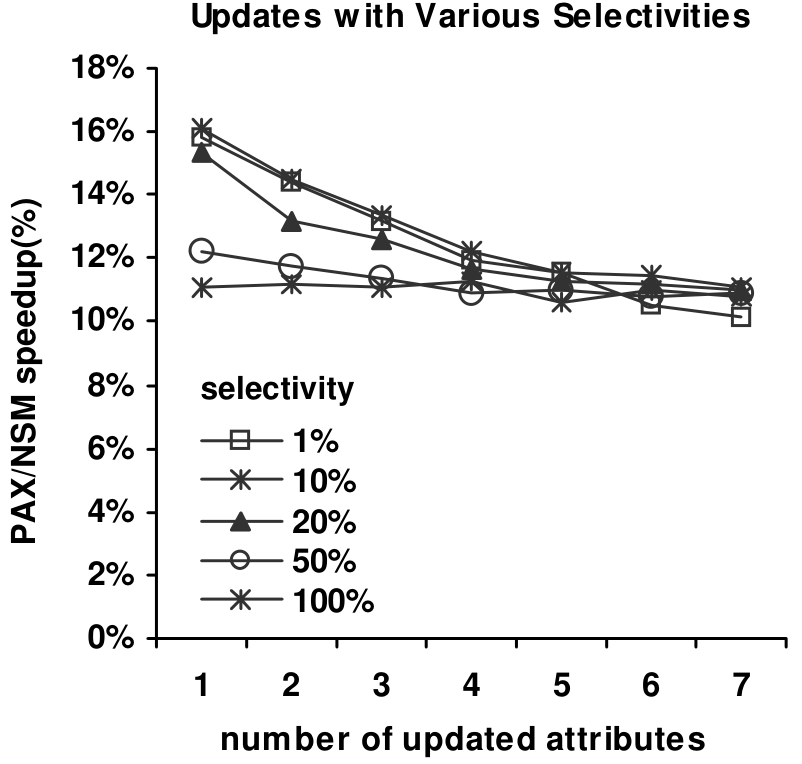

更新属性数增加时，PAX/NSM 加速下降。低选择率下 PAX 提供 10-16% 加速，执行主要由读请求支配。选择率升高后，更新属性更可能已在缓存中，但每次数据请求也更可能替换 dirty cache blocks，因此 20%-100% 选择率区间内，加速主要受写回请求支配，对更新属性数变化不敏感。

## 7. 总结

缓存层次中的数据访问是现代数据库负载的重要性能瓶颈。商业 DBMS 使用 NSM 而不是 DSM 作为通用数据放置方法，是因为 DSM 常引入高记录重构成本。本文显示 NSM 会负面影响数据缓存性能，并提出 PAX，一种关系 DBMS 的新数据页布局。

PAX 在 minipage 中聚集同一属性值，在无额外存储开销的情况下，把跨记录空间局部性和高数据缓存性能与很低的记录重构成本结合起来。与 NSM 相比，PAX 数据缓存停顿时间少 75%，主存表范围选择和更新少 17-25% elapsed time，涉及数据计算和 I/O 的 TPC-H 查询相对 NSM 加速 11-48%。与 DSM 相比，PAX 缓存性能更好，查询更快且稳定，因为它不需要通过连接来重构记录。

PAX 相对 NSM 或 DSM 都没有存储惩罚。它只在每个页内重组记录，因此可与其他存储方案正交使用，并对 DBMS 其他部分透明。最后，由于每个 minipage 内类型一致、页内值域更小，页级压缩算法也可能在 PAX 上取得更好效果。

## 致谢

原文感谢 Ashraf Aboulnaga、Ras Bodik、Christos Faloutsos、Babak Falsafi、Jim Gray、James Hamilton、Paul Larson、Bruce Lindsay 和 Michael Parkes 对早期草稿提出的评论。Mark Hill 的工作部分受到 National Science Foundation EIA-9971256 资助，以及 Intel Corporation 和 Sun Microsystems 捐赠支持。

## 参考文献

1. A. Ailamaki, D. J. DeWitt, M. D. Hill, and D. A. Wood. DBMSs on a modern processor: Where does time go? In Proceedings of the 25th International Conference on Very Large Data Bases (VLDB), pp. 54-65, Edinburgh, UK, September 1999.
2. A. Ailamaki and D. Slutz. Processor Performance of Selection Queries. Microsoft Research Technical Report MSR-TR-99-94, August 1999.
3. A. Ailamaki, D. J. DeWitt, and M. D. Hill. Walking Four Machines By The Shore. In Proceedings of the Fourth Workshop on Computer Architecture Evaluation using Commercial Workloads, January 2001.
4. P. Boncz, S. Manegold, and M. Kersten. Database Architecture Optimized for the New Bottleneck: Memory Access. In Proceedings of the 25th International Conference on Very Large Data Bases (VLDB), pp. 266-277, Edinburgh, UK, September 1999.
5. T. Brinkhoff, H.-P. Kriegel, R. Schneider, and B. Seeger. Multi-Step Processing of Spatial Joins. In Proceedings of the ACM SIGMOD International Conference on Management of Data, pp. 197-208, Minneapolis, MN, May 1994.
6. B. Calder, C. Krintz, S. John, and T. Austin. Cache-Conscious Data-Placement. In Proceedings of the 8th Conference on Architectural Support for Programming Languages and Operating Systems (ASPLOS VIII), pp. 139-149, October 1998.
7. M. Carey, D. J. DeWitt, M. Franklin, N. Hall, M. McAuliffe, J. Naughton, D. Schuh, M. Solomon, C. Tan, O. Tsatalos, S. White, and M. Zwilling. Shoring Up Persistent Applications. In Proceedings of the ACM SIGMOD Conference on Management of Data, Minneapolis, MN, May 1994.
8. T. M. Chilimbi, J. R. Larus, and M. D. Hill. Making Pointer-Based Data Structures Cache Conscious. IEEE Computer, December 2000.
9. Compaq Corporation. 21164 Alpha Microprocessor Reference Manual. Online Compaq reference library, Doc. No. EC-QP99C-TE, December 1998.
10. G. P. Copeland and S. F. Khoshafian. A Decomposition Storage Model. In Proceedings of the ACM SIGMOD International Conference on Management of Data, pp. 268-279, May 1985.
11. D. W. Cornell and P. S. Yu. An Effective Approach to Vertical Partitioning for Physical Design of Relational Databases. IEEE Transactions on Software Engineering, 16(2), February 1990.
12. D. J. DeWitt, N. Kabra, J. Luo, J. Patel, and J. Yu. Client-Server Paradise. In Proceedings of the 20th VLDB International Conference, Santiago, Chile, September 1994.
13. J. Goldstein, R. Ramakrishnan, and U. Shaft. Compressing Relations and Indexes. In Proceedings of IEEE International Conference on Data Engineering, 1998.
14. G. Graefe. Iterators, Schedulers, and Distributed-memory Parallelism. Software: Practice and Experience, 26(4), pp. 427-452, April 1996.
15. Jim Gray. The Benchmark Handbook for Transaction-Processing Systems. Morgan Kaufmann Publishers, 2nd edition, 1993.
16. A. Guttman. R-Trees: A Dynamic Index Structure for Spatial Searching. In Proceedings of the ACM SIGMOD International Conference on Management of Data, 1984.
17. J. L. Hennessy and D. A. Patterson. Computer Architecture: A Quantitative Approach. Morgan Kaufmann Publishers, 2nd edition, 1996.
18. Intel Corporation. Pentium II Processor Developer's Manual. Intel Corporation, Order number 243502-001, October 1997.
19. K. Keeton, D. A. Patterson, Y. Q. He, R. C. Raphael, and W. E. Baker. Performance Characterization of a Quad Pentium Pro SMP Using OLTP Workloads. In Proceedings of the 25th International Symposium on Computer Architecture, Barcelona, Spain, June 1998.
20. Bruce Lindsay. Personal Communication, February / July 2000.
21. J. L. Lo, L. A. Barroso, S. J. Eggers, K. Gharachorloo, H. M. Levy, and S. S. Parekh. An Analysis of Database Workload Performance on Simultaneous Multithreaded Processors. In Proceedings of the 25th International Symposium on Computer Architecture, June 1998.
22. C. Mohan, D. Haderle, B. Lindsay, H. Pirahesh, and P. Schwarz. ARIES: A Transaction Recovery Method Supporting Fine-Granularity Locking and Partial Rollbacks Using Write-Ahead Logging. ACM Transactions on Database Systems, 17(1), pp. 94-162, March 1992.
23. M. Nakayama, M. Kitsuregawa, and M. Takagi. Hash-Partitioned Join Method Using Dynamic Destaging Strategy. In Proceedings of the 14th VLDB International Conference, September 1988.
24. S. Navathe, S. Ceri, G. Wiederhold, and J. Dou. Vertical Partitioning Algorithms for Database Design. ACM Transactions on Database Systems, 9(4), pp. 680-710, December 1984.
25. P. O'Neil and D. Quass. Improved Query Performance With Variant Indexes. In Proceedings of the ACM SIGMOD International Conference on Management of Data, Tucson, Arizona, May 1997.
26. J. M. Patel and D. J. DeWitt. Partition Based Spatial-Merge Join. In Proceedings of the ACM SIGMOD International Conference on Management of Data, pp. 259-270, Montreal, Canada, June 1996.
27. R. Ramakrishnan and J. Gehrke. Database Management Systems. WCB/McGraw-Hill, 2nd edition, 2000.
28. P. G. Selinger, M. M. Astrahan, D. D. Chamberlain, R. A. Lorie, and T. G. Price. Access Path Selection in a Relational Database Management System. In Proceedings of the ACM SIGMOD Conference on Management of Data, 1979.
29. A. Shatdal, C. Kant, and J. Naughton. Cache Conscious Algorithms for Relational Query Processing. In Proceedings of the 20th International Conference on Very Large Data Bases (VLDB), pp. 510-512, September 1994.
30. R. Soukup and K. Delaney. Inside SQL Server 7.0. Microsoft Press, 1999.
31. Sun Microelectronics. UltraSparc Reference Manual. Online Sun reference library, July 1997.
32. Oracle 8i documentation index. http://technet.oracle.com/docs/products/oracle8i/doc_index.htm
33. Sybase IQ archived product page. http://www.sybase.com/products/archivedproducts/sybaseiq
34. A. Ailamaki, D. J. DeWitt, M. D. Hill, and M. Skounakis. PAX full paper. http://www.cs.wisc.edu/~natassa/papers/PAX_full.pdf
