# Bridging the Archipelago between Row-Stores and Column-Stores for Hybrid Workloads（中文译文）

## 译者说明

本文依据同目录的 `source.pdf` 翻译。章节、图表、公式、算法、代码与参考文献按原文结构保留。

## 摘要

数据密集型应用希望把历史数据与刚收集的数据结合起来分析，从而实时获得关键洞察。要支持这种混合负载（hybrid workload），数据库管理系统（DBMS）必须在同一个数据库上同时处理快速的 ACID 事务和复杂的分析查询。然而，当前的常见做法是分别使用只为某一类负载优化的专用系统，这迫使组织维护多份数据库副本，并额外承担存储与管理成本。

为打破这一障碍，本文提出一种能够在同一数据库上高效支持多样负载的混合 DBMS 架构。它与以往方法的根本区别在于：系统只使用一个对数据存储布局无感的执行引擎，却不会因此牺牲专用行存或列存系统的性能收益。这样便不必在多个互相独立的系统中维护数据库副本。本文还提出一种持续演化数据库物理布局的技术：它分析查询访问模式，并为同一张表中的不同数据段选择最合适的布局。

我们在一个主存 DBMS 中实现了该架构。实验结果表明，面对不同负载时，该方法的吞吐量比静态存储布局最高高出 3 倍。连续自适应机制还能在不需人工调参的情况下，为任意负载找到接近最优的布局。

## 1. 引言

组织必须快速把刚获取的数据转化为关键洞察。这类俗称混合事务/分析处理（hybrid transaction-analytical processing，HTAP）的负载，通过同时分析历史数据集与实时数据来推导洞察和知识 [40, 48]。数据刚产生时最有价值，价值随时间衰减。对高频交易、互联网广告等领域而言，分析必须包含最新数据，结果才能产生最大价值。

许多组织用两套彼此分离的 DBMS 实现 HTAP 流水线：一套执行事务，另一套执行分析查询。新事务信息先进入联机事务处理（OLTP）DBMS，后台再用抽取-转换-加载（ETL）工具把数据迁往用于联机分析处理（OLAP）的数据仓库。

这种二分环境有几个固有问题。首要问题是，变更在两个系统间传播往往需要几分钟乃至几小时，这使应用无法在数据刚进入数据库时立即行动。其次，部署和维护两种 DBMS 的管理开销并不小；有估算认为，人员成本几乎占大型数据库系统总拥有成本的 50% [45]。此外，应用开发者若要组合不同数据库中的数据，还必须面向多个系统编写查询。

更好的办法是使用单一 HTAP DBMS：它既满足现代 OLTP 负载的高吞吐、低延迟要求，又允许复杂且长时间运行的 OLAP 查询同时操作热（事务）数据和冷（历史）数据。这些新式 HTAP 系统与旧式通用 DBMS 的区别，是它们吸收了过去十年专用 OLTP 与 OLAP 系统的许多进展。

然而，HTAP DBMS 的关键难题是：在事务不断更新数据库的同时，执行要一并访问旧数据与新数据的 OLAP 负载。现有 HTAP DBMS 通常为不同布局使用彼此分离的查询处理和存储引擎：行导向数据交给更适合事务的 OLTP 执行引擎，列导向数据交给更适合分析查询的 OLAP 执行引擎，然后再用两阶段提交等同步方法组合系统两部分的结果 [5, 29, 47]。

把多套系统以这种方式拼接在一起，不仅提高 DBMS 复杂度，还会因为需要在不同运行时之间维持数据库状态而降低性能。这反过来限制了数据刚进入数据库时可以提出的问题，而后者恰恰是 HTAP DBMS 的主要卖点。

为解决这一问题，本文用统一架构跨越 OLTP 与 OLAP 之间的架构鸿沟。表中数据按 DBMS 对元组未来访问方式的预期，使用混合布局存储：表中“热”元组使用为 OLTP 操作优化的格式，同表其他“冷”元组则使用更适合 OLAP 查询的格式。

在物理数据之上，我们提出一层逻辑抽象，使 DBMS 无需多套引擎，就能用很小的额外开销执行跨越不同布局的查询计划。另一项贡献是新的在线重组技术：它随查询负载演化而持续改善每张表的物理设计，使 DBMS 能在保持事务安全的前提下，针对任意应用迁移到近似最优布局，而不需要管理员手工配置。

我们在 Peloton HTAP DBMS [1] 中实现了这套存储与执行架构。与其他最新存储模型的比较表明，该方法能在不同混合负载中带来最高 3 倍的吞吐提升。重组方法可以以很小开销、无需手工调优地连续修改表布局。

本文后续结构如下：第 2 节讨论存储模型对性能的影响以及灵活存储模型对 HTAP 的好处；第 3 节描述基于该模型的系统架构；第 4 节给出支持混合负载的并发控制机制；第 5 节介绍在线布局重组；第 6 节给出实验评估；第 7 节讨论相关工作。

## 2. 动机

本节讨论表存储布局对不同负载下 DBMS 性能的影响，并说明为什么“灵活”存储模型最适合 HTAP。

### 2.1 存储模型

DBMS 从根本上有两种存储数据的方式：

- N-ary Storage Model（NSM）：以元组为中心。
- Decomposition Storage Model（DSM）：以属性为中心。

这两种模型规定 DBMS 是以元组为中心，还是以属性为中心组织数据。选择哪种存储模型，与数据库的主要存储位置是磁盘还是主存无关。

以 1970 年代早期 DBMS（如 IBM System R 和 INGRES）架构为基础的系统，通常采用 N 元存储模型。NSM 把单个元组的全部属性连续存放。在图 1(a) 中，第一个元组（ID 101）的所有属性相互紧邻，随后才是第二个元组（ID 102）的所有属性。

NSM 适合 OLTP 负载，因为事务中的查询往往一次只操作数据库中的一个实体（例如一条客户记录），并需要访问该实体大部分甚至全部属性。NSM 也适合插入密集型负载，因为 DBMS 可以通过一次写入把整个元组加入表中。

NSM 却不适合 OLAP 负载中的分析查询。这类查询通常同时访问表中多个实体，而对每个实体只读取少数属性。例如，某查询可能只分析某个地理区域中全部客户的位置属性。NSM DBMS 只能按元组读表，其查询算子也以元组为单位处理数据 [21]。先前研究已表明，由于解释开销高，这种执行策略的 CPU 效率较低 [15]。在 OLAP 查询中，NSM DBMS 不必要地访问并处理了连最终结果都不需要的属性，白白浪费 I/O 和内存带宽。

另一种方式是分解存储模型（DSM），它按属性存储数据 [7, 17]：表中同一属性的所有元组值被连续放置。Vertica [49]、MonetDB [15] 等现代 OLAP DBMS 都使用这种模型。图 1(b) 的表布局先为第一个属性 ID 的全部值分配空间，随后才存放第二个属性 IMAGE-ID 的值。

DSM 适合 OLAP，因为 DBMS 只需取回查询实际需要的属性值。系统还可以按属性处理数据，通过降低解释开销并跳过不必要的属性，提高 CPU 效率 [6, 7]。

但就像 NSM 不擅长只读 OLAP 一样，DSM 也不适合写密集 OLTP。此类负载中的查询会不断往表中插入、更新元组。这在 DSM 中代价很高，因为存储管理器必须把元组属性分别复制到多个存储位置。因而，对一个既要执行复杂分析查询，又要处理修改数据库状态事务的 HTAP DBMS 来说，NSM 和 DSM 架构各有明显短板。我们主张使用一种灵活存储模型，在各自擅长的负载上继承 NSM 和 DSM 的优点，又避免它们面对另一类负载时的问题。

### 2.2 Flexible Storage Model 的理由

我们把对 NSM 和 DSM 做一般化的模型称为灵活存储模型（flexible storage model，FSM）。FSM 支持多种混合布局，把查询中经常一起访问的属性放在一起。具体架构将在第 3 节说明。图 1(c) 中，前三个属性 ID、IMAGE-ID 和 NAME 的所有值连续存放，随后才是 PRICE 和 DATA 两个属性的值。

FSM DBMS 可以利用现代数据库应用中 HTAP 负载的一个基本性质：元组刚加入数据库时，更容易被 OLTP 事务更新；随时间推移，它们逐渐“变冷”，再次被更新的概率下降。例如，Facebook 用户访问并互动的内容中，超过一半是好友在过去两天内分享的，内容热度在此后几天会快速衰减 [13]。

对这类负载，热数据在可能被修改的时期适合使用以元组为中心的 NSM 布局。某个数据项超过阈值并变成冷数据后，DBMS 可把它重组为更适合分析查询的、以属性为中心的 DSM 布局 [47]。FSM DBMS 可让同一张表的不同部分同时使用不同的混合布局，由此高效支持 HTAP。

为了更具体地展示这些问题，我们做了一个动机实验。数据库只有表 `R(a0, a1, ..., a500)`，包含 1000 万个元组。每个属性 `a_k` 都是区间 `[-100, 100]` 中的随机整数。应用包含两种查询。事务查询 Q1 向表 R 插入一个元组：

```sql
INSERT INTO r VALUES (a0, a1, ..., a500);
```

分析查询 Q2 从表 R 中满足 `a0 < delta` 的所有元组投影出属性 `a1, a2, ..., ak`：

```sql
SELECT a1, a2, ..., ak
FROM r
WHERE a0 < delta;
```

不同的 `k` 和 `delta` 值分别改变查询的投影度（projectivity）和选择率（selectivity）。实验考察两类负载：第一类是混合负载，包含 1000 条扫描查询 Q2，随后是 1 亿条插入查询 Q1；第二类是只读负载，只包含 1000 条 Q2。扫描查询的执行时间高于插入查询；详细实验设置留到第 6 节。

我们测量一个主存 DBMS 在 NSM、DSM 和 FSM 存储布局上完成这两类负载的总时间。FSM 把 Q2 访问的属性共置为 `{{a0}, {a1, ..., ak}, {ak+1, ..., a500}}`。实验把 Q2 投影度从 1% 逐步提高到 100%，对每个投影度又把选择率从 10% 改到 100%。

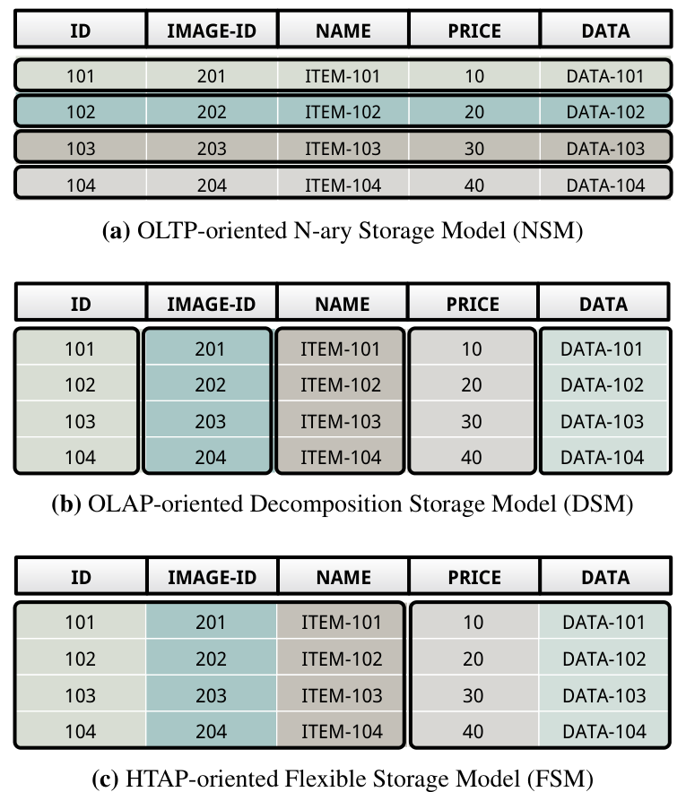

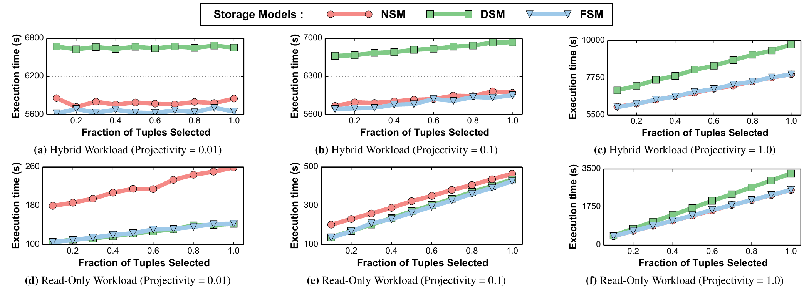

图 2(a)-2(c) 给出混合负载结果。在所有设置下，NSM 和 FSM 都比 DSM 最多快 1.3 倍。原因是 DSM 每次插入都必须拆分元组属性，并将它们写入不同内存位置。FSM 采用类似 NSM 的较宽垂直分区，所以插入比 DSM 快；扫描时，它把谓词属性 `a0` 和投影属性 `a1, ..., ak` 与表中其他属性分开，在谓词计算及随后投影时只取回必需属性，因而又比 NSM 快。

图 2(d)-2(f) 给出只读负载结果。在低投影度分析查询上，DSM 和 FSM 比 NSM 最多快 1.8 倍，因为它们对内存带宽的利用更好。这一实验显示了存储模型对 HTAP 的显著影响：纯 NSM 或纯 DSM 都不是好方案。更合理的做法是让 FSM DBMS 处理多种混合布局，包括经典的按元组布局和按属性布局。

## 3. 基于 Tile 的架构

本节给出 FSM 的一种具体实现，其存储抽象是 tile。一个 tile 可视为表的一个垂直/水平数据段。我们先介绍基于 physical tile 的物理存储架构，再说明如何用 logical tile 向 DBMS 查询处理组件隐藏 physical tile 的布局。相应的并发控制协议见第 4 节，动态布局重组见第 5 节。

### 3.1 Physical Tile

DBMS 最基本的物理存储单位是 tile tuple。非形式地说，tile tuple 是某个元组的部分属性值。一组 tile tuple 形成 physical tile，多个 physical tile 构成 tile group。存储管理器把一张表物理存为一组 tile group。属于同一 tile group 的所有 physical tile 都含有相同数量的 tile tuple。

图 3 中的表包含三个 tile group（A、B、C），每个 group 中 physical tile 的个数可以不同。Tile group A 含有 A-1 与 A-2 两个 tile：A-1 存表的前三个属性 ID、IMAGE-ID、NAME，A-2 存剩余两个属性 PRICE、DATA。两个 tile 共同表示同一批元组。

同一个元组在 FSM 数据库中可以随时间使用不同布局。默认做法是以元组导向布局存储所有新元组；当它们逐渐变冷后，DBMS 再把数据重组为具有更窄垂直分区、更友好于 OLAP 的布局。系统把元组复制到具有新布局的 tile group，然后用新构造的 group 替换表中原 group。第 5 节将说明，该过程在后台执行，并且维持事务安全，不引入假阴性或假阳性结果。

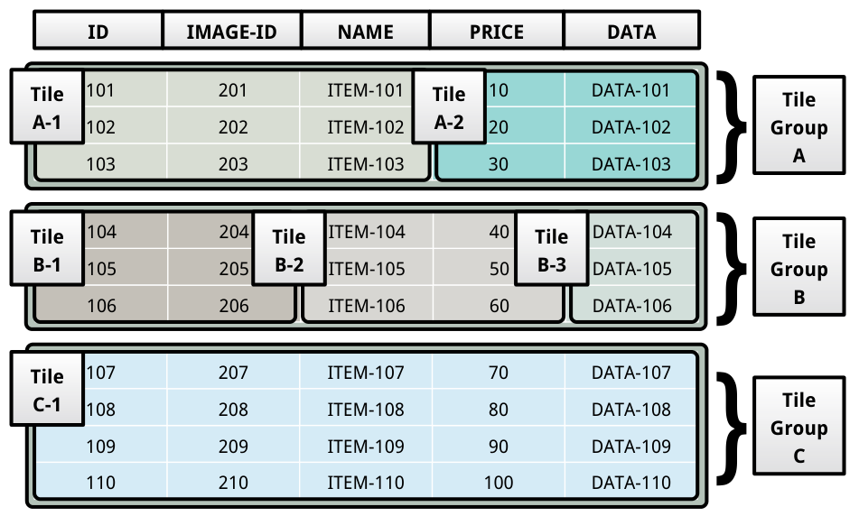

NSM 和 DSM 都是基于 tile 的 FSM 布局特例。如果每个 tile group 只有一个包含表全部属性的 tile，该布局就等价于 NSM 的元组导向布局。如果每个 tile 恰好只包含一个属性，就等价于 DSM 的属性导向布局。

除了灵活的垂直分区，tile 架构还支持表的水平分区。DBMS 可配置每个 tile group 的元组数，使 tile 适配 CPU 缓存。因而，对 schema 不同的两张表，DBMS 可选择每个 tile group 存放不同数量的元组。

### 3.2 Logical Tile

physical tile 架构让 DBMS 能够用任意适合 HTAP 负载的布局组织数据，但在不同布局上高效执行查询并不容易，因为 DBMS 的查询处理组件不再是针对一种固定布局设计的。

一个解决办法是查询读取数据时，不管 tile group 的布局如何，都先把每个元组转换为标准格式。但这会为每次查询带来额外处理开销，使 DBMS 失去面向 OLTP 或 OLAP 的优化布局所带来的好处。

另一种办法是为不同混合布局使用不同执行引擎。但这不仅要昂贵地合并多个引擎中算子产生的结果 [47]，还需要一种独立于 DBMS 内部并发控制协议的额外同步方法来保证 ACID。更不用说，在 DBMS 源码中长期维护多套面向不同布局的专用执行路径，本身就非常困难 [50]。

为解决这一问题，本文在架构中增加 logical tile 抽象层。一个 logical tile 紧凑地表示分散在一张或多张表、多个 physical tile 中的值。DBMS 用它向执行引擎隐藏表的具体布局，同时不牺牲为工作负载优化的存储布局所提供的性能。

图 4 中，logical tile X 指向 physical tile A-1 和 A-2 中的数据。Logical tile 的每一列都含有一个 offset 列表，这些 offset 对应底层 physical tile 中的元组。Logical tile 中一列可以表示分布在多个 physical tile 中的一个或多个属性。DBMS 在 logical tile 的 metadata 区域保存这一映射，并且每个逻辑列只记录一次。例如，X 的第一列映射到 A-1 的第一、第二属性；物化 X 时，该列被用来构建物化 tile Y 的前两个属性。

X 第一行第一列的值表示 A-1 第一个元组前两个属性的值，物化后是 `{101, 201}`。同样，第一行第二列映射到 A-1 的第三个属性和 A-2 的第一个属性，物化后是 `{ITEM-101, 10}`。

对 logical tile 某列映射到的全部属性，DBMS 在物化时使用同一份元组 offset 列表。Logical tile 中两个拥有不同 offset 列表的列，也可以映射到同一 physical tile 属性；X 的第二、第三列就是如此。为了简化抽象，logical tile 不能再引用另一个 logical tile；每一列必须映射到 physical tile 的属性。

这一简化并不削弱抽象的表达能力。查询执行期间，DBMS 可以动态选择将中间结果 logical tile 物化为 physical tile [6]。此时，算子会构造一个只有一列、直接映射到新 physical tile 属性的透传 logical tile（passthrough logical tile），并将它沿计划树传给父算子。

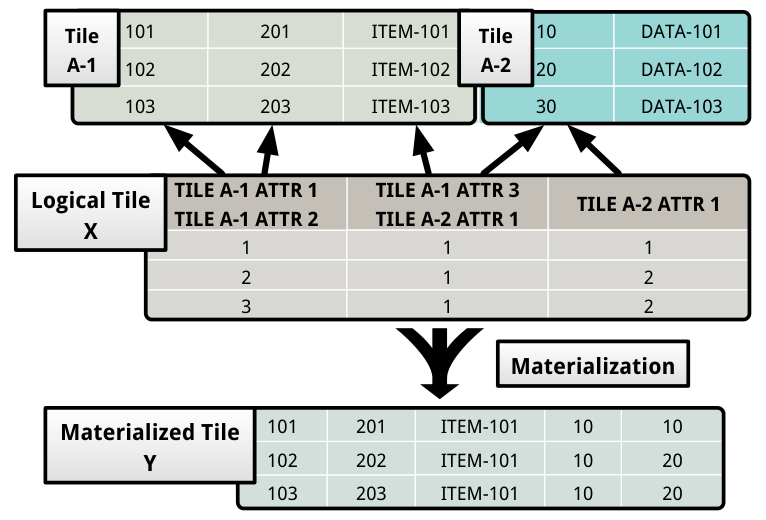

### 3.3 Logical Tile Algebra

我们用如下 SQL 和计划树说明 logical tile algebra 的算子行为：

```sql
SELECT R.c, SUM(S.z)
FROM R JOIN S ON R.b = S.y
WHERE R.a = 1 AND S.x = 2
GROUP BY R.c;
```

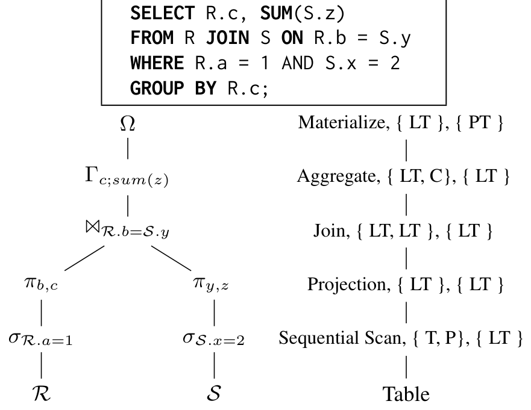

我们定义了一个基于 logical tile 的代数，使 DBMS 实现布局透明。代数算子分为几类：

**查询示例。** 图 5 的查询访问 `R(a,b,c)` 和 `S(x,y,z)`。它先分别按 `a` 和 `x` 从 R、S 中选出元组，再按 `b=y` 连接结果，最后按 `c` 分组，对每组计算 `z` 之和。我们用该查询说明 logical tile algebra 的算子语义；所有算子的形式化代数定义见附录 A。

**Bridge operators。** 大部分 logical tile algebra 算子都产生和消费 logical tile，因而对底层 physical tile 的存储布局无感。只有位于计划树底部和顶部的算子与存储管理器交互。它们连接 logical tile 和 physical tile，因此称为桥接算子。

桥接算子包括 sequential scan 和 index scan 等表访问方法。Sequential scan 对表中每个 tile group 生成一个 logical tile，该 logical tile 只有一列，列中是满足谓词的所有元组 offset。图 5 中与 R 关联的 sequential scan 算子 `sigma` 产生表示 `a=1` 元组的 logical tile。Index scan 通过索引识别谓词匹配元组，然后为它们构造一个或多个 logical tile。

Materialize 算子把 logical tile 转换为 physical tile，也用于早物化。图 5 中，aggregate 算子 `Gamma` 用聚合元组构造 physical tile，再用 passthrough logical tile 包裹它。要将查询结果送给客户端，DBMS 执行 materialize 算子 `Omega`。此时无需构造新 physical tile，只需直接返回 passthrough logical tile 底层的 physical tile。

**Metadata operators。** Logical tile metadata 包含底层 physical tile 信息，以及标识算子处理 logical tile 时应检查哪些行的位图。Metadata 算子只修改 logical tile metadata，不改变它表示的数据。Projection 修改输入 logical tile 的 schema 属性列表，删掉查询计划上层或最终结果不需要的属性。在图 5 中，R 的 sequential scan 之上的 projection `pi` 输出只包含 `b,c` 的 logical tile。Selection 则修改 metadata，把不满足谓词的元组行标记为不属于该 logical tile，而不删除底层 physical tile 中的行。

**Mutators。** 这类算子直接修改表中数据。Insert 接收 logical tile，把其中元组追加到指定表。它先重构 logical tile 表示的元组，再将它们加入表；也可以直接接收客户端元组并追加。Delete 接收 logical tile，删除底层表中对应元组。它用 logical tile 第一列的 offset 定位应删元组，并支持快速清空整张表的 truncate 模式。Update 首先像 delete 那样移除 logical tile 中的旧元组，然后复制旧版本并执行指定修改，构造新版本，最后将新版本追加到表。第 4 节将说明，mutator 还与事务存储管理器协作控制元组可见性。

**Pipeline breakers。** 最后一类算子消费计划树子节点产生的 logical tile。它们必须等到收齐子节点的所有 logical tile 才能产生输出，因而会阻塞上层算子，打断查询执行期间 logical tile 在算子间的流式传递 [37]。

Join 接收一对 logical tile 并计算连接谓词。它先拼接两个输入 logical tile 的 schema，构造输出 logical tile。随后枚举元组对；遇到满足谓词的一对元组时，将它们拼接并追加到输出。图 5 中的 join 算子检查两个 projection 算子产生的每对 logical tile，输出满足 `R.b=S.y` 的所有元组对。

Union、intersection 等集合算子也是 pipeline breaker。它们在遍历子算子产生的 logical tile 时记录已观察的元组，最后通过将应被集合操作跳过的元组标记为不属于相应 logical tile，再输出这些 tile。

Count、sum 等聚合算子会检查子节点的全部 logical tile 来构造聚合元组。与集合算子不同，聚合算子会构造新 physical tile 保存结果。例如图 5 的 `Gamma` 为属性 `c` 的每个不同值构造一个分组，在 physical tile 中保存该组对 `z` 的求和结果，然后构造一组 passthrough logical tile，每次向计划树上层传递一个。

### 3.4 讨论

该架构有几个收益：

- **布局透明。** 所有算子无需为所有可能布局定制逻辑，因为 logical tile algebra 隐藏了布局信息。这避免了跨多个执行引擎结果的昂贵 merge，也降低源码复杂度。
- **向量化处理。** 传统 Volcano/iterator 风格系统一次处理一个元组，解释开销高并阻碍编译器优化。tile-based DBMS 一次处理一个 logical tile，类似列存中的 vectorized processing，可提高 CPU 效率。
- **灵活物化。** early materialization 和 late materialization 都不是所有场景最优。tile-based DBMS 可在查询执行期间动态选择在哪个算子物化，并向上传递 passthrough logical tile。
- **缓存行为。** DBMS 可以优化 tile group 的元组数，使 tile 适配缓存层次。logical tile 的紧凑表示也让复杂中间结果更容易留在缓存中。

对图 5 的查询而言，每次处理一个 logical tile 会减少 cache miss 和函数调用。DBMS 只在聚合算子中物化 logical tile，所以复制的数据更少、追踪的指针也更少。更广义地说，logical tile algebra 在单一 DBMS 架构内弥合了行存和列存之间的理论鸿沟。

## 4. 并发控制

HTAP 负载由短事务与长时间运行的分析查询组成。DBMS 必须保证 OLAP 查询看不到在它开始之后启动的事务所产生的影响，同时读者不应阻塞写者 [41]。正因如此，大多数 HTAP DBMS 采用多版本并发控制（MVCC）[34, 38, 46]。

本文说明了如何将 MVCC 用于 tile 架构。它与之前的一些系统类似，把版本信息直接记录在元组数据旁边 [30, 46]。

### 4.1 协议

新事务开始时，DBMS 从一个单调递增的全局计数器中为它分配唯一事务标识符。事务准备提交时，DBMS 递增上一个已提交事务的 timestamp，得到该事务唯一的 commit timestamp。每个事务维护 metadata context，其中包含：（1）对当前事务应可见的最近已提交事务 timestamp；（2）当前事务在生命周期内插入或删除的元组版本引用集合。引用只包含元组位置，不含实际数据。在 tile 架构中，它由 tile group 标识符和元组在该 group 中的 offset 组成。

每个 tile group 为每个元组维护版本 metadata：

- `TxnId`：当前持有该元组 latch 的事务 ID。
- `BeginCTS`：元组开始可见的提交时间戳。
- `EndCTS`：元组停止可见的提交时间戳。
- `Prev`：指向同一逻辑元组前一版本的位置。

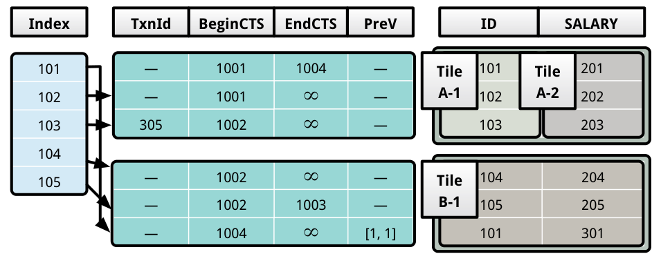

图 6 是版本 metadata 示例。DBMS 把这些信息与 physical tile 分开保存，因此可以对同一 tile group 中的全部 physical tile 统一处理。系统通过 `Prev` 沿版本链访问同一逻辑元组的更早版本。版本链可跨越多个 tile group，所以各版本可能使用不同物理布局存在主存中。

**插入。** 默认隔离级别是快照隔离。Insert 算子首先向 DBMS 申请一个空元组槽位，然后用原子 compare-and-swap 将当前事务 ID 写入该元组的 `TxnId`，从而占有槽位。`BeginCTS` 初始为无穷大，故其他并发事务看不到新元组。事务提交时，DBMS 把 `BeginCTS` 设为当前事务的 commit timestamp，并清空 `TxnId`。图 6 第一个 tile group 的前两个元组是由 commit timestamp 为 1001 的事务插入的。DBMS 将新元组追加到使用默认 NSM 布局的 tile group。

**删除。** Delete 算子先把当前事务 ID 写入目标元组 `TxnId`，获取其 latch，防止另一事务并发删除同一元组。提交时，DBMS 把元组 `EndCTS` 设为当前 commit timestamp，元组从此不再存在。图 6 中 ID 105 的元组被 commit timestamp 为 1003 的事务删除。

**更新。** Update 算子先把元组旧版本标记为不可见，再复制旧版本并应用请求的修改，构造新版本，最后将其追加到表。图 6 中，commit timestamp 为 1004 的事务更新了 ID 101 的 `SALARY`。第二个 tile group 第三个元组的 `Prev` 指向第一个 tile group 中的旧版本。图示时刻，ID 为 305 的事务正持有 ID 103 元组的 latch。

**表访问。** 除 mutator 外，只有 sequential scan 和 index scan 这类表访问算子需要处理元组可见性。它们在谓词计算前检查：当前事务的最后可见 commit timestamp 是否落在元组的 `BeginCTS` 和 `EndCTS` 之间。当前事务自己插入的元组版本也对它可见。这样，logical tile algebra 的其他算子就可以与元组可见性问题解耦。

任意时刻，DBMS 都可以回滚未提交事务：重置它 latch 住的元组之 `TxnId`，并释放未使用的元组槽位。随时间推移，旧版本会对所有当前及未来事务都不可见。DBMS 以异步、增量方式周期性回收这些版本。垃圾回收不仅释放存储空间，还刷新查询规划器维护的统计信息。

### 4.2 索引

tile-based DBMS 可以使用任何保序主存索引，例如 B+tree。索引 key 由元组属性组成，value 是最新元组版本的逻辑位置。系统不存裸指针，因为重组 tile group 布局时必须更新这些指针。若算子通过索引遇到对当前事务不可见的元组版本，就沿 `Prev` 字段遍历版本链，找到对该事务可见的最新版本。这样 DBMS 不必在表和索引中重复维护版本信息。

图 6 中，ID 101 的索引项指向第二个 tile group 中的第三个元组。如果算子遇到的该版本对当前事务不可见，它就沿 `Prev` 走过版本链，找到对事务可见的最新版本。这避免了在表与索引中重复保存版本信息 [30]。

### 4.3 恢复

架构包含 recovery module，负责日志和恢复。它使用适配主存 DBMS 的 ARIES 变体。正常事务执行时，DBMS 在提交前把事务变更写入 write-ahead log。系统周期性把快照存到文件系统，以限制崩溃后的恢复时间。

恢复开始时，DBMS 先加载最新快照，再重放日志，确保快照之后已提交事务的变更出现在数据库中。故障时未提交事务的变更不会传播到数据库。由于日志不记录索引物理变更，DBMS 在恢复期间重建所有表索引，确保索引与数据库一致。

该恢复模块采用面向主存 DBMS 改写的经典 ARIES 协议 [12, 32, 35]。本文未展开 Peloton 恢复模块的更多细节，将其留作未来工作。

## 5. 布局重组

如果系统不能高效且有效地重组数据库布局以适应 HTAP 负载变化，上述 FSM 优化就没有意义。本文方法的核心是在运行时跟踪近期查询负载，并在后台周期性为每个表计算工作负载优化的存储布局，然后把表重组为该布局。

在线重组有两种方式。第一种把查询处理和数据重组结合起来：在处理数据前，DBMS 先把已有数据复制到查询优化布局的新 tile group 中。这对某些查询可能因额外 I/O 而过于昂贵。第二种把重组与查询执行解耦，用单独后台进程以增量方式一次重组一个 tile group。本文采用第二种方式，让重组成本在多个查询之间摊销。

### 5.1 在线查询监控

DBMS 使用一个轻量监控器，跟踪每条查询访问的属性。目标是判定新 tile group 布局中哪些属性应当共置在同一 physical tile。监控器收集查询 `SELECT` 子句和 `WHERE` 子句中的属性 [11, 36]。它区分这两类属性，因为如果只把 `WHERE` 属性共置，而不是把 `SELECT` 与 `WHERE` 属性全部放在一起，则谓词计算时可以取回更少数据。系统为每张表单独把这些信息存为时间序列图。

为降低监控开销，监控器只从随机查询子集收集统计。在此情况下，它必须避免存储布局偏向那些更常被采样的事务。为提高 HTAP 整体吞吐，布局既要优化事务，也要优化数据密集的分析查询。因此，DBMS 也记录优化器计算的查询计划代价 [3]，并用它推导也能惠及分析查询的存储布局。

### 5.2 分区算法

Algorithm 1：Vertical Partitioning Algorithm

```text
Require: recent queries Q, table T, number of representative queries k
function UPDATE-LAYOUT(Q, T, k)
    # Stage I: Clustering algorithm
    for all queries q appearing in Q do
        for all representative queries r_j associated with T do
            if r_j is closest to q then
                r_j <- r_j + w * (q - r_j)
            end if
        end for
    end for

    # Stage II: Greedy algorithm
    Generate layout for T using r
end function
```

我们使用在线聚类算法维护每个表的 top-k representative queries。查询之间的距离定义为：两个查询中恰好被其中一个访问的属性数，除以表属性数。因此，共同访问许多属性的查询更可能进入同一 cluster。算法按 plan cost 加权查询。如果所有查询权重相同，数量更多的 OLTP 查询会很快把布局推向 tuple-centric，而低投影度分析查询无法受益。按计划代价加权后，高 I/O 成本查询对表布局影响更大。

对数据库每张表 T，DBMS 维护近期访问它的查询 Q 的统计。对每个 `q in Q`，系统提取它访问的属性等 metadata。如果能识别哪些查询最重要，它就可以为这些查询优化表的布局。本文用在线 k-means 聚类完成识别，并随新查询到来动态更新布局 [27]。

朴素分区算法需要枚举属性组与所有属性划分，其复杂度为：

$$
O(e^{n \ln n} + mn2^n), \quad \Theta(2^n)
$$

cluster 均值会随时间向近期样本漂移。若 `c_j` 是第 j 个 cluster 的代表查询，`c_0` 是初始均值，老样本权重为 `w`，加入 `s` 个样本后当前均值为：

$$
c_j = (1-w)^s c_0 + w \sum _ {i=1}^{s}(1-w)^{s-i}Q_i
$$

权重 `w` 控制算法遗忘旧查询样本的速度。每轮时间复杂度为 `O(mnk)`，空间复杂度为 `O(n(m+k))`，比朴素分区算法更高效。得到 representative queries 后，系统用贪心算法生成表布局：按 cluster 权重降序遍历 representative queries，把该查询访问的属性组合到同一 tile，直到所有属性都分配到某个 tile。

某些应用的负载存在周期，会在不同查询集合之间往复摆动。在这种情况下，DBMS 不应过快重组到新布局，否则刚付出高昂重组代价，负载又可能切换回去。这对带有即席 OLAP 查询的探索式负载尤为重要。系统可在聚类算法中给较旧样本更大权重，抑制适应机制；如果负载变化并非短暂现象，系统再执行重组。第 6.5 节将实验考察这种控制策略。

### 5.3 数据布局重组

本文采用增量布局重组。对给定 tile group，DBMS 先把数据复制到新布局，再把新构造的 tile group 原子交换进表中。并发 delete 或 update 只修改独立于 physical tile 存储的版本 metadata。新 tile group 引用旧 tile group 的版本 metadata。旧 physical tile 占用的空间只在不再被任何 logical tile 引用时回收。由于该过程是增量的，重组开销可跨多个查询摊销。

重组过程不会处理仍被 OLTP 事务频繁访问的 hot tile groups，而是把冷数据转换为新布局。这与第 4 节 MVCC 协议配合良好：更新产生的新版本可以继续使用默认 tuple-centric 布局，而后台把冷旧数据组织为更适合 OLAP 的布局。

## 6. 实验评估

我们在 Peloton DBMS [1] 中实现了基于 tile 的 FSM 架构。Peloton 是面向 HTAP 负载的多线程主存 DBMS。其执行引擎支持所有常用关系算子，并且这些算子都基于 logical tile 抽象实现。我们还整合了第 5 节的在线查询监控和数据重组运行时组件。

实验部署在运行 64 位 Ubuntu 14.04 的双路 Intel Xeon E5-4620 服务器上，每个 socket 有 8 个 2.6 GHz core。机器配备 128 GB DRAM 和 20 MB L3 cache。每项实验把负载执行 5 次，报告平均执行时间。所有事务在默认快照隔离级别下执行。为确保测量只反映存储和查询处理组件，实验关闭了垃圾回收与日志组件。

评估先分析投影度和选择率如何影响不同存储模型的性能，再证明 FSM DBMS 可以不经人工调优就收敛到任意负载的最优布局。之后考察表的水平分片对性能的影响，对数据重组参数做敏感性分析，最后把若干设计选择与另一个最新自适应存储管理器 H2O [11] 比较。

### 6.1 ADAPT Benchmark

由于当时缺少用于测试的 HTAP 负载，我们设计了由企业应用中常见查询组成的 ADAPT 基准 [41]。它受 Alagiannis 等人评估 H2O 自适应存储管理器时所用基准的启发 [11]。

ADAPT 数据库含一张窄表和一张宽表。每张表的元组都有主键 `a0` 和 `p` 个 4 byte 整数属性 `a1, ..., ap`。窄表 `p=50`，元组大小约 200 B；宽表 `p=500`，元组约 2 KB。所有实验都先向每张表装载 1000 万个元组。

基准负载包含：Q1，向表中加入单个元组的插入；Q2，从满足谓词的元组中投影一组属性的扫描；Q3，在选中元组上计算一组属性最大值的聚合；Q4，对选中元组的一组属性求和的算术查询；Q5，按表属性上定义的谓词组合两张表元组的连接查询。对应 SQL 如下：

```sql
Q1: INSERT INTO r VALUES (a0, a1, ..., ap);

Q2: SELECT a1, a2, ..., ak
    FROM r
    WHERE a0 < delta;

Q3: SELECT Max(a1), ..., Max(ak)
    FROM r
    WHERE a0 < delta;

Q4: SELECT a1 + a2 + ... + ak
    FROM r
    WHERE a0 < delta;

Q5: SELECT x.a1, ..., x.ak, y.a1, ..., y.ak
    FROM r AS x, r AS y
    WHERE x.ai < y.aj;
```

`k` 与 `delta` 的取值分别改变查询的投影度与选择率。后续实验使用由这些查询类型组成的不同负载，来评估存储模型对 DBMS 性能的影响。

### 6.2 存储模型性能影响

实验先在不同投影度和选择率下，考察扫描、聚合与插入查询。两类负载分别是：（1）只含一条扫描或聚合查询的只读负载；（2）先执行一条扫描或聚合，再执行 100 万条插入的混合负载。对每个负载，先加载数据库并执行查询 5 次，直到 DBMS 完成表布局重组。这是 FSM 最理想的情况。随后在不同存储管理器上再执行负载，测量完成时间。

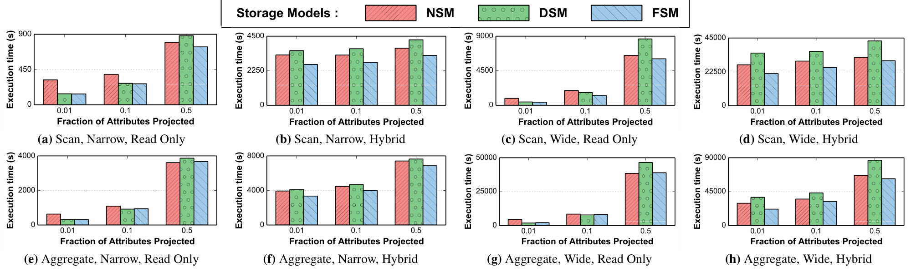

图 7(a)-7(b) 给出窄表扫描在不同投影度下的结果，扫描选择全部元组。低投影度时，DSM 与 FSM 对只读负载的执行比 NSM 快 2.3 倍，因为它们只取回必需属性，更好地利用了内存带宽。随投影度增大，性能差距缩小。查询输出一半属性时，DSM 比其他存储管理器慢 21%，原因是元组重构成本增大。混合负载的低投影度设置下，FSM 分别比 NSM 和 DSM 快 24% 与 33%，因为它比 NSM 更快执行扫描，又比 DSM 更快执行插入。

图 7(c)-7(d) 显示，宽表上各存储模型的差异更大。投影一半属性时，在宽表只读负载中，DSM 比 FSM 慢 43%；而窄表同样设置下只慢 19%。这是因为元组越宽，重构成本越高，也说明 FSM 在宽表上收益更显著。

图 7(e)-7(h) 的聚合负载也呈现相同趋势。聚合查询对所有元组的目标属性计算最大值。低投影度下，不同存储管理器间的差距较小，FSM 对只读负载最多比 NSM 快 1.9 倍。这是因为所有存储模型的执行引擎都需物化包含聚合元组的 logical tile。

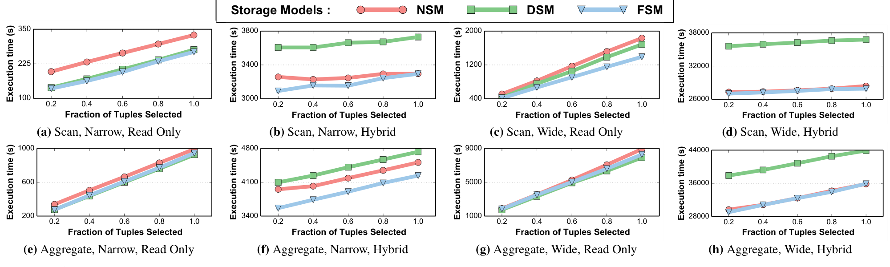

选择率实验把扫描和聚合查询投影度固定为 0.1，即窄表投影 5 个属性，宽表投影 50 个属性，然后把选择率从 10% 提高到 100%。图 8 显示，全部设置下 FSM 执行时间都优于或接近其他存储管理器，说明混合布局对 HTAP 负载有明显优势。

只读负载中 DSM 优于 NSM，混合负载中顺序反转。原因是 DSM 在两种表上都更快地执行扫描，而 NSM 更快执行插入。FSM 在只读负载中超过 NSM，在混合负载中超过 DSM，因此能适应各类 HTAP 负载。包含聚合查询时，存储模型之间的差距缩小，与图 7 低投影度聚合的结论一致。

### 6.3 工作负载感知适应

上一项实验考察的是 DBMS 已根据负载优化混合布局后的性能。现实中负载会动态变化，不可能预先处于此理想状态。因此，本项实验检验 FSM 在运行时适应布局的能力，并与静态 NSM、DSM 布局比较。

实验执行一组性质不断变化的查询序列。为模拟 HTAP 的时间局部性，并清楚分离存储布局对各查询的影响，序列被分为每段 25 条查询、每段只对应一种查询类型的 segment。一个 segment 内查询类型相同但输入参数不同，下一 segment 再切换类型。实验在宽表上测量 NSM、DSM、FSM 执行每条查询的时间。为演示方便，Peloton 重组进程被配置为更快的适应速度。

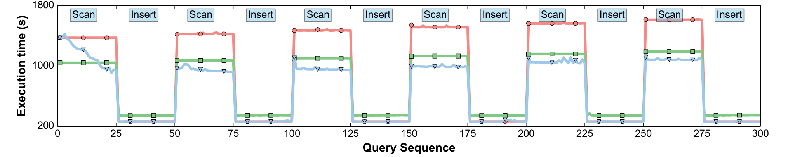

图 9 时间序列图的关键结论是，FSM 会随时间收敛到适合当前 segment 的布局。第一段是低投影度扫描 Q2。表刚加载时，FSM 还没观察过查询，所以所有元组都使用默认 NSM 布局，查询时间与 NSM 接近。接下来几条查询中，FSM 开始把数据重组为最适合 Q2 的 `{{a0}, {a1, ..., ak}, {ak+1, ..., a500}}`。重组后，执行时间下降到与 DSM 存储管理器相当。

负载切换到插入 Q1 的 segment 后，NSM 和 FSM 优于 DSM，因为它们向不同内存位置执行的写入更少。随后再切换到扫描时，FSM 立即超过 NSM，因为它在第一个扫描 segment 中已把初始加载的大部分 tile group 重组为 OLAP 优化布局。第三个 segment 的扫描比第一个更慢，是因为中间穿插的插入 segment 使表变大了。

为深入理解 FSM 如何重组，我们在每个查询 segment 结束时统计每种布局的 tile group 数。图 10 显示只有两种布局：上述 FSM 布局和 NSM 布局。每个插入 segment 之后，NSM tile group 数都增加，因为新元组默认以 NSM 布局保存。随时间推移，适合扫描 segment 的 FSM tile group 数又增加，这解释了图 9 中这些 segment 上更好的执行时间。

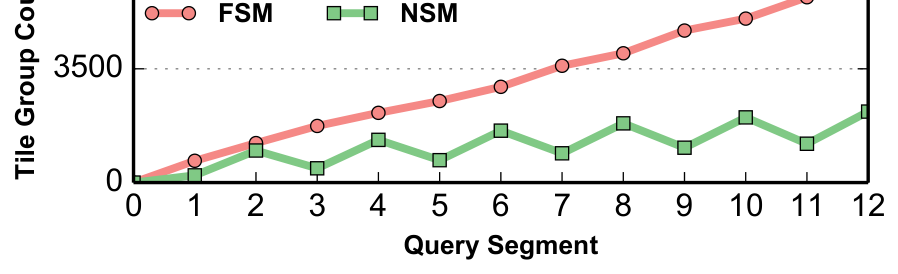

### 6.4 水平分片

下一项实验测量水平分片对 DBMS 性能的影响，目的是比较基于 logical tile 的查询处理和经典的每次一元组 iterator 模型 [21]。实验把 FSM 每个 tile group 中的元组数在 10 到 10000 之间变化，再测量第 6.2 节扫描 Q2 负载的执行时间。

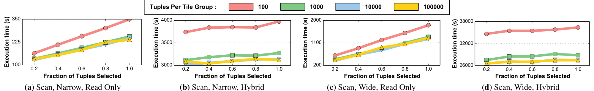

图 11(a) 是窄表只读负载。每 tile group 元组数从 10 增至 1000 时，执行时间下降 24%，原因是解释开销减少。图 11(b) 混合负载中，差距缩小到 17%，因为插入 Q1 所做的写入不受水平分片影响。

图 11(c)-11(d) 给出宽表结果。只读负载中，粗粒度分片比细粒度快 38%。Logical tile 能紧凑表示宽表数据，所以向量化处理的收益更明显。每 group 元组数从 1000 增加到 10000 后，性能改善趋于停滞，很可能是 logical tile 越过饱和点后不再能装入 CPU cache。

### 6.5 重组敏感性分析


我们分析聚类算法中旧查询样本权重 `w` 的影响。工作负载由宽表扫描组成，查询投影度跨查询段从 100% 逐渐降到 10%。系统把表布局表示为 `{ {a0}, {a1,...,ak}, {ak+1,...,a500} }`，其中 `k` 是 split point。`w` 太小时，旧样本影响强，split point 更新慢；`w` 太大时，系统紧跟负载变化，重组激进且容易受短暂负载波动影响。我们选择 `w = 0.001`，在适应速度和稳定性之间折中。

具体而言，查询序列每 1000 条分为一段，各段投影度从 100% 逐步降到 10%。理想情况下，split point `k` 应从 500 降到 50。图 12 比较 `w` 在 0.0001 到 0.1 之间时 split point 的波动。`w=0.0001` 时，旧样本对分区布局影响更强，算法更新 split point 很慢。`w=0.1` 时，算法几乎贴着负载变化走，存储管理器激进重组，更容易受短暂负载变化干扰。`w=0.001` 在两者间形成平衡：对 HTAP 适应得足够快，又不会轻易被短暂波动带偏。

### 6.6 数据重组策略

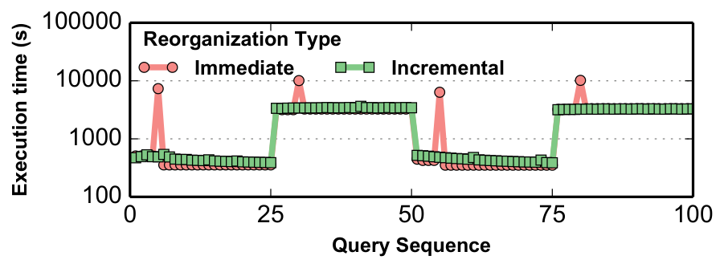

我们比较 immediate reorganization（类似 H2O，把查询处理与重组结合）和 incremental reorganization（Peloton 的后台增量方法）。结果显示，增量方法能把重组开销摊销到多个查询上，避免单个查询承担高昂重组成本；立即重组在某些查询上可能因额外 I/O 或复制而造成尖峰延迟。

比较使用宽表上的扫描 Q2 与算术 Q4，共 4 个 segment，每段 25 条查询，两种查询交替出现。图 13 显示，立即重组有明显的查询延迟尖峰：分区算法观察到新查询并得出新布局后，存储管理器在当前查询的关键路径中把所有 tile group 转换为新布局。虽然同 segment 的后续查询受益，触发重组的那条查询却承担了全部代价。增量策略没有这种尖峰，因为它把重组成本摊销到多条查询，查询时间会随重组推进逐步下降。因而增量方法更适合对延迟敏感的应用。

另一个关键选择是存储管理器是否以不同布局维护同一份数据的多个副本。H2O 在查询执行中创建新布局副本，使同类后续查询更快，但这需要用代码生成构造布局专用的访问算子。Peloton 在任意时刻只以一种布局保留一份数据，以避免写密集负载下同步多份副本的开销。

## 7. 相关工作

**存储模型。** 研究者已提出多种面向不同负载优化 DBMS 性能的存储模型。无处不在的 NSM 适合 OLTP [17]。对 OLAP，DSM 只取回查询需要的列，可提高 I/O 效率 [24]；它还通过提高多个元组之间的数据局部性改善缓存行为 [14]，但会让 OLTP 查询承担高昂元组重构代价。混合 NSM/DSM 方案通过把查询中共同访问的属性放在同一分区 [18]、为给定负载同时求解最优水平与垂直分区 [8]，或在同表的不同副本中使用不同存储模型 [42]，来处理这一权衡。

Ailamaki 等人提出 PAX：一个元组的全部数据仍像 NSM 那样存在同一磁盘页，但页内会将多个元组的同一列值聚在一起 [9, 10]。它消除不必要的内存引用，改善 cache 性能与带宽利用率，从而降低低投影度 OLAP 查询的开销。

**离线物理设计调优。** Data Morphing 把 PAX 一般化，将记录分解为任意属性组，再基于查询负载统计，用爬山算法找最优分区 [23]。Zukowski 和 Boncz 说明，对复杂查询，同一计划的不同部分适合不同存储布局 [51]。MonetDB/X100 使用向量化原语提升 CPU 效率 [15]。IBM Blink 对数据做水平分区，以利用定长字典编码改善压缩，并支持高效的基于哈希的聚合和 SIMD 谓词计算 [43]。这些工作都假设负载事先已知，无法适应动态 HTAP；本文则让存储布局与负载同步调整。

**在线物理设计调优。** Database cracking 把索引构建和维护纳入常规查询处理 [25]，它按查询负载动态排序列存中的元组，并用辅助数据结构降低元组重构成本 [26]，但不处理属性共置。Bruno 和 Chaudhuri 提出在线索引选择算法：DBMS 在查询执行时，根据负载和空间约束估算候选索引收益，判断有利后自动创建 [16]。Autostore 是用贪心数据库分区算法的在线自调优存储 [28]。这些工作也在常规查询期间优化物理设计，但要么只关注索引等辅助结构，要么紧密耦合执行引擎与存储管理器。

**混合 DBMS 架构。** 21 世纪以来，出现了多种面向 HTAP 的 DBMS 和扩展。早期方法 fractured mirrors 同时维护数据库的 NSM 和 DSM 物理表示 [42]，Oracle 列式扩展后来实现了此方法 [39]。IBM BLU 是类似的 DB2 列式扩展，使用字典压缩 [44]。它们的即席 OLAP 性能优于纯行存，但同步镜像的代价很高。

HYRISE 根据查询共同访问每张表属性的模式，自动将表分为变长垂直段 [22]。在窄投影与宽投影扫描中，HYRISE 的 cache 利用率都优于 PAX。SAP 基于 HYRISE 开发了使用分裂存储模型的 HANA [31, 47]：元组初始使用 NSM，后续迁往压缩 DSM。MemSQL [4] 也同时支持 NSM/DSM，两种布局由不同运行时组件管理 [5]。与 HANA 不同，MemSQL 的布局对应用不透明：管理员需手工把数据导入为磁盘常驻、只读的列式表，再修改应用查询这些表。

HyPer 是主存混合 DBMS，整个数据库只能选择 NSM 或 DSM，表内不能混合布局 [29]。为防止长 OLAP 查询干扰普通事务，HyPer 周期性 fork DBMS 进程创建 copy-on-write 快照，在子进程的独立 CPU 上执行 OLAP，OLTP 则留在原进程。上述系统均使用静态混合布局，只能针对静态负载优化。

**自适应存储。** OctopusDB 维护不同布局的多份数据库副本 [20]，把逻辑日志作为主存储，再由日志项创建次级物理表示。它的查询规划器不能生成跨越不同表示的计划，系统同步成本也很高。

H2O 是会随 HTAP 负载演化动态改变存储布局的混合系统 [11]。它为同一数据维护不同布局，用多个执行引擎加速只读负载，并把数据重组与查询处理结合。Peloton 与 H2O 的目标相近，但只用一个执行引擎处理不同布局，并在后台重组，以降低对查询延迟的影响。为支持写密集负载，Peloton 对每个 tile group 只保留一种布局，避免高昂的副本同步；但同一张表的不同 tile group 可以有不同布局。

## 8. 结论

本文提出了一种基于 tile 的 DBMS 架构，用来跨越 OLTP 与 OLAP 系统之间的架构鸿沟。FSM 存储管理器根据对元组未来访问方式的预期，用混合布局存表。同表中较热的 tile group 使用为 OLTP 优化的格式，较冷的 group 使用更适合 OLAP 查询的格式。

本文提出的 logical tile 抽象让 DBMS 能以很小额外开销，在不使用多个执行引擎的情况下，对不同布局的数据执行查询计划。在线重组技术则随负载演化持续改善每张表的物理设计，使 DBMS 能在不需人工调优的情况下，针对任意应用优化数据库布局。实验表明，与静态存储布局相比，基于 FSM 的 DBMS 在不同 HTAP 负载下吞吐量最高提升 3 倍。

## 致谢

本工作部分受到 Intel Science and Technology Center for Big Data 和美国国家科学基金会（CCF-1438955）支持。感谢 Greg Thain 提供论文标题的创意。

如对本文有问题或评论，可拨打 CMU Database Hotline：+1-844-88-CMUDB。

## 参考文献

1. Peloton Database Management System. http://pelotondb.org.
2. Linux perf framework. https://perf.wiki.kernel.org/index.php/Main_Page.
3. PostgreSQL Query Plan Cost. http://www.postgresql.org/docs/9.5/static/using-explain.html.
4. MemSQL. http://www.memsql.com, 2015.
5. MemSQL - Columnstore. http://docs.memsql.com/4.0/concepts/columnstore/, 2015.
6. D. Abadi, D. Myers, D. DeWitt, and S. Madden. Materialization strategies in a column-oriented DBMS. In ICDE, 2007.
7. D. J. Abadi, S. R. Madden, and N. Hachem. Column-stores vs. row-stores: How different are they really? In SIGMOD, 2008.
8. S. Agrawal, V. Narasayya, and B. Yang. Integrating vertical and horizontal partitioning into automated physical database design. In SIGMOD, 2004.
9. A. Ailamaki, D. J. DeWitt, M. D. Hill, and M. Skounakis. Weaving relations for cache performance. In VLDB, 2001.
10. A. Ailamaki, D. J. DeWitt, and M. D. Hill. Data page layouts for relational databases on deep memory hierarchies. The VLDB Journal, 11(3):198-215, 2002.
11. I. Alagiannis, S. Idreos, and A. Ailamaki. H2O: A hands-free adaptive store. In SIGMOD, 2014.
12. J. Arulraj, A. Pavlo, and S. Dulloor. Let's talk about storage & recovery methods for non-volatile memory database systems. In SIGMOD, 2015.
13. D. Beaver, S. Kumar, H. C. Li, J. Sobel, P. Vajgel, and F. Inc. Finding a needle in haystack: Facebook's photo storage. In OSDI, 2010.
14. P. Boncz, S. Manegold, and M. L. Kersten. Database architecture optimized for the new bottleneck: Memory access. In VLDB, pp. 54-65, 1999.
15. P. Boncz, M. Zukowski, and N. Nes. MonetDB/X100: Hyper-pipelining query execution. In CIDR, 2005.
16. N. Bruno and S. Chaudhuri. An online approach to physical design tuning. In ICDE, 2007.
17. G. P. Copeland and S. N. Khoshafian. A decomposition storage model. In SIGMOD, 1985.
18. D. Cornell and P. Yu. An effective approach to vertical partitioning for physical design of relational databases. IEEE TSE, 1990.
19. N. de Bruijn. Asymptotic Methods in Analysis. Dover, 1981.
20. J. Dittrich and A. Jindal. Towards a one size fits all database architecture. In CIDR, pp. 195-198, 2011.
21. G. Graefe. Volcano - an extensible and parallel query evaluation system. IEEE TKDE, 6:120-135, February 1994.
22. M. Grund, J. Krueger, H. Plattner, A. Zeier, P. Cudre-Mauroux, and S. Madden. HYRISE: a main memory hybrid storage engine. In VLDB, pp. 105-116, 2010.
23. R. A. Hankins and J. M. Patel. Data morphing: An adaptive, cache-conscious storage technique. In VLDB, 2003.
24. S. Harizopoulos, V. Liang, D. J. Abadi, and S. Madden. Performance tradeoffs in read-optimized databases. In VLDB, pp. 487-498, 2006.
25. S. Idreos, M. L. Kersten, and S. Manegold. Database cracking. In CIDR, 2007.
26. S. Idreos, M. L. Kersten, and S. Manegold. Self-organizing tuple reconstruction in column-stores. In SIGMOD, 2009.
27. A. K. Jain. Data clustering: 50 years beyond k-means. Pattern Recognition Letters, 2010.
28. A. Jindal and J. Dittrich. Relax and let the database do the partitioning online. In Enabling Real-Time Business Intelligence, Lecture Notes in Business Information Processing, 2012.
29. A. Kemper and T. Neumann. HyPer: A hybrid OLTP&OLAP main memory database system based on virtual memory snapshots. In ICDE, pp. 195-206, 2011.
30. P.-A. Larson, S. Blanas, C. Diaconu, C. Freedman, J. M. Patel, and M. Zwilling. High-performance concurrency control mechanisms for main-memory databases. In VLDB, 2011.
31. J. Lee, M. Muehle, N. May, F. Faerber, V. Sikka, H. Plattner, J. Krueger, and M. Grund. High-performance transaction processing in SAP HANA. IEEE Data Engineering Bulletin, 36(2):28-33, 2013.
32. N. Malviya, A. Weisberg, S. Madden, and M. Stonebraker. Rethinking main memory OLTP recovery. In ICDE, 2014.
33. S. Manegold, P. A. Boncz, and M. L. Kersten. Optimizing database architecture for the new bottleneck: Memory access. VLDB Journal, 2000.
34. MemSQL. How MemSQL Works. http://docs.memsql.com/4.1/intro/.
35. C. Mohan, D. Haderle, B. Lindsay, H. Pirahesh, and P. Schwarz. ARIES: a transaction recovery method supporting fine-granularity locking and partial rollbacks using write-ahead logging. ACM TODS, 17(1):94-162, 1992.
36. S. B. Navathe and M. Ra. Vertical partitioning for database design: A graphical algorithm. In SIGMOD, 1989.
37. T. Neumann. Efficiently compiling efficient query plans for modern hardware. PVLDB, 4(9):539-550, June 2011.
38. T. Neumann, T. Muehlbauer, and A. Kemper. Fast Serializable Multi-Version Concurrency Control for Main-Memory Database Systems. In SIGMOD, 2015.
39. Oracle. Oracle Database In-Memory option to accelerate analytics, data warehousing, reporting and OLTP. http://www.oracle.com/us/corporate/press/2020717, 2013.
40. M. Pezzini, D. Feinberg, N. Rayner, and R. Edjlali. Hybrid Transaction/Analytical Processing Will Foster Opportunities for Dramatic Business Innovation. https://www.gartner.com/doc/2657815/, 2014.
41. H. Plattner. A common database approach for OLTP and OLAP using an in-memory column database. In SIGMOD, 2009.
42. R. Ramamurthy, D. J. DeWitt, and Q. Su. A case for fractured mirrors. In VLDB, pp. 430-441, 2002.
43. V. Raman, G. Swart, L. Qiao, F. Reiss, V. Dialani, D. Kossmann, I. Narang, and R. Sidle. Constant-time query processing. In ICDE, 2008.
44. V. Raman et al. DB2 with BLU acceleration: So much more than just a column store. PVLDB, 6:1080-1091, 2013.
45. A. Rosenberg. Improving query performance in data warehouses. Business Intelligence Journal, 11, January 2006.
46. D. Schwalb, M. Faust, J. Wust, M. Grund, and H. Plattner. Efficient transaction processing for Hyrise in mixed workload environments. In IMDM, 2014.
47. V. Sikka, F. Faerber, W. Lehner, S. K. Cha, T. Peh, and C. Bornhoevd. Efficient transaction processing in SAP HANA database: The end of a column store myth. In SIGMOD, pp. 731-742, 2012.
48. V. Sikka, F. Farber, A. Goel, and W. Lehner. SAP HANA: The evolution from a modern main-memory data platform to an enterprise application platform. In VLDB, 2013.
49. M. Stonebraker, D. J. Abadi, A. Batkin, X. Chen, M. Cherniack, M. Ferreira, E. Lau, A. Lin, S. Madden, E. O'Neil, P. O'Neil, A. Rasin, N. Tran, and S. Zdonik. C-Store: A column-oriented DBMS. In VLDB, pp. 553-564, 2005.
50. A. H. Watson, T. J. McCabe, and D. R. Wallace. Structured testing: A software testing methodology using the cyclomatic complexity metric. U.S. Department of Commerce/National Institute of Standards and Technology, 1996.
51. M. Zukowski and P. A. Boncz. Vectorwise: Beyond column stores. IEEE Data Engineering Bulletin, 2012.

## 附录 A. Logical Tile Algebra

本附录形式化定义 logical tile algebra 算子的语义。对每个算子，均给出输入参数与输出的类型，以及从输入到输出的代数变换。记可含重复元组的多重集为 `<...>`，所有元素唯一的集合为 `{...}`，`|S|` 是多重集或集合 S 的大小。表中 `LT` 表示 logical tile，`PT` 表示 physical tile，`T` 表示表，`I` 表示索引。

表 1：Logical Tile Algebra。每个算子给出类别、输入参数、输出或代数变换。

| 类别 | 算子 | 输入参数 | 输出 / 代数变换 |
| --- | --- | --- | --- |
| Bridge Operators | SEQUENTIAL SCAN | `T_X`, predicate `P` | `{LT} ≡ {LT_w | w ≡ <x | x ∈ X ∧ P(x)>}` |
| Bridge Operators | INDEX SCAN | `I_X`, predicate `P` | `{LT} ≡ {LT_w | w ≡ <x | x ∈ X ∧ P(x)>}` |
| Bridge Operators | MATERIALIZE | `LT_X` | `PT_Y` |
| Metadata Operators | SELECTION | `LT_X`, predicate `P` | `LT ≡ <x | x ∈ X ∧ P(x)>` |
| Metadata Operators | PROJECTION | `LT_X`, attributes `C` | `LT ≡ X' | schema(X') = C` |
| Mutators | INSERT | `T_X`, `LT_Y` | `T ≡ X => X ∪ Y_p` |
| Mutators | DELETE | `T_X`, `LT_Y` | `T ≡ X => X \ Y_p` |
| Mutators | UPDATE | `T_X`, attributes `C`, expr `E` | `T ≡ X => (X \ Y_p) ∪ Z_p` |
| Pipeline Breakers | JOIN | `LT_X`, `LT_Y`, predicate `P` | `LT ≡ <x || y | x ∈ X ∧ y ∈ Y ∧ P(x,y)>` |
| Pipeline Breakers | UNION | `LT_X`, `LT_Y` | `LT ≡ {z | z ∈ X ∨ z ∈ Y}` |
| Pipeline Breakers | INTERSECTION | `LT_X`, `LT_Y` | `LT ≡ {z | z ∈ X ∧ z ∈ Y}` |
| Pipeline Breakers | DIFFERENCE | `LT_X`, `LT_Y` | `LT ≡ {z | z ∈ X ∧ z ∉ Y}` |
| Pipeline Breakers | UNIQUE | `LT_X` | `LT ≡ {z | z ∈ X}` |
| Pipeline Breakers | COUNT | `LT_X` | `int ≡ |X|` |
| Pipeline Breakers | SUM | `LT_X`, attributes `C` | `LT ≡ [Σ_{x∈X} x_c, ∀c ∈ C]` |
| Pipeline Breakers | MAX | `LT_X`, attributes `C` | `LT ≡ [max_{x∈X} x_c, ∀c ∈ C]` |

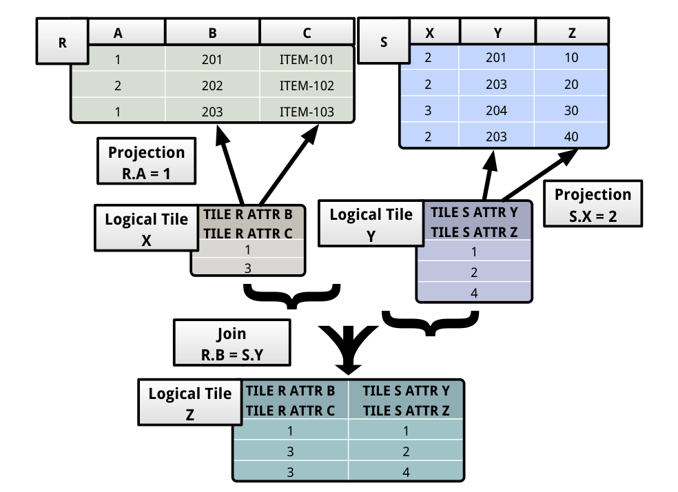

**Bridge operators。** Sequential scan 为表 X 中每个包含满足 `P(x)` 元组 x 的 tile group 生成 logical tile。输出 tile 只有一列，其中是 tile group 中匹配元组的 offset。图 14 给出图 5 计划树中 sequential scan 的运行行为：它产生 logical tile X，表示 physical tile R 中满足 `a=1` 的元组。Index scan 用索引 X 找出满足 P 的元组，再构造一个或多个 logical tile。每个 logical tile 只能表示同一 tile group 中的匹配元组。

Materialize 把 logical tile X 转换为 physical tile Y。执行引擎在把结果元组送给客户端之前，或需要早物化时，调用该算子。后一种情况下，它构造 passthrough logical tile 包裹已物化的 Y，再将其传给计划树上层。

**Metadata operators。** Projection 接收 logical tile X，只修改 metadata 并将它输出。需被投影掉的属性会从 metadata 中删除，但对应列仍存在于 logical tile 表示的数据里。Selection 把不满足谓词 P 的元组在 X 的 metadata 中标记为不可见，对应行仍然留在 X 中。因此，这些算子只需改变 logical tile metadata。

**Mutators。** 这些算子直接修改表数据，故表 1 用 `=>` 表示变换。Insert 接收 logical tile Y，将其表示的元组 `Y_p` 追加到表 X。Delete 从 X 删除 `Y_p`。Update 先把 X 中 `Y_p` 标记为死亡，再在 `Y_p` 上计算属性 C 对应表达式 E，构造新版本 `Z_p`，最后将 `Z_p` 追加到表。Mutator 与事务存储管理器协作，控制元组生命周期。

**Pipeline breakers。** Join 接收 X、Y，在它们上计算 `P(x,y)`。它先拼接 X 和 Y 的 schema 构造输出，再遍历每一对元组，将满足 P 的元组对拼接并追加。图 14 中输出 Z 就是拼接 X 与 Y 中匹配元组对所得。

集合算子同样是 pipeline breaker。例如 union 在遍历子节点的所有输入 logical tile 时记录所观察元组，最后把重复元组标记为不可见后返回这些 tile。Count、sum 等聚合算子检查子算子的全部 logical tile，构造聚合元组。它们与集合算子的区别是，会构造新 physical tile 存聚合结果，再构造表中用 `[...]` 表示的 passthrough logical tile 包裹新 tile，每次一个 logical tile 地向计划树上层传递。

Logical tile 抽象在表达能力上没有限制。它只是对一个或多个关系中元组集合的“速记”，任何关系算子都可以映射到 logical tile algebra。

## 附录 B. Join 查询

本附录考察存储模型对连接查询的影响。布局无关的 join 算法在 logical tile 上运行，只访问 join key 计算连接。这与 radix join [33] 等 cache-conscious 连接算法类似，因而数据布局不会显著影响连接谓词计算 [11]。但数据布局会影响连接后的元组重构，因为存储管理器此时必须取回投影属性。所以 join 算子在不同布局上的总体行为与 projection 算子相似。

实验使用自连接 Q5，向表 R 加载 1000 万个元组，测量连接查询的执行时间。投影度从 1% 变化到 100%，每次随机选择 `a_i` 和 `a_j` 构造连接谓词。

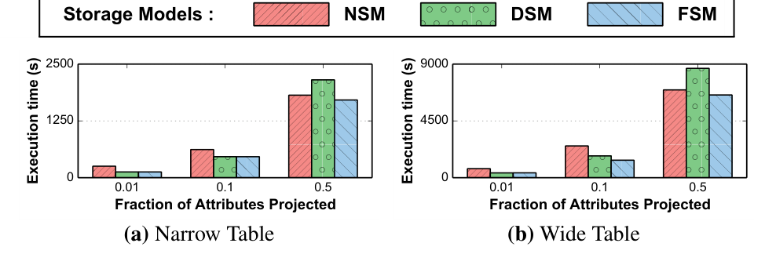

图 16(a) 中，窄表高投影度时，NSM 和 FSM 执行 join 比 DSM 快 1.3 倍，因为它们降低了元组重构时取回投影属性的成本。图 16(b) 的宽表上，NSM 和 FSM 比 DSM 快 1.5 倍。结果与第 6.2 节投影度实验一致。

## 附录 C. Cache 行为

本附录检验水平分片对 DBMS cache 局部性的影响，比较每次处理一个 logical tile 和每次处理一个元组的 iterator 模型 [21]。FSM 每 tile group 的元组数在 10 到 10000 之间变化，实验统计第 6.2 节负载在不同分片设置下的 cache miss。系统用 Linux `perf` [2] 的基于事件采样跟踪 cache 行为，且在数据库加载完成后才开始 profiling。

图 15(a) 显示，窄表只读负载中，每 group 元组数从 10 增到 1000 时，cache miss 数减少 1.5 倍，原因是解释开销降低。图 15(b) 的混合负载也有类似下降。宽表只读负载中，粗粒度分片的 cache miss 比细粒度少 1.7 倍，说明 logical tile 的紧凑表示在宽表上收益更大。但每 group 元组数从 1000 增到 10000 时，cache miss 反而增加，因为 logical tile 越过饱和点后已无法装入 CPU cache。

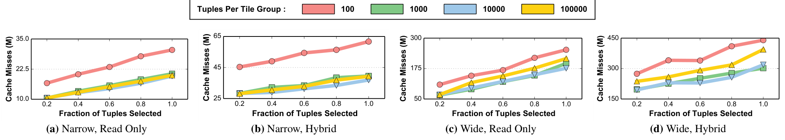

## 附录 D. 间接层开销

本附录聚焦 logical tile 抽象访问底层 physical tile 所引入的间接层开销。物化一个 logical tile 时，存储管理器对其中全部元组只需查找一次底层 physical tile 的位置。

表 2 固定物化宽表的 10000 个元组，并改变表示它们的 logical tile 数。每 logical tile 只表示 1 个元组时，存储管理器需物化 10000 个 logical tile；一个 logical tile 表示全部 10000 个元组时，只需物化 1 个。每 logical tile 表示的元组从 1 增到 10 时，物化时间下降约 8 倍。HTAP 负载中的查询通常会产生更长 logical tile，因而这项间接开销可以接受。替代做法是使用彼此分离的 OLTP 和 OLAP DBMS [47]，但跨两个系统数据的事务所需原子提交协议开销，高于 logical tile 间接层开销。

表 2：Indirection overhead。物化 10000 个元组时，logical tile 数量越多，间接访问成本越高。

| Logical tiles 数量 | Materialization time (s) |
| ---: | ---: |
| 1 | 17.7 |
| 10 | 18.3 |
| 100 | 25.7 |
| 1000 | 82.3 |
| 10000 | 640.4 |

## 附录 E. 并发混合负载

本附录考察存储布局对并发 HTAP 负载的影响。负载在窄表上随机混合扫描 Q2 和插入 Q1。扫描选择表中 10% 的元组，投影 10% 的属性。所有存储管理器执行扫描都比执行插入慢。四种负载混合比例是：只读，100% 扫描；读密集，90% 扫描与 10% 插入；均衡，各 50%；写密集，10% 扫描与 90% 插入。

实验在 8-core 服务器上把并发 client 数从 1 提高到 16，测量每个存储管理器的吞吐。图 17(a) 中，高并发只读负载下 FSM 和 DSM 的吞吐比 NSM 高 1.7 倍，因为它们只取回扫描必需属性，内存带宽利用更好。吞吐随 client 连接数近乎线性增长，图 17(b)-17(c) 的读密集与均衡负载也有相同趋势。

图 17(d) 的写密集负载则相反，FSM 和 NSM 超过 DSM，因为它们处理插入时向不同内存位置的写入更少。其绝对吞吐比只读混合高 400 倍以上，原因是存储管理器执行插入的开销较低。

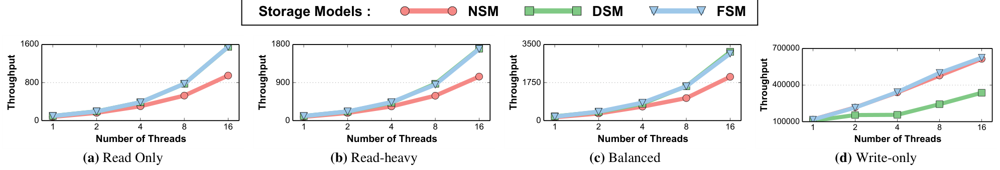

## 附录 F. 动态布局适应

本附录评估动态布局适应在即席 HTAP 负载中的收益。Hyrise 根据查询如何共同访问属性，把表分为垂直段 [22]，但假设访问模式事先已知，因而为每张表生成静态存储布局。Peloton 则根据 HTAP 负载变化动态调整。

基础负载是 ADAPT 宽表上的高投影度扫描 Q2，投影 90% 的属性。Hyrise 为此负载计算的最优静态布局，把所有投影属性放在一个 physical tile。为模拟动态 HTAP，实验插入低投影度即席 Q2 segment，这些查询只投影 5% 属性。每个 segment 含 100 条查询，高投影和低投影 segment 交替。实验比较 Hyrise 静态布局与 FSM 动态布局下每条查询的执行时间。

图 18 显示 FSM 会收敛到适合当前 segment 的布局。第一个高投影段中，它的表现与 Hyrise 接近。切换到低投影段后，FSM 重组进程动态调整为该 segment 合适的布局，比 Hyrise 静态布局快 1.5 倍。

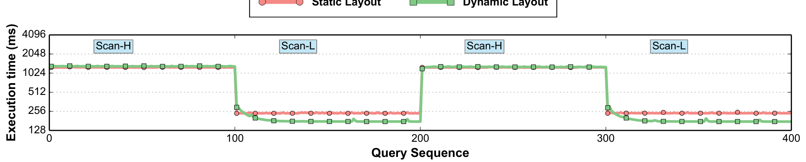

## 附录 G. 未来工作

Peloton 中有多个控制布局重组过程的调节项（knob）。虽然我们尽力为它们提供合理默认值，但理想情况是 DBMS 能根据 HTAP 负载自动调节。我们计划研究 DBMS 内的自驾驶模块，动态调整这些 knob，简化调优过程。未来还将探索代码生成和数据压缩，以优化查询执行以及 DBMS 运行时的其他方面。
