# The Ubiquitous B-Tree（中文译文）

## 译者说明

本文依据同目录的 `source.pdf` 翻译。章节、图表、公式、算法、代码与参考文献按原文结构保留。

Douglas Comer

普渡大学计算机科学系, 美国印第安纳州西拉法叶 47907

正文中的 B* 树与 B+ 树沿用原文记号。

## 摘要

B 树事实上已经成为文件组织的一项标准。用户文件的索引、专用数据库系统以及通用访问方法, 都曾采用 B 树来设计并实现。本文回顾 B 树并说明它为何如此成功, 讨论 B 树的主要变体, 尤其是 B+ 树, 并比较各种实现各自的优点与代价。最后, 本文以一个使用 B 树的通用访问方法为例加以说明。

**关键词与短语:** B 树, B* 树, B+ 树, 文件组织, 索引

**CR 分类:** 3.73, 3.74, 4.33, 4.34

## 引言

大型计算机系统提供的二级存储设施, 使用户能够在称为文件的大型信息集合中保存、更新和取回数据。计算机必须先取出一个项目并把它放入主存, 才能处理它。为了充分利用计算机资源, 必须明智地组织文件, 使取回过程高效。

良好文件组织的选择取决于需要执行的取回类型。取回命令大体可分成两类:

- 顺序取回: “从员工文件中, 编制所有员工姓名和地址的清单。”
- 随机取回: “从员工文件中, 取出员工 J. Smith 的信息。”

可以设想一个有三个抽屉的文件柜, 每名员工对应一个文件夹。抽屉可标为 “A-G”“H-R”“S-Z”, 文件夹则以员工姓氏标记。顺序请求要求检索者逐个检查整个文件; 随机请求则意味着检索者借助抽屉和文件夹上的标签, 只需取出一个文件夹。

计算机系统中一个大型随机访问文件通常配有索引。它像文件柜抽屉和文件夹上的标签一样, 把检索者引向含有所需项目的一小部分文件, 从而加快取回。图 1 展示文件及其索引。索引可以像员工文件夹上的标签那样在物理上与文件结合, 也可以像抽屉标签那样在物理上分离。索引本身通常也是一个文件。如果索引文件很大, 还可在其上再建立索引来进一步加速取回, 如此逐层建立。所得层次结构类似员工文件: 顶层索引是抽屉标签, 下一层索引是文件夹标签。

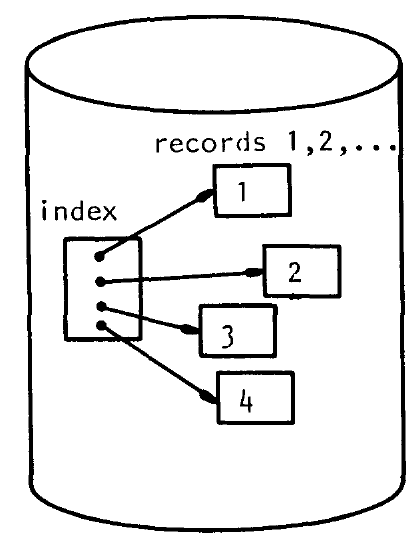

**图 1.** 二级存储上的文件及其索引。

把姓氏作为索引项形成的自然层次, 用在计算机系统中并不总能取得最佳性能。通常会给文件中的每个项目指定唯一键, 一切取回操作都通过指定该键来请求。例如, 可为每名员工分配唯一的员工编号来标识其记录。此时抽屉不再标为 “A-G” 等, 而应标为类似 “0001-3000” 的员工编号范围。

人们提出过许多组织文件及其索引的技术; Knuth [KNUT73] 对基本方法作了综述。没有一种方案能对所有应用都最优, 但称为 B 树的文件和索引组织技术已得到广泛使用。B 树事实上是数据库系统索引的标准组织方式。本文面向听说过 B 树并希望得到解释或后续阅读指引的计算机专业人员, 比较 B 树的多种变体, 尤其是 B+ 树, 并说明它流行的原因。本文综述 B 树文献, 包括教科书尚未提及的新近论文, 还讨论一个以 B 树为基础的通用文件访问方法。

讨论的起点是一种内部存储结构, 即二叉搜索树。我们特别从平衡二叉搜索树开始, 因为它能保证较低的取回代价。关于二叉搜索树及其他内部存储机制的综述, 可参阅 [SEVE74] 与 [NIEV74]。[NIEV74] 还解释了本文通篇使用的图论术语“树”“节点”“边”“根”“路径”和“叶”。

本引言余下部分给出取回过程的模型, 并概述要考虑的文件操作。第 1 节介绍 Bayer 和 McCreight 提出的基本 B 树及插入、删除和定位项目的方法。第 2 节分别考察各类操作的代价, 并指出顺序处理可能很昂贵。实现上的改变在许多情况下可降低代价, 第 3 节介绍为此发展出的 B 树变体。第 4 节将讨论扩展到多用户环境中维护 B 树的问题, 并概述并发与安全问题的解决办法。第 5 节介绍 IBM 以 B 树为基础的通用文件访问方法。

### 文件上的操作

本文把文件看成由 $n$ 条记录组成的集合。第 $i$ 条记录形如 $r_i=(k_i,a_i)$, 其中 $k_i$ 称为该记录的键, $a_i$ 是关联信息。例如, 员工文件中一条记录的键可以是五位员工编号, 关联信息则包含姓名、地址、薪资和供养人数。

假设键 $k_i$ 唯一标识记录 $r_i$。还假设键虽然远短于关联信息, 但所有键的集合仍大到无法装入主存。这些假设意味着, 若要使用键随机取回记录, 建立索引来加速取回将很有益。因为全部键不能装入主存, 索引本身也必须存放在外部。最后, 假设键具有某种自然次序, 如字母序, 因而可以谈论文件的键序。

用户针对文件执行事务, 包括插入、删除、取回和更新记录。用户还常从某一点开始, 按键序顺序处理文件, 而起点最常是文件开头。支持这类事务的一组基本操作如下:

- `insert`: 加入新记录 $(k_i,a_i)$, 并检查 $k_i$ 是否唯一。
- `delete`: 给定 $k_i$, 删除记录 $(k_i,a_i)$。
- `find`: 给定 $k_i$, 取回 $a_i$。
- `next`: 已刚取回 $a_i$ 时取回 $a_{i+1}$, 即顺序处理文件。

每种文件组织都要付出维护索引以及执行上述各操作的代价。索引的目的在于加速取回, 因而处理时间通常被视为主要度量。以当时的硬件技术, 访问二级存储所需时间是数据总处理时间的主要部分。大多数随机访问设备每次读操作传送固定数量的数据, 总耗时因此与读次数近似线性相关。所以, 二级存储访问次数是评价索引方法的合理代价度量。其他较次要的代价包括数据进入主存后的处理时间、二级存储空间利用率, 以及索引空间与关联信息空间之比。

## 1. 基本 B 树

B 树历史不长却很重要。20 世纪 60 年代后期, 计算机制造商和独立研究组竞相为各自机器开发通用文件系统以及所谓“访问方法”。Sperry Univac 公司与 Case Western Reserve University 合作, 由 H. Chiat、M. Schwartz 等人开发并实现了一个系统, 其插入和查找方式与下文的 B 树方法相关。Control Data Corporation 与 Stanford University 合作, 由 B. Cole、S. Radcliffe、M. Kaufman 等人独立开发了相似系统。当时在 Boeing Scientific Research Labs 的 R. Bayer 与 E. McCreight 提出一种外部索引机制, 对上一节定义的大多数操作都有较低代价, 并将其称为 B 树 [BAYE72]。[^1]

本节把基本 B 树数据结构和维护算法描述为二叉搜索树的推广, 即一个节点可以引出多于两条路径。下一节分析每个操作的代价。其他一般性介绍见 [HORO76]、[KNUT73] 和 [WIRT76]。

在二叉搜索树中, 节点处选择哪条分支取决于查询键与节点所存键的比较结果。查询键较小就走左分支, 较大则走右分支。图 2 给出存储员工编号的这种树的一部分, 并以粗线表示查询 “15” 的路径。

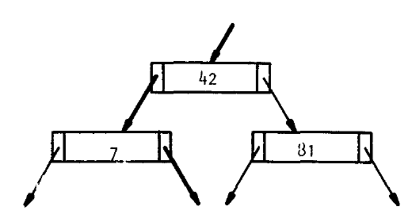

**图 2.** 员工编号二叉搜索树的一部分, 查询 “15” 所走路径以粗线表示。

再看图 3, 每个节点存两个键, 搜索时在每个节点选择三条路径之一。查询值 15 小于 42, 所以在根处选择最左路径; 查询值位于 42 与 81 之间时选择中间路径, 大于 81 时选择最右路径。在每个节点重复这一决策, 直到精确匹配而成功, 或遇到叶而失败。

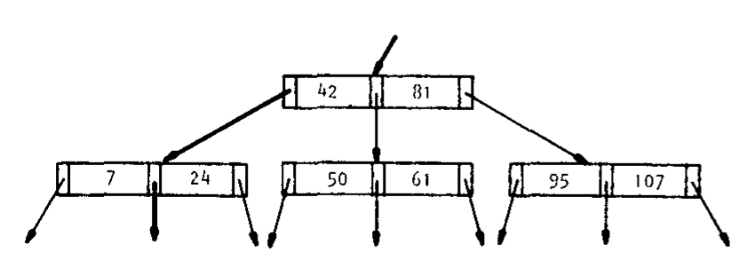

**图 3.** 每节点有 2 个键和 3 条分支的搜索树, 查询 “15” 所走路径以粗线表示。

一般地, 阶为 $d$ 的 B 树中, 每个节点至多含 $2d$ 个键和 $2d+1$ 个指针, 如图 4。不同节点的键数可以不同, 但每个节点至少含 $d$ 个键和 $d+1$ 个指针, 所以每个节点至少半满。通常一个节点构成索引文件的一条记录, 长度固定, 足以容纳 $2d$ 个键和 $2d+1$ 个指针, 并含有说明当前有效键数的附加信息。

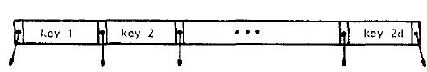

**图 4.** 阶为 $d$ 的 B 树节点, 含 $2d$ 个键与 $2d+1$ 个指针。

通常大型多键节点不能常驻主存, 每次检查都要访问二级存储。后文将看到, 在本文的代价准则下, 每节点保存多个键可降低查找、插入和删除的代价。

### 平衡

B 树的精妙之处在于, 插入和删除记录的方法始终保持树的平衡。与二叉搜索树一样, 随机插入记录可能使树不平衡。图 5(a) 的不平衡树既有长路径也有短路径; 图 5(b) 的平衡树则让所有叶位于同一深度。

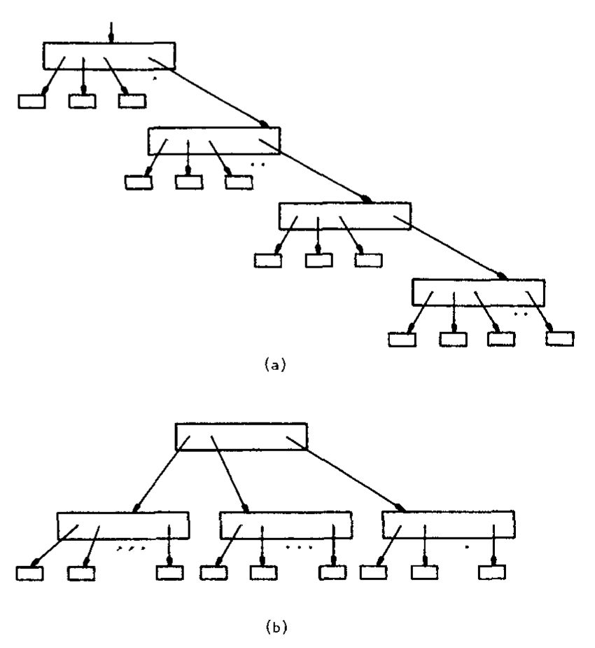

**图 5.** (a) 具有许多长路径的不平衡树; (b) 所有通向叶的路径长度完全相同的平衡树。

B 树直观上具有图 6 的形状。含 $n$ 个键的阶 $d$ B 树, 最长路径至多约含 $\log_d n$ 个节点。索引 $n$ 条记录的不平衡树中, 一次 `find` 可能访问 $n$ 个节点; 同样规模的阶 $d$ B 树中则不会超过 $1+\log_d n$ 个节点。每次访问都需要一次二级存储访问, 所以保持平衡可能节省大量代价。人们提出过许多平衡树方案, 例见 [NIEV74]、[FOST65]、[KARL76]。每种方案都要花费计算时间来维持平衡, 因而取回节省必须超过平衡本身的代价。

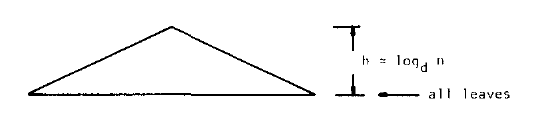

**图 6.** 索引含 $n$ 条记录文件的阶 $d$ B 树形状, 图中标示 $h\le\log_d n$, 所有叶处于同一层。

B 树的平衡方案把树的改变限制在从一个叶到根的一条路径上, 不会产生失控的维护开销。它还以额外存储换取较低的平衡代价, 这里假定二级存储相对取回时间而言便宜。因此, B 树获得平衡树方案的优点, 同时避开某些耗时维护。

### 插入

图 7(a) 是阶为 2 的 B 树。阶 $d$ B 树的每个节点含 $d$ 至 $2d$ 个键, 所以示例节点含 2 至 4 个键。每个节点还必须有一个图中未画出的指示器来记录当前键数。插入新键分两步: 首先从根执行 `find`, 找到适合插入的叶; 然后插入, 并沿叶到根的方向恢复平衡。插入键 “57” 时, 查找在第四个叶处失败。该叶尚可容纳一个键, 因而直接插入即可, 得到图 7(b)。注意根的键数可少于阶 $d$, 其余所有节点至少有 $d$ 个键。

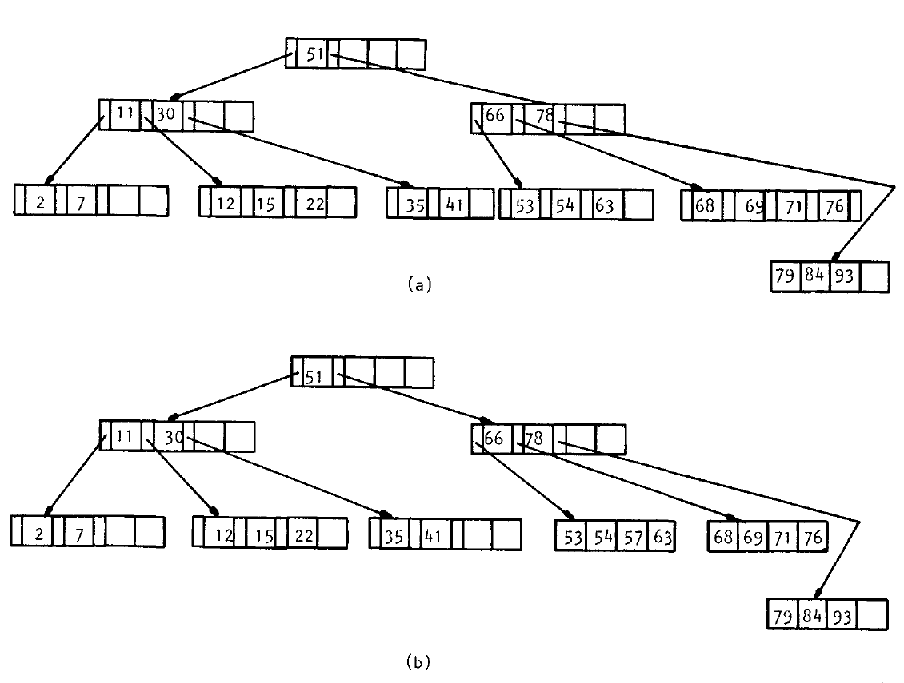

**图 7.** (a) 阶为 2 的 B 树; (b) 插入键 “57” 后的同一棵树。根中的键数可少于 $d$, 其他节点均至少含 $d$ 个键。

如果插入键 “72”, 目标叶已经满, 情况便复杂。只要需要向已满节点插键, 就要分裂该节点, 如图 8。对总共 $2d+1$ 个键, 最小的 $d$ 个放入一个节点, 最大的 $d$ 个放入另一个节点, 剩余的中间值提升到父节点并作为分隔值。父节点通常可以接纳一个新键, 插入到此结束。如果父节点也已满, 就继续应用同一分裂过程。最坏情况下, 分裂一直传播至根, 树高增加一层。实际上, B 树只有在根分裂时才会增高。

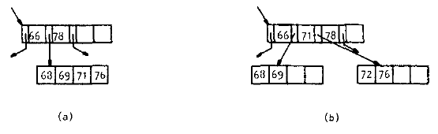

**图 8.** (a) B 树中的一个叶及其祖先; (b) 插入键 “72” 后的同一子树。每个节点仍含 2 至 4 个键, 即 $d$ 至 $2d$ 个键。

### 删除

B 树删除也先用 `find` 定位节点。待删键可能在叶中, 也可能在非叶节点中。删除非叶键时, 必须找一个相邻键换入空位, 使 `find` 仍正确工作。要找键序中的后继键, 只需在空位右侧指针指向的子树中寻找最左叶。与二叉搜索树一样, 所需值必在叶中。图 9 展示这一关系。

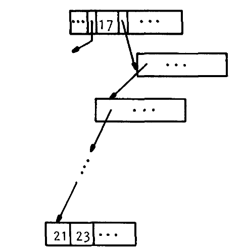

**图 9.** 删除键 “17” 时, 要找到键序中的下一个键 “21” 并换入空位。后继键总位于空位右指针所指子树的最左叶。

把空位“移动”到叶后, 必须检查是否仍有至少 $d$ 个键。若少于 $d$ 个, 就发生下溢, 需要重新分配键。恢复平衡只需从相邻叶借一个键, 但该操作至少要访问两次二级存储, 更好的做法是把剩余键在两个相邻节点间尽量均匀分配, 以降低同一节点上后续删除的代价。图 10 给出这种重分配。

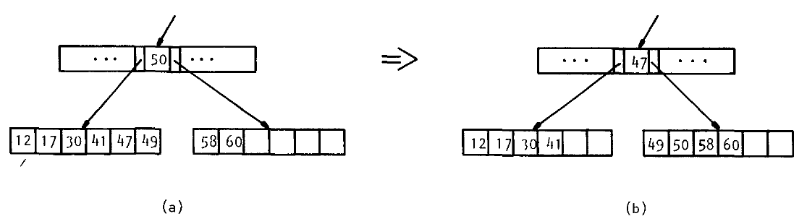

**图 10.** (a) 重分配前的一部分 B 树; (b) 两个相邻节点重分配后的结果。注意分隔键 “50” 的最终位置。把键均分到大小相同的节点有助于避免后续删除再次下溢。

只有至少有 $2d$ 个键可供分配时, 两个相邻节点间的重分配才足够。若剩余值少于 $2d$, 必须进行合并。合并时把键并入一个节点并丢弃另一个节点, 它正是分裂的逆过程。因为只剩一个节点, 祖先中分隔两者的键不再需要, 也要降入这个剩余叶。图 11 展示合并以及分隔键的最终位置。

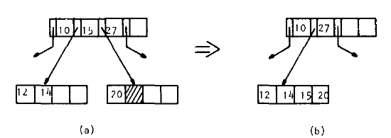

**图 11.** (a) 一次引发合并的删除; (b) 重新平衡后的树。

某节点因两个子节点合并而失去分隔键后, 它也可能下溢, 从相邻节点重分配或继续向上一层合并。合并可能逐层传播到根。若根的后代被合并, 合并后的节点成为新根, B 树高度减 1。插入和删除算法见 [BAYE72], Wirth [WIRT76] 给出了简单的 Pascal 示例。

## 2. 操作代价

访问 B 树节点需要访问二级存储, 因而一个操作访问的节点数可作为代价度量。Bayer 与 McCreight [BAYE72] 精确分析了插入、删除与取回的代价, 并给出综合实验结果, 把理论界限同实际设备联系起来。Knuth [KNUT73] 采用略有不同的定义, 也推导了 B 树操作的代价界。下面给出渐近代价界的简要说明。

### 取回代价

先考虑 `find`。除根外, 每个节点有 $d$ 至 $2d$ 个键, 因而至少有 $d$ 个直接后代; 根至少有 2 个后代。因此在深度（注：树根深度为 0, 深度 $i-1$ 节点的子节点位于深度 $i$。） $0,1,2,\ldots$ 上, 节点数依次至少为 $1,2,2d,2d^2,2d^3,\ldots$。所有叶处于同一深度 $h$, 所以节点总数至少为

$$
\sum_{i=0}^{h-1}2d^i=\frac{2(d^h-1)}{d-1}.
$$

每个非根节点至少含 $d$ 个键, 因而含 $n$ 个键的树高满足

$$
\frac{2d(d^h-1)}{d-1}\le n.
$$

稍作整理可得

$$
2d^h\le n+1,
$$

也就是

$$
h\le \log_d\frac{n+1}{2}.
$$

所以, `find` 的处理代价随文件大小按对数增长。

**表 I. 不同节点大小与文件规模下, 最坏情形所取回节点数的上界。**

| 节点大小 | $10^3$ 条记录 | $10^4$ 条记录 | $10^5$ 条记录 | $10^6$ 条记录 | $10^7$ 条记录 |
| ---: | ---: | ---: | ---: | ---: | ---: |
| 10 | 3 | 4 | 5 | 6 | 7 |
| 50 | 2 | 3 | 3 | 4 | 4 |
| 100 | 2 | 2 | 3 | 3 | 4 |
| 150 | 2 | 2 | 3 | 3 | 4 |

表 I 表明, 即使文件很大, 对数代价也很合理。阶为 50 的 B 树索引 100 万条记录时, 最坏也只需 4 次磁盘访问。后文还会看到这个估计偏高, 简单实现技术可把最坏代价降至 3 次, 平均代价更低。

Aho 等人 [AHO74] 从另一角度说明 B 树查找代价。他们证明, 在决策树计算模型中, 即搜索以每个节点处的比较为基础时, 不存在渐近更快的取回算法。当然, 该模型排除了散列等方法 [MAUE75]。尽管如此, 无论从实践还是理论看, B 树都有很低的取回代价。

### 插入和删除代价

插入或删除在沿树向上返回时, 可能需要超出 `find` 的额外二级存储访问。总体代价至多加倍, 因而树高仍支配代价表达式。由此, 对索引 $n$ 条记录的阶 $d$ B 树, 插入和删除的最坏时间均与 $\log_d n$ 成正比。

大节点含许多键的优势已经清楚: 分支因子 $d$ 增大时, 对数的底增大, `find`、`insert`、`delete` 的代价下降。但节点大小存在实际限制。多数硬件限制单次二级存储访问可传送的数据量; 本文的访问次数度量还隐藏了一个随传输数据量增长的常数因子; 每种设备又有固定磁道大小, 必须与之适配才能避免大量空间浪费。所以实际最佳节点大小关键取决于系统及文件所在设备的特性。

Bayer 与 McCreight [BAYE72] 根据旋转延迟、传输率和键长, 给出选择节点大小的宽松准则。他们的实验验证了模型给出的最优值在实践中表现良好。

### 顺序处理

以上讨论的是通过指定键进行的随机事务。用户也常希望把文件看作顺序文件, 通过 `next` 按键序处理全部记录。B 树的一个替代方案, 索引顺序访问方法 ISAM [GHOS69], 就假设顺序访问非常频繁。

遗憾的是, B 树在顺序处理环境中可能表现不佳。简单的中序树遍历 [KNUT68] 可以按序取出所有键, 但它要在主存中保留至少 $h=\log_d(n+1)$ 个节点, 因为必须把从根到当前点的路径节点压栈以免重复读取。处理一次 `next` 还可能要穿过多个节点才能到达所需键。例如最小键位于最左叶, 找到它要访问根到该叶路径上的全部节点, 如图 12。

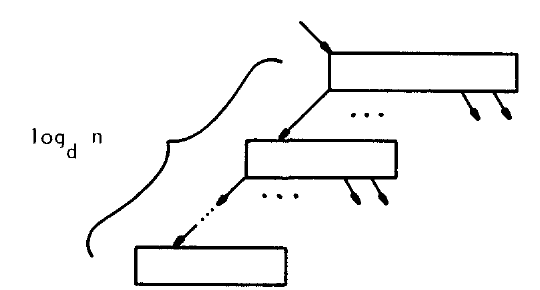

**图 12.** 最小键位于 B 树的最左叶, 到达它需要 $\log_d n$ 次访问。

如何改善 `next` 的代价? 下一节将在 B+ 树主题下回答这个问题以及其他问题。

## 3. B 树变体

与大多数文件组织一样, B 树也有很多变体。Bayer 与 McCreight [BAYE72] 在原始论文中就提出多种实现选择。例如, 删除引起下溢时, 除非无法从邻居得到足够键, 可只通过相邻节点重分配而不合并。相同策略也可用于上溢, 延迟分裂并消除相应开销: 节点一满时不立即分裂, 而是把键分给相邻节点, 只有两个邻居都满时才分裂。

另一些变体着眼于次要代价。Clampett [CLAM64] 考虑节点从二级存储取回后的处理代价, 建议用二分搜索而非线性查找来定位正确的后代指针。Knuth [KNUT73] 指出, 节点大时二分搜索可能合适, 节点小时顺序搜索可能更好。节点内部搜索不必限于这两种方式, [KNUT73] 中许多技术都可使用。Maruyama 与 Smith [MARU77] 特别提到一种称为平方根搜索的外推技术。

Ghosh 与 Senko [GHOS69] 在一般性文件索引构造研究中, 考虑使用插值搜索来省掉一次二级存储访问。其分析可推广到 B 树, 并表明去掉紧邻叶之上的某些索引层可能划算。搜索会以若干候选叶结束, 再根据键值和文件中的键分布“估计”正确叶。估计错误时再顺序搜索。尽管某些估计会失败, 平均而言仍可能有收益。

Knuth [KNUT73] 还提出各深度使用不同“阶”的 B 树。动机之一是叶节点中的指针浪费空间, 应予消除; 根通常远未填满, 采用不同形状也合理。不过与收益相比, 这种实现的维护代价似乎很高, 尤其是二级存储便宜且很适合固定长度节点。

### B* 树

B 树文献中被误用最频繁的术语也许是 B* 树。[^3] Knuth [KNUT73] 的严格定义是: B* 树是一种每节点至少三分之二满, 而非仅半满的 B 树。B* 树插入采用局部重分配, 把分裂推迟到两个兄弟节点都满。随后把这两个节点分成三个, 每个节点三分之二满。该方案只需适度调整维护算法, 就能保证至少 66% 的存储利用率。提高存储利用率还有加快搜索的附带效果, 因为所得树高度更小。

B* 树一词经常又被用于 Knuth 提出的另一种很流行的 B 树变体, 参见 [KNUT73]、[WEDE74]、[BAYE77]。为免混淆, 本文把 Knuth 未命名的实现称为 B+ 树。

### B+ 树

B+ 树的全部键都位于叶中。按 B 树组织的上层仅构成索引, 像路线图一样快速定位索引部分和键部分。图 13 展示两者在逻辑上的分离。索引节点与叶节点自然可以使用不同格式甚至不同大小。叶通常还从左到右链接, 这条叶链表称为顺序集, 它使顺序处理变得容易。

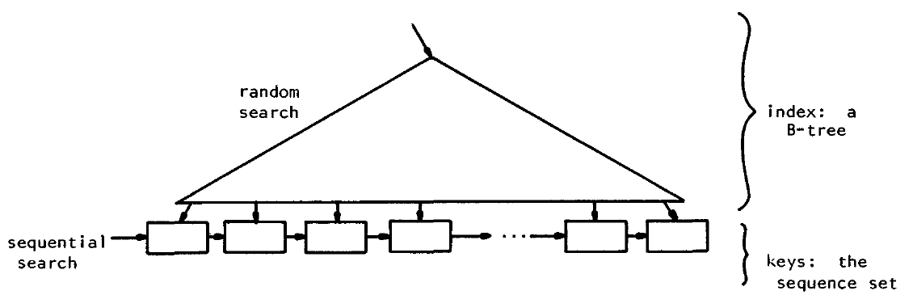

**图 13.** 索引部分和键部分分离的 B+ 树。按键操作像 B 树一样从根开始, 顺序处理从最左叶开始。

要充分理解 B+ 树, 必须认识到索引与顺序集相互独立的含义。一次 `find` 从根开始, 经索引到达叶。因为所有键都在叶中, 搜索途中遇到的分隔值是否为实际键并不重要, 只要所选路径通向正确叶即可。

B+ 树删除时, 允许非键值留在索引中充当分隔值, 可简化处理。待删键必在叶中, 删除本身很简单。只要叶仍至少半满, 索引就不必改变, 即使该键的副本曾向上传播到索引中也是如此。图 14 表明, 已删除键的副本仍能把搜索导向正确叶。当然, 若发生下溢, 重分配或合并可能要求同时调整叶和索引中的值。

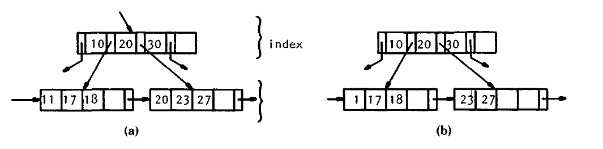

**图 14.** (a) 一棵 B+ 树; (b) 删除键 “20” 后的 B+ 树。即使实际键已删除, “20” 仍可在索引部分充当分隔值。

B+ 树的插入和查找几乎与 B 树相同。叶分裂为二时, 算法不是提升中间键本身, 而是提升该键的副本, 实际键保留在右叶。查找遇到索引中等于查询值的键时不会停止, 而是沿其最近的右指针继续, 一直搜索到叶。

B 树支持低代价的查找、插入和删除, 但一次 `next` 可能需要 $\log_d n$ 次二级存储访问。B+ 树保留按键操作的对数代价, 同时把 `next` 降到至多 1 次访问。顺序处理整个文件时, 每个节点至多访问一次, 主存中只需容纳一个节点。因此, B+ 树很适合既有随机处理又有顺序处理的应用。

### 前缀 B+ 树

B+ 树中索引与顺序集分离在直觉上很有吸引力。索引只是把搜索引到正确叶的路线图, 根本不必包含实际键。键为字符串时, 更有理由不用实际键作为分隔值, 因为它们占用过多空间。

Bayer 与 Unterauer [BAYE77] 考察了前缀 B+ 树。设字母键 “binary”“compiler”“computer”“electronic”“program”“system” 如图 15 分配。位于 “computer” 与 “electronic” 之间的索引分隔值无需等于二者之一, 任何介于两者之间的字符串都可以。例如 “elec”“e” 或 “d” 均可。取回不受影响, 所以应选择最短分隔值节省空间。空间需求减小后, 每节点可容纳更多键, 分支因子增大, 树高下降。更短的树搜索代价更小, 因而短分隔值同时节省空间和访问时间。

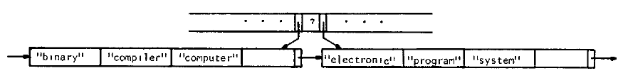

**图 15.** 前缀 B+ 树的一部分。索引项 “e” 足以分隔 “computer” 与 “electronic”。

选择一个键的最短唯一前缀作为分隔值通常效果很好。在上述示例中, 区分 “electronic” 与 “computer” 的最短前缀是 “e”。但前缀技术并非总是有效: 要选择一个区分 “programmers” 与 “programmer” 的最短前缀, 完全不能节省空间。Bayer 与 Unterauer 建议在这类情况下扫描一个小范围的相邻键, 为分隔算法选择较好的一对键。即使这使节点装载不均, 某节点多几个键也不会影响总体代价。

### 虚拟 B 树

许多现代计算机系统采用内存管理方案, 为每个用户提供大型虚拟内存。用户虚拟地址空间被分成页, 页保存在二级存储上, 被引用时自动装入主存。这种请求分页技术在多个用户间复用真实内存, 同时通过保护保证一个用户不会干扰另一个用户的数据。分页由专用硬件处理, 因而二级存储与主存间的传送速度很高。

请求分页硬件启发了一种有趣的 B 树实现。经过仔细分配, B 树的每个节点可映射到虚拟地址空间的一页, 用户于是像树在内存中一样操作它。访问不在主存中的节点, 即页面时, 系统自动把它从二级存储换入。

多数分页算法在腾出空间时选择淘汰最近最少使用的 LRU 页。对 B 树而言, 最活跃的是靠近根的节点, 它们倾向于留在主存。即便不使用分页硬件, Bayer 与 McCreight [BAYE72] 以及 Knuth [KNUT73] 都建议为 B 树使用 LRU 机制。至少根应留在主存, 因为每次搜索都要访问它。

虚拟 B 树有三项优点:

1. 专用硬件高速执行传送。
2. 内存保护机制隔离不同用户。
3. 树中频繁访问的部分会留在主存。

### 压缩

人们还提出若干改善 B 树性能的实现技术。Wagner [WAGN73] 总结了其中多项, 包括压缩键与压缩指针。[^4]

指针可用“基址加位移”的节点地址形式压缩, 而非存储绝对地址。图 16 所示节点只保存一次基址, 每个指针则以相对基址的偏移量或位移代替。重建实际指针值时, 把基址加到相应位移上。虚拟 B 树中的指针地址值很大, 尤其适合这种技术。

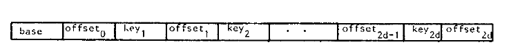

**图 16.** 使用压缩指针的节点。第 $i$ 个指针由基址与第 $i$ 个偏移量相加得到。

键或分隔值也可采用多种消除冗余的标准技术压缩 [RUBI76]。键压缩和指针压缩都能增大节点容量, 从而降低取回代价; 代价是节点读入后需要更多 CPU 时间进行搜索。因此, 复杂压缩算法不一定总有成本效益。还应注意, 键可同时使用前端与后端压缩。例如 Bayer 与 Unterauer [BAYE77] 就考察了前缀 B+ 树的键压缩。

### 变长项

许多应用需要存储变长键, 前述压缩也会产生变长项。McCreight [MCCR77] 研究了含变长项的树, 并说明插入时提升较短键可获得更好的存储利用率和更快的访问速度。

### 二进制 B 树

Bayer [BAYE72a] 提出的二进制 B 树使 B 树适合单级存储。它本质上是阶为 1 的 B 树, 每节点有 1 或 2 个键以及 2 或 3 个指针。为避免只半满的节点浪费空间, 它采用图 17 的链接表示。含 1 个键的节点按图 17(a) 直接表示, 含 2 个键的节点按图 17(b) 链接。一个节点的右指针既可能指向兄弟, 也可能指向后代, 因而还要用一个额外位说明其含义。

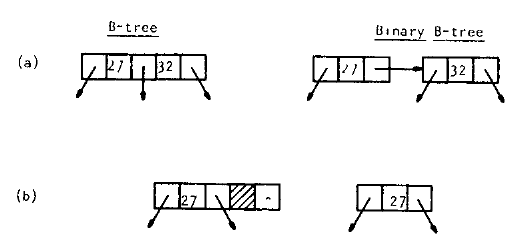

**图 17.** B 树节点及对应的二进制 B 树节点。二进制 B 树表示中的每个右指针可指向兄弟或后代。

分析表明, 插入、删除与查找仍只需 $\log n$ 步, 但搜索最右路径所访问的节点数是最左路径的两倍。右指针承担两种用途也使插入和删除更复杂。要保持对数代价, 必须保证不会连续出现两个指向兄弟节点的右链接。[BAYE72a] 与 [WIRT76] 给出了旋转过程的详细算法, 防止出现三个或更多连续兄弟链接。

二进制 B 树还可扩展为左右链接均可指向兄弟节点的形式, 从而获得原表示缺少的对称性。Bayer [BAYE73] 因而称其为对称二进制 B 树, 并指出著名的 AVL 树类 [FOST65] 是它的一个子类。

### 2-3 树与理论结果

Hopcroft 提出 2-3 树并探索它在单级存储中的用途。每个 2-3 树节点有 2 或 3 个子节点, 因为它含 1 或 2 个键。因此 2-3 树就是阶为 1 的 B 树, 反之亦然。小节点使 2-3 树不适合外部存储, 却很适合作为内部数据结构。

Rosenbaum 与 Snyder [ROSE78] 以及 Miller 等人 [MILL77] 研究如何为给定键集构造最优 2-3 树。两项工作分别以比较次数和节点访问次数为代价准则, 都给出从已排序键表在线性时间内构造最优树的算法。[MILL77] 的结果还能推广到任意阶 B 树。

Yao [YAO78] 分析从均匀分布的 $n$ 个键构造的 2-3 树, 给出期望存储利用率的上界和下界。把分析推广到更高阶 B 树后, Yao 证明期望存储利用率为 $\ln 2\simeq69\char"0025{}$。

Guibas 等人 [GUIB77] 考察一种 B 树变体, 用于维护访问概率高度倾斜的键表。维护一组指向感兴趣局部的“手指”, 就能在 $\log_d p$ 时间内更新距某个手指 $p$ 个位置内的项目。例如, 可在列表开头和结尾各放一个手指。活动局部改变时, 把某个手指移到新位置。

Guibas 与 Sedgewick [GUIB78] 提出另一种 B 树方案并比较多种平衡树技术。其重要贡献是表明完全不需要向上分裂。诀窍是在沿树向下时就分裂接近满的节点。下一节将看到, 消除自底向上的更新对性能可能至关重要。相关理论结果还见 [BROW78] 与 [BROW78a]。

## 4. 多用户环境中的 B 树

若 B 树用于通用数据库系统, 就必须允许多个用户请求同时处理。若不施加同步约束, 各进程可能相互干扰。例如一个进程读出节点并沿链接前进时, 另一个进程可能正改变该节点。交互还因访问方向而更复杂: `find` 从上向下, 插入和删除却需要从下向上。Samadi [SAMA76] 给出并发问题的一种解法。Held 与 Stonebraker [HELD78] 指出, 若以一次只允许一个进程访问整棵树的方式解决冲突, B 树在多用户环境中的优势会被削弱。

Bayer 与 Schkolnick [BAYE77a] 证明, 由监督进程执行的一组锁协议可以在允许并发活动的同时保证 B 树访问完整性。一次查找读出节点后锁住它, 使其他进程不能干扰。搜索进入下一深度时, 查找进程释放祖先节点上的锁, 让其他进程读取。因此读者在任何时刻最多锁住两个节点, 其他读进程可以同时探索并锁住树的其他部分。

并发环境中的更新更复杂, 需要更复杂的协议。更新可能影响树的更高层, 所以更新进程在访问的每个节点上留下预留, 保留以后锁住该节点的权利。若更新确定其变化会传播到某个预留节点, 就把预留转成锁; 若不会影响该节点, 就取消预留。预留节点仍可被读取, 因为读者总会继续走到叶; 但在第一项预留取消前, 不可再次预留。

更新进程在从根到某叶的路径上建立预留后, 可自顶向下把预留转换为绝对锁。绝对锁保证其他进程不访问该节点。更新随后只改变自己持有绝对锁的节点。全部改变完成后取消绝对锁, 更新过的路径重新对其他进程开放。

预留从根到叶的完整路径会阻止其他更新访问 B 树, 而多数更新只影响靠近叶的少数层, 所以完整预留并不理想。但预留太少又可能迫使进程从根重新开始。Bayer 与 Schkolnick 因而提出折中两端的广义锁协议。他们给出参数化模型, 说明预留可以提供足以利用现有技术的并发度, 同时只在重新开始预留上浪费很少时间。

相比之下, [GUIB78] 建议的自顶向下分裂不要求更新者再向上返回, 因而只需最简单的协议, 任一时刻只会锁住一对节点。其代价是节点尚未完全填满就分裂, 存储利用率略降, 访问时间相应略增。

### 安全性

多用户环境中的信息保护给数据库设计者带来另一个问题。虚拟 B 树一节指出, 分页的内存保护机制可隔离用户。当文件内容在系统之外也必须受到保护时, 就需要加密。Bayer 与 Metzger [BAYE76] 研究密码方案及可能的安全威胁。他们表明, 除非由硬件实现, 加密代价相对很高。另一方面, 为适应加密文件而修改 B 树维护算法只需很小改动, 特别是在数据传输时能“在线”完成加解密的情况下。

## 5. 使用 B+ 树的通用访问方法

本节以 IBM 基于 B 树的通用访问方法 VSAM 为例说明 B+ 树的应用 [IBM1, IBM2, KEEH74, WAGN73]。VSAM 面向多种应用, 既支持顺序搜索, 又支持对数代价的插入、删除和查找。与传统索引顺序组织相比, B+ 树可动态分配和释放存储, 保证 50% 的存储利用率, 且不需要定期“重组”整个文件。

VSAM 必须同时存储键和关联信息, 因此 VSAM 文件如图 18 表示。树的上面两部分构成前述 B+ 树索引与顺序集, 叶中存放实际数据记录。

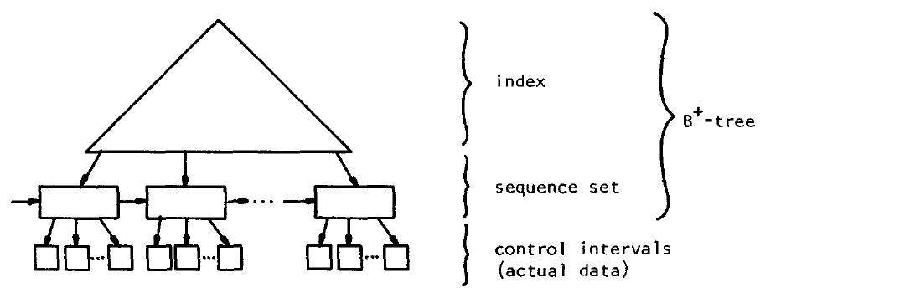

**图 18.** 叶中保存实际数据, 即关联信息的 VSAM 文件。

VSAM 把叶称为控制区间, 它是一次 I/O 传送数据的基本单位。每个控制区间含一条或多条数据记录, 以及描述区间格式的控制信息。图 19 展示控制区间的各字段。

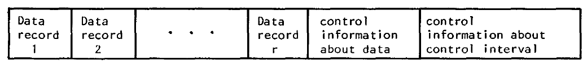

**图 19.** 控制区间格式。控制字段描述控制区间本身及数据字段的格式。

### 性能增强

VSAM 向用户呈现逻辑上与机器无关的数据视图, 但要高效执行事务, 文件组织仍必须适应底层设备。因此控制区间的最大大小受硬件单次可传送最大数据单元的限制。与一个顺序集节点关联的全部控制区间称为控制区, 它们还必须能装入存放该文件的具体磁盘设备的一个柱面。这些约束改善性能, 并使下面的进一步优化成为可能。

顺序集节点的所有后代均分配在一个柱面上, 若把顺序集节点也分配到该柱面, 性能就会改善。取回顺序集节点后, 可不移动磁盘臂而取回控制区中的项目。图 20 展示对这种连续分配的扩展: 顺序集节点可在柱面的一个磁道上复制。复制可降低磁盘寻道和旋转等待时间。

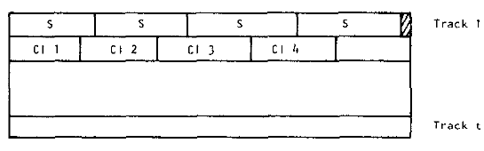

**图 20.** 控制区的格式。顺序集节点 $S$ 在第一条磁道上复制, 以降低延迟时间。

VSAM 还以多种方式提升性能。指针采用前述基址加位移方式压缩; 键同时进行前向的前缀压缩和后向的后缀压缩; 索引记录可以复制; 索引还可分配到独立设备, 使索引和数据能并发访问。最后, VSAM 可让索引部分成为虚拟 B 树, 利用虚拟内存硬件取回索引页。

### 树形文件目录

VSAM 实现中也许最新颖的思想是整个系统采用一种数据格式。例如, 维护系统中全部 VSAM 文件目录的例程, 把信息保存在一个称为主目录的 VSAM 文件中。图 21 所示主目录含每个 VSAM 文件或 VSAM 数据集的一项。所有 VSAM 文件都必须登记到目录中, 因而给定名称后系统可自动定位任何文件。目录本身也是 VSAM 数据集, 所以还含有描述自己的条目。

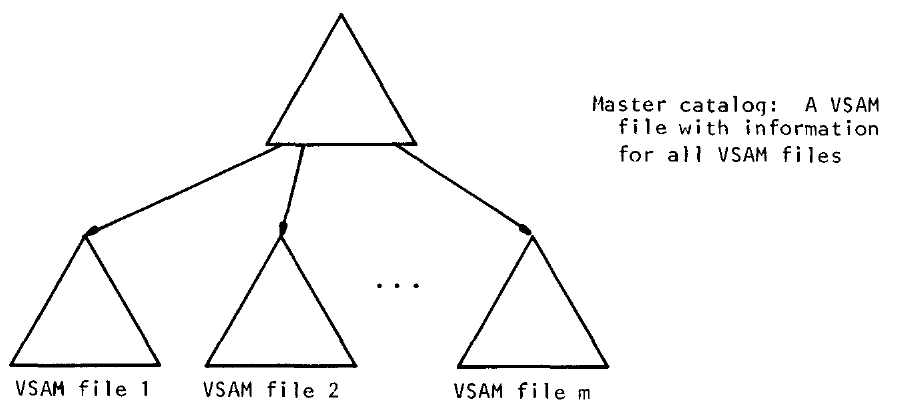

**图 21.** 作为全部 VSAM 文件目录的 VSAM 主目录, 自身也是一个 VSAM 文件。

多个进程同时访问主目录时会发生争用, 除一个进程外其他进程都要等待。为避免争用造成长时间延迟, 每个用户可定义本地目录, 存放自己的 VSAM 文件条目。用户目录也是 VSAM 文件, 必须登记在主目录中。通过搜索主目录定位用户目录后, 再引用该目录所索引的文件便无需搜索主目录。所得多级树形目录方案与 MULTICS 文件系统 [ORGA72] 颇为相似。

### VSAM 的其他设施

上述简短讨论尚未涉及 VSAM 的许多方面, 读者应注意这只是快速概览。例如, 前面讨论的 VSAM 文件称为键顺序文件。另一种条目顺序 VSAM 文件在记录没有键, 即不执行按键操作时, 可高效地顺序处理。条目顺序文件不需要索引, 维护成本更低。

除 VSAM 文件维护和取回过程外, 系统还提供定义和装载 VSAM 文件的机制。用户必须决定怎样在文件内分布空闲空间。若预期有许多插入, 就不应把每个节点装到 100% 满, 否则最初几次插入代价很高; 若文件相对稳定, 只装到 50% 又浪费存储。VSAM 文件定义设施按照用户选择的参数装载文件, 为这一决策提供支持。

最后, VSAM 还提供高效插入大块连续记录、数据保护、文件备份与错误恢复等设施, 它们都是生产环境所必需的。

## 总结

B 树是一种平衡、多路、外部文件组织, 高效、通用、简单且易于维护。其变体 B+ 树在保留查找、插入和删除的良好对数代价的同时, 允许高效顺序处理。B 树方案在文件增长或收缩时分配和释放空间, 并保证 50% 的存储利用率。树的增长与收缩过程恰好互逆, 即使经历大量事务也不需要大规模文件“重组”。

不同实现技术可提高 B 树的性能和通用性, 并使它适用于多用户环境。压缩键与指针, 在二级存储上仔细分配和复制节点, 插入或删除时局部重分配键, 都能提升性能, 使 B 树适合生产环境。锁协议、虚拟内存保护与数据加密则在多用户共享 B 树时提供必要的安全性和互斥。

IBM 的 VSAM 表明, 以 B 树构建通用文件访问方法是合理的。系统不仅存储用户的 B 树文件, 自身也使用 B 树文件登记全部可用 VSAM 文件的名称与位置。VSAM 采用 B+ 树实现高效顺序处理, 并综合使用多种性能增强和数据保护技术。

## 致谢

本文作者感谢审稿人, 尤其感谢他们提供有关 B 树历史的联系信息; 也感谢 IBM 公司在其他竞争者都不愿透露其实现时, 欣然提供基于 B 树的访问方法的详细资料。

## 参考文献

- [AHO74] Aho, A., Hopcroft, J., and Ullman, J. *The Design and Analysis of Computer Algorithms*. Addison-Wesley Publishing Co., Reading, Massachusetts, 1974.
- [AUER76] Auer, R. “Schlüsselkompressionen in B*-Bäumen.” Diplomarbeit, Technische Universität München, 1976.
- [BAYE72] Bayer, R., and McCreight, E. “Organization and maintenance of large ordered indexes.” *Acta Informatica* 1, 3 (1972), 173-189.
- [BAYE72a] Bayer, R. “Binary B-trees for virtual memory.” In *Proceedings of the 1971 ACM SIGFIDET Workshop*, ACM, New York, 219-235.
- [BAYE73] Bayer, R. “Symmetric binary B-trees: data structure and maintenance algorithms.” *Acta Informatica* 1, 4 (1972), 290-306.
- [BAYE76] Bayer, R., and Metzger, J. “On encipherment of search trees and random access files.” *ACM Transactions on Database Systems* 1, 1 (March 1976), 37-52.
- [BAYE77] Bayer, R., and Unterauer, K. “Prefix B-trees.” *ACM Transactions on Database Systems* 2, 1 (March 1977), 11-26.
- [BAYE77a] Bayer, R., and Schkolnick, M. “Concurrency of operations on B-trees.” *Acta Informatica* 9, 1 (1977), 1-21.
- [BERL78] Berliner, H. “The B*-Tree Search Algorithm: A Best-First Proof Procedure.” Technical Report CMU-CA-78-112, Computer Science Department, Carnegie-Mellon University, Pittsburgh, 1978.
- [BROW78] Brown, M. “A storage scheme for height-balanced trees.” *Information Processing Letters* 7, 5 (August 1978), 231-232.
- [BROW78a] Brown, M. “A partial analysis of height-balanced trees.” *SIAM Journal on Computing*, to appear.
- [CLAM64] Clampett, H. “Randomized binary searching with tree structures.” *Communications of the ACM* 7, 3 (March 1964), 163-165.
- [FOST65] Foster, C. “Information storage and retrieval using AVL trees.” In *Proceedings of the ACM 20th National Conference*, ACM, New York, 1965, 192-205.
- [GHOS69] Ghosh, S., and Senko, M. “File organization: on the selection of random access index points for sequential files.” *Journal of the ACM* 16, 4 (October 1969), 569-579.
- [GUIB77] Guibas, L., McCreight, E., Plass, M., and Roberts, J. “A new representation for linear lists.” In *Proceedings of the 9th ACM Symposium on Theory of Computing*, ACM, New York, 1977, 49-60.
- [GUIB78] Guibas, L., and Sedgewick, R. “A dichromatic framework for balanced trees.” In *Proceedings of the 19th Symposium on Foundations of Computer Science*, 1978, 8-21.
- [HELD78] Held, G., and Stonebraker, M. “B-trees reexamined.” *Communications of the ACM* 21, 2 (February 1978), 139-143.
- [HORO76] Horowitz, E., and Sahni, S. *Fundamentals of Data Structures*. Computer Science Press, Woodland Hills, California, 1976.
- [IBM1] *OS/VS Virtual Storage Access Method (VSAM) Planning Guide*. Order No. GC26-3799, IBM, Armonk, New York.
- [IBM2] *OS/VS Virtual Storage Access Method (VSAM) Logic*. Order No. SY26-3841, IBM, Armonk, New York.
- [KARL76] Karlton, P., Fuller, S., Scroggs, R., and Kaehler, E. “Performance of height balanced trees.” *Communications of the ACM* 19, 1 (January 1976), 23-28.
- [KEEH74] Keehn, D., and Lacy, J. “VSAM data set design parameters.” *IBM Systems Journal* 3 (1974), 186-212.
- [KNUT68] Knuth, D. *The Art of Computer Programming, Vol. 1: Fundamental Algorithms*. Addison-Wesley Publishing Co., Reading, Massachusetts, 1968.
- [KNUT73] Knuth, D. *The Art of Computer Programming, Vol. 3: Sorting and Searching*. Addison-Wesley Publishing Co., Reading, Massachusetts, 1973.
- [MARU77] Maruyama, K., and Smith, S. “Analysis of design alternatives for virtual memory indexes.” *Communications of the ACM* 20, 4 (April 1977), 245-254.
- [MAUE75] Maurer, W., and Lewis, T. “Hash table methods.” *Computing Surveys* 7, 1 (March 1975), 5-19.
- [MCCR77] McCreight, E. “Pagination of B*-trees with variable-length records.” *Communications of the ACM* 20, 9 (September 1977), 670-674.
- [MILL77] Miller, R., Pippenger, N., Rosenberg, A., and Snyder, L. *Optimal 2-3 Trees*. IBM Research Report RC 6505, IBM Research Laboratory, Yorktown Heights, New York, 1977.
- [NIEV74] Nievergelt, J. “Binary search trees and file organization.” *Computing Surveys* 6, 3 (September 1973), 195-207.
- [ORGA72] Organick, E. *The Multics System: An Examination of Its Structure*. MIT Press, Cambridge, Massachusetts, 1972.
- [ROSE78] Rosenberg, A., and Snyder, L. “Minimal comparison 2-3 trees.” *SIAM Journal on Computing* 7, 4 (November 1978), 465-480.
- [RUBI76] Rubin, F. “Experiments in text file compression.” *Communications of the ACM* 19, 11 (November 1976), 617-623.
- [SAMA76] Samadi, B. “B-trees in a system with multiple views.” *Information Processing Letters* 5, 4 (October 1976), 107-112.
- [SEVE74] Severance, D. “Identifier search mechanisms: a survey and generalized model.” *Computing Surveys* 6, 3 (September 1974), 175-194.
- [WAGN73] Wagner, R. “Indexing design considerations.” *IBM Systems Journal* 4 (1973), 351-367.
- [WEDE74] Wedekind, H. “On the selection of access paths in a database system.” In J. Klimbie and K. Koffeman, eds., *Data Base Management: Proceedings of the IFIP Working Conference on Data Base Management*. Elsevier/North-Holland, New York, 1974, 385-397.
- [WIRT76] Wirth, N. *Algorithms + Data Structures = Programs*. Prentice-Hall, Englewood Cliffs, New Jersey, 1976.
- [YAO78] Yao, A. “On random 2-3 trees.” *Acta Informatica* 9, 2 (1978), 159-170.

[^1]: 原作者从未解释 “B-tree” 中字母 B 的来源。正如下文所见, balanced、broad 或 bushy 都说得通; 也有人认为 B 代表 Boeing。不过鉴于 Bayer 的贡献, 把 B 树理解为 Bayer 树似乎也很恰当。
[^3]: 一个有趣例子是 “B* tree search algorithm”, 它讨论的是名为 B* 的另一种树搜索算法 [BERL78]。
[^4]: 另见 [AUER76]。
