# WiscKey: Separating Keys from Values in SSD-conscious Storage（中文译文）

## 译者说明

本文依据同目录的 `source.pdf` 翻译。章节、图表、公式、算法、代码与参考文献按原文结构保留。

## 论文信息

**作者：** Lanyue Lu、Thanumalayan Sankaranarayana Pillai、Andrea C. Arpaci-Dusseau、Remzi H. Arpaci-Dusseau

**机构：** University of Wisconsin—Madison

**会议：** 第 14 届 USENIX Conference on File and Storage Technologies（FAST ’16），2016 年 2 月 22–25 日，美国加利福尼亚州圣克拉拉

**出版信息：** ISBN 978-1-931971-28-7；演讲页面：<https://www.usenix.org/conference/fast16/technical-sessions/presentation/lu>

## 摘要

本文提出 WiscKey，一个基于持久 LSM-tree 的 key-value store。它使用面向性能的数据布局，将 key 与 value 分离，以最小化 I/O amplification。WiscKey 的设计高度针对 SSD 优化，同时利用 SSD 的顺序性能和随机性能特征。

我们通过 microbenchmarks 和 YCSB 工作负载展示 WiscKey 的优势。微基准结果显示，在加载数据库时，WiscKey 比 LevelDB 快 2.5 倍到 111 倍；在随机查找时，快 1.6 倍到 14 倍。在六个 YCSB 工作负载中，WiscKey 都快于 LevelDB 和 RocksDB。

## 1. 引言

持久 key-value stores 在许多现代数据密集型应用中发挥关键作用，包括 web indexing [16, 48]、电子商务 [24]、数据去重 [7, 22]、照片存储 [12]、云数据 [32]、社交网络 [9, 25, 51]、在线游戏 [23]、消息系统 [1, 29]、软件仓库 [2] 和广告 [20]。通过支持高效插入、点查和范围查询，key-value stores 成为这些重要应用的基础。

对写密集负载而言，基于 Log-Structured Merge-Tree（LSM-tree）[43] 的 key-value stores 已成为主流。BigTable [16]、LevelDB [48]、Cassandra [33]、HBase [29]、RocksDB [25]、PNUTS [20]、Riak [4] 等系统都建立在 LSM-tree 之上。相对于 B-tree 等其他索引结构，LSM-tree 的主要优势是为写入维持顺序访问模式。B-tree 上的小更新可能涉及许多随机写，因此在 SSD 和 HDD 上都不高效。

LSM-tree 为提供高写入性能，会批量收集 key-value pairs 并顺序写入。随后，为支持高效查找和范围查询，LSM-tree 会在后台持续读取、排序并写回 key-value pairs，从而让 key 和 value 保持有序。这意味着同一份数据在生命周期内会被多次读写；典型 LSM-tree 的 I/O amplification 可达到 50 倍或更高 [39, 54]。

LSM 技术的成功与传统 HDD 密切相关。在 HDD 上，随机 I/O 比顺序 I/O 慢 100 倍以上 [43]，因此执行额外顺序读写来排序 key、换取后续高效查找，是合理权衡。但存储环境正在变化，现代 SSD 正在许多重要场景中取代 HDD。与 HDD 相比，SSD 有三个与 key-value store 设计高度相关的差异：

- 随机性能与顺序性能的差距远小于 HDD；因此，大量顺序 I/O 只是为了减少后续随机 I/O，可能会浪费带宽。
- SSD 内部并行度高，LSM 系统需要仔细设计才能利用这种并行度 [53]。
- SSD 会因反复写入而磨损 [34, 40]；LSM-tree 的高 write amplification 会显著缩短设备寿命。

这些因素叠加会显著影响 SSD 上的 LSM-tree：本文第 4 节的结果显示，吞吐可能降低 90%，写入负载会增加 10 倍以上。仅把 LSM-tree 下层的 HDD 换成 SSD 虽能改善性能，却仍无法充分发挥 SSD 的潜力。

本文提出 WiscKey，一个从 LevelDB 派生的、SSD-conscious 的持久 key-value store。核心思想是 key-value separation [42]：只有 key 保持在 LSM-tree 中排序，value 另存到 value log（vLog）。换言之，WiscKey 将 key 排序与垃圾回收解耦，而 LevelDB 把二者捆绑在一起。这样可避免排序时无谓移动 value，并显著减小 LSM-tree，从而减少查找期间的设备读取并改善缓存效果。WiscKey 保留 LSM-tree 的优秀插入和查找性能，但避免过度 I/O amplification。

key 与 value 分离带来若干挑战和优化机会：

- 范围查询性能可能受影响，因为 value 不再按 key 顺序存放。WiscKey 利用 SSD 丰富的内部并行度解决该问题。
- WiscKey 需要垃圾回收来回收 invalid values 占用的空间。它提出在线、轻量的垃圾回收器，只涉及顺序 I/O，且对前台负载影响很小。
- key-value separation 使 crash consistency 更复杂。WiscKey 利用现代文件系统的一个性质：追加写在崩溃后不会产生垃圾数据 [45]。

我们将 WiscKey 与两种流行的 LSM-tree key-value store——LevelDB [48] 和 RocksDB [25]——进行了比较。对多数工作负载，WiscKey 的性能显著更好。在 LevelDB 自带的 microbenchmark 中，随 key-value pair 大小而异，WiscKey 加载数据库时比 LevelDB 快 2.5–111 倍，随机查找时快 1.6–14 倍。WiscKey 并非在所有情形下都更快：当 value 很小、按随机顺序写入数据集且范围查询很大时，它的表现会差于 LevelDB；但我们指出这种负载并不能反映真实使用场景，也可通过 log reorganization 改善。对更贴近真实场景的 YCSB macrobenchmark [21]，WiscKey 在全部六种工作负载上都快于 LevelDB 和 RocksDB，且趋势与加载和随机查找 microbenchmark 一致。

本文其余部分安排如下：第 2 节介绍背景与动机；第 3 节说明 WiscKey 的设计；第 4 节分析性能；第 5 节回顾相关工作；第 6 节给出结论。

## 2. 背景与动机

本节先介绍 LSM-tree 和 LevelDB，再分析 LevelDB 中的 read/write amplification，最后描述现代存储硬件特征。

### 2.1 Log-Structured Merge-Tree

LSM-tree 是一种持久结构，为高频插入和删除的 key-value store 提供高效索引 [43]。它延迟并批量化数据写入，把它们组织为大块顺序写，以利用硬盘的高顺序带宽。由于硬盘上随机写比顺序写慢近两个数量级，LSM-tree 比需要随机访问的传统 B-tree 有更好的写性能。

LSM-tree 由一组大小指数增长的组件组成，从 `C0` 到 `Ck`。`C0` 是驻留主存的 update-in-place sorted tree，其他组件 `C1` 到 `Ck` 是磁盘上的 append-only B-tree。

插入时，key-value pair 先追加到磁盘顺序 log file 以便崩溃恢复，然后加入按 key 排序的主存 `C0`。`C0` 达到大小限制后，会通过类似 merge sort 的方式与磁盘 `C1` 合并，该过程称为 compaction。新合并的树顺序写到磁盘，替换旧 `C1`。当每个 `Ci` 达到大小限制时，磁盘组件之间也会发生 compaction；compaction 只在相邻层（ $C _ i$ 与 $C _ {i+1}$）之间进行，并可在后台异步执行。

执行查找时，LSM-tree 可能需要搜索多个组件。`C0` 中包含最新数据，随后依次搜索 `C1` 到 `Ck`。因此，为取得一个 key-value pair，LSM-tree 可能需要多次读取。正因为插入和查找都很高效，LSM-tree 最适合写入密集、但查找比率仍然较高的场景 [43]。

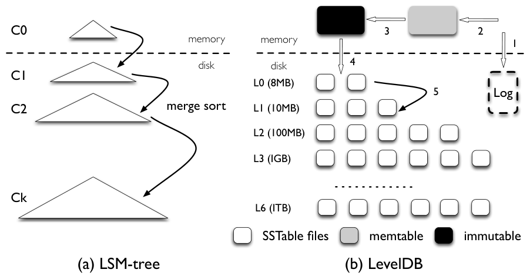

### 2.2 LevelDB

LevelDB 是受 BigTable 启发、基于 LSM-tree 的流行 key-value store [16, 48]，支持范围查询、快照等现代应用需要的特性。其主要数据结构包括：磁盘 log file，两个主存 sorted skiplists（memtable 和 immutable memtable），以及七层磁盘 Sorted String Table（SSTable）文件（`L0` 到 `L6`）。

LevelDB 初始把插入的 key-value pairs 存入 log file 和主存 memtable。memtable 满后，LevelDB 切换到新的 memtable 和 log file 继续处理用户插入。后台 compaction 线程把旧 memtable 转为 immutable memtable，再 flush 到磁盘，生成 `L0` 中新的 SSTable 文件，旧 log file 随后丢弃。

每层文件总大小有限，且随层号按 10 倍增长。例如，`L1` 限制为 10MB，`L2` 限制为 100MB。若某层 `Li` 总大小超过限制，compaction 线程会从 `Li` 选择一个文件，与 `Li+1` 中 key range 重叠的所有文件 merge sort，并生成新的 `Li+1` SSTable 文件。该过程持续到所有层都满足大小限制。除 `L0` 外，同一层中文件 key range 不重叠；`L0` 文件直接从 memtable flush 得到，因此可相互重叠。

查找时，LevelDB 依次搜索 memtable、immutable memtable，再按 `L0` 到 `L6` 搜索磁盘文件。除 `L0` 外，同一层不重叠，因此随机 key 至多每层查一个文件；`L0` 可能需要查多个文件。为避免 `L0` 文件过多导致查找延迟过高，LevelDB 在 `L0` 文件数超过 8 时会放慢前台写入，等待后台 compaction。

### 2.3 Write 和 Read Amplification

write amplification 指写到底层存储设备的数据量与用户请求写入数据量之比；read amplification 类似，指底层读取量与用户请求读取量之比。它们是 LevelDB 等 LSM-tree 的主要问题。

为了获得大多顺序的磁盘访问，LevelDB 会写入超过必要的数据。由于 `Li` 大小限制是 `Li-1` 的 10 倍，将文件从 `Li-1` 合并到 `Li` 时，最坏可能读 `Li` 中最多 10 个文件，并排序后写回。因此跨两层移动文件的 write amplification 最坏可达 10。大数据集中新生成 table file 最终可能从 `L0` 迁移到 `L6`，总 write amplification 可超过 50。

read amplification 有两个来源。第一，查找一个 key-value pair 时，LevelDB 可能需要检查多层。最坏情况下，需要检查 `L0` 的 8 个文件，以及其他 6 层各一个文件，共 14 个文件。第二，在 SSTable 内查找 key-value pair 时，还需读取 index block、bloom-filter blocks 和 data block。以 1KB key-value pair 为例，可能需要读 16KB index block、4KB bloom filter block 和 4KB data block，总计 24KB。若乘以最坏 14 个 SSTable 文件，read amplification 可达 336。

$$
\text{Read amplification} _ {\text{worst}} = 24 \times 14 = 336
$$

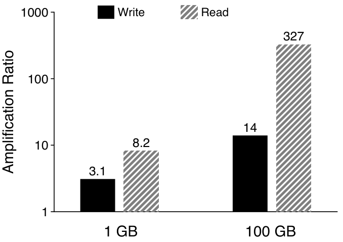

为测量实际 amplification，原文先加载 1KB key-value pairs，再均匀随机查询 100,000 个条目，并比较 1GB 与 100GB 数据库。图 2 显示，数据库从 1GB 增至 100GB 后，write amplification 从 3.1 增至 14，read amplification 从 8.2 增至 327。写放大随数据库增大，是因为数据更可能沿层级继续向下移动；读放大增加，则因为大库无法把所有 SSTable 的 index block 与 bloom filter 都缓存进内存。

这些高 amplification 在 HDD 上是合理权衡。若硬盘 seek latency 为 10ms、吞吐 100MB/s，随机访问 1KB 数据约需 10ms，而下一个顺序块只需约 10 微秒，随机与顺序延迟比约 1000:1。因此，只要顺序写方案的 write amplification 低于 1000，它仍可能快于需要随机写的 B-tree [43, 49]。另一方面，LSM-tree 的 read amplification 仍与 B-tree 相当：例如，高度为 5、block size 为 4KB 的 B-tree 查找一个 1KB key-value pair 需要访问 6 个 block，read amplification 为 24。但 SSD 改变了上述权衡。

### 2.4 快速存储硬件

现代服务器广泛使用 SSD。类似 HDD，SSD 上随机写也可能有害 [10, 31, 34, 40]，因为其 erase-write cycle 和垃圾回收成本高。虽然 SSD 初始随机写性能好，但预留块用完后性能可能显著下降。LSM-tree 避免随机写的特征天然适合 SSD；许多 SSD 优化 key-value stores 都基于 LSM-tree [25, 50, 53, 54]。

但与 HDD 不同，SSD 上随机读相对于顺序读的性能差距小得多；并发随机读还能利用 SSD 内部并行度，在某些负载上达到接近顺序读的聚合吞吐 [17]。我们在 500GB Samsung 840 EVO SSD 上测得：单线程随机读吞吐随请求大小增加而上升；32 线程并发随机读在请求大于 16KB 时可接近顺序吞吐。更高端的 SSD 上，并发随机读与顺序读之间的差距还会更小 [3, 39]。

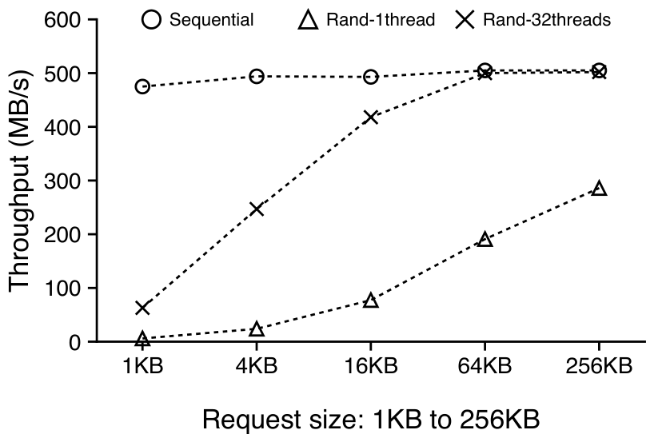

因此，在高性能 SSD 上使用传统 LSM-tree，可能把大量设备带宽浪费在过度读写上。WiscKey 的目标是改进 SSD 上 LSM-tree 的性能，使其更有效利用设备带宽。

## 3. WiscKey

LSM-tree 通过增加 I/O amplification 来维持顺序 I/O 访问。该权衡适合传统硬盘，但不适合 SSD。WiscKey 通过四个关键思想实现 SSD 优化：

- key 与 value 分离，只把 key 保留在 LSM-tree 中，把 value 存入单独 log file。
- 对于分离后无序 value 导致的范围查询随机读，利用 SSD 的并行随机读能力。
- 使用特殊的 crash consistency 和 garbage collection 技术高效管理 value log。
- 通过优化小写入和 LSM-tree log，降低额外开销。

### 3.1 设计目标

WiscKey 是从 LevelDB 派生的单机持久 key-value store。它既可作为关系数据库（例如 MySQL）的存储引擎，也可作为分布式 key-value store（例如 MongoDB）的存储引擎。它提供与 LevelDB 相同的 API，包括 `Put(key, value)`、`Get(key)`、`Delete(key)` 和 `Scan(start, end)`。

WiscKey 的设计目标包括：

- **低 write amplification。** write amplification 会引入不必要写入，消耗 SSD 写带宽并缩短设备寿命。WiscKey 需要尽量降低它。
- **低 read amplification。** read amplification 会降低查找吞吐，并把大量无用数据加载进内存，降低 cache 效率。WiscKey 目标是用较小 read amplification 加速查找。
- **SSD optimized。** WiscKey 的 I/O 模式要匹配 SSD 性能特征，有效利用顺序写和并行随机读。
- **Feature-rich API。** WiscKey 仍要支持让 LSM-tree 流行的现代特性，例如范围查询和快照。
- **现实 key-value 大小。** 现代负载中 key 通常较小，例如 16B [7, 8, 11, 22, 35]；value 大小可从 100B 到 4KB 以上不等 [6, 11, 22, 28, 32, 49]。WiscKey 要在这些现实大小范围内保持高性能。

### 3.2 Key-Value Separation

LSM-tree 的主要性能成本来自 compaction：系统不断排序 SSTable 文件。compaction 会读入多个文件、排序并写回，显著影响前台负载。但排序主要是为了高效检索；对范围查询而言，key 需要有序，value 不一定必须随 key 一起排序。

WiscKey 的关键洞察是：compaction 只需要排序 key，value 可以单独管理 [42]。由于 key 通常远小于 value，只 compact key 可显著减少排序期间的数据量。WiscKey 在 LSM-tree 中只存 key 和 value location，实际 value 以 SSD-friendly 方式存放在其他位置。这样，在相同数据库大小下，WiscKey 的 LSM-tree 明显小于 LevelDB，从而降低现代负载中的 write amplification。

例如，假设 key 为 16B，value 为 1KB，key 在 LSM-tree 中 write amplification 为 10，value amplification 为 1，则 WiscKey 有效 write amplification 为：

$$
\frac{10 \times 16 + 1024}{16 + 1024} = 1.14
$$

除了提升应用写性能，减少写入也有助于延长 SSD 寿命。查找时，系统先在 LSM-tree 中找到 key 和 value address，再从 vLog 读取 value。虽然这增加了一次 value log 访问，但 WiscKey 的 LSM-tree 比同等数据库上的 LevelDB 小得多，查找可能只需搜索更少的 table-file 层级，而且 LSM-tree 的很大一部分可缓存在内存中。因此，每次查找只需一次用于取得 value 的随机读，性能可以优于 LevelDB。例如，key 为 16B、value 为 1KB、整个数据集为 100GB 时，若 value location 和 size 共占 12B，WiscKey 的 LSM-tree 约为 2GB，很容易缓存在拥有 100GB 以上内存的现代服务器中。

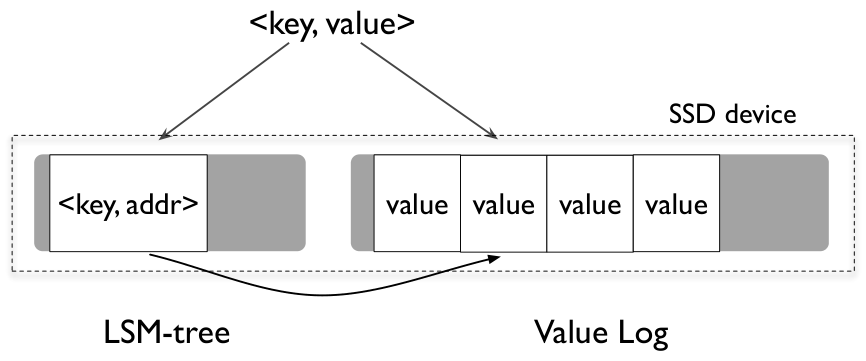

图 4 展示了 WiscKey 架构：key 存在 LSM-tree 中，value 存在独立的 value-log file（vLog）中；LSM-tree 中与 key 一起存放的“value”实际是 vLog 中真实 value 的地址。用户插入 key-value pair 时，WiscKey 先把 value 追加到 vLog，再把 key 和 value address `<vLog-offset, value-size>` 插入 LSM-tree。删除 key 时只从 LSM-tree 删除，不改动 vLog；vLog 中不再有对应 LSM-tree key 的 value 随后由垃圾回收器处理。查询时，WiscKey 先在 LSM-tree 中查找 key 并取得 value address，再从 vLog 读取 value；点查询和范围查询都遵循这一过程。

### 3.3 挑战

key 与 value 分离后，范围查询需要随机 I/O；垃圾回收与崩溃一致性也更复杂。

#### 3.3.1 并行范围查询

范围查询是现代 key-value stores 的重要特性，关系数据库 [26]、本地文件系统 [30, 46, 50] 乃至分布式文件系统 [37] 都把 key-value store 用作存储引擎，因此范围查询是这些环境中的核心 API。LevelDB 提供 iterator 接口，包括 `Seek(key)`、`Next()`、`Prev()`、`Key()` 和 `Value()`。用户先 `Seek()` 到起始 key，再用 `Next()` 或 `Prev()` 逐个搜索 key，并用 `Key()` 或 `Value()` 取得 iterator 当前位置的 key 或 value。

在 LevelDB 中，key 和 value 一起存放并排序，范围查询可顺序读取 SSTable 中的 key-value pairs。WiscKey 中 key 和 value 分离，范围查询需要从 vLog 随机读取 value。单线程随机读无法匹配 SSD 顺序读性能，但并行随机读在请求足够大时可以利用 SSD 内部并行度，达到接近顺序读的吞吐。

WiscKey 在范围查询中对 vLog value 做预取。当前接口返回 iterator；每次用户在 iterator 上调用 `Next()` 或 `Prev()`，WiscKey 跟踪访问模式。一旦检测到连续 key-value 序列，WiscKey 就从 LSM-tree 顺序读取后续多个 key，把对应 value address 放入队列；多个后台线程并发从 vLog 读取这些 address。

#### 3.3.2 垃圾回收

标准 LSM-tree key-value stores 在 key-value pair 被删除或覆盖时，不会立即回收空闲空间，而是在 compaction 中发现 deleted/overwritten 数据时移除。WiscKey 的 value 存在 vLog 中，compaction 不再移动 value，因此必须有单独垃圾回收。

一个简单但代价过高的方案是扫描整个 LSM-tree，收集所有仍有效的 value address，再把 vLog 中没有引用的位置视为垃圾。这需要全库扫描，只适合离线维护。为了在线回收，WiscKey 在 vLog 中把 key 与 value 一起存成 `(key size, value size, key, value)`，使垃圾回收器只需处理尾部一个有限 chunk，并可用 key 查询当前索引。

WiscKey 在 vLog 中维护 head 和 tail。所有新写入追加到 head；垃圾回收线程从 tail 开始顺序扫描一段 vLog，检查其中每个 value 是否仍有效。判断方式是读取该 value 对应 key，在 LSM-tree 中查当前 value address 是否仍指向这个位置。有效 value 被重新追加到 vLog head，并在 LSM-tree 中更新地址；无效 value 被丢弃。随后 tail 前移，旧空间可回收。

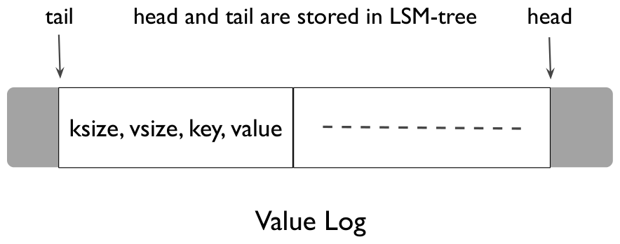

为避免垃圾回收期间崩溃丢数据，WiscKey 先把有效 value 追加到 vLog 并对 vLog 调用 `fsync()`，然后把这些新 value address 和当前 tail 同步写入 LSM-tree。tail 以形如 `<"tail", tail-vLog-offset>` 的条目存储。最后才回收 vLog 空间。垃圾回收可周期触发、阈值触发，也可离线运行。

WiscKey 可配置为周期性启动垃圾回收，也可在触发后持续运行到达到特定阈值；垃圾回收还可在维护时离线运行。对于删除很少的工作负载以及存储空间充分 overprovisioned 的环境，可以很少触发垃圾回收。

#### 3.3.3 崩溃一致性

传统 LSM-tree 通常保证插入 key-value pair 的原子性和按插入顺序恢复。WiscKey 把 value 独立存放后看似更复杂，但它利用现代文件系统的性质：对文件追加一段字节后，如果崩溃，恢复后的文件只会包含原内容加上追加字节的某个前缀，不会包含随机字节或非前缀子集 [45]。因此，如果 vLog 中某个 value X 在崩溃中丢失，那么 X 之后追加的所有 value 也会丢失。

$$
\langle b_1 b_2 b_3 \ldots b_n \rangle
\xrightarrow{\text{append } \langle b _ {n+1} b _ {n+2} \ldots b _ {n+m}\rangle}
\langle b_1 b_2 b_3 \ldots b_n b _ {n+1} b _ {n+2} \ldots b _ {n+x}\rangle,\quad \exists x \lt m
$$

查询 key-value pair 时，如果 key 在 LSM-tree 中找不到，WiscKey 与传统 LSM-tree 行为相同：即使 value 在崩溃前写入过 vLog，也会在之后垃圾回收。若 key 能在 LSM-tree 中找到，WiscKey 还会验证 value address 是否落在 vLog 当前有效范围内，并验证读出的 value 是否对应查询 key。如果验证失败，WiscKey 假定 value 在崩溃中丢失，从 LSM-tree 删除该 key，并告知用户 key not found。每个 vLog value 的 header 包含对应 key，因此验证 key 与 value 是否匹配很直接；必要时也可在 header 中加入 magic number 或 checksum。

LSM-tree 实现还会在用户明确请求 synchronous insert 时保证 key-value pair 在崩溃后的持久性。WiscKey 在对 LSM-tree 执行同步插入之前先 flush vLog，以此实现同步插入。

### 3.4 优化

#### 3.4.1 Value-log Write Buffer

每次 `Put()` 都需要通过 `write()` 系统调用把 value 追加到 vLog。对插入密集型负载，大量小写会在文件系统中产生显著开销，在快速存储设备上尤其如此 [15, 44]。图 6 给出了在 ext4（Linux 3.14）上顺序写入 10GB 文件、最后执行一次 `fsync()` 的总耗时；小写入的每次系统调用开销会大量累积，写入单位大于 4KB 后才能充分利用设备吞吐。

为降低开销，WiscKey 把 value 缓存在 userspace buffer 中，只在 buffer 大小超过阈值或用户请求 synchronous insertion 时 flush。因此，它只发出大块写入并减少 `write()` 系统调用次数。lookup 时，WiscKey 先搜索 vLog buffer，若未找到才真正读取 vLog。显然，崩溃时 buffer 中的数据可能丢失；其 crash-consistency guarantee 与 LevelDB 相同。

#### 3.4.2 优化 LSM-tree Log

传统 LSM-tree 使用 log file 记录插入 key-value pairs，以便同步插入后崩溃可恢复。在 WiscKey 中，LSM-tree 只存 key 和 value address，而 vLog 也为垃圾回收记录了插入 key。因此，LSM-tree log 写入可以去掉而不影响正确性。

如果 key 尚未持久化进 LSM-tree 前发生崩溃，可以通过扫描 vLog 恢复。但朴素算法需要扫描整个 vLog。为只扫描很小一段 vLog，WiscKey 周期性把 vLog head 以 `<"head", head-vLog-offset>` 写入 LSM-tree。数据库打开时，WiscKey 从 LSM-tree 中最近的 head 位置开始扫描 vLog，直到 vLog 末尾。由于 head 存在 LSM-tree 中，而 LSM-tree 保证按插入顺序恢复 key，这个优化保持崩溃一致性。移除 WiscKey 的 LSM-tree log 是安全优化，尤其在许多小插入场景下提升性能。

### 3.5 实现

WiscKey 基于 LevelDB 1.18 实现。创建新数据库时，WiscKey 创建 vLog，并在 LSM-tree 中管理 key 和 value address。vLog 被不同组件以不同访问模式访问：lookup 随机读取 vLog，垃圾回收器从 tail 顺序读取并向 head 追加。实现使用 `posix_fadvise()` 预先声明不同场景下 vLog 的访问模式。

范围查询使用包含 32 个线程的后台线程池。这些线程在 thread-safe queue 上等待新的 value address。预取触发时，WiscKey 把固定数量的 value address 放入 worker queue，唤醒线程并行读取 value；读取结果由 buffer cache 自动缓存。

为高效回收 vLog 空间，WiscKey 使用现代文件系统的 hole punching 功能（`fallocate()`）。punch hole 可以释放文件中已分配的物理空间，让 WiscKey 弹性使用存储空间。现代文件系统最大文件大小足够大，例如 ext4 为 64TB、xfs 为 8EB、btrfs 为 16EB；如果需要，vLog 也可改造为 circular log。

## 4. 评估

本节通过实验说明 WiscKey 各项设计选择的收益。所有实验都运行在一台测试机上：两颗 Intel Xeon E5-2667 v2 @ 3.30GHz 处理器、64GB 内存、64-bit Linux 3.14 和 ext4 文件系统。存储设备是 500GB Samsung 840 EVO SSD，最大顺序读性能为 500MB/s，最大顺序写性能为 400MB/s；其随机读性能见图 3。

### 4.1 微基准

我们使用 `db_bench`（LevelDB 的默认 microbenchmark）评估 LevelDB 与 WiscKey。实验始终使用 16B key，并改变 value 大小；为便于理解和分析性能，关闭数据压缩。

#### 4.1.1 加载性能

顺序加载和随机加载 microbenchmark 都构造 100GB 数据库：前者按顺序插入 key，后者按均匀分布的随机顺序插入 key。顺序加载不会在 LevelDB 或 WiscKey 中触发 compaction，而随机加载会触发。

图 7 给出了不同 value 大小下 LevelDB 与 WiscKey 的顺序加载吞吐。两个系统的吞吐都随 value 增大而提高，但即使 value 达到实验中的最大值 256KB，LevelDB 吞吐仍远低于设备带宽。为进一步分析，图 8 把 LevelDB 每次实验的时间分解为写 log file、插入 memtable，以及等待 memtable flush 到设备等部分。对较小的 key-value pair，写 log file 因图 6 所示的小写开销而占据最大比例；对较大的 pair，log 写入和 memtable 排序效率提高，memtable flush 成为瓶颈。WiscKey 不写 LSM-tree log，并对 vLog append 做缓冲，因此 value 超过 4KB 后可达到全部设备带宽；即使 value 很小也比 LevelDB 快 3 倍。

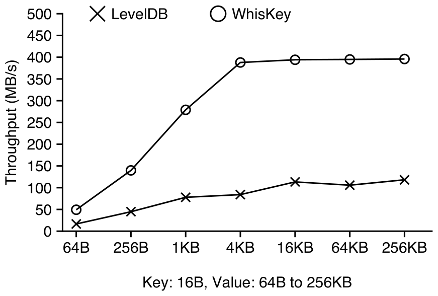

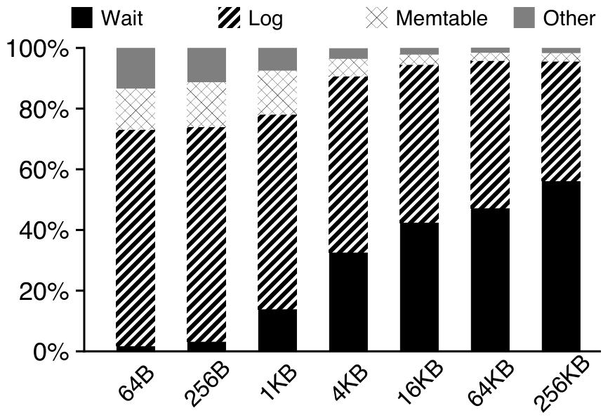

图 9 给出了随机加载吞吐。LevelDB 吞吐仅从 2MB/s（64B value）变化到 4.1MB/s（256KB value）；WiscKey 吞吐随 value 增大，并在 value 超过 4KB 后达到设备写入峰值。对 1KB 和 4KB value，WiscKey 的吞吐分别是 LevelDB 的 46 倍和 111 倍。LevelDB 吞吐低，是因为 compaction 消耗大量设备带宽，同时为了避免第 2.2 节所述的 `L0` 过载而减慢前台写入；WiscKey 的 compaction 开销很小，因而可有效利用全部设备带宽。

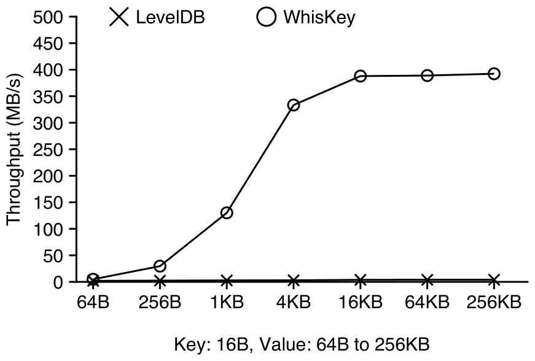

图 10 进一步给出两个系统的 write amplification。LevelDB 的 write amplification 始终大于 12；WiscKey 的值则迅速下降，在 value 达到 1KB 时接近 1，原因是 WiscKey 的 LSM-tree 显著更小。

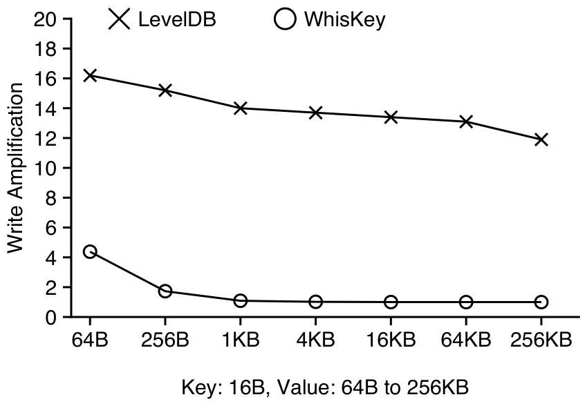

#### 4.1.2 查询性能

我们接下来比较 LevelDB 与 WiscKey 的随机查找（point query）和范围查询性能。图 11 是在 100GB 随机加载数据库上执行 100,000 次随机查找的结果。尽管 WiscKey 的随机查找需要同时检查 LSM-tree 和 vLog，其吞吐仍远高于 LevelDB：value 为 1KB 时约为 LevelDB 的 12 倍。value 较大时，WiscKey 吞吐只受设备随机读吞吐限制；LevelDB 则因第 2.3 节所述的高 read amplification 而吞吐很低。WiscKey 的 read amplification 因 LSM-tree 更小而较低，并且 compaction 强度更小、避免了大量后台读写。

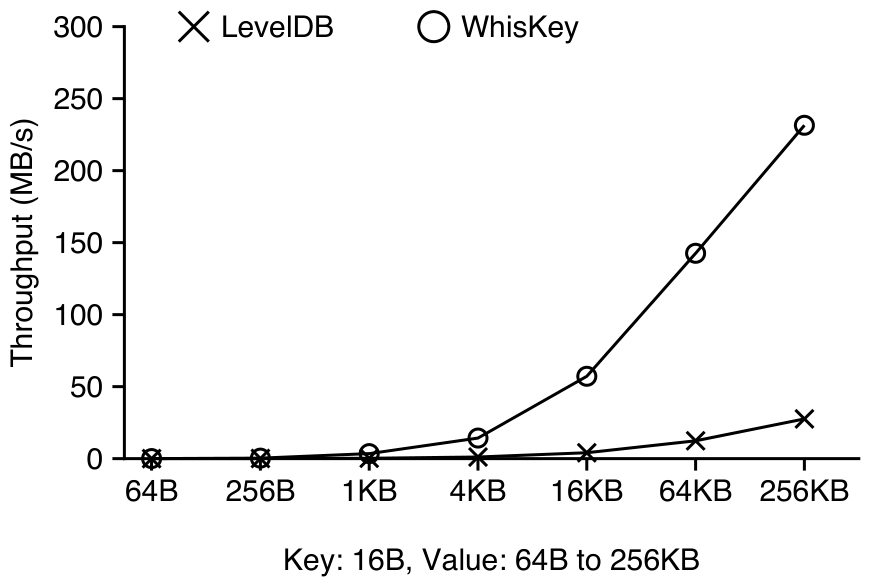

图 12 给出了从 100GB 数据库扫描 4GB 数据的范围查询性能。对随机加载数据库，LevelDB 要读取不同层中的多个文件；WiscKey 则需要随机访问 vLog，但会利用并行随机读。随着 value 增大，两个系统的吞吐起初都会提高；超过 4KB 后，一个 SSTable file 只能容纳少量 key-value pair，打开大量 SSTable file 并读取其中 index block 和 bloom filter 的开销开始主导 LevelDB。较大的 key-value pair 上，WiscKey 可达到设备顺序带宽，最高约为 LevelDB 的 8.4 倍。对于 64B key-value pair，WiscKey 因设备对小请求的并行随机读吞吐有限而比 LevelDB 慢 12 倍；这是数据库随机写入且 vLog 中数据无序的最坏情形。在并行随机读吞吐更高的高端 SSD 上，WiscKey 的相对表现会更好 [3]。

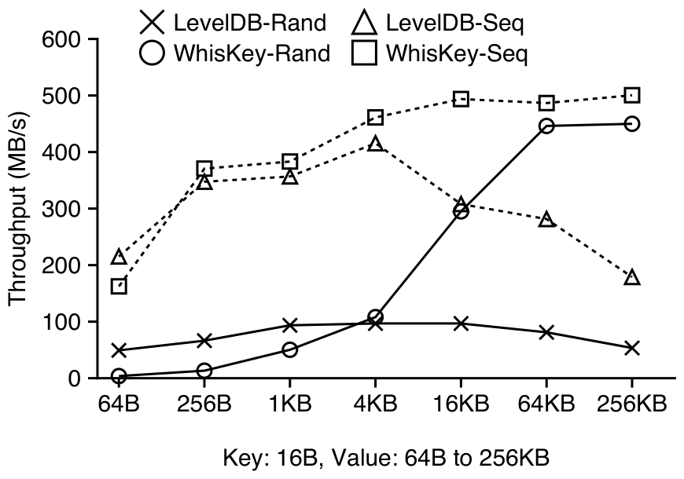

图 12 还给出了数据有序（即数据库顺序加载）时的范围查询性能；此时 LevelDB 与 WiscKey 都能顺序扫描。其趋势与随机加载数据库相同：64B pair 时，WiscKey 同时从 vLog 读取 key 和 value、浪费部分带宽，因此慢 25%；较大 pair 时，WiscKey 快 2.8 倍。由此可见，对于小 key-value pair，重新组织（排序）随机加载数据库中的 log，可使 WiscKey 的范围查询性能与 LevelDB 相当。

#### 4.1.3 垃圾回收

我们研究后台垃圾回收期间 WiscKey 的性能。空闲空间比例会影响垃圾回收线程的写入量和释放空间量，因此实验先用 random-load 创建数据库，接着删除所需比例的 key-value pair，最后再次运行 random-load，并在后台执行垃圾回收、测量前台吞吐。key-value 大小为 4KB，空闲空间比例从 25% 变化到 100%。

若垃圾回收器读到的数据 100% 无效，吞吐只降低 10%，因为它从 vLog tail 读取数据、只把有效 key-value pair 写回 head，而此时不需要写回任何 pair。其他空闲比例下吞吐下降约 35%，因为垃圾回收线程会执行额外写入。所有情形下，即使垃圾回收正在运行，WiscKey 仍至少比 LevelDB 快 70 倍。

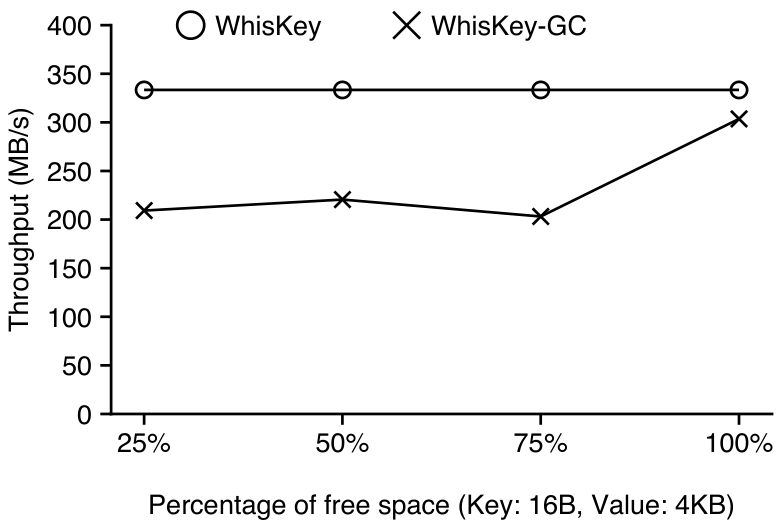

#### 4.1.4 崩溃一致性

我们先用 ALICE crash-consistency testing tool [45] 检查包含同步与异步 `Put()` 的测试，在 ext4、xfs 和 btrfs 上模拟了 3000 多个高概率暴露问题的选择性崩溃点，没有发现 WiscKey 新引入的一致性漏洞。

LevelDB 的最坏恢复时间通常出现在 memtable 即将写盘前，因为 log file 处于最大大小。WiscKey 恢复时先从 LSM-tree 取 head pointer，再从该 head 扫描 vLog 到末尾。因为 memtable 写盘时 head pointer 被持久化，WiscKey 的最坏恢复时间也对应 crash 恰好发生在这之前。实验中，1KB value 下 LevelDB 恢复约需 0.7 秒，WiscKey 约需 2.6 秒。若有需要，WiscKey 可更频繁持久化 head pointer。

#### 4.1.5 Space Amplification

以往评估 key-value store 的工作大多只关注 read 和 write amplification；但 flash device 的单位容量价格高于硬盘，space amplification 同样重要。space amplification 是数据库在磁盘上的实际大小与逻辑大小之比 [5]。例如，一个 1KB key-value pair 若占 4KB 磁盘空间，space amplification 就是 4。压缩会降低 space amplification，garbage、fragmentation 或 metadata 等额外数据会提高它；本实验关闭压缩以简化讨论。

顺序加载负载下，LSM-tree 的额外 metadata 很少，space amplification 可接近 1。随机加载或覆盖负载中，若 invalid pair 不能足够快地被回收，space amplification 通常大于 1。

LevelDB 的空间开销来自负载结束时未被垃圾回收的 invalid key-value pairs。WiscKey 的开销包括 invalid key-value pairs 和额外 metadata（LSM-tree 中的 pointer、vLog 中的 tuple header）。垃圾回收后，当额外 metadata 相对 value 很小时，WiscKey 数据库大小接近逻辑数据大小。

系统无法同时最小化 read amplification、write amplification 和 space amplification。LevelDB 把排序和垃圾回收耦合，牺牲较高 write amplification 换取较低 space amplification，但会显著影响负载性能。WiscKey 解耦排序和垃圾回收，运行时用更多空间换取更低 I/O amplification；垃圾回收可在后台或低负载时执行。

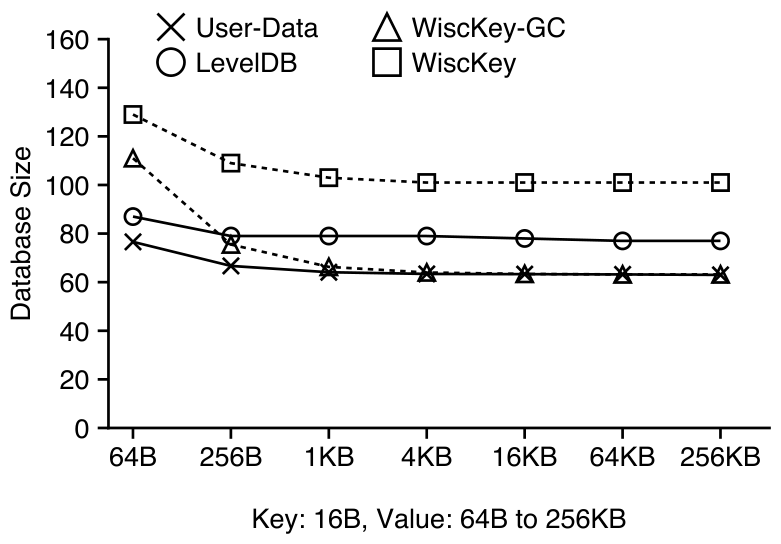

#### 4.1.6 CPU 使用率

我们测量了前述各类工作负载下 LevelDB 与 WiscKey 的 CPU 使用率；表中数字同时包含应用和操作系统开销。顺序加载时 LevelDB CPU 使用率更高：如图 8 所示，LevelDB 要花大量时间把 key-value pair 写入 log file，而编码每个 pair 的日志记录会产生较高 CPU 开销；WiscKey 通过移除该 log file 降低了 CPU 使用率。范围查询时，WiscKey 使用 32 个后台线程预取，CPU 使用率因而远高于 LevelDB。实验环境中，CPU 对 LevelDB 和 WiscKey 都不是瓶颈。LevelDB 采用 single-writer protocol，后台 compaction 也只使用一个线程；RocksDB [25] 探索了面向多核的更好并发设计。

表 1：LevelDB 与 WiscKey 的 CPU 使用率。key 大小为 16B，value 大小为 1KB；Seq Load 与 Rand Load 分别顺序和随机加载 100GB 数据库；Rand Lookup 在随机填充的 100GB 数据库上执行 100K 次随机查找；Range Query 顺序扫描 4GB 数据。

| 系统 | Seq Load | Rand Load | Rand Lookup | Range Query |
| --- | ---: | ---: | ---: | ---: |
| LevelDB | 10.6% | 6.3% | 7.9% | 11.2% |
| WiscKey | 8.2% | 8.9% | 11.3% | 30.1% |

### 4.2 YCSB Benchmarks

YCSB [21] 提供标准六类工作负载，用于评估 key-value stores。我们在 100GB 数据库上比较 LevelDB、RocksDB [25] 和 WiscKey，并额外运行始终开启后台垃圾回收的 WiscKey，以测量最坏情况性能。RocksDB [25] 是 SSD 优化版 LevelDB，包含多个 memtable 和后台 compaction 线程等优化。实验使用 1KB 与 16KB 两种 value 大小，并关闭压缩。

WiscKey 在所有六个 YCSB 工作负载中显著优于 LevelDB 和 RocksDB。加载时，1KB value 下 WiscKey 在通常情况下至少快 50 倍，在始终垃圾回收的最坏情况下至少快 45 倍；16KB value 下即使最坏情况也快 104 倍。

读负载中，YCSB 常用 Zipf 分布使热门项可被缓存并无需磁盘访问，因此 WiscKey 相对 LevelDB/RocksDB 的优势低于加载和纯随机查找。WiscKey 在 Workload-A（50% reads）中的相对优势高于 Workload-B（95% reads）和 Workload-C（100% reads）。即便如此，RocksDB 和 LevelDB 在这些负载中也没有超过 WiscKey。

始终开启垃圾回收的 WiscKey 最坏情况性能仍优于 LevelDB 和 RocksDB。垃圾回收对 1KB 和 16KB value 的影响不同：小 value 时，一个 4MB vLog chunk 包含很多 key-value pairs，验证每个 pair 有效性需要更多 LSM-tree 访问；大 value 时，验证成本较低，回写 cleaned chunk 更激进，对前台吞吐影响更明显。必要时可限速垃圾回收以降低前台影响。

Workload-E 包含多个小范围查询，每个查询取得 1 到 100 个 key-value pair。与此前扫描 4GB 的 microbenchmark 不同，每个范围的第一个 key 都会变成一次随机查找——这是对 WiscKey 有利的情形；因此即使 value 为 1KB，WiscKey 也快于 RocksDB 和 LevelDB。

## 5. 相关工作

已经有多种基于 hash table 的 SSD key-value store。FAWN [8] 把 key-value pair 保存在 SSD 上的 append-only log 中，并用内存 hash-table index 快速查找。FlashStore [22] 与 SkimpyStash [23] 遵循相同设计，但优化内存 hash table：FlashStore 使用 cuckoo hashing 和紧凑 key signature，SkimpyStash 则通过 linear chaining 把一部分 table 移到 SSD。BufferHash [7] 使用多个内存 hash table，并用 bloom filter 选择查找时要访问的 table。SILT [35] 针对内存高度优化，组合 log-structure、hash-table 和 sorted-table 布局。WiscKey 与这些系统一样使用 log-structured 数据布局；但这些系统以 hash table 建索引，因而不支持构建在 LSM-tree store 之上的范围查询、snapshot 等现代特性。WiscKey 面向的是可用于多种场景的 feature-rich key-value store。

许多工作致力于优化原始 LSM-tree key-value store [43]。bLSM [49] 提出新的 merge scheduler，在保持稳定写吞吐的同时限制写延迟，并使用 bloom filter 提升性能。VT-tree [50] 通过一层 indirection，避免在 compaction 时排序任何已经有序的 key-value pair；WiscKey 则直接分离 key 和 value，不论工作负载中的 key distribution 如何，都能显著降低 write amplification。LOCS [53] 向 LSM-tree key-value store 暴露内部 flash channel，使 compaction 可利用丰富的内部并行度。Atlas [32] 是基于 ARM processor 和 erasure coding 的分布式 key-value store，把 key 与 value 存在不同硬盘上；WiscKey 是独立 key-value store，并针对 SSD 高度优化 key-value separation。LSM-trie [54] 用 trie 组织 key，并基于 trie 提出更高效的 compaction，但牺牲了高效范围查询等 LSM-tree 特性。前文介绍的 RocksDB 在根本设计上仍与 LevelDB 相似，因此仍有较高 write amplification；RocksDB 的优化与 WiscKey 设计正交。

Walnut [18] 是一种 hybrid object store：小 object 放在 LSM-tree 中，大 object 直接写文件系统。IndexFS [47] 把 metadata 以 column-style schema 存在 LSM-tree 中，以提高插入吞吐。Purity [19] 也把 index 与 data tuple 分离，只排序 index，并按时间顺序存放 tuple。三个系统都使用了与 WiscKey 相似的技术；WiscKey 以更通用、完整的方式解决这一问题，并在广泛负载上同时优化 SSD 设备的加载和查找性能。

还有一些 key-value store 建立在其他数据结构之上。TokuDB [13, 14] 使用 fractal-tree index，在内部节点中缓冲更新；其 key 没有排序，而且为了获得良好性能，需要在内存中维护一个很大的 index。ForestDB [6] 使用 HB+-trie 高效索引长 key，以改善性能并减少内部节点的空间开销。NVMKV [39] 是 FTL-aware key-value store，使用 sparse addressing、transactional support 等原生 FTL 能力。也有工作提出 vector interface，把多个请求组合为一次操作 [52]。这些系统基于不同数据结构，各自具有不同的性能权衡；WiscKey 的选择是改进广泛使用的 LSM-tree 结构。

Masstree [38]、MemC3 [27]、Memcache [41]、MICA [36] 与 cLSM [28] 等许多技术试图克服内存 key-value store 的可扩展性瓶颈；这些技术也可适配到 WiscKey，以进一步提高性能。

## 6. 结论

key-value store 已成为数据密集型应用的基础构件。本文提出 WiscKey，一种新的基于 LSM-tree 的 key-value store，通过分离 key 与 value 来最小化 write 和 read amplification。WiscKey 的数据布局和 I/O 模式针对 SSD 设备进行了高度优化。实验结果表明，WiscKey 可在多数工作负载上显著提升性能。我们希望 WiscKey 的 key-value separation 以及各项优化技术能够启发下一代高性能 key-value store。

## 致谢

我们感谢匿名审稿人和论文 shepherd Ethan Miller 提供反馈，并感谢 ADSL research group 成员、RocksDB 团队（Facebook）、Yinan Li（Microsoft Research）和 Bin Fan（Tachyon Nexus）在本工作不同阶段提出建议和意见。

本材料获得 NSF grants CNS-1419199、CNS-1421033、CNS-1319405 和 CNS-1218405 的资助，并得到 EMC、Facebook、Google、Huawei、Microsoft、NetApp、Seagate、Samsung、Veritas 和 VMware 的慷慨捐赠。文中表达的任何观点、发现、结论或建议均属于本文作者，不一定反映 NSF 或其他机构的立场。

## 参考文献

1. Apache HBase. http://hbase.apache.org/, 2007.
2. Redis. http://redis.io/, 2009.
3. Fusion-IO ioDrive2. http://www.fusionio.com/products/iodrive2, 2015.
4. Riak. http://docs.basho.com/riak/, 2015.
5. RocksDB Blog. http://rocksdb.org/blog/, 2015.
6. Jung-Sang Ahn, Chiyoung Seo, Ravi Mayuram, Rahim Yaseen, Jin-Soo Kim, and Seungryoul Maeng. ForestDB: A Fast Key-Value Storage System for Variable-Length String Keys. IEEE Transactions on Computers, Preprint, May 2015.
7. Ashok Anand, Chitra Muthukrishnan, Steven Kappes, Aditya Akella, and Suman Nath. Cheap and Large CAMs for High-performance Data-intensive Networked Systems. In Proceedings of the 7th Symposium on Networked Systems Design and Implementation (NSDI '10), San Jose, California, April 2010.
8. David Andersen, Jason Franklin, Michael Kaminsky, Amar Phanishayee, Lawrence Tan, and Vijay Vasudevan. FAWN: A Fast Array of Wimpy Nodes. In Proceedings of the 22nd ACM Symposium on Operating Systems Principles (SOSP '09), Big Sky, Montana, October 2009.
9. Timothy G. Armstrong, Vamsi Ponnekanti, Dhruba Borthakur, and Mark Callaghan. LinkBench: A Database Benchmark Based on the Facebook Social Graph. In Proceedings of the 2013 ACM SIGMOD International Conference on Management of Data (SIGMOD '13), New York, New York, June 2013.
10. Remzi H. Arpaci-Dusseau and Andrea C. Arpaci-Dusseau. Operating Systems: Three Easy Pieces. Arpaci-Dusseau Books, 0.9 edition, 2014.
11. Berk Atikoglu, Yuehai Xu, Eitan Frachtenberg, Song Jiang, and Mike Paleczny. Workload Analysis of a Large-Scale Key-Value Store. In Proceedings of the USENIX Annual Technical Conference (USENIX '15), Santa Clara, California, July 2015.
12. Doug Beaver, Sanjeev Kumar, Harry C. Li, Jason Sobel, and Peter Vajgel. Finding a needle in Haystack: Facebook's photo storage. In Proceedings of the 9th Symposium on Operating Systems Design and Implementation (OSDI '10), Vancouver, Canada, December 2010.
13. Michael A. Bender, Martin Farach-Colton, Jeremy T. Fineman, Yonatan Fogel, Bradley Kuszmaul, and Jelani Nelson. Cache-Oblivious Streaming B-trees. In Proceedings of the Nineteenth ACM Symposium on Parallelism in Algorithms and Architectures (SPAA '07), San Diego, California, June 2007.
14. Adam L. Buchsbaum, Michael Goldwasser, Suresh Venkatasubramanian, and Jeffery R. Westbrook. On External Memory Graph Traversal. In Proceedings of the Eleventh Annual ACM-SIAM Symposium on Discrete Algorithms (SODA '00), San Francisco, California, January 2000.
15. Adrian M. Caulfield, Arup De, Joel Coburn, Todor I. Mollow, Rajesh K. Gupta, and Steven Swanson. Moneta: A High-Performance Storage Array Architecture for Next-Generation, Non-volatile Memories. In Proceedings of the 43nd Annual IEEE/ACM International Symposium on Microarchitecture (MICRO '10), Atlanta, Georgia, December 2010.
16. Fay Chang, Jeffrey Dean, Sanjay Ghemawat, Wilson C. Hsieh, Deborah A. Wallach, Michael Burrows, Tushar Chandra, Andrew Fikes, and Robert Gruber. Bigtable: A Distributed Storage System for Structured Data. In Proceedings of the 7th Symposium on Operating Systems Design and Implementation (OSDI '06), pages 205-218, Seattle, Washington, November 2006.
17. Feng Chen, Rubao Lee, and Xiaodong Zhang. Essential Roles of Exploiting Internal Parallelism of Flash Memory Based Solid State Drives in High-speed Data Processing. In Proceedings of the 17th International Symposium on High Performance Computer Architecture (HPCA-11), San Antonio, Texas, February 2011.
18. Jianjun Chen, Chris Douglas, Michi Mutsuzaki, Patrick Quaid, Raghu Ramakrishnan, Sriram Rao, and Russell Sears. Walnut: A Unified Cloud Object Store. In Proceedings of the 2012 ACM SIGMOD International Conference on Management of Data (SIGMOD '12), Scottsdale, Arizona, May 2012.
19. John Colgrove, John D. Davis, John Hayes, Ethan L. Miller, Cary Sandvig, Russell Sears, Ari Tamches, Neil Vachharajani, and Feng Wang. Purity: Building Fast, Highly-Available Enterprise Flash Storage from Commodity Components. In Proceedings of the 2015 ACM SIGMOD International Conference on Management of Data (SIGMOD '15), Melbourne, Australia, May 2015.
20. Brian F. Cooper, Raghu Ramakrishnan, Utkarsh Srivastava, Adam Silberstein, Philip Bohannon, Hans-Arno Jacobsen, Nick Puz, Daniel Weaver, and Ramana Yerneni. PNUTS: Yahoo!'s Hosted Data Serving Platform. In Proceedings of the VLDB Endowment (PVLDB 2008), Auckland, New Zealand, August 2008.
21. Brian F. Cooper, Adam Silberstein, Erwin Tam, Raghu Ramakrishnan, and Russell Sears. Benchmarking Cloud Serving Systems with YCSB. In Proceedings of the ACM Symposium on Cloud Computing (SOCC '10), Indianapolis, Indiana, June 2010.
22. Biplob Debnath, Sudipta Sengupta, and Jin Li. FlashStore: High Throughput Persistent Key-Value Store. In Proceedings of the 36th International Conference on Very Large Databases (VLDB 2010), Singapore, September 2010.
23. Biplob Debnath, Sudipta Sengupta, and Jin Li. SkimpyStash: RAM Space Skimpy Key-value Store on Flash-based Storage. In Proceedings of the 2011 ACM SIGMOD International Conference on Management of Data (SIGMOD '11), Athens, Greece, June 2011.
24. Guiseppe DeCandia, Deniz Hastorun, Madan Jampani, Gunavardhan Kakulapati, Avinash Lakshman, Alex Pilchin, Swami Sivasubramanian, Peter Vosshall, and Werner Vogels. Dynamo: Amazon's Highly Available Key-Value Store. In Proceedings of the 21st ACM Symposium on Operating Systems Principles (SOSP '07), Stevenson, Washington, October 2007.
25. Facebook. RocksDB. http://rocksdb.org/, 2013.
26. Facebook. RocksDB 2015 H2 Roadmap. http://rocksdb.org/blog/2015/rocksdb-2015-h2-roadmap/, 2015.
27. Bin Fan, David G. Andersen, and Michael Kaminsky. MemC3: Compact and Concurrent MemCache with Dumber Caching and Smarter Hashing. In Proceedings of the 10th Symposium on Networked Systems Design and Implementation (NSDI '13), Lombard, Illinois, April 2013.
28. Guy Golan-Gueta, Edward Bortnikov, Eshcar Hillel, and Idit Keidar. Scaling Concurrent Log-Structured Data Stores. In Proceedings of the EuroSys Conference (EuroSys '15), Bordeaux, France, April 2015.
29. Tyler Harter, Dhruba Borthakur, Siying Dong, Amitanand Aiyer, Liyin Tang, Andrea C. Arpaci-Dusseau, and Remzi H. Arpaci-Dusseau. Analysis of HDFS Under HBase: A Facebook Messages Case Study. In Proceedings of the 12th USENIX Symposium on File and Storage Technologies (FAST '14), Santa Clara, California, February 2014.
30. William Jannen, Jun Yuan, Yang Zhan, Amogh Akshintala, John Esmet, Yizheng Jiao, Ankur Mittal, Prashant Pandey, Phaneendra Reddy, Leif Walsh, Michael Bender, Martin Farach-Colton, Rob Johnson, Bradley C. Kuszmaul, and Donald E. Porter. BetrFS: A Right-Optimized Write-Optimized File System. In Proceedings of the 13th USENIX Symposium on File and Storage Technologies (FAST '15), Santa Clara, California, February 2015.
31. Hyojun Kim, Nitin Agrawal, and Cristian Ungureanu. Revisiting Storage for Smartphones. In Proceedings of the 10th USENIX Symposium on File and Storage Technologies (FAST '12), San Jose, California, February 2012.
32. Chunbo Lai, Song Jiang, Liqiong Yang, Shiding Lin, Guangyu Sun, Zhenyu Hou, Can Cui, and Jason Cong. Atlas: Baidu's Key-value Storage System for Cloud Data. In Proceedings of the 31st International Conference on Massive Storage Systems and Technology (MSST '15), Santa Clara, California, May 2015.
33. Avinash Lakshman and Prashant Malik. Cassandra - A Decentralized Structured Storage System. In The 3rd ACM SIGOPS International Workshop on Large Scale Distributed Systems and Middleware, Big Sky Resort, Montana, Oct 2009.
34. Changman Lee, Dongho Sim, Jooyoung Hwang, and Sangyeun Cho. F2FS: A New File System for Flash Storage. In Proceedings of the 13th USENIX Symposium on File and Storage Technologies (FAST '15), Santa Clara, California, February 2015.
35. Hyeontaek Lim, Bin Fan, David G. Andersen, and Michael Kaminsky. SILT: A Memory-efficient, High-performance Key-value Store. In Proceedings of the 23rd ACM Symposium on Operating Systems Principles (SOSP '11), Cascais, Portugal, October 2011.
36. Hyeontaek Lim, Dongsu Han, David G. Andersen, and Michael Kaminsky. MICA: A Holistic Approach to Fast In-Memory Key-Value Storage. In Proceedings of the 11th Symposium on Networked Systems Design and Implementation (NSDI '14), Seattle, Washington, April 2014.
37. Haohui Mai and Jing Zhao. Scaling HDFS to Manage Billions of Files with Key Value Stores. In The 8th Annual Hadoop Summit, San Jose, California, Jun 2015.
38. Yandong Mao, Eddie Kohler, and Robert Morris. Cache Craftiness for Fast Multicore Key-Value Storage. In Proceedings of the EuroSys Conference (EuroSys '12), Bern, Switzerland, April 2012.
39. Leonardo Marmol, Swaminathan Sundararaman, Nisha Talagala, and Raju Rangaswami. NVMKV: A Scalable, Lightweight, FTL-aware Key-Value Store. In Proceedings of the USENIX Annual Technical Conference (USENIX '15), Santa Clara, California, July 2015.
40. Changwoo Min, Kangnyeon Kim, Hyunjin Cho, Sang-Won Lee, and Young Ik Eom. SFS: Random Write Considered Harmful in Solid State Drives. In Proceedings of the 10th USENIX Symposium on File and Storage Technologies (FAST '12), San Jose, California, February 2012.
41. Rajesh Nishtala, Hans Fugal, Steven Grimm, Marc Kwiatkowski, Herman Lee, Harry C. Li, Ryan McElroy, Mike Paleczny, Daniel Peek, Paul Saab, David Stafford, Tony Tung, and Venkateshwaran Venkataramani. Scaling Memcache at Facebook. In Proceedings of the 10th Symposium on Networked Systems Design and Implementation (NSDI '13), Lombard, Illinois, April 2013.
42. Chris Nyberg, Tom Barclay, Zarka Cvetanovic, Jim Gray, and Dave Lomet. AlphaSort: A RISC Machine Sort. In Proceedings of the 1994 ACM SIGMOD International Conference on Management of Data (SIGMOD '94), Minneapolis, Minnesota, May 1994.
43. Patrick O'Neil, Edward Cheng, Dieter Gawlick, and Elizabeth O'Neil. The Log-Structured Merge-Tree (LSM-tree). Acta Informatica, 33(4):351-385, 1996.
44. Simon Peter, Jialin Li, Irene Zhang, Dan R. K. Ports, Doug Woos, Arvind Krishnamurthy, and Thomas Anderson. Arrakis: The Operating System is the Control Plane. In Proceedings of the 11th Symposium on Operating Systems Design and Implementation (OSDI '14), Broomfield, Colorado, October 2014.
45. Thanumalayan Sankaranarayana Pillai, Vijay Chidambaram, Ramnatthan Alagappan, Samer Al-Kiswany, Andrea C. Arpaci-Dusseau, and Remzi H. Arpaci-Dusseau. All File Systems Are Not Created Equal: On the Complexity of Crafting Crash-Consistent Applications. In Proceedings of the 11th Symposium on Operating Systems Design and Implementation (OSDI '14), Broomfield, Colorado, October 2014.
46. Kai Ren and Garth Gibson. TABLEFS: Enhancing Metadata Efficiency in the Local File System. In Proceedings of the USENIX Annual Technical Conference (USENIX '13), San Jose, California, June 2013.
47. Kai Ren, Qing Zheng, Swapnil Patil, and Garth Gibson. IndexFS: Scaling File System Metadata Performance with Stateless Caching and Bulk Insertion. In Proceedings of the International Conference for High Performance Computing, Networking, Storage and Analysis (SC '14), New Orleans, Louisiana, November 2014.
48. Sanjay Ghemawat and Jeff Dean. LevelDB. http://code.google.com/p/leveldb, 2011.
49. Russell Sears and Raghu Ramakrishnan. bLSM: A General Purpose Log Structured Merge Tree. In Proceedings of the 2012 ACM SIGMOD International Conference on Management of Data (SIGMOD '12), Scottsdale, Arizona, May 2012.
50. Pradeep Shetty, Richard Spillane, Ravikant Malpani, Binesh Andrews, Justin Seyster, and Erez Zadok. Building Workload-Independent Storage with VT-Trees. In Proceedings of the 11th USENIX Symposium on File and Storage Technologies (FAST '13), San Jose, California, February 2013.
51. Roshan Sumbaly, Jay Kreps, Lei Gao, Alex Feinberg, Chinmay Soman, and Sam Shah. Serving Large-scale Batch Computed Data with Project Voldemort. In Proceedings of the 10th USENIX Symposium on File and Storage Technologies (FAST '12), San Jose, California, February 2012.
52. Vijay Vasudevan, Michael Kaminsky, and David G. Andersen. Using Vector Interfaces to Deliver Millions of IOPS from a Networked Key-value Storage Server. In Proceedings of the ACM Symposium on Cloud Computing (SOCC '12), San Jose, California, October 2012.
53. Peng Wang, Guangyu Sun, Song Jiang, Jian Ouyang, Shiding Lin, Chen Zhang, and Jason Cong. An Efficient Design and Implementation of LSM-Tree based Key-Value Store on Open-Channel SSD. In Proceedings of the EuroSys Conference (EuroSys '14), Amsterdam, Netherlands, April 2014.
54. Xingbo Wu, Yuehai Xu, Zili Shao, and Song Jiang. LSM-trie: An LSM-tree-based Ultra-Large Key-Value Store for Small Data. In Proceedings of the USENIX Annual Technical Conference (USENIX '15), Santa Clara, California, July 2015.
