# X-Engine: An Optimized Storage Engine for Large-scale E-commerce Transaction Processing（中文译文）

## 译者说明

本文依据同目录的 `source.pdf` 翻译。章节、图表、公式、算法、代码与参考文献按原文结构保留。

Gui Huang、Xuntao Cheng、Jianying Wang、Yujie Wang、Dengcheng He、Tieying Zhang、Feifei Li、Sheng Wang、Wei Cao、Qiang Li<br>
Alibaba Group<br>
{qushan,xuntao.cxt,beilou.wjy,zhencheng.wyj,dengcheng.hedc,tieying.zhang,lifeifei,sh.wang,mingsong.cw,junyu}@alibaba-inc.com

SIGMOD ’19，2019 年 6 月 30 日至 7 月 5 日，荷兰阿姆斯特丹。<br>
ACM ISBN 978-1-4503-5643-5/19/06。<br>
DOI：https://doi.org/10.1145/3299869.3314041

## 摘要

阿里巴巴运营着全球最大的电子商务平台，服务超过 6 亿消费者；2018 财年的商品交易总额（gross merchandise value，GMV）超过 7,680 亿美元。在线电子商务事务有三个显著特征：（1）大型促销活动启动时，每秒事务数会急剧上升；（2）大量热点记录很容易压垮系统缓冲区；（3）由于不同品类的促销会在不同的短时间段开放，各条记录的“温度”（热、温、冷）会迅速改变。例如，在 2018 年天猫“双十一全球狂欢节”开始时，阿里巴巴的 OLTP 数据库集群经历了 122 倍的事务增长，最高每秒处理 491,000 笔销售事务，折合每秒超过 7,000 万次数据库事务。

为应对这些挑战，本文介绍 X-Engine：阿里巴巴为 POLARDB 构建的一种写优化存储引擎。X-Engine 采用基于日志结构合并树（log-structured merge tree，LSM-tree）的分层存储架构，利用 FPGA 加速合并（compaction）等硬件加速能力，并实现事务异步写、多阶段流水线以及合并期间的增量缓存替换等一系列优化。评估结果表明，在这类事务工作负载下，X-Engine 的性能优于其他存储引擎。

**CCS 概念：** 信息系统 → 数据访问方法；DBMS 引擎架构；数据库事务处理。

**关键词：** OLTP 数据库、存储引擎、电子商务事务。

## 1. 引言

阿里巴巴运营着全球规模最大、最繁忙的电子商务平台。该平台包括消费者对消费者零售市场淘宝、企业对企业市场天猫及其他在线市场，服务超过 6 亿活跃消费者，2018 财年 GMV 超过 7,680 亿美元。这些在线购物市场创造了新的购物和销售方式。例如，与受物理条件限制的线下实体店相比，数字市场里的在线商店不受这类限制，因此一场在线促销活动一开始就能迅速把影响扩展到全球消费者。

电子商务事务处理是在线购物市场的支柱。我们发现，这类事务有三个主要特征：（1）大型销售和促销活动开始时，每秒事务数急剧增加；（2）大量热点记录很容易压垮系统缓冲区；（3）不同品类的促销在短时间内分时开放，使不同记录的“温度”（热、温、冷）快速迁移。下面分别详细说明。

在 2018 年 11 月 11 日的“双十一全球狂欢节”期间，阿里巴巴数据库集群最高每秒处理 491,000 笔销售事务，折合每秒超过 7,000 万次数据库事务。为了经受这种考验，我们引入了新的 OLTP 存储引擎 X-Engine，因为事务处理性能在很大程度上最终取决于存储层能否高效地持久化和取回数据。

**电子商务工作负载的核心挑战。** 我们首先识别出三个关键技术挑战。

### 海啸问题

阿里巴巴的电子商务平台经常需要在精心选择、全球消费者广泛期待的日期，面向整个市场举办促销活动。例如，“双十一全球狂欢节”每年 11 月 11 日举行，天猫几乎所有商家的大型促销都在午夜准时开始。尽管许多促销会持续全天，但其中一些大幅优惠只在有限时间内有效，或仅提供有限数量的商品并采取先到先得方式。因此，从 11 月 11 日 00:00:00 起，底层存储引擎承受的事务负载会猛烈增长；把每秒事务数随时间绘图，会看到一个巨大的垂直尖峰，就像海啸冲击海岸。

图 1 绘制了 2018 年“双十一”期间一个运行 X-Engine 的在线数据库集群的事务响应时间和每秒事务数（TPS）；其中 TPS 以 11 月 11 日午夜前一天的平均 TPS 归一化。午夜后的第一秒，该集群接收到的事务数约为前一秒的 122 倍。借助 X-Engine，系统仍成功维持了稳定的响应时间，平均仅 0.42 ms。

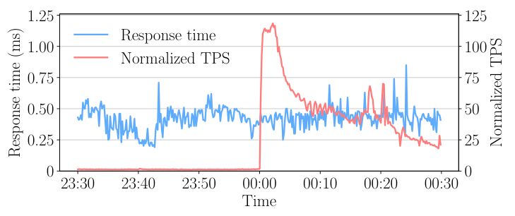

为接住图 1 所示的 122 倍尖峰，阿里巴巴的 OLTP 数据库采用无共享（shared-nothing）架构，通过分片把事务分散到大量数据库实例，并在尖峰到来之前扩容实例数量。这种方法虽然可行，但由于所需实例数量极其庞大，会产生显著的资金和工程成本。本文从提升 OLTP 数据库核心组件——存储引擎——的单机能力入手：在给定尖峰和吞吐目标下减少所需实例数，或者在成本固定时提高可达到的吞吐。

### 泄洪问题

在处理高度并发的电子商务事务时，存储引擎必须能够迅速把数据从主存移向持久化存储，也就是把主存里积聚的洪水排出去。在线促销会制造电子商务事务的高峰期；与平时相比，这些事务包含更多写操作，例如下单、更新库存和付款。近年主存容量虽在持续增长，但相较“双十一”期间大量事务要插入或更新的记录总量仍然相形见绌。因此，我们必须利用由 RAM、SSD 和 HDD 构成的存储层次。

X-Engine 采用分层存储布局来利用这一层次：依据数据温度（即访问频率）把数据放在不同层，还可以在某些层采用 NVM 等新型存储技术。这就像让奔涌的洪水逐级通过容量越来越大的水库泄流。

LSM-tree 天然适合分层存储。除 LSM-tree 外，常见写加速技术还包括日志型数据结构上的仅追加方法 [27, 34]、优化的树结构 [3, 18]，以及两者的混合形式 [31]。我们发现，任何一种方法单独使用都不足以服务这类电子商务事务：有些方法假设采用列式存储，不适合写密集事务；另一些方法通过牺牲点查询和范围查询性能来改善写性能，也不适合读写混合的电子商务负载。LSM-tree 包含驻留内存的组件，可采用仅追加方式实现快速插入；其驻留磁盘的组件由多个包含式层级构成树形结构，每一层都显著大于相邻的上一层 [15, 16, 27]。这种数据结构与分层存储非常契合，有利于同时处理海啸问题和泄洪问题。

### 快速洋流问题

对于多数数据库工作负载，热点记录通常会在一段稳定时间内表现出很强的空间局部性。但电子商务负载并不总是如此，在“双十一”之类的大型促销活动中尤其明显。由于运营方会有意把不同品类或不同商品的促销错开投放，记录的空间局部性会随时间快速变化。例如，全天会针对不同品类或品牌举行“秒杀”活动——商品火爆到必须在开售瞬间抢购——以刺激需求，并引导消费者随时间节奏购买不同商品。

这意味着数据库缓存里的热点记录不断变化，任何记录都可能迅速由冷/温变热，或由热变冷/温。若把数据库缓存看作水库、把底层巨型数据库看作海洋，这种现象就像一股在深海中迅速改变方向的洋流。存储引擎必须保证新出现的热点记录能尽快从深水中取出并被有效缓存。

### 本文贡献

本文介绍 X-Engine。X-Engine 是面向 OLTP 数据库、基于 LSM-tree 的存储引擎，旨在解决阿里巴巴电子商务平台遇到的上述挑战。它利用多核处理器的线程级并行性（thread-level parallelism，TLP），让大多数请求在主存中完成；把写操作与事务解耦以实现异步写；并把漫长的写路径分解成多个流水线阶段，从而提高总体吞吐。

为解决泄洪问题，X-Engine 采用分层存储，利用改进的 LSM-tree 结构和优化的合并算法在各层间移动记录，并把合并卸载到 FPGA。为解决快速洋流问题，我们引入以写时复制（copy-on-write）方式更新的多版本元数据索引，无论数据温度如何，都能加速分层存储中的点查询。概括而言，本文贡献如下：

- 识别 OLTP 存储引擎处理电子商务事务时的三个主要挑战，并据此基于 LSM-tree 设计 X-Engine。
- 提出一整套针对上述问题的优化，包括改进的 LSM-tree 数据结构、FPGA 加速合并、事务异步写、多阶段流水线和多版本元数据索引。
- 使用标准基准与电子商务工作负载全面评估 X-Engine。结果显示，在在线促销期间的电子商务负载下，X-Engine 优于 InnoDB 和 RocksDB；X-Engine 也已实际经受“双十一”海啸式流量的考验。

本文余下部分安排如下：第 2 节概述 X-Engine；第 3 节介绍各项优化的详细设计；第 4 节在 MySQL 上与 InnoDB、RocksDB 对比评估设计和优化；第 5 节讨论相关工作；第 6 节总结全文。

## 2. 系统概览

X-Engine 是建立在改进 LSM-tree 之上的分层 OLTP 存储引擎。如第 1 节所述，电子商务事务负载中的数据温度不断变化，因此我们希望把记录分别放入不同存储层，为热、温、冷记录提供针对性服务。这样，X-Engine 就能依据记录温度——近期时间窗口内被访问的频率——专门设计数据结构和访问方法。

此外，电子商务事务包含大量插入和更新，LSM-tree 因出色的写性能而成为自然选择 [27]。不过，传统 LSM-tree 不足以支撑这种负载，因此 X-Engine 采用一系列优化来解决前述三个问题。X-Engine 可作为 POLARDB 的组成部分部署在 POLARFS 之上 [4]；POLARFS 利用 RDMA、NVMe 等新兴技术实现超低延迟文件系统。

### 存储布局

图 2 展示 X-Engine 架构。X-Engine 把每张表划分为多个子表（sub-table），为每个子表维护一棵 LSM-tree、相关元数据快照（metasnapshot）和索引；每个数据库实例只有一份 redo log。每棵 LSM-tree 都包含驻留主存的热数据层和驻留 NVM/SSD/HDD 的温/冷数据层，后者又分为若干 level。“热”“温”“冷”指数据温度，也就是理想情况下应放在对应层中的数据访问频率。

热数据层包含一个 active memtable、多个 immutable memtable，以及用于缓冲热点记录的 cache；这些 memtable 都是保存近期插入记录的跳表。温/冷数据层按树形结构组织数据，每一层保存一串有序 extent。一个 extent 把多个记录块及其过滤器和索引打包在一起。我们正在探索用机器学习判断合适的数据温度，附录 C 作简要说明，完整细节不在本文范围内。

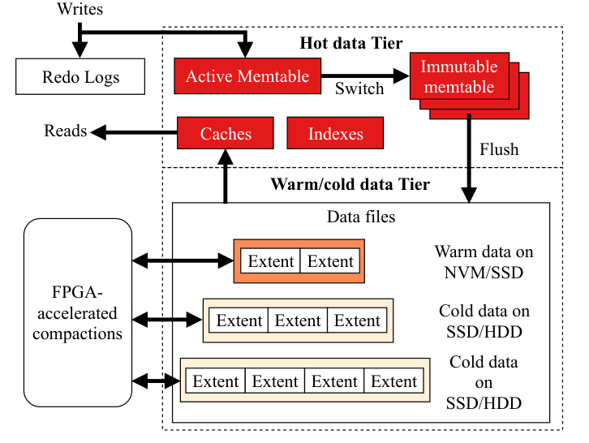

X-Engine 利用 redo log、metasnapshot 和 index 支持事务处理的多版本并发控制（Multi-version Concurrency Control，MVCC）。每个 metasnapshot 都有一份元数据索引，跟踪该快照中树的所有 level、所有 memtable 和所有 extent。相邻的一个或多个 level 组成一个 tier，分别存放在 NVM、SSD 或 HDD 上。

X-Engine 中的表被切分为多个子表，每个子表都有自己的热、温、冷数据层，即自己的 LSM-tree。记录以行式格式保存。为支持 MVCC，X-Engine 使用多版本 memtable 保存同一记录的不同版本，详见第 3.2.1 节；在磁盘上，元数据索引跟踪 extent 中记录的全部版本。第 3.1 节将详细介绍这些数据结构。

### 读路径

读路径是从存储中取回记录的过程。原始 LSM-tree 设计的读性能并不好：一次查找首先搜索 memtable；若未命中，就必须逐层向下遍历。最坏情况下，只有扫描到最大 level 仍找不到后，才能断定目标记录不存在。已有工作使用 manifest 文件定位可能包含查询键的目标 SST [9]，并在每个 SST 内使用 Bloom filter 提前终止查找。

为了给电子商务事务中常见的点查询提供良好响应时间，X-Engine 优化 extent，建立跟踪所有 memtable 和 extent 的元数据索引，并设置多种缓存来加速查找。X-Engine 还在合并中采用增量缓存替换，减少合并引起的不必要缓存驱逐；快照则保证查询读到正确的记录版本。

### 写路径

写路径包括在存储引擎内插入或更新记录的物理访问路径及相关过程。在 LSM-tree KV 存储中，新到达的键值对被追加或插入 active memtable。active memtable 写满后会切换成 immutable memtable 等待刷盘，同时创建新的空 active memtable。为支持高度并发的事务处理，存储引擎既要通过持久存储（例如 SSD）上的日志让新记录持久化，又要高速把记录插入 memtable。

X-Engine 区分写入过程中的长延迟磁盘 I/O 与低延迟主存访问，把它们组织成多阶段流水线，减少每个线程的空闲状态并提高总体吞吐，详见第 3.2.3 节。为获得更高并发度，X-Engine 进一步把写提交与事务处理解耦，并分别优化两者的线程级并行性。

### Flush 与 Compaction

LSM-tree 依靠 flush 和 compaction 把可能挤爆主存的数据从 memtable 合并到磁盘，并让合并后的数据保持有序。immutable memtable 被 flush 到 Level 0；在此过程中，记录会排序并打包为有序字符串表（sorted sequence table，SST）[16]。每个 SST 占据互不重叠的键范围，因此一个 level 可以包含多个 SST。当 Level i 中的 SST 总量达到阈值时，会与 Level i+1 中键范围重叠的 SST 合并。某些系统称这一合并过程为 compaction，因为它还会清除被标记删除的记录。

原始 compaction 算法从两个 level 读取 SST，合并后再把结果写回 LSM-tree。它有几个缺点：消耗大量 CPU 和磁盘 I/O；同一记录会被多次读出和写回，造成写放大；即使被合并记录的值没有变化，也会令其缓存内容失效。

X-Engine 首先优化 immutable memtable 的 flush。对于 compaction，则采用三项技术：用数据复用减少需要合并的 extent 数量；用异步 I/O 让合并计算与磁盘 I/O 重叠；用 FPGA 卸载减少 CPU 消耗。

**表 1：X-Engine 优化汇总。**

| 优化 | 描述 | 对应问题 |
| --- | --- | --- |
| 事务异步写 | 把写提交与事务处理解耦。 | 海啸 |
| 多阶段流水线 | 把写提交分解成多个流水线阶段。 | 海啸 |
| Level 0 快速 flush | 改进 LSM-tree 的 Level 0 以加速 flush。 | 泄洪 |
| 数据复用 | 在 compaction 中复用键范围不重叠的 extent。 | 泄洪 |
| FPGA 加速 compaction | 把 compaction 卸载到 FPGA。 | 泄洪 |
| 优化 extent | 把数据块及相应过滤器、索引打包进 extent。 | 快速洋流 |
| 多版本元数据索引 | 对所有带版本的 extent 和 memtable 建索引以加速查找。 | 快速洋流 |
| Cache | 用多种 cache 缓冲热点记录。 | 快速洋流 |
| 增量缓存替换 | 在 compaction 期间逐步替换缓存数据。 | 快速洋流 |

## 3. 详细设计

本节先阐述 X-Engine 如何处理一个事务，再详细介绍第 2 节所示的关键组件，包括读路径、写路径、flush 和 compaction。

X-Engine 使用 MVCC 和两阶段锁（two-phase locking，2PL）提供快照隔离（snapshot isolation，SI）与读已提交（read committed，RC）隔离级别，并保证事务的 ACID 属性。同一记录的不同版本被存为不同元组，使用自动递增版本 ID。X-Engine 把这些版本中的最大值作为日志序列号（log sequence number，LSN）。每个新事务以其看到的 LSN 作为快照，只读取版本号小于自身 LSN 的版本中最大的那个，并对要写入的每个元组加行锁以避免写冲突。

图 3 概述 X-Engine 的事务处理。该过程分为读/写阶段和提交阶段。事务的所有读请求都在读/写阶段沿读路径访问 LSM-tree；同一阶段里，待插入或更新的记录写入事务缓冲区。随后进入提交阶段：系统把从事务缓冲区向存储写记录的任务分发到多个写任务队列，再由多阶段流水线处理全部任务，包括记录日志以及把记录插入 LSM-tree。

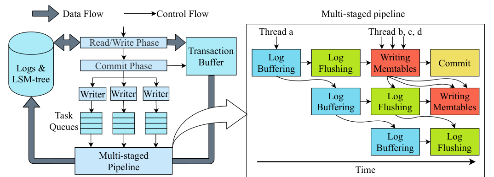

### 3.1 读路径

本节首先介绍 extent、cache 和 index 等数据结构，并说明每种结构如何帮助读路径快速查找。

#### 3.1.1 Extent

图 4 展示 extent 的布局，由 data block、schema data 和 block index 构成。记录以行式形式存入 data block；schema data 跟踪每列的类型；block index 保存每个 data block 的偏移量。在当前生产部署中，X-Engine 把 LSM-tree 所有 level 中的每个 extent 都调为 2 MB。许多电子商务事务以高度偏斜的方式访问记录，2 MB 的 extent 能让更多 extent 在合并时直接复用，详见第 3.3.2 节；这一尺寸也有利于第 3.1.4 节所述的合并期间增量缓存替换。

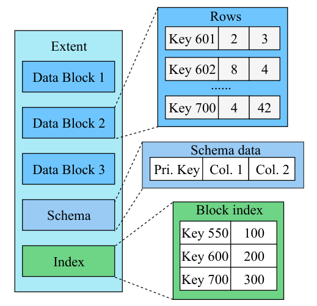

每个 extent 都保存带版本的 schema data，以加速数据定义语言（DDL）操作。向表中添加新列时，只需让带新版本的新 extent 遵循新 schema，无须修改已有 extent。查询读取使用不同 schema 版本的 extent 时，以最新 schema 为准，并为旧 schema 记录中的空属性填入默认值。这种快速 DDL 能力对在线电子商务业务十分重要，因为业务需求经常变化，数据库 schema 也需要随之调整。

#### 3.1.2 Cache

图 5 展示 X-Engine 的数据库缓存。X-Engine 专门针对阿里巴巴电子商务事务中占多数的点查询优化了 row cache。row cache 使用 LRU 替换策略缓存记录，不受记录位于 LSM-tree 哪一层的限制。因此，只要查询访问，即使最大 level 中的记录也能进入缓存。点查询未命中 memtable 后，系统对查询键做哈希并在 row cache 的相应槽位中匹配，故点查询从 row cache 取记录只需 O(1) 时间。若查询随机访问记录，row cache 的效果会较弱。

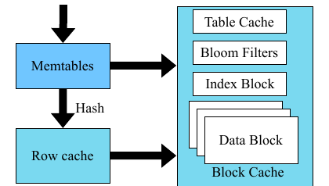

row cache 只保留记录的最新版本，因为时间局部性使它最可能被访问。为此，flush 时会在 row cache 中以新版本替换旧版本，避免 flush 造成额外 cache miss。

block cache 以 data block 为单位缓冲数据，服务未命中 row cache 的请求及范围查询。table cache 保存子表头的元数据信息，并由此定位相应 extent；定位 extent 后，先用 Bloom filter 过滤不匹配的键，再搜索 index block 定位记录，最后从对应 data block 取回记录。

这些缓存对记录温度迁移后的 miss 控制十分重要。由于记录存在空间局部性，新出现的热点记录与 row cache 中已有热点可能来自同一 extent，甚至同一 data block。因此，table cache 和 block cache 能在 row cache miss 后提高总命中率，也可能缩短 row cache 完成替换的延迟。

#### 3.1.3 多版本元数据索引

图 6 展示 X-Engine 的多版本元数据索引。每个子表的 LSM-tree 都有一份关联元数据索引，从代表子表的根节点开始。每次修改索引都会创建新的 metasnapshot；新快照指向所有相关 level 和 memtable，但不修改已有 metasnapshot 的节点，即采用写时复制。

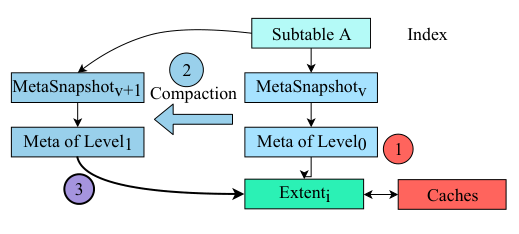

图 6 中，extent i 起初属于 Level 0 且已被缓存（红色）。复用该 extent 的 compaction 完成后，在 MetaSnapshot v 旁创建新的 MetaSnapshot v+1，链接到新合并的 Level 1（深色）。Level 1 的元数据只需指向 extent i，无须在磁盘上实际移动它（紫色），所以 extent i 的全部缓存内容仍然有效。

借助写时复制，事务能够以只读方式访问任意所需版本，数据访问期间无须锁住索引。X-Engine 用垃圾回收删除过期 metasnapshot。RocksDB 等其他存储引擎也探索过类似设计 [14]。

#### 3.1.4 增量缓存替换

LSM-tree 的 compaction 会在磁盘上合并大量 extent，往往成批驱逐缓存内容，降低查询命中率，进而造成明显的性能下降和不稳定响应时间。即使缓存记录的值未发生变化，只要其 extent 与参加 compaction 的其他 extent 键范围重叠，记录也可能在磁盘上被重新摆放。

为解决这个问题，X-Engine 不会把参与 compaction 的所有 extent 一律从缓存驱逐，而是在 block cache 中执行增量替换。compaction 期间，系统检查待合并 extent 的 data block 是否在缓存中；若在，就在原位置用新合并出的 block 替换旧 block，而不是简单驱逐全部旧 block。这样可让部分 block 在 block cache 中保持内容最新且位置不变，从而减少 cache miss。

### 3.2 写路径

本节先优化各子表 LSM-tree 接收新记录的 memtable 结构，再介绍所有子表 LSM-tree 共享的写任务队列和多阶段流水线。

#### 3.2.1 多版本 Memtable

与许多系统相同，X-Engine 用无锁跳表实现 memtable，以获得良好的查找和插入性能 [9]。但当前最先进的跳表 memtable 实现在查询热点记录时存在性能问题：频繁更新一条记录会生成很多版本；若某查询命中热点记录而谓词只关心最新版本，就可能必须扫描许多旧版本才能找到所需元组。电子商务平台的在线促销会放大这类冗余访问，因为大量顾客同时对热点商品下单。

X-Engine 把同一记录的新版本沿竖直方向追加在原节点旁，形成新的链表。图 7 中，蓝色节点保存不同键的记录，黄色节点保存同一记录的多个版本。不同键以跳表组织，而每个键的多个版本放入链表。热点记录持续更新时，其对应链表会增长；新版本通常被新到事务引用，因此靠近唯一键跳表的最底层。图中版本 99 是最新版本。这一设计减少了扫描无关旧版本的开销。

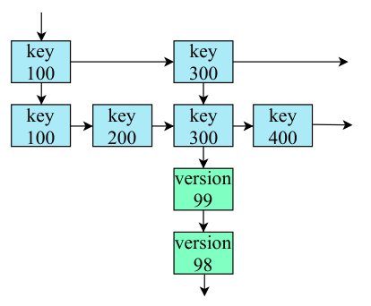

#### 3.2.2 事务异步写

InnoDB 等存储引擎使用的传统“一线程一事务”方法在写效率上有明显缺点：一个用户线程从头到尾执行整个事务。它虽便于同时实现写执行和事务并发控制，而且用户线程本身无须单独写日志，但线程必须等待写日志的高延迟磁盘 I/O 完成。

X-Engine 采用另一种方法，把写提交与对应事务解耦，并把写任务分组批处理。如图 3 所示，系统先把写任务分配到多个无锁写任务队列；随后大多数线程可异步返回，继续处理其他事务，每个队列只留下一个线程参与多阶段流水线中的写任务提交。这样，事务写入变成异步操作；在高度并发负载下，更多线程可用于处理并发事务产生的写任务。

最佳队列数量受机器可用 I/O 带宽以及多个线程争用各无锁队列队首的程度限制。我们在 32 核机器上发现，每个队列 8 个线程就能饱和 I/O 带宽，继续增加线程反而会因争用而降低吞吐。完成解耦后，X-Engine 把同一队列中的写任务分组并批量处理。与单事务提交相比，批量提交能显著提高 I/O 效率和吞吐。下面进一步优化批处理效率。

#### 3.2.3 多阶段流水线

写路径是一串很长的操作序列，交替访问主存和磁盘，计算负载也沿执行过程不断变化，因此很难用计算同时隐藏主存访问和磁盘 I/O。

X-Engine 把写路径分成多个阶段。图 3 右半部分给出四阶段流水线，其中各阶段交替访问主存和磁盘：

1. **日志缓冲（log buffering）。** 线程从事务缓冲区收集每个写请求的预写日志（write-ahead log，WAL），放入驻留主存的 log buffer，并计算相应的 CRC32 检错码。该阶段计算量较大，但只访问主存。
2. **日志刷盘（log flushing）。** 线程把 log buffer 中的日志写入磁盘；日志落盘后，日志文件中的 LSN 向前推进。已经写入日志的任务随后被推到下一阶段。
3. **写 memtable。** 多个线程并行把记录追加到 active memtable；该阶段只访问主存。发生故障后，所有这些写都可由 WAL 恢复。
4. **提交（commit）。** 一个事务的全部任务完成后，由多个线程并行完成最终提交，并释放锁等事务资源。

系统根据各阶段的特征独立调度线程，使阶段吞吐相互匹配，以最大化总吞吐。日志缓冲与 memtable 写访问主存中的不同数据结构，而日志刷盘访问磁盘；让这些阶段重叠可提高主存和磁盘利用率。

X-Engine 还分别限制每个阶段的线程数。前两个阶段数据依赖很强，因此每个阶段只调度一个线程，例如图 3 中的线程 a；后两个阶段则分配多个线程并行处理，例如线程 b、c、d。所有线程都从各阶段拉取任务。前两个阶段采用抢占式拉取，只允许最先到达的线程处理；后续阶段天然易于并行，可由多个线程同时工作。

### 3.3 Flush 与 Compaction

下面介绍如何优化 flush 和 compaction，以组织 X-Engine 分层存储中的记录。

#### 3.3.1 Level 0 中温 extent 的快速 Flush

X-Engine 依靠 flush 避免内存耗尽；事务尖峰到来时，内存耗尽风险尤其显著。每次 flush 把 immutable memtable 转换成 extent，追加到 Level 0，而不与已有记录合并。这样做速度很快，却会留下若干无序 extent，查询必须访问所有 extent 才能找到可能匹配项，相关磁盘 I/O 代价昂贵。

Level 0 的体量可能不到整个存储的 1%，但其中记录只比刚写进 memtable 的记录稍旧。电子商务工作负载具有很强的时间局部性，新查询很可能需要这些记录，因此本文把 Level 0 的 extent 称作温 extent。

X-Engine 引入 Level 0 内部 compaction，主动合并 Level 0 中的温 extent，但不把合并结果推到下一层 Level 1。这既让温记录留在 LSM-tree 的第一层，避免查询必须深入树中取记录，也因为 Level 0 远小于其他 level，只需访问少量 extent，不像深层 compaction 那样大范围合并。因此 Level 0 内部 compaction 的 CPU 和 I/O 开销较轻，可以频繁执行。

#### 3.3.2 加速 Compaction

Compaction 包含昂贵的 merge。X-Engine 使用三项优化：数据复用、异步 I/O 和 FPGA 卸载。

**数据复用。** 在相邻两个 level（Level i 与 Level i+1）之间合并时，X-Engine 尽可能复用 extent 和 data block，以减少 merge 所需 I/O。为增加复用机会并使其有效，extent 大小被缩减为 2 MB，并进一步划分为多个 16 KB data block。若参与 compaction 的某个 extent 的键范围与其他 extent 均不重叠，只需更新相应元数据索引，无须在磁盘上实际移动，就能直接复用。

图 8 给出示例。Level 1 有三个待合并 extent，键范围分别为 [1, 35]、[80, 200] 和 [210, 280]；Level 2 有五个 extent，键范围分别为 [1, 30]、[50, 70]、[100, 130]、[150, 170]、[190, 205]。复用情况如下：

- Level 1 的 extent [210, 280] 和 Level 2 的 extent [50, 70] 均可直接复用。
- Level 1 的 extent [1, 35] 与 Level 2 的 extent [1, 30] 重叠，但前者只有 data block [1, 25] 与后者的 block 重叠，因此 data block [32, 35] 可直接复用。
- Level 1 的 extent [80, 200] 与 Level 2 的多个 extent 重叠；它的第二个 data block 与 Level 2 的三个 extent 重叠。不过该 block 中键分布稀疏，[135, 180] 之间没有键，因此可将其拆成 [106, 135] 和 [180, 200]，分别与 Level 2 的 [100, 130]、[190, 205] 合并，而 extent [150, 170] 则直接复用。

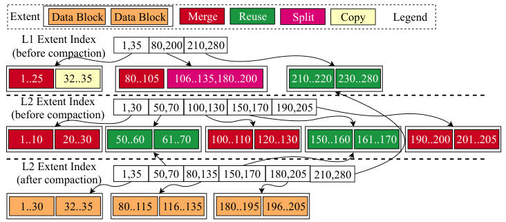

**异步 I/O。** 在 extent 粒度上，一次 compaction 分成三个互不重叠的阶段：（1）从存储读取两个输入 extent；（2）合并；（3）把一个或多个合并后的 extent 写回存储。第一、三阶段是 I/O 阶段，第二阶段计算密集。X-Engine 在第一、三阶段提交异步 I/O 请求，并把第二阶段实现为第一阶段 I/O 的回调函数。多个 compaction 并行时，一个任务的第二阶段可与其他任务的 I/O 阶段重叠，从而隐藏 I/O。

**FPGA 卸载。** X-Engine 用 FPGA 加速 compaction，并减少其 CPU 资源消耗。即使采用前两项优化，在 CPU 上执行 compaction 仍会占用多个线程。由于 compaction 处理来自 LSM-tree 相邻两层、彼此独立的 extent 对，因此在 extent 对粒度上天然易于并行，可拆成许多小任务。X-Engine 把这些小任务卸载到 FPGA，以流式方式处理，再把每个合并后的 extent 传回磁盘。

卸载后，CPU 线程从繁重的 extent merge 中释放出来，可用于处理更多并发事务。基于 FPGA 的 compaction 加速细节超出本文范围，将在其他工作中单独讨论。

#### 3.3.3 Compaction 调度

LSM-tree 依靠 compaction 让记录保持有序，并从存储中清除标记删除的记录。若不及时删除这些失效记录，查找可能必须遍历大量无效数据，显著损害读性能。compaction 也会合并 Level 0 的 sub-level，降低该层查询成本。

X-Engine 采用基于规则的 compaction 调度。按操作层级分为四类：Level 0 内部 compaction（合并 Level 0 内的 sub-level）；minor compaction（合并除最大 level 外的两个相邻 level）；major compaction（合并最大 level 与其上一层）；self-major compaction（在最大 level 内部合并，以减少碎片并清除已删除记录）。当某 level 的总大小或 extent 总数达到预设阈值时触发 compaction；全部任务进入优先级队列。优先级规则可配置，并取决于上层应用对数据库的要求。

以下是为阿里巴巴某在线应用定制的配置示例。该应用删除频繁；当待删除记录数达到阈值时，触发清理 compaction，并赋予最高优先级以免浪费存储空间。其后优先执行 Level 0 内部 compaction，以加速读取 Level 0 中近期插入的记录。剩余三类依次排队，完整顺序为：

1. 清除已删除记录的 compaction；
2. Level 0 内部 compaction；
3. minor compaction；
4. major compaction；
5. self-major compaction。

不同子表、也就是不同 LSM-tree 的 compaction 可并发调度，因为子表间数据独立，天然易于并行。一个子表内同一时刻只执行一个 compaction。尽管同一 LSM-tree 上并发执行多个 compaction 也可避免数据损坏和数据争用，但子表粒度已经提供了足够的并行机会。

## 4. 评估

本节首先评估 X-Engine 处理由不同查询类型混合而成的电子商务 OLTP 负载时的性能，再分别衡量它对海啸、泄洪和快速洋流三项挑战的贡献。图 1 已给出“双十一”期间运行 X-Engine 的 MySQL 数据库的真实生产性能。

### 4.1 实验设置

我们把 X-Engine 与两种常用存储引擎比较：InnoDB [26] 和 RocksDB [15]。InnoDB 是 MySQL 默认存储引擎；RocksDB 从 LevelDB [16] 发展而来，是广泛使用的 LSM-tree 存储引擎。阿里巴巴在许多数据库集群中同时采用 MySQL 5.7 + InnoDB 和 MySQL 5.7 + X-Engine 处理电子商务事务，因此 MySQL 5.7 是自然的评估平台。实验采用 RocksDB 在 2018 年 11 月的最新版本 v5.17.2 [14]，以及 MyRocks（MySQL on RocksDB）[11]。

生产环境通过多个数据库实例分片实现分布式处理，分片细节不是本文重点。实验把每种存储引擎及其 MySQL 实例部署在单节点目标机上。目标机配有两颗 16 核 Intel E5-2682 处理器（总计 64 个硬件线程）、512 GB Samsung DDR4-2133 主存，以及由 3 块 Intel SSD 组成的 RAID；操作系统为 Linux 4.9.79。客户端使用另一台硬件配置相同的机器向目标机发送 SQL 查询。两台机器位于同一数据中心，网络延迟约 0.07 ms；全部测量均包含这段延迟。

除 SysBench、dbbench 等常用基准工具外，我们还使用阿里巴巴开发的压力测试工具 X-Bench，合成由点查询、范围查询、更新和插入混合而成的电子商务负载。在运行在线电子商务业务的数据库管理员和用户帮助下，通过调整四类查询的混合比例，X-Bench 能紧密模拟真实负载；附录 B 给出更多细节。

所有箱线图都以第 25、75 百分位作为箱体边界，以中位数作为箱内黄色横线，以最小值和最大值作为外侧水平边界。

### 4.2 电子商务事务

图 9 展示电子商务负载的性能。首先使用 80% 点查询、11% 范围查询、6% 更新和 3% 插入的混合负载，图中记作 80:11:6:3。这最接近没有在线促销影响时阿里巴巴许多数据库的读密集负载。之后逐渐把读取（点查询与范围查询）的占比降到 42% 和 10%，同时保持更新与插入之间的比例，最终得到 42:10:32:16；该混合与“双十一”在线促销期间观察到的负载非常接近。

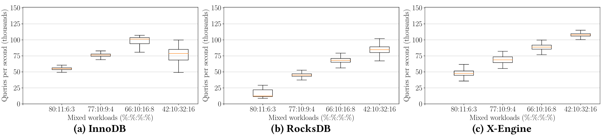

在更偏读的混合负载中，InnoDB 比 RocksDB、X-Engine 更快也更稳定。LSM-tree 系统中的查找若未命中主存里的 memtable 和 cache，就要访问磁盘上的一个或多个 level，拉长响应时间并增加方差。凭借读路径的一系列优化，在这些读密集场景中，X-Engine 只比 InnoDB 慢不到 10%。在代表“双十一”负载的关键 42:10:32:16 场景中，X-Engine 的 QPS 非常稳定，平均分别比 InnoDB 和 RocksDB 高 44% 与 31%。

下面评估帮助 X-Engine 处理含大量写操作的高并发电子商务事务的各项优化。

### 4.3 海啸问题

解决海啸问题意味着提高存储引擎的峰值吞吐。本节使用 dbbench [25] 绕过 MySQL、直接通过键值接口评估存储引擎，再用 SysBench [20] 通过 SQL 接口评估对应 MySQL 实例。KV 接口实验中的每个键值对由 16 字节键与 10 字节值组成；SQL 实验中的每条记录含 12 字节键和 500 字节属性，这些大小在电子商务事务中很常见。InnoDB 不提供 KV 接口，因此不参加 KV 实验。

#### 4.3.1 不经过 MySQL 运行 KV 操作

如图 10 所示，软件线程数逐步增加到 128，以压测两个存储引擎的 KV 接口。put 操作中，X-Engine 的最高吞吐达到 RocksDB 的 23 倍，同时响应时间相当。get 操作中，X-Engine 的吞吐最多为 RocksDB 的 1.68 倍，响应速度最多为 RocksDB 的 1.67 倍。

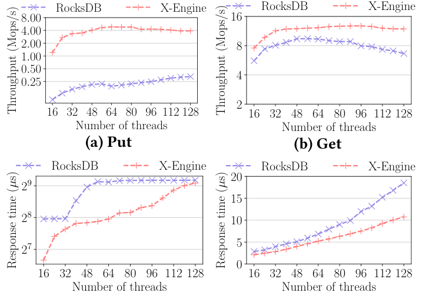

为解释结果，图 11 进一步展示第 3.2.2 节的异步写、写任务队列和多阶段流水线的影响。在同为 8 个写任务队列时，异步写版本的峰值吞吐是同步写版本的 11 倍；把写任务队列从 1 个增加到 8 个，又让 X-Engine 提速 4 倍。只用 1 个任务队列时，流水线里只有一个线程，多阶段流水线实际上被禁用，没有阶段能并行执行。所有硬件线程都投入使用时吞吐最高，说明 X-Engine 能有效利用线程级并行性。

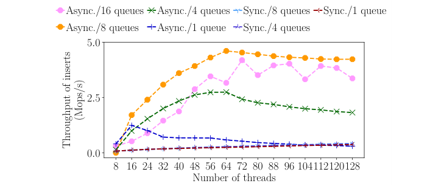

#### 4.3.2 通过 MySQL 运行 SQL 查询

图 12 和图 13 分别给出三个存储引擎经 SQL 接口测得的吞吐和响应时间，连接数从 1 扩展到 512。点查询、插入和更新中，X-Engine 的吞吐分别是第二名的 1.60、4.25 和 2.99 倍。随着连接数增加，X-Engine 的吞吐和响应时间扩展性也明显更好，这是图 11 所示线程级效率改善的结果。

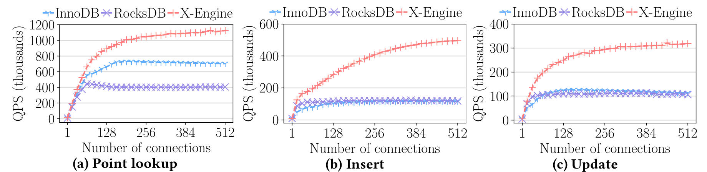

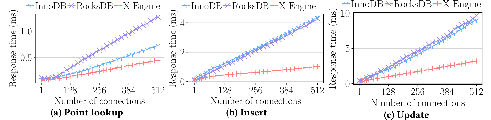

范围查询在阿里巴巴电子商务负载中只占很小比例，但对在线数据库仍不可或缺。图 14 给出扫描记录数从 2 增至 1,024 时三种引擎的范围查询吞吐。X-Engine 和 RocksDB 都比 InnoDB 差，因为 LSM-tree 存储布局对扫描不友好。采用扫描优化是 X-Engine 正在推进的工作。

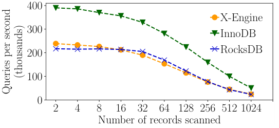

### 4.4 泄洪问题

X-Engine 通过改善 compaction 性能帮助泄洪。图 15 使用 SysBench 的 oltp_insert 比较 compaction 在 CPU 上执行和卸载到 FPGA 时 X-Engine 的吞吐。FPGA 使吞吐提高 27%，并减小方差；附录 A 进一步展示 FPGA 卸载节省的 CPU。

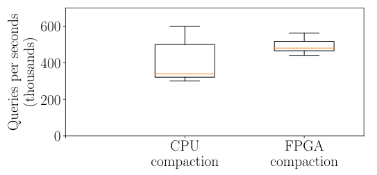

为评估 X-Engine 在 compaction 中复用数据的效率，实验准备两批记录，分别包含 5,000 万条和 5 亿条；所有键均匀随机分布。较小批次中不同键的比例从 70% 调到 99%，其余记录由同一键的不同版本构成。图 16 给出 RocksDB 和 X-Engine 合并这两批记录时的吞吐。当 90% 和 99% 的键互不相同时，X-Engine 分别快 2.99 倍和 19.83 倍。

这些情况下，同一键不同版本记录的分布高度偏斜，与具有强热点的电子商务负载类似。把 extent 和 data block 分别保持在 2 MB、16 KB，可增加可复用 extent 的数量，降低 compaction 开销。

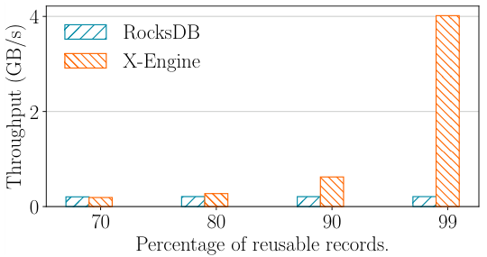

图 17 比较 X-Engine 在处理写比例较高的 42:10:32:16 电子商务负载时，启用和禁用增量缓存替换的 block cache 命中率。该优化显著降低命中率波动，并避免 QPS 偶发骤降约 36%。不过，compaction、flush 等操作仍会周期性驱逐缓存，损害命中率。

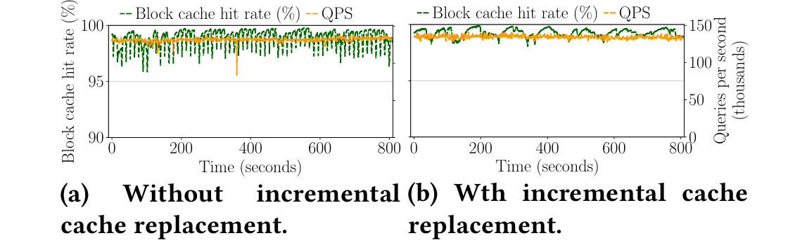

### 4.5 快速洋流问题

快速洋流问题的解决依赖缓存效率：缓存决定系统能以多快速度访问很可能位于磁盘上的冷记录，并将其放入缓存。图 18 根据 Zipf 分布改变点查询访问键的偏斜程度，同时测量 row cache、block cache 命中率和 QPS。

访问均匀随机时，几乎所有访问都未命中 row cache，因为后续查询很难再次访问已缓存记录。访问越偏斜，越多记录成为热点并进入 row cache，从而提高 row cache 命中率。结果表明，row cache 在电子商务负载常见的高度偏斜场景中效果良好；对点查询而言，block cache 的影响相对较小。

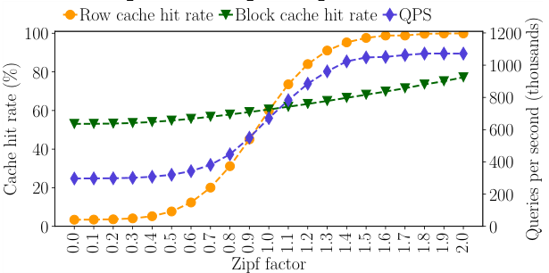

## 5. 相关工作

存储引擎是所有 OLTP 数据库系统的关键组件。Amazon Aurora 存储引擎从 InnoDB 的一个分支发展而来，通过并行和异步写降低写延迟、提高写吞吐 [1, 33]；X-Engine 用多阶段流水线进一步推进这一设计原则。利用日志型结构也是优化写性能的有效途径 [23, 24, 30]。O’Neil 等人提出 LSM-tree [27]，后续大量工作继续改进其设计 [8, 19, 31]。Chandramouli 等人提出一种高度缓存优化的并发哈希索引，结合混合日志以支持快速原地更新 [5]。Dong 等人通过细致研究相关权衡，优化了 RocksDB 的空间放大 [9]。RocksDB 也使用独立的 WAL 写阶段 [13]，并支持 memtable 并发写 [12]。X-Engine 采用 LevelDB 的 memtable 思路 [16]，再以一系列优化实现高并发快速写，并显著降低 LSM-tree 的写放大。

许多研究优化了 LSM-tree 系统中的记录合并。Jagadish 等人把一个 level 划分为多个 sub-level，并在 compaction 时将其一并合入下一层 [17]。Sears 等人让 LSM-tree 各层的合并以稳定方式逐步进行，减轻对读性能的负面影响 [31]。Raju 等人提出只在 guard 内部排序记录，guard 之间则允许无序 [28]。Teng 等人引入 compaction buffer 保存频繁访问的数据，减少 compaction 引发的缓存驱逐 [32]。Ren 等人针对图系统等半有序数据场景重新设计 data block index [29]。Dayan 等人对 tiering 与 leveling compaction 的代价建模，改进更新代价与点查询/空间代价之间的权衡 [8]。X-Engine 通过大范围数据复用避免大量不必要 merge，并提出把 compaction 卸载到 FPGA，实现硬件辅助加速。

为实现高效读操作，研究者还优化了 LSM-tree 中多种数据结构，包括索引 [6, 15, 21, 22]、缓存 [2, 10, 23] 和过滤器 [7]。X-Engine 以分层方式综合使用这些结构，并把索引扩展到所有 extent。

## 6. 结论

本文介绍 X-Engine：为阿里巴巴全球最大电子商务平台优化的 OLTP 存储引擎，该平台服务超过 6 亿活跃消费者。在线电子商务事务带来若干独特挑战，在每年“双十一全球狂欢节”中尤其明显，因为消费者会在很短时间内集中购物。

X-Engine 建立在优化的 LSM-tree 上，利用 FPGA 加速 compaction 等硬件加速能力，并采用事务异步写、多阶段流水线、增量缓存替换和多种缓存。在线促销的电子商务负载中，X-Engine 优于其他存储引擎，并成功服务“双十一”购物节。

当前和未来工作包括：采用共享存储设计，提高无共享分布式事务在分片条件下的可扩展性；应用机器学习预测数据温度，以便在分层存储中智能调度记录放置。

## 致谢

感谢审稿人对本文提出反馈。X-Engine 由阿里巴巴集团工程师团队设计、开发和管理。除本文作者外，感谢 Chang Cai、Shiping Chen、Zhi Kong、Canfang Shang、Dehao Wang、Lujun Wang、Buwen Wu、Fei Wu、Anan Zhao、Teng Zhang、Dongsheng Zhao、Yanan Zhi 对 X-Engine 的设计与开发；衷心感谢 Rongyao Chen、Wentao Chen、Shengtao Li、Yue Li、Jiayi Wang、Rui Zhang 对 X-Engine 的评估和线上管理，他们的工作支持了阿里巴巴在线业务，包括每年的“双十一全球狂欢节”。

## 参考文献

1. Steve Abraham. 2018. Introducing the Aurora Storage Engine. https://aws.amazon.com/cn/blogs/database/introducing-the-aurora-storage-engine/.
2. Mehmet Altinel, Christof Bornhövd, Sailesh Krishnamurthy, C. Mohan, Hamid Pirahesh, and Berthold Reinwald. 2003. Cache Tables: Paving the Way for an Adaptive Database Cache. In *Proceedings of the 29th International Conference on Very Large Data Bases (VLDB ’03)*, Vol. 29. VLDB Endowment, 718–729.
3. Michael A. Bender, Martin Farach-Colton, Jeremy T. Fineman, Yonatan R. Fogel, Bradley C. Kuszmaul, and Jelani Nelson. 2007. Cache-oblivious Streaming B-trees. In *Proceedings of the Nineteenth Annual ACM Symposium on Parallel Algorithms and Architectures (SPAA ’07)*. ACM, New York, NY, USA, 81–92.
4. Wei Cao, Zhenjun Liu, Peng Wang, Sen Chen, Caifeng Zhu, Song Zheng, Yuhui Wang, and Guoqing Ma. 2018. PolarFS: an ultra-low latency and failure resilient distributed file system for shared storage cloud database. *Proceedings of the VLDB Endowment* 11(12), 1849–1862.
5. Badrish Chandramouli, Guna Prasaad, Donald Kossmann, Justin Levandoski, James Hunter, and Mike Barnett. 2018. FASTER: A Concurrent Key-Value Store with In-Place Updates. In *Proceedings of the 2018 International Conference on Management of Data (SIGMOD ’18)*. ACM, New York, NY, USA, 275–290.
6. Shimin Chen, Phillip B. Gibbons, and Todd C. Mowry. 2001. Improving Index Performance Through Prefetching. In *Proceedings of the 2001 ACM SIGMOD International Conference on Management of Data (SIGMOD ’01)*. ACM, New York, NY, USA, 235–246.
7. Niv Dayan, Manos Athanassoulis, and Stratos Idreos. 2018. Optimal Bloom Filters and Adaptive Merging for LSM-Trees. *ACM Transactions on Database Systems*.
8. Niv Dayan and Stratos Idreos. 2018. Dostoevsky: Better Space-Time Trade-Offs for LSM-Tree Based Key-Value Stores via Adaptive Removal of Superfluous Merging. In *Proceedings of the 2018 International Conference on Management of Data (SIGMOD ’18)*. ACM, New York, NY, USA, 505–520.
9. Siying Dong, Mark Callaghan, Leonidas Galanis, Dhruba Borthakur, Tony Savor, and Michael Strum. 2017. Optimizing Space Amplification in RocksDB. In *The Biennial Conference on Innovative Data Systems Research (CIDR)*, Vol. 3, 3.
10. Klaus Elhardt and Rudolf Bayer. 1984. A Database Cache for High Performance and Fast Restart in Database Systems. *ACM Transactions on Database Systems (TODS)* 9(4), 503–525.
11. Facebook. 2018. MyRocks. https://github.com/facebook/mysql-5.6/releases/tag/fb-prod201803.
12. Facebook. 2018. RocksDB MemTable. https://github.com/facebook/rocksdb/wiki/MemTable.
13. Facebook. 2018. RocksDB Pipelined Write. https://github.com/facebook/rocksdb/wiki/Pipelined-Write.
14. Facebook. 2018. RocksDB Release v5.17.2. https://github.com/facebook/rocksdb/releases/tag/v5.17.2.
15. Facebook. 2019. RocksDB: A persistent key-value store for fast storage environments. https://rocksdb.org/.
16. Sanjay Ghemawat and Jeff Dean. 2011. LevelDB. https://github.com/google/leveldb.
17. Goetz Graefe and Harumi Kuno. 2010. Self-selecting, Self-tuning, Incrementally Optimized Indexes. In *Proceedings of the 13th International Conference on Extending Database Technology (EDBT ’10)*. ACM, New York, NY, USA, 371–381.
18. Sándor Héman, Marcin Zukowski, Niels J. Nes, Lefteris Sidirourgos, and Peter Boncz. 2010. Positional Update Handling in Column Stores. In *Proceedings of the 2010 ACM SIGMOD International Conference on Management of Data (SIGMOD ’10)*. ACM, New York, NY, USA, 543–554.
19. H. V. Jagadish, P. P. S. Narayan, S. Seshadri, S. Sudarshan, and Rama Kanneganti. 1997. Incremental Organization for Data Recording and Warehousing. In *Proceedings of the 23rd International Conference on Very Large Data Bases (VLDB ’97)*. Morgan Kaufmann Publishers Inc., San Francisco, CA, USA, 16–25.
20. Alexey Kopytov. 2019. Scriptable database and system performance benchmark. https://github.com/akopytov/sysbench.
21. Tobin J. Lehman and Michael J. Carey. 1986. A Study of Index Structures for Main Memory Database Management Systems. In *Proceedings of the 12th International Conference on Very Large Data Bases (VLDB ’86)*. Morgan Kaufmann Publishers Inc., San Francisco, CA, USA, 294–303.
22. Viktor Leis, Alfons Kemper, and Thomas Neumann. 2013. The adaptive radix tree: ARTful indexing for main-memory databases. In *2013 IEEE 29th International Conference on Data Engineering (ICDE)*. IEEE, 38–49.
23. Justin Levandoski, David Lomet, and Sudipta Sengupta. 2013. LLAMA: A Cache/Storage Subsystem for Modern Hardware. *Proceedings of the VLDB Endowment* 6(10), 877–888.
24. Justin J. Levandoski, David B. Lomet, and Sudipta Sengupta. 2013. The Bw-Tree: A B-tree for new hardware platforms. In *2013 IEEE 29th International Conference on Data Engineering (ICDE)*. IEEE, 302–313.
25. MemSQL. 2019. Database Benchmark Tool. https://github.com/memsql/dbbench.
26. MySQL. 2018. Introduction to InnoDB. https://dev.mysql.com/doc/refman/8.0/en/innodb-introduction.html.
27. Patrick O’Neil, Edward Cheng, Dieter Gawlick, and Elizabeth O’Neil. 1996. The log-structured merge-tree (LSM-tree). *Acta Informatica* 33(4), 351–385.
28. Pandian Raju, Rohan Kadekodi, Vijay Chidambaram, and Ittai Abraham. 2017. PebblesDB: Building Key-Value Stores Using Fragmented Log-Structured Merge Trees. In *Proceedings of the 26th Symposium on Operating Systems Principles (SOSP ’17)*. ACM, New York, NY, USA, 497–514.
29. Kai Ren, Qing Zheng, Joy Arulraj, and Garth Gibson. 2017. SlimDB: A Space-efficient Key-value Storage Engine for Semi-sorted Data. *Proceedings of the VLDB Endowment* 10(13), 2037–2048.
30. Mendel Rosenblum and John K. Ousterhout. 1992. The Design and Implementation of a Log-structured File System. *ACM Transactions on Computer Systems (TOCS)* 10(1), 26–52.
31. Russell Sears and Raghu Ramakrishnan. 2012. bLSM: A General Purpose Log Structured Merge Tree. In *Proceedings of the 2012 ACM SIGMOD International Conference on Management of Data (SIGMOD ’12)*. ACM, New York, NY, USA, 217–228.
32. Dejun Teng, Lei Guo, Rubao Lee, Feng Chen, Siyuan Ma, Yanfeng Zhang, and Xiaodong Zhang. 2017. LSbM-tree: Re-enabling buffer caching in data management for mixed reads and writes. In *2017 IEEE 37th International Conference on Distributed Computing Systems (ICDCS)*. IEEE, 68–79.
33. Alexandre Verbitski, Anurag Gupta, Debanjan Saha, Murali Brahmadesam, Kamal Gupta, Raman Mittal, Sailesh Krishnamurthy, Sandor Maurice, Tengiz Kharatishvili, and Xiaofeng Bao. 2017. Amazon Aurora: Design Considerations for High Throughput Cloud-Native Relational Databases. In *Proceedings of the 2017 ACM International Conference on Management of Data (SIGMOD ’17)*. ACM, New York, NY, USA, 1041–1052.
34. Hoang Tam Vo, Sheng Wang, Divyakant Agrawal, Gang Chen, and Beng Chin Ooi. 2012. LogBase: A Scalable Log-structured Database System in the Cloud. *Proceedings of the VLDB Endowment* 5(10), 1004–1015.

## 附录 A. 更多评估

图 19 中，我们调整连接数，使有无 FPGA 卸载的 X-Engine 运行在相同 QPS，然后测量并报告所有处理器的 CPU 利用率。CPU compaction 与 FPGA compaction 的平均 CPU 利用率分别约等于 37、29 个硬件线程。实验机有 32 核并启用超线程，共 64 个硬件线程，因此最大 CPU 利用率是 6,400%。FPGA 卸载把计算开销移到 FPGA，还使 CPU 利用率方差降低约 6 倍。利用节省出的 CPU 资源，X-Engine 得以把总体吞吐提高 27%，与图 15 一致。

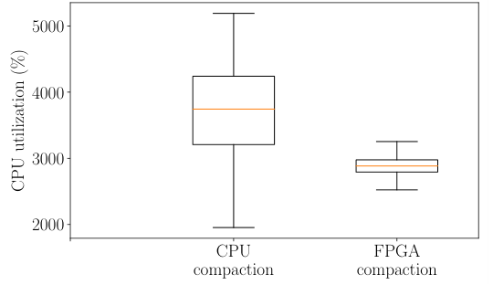

图 20 比较两个基于 LSM-tree 的系统 RocksDB 与 X-Engine 在写密集事务中每事务读取和写入的字节数；所有数据均以 X-Engine 结果归一化。两者都使用索引加速点查询，因此 X-Engine 的 extent 只把读放大降低约 9%；但 extent 与索引有助于 compaction 数据复用，使写放大降低 63%。

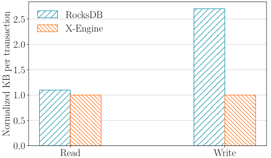

## 附录 B. 生成电子商务工作负载

X-Bench 接收一份 SQL 工作负载配置，其中指定若干事务类型。每类事务模拟一种电子商务操作，例如浏览某品类中最热门的商品、下单和付款。为此，X-Bench 为每个事务填入 SQL 模板，例如：

```sql
UPDATE TABLE_NAME
SET PAY_STATUS = STATUS
WHERE ORDER_ID = ID;
```

其中 TABLE_NAME、STATUS 和 ORDER_ID 是待填充值的占位符。准备不同 SQL 模板即可生成点查询、范围查询、更新和插入。X-Bench 还允许配置每种事务的权重，从而调整工作负载中各事务的比例并模拟不同场景。随后，X-Bench 调用 SysBench，按指定分布及其他条件填充占位符，最终用合成查询访问目标数据库实例。在阿里巴巴数据库管理员和用户协助下，评估所用 SQL 模板取自阿里巴巴电子商务平台的真实负载。

## 附录 C. 识别冷记录

如前所述，温/冷层中的内部 level（见图 2）依据数据（extent）温度区分。extent 温度由近期时间窗口内的访问频率计算。执行 compaction 时，X-Engine 选择数量达到某个阈值的最冷 extent，例如 500 个，把它们推到更深 level 做 compaction。这样，温 extent 留在上层，冷 extent 进入深层。

但该方法不能很好处理动态负载。例如，某 extent 当前访问频率低，算法会把它视为冷数据，但它不久后可能变热。为此，我们研究了基于机器学习的 extent 温度识别算法。直觉是：除 extent 外，还以行（记录）为粒度推断温/冷；若记录在近期窗口内从未被访问，则判为冷，否则判为温。于是温度识别被转化成二分类问题，可用随机森林或神经网络等分类模型求解。完整机器学习算法不在本文范围内，将在其他工作中展开。

## 附录 D. 存储引擎与基准配置

用于通过 SysBench 和 dbbench 评估 InnoDB、RocksDB 的脚本已开源：https://github.com/x-engine-dev/test_scripts。表 2、表 3、表 4 分别列出实验中 MySQL（InnoDB）、MyRocks（RocksDB）、MySQL（X-Engine）的配置。表 2、表 3 中是熟知的配置项；X-Engine 的多数选项与 RocksDB、InnoDB 中的对应项相似。

**表 2：MySQL（InnoDB）配置。**

| Options | Values |
| --- | --- |
| innodb_buffer_pool_size | 256G |
| innodb_doublewrite | 1 |
| innodb_flush_method | O_DIRECT |
| innodb_flush_log_at_trx_commit | 1 |
| innodb_log_file_size | 2 GB |
| innodb_thread_concurrency | 64 |
| innodb_max_dirty_pages_pct_lwm | 10 |
| innodb_read_ahead_threshold | 0 |
| innodb_buffer_pool_instances | 16 |
| thread_cache_size | 256 |
| max_binlog_size | 500 MB |
| read_buffer_size | 128 KB |
| read_rnd_buffer_size | 128 KB |
| table_open_cache_instances | 16 |

**表 3：MyRocks（RocksDB）配置。**

| Options | Values |
| --- | --- |
| rocksdb_block_cache_size | 170 GB |
| rocksdb_block_size | 16384 |
| rocksdb_max_total_wal_size | 100 GB |
| rocksdb_max_background_jobs | 15 |
| rocksdb_max_subcompactions | 1 |
| target_file_size_base | 256 MB |
| target_file_size_multiplier | 1 |
| level0_file_num_compaction_trigger | 4 |
| write_buffer_size | 256 MB |
| max_write_buffer_number | 4 |
| max_bytes_for_level_multiplier | 10 |
| compression_per_level | No for all |
| num_levels | 7 (default) |
| level_compaction_dynamic_level_bytes | True |

**表 4：MySQL（X-Engine）配置。**

| Options | Values |
| --- | --- |
| xengine_row_cache_size | 45 GB |
| xengine_block_cache_size | 170 GB |
| xengine_db_memtable_size | 256 MB |
| xengine_db_total_memtable_size | 100 GB |
| xengine_max_total_wal_size | 100 GB |
| xengine_data_block_size | 16384 |
| xengine_max_compactions | 8 |
| xengine_max_flushes | 3 |
| xengine_max_memtable_number | 2/sub-table |
| level0_extents_compaction_trigger | 64 |
| level1_extents_compaction_trigger | 1000 |
| xengine_compression | False |
| xengine_num_levels | 3 |
| xengine_thread_pool_size | 128 |

level0_extents_compaction_trigger 和 level1_extents_compaction_trigger 分别表示 Level 0、Level 1 允许的最大 extent 数，达到阈值时触发 compaction。xengine_max_compactions 与 xengine_max_flushes 分别表示 X-Engine 中最多同时运行的 compaction 线程数和 flush 线程数。
