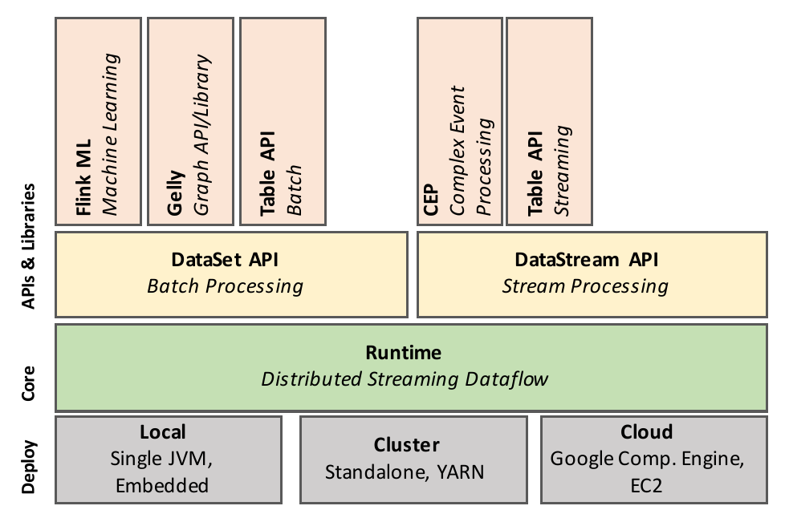
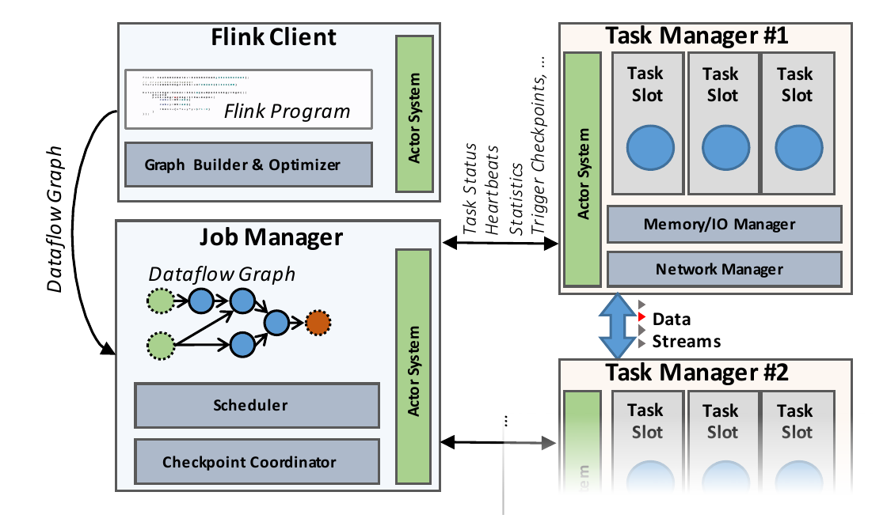
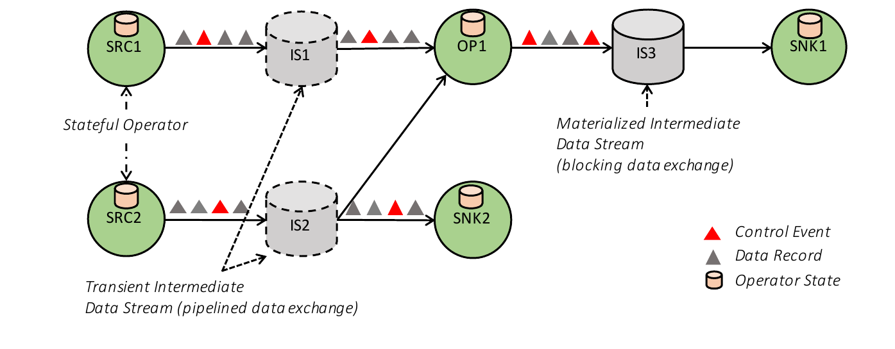
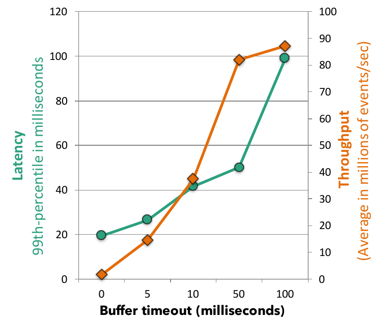
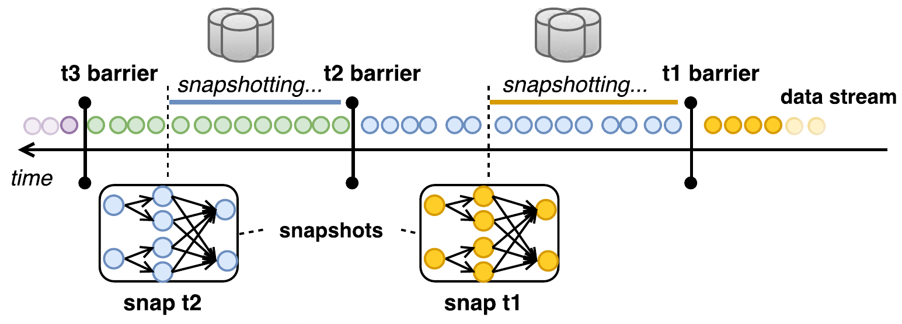
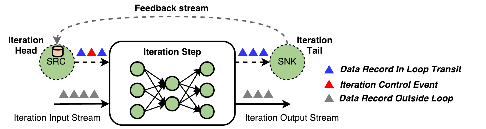

# Apache Flink™: Stream and Batch Processing in a Single Engine（中文译文）

## 译者说明

本文依据同目录的 `source.pdf` 翻译。章节、图表、公式、算法、代码与参考文献按原文结构保留。

Paris Carbone†、Stephan Ewen‡、Seif Haridi†、Asterios Katsifodimos*、Volker Markl*、Kostas Tzoumas‡

- † KTH & SICS Sweden；`parisc,haridi@kth.se`
- ‡ data Artisans；`first@data-artisans.com`
- * TU Berlin & DFKI；`first.last@tu-berlin.de`

发表于 *Bulletin of the IEEE Computer Society Technical Committee on Data Engineering*。

## 摘要

Apache Flink[^1] 是用于处理流式数据和批数据的开源系统。Flink 的哲学是：许多类别的数据处理应用，包括实时分析、连续数据管道、历史数据处理（批处理）以及迭代算法（机器学习、图分析），都可以表达并执行为流水线化、容错的数据流。在本文中，我们介绍 Flink 架构，并说明一组看似不同的用例如何统一到单一执行模型下。

[^1]: 本文作者不声称自己是 Apache Flink 背后思想的唯一发明者或实现者，而是尝试准确记录 Flink 概念及其意义的一组成员；相关致谢见第 7 节。

## 1 引言

数据流处理（例如复杂事件处理系统）和静态批数据处理（例如 MPP 数据库和 Hadoop）传统上被视为两类非常不同的应用。它们使用不同编程模型和 API，并由不同系统执行：一边是 Apache Storm、IBM Infosphere Streams、Microsoft StreamInsight、StreamBase 等专门流处理系统；另一边是关系数据库或 Hadoop 执行引擎，包括 Apache Spark 和 Apache Drill。传统上，批数据分析覆盖了大多数用例、数据规模和市场，而流数据分析主要服务专门化应用。

但今天越来越明显的是，大量大规模数据处理用例实际上处理的是随时间连续产生的数据。这些连续数据流来自 Web 日志、应用日志、传感器，或数据库中应用状态变更（事务日志记录）。许多现有架构没有把这些数据当作流处理，而是忽略数据产生的连续性和时效性，将记录人为批量化为静态数据集，例如小时、天或月分片，再以不感知时间的方式处理。数据采集工具、工作流管理器和调度器编排批次创建和处理，实际上是在搭建连续数据处理管道。lambda architecture [21] 等架构模式组合批处理和流处理系统，形成多条计算路径：流式快速路径提供及时近似结果，批式离线路径提供较晚但准确的结果。这类方式会遭受批次施加的高延迟、连接并编排多个系统且把业务逻辑实现两遍所带来的高复杂度，以及任意不准确性，因为应用代码没有显式处理时间维度。

Apache Flink 采用一种范式：在编程模型和执行引擎中，都把数据流处理作为实时分析、连续流和批处理的统一模型。结合 Apache Kafka 或 Amazon Kinesis 这类允许近乎任意重放数据流的持久消息队列后，流处理程序无需区分实时处理最新事件、周期性在大窗口中连续聚合数据，还是处理数 TB 历史数据。这些计算只是从持久流的不同位置开始处理，并在计算过程中维护不同形式的状态。通过高度灵活的窗口机制，Flink 程序可在同一操作中计算早到近似结果以及延迟准确结果，避免为两个用例组合不同系统。Flink 支持不同时间概念，包括 event-time、ingestion-time 和 processing-time，使程序员能灵活定义事件应如何关联。

同时，Flink 也承认专门批处理仍有需求。复杂静态数据查询仍适合批处理抽象；流式用例的遗留实现，以及尚未知高效流算法的分析应用，也仍需要批处理。批程序可看作流程序的特殊情况：流是有限的，记录顺序和时间并不重要，所有记录隐式属于一个覆盖全部数据的窗口。不过，为了以有竞争力的易用性和性能支持批处理用例，Flink 为静态数据集提供专门 API，对 join、grouping 等算子的批版本使用专门数据结构和算法，并使用专门调度策略。结果是，Flink 在流式 runtime 之上呈现为完整且高效的批处理器，并包含图分析和机器学习库。

Flink 起源于 Stratosphere 项目 [4]，后来成为 Apache Software Foundation 的顶级项目，由大型活跃社区开发和支持；论文写作时已有 180 多位开源贡献者，并已在多家公司投入生产。

本文贡献包括：

- 我们论证流和批数据处理可采用统一架构，同时保留只对静态数据集有意义的特定优化；
- 我们说明流式、批式、迭代式和交互式分析都可表示为容错流式数据流（第 3 节）；
- 我们讨论如何在这些数据流之上构建具有灵活窗口机制的完整流分析系统（第 4 节）以及完整批处理器（原文写作第 4.1 节；对应的批处理正文实际位于第 5 节），并说明这些分析形式如何表示为流式 dataflow。

## 2 系统架构

本节我们从软件栈和分布式系统两个角度介绍 Flink 架构。虽然 Flink API 栈持续增长，但我们仍可区分四个主要层次：部署层、核心层、API 层和库层。

**Flink 的 Runtime 与 API。** 图 1 展示 Flink 软件栈。Flink 核心是分布式 dataflow 引擎，用来执行 dataflow 程序。Flink runtime 程序是由数据流连接的有状态算子 DAG。Flink 有两个核心 API：DataSet API 用于处理有限数据集，通常称为批处理；DataStream API 用于处理潜在无界数据流，通常称为流处理。Flink 核心 runtime 引擎可视为流式 dataflow 引擎，DataSet 和 DataStream API 都生成该引擎可执行的 runtime 程序。因此，它作为共同基础，抽象有界批处理和无界流处理。



在核心 API 之上，Flink 捆绑特定领域库和 API，它们生成 DataSet 和 DataStream API 程序；当时包括用于机器学习的 FlinkML、用于图处理的 Gelly，以及用于类 SQL 操作的 Table。

图 2 展示 Flink 集群的三类进程：client、JobManager 和至少一个 TaskManager。client 接收程序代码，将其转换为 dataflow graph，并提交给 JobManager。转换阶段还检查算子间交换数据的数据类型（schema），并生成序列化器和其他类型/schema 特定代码。DataSet 程序还会经过基于代价的查询优化阶段，类似关系查询优化器所做的物理优化（原文此处指向第 4.1 节；对应的查询优化正文实际位于第 5.1 节）。



JobManager 协调 dataflow 的分布式执行。它跟踪每个算子和流的状态与进度，调度新算子，并协调 checkpoint 和恢复。在高可用设置中，JobManager 在每个 checkpoint 将最小元数据集持久化到容错存储，使备用 JobManager 能重构 checkpoint 并从那里恢复 dataflow 执行。实际数据处理发生在 TaskManager 中。TaskManager 执行一个或多个产生流的算子，并向 JobManager 报告状态。TaskManager 维护 buffer pool 以缓冲或物化流，并维护算子之间交换数据流所需的网络连接。

## 3 共同基础：流式数据流

虽然用户可使用多种 API 编写 Flink 程序，但所有 Flink 程序最终都会编译为共同表示：dataflow graph。dataflow graph 由 Flink runtime 引擎执行，它是批处理 DataSet API 和流处理 DataStream API 下方的共同层。

### 3.1 Dataflow Graph

图 3 所示的 dataflow graph 是一个有向无环图，包含两类元素：有状态算子，以及表示算子产生并可被其他算子消费的数据的数据流。由于 dataflow graph 以数据并行方式执行，算子被并行化为一个或多个并行实例，称为 subtasks；流被拆分为一个或多个 stream partitions，每个 producing subtask 对应一个 partition。有状态算子也可以把无状态算子作为特殊情况，实现所有处理逻辑，例如 filter、hash join 和 stream window 函数。许多算子是知名算法的标准实现；第 4 节我们将详述窗口算子的实现。流以多种模式在生产算子和消费算子之间分发数据，例如 point-to-point、broadcast、re-partition、fan-out 和 merge。



### 3.2 通过中间数据流交换数据

Flink 的 intermediate data stream 是算子之间数据交换的核心抽象。中间数据流表示一个逻辑句柄，指向由某个算子产生、并可被一个或多个算子消费的数据。中间流是逻辑概念，因为它指向的数据可能物化到磁盘，也可能不物化。数据流的具体行为由 Flink 上层参数化，例如 DataSet API 使用的程序优化器。

**流水线式与阻塞式数据交换。** Pipelined intermediate stream 在并发运行的生产者和消费者之间交换数据，形成流水线执行。因此，流水线流会把背压从消费者传播到生产者，同时通过中间 buffer pool 提供一定弹性，用于补偿短期吞吐波动。Flink 将流水线流用于连续流程序，也用于批 dataflow 的许多部分，以尽可能避免物化。

Blocking stream 则适用于有界数据流。blocking stream 会在可被消费之前缓冲生产算子的全部数据，因此把生产算子和消费算子分离到不同执行阶段。blocking stream 自然需要更多内存，经常溢写到二级存储，并且不传播背压。它们用于在需要时隔离连续算子，也用于包含 pipeline-breaking 算子的计划可能造成分布式死锁的场景，例如 sort-merge join。

**平衡延迟与吞吐。** Flink 数据交换机制围绕 buffer 交换实现。当生产者侧有一条数据记录就绪时，它被序列化并拆分为一个或多个 buffer；一个 buffer 也可容纳多条记录。buffer 会在填满时发送给消费者，或在达到 timeout 条件时发送。这使 Flink 可通过把 buffer size 设为较大值（例如几 KB）获得高吞吐，也可通过把 buffer timeout 设为较低值（例如几毫秒）获得低延迟。图 4 展示 buffer timeout 对一个在 30 台机器、120 核上运行的简单 streaming grep 作业中记录投递吞吐和延迟的影响。Flink 可达到可观测的 99 百分位延迟 20 ms，对应吞吐为每秒 150 万事件。随着我们增大 buffer timeout，我们看到延迟随吞吐提高而增加，直到达到满吞吐，即 buffer 在 timeout 到期前就已填满。当 buffer timeout 为 50 ms 时，集群达到每秒超过 8000 万事件的吞吐，同时 99 百分位延迟为 50 ms。



**控制事件。** 除数据交换外，Flink 中的流还传递不同类型的 control events。这些特殊事件由算子注入数据流，并与流分区内所有其他数据记录和事件按序投递。接收算子在这些事件到达时执行特定动作。Flink 使用多种 control events，包括：

- checkpoint barriers：通过把流划分为 checkpoint 前和 checkpoint 后两部分来协调 checkpoint（第 3.3 节）；
- watermarks：标记 stream partition 内 event-time 的进展（第 4.1 节）；
- iteration barriers：在基于循环 dataflow 的 Bulk/Stale-Synchronous-Parallel 迭代算法中，标记 stream partition 已到达某个 superstep 末尾（第 5.3 节）。

control events 假设 stream partition 保留记录顺序。为此，Flink 中消费单个 stream partition 的一元算子保证记录 FIFO 顺序。但接收多个 stream partitions 的算子会按到达顺序合并流，以跟上流速率并避免背压。因此，Flink 的 streaming dataflow 在 repartitioning 或 broadcasting 后不提供排序保证，处理乱序记录的责任留给算子实现。我们发现这种安排最高效，因为多数算子不需要确定性顺序，例如 hash join 和 map；需要补偿乱序到达的算子，例如 event-time window，可在算子逻辑中更高效地完成。

### 3.3 容错

Flink 通过 checkpointing 和部分重执行提供可靠执行，并具有严格 exactly-once 处理一致性保证。系统有效提供这些保证的一般假设是：数据源持久且可重放。文件和 Apache Kafka 等持久消息队列就是此类源。实践中，非持久源也可通过在 source operator 状态中维护 write-ahead log 纳入。

Apache Flink 的 checkpoint 机制基于分布式一致快照概念，以实现 exactly-once 处理保证。数据流可能无界，因此恢复时重算并不现实：长时间运行作业可能需要重放数月计算。为了限制恢复时间，Flink 定期对算子状态以及输入流当前位置做快照。

核心挑战是在不停止拓扑执行的情况下，对所有并行算子取得一致快照。本质上，所有算子的快照都应对应计算中的同一个逻辑时间。Flink 使用的机制称为 Asynchronous Barrier Snapshotting（ABS [7]）。Barrier 是注入输入流的控制记录，对应一个逻辑时间，并把流逻辑分成两部分：当前快照会包含其影响的部分，以及稍后才会被快照的部分。算子接收来自上游的 barrier 后执行 alignment 阶段，确保所有输入都已收到 barrier。随后算子把自己的状态（例如滑动窗口的内容或自定义数据结构）写入持久存储（例如可使用 HDFS 这样的外部系统作为存储后端），并把 barrier 向下游转发。最终所有算子都会注册其状态快照，全局快照完成。



例如，我们在图 5 中展示：快照 $t_2$ 包含所有算子消费 $t_2$ barrier 之前全部记录后得到的状态。ABS 与 Chandy-Lamport 异步分布式快照算法 [11] 相似；但由于 Flink 程序是 DAG，ABS 无需 checkpoint 在途记录（in-flight records），只需依靠 alignment 阶段把这些记录的全部影响施加到算子状态。这保证写入可靠存储的数据量保持在理论最小值，即只写算子的当前状态。

故障恢复时，所有算子状态都回退到最近一次成功快照中的对应状态，输入流则从已有快照的最新 barrier 开始重启。恢复所需的最大重算量被限制为相邻两个 barrier 之间的输入记录量。系统还可以只恢复失败的 subtask：额外重放其直接上游 subtasks 中已经缓冲但尚未处理的记录即可 [7]。

ABS 有三项收益：

1. 它在不暂停计算的情况下保证状态恰好一次更新；
2. 它与其他控制消息完全解耦，例如触发窗口计算的事件不会把窗口机制限制为 checkpoint 周期的整数倍；
3. 它与可靠存储机制完全解耦，可依 Flink 所处环境把状态备份到文件系统、数据库等不同后端。

### 3.4 迭代

增量处理和迭代对图处理、机器学习等应用至关重要。数据并行平台通常通过为每轮迭代提交新作业、向正在运行的 DAG 增加节点 [6, 25]，或增加反馈边 [23] 来支持迭代。Flink 把迭代实现为 iteration step：这种特殊算子自身可以包含一个执行图，如图 6 所示。为了保持基于 DAG 的 runtime 与调度器，Flink 允许设置 iteration head 和 iteration tail 任务，并在两者之间建立隐式反馈边。这些任务负责为 iteration step 建立活动反馈通道，并协调仍在该通道中传输的数据记录。Bulk Synchronous Parallel（BSP）等结构化并行迭代模型需要这种协调，Flink 通过 control events 实现。我们将在第 4.4 节和第 5.3 节分别说明 DataStream 与 DataSet API 中的迭代实现。



## 4 流分析

Flink 的 DataStream API 在 runtime 之上实现完整的流分析框架，包括乱序事件处理等时间管理机制、窗口定义，以及用户自定义状态的维护和更新。该 API 的基础是 DataStream：给定类型元素组成的、可能无界的不可变集合。Flink runtime 已支持流水线式数据传输、连续有状态算子，以及一致状态更新的容错机制，因此在其上叠加流处理器，核心工作就是实现窗口系统和状态接口。对 runtime 而言，这些机制不可见；窗口只是有状态算子的一种实现。

### 4.1 时间

Flink 首先区分两种时间概念：event-time 表示事件产生的时间，例如移动设备等传感器信号所关联的时间戳；processing-time 则是处理数据的机器的挂钟时间。

在分布式系统中，event-time 与 processing-time 之间可能存在任意偏差 [3]，这意味着按 event-time 语义获得答案可能遭遇任意长延迟。为了避免这种延迟，系统会定期插入称为 low watermarks 的特殊事件，用它们标记全局进度。例如，表示时间进度的 watermark 带有时间属性 $t$，表示所有时间小于 $t$ 的事件都已进入某个算子。Watermark 帮助执行引擎按正确的事件顺序处理事件，并通过统一的进度度量串行化窗口计算等操作。

Watermarks 起源于拓扑的 source，因为我们可以在这里判断未来元素内在的时间位置；随后它们从 source 沿 dataflow 传播到其他算子。各算子自行决定如何响应 watermark：map、filter 等简单操作只转发收到的 watermarks；event-time window 等基于 watermark 计算的复杂算子会先计算由 watermark 触发的结果，再转发该 watermark。如果一个操作有多个输入，系统只向该算子转发输入 watermarks 中的最小值，从而保证结果正确。

基于 processing-time 的程序依赖本地机器时钟，因此时间概念较不可靠，恢复重放时可能产生不一致，但延迟较低。基于 event-time 的程序提供最可靠语义，但可能因 event-time 与 processing-time 的滞后而增加延迟。Flink 还把 ingestion-time 作为 event-time 的一种特殊情况：它表示事件进入 Flink 的时间。Ingestion-time 比 event-time 处理延迟更低，又比 processing-time 产生更准确的结果。

### 4.2 有状态流处理

虽然 Flink DataStream API 中多数算子看起来像函数式、无副作用算子，但它们支持高效有状态计算。状态对许多应用至关重要，例如机器学习模型构建、图分析、用户会话处理和窗口聚合。状态形式取决于用例，可以简单到计数器或求和，也可以复杂到分类树或机器学习中常用的大型稀疏矩阵。流窗口就是有状态算子，它们把记录分配到连续更新的 bucket 中，这些 bucket 作为算子状态保存在内存中。

Flink 显式暴露状态，并通过两类方式纳入 API：一是算子接口或注解，用于在算子范围内静态注册显式局部变量；二是 operator-state 抽象，用于声明分区键值状态及其操作。用户还可通过系统提供的 StateBackend 抽象配置状态如何存储和 checkpoint，从而为流应用提供高度灵活的自定义状态管理。第 3.3 节所述 Flink checkpoint 机制保证任何已注册状态都具备持久性和 exactly-once 更新语义。

### 4.3 流窗口

对无界流的增量计算通常在不断演进的逻辑视图上求值，这些视图称为 windows。Flink 把窗口作为一个有状态算子实现，窗口声明由三个核心函数组成：window assigner，以及可选的 trigger 和 evictor。这三类函数都可从常见预定义实现中选择，例如 sliding time windows，也可由用户显式定义。

assigner 负责把每条记录分配到逻辑窗口。例如，在 event-time window 中，分配可基于记录时间戳。滑动窗口中，一个元素可属于多个逻辑窗口。trigger 定义与窗口定义关联的操作何时执行。evictor 决定每个窗口中保留哪些记录。Flink 的窗口分配过程覆盖所有已知窗口类型，例如周期性时间窗口和计数窗口、punctuation、landmark、session 和 delta windows。Flink 窗口能力也像 Google Cloud Dataflow [3] 一样无缝纳入乱序处理，并且原则上涵盖这些窗口模型。

下面是一个范围 6 秒、每 2 秒滑动一次的窗口定义；当 watermark 超过窗口结束位置时计算窗口结果。

```java
stream
  .window(SlidingTimeWindows.of(Time.of(6, SECONDS), Time.of(2, SECONDS))
  .trigger(EventTimeTrigger.create())
```

下面定义一个 global window：它为所有元素创建单一逻辑组，每 1000 个事件触发一次操作，并只保留最后 100 个元素。

```java
stream
  .window(GlobalWindow.create())
  .trigger(Count.of(1000))
  .evict(Count.of(100))
```

如果上述流在窗口化之前按 key 分区，则窗口操作是本地的，不需要 worker 之间协调。该机制可实现广泛的窗口功能 [3]。

### 4.4 异步流迭代

流中的循环对多个应用至关重要，例如增量构建和训练机器学习模型、强化学习和图近似 [9, 15]。多数情况下，反馈循环不需要协调。异步迭代满足流应用通信需求，并不同于基于有限数据结构化迭代的并行优化问题。如第 3.4 节和图 6 所示，Flink 执行模型在未启用迭代控制机制时已经覆盖异步迭代。为了满足容错保证，反馈流被视为隐式 iteration head 算子的 operator state，并纳入全局快照 [7]。DataStream API 允许显式定义反馈流，并可自然涵盖流上的结构化循环 [23] 和进度跟踪 [9]。

## 5 基于 Dataflow 的批分析

有界数据集是无界数据流的特殊情况。因此，把全部输入放入一个窗口的流程序可形成批程序，批处理也应由前述 Flink 功能覆盖。不过，批处理仍有特殊需求：语法可以简化，例如无需人为 global window 定义；处理有界数据集的程序适合额外优化、更高效的容错簿记，以及分阶段调度。

Flink 的批处理方式如下：

- 批计算由与流计算相同的 runtime 执行。runtime 可用 blocking data streams 参数化，把大计算拆分为相互隔离、依次调度的阶段。
- 当周期性快照开销较高时会关闭。故障恢复可通过从最近物化的 intermediate stream（可能是 source）重放丢失的 stream partitions 实现。
- blocking operators（例如 sort）只是会一直阻塞到消费完整输入的算子实现。runtime 不需要知道算子是否阻塞。这些算子使用 Flink 提供的托管内存（JVM 堆上或堆外），如果输入超过内存边界，可溢写到磁盘。
- 专门 DataSet API 为批计算提供熟悉抽象，包括有界容错 DataSet 数据结构以及 DataSet 上的 transformations，例如 joins、aggregations 和 iterations。
- 查询优化层把 DataSet 程序转换为高效可执行程序。

下面我们将更详细地说明这些方面。

### 5.1 查询优化

Flink 优化器基于并行数据库系统中的技术，例如计划等价、代价建模和 interesting-property propagation。不过，Flink dataflow 程序由大量任意 UDF 组成的 DAG 构成，算子对优化器隐藏了语义，因此传统数据库优化器不能直接应用这些技术 [17]；基数和代价估计也同样困难。

Flink runtime 支持多种执行策略，包括 repartition 和 broadcast 数据传输，以及基于排序的 grouping、基于排序和哈希的 join 实现。Flink 优化器基于 interesting properties propagation [26] 枚举不同物理计划，并用基于代价的方法在多个物理计划中选择。代价包含网络和磁盘 I/O 以及 CPU 代价。为解决 UDF 存在时的基数估计问题，Flink 优化器可使用程序员提供的 hints。

### 5.2 内存管理

基于数据库技术，Flink 将数据序列化到内存段中，而不是在 JVM 堆上分配对象表示缓冲中的在途记录。sort 和 join 等操作尽可能直接在二进制数据上运行，把序列化和反序列化开销降到最低，并在需要时将部分数据溢写到磁盘。为处理任意对象，Flink 使用类型推断和自定义序列化机制。通过在二进制表示和堆外内存上处理数据，Flink 降低垃圾回收开销，并使用缓存高效、鲁棒且在内存压力下优雅扩展的算法。

### 5.3 批迭代

迭代图分析、并行梯度下降和优化技术过去常构建在 Bulk Synchronous Parallel（BSP）和 Stale Synchronous Parallel（SSP）等模型之上。Flink 执行模型允许使用 iteration-control events 在其上实现任意结构化迭代逻辑。例如，在 BSP 执行中，iteration-control events 标记迭代计算中 superstep 的开始和结束。Flink 还引入 delta iterations [14] 等新型优化技术，可利用稀疏计算依赖。Delta iterations 已被 Flink 的 Graph API Gelly 使用。

## 6 相关工作

今天有大量用于分布式批处理和流分析处理的引擎。下面我们分类讨论主要系统。

**批处理。** Apache Hadoop 是基于 MapReduce 范式 [12] 的常用大规模数据分析开源系统之一。Dryad [18] 在通用 DAG-based dataflow 中引入嵌入式用户自定义函数；SCOPE [26] 又在其上增加了语言和 SQL 优化器。Apache Tez [24] 可视为 Dryad 思想的开源实现。MPP 数据库 [13]，以及 Apache Drill、Impala [19] 等较新的开源实现，将 API 限制为 SQL 变体。与 Flink 类似，Apache Spark [25] 是一种数据处理框架，实现基于 DAG 的执行引擎，提供 SQL 优化器，执行 driver-based iterations，并把无界计算处理为 micro-batches。相比之下，Flink 是唯一结合以下特性的系统：利用流水线流式执行服务批和流工作负载的分布式 dataflow runtime；通过轻量 checkpoint 提供 exactly-once 状态一致性；原生迭代处理；以及支持乱序处理的复杂窗口语义。

**流处理。** 学术和商业系统中已有大量工作，例如 SEEP、Naiad、Microsoft StreamInsight 和 IBM Streams，其中许多系统建立在数据库社区的研究之上 [1, 5, 8, 10, 16, 22, 23]。多数系统要么是学术原型，要么是闭源商业产品，要么无法在通用服务器集群上水平扩展。较新的数据流方法支持水平可扩展和可组合 dataflow 算子，但状态一致性保证较弱，例如 Apache Storm 和 Samza 中的 at-least-once 处理。out-of-order processing（OOP）等概念受到广泛关注 [20]，并被 MillWheel [2] 采用；MillWheel 是 Google 内部系统，也是后来提供的 Apache Beam / Google Dataflow 商业执行器 [3] 的前身。MillWheel 证明了 exactly-once 低延迟流处理和 OOP 可行，并对 Flink 演化影响很大。据我们所知，Flink 是当时唯一同时支持 event-time 和乱序事件处理、提供 exactly-once 保证下的一致托管状态、并在同时服务批处理和流处理时达到高吞吐和低延迟的开源项目。

## 7 致谢

Apache Flink 项目的开发由活跃贡献者组成的自选团队监督。项目管理委员会（PMC）指导项目持续运行，包括社区发展和产品发布。我们感谢论文写作时的 Flink committers：Márton Balassi、Paris Carbone、Ufuk Celebi、Stephan Ewen、Gyula Fóra、Alan Gates、Greg Hogan、Fabian Hueske、Vasia Kalavri、Aljoscha Krettek、ChengXiang Li、Andra Lungu、Robert Metzger、Maximilian Michels、Chiwan Park、Till Rohrmann、Henry Saputra、Matthias J. Sax、Sebastian Schelter、Kostas Tzoumas、Timo Walther 和 Daniel Warneke。除此之外，我们也感谢超过 180 位贡献者组成的更广泛 Flink 社区。

## 8 结论

在本文中，我们介绍了 Apache Flink：一个实现通用 dataflow 引擎的平台，设计目标是同时执行流分析和批分析。Flink dataflow 引擎将算子状态和逻辑中间结果视为一等公民，并由批 API 和数据流 API 以不同参数使用。构建在 Flink 流式 dataflow 引擎之上的流 API 提供可恢复状态，并支持对数据流窗口进行分区、转换和聚合。虽然批计算在理论上是流计算的特殊情况，但 Flink 对其做专门处理：使用查询优化器优化执行，并实现可在内存不足时优雅溢写到磁盘的 blocking operators。

## 参考文献

- [1] D. J. Abadi, Y. Ahmad, M. Balazinska, U. Cetintemel, M. Cherniack, J.-H. Hwang, W. Lindner, A. Maskey, A. Rasin, E. Ryvkina, et al. The design of the Borealis stream processing engine. CIDR, 2005.
- [2] T. Akidau, A. Balikov, K. Bekiroğlu, S. Chernyak, J. Haberman, R. Lax, S. McVeety, D. Mills, P. Nordstrom, and S. Whittle. Millwheel: fault-tolerant stream processing at Internet scale. PVLDB, 2013.
- [3] T. Akidau, R. Bradshaw, C. Chambers, S. Chernyak, R. J. Fernández-Moctezuma, R. Lax, S. McVeety, D. Mills, F. Perry, E. Schmidt, et al. The dataflow model: a practical approach to balancing correctness, latency, and cost in massive-scale, unbounded, out-of-order data processing. PVLDB, 2015.
- [4] A. Alexandrov, R. Bergmann, S. Ewen, J.-C. Freytag, F. Hueske, A. Heise, O. Kao, M. Leich, U. Leser, V. Markl, F. Naumann, M. Peters, A. Rheinlaender, M. J. Sax, S. Schelter, M. Hoeger, K. Tzoumas, and D. Warneke. The Stratosphere platform for big data analytics. VLDB Journal, 2014.
- [5] A. Arasu, B. Babcock, S. Babu, J. Cieslewicz, M. Datar, K. Ito, R. Motwani, U. Srivastava, and J. Widom. Stream: The Stanford data stream management system. Technical Report, 2004.
- [6] Y. Bu, B. Howe, M. Balazinska, and M. D. Ernst. HaLoop: Efficient Iterative Data Processing on Large Clusters. PVLDB, 2010.
- [7] P. Carbone, G. Fóra, S. Ewen, S. Haridi, and K. Tzoumas. Lightweight asynchronous snapshots for distributed dataflows. arXiv:1506.08603, 2015.
- [8] B. Chandramouli, J. Goldstein, M. Barnett, R. DeLine, D. Fisher, J. C. Platt, J. F. Terwilliger, and J. Wernsing. Trill: a high-performance incremental query processor for diverse analytics. PVLDB, 2014.
- [9] B. Chandramouli, J. Goldstein, and D. Maier. On-the-fly progress detection in iterative stream queries. PVLDB, 2009.
- [10] S. Chandrasekaran and M. J. Franklin. Psoup: a system for streaming queries over streaming data. VLDB Journal, 2003.
- [11] K. M. Chandy and L. Lamport. Distributed snapshots: determining global states of distributed systems. ACM TOCS, 1985.
- [12] J. Dean et al. MapReduce: simplified data processing on large clusters. Communications of the ACM, 2008.
- [13] D. J. DeWitt, S. Ghandeharizadeh, D. Schneider, A. Bricker, H.-I. Hsiao, R. Rasmussen, et al. The Gamma database machine project. IEEE TKDE, 1990.
- [14] S. Ewen, K. Tzoumas, M. Kaufmann, and V. Markl. Spinning Fast Iterative Data Flows. PVLDB, 2012.
- [15] J. Feigenbaum, S. Kannan, A. McGregor, S. Suri, and J. Zhang. On graph problems in a semi-streaming model. Theoretical Computer Science, 2005.
- [16] B. Gedik, H. Andrade, K.-L. Wu, P. S. Yu, and M. Doo. Spade: the System S declarative stream processing engine. ACM SIGMOD, 2008.
- [17] F. Hueske, M. Peters, M. J. Sax, A. Rheinländer, R. Bergmann, A. Krettek, and K. Tzoumas. Opening the Black Boxes in Data Flow Optimization. PVLDB, 2012.
- [18] M. Isard, M. Budiu, Y. Yu, A. Birrell, and D. Fetterly. Dryad: distributed data-parallel programs from sequential building blocks. ACM SIGOPS, 2007.
- [19] M. Kornacker, A. Behm, V. Bittorf, T. Bobrovytsky, C. Ching, A. Choi, J. Erickson, M. Grund, D. Hecht, M. Jacobs, et al. Impala: A modern, open-source SQL engine for Hadoop. CIDR, 2015.
- [20] J. Li, K. Tufte, V. Shkapenyuk, V. Papadimos, T. Johnson, and D. Maier. Out-of-order processing: a new architecture for high-performance stream systems. PVLDB, 2008.
- [21] N. Marz and J. Warren. Big Data: Principles and best practices of scalable realtime data systems. Manning Publications Co., 2015.
- [22] M. Migliavacca, D. Eyers, J. Bacon, Y. Papagiannis, B. Shand, and P. Pietzuch. Seep: scalable and elastic event processing. ACM Middleware'10 Posters and Demos Track, 2010.
- [23] D. G. Murray, F. McSherry, R. Isaacs, M. Isard, P. Barham, and M. Abadi. Naiad: a timely dataflow system. ACM SOSP, 2013.
- [24] B. Saha, H. Shah, S. Seth, G. Vijayaraghavan, A. Murthy, and C. Curino. Apache Tez: A unifying framework for modeling and building data processing applications. ACM SIGMOD, 2015.
- [25] M. Zaharia, M. Chowdhury, M. J. Franklin, S. Shenker, and I. Stoica. Spark: Cluster Computing with Working Sets. USENIX HotCloud, 2010.
- [26] J. Zhou, P.-A. Larson, and R. Chaiken. Incorporating partitioning and parallel plans into the SCOPE optimizer. IEEE ICDE, 2010.
