# Aurora: A New Model and Architecture for Data Stream Management（中文译文）

## 译者说明

本文依据同目录的 `source.pdf` 翻译。章节、图表、公式、算法、代码与参考文献按原文结构保留。

Daniel J. Abadi¹，Don Carney²，Uğur Çetintemel²，Mitch Cherniack¹，Christian Convey²，Sangdon Lee²，Michael Stonebraker³，Nesime Tatbul²，Stanley B. Zdonik²<br>
¹ Brandeis University；² Brown University；³ M.I.T.

## 摘要

本文介绍 Aurora 的基本处理模型与体系结构。Aurora 是一个面向监控应用、用于管理数据流的新系统。监控应用与传统业务数据处理有很大不同：软件系统必须处理并响应来自大量源（例如传感器）的连续输入，而不是等待人工操作，因此需要重新思考这一应用领域中 DBMS 的基础体系结构。在本文中，我们介绍正在 Brandeis University、Brown University 和 M.I.T. 构建的新型 DBMS Aurora，我们先概述其基本模型和体系结构，再详细说明一组面向数据流的操作符。

**关键词：** 数据流管理；连续查询；数据库触发器；实时系统；服务质量（QoS）

## 1 引言

传统 DBMS 面向业务数据处理设计，并围绕这类应用形成了五项假设。第一，DBMS 是保存大量数据元素的被动仓库，由人发起查询和事务；我们称之为“人主动、DBMS 被动”（human-active, DBMS-passive，HADP）模型。第二，只有数据当前状态重要；当前值易取，历史值只能费力解码 DBMS 日志。第三，触发器和告警器是二等公民，作为事后补充加入现有系统，且没有一种实现能扩展到大量触发器。第四，DBMS 假定数据元素同步、查询有精确答案；而在许多流应用中，数据异步到达，答案必须基于不完整信息计算。第五，DBMS 假定应用不需要实时服务。

有一大类应用使这五项假设全部失效。监控应用观察连续数据流，例如：军用应用监控士兵佩戴传感器的血压、心率和位置；金融分析应用监控各证券交易所报告的股票数据流；跟踪应用监控大量受管对象的位置，例如视听部门借出的设备。数据量和查询需求使它们需要 DBMS 支持，但现有 DBMS 针对业务应用，难以胜任。

首先，监控应用的数据来自传感器等外部源，而不是人提交的事务；DBMS 的角色是在发现异常时提醒人。这是“DBMS 主动、人被动”（DBMS-active, human-passive，DAHP）模型。其次，监控应用需要管理数据流报告值的一段历史，而非只管理最新值。例如，用电子资产标签、楼内顶置传感器和室外 GPS 跟踪投影仪和笔记本电脑时，既可能查询遗失投影仪的最新位置，也可能为了计算投影仪的使用率而访问完整历史时间序列。

第三，多数监控应用以触发器为中心。监控化工厂时，若某个传感器值过高，或另一传感器在过去 24 小时内两次以上越界，就应告警。每个应用都可能监控多个数据流，并在复杂条件满足时告警；这里所需的触发器处理规模远超传统 DBMS。第四，流数据常会丢失、过期，或因处理需要被主动省略。对象可能移出传感器覆盖范围；最近的位置报告会随时间越来越不准确；面对高输入速率，还可能需要丢弃较不重要的数据来卸载。因此答案必然近似。最后，许多监控应用有实时要求。移动传感器应用通常无法容忍陈旧数据；DBMS 必须在高负载时采用智能资源管理（如调度）和优雅降级（如负载削减）。应用应提供服务质量（QoS）规范，运行系统据此动态分配资源。

传统 DBMS 很难实现监控应用，其根本计算模型首先就不匹配。时间序列只有两种常见编码方式：把它作为普通表中的当前数据，会因历史值分散在许多元组中而使时间序列重组非常昂贵；把它编码进二进制大对象，虽有物理局部性，却难以查询单个值。Informix Universal Server 曾实现时间序列数据类型及加速取值的方法 [1]，但没有解决上述问题。

若应用包含大量触发器或告警器，当前 DBMS 不能扩展到每表几个以上的触发器。把它们写进中间件又使 DBMS 无法优化，而且中间件必须轮询依赖的数据，性能通常很差。我们也不知道有哪种 DBMS 内建近似查询回答和实时能力；用户只能在应用里自行编写代码。

因此，支持监控应用需要重新设计现有 DBMS 的基本机制。Aurora 原型正为此而建，并用来说明同类系统都会遇到的设计问题。随着安全需求上升，对核电站等物理设施异常事件的监控将增长；随着类 GPS 设备附着到更多对象上，位置监控也将从 Lojack [2] 等昂贵物品扩展到大量普通对象。

第 2 节介绍 Aurora 的基本体系结构和构件；第 3 节解释传统查询优化为何失效，并给出 Aurora 的优化策略；第 4 节讨论运行时体系结构、存储组织、调度、自省和负载削减；第 5 节详述数据流操作符；第 6 节回顾相关工作；第 7 节说明原型状态；第 8 节总结。

## 2 Aurora 系统模型

Aurora 的数据来自按规则或不规则间隔生成值的软件或硬件传感器，二者统称数据源；数据源给出的值集合称为数据流。每个数据源有唯一标识符，Aurora 为每个输入元组加时间戳，以监控所提供的 QoS。

Aurora 的基本任务是按应用管理员定义的方式处理输入流。它本质上是数据流系统，采用流程与工作流系统常见的“方框与箭头”范式：元组在无环有向的处理操作图中流动，每个处理操作是一个方框。输出流最终交给应用，应用必须能处理异步到达的输出元组。Aurora 还可维护历史存储，主要用于临时查询。图 1 给出高层系统模型。

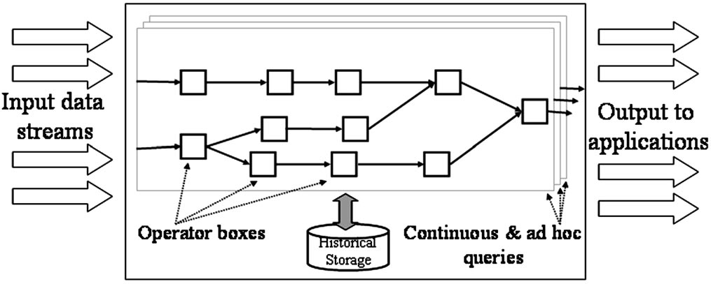

**图 1：Aurora 系统模型。**

Aurora 查询代数 SQuAl[^1] 内建七个原始操作符，用于表达数据流处理需求。其中许多与关系查询操作符对应：`Filter` 类似关系选择，对每个输入元组应用任意多个谓词，并按满足的谓词路由；`Aggregate` 顺应流的推送特性，在流值窗口上应用函数，例如移动平均。在数据可能陈旧或时间不精确的环境中，窗口操作不可或缺。

Aurora 没有显式 `Split` 方框；管理员可把一个方框的输出连接到多个方框输入，从而隐式分流。另一方面，它有显式 `Union`，可合并两个流。如果一个元组必须等待另一个元组到达，还可插入 `Resample` 方框。Aurora 图中的弧实际表示模式相同的一组流，弧上的流数量不固定，因而流可以出现或消失而无须修改网络。

### 2.1 查询模型

Aurora 用基本相同的机制支持连续查询（实时处理）、视图和临时查询。三种模式使用同一组概念构件，并依据 QoS 规范处理数据流：每个输出都关联二维 QoS 图，用多个性能和质量属性表示输出效用（见 4.1 节）。图 2 展示三种模式。

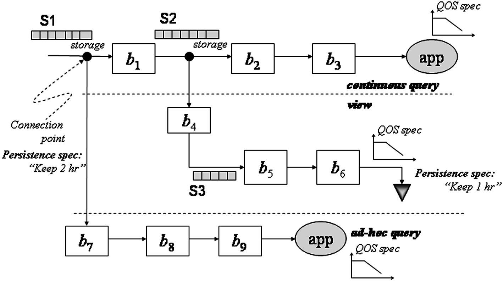

**图 2：Aurora 查询模型。**

最上方路径代表连续查询。数据元素流入方框、被处理并继续向下游流动；处理完所有可达路径后就从网络排出，不必保存。路径末端的 QoS 规范控制沿途处理元素的资源分配。Aurora 网络及其应用也可看成大量触发器：从传感器输入到输出的每条路径都在计算复杂触发器的条件部分，输出元组交给应用执行相应动作。

方框 $b_1$ 和 $b_2$ 输入弧上的黑点是连接点。连接点支持网络动态修改，可在此添加或删除方框。新应用接入时往往需要近期历史，因此连接点可以有持久存储（见 4.2 节）：数据项流过后在持久存储中缓存一段时间，不由应用把它们从网络排空；持久化规范精确规定保留多久，以便未来临时查询获得历史结果。图中最左连接点保留 2 小时，因此新应用的时间起点可追溯到两小时前。

连接点还可无上游节点，成为悬空连接点，从而优雅地把静态数据集纳入 Aurora。此时它不对应 Aurora 流，而标注传统 DBMS 或其他存储系统中的数据集标识。连接点可以物化，将存储元组作为流推送到下游；下游也可通过查询存储来拉取元组。下游若为过滤或连接，拉取明显有利；若连接一个流与静态数据集，可在每个流元组到达时迭代代入并查找静态数据，此时无需窗口即可计算完整连接。

图 2 中间路径代表视图：路径没有连接应用，但可用 QoS 规范表示重要性。应用需要时才接到末端；在此之前，系统可传播连接点中全部、部分或不传播任何值，并在路径任意位置保存部分结果，以降低未来接入延迟。这相当于物化或部分物化视图，物化由调度器控制。

底部路径代表临时查询，可随时接到连接点。系统从连接点持久化规范所确定的最早时刻 $T$ 开始处理数据并交付答案，直到显式断开查询分支。因此临时查询等价于一条从 $t_{now}-T$ 开始执行、直到显式终止的连续查询。

### 2.2 图形用户界面

篇幅所限，我们只介绍 Aurora 界面的要点。为设计大型网络，Aurora 支持层次化方框组。设计者可从只显示少数超级方框的顶层开始，通过缩放把组替换为其内部方框和子组，从而浏览整张图。

方框和组都有标签、参数列表、功能说明，最终还会有手册页。用户可查询这些属性，直接跳到网络中的特定位置，也可设置书签返回关注点。界面还能监控网络弧以便调试，支持逐方框单步执行；后续还计划加入图形性能监视器和更复杂的查询能力。

## 3 Aurora 优化

传统关系查询优化的主要目标之一是减少对大型数据集的遍历次数。Aurora 网络中的流操作符则按数据到达顺序以数据流方式处理，每个新元素的计算量通常很小，但方框数量可能很大，数据速率也很高。Aurora 网络还会不断变化，不能为编译期优化而停机。下面给出 Aurora 的优化策略。

### 3.1 动态连续查询优化

Aurora 先执行用户构造的未优化网络，并收集方框平均执行成本、选择率等运行时统计。目标是在不静默整个网络的前提下做运行时优化。把所有方框合成一个巨型查询再用传统方法优化不仅是 NP 完全问题 [25]，还要求全网停顿。Aurora 因而选择一个子网，找到包围它的所有连接点，在上游连接点扣留输入消息，并把子网中消息排到所有下游连接点，然后应用以下局部策略：

- **插入投影。** 管理员不太可能已经用 `Map`（见第 5 节）投影掉全部无用属性。Aurora 可把投影插到网络中并尽量前移，缩小后续元组。这要求系统得到描述操作符所用和所产属性的签名。
- **合并方框。** 在可能时合并相邻方框。一般来说，`Map` 和 `Filter` 几乎能与所有操作符合并，窗口或二元操作符则不能。只做投影的 `Map` 可与相邻操作符合并，省去廉价操作符的方框执行开销；两个过滤也可合成更复杂而更高效的过滤，从而避免第二次激活，并在更大方框中应用单表谓词优化。合并至少能减少方框执行开销和总数量，简化网络。
- **重排方框。** 与关系 DBMS 重排等价操作类似，Aurora 在两个操作可交换时调整顺序，例如把过滤向下推过连接。

为决定何时交换两个可交换操作符，令方框 $b$ 的成本 $c(b)$ 为处理一个输入元组的期望时间，选择率 $s(b)$ 为每个输入元组的期望输出元组数。若 $b_j$ 位于 $b_i$ 之后，每个 $b_i$ 输入元组的处理量为：

$$
c(b_i)+c(b_j)s(b_i).
$$

反向排列可作同样计算，因此交换条件为：

$$
\frac{1-s(b_j)}{c(b_j)} \lt{} \frac{1-s(b_i)}{c(b_i)}.
$$

这一计算可直接推广到扇入和扇出情形。按各方框比值递减排序可得到最优次序；Aurora 的启发式算法在交换律允许的范围内反复重排，直到不能继续。

完成所有有效变换后，优化器构造新子网，把它接入正在运行的复合网络，再让调度器释放输入连接点处扣留的消息。受影响输出的响应时间会短暂抖动，但网络其余部分继续运行。管理员插入的连接点把网络自然分成 $k$ 个子网；跨连接点优化违反 Aurora 语义，因此各子网单独优化。优化器作为后台任务周期性遍历这 $k$ 个子网。

### 3.2 临时查询优化

临时查询必须先处理所连接点保存的全部历史信息，然后作为普通 Aurora 子网持续运行，直到被丢弃。Aurora 为此构造两个分别连接到连接点的子网，并在调度器允许消息流入前完成优化。

历史子网必须先运行。历史信息按 B 树组织，优化器从各连接点检查后继方框：若为 `Filter`，就判断条件能否利用连接点存储键，若能则改用 B 树索引查找；若为 `Join`，就估算归并排序与索引查找的成本，选择较低者并修改实现。其他方框不能有效利用索引。初始方框处理完历史元组后索引结构便不再可用，后续方框照常工作。

历史处理结束后，持续运行子网开始产生后续输出，并像普通子网一样按 3.1 节优化。总之，临时查询的初始方框可从连接点 B 树拉取历史信息；历史阶段结束后，Aurora 切换到标准推送式数据结构继续处理。

## 4 运行时操作

Aurora 运行时网络的基本任务，是让数据流穿过可能很大的工作流图。图 3 展示基本体系结构：数据源输入和方框输出送入路由器，路由器把它们转发给外部应用，或交给存储管理器放入适当队列。存储管理器维护方框队列并管理缓冲区。概念上，调度器选择要执行的方框，确定所需处理，把方框描述和方框状态的指针传给多线程方框处理器；后者执行操作并把输出元组送回路由器，调度器再选择下一步，循环往复。QoS 监视器持续监控性能，发现过载和性能不良时激活负载削减器，直到性能恢复可接受水平。目录保存网络拓扑、输入、输出、QoS 信息以及选择率、平均方框处理成本等统计，供几乎所有组件使用。

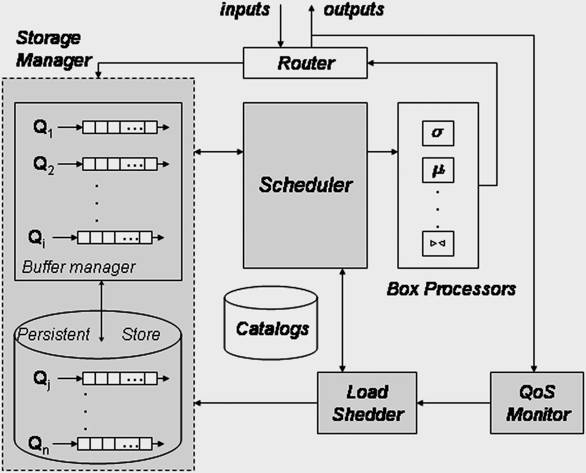

**图 3：Aurora 运行时体系结构。**

### 4.1 QoS 数据结构

Aurora 力图最大化输出的感知 QoS。QoS 通常是多个属性的多维函数，包括：

- **响应时间：** 输出元组应及时产生，否则延迟越长，QoS 越低。
- **元组丢弃：** 为削减负载而丢弃元组会使受影响输出的 QoS 恶化。
- **输出值：** 是否产生重要值显然影响 QoS。

要求管理员直接给出多维函数并不现实。Aurora 采用更易理解的方式：每个输出流都必须提供一张基于输出元组处理延迟的二维 QoS 图，如图 4(a)。当延迟小于阈值 $\delta$ 时 QoS 最大；超过 $\delta$ 后，延迟越大 QoS 越低。

管理员还可为每个输出提供两类可选 QoS 图。图 4(b) 的横轴为已交付元组百分比：交付率接近 100% 时 QoS 高，丢弃增加时 QoS 降低。图 4(c) 的横轴为可能的输出值，曲线表示各值的重要性。它反映某些输出比另一些更重要，例如工厂监控中接近临界区域的值远比远离临界区的值重要；有了这类信息，Aurora 可更智能地削减负载。

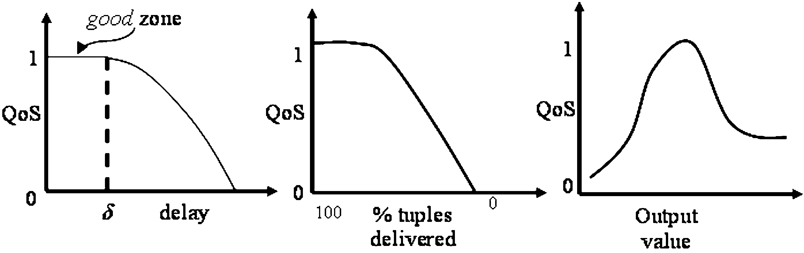

**图 4：QoS 图类型。**

Aurora 对 QoS 图作三项假设。第一，所有图都归一化，使不同输出的 QoS 可定量比较。第二， $\delta$ 必须可实现：容量合适的网络在稳态下应使所有输出位于 $\delta$ 左侧的良好区，即数据源到该输出的最长路径总计算成本所引入的延迟不能超过 $\delta$；若规范不可实现，后续算法将无法良好运作。第三，除图 4(c) 的值曲线外，QoS 图均为凸函数；这是合理假设，也是调度和负载削减所用梯度行走技术的必要条件。

QoS 概念并不限于图中属性。只要满足上述假设，Aurora 也可使用吞吐量等单个属性，或吞吐量与延迟的加权线性组合等复合属性。后文中，我们只讨论图 4 的类型。

管理员还需给出系统余量 $H$，即稳态下可使用的计算资源百分比；其余资源留给动态加入的临时查询。

### 4.2 存储管理

Aurora 存储管理器（Aurora Storage Manager，ASM）保存网络需要的所有元组：一是网络中正在传递的元组，二是连接点可能要求的额外历史元组。

**队列管理。** 每个窗口操作都需要保存与窗口等大的历史元组集；网络饱和时还会有未处理元组积压。因此 ASM 必须管理一组可变长元组队列。每个方框输出处有一个由所有后继方框共享的队列，每个后继方框在该队列中维护两个指针：`head` 指向它尚未处理的最老元组，`tail` 指向它仍需要的最老元组。二者界定随新元组处理而滑动的当前窗口。ASM 通常可以丢弃早于队列中最老 `tail` 的元组。新元组由方框产生后加入队列前端，最终被所有后继处理并离开所有窗口，届时可删除。图 5 展示 $b_1$、 $b_2$ 共享队列的双分支情形， $w$ 表示窗口大小。

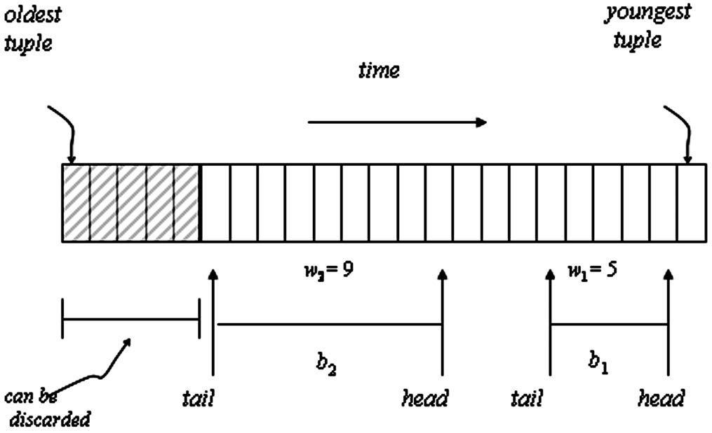

**图 5：队列组织。**

这类队列通常放在主存，但 ASM 为任意扩展采用不同方式。磁盘划分为长度可调的固定块 `block_size`，典型环境预计使用 128KB 或更大的块。每个队列先分配一个块，只要不溢出就作为环形缓冲区使用；溢出时，ASM 寻找两个块（尽量连续），把队列动态扩展到 $2\times block\char"005F{}size$ 并继续环形管理。队列收缩可类似处理。

启动时 ASM 获得一个队列存储缓冲池，并用一种新替换策略把队列块换入换出主存。调度器与 ASM 共享一张表，每个网络方框占一行，记录当前调度优先级以及其队列在主存中的比例；另有标志表示方框是否正在运行。调度器周期性调整优先级，ASM 同样调整队列主存驻留率，调度器再据此决策（见 4.3 节）。图 6 表示二者交互。

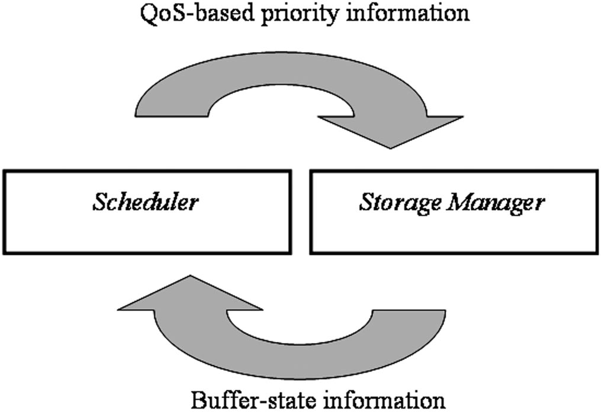

**图 6：调度器与存储管理器的交互。**

需要磁盘块空间时，ASM 淘汰主存中优先级最低的块。若某队列块不属于正在运行的方框，还会尝试用更高优先级方框的队列块替换它，持续让最高优先级队列所需块驻留主存。ASM 还知道每个队列的大小及其磁盘块是否连续，可据此调度多块读写。随着块流动和条件变化，调度器调整方框优先级，ASM 随之调整缓冲池；必须避免二者反向作用而发生迟滞、导致性能急剧恶化。

**连接点管理。** 应用设计者指定可在以后接入方框集合的连接点，从而支持临时查询。每个连接点都有历史保留要求和可选存储键。若需保留的历史短于后继方框最大窗口，就不必额外分配存储；通常则会要求更多历史。

额外历史元组由 ASM 按存储键组织成 B 树；若未指定键，就使用元组时间戳。元组离开连接点关联队列尾部时，ASM 成批插入对应 B 树，并周期性扫描删除早于历史要求的元组；批量插入和删除显然比逐条处理高效。

由于 B 树块预计小于 `block_size`，ASM 会把一个或多个缓冲池块拆成小块，用于换入历史块。调度器把临时查询方框加入共享表并赋予优先级；ASM 为值得服务的索引结构预取索引块而非数据块，只要没有更高优先级的缓冲需求就保留索引块，不尝试让数据块常驻主存。

### 4.3 实时调度

Aurora 调度必须同时应对系统规模大、实时性能要求、方框执行依赖等问题。一个元组往往要经过许多调度与执行步骤才可能贡献输出，还可能多次访问二级存储。若调度决策不考虑端到端元组处理成本，在资源受限时可能严重退化。因此 Aurora 不仅最大化总体 QoS，也显式降低总执行成本。

**列车调度。** Aurora 利用两类非线性：

- **方框间非线性。** 缓冲不足时，元组一生中可能多次在内存和磁盘之间搬运，端到端成本骤增，所以调度要尽量避免元组颠簸。若预先知道 $b_2$ 会紧接着 $b_1$ 执行，且 $b_1$ 输出流向 $b_2$，在缓冲充足时可绕过存储管理器，直接转移输出，省去开销。
- **方框内非线性。** 某方框一次可处理的元组越多，单位成本可能越低。其一，处理同样数量元组所需的方框调用减少，从而减少代码调用和上下文切换；其二，某些方框能利用更多输入更好优化，如窗口操作可物化并复用中间结果，连接可用归并连接代替嵌套循环。

Aurora 的列车调度启发式会：（1）让方框尽可能积累元组而暂不处理，形成长元组列车；（2）一次处理完整列车，利用方框内非线性；（3）把列车直接交给后继而不落盘，利用方框间非线性。首要目标是减少每元组 I/O 数，次要目标是减少每元组方框调用数。我们把一次给单个方框批量输入多个元组称为“列车调度”，把推动一列元组通过多个方框的动作称为“超级方框调度”。

与输入一到就唤醒的传统阻塞操作符不同，Aurora 调度器决定方框何时执行、处理多少排队元组。这增加了实现复杂度和调度器负担，却是形成并处理元组列车、显著降低总成本所必需的。

**优先级分配。** 输出元组延迟等于处理延迟与等待延迟之和。前者由输入速率和方框成本决定，后者主要由调度决定。Aurora 为输出分配优先级，以实现使总体 QoS 最大的逐输出等待延迟。优先级代表紧迫性，目前考虑两种方法：状态法根据当前系统状态下的期望效用分配，每次执行效用最高的输出；可通过估计若延后执行会损失多少 QoS 来计算效用。反馈法持续观察系统性能，动态提高表现不佳输出的优先级，降低已经处于良好区的应用优先级。

**综合启发式。** 系统规模大、变化快且调度粒度细，无法搜索最优解。Aurora 先按优先级选输出，再寻找构造和处理元组列车的机会，同时处理实时要求和成本降低。选定输出后，Aurora 找到第一个队列在内存中的下游方框（可调度方框的队列必须非空），然后向上游考察，直到遇到队列不在内存的方框或无方框可选，由此得到一串可连续调度的超级方框。执行某方框时，Aurora 请求 ASM 在执行期间固定其队列，把输入队列位置和处理元组数交给相应方框处理代码，并分配给可用工作线程。

**调度器性能。** 原型针对 Mitre Corporation [3] 的高级数据分发问题构造了约 40 个方框的网络，以 50,000 个模拟敌军位置报告元组为输入，多个输出消费者具有不同 QoS。网络深度约为 4；同时使用超级方框和元组列车调度时，每秒可处理约 3,200 个方框，并在输出端每秒产生约 830 个元组。

图 7 展示同一网络和输入上的实验。调度从逐方框改为元组列车后，调度器耗时缩减为原来的 0.48；再加简单超级方框调度，又缩减为此前的 0.43。总执行成本也降低，因为其中包括调用方框、管理元组队列及其游标指针、把调度动作映射到工作线程池等成本。

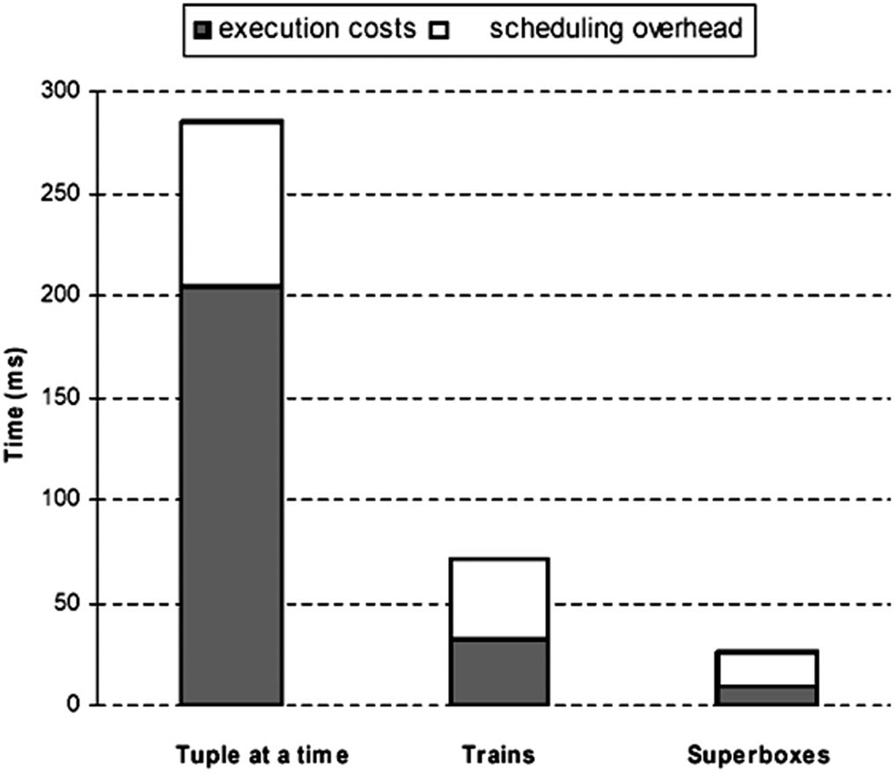

**图 7：执行开销。**

### 4.4 自省

Aurora 用静态和运行时自省预测、检测过载。

**静态分析。** 静态分析判断运行 Aurora 网络的硬件容量是否合适。若计算资源不足以处理稳态需求，队列将无限增长，响应时间也会任意增大。令方框 $b$ 的期望元组处理成本为 $c(b)$、选择率为 $s(b)$，数据源 $d$ 的期望元组产生速率为 $r(d)$。若 $b_i$ 紧接数据源 $d_i$，系统稳定要求 $b_i$ 吞吐量至少等于输入速率：

$$
\frac{1}{c(b_i)} \ge r(d_i).
$$

 $b_i$ 的输出速率可算为：

$$
\min\negthinspace{}\left(\frac{1}{c(b_i)},r(d_i)\right)s(b_i).
$$

迭代计算每个方框的输出速率和计算需求，即可得到稳态稳定运行每单位时间所需的最小总计算资源 $min\char"005F{}cap$。容量为 $C$ 的系统若 $C\lt{}min\char"005F{}cap$，就无法处理期望稳态负载；若

$$
C\times H\lt{}min\char"005F{}cap,
$$

则加入预期临时查询时响应时间必然恶化。可通过重设应用资源需求、增加系统容量或削减负载纠正。

**动态分析。** 即使资源足以应付期望条件，不可预测且持续很久的输入速率峰值仍可能使系统失去可用性。Aurora 利用基于延迟的 QoS 检测过载：数据源元组进入时加时间戳，所有操作符产生输出时保留时间戳；若有多个输入，则保留最早时间戳。输出交付应用时，系统查对应的延迟 QoS 图，确认是否在良好区。足够多输出离开良好区就是过载信号。

### 4.5 负载削减

静态或动态分析发现过载后，Aurora 通过负载削减减少元组处理量。最简单的做法是在网络任意位置无控制地随机丢弃元组，类似分组交换网络丢弃溢出分组 [30]，但会：（1）不必要地损害总体效用；（2）任意改变应用语义。Aurora 用 QoS 信息引导两类削减技术。

**丢弃元组。** 第一种方法在终止于更宽容输出的网络分支丢弃元组，力求最小化总体 QoS 下降或最大化改善。由静态分析触发时，如果没有元组延迟或值频率分布的先验知识，就只能使用基于丢弃率的 QoS；由动态分析触发时，也可使用延迟 QoS。

静态削减采用贪心算法。先找 QoS 曲线负斜率绝对值最小的输出，沿曲线水平移动，直到另一输出在该点的负斜率更小。横向距离表示为使总体 QoS 降幅最小而应丢弃的输出元组比例，即待插入 `Drop` 方框的选择率。[^2] 再把 `Drop` 尽量上移，直到遇到影响其他输出的分流点，并放在那里；同时计算回收资源，若仍不足就重复。

运行时算法类似，但用延迟 QoS 找出超过阈值的问题输出，重复削减直到满足延迟目标。动态削减有两点细节：一是 `Drop` 必须获得较高调度优先级，否则无法有效减载，因此负载削减器不考虑调度器标记为低优先级的不活跃输出；二是通常把 `Drop` 尽量靠近源，以免元组先消耗资源，但若某方框已经积压大队列，临时在该处插入比继续上移更合理。

应用一般已经能容忍通信故障等原因造成的数据源元组缺失，负载削减只是人工增加缺失元组；应用语义虽有所改变，损害应有限。

**用过滤作语义负载削减。** 随机丢弃策略能尽量保护总体效用，却无法控制对应用语义的影响。若有基于值的 QoS，语义削减就用 `Filter` 有控制地丢掉较不重要的元组。

Aurora 可监控每个输出，建立各值区间出现频率的直方图，并对每个区间把 QoS 值乘以频率后求和，计算期望效用。削减时选择效用最低的输出区间，把区间转成过滤谓词，并把过滤尽量向上游传播到分流点。这种“反向区间传播”需要求沿途每个操作符的逆函数，而 Aurora 方框不一定可逆，适用范围有限。

另一种“正向区间传播”从输出向上游走到分流点或数据源，估计过滤谓词，再向下游传播查看输出结果，通过试错收敛到所需谓词。两者也可组合：先反向传播到逆函数难求的方框 $b$，再在过滤插入点与 $b$ 之间正向传播；迭代执行直到削减足够负载。具体的插入位置和选择率算法留待后续论文。

## 5 SQuAl：Aurora 查询代数

Aurora 流查询代数 SQuAl 用七个操作符构造 Aurora 网络（查询）。它们与关系代数操作符类似，却为流处理的特殊要求作了根本调整；设计由若干真实流应用的示例查询驱动。本节详述这些操作符及设计理由。

### 5.1 模型

流是模式统一、只能追加的元组序列。除应用数据字段 $A_1,\ldots,A_n$ 外，每个元组还有时间戳 `ts`，表示它在 Aurora 网络中的起源时间，用于 QoS 计算，但对查询隐藏。[^3] 因此流类型为：

$$
(TS,A_1,\ldots,A_n),
$$

流元组为：

$$
(ts,v_1,\ldots,v_n).
$$

为方便记号，我们通常按查询可见的类型和值写成：

$$
(A_1=v_1,\ldots,A_n=v_n),
$$

只在相关时加上隐式 QoS 时间戳属性 $(TS=ts)$。

常见做法是假设元组按计数器或时间等单调递增值的次序到达，这可把窗口简单定义成该有序值的范围。但 Aurora 数据模型不假定到达顺序，原因是：

1. Aurora 网络可能无法保证有序交付，例如合并多个流时。
2. Aurora 允许在任何属性上开窗，而不仅是时间戳和元组数；某些属性本就可能乱序。
3. 容忍乱序后，可以让输出乱序产生，从而优先服务高优先级元组。

有些操作符与顺序无关（`Filter`、`Map`、`Union`），另一些对顺序敏感（`BSort`、`Aggregate`、`Join`、`Resample`）：只有能假定输入流具有某种有界乱序的次序时，后者才保证用有限缓冲空间在有限时间内完成。因此顺序敏感操作符必须带顺序规范参数，说明预期到达次序，详见 5.2.2 节。

### 5.2 操作符

5.2.1 节介绍三个顺序无关操作符，5.2.2 节介绍四个顺序敏感操作符，最后给出两个示例查询。与关系代数一样，SQuAl 不追求最小操作符集；冗余反而创造优化机会。加上可扩展的 `Map` 和 `Aggregate`，该操作符集是图灵完备的。

#### 5.2.1 顺序无关操作符

这三个操作符始终可以按元组到达次序处理。`Filter` 类似关系选择，但可使用多个谓词并按满足情况路由；`Map` 类似关系投影，但可应用任意函数，包括用户定义函数；`Union` 合并两个或更多同模式流。以下假定输入元组为：

$$
t=(TS=ts,A_1=v_1,\ldots,A_k=v_k),
$$

其中 $TS$ 是 QoS 时间戳， $A_1,\ldots,A_k$ 是值属性。

##### 5.2.1.1 Filter

`Filter` 类似 `case` 语句，可把输入元组路由到不同流，形式为：

$$
Filter(P_1,\ldots,P_m)(S),
$$

其中 $P_1,\ldots,P_m$ 是输入流 $S$ 上的元组谓词。它产生 $m+1$ 个输出流 $S_1,\ldots,S_{m+1}$。对每个输入元组 $t$，若 $(i=m+1\ \text{或}\ P_i(t))$ 且 $\forall j\lt{}i,\neg P_j(t)$，则把 $t$ 输出到 $S_i$。即满足 $P_1$ 的进入第一流；满足 $P_2$ 但不满足 $P_1$ 的进入第二流；依此类推；第 $m+1$ 流包含不满足任何谓词的元组。`Filter` 原样输出输入元组，因此模式、值和 QoS 时间戳均不变。

##### 5.2.1.2 Map

`Map` 是广义投影：

$$
Map(B_1=F_1,\ldots,B_m=F_m)(S),
$$

其中 $B_1,\ldots,B_m$ 是属性名， $F_1,\ldots,F_m$ 是输入流 $S$ 元组上的函数。对每个输入元组 $t$，输出：

$$
(TS=t.TS,B_1=F_1(t),\ldots,B_m=F_m(t)).
$$

结果流通常与输入模式不同，但保留对应输入元组的时间戳。

##### 5.2.1.3 Union

`Union` 把两个或更多同模式流合并成单一输出流：

$$
Union(S_1,\ldots,S_n).
$$

它可按任意次序输出；显然可采用不区分来源、按到达次序发出元组的策略。由于输出所有输入元组，模式、值和 QoS 时间戳都不变。

#### 5.2.2 顺序敏感操作符

其余四个操作符只有在输入满足某种顺序（允许有界乱序）时，才保证用有限缓冲在有限时间执行。顺序规范形式为：

$$
Order(On\ A,Slack\ n,GroupBy\ B_1,\ldots,B_m),
$$

其中 $A,B_1,\ldots,B_m$ 是属性， $n$ 为非负整数。（注： $A$ 可以是虚拟属性 `Tup#`，它把流中连续元组映射成连续整数，从而可按到达次序指定顺序，适用于基于元组数定义窗口。） 当 $Slack=0$ 且 `GroupBy` 为空时，元组预期按 $A$ 升序到达；凡 $A$ 小于此前某个元组的值，就视为乱序并忽略。[^5]

非零 `Slack` 和非空 `GroupBy` 放宽乱序判定，以计算延迟换取更少丢弃。若 $t$ 之前有多于 $n$ 个元组 $u$ 满足 $u.A\gt{}t.A$，就称 $t$ 在 $S$ 中“相对 $A$ 乱序 $n$ 位”。对规范 $O=Order(On\ A,Slack\ n,GroupBy\ B_1,\ldots,B_m)$，若 $t$ 相对 $A$ 乱序 $n$ 位，就称其相对 $O$ 乱序；假定 $O$ 的操作符会丢弃输入流 $S$ 中所有相对 $O$ 乱序的元组。

`GroupBy` 参数按 $B_1,\ldots,B_m$ 值隐式划分输入流，并独立考察各分区的顺序。换言之，只在与 $t$ 的各分组值相同的分区内判断它是否相对 $A$ 乱序 $n$ 位。

下面四个操作符都为每个输入流指定顺序，并忽略违反规范的元组。`BSort` 是等价于有限趟冒泡排序的近似排序；`Aggregate` 在滑动窗口上应用窗口函数；`Join` 是作用于无限流的类带连接二元操作符 [27]；`Resample` 用插值对齐流。后文所说“每个元组 $t$”均不包含被忽略的乱序元组。

##### 5.2.2.1 BSort

`BSort` 的形式为：

$$
BSort(Assuming\ O)(S),
$$

其中 $O=Order(On\ A,Slack\ n,GroupBy\ B_1,\ldots,B_m)$ 是输出流预期顺序。无限流无法在有限时空中完全排序；`BSort` 以缓冲区实现近似排序，当 $slack=n$ 时等价于冒泡排序的 $n$ 趟。它维护 $n+1$ 个元组的缓冲区，每次缓冲区填满，就弹出其中 $A$ 最小的元组作为输出。

例如，输入流元组的 $A$ 值为：

```text
1, 3, 1, 2, 4, 4, 8, 3, 4, 4
```

以 $Slack=2$ 执行的过程见图 8。上方是时间轴和从左向右到达的输入，下方是每个时刻的三元组缓冲区；每个新元组加入后，有一个元组被弹出到输出。输出等价于对输入执行两趟冒泡排序后的序列；更准确地说，图中只有前八个值，另两个仍在缓冲区。`BSort` 只改变次序，输出模式、值和 QoS 时间戳不变。

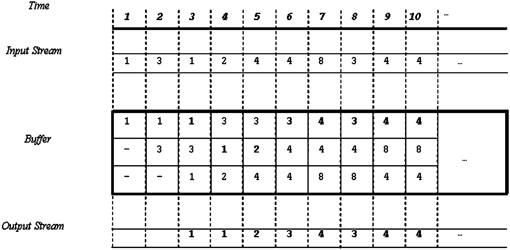

**图 8：BSort 应用示例。**

##### 5.2.2.2 Aggregate

`Aggregate` 在输入流的滑动窗口上应用窗口函数：

$$
Aggregate(F,Assuming\ O,Size\ s,Advance\ i)(S),
$$

其中 $F$ 是窗口函数（SQL 风格聚合或 Postgres 风格用户定义函数）， $O=Order(On\ A,Slack\ n,GroupBy\ B_1,\ldots,B_m)$ 是输入流 $S$ 的顺序规范， $s$ 是按 $A$ 值度量的窗口大小， $i$ 是窗口滑动方式，可为整数或谓词。[^6]

它输出下列形式的元组：

$$
(TS=ts,A=a,B_1=u_1,\ldots,B_m=u_m)\mathbin{++}F(W),
$$

其中窗口 $W$ 是输入流的子序列，元组 $A$ 值在 $a$ 到 $a+s-1$ 之间（含端点）， $B_1,\ldots,B_m$ 值分别为 $u_1,\ldots,u_m$； $ts$ 为 $W$ 中最早时间戳。 $++$ 表示元组拼接。 $F$ 返回聚合计算元组，再与标识窗口的 $B_1,\ldots,B_m,A$ 字段拼接。

例如，在按报价时间 `Time` 有序的股票报价流上，按股票 `Sid` 计算每小时平均价格 `Price`：

```text
Aggregate [Avg(Price),
          Assuming Order(On Time, GroupBy Sid),
          Size 1 hour,
          Advance 1 hour]
```

该操作为每个股票 ID 的每个小时计算均价。图 9 左侧是 11 个模式为 `(Sid, Time, Price)` 的输入元组；中间每个方框表示由股票 ID 和一小时时段唯一标识的窗口；右侧输出模式为 `(Sid, Time, AvgPrice)`，其中 `Time` 是区间起点，`AvgPrice` 是该股票在区间内的均价。

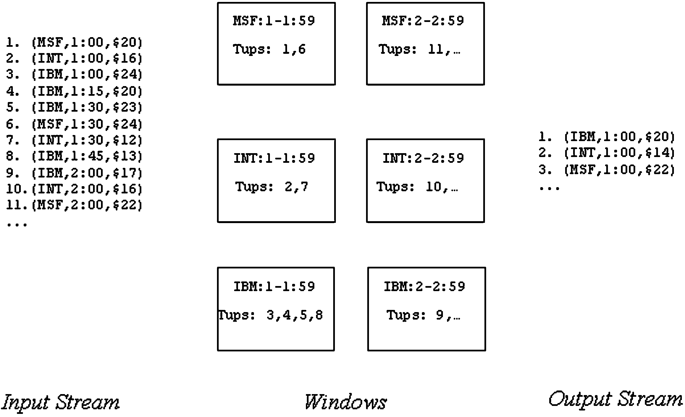

**图 9：Aggregate 执行轨迹示例。**

顺序规范使 `Aggregate` 能处理乱序。例如图 9 中 IBM 1:45 的报价若迟到，输入次序为：

```text
1.  (MSF,1:00,$20)
2.  (INT,1:00,$16)
3.  (IBM,1:00,$24)
4.  (IBM,1:15,$20)
5.  (IBM,1:30,$23)
6.  (MSF,1:30,$24)
7.  (INT,1:30,$12)
9.  (IBM,2:00,$17)
10. (INT,2:00,$16)
11. (MSF,2:00,$22)
8.  (IBM,1:45,$13)
...
```

只要 `Slack` 至少为 1，迟到元组仍计入 IBM 1:00-1:59 窗口，输出仍如图 9。因为在 `Sid=IBM` 分区中，只有一个先到元组的 `Time` 大于它，故 $Slack=1$ 足够。

一般地，带松弛量 $n$ 的聚合：

$$
Aggregate(F,Assuming\ Order(On\ A,Slack\ n,GroupBy\ B_1,\ldots,B_m),Size\ s,Advance\ i)(S)
$$

等价于零松弛聚合与 `BSort` 的组合：

$$
\begin{aligned}
&Aggregate(F,Assuming\ Order(On\ A,Slack\ 0,GroupBy\ B_1,\ldots,B_m),Size\ s,Advance\ i)\\
&\quad\left(BSort(Assuming\ Order(On\ A,Slack\ n,GroupBy\ B_1,\ldots,B_m))(S)\right).
\end{aligned}
$$

该恒等式可用于优化：一次排序结果可被多个在同一属性上开窗的查询复用，但 `Aggregate` 的实际求值不必先排序输入。[^7]

流聚合的另一问题是阻塞：等待丢失或迟到元组才完成窗口。实时应用必须允许聚合超时，即使牺牲准确性。例如计算一个排的地理质心时，士兵可能关闭通信设备、离开覆盖范围或处于高延迟区域；与其无限等待，不如在所有读数到齐前给出近似结果。

为此 `Aggregate` 可带可选超时：

$$
Aggregate(F,Assuming\ O,Size\ s,Advance\ i,Timeout\ t).
$$

每个窗口计算开始时记录本地时间；若到“初始本地时间 $+t$”仍未输出结果，就发生超时。[^8] 系统提前发出该窗口结果，并忽略之后到达、原本会参与计算的元组。

##### 5.2.2.3 Join

`Join` 是二元连接：

$$
Join(P,Size\ s,Left\ Assuming\ O_1,Right\ Assuming\ O_2)(S_1,S_2),
$$

其中 $P$ 是输入流 $S_1,S_2$ 元组对上的谓词， $s$ 为整数； $O_1$ 是 $S_1$ 的数值或时间属性 $A$ 上的顺序规范， $O_2$ 是 $S_2$ 的属性 $B$ 上的规范。对 $S_1$ 中每个有序元组 $t$ 和 $S_2$ 中每个有序元组 $u$，若 $|t.A-u.B|\le s$ 且 $P(t,u)$ 成立，就输出拼接元组 $t\mathbin{++}u$；其 QoS 时间戳为 $t,u$ 中较早者。

例如， $X,Y$ 是两个排的士兵位置报告流，模式均为 `(Sid, Time, Pos)`；`Sid` 是士兵 ID，`Pos` 是简化为整数的位置[^9]，`Time` 是报告时间。要找出两个排中在十分钟内报告相同位置的所有士兵对，可写成：

$$
Join(P,Size\ 10\ min,Left\ Assuming\ O,Right\ Assuming\ O)(X,Y),
$$

其中 $O=Order(On\ Time)$，且 $P(x,y)\Leftrightarrow x.pos=y.pos$。图 10 给出执行轨迹。对称哈希连接 [28] 的简单变体会依据顺序假设，从内部表中删除已不可能与未来另一流元组连接的元组；无论两条输入流怎样交错，都能得到正确结果。

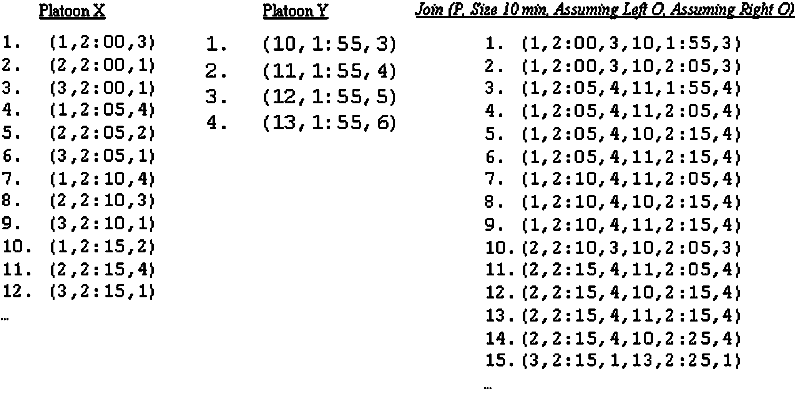

**图 10：Join 执行轨迹示例。**

与 `Aggregate` 一样，`Join` 可用 `Slack` 容忍乱序，并满足以下恒等式：

$$
\begin{aligned}
&Join(P,Size\ s,Left\ Assuming\ O_1,Right\ Assuming\ O_2)(S_1,S_2)\\
={}&Join(P,Size\ s,Left\ Assuming\ O'\relax_1,Right\ Assuming\ O'\relax_2)\\
&\quad\left(BSort(Assuming\ O_1)(S_1),BSort(Assuming\ O_2)(S_2)\right),
\end{aligned}
$$

其中：

$$
\begin{aligned}
O_1&=Order(On\ A,Slack\ n_1,GroupBy\ A_1,\ldots,A_{m_1}),\\
O_2&=Order(On\ B,Slack\ n_2,GroupBy\ B_1,\ldots,B_{m_2}),\\
O'\relax_1&=Order(On\ A,GroupBy\ A_1,\ldots,A_{m_1}),\\
O'\relax_2&=Order(On\ B,GroupBy\ B_1,\ldots,B_{m_2}).
\end{aligned}
$$

实际执行同样不必排序输入，只需延后清理以容纳松弛量。`Join` 还允许一侧或两侧输入为静态表；静态表可视为无限大小的流窗口。

##### 5.2.2.4 Resample

`Resample` 是非对称、类似半连接的同步操作符，用于对齐一对流：

$$
Resample(F,Size\ s,Left\ Assuming\ O_1,Right\ Assuming\ O_2)(S_1,S_2),
$$

其中 $F$ 是窗口函数， $s$ 为整数； $S_1$ 假定按属性 $A$ 有序， $O_1$ 是 $S_1$ 的 $A$ 上的顺序规范， $O_2$ 是 $S_2$ 的数值或时间属性 $B$ 上的规范。对 $S_1$ 中每个元组 $t$，输出：

$$
(B_1:u.B_1,\ldots,B_m:u.B_m,A:t.A)\mathbin{++}F(W(t)),
$$

其中：

$$
W(t)=\lbrace{}u\in S_2\mid u\text{ 在 }S_2\text{ 中相对 }O_2\text{ 有序，且 }|t.A-u.B|\le s\rbrace{}.
$$

即对 $S_1$ 的每个元组，用插值函数 $F$ 在 $S_2$ 中大小为 $2s$ 的窗口上生成一个插值。

设 $X$ 是排 X 士兵不规则发出的报告流， $H$ 是每 15 分钟发出的“心跳”流。若要在时刻 $t$ 用前后十分钟内所有位置报告的窗口和函数 $F$ 估计每名士兵的位置，（注： $F$ 可以按报告时间与 $t$ 的差给权，对位置作加权平均；本例采用更简单的函数，只报告窗口内元组位置的平均值。） 可写成：

$$
Resample(F,Size\ 10,Left\ Assuming\ O_1,Right\ Assuming\ O_2)(H,X),
$$

其中 $O_1=Order(On\ Time)$， $O_2=Order(On\ Time,GroupBy\ Sid)$。图 11 中心跳流模式为 `Time`、每 15 分钟一个值；位置流模式仍为 `(Sid, Time, Pos)`。元组按计算完成次序发出：尽管 `Sid=1` 的位置报告（元组 1）早于 `Sid=2`（元组 2）到达，首个插值却来自后者，因为士兵 2 的计算在第一个时间戳晚于 2:10 的该士兵元组（元组 3）到达时先结束。

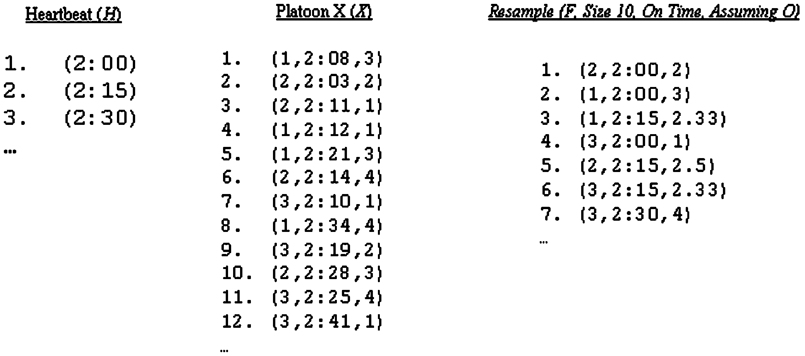

**图 11：Resample 执行轨迹示例。**

### 5.3 查询示例

下面两个 SQuAl 查询源自与 Mitre Corporation 关于军事后勤应用的讨论。输入仍为模式 `(Sid, Time, Pos)` 的士兵位置报告流；为简化，位置和时间戳都取整数。

**查询 1：** 当同一时刻有 $m$ 名士兵越过边界 $k$ 时输出；越界由谓词 $Pos\ge k$ 判断。

图 12 给出表达式。第一个方框过滤出越界位置报告；随后按 `Time` 假定顺序的聚合，计算每个时刻越界士兵数；最后一个过滤按照图中的 $CNT\ge m$ 条件，找出计数达到或超过 $m$ 的时刻。

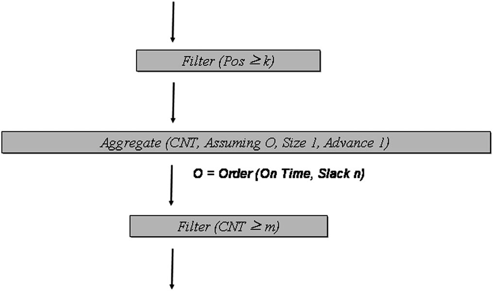

**图 12：查询 1。**

图 13 展示 $k=30,m=3,n(Slack)=1$ 时的轨迹。识别出 $m$ 名士兵越界时，输出不会立即产生：`Aggregate` 处理第五个元组后，已经知道应输出 `Time=2` 时有三名士兵越界，但要等第七个元组处理完、`Time=2` 窗口关闭后才发出。

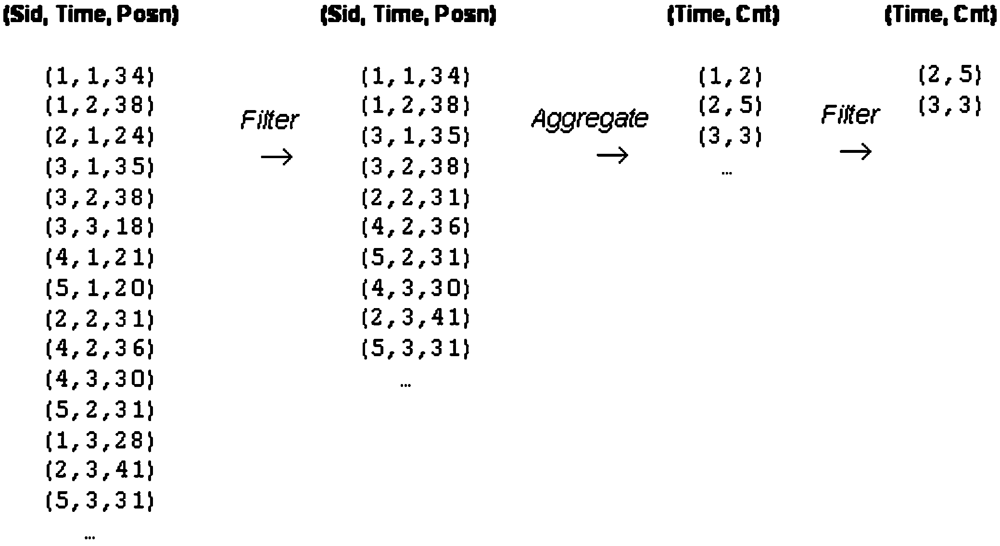

**图 13：查询 1 的执行轨迹示例。**

图 14 用类 C 的用户定义窗口函数消除该延迟。查询先按 `Time` 排序所有越界报告，后续 `Aggregate` 始终维护恰含 $m$ 个元组的窗口；每当窗口中所有元组的 `Time` 相同，即该时刻有 $m$ 份越界报告，就输出该时间。

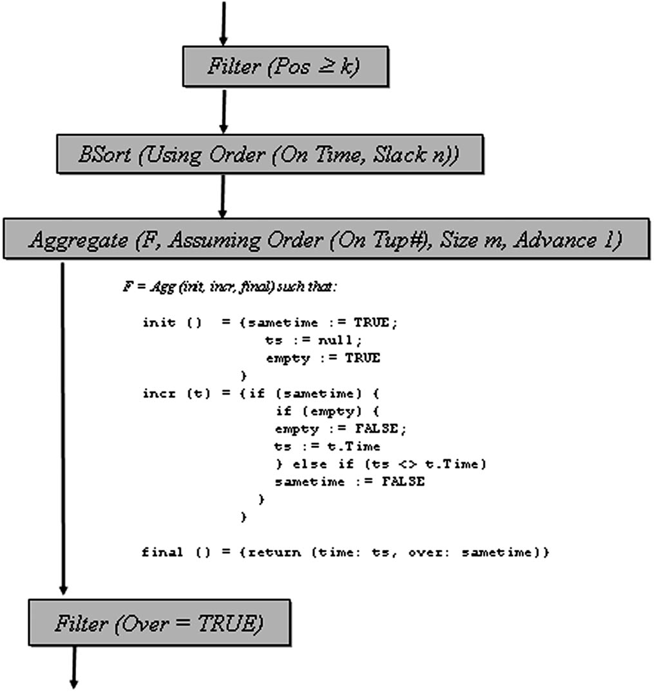

**图 14：查询 1 的精简版本。**

图 15 在与图 12 相同输入上展示轨迹。只要有 $n+k-1$ 名士兵越界，该查询就输出 $k$ 个元组；例如 `Time=2` 时五名士兵越界，发出三个元组。可再加窗口大小为 2 的 `Aggregate` 消除多余元组：只有当新元组是窗口中最新者，且时间值不同于最老元组时才输出。

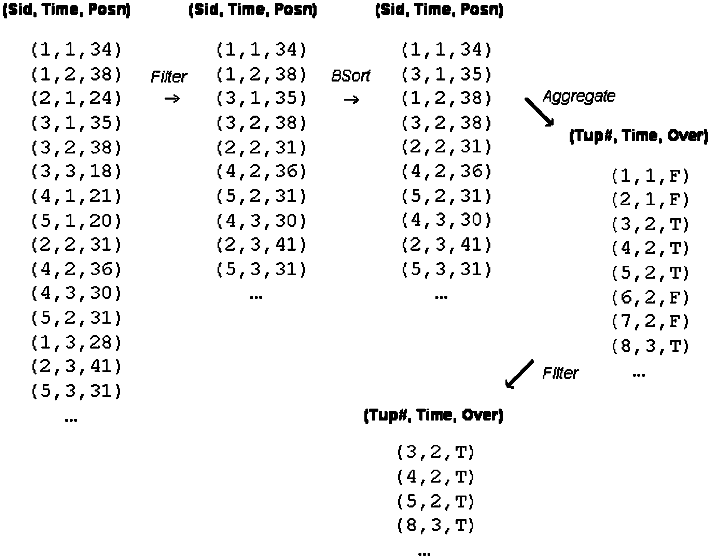

**图 15：查询 1 精简版本的执行轨迹。**

**查询 2：** 对每个时间戳计算所有士兵位置的质心；若与上一读数相差 100 米就告警。为某个时刻计算质心时，等待位置报告不应超过 $t$ 秒。

图 16 给出表达式。第一个方框按 `Time` 假定顺序，用用户定义函数计算全部位置报告的质心；`Timeout` 保证从第一份到最后一份士兵报告的等待不超过 $t$ 秒。第二个 `Aggregate` 维护大小为 2 的窗口，比较最近两次质心计算是否相差至少 100。用户定义窗口函数 $F$ 执行比较，并输出标志 `Diff`；若最新质心比前一个相差至少 10 米，标志设为 `TRUE`。最后的 `Filter` 返回标志为真的质心及其时间戳。

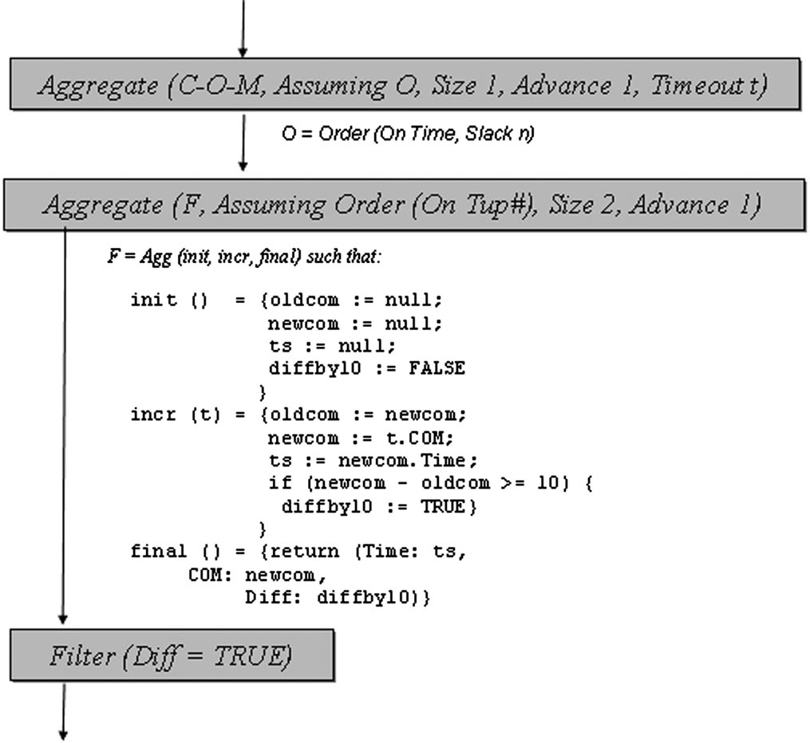

**图 16：查询 2。**

图 17 给出 $n(Slack)=2$ 时的执行轨迹。

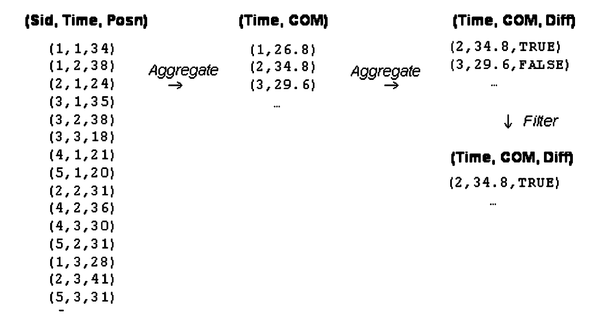

**图 17：查询 2 的执行轨迹示例。**

## 6 相关工作

查询索引 [4] 是提高大规模过滤应用性能的重要技术。在 Aurora 中，它对应先合并若干输入，再扇出到大量 `Filter` 方框。查询索引在此有用，但只代表 Aurora 的一种处理习惯用法。

主动数据库 [23, 24] 与 Aurora 一样关注条件监控，这些条件可能由数据库存储状态的任意更新触发；Aurora 的更新只能追加，因此需要不同的监控条件检测策略。触发器对真假条件求值。我们的框架既能支持数据流查询，也能把查询转换成监控条件。主动数据库可扩展性也有大量研究，例如 [13]；这些工作与连续查询研究类似，主要聚焦查询索引，而 Aurora 构建的是更通用的系统。

自适应查询处理 [5, 15, 28] 面向不可预测、动态环境，会随输入特征变化修订执行计划。尤其相关的是 Eddies [5]：传统查询让同一数据源的每个元组以相同方式处理，Eddy 则把每个元组动态路由到不同操作符线程作部分处理，并让元组携带自身处理状态。后续工作 [18] 扩展 Eddies，使其同时、无限期处理多个流查询。Aurora 与之相似，也把单个查询拆成每个操作符一个控制线程；但 Eddies 假定查询必须完整处理，没有负载削减或 QoS 概念。

Aurora 的一个特例是连续查询系统。NiagaraCQ [9] 关注广域环境中的多数据源合并，而 Aurora 初期关注能处理海量数据流的通用流处理器。Viglas 和 Naughton [29] 又在 NiagaraCQ 背景下讨论流式广域信息源的基于速率查询优化。

近期数据流查询体系结构与 Aurora 有许多共同目标和应用领域。Fjords [17] 把拉/推语义嵌入查询操作符之间的队列，组合推送式传感器源和拉取式传统源；其操作符调度由查询线程专用调度器和操作符-队列交互共同决定，与 Aurora 根本不同。Tribeca [27] 是面向网络流量分析的可扩展流处理器，包含一些 Aurora 操作符和编译期优化，但不处理调度、负载削减，也没有临时查询。

STREAM [7] 也试图提供完整的数据流管理与处理功能。两者面对很多相同的数据和资源管理问题，但假设和性能标准不同，方案也不同。Aurora 的调度、存储和负载削减都由 QoS 规范驱动，STREAM 没有 QoS 概念；STREAM 用 SQL 变体表达流处理需求，Aurora 则采用更直接的工作流式查询。更详细比较见 [20]。

面向序列数据库的 SEQ 模型 [26] 提供位置和记录操作符。有些与 Aurora 很相似，例如 `Filter`、`Map` 可编码为 SEQ 的 `Transform`，但差异显著。其一，持久化有限序列与在线流在概念上不同，SEQ 不处理元组只出现一次、迟到或排序问题。其二，SEQ 没有 Aurora `Join` 这样的二元窗口操作符；其位置二元操作只作用于两个序列相同位置的元组，因而没有 `Timeout` 和 `Slack`。其三，SEQ 没有像 Aurora `XSection` 那样跨复合流工作的操作符。

Chronicle 数据模型 [23] 为只能追加的序列（chronicle）定义了受限的视图定义和操作语言，操作符是关系 `Selection`、`Projection`、`Join`、`Union`、`Difference`、`GroupBy`、`CrossProduct` 的序列对应物。`Selection` 对应 Aurora `Filter`，`Projection` 是通用 `Map` 的特例。Chronicle 的连接谓词仅限于序列属性上的等值，因此不能作窗口连接。`GroupBy` 类似 Aurora `Tumble`，但与 SEQ 一样不处理阻塞，没有 `Timeout` 和 `Slack`。Aurora 的复合流近似 Chronicle 的组，但后者主要用组来限制二元操作符只能作用于同组 chronicle。

物化视图 [12] 本质上是存储的连续查询，在基表改变时重执行或增量更新。Aurora 连续查询与之不同：更新只能追加，更容易增量物化；查询结果作为流发出而不存储；高流速还可能要求负载削减等近似处理，以准确性换效率。

Aurora 也会受益于并促进时态数据库 [22]、主存数据库 [10] 和实时数据库 [16, 22] 研究。这些领域通常假定 HADP，Aurora 则以流为基本对象并采用 DAHP。实时数据库给事务分配时间约束，并力求满足；Aurora 把软硬截止时间推广为一般效用函数。实时数据库为单个事务设截止时间，Aurora 为流处理输出关联 QoS 曲线，必须持续满足时间要求。工作流系统相关研究（如 [19]）主要组织长时间、相互依赖的活动，没有考虑实时处理。

实时、多媒体系统和数据库中的任务调度已有大量研究 [21, 22]，常由截止时间驱动：每个调度点选择截止时间最早或期望 QoS（如吞吐量）最高的任务。Aurora 中这种方法既因潜在可调度任务（元组）过多而不实际，也因暗含“任务均驻留内存且一次执行完”的假设而低效。据我们所知，列车调度通过利用方框内外非线性来降低总执行成本的能力是独有的。

文献 [28] 也以调度处理查询，但不支持连续查询，主要关注数据速率过慢（Aurora 还处理速率过高），而且只处理单输出树形查询计划。Chain [6] 是流处理操作符调度算法，目标是降低运行时内存消耗，不处理延迟等用户层性能指标；Aurora 的目标是最大化 QoS。

数据网络拥塞控制 [30] 与 Aurora 负载削减相关。网络通常随机、按时间戳或按应用优先级位丢弃单个分组，但存在根本差异：网络削减天然分布式，Aurora 知道全局状态，可作更智能决策；Aurora 使用外部应用提供的 QoS 触发并引导削减；语义削减不仅尽量减少总效用损失，还量化因丢弃元组造成的不精确性。

负载削减也与近似查询回答 [14]、数据缩减和摘要技术 [8, 11] 相关，这些方法用结果准确性换效率。Aurora 丢弃数据后基于样本计算，实际上通过抽样产生近似答案；独特之处在于抽样由 QoS 规范驱动。

## 7 实现状态

截至 2003 年 3 月，Aurora 已有原型。基于 Java 的 GUI 可构造并执行 Aurora 网络，支持任意网络构造、QoS 图规范、流类型推断和缩放。图 18 是当时界面：用户从左侧操作符面板拖放操作符并连接；绘图区左侧小黑框是连接外部流源的输入端口，右侧小框是连接应用的输出端口。

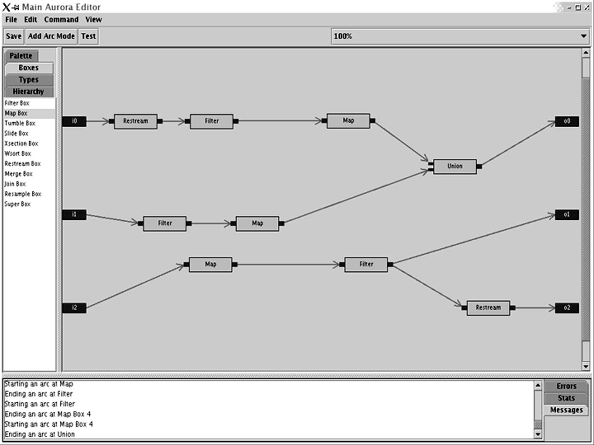

**图 18：Aurora GUI。**

图 19 展示集成队列监控工具，用于检查网络中排队元组；较小的深色窗口显示各条弧的状态。界面还可暂停，用于调试和性能监控。

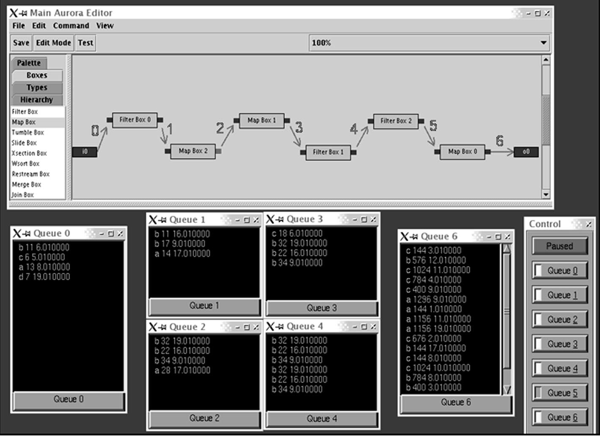

**图 19：队列监控。**

运行时系统包含调度器、初步的存储管理器和大多数方框执行代码。我们正在比较调度算法，并扩展存储管理器以定义、管理连接点。Aurora 元数据存于模式中，模式保存在 Berkeley DB 数据库。功能上系统已经完整，可构造并运行多方框网络，但当时尚无优化和负载削减。

## 8 结论与未来工作

监控应用普遍具有信息流、触发器、实时要求和不精确数据。传统 DBMS 基于 HADP，不能充分支持这类应用。我们给出面向监控应用的 DAHP 系统 Aurora 的基本数据流模型和体系结构，并指出：要高效支持这些苛刻应用，既要重新审视数据库设计与实现的许多既有方面，也要发展主动式数据存储和处理的新概念、新技术。

我们先介绍 Aurora 的模型、体系结构和工作流原始构件，再给出优化大型网络的多种启发式方法；随后讨论运行时存储组织、实时调度、自省和负载削减，并在各方面提出新方案；最后详述一组新的数据流操作符。

我们当时正在研究两个重要方向。第一，本文大部分讨论单机 Aurora，但许多流应用需要分布式处理。分布式体系结构 Aurora* 将把操作符推近数据源，提高可扩展性、能源利用和带宽效率。它在一组通信节点上各运行完整 Aurora，通过复制路径上的方框，把子网副本及部分输入流迁移到负载较轻的节点来管理负载。第二，我们在扩展基本数据和处理模型，以应对传感器流中常见的缺失值和不精确值。

## 致谢

感谢 2002 年 10 月在 Berkeley 举行的 “Stream Team” 会议全体参与者对 SQuAl 的建议，特别感谢 Jennifer Widom 建议把排序操作符设计成无损操作符。

## 参考文献

[1] Informix White Paper. (2003) Time series: the next step for telecommunications data management. http://www-3.ibm.com/software/data/informix/pubs/whitepapers/nextstep_wp.pdf

[2] Lojack.com (2003) http://www.lojack.com/

[3] Mitre Corporation (2003) http://www.mitre.org/

[4] Altinel M, Franklin MJ (2000) Efficient filtering of XML documents for selective dissemination of information. In: Proceedings of the 26th International Conference on Very Large Data Bases (VLDB), Cairo, 10-14 September 2000, pp 53-64.

[5] Avnur R, Hellerstein J (2000) Eddies: continuously adaptive query processing. In: Proceedings of the 2000 ACM SIGMOD International Conference on Management of Data, Dallas, pp 261-272.

[6] Babcock B, Babu S, Datar M, Motwani R (2003) Chain: operator scheduling for memory minimization in stream systems. In: Proceedings of the International SIGMOD Conference, San Diego, 9-12 June 2003 (in press).

[7] Babu S, Widom J (2001) Continuous queries over data streams. SIGMOD Record 30(3):109-120.

[8] Barbara D, DuMouchel W, Faloutsos C, Haas PJ, Hellerstein JM, Ioannidis YE, Jagadish HV, Johnson T, Ng RT, Poosala V, Ross KA, Sevcik KC (1997) The New Jersey data reduction report. IEEE Data Engineering Bulletin 20(4):3-45.

[9] Chen J, DeWitt DJ, Tian F, Wang Y (2000) NiagaraCQ: a scalable continuous query system for internet databases. In: Proceedings of the 2000 ACM SIGMOD International Conference on Management of Data, Dallas, 14-19 May 2000, pp 379-390.

[10] Garcia-Molina H, Salem K (1992) Main memory database systems: an overview. IEEE Transactions on Knowledge and Data Engineering 4(6):509-516.

[11] Gehrke J, Korn F, Srivastava D (2001) On computing correlated aggregates over continual data streams. In: Proceedings of the 2001 ACM SIGMOD International Conference on Management of Data, Santa Barbara, CA, 21-24 May 2001, pp 13-24.

[12] Gupta A, Mumick IS (1995) Maintenance of materialized views: problems, techniques, and applications. IEEE Data Engineering Bulletin 18(2):3-18.

[13] Hanson EN, Carnes C, Huang L, Konyala M, Noronha L, Parthasarathy S, Park JB, Vernon A (1999) Scalable trigger processing. In: Proceedings of the 15th International Conference on Data Engineering, Sydney, 23-26 March 1999, pp 266-275.

[14] Hellerstein JM, Haas PJ, Wang HJ (1997) Online aggregation. In: Proceedings of the 1997 ACM SIGMOD International Conference on Management of Data, Tucson, 13-15 May 1997, pp 171-182.

[15] Ives ZG, Florescu D, Friedman M, Levy A, Weld DS (1999) An adaptive query execution system for data integration. In: Proceedings of the 1999 ACM SIGMOD International Conference on Management of Data, Philadelphia, 1-3 June 1999, pp 299-310.

[16] Kao B, Garcia-Molina H (1994) An overview of realtime database systems. In: Stoyenko AD (ed) Real time computing. Springer, Berlin Heidelberg New York.

[17] Madden S, Franklin MJ (2002) Fjording the stream: an architecture for queries over streaming sensor data. In: Proceedings of the 18th International Conference on Data Engineering, San Jose, 26 February-1 March 2002.

[18] Madden SR, Shaw MA, Hellerstein JM, Raman V (2002) Continuously adaptive continuous queries over streams. In: Proceedings of the ACM SIGMOD International Conference on Management of Data, Madison, WI, 3-6 June 2002, pp 49-60.

[19] Mohan C, Agrawal D, Alonso G, Abbadi AE, Gunther R, Kamath M (1995) Exotica: a project on advanced transaction management and workflow systems. SIGOIS Bulletin 16(1):45-50.

[20] Motwani R, Widom J, Arasu A, Babcock B, Babu S, Datar M, Manku G, Olston C, Rosenstein J, Varma R (2002) Query processing, approximation, and resource management in a data stream management system. Stanford University, Computer Science Department 2002-41, August 2002.

[21] Nieh J, Lam MS (1997) The design, implementation and evaluation of SMART: a scheduler for multimedia applications. In: Proceedings of the 16th ACM Symposium on Operating Systems Principles, Saint-Malo, France, 5-8 October 1997, pp 184-197.

[22] Ozsoyoglu G, Snodgrass RT (1995) Temporal and real-time databases: a survey. IEEE Transactions on Knowledge and Data Engineering 7(4):513-532.

[23] Paton N, Diaz O (1999) Active database systems. ACM Computing Surveys 31(1):63-103.

[24] Schreier U, Pirahesh H, Agrawal R, Mohan C (1991) Alert: an architecture for transforming a passive DBMS into an active DBMS. In: Proceedings of the 17th International Conference on Very Large Data Bases, Barcelona, 3-6 September 1991, pp 469-478.

[25] Sellis TK, Ghosh S (1990) On the multiple-query optimization problem. IEEE Transactions on Knowledge and Data Engineering 2(2):262-266.

[26] Seshadri P, Livny M, Ramakrishnan R (1995) SEQ: a model for sequence databases. In: Proceedings of the 11th International Conference on Data Engineering, Taipei, Taiwan, 6-10 March 1995, pp 232-239.

[27] Sullivan M, Heybey A (1998) Tribeca: a system for managing large databases of network traffic. In: Proceedings of the USENIX Annual Technical Conference, New Orleans, 15-19 June 1998, pp 13-24.

[28] Urhan T, Franklin MJ (2001) Dynamic pipeline scheduling for improving interactive query performance. In: Proceedings of the 27th International Conference on Very Large Data Bases, Rome, 11-14 September 2001, pp 501-510.

[29] Viglas S, Naughton JF (2002) Rate-based query optimization for streaming information sources. In: Proceedings of the ACM SIGMOD International Conference on Management of Data, Madison, WI, 3-6 June 2002, pp 37-48.

[30] Yang C, Reddy AVS (1995) A taxonomy for congestion control algorithms in packet switching networks. IEEE Network 9(5):34-44.

[^1]: SQuAl 是 Stream Query Algebra 的缩写。
[^2]: `Drop` 是按指定比率从流中随机丢弃元组的系统级操作符，用户不能显式使用。因此后文 SQuAl 操作符讨论不包含它。
[^3]: 每个输入元组进入 Aurora 网络时加上该时间戳；Aurora 操作符生成的每个元组，都采用参与生成它的最老元组的时间戳。
[^5]: 省略 `Slack` 和 `GroupBy` 子句时，它们的默认值分别为 0 和空集。
[^6]: 用户定义函数形式为 `Agg(init, incr, final)`：打开窗口时调用 `init` 初始化计算状态；每个元组到达时调用 `incr` 更新状态；窗口关闭时调用 `final` 把状态转换为最终结果。
[^7]: 不先排序输入的 `Aggregate` 算法只需按 `Slack` 规范延迟发出结果，让迟到元组仍能参与窗口计算。
[^8]: 若 `Aggregate` 方框没有在声明的超时时刻后立即获得调度，窗口实际超时时刻可能晚于声明值。
[^9]: 为简化示例，我们假定位置值为整数；真实场景的位置表示和距离计算会复杂得多。
