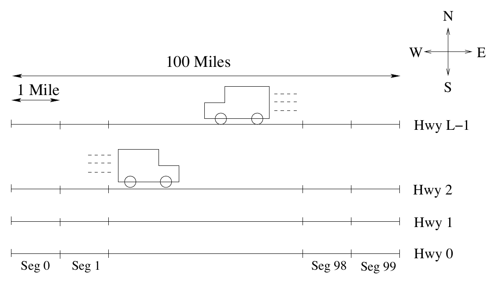
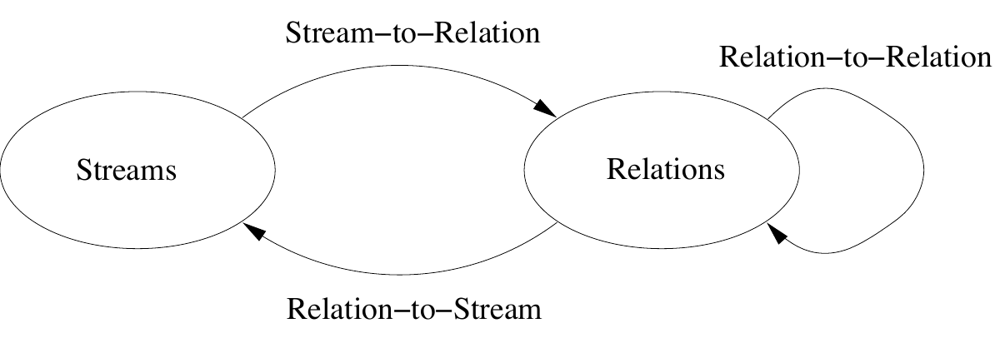
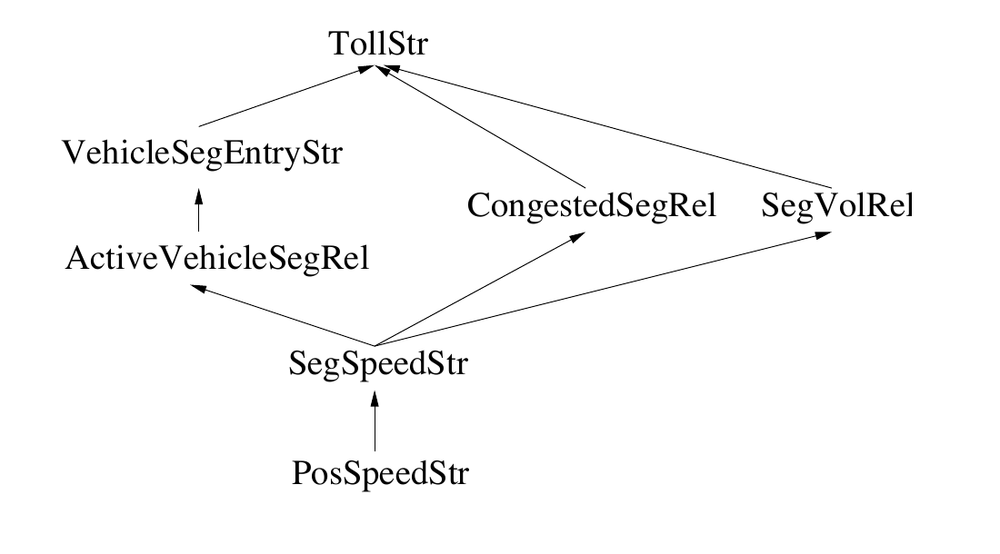
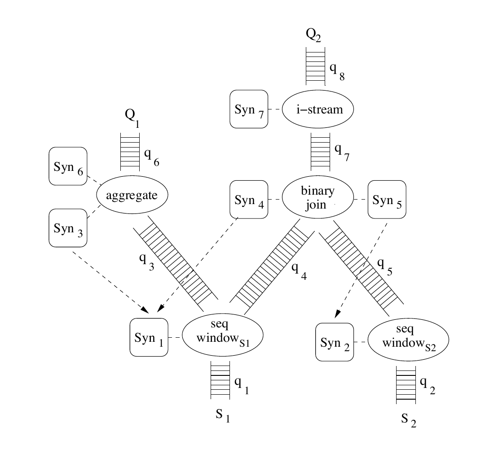
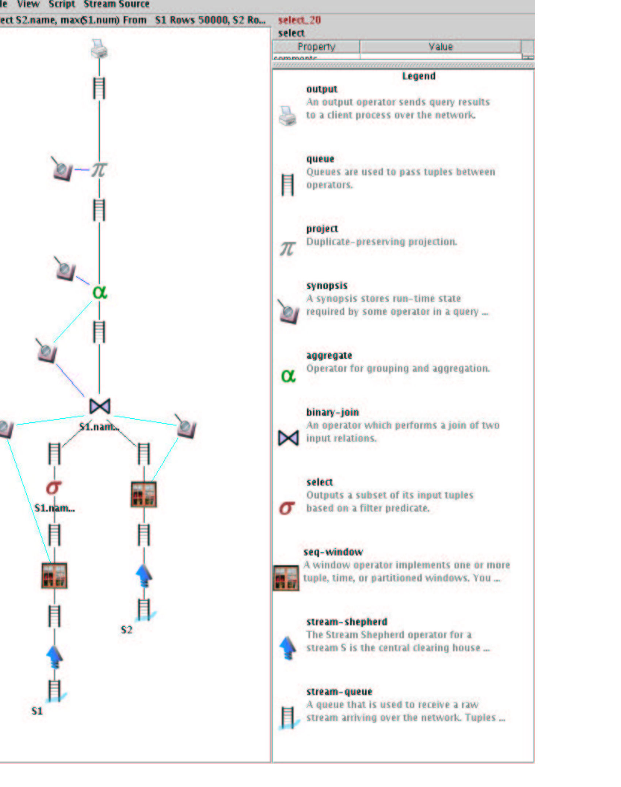
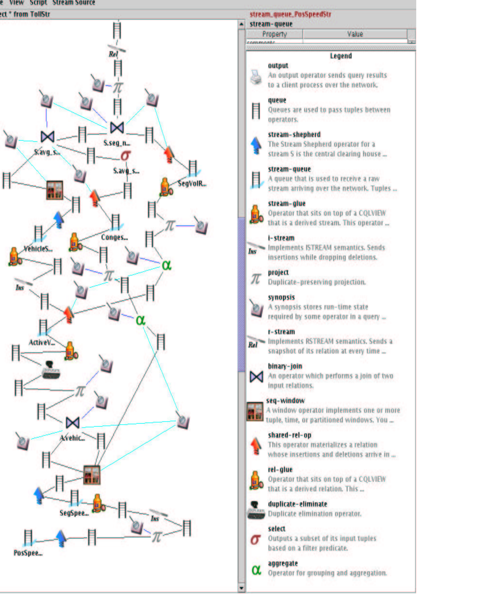

# The CQL Continuous Query Language: Semantic Foundations and Query Execution（中文译文）

## 译者说明

本文依据同目录的 `source.pdf` 翻译。章节、图表、公式、算法、代码与参考文献按原文结构保留。

Arvind Arasu、Shivnath Babu、Jennifer Widom

斯坦福大学

`{arvinda,shivnath,widom}@cs.stanford.edu`

资助说明见脚注。[^funding]

[^funding]: 本研究得到美国国家科学基金会 IIS-0118173、IIS-9817799 项目以及 3Com Stanford Graduate Fellowship 的资助。

## 摘要

CQL 是一种持续查询语言，由斯坦福大学的 STREAM 数据流管理系统原型支持。CQL 是一种表达能力强、基于 SQL 的声明式语言，用于在流和可更新关系上注册持续查询。我们首先给出一种抽象语义，它只依赖流与关系之间的“黑盒”映射；再由这些映射为持续查询定义精确且通用的解释。CQL 是该抽象语义的一种实例化：用 SQL 完成关系到关系的映射，用源自 SQL-99 的窗口说明完成流到关系的映射，并引入三个新算子完成关系到流的映射。CQL 的大部分语言功能已在 STREAM 系统中运行。我们介绍 CQL 查询执行计划的结构，以及其中最重要组件的细节：算子、算子间队列、概要结构（synopsis），还有多个算子和查询之间的组件共享。全文示例取自最近为数据流管理系统提出的 Linear Road 基准。我们还维护了一个公开的数据流应用仓库，其中包含以 CQL 表达的各种查询。

## 1. 引言

近年来，针对无界数据流处理持续查询的诸多方面，研究工作大量涌现 [Geh03, GO03]。许多论文都用某种声明式语言给出持续查询示例，例如 [ABB+02, CDTW00, CF02, DGGR02, HFAE03, MSHR02]。不过，这些查询通常很简单，主要用于说明概念；语言的精确语义，特别是更复杂查询的语义，往往并不清楚。此外，迄今公开发表的工作很少涉及通用持续查询的执行细节。

我们介绍 CQL 语言及其执行引擎，用于在流和可更新关系上执行通用持续查询。CQL（Continuous Query Language，持续查询语言）是本文所提出精确抽象持续语义的一种实例化，并已在斯坦福大学的 STREAM 数据流管理系统（Data Stream Management System, DSMS）原型中实现 [STR]。

乍看之下，在关系型流上定义持续查询语言似乎并不困难：取一种关系查询语言，把对关系的引用换成对流的引用，向流处理器注册查询，然后等待答案到来。对于完整流历史上的简单单调查询，这种方法确实几乎够用。然而，一旦查询变得复杂——加入聚合、子查询、窗口构造，或混合使用关系与流等——情况就会模糊许多。请看下面的简单查询：

```sql
Select P.price
From Items [Rows 5] as I, PriceTable as P
Where I.itemID = P.itemID
```

`Items` 是已购买物品的流，`PriceTable` 是包含物品价格的表（关系），`[Rows 5]` 指定一个含 5 个元素的滑动窗口。即使这样简单的查询，据我们所知也不存在唯一而显然的解释。例如，查询结果究竟是流还是关系？如果最近购买的一件物品——即仍在 5 元素窗口中的物品——价格发生变化，查询结果应如何变化？

我们首先为持续查询定义精确的抽象语义。该语义基于两种数据类型——流和关系——以及这两种类型上的三类算子：由流产生关系的算子（流到关系）、由其他关系产生关系的算子（关系到关系），以及由关系产生流的算子（关系到流）。这三类算子是抽象语义中的“黑盒”组件：语义不依赖每一类中具体包含什么算子，只依赖该类所有算子的通用性质。

CQL 对抽象语义中的黑盒进行了实例化：用 SQL 表达关系到关系算子，用源自 SQL-99 的窗口说明语言表达流到关系算子，并用三个算子构成关系到流算子集。CQL 的大部分功能已经能在原型 DSMS 中完整运行 [STR]。CQL 已用于描述为数据流系统提出的 Linear Road 基准 [TCA03]，也用于描述我们所维护公开仓库中的其他多种流应用 [SQR]。

在定义抽象语义和具体语言时，我们设定了如下目标：

1. 尽可能利用已得到充分理解的关系语义，以及由此延伸出的关系重写与执行策略。
2. 执行简单任务的查询应当易写、紧凑；反过来，看起来简单的查询应当产生符合直觉的结果。

我们认为，这些目标在很大程度上已经实现。

STREAM 查询处理引擎以从 CQL 文本查询生成的物理查询计划为基础。查询计划常常会被合并，因此一个查询计划可能同时计算多个持续查询。我们关注执行计划本身的结构和细节，而不讨论如何选择计划、计划如何随时间迁移和自适应；后者是后续论文的主题。

在设计查询执行计划结构时，我们设定了另外几个目标：

3. 计划应由基于通用接口的模块化、可插拔组件构成，尤其是算子和概要结构。
4. 执行模型应能高效刻画本语言赖以建立的流与关系组合。
5. 架构应当便于试验不同的算子调度策略、状态溢写到磁盘的策略、多个持续查询间共享状态和计算的策略，以及其他影响性能的关键问题。

我们同样认为，这些目标在很大程度上已经实现。本文的贡献概括如下：

- 对流和可更新关系进行形式化（第 4 节），并基于流到关系、关系到关系、关系到流三类黑盒算子定义持续查询的抽象语义（第 5 节）。
- 定义具体语言 CQL，以上述方式实例化抽象语义中的黑盒（第 6 节）；还定义了便于直观表达查询的语法简写和默认规则，并指出语言中的若干等价变换（第 9 节）。
- 以为数据流系统提出的一种假想道路交通管理应用为例，展示 CQL 的表达能力 [TCA03]（第 3、7 节）；同时将 CQL 的表达能力与相关查询语言比较（第 10 节）。
- 介绍 STREAM 系统执行 CQL 查询所用的查询执行计划和策略，重点包括算子、算子间队列、概要结构，以及多个算子和查询之间的组件共享（第 11 节）。

## 2. 相关工作

我们曾在一篇特邀论文 [ABW03] 中初步介绍抽象语义和 CQL 语言。该论文不包含查询变换、Linear Road 基准，也不包含本文的任何查询执行内容。

[BBD+02] 对数据流和持续查询相关工作作了全面介绍。本节聚焦持续查询的语言和语义。

显式或隐式的持续查询已经使用了很长时间。物化视图 [GM95] 是持续查询的一种形式，因为视图会持续更新，以反映其基关系的变化。[JMS95] 把物化视图扩展到包含 chronicle；chronicle 本质上就是持续数据流。该工作定义了在 chronicle 和关系上产生其他 chronicle 的算子，也定义了把 chronicle 转换为物化视图的算子。为保证所得物化视图能够在不查阅完整 chronicle 历史的前提下增量维护，这些算子受到一定约束。

Tapestry [TGNO92] 首次显式引入持续查询，并使用一种名为 TQL、基于 SQL 的语言（[Bar99] 也考虑了类似语言）。从概念上讲，TQL 查询在每个时刻都作为一次性 SQL 查询，针对该时刻的数据库快照执行一次，再以集合并合并所有这些一次性查询的结果。若干系统利用持续查询分发信息，例如 [CDTW00, LPT99, NACP01]。这些系统中的持续查询语义同样像 Tapestry 一样，以周期执行一次性查询为基础。第 10 节将说明如何用 CQL 表达 Tapestry 查询，以及关系和 chronicle 上的物化视图。

我们提出的抽象语义和具体语言比上述任何语言都更通用：它包含窗口说明、可自由混合并映射流与关系的构造，还具备任意关系查询语言的完整能力。TelegraphCQ 系统的近期工作 [CC+03b] 提出了一种持续查询声明式语言，特别关注表达力丰富的窗口构造；第 10.6 节还会简要讨论它。ATLaS 的 SQL 扩展 [WZL02] 提供语言构造，用于表达流窗口上的聚合增量计算，但仅限于简单的选择—投影—连接（SPJ）查询。GSQL [CJSS03] 是为网络监控 DSMS Gigascope 开发的类 SQL 语言；第 10 节会将 GSQL 与 CQL 比较。

有些系统支持过程式而非我们所用的声明式的持续查询。主动数据库系统的事件—条件—动作规则与 SQL 触发器密切相关，属于这一类 [PD99]。Aurora 系统 [CC+02] 要求用户直接创建流算子网络，可用算子类型很多，从简单流过滤器到复杂的窗口和聚合算子都有。面向网络流量分析的流处理系统 Tribeca [Sul96] 支持窗口、一组由关系代数改编的算子，以及用于组合查询计划的简单语言，但不支持跨流连接。第 10 节将更详细地把 Aurora 和 Tribeca 与 CQL 比较。

由于流元组带有时间戳、因而具有顺序，我们的语义和查询语言也与时态查询语言 [OS95] 和序列查询语言 [SLR95] 有关。在大多数方面，这些语言的时态或顺序构造涵盖了本语言中的相应特性；因此，我们的语言表达力较弱，但更容易高效实现。还要注意，时态和序列语言的语义面向一次性查询，而非持续查询。

## 3. 贯穿全文的示例简介

我们使用一个贯穿全文的示例，它基于 Linear Road 数据流管理系统基准所提出的假想道路交通管理应用 [TCA03]。我们使用 Linear Road 应用的简化版本说明语言、语义和执行计划的各个方面；完整细节见原始规范 [TCA03]。

Linear Road 应用采用动态收费——根据交通状况自适应、实时计算车辆通行费——来调节高速公路系统上的车流。为实现动态收费，每辆车都配备传感器，持续把位置和速度发送给中央服务器。服务器聚合从整个高速公路系统所有车辆接收的信息，实时计算通行费，再通过传感器网络把通行费发回车辆。



*图 1：Linear Road 高速公路系统。*

图 1 展示了 Linear Road 高速公路系统。系统共有 $L$ 条高速公路，编号为 $0,\ldots,L-1$。每条公路长 100 英里、东西走向，车流可双向行驶。每个方向都被划分为 100 个一英里长的路段，出入口匝道位于路段边界。车辆在公路上行驶时，每 30 秒向中央服务器报告一次当前速度（英里/小时）和位置。位置由三个属性描述：公路编号（$0,\ldots,L-1$）、方向（向东或向西），以及从公路左端（西端）起算的英尺数。（完整 Linear Road 应用 [TCA03] 中，每条公路有 6 条车道——每个方向 3 条——但我们的示例略去了这一细节。）

车辆只要驶入拥堵路段就要付费，非拥堵路段不收费。如果过去 5 分钟内某路段所有车辆的平均速度低于 40 英里/小时（MPH），该路段便视为拥堵。拥堵路段的通行费由下式给出：

$$
\mathit{basetoll}\times(\mathit{numvehicles}-150)^2,
$$

其中，$\mathit{basetoll}$ 是预设常量，$\mathit{numvehicles}$ 是当前位于该路段的车辆数。注意，每当车辆驶入或驶离，拥堵路段的通行费都会变化。当服务器检测到某辆车进入拥堵路段时，就输出该路段的当前通行费，并将其传回车辆。

用流术语来说，我们简化后的 Linear Road 应用具有：

- 一个输入流——车辆位置和速度流；
- 一个计算通行费的持续查询；
- 一个输出通行费流。

下文将逐步说明如何用我们的语言、语义和查询执行策略对该应用进行建模、表达和执行。

## 4. 流与关系

本节定义流和可更新关系的形式模型。与标准关系模型一样，每个流和关系都有固定模式，由一组具名属性组成。对于流元素到达和关系更新，我们假定存在一个离散、有序的时间域 $T$。任意 $T$ 中的值都是一个时刻。具体而言，我们把 $T$ 表示为非负整数 $\{0,1,\ldots\}$；特别地，0 表示最早时刻。时间域 $T$ 对应应用对时间的理解，并不特指系统时间或挂钟时间。因此，尽管 $T$ 常常可能采用 `Datetime` 类型，我们的语义只要求它是任意离散有序域。（[SW03] 全面讨论了数据流管理系统中的时间问题。）

**定义 4.1（流）** 流 $S$ 是由元素 $\langle s,\tau\rangle$ 构成的一个可能无限的包（多重集），其中 $s$ 是属于 $S$ 模式的元组，$\tau\in T$ 是该元素的时间戳。

注意，时间戳不是流模式的一部分；流中时间戳相同的元素可以为零个、一个或多个。我们只要求任一给定时间戳对应的元素数量有限，但不设固定上界。

流分为两类：基础流，即到达 DSMS 的源数据流；派生流，即查询中的算子产生的中间流。我们用“流的元组”指流元素的数据部分（不含时间戳）。

**示例 4.1** Linear Road 应用只有一个基础流，包含车辆速度—位置测量值，其模式为：

```text
PosSpeedStr(vehicleId,speed,xPos,dir,hwy)
```

属性 `vehicleId` 标识车辆，`speed` 表示以 MPH 计的速度，`hwy` 表示高速公路编号，`dir` 表示方向（向东或向西），`xPos` 表示车辆在公路上的位置，以英尺为单位，详见第 3 节。时间域类型为 `Datetime`；在该应用中，流元素的时间戳表示测得位置和速度的物理时间。

**定义 4.2（关系）** 关系 $R$ 是从 $T$ 到属于 $R$ 模式的有限但无固定上界元组包的映射。

对任意时刻 $\tau\in T$，关系 $R$ 定义一个无序元组包，记作 $R(\tau)$。这一关系定义与标准定义不同：在标准关系模型中，就关系查询语言的语义而言，关系只是一个元组集合（或包），没有时间概念。

我们用“瞬时关系”表示传统意义上的元组包，用“关系”表示定义 4.2 中随时间变化的元组包。因此，若 $R$ 表示关系，则 $R(\tau)$ 表示一个瞬时关系。不会引起歧义时，我们在指瞬时关系时常省略“瞬时”一词（例如“在时刻 $\tau$，关系 $R$ 包含元组包……”）。输入关系称为基础关系，由查询算子产生的关系称为派生关系。

**示例 4.2** Linear Road 应用没有基础关系，但计算通行费时会用到多个派生关系。例如，拥堵路段的通行费取决于该路段当前车辆数，可以用下面的派生关系表示：

```text
SegVolRel(segNo,dir,hwy,numVehicles)
```

属性 `hwy` 表示高速公路编号，`dir` 表示方向，`segNo` 标识公路上的路段，`numVehicles` 是该路段内的车辆数。在时刻 $\tau$，$\operatorname{SegVolRel}(\tau)$ 包含截至该时刻每个公路路段中的车辆数。（实际上，由于车辆只每 30 秒报告一次位置，被计入某路段的部分车辆可能已经离开，但系统无从得知。）第 7 节说明如何在基础流 `PosSpeedStr` 上定义派生关系 `SegVolRel`，以及如何在主要的持续通行费计算查询中使用它。

如该示例所示，即便应用的输入和输出全都是流，关系概念仍然有用。把“某路段当前的车辆数”建模为随时间变化的关系，似乎比建模为一串最新值更自然。从表达能力看，同时拥有流和关系并非必要：可以只选择其中一种来设计语言，而不损失表达能力；第 10.6 节将进一步讨论这个问题。在实现中，我们把流和关系统一编码为“正负流”，详见第 11 节。

## 5. 抽象语义

本节给出持续查询的抽象语义。回顾第 1 节，该语义建立在流和关系上的三类算子之上：

- 流到关系算子：从流产生关系；
- 关系到关系算子：从一个或多个其他关系产生关系；
- 关系到流算子：从关系产生流。

这里的“关系”指第 4 节定义的、随时间变化且可更新的形式化关系。



*图 2：抽象语义所用的算子类别和映射。*

其中没有流到流算子；这种操作必须由上述三类算子组合而成。第 6 节会详细说明，这一决定主要源于第 1 节的目标 1：尽可能利用已有充分理解的关系语义，以及由其延伸出的关系重写和执行策略。

先约定一些术语。$S\text{ up to }\tau$ 表示流 $S$ 中时间戳不大于 $\tau$ 的元素包，即

$$
\{\langle s,\tau'\rangle\in S:\tau'\leq\tau\}.
$$

$S\text{ at }\tau$ 表示 $S$ 中时间戳等于 $\tau$ 的元素包，即

$$
\{\langle s,\tau'\rangle\in S:\tau'=\tau\}.
$$

类似地，$R\text{ up to }\tau$ 表示瞬时关系序列 $R(0),\ldots,R(\tau)$，$R\text{ at }\tau$ 表示瞬时关系 $R(\tau)$。

1. 流到关系算子以流 $S$ 为输入，产生与 $S$ 模式相同的关系 $R$。在任意时刻 $\tau$，$R(\tau)$ 应能由 $S\text{ up to }\tau$ 计算出来。
2. 关系到关系算子以一个或多个关系 $R_1,\ldots,R_n$ 为输入，产生关系 $R$。在任意时刻 $\tau$，$R(\tau)$ 应能由 $R_1(\tau),\ldots,R_n(\tau)$ 计算出来。
3. 关系到流算子以关系 $R$ 为输入，产生与 $R$ 模式相同的流 $S$。在任意时刻 $\tau$，$S\text{ at }\tau$ 应能由 $R\text{ up to }\tau$ 计算出来。

下面定义抽象语义。

**定义 5.1（持续语义）** 设查询 $Q$ 是上述三类算子的任意类型一致组合。假定 $Q$ 最内层（叶节点）算子的全部输入为流 $S_1,\ldots,S_n$（$n\geq0$）和关系 $R_1,\ldots,R_m$（$m\geq0$）。我们定义时刻 $\tau$ 的持续查询 $Q$ 结果，它表示截至 $\tau$ 的全部输入都“可用”之后（该概念见下文）$Q$ 的结果。分为两种情况：

- **情形 1：** $Q$ 最外层（顶层）算子是关系到流算子，产生流 $S$。时刻 $\tau$ 的 $Q$ 结果是 $S\text{ up to }\tau$，其计算方法是：对流 $S_1,\ldots,S_n\text{ up to }\tau$ 与关系 $R_1,\ldots,R_m\text{ up to }\tau$ 递归应用构成 $Q$ 的算子。
- **情形 2：** $Q$ 最外层算子是流到关系或关系到关系算子，产生关系 $R$。时刻 $\tau$ 的 $Q$ 结果是 $R(\tau)$，其计算方法是：对流 $S_1,\ldots,S_n\text{ up to }\tau$ 与关系 $R_1,\ldots,R_m\text{ up to }\tau$ 递归应用构成 $Q$ 的算子。

根据该定义，可以非正式地从操作角度理解持续查询。设时间在域 $T$ 中“推进”，具体含义见下文。先看产生流的查询：在 $\tau\in T$ 时，系统处理截至 $\tau$ 的全部输入，持续查询发出时间戳为 $\tau$ 的所有新结果流元素。根据我们对算子的假设，时间戳不小于 $\tau$ 的输入不会再产生时间戳小于 $\tau$ 的新流元素。产生关系的查询也类似：在时刻 $\tau$，系统处理截至 $\tau$ 的全部输入，并把输出关系更新为状态 $R(\tau)$。

下面解释时间在域 $T$ 中推进的含义。应用时间、挂钟时间和系统时间之间的关系很复杂，另一篇论文 [SW03] 对此有深入讨论。不过，为精确定义查询语义，除本文已有假设外不需要作其他假设。当截至 $\tau-1$ 的全部输入都已处理完毕时，时间便从 $\tau-1$“推进”到 $\tau$。这看起来隐含假设了流按时间戳顺序到达、关系按时间戳顺序更新，且流与关系之间不存在时间戳“偏斜”。实际实现语义时，系统必须处理乱序和偏斜输入。第 8 节会再次讨论该问题，[SW03] 则给出了完整论述。

以 Linear Road 应用为例，产生派生关系 `SegVolRel` 的算子序列在概念上会在每个时刻 $\tau$ 产生瞬时关系 $\operatorname{SegVolRel}(\tau)$，其中包含各路段当前的车辆数。在实现本语义的 DSMS 中，只有确认输入流 `PosSpeedStr(vehicleId,speed,xPos,dir,hwy)` 上所有时间戳不大于 $\tau$ 的元素均已接收后，才能产生 $\operatorname{SegVolRel}(\tau)$。即便全部收到，由于查询处理耗时，关系实际更新前还可能有额外延迟。我们的语义不规定持续查询输出的“活性”；该问题留给查询处理器的延迟管理机制处理 [BBDM03, CC+03a]。

## 6. 持续查询语言

本节介绍具体语言 CQL。CQL 通过实例化抽象语义中的算子来定义；我们还规定若干语法简写和默认规则，以简化一些常见操作的表达。

概括来说，CQL 的算子设计方法是：支持一大类关系到关系算子，由它们完成典型 CQL 查询中的大部分数据操作；再用少量流到关系和关系到流算子，在流与关系之间转换。该方法的主要优势是能够复用关系代数、SQL 等关系到关系语言的形式基础和大量实现技术，而无须从头设计一门高度依赖流的语言。此外，下文会看到，CQL 查询的表达相当自然。

严格来说，不能把已有传统关系到关系算子原样引入具体语言，因为它们处理瞬时关系，而我们处理随时间变化的关系。不过，二者映射很直接：设 $O_r$ 是作用于瞬时输入关系 $R_1,\ldots,R_n$ 的传统关系算子或查询。CQL 中相应的关系到关系算子 $O_c$ 产生随时间变化的关系 $R$，满足每个时刻 $\tau$ 都有

$$
R(\tau)=O_r(R_1(\tau),\ldots,R_n(\tau)).
$$

这种方法表面上的缺点是，即使对流作简单过滤也要用三个算子：一个把流变成关系，一个执行关系过滤，一个再把关系变回流。不过，CQL 的默认规则和语法简写使过滤等简单查询依然易于表达（第 6.4 节）。第 6.1–6.3 节分别介绍 CQL 中的三类算子。

### 6.1 流到关系算子

CQL 当前所有流到关系算子都以流上的滑动窗口为基础：窗口在任意时刻都包含流中有限一段历史的快照。CQL 有三类滑动窗口算子：基于时间、基于元组和分区窗口，定义如下。语法上，滑动窗口算子采用源自 SQL-99 的窗口说明语言。固定窗口 [Sul96]、滚动窗口 [CC+02]、基于值的窗口 [SLR95]，以及任何其他窗口构造都可以方便地加入 CQL：需要增加新语法，但得益于抽象语义，引入新窗口类型的语义只依赖窗口算子自身的语义。

#### 6.1.1 基于时间的滑动窗口

流 $S$ 上基于时间的滑动窗口以时间间隔 $T$ 为参数，在对 $S$ 的引用后加 `[Range T]` 指定。[^window] 我们暂不限定时间间隔 $T$ 的语法或约束，只假定它指定一段可计算的应用时间。直观上，基于时间的窗口沿有序流滑动一个长度为 $T$ 个时间单位的区间，以捕获流的最近部分。更形式化地，`S [Range T]` 的输出关系 $R$ 定义为：

$$
R(\tau)=\{s\mid \langle s,\tau'\rangle\in S\land \tau'\leq\tau\land \tau'\geq\max\{\tau-T,0\}\}.
$$

两个重要特例是 $T=0$ 和 $T=\infty$。当 $T=0$ 时，$R(\tau)$ 由 $S$ 中时间戳为 $\tau$ 的元素所含元组组成，CQL 为此引入语法 `S [Now]`。当 $T=\infty$ 时，$R(\tau)$ 由截至 $\tau$ 的 $S$ 中全部元素所含元组组成，采用 SQL-99 语法 `S [Range Unbounded]`。我们分别称它们为 Now 窗口和 Unbounded 窗口。

[^window]: 在三种窗口类型中，我们都删掉了 SQL-99 语法和早期规范 [MW+03] 中的关键字 `Preceding`；目前只支持回看此前数据的窗口，因此该关键字是多余的。

**示例 6.1** `PosSpeedStr [Range 30 Seconds]` 表示输入流 `PosSpeedStr` 上一个 30 秒的基于时间滑动窗口。在任一时刻，该窗口的输出关系都包含过去 30 秒内位置—速度测量值的包。类似地，任一时刻的 `PosSpeedStr [Now]` 包含该时刻位置—速度测量值的包（可能为空），`PosSpeedStr [Range Unbounded]` 则包含迄今为止全部位置—速度测量值的包。

#### 6.1.2 基于元组的窗口

流 $S$ 上基于元组的滑动窗口以正整数 $N$ 为参数，在查询中对 $S$ 的引用后加 `[Rows N]` 指定。直观上，它通过沿有序流滑动最近 $N$ 个元组的窗口，定义随时间变化的输出关系。更形式化地，对于 `S [Rows N]` 的输出关系 $R$，$R(\tau)$ 由 $S$ 中时间戳不大于 $\tau$ 且最大的 $N$ 个元组组成；如果截至 $\tau$ 的 $S$ 长度不超过 $N$，则包含全部元组。假设指定了 $N$ 元组滑动窗口，而某时刻有多个元组拥有第 $N$ 新的时间戳（为清楚起见，假定另外 $N-1$ 个更新的时间戳互不相同）。此时必须以某种方式“打破平局”，才能让窗口恰好产生 $N$ 个元组。我们假定任意打破平局。因此，当时间戳不唯一时，基于元组的滑动窗口可能是不确定的，也就可能不适用。$N=\infty$ 的特例写作 `[Rows Unbounded]`，等价于 `[Range Unbounded]`。

**示例 6.2** 除 $N=\infty$ 外，在流 `PosSpeedStr` 上使用基于元组的滑动窗口没有太大意义，因为流元素的时间戳并不唯一。例如，任一时刻的滑动窗口 `PosSpeedStr [Rows 1]` 表示“最新的”位置—速度测量值；只要多个测量值具有相同时间戳，其含义就有歧义，而这在 Linear Road 应用中很常见。

#### 6.1.3 分区窗口

流 $S$ 上的分区滑动窗口以正整数 $N$ 和 $S$ 的属性子集 $\{A_1,\ldots,A_k\}$ 为参数，在查询中对 $S$ 的引用后加 `[Partition By A1,...,Ak Rows N]` 指定。直观上，该窗口根据属性 $A_1,\ldots,A_k$ 的相等性把 $S$ 逻辑划分成不同子流（类似 SQL `Group By`），在每个子流上分别计算大小为 $N$ 的基于元组滑动窗口，再将这些窗口求并得到输出关系。更形式化地，设元组 $s$ 在属性 $A_1,\ldots,A_k$ 上的值为 $a_1,\ldots,a_k$；当且仅当存在元素 $\langle s,\tau'\rangle\in S$、$\tau'\leq\tau$，且 $\tau'$ 位于所有在 $A_1,\ldots,A_k$ 上取值为 $a_1,\ldots,a_k$ 的元素时间戳中最大的 $N$ 个之列时，$s$ 才出现在输出瞬时关系 $R(\tau)$ 中。注意，类似的基于时间分区窗口并不比不分区的基于时间窗口具有更强表达能力。

**示例 6.3** 分区窗口 `PosSpeedStr [Partition By vehicleId Rows 1]` 按 `vehicleId` 把 `PosSpeedStr` 划分为子流，并从每个子流选取最新元素。（在每个子流中选最新元素并无歧义，因为特定车辆每 30 秒才报告一次位置—速度，而 `Datetime` 的粒度为一秒。）在任意时刻，该窗口定义的关系都包含每辆曾经发送过测量值的车辆的最新速度—位置测量值。

### 6.2 关系到关系算子

CQL 的关系到关系算子来自以 SQL 表达的传统关系查询，并采用本节开头给出的、到随时间变化关系的直接语义映射。传统 SQL 查询中凡可引用关系的地方，在 CQL 中都可引用基础关系或派生关系。

**示例 6.4** 考虑下面的 Linear Road CQL 查询：

```sql
Select Distinct vehicleId
From PosSpeedStr [Range 30 Seconds]
```

该查询由一个流到关系滑动窗口算子和一个执行投影与消除重复的关系到关系算子组成。在任一时刻，其输出关系都包含“活动车辆”集合，即过去 30 秒内发送过位置—速度测量值的车辆。

### 6.3 关系到流算子

CQL 有三个关系到流算子：`Istream`、`Dstream` 和 `Rstream`。下面的形式定义中，$\cup$、$\times$ 和 $-$ 均采用包语义。

1. 对关系 $R$ 应用 `Istream`（insert stream，插入流）后，只要元组 $s$ 属于 $R(\tau)-R(\tau-1)$，结果中就包含流元素 $\langle s,\tau\rangle$。为便于记号，假设 $R(-1)=\varnothing$，则

   $$
   \operatorname{Istream}(R)=\bigcup_{\tau\geq0}((R(\tau)-R(\tau-1))\times\{\tau\}).
   $$

2. 类似地，对关系 $R$ 应用 `Dstream`（delete stream，删除流）后，只要元组 $s$ 属于 $R(\tau-1)-R(\tau)$，结果中就包含流元素 $\langle s,\tau\rangle$。形式化地，

   $$
   \operatorname{Dstream}(R)=\bigcup_{\tau>0}((R(\tau-1)-R(\tau))\times\{\tau\}).
   $$

3. 对关系 $R$ 应用 `Rstream`（relation stream，关系流）后，只要元组 $s$ 在时刻 $\tau$ 属于 $R$，结果中就包含流元素 $\langle s,\tau\rangle$。形式化地，

   $$
   \operatorname{Rstream}(R)=\bigcup_{\tau\geq0}(R(\tau)\times\{\tau\}).
   $$

细心的读者可能发现，可以用 `Rstream`、基于时间的滑动窗口和一些关系算子表达 `Istream` 与 `Dstream`。不过，为遵循第 1 节的目标 2——易懂的查询应当易写——CQL 仍保留全部三个算子。

**示例 6.5** 考虑下面的流过滤 CQL 查询：

```sql
Select Istream(*)
From PosSpeedStr [Range Unbounded]
Where speed > 65
```

（注意 `Select` 子句中关系到流算子的语法。）该查询由三个算子组成：Unbounded 窗口产生关系，该关系在时刻 $\tau$ 包含截至 $\tau$ 的全部速度—位置测量值；关系过滤算子把关系限制到速度超过 65 MPH 的测量值；`Istream` 算子则把过滤后关系中的新值作为查询结果流式输出。总体效果就是对 `PosSpeedStr` 作简单过滤，输出速度超过 65 MPH 的全部输入元素。同一过滤查询也可使用 `Rstream` 和 Now 窗口写成：

```sql
Select Rstream(*)
From PosSpeedStr [Now]
Where speed > 65
```

正如下文很快会看到的，默认规则还允许把该查询写成最直观的形式：

```sql
Select * From PosSpeedStr Where speed > 65
```

`Istream` 最常与 Unbounded 窗口一起使用，以表达上述过滤条件，或流式输出滑动窗口连接查询的结果。`Rstream` 最常与 Now 窗口一起使用，以表达上述过滤条件，或流式输出流与关系的连接结果，第 7 节查询 6 将给出示例。`Dstream` 的使用频率低于 `Istream` 和 `Rstream`；使用示例见 [SQR]。

### 6.4 语法简写与默认规则

为遵循第 1 节的目标 2，CQL 允许使用一些会触发特定默认行为的语法“简写”。当然，默认行为有时并非查询撰写者本意；因此，我们假定注册查询时，系统会把采用的默认规则告知查询撰写者，并允许查询撰写者编辑展开后的查询。简写分两类：省略窗口说明和省略关系到流算子。

**默认窗口。** 在 CQL 查询中需要关系的位置（最常见的是 `From` 子句）引用流但不指定窗口时，默认对该流应用 Unbounded 窗口。默认 Unbounded 窗口通常能产生适当行为，但有些情况下 Now 窗口更合适，例如把流与关系连接时；参见第 7 节查询 6。

**默认关系到流算子。** 在两种情况下，查询撰写者似乎很自然地会省略本应使用的 `Istream` 算子：

1. 位于最外层查询，即使所需的是流式结果而非存储结果 [MW+03]；
2. 位于内部子查询，即使子查询结果上指定了窗口。

对于第一种情况，只要查询产生的关系是单调的，我们就默认添加 `Istream`。当且仅当 $\tau_1\leq\tau_2$ 时总有 $R(\tau_1)\subseteq R(\tau_2)$，关系 $R$ 才是单调的。可以静态执行保守的单调性检验。例如，已知只追加的基础关系是单调的；对任意流 $S$，`S [Range Unbounded]` 都是单调的；两个单调关系的连接也是单调的。如果 CQL 查询结果是单调关系，直观上用 `Istream` 把它转换为流是合理的。如果结果不单调，查询撰写者可能想要的是 `Istream`、`Dstream` 或 `Rstream` 中任何一个，因此不默认添加关系到流算子。

对于第二种情况，只要子查询单调，我们就默认添加 `Istream`。若不单调，子查询结果上的窗口说明含义有些模糊，因此系统产生语义（类型）错误，查询撰写者必须显式添加关系到流算子。

**示例 6.6** 现在可以看出，为什么示例 6.5 的过滤查询能够写成最直观的形式：

```sql
Select * From PosSpeedStr Where speed > 65
```

由于引用 `PosSpeedStr` 时没有窗口说明，系统默认应用 Unbounded 窗口。又因为窗口和过滤算子的输出关系是单调的，系统还会在结果上默认添加 `Istream`。

## 7. 用 CQL 表达 Linear Road

回顾 Linear Road 应用，它有一个基础输入流 `PosSpeedStr`，其中包含公路系统中车辆的速度—位置测量值。为便于我们的示例说明，我们唯一的目标是计算输出通行费流 `TollStr(vehicleId,toll)`。车辆标识为 $v$ 的车辆在时刻 $\tau$ 进入拥堵路段时，应产生 `TollStr` 输出元素 $\langle(v,l),\tau\rangle$，其中 $l$ 表示该拥堵路段在时刻 $\tau$ 的通行费。

计算通行费时，我们采用原始 Linear Road 规范 [TCA03] 建议的两个假设：

1. 某辆车首次从一个路段发送速度—位置测量值时，视为已进入该路段。在它离开系统（见下一条假设 2）或进入另一条路段（即从不同路段发送速度—位置测量值）之前，都视为仍在原路段。
2. 若一辆车连续 30 秒没有发送速度—位置测量值，视为已离开系统。

这些假设是必要的，因为每辆车每 30 秒才发送一次速度—位置测量值。



*图 3：Linear Road 查询的派生关系与派生流。*

产生 `TollStr` 的持续查询相当复杂，因此我们使用多个具名派生关系和派生流来表达。图 3 展示了这些派生关系、派生流及其依赖。例如，`TollStr` 由派生流 `VehicleSegEntryStr` 和派生关系 `CongestedSegRel`、`SegVolRel` 产生；唯一的基础输入流 `PosSpeedStr` 自然位于源头。下面按图 3 的拓扑顺序给出派生流和派生关系的定义。每一个条目先说明其含义，再给出产生它的 CQL（子）查询。

**查询 1 `SegSpeedStr(vehicleId,speed,segNo,dir,hwy)`：** 该流由 `PosSpeedStr` 变换而来，把每个元素的 `xPos` 属性替换为对应路段编号。路段恰好长 1 英里，因此用 `xPos` 整除每英里的英尺数 1760，得到路段编号。

```sql
Select vehicleId, speed, xPos/1760 as segNo, dir, hwy
From PosSpeedStr
```

注意，该查询使用了默认 Unbounded 窗口和默认 `Istream` 算子。

**查询 2 `ActiveVehicleSegRel(vehicleId,segNo,dir,hwy)`：** 在任意时刻 $\tau$，该关系包含“活动”车辆的当前路段，即当前仍在使用高速公路系统的车辆。

```sql
Select Distinct L.vehicleId, L.segNo, L.dir, L.hwy
From SegSpeedStr [Range 30 Seconds] as A,
     SegSpeedStr [Partition by vehicleId Rows 1] as L
Where A.vehicleId = L.vehicleId
```

非形式化地说，该查询用基于时间的窗口识别当前活动车辆（依据上面的假设 2），用分区窗口识别这些车辆最新所在的路段。

**查询 3 `VehicleSegEntryStr(vehicleId,segNo,dir,hwy)`：** 车辆 $v$ 在时刻 $\tau$ 进入路段 $(s,d,h)$ 时，该流上会产生元素 $\langle(v,s,d,h),\tau\rangle$。（回顾一下，一个路段由三个属性描述：高速公路编号 $h$、公路内方向 $d$、公路内路段编号 $s$。）

```sql
Select Istream(*) From ActiveVehicleSegRel
```

`VehicleSegEntryStr` 通过对 `ActiveVehicleSegRel` 应用 `Istream` 产生。车辆 $v$ 在时刻 $\tau$ 进入路段 $(s,d,h)$，会使 `ActiveVehicleSegRel` 在 $\tau$ 出现一个新元组，进而使 `Istream` 在 `VehicleSegEntryStr` 中产生元素 $\langle(v,s,d,h),\tau\rangle$。

**查询 4 `CongestedSegRel(segNo,dir,hwy)`：** 在任意时刻 $\tau$，该关系包含当前拥堵路段集合。回顾第 3 节，如果过去 5 分钟内某路段车辆的平均速度低于 40 MPH，该路段就视为拥堵。

```sql
Select segNo, dir, hwy
From SegSpeedStr [Range 5 Minutes]
Group By segNo, dir, hwy
Having Avg(speed) < 40
```

**查询 5 `SegVolRel(segNo,dir,hwy,numVehicles)`：** 该关系已在示例 4.2 中引入。在任意时刻 $\tau$，它包含各路段当前的车辆计数。

```sql
Select segNo, dir, hwy, count(vehicleId) as numVehicles
From ActiveVehicleSegRel
Group By segNo, dir, hwy
```

**查询 6 `TollStr(vehicleId,toll)`：** 这是最终输出通行费流。

```sql
Select Rstream(E.vehicleId,
       basetoll * (V.numVehicles - 150)
       * (V.numVehicles - 150) as toll)
From VehicleSegEntryStr [Now] as E,
     CongestedSegRel as C, SegVolRel as V
Where E.segNo = C.segNo and C.segNo = V.segNo and
      E.dir = C.dir and C.dir = V.dir and
      E.hwy = C.hwy and C.hwy = V.hwy
```

在任意时刻 $\tau$，`VehicleSegEntryStr` 上的 Now 窗口识别在 $\tau$ 进入新路段的车辆集合。该集合与 `CongestedSegRel`、`SegVolRel` 连接，以确定哪些车辆进入了拥堵路段，并为这些车辆计算通行费。回顾第 3 节，拥堵路段的通行费公式为 $\mathit{basetoll}\times(\mathit{numvehicles}-150)^2$，其中 $\mathit{basetoll}$ 是预设常量，$\mathit{numvehicles}$ 是该路段当前的车辆数。

该查询说明了省略窗口说明时默认 Unbounded 窗口无法产生预期行为的一种情况。一般来说，如果连接流与关系是为了给流增加属性和/或过滤流，那么流上的 Now 窗口配合 `Rstream` 算子通常能产生所需行为。

我们的 Linear Road 规范是原始规范 [TCA03] 的简化版本。完整 Linear Road 基准的 CQL 规范，以及网络监控、在线拍卖 [TTPM02] 等其他多种流应用，可在 [SQR] 获取。

## 8. 时间管理

回顾第 4、5 节，抽象语义假定一个离散有序时间域 $T$。具体来说，持续语义以时间在 $T$ 中逻辑推进为基础。从概念上讲，在时刻 $\tau\in T$，系统处理截至 $\tau$ 的全部输入，并产生与 $\tau$ 对应的输出——时间戳为 $\tau$ 的流元素，或 $\tau$ 时的瞬时关系。本节简要讨论 DSMS 如何在现实条件下实现这一语义；[SW03] 对该主题有更深入的讨论。

为便于本节说明，假定关系更新通过携带时间戳、在流上到达的关系更新请求完成。这样，不失一般性，我们只需关注流。DSMS 要产生对应时刻 $\tau\in T$ 的输出，必须至少已经处理完截至 $\tau$ 的全部输入流元素。换言之，它必须在某个“真实”（挂钟）时间 $t$ 确认，$t$ 之后不会再有时间戳不大于 $\tau$ 的新输入流元素到达。当所有输入流均处于“活动”状态，且元素按时间戳顺序到达时，作出这一判断很直接。然而，在许多流应用中（包括 Linear Road），输入流可能由远程源产生；将流元素传送给 DSMS 的网络可能不保证按序传输，尤其是跨源时；而且流可能暂停后重启。

STREAM 原型的做法是假定系统还有一种名为心跳（heartbeat）的额外“元输入”。心跳只由一个时间戳 $\tau\in T$ 构成，其语义是：该心跳到达之后，系统不会再收到时间戳不大于 $\tau$ 的流元素。心跳可以通过多种方式产生，下面给出三个例子：

1. 最简单也相当常见的情况是，流元组到达系统时，使用 DSMS 时钟分配时间戳。因此流元素有序，时钟本身即可提供心跳。
2. 输入流的源可以产生源心跳，表示该流之后不会再出现时间戳小于或等于心跳指定值的元素。如果所有输入流的源都会产生源心跳，就可以取所有源心跳的最小值，生成应用级或查询级心跳。注意，只有单个输入流内的心跳和流元素按时间戳顺序到达 DSMS 时，该方法才可行。
3. 可以利用流源以及系统或网络环境的性质产生心跳。例如，若已知所有输入流源都用全局时钟生成时间戳，且流元素到达 DSMS 的延迟上界为 $D$，那么在每个全局时间 $t$，都可产生时间戳为 $t-D$ 的心跳。

关于时间管理和心跳生成方法的更多细节见 [SW03]。

## 9. CQL 中的等价关系

本节简要考察 CQL 语言中的语法等价关系。与任何声明式语言一样，等价关系能支持重要的查询重写优化；不过，优化过程本身并非本文的核心主题。

标准关系语义下 SQL 中成立的所有等价关系，都延续到 CQL 的关系部分，包括连接重排、谓词下推、子查询展平等。此外，任何产生关系的 CQL 查询或子查询都可视为随时间更新的物化视图，因此物化视图维护中的所有等价关系 [GM95] 都可用于 CQL。例如，连接两个关系的物化视图通常增量维护，而非重新计算；CQL 中连接两个关系（或经过窗口处理的流）也可采用相同方法。事实上，这一等价关系已经融入我们的二元连接物理查询计划算子（第 11 节）。

下面考察两种基于流的等价关系：窗口缩减，以及过滤器与窗口的可交换性。识别其他有用的、基于流的语法等价关系是未来工作。

### 9.1 窗口缩减

下面的等价关系可把任何使用 Unbounded 窗口和 `Istream` 算子的 CQL 查询或子查询，重写为使用 Now 窗口和 `Rstream` 算子的等价（子）查询。其中，$L$ 是任意选择列表，$S$ 是任意流（包括产生流的子查询），$C$ 是任意条件。

```sql
Select Istream(L) From S [Range Unbounded] Where C
```

$$
\equiv
$$

```sql
Select Rstream(L) From S [Now] Where C
```

此外，如果流 $S$ 有键（没有重复），就不必把 `Istream` 换成 `Rstream`；不过应用 Now 窗口之后，二者的效率差异很小。[^istream-rstream]

[^istream-rstream]: 更一般地，对于任意满足所有 $\tau$ 上 $R(\tau)\cap R(\tau-1)=\varnothing$ 的关系 $R$，`Istream` 和 `Rstream` 都等价。

把 Unbounded 变换为 Now 显然意味着高效得多的实现：从逻辑上讲，Unbounded 窗口必须缓冲流的完整历史，而 Now 窗口允许流元组一经处理就丢弃。我们在另一项工作中开发了把 Unbounded 窗口变换为 `[Rows N]` 窗口的技术，但这些变换依赖多对一连接和流上的约束 [BSW02]。

也许还能找到其他情形或更一般的准则，用 Now 窗口替换 Unbounded 窗口；详细探索留作未来工作。

### 9.2 过滤器与窗口的可交换性

另一种有助于查询重写优化的等价关系，是选择条件与基于时间窗口的可交换性。其中，$L$ 是任意选择列表，$S$ 是任意流（包括产生流的子查询），$C$ 是任意条件，$T$ 是任意时间间隔。

```sql
(Select L From S Where C) [Range T]
```

$$
\equiv
$$

```sql
Select L From S [Range T] Where C
```

如果系统采用将查询中指定的窗口物化的求值策略，那么先过滤再应用窗口优于反过来的顺序，因为它能减少稳态内存开销 [MW+03]。也可能应用相反方向的变换：为了让多个选择条件不同的查询共享窗口，我们也许更希望把过滤条件移到窗口之外 [MW+03]。最后要注意，过滤器与基于元组的窗口通常不可交换。

## 10. 与其他语言的比较

介绍完本语言后，可以更详细地将它与第 2 节简要讨论的、面向流和关系持续查询的相关语言比较。具体来说，我们说明基础 CQL（不含用户自定义函数、聚合或窗口算子）的表达能力严格强于 Tapestry [TGNO92]、Tribeca [Sul96]、GSQL [CJSS03]，以及关系上的物化视图（无论是否包含 chronicle）[JMS95]。我们也讨论 Aurora [CC+02]，不过由于 Aurora 采用图形化、过程式形式，很难与 CQL 直接比较。

本节末尾还将讨论，为什么选择定义一种同时基于关系与流的语言，而不是纯流方法；其中包括对 TelegraphCQ 的纯流查询语言 [CC+03b] 的讨论。

### 10.1 视图与 Chronicle

任何用 SQL 查询 $Q$ 定义的传统物化视图，都可在 CQL 中用同一查询 $Q$ 和 CQL 语义表达。

Chronicle Data Model（CDM）[JMS95] 定义了 chronicle、关系和持久视图，分别等价于我们的术语中的流、基础关系和派生关系。为保持一致，下面采用我们的术语。CDM 支持两类基于关系代数的算子，这两类都可用 CQL 表达。第一类以流和可选的基础关系为输入，以流为输出。该类中的每个算子都可等价地表达为 CQL：在输入流上应用 Now 窗口，把关系代数算子翻译成 SQL，再应用 `Rstream` 产生流式结果。例如，CDM 中的连接查询 $S_1\bowtie_{S_1.A=S_2.B}S_2$ 等价于下面的 CQL 查询：

```sql
Select Rstream(*) From S1 [Now], S2 [Now]
Where S1.A = S2.B
```

第二类算子以流为输入，以派生关系为输出。它们可用 CQL 表达为：在输入流上应用 Unbounded 窗口，再把关系代数算子翻译为 SQL。

CDM 算子的表达能力严格弱于 CQL。CDM 不支持流上的滑动窗口，尽管它隐式拥有上面所述的 Now 和 Unbounded 窗口。此外，CDM 区分可与流连接的基础关系和不可与流连接的派生关系（持久视图）。这些限制保证 CDM 的派生关系能以相对于派生关系规模的对数时间增量维护。另一方面，正如 [ABB+02] 所示并在 [MW+03] 中讨论的，CQL 查询可能需要无界的时间和内存。

### 10.2 Tapestry

Tapestry 查询 [TGNO92] 使用 SQL 语法表达。在时刻 $\tau$，Tapestry 查询 $Q$ 的结果包含按以下逻辑得到的元组集合：在每个时刻 $\tau'\leq\tau$，把 $Q$ 作为关系 SQL 查询执行一次，再对所有结果求集合并。$Q$ 的这一语义等价于下面的 CQL 查询：

```sql
Select Istream(Distinct *)
From (Istream(Q)) [Range Unbounded]
```

Tapestry 不支持流上的滑动窗口，也不支持任何关系到流算子。

### 10.3 Tribeca

Tribeca 建立在一组流到流算子上；我们已经证明，[Sul96] 中规定的全部 Tribeca 算子均可用 CQL 表达，此处略去细节。其中较有意思的两个算子是 `demux`（解复用）和 `mux`（复用）。Tribeca 查询用 `demux` 把单个流拆分成任意数量的子流，用其他流到流算子分别处理这些子流，再用 `mux` 把所得子流合并为单个结果流。这类查询在 CQL 中通过分区窗口与 `Group By` 的组合来表达。

与 chronicle 和 Tapestry 一样，Tribeca 的表达能力严格弱于 CQL。Tribeca 查询以单个流为输入、产生单个流输出，没有关系概念。CQL 查询可拥有多个输入流，并可自由混合流与关系。

### 10.4 Gigascope

GSQL 是为 Gigascope 开发的类 SQL 查询语言；Gigascope 是专门面向网络监控应用设计的 DSMS [CJSS03]。GSQL 是纯流语言，但可以用用户自定义函数创建和操作关系。GSQL 在流上的主要算子是选择、连接、聚合和归并。对连接与聚合的约束保证它们不会阻塞：连接算子必须包含一个谓词，涉及每个参与连接流的一个“有序”属性；聚合算子必须至少有一个有序分组属性。（有序属性是 CQL 时间戳的推广。）

GSQL 的四种主要操作都可用 CQL 表达：选择很直接；GSQL 的 `Merge` 算子可用 CQL 的 `Union` 表达；GSQL 连接算子可翻译为带 `Istream` 的滑动窗口连接；最后，虽然用 CQL 表达 GSQL 聚合并不简单——需要分组与聚合、投影和连接——但总是能够表达，此处略去细节。

### 10.5 Aurora

Aurora 查询由十一种算子类型构成 [CC+02]。用户通过“方框与箭头”图形界面把算子组合成全局查询执行计划。Aurora 使用过程式查询界面，因而不易与 CQL 这样的声明式语言比较，但仍可指出一些区别。

Aurora 的每个聚合算子（`Tumble`、`Slide` 和 `XSection`）都由三个用户自定义函数定义，因此表达能力几乎不受限制。聚合算子还有由用户设置的可选参数。例如，这些参数可以指示算子：如果连续 $T$ 个挂钟时间单位内没有流元素到达，就执行特定动作。这使得其语义依赖流的到达速率和处理速率。

Aurora 中所有算子都是流到流算子，不显式支持关系。为表达涉及派生关系和关系到关系算子的 CQL 查询，Aurora 需要以过程式方式操作与派生关系相对应的状态。

### 10.6 纯流查询语言

我们的抽象语义以及 CQL 区分关系和流这两种基本数据类型。本节末尾会概述选择这种双类型方法而非纯流方法的几项动机。不过，值得注意的是，我们总能从语言 $L$（无论是 CQL 还是抽象语义的另一种实例化）派生出纯流语言 $L_s$，方法如下。

1. 对 $L$ 中每个 $n$ 元关系到关系算子 $O$，$L_s$ 中都有相应的 $n$ 元流到流算子 $O_s$。用 $L$ 表达时，$O_s(S_1,\ldots,S_n)$ 的语义是

   $$
   \operatorname{Rstream}(O(S_1[\mathrm{Now}],\ldots,S_n[\mathrm{Now}])).
   $$

2. 对 $L$ 中每个流到关系算子 $W$，$L_s$ 中都有相应的一元流到流算子 $W_s$。用 $L$ 表达时，$S[W_s]$ 的语义是

   $$
   \operatorname{Rstream}(S[W]).
   $$

3. $L_s$ 中没有与 $L$ 的关系到流算子相对应的算子。

$L$ 与 $L_s$ 的表达能力基本相同。显然，$L_s$ 中的任意查询都可重写为 $L$ 中的查询。给定 $L$ 中的查询 $Q$，可用以下三个步骤得到 $L_s$ 中的查询 $Q_s$。第一，把 $Q$ 变换为只以 `Rstream` 作为关系到流算子的等价查询 $Q'$（第 6.3 节已经说明该步骤总是可行）。第二，把 $Q'$ 中每个输入关系 $R_i$ 替换为 $\operatorname{Rstream}(R_i)$。最后，按照上面的定义，把 $Q'$ 中每个关系到关系和流到关系算子换成其 $L_s$ 等价算子。事实证明，从 CQL 派生出的语言 $L_s$ 与 TelegraphCQ 所采用的流到流方法 [CC+03b] 非常相似。

我们选择双类型方法而非纯流方法，至少有三个原因：

1. 重申第 1 节目标 1，我们希望尽可能利用关于现有关系模型的广泛知识和研究成果。
2. 我们在大量查询上的经验 [SQR] 表明，双类型方法产生的查询比纯流方法更直观。如 Linear Road 示例（第 7 节）所示，即便应用的输入和输出规范都是纯流，应用内部仍可能包含本质上属于关系的组件。
3. 同时拥有关系和流，可以干净地推广物化视图，详见第 10.1 节。

注意，第 10.1 节讨论的 Chronicle Data Model [JMS95] 也采用了类似方法：它同时支持 chronicle（与流密切相关）和物化视图（关系）。

## 11. STREAM 中的 CQL 实现

本节介绍在 STREAM 数据流管理系统原型中把 CQL 作为声明式查询语言时所使用的查询计划和执行策略 [ABB+03]。第 11.1 节介绍查询计划中流与关系的物理表示，第 11.2 节介绍查询计划结构，第 11.5 节列举查询计划中使用的算子，第 11.6 节简要讨论查询优化和计划生成。（查询计划生成的细节，以及我们的自适应查询优化方法，是后续论文的主题。）最后，第 11.7 节介绍 STREAM 用于查看、监控和修改查询计划的图形用户界面。

### 11.1 流与关系的内部表示

回顾第 4 节中流和关系的形式定义。流是元组—时间戳对构成的包，可以表示成带时间戳的元组“插入”序列。关系是随时间变化的元组包，也可以表示成带时间戳的元组序列，只是现在既有插入元组，也有删除元组，以刻画关系不断变化的状态。

STREAM 利用流与关系的这一相似性，为二者采用共同的物理表示：带标记元组序列。元组部分包含流或关系模式中每个属性的值；标记包含时间戳，并指出该元组是插入还是删除。带标记元组序列只能追加，并且始终按时间戳非递减排列。（乱序到达的基础流和关系更新可以按第 8 节所述转换成有序序列；算子也总是发出有序序列。）

### 11.2 STREAM 查询计划

以 CQL 指定的持续查询向 STREAM 系统注册时，会被编译成查询计划。只要可能，该计划就与已有查询计划合并，以共享计算和状态。计划生成本身并非本文重点，但第 11.6 节还会简要讨论。每个查询计划都会持续运行，由三种组件构成：算子、队列和概要结构。

#### 11.2.1 算子

每个查询计划算子从一个或多个输入队列读取数据，按照自身语义处理输入，再把输出写入输出队列。第 11.5 节介绍 STREAM 当前支持的算子集，表 1 也列出了这些算子。队列（见下一节）既能编码流也能编码关系，因此查询计划算子可以实现抽象语义和 CQL 中的全部三类算子：流到关系、关系到关系和关系到流。

#### 11.2.2 队列

队列连接输入算子 $O_I$ 与输出算子 $O_O$。任一时刻，队列都包含一个可能为空的序列，按照第 11.1 节的物理表示描述流或关系的一部分。随时间经过该队列的全部内容，对应 $O_I$ 产生的流或关系。队列缓冲 $O_I$ 输出中的插入与删除，直到 $O_O$ 将其处理。

#### 11.2.3 概要结构

概要结构存储持续查询计划所需的中间状态。在我们的查询计划中，一个概要结构总由单个算子 $O$“拥有”，其中所含状态是未来求值 $O$ 所需的状态。例如，要执行两个流的窗口连接，连接算子必须能访问每个输入流当前窗口中的全部元组。因此，连接算子为每个连接输入维护一个概要结构（例如哈希表）。另一方面，选择和保留重复的并等算子不需要保存状态，所以不需要概要结构。

系统中概要结构最常见的用途是物化关系的当前状态，例如滑动窗口的内容，或由子查询派生的关系。概要结构也可以存储流或关系中元组的摘要，以近似回答查询。用于此目的的概要结构包括流上的蓄水池样本 [Vit85] 和 Bloom 过滤器 [Blo70]。

#### 11.2.4 内存管理

目前，队列和概要结构完全存储在内存中，不过我们正在实现将其溢写到磁盘的能力。一个公共内存池按页粒度根据需求分配给队列和概要结构。为了尽量减少元组复制和扩散，全部元组数据都存放在概要结构中，不会重复存储。队列中保存对概要结构内元组数据的引用，以及包含时间戳和插入/删除标志的标记。此外，第 11.4 节将会讨论，有些概要结构只是指向其他概要结构中数据的“桩”。

### 11.3 查询计划示例

图 4 展示了输入流 $S_1$、$S_2$ 上两个持续查询 $Q_1$、$Q_2$ 合并后的 STREAM 查询计划。查询 $Q_1$ 是窗口聚合查询：在流 $S_1$ 的 50,000 元组滑动窗口上，对 $S_1.B$ 的每个不同值维护 $S_1.A$ 的最大值。其 CQL 为：

```sql
Q1: Select B, max(A)
From S1 [Rows 50,000]
Group By B
```

查询 $Q_2$ 对流 $S_1$、$S_2$ 作滑动窗口连接，并流式输出结果。$S_1$ 上是包含最近 40,000 个元组、基于元组的窗口，$S_2$ 上是 10 分钟、基于时间的窗口。其 CQL 为：

```sql
Q2: Select Istream(*)
From S1 [Rows 40,000], S2 [Range 600 Seconds]
Where S1.A = S2.A
```



*图 4：两个查询的 STREAM 持续查询计划。*

该计划包含五个算子 `seq-window`$_{S1}$、`seq-window`$_{S2}$、`aggregate`、`binary-join`、`i-stream`，七个概要结构 $\mathrm{Syn}_1$–$\mathrm{Syn}_7$，以及八个队列 $q_1$–$q_8$。`seq-window`$_{S1}$、`seq-window`$_{S2}$ 是流到关系算子，`aggregate`、`binary-join` 是关系到关系算子，`i-stream` 是关系到流算子。下面较详细地解释五个算子的行为。

- `seq-window`$_{S1}$ 是滑动窗口算子。它从输入队列 $q_1$ 读取输入流 $S_1$ 的元组，[^shepherd] 更新滑动窗口概要结构 $\mathrm{Syn}_1$，并在队列 $q_3$ 和 $q_4$ 上输出该窗口（一个关系）的插入与删除。$\mathrm{Syn}_1$ 始终包含 `seq-window`$_{S1}$ 已处理的流 $S_1$ 中最近 50,000 个元组，即 $S_1$ 上两个窗口中较大的那个。
- 滑动窗口算子 `seq-window`$_{S2}$ 从队列 $q_2$ 处理输入流 $S_2$ 的元组。它维护概要结构 $\mathrm{Syn}_2$，其中包含 $S_2$ 中时间戳位于最近 600 秒内的全部元组；并在队列 $q_5$ 上输出该窗口（一个关系）的插入与删除。具体而言，对于时间戳为 $\tau$ 的 $S_2$ 元组 $s$，`seq-window`$_{S2}$ 在时间戳 $\tau$ 把 $s$ 插入该窗口，并在时间戳 $\tau+600$ 秒从窗口删除 $s$。回顾第 11.1 节，算子按时间戳非递减顺序发出全部插入与删除。
- `aggregate` 算子针对输入关系中 $S_1.B$ 的每个不同值，维护 $S_1.A$ 的最大值；该输入关系就是流 $S_1$ 上的 50,000 元组滑动窗口。聚合值随窗口的插入与删除变化；回顾一下，这些变化由 `seq-window`$_{S1}$ 通过队列 $q_3$ 提供。`aggregate` 在概要结构 $\mathrm{Syn}_6$ 中维护当前聚合结果，并通过队列 $q_6$ 输出该结果的插入与删除。由于 `max` 无法完全增量维护——当某个 $S_1.B$ 值对应的当前最大 $S_1.A$ 离开窗口时，可能需要检查整个窗口才能找到新的最大值——`aggregate` 还维护第二个概要结构 $\mathrm{Syn}_3$，保存足以维护最大值的信息。实际上，$\mathrm{Syn}_3$ 只是 $\mathrm{Syn}_1$ 的时间偏移版本：它包含同一个 50,000 元组窗口，只是比 $\mathrm{Syn}_1$“落后”队列 $q_3$ 中的元组。计划不复制信息，而是让 $\mathrm{Syn}_1$ 与 $\mathrm{Syn}_3$ 共享元组数据，如图 4 二者之间的虚线箭头所示。
- `binary-join` 算子连接两个输入关系，即流 $S_1$、$S_2$ 上的滑动窗口。它利用队列 $q_4$、$q_5$ 分别提供的两个窗口的插入与删除，增量计算连接。`binary-join` 在两个输入间按时间戳非递减顺序处理元组。也就是说，每次准备处理输入元组时，它都从 $q_4$ 或 $q_5$ 中选择时间戳较小的元组。从逻辑上讲，`binary-join` 为每个输入维护一个概要结构：$q_4$ 对应 $\mathrm{Syn}_4$，$q_5$ 对应 $\mathrm{Syn}_5$。$q_4$ 上的插入（删除）与 $\mathrm{Syn}_5$ 连接，计算连接结果中对应的插入（删除），并输出到 $q_7$；对 $q_5$ 也采用对称过程。根据是否选择在 $\mathrm{Syn}_4$、$\mathrm{Syn}_5$ 的连接属性上建立索引，这些连接可以是嵌套循环连接或索引连接。从逻辑上讲，$\mathrm{Syn}_4$ 包含 `binary-join` 已处理的流 $S_1$ 中最近 40,000 个元组。在实现中，$\mathrm{Syn}_4$、$\mathrm{Syn}_1$ 不复制实际元组数据，而是按图 4 的虚线箭头共享；$\mathrm{Syn}_5$、$\mathrm{Syn}_2$ 同样共享元组数据。此外，以 `seq-window`$_{S1}$ 为根的子计划由 `aggregate` 和 `binary-join` 共享，从而让查询 $Q_1$、$Q_2$ 共享 $S_1$ 上的窗口计算。查询计划始终共享同一个流上的窗口；一个物理存储的概要结构会自动包含该流上任一窗口所需的全部元素，详见第 11.5.1 节。
- `i-stream` 算子按照第 6.3 节 `Istream` 的语义，把连接产生的关系转换成关系插入流。由于 `i-stream` 从队列 $q_7$ 接收连接结果的插入和删除，看起来它只需传递全部插入、丢弃全部删除。但如果某元组恰好在同一时间戳既插入连接结果又被删除，为保证语义正确，`i-stream` 必须检测到该情况，不能传递这个插入。（例如，当 $S_1$ 上窗口滑动，而进入窗口和离开窗口的元组值恰好相同时，就会发生这种情况。）为正确处理它，`i-stream` 把时间戳 $\tau$ 的输入插入缓冲在概要结构 $\mathrm{Syn}_7$ 中，直到确认不会再看到该时间戳的元组（回顾第 8 节）。

[^shepherd]: 实际上，专门的 `stream-shepherd` 算子处理传入流，把元素放到相应的流输入队列上；参见第 11.5.4 节。

查询算子输出元组上的时间戳必须正确反映本文前面规定的语义，这一点很重要。大多数算子消费一个输入元组后会产生一个或多个输出元组；事实证明，把输入元组的时间戳复制到输出元组，就能正确保持语义。例如，时间戳为 $\tau$ 的输入元组推动基于元组的窗口滑动时，滑动所产生的插入和删除的时间戳都是 $\tau$。时间戳为 $\tau$ 的新输入元组产生连接结果时，新结果的时间戳也是 $\tau$；因为连接的多个输入按时间戳非递减顺序处理，所以 $\tau$ 总是两个连接元组时间戳中较晚的一个。聚合也类似：时间戳为 $\tau$ 的新输入元组对聚合结果产生一个或多个插入和删除，其时间戳也为 $\tau$。

基于时间的窗口要复杂一些，前面的例子已经有所体现。对于大小为 $T$ 的基于时间窗口，时间戳为 $\tau$ 的流元组 $s$ 生成时间戳为 $\tau$ 的插入元组，并生成时间戳为 $\tau+T+1$ 的删除元组；时间戳算术，尤其“$+1$”的含义，取决于时间戳所属的时间域。回顾第 4 节，我们的语义假定离散有序时间域，因此“$+1$”表示在该域中增加一个单位，例如 `Datetime` 域中的一秒。

查询计划的执行由全局调度器控制；目前它与系统中所有查询算子运行在同一线程。每次调度器被调用时，会选择一个算子执行，并调用该算子定义的特定过程，同时传入一个参数，指定算子把控制权交回调度器之前最多应处理多少个输入元组。目前使用简单的轮转调度器，但我们计划根据近期研究 [BBDM03] 加入更合适的调度算法。

### 11.4 关于概要结构的说明

从图 4 的 STREAM 查询计划示例可以看出，查询计划常常塞满概要结构。例如，图 4 中窗口连接查询 $Q_2$ 的计划使用五个概要结构：两个 `seq-window` 算子各一个，`binary-join` 两个，`i-stream` 一个。生成大量概要结构，使我们更容易实现适用于任意 CQL 查询的计划生成算法。也可以增加一个后处理步骤，遍历查询计划并在物理上合并某些概要结构。不过，我们迄今采用的方法是保留全部概要结构，但让其中许多成为主要指向其他概要结构的逻辑“桩”。例如，图 4 的 $Q_2$ 计划只物化三个而非五个概要结构，因为 `binary-join` 的两个概要结构分别与相应 `seq-window` 算子的概要结构共享。图 4 中的 $\mathrm{Syn}_4$、$\mathrm{Syn}_5$ 就是分别指向 $\mathrm{Syn}_1$、$\mathrm{Syn}_2$ 的桩。

### 11.5 STREAM 查询算子

本节列出 STREAM 原型中目前实现并用于查询计划的全部查询算子。每个算子要么是 CQL 算子，要么是系统算子。进一步地，每个 CQL 算子都属于抽象语义中的三种类型之一：流到关系、关系到关系或关系到流。上一节讨论的五个算子全都是 CQL 算子。系统算子把 CQL 算子与异步、乱序的流到达、负载削减 [BDM04, TCZ+03] 和外部流数据格式等底层问题隔离开。全部算子见表 1。

#### 11.5.1 流到关系算子

滑动窗口算子 `seq-window` 是 STREAM 中唯一实现的流到关系算子。它支持第 6.1 节介绍的基于元组、基于时间和分区窗口说明。如图 4 所示，对每个至少有一个持续查询在其上指定窗口的流 $S$，STREAM 都实例化一个滑动窗口算子，记作 `seq-window`$_S$。`seq-window`$_S$ 有一个输入队列，按时间戳非递减顺序提供 $S$ 中的元组。查询计划在 $S$ 上使用的每个滑动窗口，都由 `seq-window`$_S$ 维护一个输出队列，其中包含该窗口的插入与删除。每个流 $S$ 只使用一个窗口算子，使系统能够在所有引用 $S$ 的查询间共享维护窗口所需的计算和内存。

| 名称 | 算子类型 | 说明 |
| --- | --- | --- |
| `seq-window` | 流到关系 | 实现基于时间、基于元组和分区窗口 |
| `select` | 关系到关系 | 按一个或多个谓词过滤元组 |
| `project` | 关系到关系 | 保留重复的投影 |
| `binary-join` | 关系到关系 | 连接两个输入关系 |
| `mjoin` | 关系到关系 | [VNB03] 提出的多路连接 |
| `union` | 关系到关系 | 包并 |
| `except` | 关系到关系 | 包差 |
| `intersect` | 关系到关系 | 包交 |
| `antisemijoin` | 关系到关系 | 两个输入关系的反半连接 |
| `aggregate` | 关系到关系 | 执行分组与聚合 |
| `duplicate-eliminate` | 关系到关系 | 消除重复 |
| `i-stream` | 关系到流 | 实现 `Istream` 语义 |
| `d-stream` | 关系到流 | 实现 `Dstream` 语义 |
| `r-stream` | 关系到流 | 实现 `Rstream` 语义 |
| `stream-shepherd` | 系统算子 | 处理通过网络到达的输入流 |
| `stream-sample` | 系统算子 | 对指定比例的元组采样 |
| `stream-glue` | 系统算子 | 把产生流的视图合并进计划的适配器 |
| `rel-glue` | 系统算子 | 把产生关系的视图合并进计划的适配器 |
| `shared-rel-op` | 系统算子 | 物化关系以供共享 |
| `output` | 系统算子 | 把结果发送给远程客户端 |

表 1：STREAM 查询计划中的算子。

#### 11.5.2 关系到关系算子

按照定义，关系到关系算子以一个或多个关系为输入，以关系为输出。在 STREAM 查询处理器中，关系编码成插入与删除序列，沿查询计划中的队列移动。每个关系到关系算子从一个或多个输入队列按时间戳顺序处理插入与删除，增量计算输出，再按时间戳顺序把输出插入与删除写入输出队列。表 1 所列 STREAM 关系到关系算子覆盖了全部标准关系算子。注意，STREAM 支持两个连接算子：图 4 所示的二元连接算子 `binary-join`，以及 [VNB03] 提出的多路连接算子 `mjoin`。因此，多路连接可以用两种方法处理：使用不物化中间结果的 `mjoin` [VNB03]，或使用二元连接树。选择何种策略属于查询优化问题，不在本文讨论范围内。

#### 11.5.3 关系到流算子

STREAM 支持三个关系到流算子——`i-stream`、`d-stream`、`r-stream`——分别对应第 6.3 节定义的 `Istream`、`Dstream`、`Rstream`。每个算子从唯一输入队列按时间戳顺序处理插入与删除，再按时间戳顺序把输出流插入写入输出队列。

以 `i-stream` 为例。如第 11.3 节所述，看起来 `i-stream` 似乎只需传递全部插入、忽略全部删除；但如果某元组恰好在同一时间戳既插入又删除，为保证语义正确，`i-stream` 必须检测到该情况，不得传递这个插入。为正确处理它，`i-stream` 必须把时间戳 $\tau$ 的输入插入缓冲在概要结构中，直到确认不会再看到该时间戳的元组（回顾第 8 节）。

`d-stream` 与 `i-stream` 完全对称。`r-stream` 在概要结构中维护输入关系的完整当前状态，并在每个时间步把全部元组作为插入输出。这看起来可能代价很高，但回顾第 6.3 节，`Rstream` 最常与 Now 窗口一起使用，因此“关系的当前状态”通常很小。

#### 11.5.4 系统算子

STREAM 中系统算子的主要作用，是把 CQL 算子与各种底层问题隔离。为保持完整，也为帮助理解第 11.7 节的 STREAM 查询计划，下面简要介绍其中一些算子。流 $S$ 的 `stream-shepherd` 算子作为所有访问 $S$ 的查询计划的数据源：它主要接收通过网络异步到达的元组，把它们转换为 STREAM 内部表示，并写入相应输入队列。未来，该算子还将负责缓冲输入元组以正确排序、在源应用不提供心跳时生成心跳 [SW03]，以及在系统过载时执行负载削减 [BDM04]。

`stream-sample` 算子目前只用于系统管理的负载削减 [BDM04]，不过我们还计划在查询语言中实现 `sample` 子句 [BBD+02]。`stream-sample` 根据均匀随机样本（“掷硬币”），丢弃其输入队列中指定比例的流元组。其他已经实现的系统算子分别用于充当关系的物化点（`shared-rel-op`）、把视图计划合并进新查询计划（`rel-glue` 和 `stream-glue`），以及向远程客户端发送查询结果（`output`）。

### 11.6 查询优化

CQL 语言的大部分功能已能在 STREAM 系统中运行，但查询计划生成器仍相当简单，使用硬编码启发式规则生成查询计划。最常采用的规则是：

1. 把选择下推到连接之下；
2. 为 `binary-join`、`mjoin` 和 `aggregate` 算子的概要结构维护并使用索引；
3. 只要可能，就在查询计划内部共享概要结构。

我们正在积极转向 CQL 查询的一次性和动态代价优化。由于 CQL 使用 SQL 作为关系查询语言，可以利用传统关系系统中的许多一次性优化技术。此外，我们也在探索粒度比 Eddies 更粗的自适应查询优化技术；Eddies 用于 Telegraph 项目 [CC+03b]。我们的方法依赖两个相互作用的组件：监控器捕获流的性质和系统行为，优化器则在这些性质随时间变化时重新配置查询计划和资源分配。

### 11.7 STREAM 计划示例

最后给出 STREAM 图形化查询计划可视化器中的两个计划快照。用户可通过该可视化界面，在持续查询注册后立即检查系统为其生成的计划；可以在执行期间监控计划行为；为了试验，甚至可以改变计划结构，以及内存分配等计划属性。

图 5 展示了流 $S_1$、$S_2$ 上下面这个简单说明性 CQL 查询的查询计划：

```sql
Select S2.name, max(S1.num)
From S1 [Rows 50,000], S2 [Rows 50,000]
Where S1.name <= 'i' and S1.num = S2.num
Group By S2.name
```

这是一个带有 $S_1$ 过滤谓词、随后执行聚合的窗口二路连接。图 5 查询计划中的系统算子包括流 $S_1$、$S_2$ 的 `stream-shepherd`，以及把查询结果持续发送给提交查询客户端的 `output`。CQL 算子包括 $S_1$、$S_2$ 的 `seq-window`、`select`、`binary-join`、`aggregate` 和保留重复的 `project`。注意，窗口算子和连接共享概要结构，选择也已下推到连接之下。选择不能下推到窗口算子以下，因为基于元组的窗口和选择一般不可交换。`binary-join` 把其输出关系物化在一个与 `aggregate` 共享的概要结构中，类似第 11.3 节的示例。



*图 5：连接之上的聚合查询计划。*

图 6 展示了第 7 节 Linear Road `TollStr` 查询的完整查询计划，其中整合了用 CQL 编写该查询时所用全部子查询的计划。我们并不期待读者逐一检查这一复杂查询计划的每项细节。



*图 6：`TollStr` 查询计划。*

## 参考文献

**[ABB+02]** A. Arasu, B. Babcock, S. Babu, J. McAlister, and J. Widom. Characterizing memory requirements for queries over continuous data streams. In *Proc. of the 21st ACM SIGACT-SIGMOD-SIGART Symp. on Principles of Database Systems*, pages 221–232, June 2002.

**[ABB+03]** A. Arasu, B. Babcock, S. Babu, M. Datar, K. Ito, I. Nishizawa, J. Rosenstein, and J. Widom. STREAM: The Stanford Stream Data Manager. In *Proc. of the 2003 ACM SIGMOD Intl. Conf. on Management of Data*, page 665, June 2003. Demo description.

[ABW03] A. Arasu, S. Babu, and J. Widom. CQL: A language for continuous queries over streams and relations. In *9th Intl. Workshop on Database Programming Languages*, pages 1–11, Sept. 2003.

[Bar99] Daniel Barbará. The characterization of continuous queries. *Intl. Journal of Cooperative Information Systems*, 8(4):295–323, Dec. 1999.

**[BBD+02]** B. Babcock, S. Babu, M. Datar, R. Motwani, and J. Widom. Models and issues in data stream systems. In *Proc. of the 21st ACM SIGACT-SIGMOD-SIGART Symp. on Principles of Database Systems*, pages 1–16, June 2002.

[BBDM03] B. Babcock, S. Babu, M. Datar, and R. Motwani. Chain: Operator scheduling for memory minimization in data stream systems. In *Proc. of the 2003 ACM SIGMOD Intl. Conf. on Management of Data*, pages 253–264, June 2003.

[BDM04] B. Babcock, M. Datar, and R. Motwani. Load shedding for aggregation queries over data streams. In *Proc. of the 20th Intl. Conf. on Data Engineering*, Mar. 2004. To appear.

[Blo70] B. Bloom. Space/time trade-offs in hash coding with allowable errors. *Communications of the ACM*, 13(7):422–426, July 1970.

[BSW02] S. Babu, U. Srivastava, and J. Widom. Exploiting k-constraints to reduce memory overhead in continuous queries over data streams. Technical Report http://dbpubs.stanford.edu/pub/2002-52, Stanford University, Nov. 2002.

**[CC+02]** D. Carney, U. Centintemel, et al. Monitoring streams - a new class of data management applications. In *Proc. of the 28th Intl. Conf. on Very Large Data Bases*, pages 215–226, Aug. 2002.

**[CC+03a]** D. Carney, U. Centintemel, et al. Operator scheduling in a data stream manager. In *Proc. of the 29th Intl. Conf. on Very Large Data Bases*, pages 838–849, Sept. 2003.

**[CC+03b]** S. Chandrasekharan, O. Cooper, et al. TelegraphCQ: Continuous dataflow processing for an uncertain world. In *Proc. of the 1st Conf. on Innovative Data Systems Research*, pages 269–280, Jan. 2003.

[CDTW00] J. Chen, D. J. DeWitt, F. Tian, and Y. Wang. NiagaraCQ: A scalable continuous query system for internet databases. In *Proc. of the 2000 ACM SIGMOD Intl. Conf. on Management of Data*, pages 379–390, May 2000.

[CF02] S. Chandrasekharan and M. J. Franklin. Streaming queries over streaming data. In *Proc. of the 28th Intl. Conf. on Very Large Data Bases*, pages 203–214, Aug. 2002.

[CJSS03] C. Cranor, T. Johnson, O. Spataschek, and V. Shkapenyuk. Gigascope: A stream database for network applications. In *Proc. of the 2003 ACM SIGMOD Intl. Conf. on Management of Data*, pages 647–651, June 2003.

[DGGR02] A. Dobra, M. N. Garofalakis, J. Gehrke, and R. Rastogi. Processing complex aggregate queries over data streams. In *Proc. of the 2002 ACM SIGMOD Intl. Conf. on Management of Data*, pages 61–72, June 2002.

[Geh03] J. Gehrke. Special issue on data stream processing. *IEEE Computer Society Bulletin of the Technical Comm. on Data Engg.*, 26(1), Mar. 2003.

[GM95] A. Gupta and I. S. Mumick. Maintenance of materialized views: Problems, techniques, and applications. *IEEE Computer Society Bulletin of the Technical Comm. on Data Engg.*, 18(2):3–18, June 1995.

[GO03] L. Golab and M. T. Ozsu. Issues in data stream management. *SIGMOD Record*, 32(2):5–14, June 2003.

[HFAE03] M. A. Hammad, M. J. Franklin, W. G. Aref, and A. K. Elmagarmid. Scheduling for shared window joins over data streams. In *Proc. of the 29th Intl. Conf. on Very Large Data Bases*, pages 297–308, Sept. 2003.

[JMS95] H. V. Jagadish, I. S. Mumick, and A. Silberschatz. View maintenance issues for the chronicle data model. In *Proc. of the 14th ACM SIGACT-SIGMOD-SIGART Symp. on Principles of Database Systems*, pages 113–124, May 1995.

[LPT99] L. Liu, C. Pu, and W. Tang. Continual queries for internet scale event-driven information delivery. *IEEE Trans. on Knowledge and Data Engg.*, 11(4):610–628, Aug. 1999.

[MSHR02] S. Madden, M. A. Shah, J. M. Hellerstein, and V. Raman. Continuously adaptive continuous queries over streams. In *Proc. of the 2002 ACM SIGMOD Intl. Conf. on Management of Data*, pages 49–60, June 2002.

**[MW+03]** R. Motwani, J. Widom, et al. Query processing, approximation, and resource management in a data stream management system. In *Proc. of the 1st Conf. on Innovative Data Systems Research*, pages 245–256, Jan. 2003.

[NACP01] B. Nguyen, S. Abiteboul, G. Cobena, and M. Preda. Monitoring XML data on the web. In *Proc. of the 2001 ACM SIGMOD Intl. Conf. on Management of Data*, pages 437–448, May 2001.

[OS95] G. Özsoyoglu and R. T. Snodgrass. Temporal and real-time databases: A survey. *IEEE Trans. on Knowledge and Data Engg.*, 7(4):513–532, Aug. 1995.

[PD99] N. Paton and O. Diaz. Active database systems. *ACM Computing Surveys*, 31(1):63–103, Mar. 1999.

[SLR95] P. Seshadri, M. Livny, and R. Ramakrishnan. SEQ: A model for sequence databases. In *Proc. of the 11th Intl. Conf. on Data Engineering*, pages 232–239, Mar. 1995.

[SQR] SQR – A Stream Query Repository. http://www.db.stanford.edu/stream/sqr.

[STR] Stanford Stream Data Management Project. http://www-db.stanford.edu/stream.

[Sul96] M. Sullivan. Tribeca: A stream database manager for network traffic analysis. In *Proc. of the 22nd Intl. Conf. on Very Large Data Bases*, page 594, Sept. 1996.

[SW03] U. Srivastava and J. Widom. Flexible time management in data stream systems. Technical Report http://dbpubs.stanford.edu/pub/2003-40, Stanford University, July 2003.

[TCA03] R. Tibbetts, M. Cherniack, and A. Arasu. Linear road: A stream data management benchmark. Technical Report. Available at http://www.cs.brown.edu/research/aurora/linear-road.pdf, July 2003.

**[TCZ+03]** N. Tatbul, U. Cetintemel, S. Zdonik, M. Cherniack, and M. Stonebraker. Load shedding in a data stream manager. In *Proc. of the 2003 Intl. Conf. on Very Large Data Bases*, pages 309–320, Sept. 2003.

[TGNO92] D. B. Terry, D. Goldberg, D. Nichols, and B. M. Oki. Continuous queries over append-only databases. In *Proc. of the 1992 ACM SIGMOD Intl. Conf. on Management of Data*, pages 321–330, June 1992.

[TTPM02] P. A. Tucker, K. Tufte, V. Papadimos, and D. Maier. NEXMark – a benchmark for querying data streams, 2002. Manuscript available at http://www.cse.ogi.edu/dot/niagara/NEXMark/.

[Vit85] J. Vitter. Random sampling with a reservoir. *ACM Trans. on Mathematical Software*, 11(1):37–57, Mar. 1985.

[VNB03] S. Viglas, J. F. Naughton, and J. Burger. Maximizing the output rate of multi-way join queries over streaming information sources. In *Proc. of the 29th Intl. Conf. on Very Large Data Bases*, pages 285–296, Sept. 2003.

[WZL02] H. Wang, C. Zaniolo, and R. C. Luo. ATLaS: A Turing-complete extension of SQL for data mining applications and streams. Manuscript available at http://wis.cs.ucla.edu/publications.html, 2002.
