# The Dataflow Model: A Practical Approach to Balancing Correctness, Latency, and Cost in Massive-Scale, Unbounded, Out-of-Order Data Processing（中文译文）

## 译者说明

本文依据同目录的 `source.pdf` 翻译。章节、图表、公式、算法、代码与参考文献按原文结构保留。

Tyler Akidau、Robert Bradshaw、Craig Chambers、Slava Chernyak、Rafael J. Fernández-Moctezuma、Reuven Lax、Sam McVeety、Daniel Mills、Frances Perry、Eric Schmidt、Sam Whittle

Google

{takidau, robertwb, chambers, chernyak, rfernand, relax, sgmc, millsd, fjp, cloude, samuelw}@google.com

本文采用 [Creative Commons Attribution-NonCommercial-NoDerivs 3.0 Unported License](http://creativecommons.org/licenses/by-nc-nd/3.0/) 许可。超出该许可范围使用前须取得许可，可通过 info@vldb.org 联系版权方。本文受邀在 2015 年 8 月 31 日至 9 月 4 日于夏威夷科哈拉海岸举行的第 41 届 Very Large Data Bases 国际会议上报告。刊载于 *Proceedings of the VLDB Endowment*, Vol. 8, No. 12；Copyright 2015 VLDB Endowment 2150-8097/15/08。

## 摘要

无界、无序、全球规模的数据集在日常业务中越来越常见，例如 Web 日志、移动使用统计和传感器网络。与此同时，这些数据集的使用者已经提出更复杂的要求：除了永无止境地追求更快的答案，还要求按事件时间排序，并依据数据本身的特征划分窗口。然而，现实决定了对这类输入不可能同时在正确性、延迟和成本三个维度上做到完全最优。数据处理从业者因而必须协调这些看似相互竞争的目标，结果往往是形成彼此割裂的实现和系统。

我们认为，要应对现代数据处理中不断演进的要求，必须从根本上转变思路。整个领域不应再试图把无界数据集修整成最终会完整的有限信息池，而应接受这样一个前提：我们永远无法知道是否已经看到全部数据，也无法知道何时能够看到全部数据；我们只能确定新数据会到来、旧数据可能被撤回。要让问题可处理，唯一的办法是采用有原则的抽象，使实践者能够在正确性、延迟和成本这些关注轴上自行选择适当的权衡。

我们提出这样一种方法，即 Dataflow 模型[^1]。我们详细考察它所支持的语义，概述指导其设计的核心原则，并以促成该模型形成的真实实践经验验证模型本身。

## 1. 引言

现代数据处理是一个复杂而令人振奋的领域。从 MapReduce [16] 及其后继者（如 Hadoop [4]、Pig [18]、Hive [29]、Spark [33]）所实现的规模，到 SQL 社区有关流处理的大量研究（如查询系统 [1, 14, 15]、窗口 [22]、数据流 [24]、时间域 [28]、语义模型 [9]），再到较新的低延迟处理探索，如 Spark Streaming [34]、MillWheel 和 Storm [5]，现代数据使用者已经拥有非凡能力，可以把大规模无序数据整理成价值高得多的有序结构。然而，现有模型和系统在许多常见用例中仍有不足。

先看一个例子：一家流媒体视频提供商希望通过展示视频广告来变现，并按照广告被观看的时长向广告主收费。平台同时支持内容和广告的在线及离线观看。视频提供商希望知道每天应向每个广告主收取多少费用，也希望得到有关视频和广告的汇总统计；此外，还希望高效地在大范围历史数据上运行离线实验。

广告主和内容提供商希望知道视频被观看的次数与时长、与哪些内容或广告搭配、由哪些人群观看，也希望知道自己被收取或获得了多少费用。他们希望尽快得到这些信息，以便近乎实时地调整预算与出价、改变定向、优化广告活动并规划未来方向。由于涉及资金，正确性至关重要。

数据处理系统天然复杂，但视频提供商仍希望拥有简单而灵活的编程模型。互联网极大扩展了任何能够借其基础设施开展业务的企业的触达范围，因此还要求系统能够处理分散在全球各地的大规模数据。

该用例需要计算的信息，本质上是每次视频观看的时间与长度、观看者，以及与之搭配的广告或内容，也就是每用户、每视频的观看会话。概念上并不复杂，但现有模型和系统均无法满足上述全部要求。

MapReduce（及 Hadoop 变体 Pig、Hive）、FlumeJava、Spark 等批处理系统必须先收集全部输入，再以批次处理，因而存在固有延迟。许多流处理系统在规模化后能否保持容错并不明确，如 Aurora [1]、TelegraphCQ [14]、Niagara [15]、Esper [17]。能够提供可扩展性和容错性的系统，又常在表达能力或正确性方面有所欠缺。Storm、Samza [7] 和 Pulsar [26] 等缺少恰好一次语义，影响正确性。Tigon [11] 缺少窗口处理所需的时间原语[^2]；Spark Streaming [34]、Sonora [32] 和 Trident [5] 的窗口语义仅限于基于元组或处理时间的窗口。多数支持基于事件时间窗口的系统要么依赖有序输入，如 SQLStream [27]，要么在事件时间模式下仅提供有限的窗口触发语义[^3]，如 Stratosphere/Flink [3, 6]。

CEDR [8] 和 Trill [13] 值得特别指出：它们不仅通过标点（punctuation）[30, 28] 提供了实用的触发语义，而且整体增量模型与我们的模型很相似；不过，它们的窗口语义不足以表达会话，周期性标点也无法满足第 3.3 节的一些用例。MillWheel 和 Spark Streaming 都有足够的可扩展性、容错性与低延迟，可以作为合理的执行基础，但缺少能够直接计算事件时间会话的高层编程模型。我们所知唯一可扩展、且支持会话这类未对齐窗口[^4]高层概念的系统是 Pulsar，但它无法保证前述正确性。Lambda 架构 [25] 能够满足许多要求，却必须构建和维护两套系统，因而不够简单。Summingbird [10] 通过统一接口抽象底层批处理与流处理系统，缓解了实现复杂度，但同时限制了可执行的计算类型，并仍然带来双倍运维复杂度。

这些不足并非无法克服，仍在积极开发的系统很可能会逐步解决它们。不过，我们认为上述所有模型和系统（CEDR 与 Trill 除外）的一个主要问题，是把输入数据（无论是否无界）视为终有一天会完整的对象。当当今庞大、高度无序的数据集与使用者所要求的语义及时效性相碰撞时，这种思路从根本上就是错误的。若一种方法要对今天多样而广泛的用例，乃至未来尚未出现的用例，具有普遍实践价值，就必须提供简单而强大的工具，使用户能按具体用例在正确性、延迟和成本之间选择合适平衡。

最后，我们认为应当摆脱由执行引擎决定系统语义的主流观念。设计和实现得当的批处理、微批处理和流处理系统都能提供同等正确性；三者今天都被广泛用于无界数据处理。若把它们置于足够通用、灵活的模型之下，执行引擎的选择便可仅依据实际底层差异，即延迟和资源成本。

从这一视角出发，我们的概念性贡献是一个统一模型，它：

- 能够在无界、无序数据源上计算按事件时间[^5]排序、并依据数据自身特征划分窗口的结果；正确性、延迟和成本可在广泛组合范围内调节。
- 将流水线实现分解为四个相关维度，从而提供清晰性、可组合性和灵活性：
  - 计算什么结果。
  - 在事件时间的何处计算。
  - 在处理时间的何时物化。
  - 较早结果与后续修订如何关联。
- 把数据处理的逻辑概念与底层物理实现分离，使选择批处理、微批处理或流处理引擎成为只涉及正确性、延迟和成本的决定。

具体而言，上述贡献由以下内容实现：

- 支持未对齐事件时间窗口的窗口模型，以及创建和使用这类窗口的简单 API（第 2.2 节）。
- 把结果输出时间绑定到流水线运行时特征的触发模型，以及用于描述所需触发语义的强大、灵活的声明式 API（第 2.3 节）。
- 将撤回和更新集成到上述窗口与触发模型中的增量处理模型（第 2.3 节）。
- 在 MillWheel 流处理引擎和 FlumeJava 批处理引擎之上的可扩展实现，以及面向 Google Cloud Dataflow 的外部重新实现，其中包括与运行时无关的开源 SDK [19]（第 3.1 节）。
- 指导模型设计的一组核心原则（第 3.2 节）。
- 对 Google 内部真实的大规模、无界、乱序数据处理经验的简要讨论，这些经验促成了模型开发（第 3.3 节）。

最后需要指出，这个模型并没有魔法。现有强一致批处理、微批处理、流处理或 Lambda 架构系统中计算上不切实际的事情，在这里仍然不切实际；CPU、RAM 和磁盘的固有约束依然存在。该模型提供的是一个通用框架，使并行计算可以用相对简单、且独立于底层执行引擎的方式表达，同时又能根据具体问题领域、数据现实和可用资源，精确调节所需的延迟与正确性。因此，它旨在让构建实用的大规模数据处理流水线变得容易。

### 1.1 无界/有界与流处理/批处理

描述无限或有限数据集时，我们更愿使用“无界/有界”而不是“流处理/批处理”，因为后两者暗示采用某种特定执行引擎。事实上，无界数据集从出现之初就一直通过重复运行批处理系统来处理，而设计良好的流处理系统完全能够处理有界数据。从模型视角看，流处理与批处理的区别基本无关紧要，因此我们只在描述运行时执行引擎时使用这两个术语。

### 1.2 窗口

窗口 [22] 把数据集切分成有限片段，以便分组处理。处理无界数据时，一些操作必须使用窗口，以便为多数分组形式划出有限边界，如聚合、外连接和有时间界限的操作；另一些操作则不需要窗口，如过滤、映射和内连接。对于有界数据，窗口基本是可选的，但在许多情形下仍具有语义价值，例如对先前计算出的无界数据源的一部分进行大规模更新回填。

窗口实际上总是基于时间。许多系统虽支持基于元组的窗口，但本质上是在逻辑时间域上做基于时间的窗口，其中有序元素具有依次递增的逻辑时间戳。窗口可以是对齐的，即应用于相应时段内的全部数据；也可以是未对齐的，即只应用于相应时段内的数据子集，如按键划分。图 1 展示处理无界数据时最常见的三种窗口。

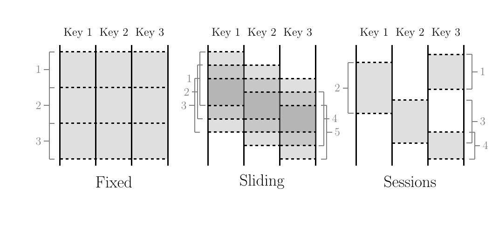

**图 1：** 常见窗口模式。

固定窗口（有时称滚动窗口）由静态窗口大小定义，例如小时窗口或天窗口。它们通常是对齐的，即每个窗口应用于相应时间段内的全部数据。为了让窗口完成所带来的负载均匀分散到时间轴上，有时也会对每个键施加随机相移，使窗口不再对齐。

滑动窗口由窗口大小和滑动周期定义，例如每分钟开始一个小时窗口。滑动周期可以小于窗口大小，因此窗口可能重叠。滑动窗口通常也是对齐的；虽然图中画出了滑动的感觉，但五个窗口都会应用于三个键，而不仅是窗口 3。固定窗口其实只是窗口大小等于滑动周期的滑动窗口特例。

会话窗口捕获数据子集上的一段活动时间，这里是按键捕获。它通常由超时间隔定义：时间间隔小于超时值的所有事件都会被归为一个会话。会话属于未对齐窗口。例如，窗口 2 只应用于键 1，窗口 3 只应用于键 2，而窗口 1 和窗口 4 只应用于键 3。

### 1.3 时间域

处理与时间事件有关的数据时，需要考虑两个固有时间域。相关概念散见于大量研究，尤其是时间管理 [28] 和语义模型 [9]，也包括窗口 [22]、乱序处理 [23]、标点 [30]、心跳 [21]、水位线 [2] 和帧 [31]。明确理解以下概念，有助于阅读第 2.3 节的详细示例：

- **事件时间（Event Time）：** 事件本身真正发生的时间，即事件发生时，由生成该事件的系统时钟记录的时间。
- **处理时间（Processing Time）：** 事件在流水线内处理期间、任意给定位置被观察到的时间，即系统时钟所指示的当前时间。我们不对分布式系统内的时钟同步作任何假设。

给定事件的事件时间基本不会改变，但随着事件流过流水线、时间不断向前，事件的处理时间一直在变化。若要依据事件发生时的上下文稳健分析事件，这一区别非常重要。

处理过程中，通信延迟、调度算法、处理耗时、流水线序列化等系统现实，会在两个时间域之间造成固有且动态变化的偏斜。标点或水位线等全局进度指标可以直观展示这种偏斜。我们考虑类似 MillWheel 的水位线：它是已由流水线处理的事件时间下界，通常通过启发式方法建立[^6]。如前所述，完整性概念通常与正确性不兼容，因此我们不会把水位线视为完整性的保证。不过，水位线能有效表达系统认为“某个事件时间点以前的全部数据很可能已被观察到”的时刻，因此不仅可用于显示偏斜，也可监控系统整体健康与进度，并支持不要求绝对准确的进度决策，如基本垃圾回收策略。

理想情况下，时间域偏斜始终为零，所有事件一发生就立即得到处理。现实并非如此，结果往往如图 2 所示。约从 12:00 开始，随着流水线落后，水位线逐渐偏离实时；到 12:02 左右又快速接近实时；临近 12:03 时再次明显落后。这种偏斜的动态变化在分布式数据处理系统中极为常见，并会在确定提供正确、可重复结果所需的功能时发挥重要作用。

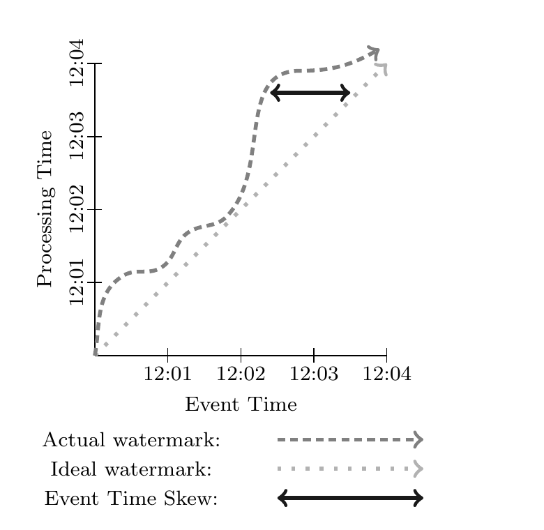

**图 2：** 时间域偏斜。图例依次为实际水位线、理想水位线和事件时间偏斜。

## 2. Dataflow 模型

本节定义系统的正式模型，并解释为何其语义足够通用，能够涵盖标准批处理、微批处理与流处理模型，以及 Lambda 架构的流批混合语义。代码示例使用 Dataflow Java SDK 的简化变体；该 SDK 本身由 FlumeJava API 演化而来。

### 2.1 核心原语

首先考察经典批处理模型中的原语。Dataflow SDK 提供两种核心变换，作用于流过系统的键值对[^7]：

- **ParDo** 用于通用并行处理。每个待处理输入元素（它本身也可以是有限集合）都会传给用户定义函数，在 Dataflow 中称为 `DoFn`；每个输入可以产生零个或多个输出元素。例如，下面的操作展开输入键的所有前缀，并把值复制到每个前缀上：

```text
(fix, 1), (fit, 2)
          │
          │ ParDo(ExpandPrefixes)
          ↓
(f, 1), (fi, 1), (fix, 1), (f, 2), (fi, 2), (fit, 2)
```

- **GroupByKey** 按键对 `(key, value)` 对分组：

```text
(f, 1), (fi, 1), (fix, 1), (f, 2), (fi, 2), (fit, 2)
          │
          │ GroupByKey
          ↓
(f, [1, 2]), (fi, [1, 2]), (fix, [1]), (fit, [2])
```

`ParDo` 逐个作用于输入元素，因此可以自然用于无界数据。`GroupByKey` 则先收集某个键的全部数据，再把它们发送到下游归约。如果输入源无界，就无法知道输入何时结束。常见解决方案是对数据划分窗口。

### 2.2 窗口

支持分组的系统通常会把 `GroupByKey` 重新定义为实质上的 `GroupByKeyAndWindow`。我们在这里的主要贡献是支持未对齐窗口，其中有两个关键洞见。第一，从模型角度把所有窗口策略都视为未对齐更加简单，再由底层实现在适用时对对齐情形进行优化。第二，窗口可以拆成两个相关操作：

- `Set<Window> AssignWindows(T datum)`：把元素分配给零个或多个窗口，本质上就是 Li [22] 的 Bucket Operator。
- `Set<Window> MergeWindows(Set<Window> windows)`：在分组时合并窗口，使数据驱动窗口能够随着数据到达和归组而逐步构建。

对于任意窗口策略，这两个操作都密切相关：滑动窗口分配需要滑动窗口合并，会话窗口分配需要会话窗口合并，依此类推。

为了原生支持事件时间窗口，系统不再传递 `(key, value)` 对，而是传递 `(key, value, event time, window)` 四元组。元素进入系统时带有事件时间戳，该时间戳也可以在流水线任意位置修改[^8]；系统最初会把元素分配到覆盖全部事件时间的默认全局窗口，从而提供与标准批处理模型默认行为相同的语义。

#### 2.2.1 窗口分配

从模型角度看，窗口分配会为元素所属的每个窗口分别创建一个副本。例如，图 3 展示把数据集划分成宽度两分钟、周期一分钟的滑动窗口；为简洁起见，时间戳采用 HH:MM 格式。

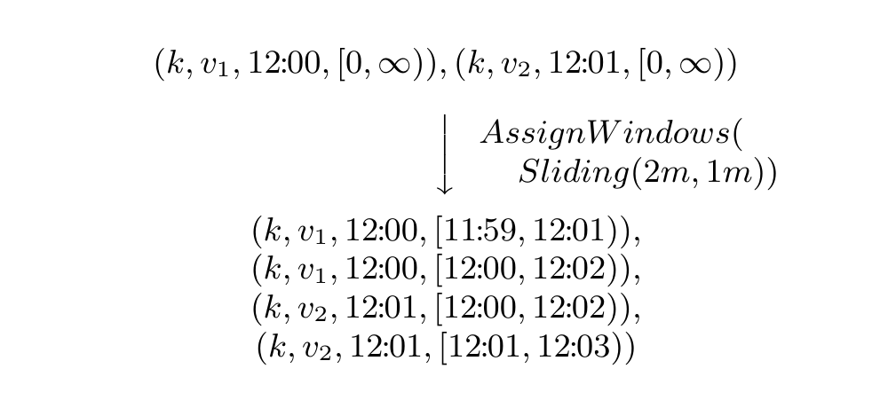

**图 3：** 窗口分配。

这里两个键值对都会被复制，使其同时存在于与元素时间戳重叠的两个窗口中。窗口直接关联到所属元素，因此窗口分配可以发生在流水线中应用分组之前的任意位置。这一点很重要，因为分组操作可能深埋在下游某个复合变换内部，例如 `Sum.integersPerKey()`。

#### 2.2.2 窗口合并

窗口合并是 `GroupByKeyAndWindow` 操作的一部分，结合示例最容易说明。这里采用促成本文研究的会话窗口用例。图 4 给出四个示例数据，其中三个属于 `k1`，一个属于 `k2`；按会话划窗，会话超时为 30 分钟。系统最初把它们全部放入默认全局窗口。`AssignWindows` 的会话实现把每个元素放入一个从其时间戳开始、向后延伸 30 分钟的窗口；该窗口表示后续事件若要被视为同一会话的一部分，可以落入的时间范围。随后开始执行 `GroupByKeyAndWindow`，它实际上由五个操作组成：

- **DropTimestamps**：丢弃元素时间戳，因为从这一步起只与窗口有关[^9]。
- **GroupByKey**：按键对 `(value, window)` 元组分组。
- **MergeWindows**：合并某个键当前缓冲的窗口集合。实际合并逻辑由窗口策略定义。本例中，`v1` 与 `v4` 的窗口重叠，因此会话窗口策略把它们合并成一个更大的新会话，图中以粗体标出。
- **GroupAlsoByWindow**：对每个键按窗口归组值。上一步合并后，`v1` 与 `v4` 位于相同窗口，因此在此归为一组。
- **ExpandToElements**：把每键、每窗口的值组展开为 `(key, value, event time, window)` 元组，并设置新的每窗口时间戳。本例把时间戳设为窗口末尾；就水位线正确性而言，任何不早于窗口内最早事件时间戳的时间戳都有效。

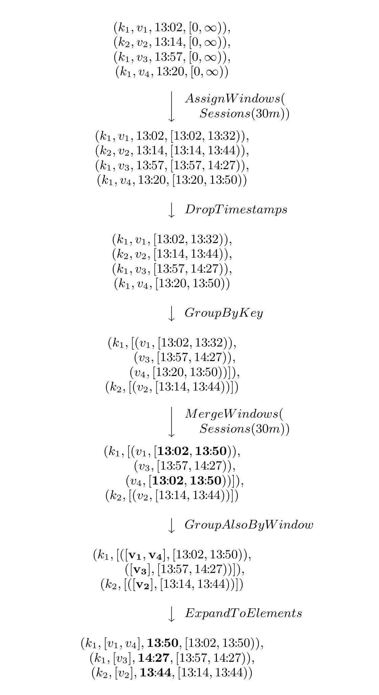

**图 4：** 窗口合并。粗体表示会话合并后发生变化的值与时间戳。

#### 2.2.3 API

下面用一个简短示例说明窗口 API 的实际用法。以下 Cloud Dataflow SDK 代码计算按键整数和：

```java
PCollection<KV<String, Integer>> input = IO.read(...);
PCollection<KV<String, Integer>> output = input
  .apply(Sum.integersPerKey());
```

若要执行相同计算，但像图 4 那样划分为超时 30 分钟的会话窗口，只需在求和之前增加一次 `Window.into` 调用：

```java
PCollection<KV<String, Integer>> input = IO.read(...);
PCollection<KV<String, Integer>> output = input
  .apply(Window.into(Sessions.withGapDuration(
      Duration.standardMinutes(30))))
  .apply(Sum.integersPerKey());
```

### 2.3 触发与增量处理

构建未对齐事件时间窗口是一项改进，但还需解决两个问题：

- 必须以某种方式支持基于元组和处理时间的窗口，否则窗口语义会比其他现有系统退步。
- 必须知道何时输出一个窗口的结果。数据相对于事件时间是无序的，因此需要其他信号判断窗口何时完成。

第一个问题将在第 2.4 节中解决；在此之前，先建立窗口完整性问题的解决方案。最初可能会倾向使用水位线这类全局事件时间进度指标，但水位线相对于正确性有两项主要缺点：

- **有时过快。** 水位线已经越过的事件时间位置，仍可能有迟到数据到达。许多分布式数据源无法获得绝对完美的事件时间水位线，因此若要求输出达到 100% 正确，就不能只依赖水位线。
- **有时过慢。** 水位线是全局进度指标，单个缓慢数据就可能拖住整条流水线。即使健康流水线的事件时间偏斜变化很小，基础偏斜也可能达到数分钟或更久，具体取决于输入源。因此，仅用水位线作为窗口结果输出信号，很可能比同类 Lambda 架构流水线产生更高整体延迟。

所以，仅有水位线并不足够。解决完整性问题的一个重要洞见来自 Lambda 架构：它绕开而非真正解决完整性问题。它不会以某种方式更快提供正确答案，而是先给出流处理流水线能够提供的最佳低延迟估计，再承诺批处理流水线运行后最终达到一致和正确[^10]。若要在单条流水线内做到同样的事，无论底层执行引擎为何，就必须允许同一个窗口提供多个答案，我们称之为窗格（pane）。让用户能够指定何时触发某个窗口的结果输出，这项功能称为触发器。

简言之，触发器是一种响应内部或外部信号、促使 `GroupByKeyAndWindow` 产生结果的机制。它与窗口模型互补，两者分别影响不同时间轴上的系统行为：

- 窗口决定数据在事件时间的何处分组处理。
- 触发决定分组结果在处理时间的何时作为窗格输出。[^11]

系统预定义了多类触发器：可在完成度估计处触发，如水位线和百分位水位线；可在处理时间的特定点触发；也可响应数据到达而触发，如计数、字节数、数据标点、模式匹配等。百分位水位线可用于处理批处理和流处理引擎中的拖尾项，适合更在意快速处理最低比例输入、而非处理最后一条数据的场景。系统还支持把触发器组合成逻辑组合（与、或等）、循环、序列及其他结构。用户也可以利用执行运行时的底层原语，如水位线定时器、处理时间定时器、数据到达和组合支持，以及其他相关外部信号，如数据注入请求、外部进度指标和 RPC 完成回调，自定义触发器。第 2.4 节将进一步考察具体示例。

除了控制结果何时输出，触发器系统还通过三种修订模式控制同一窗口的多个窗格如何关联：

- **丢弃（Discarding）：** 每次触发后丢弃窗口内容，后续结果与先前结果无关。当下游数据使用者（无论位于流水线内部还是外部）预期不同触发产生的值彼此独立时，此模式很有用，例如注入一个会对输入值求和的系统。就缓冲数据量而言，它也最高效；不过，对可建模为 Dataflow `Combiner` 的结合且可交换操作，效率差异通常很小。对视频会话用例而言，此模式不够，因为要求下游使用者自行拼接局部会话并不实际。
- **累积（Accumulating）：** 触发后，窗口内容仍保存在持久状态中，后续结果是对先前结果的修订。当下游使用者收到同一窗口的多个结果时，预期用新值覆盖旧值，此模式很有用。Lambda 架构实际上采用这种模式：流处理流水线先产生低延迟结果，随后被批处理流水线的结果覆盖。对视频会话而言，如果只是计算会话并立刻写入支持更新的输出源，如数据库或键值存储，这种模式可能已经足够。
- **累积并撤回（Accumulating & Retracting）：** 除累积语义外，每次触发还会把已输出值的副本存入持久状态。窗口以后再次触发时，先输出先前值的撤回记录，再把新值作为普通数据输出[^12]。流水线中串联多个 `GroupByKeyAndWindow` 时必须使用撤回，因为同一窗口在后续多次触发中产生的多个结果，下游分组时可能落入不同键。若没有撤回告知第二次分组原输出的影响应被反转，它会为这些键生成错误结果。可逆的 Dataflow `Combiner` 可以通过 `uncombine` 方法高效支持撤回。对视频会话而言，这是理想模式。若会话创建之后还要执行依赖会话自身属性的聚合，例如识别大多数会话中观看不足五秒的不受欢迎广告，那么随着输入演进，初始结果可能失效；例如大量离线移动用户重新上线并上传会话数据。撤回使包含多个串联分组阶段的复杂流水线能够适应此类变化。

### 2.4 示例

下面通过一系列示例展示 Dataflow 模型支持的多种实用输出模式。每个示例都基于第 2.2.3 节的整数求和流水线：

```java
PCollection<KV<String, Integer>> output = input
  .apply(Sum.integersPerKey());
```

假设输入源包含十个数据点，每个数据点都是一个小整数。我们分别在有界与无界数据源语境下考察它们。为简化图示，假设所有数据都属于同一个键；真实流水线中，这些操作会针对多个键并行执行。图 5 沿我们关注的两个时间轴展示这些数据的关系：横轴按事件时间绘制数据，即事件真正发生的时间；纵轴按处理时间绘制，即流水线观察到数据的时间。除非另有说明，所有示例均假设运行在我们的流处理引擎上。

许多示例还依赖水位线，因此图中同时给出理想水位线和一个实际水位线示例。斜率为一的直虚线代表理想水位线，即不存在事件时间偏斜、所有事件都在发生时被系统立即处理。分布式系统难免出现各种变化，因此偏斜很常见；图 5 中较深的虚线蜿蜒前进，表示实际水位线。值为 9 的单个“迟到”数据落在水位线后方，也就是其事件时间早于水位线，也体现了水位线的启发式性质。

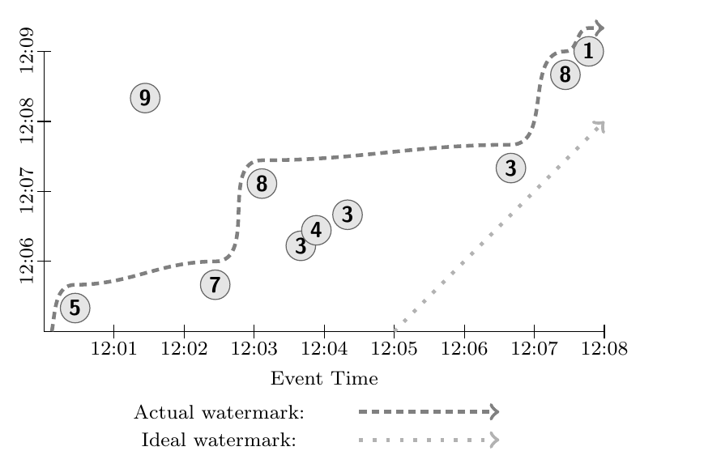

**图 5：** 示例输入。

若在经典批处理系统中用上述求和流水线处理这些数据，系统会等待全部数据到达，把它们归为一组（因为它们属于同一个键），再求和得到总结果 51。图 6 中深色矩形代表该结果；矩形面积覆盖纳入求和的事件时间与处理时间范围，矩形顶部表示结果在处理时间轴上的物化时刻。经典批处理不感知事件时间，因此结果位于覆盖全部事件时间的单个全局窗口内。输出只在收到全部输入后计算，因此结果还覆盖该次执行的全部处理时间。

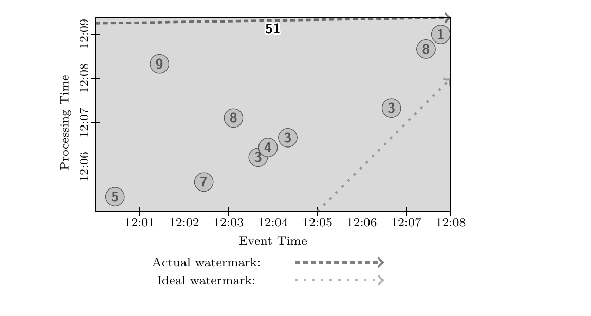

**图 6：** 经典批处理执行。

图中也包含水位线。经典批处理通常不使用水位线，但从语义上说，水位线会一直停留在时间起点，直到全部数据处理完毕，随后推进到无穷。需要强调的是，在流处理系统中让水位线以这种方式推进，可以获得与经典批处理完全相同的语义。

现在假设要把流水线改为处理无界数据源。Dataflow 的默认触发语义是在水位线越过窗口时输出窗口。但是，对无界输入使用全局窗口时，这永远不会发生，因为全局窗口覆盖全部事件时间。因此，要么必须改用默认触发器以外的条件，要么必须改用全局窗口以外的窗口，否则永远不会有输出。

先考察改变触发器。这样可以生成概念上相同的输出，即每键跨全部时间的全局和，但会定期更新。本例应用 `Window.trigger`，在处理时间每隔一分钟的边界反复触发；同时指定累积模式，让全局和随时间不断修订。这里假定输出接收端支持用新结果直接覆盖该键的旧结果，如数据库或键值存储。因此，图 7 每分钟处理时间产生一次更新后的全局和。半透明输出矩形彼此重叠，是因为累积窗格在先前结果上继续构建，并纳入相互重叠的处理时间区域：

```java
PCollection<KV<String, Integer>> output = input
  .apply(Window.trigger(Repeat(AtPeriod(1, MINUTE)))
               .accumulating())
  .apply(Sum.integersPerKey());
```

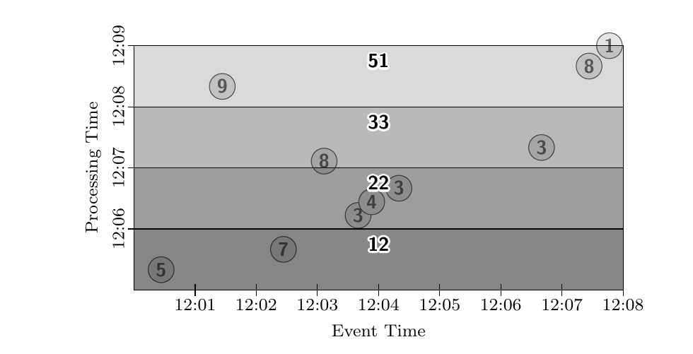

**图 7：** `GlobalWindows`、`AtPeriod`、`Accumulating`。

若希望每分钟生成求和的增量，可以切换到丢弃模式，如图 8 所示。这实际上提供了许多流处理系统中的处理时间窗口语义。各输出窗格不再重叠，因为它们的结果来自相互独立的处理时间区域。

```java
PCollection<KV<String, Integer>> output = input
  .apply(Window.trigger(Repeat(AtPeriod(1, MINUTE)))
               .discarding())
  .apply(Sum.integersPerKey());
```

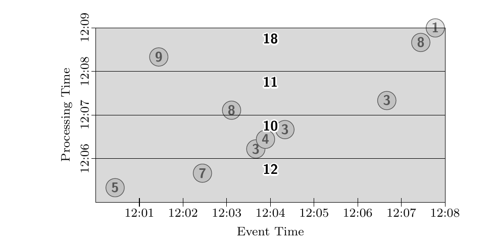

**图 8：** `GlobalWindows`、`AtPeriod`、`Discarding`。

提供处理时间窗口语义还有一种更稳健的方法：在数据入口处直接把到达时间指定为事件时间，再使用事件时间窗口。采用到达时间作为事件时间还有一个好处：系统完全知道传输中的事件时间，因而能够提供没有迟到数据的完美、非启发式水位线。对于不需要或无法获得真实事件时间的用例，这是处理无界数据的一种有效且成本低廉的方法。

在进一步讨论其他窗口选项之前，再改变一次这条流水线的触发器。另一种需要建模的常见窗口模式是基于元组的窗口。只需让触发器在一定数量的数据到达后触发，例如每两个数据触发一次，就能提供这种功能。图 9 产生五个输出，每个输出包含处理时间上相邻的两个数据之和。滑动元组窗口等更复杂方案需要自定义窗口策略，但同样受到支持。

```java
PCollection<KV<String, Integer>> output = input
  .apply(Window.trigger(Repeat(AtCount(2)))
               .discarding())
  .apply(Sum.integersPerKey());
```

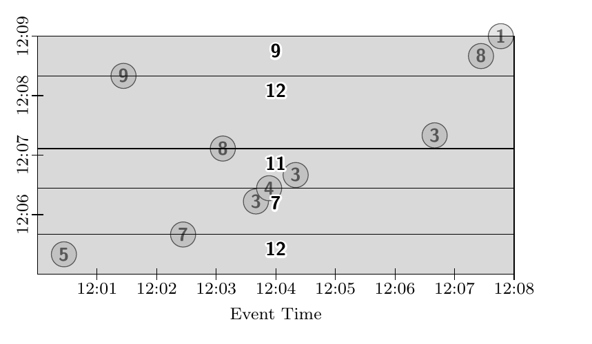

**图 9：** `GlobalWindows`、`AtCount`、`Discarding`。

下面回到支持无界数据源的另一种方案：不再使用全局窗口。首先，把数据划分为固定的两分钟累积窗口：

```java
PCollection<KV<String, Integer>> output = input
  .apply(Window.into(FixedWindows.of(2, MINUTES)
               .accumulating())
  .apply(Sum.integersPerKey());
```

若未指定触发策略，系统会使用默认触发器，其效果如下：

```java
PCollection<KV<String, Integer>> output = input
  .apply(Window.into(FixedWindows.of(2, MINUTES))
               .trigger(Repeat(AtWatermark())))
               .accumulating())
  .apply(Sum.integersPerKey());
```

当水位线越过相应窗口的末尾时，水位线触发器便触发。批处理和流处理引擎都实现了水位线，详见第 3.1 节。触发器中的 `Repeat` 用来处理迟到数据：如果在水位线已经越过窗口后仍有数据到达，它会实例化重复的水位线触发器；由于水位线已经越过窗口，该触发器会立即触发。

图 10 至图 12 分别展示这条流水线在不同运行时引擎上的表现。先看批处理引擎。按当前实现，数据源必须有界，因此与前面的经典批处理示例一样，系统等待批次中的全部数据到达。随后按事件时间顺序处理数据，并随着模拟水位线推进而输出窗口，如图 10 所示。

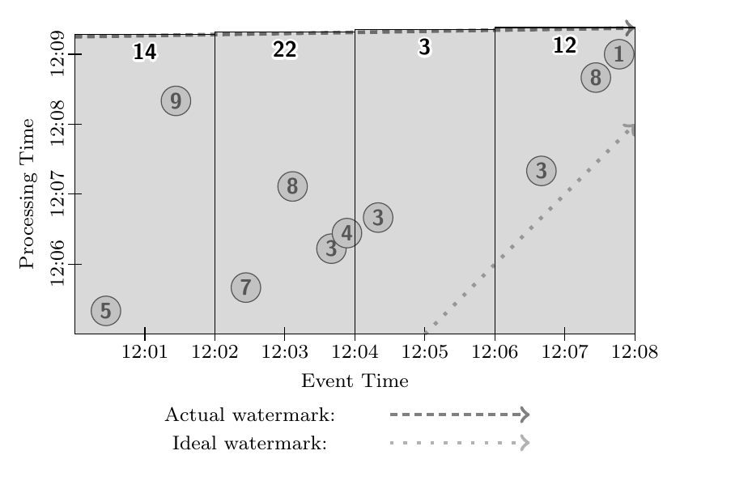

**图 10：** `FixedWindows`、批处理。

再设想微批处理引擎以一分钟为批次处理该数据源。系统收集一分钟输入，处理它们，然后重复。每轮中，当前批次的水位线都从时间起点开始，推进到时间终点；严格来说，它会从批次结束时间瞬间跳到时间终点，因为此后没有数据。这样，每轮微批处理都会有一条新水位线，并为自上一轮以来内容发生变化的所有窗口输出相应结果。结果很好地兼顾了延迟与最终正确性，如图 11 所示。

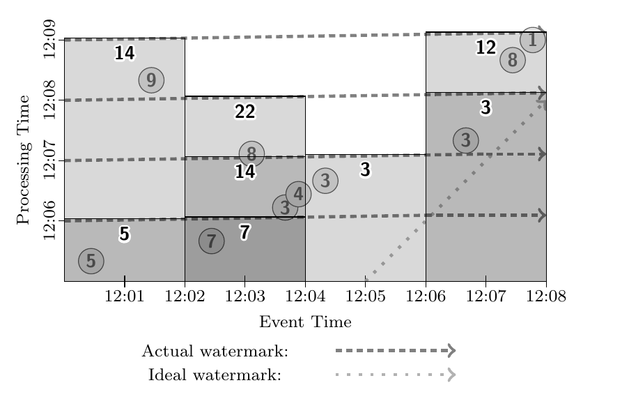

**图 11：** `FixedWindows`、微批处理。

接着考虑在流处理引擎上执行这条流水线，如图 12 所示。大多数窗口会在水位线越过时输出。但值为 9 的数据相对于水位线实际上已经迟到。由于移动输入源离线、网络分区等原因，系统不知道该数据尚未注入；观察到值 5 后，系统允许水位线越过事件时间轴上最终会被 9 占据的位置。因此，当 9 最终到达时，会使事件时间范围 `[12:00, 12:02)` 的第一个窗口再次触发，并输出更新后的和。

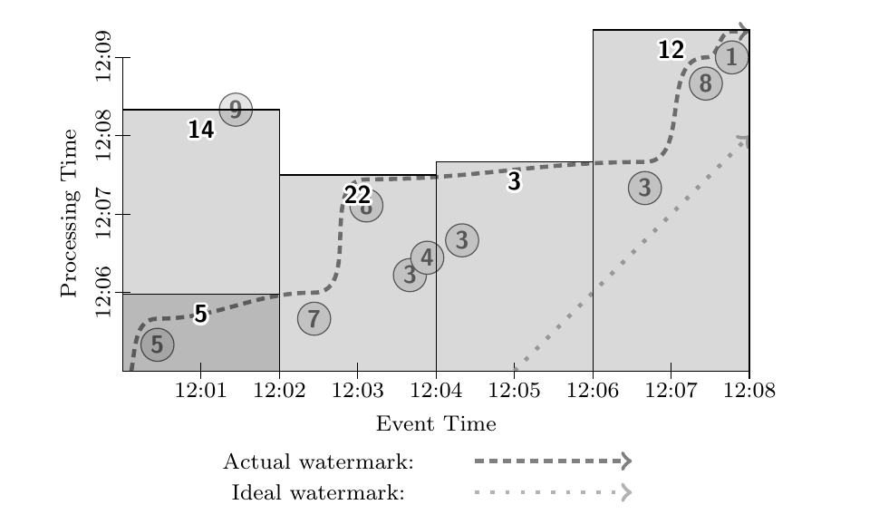

**图 12：** `FixedWindows`、流处理。

这种输出模式基本每个窗口只有一个输出，迟到数据出现时只修订一次，因而很简洁。但整体结果延迟明显高于微批处理系统，因为必须等待水位线推进；这就是第 2.3 节所说水位线过慢的情形。

如果希望所有窗口都通过多个局部结果获得更低延迟，可以加入额外的处理时间触发器，在水位线真正越过之前定期更新，如图 13 所示。它的延迟略优于微批处理流水线，因为数据到达时就累积进窗口，而不是先组成小批次再处理。在微批处理与流处理引擎都具备强一致性的前提下，两者之间的选择以及微批大小的选择，就只取决于延迟和成本；这正是我们模型的目标之一。

```java
PCollection<KV<String, Integer>> output = input
  .apply(Window.into(FixedWindows.of(2, MINUTES))
               .trigger(SequenceOf(
                 RepeatUntil(
                   AtPeriod(1, MINUTE),
                   AtWatermark()),
                 Repeat(AtWatermark())))
               .accumulating())
  .apply(Sum.integersPerKey());
```

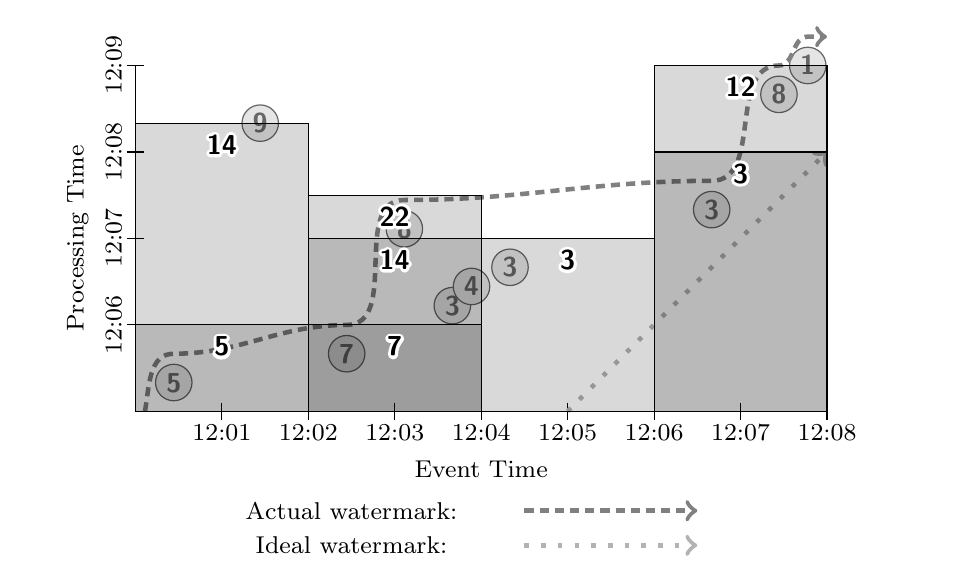

**图 13：** `FixedWindows`、流处理、局部结果。

最后，把示例更新为满足视频会话需求：将窗口改为超时一分钟的会话窗口，并启用撤回。为保持图示一致，仍以求和作为聚合操作；换成其他聚合并不困难。该示例体现了把模型拆成四部分所获得的可组合性，即计算什么、在事件时间的何处计算、在处理时间的何时观察答案，以及答案如何关联到后续修订；它也展示了撤回旧值的作用，否则旧值可能与替换它的新值无法关联。

```java
PCollection<KV<String, Integer>> output = input
  .apply(Window.into(Sessions.withGapDuration(1, MINUTE))
               .trigger(SequenceOf(
                 RepeatUntil(
                   AtPeriod(1, MINUTE),
                   AtWatermark()),
                 Repeat(AtWatermark())))
               .accumulatingAndRetracting())
  .apply(Sum.integersPerKey());
```

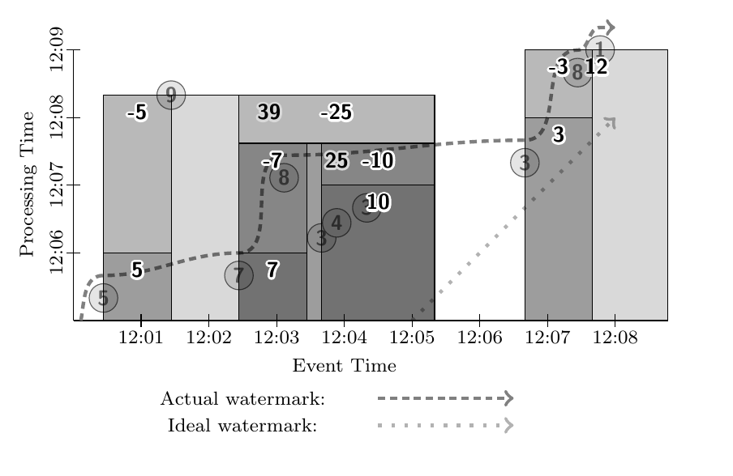

**图 14：** `Sessions`、`Retracting`。

本例在第一个一分钟处理时间边界，为值 5 和 7 输出初始单元素会话。到第二分钟边界时，再输出由值 3、4、3 构成、值为 10 的第三个会话。最终观察到值 8 后，它把值为 7 和 10 的两个会话连接起来。当水位线越过这个新合并会话的末尾时，系统输出对 7 和 10 会话的撤回，以及值为 25 的新会话普通数据。同样，当 9 迟到后，它把值为 5 的会话与值为 25 的会话连接起来。重复水位线触发器随即输出对 5 和 25 的撤回，再输出值为 39 的合并会话。值 3、8、1 也发生类似过程，最终先撤回初始值为 3 的会话，再输出值为 12 的合并会话。

## 3. 实现与设计

### 3.1 实现

我们已经在 FlumeJava 内部实现该模型；流处理模式使用 MillWheel 作为底层执行引擎。本文写作时，面向 Cloud Dataflow 的外部重新实现也已基本完成。由于这些内部系统已在文献中有所介绍，而且 Cloud Dataflow 可以公开使用，为简洁起见，我们省略实现细节。值得一提的是，核心窗口和触发代码十分通用，其中相当一部分由批处理与流处理实现共享；该系统本身值得在未来工作中进一步详细分析。

### 3.2 设计原则

尽管模型的大量设计受到第 3.3 节真实经验的推动，我们也遵循一组认为该模型应当体现的核心原则：

- 永远不依赖任何完整性概念。
- 保持灵活，以适应已知用例的多样性，也适应未来出现的用例。
- 在设想的每一种执行引擎环境中，不仅语义合理，而且能够带来价值。
- 鼓励实现清晰。
- 支持依据数据发生时的上下文进行稳健分析。

下文经验影响了模型的具体功能，而这些原则塑造了模型的整体形态与特征。我们相信，它们最终促成了一个更全面、更通用的结果。

### 3.3 促成模型形成的经验

设计 Dataflow 模型时，我们参考了多年来使用 FlumeJava 和 MillWheel 的真实经验。实践效果好的部分被纳入模型，效果不好的部分则促使我们改变方法。下面简述一些影响设计的经验。

#### 3.3.1 大规模回填与 Lambda 架构：统一模型

多个团队在 MillWheel 上运行日志连接流水线。其中一条特别大的日志连接流水线默认以 MillWheel 流处理模式运行，但另有一个 FlumeJava 批处理实现，用于大规模回填。更好的方案是只编写一份统一模型实现，无须修改便能以流处理或批处理模式运行。这成为统一批处理、微批处理与流处理引擎的最初推动用例，图 10 至图 12 对此进行了展示。

统一模型的另一个动机来自 Lambda 架构经验。Google 大多数数据处理用例只使用批处理或流处理系统，但有一位 MillWheel 用户以弱一致模式运行流处理流水线，并每晚用 MapReduce 生成事实结果。随着时间推移，用户不再信任弱一致结果，因此该团队围绕强一致性重新实现系统，以提供可靠、低延迟结果。这段经验进一步推动了在不同执行引擎之间灵活选择的需求。

#### 3.3.2 未对齐窗口：会话

从一开始，我们就知道必须支持会话；事实上，这正是我们的窗口模型相对于现有模型的主要贡献。会话是 Google 内部极其重要的用例，也是创建 MillWheel 的原因之一，被广泛用于搜索、广告、分析、社交和 YouTube 等产品领域。凡是需要把一段时间内原本分离的用户活动突发关联起来的场景，基本都会计算会话。因此，会话支持成为设计中的首要要求。如图 14 所示，在 Dataflow 模型中生成会话十分直接。

#### 3.3.3 计费：触发、累积与撤回

两个基于 MillWheel 构建计费流水线的团队所遇到的问题，推动了模型的部分设计。当时的推荐做法是用水位线作为完成度指标，再以临时专用逻辑处理迟到数据或源数据变化。由于缺少有原则的更新和撤回系统，一个处理资源利用率统计的团队最终离开我们的平台，构建了自定义方案；其模型与我们同期开发的模型非常相似。另一个计费团队则深受输入拖尾项造成的水位线延迟困扰。

这些不足成为设计的重要驱动力，使关注点从追求完整性转为随时间适应变化，产生了两项结果。其一是触发器，可简洁、灵活地指定何时物化结果；图 7 至图 14 展示同一数据集上可以实现的多种输出模式。其二是通过累积（图 7、图 8）和撤回（图 14）支持增量处理。

#### 3.3.4 统计计算：水位线触发器

许多 MillWheel 流水线计算汇总统计，如延迟平均值。它们不要求 100% 准确，但需要在合理时间内看到大致完整的数据。对日志文件这类结构化输入源，我们的水位线的准确度很高，因此这些用户发现，水位线非常适合为每个窗口触发一个高准确度汇总结果。图 12 展示了水位线触发器。

许多滥用检测流水线运行在 MillWheel 上。对滥用检测而言，快速处理大多数数据也比缓慢处理 100% 数据更有用。因此，这些流水线大量使用 MillWheel 的百分位水位线，并强烈推动模型支持百分位水位线触发器。

类似地，批处理作业的一个痛点是拖尾项造成很长的执行时间尾部。动态再平衡可以缓解问题，但 FlumeJava 还有一项自定义功能，可依据整体进度提前终止作业。统一模型在批处理模式下的好处之一，是这类提前终止条件现在可自然地用标准触发器机制表达，而不再需要自定义功能。

#### 3.3.5 推荐：处理时间触发器

我们考察的另一条流水线会在 Google 的一项大型产品中构建用户活动树，本质上是会话树，再用这些树生成符合用户兴趣的推荐。该流水线的显著特点是使用处理时间定时器驱动输出。这是因为对它而言，定期获得更新后的局部数据视图，远比等待水位线越过会话末尾后才得到大致完整的视图更有价值。这样，少量缓慢数据拖延水位线进度，也不会影响其余数据输出的及时性。因此，这条流水线推动了图 7 和图 8 所示处理时间触发器的加入。

#### 3.3.6 异常检测：数据驱动与复合触发器

MillWheel 论文描述了一条用于跟踪 Google Web 搜索查询趋势的异常检测流水线。开发触发器时，其差异检测系统推动了数据驱动触发器。这些差异检测器观察查询流，并统计估计是否存在峰值；认为峰值开始时输出开始记录，认为峰值结束时输出停止记录。

也可以用 Trill 标点这类周期信号驱动差异检测器输出，但异常检测最好在确信发现异常后立即输出。使用标点实质上把流处理系统变成微批处理，并引入额外延迟；它适用于许多用例，却不适合此处，因而推动了自定义数据驱动触发器支持。该用例也促成触发器组合，因为真实系统同时运行多个差异检测器，并按一组明确定义的逻辑对输出进行多路复用。图 9 的 `AtCount` 触发器是数据驱动触发器的例子，图 10 至图 14 则使用了复合触发器。

## 4. 结论

数据处理的未来是无界数据。有界数据始终会占据重要而实用的位置，但从语义上说，它被无界数据所涵盖。与此同时，无界数据集在现代企业中的增长令人惊叹，处理后数据的使用者也日益成熟，开始要求事件时间排序、未对齐窗口等强大构造。现有模型和系统为构建未来的数据处理工具奠定了优秀基础，但我们坚信，必须从整体思维方式上转变，才能让这些工具全面满足无界数据使用者的需求。

基于我们在 Google 内部多年处理真实、大规模、无界数据的经验，我们的模型是向这一方向迈出的良好一步。它支持现代数据使用者所需的未对齐、按事件时间排序的窗口；提供灵活触发，以及集成的累积和撤回，把方法的关注点从寻找数据完整性转向适应真实数据集中始终存在的变化。它抽象掉批处理、微批处理和流处理之间的区别，使流水线构建者能够更灵活地选择，同时避免面向单一底层系统的模型中不可避免的系统特定构造。

该模型整体上的灵活性，使流水线构建者可以根据用例适当平衡正确性、延迟和成本；在需求如此多样的现实中，这一点至关重要。最后，它通过分离四个概念使流水线实现更加清晰：计算什么结果、在事件时间的何处计算、在处理时间的何时物化，以及较早结果与后续修订如何关联。这个领域令人着迷又极其复杂；在大家继续推动其技术前沿时，我们希望该模型能够有所帮助。

## 5. 致谢

感谢所有尽职的审稿人为本文投入时间并提出深思熟虑的意见：Atul Adya、Ben Birt、Ben Chambers、Cosmin Arad、Matt Austern、Lukasz Cwik、Grzegorz Czajkowski、Walt Drummond、Jeff Gardner、Anthony Mancuso、Colin Meek、Daniel Myers、Sunil Pedapudi、Amy Unruh 和 William Vambenepe。我们也感谢 Google Cloud Dataflow、FlumeJava、MillWheel 及相关团队所有成员令人敬佩、不知疲倦的努力，正是他们帮助这项工作成为现实。

## 6. 参考文献

[1] D. J. Abadi et al. Aurora: A New Model and Architecture for Data Stream Management. *The VLDB Journal*, 12(2):120-139, Aug. 2003.

[2] T. Akidau et al. MillWheel: Fault-Tolerant Stream Processing at Internet Scale. In *Proc. of the 39th Int. Conf. on Very Large Data Bases (VLDB)*, 2013.

[3] A. Alexandrov et al. The Stratosphere Platform for Big Data Analytics. *The VLDB Journal*, 23(6):939-964, 2014.

[4] Apache. Apache Hadoop. <http://hadoop.apache.org>, 2012.

[5] Apache. Apache Storm. <http://storm.apache.org>, 2013.

[6] Apache. Apache Flink. <http://flink.apache.org/>, 2014.

[7] Apache. Apache Samza. <http://samza.apache.org>, 2014.

[8] R. S. Barga et al. Consistent Streaming Through Time: A Vision for Event Stream Processing. In *Proc. of the Third Biennial Conf. on Innovative Data Systems Research (CIDR)*, pages 363-374, 2007.

[9] Botan et al. SECRET: A Model for Analysis of the Execution Semantics of Stream Processing Systems. *Proc. VLDB Endow.*, 3(1-2):232-243, Sept. 2010.

[10] O. Boykin et al. Summingbird: A Framework for Integrating Batch and Online MapReduce Computations. *Proc. VLDB Endow.*, 7(13):1441-1451, Aug. 2014.

[11] Cask. Tigon. <http://tigon.io/>, 2015.

[12] C. Chambers et al. FlumeJava: Easy, Efficient Data-Parallel Pipelines. In *Proc. of the 2010 ACM SIGPLAN Conf. on Programming Language Design and Implementation (PLDI)*, pages 363-375, 2010.

[13] B. Chandramouli et al. Trill: A High-Performance Incremental Query Processor for Diverse Analytics. In *Proc. of the 41st Int. Conf. on Very Large Data Bases (VLDB)*, 2015.

[14] S. Chandrasekaran et al. TelegraphCQ: Continuous Dataflow Processing. In *Proc. of the 2003 ACM SIGMOD Int. Conf. on Management of Data (SIGMOD)*, SIGMOD '03, pages 668-668, New York, NY, USA, 2003. ACM.

[15] J. Chen et al. NiagaraCQ: A Scalable Continuous Query System for Internet Databases. In *Proc. of the 2000 ACM SIGMOD Int. Conf. on Management of Data (SIGMOD)*, pages 379-390, 2000.

[16] J. Dean and S. Ghemawat. MapReduce: Simplified Data Processing on Large Clusters. In *Proc. of the Sixth Symposium on Operating System Design and Implementation (OSDI)*, 2004.

[17] EsperTech. Esper. <http://www.espertech.com/esper/>, 2006.

[18] Gates et al. Building a High-level Dataflow System on Top of Map-Reduce: The Pig Experience. *Proc. VLDB Endow.*, 2(2):1414-1425, Aug. 2009.

[19] Google. Dataflow SDK. <https://github.com/GoogleCloudPlatform/DataflowJavaSDK>, 2015.

[20] Google. Google Cloud Dataflow. <https://cloud.google.com/dataflow/>, 2015.

[21] T. Johnson et al. A Heartbeat Mechanism and its Application in Gigascope. In *Proc. of the 31st Int. Conf. on Very Large Data Bases (VLDB)*, pages 1079-1088, 2005.

[22] J. Li et al. Semantics and Evaluation Techniques for Window Aggregates in Data Streams. In *Proceedings of the ACM SIGMOD Int. Conf. on Management of Data (SIGMOD)*, pages 311-322, 2005.

[23] J. Li et al. Out-of-order Processing: A New Architecture for High-performance Stream Systems. *Proc. VLDB Endow.*, 1(1):274-288, Aug. 2008.

[24] D. Maier et al. Semantics of Data Streams and Operators. In *Proc. of the 10th Int. Conf. on Database Theory (ICDT)*, pages 37-52, 2005.

[25] N. Marz. How to beat the CAP theorem. <http://nathanmarz.com/blog/how-to-beat-the-cap-theorem.html>, 2011.

[26] S. Murthy et al. Pulsar - Real-Time Analytics at Scale. Technical report, eBay, 2015.

[27] SQLStream. <http://sqlstream.com/>, 2015.

[28] U. Srivastava and J. Widom. Flexible Time Management in Data Stream Systems. In *Proc. of the 23rd ACM SIGMOD-SIGACT-SIGART Symp. on Princ. of Database Systems*, pages 263-274, 2004.

[29] A. Thusoo, J. S. Sarma, N. Jain, Z. Shao, P. Chakka, S. Anthony, H. Liu, P. Wyckoff, and R. Murthy. Hive: A Warehousing Solution over a Map-reduce Framework. *Proc. VLDB Endow.*, 2(2):1626-1629, Aug. 2009.

[30] P. A. Tucker et al. Exploiting punctuation semantics in continuous data streams. *IEEE Transactions on Knowledge and Data Engineering*, 15, 2003.

[31] J. Whiteneck et al. Framing the Question: Detecting and Filling Spatial-Temporal Windows. In *Proc. of the ACM SIGSPATIAL Int. Workshop on GeoStreaming (IWGS)*, 2010.

[32] F. Yang and others. Sonora: A Platform for Continuous Mobile-Cloud Computing. Technical Report MSR-TR-2012-34, Microsoft Research Asia.

[33] M. Zaharia et al. Resilient Distributed Datasets: A Fault-Tolerant Abstraction for In-Memory Cluster Computing. In *Proc. of the 9th USENIX Conf. on Networked Systems Design and Implementation (NSDI)*, pages 15-28, 2012.

[34] M. Zaharia et al. Discretized Streams: Fault-Tolerant Streaming Computation at Scale. In *Proc. of the 24th ACM Symp. on Operating Systems Principles*, 2013.

[^1]: 我们用“Dataflow 模型”指 Google Cloud Dataflow [20] 的处理模型，它建立在 FlumeJava [12] 和 MillWheel [2] 技术之上。
[^2]: 我们所称“窗口”，采用 Li [22] 的定义，即把数据切成有限片段以供处理，详见第 1.2 节。
[^3]: 我们所称“触发”，是指在分组操作处促使某个特定窗口输出，详见第 2.3 节。
[^4]: 我们所称“未对齐窗口”，是指不覆盖整个数据源、而只覆盖其子集的窗口，例如每用户窗口。这实质上就是 Whiteneck [31] 的帧思想，详见第 1.2 节。
[^5]: 我们所称“事件时间”，是事件发生的时间，而不是事件被处理的时间，详见第 1.3 节。
[^6]: 对大多数真实分布式数据集，系统掌握的信息不足以建立 100% 正确的水位线。例如，在视频会话用例中，考虑离线观看：某人把移动设备带到没有网络的野外，系统实际上无法知道他何时会重新进入有网络的环境、恢复连接，并开始上传期间的视频观看数据。因此，多数水位线必须依据有限可用信息启发式定义。对于能提供尚未观察数据元信息的结构化输入源，例如日志文件，我们发现这些启发式方法非常准确，作为许多用例的完成度估计具有实践价值。更重要的是，一旦建立了启发式水位线，就能像标点一样在流水线下游准确传播，但该整体指标本身仍是启发式的。
[^7]: 不失一般性，我们把系统中的所有元素都视为 `(key, value)` 对；实际上，`ParDo` 等某些操作并不需要键。多数有意义的讨论围绕确实需要键的 `GroupByKey` 展开，因此假定键存在更加简单。
[^8]: 某些时间戳修改操作会与水位线等进度跟踪指标相冲突；把时间戳改到水位线已经越过的事件时间位置，会使相应元素相对于该水位线成为迟到元素。
[^9]: 如果用户以后还需要时间戳，可以先把它物化为值的一部分。
[^10]: 现实中，只有在批处理作业运行时输入数据已经完整，其输出才正确；如果数据随时间演进，就必须检测这种变化并重新执行批处理作业。
[^11]: 水位线触发器等具体触发器的功能会使用事件时间，但它们在流水线中的效果仍体现在处理时间轴上。
[^12]: 简单的撤回处理实现要求操作具有确定性；通过增加复杂度和成本也可以支持非确定性。我们见过确实需要它的用例，例如概率建模。
