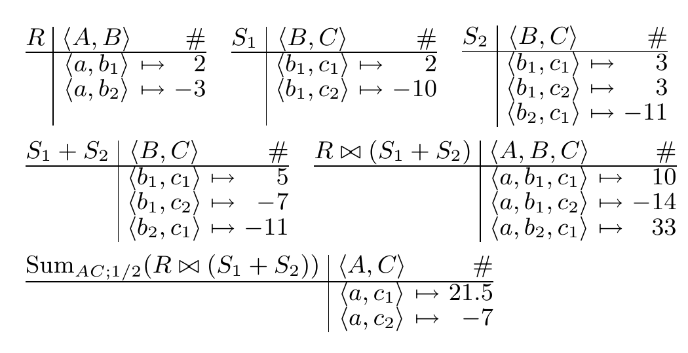
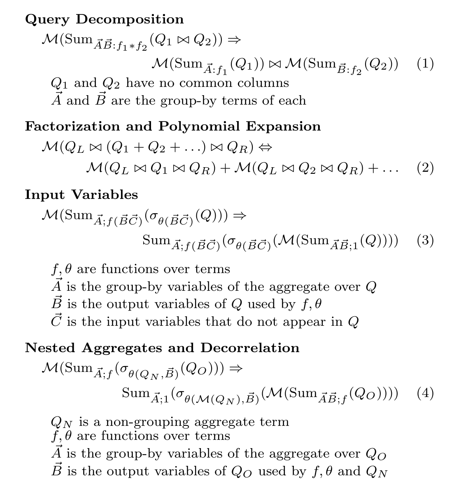
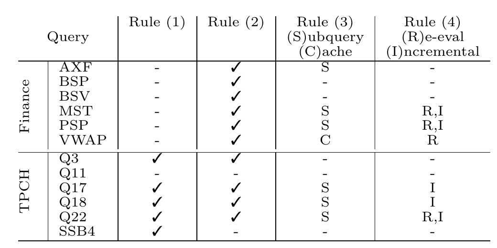
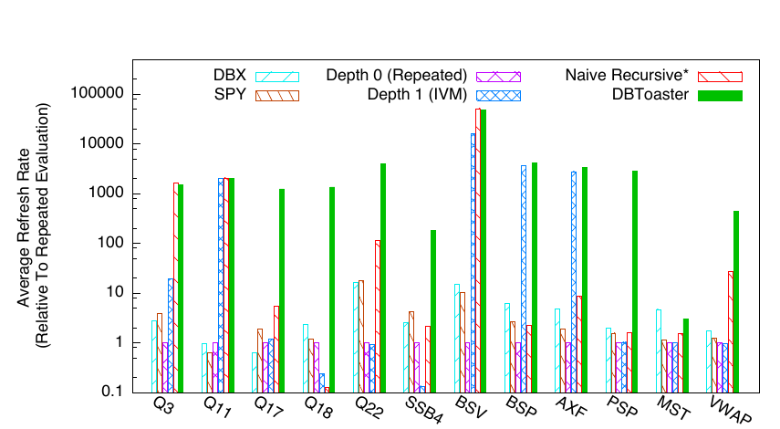
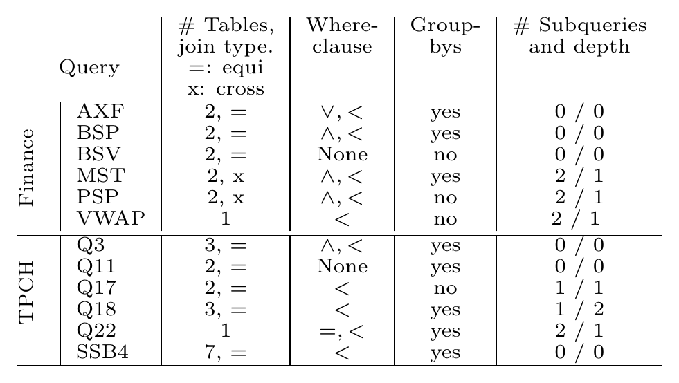
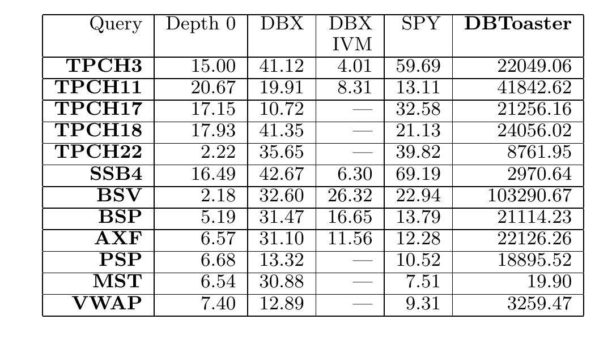
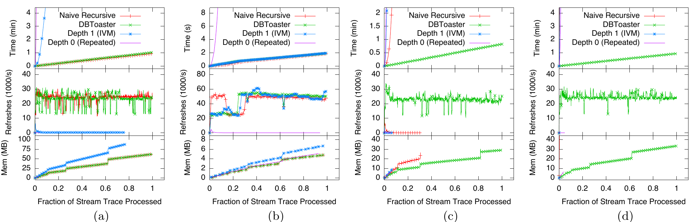
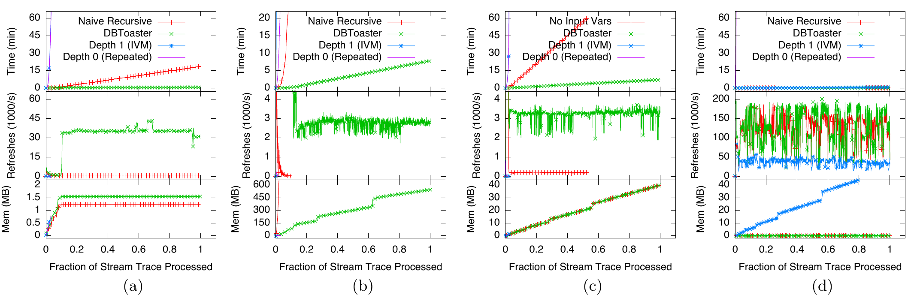
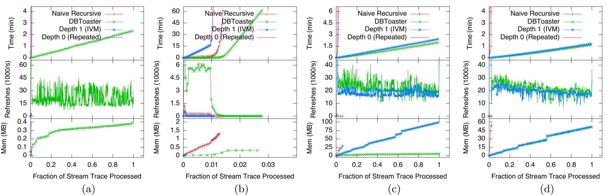
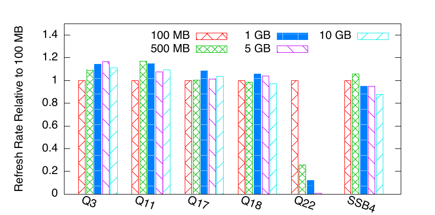

# DBToaster: Higher-order Delta Processing for Dynamic, Frequently Fresh Views（中文译文）

## 译者说明

本文依据同目录的 `source.pdf` 翻译。章节、图表、公式、算法、代码与参考文献按原文结构保留。

署名与联系信息：

- Yanif Ahmad（约翰斯·霍普金斯大学）：`yanif@jhu.edu`
- Oliver Kennedy、Christoph Koch、Milos Nikolic（洛桑联邦理工学院，École Polytechnique Fédérale de Lausanne）：`{christoph.koch, oliver.kennedy, milos.nikolic}@epfl.ch`

\* 本研究得到 ERC Grant 279804 的支持。

出版与复制许可：在副本不以营利或商业优势为目的，并且首页保留本声明和完整引文的前提下，允许免费制作本文全部或部分内容的数字副本或纸质副本，供个人或课堂使用。以其他方式复制、再出版、发布到服务器或向列表重新分发，须事先获得明确许可和/或支付费用。本卷文章获邀在 2012 年 8 月 27 日至 31 日于土耳其伊斯坦布尔举行的第 38 届超大型数据库国际会议上展示其成果。载于 *Proceedings of the VLDB Endowment*，第 5 卷第 10 期；Copyright 2012 VLDB Endowment 2150-8097/12/06... \$10.00。

## 摘要

从算法交易到科学数据分析，许多应用都需要基于高速变化数据库上的视图进行实时分析。这样的视图必须以较低的维护成本和延迟保持新鲜。与此同时，这些视图还必须支持经典 SQL，而不是窗口语义，才能让应用把当前数据同陈旧数据或历史数据结合起来。

本文提出视图元变换（viewlet transform）：一种递归地应用于查询的有限差分技术。视图元变换把一个查询及其一组高阶增量物化为视图。这些视图相互支持增量维护，从而降低总体视图维护成本。查询的视图元变换允许高效求值、消除某些昂贵的查询操作，并进行激进的并行化。我们把视图元变换发展为一种可实际工作的查询执行技术，提出启发式和基于代价的优化框架，并报告一个动态数据管理系统原型的实验结果；该原型把视图元变换与优化编译技术结合起来。对于广泛的一类查询，该系统每秒可支持数万次完整视图刷新。

## 1. 引言

过去几十年中，数据分析一直以经典数据仓库中的事后探索为主。如今这一局面开始变化：企业、工程师和科学家越来越早地把数据分析引擎放进工作流，以便对新鲜数据中的信号作出反应。这些动态数据集具有范围广泛的更新速率、数据量、异常和趋势。响应式分析是金融、电信、情报和关键基础设施管理中的关键计算组件，也正逐渐用于运营、物流、科学计算以及 Web 和社交媒体分析。

开发合适的分析引擎仍然充满挑战。频繁更新、长时间运行的查询和大型有状态工作集结合在一起，使得系统不能仅依赖 OLAP、OLTP 或流处理器。此外，面向更新的查询需求通常也无法单独落入现有技术所提供的功能和语义之中——从复杂事件处理（CEP）引擎到触发器、主动数据库和数据库视图，皆是如此。

我们在 DBToaster 项目 [3, 19, 18] 中对动态数据管理系统（dynamic data management system，DDMS）的研究，考察了面向大型数据集的数据管理工具的基础、算法和体系结构；这些数据集通过高速更新流快速演化。DDMS 把长时间运行的查询视为常态，同时也支持偶发的探索式查询。DDMS 的指导性设计原则是充分利用增量处理技术，最大程度地复用之前的工作。无论是在窗口滑动时尽量减少工作的流处理，还是在采用增量视图维护（incremental view maintenance，IVM）的数据库视图中，增量计算都居于核心地位。DDMS 试图结合 DBMS 的部分优点（不受窗口语义限制，能够对新近数据和历史数据执行表达力强的查询）与 CEP 引擎的部分优点（低延迟和高视图刷新速率）。

算法交易就是一个示例。在该场景中，策略设计者希望在算法里使用 SQL 这样的声明式语言，对订单簿数据进行分析。订单簿包含证券交易所中等待成交的订单，并且变化非常频繁。然而，一些订单可能在成交或撤销之前长时间留在订单簿中，因此不能使用带窗口语义的流处理引擎。科学仿真和情报分析等应用同样包含会在长短差异很大的时间范围内吸引我们注意的实体，由此形成大型、有状态且动态的计算。

本文的技术重点是增量视图维护的一种极端形式，我们称之为高阶 IVM。我们在多个推导层次上递归使用离散前向差分（增量查询）。也就是说，先用增量查询（“一阶增量”）增量维护输入查询的视图，再把增量查询也物化为视图，并用增量查询的增量查询（“二阶增量”）维护这些视图；如此继续，在物化视图与推导用于维护的更高阶增量查询之间交替。该技术对高阶增量的使用，与早先在查询子表达式的不同物化和增量维护选择之间权衡以取得最佳性能的工作 [27] 很不相同。相反，我们构造高阶增量视图的技术在某种程度上让人联想到离散小波和数值微分方法；基于与 Haar 小波变换的一种表面类比，我们把基础技术命名为视图元变换。

**示例 1** 考虑查询 $Q$，它统计关系 $R$ 与 $S$ 的乘积中的元组数。暂时只考虑在插入操作下维护 $Q$ 的视图。用 $\Delta_R$ 表示向 $R$ 插入一个元组时视图发生的变化；相应地，用 $\Delta_S$ 表示向 $S$ 插入一个元组时的变化。假设我们同时物化以下四个视图：

- $Q$（0 阶）；
- $\Delta_RQ=\mathrm{count}(S)$ 和 $\Delta_SQ=\mathrm{count}(R)$（一阶）；
- $\Delta_R(\Delta_SQ)=\Delta_S(\Delta_RQ)=1$（二阶，即“增量查询的增量”）。

于是，可以让这些视图彼此支持，同时维护它们；整个过程只需加法，无须计算任何乘积。第四个视图是常量，不依赖数据库。插入一个元组时，另外每个视图都通过加上适当的增量视图来刷新。例如，向 $R$ 插入元组时，把 $\Delta_RQ$ 加到 $Q$ 上，并把 $\Delta_R\Delta_SQ$ 加到 $\Delta_SQ$ 上（ $\Delta_RQ$ 不需要变化，因为 $\Delta_R\Delta_RQ=0$）。假设 $R$ 含 2 个元组， $S$ 含 3 个元组。若向 $S$ 添加一个元组，则将 $Q$ 增加 2（ $\Delta_SQ$），得到 8；将 $\Delta_RQ$ 增加 1（ $\Delta_S\Delta_RQ$），得到 4。随后若向 $R$ 插入一个元组，则将 $Q$ 增加 4（ $\Delta_RQ$），得到 12；将 $\Delta_SQ$ 增加 1，得到 3。再插入两个 $S$ 元组后，物化视图的状态序列如下：

| 时间点 | 插入到 | $\lVert R\rVert$ | $\lVert S\rVert$ | $Q$ | $\Delta_RQ$ | $\Delta_SQ$ | $\Delta_R\Delta_SQ,\ \Delta_S\Delta_RQ$ |
| ---: | :---: | ---: | ---: | ---: | ---: | ---: | ---: |
| 0 | - | 2 | 3 | 6 | 3 | 2 | 1 |
| 1 | S | 2 | 4 | 8 | 4 | 2 | 1 |
| 2 | R | 3 | 4 | 12 | 4 | 3 | 1 |
| 3 | S | 3 | 5 | 15 | 5 | 3 | 1 |
| 4 | S | 3 | 6 | 18 | 6 | 3 | 1 |

使用辅助视图的主要收益仍是：无需计算乘积 $R\times S$（更一般地说，无需连接），只需对视图求和。在本例中，第 $k+1$ 行的视图值只需对第 $k$ 行的值做三次两两相加即可算出。□

这是视图元变换包含二阶增量查询的最简单示例；它省略了谓词、自连接和嵌套查询等复杂查询特性。视图元变换能处理包括删除和更新在内的一般更新工作负载，也能处理返回多行结果的查询。

对于 SQL 的一个大型片段，高阶 IVM 可以避免任何形式的连接处理，把全部视图刷新工作都化为求和。事实上，只有在视图定义包含不等连接和嵌套聚合时才需要连接。视图元变换会反复（递归地）执行增量重写。除嵌套聚合以外，每个 $k$ 阶增量在结构上都比 $k-1$ 阶增量查询更简单。视图元变换必然终止：对某个 $n$， $n$ 阶增量必定是常量，只依赖更新而不依赖数据库。在上例中，二阶增量就是不使用任何数据库关系的常量。

我们的高阶 IVM 框架 DBToaster，通过扩展袋关系代数的查询语言、查询编译以及多种新颖的物化与优化策略，实现了对 SQL 尽可能增量的查询求值。DBToaster 有望以非常高的视图刷新速率，提供复杂长时间运行 SQL 查询的物化视图，而不受窗口语义或其他限制。数据可以快速变化，其中一部分仍可长期存在。DDMS 能以此功能为基础，构造比流处理引擎所支持的查询构造更加丰富的查询。DBToaster 接受 SQL 视图查询作为输入，并自动将其增量化为过程式 C++ 触发器代码；其中所有工作都归结为对物化视图的细粒度、低成本更新。

**示例 2** 考虑查询：

```sql
Q = select sum(LI.PRICE * O.XCH)
    from Orders O, LineItem LI
    where O.ORDK = LI.ORDK;
```

它运行在类似 TPC-H 的 Orders 和 Lineitem 模式之上，其中明细项有价格，订单有货币汇率。查询计算所有订单按汇率加权的总销售额。我们物化查询 $Q$ 的视图以及一阶视图 $Q _ {LI}$（ $\Delta _ {LI}Q$）和 $Q_O$（ $\Delta_OQ$）。二阶增量相对于数据库是常量，已内联到我们的方法为查询 $Q$ 生成的以下插入触发器程序中：

```text
on insert into O values (ordk, custk, xch) do {
    Q += xch * Q_O[ordk];
    Q_LI[ordk] += xch;
}
on insert into LI values (ordk, partk, price) do {
    Q += price * Q_LI[ordk];
    Q_O[ordk] += price;
}
```

查询结果仍是标量，但辅助视图不是；我们的语言把它们从 SQL 多重集推广为把元组映射到重数的映射。这仍是一个很简单的例子（全文还会给出更复杂的例子），但它揭示了一个值得注意的事实：经典增量视图维护必须求值一阶增量，这需要线性时间，例如 $(\Delta_OQ)[ordk]$ 是：

```sql
select sum(LI.PRICE) from Lineitem LI where LI.ORDK = ordk
```

我们通过对增量本身执行 IVM 绕过这一点。因而在本例的单元组插入下，触发器可以在常量时间内求值。 $Q$ 的删除触发器与插入触发器相同，只需把所有 `+=` 换成 `-=`。□

这个例子给出单元组更新触发器。视图元变换并不限于此，也支持批量更新。不过，单元组更新的增量查询有相当大的额外优化空间；编译器利用这一点生成十分高效的代码，每逢新更新到达便刷新视图。我们不会把更新排队等候批处理，因此最大化了视图可用性，并最小化视图刷新延迟，从而支持超低延迟监控与算法交易应用。

从理论上说，高阶 IVM 显然支配经典 IVM。如果经典 IVM 是好主意，那么递归地做它就是更好的主意。支持对基础查询执行 IVM 的同一个效率提升论据，也适用于对增量查询执行 IVM。考虑到连接开销昂贵而该方法能消除连接，高阶 IVM 具有取得卓越查询性能的潜力。

在实践中，我们对高阶 IVM 的预期能在多大程度上转化为真实的性能收益？先验看来，存储和管理高阶增量查询的额外辅助物化视图所带来的成本，可能比预想更大。本文给出实现高阶 IVM 过程中获得的经验，并试图理解其长处与缺点。我们的贡献如下：

1. 提出高阶 IVM 的概念并描述视图元变换；这一部分推广并整合了我们早先的工作 [3, 19]。
2. 在不等连接和某些嵌套模式等情况下，朴素视图元变换过于激进，查询的某些部分重新求值会比增量维护更好。我们开发了启发式和基于代价的优化框架，在物化与惰性求值之间进行权衡，以获得最佳性能。
3. 构建实现高阶 IVM 的 DBToaster 系统。它把基于上述技术生成高效更新触发器的优化编译器与运行时系统结合起来；当前运行时基于单核和主存[^runtime]，用于在更新以高速率流入时持续保持视图新鲜。
4. 使用 DBToaster 给出第一组广泛的高阶 IVM 实验结果。实验表明，尤其对于包含许多连接或嵌套聚合子查询的查询，我们的编译方法经常以多个数量级的优势胜过现有最佳技术。在自动化交易和 ETL 查询工作负载上，我们说明现有系统无法按算法交易和实时分析所要求的速率维持新鲜视图，而高阶 IVM 为这些应用变得可行迈出了重要一步。

我们的多数基准查询都包含嵌套子查询等任何商业 IVM 实现都不支持的特性，而本方法能够处理全部这些查询。

[^runtime]: 这不是本方法的内在限制；事实上，我们的触发器程序特别适合并行化 [19]。

## 2. 相关工作

### 2.1 IVM 技术简述

数据库视图管理是一个研究充分的领域，相关文献已有三十多年历史。这里聚焦与 DDMS 最相关的视图物化方面。

**增量维护算法与形式语义。** 在集合关系代数 [6, 7] 和袋关系代数 [8, 14] 下都有人研究过查询答案的维护。一般而言，给定 $N$ 个关系上的查询 $Q(R_1,\ldots,R_N)$，经典 IVM 会依次对每个输入关系 $R_i$ 使用一阶增量查询

$$
\Delta _ {R_1}Q=Q(R_1\cup\Delta R_1,R_2,\ldots,R_N)-Q(R_1,\ldots,R_N).
$$

带聚合 [25] 和袋语义 [14] 的查询语言如何创建增量查询已有研究，但据我们所知，尚无工作考察嵌套与相关子查询的增量查询。文献 [17] 研究了嵌套关系代数（NRA）中的视图维护，但任何商业 DBMS 都没有广泛采用它。最后，文献 [33] 研究了时态视图，文献 [22] 研究了外连接与空值；这些工作都局限于扁平 SPJAG 查询，没有推广到子查询、SQL 的完整组合性或标准聚合的范围。

**物化与查询优化策略。** 在处理期间选择要物化并复用的查询，既有细粒度方法——从子查询 [27] 到部分物化 [20, 28]，也有作为多查询优化和公共子表达式一部分的粗粒度方法 [16, 35]。从查询工作负载中选择视图，通常使用多查询优化中的 AND-OR 图表示 [16, 27]，或对公共子表达式采用签名与包含方法 [35]。文献 [27] 从视图定义的子查询中选择额外视图进行物化，但只执行一阶维护，也没有考虑高阶增量所需的完整框架（绑定模式等）。此外，其最优视图集合只依据维护代价选出，搜索空间大小可能是查询关系数的双指数。

物理数据库设计器 [2, 36] 往往把查询优化器当作子组件来管理等价视图的搜索空间，复用优化器的重写与剪枝机制。在部分物化方法中，ViewCache [28] 和 DynaMat [20] 使用物化视图片段：前者通过保存回指输入元组的指针来物化连接结果；后者受制于以刷新时间和缓存空间开销约束为依据的缓存策略。

**求值策略。** 为了用一阶增量查询实现高效维护，文献 [9, 34] 研究了在查询和更新工作负载之间取得平衡的及早与惰性求值，以及作为后台异步进程的求值 [29]，从而实现各种视图新鲜度模型与约束 [10]。Datalog 中也广泛研究过维护查询的求值，包括半朴素求值（同样使用一阶增量）和 DRed（删除-重推导）[15]。最后，文献 [13] 主张在流处理中使用视图维护；这进一步支持我们的观点：IVM 是一种面向集合的通用变化传播机制，其上可以定义窗口和模式构造。

### 2.2 更新处理机制

**触发器与主动数据库。** 触发器、主动数据库和事件-条件-动作（ECA）机制 [4] 在 DBMS 中提供通用反应式行为。相关文献研究了递归和级联触发，以及保证传播受限的约束。基于触发器的方法要求开发者手工把查询转换成增量形式；尤其在高阶场景中，这一过程痛苦且容易出错。若不手工增量化，用 C 或 Java 编写的触发器性能很差，也无法由 DBMS 优化。

**数据流处理。** 数据流处理 [1, 24] 与流式算法结合了更新处理的两个方面：（i）共享的增量处理，例如滑动窗口以及 paired 与 paned 窗口；（ii）次线性算法，即多对数空间界。后者属于难以编程与组合的近似处理技术，在商业 DBMS 中采用有限。流处理社区的高级处理技术也几乎完全聚焦于无法跟上流速时的近似技术（例如负载削减与优先级 [30]）、共享处理（例如即时聚合 [21]），或专用算法和数据结构 [11]。我们的流处理方法旨在把增量处理推广到（无窗口的）SQL 语义，包括嵌套子查询和聚合。当然，若有需要，窗口也能用该语义表达。文献 [13] 讨论了类似原则。

**自动微分、增量化及其应用。** 数据库文献之外，程序语言文献研究了自动增量化 [23] 和自动微分。自动增量化远非已经解决的挑战，考虑一般递归和无界迭代时尤其如此。自动微分研究应用在标量而非集合或聚集上的函数增量，最近也开始以高阶方式研究 [26]。把这两个研究领域连接起来，将有助于 DDMS 支持用户定义函数以及标量和集合上的一般计算。

## 3. 查询与增量

本节确定一种查询形式体系，以便干净、简洁地讨论增量处理，并描述增量查询的构造。

### 3.1 数据模型与查询语言

我们的数据模型把多重集关系（如 SQL 中的关系）推广为取有理数值的元组重数。首先，这使我们能统一地处理数据库与更新（例如，删除是带负重数的关系，把它应用到数据库意味着将它与数据库求并/相加）。它也让我们可以用重数表示聚合查询结果，因为聚合结果不一定是整数。因此，对聚合查询执行增量处理时，聚合值增长意味着增加其聚合值，而不必删除含旧聚合值的元组再插入含新聚合值的元组。把聚合维护在重数中可使记账更简单、更清晰。这只是形式上的改变，并不妨碍我们支持 SQL 查询。

形式上，这样推广后的多重集关系（generalized multiset relation，GMR）是从元组到有理数、且具有有限支撑的函数，即只有有限个元组的重数非零。并、连接、选择和分组求和聚合，以自然推广多重集关系上相同操作的方式定义：

$$
R+S:\quad \vec t\mapsto R(\vec t)+S(\vec t)
$$

$$
R\bowtie S:\quad \vec t\mapsto
\begin{cases}
R(\pi _ {\mathrm{sch}(R)}\vec t)\cdot S(\pi _ {\mathrm{sch}(S)}\vec t),
& \vec t=\pi _ {\mathrm{sch}(R)\cup\mathrm{sch}(S)}(\vec t)\\
0,& \text{其他情况}
\end{cases}
$$

$$
\sigma _ \theta R:\quad \vec t\mapsto
\begin{cases}
R(\vec t),&\theta(\vec t)\text{ 为真}\\
0,&\text{其他情况}
\end{cases}
$$

$$
\mathrm{Sum} _ {\vec A;f}R:\quad
\vec a\mapsto\sum _ {\pi _ {\vec A}(\vec t)=\vec a}R(\vec t)\cdot f(\vec t).
$$

这里 $\pi$ 投影的是记录而不是关系，即从 $\vec t$ 中删除标签不属于列名集合 $\vec A$ 的字段； $\mathrm{sch}(R)$ 表示 GMR $R$ 的列名列表。聚合 $\mathrm{Sum} _ {\vec A;f}R$ 与 SQL 查询 `select A, sum(f) from R group by A` 几乎相同，区别是 SQL 把聚合值放入新列，而 $\mathrm{Sum} _ {\vec A;f}R$ 把它放入分组元组的重数。聚合还可作为保留重数的投影；查询 $\mathrm{Sum} _ {\vec A;1}(R)$ 同时等价于 SQL 查询 `select A from R` 和 `select A, sum(1) from R group by A`。



**图 1：使用有理数元组重数的广义多重集关系的并、连接和聚合示例。下方表格为同一图的中文可读转写。**

| $R\langle A,B\rangle$ | 重数 |
| --- | ---: |
| $\langle a,b_1\rangle$ | 2 |
| $\langle a,b_2\rangle$ | -3 |

| $S_1\langle B,C\rangle$ | 重数 | $S_2\langle B,C\rangle$ | 重数 |
| --- | ---: | --- | ---: |
| $\langle b_1,c_1\rangle$ | 2 | $\langle b_1,c_1\rangle$ | 3 |
| $\langle b_1,c_2\rangle$ | -10 | $\langle b_1,c_2\rangle$ | 3 |
|  |  | $\langle b_2,c_1\rangle$ | -11 |

| $S_1+S_2\langle B,C\rangle$ | 重数 | $R\bowtie(S_1+S_2)\langle A,B,C\rangle$ | 重数 |
| --- | ---: | --- | ---: |
| $\langle b_1,c_1\rangle$ | 5 | $\langle a,b_1,c_1\rangle$ | 10 |
| $\langle b_1,c_2\rangle$ | -7 | $\langle a,b_1,c_2\rangle$ | -14 |
| $\langle b_2,c_1\rangle$ | -11 | $\langle a,b_2,c_1\rangle$ | 33 |

| $\mathrm{Sum} _ {AC;1/2}(R\bowtie(S_1+S_2))\langle A,C\rangle$ | 重数 |
| --- | ---: |
| $\langle a,c_1\rangle$ | 21.5 |
| $\langle a,c_2\rangle$ | -7 |

我们的查询语言包括关系原子 $R$、常量单例关系、自然连接、并（以 $+$ 表示）、选择、分组求和聚合和列重命名 $\rho$：

$$
Q ::= R\mid\lbrace{}\vec A:\vec a\mapsto c\rbrace{}\mid Q\bowtie Q\mid Q+Q\mid
\sigma _ \phi Q\mid\mathrm{Sum} _ {\vec A;f}Q\mid\rho _ {\vec A}Q,
$$

其中 $c$ 是有理数， $f$ 是项， $\phi$ 是项上的条件。项使用有理常数和列名上的算术定义。此外，非分组聚合也可以作为项使用（其值即重数），尤其可用在选择条件中。由此可以表达带嵌套聚合的查询。嵌套聚合可以像 SQL 中常见的那样与外部相关。例如， $\sigma _ {C\lt{}\mathrm{Sum} _ {A;B}R}S$ 表示以下 SQL 查询：

```sql
select * from S
where S.C < (select sum(B) from R where R.A = S.A)
```

可以把删除写作 $R-S$；这并非本质上的新操作，因为可以定义 $R-S:=R+(S\bowtie\lbrace{}\langle\rangle\mapsto-1\rbrace{})$。这里 $\lbrace{}\langle\rangle\mapsto-1\rbrace{}$ 是单例 GMR 构造 $\lbrace{}\vec A:\vec a\mapsto c\rbrace{}$ 的零元特例。

语法中没有显式的全称量化/关系差，也没有 Sum 之外的聚合，但所有这些特性都能用（嵌套的）求和聚合查询表达——这是数据库课程里常见的作业。对这些特性在增量处理和查询优化中作专门处理，可能取得比实验所报告更好的性能；但为这些可定义特性赋予专门处理超出了本文范围。因此，我们的实现只原生支持上述片段，实验也只使用本文描述的技术。下文将像在袋关系代数与 SQL 中习惯的那样交替使用关系代数和 SQL 语法。

### 3.2 计算查询的增量

下面说明如何构造增量查询。熟悉增量视图维护的读者可以跳过本节，但请注意，刚才确定的代数具有一个良好性质：它在取增量操作下封闭。对于每个查询表达式 $Q$，同一代数中都有表达式 $\Delta Q$，表示当数据库 $D$ 被更新工作负载 $\Delta D$ 改变时， $Q$ 的结果如何变化：

$$
\Delta Q(D,\Delta D):=Q(D+\Delta D)-Q(D).
$$

由于语言具有很强的组合性，只需给出各个算子的增量规则。这些规则在文献 [19] 中有详细说明与研究。简言之：

$$
\begin{aligned}
\Delta(Q_1+Q_2)&:=(\Delta Q_1)+(\Delta Q_2),\\
\Delta(\mathrm{Sum} _ {\vec A;f}Q)&:=\mathrm{Sum} _ {\vec A;f}(\Delta Q),\\
\Delta(Q_1\bowtie Q_2)&:=((\Delta Q_1)\bowtie Q_2)+(Q_1\bowtie(\Delta Q_2))
+((\Delta Q_1)\bowtie(\Delta Q_2)),\\
\Delta(\sigma _ \theta Q)&:=\sigma _ \theta(\Delta Q).
\end{aligned}
$$

 $\Delta R$ 是对 $R$ 的更新。如果更新不改变 $R$（而改变其他关系），则 $\Delta R$ 为空。

这里假设 $f$ 和 $\theta$ 不含嵌套聚合。达到完全的一般性并不存在技术困难，但需要超出本文范围的记法；一般情形见文献 [19]。第 5 节将看到，实践中不需要为带嵌套聚合的条件求增量，因为我们会选择重新求值这些条件，而不是将其物化并增量维护。

**示例 3** 给定模式 $R(AB),S(CD)$ 和查询：

```sql
select sum(A * D) from R, S where B = C
```

在代数中写作 $\mathrm{Sum} _ {\langle\rangle;A\ast D}(\sigma _ {B=C}(R\bowtie S))$。忽略命名差异，这就是示例 2 的查询。对关系 $R$ 应用变化 $\Delta R$、而保持 $S$ 不变（ $\Delta S$ 为空）时，该查询的增量为：

$$
\begin{aligned}
\Delta\mathrm{Sum} _ {\langle\rangle;A\ast D}(\sigma _ {B=C}(R\bowtie S))
&=\mathrm{Sum} _ {\langle\rangle;A\ast D}(\Delta\sigma _ {B=C}(R\bowtie S))\\
&=\mathrm{Sum} _ {\langle\rangle;A\ast D}(\sigma _ {B=C}\Delta(R\bowtie S)).
\end{aligned}
$$

根据 $\bowtie$ 的增量规则：

$$
\Delta(R\bowtie S)=(\Delta R)\bowtie S+R\bowtie(\Delta S)+(\Delta R)\bowtie(\Delta S).
$$

因此，增量查询为 $\mathrm{Sum} _ {\langle\rangle;A\ast D}(\sigma _ {B=C}((\Delta R)\bowtie S))$。□

增量规则适用于批量更新。单元组更新这一特例很有意义，因为它让我们可以进一步简化增量查询，并生成特别高效的视图刷新代码。

**示例 4** 继续示例 3，但现在假设 $\Delta R$ 是插入单个元组 $\langle A:x,B:y\rangle$。增量查询 $\mathrm{Sum} _ {\langle\rangle;A\ast D}(\sigma _ {B=C}(\lbrace{}\langle A:x,B:y\rangle\rbrace{}\bowtie S))$ 可简化为 $\mathrm{Sum} _ {\langle\rangle;x\ast D}(\sigma _ {y=C}S)$。□

### 3.3 绑定模式

查询表达式具有绑定模式：有些输入变量或参数缺失时无法求值这些表达式；另有输出变量，即查询结果模式中的列。每个表达式 $Q$ 都有输入变量或参数 $\vec x _ {in}$，以及组成查询结果模式的一组输出变量 $\vec x _ {out}$。我们把这样的表达式记作 $Q[\vec x _ {in}][\vec x _ {out}]$。输入变量是在演算表述中不受值域限制的变量；等价地，在 SQL 查询中必须把它们理解为参数，因为无法从数据库计算出其值：必须提供这些变量，查询才能求值。

最有意义的输入变量情形出现在单独看待的相关嵌套子查询中。这样的子查询里，来自外层的相关变量就是输入变量；只有给定输入变量的值才能计算子查询。

**示例 5** 假设关系 $R$ 有列 $A,B$，关系 $S$ 有列 $C,D$。SQL 查询：

```sql
select * from R
where B < (select sum(D) from S where A > C)
```

在代数中等价于 $\mathrm{Sum} _ {\ast;1}(\sigma _ {B\lt{}\mathrm{Sum} _ {\langle\rangle;D}(\sigma _ {A\gt{}C}(S))}R)$。这里， $R$ 模式中的所有列都是输出变量。在子表达式 $\mathrm{Sum} _ {\langle\rangle;D}(\sigma _ {A\gt{}C}(S))$ 中， $A$ 是输入变量；由于聚合不分组，所以没有输出变量。□

还要注意，取增量会增加以更新对查询进行参数化的输入变量。例如在示例 4 中，增量查询有输入变量 $x$ 和 $y$，用于传入更新。批量更新的增量查询则有关系值参数。

## 4. 视图元变换

下面给出视图元变换。若限制查询语言，不允许把聚合嵌套进条件[^nested]（这种情况下增量查询很复杂），查询语言片段便具有如下良好性质。用下述方式度量查询复杂度时， $\Delta Q$ 在结构上严格比 $Q$ 简单。对于不含并（ $+$）的查询，查询 $Q$ 的度 $\deg(Q)$ 是连接在一起的关系数。利用分配律可以把并推到连接之上，从而也能为带并的查询赋予一个度：各个无并子查询的最大度。查询与多项式高度类似，查询的度也恰如多项式的度那样定义，其中查询的关系原子对应多项式的变量。

[^nested]: 下一节将消除这一技术限制。

**定理 1（[19]）** 若 $\deg(Q)\gt{}0$，则

$$
\deg(\Delta Q)=\deg(Q)-1.
$$

视图元变换利用了增量查询本身也是查询这一简单事实。因此可以增量维护它：使用增量查询的增量查询；后者又可以被物化并增量维护，如此递归。根据上述定理，这一递归查询变换会在第 $\deg(Q)$ 个递归层终止，此时重写后的查询是独立于数据库、只依赖更新的“常量”。

所有查询，无论是否为聚合查询，都会把元组映射到有理数（即定义 GMR）。因此，把视图视作映射数据结构（字典）是很自然的。本节在记法上不区分查询与（物化）视图，但从增量更新的上下文可以清楚看出何时使用的是视图。

**定义 1** 视图元变换把查询转化成一组更新触发器，这些触发器共同维护该查询的视图与一组辅助视图。假设查询 $Q$ 有输入变量（参数） $\vec x _ {in}$。对于查询中使用的每个关系 $R$，视图元变换创建触发器：

```text
on update R values D_R do T_R.
```

其中 $D_R$ 是对名为 $R$ 的关系的更新——一个广义多重集关系； $T_R$ 是触发器体，即语句集合。触发器体最容易通过下面的递归命令式过程 $VT$ 定义（初始时，语句列表 $T_R$ 为空）：

```text
procedure VT(Q, x_in):
    foreach relation name R used in Q do {
        T_R += (foreach x_in do Q[x_in] += Δ_R Q[x_in D_R])
        if deg(Q) > 0 then {
            let D be a new variable of type relation of schema R;
            VT(Δ_R Q, x_in D)
        }
    }
```

这里，作用于 $T_R$ 的 `+=` 向命令式代码块追加一条语句，作用于广义多重集关系的 `+=` 使用第 3.1 节的 $+$。只有触发器中出现且度大于零的查询才会被物化；当然，它们恰好就是触发器语句所增加的查询，即受到增量维护的查询。□

**示例 6** 假设模式包含两个关系 $R$、 $S$，查询 $Q$ 的度为 2，则 $VT(Q,\langle\rangle)$ 返回的 $T_R$ 代码块为：

```text
Q += Δ_R Q[D_R];
foreach D_1 do Δ_R Q[D_1] += Δ_R Δ_R Q[D_1, D_R];
foreach D_2 do Δ_S Q[D_2] += Δ_R Δ_S Q[D_2, D_R]
```

 $S$ 的更新触发器体 $T_S$ 与此类似。注意前两条语句的顺序很重要。为保证正确性，触发器中读取的是视图的旧版本。□

视图元变换与 Haar 小波变换有表面上的类比：后者也物化差分的层次结构；但它们并不是差分的差分，而是递归计算之和的差分。

运行时，每条触发器语句都在语句所用视图参数的所有可能赋值的一个相关子集上循环。对于关系类型的参数，这一过程先验上极其昂贵。有多种方法可以约束值域，使其变得可行；而且参数经常可以被优化掉。不过，单元组更新能带来特别大的优化空间，本文聚焦于此。

我们将研究单元组插入与单元组删除，分别记为向关系 $R$ 插入元组 $\vec t$ 的 $+R(\vec t)$ 和删除元组 $\vec t$ 的 $-R(\vec t)$。在这里创建插入与删除触发器，触发器参数是元组而不是广义多重集关系，并避免在关系类型的变量上循环。

**示例 7** 回到示例 4 中带单元组更新的查询 $Q$。该查询的度为 2。二阶增量 $(\Delta _ {sgn_R R(x,y)}\Delta _ {sgn_S S(z,u)}Q)[x,y,z,u]$ 的值为 $sgn_Rsgn_S\mathrm{Sum} _ {\langle\rangle;x\ast u}(\sigma _ {y=z}\lbrace{}\langle\rangle\rbrace{})$；这等价于：若 $y=z$，则 $\langle\rangle\mapsto sgn_Rsgn_Sx\ast u$，否则为 0；其中 $sgn_R,sgn_S\in\lbrace{}+,-\rbrace{}$。变量 $x,y$ 是触发器参数，在运行时已绑定，但必须在变量 $z,u$ 上循环。另一方面，只有在 $y=z$ 时触发器右侧才非零。因此可以处处用 $y$ 替换 $z$，消去 $z$。根据视图元变换，使用这一简化后的 $R$ 插入触发器 $+R(x,y)$ 为：

```text
Q += Δ_{+R(x,y)} Q[x,y];
foreach u do Δ_{+S(y,u)} Q[y,u] += {<> -> x * u};
foreach u do Δ_{-S(y,u)} Q[y,u] -= {<> -> x * u}
```

其余触发器以类似方式构造。触发器包含整体查询结果（本例中为标量）视图 $Q$ 的更新规则；该规则使用辅助视图 $\Delta _ {\pm R(x,y)}Q$，后者在 $S$ 的更新触发器中维护。此外还有辅助视图 $\Delta _ {\pm S(z,u)}Q$ 的更新规则；这些视图用于在 $S$ 的插入和删除触发器中更新 $Q$。

之所以没有展示 $\Delta _ {\pm R(\ldots)}\Delta _ {\pm R(\ldots)}Q$ 或 $\Delta _ {\pm S(\ldots)}\Delta _ {\pm S(\ldots)}Q$，是因为查询不含自连接，所以这些值保证为 0。下一节介绍的进一步优化利用分配律并消除关于 $u$ 的循环，最终得到示例 2 中的触发器。□

需要完成的工作具有极其规则且（概念上）简单的结构。此外，其中已不存在经典的大粒度算子，因此把这一工作负载交给经典查询优化器没有意义。程序中有许多可能很昂贵的多变量 `for` 循环，但这些工作也完全可以做数据并行，而且没有可与连接中的依赖相比的数据依赖。这些特点为大量使用编译提供了依据。

应当注意，上述视图元变换尚未利用许多优化。因此，在实验部分我们把本节所述的视图元变换称为朴素递归 IVM。下一节将介绍改进与优化。

## 5. 优化视图元

本节介绍视图元变换的优化，以及让我们可以避免物化维护代价很高的视图的启发式方法和代价模型。



**图 2：部分物化的重写规则。双向箭头表示以启发式方式或使用第 5.1 节代价模型来应用的规则。下方公式为同一图的中文可读转写。**

1. 查询分解

$$
\mathcal M(\mathrm{Sum} _ {\vec A\vec B;f_1\ast f_2}(Q_1\bowtie Q_2))
\Rightarrow
\mathcal M(\mathrm{Sum} _ {\vec A;f_1}(Q_1))\bowtie
\mathcal M(\mathrm{Sum} _ {\vec B;f_2}(Q_2))
\tag{1}
$$

   条件： $Q_1$ 与 $Q_2$ 没有公共列； $\vec A$、 $\vec B$ 分别是两侧的分组项。

2. 因式分解与多项式展开

$$
\mathcal M(Q_L\bowtie(Q_1+Q_2+\cdots)\bowtie Q_R)
\Leftrightarrow
\mathcal M(Q_L\bowtie Q_1\bowtie Q_R)+
\mathcal M(Q_L\bowtie Q_2\bowtie Q_R)+\cdots
\tag{2}
$$

3. 输入变量

$$
\mathcal M(\mathrm{Sum} _ {\vec A;f(\vec B,\vec C)}
(\sigma _ {\theta(\vec B,\vec C)}(Q)))
\Rightarrow
\mathrm{Sum} _ {\vec A;f(\vec B,\vec C)}
(\sigma _ {\theta(\vec B,\vec C)}
(\mathcal M(\mathrm{Sum} _ {\vec A\vec B;1}(Q))))
\tag{3}
$$

   条件： $f,\theta$ 是项上的函数； $\vec A$ 是 $Q$ 上聚合的分组变量； $\vec B$ 是 $Q$ 中被 $f,\theta$ 使用的输出变量； $\vec C$ 是不出现在 $Q$ 中的输入变量。

4. 嵌套聚合与去相关

$$
\mathcal M(\mathrm{Sum} _ {\vec A;f}
(\sigma _ {\theta(Q_N,\vec B)}(Q_O)))
\Rightarrow
\mathrm{Sum} _ {\vec A;1}
(\sigma _ {\theta(\mathcal M(Q_N),\vec B)}
(\mathcal M(\mathrm{Sum} _ {\vec A\vec B;f}(Q_O))))
\tag{4}
$$

   条件： $Q_N$ 是非分组聚合项； $f,\theta$ 是项上的函数； $\vec A$ 是 $Q_O$ 上聚合的分组变量； $\vec B$ 是 $Q_O$ 中被 $f,\theta,Q_N$ 使用的输出变量。

### 5.1 物化决策

对于任意查询 $Q$，朴素视图元变换都生成单个物化视图 $M_Q$。然而，更高效的做法往往是把 $Q$ 分片物化成一组受到增量维护的物化视图 $\vec M_Q$，以及在这些物化视图上求值的等价查询 $Q'$。我们把这个重写查询及其分片映射称为 $Q$ 的一个物化决策，记作 $\langle Q',\vec M_Q\rangle$。

DBToaster 迭代地为查询 $Q$ 选择物化决策：从朴素物化决策 $\langle(M _ {Q,1}),(M _ {Q,1}:=Q)\rangle$ 开始，反复应用若干重写规则直至不动点。这些规则见图 2，下面逐一讨论。图 3 给出规则对第 6 节和附录 A 所述实验工作负载的适用情况。

为清楚起见，我们用物化算子 $\mathcal M$ 把物化决策与相应查询并列显示。例如，查询 $Q:=Q_1\bowtie Q_2$ 的一种可能物化决策是：

$$
\mathcal M(Q_1)\bowtie\mathcal M(Q_2)
\equiv\langle(M _ {Q,1}\bowtie M _ {Q,2}),\lbrace{}M _ {Q,i}:=Q_i\rbrace{}\rangle.
$$

我们先讨论启发式优化器如何使用这些规则；对于绝大多数查询，尽可能激进地应用规则便可生成近乎最优的触发器程序。随后简述基于代价的优化策略如何进一步提升性能。

**消除重复视图。** 作为最简单的优化，我们观察到朴素视图元变换会生成许多重复视图。这主要是因为增量操作通常可以与自身交换；对于不在 $R$ 或 $S$ 上包含嵌套聚合的任意 $Q$， $\Delta_R\Delta_SQ=\Delta_S\Delta_RQ$。即使只做简单的结构等价判断，也能有效识别这种视图重复。视图去重会显著减少所创建的视图数。

**查询分解。** DBToaster 广泛使用广义分配律 [5]（该定律在图模型的概率推断中发挥重要作用），对连接图中含不连通部分的表达式物化进行分解。该规则见图 2 的规则 1。如果 $Q$ 的连接图包含多个不连通分量 $Q_1,Q_2,\ldots$（即 $Q:=Q_1\times Q_2\times\cdots$），分别物化各分量更好。无论使用哪种物化策略，从 $Q$ 中选择或在 $Q$ 上迭代的代价相同；但维护各个 $Q_i$ 的计算成本更低：分解后的物化只存储（并维护） $\sum_i|Q_i|$ 个值，组合物化则要处理 $\prod_i|Q_i|$ 个值。

这一优化对 DBToaster 的效率以及采用编译的合理性都很重要。对查询取关于单元组更新的增量，会把查询中的一个关系替换为常量单例元组，从而有效删除连接图中的一条超边，并产生可以进一步分解的新不连通分量。查询分解也是保证任意无环查询所创建映射数为多项式的关键。

**多项式展开与因式分解。** 如上所述，查询分解只作用于合取查询。为了跨越并进行分解，我们注意到并操作可以穿过聚合求和（即 $\mathrm{Sum}(Q_1+Q_2)=\mathrm{Sum}(Q_1)+\mathrm{Sum}(Q_2)$），并能在连接上分配。

任何查询表达式都可以展开成扁平多项式表示，即一组纯合取查询的并。随后分别对每个合取查询应用查询分解。这一重写规则见图 2 的规则 2。

该重写规则也能反向应用。可以通过识别公共子表达式（规则中的 $Q_L$ 和 $Q_R$）并将其提到并之外，把多项式表达式因式分解为更小的表示。基于代价的优化器大量使用因式分解，以完整探索可能的物化决策空间。启发式优化器在作出物化决策时不尝试因式分解；不过，物化决策 $\langle M_Q,\lbrace{}\ldots\rbrace{}\rangle$ 最终确定后，物化查询 $M_Q$ 自身会通过因式分解得到简化。

**输入变量。** 带输入变量的查询具有无限值域，不能被完全物化。默认情况下，DBToaster 的启发式方法确保查询及其所有子表达式都避免输入变量。

输入变量最初由嵌套聚合以及增量引入表达式；它们只出现在选择和聚合算子中。图 2 的规则 3 把带输入变量的算子移到物化表达式之外，从而保证物化表达式不含输入变量。如果一个算子可以划分为仅含输出变量的分量与含输入变量的分量，则只把后者移出表达式。

除启发式方法外，基于代价的优化器也会探索把表达式中的部分或全部输入变量保留在物化表达式中的其他物化决策。相对于图 2 的规则 3，这些输入变量被视为 $\vec A$ 而不是 $\vec C$ 的元素。运行时只在物化视图中维护这些输入变量值域的有限部分。

带输入变量的物化视图实际上充当查询结果缓存。不同于传统缓存，当底层数据改变时，映射内容不会失效，而会得到增量维护。这类视图缓存类似部分物化视图 [20, 28]。

只有当输入变量的活动域很小时，视图缓存才有益，因此启发式优化器不尝试创建它们[^cache]。

[^cache]: 任何不具有限支撑的物化表达式都必须使用视图缓存，其中包括某些不含输入变量的嵌套聚合形式。精确刻画这些表达式超出了本文范围。

**嵌套聚合的增量。** 到目前为止，我们一直忽略含嵌套子查询的查询。当嵌套子查询的增量非零时，整个查询的增量并不比原查询更简单。文献 [19] 给出的完整嵌套增量规则实际上把嵌套聚合计算两次：一次获得原值，另一次获得纳入增量后的值。

**示例 8** 考虑下面的查询，关系 $R,S$ 分别有列 $A,B$：

$$
Q:=\mathrm{Sum} _ {\langle\rangle;1}
(\sigma _ {\mathrm{Sum} _ {\langle\rangle;1}(S)=A}(R)).
$$

根据嵌套聚合的增量规则：

$$
\Delta _ {+S(B')}Q:=
\mathrm{Sum} _ {\langle\rangle;1}(\sigma _ {\mathrm{Sum} _ {\langle\rangle;1}(S)+1=A}(R))-
\mathrm{Sum} _ {\langle\rangle;1}(\sigma _ {\mathrm{Sum} _ {\langle\rangle;1}(S)=A}(R)).
$$

因为原嵌套查询出现在增量表达式中，朴素视图元变换不会在这里终止。为解决这一问题，增量查询被去相关为嵌套子查询与外部查询的两个独立物化表达式。图 2 的规则 4 应用两次（分别用于两处实例）。现在每个物化表达式的度都比原查询低。

尽管这一规则是保证终止所必需的，但在求值增量查询时会引入计算成本。注意，只有嵌套子查询的增量非零时才需要、因而才会使用该规则。

**示例 9** 继续示例 8， $\Delta _ {+S(B')}Q$ 的物化决策使用两个物化视图： $M _ {Q,1}:=\mathrm{Sum} _ {\langle\rangle;1}(S)$ 和 $M _ {Q,2}:=R$，并各自使用两次。然而， $\Delta _ {+R(A')}Q$ 的度自然比 $Q$ 低，因此会整体物化。□

另外我们观察到，对某些查询，在某些更新下完全重新计算 $Q$ 更高效。考虑嵌套聚合的一般形式：

$$
Q:=\mathrm{Sum} _ {\vec A;f_1}
(\sigma _ {(\mathrm{Sum} _ {\vec A\vec B;f_2}(Q_O))}).
$$

 $Q$ 的增量会求值两个几乎相同的表达式。朴素做法中，计算增量的代价是原查询的两倍，因此重新求值更高效。不过，如果增量的触发器参数绑定 $\vec B$ 中的一个或多个变量，增量查询只会在 $Q_O$ 的元组子集上聚合，因而更快。启发式优化器据此分析决定任意给定增量查询应重新求值还是增量维护。

**代价模型。** DBToaster 完整的基于代价的优化器超出了本文范围，下面只简述其代价模型。占主导地位的处理开销是：（1）用查询结果更新映射；（2）把元组合并成聚合值的 Sum 聚合。

物化决策 $\langle Q',\vec M_Q\rangle$ 的代价包括求值分量（ $cost_e$）和维护分量（ $cost_m$），二者都涵盖为原查询物化的视图和全部高阶视图。

DBToaster 使用标准基数估计 [12, 32] 估计把查询 $Q$ 的结果投影到列 $\vec A$ 后的不同元组数。我们把它称为 $Q$ 中 $\vec A$ 的值域大小（ $|dom _ {\vec A}(Q)|$）。若 $\vec A$ 是 $Q$ 输出变量的完整集合，则称其为 $Q$ 的完整值域（ $|dom(Q)|$）。

令 $\mathcal Q$ 为 $Q$ 的所有子表达式集合。查询 $Q$ 的代价是外部查询 $Q$ 与所有直接嵌套在聚合求和中的查询 $Q_i$ 的完整值域大小之和：

$$
cost_e(Q)=|dom(Q)|+
\sum _ {\lbrace{}Q_i\mid\mathrm{Sum}(Q_i)\in\mathcal Q\rbrace{}}|dom(Q_i)|.
$$

 $Q$ 的维护代价以维护 $\vec M_Q$ 中所有 $M _ {Q,i}$ 的代价为基础。对出现在 $M _ {Q,i}$ 中的每个关系 $R_j$ 的每次变化，都必须更新 $M _ {Q,i}$。若 $M _ {Q,i}$ 的增量查询使用物化决策 $\langle Q' _ {i,j},\vec M _ {Q _ {i,j}}\rangle$ 物化，且向 $R_j$ 的插入速率为 $rate _ {R_j}$，则维护 $M _ {Q,i}$ 的代价为：

$$
cost_m(M _ {Q,i})=
\sum _ {R_j}rate _ {R_j}\cdot cost_e(Q' _ {i,j})+
\sum _ {M\in\vec M _ {Q _ {i,j}}}cost_m(M).
$$

这个定义会在维护求值 $Q _ {i,j}$ 所需映射的代价上递归。已经由另一查询物化的映射，其维护代价为零。处理查询 $Q$ 的完整代价为：

$$
cost(Q)=rate _ {refresh}\cdot cost_e(Q')+
\sum_i cost_m(M _ {Q,i}),
$$

其中， $Q$ 的刷新速率取决于必须提供新鲜视图的频率。在典型使用场景中，每次更新都触发一次刷新，所以 $rate _ {refresh}=\sum_j rate _ {R_j}$。



**图 3：重写规则在实验工作负载上的应用。** “S”表示子查询，“R”表示重新求值，“C”表示缓存，“I”表示增量维护；下方表格为同一图的中文可读转写。

| 类别 | 查询 | 规则 (1) | 规则 (2) | 规则 (3) | 规则 (4) |
| --- | --- | :---: | :---: | :---: | :---: |
| Finance | AXF | - | ✓ | S | - |
| Finance | BSP | - | ✓ | - | - |
| Finance | BSV | - | ✓ | - | - |
| Finance | MST | - | ✓ | S | R, I |
| Finance | PSP | - | ✓ | S | R, I |
| Finance | VWAP | - | ✓ | C | R |
| TPCH | Q3 | ✓ | ✓ | - | - |
| TPCH | Q11 | - | - | - | - |
| TPCH | Q17 | ✓ | ✓ | S | I |
| TPCH | Q18 | ✓ | ✓ | S | I |
| TPCH | Q22 | ✓ | ✓ | S | R, I |
| TPCH | SSB4 | ✓ | - | - | - |

### 5.2 优化的视图元变换示例

图 4 给出由测试工作负载中的查询 Q18（见附录 A）编译出的触发器程序。

为简洁起见，采用缩写模式 $C(CK)$、 $O(CK,OK)$ 和 $LI(OK,QTY)$。查询 $Q[][CK]$ 为：

$$
\mathrm{Sum} _ {CK;QTY}
(\sigma _ {100\lt{}\mathrm{Sum} _ {\langle\rangle;QTY'}
(\sigma _ {OK=OK'}(\rho _ {OK',QTY'}LI))}(C\bowtie O\bowtie LI)).
$$

受篇幅限制，只展示向 Orders $O$ 和 Lineitem $LI$ 插入时的推导。向 Customer $C$ 插入只是简单扩展；删除则与插入对偶，这里完全略去。

**向 Orders 插入。** 插入单个元组 $\langle CK:ck,OK:ok\rangle$ 时， $Q$ 的一阶增量为：

$$
\Delta _ {+O\langle ck,ok\rangle}Q:=
\mathrm{Sum} _ {CK;QTY}
(\sigma _ {OK=ok\land CK=ck\land Q _ {ns}}(C\bowtie LI)),
$$

其中

$$
Q _ {ns}:=(100\lt{}\mathrm{Sum} _ {\langle\rangle;QTY'}
(\sigma _ {ok=OK'}(\rho _ {OK',QTY'}LI))).
$$

利用重写规则 1，该增量表达式可以分解成两个独立映射，因为 $C$ 与 $LI$ 没有公共列。此外，嵌套子表达式不含关系 $O$，所以这里不应用重写规则 4。增量表达式可以物化为：

$$
\mathcal M(\mathrm{Sum} _ {\langle CK\rangle;1}(\sigma _ {CK=ck}C))\bowtie
\mathcal M(\mathrm{Sum} _ {\langle\rangle;QTY}
(\sigma _ {OK=ok\land(100\lt{}\mathrm{Sum} _ {\langle\rangle;QTY'}
(\sigma _ {ok=OK'}(\rho _ {OK',QTY'}LI)))}LI)).
$$

第二个物化映射还可通过规则 1 和 4 进一步简化。 $OK$ 绑定到触发器参数 $ok$，这会断开选择谓词与 $LI$ 之间的连接图。随后，因为选择谓词应用于单例，可以安全地只物化谓词中的聚合。应用这些优化可得到以下物化决策（ $1:=\lbrace{}\langle\rangle\mapsto1\rbrace{}$）：

$$
\mathcal M(\mathrm{Sum} _ {\langle CK\rangle;1}(\sigma _ {CK=ck}C))\bowtie
\mathcal M(\mathrm{Sum} _ {\langle\rangle;QTY}(\sigma _ {OK=ok}LI))\bowtie
\mathrm{Sum} _ {\langle\rangle;1}
(\sigma _ {100\lt{}\mathcal M(\mathrm{Sum} _ {\langle\rangle;QTY}
(\sigma _ {ok=OK}LI))}(1)).
$$

触发器语句 04 使用以下视图（注意 $Q _ {O2}$ 使用两次）：

$$
Q _ {O1}:=\mathrm{Sum} _ {CK;1}(C),\qquad
Q _ {O2}:=\mathrm{Sum} _ {OK;QTY}(LI).
$$

 $Q _ {O1}[][CK]$ 在插入 $C$ 时由下式维护：

$$
\Delta _ {+C\langle ck\rangle}Q _ {O1}:=\lbrace{}\langle CK:ck\rangle\mapsto1\rbrace{},
$$

它对应触发器语句 03。 $Q _ {O2}[][OK]$ 由触发器语句 10 以类似方式维护。

**向 Lineitem 插入。** 插入单个元组 $\langle OK:ok,QTY:qty\rangle$ 时， $Q$ 的一阶增量为：

$$
\begin{aligned}
\Delta _ {+LI\langle ok,qty\rangle}Q:=\mathrm{Sum} _ {CK;QTY}\big(&
\sigma _ {OK=ok\land100\lt{}qty+Q _ {ns}}
(C\bowtie O\bowtie(LI+\lbrace{}\langle OK:ok,QTY:qty\rangle\mapsto1\rbrace{}))\\
&-\sigma _ {OK=ok\land100\lt{}Q _ {ns}}(C\bowtie O\bowtie LI)\big).
\end{aligned}
$$

计算上述增量时，我们扩展文献 [19] 的嵌套聚合增量规则。即使只有值域中的一个小子集受到影响，去相关嵌套聚合的增量仍会在该聚合的完整值域上循环。我们可以利用这一点对嵌套子查询的变量作值域限制。本例通过谓词 $OK=ok$ 完成。如果嵌套子查询通过等式与外部查询相关，该值域限制会传播到外层，从而显著降低计算代价。

结合触发器变量优化和选择下推，反复应用重写规则 2、3、4 和 1，得到以下物化决策：

$$
\mathcal M(\mathrm{Sum} _ {CK;1}(\sigma _ {OK=ok}(C\bowtie O)))\bowtie
\Big((\mathcal M(Q_2)+\lbrace{}\langle\rangle\mapsto qty\rbrace{})
\bowtie\sigma _ {100\lt{}qty+\mathcal M(Q_2)}(1)
-\mathcal M(Q_2)\bowtie\sigma _ {100\lt{}\mathcal M(Q_2)}(1)\Big),
$$

其中 $Q_2=\mathrm{Sum} _ {\langle\rangle;QTY}(\sigma _ {OK=ok}LI)$。

除最外层的物化（ $C\bowtie O$）外，该表达式中其余四次物化不仅等价，而且都与已在维护的 $Q _ {O2}$ 相同。只需物化一个视图： $Q _ {LI}:=\mathrm{Sum} _ {CK;1}(\sigma _ {OK=ok}(C\bowtie O))$。重写物化决策会产生触发器语句 08。

注意该语句需要循环。我们在 $dom _ {CK}(\Delta _ {+LI}Q)=dom _ {CK}(Q _ {LI})$ 上迭代以更新 $Q$。由于从 $O$ 到 $C$ 的外键依赖，在本例中循环遇到的元组永远不超过一个。

 $Q _ {LI}$ 可以用类似示例 3 的方式维护，从而产生触发器语句 03、05、06。

```text
on insert into C values (ck) do {
01  Q[][ck] += Q_C[][ck]
02  foreach OK do Q_LI[][ck,OK] += Q_LI,C[][ck,OK]
03  Q_O1[][ck] += 1
}
on insert into O values (ck,ok) do {
04  Q[][ck] += Q_O1[][ck] ⋈ Q_O2[][ok] ⋈ σ_{100<Q_O2[][ok]}(1)
05  Q_LI[][ck,ok] += Q_O1[][ck]
06  Q_LI,C[][ck,ok] += 1
07  Q_C[][ck] += Q_O2[][ok] ⋈ σ_{100<Q_O2[][ok]}(1)
}
on insert into LI values (ok,qty) do {
08  foreach CK do
      Q[][CK] += Q_LI[][CK,ok] ⋈ (
        ((Q_O2[][ok] + {<> -> qty}) ⋈ σ_{100<qty+Q_O2[][ok]}(1))
        - (Q_O2[][ok] ⋈ σ_{100<Q_O2[][ok]}(1)))
09  foreach CK do
      Q_C[][CK] += Q_LI,C[][CK,ok] ⋈ (
        ((Q_O2[][ok] + {<> -> qty}) ⋈ σ_{100<qty+Q_O2[][ok]}(1))
        - (Q_O2[][ok] ⋈ σ_{100<Q_O2[][ok]}(1)))
10  Q_O2[][ok] += qty
}
```

**图 4：DBToaster 为 Q18 生成的插入触发器程序。**



**图 5：DBToaster 性能概览。注意纵轴使用对数刻度。\* 对于 DBToaster 使用朴素递归编译的 VWAP，我们把它与避免输入变量的策略比较。**

## 6. 实验结果

DBToaster 编译器把触发器程序生成为 C++ 代码，其中的视图用 Boost MultiIndexes 实现；它是一种灵活的主存集合数据结构，支持多种辅助索引类型。我们的编译器内部仍在研究中，超出了本文范围。我们在 Red Hat Enterprise Linux 上评估 DBToaster 的实验性能，机器配有 16 GB 内存和 Intel Xeon E5620 2.4 GHz 处理器（使用单核）。

**数据与查询工作负载。** 工作负载涵盖算法订单簿交易和在线业务决策支持场景；这些场景会计算多种统计量以指导行动。图 6 列出工作负载的处理特性，SQL 代码见附录 A。

| 类别 | 查询 | 表数与连接类型（`=` 等值，`x` 叉积） | Where 子句 | Group-by | 子查询数 / 深度 |
| --- | --- | --- | --- | :---: | :---: |
| Finance | AXF | 2, = | $\lor,\lt{}$ | 是 | 0 / 0 |
| Finance | BSP | 2, = | $\land,\lt{}$ | 是 | 0 / 0 |
| Finance | BSV | 2, = | 无 | 否 | 0 / 0 |
| Finance | MST | 2, x | $\land,\lt{}$ | 是 | 2 / 1 |
| Finance | PSP | 2, x | $\land,\lt{}$ | 否 | 2 / 1 |
| Finance | VWAP | 1 | $\lt{}$ | 否 | 2 / 1 |
| TPCH | Q3 | 3, = | $\land,\lt{}$ | 是 | 0 / 0 |
| TPCH | Q11 | 2, = | 无 | 是 | 0 / 0 |
| TPCH | Q17 | 2, = | $\lt{}$ | 否 | 1 / 1 |
| TPCH | Q18 | 3, = | $\lt{}$ | 是 | 1 / 2 |
| TPCH | Q22 | 1 | $=,\lt{}$ | 是 | 2 / 1 |
| TPCH | SSB4 | 7, = | $\lt{}$ | 是 | 0 / 0 |



**图 6：实验使用的算法交易与在线决策支持工作负载的特性。上方表格为同一图的中文可读转写。**

金融查询 VWAP、MST、AXF、BSP、PSP、BSV 运行在含 263 万个元组的订单簿更新流轨迹上，该轨迹代表 MSFT 一天的股票市场活动。这些更新作用于 Bids 表与 Asks 表，其模式包含时间戳、订单 ID、经纪商 ID、价格和交易量。TPC-H 基准查询 Q3、Q11、Q17、Q18、Q22 和 SSB4 运行在由 DBGEN [31] 生成的数据库所改编的更新流上。我们通过随机交织所有关系上的插入，并向 Orders 行注入随机删除，把 Orders 表保持在约 3 万个元组，从而模拟监控一组“活动”订单的系统。图 8、9、10 的结果基于比例因子 0.1（100 MB）的数据库。第 6.2 节说明这些结果能扩展到更长的流。

为评估编译算法，DBToaster 通过提前终止递归编译生成三个备选方案。深度 0 编译对应于每次更新时重新求值查询；深度 1 编译是经典一阶 IVM。第三个选项中，DBToaster 尽可能多地物化查询（朴素递归），创建视图缓存并采用部分物化来消除嵌套子查询的相关性。结果给出在一小时内重放流时各查询处理的元组数。

### 6.1 高阶 IVM 的性能

下面分析 DBToaster 的稳态性能。

**与商业系统比较。** 图 7 把高阶 IVM 与商业 DBMS（DBX）和流处理器（SPY）的性能进行比较；由于许可协议，这两个系统采用匿名名称。这里只给出结果摘要，逐项深入分解开销超出了本文范围。SPY 不支持 IVM，因此给出的数值是在每次更新时完整重新求值查询的结果。对于嵌套查询，工作负载使用 SPY 的内存表；其异步流引擎中的同步要求显著扩大了 SPY 与 DBToaster 的性能差距。DBX 虽支持 IVM，但测试工作负载中超过一半的查询需要 DBX 视图子系统无法增量处理的 SQL 特性。实验发现 DBX 开销有两个主要来源。第一，DBX 只在提交后执行 IVM，因此事务开销显著增加了快速刷新的成本。第二，在许多表之间为高速更新维护目录信息，也会显著影响延迟与吞吐量。

| 查询 | 深度 0 | DBX | DBX IVM | SPY | DBToaster |
| --- | ---: | ---: | ---: | ---: | ---: |
| TPCH3 | 15.00 | 41.12 | 4.01 | 59.69 | 22049.06 |
| TPCH11 | 20.67 | 19.91 | 8.31 | 13.11 | 41842.62 |
| TPCH17 | 17.15 | 10.72 | - | 32.58 | 21256.16 |
| TPCH18 | 17.93 | 41.35 | - | 21.13 | 24056.02 |
| TPCH22 | 2.22 | 35.65 | - | 39.82 | 8761.95 |
| SSB4 | 16.49 | 42.67 | 6.30 | 69.19 | 2970.64 |
| BSV | 2.18 | 32.60 | 26.32 | 22.94 | 103290.67 |
| BSP | 5.19 | 31.47 | 16.65 | 13.79 | 21114.23 |
| AXF | 6.57 | 31.10 | 11.56 | 12.28 | 22126.26 |
| PSP | 6.68 | 13.32 | - | 10.52 | 18895.52 |
| MST | 6.54 | 30.88 | - | 7.51 | 19.90 |
| VWAP | 7.40 | 12.89 | - | 9.31 | 3259.47 |



**图 7：DBToaster 与两个商业查询引擎的比较，单位为每秒刷新次数。DBMS（DBX）和流系统（SPY）两列均给出在每次更新时完整刷新的成本；上方表格为同一图的中文可读转写。**



**图 8：从左到右：（a）Q3，（b）Q11，（c）Q17，（d）Q18。（a）三路线性连接；（b）两路线性连接；（c）带等式相关嵌套聚合的两路连接；（d）带等式相关嵌套聚合的三路连接。**



**图 9：从左到右：（a）Q22，（b）SSB4，（c）VWAP，（d）BSV。（a）带等式相关与不等式相关嵌套聚合的单表查询；向 Customer 关系的插入在流的前 10% 内完成。（b）最大连接宽度为 6 的三路星形连接。（c）带不等式相关和不相关嵌套聚合的单表查询；DBToaster 选择朴素递归方法，因此我们把它与激进避免输入变量的方法比较。（d）两路自连接。**



**图 10：从左到右：（a）PSP，（b）MST，（c）AXF，（d）BSP。（a）带两个不相关嵌套聚合的两路连接。（b）带两个不相关和两个不等式相关嵌套聚合的两路连接；所有受测引擎都未能在 60 分钟限制内处理完轨迹。（c）两路不等连接。（d）不等自连接。**

**等值连接。** Q3 和 Q11（图 8a、b）分别是两路和三路线性连接，SSB4（图 9b）是最大连接宽度为 6 的三路星形连接，BSV（图 9d）是两路自连接。由于没有不等式，DBToaster 与朴素递归编译生成的结果大体相同。在许多两路连接中，一阶增量几乎就是基关系，所以对 Q11，IVM 能与 DBToaster 一样有效。对于 BSV，DBToaster 通过只用一个聚合值表示物化增量视图，令更新代价成为常量，从而取得显著性能提升。SSB4 通常有 6 的连接宽度。然而，因为 Nation 表的内容静态不变，DBToaster 不尝试物化支持 Nation 更新所需的任何增量；这把连接宽度降至 4，并消除了若干维护代价很高的映射。

> 原文一致性说明：本段把 Q3 和 Q11 “分别”称为两路、三路线性连接，但图 6 和图 8 的图注分别将 Q3、Q11 标为三路、两路线性连接；本段还称 SSB4 为三路星形连接，而图 6 的表数列和附录 SQL 都显示 7 个关系。此处按 `source.pdf` 分别保留这些可见陈述，不根据外部资料改写。

**嵌套聚合。** Q17 和 Q18（图 8c、d）是带简单嵌套聚合的多路连接嵌套聚合查询；两者的嵌套聚合都通过等式相关。DBToaster 的强劲性能来自只对 Lineitem 的增量消除嵌套子查询的相关性，因为两个嵌套子查询都以 Lineitem 为基础。

Q22（图 9a）包含两个嵌套聚合：一个是 Customer 上的不相关聚合，在顶层通过不等式与之比较；另一个是 Orders 上的等式相关聚合，也使用不等式进行比较。第一个嵌套子查询导致 DBToaster 选择重新求值顶层查询，因为相对于 Customer 更新的子查询增量不比原始子查询简单。第二个子查询本身不要求重新求值，因为可以将它去相关（没有不等式，也不含 Customer 关系），并避免任何查询子表达式中的输入变量。尽管如此，两个子查询以及不含不等式的顶层聚合都可以物化，把重新求值缩减为在 nation 上的一次循环。在性能图中，这表现为插入最后一个 customer 后查询的缓慢启动阶段结束。

VWAP（图 9c）有一个通过不等式相关的嵌套聚合。相关变量（price）的值域很小，因此它非常适合使用视图缓存。

PSP（图 10a）有两个不相关嵌套聚合。该查询受益于每次执行时完整重新求值。不过，多项式展开实际上支持把查询图分解为四个部分：两个常量时间分量，以及两个在被拿来同嵌套聚合比较的列（volume）的不同值数量上独立的线性时间分量。

MST（图 10b）在根本上与 PSP 类似，但它不是把不相关聚合与基关系列比较，而是把它们分别与另一个通过不等式相关的嵌套聚合比较。这是 DBToaster 的最坏场景：若没有专用索引（例如聚合范围树），便不能以优于 $O(n^2)$ 的时间增量处理该查询。

**不等连接。** AXF 与 BSP 都是两路连接（图 10c、d），其中 BSP 是自连接。对 AXF，连接变量 price 和一个聚合变量 volume 都被朴素递归物化视作输入变量；对 BSP，连接变量 $t$ 的值域极大。在两种情形中，部分物化都胜过朴素方法。由于二者都是两路连接，IVM 已接近最优；DBToaster 不物化整个基关系，在两种情形下都取得小幅加速。

### 6.2 工作状态可扩展性



**图 11：TPC-H 查询上的性能扩展。纵轴为相对 100 MB 数据集的刷新速率。**

图 11 分析 DBToaster 在更大数据集以及相应更大的主存数据结构工作状态上的性能扩展性质。我们从 DBGEN 以比例因子 0.5、1、5、10（分别为 500 MB、1 GB、5 GB、10 GB）创建的数据库合成更新流。和之前一样，Orders 关系保持在 3 万个元组；Customer、Part、Supplier、Partsupp 被完整插入，且从不删除。除 Q22 外，随着流长度增长，性能大致保持不变。

在每种情况下，Q22 的运行时间都由流的前 10% 主导，此时 Customer 表尚未完全插入。向 Customer 表插入每个元组的代价与 Customer 表大小呈线性关系。载入所有 customer 元组后，无论比例大小如何，性能都回到每秒 35000 个元组的常量水平。

## 7. 结论

我们提出了高阶 IVM 的编译器与优化器框架，它通过激进简化递归增量查询以及大量物化策略，使递归 IVM 变得可行。我们的编译方法对广泛的选择-投影-连接-聚合查询有效，包括现有 IVM 机制不支持的带嵌套子查询的查询。我们的方法提供可扩展的视图刷新速率，通常比当今工具快数个数量级，为我们的 DDMS 愿景奠定了基础。

## 8. 参考文献

> 原文一致性说明：`source.pdf` 中参考文献 [3] 的题名在 “main-memory databases” 后重复印出了 “compiler for high-performance delta processing in main-memory databases”。此处按可见原文保留，未根据外部资料删改。

1. D. Abadi, Y. Ahmad, M. Balazinska, U. Cetintemel, M. Cherniack, J. Hwang, W. Lindner, A. Maskey, A. Rasin, E. Ryvkina, et al. The design of the Borealis stream processing engine. In *CIDR*, pages 277-289, 2005.
2. S. Agrawal, S. Chaudhuri, and V. R. Narasayya. Automated selection of materialized views and indexes in SQL databases. In *VLDB*, pages 496-505, 2000.
3. Y. Ahmad and C. Koch. DBToaster: A SQL compiler for high-performance delta processing in main-memory databases compiler for high-performance delta processing in main-memory databases. *PVLDB*, 2(2):1566-1569, 2009.
4. A. Aiken, J. M. Hellerstein, and J. Widom. Static analysis techniques for predicting the behavior of active database rules. *ACM TODS*, 20(1):3-41, 1995.
5. S. M. Aji and R. J. McEliece. The generalized distributive law. *IEEE TOIT*, 46(2):325-343, 2000.
6. J. A. Blakeley, P.-Å. Larson, and F. W. Tompa. Efficiently updating materialized views. In *SIGMOD*, pages 61-71, 1986.
7. P. Buneman and E. K. Clemons. Efficiently monitoring relational databases. *ACM TODS*, 4(3):368-382, 1979.
8. S. Chaudhuri, R. Krishnamurthy, S. Potamianos, and K. Shim. Optimizing queries with materialized views. In *ICDE*, pages 190-200, 1995.
9. L. S. Colby, T. Griffin, L. Libkin, I. S. Mumick, and H. Trickey. Algorithms for deferred view maintenance. In *SIGMOD*, pages 469-480, 1996.
10. L. S. Colby, A. Kawaguchi, D. F. Lieuwen, I. S. Mumick, and K. A. Ross. Supporting multiple view maintenance policies. In *SIGMOD*, pages 405-416, 1997.
11. G. Cormode and S. Muthukrishnan. What's hot and what's not: Tracking most frequent items dynamically. *ACM TODS*, 30(1):249-278, 2005.
12. U. Dayal, N. Goodman. Query optimization for CODASYL database systems. In *SIGMOD*, pages 138-150, 1982.
13. T. M. Ghanem, A. K. Elmagarmid, P.-Å. Larson, and W. G. Aref. Supporting views in data stream management systems. *ACM TODS*, 35(1):1-47, 2010.
14. T. Griffin and L. Libkin. Incremental maintenance of views with duplicates. In *SIGMOD*, pages 328-339, 1995.
15. A. Gupta, I. S. Mumick, V. S. Subrahmanian. Maintaining views incrementally. In *SIGMOD*, pages 157-166, 1993.
16. H. Gupta and I. S. Mumick. Selection of views to materialize in a data warehouse. *IEEE TKDE*, 17(1):24-43, 2005.
17. A. Kawaguchi, D. F. Lieuwen, I. S. Mumick, and K. A. Ross. Implementing incremental view maintenance in nested data models. In *DBPL*, pages 202-221, 1997.
18. O. Kennedy, Y. Ahmad, and C. Koch. DBToaster: Agile views for a dynamic data management system. In *CIDR*, pages 284-295, 2011.
19. C. Koch. Incremental query evaluation in a ring of databases. In *PODS*, pages 87-98, 2010.
20. Y. Kotidis and N. Roussopoulos. A case for dynamic view management. *ACM TODS*, 26(4):388-423, 2001.
21. S. Krishnamurthy, C. Wu, and M. J. Franklin. On-the-fly sharing for streamed aggregation. In *SIGMOD*, pages 623-634, 2006.
22. P.-Å. Larson and J. Zhou. Efficient maintenance of materialized outer-join views. In *ICDE*, pages 56-65, 2007.
23. Y. A. Liu, S. D. Stoller, and T. Teitelbaum. Static caching for incremental computation. *ACM TOPLAS*, 20(3):546-585, 1998.
24. R. Motwani, J. Widom, et. al. Query processing, approximation, and resource management in a data stream management system. In *CIDR*, 2003.
25. T. Palpanas, R. Sidle, R. Cochrane, and H. Pirahesh. Incremental maintenance for non-distributive aggregate functions. In *VLDB*, pages 802-813, 2002.
26. B. A. Pearlmutter and J. M. Siskind. Lazy multivariate higher-order forward-mode AD. In *POPL*, pages 155-160, 2007.
27. K. A. Ross, D. Srivastava, and S. Sudarshan. Materialized view maintenance and integrity constraint checking: Trading space for time. In *SIGMOD*, pages 447-458, 1996.
28. N. Roussopoulos. An incremental access method for ViewCache: Concept, algorithms, and cost analysis. *ACM TODS*, 16(3):535-563, 1991.
29. K. Salem, K. S. Beyer, R. Cochrane, and B. G. Lindsay. How to roll a join: Asynchronous incremental view maintenance. In *SIGMOD*, pages 129-140, 2000.
30. N. Tatbul, U. Çetintemel, S. B. Zdonik, M. Cherniack, and M. Stonebraker. Load shedding in a data stream manager. In *VLDB*, pages 309-320, 2003.
31. Transaction Processing Performance Council. TPC-H benchmark specification. http://www.tpc.org/hspec.html.
32. S. D. Viglas and J. F. Naughton. Rate-based query optimization for streaming information sources. In *SIGMOD*, pages 37-48, 2002.
33. J. Yang and J. Widom. Incremental computation and maintenance of temporal aggregates. *VLDB Journal*, 12(3):262-283, 2003.
34. J. Zhou, P.-Å. Larson, H. G. Elmongui. Lazy maintenance of materialized views. In *VLDB*, pages 231-242, 2007.
35. J. Zhou, P.-Å. Larson, J. C. Freytag, and W. Lehner. Efficient exploitation of similar subexpressions for query processing. In *SIGMOD*, pages 533-544, 2007.
36. D. C. Zilio, C. Zuzarte, S. Lightstone, W. Ma, G. M. Lohman, R. Cochrane, H. Pirahesh, L. S. Colby, J. Gryz, E. Alton, D. Liang, and G. Valentin. Recommending materialized views and indexes with IBM DB2 design advisor. In *ICAC*, pages 180-188, 2004.

## 附录 A. 查询

### AXF

```sql
SELECT b.broker_id, sum(a.volume-b.volume)
FROM Bids b, Asks a
WHERE b.broker_id = a.broker_id
  AND (a.price-b.price > 1000 OR b.price-a.price > 1000)
GROUP BY b.broker_id;
```

### BSP

```sql
SELECT x.broker_id, sum(x.volume*x.price - y.volume*y.price)
FROM Bids x, Bids y
WHERE x.broker_id = y.broker_id AND x.t > y.t
GROUP BY x.broker_id;
```

### BSV

```sql
SELECT x.broker_id,
       sum(x.volume*x.price*y.volume*y.price*0.5)
FROM Bids x, Bids y
WHERE x.broker_id = y.broker_id
GROUP BY x.broker_id;
```

### MST

```sql
SELECT b.broker_id, sum(a.price*a.volume - b.price*b.volume)
FROM Bids b, Asks a
WHERE 0.25*(select sum(a1.volume) from Asks a1) >
      (select sum(a2.volume) from Asks a2 where a2.price > a.price)
  AND 0.25*(select sum(b1.volume) from Bids b1) >
      (select sum(b2.volume) from Bids b2 where b2.price > b.price)
GROUP BY b.broker_id;
```

### PSP

```sql
SELECT sum(a.price - b.price)
FROM Bids b, Asks a
WHERE b.volume > 0.0001*(select sum(b1.volume) from Bids b1)
  AND a.volume > 0.0001*(select sum(a1.volume) from Asks a1);
```

### VWAP

```sql
SELECT sum(b1.price * b1.volume)
FROM Bids b1
WHERE 0.25 * (select sum(b3.volume) from Bids b3) >
      (select sum(b2.volume) from Bids b2
       where b2.price > b1.price);
```

### Q3

```sql
SELECT o.orderkey, o.orderdate, o.shippriority,
       sum(li.extendedprice * (1 - li.discount))
FROM Customer c, Orders o, Lineitem li
WHERE c.mktsegment = 'BUILDING'
  AND o.custkey = c.custkey
  AND li.orderkey = o.orderkey
  AND o.orderdate < DATE('1995-03-15')
  AND li.shipdate > DATE('1995-03-15')
GROUP BY o.orderkey, o.orderdate, o.shippriority;
```

### Q11

```sql
SELECT ps.partkey, sum(ps.supplycost * ps.availqty)
FROM Partsupp ps, Supplier s
WHERE ps.suppkey = s.suppkey
GROUP BY ps.partkey;
```

### Q17

```sql
SELECT sum(l.extendedprice)
FROM Lineitem l, Part p
WHERE p.partkey = l.partkey
  AND l.quantity < 0.005 *
      (select sum(l2.quantity)
       from Lineitem l2
       where l2.partkey = p.partkey);
```

### Q18

```sql
SELECT c.custkey, sum(l1.quantity)
FROM Customer c, Orders o, Lineitem l1
WHERE 1 <= (select sum(1)
            where 100 <
                  (select sum(l2.quantity)
                   from Lineitem l2
                   where l1.orderkey = l2.orderkey))
  AND c.custkey = o.custkey
  AND o.orderkey = l1.orderkey
GROUP BY c.custkey;
```

### Q22

```sql
SELECT c1.nationkey, sum(c1.acctbal)
FROM Customer c1
WHERE c1.acctbal <
      (select sum(c2.acctbal)
       from Customer c2
       where c2.acctbal > 0)
  AND 0 = (select sum(1)
           from Orders o
           where o.custkey = c1.custkey)
GROUP BY c1.nationkey;
```

### SSB4

```sql
SELECT sn.regionkey, cn.regionkey, p.type,
       sum(li.quantity)
FROM Customer c, Orders o, Lineitem li,
     Part p, Supplier s, Nation cn, Nation sn
WHERE c.custkey = o.custkey
  AND o.orderkey = li.orderkey
  AND p.partkey = li.partkey
  AND s.suppkey = li.suppkey
  AND o.orderdate >= DATE('1997-01-01')
  AND o.orderdate < DATE('1998-01-01')
  AND cn.nationkey = c.nationkey
  AND sn.nationkey = s.nationkey
GROUP BY sn.regionkey, cn.regionkey, p.type;
```
