# MillWheel: Fault-Tolerant Stream Processing at Internet Scale（中文译文）

## 译者说明

本文依据同目录的 `source.pdf` 翻译。章节、图表、公式、算法、代码与参考文献按原文结构保留。

Tyler Akidau、Alex Balikov、Kaya Bekiroğlu、Slava Chernyak、Josh Haberman、Reuven Lax、Sam McVeety、Daniel Mills、Paul Nordstrom、Sam Whittle

Google

{takidau, alexgb, kayab, chernyak, haberman, relax, sgmc, millsd, pgn, samuelw}@google.com

允许出于个人或课堂用途，免费制作本文全部或部分内容的数字或纸质副本，前提是副本不得以营利或商业利益为目的制作或分发，并且须在首页保留本声明和完整引文。以其他方式复制、再版、发布到服务器或重新分发到邮件列表，须事先取得明确许可并/或支付费用。本卷论文受邀在 2013 年 8 月 26 日至 30 日于意大利特伦托里瓦德尔加尔达举行的第 39 届 Very Large Data Bases 国际会议上报告。

刊载于 *Proceedings of the VLDB Endowment*, Vol. 6, No. 11。Copyright 2013 VLDB Endowment 2150-8097/13/09… \$10.00。

## 摘要

MillWheel 是一个用于构建低延迟数据处理应用的框架，在 Google 内部得到广泛使用。用户为各个节点指定有向计算图和应用代码；系统则在框架容错保证的覆盖范围内，管理持久状态与记录的持续流动。

本文介绍 MillWheel 的编程模型及其实现。Google 正在使用的一个连续异常检测器案例，说明了 MillWheel 的众多特性如何发挥作用。MillWheel 的编程模型提供了逻辑时间概念，使基于时间的聚合易于编写。MillWheel 从设计之初就把容错性与可扩展性纳入考量。实践中，我们发现，MillWheel 将可扩展性、容错性和灵活的编程模型独特地结合起来，适用于 Google 内部种类繁多的问题。

## 1. 引言

流处理系统对于向用户提供内容、帮助组织更快且更好地决策至关重要，尤其因为它们能够给出低延迟结果。用户希望实时了解周围世界的消息；企业同样重视垃圾邮件过滤、入侵检测等实时情报来源带来的价值；科学家也必须从海量原始数据流中筛选出值得关注的结果。

Google 的流系统需要容错性、持久状态与可扩展性。分布式系统运行在数千台共享机器上，其中任意一台都可能随时失效。异常检测器这类基于模型的流系统依赖由数周数据生成的预测，而且必须随着新数据到达即时更新模型。把这些系统的规模扩大若干数量级，不应使系统建设与维护的运维成本也按同等比例上升。

MapReduce [11] 之类的分布式系统编程模型把框架实现细节隐藏在后台，使用户能够用简洁表达构建巨型分布式系统。让用户只专注于应用逻辑，这类编程模型就使他们无需成为分布式系统专家，也能推理自己系统的语义。尤其是，用户可以把框架级正确性与容错保证视为公理，从而大幅缩小可能出现缺陷和错误的范围。支持多种常用编程语言还能进一步促进采用，因为用户可以在熟悉的语言习惯中利用现有库的效用与便利，而不必受限于领域特定语言。

MillWheel 正是这样一种专为流式低延迟系统定制的编程模型。用户把应用逻辑写成有向计算图中的独立节点，并可为其定义任意的动态拓扑。记录沿图中的边持续传递。MillWheel 在框架层提供容错性：拓扑中的任何节点或边都可随时失效，而不影响结果的正确性。作为容错的一部分，系统中的每条记录都保证会交付给其消费者。此外，MillWheel 提供的记录处理 API 以幂等方式处理每条记录，因此从用户视角看，记录恰好交付一次。MillWheel 以细粒度检查点记录进度，不再需要外部发送方在相邻检查点之间长时间缓冲待处理数据。

其他流系统没有同时提供这种容错性、灵活性和可扩展性。Spark Streaming [34] 与 Sonora [32] 在高效检查点方面表现出色，但限制了用户代码可使用的算子范围。S4 [26] 不提供完全容错的持久状态；Storm [23] 用于记录交付的恰好一次机制 Trident [22] 则要求严格的事务顺序。尝试扩展 MapReduce 与 Hadoop [4] 的批处理模型以提供低延迟系统，会牺牲灵活性，例如 Spark Streaming 中算子对弹性分布式数据集（RDD）[33] 的特定依赖。流式 SQL 系统 [1] [2] [5] [6] [21] [24] 能够简洁地解决许多流处理问题，但对直观状态抽象和复杂应用逻辑（例如矩阵乘法）而言，命令式语言的操作流程比 SQL 这样的声明式语言更自然。

我们的贡献是一种流系统编程模型，以及 MillWheel 框架的一套实现。

- 我们设计了一种编程模型，使人们无需具备分布式系统专长也能创建复杂流系统。
- 我们构建了 MillWheel 框架的高效实现，证明它作为可扩展且容错的系统确实可行。

本文其余部分安排如下。第 2 节概述推动 MillWheel 开发的示例及其提出的相应需求；第 3 节从高层介绍系统；第 4 节定义 MillWheel 模型的基本抽象，第 5 节讨论 MillWheel 暴露的 API；第 6 节概述 MillWheel 的容错实现，第 7 节介绍一般实现；第 8 节给出实验结果以说明 MillWheel 的性能，第 9 节讨论相关工作。

## 2. 动机与需求

Google 的 Zeitgeist 流水线用于追踪 Web 查询趋势。为说明 MillWheel 特性集合的效用，我们将考察 Zeitgeist 系统的需求。该流水线持续接收搜索查询并执行异常检测，尽可能快地输出激增或骤降的查询。系统为每个查询构建历史模型，从而避免把预期内的流量变化（例如傍晚时段对“电视节目表”的查询）误报为异常。尽快识别激增或骤降的查询非常重要。例如，Zeitgeist 为 Google 的 Hot Trends 服务提供部分能力，而该服务依赖新鲜信息。图 1 展示了这条流水线的基本拓扑。

为了实现 Zeitgeist 系统，我们的方法是把记录划分到一秒长的时间桶中，并将每个时间桶的实际流量与模型预测的预期流量比较。如果这些数值在数量不可忽略的若干时间桶中持续存在差异，我们就有很高把握认定某个查询正在激增或骤降。与此同时，我们用新收到的数据更新模型，并将其保存供将来使用。

**持久存储：**需要注意，这一实现同时需要短期和长期存储。一次激增可能只持续几秒，因此只依赖一个很小时间窗口内的状态；模型数据则可能对应连续数月的更新。

**低水位：**部分 Zeitgeist 用户希望检测流量骤降，也就是某个查询的数量异常偏低（例如埃及政府切断互联网）。在输入来自世界各地的分布式系统中，数据到达时间并不严格对应其生成时间（这里即搜索时间），因此必须能够区分：在 $t = 1296167641$ 时预期出现的大量阿拉伯语查询，究竟只是在线路上延迟了，还是确实没有出现。MillWheel 为每个处理阶段（例如窗口计数器、模型计算器）的输入数据提供低水位，表示截至给定时间戳的所有数据均已收到。低水位会追踪分布式系统中的全部待处理事件。借助低水位，我们可以区分上述两种情况：如果查询尚未到达，而低水位已经越过时刻 $t$，我们便有很高把握认为这些查询没有被记录，而不只是发生了延迟。该语义也消除了输入必须严格单调的任何要求——乱序流才是常态。

**防止重复：**对 Zeitgeist 而言，重复交付记录可能造成虚假的流量激增。此外，MillWheel 有许多收入处理客户，他们要求恰好一次处理；所有这些客户都可依赖框架实现的正确性，而不必重新发明自己的去重机制。用户无需编写代码来手动回滚状态更新，也无需处理各种失败场景来维持正确性。

基于上述考虑，我们提出了我们对 Google 流处理框架的需求；MillWheel 体现了这些需求：

- 数据一经发布，就应尽快供消费者使用（即系统本身不应设置妨碍输入摄取与输出数据提供的屏障）。
- 用户代码应可使用持久状态抽象，而且该抽象应整合进系统的整体一致性模型。
- 系统应妥善处理乱序数据。
- 系统应计算一个关于数据时间戳、单调递增的低水位。
- 随系统扩展到更多机器，延迟应保持恒定。
- 系统应提供记录的恰好一次交付。

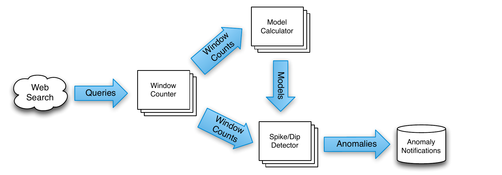

**图 1：**输入数据（搜索查询）流经一系列 MillWheel 计算；图中把这些计算表示为分布式进程。系统输出由外部异常通知系统消费。

## 3. 系统概览

从高层看，MillWheel 是一张由用户定义的转换图，它对输入数据进行转换并生成输出数据。我们把这些转换称为计算（computation），下文将进一步定义。每种转换都可跨任意数量的机器并行化，用户不必操心细粒度负载均衡。以图 1 所示的 Zeitgeist 为例，我们的输入将是持续到达的搜索查询集合，我们的输出则是正在激增或骤降的查询集合。

抽象地说，MillWheel 中的输入与输出表示为 `(键, 值, 时间戳)` 三元组。键是系统中具有语义的元数据字段，而值可以是表示整条记录的任意字节串。用户代码的运行上下文限定在某个特定键上；每个计算可根据自身逻辑需求，为各输入源定义键控方式。例如，Zeitgeist 中某些计算可能选择搜索词（例如“cat videos”）作为键，以便按查询计算统计量；另一些计算则可能选择地理来源作为键，以便按地区聚合。三元组中的时间戳可由 MillWheel 用户指定任意值（但通常接近事件发生时的墙上时钟时间），MillWheel 会依据这些值计算低水位。如果用户要像图 2 所示的 Zeitgeist 那样按秒聚合搜索词计数，就会希望把时间戳赋为执行搜索的时刻。

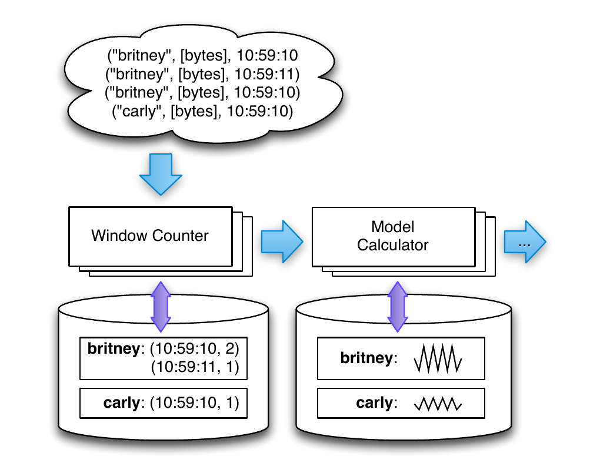

**图 2：**把 Web 搜索聚合进一秒时间桶，并使用按键持久状态更新模型。每个计算都可访问自己的按键状态，并响应输入记录来更新该状态。

一条由用户计算组成的流水线共同构成数据流图：一个计算的输出成为另一个计算的输入，如此延续。用户可以动态地在拓扑中添加或移除计算，无需重启整个系统。计算在处理数据和输出记录时，可以任意合并、修改、创建或丢弃记录。

相对于框架 API，MillWheel 使记录处理保持幂等。只要应用使用系统提供的状态与通信抽象，失败和重试就会对用户代码隐藏。这使用户代码保持简单易懂，让用户能够专注于应用逻辑。在计算上下文内，用户代码可以访问按键、按计算的持久存储，从而能够执行强大的按键聚合，Zeitgeist 示例对此有所说明。支撑这种简单性的基本保证如下：

**交付保证：**MillWheel 框架内由记录处理产生的所有内部更新，都会以按键方式原子地写入检查点；记录恰好交付一次。该保证不延伸到外部系统。

有了这一系统高层概念，下一节我们将详细讨论构成 MillWheel 的各个抽象。

## 4. 核心概念

MillWheel 在提供整洁抽象的同时，暴露流系统的关键要素。数据沿着用户定义的有向计算图（图 3）穿过我们的系统，每个计算都能独立处理并发出数据。

```text
computation SpikeDetector {
  input_streams {
    stream model_updates {
      key_extractor = 'SearchQuery'
    }
    stream window_counts {
      key_extractor = 'SearchQuery'
    }
  }
  output_streams {
    stream anomalies {
      record_format = 'AnomalyMessage'
    }
  }
}
```

**图 3：**MillWheel 拓扑中单个节点的定义。输入流和输出流对应图中的有向边。

### 4.1 计算

应用逻辑存在于计算之中；计算封装任意用户代码。收到输入数据时会调用计算代码，由此触发用户定义的动作，包括联系外部系统、操作其他 MillWheel 原语或输出数据。如果联系了外部系统，用户有责任确保其代码对这些系统造成的效果是幂等的。计算代码在单个键的上下文中运行，不关心不同机器之间如何分配键。如图 4 所示，处理按键串行化，但不同键之间可以并行处理。

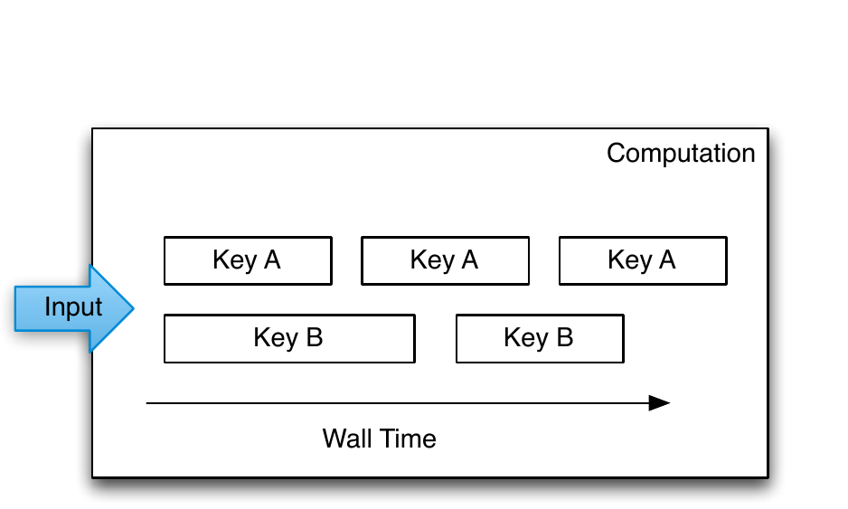

**图 4：**按键处理随时间串行进行，因此对一个给定键，同一时刻只能处理一条记录；多个键可以并行运行。

### 4.2 键

键是 MillWheel 中聚合和比较不同记录的主要抽象。对于系统中的每条记录，消费者指定一个键提取函数，由它为记录赋键。计算代码在某个特定键的上下文中运行，而且只允许访问该键的状态。例如，在 Zeitgeist 系统中，查询记录的一个合适键是查询文本本身，因为我们需要按查询聚合计数并计算模型。另一种情况下，垃圾信息检测器可能选择 Cookie 指纹作为键，以阻止滥用行为。图 5 展示了不同消费者如何从同一个输入流提取不同的键。

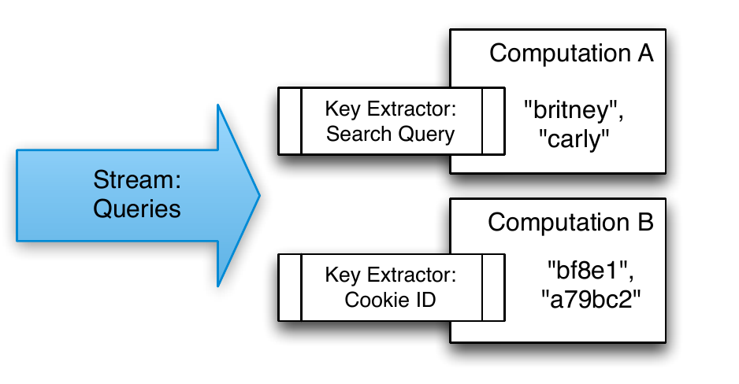

**图 5：**多个计算可从同一个流中提取不同的键。键提取器由流的消费者指定。

### 4.3 流

在 MillWheel 中，流是不同计算之间的交付机制。一个计算订阅零个或多个输入流，并发布一个或多个输出流；系统保证沿这些通道交付。每个消费者按流指定键提取函数，因此多个消费者可订阅同一条流，并以不同方式聚合其中的数据。流仅由名称唯一标识，不带其他限定——任何计算都可订阅任何流，也可向任何流生成记录（产出，production）。

### 4.4 持久状态

在最基本的形式下，MillWheel 的持久状态是按键管理的不透明字节串。用户提供序列化与反序列化例程（例如在丰富数据结构与其线格式之间转换）；已有多种便利机制可用，例如 Protocol Buffers [13]。持久状态由复制的高可用数据存储（例如 Bigtable [7] 或 Spanner [9]）支撑，并以对最终用户完全透明的方式保证数据完整性。状态的常见用途包括：对记录窗口聚合的计数器，以及为连接而缓冲的数据。

### 4.5 低水位

一个计算的低水位为将来抵达该计算的记录时间戳给出下界。

**定义：**我们依据流水线的数据流递归定义低水位。给定计算 A，把 A 的最老工作（oldest work）定义为：A 中最老的尚未完成记录（正在传输、已存储或等待交付）的时间戳。据此，我们把 A 的低水位定义为：

$$
\min\left(\mathrm{oldestWork}(A),\ \mathrm{lowWatermark}(C): C \to A\right)
$$

其中，C → A 表示计算 C 向计算 A 输出。

若不存在输入流，则低水位与最老工作的值相等。

低水位的初始值由注入器提供；注入器把外部系统的数据送入 MillWheel。对外部系统中待处理工作的度量往往是估计值，因此在实践中，计算应预期这些系统会产生少量迟到记录，即时间戳小于（落后于）低水位的记录。Zeitgeist 的处理方式是丢弃这类数据，同时记录丢弃量（实测约占记录的 0.001%）。其他流水线会在迟到记录到达后追溯修正聚合。尽管上述定义没有体现这一点，系统仍保证，即便面对迟到数据，计算的低水位也保持单调。

等待某个计算的低水位越过特定值，用户即可断定自己已经获得截至该时刻的完整数据图景，如前述 Zeitgeist 的骤降检测所示。为新记录或聚合记录赋时间戳时，用户有责任选择一个不小于任何源记录时间戳的值。MillWheel 框架报告的低水位度量系统中的已知工作，如图 6 所示。

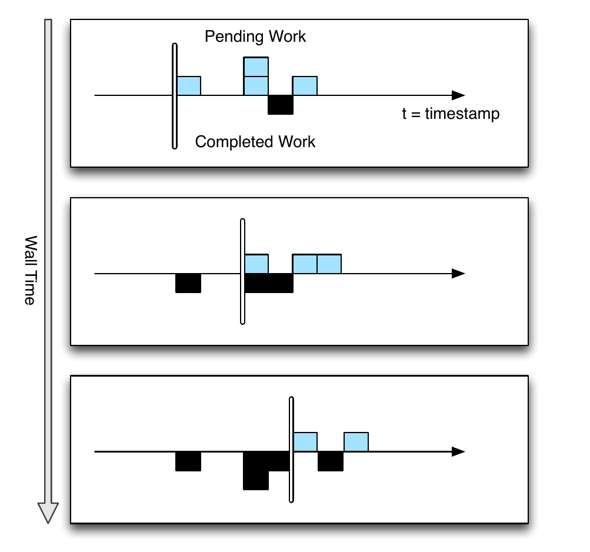

**图 6：**随着记录在系统中移动，低水位不断推进。每个快照中，待处理记录显示在时间戳轴上方，已完成记录显示在轴下方。新记录在后续快照中作为待处理工作出现，其时间戳值晚于（即大于）低水位。数据不一定按序处理，低水位会反映系统中的全部待处理工作。

### 4.6 定时器

定时器是按键的程序化钩子，在特定墙上时钟时间或低水位值到达时触发。定时器在计算上下文中创建和运行，因而可以运行任意代码。使用墙上时钟还是低水位取决于应用：一个希望整点推送每小时邮件（无论数据是否延迟）的启发式监控系统，可以使用墙上时钟定时器；执行窗口聚合的分析系统则可以使用低水位定时器。定时器一经设置，就保证按递增的时间戳顺序触发。它们会记入持久状态中的日志，可在进程重启和机器故障后继续存在。定时器触发时，会运行指定的用户函数，并享有与输入记录相同的恰好一次保证。Zeitgeist 中一种简单的骤降实现，会在给定时间桶的末尾设置低水位定时器；若观测流量远低于模型预测，就报告骤降。

定时器不是必选功能：不需要基于时间的屏障语义的应用可以不用。例如，Zeitgeist 无需定时器也能检测激增查询，因为即使尚未掌握完整数据，也可能已经明显看出激增。若观测流量已超过模型预测，迟到数据只会增加总量，使激增幅度更大。

## 5. API

本节我们结合第 4 节的抽象，概述我们的 API。用户实现 `Computation` 类的自定义子类，如图 7 所示；该类提供访问 MillWheel 各项抽象（状态、定时器和产出）的方法。用户提供代码后，框架会自动运行这些代码。按键串行化由框架层处理，用户无需构造任何按键锁定语义。

```cpp
class Computation {
  // 系统调用的钩子。
  void ProcessRecord(Record data);
  void ProcessTimer(Timer timer);

  // 其他抽象的访问器。
  void SetTimer(string tag, int64 time);
  void ProduceRecord(
      Record data, string stream);
  StateType MutablePersistentState();
};
```

**图 7：**MillWheel API 包含一个父 `Computation` 类，可访问按键定时器、状态与产出。用户通过覆写 `ProcessRecord` 和 `ProcessTimer` 来实现应用逻辑。

### 5.1 计算 API

用户代码的两个主要入口是图 8 所示的 `ProcessRecord` 与 `ProcessTimer` 钩子，分别在收到记录和定时器到期时触发。二者共同构成一个计算的应用逻辑。

在这些钩子的执行过程中，MillWheel 提供系统函数，用于获取与操作按键状态、生成额外记录和设置定时器。图 9 展示了这些机制之间的交互。它借用我们的 Zeitgeist 系统，说明如何使用持久状态和定时器来检测查询流中的骤降。再次注意，其中没有失败恢复逻辑；这部分完全由框架自动处理。

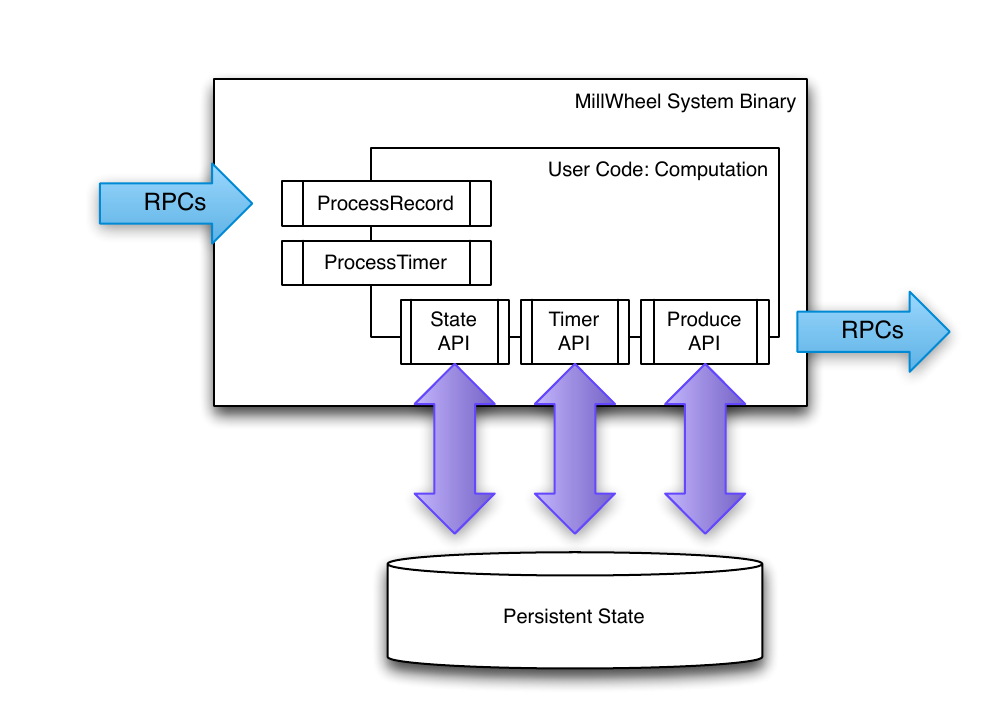

**图 8：**MillWheel 系统响应传入的 RPC，调用用户定义的处理钩子。用户代码通过框架 API 访问状态、定时器和产出；真正的 RPC 与状态修改均由框架执行。

```cpp
// 收到一条记录时，更新其时间戳时间桶的累计
// 总数，并设置一个定时器，在我们已经收到该时间桶
// 的全部数据时触发。
void Windower::ProcessRecord(Record input) {
  WindowState state(MutablePersistentState());
  state.UpdateBucketCount(input.timestamp());
  string id = WindowID(input.timestamp())
  SetTimer(id, WindowBoundary(input.timestamp()));
}

// 一旦我们已经获得给定窗口的全部数据，就生成该窗口。
void Windower::ProcessTimer(Timer timer) {
  Record record =
      WindowCount(timer.tag(),
                  MutablePersistentState());
  record.SetTimestamp(timer.timestamp());
  // DipDetector 订阅此流。
  ProduceRecord(record, "windows");
}

// 给定一个时间桶计数，将其与预期流量比较；如果我们
// 有足够高的置信度，就发出 Dip 事件。
void DipDetector::ProcessRecord(Record input) {
  DipState state(MutablePersistentState());
  int prediction =
      state.GetPrediction(input.timestamp());
  int actual = GetBucketCount(input.data());
  state.UpdateConfidence(prediction, actual);
  if (state.confidence() >
      kConfidenceThreshold) {
    Record record =
        Dip(key(), state.confidence());
    record.SetTimestamp(input.timestamp());
    ProduceRecord(record, "dip-stream");
  }
}
```

**图 9：**`ProcessRecord` 和 `ProcessTimer` 的定义：这些计算基于现有模型，利用低水位定时器计算窗口计数与骤降。

### 5.2 注入器与低水位 API

在系统层，每个计算都会为自己的所有待处理工作（进行中的交付和排队等待的交付）计算低水位。持久状态也可赋予时间戳值，例如聚合窗口的后沿。系统会自动汇总这些值，以透明方式提供定时器所需的 API 语义——用户很少在计算代码中直接操作低水位，而是通过为记录赋时间戳来间接操纵它们。

**注入器：**注入器把外部数据带入 MillWheel。由于注入器为流水线其余部分提供低水位初值，它们可以发布注入器低水位；该值会传播给其输出流上的所有订阅者，反映沿这些流可能发生的交付。例如，如果注入器摄取日志文件，就可以发布一个低水位，其值对应所有尚未处理完的文件中最小的文件创建时间，如图 10 所示。

注入器可以分布在多个进程上，并以这些进程的聚合低水位作为注入器低水位。用户可以指定预期的注入器进程集合，使该指标能够抵御进程失败与网络中断。实践中，Google 已为常见输入类型（日志文件、发布/订阅服务源等）提供库实现，普通用户无需编写自己的注入器。如果注入器违反低水位语义，发送了时间戳小于（落后于）低水位的迟到记录，用户应用代码可以选择丢弃该记录，或把它纳入对已有聚合的更新。

```cpp
// 每当我们处理完一个文件或收到新文件，就把低水位
// 更新为最小的创建时间。
void OnFileEvent() {
  int64 watermark = kint64max;
  for (file : files) {
    if (!file.AtEOF())
      watermark =
          min(watermark, file.GetCreationTime());
  }
  if (watermark != kint64max)
    UpdateInjectorWatermark(watermark);
}
```

**图 10：**一个简单的文件注入器报告与最老未完成文件相对应的低水位值。

## 6. 容错

### 6.1 交付保证

MillWheel 编程模型在概念上的简洁性，很大程度上依赖于它能够把非幂等用户代码当作幂等代码来运行。通过解除计算代码编写者承担的这一要求，我们为他们免去了一项沉重的实现负担。

#### 6.1.1 恰好一次交付

MillWheel 框架在一个计算收到输入记录后，执行以下步骤：

- 对照先前交付的去重数据检查该记录；重复记录会被丢弃。
- 对输入记录运行用户代码，可能由此产生对定时器、状态和产出的待提交修改。
- 把待提交修改提交到底层存储。
- 向发送方返回 ACK。
- 发送待处理的下游产出。

作为一种优化，上述操作可针对多条记录合并到单个检查点中。为了满足我们的至少一次要求——它是恰好一次的前提——MillWheel 会反复重试交付，直到收到 ACK。我们之所以重试，是因为接收端可能发生网络问题或机器故障。然而，这带来一种情况：接收方可能在来得及确认输入记录之前崩溃，即使它已经持久化了成功处理该记录所对应的状态。此时，当发送方重试交付时，我们必须阻止重复处理。

系统在生成时为所有记录分配唯一 ID。我们把记录的唯一 ID 与状态修改放在同一次原子写入中，以此识别重复记录。如果日后重试同一条记录，我们就能把它与日志中的 ID 比较，丢弃重复项并返回 ACK，以免它无限重试。由于我们不一定能把所有去重数据都放在内存中，因此我们会维护一个由已知记录指纹组成的布隆过滤器，为那些我们可证明从未见过的记录提供快速路径。过滤器未命中时，我们必须读取底层存储，判断记录是否重复。当 MillWheel 能够保证所有内部发送方都已停止重试后，就会垃圾回收以往交付的记录 ID。对于经常交付迟到数据的注入器，我们会按相应的宽限值推迟垃圾回收，通常为数小时。不过，恰好一次数据一般可在生成时间后的几分钟内清理。

#### 6.1.2 强产出

由于 MillWheel 处理的输入不一定有序或确定，我们会在交付之前写入所生成记录的检查点，并把它与状态修改放在同一次原子写入中。我们把这种在交付记录之前写入产出检查点的模式称为强产出（strong production）。以一个按墙上时钟聚合、并向下游发出计数的计算为例。如果没有检查点，该计算可能已向下游生成一个窗口计数，却在保存状态之前崩溃。计算恢复后，它可能在再次生成同一聚合之前收到另一条记录并把它计入总数，由此创建出一条与前一条记录在位级别不同、却对应同一逻辑窗口的记录！要正确处理这种情况，下游消费者将需要复杂的冲突解决逻辑。然而在 MillWheel 中，简单方案就能直接成立，因为系统保证已把用户的应用逻辑转变为幂等操作。

我们使用 Bigtable [7] 之类的存储系统，它能高效实现盲写（而非“读取—修改—写入”操作），使检查点模拟日志的行为。进程重启后，会把检查点扫描进内存并重放；这些产出成功后，检查点数据即被删除。

#### 6.1.3 弱产出与幂等性

强产出与恰好一次交付结合起来，会使许多计算对系统级重试保持幂等。不过，有些计算本身已经幂等，不论是否存在这些保证——而这些保证会带来资源和延迟成本。根据应用的语义需求，用户可以自行决定禁用强产出和/或恰好一次。系统层面只需跳过去重步骤即可禁用恰好一次；禁用强产出则需要更加留意性能。

对弱产出（weak production）而言，我们不在交付前为记录产出写检查点，而是在持久化状态之前，乐观地向下游广播交付。实测表明，这带来一个新问题：流水线相邻阶段等待记录的下游 ACK，导致各阶段的完成时间严格耦合。再加上机器故障的可能性，随着流水线深度增加，这会大幅提高拖尾产出的端到端延迟。例如，如果我们（相当悲观地）假设任意机器在给定一分钟内有 1% 的故障概率，那么随着流水线深度增加，我们等待至少一次故障的概率将急剧上升——对深度为 5 的流水线，一项给定产出每分钟遭遇故障的概率可能接近 5%！我们的缓解办法是，为一小部分拖尾的待处理产出写入检查点，让这些阶段能够向其发送方返回 ACK。通过这种选择性检查点，我们既能改善端到端延迟，又能减少总体资源消耗。

在图 11 中，我们展示了这种检查点机制的运行过程。计算 A 向计算 B 生成记录，B 又立即向计算 C 生成记录。然而，计算 C 返回 ACK 很慢，因此计算 B 在延迟 1 秒后为该产出写入检查点。于是，计算 B 可以确认来自计算 A 的交付，让 A 释放与该产出关联的全部资源。即使计算 B 随后重启，也能从检查点恢复记录，并重试交付给计算 C，而不丢失数据。

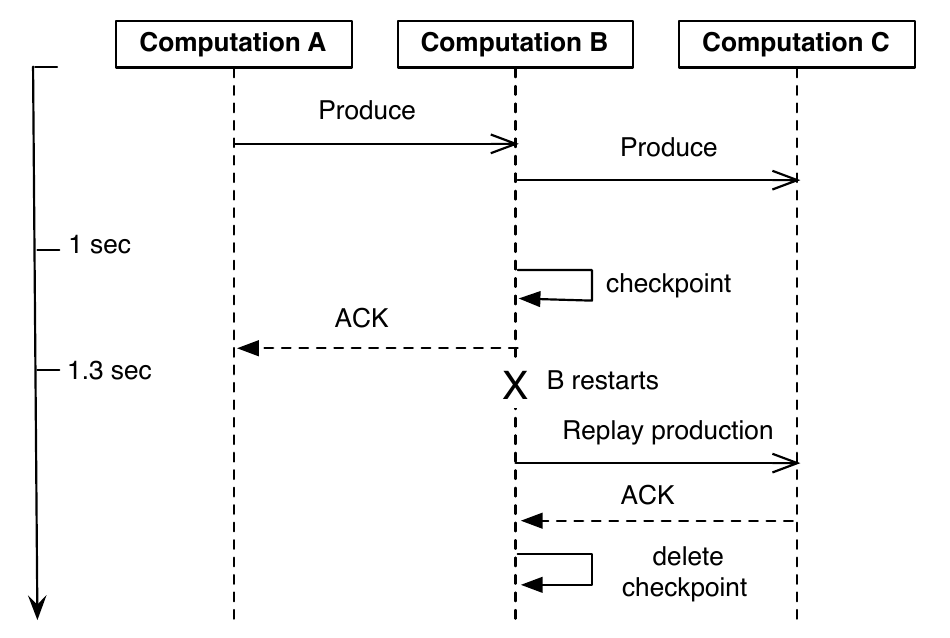

**图 11：**弱产出检查点通过为计算 B 保存检查点，避免拖尾产出在发送方（计算 A）占用过多资源。

上述放宽适用于由幂等计算组成的流水线，因为重试不会影响正确性，下游产出也不会受重试影响。无状态过滤器是现实中的幂等计算示例：沿输入流重复交付记录不会改变结果。

### 6.2 状态操作

在实现 MillWheel 用户状态操作机制时，我们同时讨论持久化到我们的底层存储的“硬”状态，以及包括各种内存缓存或聚合的“软”状态。我们必须满足以下用户可见保证：

- 系统不丢失数据。
- 状态更新必须遵守恰好一次语义。
- 在任意给定时刻，整个系统中的所有持久数据都必须一致。
- 低水位必须反映系统中的全部待处理状态。
- 对给定键，定时器必须按序触发。

为了避免持久状态不一致，例如定时器、用户状态和产出检查点之间不一致，我们把全部按键更新封装在单次原子操作中。这样就能抵御进程失败，以及其他可能随时中断进程的不可预测事件。如前所述，恰好一次数据也在同一操作中更新，并被纳入按键一致性边界。

工作可能因负载均衡、故障或其他原因在机器间转移；“僵尸”写入者与网络残留向我们的底层存储发出过时写入，是对我们的数据一致性的一项主要威胁。为应对这种可能性，我们为每次写入附加一个序列器令牌；底层存储的中介在允许写入提交之前，会检查令牌是否有效。新工作进程开始工作前，会令所有现存序列器失效，从而使后续残留写入均无法成功。序列器充当租约强制机制，与 Centrifuge [3] 系统相似。因此，我们能保证：对给定键，在任意特定时刻，只有一个工作进程可以写入该键。

这种单写入者保证对维护软状态同样关键，单靠事务无法保证它。考虑一个待处理定时器缓存：如果另一个进程的残留写入能够在该缓存建立后改变持久定时器状态，缓存就会不一致。图 12 展示了这种情况：僵尸进程 B 响应 A 的产出发出一个事务，但该事务在线路上延迟。在事务开始之前，B 的后继 B-prime 对待处理定时器执行初始扫描。扫描完成后，事务才应用，并向 A 返回 ACK，导致 B-prime 的定时器状态不完整。丢失的定时器可能无限期地变成孤儿，使其任一输出动作延迟任意长时间。显然，这对于延迟敏感型系统不可接受。

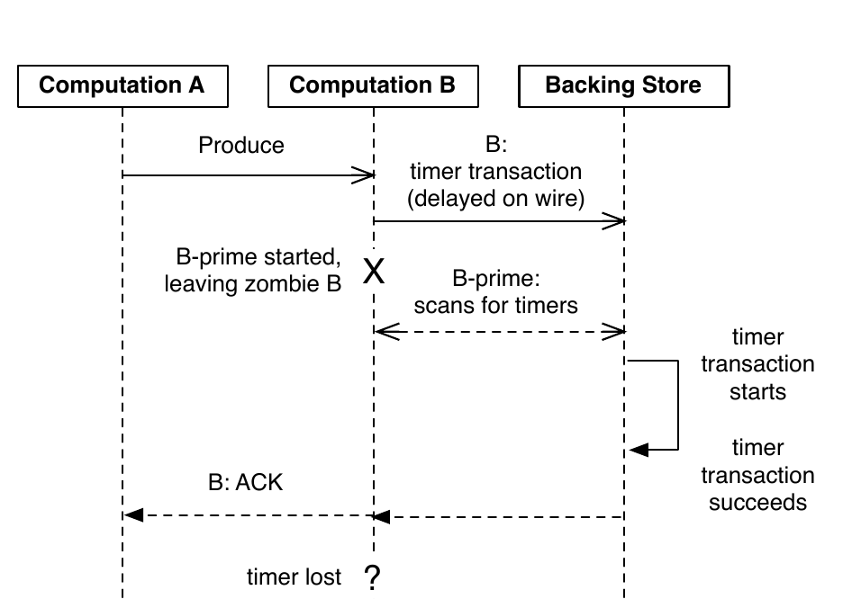

**图 12：**事务无法防止软状态不一致。孤儿事务可能在一次只读扫描完成后才提交，从而使 MillWheel 的定时器系统产生不一致状态。

此外，同样情况也可能发生在已写检查点的产出上：它躲过对底层存储的初始扫描，因此系统并不知道它存在。在它被发现前，该产出不会计入低水位；与此同时，我们可能向消费者报告错误的低水位值。更进一步，由于我们的低水位单调递增，我们无法纠正一次错误的数值推进。违反我们的低水位保证会造成多种正确性问题，包括定时器过早触发，以及窗口产出不完整。

为了从意外进程故障中迅速恢复，每个 MillWheel 计算工作进程都能以任意细粒度为其状态写入检查点；实践中，标准粒度是亚秒级或逐记录，具体取决于输入量。我们使用始终一致的软状态，使我们能够把我们必须扫描这些检查点的场合减少到特定情况——机器故障或负载均衡事件。我们确实执行扫描时，通常可以异步进行，让计算在扫描推进期间继续处理输入记录。

## 7. 系统实现

### 7.1 架构

MillWheel 部署以分布式系统形式运行在一组动态变化的宿主服务器上。一条流水线中的每个计算运行在一台或多台机器上，流通过 RPC 交付。每台机器上的 MillWheel 系统编排传入工作并管理进程级元数据，按需把工作委托给适当的用户计算。

负载分配与均衡由一个复制的主节点负责。它把每个计算划分成一组归属明确、按字典序排列的键区间——这些区间共同覆盖全部可能的键——并把区间分配给一组机器。CPU 负载或内存压力上升时（由标准的逐进程监控器报告），主节点可以移动、拆分或合并这些区间。每个区间都有一个唯一序列器；区间一旦移动、拆分或合并，该序列器就会失效。第 6.2 节已经讨论了这个序列器的重要性。

对于持久状态，MillWheel 使用 Bigtable [7] 或 Spanner [9] 一类提供原子单行更新的数据库。给定键的定时器、待处理产出与持久状态，全都存储在数据存储的同一行内。

每当一个键区间分配给新所有者，MillWheel 就扫描底层存储中的元数据，从而高效地从机器故障恢复。初始扫描会填充内存结构，例如待处理定时器堆和已写检查点的产出队列；在该区间归属关系的整个有效期内，系统都假定这些结构与底层存储一致。为支撑这一假设，我们会强制执行第 6.2 节详述的单写入者语义（以计算工作进程为单位）。

### 7.2 低水位

为保证数据一致性，低水位必须实现为一个全局可用且正确的子系统。我们把它实现为中央权威机构（与 OOP [19] 类似）；它追踪系统中的所有低水位值，并将其记入持久状态日志，防止在进程故障时报告错误数值。

向中央权威机构报告时，每个进程会聚合自己所拥有全部工作的时间戳信息。这既包括已写检查点或待处理的产出，也包括所有待处理定时器或持久状态。每个进程都能依赖我们的内存数据结构的一致性来高效完成此事，不必对底层数据存储执行任何昂贵查询。由于进程按键区间获分工作，低水位更新也按键区间划桶并发送给中央权威机构。

要准确计算系统低水位，该权威机构必须取得系统中所有待处理和已持久化工作的低水位信息。聚合各进程更新时，它为每个计算建立低水位值的区间映射，以追踪信息完整性。如果缺少任何区间，该区间在报告新值之前，其低水位就取最后一个已知值。然后，该权威机构向全系统广播所有计算的低水位值。

感兴趣的消费者计算会订阅各发送方计算的低水位值，并以这些值中的最小值作为自己输入的低水位。之所以由工作进程而非中央权威机构计算这些最小值，是出于一致性考虑：中央权威机构的低水位值始终应至少与工作进程的数值同样保守。因此，让工作进程分别计算自身各输入的最小值，便可保证权威机构的低水位永远不会领先于工作进程，并维持这一性质。

为维持中央权威机构的一致性，我们为所有低水位更新附加序列器。与我们用于本地更新键区间状态的单写入者方案相似，这些序列器确保只有给定键区间的最新所有者才能更新其低水位值。为实现可扩展性，该权威机构可以分片到多台机器上，每个工作进程承载一个或多个计算。实测表明，它可以扩展到 500,000 个键区间而不损失性能。

有了系统工作的全局汇总，我们可以选择剔除离群值，为更看重速度而非准确性的流水线提供启发式低水位。例如，我们可以计算 99% 低水位，它对应系统中 99% 的记录时间戳所达到的进度。只关心近似结果的窗口消费者即可使用这些低水位，以更低延迟运行，因为它不再需要等待拖尾者。

总之，我们的低水位实现不要求系统中的流遵守任何严格时间顺序。低水位同时反映传输中状态与持久状态。通过为低水位值建立全局事实源，我们避免了低水位倒退等逻辑不一致。

## 8. 评估

为说明 MillWheel 的性能，我们给出针对流处理系统关键指标设计的实验结果。

### 8.1 输出延迟

延迟是衡量流系统性能的一项关键指标。MillWheel 框架支持低延迟结果，而且随着分布式系统扩展到更多机器，仍能保持低延迟。为展示 MillWheel 的性能，我们使用一条简单的单阶段 MillWheel 流水线测量记录交付延迟；该流水线对数字划桶并排序。这类似于键控方式不同的相邻计算之间发生的多对多混洗，因此可视作 MillWheel 记录交付的一种最坏情况。图 13 给出使用超过 200 个 CPU 时的记录延迟分布。记录延迟中位数为 3.6 毫秒，第 95 百分位延迟为 30 毫秒，足以轻松满足 Google 内部许多流系统的要求（即使第 95 百分位也在人类反应时间之内）。

该测试禁用了强产出和恰好一次。启用这两项特性后，延迟中位数跃升至 33.7 毫秒，第 95 百分位延迟升至 93.8 毫秒。这简洁地说明：幂等计算可以通过禁用这两项特性来降低延迟。

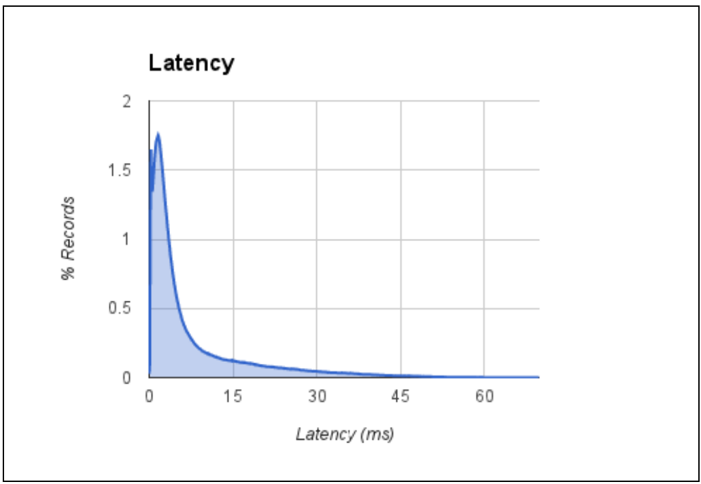

**图 13：**键控方式不同的两个阶段之间，单阶段记录延迟的直方图。

为了验证 MillWheel 的延迟特征能够随系统资源规模良好扩展，我们以 20 个 CPU 到 2,000 个 CPU 的不同规模配置运行单阶段延迟实验，并按比例扩展输入。图 14 显示，不论系统规模如何，延迟中位数大致保持恒定。第 99 百分位延迟确实显著恶化（但仍在 100 毫秒数量级）。不过，随着规模扩大，尾延迟本来就会恶化——机器越多，出问题的机会也越多。

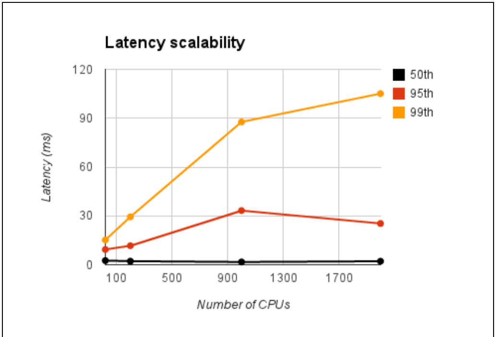

**图 14：**随着系统资源规模扩展，MillWheel 的平均延迟没有明显上升。

### 8.2 水位滞后

虽然某些计算（例如 Zeitgeist 中的激增检测）不需要定时器，许多计算（例如骤降检测）会使用定时器，等待低水位推进后再输出聚合。对这些计算而言，低水位落后于实时时钟的程度，为聚合结果的新鲜度设定了界限。由于低水位从注入器沿计算图传播，我们预计一个计算的低水位滞后，会与它到注入器的最大流水线距离成正比。我们在 200 个 CPU 上运行一条简单的三阶段 MillWheel 流水线，每秒轮询一次各计算的低水位值。在图 15 中，我们可以看到，第一阶段的水位落后实时时钟 1.8 秒；但在后续阶段中，每经过一个阶段，滞后增加不到 200 毫秒。降低水位滞后仍是一个活跃的开发领域。

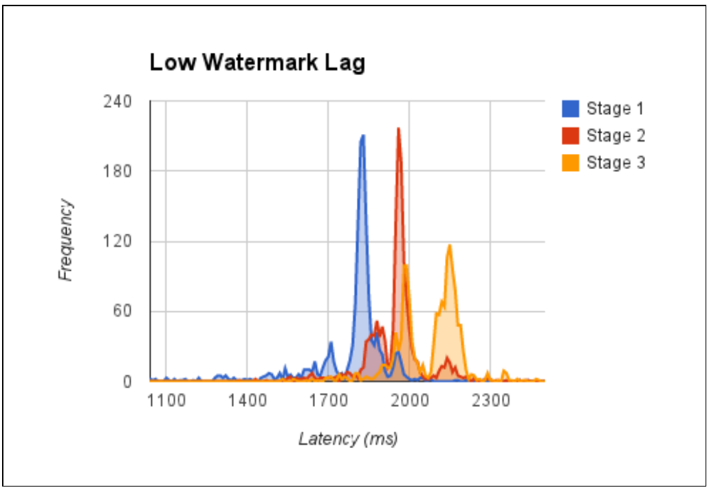

**图 15：**三阶段流水线中的低水位滞后。明细：{阶段 1：均值 1795，标准差 159；阶段 2：均值 1954，标准差 127；阶段 3：均值 2081，标准差 140}。图中延迟单位为毫秒。

### 8.3 框架级缓存

MillWheel 频繁写检查点，因此会向存储层产生大量流量。使用 Bigtable 一类存储系统时，读取成本高于写入，MillWheel 通过框架级缓存来缓解这一问题。MillWheel 的一种常见用法是，把数据缓冲在存储中，直到低水位越过窗口边界，然后取回数据做聚合。这种使用模式对存储系统中常见的 LRU 缓存并不友好，因为最近修改的行恰恰最不可能很快被取回。MillWheel 知道这些数据可能的使用方式，因此能够提供更好的缓存淘汰策略。在图 16 中，我们测量 MillWheel 工作进程与存储层的合计 CPU 使用率相对于最大缓存大小的变化（出于公司保密原因，CPU 使用率已归一化）。增加可用缓存会线性改善 CPU 使用率；达到 550 MB 后，大部分数据已被缓存，继续增大缓存不再有帮助。在这项实验中，MillWheel 的缓存使 CPU 使用率降低了一半。

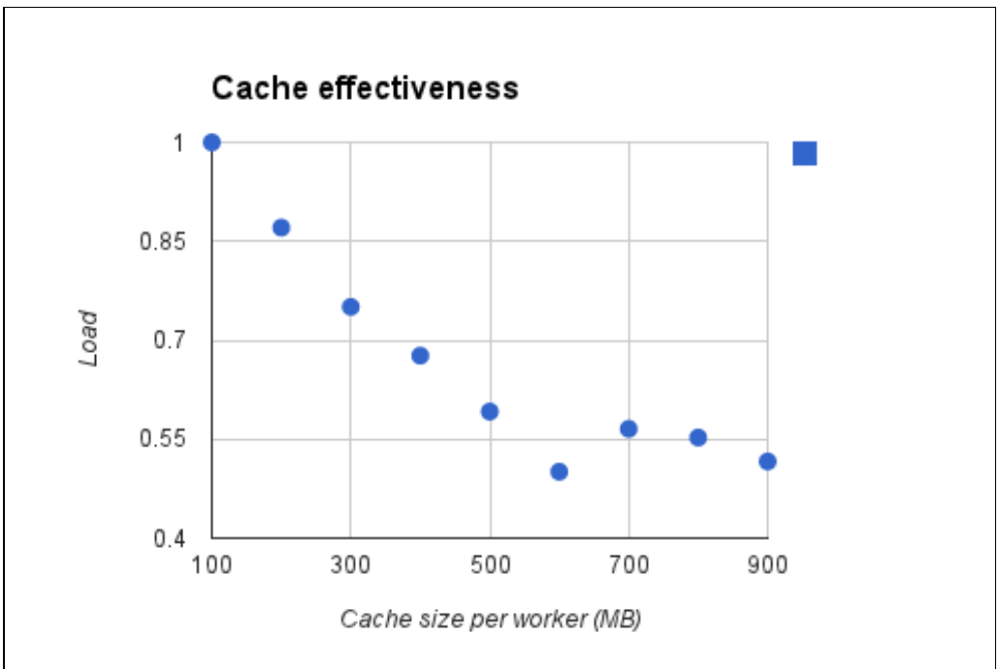

**图 16：**MillWheel 与存储层的总 CPU 负载相对于框架缓存大小的变化。

### 8.4 真实部署

MillWheel 支撑着 Google 内部多种系统。它为许多广告客户执行流式连接，其中不少客户要求低延迟更新面向客户的仪表板。计费流水线依赖 MillWheel 的恰好一次保证。除 Zeitgeist 外，MillWheel 还支撑一种通用异常检测服务，供众多不同团队作为交钥匙方案使用。其他部署包括网络交换机与集群健康监控。MillWheel 还支撑全景图生成、Google Street View 图像处理等面向用户的工具。

也有一些问题并不适合 MillWheel。天然不易写检查点的单体操作不适合放进计算代码，因为系统稳定性依赖动态负载均衡。如果负载均衡器遇到恰好与这种操作重合的热点，就只能选择中断操作、迫使它重启，或等待它完成。前者浪费资源，后者则可能使机器过载。作为分布式系统，MillWheel 在那些无法轻易按不同键并行化的问题上表现不好。如果一条流水线 90% 的流量都分配给单个键，那么一台机器必须承担该流上整个系统 90% 的负载，这显然不可取。建议编写计算代码的人避免使用流量高到足以在单机形成瓶颈的键（例如客户的语言或 User-Agent 字符串），或者构建两阶段聚合器。

如果一个计算根据低水位定时器执行聚合，而数据延迟又使低水位长时间无法推进，MillWheel 的性能就会下降。这可能导致系统中缓冲记录产生数小时的偏斜。由于应用依赖低水位来刷新这些缓冲数据，内存用量往往与偏斜程度成正比。要防止内存用量无界增长，一个有效办法是限制系统中的总偏斜：等待低水位推进后，再注入更新的记录。

## 9. 相关工作

我们构建通用流系统抽象的动机，深受 MapReduce [11] 在改变批处理世界方面所取得成功的影响，Apache Hadoop [4] 的广泛采用便体现了这种成功。把 MillWheel 与 Yahoo! S4 [26]、Storm [23]、Sonora [32] 等现有流系统模型比较后，我们发现，它们的模型对于我们所期望的问题类型不够通用。具体来说，S4 和 Sonora 没有解决恰好一次处理与容错持久状态问题；Storm 最近才通过 Trident [22] 加入这类支持，而 Trident 要求事务 ID 严格有序才能工作。Logothetis 等人也提出类似论点，主张必须把用户状态作为一等概念 [20]。Ciel [25] 面向一般数据处理问题，并动态生成数据流图。与 MapReduce Online [8] 一样，我们认为让用户能够取得“早期返回”极具价值。Google 的 Percolator [27] 同样面向大型数据集的增量更新，但预期延迟为分钟数量级。

在评估我们的抽象时，我们注意到我们自己满足 Stonebraker 等人 [30] 列举的流系统要求。我们对乱序数据的灵活处理与 OOP 方法 [19] 相似；该方法令人信服地论证了必须计算全局低水位（而非算子级低水位），也有力否定了用静态宽限值补偿乱序数据的可行性。虽然我们认同 Spark Streaming [34] 提出的、面向特定算子的流批统一，但我们认为 MillWheel 能解决更一般的问题，而且微批模型若不把用户限制在预定义算子上便不可行。具体而言，该模型高度依赖 RDD [33]，而 RDD 把用户限制在能够回滚的算子范围内。

检查点与恢复是任何流系统的关键部分，我们的方法与此前许多方案一脉相承。我们使用发送方缓冲，类似于 [14] 中的“上游备份”；该工作还定义了恢复语义（精确、回滚与缺口），对应我们自身灵活的数据交付选项。如 Spark Streaming [34] 所述，朴素的上游备份方案会消耗过多资源；我们使用检查点与持久状态，消除了这些缺点。此外，我们的系统能够采用显著细于 Spark Streaming [34] 的检查点；后者提出每分钟备份一次，并依赖应用幂等性和系统宽限量来恢复。同样，S-Guard [17] 使用检查点的频率低于 MillWheel（也是每分钟一次），但其算子分区方案与我们基于键的分片相似。

我们的低水位机制与其他流系统（例如 Gigascope [10]）使用的标点 [31] 或心跳 [16] 相似。不过，我们没有在我们的系统中把心跳与标准元组交错，而是采用 OOP 系统 [19] 那样的全局聚合器。我们的低水位概念也与 OOP 定义的低水位类似。我们赞同其分析：在各个算子处聚合心跳效率低下，最好交由全局权威机构负责。Srivastava 等人 [29] 强调了这种低效；该工作讨论了在每个算子维护逐流心跳数组。此外，它还对用户定义时间戳（“应用时间”）与墙上时钟时间（“系统时间”）作出了类似区分；我们发现这种区分极其有用。我们还注意到 Lamport [18] 等人 [12] [15] 在为分布式系统发展有说服力的时间语义方面所做的工作。

流系统的许多灵感可以追溯到 TelegraphCQ [6]、Aurora [2] 和 STREAM [24] 等流数据库系统的开创性工作。我们观察到，我们实现的若干部件与流式 SQL 中对应部件相似，例如 Flux [28] 使用分区算子进行负载均衡。虽然我们认为我们的低水位语义比 [2] 中的宽限语义更加健壮，但我们看到，我们的百分位低水位概念与 [1] 的 QoS 系统存在一些相似之处。

## 致谢

我们借此机会感谢多年来参与 MillWheel 项目的许多人，包括 Atul Adya、Alexander Amato、Grzegorz Czajkowski、Oliver Dain、Anthony Feddersen、Joseph Hellerstein、Tim Hollingsworth 和 Zhengbo Zhou。本文受益于许多 Google 员工的大量意见与建议，包括 Atul Adya、Matt Austern、Craig Chambers、Ken Goldman、Sunghwan Ihm、Xiaozhou Li、Tudor Marian、Daniel Myers、Michael Piatek 和 Jerry Zhao。

## 10. 参考文献

[1] D. J. Abadi, Y. Ahmad, M. Balazinska, M. Cherniack, J. hyon Hwang, W. Lindner, A. S. Maskey, E. Rasin, E. Ryvkina, N. Tatbul, Y. Xing, and S. Zdonik. The design of the borealis stream processing engine. In In *CIDR*, pages 277–289, 2005.

[2] D. J. Abadi, D. Carney, U. Çetintemel, M. Cherniack, C. Convey, S. Lee, M. Stonebraker, N. Tatbul, and S. Zdonik. Aurora: a new model and architecture for data stream management. *The VLDB Journal*, 12(2):120–139, 2003.

[3] A. Adya, J. Dunagan, and A. Wolman. Centrifuge: Integrated lease management and partitioning for cloud services. In *NSDI*, pages 1–16. USENIX Association, 2010.

[4] Apache. Apache hadoop. http://hadoop.apache.org, 2012.

[5] B. Babcock, S. Babu, M. Datar, R. Motwani, and J. Widom. Models and issues in data stream systems. In *Proceedings of the twenty-first ACM SIGMOD-SIGACT-SIGART symposium on Principles of database systems*, pages 1–16. ACM, 2002.

[6] S. Chandrasekaran, O. Cooper, A. Deshpande, M. J. Franklin, J. M. Hellerstein, W. Hong, S. Krishnamurthy, S. R. Madden, F. Reiss, and M. A. Shah. Telegraphcq: continuous dataflow processing. In *Proceedings of the 2003 ACM SIGMOD international conference on Management of data*, pages 668–668. ACM, 2003.

[7] F. Chang, J. Dean, S. Ghemawat, W. C. Hsieh, D. A. Wallach, M. Burrows, T. Chandra, A. Fikes, and R. E. Gruber. Bigtable: A distributed storage system for structured data. *ACM Trans. Comput. Syst.*, 26:4:1–4:26, June 2008.

[8] T. Condie, N. Conway, P. Alvaro, J. M. Hellerstein, K. Elmeleegy, and R. Sears. Mapreduce online. Technical report, University of California, Berkeley, 2009.

[9] J. C. Corbett, J. Dean, M. Epstein, A. Fikes, C. Frost, J. Furman, S. Ghemawat, A. Gubarev, C. Heiser, P. Hochschild, et al. Spanner: Googles globally-distributed database. To appear in *Proceedings of OSDI*, page 1, 2012.

[10] C. Cranor, Y. Gao, T. Johnson, V. Shkapenyuk, and O. Spatscheck. Gigascope: High performance network monitoring with an sql interface. In *Proceedings of the 2002 ACM SIGMOD international conference on Management of data*, pages 623–623. ACM, 2002.

[11] J. Dean and S. Ghemawat. Mapreduce: simplified data processing on large clusters. *Commun. ACM*, 51:107–113, Jan. 2008.

[12] E. Deelman and B. K. Szymanski. Continuously monitored global virtual time. Technical report, in Intern. Conf. Parallel and Distributed Processing Techniques and Applications, Las Vegas, NV, 1996.

[13] Google. Protocol buffers. http://code.google.com/p/protobuf/, 2012.

[14] J.-H. Hwang, M. Balazinska, A. Rasin, U. Cetintemel, M. Stonebraker, and S. Zdonik. High-availability algorithms for distributed stream processing. In *Data Engineering, 2005. ICDE 2005. Proceedings. 21st International Conference on*, pages 779–790. IEEE, 2005.

[15] D. R. Jefferson. Virtual time. *ACM Transactions on Programming Languages and Systems*, 7:404–425, 1985.

[16] T. Johnson, S. Muthukrishnan, V. Shkapenyuk, and O. Spatscheck. A heartbeat mechanism and its application in gigascope. In *Proceedings of the 31st international conference on Very large data bases*, pages 1079–1088. VLDB Endowment, 2005.

[17] Y. Kwon, M. Balazinska, and A. Greenberg. Fault-tolerant stream processing using a distributed, replicated file system. *Proceedings of the VLDB Endowment*, 1(1):574–585, 2008.

[18] L. Lamport. Time, clocks, and the ordering of events in a distributed system. *Commun. ACM*, 21(7):558–565, July 1978.

[19] J. Li, K. Tufte, V. Shkapenyuk, V. Papadimos, T. Johnson, and D. Maier. Out-of-order processing: a new architecture for high-performance stream systems. *Proceedings of the VLDB Endowment*, 1(1):274–288, 2008.

[20] D. Logothetis, C. Olston, B. Reed, K. C. Webb, and K. Yocum. Stateful bulk processing for incremental analytics. In *Proceedings of the 1st ACM symposium on Cloud computing*, pages 51–62. ACM, 2010.

[21] S. Madden and M. J. Franklin. Fjording the stream: An architecture for queries over streaming sensor data. In *Data Engineering, 2002. Proceedings. 18th International Conference on*, pages 555–566. IEEE, 2002.

[22] N. Marz. Trident. https://github.com/nathanmarz/storm/wiki/Trident-tutorial, 2012.

[23] N. Marz. Twitter storm. https://github.com/nathanmarz/storm/wiki, 2012.

[24] R. Motwani, J. Widom, A. Arasu, B. Babcock, S. Babu, M. Datar, G. Manku, C. Olston, J. Rosenstein, and R. Varma. Query processing, resource management, and approximation in a data stream management system. Technical Report 2002-41, Stanford InfoLab, 2002.

[25] D. G. Murray, M. Schwarzkopf, C. Smowton, S. Smith, A. Madhavapeddy, and S. Hand. Ciel: a universal execution engine for distributed data-flow computing. In *Proceedings of the 8th USENIX conference on Networked systems design and implementation*, page 9. USENIX Association, 2011.

[26] L. Neumeyer, B. Robbins, A. Nair, and A. Kesari. S4: Distributed stream computing platform. In *Data Mining Workshops (ICDMW), 2010 IEEE International Conference on*, pages 170–177, Dec. 2010.

[27] D. Peng, F. Dabek, and G. Inc. Large-scale incremental processing using distributed transactions and notifications. In *9th USENIX Symposium on Operating Systems Design and Implementation*, 2010.

[28] M. A. Shah, J. M. Hellerstein, S. Chandrasekaran, and M. J. Franklin. Flux: An adaptive partitioning operator for continuous query systems. In *Data Engineering, 2003. Proceedings. 19th International Conference on*, pages 25–36. IEEE, 2003.

[29] U. Srivastava and J. Widom. Flexible time management in data stream systems. In *Proceedings of the twenty-third ACM SIGMOD-SIGACT-SIGART symposium on Principles of database systems*, pages 263–274. ACM, 2004.

[30] M. Stonebraker, U. Çetintemel, and S. Zdonik. The 8 requirements of real-time stream processing. *ACM SIGMOD Record*, 34(4):42–47, 2005.

[31] P. A. Tucker, D. Maier, T. Sheard, and L. Fegaras. Exploiting punctuation semantics in continuous data streams. *Knowledge and Data Engineering, IEEE Transactions on*, 15(3):555–568, 2003.

[32] F. Yang, Z. Qian, X. Chen, I. Beschastnikh, L. Zhuang, L. Zhou, and J. Shen. Sonora: A platform for continuous mobile-cloud computing. Technical report, Technical Report. Microsoft Research Asia.

[33] M. Zaharia, M. Chowdhury, T. Das, A. Dave, J. Ma, M. McCauley, M. Franklin, S. Shenker, and I. Stoica. Resilient distributed datasets: A fault-tolerant abstraction for in-memory cluster computing. In *Proceedings of the 9th USENIX conference on Networked Systems Design and Implementation*, 2011.

[34] M. Zaharia, T. Das, H. Li, S. Shenker, and I. Stoica. Discretized streams: an efficient and fault-tolerant model for stream processing on large clusters. In *Proceedings of the 4th USENIX conference on Hot Topics in Cloud Ccomputing*, pages 10–10. USENIX Association, 2012.
