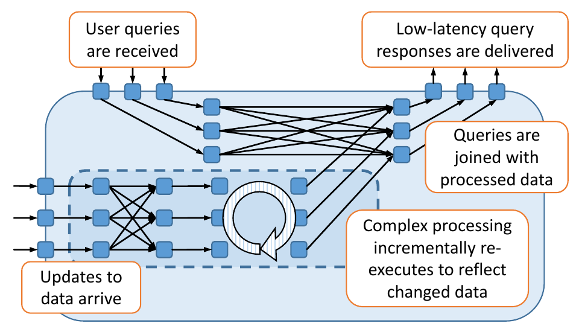
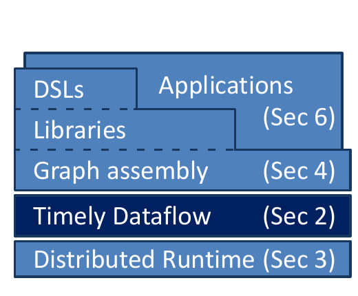
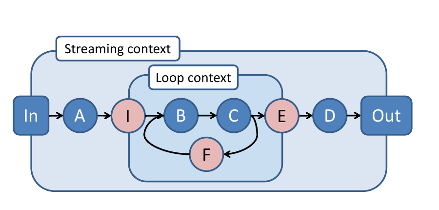
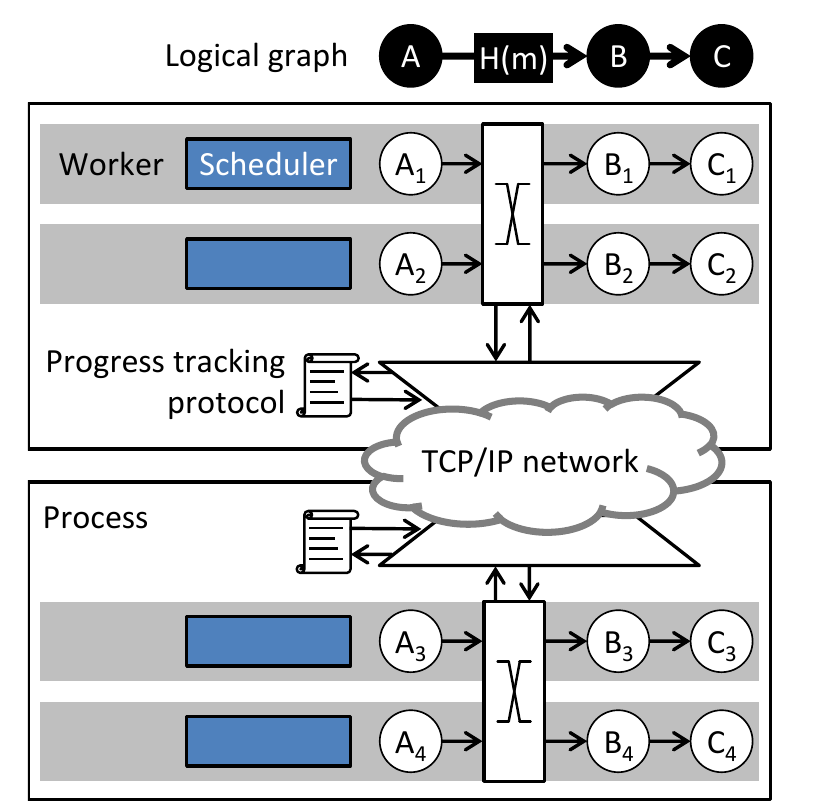
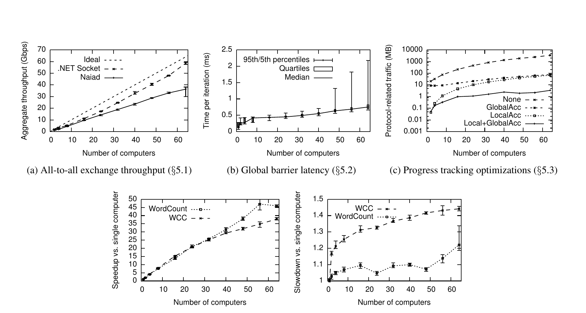
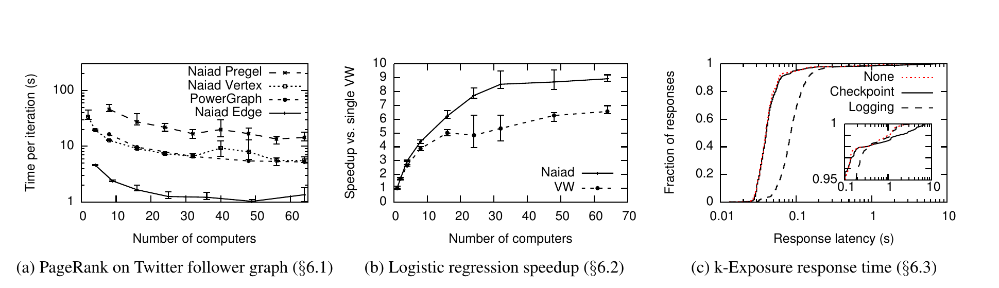
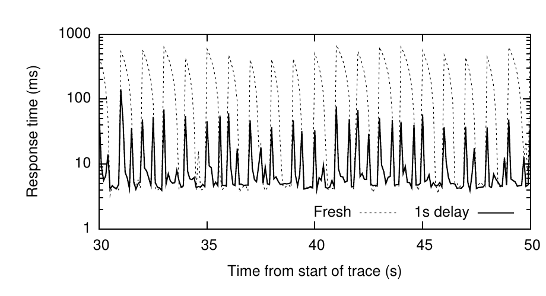

# Naiad: A Timely Dataflow System（中文译文）

## 译者说明

本文依据同目录的 `source.pdf` 翻译。章节、图表、公式、算法、代码与参考文献按原文结构保留。

## 原文信息

- 作者：Derek G. Murray、Frank McSherry、Rebecca Isaacs、Michael Isard、Paul Barham、Martín Abadi
- 机构：Microsoft Research Silicon Valley
- 联系方式：`{derekmur,mcsherry,risaacs,misard,pbar,abadi}@microsoft.com`
- 会议：SOSP ’13，2013 年 11 月 3—6 日，美国宾夕法尼亚州法明顿
- DOI：<http://dx.doi.org/10.1145/2517349.2522738>

## 摘要

Naiad 是一个用于执行数据并行循环数据流程序的分布式系统。它兼具批处理器的高吞吐量、流处理器的低延迟，以及执行迭代计算和增量计算的能力。虽然现有系统分别提供了其中一些特性，但同时需要这三种特性的应用一直不得不依赖多个平台，并为此牺牲效率、可维护性和简洁性。Naiad 解决了在一个框架中组合这些特性所带来的复杂性。

Naiad 以一种新的计算模型——及时数据流（timely dataflow）——为基础；该模型能在广泛的算法中捕捉并行机会。它用表示计算逻辑位置的时间戳扩展了数据流计算，并以此为高效、轻量的协调机制奠定基础。

我们表明，许多功能强大的高层编程模型都可以建立在 Naiad 的低层原语之上，从而支持流式数据分析、迭代式机器学习和交互式图挖掘等多种任务。Naiad 在各类专用系统的目标应用领域中胜过这些系统，而其独有特性还使新的高性能应用成为可能。

## 1 引言

许多数据处理任务既要求以低延迟交互式访问结果，又要求执行迭代子计算，还要求中间输出保持一致，以便嵌套和组合子计算。图 1 展示了这些要求：应用在实时数据流上执行迭代处理，并支持针对最新、一致结果视图的交互式查询。然而，没有任何现有系统能够同时满足这三项要求：流处理器可以为非迭代算法生成低延迟结果 [3, 5, 9, 38]；批处理系统可以同步迭代，但以延迟为代价 [27, 30, 43, 45]；基于触发器的方法支持迭代，却只提供较弱的一致性保证 [29, 36, 46]。虽然或许可以组合多个现有系统来构建图 1 中的应用，但建立在单一平台上的应用通常效率更高、表达更简洁，也更易维护。



**图 1：** 一个支持在持续更新的数据上执行实时查询的 Naiad 应用。虚线矩形表示迭代处理；随着新数据到达，该处理会增量更新。

我们的目标是开发一个通用系统：它既满足上述所有要求、支持多种高层编程模型，又能达到专用系统的性能。为此，我们开发了新的计算模型“及时数据流”，它支持以下特性：

1. 允许数据流中存在反馈的结构化循环；
2. 有状态的数据流顶点，无须全局协调即可消费和生成记录；
3. 当顶点已经收到某一轮输入或某次循环迭代的全部记录时，向它发出通知。

前两项特性共同支持低延迟的迭代计算和增量计算。第三项特性则使系统即使在流式处理或迭代期间，也能在计算的输出端和中间阶段生成一致结果。

及时数据流向程序员公开了一组有原则的低层原语，程序员可以用它们构造更高层的编程抽象。及时数据流图是有向图，其中可以包含环。有状态顶点异步接收消息以及关于全局进度的通知。边承载带逻辑时间戳的记录，这些时间戳使全局进度可以度量。与早期系统使用的时间戳 [3, 5, 9] 不同，这些逻辑时间戳反映图拓扑中的循环等结构，因此适合跟踪迭代算法的进度。我们将证明，这些原语足以把现有框架表达为可组合且高效的库。

Naiad 是我们面向分布式集群中数据并行计算的及时数据流原型实现。与其他系统 [16, 42, 43] 一样，我们针对工作集能够装入集群总内存的问题，这与我们构建低延迟系统的目标一致。当应用同时要求高吞吐量计算和低延迟计算时，会出现一些实际挑战，其中包括以较低开销协调分布式进程，以及通过系统工程避免停顿。锁竞争、丢包和垃圾回收等不同来源的停顿，会对频繁协调的计算造成不成比例的影响。

我们使用多个批处理和增量工作负载评估 Naiad，并通过微基准研究其底层机制的性能。我们的原型实现胜过通用批处理器，并且经常胜过只提供很少语义保证的先进异步系统。为展示该模型的表达能力和我们的高层库的威力，我们只用几十行代码就构建了一个基于图 1 数据流的复杂应用（见第 6.4 节）。所得应用能以 4—100 ms 的延迟响应查询。



**图 2：** Naiad 软件栈公开了低层图组装接口，可在其上构建高层库、领域专用语言（DSL）和应用。

## 2 及时数据流

及时数据流是一种建立在有向图上的计算模型；图中的有状态顶点沿有向边发送和接收带有逻辑时间戳的消息。数据流图可以包含嵌套的环，时间戳会反映这种结构，以区分来自不同输入纪元（epoch）和循环迭代的数据。所得模型支持并发执行不同的纪元和迭代，并能在具有指定时间戳的所有消息都已送达后，显式通知顶点。本节中，我们定义及时数据流图的结构，介绍低层顶点编程模型，并说明如何高效判断何时可以投递顶点通知。

### 2.1 图结构

及时数据流图包含输入顶点和输出顶点。每个输入顶点从外部生产者接收一个消息序列，每个输出顶点则向外部消费者发出一个消息序列。外部生产者为每条消息标上整数纪元，并在不再会收到具有某个纪元标签的消息时通知输入顶点。生产者也可以“关闭”输入顶点，表示任何纪元都不会再有消息到达。每条输出消息都带有其纪元标签；当某个纪元不会再有输出消息，以及全部输出均已完成时，输出顶点会向外部消费者发出信号。

及时数据流图是有向图，并带有一项约束：顶点组织在可能相互嵌套的循环上下文中，每个循环上下文配有系统提供的三类顶点。进入循环上下文的边必须经过入口顶点（ingress），离开循环上下文的边必须经过出口顶点（egress）。此外，图中的每个环都必须完全包含在某个循环上下文中，并至少包含一个未嵌套在任何内层循环上下文中的反馈顶点（feedback）。图 3 给出了一个循环上下文，并标出了入口顶点 I、出口顶点 E 和反馈顶点 F。



**图 3：** 这个简单的及时数据流图（第 2.1 节）展示了循环上下文如何嵌套在最外层的流式上下文中。

这种受限的循环结构使我们能够依据数据流图结构设计逻辑时间戳。每条消息都带有如下类型的逻辑时间戳：

$$
\text{Timestamp}:
\left(
e \in \mathbb{N},
\left\langle c _ {1},\ldots,c _ {k} \right\rangle \in \mathbb{N}^k
\right)
$$

其中， $e$ 是纪元；与消息所属边相关联的每个循环上下文都有一个循环计数器，因此共有 $k$ 个循环计数器。这些计数器显式区分不同迭代，并使系统可以在消息围绕数据流图流动时跟踪前向进度。

入口、出口和反馈顶点只作用于经过它们的消息的时间戳。它们按下表调整输入时间戳：

| 顶点 | 输入时间戳 | 输出时间戳 |
| --- | --- | --- |
| 入口 | $(e,\langle c _ {1},\ldots,c _ {k}\rangle)$ | $(e,\langle c _ {1},\ldots,c _ {k},0\rangle)$ |
| 出口 | $(e,\langle c _ {1},\ldots,c _ {k},c _ {k+1}\rangle)$ | $(e,\langle c _ {1},\ldots,c _ {k}\rangle)$ |
| 反馈 | $(e,\langle c _ {1},\ldots,c _ {k}\rangle)$ | $(e,\langle c _ {1},\ldots,c _ {k}+1\rangle)$ |

对于同一循环上下文内的两个时间戳

$$
t _ {1}=(x _ {1},\vec{c} _ {1}), \qquad t _ {2}=(x _ {2},\vec{c} _ {2}),
$$

当且仅当 $x _ {1}\leq x _ {2}$ 且 $\vec{c} _ {1}\leq\vec{c} _ {2}$ 时，我们定义 $t _ {1}\leq t _ {2}$；后一个关系采用整数序列的字典序。该顺序对应于一条消息可能导致另一条消息出现的未来时间约束，我们将在后续小节中把这一概念形式化。

### 2.2 顶点计算

及时数据流顶点发送和接收带时间戳的消息，并且可以请求、接收这样的通知：带某个特定时间戳的全部消息都已收到。每个顶点 $v$ 实现两个回调：

```text
v.OnRecv(e: Edge, m: Message, t: Timestamp)
v.OnNotify(t: Timestamp)
```

在这些回调的上下文中，顶点可以调用两个由系统提供的方法：

```text
this.SendBy(e: Edge, m: Message, t: Timestamp)
this.NotifyAt(t: Timestamp)
```

每次调用 `u.SendBy(e, m, t)`，都会相应调用 `v.OnRecv(e, m, t)`，其中 $e$ 是从 $u$ 到 $v$ 的边；每次调用 `v.NotifyAt(t)`，都会相应调用 `v.OnNotify(t)`。

`OnRecv` 和 `OnNotify` 的调用会进入队列；在大多数情况下，模型并不限制它们的投递顺序。不过，及时数据流系统必须保证：只有在今后不可能再调用 `v.OnRecv(e, m, t')`（其中 $t'\leq t$）之后，才会调用 `v.OnNotify(t)`。`v.OnNotify(t)` 表示所有 `v.OnRecv(e, m, t)` 调用都已经投递给该顶点，也是该顶点完成与时间 $t$ 相关工作的机会。

`OnRecv` 和 `OnNotify` 方法可以包含任意代码并修改任意的顶点私有状态，但它们的执行受到一项重要约束：当以时间戳 $t$ 调用时，这些方法只能用满足 $t'\geq t$ 的时间 $t'$ 调用 `SendBy` 或 `NotifyAt`。该规则保证消息不会“逆时间”发送，是实现上述通知语义的关键。

```csharp
class DistinctCount<S,T> : Vertex<T>
{
    Dictionary<T, Dictionary<S,int>> counts;

    void OnRecv(Edge e, S msg, T time)
    {
        if (!counts.ContainsKey(time)) {
            counts[time] = new Dictionary<S,int>();
            this.NotifyAt(time);
        }

        if (!counts[time].ContainsKey(msg)) {
            counts[time][msg] = 0;
            this.SendBy(output1, msg, time);
        }

        counts[time][msg]++;
    }

    void OnNotify(T time)
    {
        foreach (var pair in counts[time])
            this.SendBy(output2, pair, time);
        counts.Remove(time);
    }
}
```

**图 4：** 一个具有一个输入和两个输出的示例顶点。它在 `output1` 上输出互不重复的输入记录，并在 `output2` 上输出每条记录的计数。互异记录可以在首次看到时立即发送，但计数必须等到具有该时间戳的所有记录都已收到后才能发送。

作为示例，图 4 给出了一个具有一个输入和两个输出的顶点代码。第一个输出是在每个时间戳上观察到的互异元素集合，第二个输出则统计每个互异输入在该时间戳出现的次数。`OnRecv` 方法可以在首次观察到某个元素时立即把它发送到第一个输出，从而获得低延迟；但为了保证正确性，顶点必须使用 `OnNotify`，将计数的发送延迟到具有该时间戳的全部输入都已到达之后。

### 2.3 实现及时数据流

为了正确投递通知，及时数据流系统必须能够断定未来不可能再出现带某一时间戳的消息。本小节中，我们为判断何时可以安全投递通知奠定基础，并为单线程实现开发相应工具。第 3 节将讨论分布式实现中出现的问题。

在执行过程中的任意时刻，未来消息可能出现的时间戳集合都受到当前未处理事件（消息和通知请求）以及图结构的约束。及时数据流系统中的消息只能沿边流动，它们的时间戳会被入口、出口和反馈顶点修改。由于事件不能逆时间发送消息，我们可以利用这一结构计算某个事件可能产生的消息时间戳下界。把该计算应用于未处理事件集合，我们就可以识别哪些顶点通知能够正确投递。

每个事件都有时间戳和位置（顶点或边），我们把二者合称为点时间戳（pointstamp）：

$$
\text{Pointstamp}:
\left(
t \in \text{Timestamp},
l \in \text{Edge}\cup\text{Vertex}
\right).
$$

`SendBy` 和 `NotifyAt` 方法会生成新事件：对于 `v.SendBy(e, m, t)`，消息 $m$ 的点时间戳是 $(t,e)$；对于 `v.NotifyAt(t)`，通知的点时间戳是 $(t,v)$。

及时数据流图的结构约束在点时间戳上诱导出一种顺序。当且仅当数据流图中存在路径

$$
ψ=\left\langle l _ {1},\ldots,l _ {2}\right\rangle
$$

并且沿该路径出现的每个入口、出口或反馈顶点依次调整 $t _ {1}$ 后所得的时间戳满足

$$
ψ(t _ {1})\leq t _ {2},
$$

我们才称点时间戳 $(t _ {1},l _ {1})$ **可导致**（could-result-in） $(t _ {2},l _ {2})$。每条路径都可以用其顶点删除、添加和递增的循环坐标来概括；所得从 $l _ {1}$ 到 $l _ {2}$ 的路径摘要，是一个把 $l _ {1}$ 处的时间戳转换为 $l _ {2}$ 处时间戳的函数。及时数据流图的结构保证：对于由两条具有不同摘要的路径连接的任意位置 $l _ {1}$ 和 $l _ {2}$，其中一条路径摘要产生的调整后时间戳总是早于另一条。对于每对 $l _ {1}$ 和 $l _ {2}$，我们使用一个直接的图传播算法，在所有从 $l _ {1}$ 到 $l _ {2}$ 的路径中找出最小路径摘要，并将其记作 $Ψ[l _ {1},l _ {2}]$。为了高效判断两个点时间戳 $(t _ {1},l _ {1})$ 和 $(t _ {2},l _ {2})$ 之间的“可导致”关系，我们测试：

$$
Ψ[l _ {1},l _ {2}](t _ {1})\leq t _ {2}.
$$

现在，我们考虑单线程调度器如何在及时数据流实现中投递事件。调度器维护一个活动点时间戳集合，即至少对应一个未处理事件的点时间戳。对于每个活动点时间戳，调度器维护两个计数：**出现计数**，表示有多少尚未处理的事件带有该点时间戳；**前驱计数**，表示在“可导致”顺序中，有多少活动点时间戳位于它之前。随着顶点生成和撤销事件，出现计数按下表更新：

| 操作 | 更新 |
| --- | --- |
| `v.SendBy(e, m, t)` | $\mathrm{OC}[(t,e)]\leftarrow\mathrm{OC}[(t,e)]+1$ |
| `v.OnRecv(e, m, t)` | $\mathrm{OC}[(t,e)]\leftarrow\mathrm{OC}[(t,e)]-1$ |
| `v.NotifyAt(t)` | $\mathrm{OC}[(t,v)]\leftarrow\mathrm{OC}[(t,v)]+1$ |
| `v.OnNotify(t)` | $\mathrm{OC}[(t,v)]\leftarrow\mathrm{OC}[(t,v)]-1$ |

调度器会在调用 `SendBy` 和 `NotifyAt` 开始时，以及 `OnRecv` 和 `OnNotify` 调用结束时应用这些更新。当点时间戳 $p$ 变为活动状态时，调度器把它的前驱计数初始化为当前活动点时间戳中可以导致 $p$ 的数量。同时，调度器会为所有可能由 $p$ 导致的点时间戳增加前驱计数。当活动点时间戳 $p$ 的出现计数降为零时，它便离开活动集合；此时，调度器会为所有可能由 $p$ 导致的点时间戳减少前驱计数。当活动点时间戳 $p$ 的前驱计数为零时，活动集合中没有其他点时间戳可以导致 $p$，我们称 $p$ 位于活动点时间戳的**前沿**（frontier）中。调度器可以投递前沿中的任何通知。

计算开始时，系统在每个输入顶点的位置初始化一个活动点时间戳：其时间戳是第一个纪元，出现计数为 1，前驱计数为 0。当纪元 $e$ 被标记为完成时，输入顶点先为纪元 $e+1$ 添加新的活动点时间戳，再移除纪元 $e$ 的点时间戳，从而允许投递下游关于纪元 $e$ 的通知。当输入顶点关闭时，它会移除位于自身位置的所有活动点时间戳，使该输入下游的所有事件最终都能排空。

### 2.4 讨论

尽管及时数据流中的时间戳比传统的整数值时间戳 [22, 38] 更复杂，但其顶点编程模型支持许多促使其他系统诞生的高级用例。

顶点必须显式请求通知，而不是被动接收所有时间的通知；这一要求使程序员可以通过选择何时协调，在性能之间作出权衡。例如，BloomL [13] 中的单调聚合算子可以在无协调的情况下持续修订输出；在 Naiad 中，顶点可以从 `OnRecv` 发送输出来实现这一点。这样的实现允许循环快速、无协调地迭代，因而可以提升性能，代价则可能是在输出达到最终值之前发送多条消息。另一方面，只在 `OnNotify` 中发送一次的实现可能更适合位于将与其他处理组合的子计算边界，因为“只会生成一个值”的保证可以简化下游子计算。及时数据流使这两种实现风格很容易在同一程序中组合。

按目前的描述，及时数据流中的通知保证不会早于时间 $t$ 投递，并且有能力在大于或等于 $t$ 的时间发送消息。我们可以把通知的这两个性质解耦为保证时间 $t_g$ 和能力时间 $t_c$，二者可以不同。例如，这一推广支持“状态清理”通知 [22]：它释放与 $t_g$ 相关的资源，但不会生成其他事件，因此可以令 $t_c=⊤$（即位于所有处理之后）。由于 $t_c=⊤$，该通知不会阻碍其他通知的投递，也无须引入任何协调。当 $t_g\lt{}t_c$ 时，通知还可用于约束原本异步的执行。例如，它可以提供“有界陈旧性” [11]，保证系统不会超前于任何未完成迭代超过预定义的迭代次数。

## 3 分布式实现

Naiad 是我们对及时数据流的高性能分布式实现。图 5 概要展示了 Naiad 集群的体系结构：一组进程托管多个工作器（worker），各自管理及时数据流顶点的一个分区。工作器通过共享内存在本地交换消息，并通过每对进程之间的 TCP 连接远程交换消息。每个进程都参与分布式进度跟踪协议，以协调通知的投递。我们把 Naiad 核心运行时实现为一个 C# 库，共 22,700 行代码。本节中，我们介绍 Naiad 为实现高性能而采用的技术。



**图 5：** 逻辑数据流图到分布式 Naiad 系统体系结构的映射。

### 3.1 数据并行

与其他数据流系统 [15, 41, 42] 一样，Naiad 依靠数据并行来增加应用可用的总计算能力、内存和带宽。程序把及时数据流图指定为由带类型连接器链接的逻辑阶段图。每个连接器可以选择提供一个分区函数，用来控制阶段之间的数据交换。执行时，Naiad 把逻辑图展开为物理图：每个阶段替换为一组顶点，每个连接器替换为一组边。图 5 展示了一个逻辑图及其对应的物理图，其中从 A 到 B 的连接器对类型化消息 $m$ 使用分区函数 $H(m)$。

数据并行数据流图的规则结构简化了顶点实现；顶点无须知道一个阶段的并行度。当顶点在连接器上发送消息时，系统会依据分区函数自动把消息路由到适当的目标顶点。具体而言，分区函数把一条消息映射到一个整数，系统则把映射到同一整数的所有消息路由至同一个下游顶点。程序员可以利用分区函数按键对输入消息做哈希分区或范围分区，以实现“分组”或“归约”功能 [15, 41]。若未提供分区函数，系统会把消息投递到本地顶点，例如图 5 中从 $B _ {i}$ 到 $C _ {i}$ 的消息。

规则结构还使 Naiad 能够简化对“可导致”关系的推理。Naiad 把物理图中的每个点时间戳 $p$ 投影到逻辑图中的点时间戳 $\hat{p}$，并在投影后的点时间戳上判断“可导致”关系。该投影会损失分辨率，因为存在 $p _ {1}$ 不能导致 $p _ {2}$、但 $\hat{p} _ {1}$ 可以导致 $\hat{p} _ {2}$ 的情况。不过，使用逻辑图可以保证计算该关系所用数据结构的大小只取决于逻辑图，而不是规模大得多的物理图。正如我们将在第 3.3 节说明的那样，使用投影点时间戳还减少了工作器之间为协调而进行的通信。

### 3.2 工作器

每个 Naiad 工作器负责把消息和通知投递给其所管理的及时数据流图分区中的顶点。当有多个可运行操作（待投递的消息和通知）时，工作器优先投递消息，以减少排队数据量。也可以采用其他策略，例如优先投递点时间戳最早的消息和通知，以降低端到端延迟。

工作器通过共享队列通信，除此之外不共享其他状态。这种隔离保证任意顶点内始终只有一个控制线程在执行，从而大幅简化顶点实现。若目标顶点由同一个工作器管理，则每次调用 `SendBy` 都会隐式使调用方顶点让出执行。因此，工作器可以立即调用相应的 `OnRecv` 回调来投递消息，而不必把消息排队等待稍后投递。此时，工作器还可以投递从其他工作器收到的排队消息。工作器能在顶点之间移动并投递远程输入消息，这使 Naiad 得以保持较短的系统队列并降低消息投递延迟。

数据流图中存在环，因而可能发生重入：一个顶点调用 `SendBy` 时被中断，随后它的某个 `OnRecv` 回调可能再次进入该顶点。默认情况下顶点不可重入，顶点所属的工作器必须把消息排队稍后投递；不过，顶点实现可以选择为重入调用指定一个有界深度。如果不支持重入，许多迭代模式的实现会压垮系统队列。重入允许顶点实现在 `OnRecv` 中合并输入消息，从而减少总内存消耗。

### 3.3 分布式进度跟踪

在投递通知之前，Naiad 工作器必须知道：系统中任何工作器上都不存在这样的未完成事件——它的点时间戳可以导致该通知的点时间戳。我们把基于单一全局前沿的进度跟踪方法（第 2.3 节）改造到分布式环境中；多个工作器利用各自对全局状态的局部视图来协调彼此独立的事件集合。我们的初始协议以广播出现计数更新为基础，随后我们再用两项优化加以改进。

对于每个活动点时间戳，每个工作器维护：一个**局部出现计数**，代表它对全局出现计数的局部视图；一个由局部出现计数计算出的**局部前驱计数**；以及一个根据局部活动点时间戳上的“可导致”关系定义的**局部前沿**。工作器分派事件时并不立即更新局部出现计数，而是向所有工作器（包括自身）广播进度更新。进度更新是如下的二元组：

$$
\left(
p\in\text{Pointstamp},
\delta\in\mathbb{Z}
\right),
$$

其中 $\delta$ 根据第 2.3 节的更新规则选取。从某一工作器到另一工作器的广播必须按 FIFO 顺序投递，但不同工作器发出的广播之间没有顺序约束。工作器收到进度更新 $(p,\delta)$ 后，会把 $\delta$ 加到 $p$ 的局部出现计数上。

该协议具有一项重要的安全性质：任一局部前沿都绝不会越过取系统所有未完成事件而得的全局前沿。因此，如果某个工作器有一个点时间戳为 $p=(t,v)$ 的待处理通知，并且 $p$ 位于局部前沿中，那么 $p$ 必然也位于全局前沿中，工作器可以安全地把通知投递给 $v$。另一篇论文 [4] 给出了该协议的形式化规格和安全性证明。

#### 优化广播更新

该协议的朴素实现会广播每一条进度更新，产生不切实际的通信需求。我们实现了两项优化；二者合用可降低通信量。

第一项优化是在进度跟踪协议中使用投影点时间戳。因此，协议跟踪的是每个阶段和连接器的出现计数与前驱计数，而不是每个顶点和边的计数。虽然正如第 3.1 节所述，这种表示可能减少并发机会，但它显著降低了更新量以及进度跟踪所维护状态的大小。

第二项优化是在广播更新之前，先把更新累积到本地缓冲区。具有相同点时间戳的更新会通过求和 $\delta$ 合并为缓冲区中的单个条目。只要缓冲区中的每个点时间戳 $p$ 都满足以下两项性质之一，就可以继续累积更新：局部前沿中的某个其他元素可以导致 $p$；或者， $p$ 对应的顶点具有严格为正的净更新值——该值是局部出现计数、缓冲更新计数以及工作器已经广播但尚未收到的更新之和。

当累加器收到新的进度更新（来自本地工作器或其他累加器）时，它必须检查累积的点时间戳是否仍满足上述条件；若不满足，累加器就广播缓冲区中的所有更新。广播更新时，正值必须先于负值发送。

任意固定的一组工作器都可以执行这种累积，并且累积可以分层进行。默认情况下，Naiad 在进程级和集群级累积更新：每个进程把累积后的更新发送到一个中央累加器，后者再向所有工作器广播净影响。虽然相较直接广播，这种累积增加了一次消息延迟，但它显著减少了更新消息总数；我们将在第 5.3 节对此作出评估。

我们的实现还包含两项进一步降低广播更新预期延迟的优化。中央集群级累加器会先乐观地广播一个包含各项更新的 UDP 数据包，再通过累加器与其他进程之间的 TCP 连接重发更新。消息包含序列号，以保证投递有序且幂等。此外，Naiad 使用 eventcount 同步原语 [37] 的一个修改版本，使线程既能由广播通知唤醒，也能由单播通知唤醒。没有这项优化时，依次唤醒工作器会给低延迟迭代计算的关键路径增加显著开销。

### 3.4 容错与可用性

Naiad 的容错实现简单但可扩展：每个有状态顶点都实现 `Checkpoint` 和 `Restore` 接口，系统在适当时调用它们，以在所有工作器之间生成一致的检查点。每个顶点可以选择在计算过程中记录数据，从而以低延迟响应检查点请求；也可以在收到请求时写出完整、可能更紧凑的检查点。进度跟踪协议中的有状态组件也实现同一接口；由于它们规模较小且更新频繁，因此会生成完整检查点。

系统定期创建检查点时，所有进程首先暂停工作线程和消息投递线程；接着通过投递未完成的 `OnRecv` 事件来清空消息队列，并对由此发送的任何消息执行缓冲和记录；最后在每个有状态顶点上调用 `Checkpoint`。然后系统恢复工作线程和消息投递线程，并发送已缓冲的消息。一旦达到所需的持久性级别——例如检查点文件已经刷入磁盘，或已复制到其他计算机——检查点即告完成。

从进程故障中恢复时，所有仍然存活的进程都会回滚到上一个持久检查点，故障进程上的顶点则被重新分配给剩余进程。`Restore` 方法利用各顶点相应的检查点文件重建其状态。

允许系统对可变状态执行细粒度更新，与可靠记录足够信息、从而在局部调度器故障时实现一致恢复，这两项目标之间存在内在的设计张力。我们目前的设计偏向无故障这一常见情形下的性能，代价是故障发生时的可用性。Naiad 可以从可靠消息队列消费输入，并把输出写入分布式键值存储 [8]。这种方法使整个系统在 Naiad 从故障中恢复期间仍能处理读写，但会牺牲一定的新鲜度。其他取舍可能更适合某些应用。例如，MillWheel [5] 是一个非迭代流处理系统，采用与第 2.2 节所定义模型相似的编程模型；它会为处理的每一批消息按键写入检查点。该策略增加了每条消息的延迟，但能在故障后更快恢复。我们将在第 6.3 节讨论日志记录和检查点对吞吐量与延迟的影响。

### 3.5 防止微拖尾

许多 Naiad 计算对延迟很敏感：一个工作器的瞬时停顿会对整体性能造成不成比例的影响。例如，在迭代计算中，两次通知之间的一个执行阶段可能短至 1 ms [28]，而丢包、并发数据结构竞争和垃圾回收等事件可能造成几十毫秒至几十秒的延迟。集群规模越大，此类事件发生在某一执行阶段中的概率越高，因此我们把由此产生的**微拖尾工作器**（micro-straggler）视为低延迟工作负载可扩展性的主要障碍。

微拖尾与粗粒度批处理系统中广为人知的拖尾任务有些相似，但适用的缓解技术不同。批处理系统中的工作器没有状态，因此可以通过调度重复工作项来减轻拖尾影响 [14, 15, 44]。Naiad 为降低执行延迟而维护可变状态；推测执行重复工作将要求系统协调副本状态的更新，我们预计其成本会超过收益。

Naiad 并不在出现微拖尾后被动处理，而是尽可能减小其影响并避免其发生。下面，我们介绍微拖尾的几个来源及有效的缓解方式。

#### 网络

Naiad 使用以太网上的 TCP 投递远程消息，因为 TCP 能可靠地投递消息，而现代以太网网卡会在硬件中加速 TCP 协议栈的许多部分。然而，一对进程之间的消息吞吐是突发式的：许多迭代计算开始时会进行大规模数据交换，但在收尾阶段，消息通常可以装入单个数据包。这种突发模式会在我们这样的尽力而为网络中产生微拖尾，因此我们采取了若干措施来降低其影响。

Windows 的默认 TCP 配置会让两个双向各交换一条小消息的进程遭受 200 ms 延迟，原因是 Nagle 算法 [32] 和延迟确认 [12]。因此，我们为 Naiad 的 TCP 套接字禁用 Nagle 算法，并把延迟确认超时降至 10 ms。发生丢包时，默认重传超时为 300 ms，这远长于 Naiad 中的许多拥塞事件。例如，集群级进度跟踪累加器（第 3.3 节）经常聚合每个进程各一个数据包，这些数据包近乎同时到达时可能因 incast [6] 而丢失。因此，我们把最小重传超时降至 20 ms。由于 Naiad 在应用层聚合消息，即使采用这些选项也能保持高吞吐量。

我们的评估集群采用交换式千兆以太网，拓扑很简单：一个核心交换机和两个各有 32 个端口的机架顶交换机。尽管交换机间链路采用 40 Gbps 上行链路进行超额配置，并启用了 802.3x 流量控制，我们仍在 incast 流量模式下观察到网卡接收队列丢包 [31]。数据中心 TCP [6] 很可能有益于我们的工作负载，但我们集群的机架交换机不支持其所需的显式拥塞通知。

由于 Naiad 控制数据交换的所有方面，专用传输协议很可能比以太网上的 TCP 提供更好的性能。我们正在研究 InfiniBand 上的 RDMA；它可以借助微秒级消息延迟、可靠组播以及用户态访问消息缓冲区等机制减少微拖尾。这些机制将避开操作系统中与 TCP 相关的计时器，但要达到最优性能仍需关注服务质量 [35]。

#### 数据结构竞争

为了在单机内扩展，Naiad 中的大多数数据结构——尤其是顶点状态——只由一个工作线程访问。尽管如此，在工作器之间交换消息仍需协调，为此 Naiad 使用 .NET 并发队列和轻量自旋锁。这些原语检测到竞争时会通过休眠 1 ms 进行退避。Windows 的默认计时器粒度为 15.6 ms，典型调度时间片则为 100 ms 或更长，因此退避可能让竞争共享数据结构的并发访问出现很高延迟。把时钟粒度降至 1 ms 可以减小这些停顿的影响。

#### 垃圾回收

我们实现 Naiad 所依赖的 .NET 运行时使用标记清扫式垃圾回收器（GC）回收内存。虽然 .NET GC 是并发的，但它可能在某些分配过程中暂停线程执行，造成微拖尾。

为了降低垃圾回收成本，我们通过系统工程减少 GC 的触发频率，并缩短回收造成的暂停。Naiad 运行时以及我们建立在其上的库尽可能避免对象分配，并使用缓冲池回收消息缓冲区和临时算子状态（例如队列）。我们大量使用值类型，因为值类型对象数组可以分配为一块只有一个指针的连续内存，而 GC 成本与指针数量成正比，并不与对象数量成正比。.NET 运行时支持结构化值类型，因此许多 Naiad 数据结构都能使用它们。

## 4 使用 Naiad 编写程序

虽然可以直接针对及时数据流抽象编写 Naiad 程序，但许多用户更喜欢简单的高层接口，例如 SQL、MapReduce [15]、LINQ [41]、Pregel 的顶点程序抽象 [27] 以及 PowerGraph 的 GAS 抽象 [16]。我们在设计 Naiad 时，使常见的及时数据流模式能够汇集成库：需求能由库满足时，用户直接使用库；需求不能满足时，用户则可以在同一程序内构造新的及时数据流顶点。本节先用一个简单的 Naiad 程序突出应用的共同结构，再讨论我们构建的一些库，最后概述如何用低层 Naiad API 编写库和自定义顶点。

### 4.1 一个典型的 Naiad 程序

所有 Naiad 程序都遵循同一种模式：先定义一个由输入阶段、计算阶段和输出阶段组成的数据流图，然后反复向输入阶段提供数据。输入和输出阶段遵循推送模型：用户为每个输入纪元提供新数据，Naiad 则为每个输出数据纪元调用用户提供的回调。下面的示例片段使用我们的增量计算库 [28]，该库允许程序员采用熟悉的 LINQ 模式实现可增量更新的 MapReduce 计算：

```csharp
// 1a. 为数据流定义输入阶段。
var input = controller.NewInput<string>();

// 1b. 定义及时数据流图。
// 这里使用 LINQ 实现 MapReduce。
var result = input.SelectMany(y => map(y))
                  .GroupBy(y => key(y),
                           (k, vs) => reduce(k, vs));

// 1c. 为每个输出纪元定义回调。
result.Subscribe(result => { ... });

// 2. 向查询提供输入数据。
input.OnNext(/* 第 1 个纪元的数据 */);
input.OnNext(/* 第 2 个纪元的数据 */);
input.OnNext(/* 第 3 个纪元的数据 */);
input.OnCompleted();
```

步骤 1a 定义数据源，步骤 1c 定义输出数据生成后要执行的操作。步骤 1b 使用 `SelectMany` 和 `GroupBy` 库调用构造及时数据流图；这些调用组装预定义顶点的阶段，其行为与 LINQ 中的对应项一致：`SelectMany` 把参数函数应用于每条消息，`GroupBy` 则先按键函数整理结果，再应用归约函数。

图完全组装好后，步骤 2 使用 `OnNext` 向计算提供各纪元的输入数据。`Subscribe` 阶段把回调应用于它观察到的每个已完成数据纪元。最后，`OnCompleted` 表示不再存在其他输入数据纪元，使 Naiad 可以排空消息并干净地关闭计算。

### 4.2 Naiad 中的数据并行模式

我们把若干高层编程模式打包为建立在 Naiad 及时数据流抽象之上的库。库代码与系统代码的分离，使用户很容易采用现有模式、创建自己的模式，以及改造其他模式，而无须访问私有 API。公开、可复用的低层编程抽象是 Naiad 区别于其他一些数据并行系统 [26, 27, 41, 42] 的地方：后者强制采用单一高层编程模型，并把该模型与低层原语之间的边界隐藏在私有系统代码中。我们希望这一差异能让 Naiad 成为未来数据并行项目富有吸引力的实现层。

实现一个类似 LINQ 的增量算子库相当直接。大多数算子建立在通用缓冲算子的一元或二元形式之上：其 `OnRecv` 函数把记录添加到按时间戳索引的列表中，`OnNotify(t)` 则对时间戳 $t$ 的一个或多个列表应用适当变换。为提升性能，我们专门实现了不需要协调的算子。例如，`Concat` 立即转发来自两个输入的记录，`Select` 不经缓冲便变换并输出数据，`Distinct` 则在第一次看到记录时立即输出。能在库代码而不是 Naiad 核心运行时中实现这种专门化，使 LINQ 实现的演进与底层系统的改进相互解耦。

我们实现了异步计算框架 Bloom [7] 的一个子集。LINQ 算子 `Where`、`Concat`、`Distinct` 和 `Join` 已足以在循环内实现 Datalog 风格的查询。这些算子都不调用 `NotifyAt`，所以只使用这些算子的子图会在 Naiad 上异步执行，无须协调。我们还实现了一个单调 `Aggregate` 算子，在聚合结果改善时发出记录，适合实现 BloomL 风格的聚合 [13]。所有这些构造都可以与其他 LINQ 算子和及时数据流阶段组合，而 Naiad 只在顶点明确要求时才引入协调。

最后一个例子是：我们把面向图算法的 Pregel 批同步并行模型 [27] 实现为一个 Naiad 库。Pregel 程序在一系列迭代（或称“超步”）中操作数据图；每次迭代都会交换消息、计算聚合值并修改图。尽管可以用 LINQ 风格的算子构建类似 Pregel 的实现 [40]，这种面向集合的模式很难支持 Pregel 的完整语义，包括聚合和图修改。因此，我们把自己的 Pregel 移植建立在一个自定义顶点之上，该顶点具有多个强类型输入和输出，分别用于消息、聚合值和图修改，并通过并行的多条反馈边连接。

### 4.3 构造及时数据流图

虽然我们预计 Naiad 的大多数用法都会依赖图构造模式库，但 Naiad 仍提供一个基于及时数据流的简单图构造接口。该接口是所有库的基础，也使应用很容易加入提供专门功能的临时顶点。

图构造主要包含两个步骤：定义数据流顶点的行为，以及定义数据流拓扑（包括所有循环）。Naiad 阶段是由顶点工厂定义的一组顶点；系统调用顶点工厂来实例化每个相互独立的顶点实例。阶段可以有多个输入和输出，每个输入输出都关联一个 C# 记录类型；它们通过带类型的流连接，流两端的记录类型必须匹配。阶段输入可以指定分区要求，阶段输出可以指定分区保证；必要时，系统会插入交换连接器，以确保满足输入分区要求。顶点必须为每个输入提供一个带类型的 `OnRecv` 回调；若阶段支持通知，还必须提供 `OnNotify` 回调。

通常，一个阶段必须先连接输入，再连接输出，以防产生无效环。系统提供的 `LoopContext` 对象允许程序员定义多个入口、出口和反馈阶段，并把它们连接到其他计算阶段。只有反馈阶段可以先连接输出、后连接输入；这保证所有环都符合有效及时数据流图的约束。

## 5 性能评估

Naiad 的设计目标是在不同运行模式下都取得良好效果，并根据工作负载需要同时支持高吞吐量和低延迟。本节中，我们使用多个微基准，考察 Naiad 在这些运行区间中的行为。



**图 6：** 这些微基准在合成数据集上评估 Naiad 的基础系统性能。（a）全互连交换吞吐量（第 5.1 节）；（b）全局屏障延迟（第 5.2 节）；（c）进度跟踪优化（第 5.3 节）；（d）强扩展（第 5.4 节）；（e）弱扩展（第 5.4 节）。

硬件配置如下：两个机架，每个机架有 32 台计算机；每台计算机配备两个四核 2.1 GHz AMD Opteron 处理器、16 GB 内存和一块 Nvidia NForce 千兆以太网卡。每个机架交换机都通过 40 Gbps 上行链路连接核心交换机。除非另有说明，图中每个数据点都是五次试验的平均值，误差条表示最小值和最大值。

### 5.1 吞吐量

第一个微基准测量分布式计算的最大吞吐量。程序构造一个循环数据流，反复对固定数量的记录执行全互连数据交换。图 6a 绘出了总吞吐量随计算机数量的变化。

最上方曲线“理想值”（Ideal）表示按以太网带宽计算的总吞吐量；中间曲线表示在 .NET Socket 层使用长连接 TCP 和 64 KB 消息时，持续全互连交换所达到的吞吐量。中间曲线体现了在给定网络拓扑、TCP 开销和 .NET API 成本下能够达到的吞吐量。

最后一条曲线表示应用在集群的所有进程之间交换大量 8 字节记录（每台计算机 5000 万条）时，Naiad 达到的吞吐量。较小的记录尺寸使序列化和计算分区函数的开销接近最坏情况。实验说明 Naiad 的吞吐能力可以线性扩展，但其绝对性能仍有改进空间。

### 5.2 延迟

第二个实验评估全局协调所需的最短时间。我们再次构造一个简单的循环数据流，不过这次顶点不交换数据，只请求并接收完备性通知。只有前一次迭代的所有通知都已投递后，下一次迭代才能继续。图 6b 用中位数、四分位数和第 95 百分位数绘出了 10 万次迭代的耗时分布。即使使用 64 台计算机（512 个工作器），每次迭代耗时的中位数仍低至 753 µs；但第 95 百分位数结果显示，随着计算机数量增加，微拖尾会产生不利影响。

在许多实际程序中，一个阶段内请求完备性通知的顶点子集可能相对较小，而参与者更少会降低协调成本。例如，在定点计算的尾部，延迟至关重要；此时通信模式通常会变得稀疏，所以参与协调的顶点数量往往较少。

### 5.3 协议优化

为评估第 3.3 节所述进度跟踪协议优化，我们在一张包含 3 亿条边的随机图（原始输入约 2.2 GB）上运行弱连通分量（WCC）计算。图 6c 展示了每台计算机运行 8 个工作器时，进度协议产生的流量字节数。在本实验中，我们绘制一次运行的结果，因为该计算的进度协议流量在不同执行之间没有明显变化。

根据是在计算机级（“LocalAcc”）、集群级（“GlobalAcc”），还是在两级同时执行累积，优化可把协议流量减少一至两个数量级。实践中，我们发现启用与不启用全局累积时的运行时间差异很小；计算机级本地累积带来的消息缩减已经足以避免进度流量成为瓶颈。虽然我们尚未在实验中观察到，但我们知道当前协议可能限制可扩展性，并预计更深的累积和分发树将有助于在更大集群中更高效地传播进度更新。

### 5.4 扩展性

我们使用两个形成鲜明对比的应用考察 Naiad 的扩展特性。`WordCount` 是一个易于并行的 MapReduce 程序，它计算 128 GB 未压缩 Twitter 语料库中的词频；该语料库由一个初始大小为 12.0 GB 的语料库复制生成。WCC 是在一张包含 2 亿条边的随机图上执行的弱连通分量计算。WCC 是一项很有挑战性的扩展性测试：它包含大量同步点；循环早期受吞吐量限制，接近收敛时则受延迟限制。

为评估强扩展，我们在保持输入大小固定的同时增加计算资源，因此预计通信成本最终会限制进一步扩展。图 6d 绘出了两个应用的运行时间。WCC 在约 24 台计算机时开始放缓扩展速度，并在 64 台计算机上达到最高 38 倍加速。`WordCount` 的扩展近似线性，在 64 台计算机上达到 46 倍加速。

为评估弱扩展，我们测量同时增加计算机数量和输入大小所产生的影响。具有完美弱扩展的计算在每种配置下都应具有相同的运行时间。

图 6e 展示了 WCC 在一张随机输入图上的表现；每台计算机对应的边数恒为 1820 万，节点数恒为 910 万。使用 64 台计算机处理一张包含 11 亿条边的图时，运行时间相对于单机执行恶化约 1.44 倍（29.4 s 对 20.4 s）。大部分偏离完美扩展的现象都可以用吞吐量实验来解释。在 WCC 的每种弱扩展配置中，一台计算机上的工作器发送和接收的数据量都恒为 360 MB。单机运行时，目标始终在本地；两台计算机则通过网络交换一半数据；64 台计算机通过网络交换数据的 $63/64$（355 MB）。从图 6a 可知，在 64 台计算机之间交换 355 MB 数据的成本约为 7.6 s，这解释了 9 s 减速中的大部分。

图 6e 还给出了 `WordCount` 的弱扩展结果，每台计算机处理 2 GB 压缩输入。由于数据交换前组合器的效果更好，`WordCount` 的交换数据量远小于 WCC，但它仍随进程数量增加，计算在数据交换期间会受吞吐量限制。因此，`WordCount` 未能实现完美弱扩展（最坏情况下耗时为单机的 1.23 倍），但其弱扩展优于 WCC。

## 6 真实应用

现在，我们考察若干来自批处理、流处理和图计算文献的应用，并把 Naiad 的表达能力和性能与现有系统进行比较。其他系统的额外性质和特性使比较变得复杂，但我们将表明，相较于通用框架和专用系统，Naiad 都能取得出色性能，并能以较少代码行数在高层表达算法。

此外，我们还开发并评估了一个符合图 1 构想的示例：维护由增量图分析派生出的统计信息，并针对结果处理交互式查询。我们不知道还有其他系统能在交互式时间尺度上实现该计算；Naiad 则能以亚秒级延迟响应更新和查询。

除非另有说明，集群配置和误差条含义均与第 5 节相同。

### 6.1 批量迭代图计算

Najork 等人 [34] 比较了三种在大规模真实数据集上执行图计算的方法：分布式数据库 PDW [2]、通用批处理器 DryadLINQ [41]，以及专门构建的分布式图存储 SHS [33]。他们测量了两个 ClueWeb09 数据集上的标准图分析性能，其中较大的“Category A”数据集包含 10 亿个网页和 80 亿条边 [1]。我们在表 1 中把他们的性能数据与 Naiad 在同样问题、等价硬件（我们集群中的 16 台计算机）上的结果作了比较。最高达到 600 倍的显著加速，说明在迭代之间把应用特定状态保留在内存中的强大作用。DryadLINQ 等系统在序列化本地状态时会为每次迭代引入很大成本，因此更偏好能减少迭代次数的算法。

| 算法 | PDW | DryadLINQ | SHS | Naiad |
| --- | ---: | ---: | ---: | ---: |
| PageRank | 156,982 | 68,791 | 836,455 | 4,656 |
| SCC | 7,306 | 6,294 | 15,903 | 729 |
| WCC | 214,479 | 160,168 | 26,210 | 268 |
| ASP | 671,142 | 749,016 | 2,381,278 | 1,131 |

**表 1：** 在 Category A Web 图上运行若干图算法的耗时，单位为秒。非 Naiad 测量结果来自 Najork 等人 [34]。

由于 Naiad 消除了这项逐次迭代成本，它也能采用迭代次数更多、但每次更稀疏的算法。与已发表的方法相比，用于弱连通分量（WCC）和近似最短路径（ASP）的增量算法所做工作更少、通过网络交换的数据也显著更少，但需要更多迭代才能收敛。我们在 Naiad 中实现 PageRank、强连通分量（SCC）、WCC 和 ASP 分别只需要 30、161、49 和 70 行非库代码。

多个迭代图计算系统已经把 Twitter 关注者图 [21] 上的 PageRank 计算作为标准基准。该图包含 4200 万个节点和 15 亿条边，在磁盘上约占 6 GB。在图 7a 中，我们把一个采用稀疏矩阵—向量乘法的 PageRank 实现，与 PowerGraph [16] 已发表的结果作比较；后者是在更强大的硬件上测得的，即配有 10 Gbps 以太网的 EC2 cluster-compute 实例。每个数据点都是连续 10 次迭代的平均值。



**图 7：** 这些实验评估 Naiad 在多种真实应用上的性能。（a）Twitter 关注者图上的 PageRank（第 6.1 节）；（b）逻辑回归加速比（第 6.2 节）；（c）k-exposure 响应时间（第 6.3 节）。

我们给出两种“原生”Naiad 方法：一种按源顶点划分边（Naiad Vertex），另一种用空间填充曲线划分边（Naiad Edge）；后者在理念上类似 PowerGraph 对顶点切分目标的优化。这两种实现分别需要 30 行和 547 行代码，而后者的 547 行代码中有许多可以复用于其他 GAS 模型 [16] 程序。我们还给出了使用 Naiad 对 Pregel [27] 抽象的移植所实现版本的结果，它只需 38 行代码。

不同算法变体的计算量和通信量略有不同，但运行时间的主要差异来自算法所建立的抽象。例如，Pregel 抽象因支持图修改等特性而引入开销，而 Naiad Edge 实现包含使用低层 Naiad API 的专用数据流顶点。Naiad 的一项优势在于：追求简洁的大多数开发者可以建立在高层库之上；当高性能至关重要时，关键顶点仍可使用低层 API 实现。

### 6.2 批量迭代机器学习

Vowpal Wabbit（VW）是一个开源分布式机器学习库 [17]。它分三个阶段执行一次逻辑回归迭代：每个进程更新本地状态；各进程独立地在本地输入数据上训练；最后，所有进程共同执行一次全局平均（AllReduce）以合并本地更新。理想情况下，对于固定输入，第一和第三阶段的持续时间应与进程数量无关，第二阶段的持续时间则应随进程数量线性下降。

我们修改 VW，让第一和第二阶段在一个 Naiad 顶点内运行。第三阶段使用 Naiad 的 AllReduce 实现。图 7b 展示了使用 VW 的 BFGS 优化器在 3.12 亿条输入记录上执行一次逻辑回归迭代时，相对于单机运行未修改 VW 的加速比。被归约的向量大小为 268 MB；每台计算机运行三个 VW 进程，恰好用满 16 GB 内存。

第一和第三阶段的恒定时间成本阻止系统在超过 32 台计算机后继续扩展，但 Naiad 的 AllReduce 实现带来了 35% 的渐近性能提升。VW 使用一棵二叉树归约并广播更新；Naiad 实现则采用数据并行 AllReduce，由 $k$ 个工作器各自归约并广播向量的 $1/k$。VW 的算法在分层网络上扩展得更好，而我们的数据并行变体更适合交换机具有全二分带宽的小型集群。基于树的算法本质上更容易受到拖尾任务影响，也不会优化同一台计算机上进程间的通信，从而增加不必要的网络流量。作为对照，我们在 Naiad 中编写了一个基于树的 AllReduce，并验证它与原生 VW 实现具有相同性能。

该实验说明，Naiad 能与先进的分布式机器学习定制实现竞争；利用 Naiad 的 API，也很容易为现有应用构建通信库。我们的 AllReduce 实现需要 300 行代码，约为 VW AllReduce 代码量的一半；而且 Naiad 代码的抽象层级高得多，隐藏了所用网络套接字和线程。

### 6.3 流式无环计算

Kineograph 摄取持续到达的图数据，定期为图创建快照以执行数据并行计算，并在新数据到达时生成一致结果 [10]。该系统分为摄取节点和计算节点，因此很难直接比较性能。在计算用于识别 Twitter 争议话题的 k-exposure 指标时，Kineograph 在硬件与我们相当的 32 台计算机上，最高可处理每秒 185,000 条推文（t/s），但平均要 90 s 才能把输入反映到输出中。降低摄取速率可以把该延迟缩短到 10 s。

我们使用标准数据并行算子 `Distinct`、`Join` 和 `Count`，只用 26 行代码便实现了 k-exposure。在与 Kineograph 相同的 Twitter 数据流上运行时，我们使用 32 台计算机，每台计算机每个纪元摄取 1,000 条推文；五次运行的平均吞吐量分别为：无容错时 482,988 t/s，每 100 个纪元创建检查点时 322,439 t/s，持续记录日志时 273,741 t/s。图 7c 给出了三种方法的延迟分布：持续记录日志会给每一批数据增加开销；周期快照的开销只在分布尾部可见，此时某些批次最多会被延迟 10 s。三种情况下，所有响应都会在数秒内返回，中位延迟分别为 40 ms、40 ms 和 85 ms。延迟差异的部分原因是，Kineograph 在计算开始前同步复制输入数据，而 Naiad 可以在使自身状态持久化之前报告输出。

### 6.4 流式迭代图分析

最后，我们回到图 1 所激发的分析任务，汇集 Naiad 擅长处理的多种编程模式。目标是摄取持续到达的推文流，提取主题标签以及对其他用户的提及，在“用户提及其他用户”构成的图中计算每个连通分量最流行的主题标签，并支持交互式访问某个用户所在连通分量中的热门主题标签。

数据流图遵循图 1 的轮廓。它有两个输入阶段：一个用于推文流，每条推文包含用户名和原始推文文本；另一个用于查询请求，每个请求由用户名和查询标识符指定。推文进入一个增量连通分量计算 [28]。为了生成每个分量的热门主题标签，计算会从每条推文中提取主题标签，把每个主题标签与发布该推文的用户所对应的分量标识符（CID）连接，并按 CID 对结果分组。输入查询先与 CID 连接以取得用户的 CID，再与热门主题标签连接，从而生成该分量中的热门主题标签。不计标准算子和连通分量实现 [28]，程序逻辑只需要 27 行代码。

我们每隔 100 ms 加入一个新查询，并测量 Naiad 把结果返回给外部程序之前的延迟。为生成恒定输入量，我们每秒引入 32,000 条推文，高于我们的数据集中约每秒 10,000 条推文的速率。我们按照真实时间安排数据输入，而不是尽快处理完整跟踪数据，以便分析更新和查询以不同速率到达时对延迟的影响。



**图 8：** 流式迭代图分析中交互式查询的响应时间序列（第 6.4 节）。计算每秒接收 32,000 条推文和 10 个查询。“Fresh”表示查询排在推文处理之后而被延迟；“1 s delay”表示查询陈旧但一致的数据所带来的收益。

图 8 绘出了两条响应时间序列。在第一条（“Fresh”）中，所有响应都在 1 s 内生成，但“鲨鱼鳍”形态说明查询排在更新分量结构和热门主题标签的工作之后；这些工作耗时 500—900 ms，因为只有等它们完成后才能给出正确答案。我们可以利用 Naiad 对重叠计算的支持，在响应速度与陈旧程度之间作出取舍。

第二条时间序列（“1 s delay”）显示：如果查询引用的是已经算好但陈旧 1 s 的数据，而不是正在并发处理的数据，响应时间会大幅下降。使用陈旧 1 s 的数据时，大多数响应时间小于 10 ms；当 CID 计算干扰查询执行时，偶尔会出现最高 100 ms 的峰值。采用偏向查询处理的调度策略还可获得更低延迟。

## 7 相关工作

### 数据流

CIEL [30]、Spark [42]、Spark Streaming [43] 和 Optimus [19] 等较新的系统扩展了无环批数据流 [15, 18]，允许动态修改数据流图，从而无须向数据流中添加环便可支持迭代和增量计算。采用批计算模型使这些系统继承了现有的强大技术，包括支持并行恢复的容错；作为交换，每个系统都需要集中修改数据流图，由此引入 Naiad 所避免的大量开销。例如，Spark Streaming 能以约 1 s 的延迟处理增量更新，而第 6 节中，我们表明 Naiad 可以在几十毫秒内完成迭代和增量更新。

流处理系统在静态数据流图上支持低延迟数据流计算，并使用记录流中的标点（punctuation）[38] 表示完备性。标点可以实现 `GROUP BY` 等阻塞算子 [38]，但不支持一般迭代。MillWheel [5] 是较新的流系统示例，它具有标点和完善的容错机制，并采用与 Naiad 非常相似的顶点 API，但不支持循环。Chandramouli 等人提出飞行定点（flying fixed-point）算子 [9]，用于处理数据流不允许撤回记录时的循环流。相比之下，Naiad 能够执行使用撤回的算法，例如滑动窗口连通分量和强连通分量算法。

早期系统曾为分布式覆盖网络 [24] 和路由协议 [23, 25]、软件包处理 [20]，以及高吞吐量服务器设计 [39] 等用途构造循环数据流图。由于这些应用都不需要计算一致输出，因此其中没有任何围绕循环协调进度的机制。

### 异步计算

为实现低延迟增量更新 [10, 36] 和细粒度计算依赖 [16, 26]，近来若干系统已经放弃同步执行，改用异步更新分布式共享数据结构的模型。Percolator [36] 把 Web 索引计算组织为触发器；当新值写入分布式键值存储时，触发器就会运行。后续多个系统使用类似的计算模型，包括 Kineograph [10]、Oolong [29] 和 Maiter [46]。GraphLab [26] 和 PowerGraph [16] 则为图计算提供了另一种建立在共享内存抽象之上的异步编程模型。

这些异步系统不是为执行数据流图而设计的，因此纪元或迭代的完备性概念并不那么重要；但缺少完备性通知会使异步计算难以组合。虽然 GraphLab 和 PowerGraph 提供全局同步机制，可以用来编写先后执行多个计算的程序 [26，第 4.5 节]，但它们不能在计算的不同阶段之间实现任务并行或流水线并行。Naiad 允许程序只在确有需要的位置引入协调，从而支持异步与同步混合计算。

## 8 结论

Naiad 的性能和表达能力说明，及时数据流是一种强大的通用低层编程抽象，适用于迭代计算和流式计算。我们的方法不同于许多近期数据处理项目：这些项目把新的高层编程模式绑定到专门的系统设计 [10, 16, 26, 27]。我们已经证明，Naiad 能够实现许多此类专用系统的特性，取得相当的性能，并可作为复杂应用的平台，而现有系统都无法支持这些应用。

我们认为，把系统设计分为一个公共平台组件和一组库或领域专用语言，对用户和研究人员都有好处。研究人员可以把高层抽象的进展与低层系统设计、实现的进展区分开；用户则能从更多可组合编程模式和更少但完成度更高的系统中受益。

## 致谢

我们感谢 Mihai Budiu、Janie Chang、Carlo Curino、Steve Hand、Mike Schroeder、Rusty Sears、Chandu Thekkath 和 Ollie Williams 对早期草稿提出的宝贵意见。我们还感谢 SOSP 匿名审稿人的评论，以及 Robert Morris 对本文的指导。

## 参考文献

[1] The ClueWeb09 Dataset. <http://lemurproject.org/clueweb09>.

[2] Parallel Data Warehouse. <http://www.microsoft.com/en-us/sqlserver/solutions-technologies/data-warehousing/pdw.aspx>.

[3] Storm: Distributed and fault-tolerant realtime computation. <http://storm-project.net/>.

[4] M. Abadi, F. McSherry, D. G. Murray, and T. L. Rodeheffer. Formal analysis of a distributed algorithm for tracking progress. In *Proceedings of the IFIP Joint International Conference on Formal Techniques for Distributed Systems*, June 2013.

[5] T. Akidau, A. Balikov, K. Bekiroğlu, S. Chernyak, J. Haberman, R. Lax, S. McVeety, D. Mills, P. Nordstrom, and S. Whittle. MillWheel: fault-tolerant stream processing at Internet scale. In *Proceedings of the 39th International Conference on Very Large Data Bases (VLDB)*, Aug. 2013.

[6] M. Alizadeh, A. Greenberg, D. A. Maltz, J. Padhye, P. Patel, B. Prabhakar, S. Sengupta, and M. Sridharan. Data Center TCP (DCTCP). In *Proceedings of the ACM International Conference on Applications, Technologies, Architectures and Protocols for Computer Communications (SIGCOMM)*, Aug. 2010.

[7] P. Alvaro, N. Conway, J. M. Hellerstein, and W. R. Marczak. Consistency analysis in Bloom: a CALM and collected approach. In *Proceedings of the 5th Conference on Innovative Data Systems Research (CIDR)*, Jan. 2011.

[8] B. Calder, J. Wang, A. Ogus, N. Nilakantan, A. Skjolsvold, S. McKelvie, Y. Xu, S. Srivastav, J. Wu, H. Simitci, J. Haridas, C. Uddaraju, H. Khatri, A. Edwards, V. Bedekar, S. Mainali, R. Abbasi, A. Agarwal, M. F. ul Haq, M. I. ul Haq, D. Bhardwaj, S. Dayanand, A. Adusumilli, M. McNett, S. Sankaran, K. Manivannan, and L. Rigas. Windows Azure Storage: a highly available cloud storage service with strong consistency. In *Proceedings of the 23rd ACM Symposium on Operating Systems Principles (SOSP)*, Oct. 2011.

[9] B. Chandramouli, J. Goldstein, and D. Maier. On-the-fly progress detection in iterative stream queries. *Proceedings of the Very Large Database Endowment (PVLDB)*, 2(1):241–252, Aug. 2009.

[10] R. Cheng, J. Hong, A. Kyrola, Y. Miao, X. Weng, M. Wu, F. Yang, L. Zhou, F. Zhao, and E. Chen. Kineograph: taking the pulse of a fast-changing and connected world. In *Proceedings of the EuroSys Conference*, Apr. 2012.

[11] J. Cipar, Q. Ho, J. K. Kim, S. Lee, G. R. Ganger, G. Gibson, K. Keeton, and E. Xing. Solving the straggler problem with bounded staleness. In *Proceedings of the 14th Workshop on Hot Topics in Operating Systems (HotOS)*, May 2013.

[12] D. D. Clark. Window and acknowledgement strategy in TCP. RFC 813, July 1982.

[13] N. Conway, W. R. Marczak, P. Alvaro, J. M. Hellerstein, and D. Maier. Logic and lattices for distributed programming. In *Proceedings of the 3rd ACM Symposium on Cloud Computing (SoCC)*, Oct. 2012.

[14] J. Dean and L. A. Barroso. The tail at scale. *Communications of the ACM*, 56(2):74–80, Feb. 2013.

[15] J. Dean and S. Ghemawat. MapReduce: Simplified data processing on large clusters. In *Proceedings of the 6th USENIX Symposium on Operating Systems Design and Implementation (OSDI)*, Dec. 2004.

[16] J. E. Gonzalez, Y. Low, H. Gu, D. Bickson, and C. Guestrin. PowerGraph: distributed graph-parallel computation on natural graphs. In *Proceedings of the 10th USENIX Symposium on Operating Systems Design and Implementation (OSDI)*, Oct. 2012.

[17] D. Hsu, N. Karampatziakis, J. Langford, and A. Smola. Parallel online learning. In R. Bekkerman, M. Bilenko, and J. Langford, editors, *Scaling Up Machine Learning: Parallel and Distributed Approaches*. Cambridge University Press, Dec. 2011.

[18] M. Isard, M. Budiu, Y. Yu, A. Birrell, and D. Fetterly. Dryad: Distributed data-parallel programs from sequential building blocks. In *Proceedings of the EuroSys Conference*, Mar. 2007.

[19] Q. Ke, M. Isard, and Y. Yu. Optimus: A dynamic rewriting framework for execution plans of data-parallel computation. In *Proceedings of the EuroSys Conference*, Apr. 2013.

[20] E. Kohler, R. Morris, B. Chen, J. Jannotti, and M. F. Kaashoek. The Click Modular Router. *ACM Transactions on Computer Systems*, 18(3):263–297, Aug. 2000.

[21] H. Kwak, C. Lee, H. Park, and S. Moon. What is Twitter, a social network or a news media? In *Proceedings of the 19th International World Wide Web Conference (WWW)*, Apr. 2010.

[22] J. Li, K. Tufte, V. Shkapenyuk, V. Papadimos, T. Johnson, and D. Maier. Out-of-order processing: a new architecture for high-performance stream systems. *Proceedings of the Very Large Database Endowment (PVLDB)*, 1(1):274–288, Aug. 2008.

[23] B. T. Loo, T. Condie, M. Garofalakis, D. E. Gay, J. M. Hellerstein, P. Maniatis, R. Ramakrishnan, T. Roscoe, and I. Stoica. Declarative networking: language, execution and optimization. In *Proceedings of the ACM International Conference on Management of Data (SIGMOD)*, June 2006.

[24] B. T. Loo, T. Condie, J. M. Hellerstein, P. Maniatis, T. Roscoe, and I. Stoica. Implementing declarative overlays. In *Proceedings of the 20th ACM Symposium on Operating Systems Principles (SOSP)*, Oct. 2005.

[25] B. T. Loo, J. M. Hellerstein, I. Stoica, and R. Ramakrishnan. Declarative routing: extensible routing with declarative queries. In *Proceedings of the ACM International Conference on Applications, Technologies, Architectures and Protocols for Computer Communications (SIGCOMM)*, Aug. 2005.

[26] Y. Low, J. Gonzalez, A. Kyrola, D. Bickson, C. Guestrin, and J. M. Hellerstein. GraphLab: A new parallel framework for machine learning. In *Proceedings of the 26th Conference on Uncertainty in Artificial Intelligence (UAI)*, July 2010.

[27] G. Malewicz, M. H. Austern, A. J. C. Bik, J. C. Dehnert, I. Horn, N. Leiser, and G. Czajkowski. Pregel: a system for large-scale graph processing. In *Proceedings of the ACM International Conference on Management of Data (SIGMOD)*, June 2010.

[28] F. McSherry, D. G. Murray, R. Isaacs, and M. Isard. Differential dataflow. In *Proceedings of the 6th Conference on Innovative Data Systems Research (CIDR)*, Jan. 2013.

[29] C. Mitchell, R. Power, and J. Li. Oolong: asynchronous distributed applications made easy. In *Proceedings of the 3rd Asia-Pacific Workshop on Systems (APSys)*, July 2012.

[30] D. G. Murray, M. Schwarzkopf, C. Smowton, S. Smith, A. Madhavapeddy, and S. Hand. CIEL: a universal execution engine for distributed dataflow computing. In *Proceedings of the 8th USENIX Symposium on Networked Systems Design and Implementation (NSDI)*, Mar. 2011.

[31] D. Nagle, D. Serenyi, and A. Matthews. The Panasas ActiveScale storage cluster: Delivering scalable high bandwidth storage. In *Proceedings of the ACM/IEEE Supercomputing Conference (SC)*, Nov. 2004.

[32] J. Nagle. Congestion control in IP/TCP internetworks. RFC 896, Jan. 1984.

[33] M. Najork. The scalable hyperlink store. In *Proceedings of the 20th ACM Conference on Hypertext and Hypermedia*, June 2009.

[34] M. Najork, D. Fetterly, A. Halverson, K. Kenthapadi, and S. Gollapudi. Of hammers and nails: an empirical comparison of three paradigms for processing large graphs. In *Proceedings of the 5th ACM International Conference on Web Search and Data Mining (WSDM)*, Feb. 2012.

[35] J. Pelissier. Providing quality of service over InfiniBand™ Architecture fabrics. In *Proceedings of the 8th IEEE Symposium on High Performance Interconnects (HOT Interconnects)*, 2000.

[36] D. Peng and F. Dabek. Large-scale incremental processing using distributed transactions and notifications. In *Proceedings of the 9th USENIX Symposium on Operating Systems Design and Implementation (OSDI)*, Oct. 2010.

[37] D. P. Reed and R. K. Kanodia. Synchronization with eventcounts and sequencers. *Communications of the ACM*, 22(2):115–123, Feb. 1979.

[38] P. A. Tucker, D. Maier, T. Sheard, and L. Fegaras. Exploiting punctuation semantics in continuous data streams. *IEEE Transactions on Knowledge and Data Engineering*, 15(3), May/June 2002.

[39] M. Welsh, D. Culler, and E. Brewer. SEDA: an architecture for well-conditioned, scalable internet services. In *Proceedings of the 18th ACM Symposium on Operating Systems Principles (SOSP)*, Oct. 2001.

[40] R. Xin, J. Gonzalez, M. Franklin, and I. Stoica. GraphX: A resilient distributed graph system on Spark. In *Proceedings of the Graph Data-management Experiences and Systems (GRADES) Workshop*, June 2013.

[41] Y. Yu, M. Isard, D. Fetterly, M. Budiu, Ú. Erlingsson, P. K. Gunda, and J. Currey. DryadLINQ: A system for general-purpose distributed data-parallel computing using a high-level language. In *Proceedings of the 8th USENIX Symposium on Operating Systems Design and Implementation (OSDI)*, Dec. 2008.

[42] M. Zaharia, M. Chowdhury, T. Das, A. Dave, J. Ma, M. McCauley, M. Franklin, S. Shenker, and I. Stoica. Resilient Distributed Datasets: A fault-tolerant abstraction for in-memory cluster computing. In *Proceedings of the 9th USENIX Symposium on Networked Systems Design and Implementation (NSDI)*, Apr. 2012.

[43] M. Zaharia, T. Das, H. Li, T. Hunter, S. Shenker, and I. Stoica. Discretized Streams: Fault-tolerant streaming computation at scale. In *Proceedings of the 24th ACM Symposium on Operating Systems Principles (SOSP)*, Nov. 2013.

[44] M. Zaharia, A. Konwinski, A. D. Joseph, R. Katz, and I. Stoica. Improving MapReduce performance in heterogeneous environments. In *Proceedings of the 8th USENIX Symposium on Operating Systems Design and Implementation (OSDI)*, Dec. 2008.

[45] Y. Zhang, Q. Gao, L. Gao, and C. Wang. PrIter: A distributed framework for prioritized iterative computations. In *Proceedings of the 2nd ACM Symposium on Cloud Computing (SoCC)*, Oct. 2011.

[46] Y. Zhang, Q. Gao, L. Gao, and C. Wang. Accelerate large-scale iterative computation through asynchronous accumulative updates. In *Proceedings of the 3rd ACM Workshop on Scientific Cloud Computing (ScienceCloud)*, June 2012.
