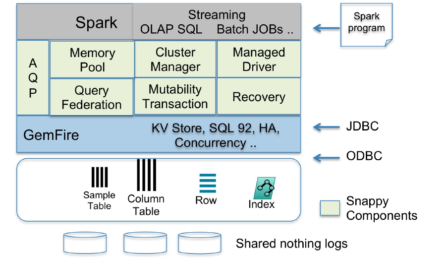
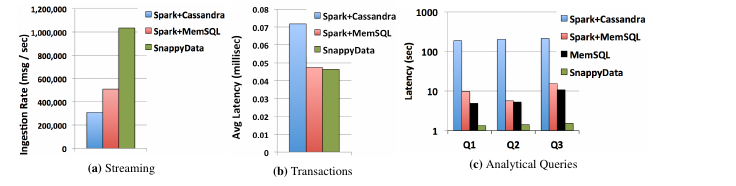
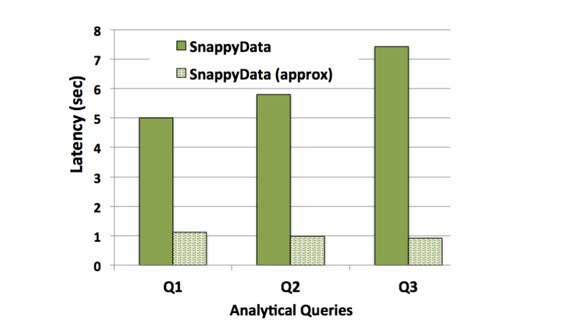

# SnappyData: A Unified Cluster for Streaming, Transactions, and Interactive Analytics（中文译文）

## 译者说明

本文依据同目录的 `source.pdf` 翻译。章节、图表、公式、算法、代码与参考文献按原文结构保留。

作者：Barzan Mozafari（密歇根大学、SnappyData Inc.）、Jags Ramnarayan、Sudhir Menon、Yogesh Mahajan、Soubhik Chakraborty、Hemant Bhanawat、Kishor Bachhav（SnappyData Inc.）。

机构：密歇根大学（美国密歇根州安娜堡）；SnappyData Inc.（美国俄勒冈州波特兰）。

联系邮箱：`mozafari@umich.edu`；`{barzan,jramnarayan,smenon,ymahajan,schakraborty,hbhanawat,kbachhav}@snappydata.io`。

原文依据 Creative Commons Attribution 3.0 许可（<http://creativecommons.org/licenses/by/3.0/>）发表：允许在任何媒介中分发、复制和创作衍生作品，但须注明原作者及 CIDR 2017。会议：第八届两年一度的 Conference on Innovative Data Systems Research（CIDR ’17），2017 年 1 月 8–11 日，美国加利福尼亚州 Chaminade。

## 摘要

许多现代应用都混合了流式、事务型和分析型工作负载。然而，传统数据平台通常只为支持某一种特定工作负载而设计。由于缺少一个能够同时支持这些工作负载的单一平台，用户不得不以定制方式组合彼此差异很大的产品。把异构环境拼接在一起的常见做法显著增加了复杂性和总体拥有成本，也给生产环境带来了大量运维问题。

为支持这一类应用，本文提出 SnappyData。它是第一个能够在单一集成集群中同时提供分析、事务和流处理能力的统一引擎。我们通过谨慎地结合一个大数据计算引擎 Apache Spark 和一个可横向扩展的事务型存储 Apache GemFire 来构建这一混合引擎。本文研究并解决了构建这种混合分布式系统所面临的挑战：系统包含两个设计理念差异显著且存在冲突的组件，一个是为高吞吐分析而设计的、基于 lineage 的计算模型，另一个是为低延迟操作而设计的、基于共识和复制的模型。

## 1. 引言

越来越多的企业应用，尤其是金融交易和物联网（Internet of Things, IoT）领域的应用，会产生同时包含以下三类操作的混合工作负载：1. 连续流处理，2. 在线事务处理（OLTP），3. 在线分析处理（OLAP）。这些应用需要同时消费高速数据流以触发实时告警，将数据写入面向写入优化的事务型存储，并快速执行分析以获得深入洞察。尽管已有大量数据管理方案分别面向其中一项或两项任务，但还没有一种单一方案能够同时胜任三者。

SQL-on-Hadoop 方案，例如 Hive、Impala/Kudu 和 SparkSQL，利用 OLAP 风格的优化和列式格式，在海量静态数据上运行 OLAP 查询。它们适合批处理，但并不适合作为实时操作型数据库：它们缺少以事务一致性修改数据的能力，缺少用于高效点访问的索引，也难以处理高并发和突发工作负载。例如，Wildfire [17] 能够支持分析和流式写入，但缺少 ACID 事务。

混合事务/分析处理（HTAP）系统，例如 MemSQL，通过以双重格式（行格式和列格式）存储数据来同时支持 OLTP 和 OLAP 查询，但它们仍然需要和外部流处理引擎，例如 Storm [34]、Kafka 或 Confluent，一起使用，才能支持流处理。

最后，学术界 [20, 31, 33] 和工业界 [2, 8, 14, 34] 有大量流处理和事件处理方案。虽然一些流处理器提供了某种形式的状态管理或事务，例如 Samza [2]、Liquid [23]、S-Store [27]，但它们通常只允许对流执行简单查询。更复杂的分析，例如把流与大型历史表连接，则需要 OLAP 引擎中使用的同类优化 [18, 26, 33]。例如，IoT 中的数据流会被持续写入，并与大量历史数据做关联。Trill [19] 支持对流和列式数据做多样化分析，但缺少事务。DataFlow [15] 关注逻辑抽象，而不是统一查询引擎。

因此，对混合工作负载的需求催生了若干组合式数据架构，其中最典型的是 lambda 架构。它要求把多个解决方案拼接在一起；这种工作困难、耗时且成本高昂。例如，在资本市场中，一个实时市场监控应用必须以极高速率写入交易流，并检测滥用交易模式，例如内幕交易。这需要通过把数据流与 1. 历史记录、2. 其他数据流、3. 交易日内可能变化的金融参考数据做连接，来关联大规模数据。触发告警后，系统又可能启动额外的分析查询，而这些查询必须同时运行在已写入数据和历史数据上。在这种场景中，交易数据到达消息总线，例如 Tibco、IBM MQ 或 Kafka，由流处理器，例如 Storm，或自研应用处理；状态则写入键值存储，例如 Cassandra，或内存数据网格，例如 GemFire。这些数据还会存入 HDFS，并周期性地使用 SQL-on-Hadoop 或传统 OLAP 引擎分析。

这些异构工作流在实践中非常常见，但存在若干缺点（D1-D4）。

D1. 复杂性和总体拥有成本增加：使用互不兼容且彼此自治的系统会显著提高总体拥有成本。开发者必须掌握多个产品的 API、数据模型和调优选项。进入生产后，运维管理也会变成难题。为了诊断问题根因，高薪专家常常需要花费数小时去关联不同产品的错误日志。

D2. 性能更低：执行分析需要在多个非共址集群之间移动数据，导致多次网络跳转和多份数据副本。当遇到不兼容的数据模型时，还可能需要转换数据，例如把 Cassandra 的 ColumnFamily 转成 Storm 的领域对象。

D3. 资源浪费：在不同产品之间复制数据会浪费网络带宽，因为数据 shuffle 增加，同时也浪费 CPU 周期和内存。

D4. 一致性挑战：缺少单一数据治理模型会让一致性语义更难推理。例如，Spark Streaming 中基于 lineage 的恢复可能会从上一个检查点重放数据，并将其写入外部事务型存储。由于这两个系统之间没有共同的 lineage 知识，也没有分布式事务，确保 exactly-once 语义常常只能留给应用自己处理 [4]。

我们的目标：我们希望在单一集群中提供流处理、事务处理和交互式分析能力，相比当前方案具有更高性能、更少资源消耗和更低复杂性。

挑战：实现这一目标需要克服显著挑战。第一个挑战是，不同类型工作负载的最佳数据结构和查询处理范式差异巨大。例如，列存适合分析，事务需要写优化的行存，而无限流最适合用 sketch 和窗口化数据结构处理。同样，分析受益于批处理，事务依赖点查找和点更新，流处理引擎使用差分/增量查询处理。把这些彼此冲突的机制结合到一个系统中很困难；同时，还要把这种异构性从程序员面前隐藏起来。

另一个挑战是，不同工作负载对高可用（high availability, HA）的期望不同。在流任务、长时间运行的分析任务和短生命周期事务混合存在时，调度和资源供给也更困难。最后，当洞察需要把数据流与海量历史数据连接时，实现交互式分析也不再简单 [7]。

我们的方法：我们的方法是把 Apache Spark 作为计算引擎，与 Apache GemFire 作为内存事务型存储进行无缝集成。通过利用这两个开源框架的互补功能，并仔细处理它们差异显著的设计理念，SnappyData 成为第一个能够支持三类工作负载的统一、可横向扩展的数据库集群。SnappyData 还依赖一种新的概率化方案，在面对高速数据流和海量已存储数据时保证交互式分析能力。

贡献：本文做出以下贡献。

1. 我们讨论如何结合两类设计理念完全不同的分布式系统：面向高吞吐分析的 lineage 系统 Spark，以及面向低延迟操作的、由共识驱动的复制系统 GemFire（第 2 节）。
2. 我们提出第一个在单一集群中支持流处理、事务和分析的统一引擎。为克服上述挑战，系统提供统一 API（第 4 节）、使用混合存储引擎、在应用之间共享状态以减少序列化（第 5 节）、通过低延迟故障检测和把应用与数据服务器解耦来提供高可用（第 6.1 节）、绕过调度器以交错执行细粒度和长时间运行的任务（第 6.2 节），并保证事务一致性（第 6.3 节）。
3. 使用混合基准测试，我们展示 SnappyData 相比当前最先进方案可以提供 1.5-2 倍吞吐提升和 7-142 倍加速（第 7 节）。

## 2. 概览

### 2.1 方法概览

为支持混合工作负载，SnappyData 谨慎地把 Apache Spark 作为计算引擎，与 Apache GemFire 作为事务型存储融合在一起。

Spark 通过一组共同抽象，使程序员能够处理不同范式的汇合，例如流处理、机器学习和 SQL 分析。Spark 的核心抽象是弹性分布式数据集（Resilient Distributed Dataset, RDD）。RDD 通过高效保存所有转换的 lineage，而不是保存数据本身，来提供容错。数据被划分到各节点；如果某个分区丢失，可以利用 lineage 重新构造。该方法有两个好处：避免网络复制，并通过以批为单位处理数据来提高吞吐。虽然这种方法提供了效率和容错，但它也要求 RDD 不可变。换言之，Spark 本质上被设计成一个计算框架，因此 1. 没有自己的存储引擎，2. 不支持可变性语义。[^1]

另一方面，Apache GemFire [1]（也称 Geode）是工业界最广泛采用的内存数据网格之一。[^2] 它在分区化、面向行的存储中管理记录，并使用同步复制。它通过集成动态组成员服务和分布式事务服务来保证一致性。GemFire 支持索引以及细粒度和批量数据更新。更新可以可靠入队，并异步写回外部数据库。内存数据也可以利用仅追加日志持久化到磁盘，并通过离线压缩实现快速磁盘写入 [1]。

两者之长：为了结合两个世界的优点，SnappyData 无缝集成 Spark 和 GemFire 的运行时，采用 Spark 作为编程模型，并通过 GemFire 的复制和细粒度更新能力扩展 Spark，以支持可变性和高可用。这样的结合带来了若干非平凡挑战。

### 2.2 结合 Spark 与 GemFire 的挑战

每个 Spark 应用都作为一组独立进程，即 executor JVM，在集群上运行。不可变数据可以在单个应用内的这些 JVM 中缓存和复用，但跨应用共享数据需要外部存储层，例如 HDFS。相比之下，SnappyData 的目标是实现一种“始终在线”的操作型设计：客户端可以随时连接，并在任意数量的并发连接之间共享数据。因此，第一个挑战是改变 Spark executor 的生命周期，使其 JVM 长期存在，并与单个应用解耦。这很困难，因为 Spark 会按需使用 Mesos 或 YARN 启动 executor，并只为当前作业分配足够资源；而我们需要采用静态资源分配策略，使同一批资源能够被多个应用并发复用。此外，Spark 假设所有作业都是 CPU 密集型且以批或微批为单位，而在混合工作负载中，我们并不知道一个操作是长时间运行且 CPU 密集的作业，还是低延迟数据访问。

第二个挑战是，在 Spark 中，单个 driver 会编排 executor 上完成的所有工作。鉴于混合工作负载需要高并发，该 driver 会带来 1. 单点争用，2. 高可用障碍。如果 driver 失败，executor 会被关闭，所有缓存状态都必须重新加载。

由于 Spark 面向批处理，使用基于 block 的内存管理器，并且不需要在这些 block 上使用同步原语。相比之下，GemFire 面向细粒度、高并发和可变操作，因此使用多种并发数据结构，例如分布式 hashmap、treemap 索引，以及用于悲观事务的分布式锁。SnappyData 因此需要 1. 扩展 Spark，使其能够在这些复杂结构上执行任意点查找、更新和插入，2. 扩展 GemFire 的分布式锁服务，使其支持从 Spark 内部修改这些结构。

Spark RDD 是不可变的，而 GemFire 表是可变的。因此，将 GemFire 表作为 RDD 访问的 Spark 应用可能出现非确定性行为。一个朴素方案是在 RDD 被惰性物化时创建副本，但这代价过高，并且违背了在 Spark executor 中管理本地状态的目的。

最后，Spark 不断增长的社区不能接受不兼容的 fork。这意味着，为了留住 Spark 用户，SnappyData 不能改变现有 API 的 Spark 语义或执行模型；SnappyData 中的所有变化都必须是扩展。

## 3. 架构

图 1 展示了 SnappyData 的核心组件，图中高亮了来自 Spark 和 GemFire 的原始组件。



**图 1：SnappyData 的核心组件。**

SnappyData 的混合存储层主要位于内存中，可以用行存、列存或概率化存储来管理数据。SnappyData 的列格式来源于 Spark 的 RDD 实现。SnappyData 的行式表扩展了 GemFire 的表，因此支持索引，以及基于索引键的快速读写（第 5.1 节）。除了这些“精确”存储，SnappyData 还可以把数据摘要为概率数据结构，例如分层样本和其他形式的概要结构。SnappyData 的查询引擎内建支持近似查询处理（approximate query processing, AQP），可以利用这些概率结构。这允许应用在流或海量数据集上用精度换取交互式速度（第 5.2 节）。

SnappyData 支持两种编程模型：SQL（通过扩展 SparkSQL 方言）和 Spark API。因此，可以把 SnappyData 看作一个使用 Spark API 作为存储过程语言的 SQL 数据库。SnappyData 中的流处理主要通过 Spark Streaming 实现，但经过修改后可以与 SnappyData 的存储原位运行（第 4 节）。

SQL 查询会在 Spark 的 Catalyst 和 GemFire 的 OLTP 引擎之间联合执行。初始查询计划决定一个查询是低延迟操作，例如基于键的查找，还是高延迟操作，例如扫描或聚合。SnappyData 通过立即把 OLTP 操作路由到合适的数据分区，避免它们承担调度开销（第 6.2 节）。

为了支持副本一致性、快速点更新以及对集群故障条件的即时检测，SnappyData 依赖 GemFire 的 P2P 集群成员服务 [1]。事务使用两阶段提交协议，并通过 GemFire 的 Paxos 实现来保证整个集群中的共识和视图一致性。

## 4. 统一 API

Spark 提供了丰富的过程式 API，用于查询和转换不同数据格式，例如 JSON、Java 对象和 CSV。为了保持一致的编程风格，SnappyData 也把可变性功能作为 SparkSQL 方言和 DataFrame API 的扩展来提供。这些扩展保持向后兼容；也就是说，不使用这些扩展的应用会观察到 Spark 原有语义。

Spark 中的 DataFrame 是按命名列组织的分布式数据集合。DataFrame 可以从 SQLContext 访问，而 SQLContext 本身来自 SparkContext；SparkContext 是到 Spark 集群的连接。类似地，SnappyData 的大部分 API 都通过 SnappyContext 提供，它是 SQLContext 的扩展。清单 1 展示了 SnappyContext 的使用示例。

```scala
// Create a SnappyContext from a SparkContext
val spContext = new org.apache.spark.SparkContext(conf)
val snpContext = org.apache.spark.sql.SnappyContext(spContext)

// Create a column table using SQL
snpContext.sql("CREATE TABLE MyTable (id int, data string) using column")

// Append contents of a DataFrame into the table
someDataDF.write.insertInto("MyTable");

// Access the table as a DataFrame
val myDataFrame: DataFrame = snpContext.table("MyTable")
println(s"Number of rows in MyTable = ${myDataFrame.count()}")
```

**清单 1：在 SnappyData 中使用 DataFrame。**

流处理通常涉及维护计数器或更复杂的多维摘要。因此，今天的流处理器要么与可横向扩展的内存键值存储一起使用，例如 Storm 搭配 Redis 或 Cassandra；要么提供自己的基础状态管理形式，例如 Samza、Liquid [23]。这些模式常常在应用代码中用简单的 get/put API 实现。虽然这些方案可扩展性很好，但我们发现用户经常会修改搜索模式和触发规则。这些修改需要昂贵的代码变更，并导致应用脆弱且难以维护。

相比之下，基于 SQL 的流处理器为处理流提供了更高层抽象，但主要依赖行式存储，例如 [5, 8, 27]，因此在支持复杂分析方面受限。为了支持带扫描、聚合、top-K 查询，以及与历史数据和参考数据连接的连续查询，流处理引擎必须纳入 OLAP 引擎中的部分相同优化 [26]。因此，SnappyData 扩展 Spark Streaming，使其能够用 SQL 声明和查询流。更重要的是，SnappyData 提供 OLAP 风格的优化来支持可扩展的流分析，包括列式格式、近似查询处理和共分区 [9]。

## 5. 混合存储

### 5.1 行式表和列式表

表可以被分区或复制，并且主要在内存中管理，同时维护一个或多个一致副本。数据可以放在 Java 堆内存中，也可以放在堆外内存中。分区表总是跨集群水平分区。对于大型集群，我们允许数据服务器属于一个或多个称为 server group 的逻辑组。存储格式可以是行格式（支持分区表或复制表）或列格式（只支持分区表）。行式表内存占用更高，但非常适合随机更新和点查找，尤其是在有内存索引时。列式表以连续 block 管理列数据，并使用字典编码、游程编码或位编码压缩 [36]。清单 2 展示了 SnappyData 对 `CREATE TABLE` 语句中 `USING` 和 `OPTIONS` 子句的一些语法扩展。

```sql
CREATE [Temporary] TABLE [IF NOT EXISTS] table_name (
  <column definition>
)
USING [ROW | COLUMN]
-- Should it be row or column oriented?
OPTIONS (
  PARTITION_BY 'PRIMARY KEY | column(s)',
  -- Partitioning on primary key or one or more columns
  -- Will be a replicated table by default
  COLOCATE_WITH 'parent_table',
  -- Colocate related records in the same partition?
  REDUNDANCY '1',
  -- How many memory copies?
  PERSISTENT [Optional disk store name]
  -- Should this persist to disk too?
  OFFHEAP "true | false",
  -- Store in off-heap memory?
  EVICTION_BY "MEMSIZE 200 | HEAPPERCENT"
  -- Heap eviction based on size or occupancy ratio?
  ...
)
```

**清单 2：SnappyData 中的 Create Table DDL。**

我们扩展了 Spark 的列存，以支持可变性。更新行式表很直接。当记录写入列式表时，它们首先到达一个 delta row buffer，该缓冲区能够支持高写入速率，随后再老化为列式形式。delta row buffer 实际上是一个分区行式表，使用与其基础列式表相同的分区策略。这个缓冲表由一个合并队列支撑，该队列会周期性地把自身作为新批次清空到列式表中。这里的合并指，对同一记录的连续更新只会把最终状态转移到列存。例如，随后被删除的插入或更新记录会从队列中移除。delta row buffer 本身使用写时复制语义，以确保并发应用更新不会导致不一致 [10]。SnappyData 扩展 Spark 的 Catalyst 优化器，在查询执行期间合并 delta row buffer。

### 5.2 概率化存储

在流上运行复杂分析时，实现交互式响应时间很有挑战，例如把一个流与大表连接 [30]。即使是在已存储数据集上运行 OLAP 查询，如果需要分布式 shuffle，或者集群中有数百个并发查询，查询也可能需要数十秒才能完成 [13]。在这类情况下，SnappyData 的存储引擎能够使用概率结构显著减少输入数据量，并给出近似但极快的答案。SnappyData 的概率结构包括均匀样本、分层样本和 sketch [22]。与已有 AQP 引擎 [40] 相比，SnappyData 方法的新颖之处在于它如何高效且分布式地创建和维护这些结构。给定这些结构后，SnappyData 使用现成的误差估计技术 [11, 41]。因此，本文只讨论 SnappyData 的样本选择和维护策略。

样本选择：与均匀样本不同，选择要构建哪些分层样本并不是一个简单问题。关键问题是应该在哪些列集合上构建分层样本。已有工作使用偏斜度、流行度和存储成本作为选择列集合的标准 [12, 13]。SnappyData 对这些标准做了如下扩展：对于任意声明的连接或外键连接，连接键至少会被包含在一个参与关系（表或流）的分层样本中。但是，SnappyData 从不把表的主键包含进它的分层样本。此外，我们提供了开源工具 WorkloadMiner，它会自动分析历史查询日志并报告丰富的统计信息 [3]。这些统计信息会指导 SnappyData 用户完成样本选择过程。WorkloadMiner 已集成到 CliffGuard。CliffGuard 保证得到鲁棒的物理设计，例如样本集合，即使未来查询偏离过去查询，该设计仍然保持最优 [28]。

一旦选定一组样本，挑战就在于如何更新它们。这是 SnappyData 和之前使用分层样本的 AQP 系统之间的关键差异 [12, 21, 39]。

样本维护：已有使用离线抽样的 AQP 引擎会周期性地通过一次完整数据扫描来更新和维护样本 [29]。对于包含流和可变表的 SnappyData，这一策略有两个原因不适用。第一，在集群中不同节点之间维护每个 stratum 的统计信息是一个复杂过程。第二，以流式方式更新样本需要维护 reservoir [16, 35]，这意味着样本要么必须放入内存，要么要被逐出到磁盘。对于无限流，除非持续降低抽样率，否则把样本完全保存在内存中并不现实。同样，基于磁盘的 reservoir 效率也很低，因为当新元组被采样时，需要从磁盘检索并删除单个元组。

为解决这些问题，SnappyData 总是在每个分层样本中把时间戳作为一个额外列。均匀样本被视作一个特殊情况，其中只有一个分层列，即时间戳。当新元组到达流中时，系统会为分层列的每个观测值创建一个新的批次（行格式），以维护其样本。每当批大小超过某个阈值（默认 100 万元组）时，该批次会被逐出并以列式格式归档到磁盘，同时为该 stratum 启动新批次。

把每个微批视作一个独立分层样本有若干好处。首先，这允许 SnappyData 对每个微批自适应地调整抽样率，而不需要集群中的节点间通信。第二，一旦一个微批完成，它的元组就不再需要被移除或替换，因此可以安全地以压缩列式格式存储，甚至归档到磁盘。只有最新的微批需要在内存中并采用行格式。最后，每个微批都可以路由到单个节点，从而减少网络 shuffle 的需要。

### 5.3 状态共享

SnappyData 把 GemFire 表托管在 executor 节点中，表可以是分区表或复制表。对于分区表，单个 bucket 会被表示成 Spark RDD 分区，因此它们的访问是并行化的。这类似于 Spark 访问任意外部数据源的方式，只是 SnappyData 优化了常见算子。例如，通过让每个分区保持列式格式，SnappyData 避免了额外复制和序列化，加速扫描和聚合算子。SnappyData 还可以通过向 Spark 暴露适当的 partitioner 来共址表（见清单 2）。

原生 Spark 应用可以把任意 DataFrame 注册为临时表。除了对 Spark 应用可见，这类表也会注册到 SnappyData 的 catalog 中。catalog 是一个共享服务，使表在 Spark 和 GemFire 之间可见。这允许通过 ODBC/JDBC 连接的远程客户端在 Spark 临时表以及 GemFire 表上运行 SQL 查询。

在流场景中，数据可以从父 stream RDD（DStream）写入任意表，而这些 DStream 自身可以从外部队列，例如 Kafka，获取事件。为了最小化 shuffle，SnappyData 表可以保留其父 RDD 使用的分区方案。例如，监听 Telco CDR（call detail record，通话详单）的 Kafka 队列可以按照 `subscriberID` 分区，使 Spark DStream 和写入这些记录的 SnappyData 表都按照相同键分区。

### 5.4 感知局部性的分区设计

在水平分区的分布式数据库中，一个主要挑战是限制参与节点数量，从而最小化 1. 查询执行期间的 shuffle，2. 分布式锁 [25, 38]。除了网络成本之外，shuffle 还会产生大量内核态与用户态之间的拷贝以及序列化成本，从而造成 CPU 瓶颈 [32]。为减少 shuffle 和分布式锁的需要，我们的数据模型提倡两个基本思想：

1. 基于共享键的共分区：数据放置中的常见技术是考虑应用访问模式。SnappyData 采用类似策略：由于连接需要共享键，我们按连接键对相关表做共分区。SnappyData 的查询引擎随后可以通过本地化连接和裁剪不必要分区来优化查询执行。
2. 通过复制获得局部性：星型模式非常常见，其中少数不断增长的事实表与多个维度表关联。由于维度表相对较小并且变化较少，模式设计者可以要求 SnappyData 复制这些表。SnappyData 特别利用这些复制表来优化连接。

## 6. 混合集群管理器

Spark 应用作为集群中的独立进程运行，由应用的主程序，即 driver program 协调。Spark 应用连接到集群管理器（YARN 或 Mesos）以获取 executor 节点。虽然 Spark 的方法适合长时间运行的任务，但作为操作型数据库，SnappyData 的集群管理器必须满足额外需求，例如高并发、高可用和一致性。

### 6.1 高可用

为确保高可用，SnappyData 需要检测故障并能立即从故障中恢复。

故障检测：Spark 使用与中心 master 进程的心跳通信来决定 worker 的命运。由于 Spark 不使用基于共识的故障检测机制，它存在因 master 故障而关闭整个集群的风险。然而，作为始终在线的操作型数据库，SnappyData 需要更快且更可靠地检测故障。为了更快检测，SnappyData 在正常数据通信期间依赖 UDP 邻居 ping 和 TCP ack timeout。为了建立新的、一致的集群成员视图，SnappyData 依赖 GemFire 的加权 quorum 故障检测算法 [1]。一旦 GemFire 确认某个成员确实失败，它会确保一致的集群视图被应用到所有成员，包括 Spark master、driver 和数据节点。

故障恢复：Spark 中的恢复基于记录构建 RDD 所用的转换，也就是 lineage，而不是实际数据。如果 RDD 的某个分区丢失，Spark 有足够信息只重新计算该分区 [37]。Spark 也可以把 RDD checkpoint 到稳定存储，以缩短 lineage，从而缩短恢复时间。不过，何时 checkpoint 的决策留给用户。另一方面，GemFire 依靠复制实现即时恢复，但代价是吞吐较低。SnappyData 按如下方式合并这些恢复机制：

1. 事务发出的细粒度更新完全避免使用 Spark lineage，而使用 GemFire 的急切复制来快速恢复。
2. 批处理和流式微批操作仍由 RDD lineage 恢复，但 SnappyData 不把 checkpoint 写入 HDFS，而是写入 GemFire 的内存存储；GemFire 本身依赖快速 P2P 复制来恢复。此外，SnappyData 对存储层负载、数据大小以及重新计算丢失分区的成本有深入了解，因此能够基于应用对恢复时间的容忍度，自动选择 checkpoint 间隔。

### 6.2 混合调度与资源供给

数千个并发客户端可以同时连接到一个 SnappyData 集群。为支持这种并发度，SnappyData 将到达请求分类为低延迟操作和高延迟操作。默认情况下，除非一个作业访问列式表，否则 SnappyData 都把它视作低延迟操作。不过，应用也可以显式标注自己的延迟敏感性。SnappyData 允许低延迟操作绕过 Spark 调度器，直接在数据上操作。高延迟操作则通过 Spark 的公平调度器执行。对于低延迟操作，SnappyData 尝试复用它们的 executor，以最大化数据局部性（进程内访问）。对于高延迟作业，SnappyData 会动态扩展其计算资源，同时保留缓存其数据的节点。

### 6.3 一致性模型

SnappyData 依赖 GemFire 提供一致性模型。GemFire 使用 Paxos 算法 [24] 的一个变体支持 `read committed` 和 `repeatable read` 事务隔离级别。事务检测写-写冲突，并假设写者很少冲突。当无法获得写锁时，事务会中止而不是阻塞 [1]。

SnappyData 扩展 Spark 的 SparkContext 和 SQLContext，以加入可变性语义。SnappyData 为每个 SQL 连接提供自己的 Spark SQLContext，使应用能够开始、提交和中止事务。

Spark 程序获得的任何 RDD 都会观察到数据库的一致视图；但当事务交错执行时，多个程序可能观察到不同视图。可以使用基于 GemFire 内部行版本的 MVCC 机制，为整个应用提供单一快照视图。

在流应用中，当发生故障时，Spark 会从 lineage 恢复丢失的 RDD。这意味着某个数据子集会被重放。为应对此类情况，SnappyData 在存储层确保 exactly-once 语义，使多次写入尝试具有幂等性，从而免除开发者在自己应用中保证这一点的负担。SnappyData 通过把整个流程作为单个事务工作单元来实现这一目标：只有当微批被完全消费且应用状态被成功更新后，源，例如 Kafka 队列，才会被确认。这保证了不完整事务能够自动回滚。

## 7. 实验

SnappyData 的主要优势是通过用一个面向流处理、OLTP 和 OLAP 工作负载的集成方案替换彼此割裂的环境，从而降低总体拥有成本（TCO）。由于降低运维成本和提升易用性的长期价值难以量化，本文回答一个相关问题：与把 OLAP、OLTP 和流处理的异构专用系统拼接起来的现有方案相比，SnappyData 的性能如何？

总的来说，与当前最先进方案的比较表明，在混合工作负载下，SnappyData 1. 写入数据流比 Spark+Cassandra 快 3.3 倍、比 Spark+MemSQL 快 2 倍，2. 执行事务比 Spark+Cassandra 快 1.5 倍，并略快于 Spark+MemSQL，3. 执行分析查询分别比 Spark+Cassandra 和 Spark+MemSQL 快 142 倍和 7 倍。此外，当可以容忍小误差时，SnappyData 的概率结构可以为分析查询额外提供一个数量级的加速。[^results]

工作负载：由于现有基准只包含一种或两种工作负载，我们在一个受真实广告分析启发的混合工作负载上展示结果。[^3] 该工作负载由一个广告网络组成，其中三个组件并发运行：

- 流式组件。展示日志持续到达消息总线。广告服务器按发布者和地理区域聚合这些日志，计算平均出价、展示次数和唯一用户数，每隔几秒持续写入分区存储。
- 事务组件。随着新展示日志到达，相应 profile 会以事务方式更新。
- 分析组件。在全部数据（历史和当前数据）上执行三类分析查询：Q1. 每个地理区域中获得最多展示次数的前 20 个广告；Q2. 每个地理区域中获得最高出价金额的前 20 个广告；Q3. 总体获得最高出价金额的前 20 个发布者。

基线：我们将 SnappyData 与两个流行的 Lambda 栈比较：Spark+Cassandra 和 Spark+MemSQL，其中变更分别由 Cassandra（最先进的键值存储）或 MemSQL（最先进的 HTAP 数据库）处理。在这两种方案中，数据集存储在 Cassandra 或 MemSQL 中，并以 RDD 形式暴露给 Spark。对于分析查询，Spark-Cassandra connector 获取 Cassandra 中所需数据（在下推过滤器之后），并在 Spark 内运行查询。Spark-MemSQL connector 则激进得多，会把分析查询整体发送到 MemSQL 执行。两个 connector 都提供从 Spark context 做流式写入和数据更新的 API。因此，实际变更，即事务，在 Cassandra 和 MemSQL 内部处理。

实验设置：我们使用 5 台 c4.2xlarge EC2 实例，每台包含 8 个核心、15GB RAM，以及 1000 Mbps 的专用 EBS 带宽。软件版本包括 Kafka 2.10_0.8.2.2、Spark 2.0.0、Cassandra 3.9、MemSQL Ops-5.5.10 Community Edition 和 SnappyData 0.6.1（测试时可用的最新 GA 版本）。我们还使用 Spark-MemSQL Connector 2.10_1.3.3 和 Spark-Cassandra connector 2.0.0_M3。一台机器作为 Spark Master 和 OLAP coordinator，其他四台为 worker。一个 Kafka producer 进程用 16 个线程异步生成广告展示记录，四个 Kafka broker 共址在 worker 节点上。输入数据由 Spark Streaming 以微批处理，随后写入本地存储。我们使用 8 个 Kafka 分区。Kafka producer 使用 Avro Java 对象表示展示记录。每条展示记录序列化后为 64 字节。只要存储支持，我们就使用列式格式以加快扫描和聚合。

结果：如图 2a 所示，SnappyData 的数据写入速度比 Spark+Cassandra 快 2 倍，比 Spark+MemSQL 快 1.5 倍。在数据写入期间，三个系统都以事务方式更新其状态。然而，如图 2b 所示，Spark+Cassandra 的事务延迟平均更高（约 0.07 毫秒），高于 Spark+MemSQL 和 SnappyData（两者约 0.04 毫秒）。

写入 3 亿条记录后，我们在每个系统中执行分析查询 Q1-Q3。如图 2c 所示，SnappyData 显著优于两个对比方案。SnappyData 执行这些查询平均比 Spark+Cassandra 快 142 倍，比 Spark+MemSQL 快 7 倍。为了确定 MemSQL 较低性能中有多少来自 Spark connector 的低效，我们还通过 MemSQL 自己的 SQL shell 直接运行相同查询。如图 2c 所示，MemSQL 直接执行的性能优于 Spark+MemSQL，但仍比 SnappyData 慢约 5 倍。

分析：Spark+Cassandra connector 给查询处理增加了显著开销。这是因为数据必须被序列化并复制到 Spark 集群，转换成新格式，并跨多个分区 shuffle。

Spark+MemSQL connector 则尝试把尽可能多的查询处理下推到 MemSQL。这显著减少了进入 Spark 的数据移动。该 connector 还尝试让自身分区与 Kafka 分区共址，使排队和写入可以不 shuffle 任何记录。这解释了 Spark+MemSQL 相比 Spark+Cassandra 更好的写入速率。

SnappyData 将其列存嵌入 Spark executor 旁边，以按引用方式访问行，而不是按拷贝方式访问。SnappyData 还确保存储层中的每个分区使用其父对象的分区方法。因此，每次更新都成为本地写入，也就是没有 shuffle。查询时，SnappyData 的数据经过列式压缩，并且格式与 Spark 相同，因此延迟显著更低。

概率查询性能：在写入 20 亿条广告展示记录后，我们研究了 SnappyData 在“近似”模式下的性能，误差容忍度为 0.05。如图 3 所示，概率化存储使分析查询又获得接近 7 倍的额外加速。



**图 2：在包含流式写入、事务和分析查询的混合工作负载下，各种方案的性能。**



**图 3：SnappyData 中使用和不使用近似时的交互式分析。**

## 8. 结论

本文提出了一个用于实时操作型分析的统一平台 SnappyData，在单一集成方案中支持 OLTP、OLAP 和流分析。我们的方法是把高吞吐分析计算引擎 Spark 与可横向扩展的内存事务型存储 GemFire 深度集成。SnappyData 用可变性语义扩展 SparkSQL 和 Spark Streaming API，并提供多种优化，以支持对流和已存储数据集做共址处理。我们还论证了把近似查询处理集成到该平台中的必要性，以便在大规模已存储或流式数据上实现实时操作型分析。因此，我们认为，与必须分别管理、部署和监控的多个割裂产品相比，该平台能显著降低混合工作负载的总体拥有成本。

## 9. 致谢

第一作者感谢 NSF 对 IIS-1553169、CNS-1544844 和 CCF-1629397 项目的资助。

## 参考文献

- [1] Apache Geode. http://geode.incubator.apache.org/.
- [2] Apache Samza. http://samza.apache.org/.
- [3] CliffGuard: A General Framework for Robust and Efficient Database Optimization. http://www.cliffguard.org.
- [4] Exactly-once processing with trident - the fake truth. https://www.alooma.com/blog/trident-exactly-once.
- [5] IBM InfoSphere BigInsights. http://tinyurl.com/ouphdss.
- [6] Indexedrdd for apache spark. https://github.com/amplab/spark-indexedrdd.
- [7] Makin' Bacon and the Three Main Classes of IoT Analytics. http://tinyurl.com/zlc6den.
- [8] TIBCO StreamBase. http://www.streambase.com/.
- [9] Snappydata: Streaming, transactions, and interactive analytics in a unified engine. http://web.eecs.umich.edu/mozafari/php/data/uploads/snappy.pdf, 2016.
- [10] D. Abadi et al. The Design and Implementation of Modern Column-Oriented Database Systems. 2013.
- [11] S. Agarwal, H. Milner, A. Kleiner, A. Talwalkar, M. Jordan, S. Madden, B. Mozafari, and I. Stoica. Knowing when you're wrong: Building fast and reliable approximate query processing systems. In SIGMOD, 2014.
- [12] S. Agarwal, B. Mozafari, A. Panda, H. Milner, S. Madden, and I. Stoica. BlinkDB: queries with bounded errors and bounded response times on very large data. In EuroSys, 2013.
- [13] S. Agarwal, A. Panda, B. Mozafari, A. P. Iyer, S. Madden, and I. Stoica. Blink and it's done: Interactive queries on very large data. PVLDB, 2012.
- [14] T. Akidau et al. MillWheel: fault-tolerant stream processing at internet scale. PVLDB, 2013.
- [15] T. Akidau et al. The dataflow model: A practical approach to balancing correctness, latency, and cost in massive-scale, unbounded, out-of-order data processing. PVLDB, 2015.
- [16] M. Al-Kateb and B. S. Lee. Stratified Reservoir Sampling over Heterogeneous Data Streams. In SSDBM, 2010.
- [17] R. Barber, M. Huras, G. Lohman, C. Mohan, R. Mueller, F. Özcan, H. Pirahesh, V. Raman, R. Sidle, O. Sidorkin, et al. Wildfire: Concurrent blazing data ingest and analytics. In SIGMOD, 2016.
- [18] L. Braun et al. Analytics in motion: High performance event-processing and real-time analytics in the same database. In SIGMOD, 2015.
- [19] B. Chandramouli et al. Trill: A high-performance incremental query processor for diverse analytics. PVLDB, 2014.
- [20] S. Chandrasekaran et al. TelegraphCQ: continuous dataflow processing. In SIGMOD, 2003.
- [21] S. Chaudhuri, G. Das, and V. Narasayya. Optimized stratified sampling for approximate query processing. TODS, 2007.
- [22] G. Cormode, M. Garofalakis, P. J. Haas, and C. Jermaine. Synopses for massive data: Samples, histograms, wavelets, sketches. Foundations and Trends in Databases, 4, 2012.
- [23] R. C. Fernandez et al. Liquid: Unifying nearline and offline big data integration. In CIDR, 2015.
- [24] J. Gray and L. Lamport. Consensus on transaction commit. TODS, 31(1), 2006.
- [25] P. Helland. Life beyond distributed transactions: an apostate's opinion. In CIDR, 2007.
- [26] E. Liarou et al. Monetdb/datacell: online analytics in a streaming column-store. PVLDB, 2012.
- [27] J. Meehan et al. S-store: streaming meets transaction processing. PVLDB, 2015.
- [28] B. Mozafari, E. Z. Y. Goh, and D. Y. Yoon. CliffGuard: A principled framework for finding robust database designs. In SIGMOD, 2015.
- [29] B. Mozafari and N. Niu. A handbook for building an approximate query engine. IEEE Data Eng. Bull., 2015.
- [30] B. Mozafari and C. Zaniolo. Optimal load shedding with aggregates and mining queries. In ICDE, 2010.
- [31] B. Mozafari, K. Zeng, and C. Zaniolo. High-performance complex event processing over xml streams. In SIGMOD, 2012.
- [32] K. Ousterhout et al. Making sense of performance in data analytics frameworks. In NSDI, 2015.
- [33] H. Thakkar, N. Laptev, H. Mousavi, B. Mozafari, V. Russo, and C. Zaniolo. SMM: A data stream management system for knowledge discovery. In ICDE, 2011.
- [34] A. Toshniwal, S. Taneja, A. Shukla, K. Ramasamy, J. M. Patel, S. Kulkarni, J. Jackson, K. Gade, M. Fu, J. Donham, N. Bhagat, S. Mittal, and D. Ryaboy. Storm@twitter. In SIGMOD, 2014.
- [35] J. S. Vitter. Random sampling with a reservoir. ACM Transactions on Mathematical Software (TOMS), 11, 1985.
- [36] R. Xin and J. Rosen. Project Tungsten: Bringing Spark closer to bare metal. http://tinyurl.com/mzw7hew.
- [37] M. Zaharia, M. Chowdhury, T. Das, A. Dave, J. Ma, M. McCauley, M. J. Franklin, S. Shenker, and I. Stoica. Resilient distributed datasets: A fault-tolerant abstraction for in-memory cluster computing. In NSDI, 2012.
- [38] E. Zamanian, C. Binnig, and A. Salama. Locality-aware partitioning in parallel database systems. In SIGMOD, 2015.
- [39] K. Zeng, S. Agarwal, A. Dave, M. Armbrust, and I. Stoica. G-OLA: Generalized on-line aggregation for interactive analysis on big data. In SIGMOD, 2015.
- [40] K. Zeng, S. Gao, J. Gu, B. Mozafari, and C. Zaniolo. Abs: a system for scalable approximate queries with accuracy guarantees. In SIGMOD, 2014.
- [41] K. Zeng, S. Gao, B. Mozafari, and C. Zaniolo. The analytical bootstrap: a new method for fast error estimation in approximate query processing. In SIGMOD, 2014.

[^1]: 虽然 IndexedRDD [6] 提供可更新的键值存储，但它不支持高吞吐写入所需的共址或分布式事务；它依赖基于磁盘的 checkpoint 来容错，因此也不适合高可用场景。
[^2]: 原文注明，GemFire 被主要航空公司、旅游门户和保险公司采用，华尔街十大投资银行中有九家使用 GemFire [1]。
[^3]: 使用 TPC-H、YCSB 等传统基准的比较见文献 [9]。
[^results]: 原文的实验摘要称流式写入相对 Spark+Cassandra 和 Spark+MemSQL 分别快 3.3 倍和 2 倍，图 2(a) 也支持这一组数值；同节后面的 Results 段却写为 2 倍和 1.5 倍。译文分别保留两处原值，不静默统一。
