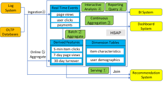
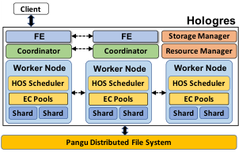
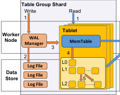
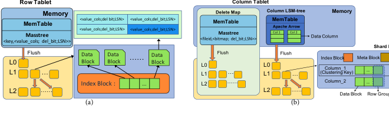
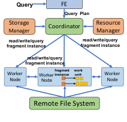
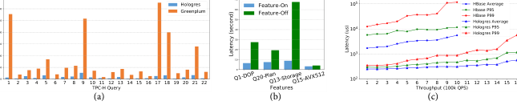
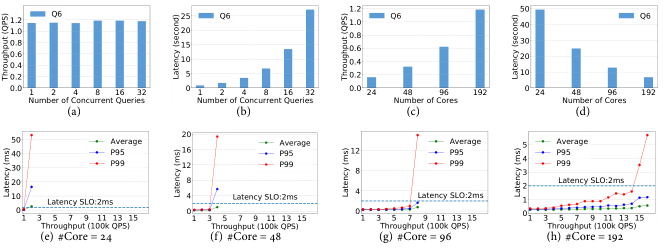
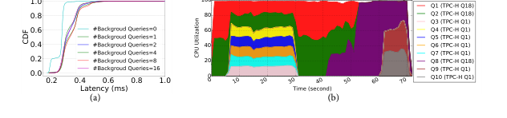
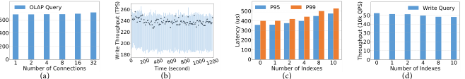

# Alibaba Hologres: A Cloud-Native Service for Hybrid Serving/Analytical Processing（中文译文）

## 译者说明

本文依据同目录的 `source.pdf` 翻译。章节、图表、公式、算法、代码与参考文献按原文结构保留。

Xiaowei Jiang, Yuejun Hu, Yu Xiang, Guangran Jiang, Xiaojun Jin, Chen Xia, Weihua Jiang, Jun Yu, Haitao Wang, Yuan Jiang, Jihong Ma, Li Su, Kai Zeng

Alibaba Group

## 摘要

在现有大数据栈中，分析处理（analytical processing）和知识服务（knowledge serving）通常被拆分在不同系统中。在阿里巴巴，我们观察到一种新趋势：这两个过程正在融合。知识服务会产生新数据，而这些数据又被送入分析处理过程，进一步微调服务过程使用的知识库。把这种融合处理范式拆到不同系统中，会带来额外数据复制、应用开发差异和昂贵系统维护等开销。

本文提出 Hologres，它是面向混合服务和分析处理（Hybrid Serving and Analytical Processing, HSAP）的云原生服务。Hologres 解耦计算层和存储层，使每一层都能灵活扩展。表被划分为自管理 shards，每个 shard 独立并发处理读写请求。Hologres 使用混合行/列存储来优化 HSAP 中的点查、列扫描和数据摄取。我们提出 Execution Context，作为系统线程与用户任务之间的资源抽象。Execution context 可以以协作方式调度，且上下文切换开销很小。查询被并行化并映射到 execution contexts 以并发执行。调度框架在不同查询之间实施资源隔离，并支持可定制调度策略。实验将 Hologres 与专为分析处理和服务负载设计的现有系统比较。结果显示，Hologres 在系统吞吐和端到端查询延迟上持续优于其他系统。

## 1. 引言

现代业务广泛依赖从海量数据中提取业务洞察。基于运行阿里巴巴内部大数据服务栈和公有云产品的经验，我们观察到现代业务使用大数据的新模式。例如，为支持实时学习和决策，现代电商服务背后的大数据栈通常会聚合购买交易、用户点击日志等实时信号，持续派生新鲜的商品和用户统计。这些统计会以在线和离线两种方式大量使用：（1）它们作为重要特征被立即在线服务。传入用户事件与这些特征 join，生成搜索和推荐系统中实时模型训练的样本。（2）数据科学家也在复杂交互式分析中使用它们，以获取模型调优和营销运营的洞察。这些模式表明，传统 Online Analytical Processing（OLAP）概念已无法准确覆盖以下趋势。

**分析处理与服务融合。** 传统 OLAP 系统在业务栈中通常扮演较静态角色：它们离线分析大量数据并派生知识（例如预计算视图、学习模型等），再把派生知识交给另一个系统用于在线应用服务。不同的是，现代业务决策是一个不断调优的在线过程。派生知识不仅被服务，也参与复杂分析。大数据上的分析处理需求和服务需求融合到一起。

**在线与离线分析融合。** 现代业务需要快速把新获得的数据转换成洞察。写入数据必须在数秒内可读。冗长的离线 ETL 已不再可接受。此外，在收集的所有数据中，从 OLTP 系统同步数据的传统方式只占很小部分；更多数量级的数据来自用户点击日志等事务语义较弱的场景。系统必须在处理查询的同时，以极低延迟处理高容量数据摄取。

现有大数据方案通常用多个系统组合承载混合 serving 和 analytical processing 工作负载。例如，摄取数据用 Flink [4] 等系统实时预聚合，再填充到 Druid [36] 等系统处理多维分析，并在 Cassandra [26] 等系统中服务。这会不可避免地导致过多数据复制和跨系统复杂数据同步，抑制应用立即对数据采取行动的能力，并产生不小的开发与管理开销。

本文认为，Hybrid Serving/Analytical Processing（HSAP）应在单个系统中统一处理。在阿里巴巴，我们构建了名为 Hologres 的云原生 HSAP 服务。作为新的服务范式，HSAP 面临与现有大数据栈截然不同的挑战：（1）系统需要处理远高于传统 OLAP 系统的查询负载。这些负载是混合的，有不同延迟和吞吐权衡。（2）在处理高并发查询负载时，系统还必须跟上高吞吐数据摄取。摄取数据需要在数秒内可读，以满足服务和分析作业严格的新鲜度要求。（3）混合工作负载高度动态，通常会突然突发。系统必须具有高度弹性和可扩展性，能及时响应这些突发。

Hologres 围绕这些挑战重新设计系统。

**存储设计。** Hologres 采用计算与存储解耦架构。数据远程持久化到云存储。Hologres 以 table group 管理表，并把 table group 划分为多个 shards。每个 shard 自包含，独立管理读写。数据 shard 与物理 worker node 解耦，可在 worker 之间灵活迁移。以数据 shard 作为 Hologres 的基本数据管理单元，故障恢复、负载均衡和集群扩容可通过 shard 迁移高效实现。为同时支持低延迟查询和高吞吐写入，shard 被设计为 versioned。每个 table group shard 的读写关键路径被分离。Hologres 用统一 tablet 结构存储表。Tablet 可以是行格式或列格式，并都用 LSM-like 方式管理，以最大化写吞吐并最小化数据摄取的新鲜度延迟。

**并发查询执行。** Hologres 构建了名为 HOS 的面向服务资源管理和调度框架。HOS 在系统线程之上使用 execution context 作为资源抽象。Execution context 以协作方式调度，上下文切换开销很小。HOS 通过把查询划分为细粒度 work units 并映射到 execution contexts 来并行化查询执行。该架构能充分利用硬件高并行度，使系统可同时 multiplex 大量查询。Execution context 也有利于实施资源隔离，使低延迟 serving 负载可以与分析负载共存于同一系统而不被阻塞。HOS 使系统能够按实际工作负载轻松扩展。

本文贡献如下：

1. 引入用于混合 serving/analytical processing（HSAP）的大数据服务新范式，并识别该范式下的新挑战。
2. 设计并实现云原生 HSAP 服务 Hologres。Hologres 具有新的存储设计，以及高效资源管理和调度层 HOS。这些设计共同帮助 Hologres 实现实时摄取、低延迟 serving、交互式分析处理，并支持与 PostgreSQL [12] 等系统的 federated query execution。
3. 将 Hologres 部署到阿里巴巴内部大数据栈和公有云产品中，并在真实工作负载下进行了系统性能研究。结果表明，即使与专门化 serving 系统和 OLAP 引擎相比，Hologres 也能取得更优性能。

## 2. 关键设计考虑

现代企业中的大数据系统越来越多地面对混合 serving 和 analytical processing 请求。本节用阿里巴巴推荐服务说明典型 HSAP 场景，并总结 HSAP 对系统设计带来的新挑战。随后概述 Hologres 如何应对这些挑战。

### 2.1 HSAP 实践场景

现代推荐服务非常强调反映实时用户趋势，并提供个性化推荐。为了实现这些目标，后端大数据栈演化到极其复杂、具有多样数据处理模式的状态。图 1 展示了阿里巴巴电商平台中支撑推荐服务的大数据栈。



*图 1：一个 HSAP 场景示例：推荐服务背后的大数据栈。*

为了捕获个性化实时行为，推荐服务高度依赖实时特征和持续更新的模型。实时特征通常有两类。

1. 平台积极收集大量实时事件，包括日志事件（如 page views、user clicks）以及交易事件（如从 OLTP 数据库同步的 payments）。生产中观察到，这些事件体量极大，且多数是事务性较弱的日志数据，例如每秒 `10^7` 个事件。这些事件被立即摄取进数据栈以供将来使用，更重要的是，它们会即时与多种维度数据 join，以派生有用特征，并实时馈送到推荐系统。这个实时 join 需要以极低延迟和高吞吐执行维度数据点查，以跟上摄取。
2. 平台还会沿各种维度和时间粒度，对实时事件做滑动窗口聚合来派生特征，例如 5 分钟 item clicks、7 天 page views 和 30 天 turnover。这些聚合会根据滑动窗口粒度，以 batch 或 streaming 方式执行，并摄取进数据栈。这些实时数据还会用于生成训练数据，通过在线和离线训练持续更新推荐模型。

除推荐本身之外，还有一整套监控、验证、分析和精细化流程支撑推荐系统，包括对收集事件的持续 dashboard 查询、A/B 测试、周期性批查询生成 BI 报表，以及数据科学家的复杂交互式分析。没有统一系统时，这些场景必须由多个孤立系统共同服务：Hive 负责 batch analysis，Cassandra 负责 serving workload，Druid 负责 continuous aggregation，Impala 或 Greenplum 负责 interactive analysis。

### 2.2 HSAP 服务的挑战

**高并发混合查询负载。** HSAP 系统通常面对传统 OLAP 系统前所未有的高查询并发。实践中，与 OLAP 查询负载相比，serving 查询负载并发通常高得多。我们在真实应用中观察到，serving queries 的到达速率可高达每秒 `10^7` QPS，比 OLAP 查询 QPS 高五个数量级。此外，serving 查询比 OLAP 查询有更严格延迟要求。如何在 multiplex 它们以充分利用计算资源的同时满足不同查询 SLO，是很大挑战。

**高吞吐实时数据摄取。** 在处理高并发查询负载的同时，HSAP 系统还要处理高吞吐数据摄取。传统从 OLTP 系统同步的数据只占很小部分，大多数数据来自实时日志等事务语义弱的数据源。摄取量可能远高于 HTAP 系统中的事务速率。例如上面的场景中，摄取速率达到每秒数千万 tuple。与传统 OLAP 系统不同，HSAP 系统要求实时数据摄取，也就是写入数据必须在亚秒级可见，以保证分析数据新鲜度。

**高弹性和可扩展性。** 摄取和查询负载可能突然突发，因此系统需要弹性、可扩展并快速响应。真实应用中，我们观察到峰值摄取吞吐可达平均值 2.5 倍，峰值查询吞吐可达平均值 3 倍。摄取和查询突发不一定同时发生，因此系统需要分别扩展存储和计算。

### 2.3 数据存储

Hologres 采用云原生设计，计算层和存储层解耦。默认情况下，Hologres 的所有数据文件和日志都持久化在 Pangu 中，Pangu 是阿里云中的高性能分布式文件系统。系统也支持 HDFS [3] 等开源分布式文件系统。该设计使计算层和存储层都可以根据工作负载和资源可用性独立扩展。

在 Hologres 中，表和索引都被划分为细粒度 tablets。一个写请求会被拆分成许多小任务，每个任务处理单个 tablet 的更新。相关表和索引的 tablets 会进一步组合为 shards，以提供高效一致性保证。为降低竞争，Hologres 使用 latch-free 设计：每个 tablet 由单一 writer 管理，但可以有任意数量 reader。查询工作负载可配置很高读并行度，以隐藏从远程存储读取带来的延迟。

Hologres 分离读写路径，以同时支持高并发读和高吞吐写。Tablet writer 使用 LSM-like 方法维护 tablet image，并对记录进行版本化。新写入可以在亚秒级延迟内对读可见。并发读可以请求 tablet image 的特定版本，因此不会被写阻塞。

### 2.4 并发查询执行

Hologres 构建了名为 HOS 的调度框架。HOS 提供用户态线程 execution context，用于抽象系统线程。Execution context 非常轻量，创建和销毁成本可忽略。HOS 在系统线程池之上协作调度 execution contexts，上下文切换开销很低。Execution context 提供异步任务接口。HOS 把用户写查询和读查询划分成细粒度 work units，并将 work units 映射到 execution contexts 进行调度。这种设计也使 Hologres 能及时响应突然的工作负载突发，并在运行时弹性扩缩。

HOS 将调度策略从基于 execution context 的调度机制中解耦。HOS 把不同查询的 execution contexts 分组到 scheduling groups，每个组有自己的资源 share。HOS 负责监控每个 scheduling group 已消耗的 share，并在组之间实施资源隔离和公平性。

### 2.5 系统概览

图 2 给出 Hologres 系统概览。Frontend nodes（FEs）接收客户端提交的查询并返回查询结果。对每个查询，FE 节点中的 query optimizer 生成查询计划，并将其并行化成 fragment instances 的 DAG。Coordinator 把查询计划中的 fragment instances 分发到 worker nodes，每个 worker node 再把 fragment instances 映射为 work units。Worker node 是物理资源单元，例如 CPU cores 和 memory。每个 worker node 可以为一个数据库持有多个 table group shards 的 memory tables。在 worker node 中，work units 作为 EC pool 中的 execution contexts 执行。HOS scheduler 按预配置调度策略，在系统线程之上调度 EC pool。



*图 2：Hologres 架构。*

Resource manager 管理 table group shards 在 worker nodes 之间的分布。Worker node 中的资源被逻辑划分为 slots，每个 slot 只能分配给一个 table group shard。Resource manager 也负责向 Hologres 集群添加或移除 worker nodes。Storage manager 维护 table group shards 的目录及其元数据，例如物理位置和 key ranges。每个 coordinator 缓存这些元数据的本地副本，以便分发查询请求。

Hologres 允许单个查询跨 Hologres 和其他查询引擎执行。例如，当 fragment instances 需要访问不存储在 Hologres 中的数据时，coordinator 会把它们分发到存储所需数据的其他系统。我们设计并实现了一组统一 API，使在 Hologres 中执行的 work units 可以与 PostgreSQL [12] 等其他执行引擎通信。非 Hologres 执行引擎有自己独立的查询处理和调度机制。

## 3. 存储

Hologres 支持面向 HSAP 场景定制的混合行列存储布局。行存储优化低延迟点查，列存储用于执行高吞吐列扫描。本节先介绍数据模型和基础概念，然后介绍 table group shard 内部结构和读写细节，接着介绍行存储与列存储布局，并简要介绍缓存机制。

### 3.1 数据模型

在 Hologres 中，每张表有用户指定的 clustering key（如果未指定则为空）和唯一 row locator。如果 clustering key 唯一，则直接用作 row locator；否则在 clustering key 后附加 uniquifier 构成 row locator：

```text
<clustering_key, uniquifier>
```

数据库中的所有表被分组到 table groups。一个 table group 被划分为多个 table group shards（TGSs），每个 TGS 对每张表包含一份 base data 分区和所有相关索引的分区。Hologres 把 base-data 分区和 index 分区都统一视作 tablet。Tablet 有两种存储格式：row tablet 和 column tablet，分别为点查和顺序扫描优化。Base data 和 indexes 可以存储在 row tablet、column tablet 或两者中。Tablet 需要有唯一 key。因此，base-data tablet 的 key 是 row locator。对于 secondary index tablet，如果 index 唯一，则 indexed columns 用作 tablet key；否则通过把 row locator 加入 indexed columns 来定义 key。

我们观察到，数据库中多数写访问少数关系密切的表，且对单表的写也会同时更新 base data 和相关 indexes。通过把表组织到 table groups 中，可以把对一个 TGS 中不同 tablets 的相关写作为原子写操作，并且只在文件系统中持久化一条 log entry。这减少了 log flush 次数，提高了写效率。把频繁 join 的表分组，也有助于消除不必要的数据 shuffle。

### 3.2 Table Group Shard

TGS 是 Hologres 中的基本数据管理单元。一个 TGS 主要由 WAL manager 和多个属于该 TGS 中 table shards 的 tablets 组成，如图 3 所示。



*图 3：TGS 内部结构。*

Tablets 统一按 LSM tree 管理。每个 tablet 包含 worker node 内存中的 memory table，以及持久化在分布式文件系统中的一组不可变 shard files。Memory table 会周期性 flush 为 shard file。Shard files 被组织成多个 levels：`Level_0, Level_1, ..., Level_N`。在 `Level_0`，每个 shard file 对应一次 flush 的 memory table。从 `Level_1` 开始，该 level 中所有记录按 key 排序，并按 key 分区到不同 shard files，因此同一 level 中不同 shard files 的 key ranges 不重叠。`Level_{i+1}` 可以容纳比 `Level_i` 多 K 倍的 shard files，每个 shard file 最大大小为 M。

Tablet 还维护 metadata file，用于存储 shard files 状态。该 metadata file 以类似 RocksDB [13] 的方式维护，并持久化到文件系统。

由于记录被 versioned，TGS 中的读写完全解耦。在此基础上，Hologres 使用 lock-free 方法：只允许 WAL 有单个 writer，但允许任意数量 reader 在 TGS 上并发。由于 HSAP 场景的一致性要求弱于 HTAP，Hologres 只支持 atomic write 和 read-your-writes read，以获得读写的高吞吐与低延迟。

#### 3.2.1 TGS 写入

Hologres 支持两类写：single-shard write 和 distributed batch write。两者都是原子的，即写要么 commit，要么 rollback。Single-shard write 一次更新一个 TGS，可以以极高速率执行。Distributed batch write 用于把大量数据作为单个事务 dump 到多个 TGS 中，通常频率低得多。

**Single-shard write。** 如图 3 所示，收到 single-shard ingestion 后，WAL manager（1）为写请求分配 LSN，LSN 由 timestamp 和递增序列号组成；（2）创建新的 log entry 并将其持久化到文件系统。Log entry 包含重放该写所需的信息。Log entry 完全持久化后，写被提交。随后，（3）写请求中的操作应用到相应 tablets 的 memory tables 中，并对新的读请求可见。不同 tablet 上的更新可并行化。Memory table 满后，（4）被 flush 为文件系统中的 shard file，并初始化新的 memory table。最后，（5）shard files 在后台异步 compact。Compaction 或 memory table flush 结束时，tablet 的 metadata file 会相应更新。

**Distributed batch write。** Hologres 采用 two-phase commit 机制保证 distributed batch write 的写原子性。接收 batch write 请求的 FE node 会锁定所涉及 TGS 中所有被访问 tablets。随后每个 TGS：（1）为该 batch write 分配 LSN，（2）flush 相关 tablets 的 memory tables，（3）按 single-shard ingestion 过程加载数据并把它们 flush 为 shard files。步骤（3）可进一步通过构建多个 memory tables 并行 flush 到文件系统优化。完成后，每个 TGS 向 FE node 投票。FE node 收集所有参与 TGS 的投票后，通知最终 commit 或 abort 决策。收到 commit 决策时，每个 TGS 持久化一条 log，表示该 batch write 已提交；否则删除该 batch write 期间新生成的文件。Two-phase commit 完成后，释放相关 tablets 上的锁。

#### 3.2.2 TGS 读取

Hologres 在 row 和 column tablets 中都支持 multi-version reads。读请求一致性级别是 read-your-writes，即客户端总能看到自己最新提交的写。每个读请求包含一个 read timestamp，用于构造 `LSN_read`。该 `LSN_read` 用于过滤对该读不可见的记录，即 LSN 大于 `LSN_read` 的记录。

为支持 multi-version read，TGS 对每张表维护 `LSN_ref`，存储该表 tablets 保留的最旧版本 LSN。`LSN_ref` 根据用户指定保留期周期性更新。在 memory table flush 和 file compaction 期间，对给定 key：（1）LSN 小于等于 `LSN_ref` 的记录被合并；（2）LSN 大于 `LSN_ref` 的记录保持不变。

#### 3.2.3 分布式 TGS 管理

当前实现中，一个 TGS 的 writer 和所有 readers 被 colocate 在同一个 worker node 中，以共享该 TGS 的 memory tables。如果 worker node 正经历负载突发，Hologres 支持把一些 TGS 从过载 worker nodes 迁移出去。Hologres 正在实现 TGS 的远程 read-only replicas，以进一步均衡并发读。对于 TGS 故障，storage manager 从 resource manager 请求可用 slot，同时向所有 coordinators 广播 TGS-fail 消息。恢复 TGS 时，系统从最新 flush LSN 起重放 WAL logs 来重建 memory tables；重建完成后，storage manager 广播带有新位置的 TGS-recovery 消息，coordinators 在恢复前临时 hold 访问失败 TGS 的请求。

### 3.3 Row Tablet

Row tablets 被优化用于给定 key 的高效点查。图 4(a) 展示 row tablet 结构。Hologres 将 memory table 维护为 Masstree [30]，其中记录按 key 排序。Shard files 则采用 block-wise 结构，包含 data block 和 index block 两类 blocks。Shard file 中记录按 key 排序，连续记录组合为 data block。为帮助按 key 查找记录，系统在 index block 中记录每个 data block 的起始 key 及其在 shard file 中的 offset：

```text
<key, block_offset>
```

为支持多版本数据，row tablet 中存储的 value 扩展为：

```text
<value_cols, del_bit, LSN>
```

其中 `value_cols` 是非 key 列值，`del_bit` 表示该记录是否为删除记录，`LSN` 是相应写 LSN。给定一个 key，memory table 和 shard files 都可能包含不同 LSN 的多条记录。

**Row tablet 读取。** 每个 row tablet 读取包含 key 和 `LSN_read`。系统并行搜索 tablet 的 memory table 和 shard files，只搜索 key range 与给定 key 重叠的 shard files。若记录包含给定 key 且 LSN 小于等于 `LSN_read`，则标记为 candidate。Candidate records 按 LSN 顺序合并为结果记录。如果结果记录中的 `del_bit` 等于 1，或没有找到 candidate record，则给定 key 在 `LSN_read` 版本中不存在；否则返回结果记录。

**Row tablet 写入。** Row tablet 中的 insert 或 update 包含 key、column values 和 `LSN_write`。Delete 包含 key、特殊删除标记和 `LSN_write`。每个写会被转换为 row tablet 的 key-value pair。Insert 和 update 的 `del_bit` 为 0。Delete 的 column fields 为空且 `del_bit` 为 1。Key-value pairs 先追加到 memory table。Memory table 满后，flush 到文件系统中作为 `Level_0` shard file，并可能在 `Level_i` 满时触发从 `Level_i` 到 `Level_{i+1}` 的级联 compaction。

### 3.4 Column Tablet

Column tablets 用于支持列扫描。与 row tablets 不同，column tablet 包含两个组件：column LSM tree 和 delete map，如图 4(b) 所示。



*图 4：(a) Row tablet 的结构，(b) Column tablet 的结构。*

Column LSM tree 中存储的 value 扩展为：

```text
<value_cols, LSN>
```

其中 `value_cols` 是非 key 列，`LSN` 是相应写 LSN。在 column LSM tree 中，memory table 用 Apache Arrow [2] 格式存储。记录按到达顺序持续追加到 memory table。Shard file 中记录按 key 和逻辑 split 排序为 row groups。每一列连续存储为独立 data block。同一列的 data blocks 连续存储在 shard file 中，以方便顺序扫描。系统还维护每列和整个 shard file 的元数据。Meta block 用于加速大规模数据读取，包括每列 data block offsets、每个 data block 的 value ranges 和 encoding scheme，以及 shard file、compression scheme、总行数、LSN 和 key range 等。

Delete map 是一个 row tablet，key 是 shard file ID（加 memory table ID 作为特殊 shard file），value 是 bitmap，表示该 shard file 中哪些 records 被删除，并包含相应 LSN。读取时，会在 delete map 中获得给定 key 在 `LSN_read` 版本下的删除 bitmap，并与 LSN bitmap 相交，再与目标 data blocks join，以过滤掉被删除和对该读版本不可见的行。与 row tablets 不同，column tablet 中每个 shard file 可独立读取，无需与其他 levels 的 shard files consolidate，因为 delete map 能有效说明一个 shard file 中截至 `LSN_read` 的所有删除行。

Column tablet 中的 insert 包含 key、一组 column values 和 `LSN_write`。Delete 指定待删除行的 key，系统据此快速找到包含该行的 file ID 及其 row number。Delete 会在 delete map 中以 `LSN_write` 版本插入：key 为 file ID，value 为要删除行的 row number。

### 3.5 分层缓存

Hologres 采用分层缓存机制降低 I/O 和计算成本。总共有三层缓存：local disk cache、block cache 和 row cache。每个 tablet 对应分布式文件系统中的一组 shard files。Local disk cache 用于在本地磁盘（SSD）缓存 shard files 中使用过的数据块，以减少文件系统 I/O。在 SSD cache 之上，in-memory block cache 用于存储最近从 shard files 读取的 blocks。由于 serving 和 analytic 工作负载数据访问模式差异很大，系统在物理上隔离 row 和 column tablets 的 block caches。在 block cache 之上，row cache 进一步维护 in-memory row cache，用于存储 row tablets 上最近 point lookups 合并得到的结果。

## 4. 查询处理与调度

本节介绍 Hologres 的并行查询执行范式和 HOS 调度框架。

### 4.1 高并行查询执行

图 5 展示 Hologres 中的查询处理工作流。收到查询后，FE node 中的 query optimizer 生成查询计划 DAG，并把 DAG 在 shuffle boundary 处分成 fragments。Fragments 有三种类型：read/write/query fragments。Read/write fragment 包含访问表的 read/write operator，而 query fragment 只包含非 read/write operators。每个 fragment 再以数据并行方式并行化为多个 fragment instances，例如每个 read/write fragment instance 处理一个 TGS。



*图 5：查询并行化工作流。*

FE node 把查询计划转发给 coordinator。Coordinator 把 fragment instances 分发到 worker nodes。Read/write fragment instances 总是分发到托管被访问 TGS 的 worker nodes。Query fragment instances 可在任意 worker node 执行，并结合 worker nodes 已有工作负载以实现负载均衡。Locality 和 workload 信息分别与 storage manager 和 resource manager 同步。

在 worker node 中，fragment instances 被映射为 work units（WUs），它们是 Hologres 查询执行的基本单位。一个 WU 可以在运行时动态派生 WUs。映射如下：

- Read fragment instance 最初映射为 read-sync WU。它从 metadata file 获取 tablet 当前版本，包括 memory table 的只读快照和 shard files 列表。随后 read-sync WU 派生多个 read-apply WUs，并行读取 memory table 和 shard files，同时在读取数据上执行下游算子。这利用高 intra-operator parallelism，更好使用网络和 I/O 带宽。
- Write fragment instance 把所有非写算子映射为 query WU，然后由 write-sync WU 将写入数据的 log entry 持久化到 WAL。Write-sync WU 再派生多个 write-apply WUs，每个 WU 并行更新一个 tablet。
- Query fragment instance 映射为 query WU。

### 4.2 Execution Context

作为 HSAP 服务，Hologres 被设计为同时执行不同用户提交的多个查询。并发查询中 WUs 之间的上下文切换开销可能成为并发瓶颈。为解决该问题，Hologres 提出名为 execution context（EC）的用户态线程，作为 WU 的资源抽象。不同于抢占式调度的线程，EC 以协作方式调度，不使用系统调用或同步原语。因此 EC 之间切换成本几乎可忽略。HOS 使用 EC 作为基本调度单元。计算资源以 EC 粒度分配，EC 再调度其内部任务。EC 会在被分配的线程上执行。

#### 4.2.1 EC Pools

Worker node 中，Hologres 把 ECs 分到不同 pools 以支持隔离和优先级。EC pools 可分为三类：data-bound EC pool、query EC pool 和 background EC pool。

- Data-bound EC pool 有两类 EC：WAL EC 和 tablet EC。一个 TGS 中有一个 WAL EC 和多个 tablet EC，每个 tablet 一个。WAL EC 执行 write-sync WUs，tablet EC 在对应 tablet 上执行 write-apply WUs 和 read-sync WUs。WAL/tablet ECs 以单线程方式处理 WUs，消除了并发 WUs 之间同步的必要性。
- Query EC pool 中，每个 query WU 或 read-apply WU 映射到一个 query EC。
- Background EC pool 中的 EC 用于从 data-bound ECs 卸载昂贵工作并提高写吞吐，包括 memory table flush 和 shard file compaction。这样 data-bound ECs 主要保留给 WAL 操作和 memory table 写入，使系统不必加锁即可获得很高写吞吐。为限制 background ECs 的资源消耗，系统将它们与 data-bound/query ECs 物理隔离在不同线程池中，并以较低优先级执行。

#### 4.2.2 Execution Context 内部结构

一个 EC 中有两个 task queues：（1）lock-free internal queue，存储 EC 自身提交的任务；（2）thread-safe submit queue，存储其他 EC 提交的任务。被调度后，submit queue 中的任务会迁移到 internal queue，以便 lock-free 调度。Internal queue 中任务按 FIFO 顺序调度。

EC 生命周期中会在三种状态之间切换：runnable、blocking 和 suspended。Suspended 表示 EC 因 task queues 为空而不能被调度。向 EC 提交任务会使其变为 runnable。若 EC 中所有任务都因 I/O stall 等阻塞，则 EC 切出并置为 blocking。一旦收到新任务或阻塞任务返回，blocking EC 再次变为 runnable。EC 可被外部 cancel 或 join。Cancel 会使未完成任务失败并 suspend EC。Join 后，EC 不再接收新任务，并在当前任务完成后自我 suspend。EC 在系统线程池之上协作调度，因此上下文切换开销几乎可忽略。

#### 4.2.3 Federated Query Execution

Hologres 支持 federated query execution，以与开源生态中的丰富服务交互，例如 Hive [7] 和 HBase [6]。一个查询可以跨 Hologres 和物理隔离在不同进程中的其他查询系统。查询编译期间，需在不同系统执行的算子被编译为独立 fragments，再由 Hologres 的 coordinator 分发到目标系统。与 Hologres 交互的其他系统被抽象为特殊 stub WUs，每个 stub WU 映射到 Hologres 统一管理的 EC。这个 stub WU 处理 Hologres 中 WUs 提交的 pull 请求。除访问其他系统数据等功能因素外，这种抽象也充当系统安全隔离沙箱。例如，用户可提交包含潜在不安全 UDF 的查询；Hologres 将这些函数的执行分发给 PostgreSQL 进程，这些进程在与 Hologres 其他用户物理隔离的上下文中执行。

### 4.3 调度机制

Hologres 以异步 pull-based 范式执行查询。在查询计划中，leaf fragments 消费外部输入（shard files），sink fragment 产生查询输出。Pull-based query execution 从 coordinator 开始，coordinator 向 sink fragments 的 WUs 发送 pull 请求。处理 pull 请求时，接收方 WU 继续向其依赖 WUs 发送 pull 请求。一旦 read operator 的 WU（例如 column scan）收到 pull 请求，它会从相应 shard file 读取一批数据，并以 `<record_batch, EOS>` 格式返回结果，其中 `record_batch` 是结果记录批次，`EOS` 是表示 producer WU 是否完成工作的布尔值。Coordinator 收到上一个 pull 请求的结果后，根据返回的 EOS 判断查询是否完成。如果未完成，则发起下一轮 pull 请求。依赖多个上游 WUs 的 WU 需要并发从多个输入 pull，以提升查询执行并行度和计算/网络资源利用率。Hologres 通过发送多个异步 pull 请求支持并发 pull。

Intra-worker pull request 实现为函数调用，它向承载接收方 WU 的 EC task queue 插入 pull task。Inter-worker pull request 封装为 source 和 destination worker nodes 之间的 RPC。RPC 包含接收方 WU ID，destination worker node 据此把 pull task 插入对应 EC 的 task queue。

**Backpressure。** Hologres 基于上述范式实现 pull-based backpressure，防止 WU 收到过多 pull 请求而被压垮。首先，系统限制一个 WU 一次能发出的并发 pull 请求数。其次，在为多个下游 WUs 产生输出的 WU 中，处理一个 pull 请求可能为多个下游 WUs 产生新输出。这些输出会缓存在等待相应 WUs pull 的 buffer 中。为防止 WU 中 output buffer 增长过快，比其他下游更频繁 pull 的下游 WU 会临时减慢向该 WU 发送新 pull 请求。

**Prefetch。** HOS 支持为未来 pull 请求预取结果以降低查询延迟。在这种情况下，一组 prefetch tasks 会被入队。Prefetch tasks 结果排入 prefetch buffer。处理 pull 请求时，可以立即返回 prefetch buffer 中结果，并创建新的 prefetch task。

### 4.4 负载均衡

Hologres 负载均衡机制有两方面：（1）在 worker nodes 之间迁移 TGSs；（2）在 worker 内部线程之间重新分布 ECs。

**TGS 迁移。** 当前实现中，read/write fragment instances 总是分发到托管 TGS 的 worker nodes。如果某个 TGS 成为热点，或 worker node 过载，Hologres 支持把一些 TGS 从过载 worker nodes 迁移到更有可用资源的节点。迁移 TGS 时，系统在 storage manager 中将该 TGS 标为 failed，然后按标准 TGS 恢复流程在新的 worker node 中恢复。Read-only replicas 完成后，也可把对某 TGS 的 read fragment instances 均衡到位于多个 worker nodes 的只读副本。

**EC 重分布。** 在 worker node 内，HOS 会在每个 EC pool 内的线程之间重新分布 ECs 以平衡负载。它执行三类重分布：（1）新创建的 EC 总是分配给线程池中 EC 数量最少的线程；（2）HOS 周期性在线程之间重新分配 EC，使线程间 EC 数量差最小；（3）HOS 支持 work stealing。当某线程没有 EC 可调度时，它从同一线程池中 EC 数量最多的线程“偷取”一个 EC。EC 只有在未运行任何任务时才会被重新分配。

### 4.5 调度策略

HOS 的关键挑战是在多租户场景中保证查询级 SLO，例如大规模分析查询不应阻塞对延迟敏感的 serving queries。为解决该问题，Hologres 提出 Scheduling Group（SG），作为 worker node 中 data-bound 和 query ECs 的虚拟资源抽象。HOS 为每个 SG 分配 share，其值与分配给该 SG 的资源量成正比。SG 的资源进一步在其 ECs 之间划分，EC 只能消耗其所属 SG 的资源。

为隔离摄取和查询负载，HOS 将 data-bound ECs 和 query ECs 放入不同 SG。Data-bound ECs 处理所有查询共享且需要同步的关键操作，主要服务摄取负载；Hologres 把所有 data-bound ECs 归入一个 data-bound SG。相反，不同查询的 query ECs 被放入独立 query SG。Data-bound SG 被分配足够大的 share 以处理所有摄取负载。默认情况下，所有 query SGs 被分配相同 share，以实施公平资源分配。SG share 可配置。

给定 SG，它在一个时间区间中分配给 ECs 的 CPU time 受两个因素影响：（1）其 share；（2）上一时间区间中已占用的 CPU time。令 `ECshare_i` 表示 EC i 的 share，用 `ECshare_avg_i` 表示 EC i 在某时间区间中的实际 share，SG i 的实际 share 是其 ECs share 之和：

$$
ECshare\_avg_i = ECshare_i \times \frac{\Delta T_{run}}{\Delta T_{run} + \Delta T_{spd} + \Delta T_{blk}}
$$

$$
SGshare\_avg_i = \sum_{j=1}^{N} ECshare\_avg_j
$$

其中 `Delta T_run`、`Delta T_spd` 和 `Delta T_blk` 分别表示 EC i 处于 runnable、suspended 和 blocking 状态的时间区间。

对 SG j 中的 EC i，系统维护 Virtual Runtime，用于反映其历史资源分配状态。令 `Delta CPUtime_i` 表示 EC i 在上一时间区间中获得的 CPU time，则 EC i 的 Virtual Runtime 增量为：

$$
ECvshare_i = \frac{ECshare_i \times SGshare_j}{SGshare\_avg_j}
$$

$$
\Delta vruntime_i = \frac{\Delta CPUtime_i}{ECvshare_i}
$$

选择下一个要调度的 EC 时，线程调度器总是选择 `vruntime` 最小的 EC。

## 5. 实验

本节评估 Hologres 性能。首先分别在 OLAP 工作负载和 serving 工作负载上比较 Hologres 与先进 OLAP 系统、serving 系统，展示 Hologres 即使与专门化系统相比也有更优性能。随后评估 Hologres 处理混合 serving 和 analytical processing 工作负载的各项性能。

### 5.1 实验设置

**工作负载。** 使用 TPC-H benchmark [15]（1TB）模拟典型分析工作负载；使用 YCSB benchmark [17] 模拟典型 serving 工作负载，每条记录 16 个字段，每个字段 100 bytes。Serving 工作负载运行在一个包含 4000 万行、使用 TPC-H data 和 synthetic serving queries（point lookup）填充的表上。为研究混合读写请求，我们模拟阿里巴巴生产工作负载 PW。PW 有一个购物车表，包含 6 亿行，每秒 10^6 updates，每条记录 16 个字段，大小 500 bytes。

**系统配置。** 使用 8 台物理机器组成集群，每台有 24 个虚拟核（超线程）、192GB 内存和 6T SSD。除非特别说明，TPC-H 和 YCSB 使用该默认配置。系统对比中，分析处理与 Greenplum 6.0.0 [5] 比较，serving 与 HBase 2.2.4 [6] 比较。Greenplum 有 48 个 segments，均匀分布在 8 台机器上；HBase 集群有 8 个 region servers。实验在云环境中进行，总计 1985 cores、7785 GB memory。使用 Pangu 远程分布式文件系统存储数据。

### 5.2 整体系统性能

分析工作负载中，Hologres 与 Greenplum 在 TPC-H 数据集上比较。为准确测量查询延迟，使用单客户端且 `W=1`。图 6(a) 报告 22 个查询的平均端到端延迟。Hologres 在所有 TPC-H 查询上都优于 Greenplum，平均延迟只有 Greenplum 的 9.8%。原因包括：HOS 支持高 intra-operator parallelism；Hologres 查询计划更灵活；Hologres 支持高效向量化执行并利用 AVX-512 指令；动态 filter 支持让部分查询产生更好计划。

图 6(b) 展示关键技术的 breakdown，包括并行性、存储、AVX-512 和计划优化等。图 6(c) 使用 YCSB 对比 Hologres 和 HBase 的 serving workload，逐步增加查询吞吐并报告平均、95% 和 99% 延迟。HBase 无法扩展到超过 1000K QPS，因为延迟超过 SLO；而 Hologres 在 1600K QPS 时 99% 延迟仍低于 6ms，平均延迟低于 1.8ms。



*图 6：(a) TPC-H 上 Hologres 与 Greenplum 的分析查询延迟；(b) Hologres 关键性能技术影响的 breakdown；(c) YCSB 上 Hologres 与 HBase 的 serving 查询吞吐/延迟。*

### 5.3 Hologres 的并行性和可扩展性

分析工作负载中，实验研究 Hologres 如何并行化分析查询，以及如何随计算资源扩展。首先使用默认集群设置（8 个 worker nodes，每个 24 cores），单客户端提交查询，并把并发查询数 `W` 从 1 增加到 32。图 7(a)(b) 显示，随着并发查询数增加，吞吐保持稳定，但单查询延迟增加，因为所有并发查询均分资源。其次固定 `W=8`，扩大资源：使用 8 个 worker nodes，把每个 worker node 的 cores 从 3 增加到 24。图 7(c)(d) 显示吞吐近似线性提升，延迟随 cores 增加而下降。

Serving 工作负载中，实验通过改变 cores 数，评估 Hologres 对 serving 工作负载的吞吐和延迟。图 7(e)-(h) 显示最大吞吐随 cores 增加近似线性增长；在达到最大吞吐前，查询延迟保持稳定。这说明 Hologres 能完全控制用户态 execution contexts 的调度。



*图 7：分析工作负载在不同并发查询数和不同 cores 下的吞吐与延迟；serving 工作负载在不同 cores 下的吞吐/延迟曲线。*

### 5.4 HOS 性能

**混合工作负载下的资源隔离。** 该实验研究延迟敏感 serving 查询是否会受资源密集分析查询影响。混合工作负载包含两部分：（1）background：持续提交 TPC-H Q6 分析查询，作为背景；（2）foreground：提交 key lookup 查询作为前台，测量前台查询延迟。通过把 background queries 数量从 0 增加到 16 来改变背景负载。图 8(a) 显示，背景查询从 0 增加到 1 时，serving 查询延迟有小幅增加；继续从 1 增加到 16 则不再增加。这表明不同查询的资源由 HOS 良好隔离，因为不同查询的 execution contexts 被分到不同 scheduling groups。

**突发工作负载下的调度弹性。** 实验展示 HOS 如何响应突然突发。系统从两个长查询 Q1 和 Q2 开始。时间 5 提交 5 个新查询 Q3-Q7；时间 40 提交 Q8；时间 60 提交 Q9 和 Q10。所有查询优先级相同。图 8(b) 显示 HOS 分配给并发查询的 CPU 时间份额。时间 5 后，HOS 迅速调整资源分配，使 7 个查询获得相等 CPU share；时间 30 后，Q3-Q7 完成，HOS 立即调整调度，在仍运行的 Q1 和 Q2 间平均重新分配 CPU。时间 40 和 60 也观察到类似行为。



*图 8：(a) 混合工作负载：不同背景分析工作负载下前台 serving 查询的延迟 CDF；(b) HOS 分配给并发查询的 CPU 时间动态份额。*

### 5.5 Hologres 存储性能

**分离读写操作。** 为研究写对查询延迟的影响，实验在 PW 工作负载上生成混合读写负载。背景部分重放 PW tuple writes 模拟 20 分钟后台工作负载，通过把 write clients 数从 1 增加到 32 改变写吞吐。前台部分使用 16 个 clients 提交 OLAP 查询。图 9(a) 显示，当后台写负载增加时，前台读查询延迟保持稳定。图 9(b) 展示 PW 工作负载中每 TGS 写吞吐分布随时间变化。

**索引维护下的写性能。** 使用 YCSB benchmark 研究索引维护下写性能。实验为 YCSB 表创建不同数量 secondary indexes，从 0 到 10。每个设置下把系统推到最大写吞吐，并报告写延迟的 95% 和 99% 分位。图 9(c)(d) 显示，随着索引数量增加，写延迟和写吞吐保持相对稳定。相比无 secondary index，维护 10 个 secondary indexes 只带来 25% 写延迟增加和 8% 写吞吐下降。这说明 Hologres 索引维护高效，对写性能影响有限。



*图 9：(a) 不同后台写负载下前台读查询延迟；(b) PW 工作负载中每 TGS 写吞吐随时间分布；(c)(d) 维护不同数量 secondary indexes 时的写延迟和吞吐。*

## 6. 相关工作

**OLTP 和 OLAP 系统。** OLTP 系统 [10, 12, 35] 使用 row store 支持快速事务，事务通常对少量行执行点查。OLAP 系统 [34, 37, 14, 27, 24, 22, 36] 使用 column store 实现高效列扫描，这是分析查询的典型访问模式。与这些系统不同，Hologres 支持混合行列存储。一张表可以同时存储为行和列格式，以高效支持 HSAP 负载所需的点查和列扫描。

MPP 数据库如 Greenplum [5] 通常把数据分区为大 segments，并把 data segments 与计算节点 colocate。系统扩展时，MPP 数据库通常需要 reshard 数据。相反，Hologres 以 TGS 管理数据，TGS 是比 segment 小得多的单元。Hologres 动态把 TGS 映射到 worker nodes，并可在 worker nodes 之间灵活迁移而无需 reshard 数据。多租户调度方面，Greenplum 等系统依赖 OS 调度不同进程中的请求，容易给查询并发设置硬上限。Hologres 则在一组用户态线程上 multiplex 并发查询，取得更好的查询并发。

Quickstep [31] 和 morsel-driven parallelism [29] 等研究分析工作负载的高并行查询处理机制。Hologres 也采用高并行方法，但使用分层调度框架；work unit 抽象降低了多租户场景中调度大量任务的复杂度和开销。Execution contexts 与 scheduling groups 提供了跨租户资源隔离机制。

**HTAP 系统。** 随着实时分析需求增加，研究界和工业界对大数据集上的 HTAP 方案产生大量兴趣。SAP HANA [21]、MemSQL [9]、HyPer [23]、Oracle Database [25] 和 SQL Server [20, 28] 同时支持事务和分析处理，通常用 row format 处理 OLTP、column format 处理 OLAP，但需要在两种格式之间转换。由于这些转换，新提交数据可能无法立即反映到 column stores 中。Hologres 则可把表同时存储在 row 和 column tablets 中，对表的每次写会同时更新两类 tablets，并行化这些写以获得高写吞吐。此外，HSAP 场景摄取率远高于 HTAP 场景事务率，但一致性要求通常较弱。Hologres 有意只支持 atomic write 和 read-your-write read，通过避免复杂并发控制获得更高读写吞吐。

**NewSQL。** Hologres 中采用的 sharding 机制类似 BigTable [16] 和 Spanner [18]。BigTable 使用 table tablet 抽象支持对排序数据的范围搜索。Spanner 是支持强一致性的全球分布式 key-value store。与主要用于 OLTP 且提供强一致性的 Spanner 不同，Hologres 为 HSAP 场景选择较弱一致性模型以追求更好性能。

## 7. 结论与未来工作

现代大数据处理中出现了 serving 与 analytical processing 融合（HSAP）的许多新趋势。在阿里巴巴，我们设计并实现了 Hologres，一个云原生 HSAP 服务。Hologres 采用新的 tablet-based 存储设计、基于 execution context 的调度机制，以及计算/存储、读/写的清晰解耦。这使 Hologres 能够提供实时高吞吐数据摄取，并为混合 serving 和 analytical processing 提供优越查询性能。我们对 Hologres 和多个大数据系统进行了全面实验研究。结果表明，即使与专门面向分析或 serving 场景的先进系统相比，Hologres 也表现更好。

HSAP 中仍有一些开放挑战，包括面向读密集热点的更好 scale-out 机制、内存子系统和网络带宽的更好资源隔离，以及分布式环境中的绝对资源预留。我们计划在未来工作中探索这些问题。

## 参考文献

- [1] Actian Vector. https://www.actian.com.
- [2] Apache Arrow. https://arrow.apache.org.
- [3] Apache HDFS. https://hadoop.apache.org.
- [4] Flink. https://flink.apache.org.
- [5] Greenplum. https://greenplum.org.
- [6] HBase. https://hbase.apache.org.
- [7] Hive. https://hive.apache.org.
- [8] Intel AVX-512 instruction set. https://www.intel.com/content/www/us/en/architecture-and-technology/avx-512-overview.html.
- [9] MemSQL. http://www.memsql.com/.
- [10] MySQL. https://www.mysql.com.
- [11] Pivotal Greenplum. https://gpdb.docs.pivotal.io/6-0/admin_guide/workload_mgmt.html.
- [12] PostgreSQL. https://www.postgresql.org.
- [13] RocksDB. https://github.com/facebook/rocksdb/wiki.
- [14] Teradata. http://www.teradata.com.
- [15] TPC-H benchmark. http://www.tpc.org/tpch.
- [16] F. Chang et al. Bigtable: A distributed storage system for structured data. ACM Trans. Comput. Syst., 26(2), June 2008.
- [17] B. F. Cooper, A. Silberstein, E. Tam, R. Ramakrishnan, and R. Sears. Benchmarking cloud serving systems with YCSB. In SoCC 2010.
- [18] J. C. Corbett et al. Spanner: Google's globally distributed database. ACM Trans. Comput. Syst., 31(3), Aug. 2013.
- [19] S. Das, V. R. Narasayya, F. Li, and M. Syamala. CPU sharing techniques for performance isolation in multitenant relational database-as-a-service. PVLDB, 7(1):37-48, 2013.
- [20] C. Diaconu et al. Hekaton: SQL Server's memory-optimized OLTP engine. In SIGMOD, 2013.
- [21] F. Farber et al. The SAP HANA database - an architecture overview. IEEE Data Eng. Bull., 35(1):28-33, 2012.
- [22] J.-F. Im et al. Pinot: Realtime OLAP for 530 million users. In SIGMOD, 2018.
- [23] A. Kemper and T. Neumann. HyPer: A hybrid OLTP&OLAP main memory database system based on virtual memory snapshots. In ICDE, 2011.
- [24] M. Kornacker et al. Impala: A modern, open-source SQL engine for Hadoop. In CIDR, 2015.
- [25] T. Lahiri et al. Oracle database in-memory: A dual format in-memory database. In ICDE, 2015.
- [26] A. Lakshman and P. Malik. Cassandra: A decentralized structured storage system. SIGOPS Oper. Syst. Rev., 44(2), Apr. 2010.
- [27] A. Lamb et al. The Vertica analytic database: C-Store 7 years later. PVLDB, 5(12):1790-1801, 2012.
- [28] P.-r. Larson et al. Real-time analytical processing with SQL Server. PVLDB, 8(12):1740-1751, 2015.
- [29] V. Leis, P. Boncz, A. Kemper, and T. Neumann. Morsel-driven parallelism: A NUMA-aware query evaluation framework for the many-core age. In SIGMOD, 2014.
- [30] Y. Mao, E. Kohler, and R. T. Morris. Cache craftiness for fast multicore key-value storage. In EuroSys, 2012.
- [31] J. M. Patel et al. Quickstep: A data platform based on the scaling-up approach. PVLDB, 11(6):663-676, 2018.
- [32] I. Psaroudakis, T. Scheuer, N. May, and A. Ailamaki. Task scheduling for highly concurrent analytical and transactional main-memory workloads. In ADMS, 2013.
- [33] R. Ramamurthy, D. J. DeWitt, and Q. Su. A case for fractured mirrors. In VLDB, 2002.
- [34] V. Raman et al. DB2 with BLU acceleration: So much more than just a column store. PVLDB, 6(11):1080-1091, 2013.
- [35] M. Stonebraker and A. Weisberg. The VoltDB main memory DBMS. IEEE Data Eng. Bull., 36(2):21-27, 2013.
- [36] F. Yang et al. Druid: A real-time analytical data store. In SIGMOD, 2014.
- [37] M. Zukowski and P. A. Boncz. Vectorwise: Beyond column stores. IEEE Data Eng. Bull., 35:21-27, 2012.
