# Amazon Aurora: Design Considerations for High Throughput Cloud-Native Relational Databases（中文译文）

## 译者说明

本文依据同目录的 `source.pdf` 翻译。章节、图表、公式、算法、代码与参考文献按原文结构保留。

## 作者与出版信息

Alexandre Verbitski、Anurag Gupta、Debanjan Saha、Murali Brahmadesam、Kamal Gupta、Raman Mittal、Sailesh Krishnamurthy、Sandor Maurice、Tengiz Kharatishvili、Xiaofeng Bao

Amazon Web Services

本文发表于 SIGMOD '17（2017 年 5 月 14-19 日，美国伊利诺伊州芝加哥），DOI：<https://doi.org/10.1145/3035918.3056101>。

## 摘要

Amazon Aurora 是 Amazon Web Services（AWS）提供的一项面向 OLTP 工作负载的关系数据库服务。我们介绍 Aurora 的架构以及形成这一架构的设计考量。我们认为，高吞吐数据处理的核心约束已经从计算和存储转移到网络。为应对这一约束，Aurora 为关系数据库引入了一种新架构，其中最显著的做法是将重做处理下推到专为 Aurora 构建的多租户横向扩展存储服务。我们说明，这样做不仅能减少网络流量，还能实现快速崩溃恢复、无数据丢失地故障转移到副本，以及容错且自愈的存储。随后，我们介绍 Aurora 如何通过一种高效的异步方案，在众多存储节点之间就持久状态达成共识，从而避免昂贵且通信频繁的恢复协议。最后，基于 Aurora 作为生产服务运行超过 18 个月的经验，我们分享从我们的客户那里了解到的现代云应用对数据库层的期望。

**关键词：** 数据库；分布式系统；日志处理；Quorum 模型；复制；恢复；性能；OLTP

## 1. 引言

IT 工作负载正越来越多地迁移到公有云提供商。推动这一全行业转变的重要原因包括：能够按需灵活配置容量，以及以运营支出而非资本支出的方式为容量付费。许多 IT 工作负载需要关系型 OLTP 数据库；要支持这一长期转变，云端必须提供与本地部署数据库相当或更优的能力。

在现代分布式云服务中，系统越来越多地通过将计算与存储解耦 [10][24][36][38][39]，并在多个节点之间复制存储，来实现弹性和可扩展性。这样使我们能够处理替换行为异常或不可达的主机、增加副本、从写节点故障转移到副本、向上或向下调整数据库实例规格等操作。

在这种环境中，传统数据库系统所面对的 I/O 瓶颈发生了变化。在多租户机群中，I/O 可以分散到许多节点和许多磁盘上，因此单块磁盘和单个节点不再是热点。瓶颈转而位于发起 I/O 请求的数据库层与执行这些 I/O 的存储层之间的网络。除了每秒数据包数（PPS）和带宽这两类基本瓶颈外，流量还会被放大，因为高性能数据库会并行向存储机群发出写入。异常慢的存储节点、磁盘或网络路径，其性能可能主导整体响应时间。

虽然数据库中的大多数操作可以彼此重叠执行，但仍有一些场景需要同步操作，从而造成停顿和上下文切换。数据库缓冲区缓存未命中而引发的磁盘读取就是一例：读取线程必须等待读取完成才能继续。缓存未命中还可能带来额外代价，即为了容纳新页面而淘汰并刷写脏缓存页。检查点和脏页写回等后台处理能够减少这种代价出现的次数，但也可能引发停顿、上下文切换和资源竞争。

事务提交是另一个干扰来源；一个事务提交受阻，可能妨碍其他事务继续执行。在云规模分布式系统中，用两阶段提交（2PC）[3][4][5] 等多阶段同步协议处理提交颇具挑战。这些协议不耐故障，而大规模分布式系统始终存在硬故障和软故障的“背景噪声”。它们的延迟也很高，因为大规模系统分布在多个数据中心。

我们介绍 Amazon Aurora：一种更积极地利用重做日志、以解决上述高度分布式云环境问题的新数据库服务。我们采用了一种新颖的面向服务架构（见图 1），其中，多租户横向扩展存储服务抽象出一个虚拟化的分段重做日志，并与数据库实例机群松耦合。虽然每个实例仍包含传统数据库内核的大部分组件（查询处理器、事务、锁、缓冲区缓存、访问方法和撤销管理），但若干功能（重做日志记录、持久存储、崩溃恢复以及备份/恢复）被卸载到存储服务。

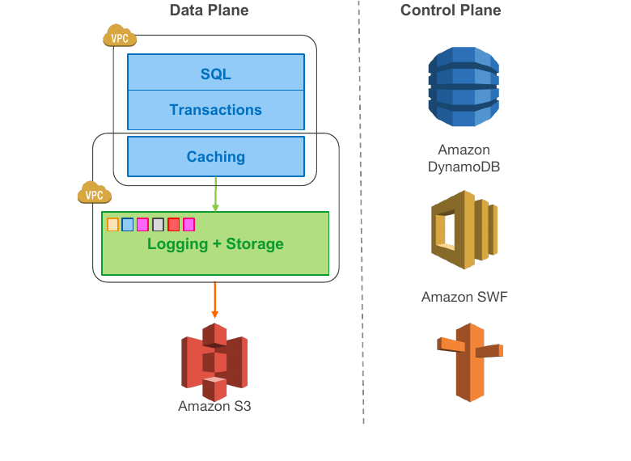

**图 1：将日志记录与存储移出数据库引擎**

与传统方法相比，我们的架构有三项显著优势。第一，我们把存储构建成跨多个数据中心、独立的容错自愈服务，从而保护数据库，使其免受网络层或存储层的性能波动以及瞬时或永久故障影响。我们观察到，持久性故障可建模为长期可用性事件，而可用性事件可建模为长期性能波动；设计良好的系统可以统一处理这三者 [42]。第二，存储层只写入重做日志记录，使我们能将网络 IOPS 降低一个数量级。消除这一瓶颈后，我们得以积极优化许多其他竞争点，相比起步时采用的 MySQL 基础代码显著提升了吞吐量。第三，我们把若干最复杂且最关键的功能（备份和重做恢复）从数据库引擎中的一次性昂贵操作，转变为摊销到大型分布式机群上的持续异步操作。这样既能在无需检查点的情况下实现近乎瞬时的崩溃恢复，也能实现不干扰前台处理的低成本备份。

我们介绍三项贡献：

1. 如何理解云规模下的持久性，以及如何设计能抵御相关故障的 Quorum 系统（第 2 节）。
2. 如何利用智能存储，将传统数据库底部约四分之一的功能卸载到这一层（第 3 节）。
3. 如何在分布式存储中消除多阶段同步、崩溃恢复和检查点（第 4 节）。

随后，我们在第 5 节说明如何把这三个思想结合起来形成 Aurora 的整体架构；在第 6 节回顾我们的性能结果；在第 7 节总结我们学到的经验教训。最后，我们在第 8 节简要回顾相关工作，并在第 9 节给出结论。

## 2. 云规模下的持久性

即便数据库系统什么别的事情都不做，它也必须履行这样一项契约：数据一旦写入，之后就应当能够读出。并非所有系统都做得到。本节中，我们讨论我们的 Quorum 模型背后的理由、为何要对存储分段，以及两者结合后如何不仅提供持久性、可用性并减少抖动，还帮助我们解决大规模存储机群的运维问题。

### 2.1 复制与相关故障

实例寿命与存储寿命并不高度相关。实例会发生故障；客户会关闭实例；客户还会根据负载向上或向下调整实例规格。出于这些原因，将存储层与计算层解耦很有帮助。

解耦之后，存储节点和磁盘同样可能发生故障。因此必须以某种形式复制它们，才能具备故障弹性。在大规模云环境中，节点、磁盘和网络路径故障始终形成低水平的背景噪声。每次故障的持续时间和影响范围都可能不同。例如，可能出现到某个节点的网络暂时不可用、重启期间的短暂停机，或者磁盘、节点、机架、叶交换机、脊交换机乃至整个数据中心的永久故障。

复制系统容忍故障的一种方法，是采用文献 [6] 所述的基于 Quorum 的投票协议。若复制数据项的 $V$ 份副本各有一票，则读操作和写操作必须分别取得 $V_r$ 票的读 Quorum 和 $V_w$ 票的写 Quorum。为保证一致性，Quorum 必须满足两条规则。第一，每次读都必须知晓最近一次写，可表示为 $V_r + V_w \gt V$。该规则确保读操作使用的节点集合与写操作使用的节点集合相交，并且读 Quorum 至少包含一个持有最新版本的位置。第二，为避免写冲突，每次写都必须知晓最近一次写，可表示为 $V_w \gt V/2$。容忍单节点丢失的常见做法，是把数据复制到 $V = 3$ 个节点，并采用 $V_w = 2$ 的 2/3 写 Quorum 和 $V_r = 2$ 的 2/3 读 Quorum。

我们认为 2/3 Quorum 并不足够。要理解原因，先来看 AWS 中可用区（Availability Zone，AZ）的概念。一个 AZ 是某个区域（Region）的子集，它通过低延迟链路连接该区域中的其他 AZ，但对包括供电、网络、软件部署、洪水等在内的大多数故障相互隔离。将数据副本分布在不同 AZ，能确保规模化环境中的典型故障模式只影响一个数据副本。这意味着，只要将三个副本分别放到三个不同 AZ，就既能容忍大规模事件，也能容忍规模较小的单独故障。

然而，在大型存储机群中，故障背景噪声意味着任何时刻都可能有一部分磁盘或节点已经故障并处于修复中。这些故障可能独立分散在 AZ A、B、C 的节点上。但如果 AZ C 因火灾、屋顶故障、洪水等原因失效，则任何同时在 AZ A 或 AZ B 存在副本故障的数据项都会失去 Quorum。此时，在 2/3 读 Quorum 模型下，我们已经丢失两个副本，无法判断第三个副本是否为最新。换言之，虽然每个 AZ 内单个副本的故障互不相关，但一个 AZ 的故障是该 AZ 内所有磁盘和节点的相关故障。Quorum 不仅要能容忍 AZ 故障，还要同时容忍持续存在的背景噪声故障。

在 Aurora 中，我们选择了如下设计目标：（a）丢失整个 AZ 再加一个节点（AZ+1）时不丢失数据；（b）丢失整个 AZ 时不影响写入能力。为此，我们在 3 个 AZ 中以 6 路方式复制每个数据项，每个 AZ 放置两份。我们采用总票数为 $V = 6$ 的 Quorum 模型；写 Quorum 为 4/6，即 $V_w = 4$；读 Quorum 为 3/6，即 $V_r = 3$。采用这一模型后，我们可以：（a）在丢失单个 AZ 和一个额外节点（共 3 个节点故障）时仍保持读可用性；（b）在丢失任意两个节点时仍保持写可用性，其中包括单个 AZ 故障。保证读 Quorum 后，我们还可以通过增加新的副本来重建写 Quorum。

### 2.2 分段存储

下面我们来考虑 AZ+1 是否提供了足够持久性。在该模型中，要获得足够持久性，就必须保证：在修复一次故障所需的时间（平均修复时间，MTTR）内，非相关故障发生双重故障的概率（由平均无故障时间 MTTF 决定）足够低。如果双重故障的概率足够高，我们就可能在一次 AZ 故障期间遇到双重故障，从而破坏 Quorum。独立故障的 MTTF 概率降低到一定程度后便很难继续改善。因此，我们转而缩短 MTTR，以缩小系统暴露于双重故障的脆弱时间窗口。

为此，我们把数据库卷划分为固定大小的小段，目前每段为 10 GB。每段都以 6 路方式复制到保护组（Protection Group，PG）中，因此每个 PG 由 6 个 10 GB 分段组成，分布于 3 个 AZ，每个 AZ 两段。一个存储卷由一组串联的 PG 组成；其物理实现使用大型存储节点机群，这些节点是在 Amazon Elastic Compute Cloud（EC2）上配置、挂载 SSD 的虚拟主机。构成存储卷的 PG 会随存储卷增长而分配。目前，我们支持未计复制容量最高可增长到 64 TB 的存储卷。

现在，分段成为我们独立处理背景噪声故障与修复的单位。我们将故障监控和自动修复作为我们服务的一部分。在 10 Gbps 网络链路上，一个 10 GB 分段可在 10 秒内修复。要丢失 Quorum，我们必须在同一个 10 秒窗口内看到两个这样的故障，同时还要有一个 AZ 发生故障，且该 AZ 不包含上述两个独立故障。按我们观察到的故障率，即使考虑我们为我们的客户管理的数据库数量，这种情况也足够不可能发生。

### 2.3 弹性带来的运维优势

系统一旦被设计成天然能抵御长期故障，自然也能抵御更短的故障。能应对整个 AZ 长期丢失的存储系统，也能应对供电事件或需要回滚的错误软件部署所造成的短暂中断。能应对 Quorum 某个成员数秒不可用的系统，也能应对网络短暂拥塞或存储节点的短暂负载。

由于我们的系统对故障具有很高的容忍度，我们可以借助这一点执行会使分段暂时不可用的维护操作。例如，热度管理十分直接：我们可以把热点磁盘或节点上的某个分段标记为故障，Quorum 随即通过把它迁移到机群中较冷的节点来快速修复。对我们的存储节点进行操作系统与安全补丁时，可以将打补丁过程视作该节点的一次短暂不可用事件。甚至我们的存储机群的软件升级也以这种方式管理。我们一次只升级一个 AZ，并确保同一时刻每个 PG 最多只有一个成员正在打补丁。这使我们能在我们的存储服务中采用敏捷方法和快速部署。

## 3. 日志就是数据库

本节中，我们说明在第 2 节所述的分段复制存储系统上运行传统数据库，为何会带来无法承受的网络 I/O 和同步停顿开销。随后，我们介绍把日志处理卸载到存储服务的方法，并通过实验说明我们的方法如何显著减少网络 I/O。最后，我们介绍自己在存储服务中采用的多种技术，以尽量减少同步停顿和不必要的写入。

### 3.1 写放大的负担

我们的模型将存储卷分段，以 6 路方式复制每个分段并采用 4/6 写 Quorum，使我们获得了很强的故障弹性。遗憾的是，对于 MySQL 这类传统数据库，该模型会导致无法承受的性能开销，因为每次应用写入都会产生许多不同的实际 I/O。复制进一步放大高 I/O 量，形成沉重的每秒数据包数（PPS）负担。此外，这些 I/O 形成同步点，使流水线停顿并拉长延迟。链式复制 [8] 及其替代方案虽能降低网络成本，但仍会受到同步停顿和延迟累加的影响。

下面我们考察传统数据库如何执行写入。MySQL 之类的系统会把数据页写到自己暴露的对象（例如堆文件、B-tree 等），同时把重做日志记录写入预写日志（WAL）。每条重做日志记录由被修改页面的后镜像与前镜像之差组成。把日志记录应用到页面前镜像，即可得到其后镜像。

实践中还需要写入其他数据。例如，考虑图 2 所示的同步镜像 MySQL 配置，它跨数据中心提供高可用性，并以主备模式运行。AZ1 中有一个活动 MySQL 实例，其网络存储位于 Amazon Elastic Block Store（EBS）；AZ2 中还有一个备用 MySQL 实例，其网络存储也位于 EBS。通过软件镜像，主 EBS 卷上的写入会与备用 EBS 卷同步。

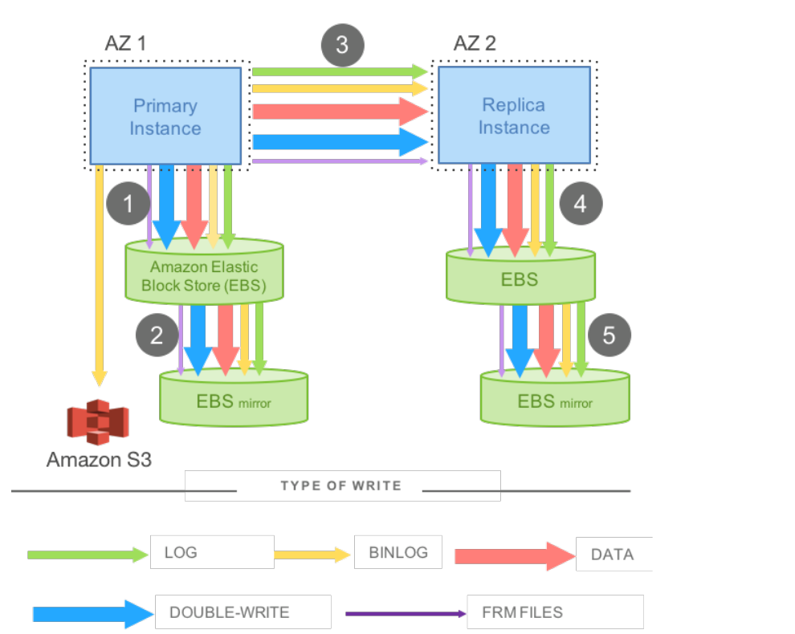

**图 2：镜像 MySQL 中的网络 I/O**

图 2 展示了引擎需要写入的各类数据：重做日志；为支持时间点恢复而归档到 Amazon Simple Storage Service（S3）的二进制（语句）日志；修改后的数据页；为防止页面撕裂而对数据页进行的第二次临时写入（double-write）；最后还有元数据（FRM）文件。该图还展示了实际 I/O 流的顺序。在步骤 1 和 2 中，写入先发往 EBS，EBS 再将其发往 AZ 内的本地镜像，两者均完成后才返回确认。接着在步骤 3 中，通过同步块级软件镜像把写入送到备用实例。最后在步骤 4 和 5 中，写入被写入备用 EBS 卷及其镜像。

上述镜像 MySQL 模型的问题，不仅在于数据如何写入，也在于写入什么数据。第一，步骤 1、3、5 是顺序且同步的。许多写入顺序执行，导致延迟累加。即使采用异步写，也必须等待最慢的操作，因而抖动会被放大，系统任由异常慢的操作主宰。从分布式系统角度看，该模型相当于采用 4/4 写 Quorum，因此容易受到故障和异常性能的影响。第二，OLTP 应用产生的用户操作会导致多种写入，而这些写入往往以不同方式表达相同信息；例如，为避免存储基础设施中的页面撕裂而写入 double-write 缓冲区。

### 3.2 将重做处理卸载到存储

传统数据库修改数据页时，会生成一条重做日志记录，并调用日志应用器，把该重做日志应用到页面的内存前镜像上，以生成其后镜像。事务提交要求日志已经写入，但数据页的写入可以推迟。

在 Aurora 中，跨越网络的写入只有重做日志记录。数据库层从不写出页面，无论是后台写入、检查点还是缓存淘汰都不写。日志应用器改为下推到存储层，在那里按需或在后台生成数据库页面。当然，如果每次都从时间起点开始、根据页面完整的修改链生成页面，成本高得无法接受。因此，我们持续在后台物化数据库页面，避免每次按需读取都从头重新生成。要注意，从正确性角度看，后台物化完全是可选的：对引擎而言，日志就是数据库，存储系统物化的任何页面都只是日志应用结果的缓存。还要注意，与检查点不同，只有修改链很长的页面才需要重新物化。检查点受整个重做日志链长度支配，而 Aurora 页面物化受特定页面自身修改链长度支配。

尽管复制会放大写入，我们的方法仍显著降低了网络负载，并同时提供性能和持久性。存储服务可以以易于并行的方式横向扩展 I/O，而不影响数据库引擎的写吞吐。例如，图 3 展示了一个 Aurora 集群：一个主实例和多个副本实例跨多个 AZ 部署。在该模型中，主实例只向存储服务写入日志记录，同时把这些日志记录和元数据更新流式发送给副本实例。I/O 流按共同目标（逻辑分段，即 PG）批处理完全有序的日志记录，并把每批记录发送到全部 6 个副本。各副本将批次持久化到磁盘；数据库引擎等待其中 4 个副本确认，以满足写 Quorum，并认为相应日志记录已经持久化（hardened）。副本用重做日志记录把更改应用到自己的缓冲区缓存。

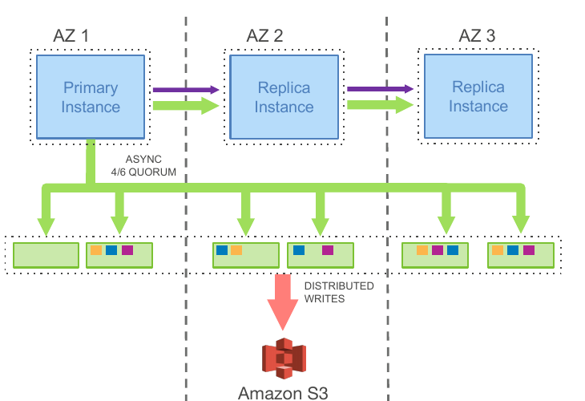

**图 3：Amazon Aurora 中的网络 I/O**

为测量网络 I/O，我们对上述两种配置运行了 SysBench [9] 纯写工作负载，数据集均为 100 GB：一种是在多个 AZ 之间采用同步镜像 MySQL，另一种是 RDS Aurora（副本跨多个 AZ）。两种情况下，测试都针对运行在 `r3.8xlarge` EC2 实例上的数据库引擎执行 30 分钟。

**表 1：Aurora 与 MySQL 的网络 I/O**

| 配置 | 事务数 | 每事务 I/O 数 |
| --- | ---: | ---: |
| 镜像 MySQL | 780,000 | 7.4 |
| 带副本的 Aurora | 27,378,000 | 0.95 |

我们的实验结果汇总在表 1 中。在 30 分钟内，Aurora 可持续处理的事务数是镜像 MySQL 的 35 倍。尽管 Aurora 将写入放大 6 倍，而且这里既没有计入 EBS 内部的链式复制，也没有计入 MySQL 的跨 AZ 写入，Aurora 数据库节点上的每事务 I/O 数仍比镜像 MySQL 少 7.7 倍。每个存储节点只承载 6 份副本中的一份，因此看到的是未放大的写入；这一层需要处理的 I/O 数量少了 46 倍。通过减少写入网络的数据量，我们得以为持久性和可用性积极复制数据，并行发出请求以尽量降低抖动影响。

把处理下推到存储服务还能缩短崩溃恢复时间，从而提高可用性，并消除检查点、后台数据页写入和备份等后台进程引起的抖动。

下面我们考察崩溃恢复。传统数据库在崩溃后必须从最近的检查点开始重放日志，以确保所有已持久化的重做记录都已应用。在 Aurora 中，持久重做记录的应用持续、异步且分布式地发生在整个存储机群上。若数据页不是最新的，对该数据页的读取请求可能需要先应用若干重做记录。因此，崩溃恢复过程被分散到正常的前台处理中，数据库启动时无需执行任何额外工作。

### 3.3 存储服务的设计要点

我们的存储服务有一项核心设计原则：尽量缩短前台写请求的延迟。我们把大多数存储处理移到后台。存储层前台请求的峰值与平均值天然存在差异，因而我们有充足时间在前台路径之外执行这些任务；我们也有机会用 CPU 换取磁盘资源。例如，除非磁盘接近满载，否则存储节点忙于处理前台写请求时，没有必要对旧页面版本运行垃圾回收（GC）。Aurora 的后台处理与前台处理负相关，这一点不同于传统数据库：传统数据库的后台页面写入和检查点与系统前台负载正相关。如果我们在系统中积累了待处理任务，就会对前台活动实施节流，防止队列过长。由于分段以高熵方式分布在我们系统中的各存储节点上，一个存储节点发生节流时，我们的 4/6 Quorum 写能够轻松处理，对外只表现为一个慢节点。

下面我们更详细地考察存储节点上的各项活动。如图 4 所示，它包含以下步骤：（1）接收日志记录并加入内存队列；（2）把记录持久化到磁盘并确认；（3）整理记录并识别日志中的缺口，因为有些批次可能丢失；（4）通过与对等节点 gossip 来填补缺口；（5）把日志记录合并成新的数据页；（6）定期把日志和新页面暂存到 S3；（7）定期垃圾回收旧版本；最后，（8）定期校验页面上的 CRC 码。

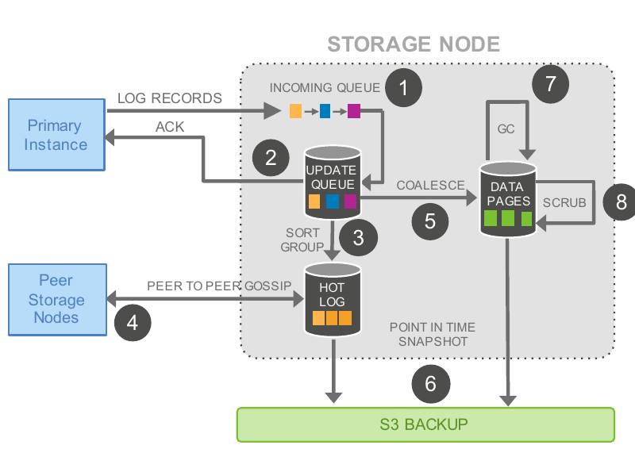

**图 4：Aurora 存储节点中的 I/O 流量**

需要注意的是，上述每个步骤都是异步的，而且只有步骤（1）和（2）位于可能影响延迟的前台路径上。

## 4. 日志持续前进

本节中，我们介绍数据库引擎如何生成日志，使持久状态、运行时状态和副本状态始终保持一致。我们尤其会说明，如何在不采用昂贵 2PC 协议的情况下高效实现一致性。首先，我们说明如何避免在崩溃恢复期间进行昂贵的重做处理；接着，我们解释正常运行过程，以及如何维护运行时状态和副本状态；最后，我们给出我们的恢复过程的细节。

### 4.1 方案概述：异步处理

由于我们把数据库建模为重做日志流（如第 3 节所述），便可以利用日志以有序更改序列不断向前推进这一事实。在实践中，每条日志记录都有一个关联的日志序列号（Log Sequence Number，LSN），它是数据库生成的单调递增值。

这样，我们便能异步处理状态维护问题，从而简化共识协议，不必使用通信频繁且不耐故障的 2PC 协议。从高层看，我们维护一致性点和持久点，并随着未完成存储请求的确认到达而持续推进这些点。任何一个存储节点都可能漏掉一条或多条日志记录，因此节点会与同一 PG 的其他成员相互 gossip，寻找缺口并填补缺失记录。数据库维护的运行时状态使我们除了在恢复期间状态丢失、必须重建之外，都可以读取单个分段而不必执行 Quorum 读。

数据库可能同时存在多个尚未完成、彼此隔离的事务；它们完成（达到结束且持久的状态）的顺序可能不同于启动顺序。假设数据库崩溃或重启，每个事务是否需要回滚要分别判定。跟踪部分完成事务并撤销这些事务的逻辑仍保留在数据库引擎中，与引擎写入普通磁盘时一样。然而，数据库重启后，在获准访问存储卷之前，存储服务会先执行自己的恢复。该恢复不关注用户级事务，而是确保数据库看到的存储视图在分布式环境下仍保持统一。

存储服务会确定一个最高 LSN，在这个位置上，它可以保证此前所有日志记录都可用；这个 LSN 称为 VCL，即存储卷完整 LSN（Volume Complete LSN）。存储恢复期间，所有大于 VCL 的 LSN 对应的日志记录都必须截断。不过，数据库可以通过标记日志记录并把它们识别为 CPL（Consistency Point LSN，一致性点 LSN），进一步限定允许作为截断位置的点集。因此，我们把 VDL（Volume Durable LSN，存储卷持久 LSN）定义为小于或等于 VCL 的最高 CPL，并截断所有 LSN 大于 VDL 的日志记录。例如，即使我们拥有完整到 LSN 1007 的数据，数据库也可能只声明 900、1000、1100 是 CPL；此时我们必须在 1000 截断。我们的数据完整到 1007，但只持久到 1000。

因此，完整性与持久性并不相同。可以把 CPL 看作一种边界：它界定了必须按顺序接受的、能力有限的存储系统事务。如果客户端不需要区分两者，可以直接把每条日志记录都标记为 CPL。在实践中，数据库与存储按以下方式交互：

1. 每个数据库级事务被拆分为多个有序且必须原子执行的迷你事务（mini-transaction，MTR）。
2. 每个迷你事务由多条连续日志记录组成，数量按需而定。
3. 迷你事务的最后一条日志记录是 CPL。

恢复时，数据库与存储服务通信，确定每个 PG 的持久点，据此确定 VDL，随后发出命令，截断 VDL 以上的日志记录。

### 4.2 正常运行

下面，我们说明数据库引擎的“正常运行”过程，依次介绍写入、读取、提交和副本。

#### 4.2.1 写入

在 Aurora 中，数据库持续与存储服务交互，并维护状态以建立 Quorum、推进存储卷持久点以及把事务登记为已提交。例如，在正常的前向路径上，数据库接收每批日志记录的确认、建立写 Quorum 后，会推进当前 VDL。任何时刻，数据库中都可能有大量并发活动事务，每个事务生成自己的重做日志记录。数据库为每条日志记录分配一个唯一、有序的 LSN，同时施加一项约束：分配的任何 LSN 都不能大于当前 VDL 与一个称为 LSN 分配上限（LSN Allocation Limit，LAL）的常量之和；LAL 当前设为 1000 万。这个上限保证数据库不会远远领先于存储系统，并引入背压：如果存储或网络跟不上，背压可以限制进入系统的写入。

需要注意，每个 PG 中的每个分段只会看到存储卷日志记录的一个子集，即影响驻留在该分段上的页面的记录。每条日志记录都包含一个反向链接，用于标识同一 PG 的前一条日志记录。这些反向链接可用于跟踪到达每个分段的日志记录的完整位置，从而建立分段完整 LSN（Segment Complete LSN，SCL）：SCL 标识这样一个最大 LSN，在它以下，该 PG 的全部日志记录都已收到。存储节点彼此 gossip 时，会用 SCL 查找并交换缺失的日志记录。

#### 4.2.2 提交

在 Aurora 中，事务提交以异步方式完成。客户端提交事务时，处理提交请求的线程会把该事务的“提交 LSN”记录到另一张等待提交事务列表中，随后把事务放到一边，转去执行其他工作。与 WAL 协议等价的规则是：当且仅当最新 VDL 大于或等于事务的提交 LSN 时，提交才算完成。随着 VDL 向前推进，数据库会找出满足条件、正在等待提交的事务，并由专用线程向等待中的客户端发送提交确认。工作线程不会因为提交而暂停；它们只会取出其他待处理请求继续执行。

#### 4.2.3 读取

与大多数数据库一样，Aurora 从缓冲区缓存提供页面；只有所需页面不在缓存中时，才产生存储 I/O 请求。

如果缓冲区缓存已满，系统会选择一个牺牲页并将其从缓存淘汰。在传统系统中，如果牺牲页是“脏页”，则必须先刷写到磁盘再替换，以确保之后再次读取该页面时总能得到最新数据。Aurora 数据库虽然在淘汰时（或任何其他时候）都不写出页面，却执行一项类似保证：缓冲区缓存中的页面必须始终是最新版本。其实现方式是，仅当页面的“页面 LSN”（标识与该页面最近一次更改关联的日志记录）大于或等于 VDL 时，才从缓存中淘汰该页面。该协议确保：（a）页面上的全部更改已经在日志中持久化；（b）缓存未命中时，只需请求当前 VDL 时刻的页面版本，即可获得其最新持久版本。

正常情况下，数据库不需要通过读 Quorum 建立共识。从磁盘读取页面时，数据库会建立一个读取点（read-point），表示发出请求时的 VDL。随后，数据库可以选择一个相对于该读取点已经完整的存储节点，因为它知道该节点会返回最新版本。存储节点返回的页面必须符合数据库中迷你事务（MTR）的预期语义。数据库直接负责把日志记录送入存储节点并跟踪进度（即每个分段的 SCL），因此通常知道哪些分段能满足读取要求，也就是 SCL 大于读取点的分段；于是可以直接向数据足够完整的分段发出读取请求。

数据库知道所有尚未完成的读取，因而可以随时为每个 PG 计算最小读取点 LSN（Minimum Read Point LSN）。如果存在只读副本，写节点会与它们 gossip，以确定所有节点上的每 PG 最小读取点 LSN。该值称为保护组最小读取点 LSN（Protection Group Min Read Point LSN，PGMRPL），代表一条“低水位线”：低于该水位线的 PG 日志记录全都不再需要。换言之，存储节点上的某个分段可以确信，不会再收到读取点低于 PGMRPL 的页面读取请求。每个存储节点都从数据库获知 PGMRPL，因此可以通过合并较旧日志记录来推进磁盘上的物化页面，然后安全地回收这些日志记录。

实际的并发控制协议完全在数据库引擎中执行，其行为就像传统 MySQL 中数据库页面和撤销分段位于本地存储上一样。

#### 4.2.4 副本

在 Aurora 中，一个写节点和最多 15 个只读副本都可以挂载同一个共享存储卷。因此，只读副本不会额外消耗存储容量，也不会增加磁盘写操作。为尽量降低延迟，写节点生成并发送到存储节点的日志流，也会发送给所有只读副本。在只读节点上，数据库逐条处理日志记录，从而消费该日志流。如果日志记录指向只读节点缓冲区缓存中的页面，就用日志应用器把指定的重做操作应用到缓存页；否则直接丢弃该日志记录。

需要注意，从写节点角度看，副本异步消费日志记录；写节点确认用户提交时不依赖副本。副本应用日志记录时遵守两条重要规则：（a）只应用 LSN 小于或等于 VDL 的日志记录；（b）属于同一个迷你事务的日志记录要原子地应用到副本缓存中，以确保副本看到所有数据库对象的一致视图。在实践中，每个副本通常只落后写节点很短时间（20 ms 或更少）。

### 4.3 恢复

大多数传统数据库使用 ARIES [7] 一类恢复协议，依赖预写日志（WAL）精确表示所有已提交事务的内容。这些系统还会定期为数据库做检查点：把脏页刷写到磁盘，并向日志写入检查点记录，以粗粒度方式建立持久点。重启时，任意页面都可能缺少一部分已提交数据，也可能包含未提交数据。因此，崩溃恢复时，系统会处理从最近检查点开始的重做日志记录，用日志应用器把每条记录应用到相应数据库页面。该过程把数据库页面推进到故障时的一致状态，随后再执行相关撤销日志记录，回滚崩溃时仍在执行的事务。崩溃恢复成本可能很高。缩短检查点间隔虽有帮助，却会加剧对前台事务的干扰；Aurora 不需要这种取舍。

传统数据库的一项重要简化原则，是在前向处理路径与恢复路径中使用同一个重做日志应用器；在恢复时，数据库离线，日志应用器在前台同步执行。我们在 Aurora 中同样依赖这一原则，但重做日志应用器从数据库中解耦出来，在存储节点上并行运行，并始终在后台工作。数据库启动后，会与存储服务协作执行存储卷恢复。因此，即使 Aurora 数据库在每秒处理超过 100,000 条写语句时崩溃，也能非常迅速地恢复，通常不超过 10 秒。

数据库在崩溃后确实需要重新建立运行时状态。它会针对每个 PG 联系一组构成读 Quorum 的分段，这足以保证发现任何可能已到达写 Quorum 的数据。为每个 PG 建立读 Quorum 后，数据库可以重新计算 VDL；VDL 以上的数据将被截断。数据库生成一个截断范围，使新 VDL 之后的每条日志记录失效，直到并包括一个结束 LSN；数据库能够证明，该结束 LSN 至少与可能存在的最高未完成日志记录一样大。数据库能够推断这一上界，是因为 LSN 由它分配，而且它限制了分配位置最多只能比 VDL 超前 1000 万，即前文所述上限。截断范围带有 epoch 编号，并被持久写入存储服务，因此即使恢复中断并重新开始，也不会对截断操作是否持久产生混淆。

数据库仍然需要执行撤销恢复，以撤销崩溃时尚未完成事务的操作。不过，系统通过撤销分段构建出这些尚未完成事务的列表后，数据库可以在保持在线的同时执行撤销恢复。

## 5. 组合成完整系统

本节中，我们从图 5 的鸟瞰视角介绍 Aurora 的各个构建模块。

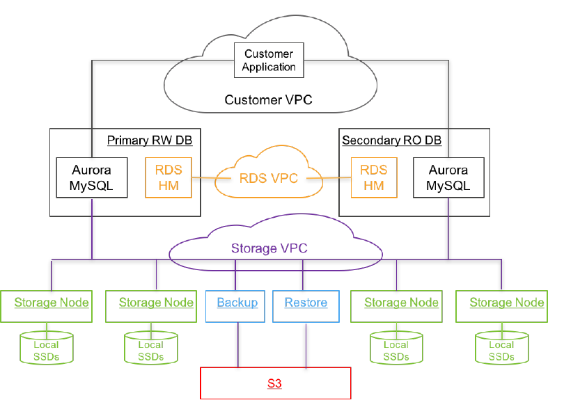

**图 5：Aurora 架构鸟瞰图**

数据库引擎是“社区版”MySQL/InnoDB 的一个分支，主要差异在于 InnoDB 如何从磁盘读写数据。在社区版 InnoDB 中，写操作会修改缓冲页中的数据，关联的重做日志记录则按 LSN 顺序写入 WAL 缓冲区。事务提交时，WAL 协议只要求该事务的重做日志记录已经持久写入磁盘。实际修改过的缓冲页最终也会写入磁盘，并采用 double-write 技术避免页面部分写入。这些页面写入发生在后台、从缓存淘汰时或建立检查点时。除了 I/O 子系统，InnoDB 还包含事务子系统、锁管理器、B+-Tree 实现以及关联的“迷你事务”（MTR）概念。MTR 是 InnoDB 内部专用的结构，用于表示必须原子执行的一组操作，例如 B+-Tree 页面的分裂或合并。

在 Aurora 的 InnoDB 变体中，表示每个 MTR 内必须原子执行之更改的重做日志记录会组织成多个批次，并按各日志记录所属 PG 进行分片，再将这些批次写入存储服务。每个 MTR 的最后一条日志记录会被标记为一致性点。

Aurora 在写节点中支持与社区版 MySQL 完全相同的隔离级别，即标准 ANSI 隔离级别以及快照隔离（也称一致性读）。Aurora 只读副本会持续接收写节点中事务开始和提交的信息，并利用这些信息支持本地只读事务的快照隔离。需要注意的是，并发控制完全在数据库引擎中实现，不会影响存储服务。存储服务向引擎呈现底层数据的统一视图；从逻辑上看，这与社区版 InnoDB 把数据写入本地存储所得的视图完全相同。

Aurora 利用 Amazon Relational Database Service（RDS）作为控制平面。RDS 在数据库实例上包含一个称为主机管理器（Host Manager，HM）的代理，它监控集群健康状况，并判断是否需要故障转移或替换实例。每个数据库实例都属于一个集群；集群由一个写节点和零个或多个只读副本组成。一个集群中的实例位于同一地理区域，例如 `us-east-1`、`us-west-1` 等；它们通常放置在不同 AZ，并连接到同一区域中的存储机群。

出于安全考虑，我们隔离数据库、应用和存储之间的通信。实践中，每个数据库实例可以在三个 Amazon Virtual Private Cloud（VPC）网络上通信：客户 VPC，客户应用通过它与引擎交互；RDS VPC，数据库引擎与控制平面通过它交互；存储 VPC，数据库通过它与存储服务交互。

存储服务部署在 EC2 虚拟机集群上，每个区域的集群横跨至少 3 个 AZ。该服务整体负责配置多个客户存储卷、从这些存储卷读写数据，以及在这些存储卷与备份之间备份和恢复数据。存储节点操作本地 SSD，并与数据库引擎实例、其他对等存储节点以及备份/恢复服务交互；备份/恢复服务持续把已更改数据备份到 S3，并按需从 S3 恢复数据。

存储控制平面使用 Amazon DynamoDB 数据库服务持久保存集群和存储卷配置、存储卷元数据，以及已经备份到 S3 的数据的详细描述。对于数据库卷恢复、存储节点故障后的修复（重新复制）等长时间运行的操作，存储控制平面使用 Amazon Simple Workflow Service 进行编排。维持高可用性要求系统主动、自动并及早发现真实和潜在问题，在最终用户受到影响之前采取行动。存储运维的所有关键方面都会通过指标收集服务持续监控；如果关键性能或可用性指标显示存在值得关注的原因，系统便会发出告警。

## 6. 性能结果

本节中，我们分享自己运行 Aurora 生产服务的经验；该服务于 2015 年 7 月正式发布（Generally Available）。我们首先汇总行业标准基准测试的结果，然后给出一些来自我们客户的性能结果。

### 6.1 标准基准测试结果

下面我们给出若干实验的结果，这些实验使用 SysBench 和 TPC-C 变体等行业标准基准，比较 Aurora 与 MySQL 的性能。我们在挂载 EBS 卷并配置 30K 预置 IOPS 的实例上运行 MySQL。除非另有说明，实例均为 `r3.8xlarge` EC2，配备 32 个 vCPU、244 GB 内存和 Intel Xeon E5-2670 v2（Ivy Bridge）处理器。`r3.8xlarge` 上的缓冲区缓存设为 170 GB。

#### 6.1.1 随实例规格扩展

在该实验中，我们报告 Aurora 的吞吐量可随实例规格线性扩展；在最高规格实例上，吞吐量可达到 MySQL 5.6 和 MySQL 5.7 的 5 倍。需要注意，Aurora 当时基于 MySQL 5.6 代码库。我们使用 1 GB 数据集（250 张表），在 r3 系列的 5 种 EC2 实例（large、xlarge、2xlarge、4xlarge、8xlarge）上运行 SysBench 纯读和纯写基准。每种实例的 vCPU 数和内存恰好是相邻更大规格实例的一半。

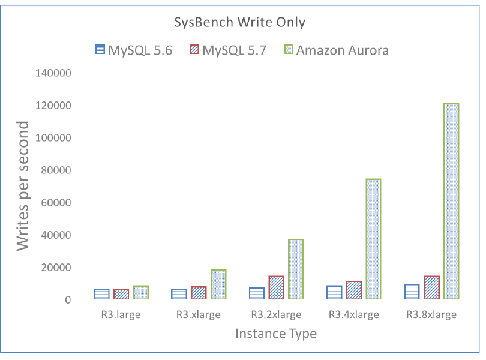

**图 7：Aurora 在纯写工作负载下线性扩展**

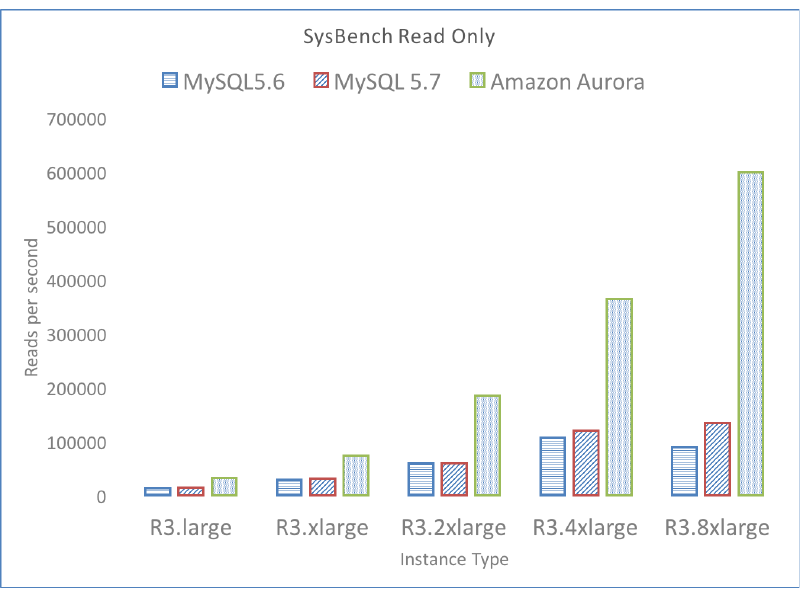

**图 6：Aurora 在纯读工作负载下线性扩展**

结果分别见图 7 和图 6，性能指标分别为每秒写语句数和每秒读语句数。实例规格每提升一级，Aurora 性能都会翻倍；在 `r3.8xlarge` 上达到每秒 121,000 次写入和每秒 600,000 次读取，是 MySQL 5.7 的 5 倍，而 MySQL 5.7 的峰值为每秒 20,000 次读取和每秒 125,000 次写入。

#### 6.1.2 不同数据规模下的吞吐量

在该实验中，我们报告即使数据规模更大，且工作集超出缓存，Aurora 的吞吐量仍显著超过 MySQL。表 2 显示，在 SysBench 纯写工作负载下，当数据库大小为 100 GB 时，Aurora 最多可比 MySQL 快 67 倍。即使数据库大小为 1 TB 且工作负载无法装入缓存，Aurora 仍比 MySQL 快 34 倍。

**表 2：SysBench 纯写性能（次写入/秒）**

| 数据库大小 | Amazon Aurora | MySQL |
| --- | ---: | ---: |
| 1 GB | 107,000 | 8,400 |
| 10 GB | 107,000 | 2,400 |
| 100 GB | 101,000 | 1,500 |
| 1 TB | 41,000 | 1,200 |

#### 6.1.3 随用户连接数扩展

在该实验中，我们报告 Aurora 的吞吐量可以随客户端连接数增长而扩展。表 3 给出了 SysBench OLTP 基准的结果，以每秒写入数衡量；连接数依次从 50 增长到 500，再增长到 5000。Aurora 从每秒 40,000 次写入扩展到每秒 110,000 次写入；MySQL 的吞吐量在约 500 个连接时达到峰值，随后随着连接数增至 5000 而急剧下降。

**表 3：SysBench OLTP（次写入/秒）**

| 连接数 | Amazon Aurora | MySQL |
| ---: | ---: | ---: |
| 50 | 40,000 | 10,000 |
| 500 | 71,000 | 21,000 |
| 5,000 | 110,000 | 13,000 |

#### 6.1.4 随副本扩展

在该实验中，我们报告即使工作负载更为繁重，Aurora 只读副本的延迟仍显著低于 MySQL 副本。表 4 显示，当工作负载从每秒 1,000 次写入增长到每秒 10,000 次写入时，Aurora 的副本延迟从 2.62 ms 增长到 5.38 ms。相比之下，MySQL 的副本延迟从不足 1 秒增长到 300 秒。在每秒 10,000 次写入时，Aurora 的副本延迟比 MySQL 小几个数量级。这里的副本延迟，是指一个已提交事务在副本中变得可见所需的时间。

**表 4：SysBench 纯写工作负载的副本延迟（ms）**

| 写入数/秒 | Amazon Aurora | MySQL |
| ---: | ---: | ---: |
| 1,000 | 2.62 | < 1000 |
| 2,000 | 3.42 | 1000 |
| 5,000 | 3.94 | 60,000 |
| 10,000 | 5.38 | 300,000 |

#### 6.1.5 热点行竞争下的吞吐量

在该实验中，我们报告在存在热点行竞争的工作负载上，例如基于 TPC-C 基准的工作负载，Aurora 相对 MySQL 表现很好。我们在 `r3.8xlarge` 上，针对 Amazon Aurora、MySQL 5.6 和 MySQL 5.7 运行 Percona TPC-C 变体 [37]；MySQL 使用配置了 30K 预置 IOPS 的 EBS 卷。表 5 显示，当工作负载从 500 个连接、10 GB 数据扩展到 5000 个连接、100 GB 数据时，Aurora 可维持的吞吐量是 MySQL 5.7 的 2.3-16.3 倍。

**表 5：Percona TPC-C 变体（tpmC）**

| 连接数/大小/仓库数 | Amazon Aurora | MySQL 5.6 | MySQL 5.7 |
| --- | ---: | ---: | ---: |
| 500/10GB/100 | 73,955 | 6,093 | 25,289 |
| 5000/10GB/100 | 42,181 | 1,671 | 2,592 |
| 500/100GB/1000 | 70,663 | 3,231 | 11,868 |
| 5000/100GB/1000 | 30,221 | 5,575 | 13,005 |

### 6.2 真实客户工作负载的结果

本节中，我们分享自己的一些客户报告的结果；这些客户把生产工作负载从 MySQL 迁移到了 Aurora。

#### 6.2.1 使用 Aurora 时的应用响应时间

一家互联网游戏公司把生产服务从 MySQL 迁移到运行在 `r3.4xlarge` 实例上的 Aurora。迁移前，该公司 Web 事务的平均响应时间为 15 ms；迁移后，平均响应时间为 5.5 ms，提升了 3 倍，如图 8 所示。

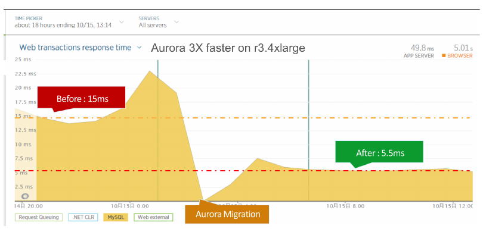

**图 8：Web 应用响应时间**

#### 6.2.2 使用 Aurora 时的语句延迟

一家教育技术公司的服务帮助学校管理学生笔记本电脑。该公司把生产工作负载从 MySQL 迁移到 Aurora。图 9 和图 10 展示了迁移前后（迁移发生在 14:00）SELECT 操作和逐记录 INSERT 操作的中位数（P50）及第 95 百分位（P99）延迟。

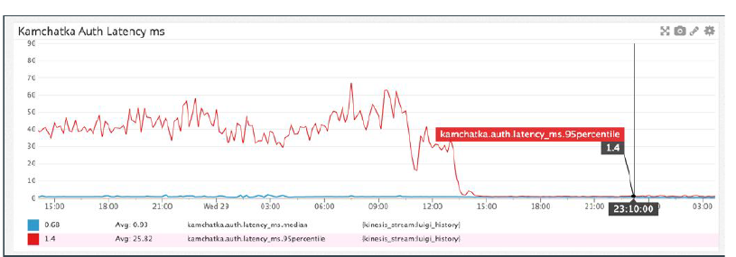

**图 9：SELECT 延迟（P50 与 P95）**

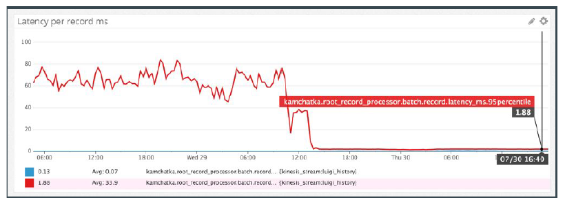

**图 10：逐记录 INSERT 延迟（P50 与 P95）**

迁移前，P95 延迟介于 40-80 ms，远差于约 1 ms 的 P50 延迟。应用正在经历我们在本文前面描述的那类糟糕长尾性能。迁移后，这两种操作的 P95 延迟都显著改善，接近 P50 延迟。

#### 6.2.3 多副本场景下的副本延迟

MySQL 副本往往显著落后于写节点，并且会像 Pinterest 的 Weiner 所报告的那样“引发奇怪的缺陷”[40]。对于前述教育技术公司，副本延迟经常飙升到 12 分钟并影响应用正确性，因此副本只能用作备用节点。迁移到 Aurora 后，4 个副本中的最大副本延迟从未超过 20 ms，如图 11 所示。Aurora 改善了副本延迟，使该公司可以把相当一部分应用负载转移到副本，既节约成本又提高可用性。

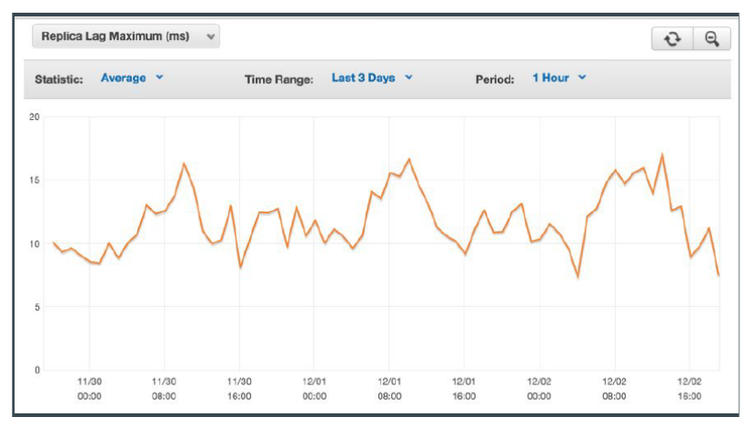

**图 11：最大副本延迟（按小时取平均）**

## 7. 经验教训

现在，我们已经看到多种多样的客户应用在 Aurora 上运行：既有小型互联网公司，也有运营大量 Aurora 集群的高度复杂组织。虽然其中许多用例很常见，但我们关注云环境中共同出现、并正引领我们探索新方向的场景和期望。

### 7.1 多租户与数据库整合

我们的许多客户经营软件即服务（SaaS）业务：有些完全采用 SaaS，有些仍有少量本地部署客户，正在尝试把这些客户迁移到 SaaS 模式。我们发现，这些客户往往依赖难以轻易修改的应用。因此，它们通常把 schema/数据库作为租户单位，将不同客户整合到单个实例上。该模式可以降低成本：所有客户不太可能同时处于活跃状态，因此无需为每个客户购买专用实例。例如，我们的一些 SaaS 客户报告称，它们自己的客户数量超过 50,000。

这种模型与 Salesforce.com [14] 等广为人知的多租户应用显著不同。后者采用多租户数据模型，把多个客户的数据装入单个 schema 的统一表中，并按行标识租户。因此，我们看到许多客户的整合数据库包含大量表。小型数据库的生产实例拥有超过 150,000 张表相当常见。这会给字典缓存等管理元数据的组件带来压力。更重要的是，这些客户需要：（a）维持高吞吐量和大量并发用户连接；（b）存储空间难以预先估计，因此数据只在实际使用时配置并付费；（c）减少抖动，使单个租户的负载尖峰对其他租户影响最小。Aurora 支持这些特性，非常适合此类 SaaS 应用。

### 7.2 高并发自动扩展工作负载

互联网工作负载经常要处理由突发意外事件引起的流量尖峰。我们的一家主要客户曾在一档全国热播电视节目中获得特别曝光，流量因此出现一次远超平时峰值吞吐量的尖峰，但数据库没有承受压力。为了支持这种尖峰，数据库必须能处理大量并发连接。Aurora 的底层存储系统扩展能力很强，因此这种方法可行。我们有多位客户的运行负载超过每秒 8000 个连接。

### 7.3 Schema 演进

Ruby on Rails 等现代 Web 应用框架深度集成了对象关系映射工具。因此，应用开发者很容易对数据库进行大量 schema 更改，却使 DBA 难以管理 schema 演进。在 Rails 应用中，这些更改称为“数据库迁移”（DB Migrations）。我们从 DBA 的亲身经历中了解到，他们要么每周处理“几十次迁移”，要么采取防范策略，确保未来的迁移顺利进行。MySQL 提供宽松的 schema 演进语义，而且以整表复制实现大多数更改，这进一步加剧了问题。频繁 DDL 是现实需求，因此我们实现了一种高效的在线 DDL：（a）按页面对 schema 进行版本化，并使用页面的 schema 历史按需解码单个页面；（b）利用写时修改原语，惰性地把单个页面升级到最新 schema。

### 7.4 可用性与软件升级

我们的客户对云原生数据库的期望很高，这些期望可能与我们如何运营机群、多久为服务器打一次补丁产生冲突。由于我们的客户主要把 Aurora 用作支撑生产应用的 OLTP 服务，任何中断都可能造成严重影响。因此，我们的许多客户对我们更新数据库软件的容忍度极低，即使只是每约 6 周一次、每次 30 秒的计划停机。为此，我们最近发布了新的零停机补丁（Zero-Downtime Patch，ZDP）功能，允许我们为客户打补丁而不影响正在使用的数据库连接。

如图 12 所示，ZDP 会寻找没有活动事务的时刻；在该时刻，它把应用状态暂存到本地临时存储，为引擎打补丁，然后重新载入应用状态。在这个过程中，用户会话保持活动，不会察觉底层引擎已经更换。

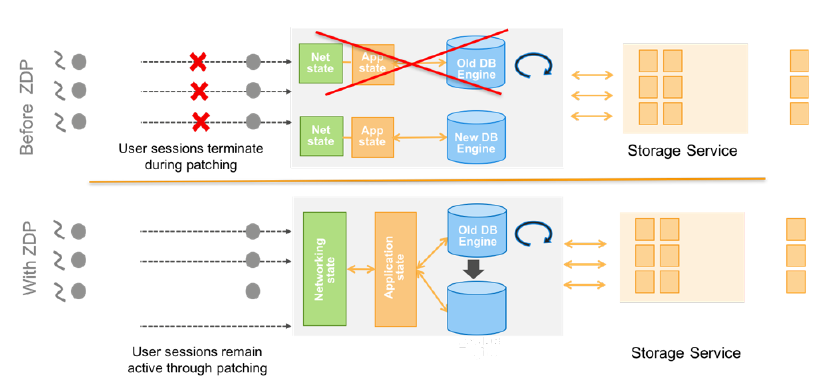

**图 12：零停机补丁**

## 8. 相关工作

本节中，我们讨论其他相关贡献，以及它们与 Aurora 所采用方法之间的关系。

**存储与计算解耦。** 传统系统通常构建成单体守护进程 [27]，但近期也有工作把数据库内核拆分成不同组件。例如，Deuteronomy [10] 就是这类系统：它将提供并发控制和恢复的事务组件（Transaction Component，TC），与在 LLAMA [34] 之上提供访问方法的数据组件（Data Component，DC）分离；LLAMA 是一种无 latch 的日志结构化缓存与存储管理器。Sinfonia [39] 和 Hyder [38] 在横向扩展服务上抽象事务性访问方法，数据库系统可以基于这些抽象实现。Yesquel [36] 实现了多版本分布式平衡树，并把并发控制与查询处理器分离。Aurora 的存储解耦位置比 Deuteronomy、Hyder、Sinfonia 和 Yesquel 更低。在 Aurora 中，查询处理、事务、并发控制、缓冲区缓存和访问方法，与由横向扩展服务实现的日志记录、存储和恢复相解耦。

**分布式系统。** 面对网络分区时正确性与可用性的取舍早已为人所知，其中的重要结论是：存在网络分区时，无法实现单副本可串行化 [15]。近来，文献 [16] 证明的 Brewer CAP 定理指出，高可用系统在存在网络分区时无法提供“强”一致性保证。这些结果，加上我们应对云规模复杂相关故障的经验，共同促使我们设定了一致性目标，即使分区由 AZ 故障导致也要满足这些目标。

Bailis 等人 [12] 研究了高可用事务（Highly Available Transaction，HAT）：这类事务既不会在网络分区期间不可用，也不会引入很高网络延迟。他们证明，可串行化、快照隔离和可重复读隔离不符合 HAT，而大多数其他隔离级别都能以高可用方式实现。Aurora 通过一项简化假设来提供所有这些隔离级别：任何时刻只有一个写节点生成日志更新，而且 LSN 从一个有序域统一分配。

Google Spanner [24] 提供外部一致 [25] 的读写，以及在指定时间戳上跨数据库的全局一致读取。这些特性使 Spanner 能在全球规模上支持一致备份、一致的分布式查询处理 [26] 和原子 schema 更新，即使事务仍在执行也能做到。正如 Bailis [12] 所解释，Spanner 针对 Google 的读密集型工作负载高度专门化，并对读写事务采用两阶段提交和两阶段锁。

**并发控制。** 弱一致性（PACELC [17]）和隔离模型 [18][20] 在分布式数据库中广为人知，并催生了乐观复制技术 [19] 和最终一致系统 [21][22][23]。集中式系统中的其他方法既包括基于锁的经典悲观方案 [28]，也包括 Hekaton 的多版本并发控制 [29] 等乐观方案、VoltDB [30] 等分片方案，以及 HyPer [31][32] 和 Deuteronomy 中的时间戳排序。Aurora 存储服务向数据库引擎提供一个持久保存的本地磁盘抽象，并允许引擎自行决定隔离和并发控制。

**日志结构化存储。** LFS [33] 于 1992 年引入了日志结构化存储系统。较新的 Deuteronomy 及其关联工作 LLAMA [34] 和 Bw-Tree [35]，在存储引擎栈的多个层次使用日志结构化技术；与 Aurora 一样，它们写入增量而非完整页面，以降低写放大。Deuteronomy 与 Aurora 都实现纯重做日志记录，并跟踪最高稳定 LSN，以确认提交。

**恢复。** 传统数据库依赖基于 ARIES [5] 的恢复协议，一些较新的系统则为提高性能选择了其他路径。例如，Hekaton 和 VoltDB 在崩溃后使用某种形式的更新日志重建内存状态。Sinfonia [39] 等系统采用进程对和状态机复制等技术避免恢复。Graefe [41] 描述了一种为每个页面维护日志记录链的系统，它支持按需逐页重做，从而加快恢复。与 Aurora 一样，Deuteronomy 不需要重做恢复。这是因为 Deuteronomy 会推迟事务，使持久存储中只写入已提交更新。因此，与 Aurora 不同，Deuteronomy 中的事务大小可能受到限制。

## 9. 结论

我们把 Aurora 设计成高吞吐 OLTP 数据库，在云规模环境中既不牺牲可用性，也不牺牲持久性。核心思想是摆脱传统数据库的单体架构，将存储与计算解耦。具体而言，我们把数据库内核底部约四分之一的功能迁移到一个独立、可扩展的分布式服务，由它管理日志记录和存储。

所有 I/O 都通过网络写入后，我们的根本约束如今是网络。因此，我们需要关注能减轻网络负担并提高吞吐量的技术。我们依靠 Quorum 模型处理大规模云环境中的复杂相关故障并避免异常性能惩罚；通过日志处理降低总体 I/O 负担；通过异步共识消除通信频繁且昂贵的多阶段同步协议、离线崩溃恢复和分布式存储检查点。我们的方法形成了一种复杂度更低的简化架构，它既易于扩展，也为未来进一步发展奠定了基础。

## 10. 致谢

我们感谢整个 Aurora 开发团队为本项目付出的努力，其中既包括我们目前的成员，也包括我们杰出的往届成员 James Corey、Sam McKelvie、Yan Leshinsky、Lon Lundgren、Pradeep Madhavarapu 和 Stefano Stefani。我们尤其感谢使用我们服务运行生产工作负载的客户，他们慷慨地与我们分享经验和期望。我们还感谢论文指导人（shepherds）提出宝贵意见，帮助塑造本文。

## 11. 参考文献

[1] B. Calder, J. Wang, et al. Windows Azure storage: A highly available cloud storage service with strong consistency. In *SOSP 2011*.

[2] O. Khan, R. Burns, J. Plank, W. Pierce, and C. Huang. Rethinking erasure codes for cloud file systems: Minimizing I/O for recovery and degraded reads. In *FAST 2012*.

[3] P. A. Bernstein, V. Hadzilacos, and N. Goodman. *Concurrency Control and Recovery in Database Systems*, Chapter 7, Addison Wesley Publishing Company, ISBN 0-201-10715-5, 1997.

[4] C. Mohan, B. Lindsay, and R. Obermarck. Transaction management in the R* distributed database management system. *ACM TODS*, 11(4):378-396, 1986.

[5] C. Mohan and B. Lindsay. Efficient commit protocols for the tree of processes model of distributed transactions. *ACM SIGOPS Operating Systems Review*, 19(2):40-52, 1985.

[6] D. K. Gifford. Weighted voting for replicated data. In *SOSP 1979*.

[7] C. Mohan, D. L. Haderle, B. Lindsay, H. Pirahesh, and P. Schwarz. ARIES: A transaction recovery method supporting fine-granularity locking and partial rollbacks using write-ahead logging. *ACM TODS*, 17(1):94-162, 1992.

[8] R. van Renesse and F. Schneider. Chain replication for supporting high throughput and availability. In *OSDI 2004*.

[9] A. Kopytov. Sysbench Manual. Available at <http://imysql.com/wp-content/uploads/2014/10/sysbench-manual.pdf>.

[10] J. Levandoski, D. Lomet, S. Sengupta, R. Stutsman, and R. Wang. High performance transactions in Deuteronomy. In *CIDR 2015*.

[11] P. Bailis, A. Fekete, A. Ghodsi, J. M. Hellerstein, and I. Stoica. Scalable atomic visibility with RAMP Transactions. In *SIGMOD 2014*.

[12] P. Bailis, A. Davidson, A. Fekete, A. Ghodsi, J. M. Hellerstein, and I. Stoica. Highly available transactions: virtues and limitations. In *VLDB 2014*.

[13] R. Taft, E. Mansour, M. Serafini, J. Duggan, A. J. Elmore, A. Aboulnaga, A. Pavlo, and M. Stonebraker. E-Store: fine-grained elastic partitioning for distributed transaction processing systems. In *VLDB 2015*.

[14] R. Woollen. The internal design of salesforce.com's multi-tenant architecture. In *SoCC 2010*.

[15] S. Davidson, H. Garcia-Molina, and D. Skeen. Consistency in partitioned networks. *ACM CSUR*, 17(3):341-370, 1985.

[16] S. Gilbert and N. Lynch. Brewer's conjecture and the feasibility of consistent, available, partition-tolerant web services. *SIGACT News*, 33(2):51-59, 2002.

[17] D. J. Abadi. Consistency tradeoffs in modern distributed database system design: CAP is only part of the story. *IEEE Computer*, 45(2), 2012.

[18] A. Adya. *Weak Consistency: A Generalized Theory and Optimistic Implementations for Distributed Transactions*. PhD Thesis, MIT, 1999.

[19] Y. Saito and M. Shapiro. Optimistic replication. *ACM Comput. Surv.*, 37(1), March 2005.

[20] H. Berenson, P. Bernstein, J. Gray, J. Melton, E. O'Neil, and P. O'Neil. A critique of ANSI SQL isolation levels. In *SIGMOD 1995*.

[21] P. Bailis and A. Ghodsi. Eventual consistency today: limitations, extensions, and beyond. *ACM Queue*, 11(3), March 2013.

[22] P. Bernstein and S. Das. Rethinking eventual consistency. In *SIGMOD 2013*.

[23] B. Cooper et al. PNUTS: Yahoo!'s hosted data serving platform. In *VLDB 2008*.

[24] J. C. Corbett, J. Dean, et al. Spanner: Google's globally-distributed database. In *OSDI 2012*.

[25] David K. Gifford. *Information Storage in a Decentralized Computer System*. Technical Report CSL-81-8. PhD dissertation. Xerox PARC, July 1982.

[26] Jeffrey Dean and Sanjay Ghemawat. MapReduce: a flexible data processing tool. *CACM* 53(1):72-77, 2010.

[27] J. M. Hellerstein, M. Stonebraker, and J. R. Hamilton. Architecture of a database system. *Foundations and Trends in Databases*, 1(2):141-259, 2007.

[28] J. Gray, R. A. Lorie, G. R. Putzolu, and I. L. Traiger. Granularity of locks in a shared data base. In *VLDB 1975*.

[29] P.-A. Larson, et al. High-performance concurrency control mechanisms for main-memory databases. *PVLDB*, 5(4):298-309, 2011.

[30] M. Stonebraker and A. Weisberg. The VoltDB main memory DBMS. *IEEE Data Eng. Bull.*, 36(2):21-27, 2013.

[31] V. Leis, A. Kemper, et al. Exploiting hardware transactional memory in main-memory databases. In *ICDE 2014*.

[32] H. Mühe, S. Wolf, A. Kemper, and T. Neumann. An evaluation of strict timestamp ordering concurrency control for main-memory database systems. In *IMDM 2013*.

[33] M. Rosenblum and J. Ousterhout. The design and implementation of a log-structured file system. *ACM TOCS*, 10(1):26-52, 1992.

[34] J. Levandoski, D. Lomet, and S. Sengupta. LLAMA: A cache/storage subsystem for modern hardware. *PVLDB*, 6(10):877-888, 2013.

[35] J. Levandoski, D. Lomet, and S. Sengupta. The Bw-Tree: A B-tree for new hardware platforms. In *ICDE 2013*.

[36] M. Aguilera, J. Leners, and M. Walfish. Yesquel: scalable SQL storage for web applications. In *SOSP 2015*.

[37] Percona Lab. TPC-C Benchmark over MySQL. Available at <https://github.com/Percona-Lab/tpcc-mysql>.

[38] P. Bernstein, C. Reid, and S. Das. Hyder - A transactional record manager for shared flash. In *CIDR 2011*.

[39] M. Aguilera, A. Merchant, M. Shah, A. Veitch, and C. Karamanolis. Sinfonia: A new paradigm for building scalable distributed systems. *ACM Trans. Comput. Syst.*, 27(3), 2009.

[40] M. Weiner. Sharding Pinterest: How we scaled our MySQL fleet. Pinterest Engineering Blog. Available at <https://engineering.pinterest.com/blog/sharding-pinterest-how-we-scaled-our-mysql-fleet>.

[41] G. Graefe. Instant recovery for data center savings. *ACM SIGMOD Record*, 44(2):29-34, 2015.

[42] J. Dean and L. Barroso. The tail at scale. *CACM*, 56(2):74-80, 2013.
