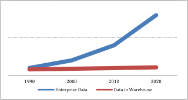
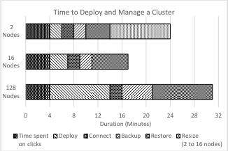
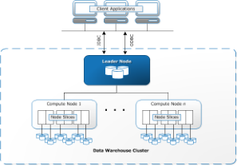
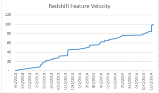
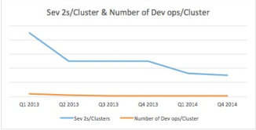

# Amazon Redshift and the Case for Simpler Data Warehouses（中文译文）

## 译者说明

本文依据同目录的 `source.pdf` 翻译。章节、图表、公式、算法、代码与参考文献按原文结构保留。

## 摘要

Amazon Redshift 是一个快速、全托管、PB 级数据仓库服务，使用户能够用现有商业智能（BI）工具，以简单且低成本的方式分析大量数据。自 2013 年 2 月发布以来，Redshift 成为 AWS 增长最快的服务之一，拥有数千客户并管理许多 PB 数据。

Redshift 的采用速度让很多数据仓库社区参与者感到意外。虽然它发布时价格具有破坏性，低至约每 TB 每年 1000 美元；虽然市场上也有开源数据仓库技术和提供免费开发版或用量限制版本的商业引擎；虽然 Redshift 使用现代 MPP、列式、横向扩展架构，而其他数据仓库引擎也有类似技术；并且虽然用户也可以在 EC2 上自建数据仓库，但 Redshift 仍然快速增长。

本文讨论一个常被低估的差异化因素：简单性（simplicity）。Redshift 的目标并不是只和其他数据仓库引擎竞争，而是和“不消费数据仓库能力”竞争。我们认为，大多数数据被收集却没有被分析；当代经济中数据集大小与公司规模相关性不强；分析技术的采购和消费模型必须支持实验和评估。因此，Redshift 通过易购买、易调优、易管理，同时保持快速和低成本，将数据仓库能力带给更广泛市场。

## 1. 引言

许多公司会在事务处理数据库之外建设数据仓库，用于报表和分析。分析机构估计，数据仓库市场约占关系数据库市场三分之一，且年复合增长率为 8%-11%。与此同时，企业典型数据存储在过去十年以 30%-40% 的年复合增长率增长，近 12-18 个月的研究甚至显示增长率上升到 50%-60%，数据约每 20 个月翻倍。

图 1 展示企业中“已收集数据”和“进入数据仓库可分析数据”之间的差距。我们称未被充分分析的数据为 dark data。企业保存这些数据，说明它们认为数据有价值；但数据景观变得越来越暗，意味着分析能力没有跟上数据收集速度。

我们把分析缺口归因于四类原因：

- 成本：能在规模上分析数据的商业数据库通常需要很高前期投入，难以为价值不明确的大数据集辩护。
- 复杂性：数据库供应、维护、备份和调优需要专业技能，通常需要 IT 参与，业务数据科学家和分析师难以独立完成。
- 性能：扩展数据仓库时很难不影响查询性能；系统建成后，IT 团队有时会限制新增数据或新增查询，以保护既有报表 SLA。
- 刚性：多数数据库最适合高度结构化关系数据，而越来越多数据来自随时间变化的机器日志、音频、视频等，不易直接进入关系分析。

Amazon Retail 是一个大规模例子。其每天收集约 50 亿条 Web 日志记录（约 2TB/天，年增长 67%），并希望将这些日志与关系型和 NoSQL 系统中的事务数据结合。使用现有横向扩展商业数据仓库时，每小时只能分析 1 周数据，并在最大配置下保留 15 个月日志；使用更大的 Hadoop 集群时，每小时可分析 1 个月数据，但集群管理成本很高。通过增加一个 PB 级 Amazon Redshift 集群，Amazon Enterprise Data Warehouse 团队能在 10 分钟内完成每日 50 亿行装载，在 9.75 小时内回填 1500 亿行月度数据，在 30 分钟内备份，并在 48 小时内恢复到新集群。更重要的是，它能在不到 14 分钟内运行 2 万亿行点击流与 60 亿行商品 ID 的 join，而该操作在既有系统上一周多仍未完成。

Redshift 使用了熟悉的数据仓库技术：列式布局、按列压缩、计算与数据共置、join 共置、编译为机器码，以及横向扩展 MPP 处理。除此之外，Redshift 还有一组面向简单性的设计目标：

- 最小化实验成本：提供 60 天免费试用，支持最多 160GB 压缩 SSD 数据；后续实验可用每节点每小时 0.25 美元创建集群，无需承诺。
- 最小化首份报告时间：从决定创建集群到看到第一个查询结果可以低至 15 分钟，即使是多 PB 集群。
- 最小化管理：自动化备份、恢复、供应、补丁、故障检测和修复；加密、集群 resize、灾备等高级操作只需少量点击。
- 最小化扩展顾虑：除并行化装载和查询外，也并行化集群创建、补丁、备份、恢复和 resize；价格随数据增长线性或次线性。
- 最小化调优：尽量避免旋钮（knobs），并让剩余旋钮在默认设置下足够好。例如，系统基于数据采样自动选择压缩类型，避免索引或 projection，转而偏向多维 z-curve。

图 2 展示不同规模集群常见管理操作的执行时间，包括点击、部署、连接、备份、恢复和从 2 节点 resize 到 16 节点。

作为 AWS 云中的托管服务，Redshift 还获得三类优势。首先，它能利用 EC2 的价格与规模、S3 的持久性与吞吐、VPC 的安全能力。其次，自动部署和补丁让团队能以高频发布软件，过去两年平均每周增加一个功能；运行服务带来的快速反馈也使 Redshift 的 OODA 循环比本地部署供应商更敏捷。第三，团队管理数千 Redshift 集群，许多对单个本地 DBA 不划算的自动化投资，在服务规模下变得合理。

## 2. 系统架构

Amazon Redshift 架构包含三个部分：数据平面（data plane）、控制平面（control plane）和依赖的 AWS 服务。数据平面是数据库引擎，负责数据存储和 SQL 执行；控制平面提供监控与管理数据库的工作流；其他 AWS 服务支持数据平面和控制平面运行。

### 2.1 数据平面

Redshift 引擎是兼容 SQL 的大规模并行查询处理和数据库管理系统，面向分析工作负载。这里的分析工作负载指：定期摄入可能很大的增量数据集，并运行 join、scan、filter、aggregate 等查询，查询可能覆盖总数据的大部分。初始引擎来自 ParAccel 授权代码库。

图 3 展示 Redshift 系统架构。一个 Redshift 集群包含 leader node 和一个或多个 compute node；也支持单节点设计，此时 leader 与 compute 工作共处一节点。

leader node 接受客户端连接，解析请求，为 compute node 生成并编译查询计划，在需要时执行最终聚合，并协调事务序列化与状态。compute node 负责本地数据上的查询处理和数据操作。

每张表的数据自动分布到 compute node 之间以扩展大数据集，并在 compute node 内部分布到 slice 以减少多核处理器核心之间的争用。每个 slice 分配一部分内存和磁盘空间，处理分配给该节点的一部分工作负载。用户可以选择 round-robin 分布、按 distribution key 哈希分布，或在所有 slice 上复制。使用 distribution key 能让同 key join 在单个 slice 上共置，减少 I/O、CPU 和网络争用，避免执行期间重新分布中间结果。slice 内部使用列式存储，每列编码为一个或多个固定大小的数据块链；同一行各列之间的关联通过列链中的逻辑 offset 计算得到，并作为元数据保存。

数据块会在数据库实例内部和 S3 中复制。每个块同步写到 primary slice 和至少一个位于不同节点上的 secondary；同时，块也自动异步备份到 S3。primary、secondary 和 S3 副本都可用于读取，因此介质故障对用户透明。客户还可以选择把备份写到第二个区域，以防灾备。

查询处理从 leader node 上生成查询计划并编译为 C++/机器码开始。编译会增加每个查询的固定开销，但 compute node 上更紧凑的执行通常能抵消通用 executor 函数的开销。可执行代码和计划参数被发送到参与查询的 compute node；compute node 执行后把中间结果返回 leader node 做最终聚合。每个 slice 可并行运行扫描、过滤、join 等多个操作。

数据装载是查询处理的特殊情况，使用修改版 PostgreSQL `COPY`。Redshift 的 `COPY` 可以直接从 S3、DynamoDB、EMR 或任意 SSH 连接装载数据。`COPY` 按 slice 并行执行，每个 slice 并行读取、按需分发并本地排序。默认情况下，装载会更新压缩方案和优化器统计信息。它还直接支持 JSON，以及加密/压缩数据。

### 2.2 控制平面

每个 Redshift 节点除数据库引擎外，还有 host manager 软件，负责部署新引擎版本、聚合事件和指标、生成实例级事件、归档和轮转日志、监控主机/数据库/日志错误，并能执行有限动作，例如在数据库进程失败时重启进程。

多数控制平面动作由单独的 Redshift control plane fleet 在实例外协调。这些节点负责全 fleet 监控与告警，并根据 host manager 遥测或客户通过控制台/API 请求发起维护任务，例如节点替换、集群 resize、备份、恢复、供应和补丁。

### 2.3 依赖的 AWS 服务

Redshift 还依赖多个 AWS 与内部服务，包括部署、短期凭证、日志收集、负载均衡、计量等。这显著加速了 Redshift 开发，因为团队不必重新构建已有的稳健、容错和安全组件，也能直接获得 AWS 其他团队持续改进。例如，过去两年 EC2 显著增强了入侵检测、网络 QoS、每秒包数、服务器健康监控和 I/O 队列管理，Redshift 无需改变引擎即可吸收这些能力。

整体上，Redshift 将传统并行分布式关系数据库架构与面向服务的管理架构结合起来。两者结合时产生了最强差异化。以备份为例，Redshift 可以依赖 S3 的可用性、持久性和 API，实现连续、增量、自动备份，并把 S3 备份纳入数据可用性和持久性设计。当本地存储缺失某个块时，系统可以像 page fault 一样从 S3 拉取块。流式恢复允许元数据和 catalog 恢复后数据库先开放 SQL 操作，同时后台继续下载数据块。由于数据仓库平均工作集只是总数据的一小部分，查询能在完整恢复完成前获得良好性能。

## 3. 简单性的理由

我们认为，基于 SQL 的数据库成功，很大程度来自声明式查询处理和并发执行模型对应用开发的简化。数据仓库和后来的列式布局进一步简化了 schema 设计并降低 join 成本。客户总会要求更强能力，但能力通常需要更多教育和理解。Redshift 的原则是，在提供能力的同时保持简单。有客户把需求概括为：“我想和我的数据建立关系，而不是和我的数据库建立关系。”

### 3.1 简化购买决策过程

Redshift 团队把 “time to first report” 作为关键指标：从客户第一次查看网站评估服务开始，到客户能首次发出查询并获得结果为止。团队用零售心态看待这个过程，将寻找 AWS 数据管理技术的客户视作在 Amazon.com 上寻找笔记本或 CD 的同一个人。点击路径、页面流失点等电商技术同样适用。

这些看似不是软件开发问题，但会影响产品决策。发布时使用标准 PostgreSQL ODBC/JDBC 驱动，让客户相信现有工具生态大多能工作。线性价格模型影响了 Redshift 的扩展方式。减少创建和配置数据库所需的前置步骤降低了流失。

在集群创建这个类似“包裹配送”的流程中，Redshift 将必填信息限制为节点数量和类型、基本网络配置以及管理员账号信息。发布时，集群创建平均耗时 15 分钟；后来通过预配置 Redshift 节点，创建时间降到 3 分钟，并降低了节点故障替换时间。

降低错误成本和缩短交付时间同样重要。客户如果能方便地“退货”或“换货”数据库，就更愿意实验。首次创建集群的客户自动获得足够的免费小时数，在前两个月持续运行支持 160GB 压缩 SSD 数据的数据库。超过这一规模后，按小时计费减少了承诺成本。客户随时可以把集群 resize 到更大、更小或不同实例类型，避免提前估算容量和性能。底层系统会创建新集群，把原集群置为只读，并从源到目标并行节点到节点拷贝；操作完成后迁移 SQL endpoint 并释放源集群。

### 3.2 简化数据库管理

多数 Redshift 客户没有专职 DBA。Redshift 服务承担数据库管理中的 undifferentiated heavy lifting，包括供应、补丁、监控、修复、备份和恢复。我们认为，数据库管理操作也应像查询一样声明式，由数据库决定并行化和分布方式。Redshift 操作在集群内是数据并行的，在 fleet 级补丁和监控等操作上也是集群并行的。

例如，备份整个集群所需时间与单个节点上改变的数据量成比例。系统备份自动执行并自动过期；用户备份复用系统备份中已有的数据块，并保留到用户显式删除。跨区域灾备只需在控制台勾选并指定区域，系统会将数据块同时备份到本地和远程区域。灾备备份也支持流式恢复，使客户能在远程区域启动集群后数分钟内开始查询。

加密同样被简化。启用加密只需在控制台勾选，并可选指定硬件安全模块（HSM）等 key provider。底层系统生成 block-specific encryption key，再用 cluster-specific key 包装，最后用由 Redshift 离线保存或客户 HSM 提供的 master key 包装。所有用户数据和备份都会加密。密钥轮转只需重新加密 block key 或 cluster key，而不必重写整个数据库。Redshift 也利用 VPC 隔离提供集群存储的 compute node，使其不受可从客户 VPC 访问的 leader node 的通用访问影响。

未来工作是进一步去掉用户发起的表管理操作，使其更接近备份：数据库应能判断数据访问性能何时下降，并在负载较轻时自动修复。

### 3.3 简化数据库调优

相比其他数据库引擎，Redshift 调优旋钮很少。客户主要设置集群实例类型、节点数量，以及单表使用的排序和分布模型。其他参数如列压缩类型，系统尽量自动设好。数据库通常拥有足够信息来做决策，包括查询模式、数据分布和压缩代价。

Redshift 也希望排序列和分布键逐步变成“积灰旋钮”。一种方法是降低次优决策成本。例如，缺失 projection 可能导致全表扫描，而多一个 projection 又会显著影响装载时间。相比之下，使用 z-curve 的多维索引即使参与列过多也会更平滑退化，并且在未指定 leading column 时仍有作用。类似地，z-curve 可减少 join 涉及的节点范围，而不是让 join 完全本地化或完全分布式。进一步放松数据和查询计算到节点/slice 的映射，也会让系统更弹性，可随负载增长或收缩。

## 4. 客户使用场景

多种 Redshift 使用场景的共同点是 SQL。用户能声明式描述意图，并由系统自动生成优化执行计划；当计算要在多节点上分布和并行，且资源要在多个并发查询之间分配时，这一点尤其重要。我们认为，未来工作中的共同主题是数据移动和转换：今天这部分还缺少类似数据库内部声明式 SQL 处理那样的简单性与能力。

企业数据仓库。许多客户把 Redshift 用作传统企业数据仓库：从多个源关系数据库导入数据，按小时或夜间节奏摄入，并通过 BI 工具访问。客户重视采购过程简单透明、低成本评估服务，以及沿用现有 BI/ETL 工具体系。他们通常被既有系统维护负担困扰，认可托管系统承担繁重基础管理工作的价值。

半结构化“大数据”分析。许多客户用 Redshift 集成分析日志和事务数据。我们观察到不少客户从 Hadoop/Hive 迁移过来，获得更高性能和更低成本，同时能直接通过 SQL 或 BI 工具向业务分析师开放系统，而不再要求工程师和数据科学家生成报表。这类场景往往缺少 DBA，因此简单性是核心驱动。

数据转换。越来越多客户把 Redshift 放入数据处理流水线：把大量原始数据放入数据仓库，运行大型 SQL 作业生成输出表，再供在线业务使用。例如广告技术中，数十亿广告曝光可以被归纳成 lookup table，服务广告交易系统。我们也看到客户直接把 Redshift 嵌入面向客户的分析报表和图形界面中。这体现了 SQL 的优势：清晰声明意图，并让底层系统自动完成并行查询分解。SQL on Hadoop 社区也出现类似趋势，即用 SQL 降低编写 MapReduce 作业的人力成本。

小数据。大量 Redshift 客户以前从未使用过数据仓库，而是直接在源事务系统上运行报表。Redshift 的成本结构和低管理开销让这些客户能够建立数据仓库，获得更好的报表性能、OLTP 系统卸载和历史数据保留。由于这些客户习惯源数据变更后很短时间可见，自动变更数据捕获、自动 schema 创建和维护很重要。

## 5. 经验教训

Redshift 自 2013 年 2 月正式发布后快速增长。两年多运行数千数据库实例后，我们总结了几条经验。

设计自动扶梯，而不是电梯。大规模 fleet 运行中，硬件、软件和服务依赖都会失败。系统应在失败时降级，而不是完全失去可用性。数据块复制是硬件故障场景中的常见模式；面对软件或服务依赖时也需要类似思路。例如，Redshift 支持在每个数据中心预配置节点，使 EC2 供应中断时仍能在一段时间内继续供应和替换节点；也可以本地提高复制来抵御 S3 或网络中断。

持续交付应该交付到客户。许多工程组织有持续构建和自动测试流水线，但并不高频真正发布。客户和工程组织一样更喜欢小补丁而不是大补丁，但数据库补丁通常过程繁重，导致客户特例补丁增多、补丁过程更脆弱。

图 4 展示 Redshift 累计部署功能数随时间的增长。Redshift 每周在客户指定的 30 分钟窗口自动给集群打补丁。补丁可逆；若遥测发现错误或延迟增加，会自动回滚。任意时刻客户只会位于两个补丁版本之一，大幅提升复现和诊断能力。团队通常每两周发布一次包含功能和修复的数据库引擎软件；我们发现把节奏放慢到每四周反而会明显增加补丁失败概率。

用 Pareto 分析安排工作。服务快速增长时，运营负载容易淹没开发能力。Redshift 每次数据库失败都会分页通知工程师，因为即使问题不广泛，对受影响客户也有意义。图 5 中，Sev 2 表示触发工程师被分页的严重级别 2 告警。Redshift 收集全 fleet 错误日志并监控工单，识别前十大错误原因，目标是每周消除其中一个主要原因。

Pareto 分析也有助于理解客户功能需求，但更难自动收集。Redshift 团队通过每年与客户进行超过 1000 次一对一直接交流来获取样本，识别客户需求和服务缺口。未来希望自动收集各功能使用统计、查询计划形态等 fleet 级遥测。

## 6. 相关工作

Redshift 发布时是第一个广泛可用的数据仓库即服务（data warehouse-as-a-service），但其核心数据库技术来自 ParAccel 授权技术。ParAccel 属于 2000 年代中后期出现的一组列式 DBMS 产品，类似 Vertica、Ingres VectorWise、Infobright、Kickfire 等。这些系统在设计理念和功能上有许多相似之处，并受 C-Store 和 MonetDB/X100 两个现代列存系统影响。

Redshift 的压缩技术与 Vertica 类似，其性能权衡已有研究。Redshift 放弃传统索引或 C-Store/Vertica projection，转而通过编译代码执行和基于内存中 value range 的列块跳过来提高顺序扫描速度。Infobright 的 Knowledge Grid 和 Netezza 的 Zone Map 也依赖块跳过；该技术最早可追溯到相关轻量索引结构研究。查询执行中的代码编译技术也重新受到学术关注，并被 Microsoft Hekaton 等系统采用。

## 7. 结论

Redshift 的价格、性能和简单性把数据仓库使用场景从传统企业数据仓库扩展到大数据、SaaS 应用和嵌入式分析。不同于需要大额前期付款、数月供应商谈判、硬件采购和部署的传统数据仓库，Redshift 集群可在数分钟内供应，使客户无需承诺即可开始，并可扩展到 PB 级集群。Redshift 还提供自动补丁、供应、扩展、安全、备份、恢复，以及静态加密、传输加密、HSM 集成和审计日志等安全能力。

通过大幅降低部署数据仓库系统的成本和工作量，同时不牺牲功能和性能，Redshift 不仅改变了传统企业对数据仓库的看法，也把数据仓库技术带给此前没有考虑过它的客户群。其客户范围包括 NTT DOCOMO、Amazon.com 这类拥有多 PB 系统的企业，也包括 Pinterest、Flipboard 等拥有数百 TB 数据的高规模创业公司，以及数据仓库只有数百 GB 的小型创业公司。

## 8. 致谢

原文感谢 Amazon Redshift 团队每位工程师的贡献，他们交付了首个版本，并持续以快速节奏创新，同时保持服务运营卓越。我们还感谢 Raju Gulabani 对 Redshift 发布和后续运营的指导。Redshift 的数据库引擎来自 ParAccel 团队的工作，而 ParAccel 又受益于 PostgreSQL 社区。我们还感谢 Christopher Olston、Sihem Amer-Yahia 以及审稿人的意见。

## 9. 参考文献

- [1] Abadi D., Boncz P., Harizopoulos S., Idreos S., Madden S. The Design and Implementation of Modern Column-Oriented Database Systems. Foundations and Trends in Databases, 2013.
- [2] Daniel J. Abadi, Samuel R. Madden, and Miguel Ferreira. Integrating compression and execution in column-oriented database systems. SIGMOD, 2006.
- [3] Peter Boncz, Marcin Zukowski, and Niels Nes. MonetDB/X100: Hyper-pipelining query execution. CIDR, 2005.
- [4] Cristian Diaconu, Craig Freedman, Erik Ismert, Per-Ake Larson, Pravin Mittal, Ryan Stonecipher, Nitin Verma, Mike Zwilling. Hekaton: SQL Server's memory-optimized OLTP engine. SIGMOD, 2013.
- [5] Guido Moerkotte. Small Materialized Aggregates: A Light Weight Index Structure for Data Warehousing. VLDB, 1998.
- [6] Thomas Neumann. Efficiently Compiling Efficient Query Plans for Modern Hardware. PVLDB, 2011.
- [7] J. A. Orenstein and T. H. Merrett. A class of data structures for associative searching. PODS, 1984.
- [8] Michael Stonebraker, Daniel J. Abadi, Adam Batkin, Xuedong Chen, Mitch Cherniack, Miguel Ferreira, Edmond Lau, Amerson Lin, Samuel R. Madden, Elizabeth J. O'Neil, Patrick E. O'Neil, Alexander Rasin, Nga Tran, and Stan B. Zdonik. C-Store: A Column-Oriented DBMS. VLDB, 2005.
- [9] J. Sompolski, M. Zukowski, and P. A. Boncz. Vectorization vs. compilation in query execution. DaMoN, 2011.
- [10] Gartner: User Survey Analysis: Key Trends Shaping the Future of Data Center Infrastructure Through 2011; IDC: Worldwide Business Analytics Software 2012-2016 Forecast and 2011 Vendor Shares.
