# AnalyticDB: Real-time OLAP Database System at Alibaba Cloud（中文译文）

## 译者说明

本文依据同目录的 `source.pdf` 翻译。章节、图表、公式、算法、代码与参考文献按原文结构保留。

## 摘要

阿里云业务覆盖电子商务、金融、物流、公共交通、地理分析、娱乐等广泛领域，数据规模和类型快速增长。实时服务中的 OLAP 数据库越来越关键：用户希望在 PB 级数据上获得低延迟查询、新鲜数据、灵活查询、低成本、高查询并发、高写入吞吐、可扩展性和可用性。

本文介绍 AnalyticDB，一个由阿里巴巴开发并部署在阿里云上的实时 OLAP 数据库系统。AnalyticDB 在所有列上异步维护索引，在可接受开销下支持复杂即席查询；存储引擎扩展混合行列布局（hybrid row-column layout），同时支持结构化数据和 JSON、向量、文本等复杂类型；系统解耦读写路径以支持高查询并发和高写入吞吐；查询优化器与执行引擎感知底层存储和索引特性。AnalyticDB 已在阿里云服务大量客户，支持 10PB+ 数据、100 万亿行记录、每秒千万级写入和十万级查询，并能在数百毫秒内完成复杂查询。

## 1. 引言

AnalyticDB 是面向高并发、低延迟、实时分析查询的 OLAP 数据库系统，运行在阿里云 2000+ 物理机上。与传统离线数据仓库相比，它的目标更接近在线服务：查询需要实时响应，写入需要高吞吐，数据需要尽快可见。

论文指出 AnalyticDB 面对三个主要挑战。

第一，用户分析场景变得更复杂且更临时（ad-hoc）。查询可能从全表扫描、点查找到多表 join，并涉及多个列条件。只为预先指定列建立索引已经不够。AnalyticDB 因此在所有列上维护索引，并通过运行时选择机制避免索引滥用。

第二，复杂分析同时涉及结构化和复杂类型数据。传统 OLAP 查询偏好列存，点查找偏好行存；JSON、文本和向量还需要不同的检索结构。AnalyticDB 使用混合行列存储，并扩展索引以支持复杂类型。

第三，系统既要支持低延迟实时查询，也要处理每秒千万级在线写入。若读写共享同一执行路径，资源争用会相互伤害。AnalyticDB 采用读写解耦架构，让写节点负责 INSERT/UPDATE/DELETE，让读节点负责 SELECT，并用版本验证保证可见性。

本文贡献包括：

- 高效索引管理：在所有列上建索引，使用运行时过滤比选择索引路径，并将大索引异步构建移出写路径。
- 面向结构化和复杂类型数据的存储布局：混合行列布局兼顾 OLAP 查询和点查找，并为 JSON、全文和向量提供索引能力。
- 读写解耦：写节点和读节点独立扩展，通过版本验证和推送更新实现有界陈旧读与实时读。
- 增强优化器和执行引擎：存储感知优化、连接下推、向量化执行和代码生成充分利用底层索引与存储。

本文其余部分安排如下：第 2 节讨论相关工作；第 3 节介绍读写解耦架构；第 4 节说明面向结构化数据与复杂类型数据的存储结构和索引；第 5 节介绍优化器与执行引擎上的优化；第 6 节评估 AnalyticDB；第 7 节给出结论。

## 2. 相关工作

OLTP 数据库如 MySQL 和 PostgreSQL 面向事务查询，通常以行存和 B+tree 索引服务点查找。它们并不适合宽表分析查询，因为只访问少数列时仍会产生较高 I/O。

OLAP 数据库如 Vertica、Teradata 和 Greenplum 通过列存、投影和 MPP 提高分析查询效率。它们的限制在于：全列索引会显著影响写路径，列存对点查找不友好，且复杂类型支持有限。

大数据批处理系统如 Hive、Spark SQL 和 Impala 能处理大规模数据，但 Hive/Spark SQL 查询更偏离线，延迟可能达到分钟级或小时级；Impala 将离线查询转向交互式执行，但缺乏强索引支持。

实时 OLAP 系统如 Druid 和 Pinot 使用列存与倒排/位图索引，适合低延迟聚合，但 Druid 的索引集中在维度列，Pinot 和 Druid 的索引更新通常位于写路径中，且对 UPDATE、DELETE、JOIN 和点查找的支持有限。

云分析服务如 Amazon Redshift 和 Google BigQuery 提供托管数据仓库能力。Redshift 基于列存和 MPP，BigQuery 基于 Dremel 的列式存储和树形调度。AnalyticDB 的差异是引入全列索引、混合行列存储、读写解耦和 DAG/流水线执行，以服务实时 OLAP 与在线写入。

## 3. 系统设计

AnalyticDB 运行在飞天（Apsara）之上，依赖两个核心组件：盘古（Pangu）分布式存储系统和伏羲（Fuxi）资源管理与作业调度系统。

图 1 展示了 AnalyticDB 架构。客户端通过 JDBC/ODBC 连接协调器（coordinator）。协调器把写入请求分派给写节点，把查询请求分派给读节点。写节点处理 INSERT、DELETE、UPDATE，并把 SQL/log 持久化到盘古；读节点处理 SELECT，并缓存/加载分区数据；Fuxi 为异步任务提供计算资源。

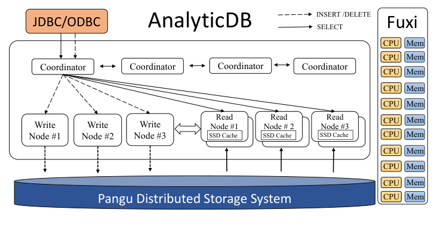

### 3.1 数据模型和查询语言

AnalyticDB 遵循关系数据模型，表具有固定 schema。它支持 ANSI SQL:2003，并增加分区声明、复杂类型操作等功能。除数值和字符串外，它还支持全文、JSON、向量等类型，以满足实际分析场景。

### 3.2 表分区

AnalyticDB 的每张表包含两级分区：主分区（primary partition）和次分区（secondary/sub partition）。图 2 展示了一个建表 DDL：主分区按 `id` 哈希成 50 个分区，次分区按 `dob` 列做列表分区，最多保留 12 个可用分区。

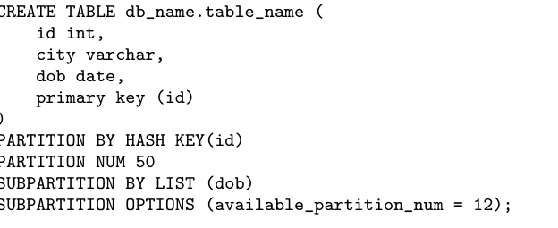

```sql
CREATE TABLE db_name.table_name (
    id integer,
    city varchar,
    dob date,
    primary key (id)
)
PARTITION BY HASH KEY(id)
PARTITION NUM 50
SUBPARTITION BY LIST (dob)
SUBPARTITION OPTIONS (available_partition_num = 12);
```

主分区按用户指定列的哈希分布行，以最大化并发；实践中通常选择高基数列。次分区常用于时间列，如天、周、月。一旦次分区数超过阈值，最旧分区会被自动回收。

### 3.3 架构概览

AnalyticDB 主要包含三类节点：协调器、写节点和读节点。协调器接收客户端请求并解析为读或写；写节点负责接收和持久化写日志；读节点负责查询执行。Fuxi 为计算 worker 分配资源。AnalyticDB 还提供通用执行引擎与流水线执行引擎。

图 3 展示流水线执行引擎。数据以列块（page）为单位从存储流向客户端，中间算子在内存中处理，并在多个阶段之间流水化传递。这减少了中间落盘和阻塞，使复杂查询能获得高吞吐和低延迟。

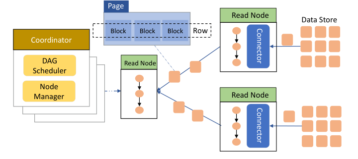

### 3.4 读写解耦

传统 OLAP 数据库常把读写请求放在同一执行路径中，共享同一资源池。在查询和写入并发都很高时，这会造成资源争用。AnalyticDB 将读写分离：写节点只服务写请求，读节点只服务查询，两者彼此隔离并可独立扩展。

#### 3.4.1 高吞吐写入

每个写节点集群中有一个 master，其余为 worker。它们通过基于 ZooKeeper 的锁服务协调。写节点启动后，master 根据表分区配置分配 worker；协调器按配置把写请求分发给对应写节点。每个写节点将接收的 SQL 语句缓存在内存中，并定期刷到盘古作为日志。刷盘完成后，写节点返回版本号（log sequence number），协调器再向用户返回提交成功。

当盘古上的日志文件达到一定规模时，AnalyticDB 会在 Fuxi 上启动多个 MapReduce 作业，把日志提交转化为基线数据和索引。

#### 3.4.2 实时读取

图 4 展示读节点之间的数据放置。具有相同哈希值的分区被放在同一读节点上。这样的分区放置配合存储感知优化器，可减少数据重分布成本；生产统计表明，数据重分布可减少 80% 以上。读节点默认有副本，以支持并发和可靠性。

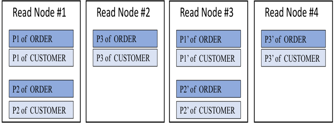

读节点从盘古加载初始分区，并周期性地从对应写节点拉取更新。AnalyticDB 提供两种可见性级别：写入后立即可读的实时读（real-time read），以及在有限延迟内可见的有界陈旧读（bounded-staleness read）。默认使用有界陈旧读，以降低查询延迟；用户需要更高可见性时可以启用实时读。

图 5 展示实时读取流程。每个主分区在写节点上关联一个版本。写入刷新后，写节点递增分区版本并把版本返回给协调器。查询到达时，协调器带上前序写入的版本；读节点将本地版本与所需版本比较。如果本地版本足够新，直接执行；否则先从写节点拉取最新数据并更新本地副本。

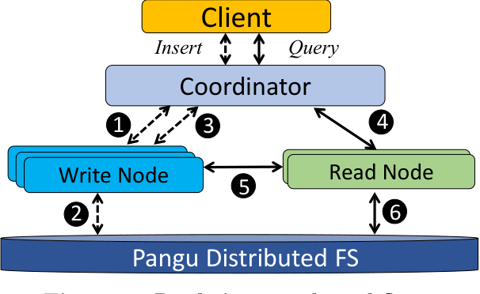

为了避免读节点等待拉取导致高延迟，AnalyticDB 还把读节点拉取优化为写节点推送：写节点观察到新写入时，主动把数据与版本推送给对应读节点。

#### 3.4.3 可靠性和可扩展性

写节点失败时，master 会把受影响分区均匀迁移到可用写节点；master 失败时，从活跃 worker 中选举新的 master。读节点可以配置副本因子，同一分区的多个副本部署在不同物理机。读节点故障时，协调器把查询重新发送到其他副本；若读节点无法联系写节点，它也可以直接从盘古读取数据继续执行。

写节点扩容时，master 调整表分区放置并写入 ZooKeeper；协调器随后按新放置分发写请求。读节点扩容类似，由协调器调整表分区位置。

### 3.5 集群管理

AnalyticDB 的集群管理组件 Gallardo 面向多租户。它使用 Control Group 技术隔离不同 AnalyticDB 实例的 CPU、内存和网络带宽，并在创建实例时把 coordinator、write node、read node 及读节点副本放置到不同物理机以满足可靠性需求。Gallardo 负责实例间资源隔离，Fuxi 负责所有实例内部的计算任务调度，两者职责不同。

## 4. 存储

AnalyticDB 的存储模型同时支持结构化数据和 JSON、向量等复杂类型。它的基础是混合行列布局和全列索引。

### 4.1 物理数据布局

#### 4.1.1 混合行列存储

图 6 展示混合行列存储中的数据格式、元数据和索引格式。每个表分区维护一个 detail file，并划分为多个 row group。每个 row group 包含固定数量的行；同一列的值连续放置并形成 data block。data block 是 AnalyticDB 中 fetch 与 cache 的基本单位。

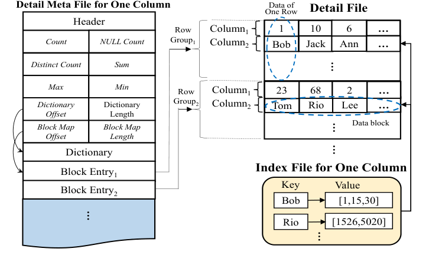

这种设计兼顾列存和行存。与列存类似，它按列聚集数据，适合只访问少数列的 OLAP 查询；与纯列存相比，点查找时同一行的列仍在相同 row group 内，组装一行只需短距离顺序查找。生产测量中，这类开销低于总查询延迟的 5%。

复杂类型数据大小可变，且通常比数值和短字符串大。图 7 展示复杂类型数据格式：data block 进一步划分为固定大小的 FBlock（默认 32KB）。data block 中维护 block entry，记录每个 FBlock 覆盖的起止行。访问一行时，系统先扫描 block entry 定位相关 FBlock，再获取并拼接部分行。

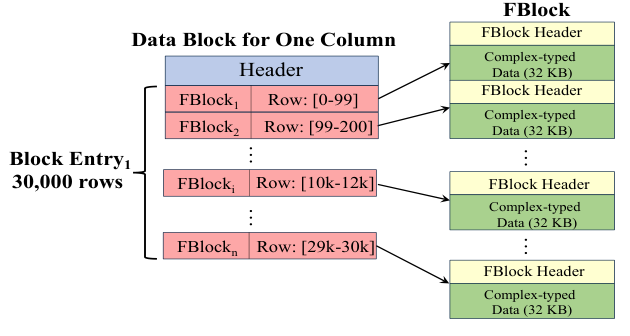

#### 4.1.2 元数据

detail file 中每一列都有单独的 detail meta file，并常驻内存。元数据包含四部分：header，记录版本和文件长度；summary，记录行数、NULL 数、基数、SUM、MAX/MIN 等优化器所需统计信息；dictionary，对低基数列自动启用以节省空间；block map，为每个 data block 记录 offset/length 以支持快速访问。

#### 4.1.3 数据操作

AnalyticDB 使用 Lambda 架构保存基线数据和增量数据。图 8 展示对存储执行 INSERT/DELETE/UPDATE 与查询时，基线数据、增量数据、删除位图和版本之间的关系。基线数据保存历史数据，包含索引和行列数据；增量数据保存新写入数据，并维护简单排序索引。查询给定版本号后，同时访问基线与增量数据，并通过删除位图过滤被删除的行。

为支持 UPDATE，AnalyticDB 使用 bit-set 记录每个 row id 是否已删除。插入或删除行时，系统把相应 bit 置为 0 或 1，并在内存映射中按版本号保存 bit-set snapshot；查询给定版本后，以对应 snapshot 服务。为节省空间，bit-set 被切分成多个 snapshot segment，不同 snapshot 可共享未变化的 segment。当某版本的 snapshot 已无查询使用时，系统会删除它。若查询请求的版本在 bit-set snapshot 中已经不可用，查询会被拒绝。目前 UPDATE 只支持按主键更新，以避免一次操作改动过多数据；一次 UPDATE 被视为 DELETE 与 INSERT 的组合。

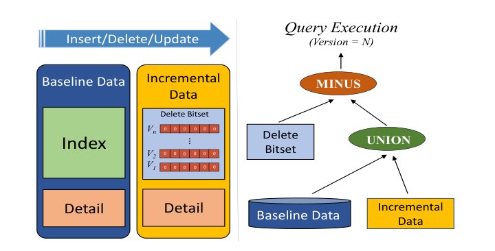

算法 1 说明 INSERT：解析 SQL、追加到增量数据尾部、为删除位图添加新位、创建位图快照，并把版本与快照写入映射。

```text
Input: SQL statement and version number

values = parse(SQL)
row_id = incremental_data.append(values)
delete_bitset[row_id] = 0
delete_bitset_snap = create_snapshot(delete_bitset)
snap_map.put(version, delete_bitset_snap)
```

算法 2 说明 DELETE：先按 WHERE 条件搜索，再把满足条件的 row id 在删除位图中置为 1，最后创建版本快照。

```text
Input: SQL statement and version number

row_ids = search(baseline_data, incremental_data, SQL.where)
for each row_id in row_ids do
    delete_bitset[row_id] = 1
delete_bitset_snap = create_snapshot(delete_bitset)
snap_map.put(version, delete_bitset_snap)
```

算法 3 说明 FILTER：根据查询版本获取删除位图快照，搜索索引得到候选 row id，再减去已删除 row id。

```text
Input: filter conditions and version number
Output: row ids satisfying conditions

delete_bitset_snap = snap_map.get(version)
row_ids = search(baseline_data, incremental_data, conditions)
return minus(row_ids, delete_bitset_snap)
```

图 9 展示基线数据与增量数据的合并过程。构建过程开始后，当前增量数据被冻结，并创建新的增量数据继续接收写入。构建完成后，查询切到新的基线数据，旧基线和旧增量数据可安全删除。此时新的增量数据成为后续查询使用的增量部分。

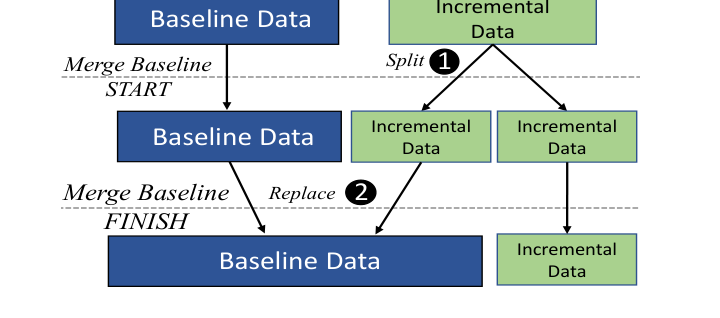

### 4.2 索引管理

AnalyticDB 的核心设计之一是在所有列上构建索引，支持高性能即席查询，并把索引构建完全移出写路径。

#### 4.2.1 索引过滤

每个分区的每列都构建倒排索引，每个索引存放在独立文件中；索引键是原列值，索引值是对应 row id 列表。图 10 给出一个过滤示例，查询同时包含结构化条件和复杂类型条件。每个条件先在对应索引上过滤得到部分 row id 集合，再通过交、并、差等操作合并成最终结果。合并结果有两种方式：2-way merging 使用常量内存，但需要两轮合并；K-way merging 会占用更多内存，却能保证大数据集上的亚秒级查询延迟。AnalyticDB 采用 K-way merging。

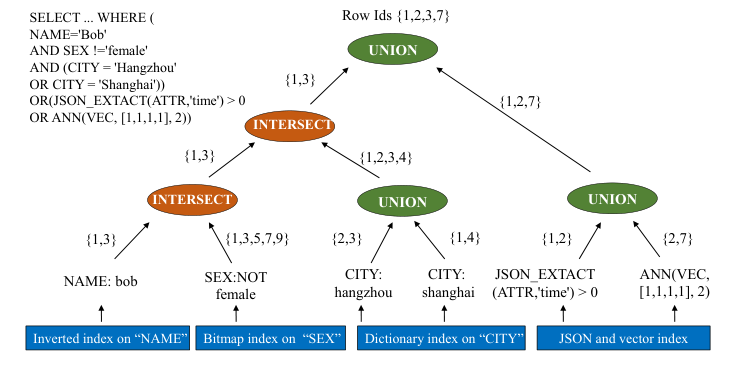

过度使用索引有时会降低性能。例如条件 A 的候选集远小于条件 B 时，先用 A 获取少量结果再用 B 过滤，比同时获取 A/B 并合并更划算。AnalyticDB 使用运行时过滤比（filter ratio）选择索引路径。过滤比定义为索引返回的合格行数除以元数据中的总行数。系统按过滤比从小到大处理条件；当已处理条件的联合过滤比足够小（例如小于总行数 1%）时停止继续索引过滤，后续条件直接作用于已得到的 row id 集。

#### 4.2.2 复杂类型数据索引

JSON。插入 JSON 对象时，AnalyticDB 将层次属性展平成多个列并分别建立倒排索引。例如对象 `{id, product_name, properties {color, size}}` 被展平成 `id`、`product_name`、`product_properties.color` 和 `product_properties.size`。每个索引键下的 row id 使用 PForDelta 压缩。为限制文件数，一个 JSON 对象的所有索引打包到单个文件中；AnalyticDB 通过 JSON format 中的映射把对象定位到文件内 offset，从而可以直接取得对象。

全文。对于全文数据，AnalyticDB 扩展倒排索引，额外存储 term frequency 以及 document 到 term 的映射，并使用 TF/IDF 分数计算查询与文本的相似度，返回分数超过阈值的对象。

向量。向量常用于对象/场景识别和机器学习。用户对向量数据通常执行最近邻搜索（nearest neighbour search, NNS）。给定数据库中同一列保存的向量集合 $Y \subset \mathbb{R}^D$ 和查询向量 $q \in \mathbb{R}^D$，NNS 定义为寻找使距离 $d(q, y)$ 最小的对象：

$$
NN(q) = \arg\min_{y \in Y} d(q, y)
\tag{1}
$$

AnalyticDB 支持欧氏距离、余弦距离等相似度度量，并可在 SQL 中指定。它结合 Product Quantization（PQ）和近邻图（k-NNG）等近似 NNS 方法，以降低全量线性扫描成本。

#### 4.2.3 索引空间节省

为降低索引空间，AnalyticDB 会根据索引值类型自动选择 bitmap 或整数数组。例如值为 `[1,2,8,12]` 时，bitmap（2 字节）比整数数组（4 字节）更省空间；值为 `[1,12,35,67]` 时，整数数组（4 字节）比 bitmap（9 字节）更合适。该自适应选择能将总索引大小降低约 50%。用户也可以禁用不需要索引的列以进一步节省空间。

#### 4.2.4 异步索引构建

AnalyticDB 每秒服务数千万写请求，无法在写路径同步构建全列索引。因此，写路径在写节点刷新日志到盘古后结束；索引引擎随后周期性地在新写入数据上构建索引，并在后台与已有索引合并。

表 1 比较了在 1TB 数据上为所有列建索引时 AnalyticDB 与 Greenplum 的开销。AnalyticDB 的索引空间为 0.66TB，远小于 Greenplum 的 2.71TB；索引构建异步执行，因此 1TB 实时摄取时间为 4,015 秒，而 Greenplum 同步建索引导致插入时间达到 20,910 秒。

| 指标 | AnalyticDB (ADB) | Greenplum (GP) |
| --- | ---: | ---: |
| Index Space | 0.66TB | 2.71TB |
| Index Building Time | 1 hour | 0.5 hour |
| Asynchronous? | Yes | No |
| Data Insertion Time | 4,015s | 20,910s |

#### 4.2.5 增量数据索引

异步索引会带来一个性能空窗：新索引上线前，增量数据缺少完整索引，查询增量数据可能变慢。AnalyticDB 在读节点上独立地为增量数据建立 sorted index。图 11 中，升序 sorted index 是 data block 中按值排序的 row id 数组，第 $i$ 个元素 $T_i$ 表示 data block 中第 $i$ 小的值位于第 $T_i$ 行；查询因此从扫描 $O(n)$ 转化为二分搜索 $O(\log n)$。系统在每个 data block 中分配额外 header 保存该索引；一个 block 约含 30K 行，row id 使用 short integer，因此 header（即 sorted index）约 60KB。flush data block 前，索引引擎构建 sorted index 并写入文件头。整个过程在读节点本地执行，开销很小。

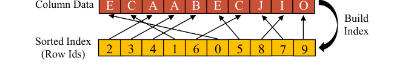

#### 4.2.6 条件索引缓存

传统数据库将索引页粒度缓存在内存中以降低磁盘 I/O。AnalyticDB 还缓存查询条件及其结果。查询条件（例如 `id < 123`）作为 key，结果（row id 集合）作为 value。后续查询若包含相同条件，就可以直接访问 index-page cache 或 condition cache。生产中常见现象是用户过滤条件持续变化，但并不频繁；例如查询中 `WHERE city='Beijing'` 可长期存在，而 `user_id=XXX` 这类小结果条件可以重新计算。缓存策略利用了这种规律，降低重复索引计算开销。

## 5. 优化器和执行引擎

本节分别介绍 AnalyticDB 优化器和执行引擎采用的新优化，它们进一步降低查询延迟并提高并发能力。

### 5.1 优化器

AnalyticDB 优化器同时提供 CBO（cost-based optimization）和 RBO（rule-based optimization），目标是服务要求极低响应时间和高并发的实时在线分析。优化器包含丰富的关系代数转换规则，以保证总能选出最优计划。这些规则包括：cropping、pushdown/merge、deduplication、constant folding/predicate derivation 等基本优化规则；面向 BroadcastHashJoin、RedistributedHashJoin、NestLoopIndexJoin 等不同 join，以及 Aggregate、JoinReorder、GroupBy pushdown、Exchange pushdown、Sort pushdown 等操作的 probe 优化规则；以及 Common Table Expression 等高级优化规则。除通用 CBO/RBO 外，AnalyticDB 还开发了两个关键特性：存储感知优化和高效实时采样。

图 12 展示 STARs（Strategy Alternative Rules）框架。优化器内部包含数据源能力、STARs 建模、动态规划、source-specific planner 和 connector manager。不同数据源向框架注册能力，优化器据此生成可执行 API 调用，并选择合适的数据位置和执行路径。

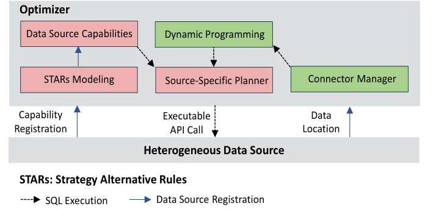

#### 5.1.1 存储感知计划优化

谓词下推。谓词（即条件）下推会从 SQL 中抽取可利用底层存储能力的关系代数计算，并把查询计划转换成计算层和存储层两个等价部分。原始查询计划中没有支持这种拆分的明确边界，因此完全依赖优化器完成。许多分布式数据库已经实现谓词下推，但主要关注单列条件的 AND 运算，不考虑 function、join 等通常在计算层实现的常见算子；原因是很多数据库没有接口让存储层注册高级能力，存储层最多只能执行单列或组合条件过滤。

AnalyticDB 引入 STARs（STrategy Alternative Rules）框架 [30, 14]，使优化器能够扩展谓词下推，如图 12 所示。STARs 以高层、声明式且与实现无关的方式描述合法查询执行策略；每个 STAR 都由底层数据库算子或其他 STAR 构造出一组高层结构。框架按照关系代数维度抽象异构数据源能力，并把存储能力表述成可利用的关系代数。STARs 还提供成本计算：是否下推不仅取决于存储能力，也取决于执行该关系代数能力的成本。动态规划会同时参考成本和执行能力，避免盲目下推造成性能下降，这对低延迟、高并发环境十分重要。优化器完成初始分布式执行计划后，会通过 dynamic programming 封装适用于目标数据源的关系代数算子，并把它们转换成对应的存储 API 调用。

Join 下推。分布式数据库执行计划中的另一个重要问题是数据重分布；物理数据分布特征与关系代数逻辑语义不匹配时，数据重分布会产生序列化、反序列化和网络传输等高昂成本。以 `SELECT T.tid, count(*) FROM T JOIN S ON T.sid = S.sid GROUP BY T.tid` 为例，AnalyticDB 会根据表 T、S 是否在同一字段上哈希，以及其分区是否放在同一读节点（第 3.4.2 节），选择最佳 join pushdown 策略。如果 T、S 没有按同一字段哈希，优化器会从底层存储取得两表大小，明确判断 shuffle 哪张表更高效。优化器会展开并计算所有可能执行计划的成本，从而针对不同数据规模的数据特征得到最优计划。

基于索引的 join 和 aggregation。全列索引允许直接查询现有索引，进一步消除构建 hash index 的开销。调整 join order 时，如果大多数 join column 都是 partition column 且已有索引，优化器会避免生成 BushyTree，优先选择 LeftDeepTree，以便更充分利用现有索引（图 13）。AnalyticDB 还下推 predicate 和 aggregation；例如 `count` 等聚合可直接由索引返回，过滤也可完全在索引上求值。这些优化降低查询延迟并改善集群利用率，使 AnalyticDB 能够支持高并发。

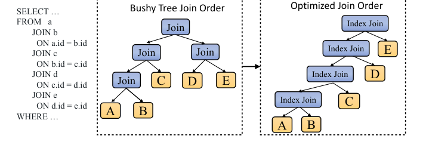

#### 5.1.2 高效实时采样

成本估计是 CBO 的基础，它取决于高度依赖可用统计信息的基数估计。现代数据库收集和使用统计信息的方式有限，不能很好处理数据倾斜和相关性，因而可能产生次优查询计划。AnalyticDB 的目标之一是让简单与复杂查询都获得很短响应时间；实时统计、谓词选择率 profiling 和执行结果反馈等传统方法因开销和复杂度而不适用。

因此，AnalyticDB 设计并实现了高效的、基于采样的基数估计框架。它利用高性能存储引擎中的丰富索引类型、缓存和优化计算路径，快速访问并求值数据。优化时，优化器通过框架 API 把采样谓词发送给存储引擎；谓词是单个还是复合形式，由优化规则决定。存储引擎通过合适的 index/cache 访问样本数据，以优化计算路径求值谓词，并返回基数结果。优化器据此估计候选计划并选择最优计划。

即使该框架已经能高效估计基数，AnalyticDB 仍进一步降低关键业务场景中亚秒级查询的开销，包括缓存之前的采样结果和基数估计、优化采样算法，以及改进派生基数等。应用这些优化后，基于采样的基数框架可在毫秒级的极低开销下给出高精度估计。

### 5.2 执行引擎

AnalyticDB 提供通用的 pipeline-mode 执行引擎，并在其上提供 DAG（Directed Acyclic Graph）运行框架。该引擎既适合低延迟的小型负载，也适合高吞吐的大规模负载。执行引擎以列为中心，利用底层 hybrid store 按列聚集数据的特性；相对行式执行引擎，这种向量化引擎更 cache-friendly，也避免把不需要的数据加载到内存。

与许多 OLAP 系统一样，AnalyticDB 使用 runtime code generator（CodeGen）提高 CPU-intensive 操作的效率。CodeGen 基于 ANTLR ASM [2]，为 expression tree 动态生成代码，并把运行时因素纳入考虑，从而在 task 粒度上利用异构硬件。例如，向量化引擎中的大多数数据类型（如 `int` 和 `double`）都已经对齐；在 CPU 支持 AVX-512 指令集的异构集群中，AnalyticDB 可生成使用 SIMD 指令的 bytecode 来提升性能。存储层和执行引擎还统一内部数据表示，使执行引擎能直接操作 serialized binary data，而不是 Java object；这消除了序列化和反序列化开销，后者在 shuffle 大量数据时会占用超过 20% 的时间。

## 6. 评估

### 6.1 实验设置

实验运行在 8 台物理机组成的集群上。每台机器包含 Intel Xeon Platinum 8163 CPU（2.50GHz）、300GB 内存和 3TB SSD，并通过 10Gbps Ethernet 连接。实验创建一个 AnalyticDB 实例，包含 4 个 coordinator、4 个 write node 和 32 个 read node。

真实工作负载使用生产中的两张表。`Users` 表以 `user_id` 为主键，包含 64 个主分区；`Orders` 表以 `order_id` 为主键，包含 64 个主分区和 10 个次分区。两张表通过 `user_id` 关联。表 2 展示三类查询，从全扫描、点查找到多表 join。

表 2：用于评估的三类查询。

| Query type | Query |
| --- | --- |
| Full Scan (Q1) | `SELECT * FROM orders ORDER BY o_trade_time LIMIT 10` |
| Point Lookup (Q2) | `SELECT * FROM orders WHERE o_trade_time BETWEEN '2018-11-13 15:15:21' AND '2018-11-13 16:15:21' AND o_trade_prize BETWEEN 50 AND 60 AND o_seller_id=9999 LIMIT 1000` |
| Multi-table Join (Q3) | `SELECT o_seller_id, SUM(o_trade_prize) AS c FROM orders JOIN user ON orders.o_user_id = user.u_id WHERE u_age=10 AND o_trade_time BETWEEN '2018-11-13 15:15:21' AND '2018-11-13 16:15:21' GROUP BY o_seller_id ORDER BY c DESC LIMIT 10` |

对比系统包括 PrestoDB、Spark SQL、Druid 和 Greenplum，均使用默认配置。Greenplum 在所有列上有索引；Druid 不支持数值列索引；PrestoDB 和 Spark SQL 使用 Apache ORC 文件，没有任何列索引。Druid 不支持 JOIN 等复杂查询，因此无法执行表 2 中的 Q3 和多数 TPC-H 查询。下文所有实验中的 concurrency number 均指同时运行的查询数。

### 6.2 真实工作负载

#### 6.2.1 1TB 数据查询

图 14 和图 15 分别展示 1TB 数据上 50 分位和 95 分位延迟。三个子图对应 Q1、Q2 和 Q3。AnalyticDB 在三类查询上至少比其他系统低一个数量级。

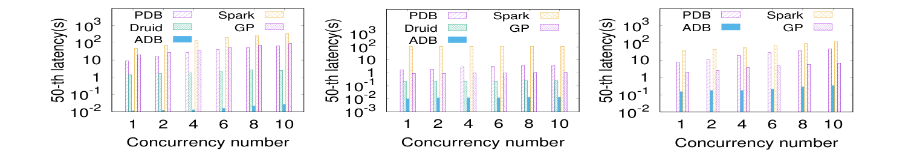

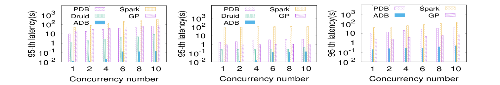

Q1 受益于索引引擎，AnalyticDB 避免全表扫描和排序。它把 ORDER BY 与 LIMIT 下推到每个次分区，利用 `o_trade_time` 有序索引，只遍历少量索引项。Greenplum 虽有全列索引，但不能将其用于 ORDER BY，仍需全扫描；Druid 以时间列做范围分区，表现好于 Greenplum 但仍需扫描最大范围分区。

Q2 中，`o_trade_time`、`o_trade_prize`、`o_seller_id` 的候选行数分别为 306,340,963、209,994,127 和 210,408。PrestoDB 与 Spark SQL 无索引，需要扫描全表；Druid 和 Greenplum 受益于索引但需要顺序过滤多个条件。AnalyticDB 并行扫描三列索引并缓存各自合格 row id，后续相同条件查询能直接受益。

Q3 是多表 join、扫描、GROUP BY 和 ORDER BY 的组合，比 Q1/Q2 更复杂，因此各系统的 50/95 分位延迟都更高。AnalyticDB 将复杂查询分解成等价子查询，利用索引完成这些子查询，并继续借助索引执行 GROUP BY 和 ORDER BY，避免构建大 hash map。Greenplum 因使用 hash join 而更慢；为公平比较，我们还让 AnalyticDB 使用 hash join，此时其性能可与 Greenplum 相当。

#### 6.2.2 10TB 数据查询

图 16 对比 1TB 与 10TB 数据上三类查询的 50 分位延迟。Q1 和 Q2 在不同并发下仍保持百毫秒级。Q3 在 200 并发下延迟显著升高，因为 8 台机器的计算能力接近饱和：64 个主分区、10 个次分区和 200 并发会形成大量并行线程，而 8 台机器总 CPU 核心数为 $48 \times 8 = 384$。

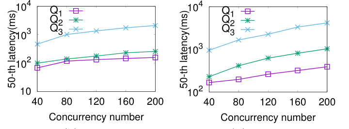

10TB 上不同并发的趋势与 1TB 类似。数据量增加后查询延迟仅约翻倍，因为 AnalyticDB 先通过索引查找 row id，再获取合格行；索引缓存降低了 lookup 成本。总体性能更多受索引计算和合格行数影响，而非表总大小。

#### 6.2.3 写吞吐

为评估写性能，实验向 Orders 表插入记录，每条记录 500 bytes。表 3 展示不同写节点数量下的写吞吐。由于读写解耦和异步索引构建，吞吐随写节点数近似线性增长，直到盘古带宽饱和。当写节点数为 10 时，吞吐达到每秒 625,000 次写请求，对应约 300MB/s。索引构建任务分布在整个 AnalyticDB 集群上、占用的带宽开销已在第 4.2.4 节评估，不会影响查询效率或写吞吐。

表 3：不同写节点数量下的写吞吐。

| write node number | 2 | 4 | 6 | 8 | 10 |
| --- | ---: | ---: | ---: | ---: | ---: |
| write throughput | 130k | 250k | 381k | 498k | 625k |

### 6.3 TPC-H Benchmark

图 17 比较 1TB TPC-H 数据上 AnalyticDB、PrestoDB、Spark SQL 和 Greenplum 的执行时间。若某个查询时间为 1000 秒，表示系统运行该查询发生异常且未得到结果。AnalyticDB 在 22 个查询中的 20 个上取得最短运行时间，并比第二名 Greenplum 快约 2 倍。

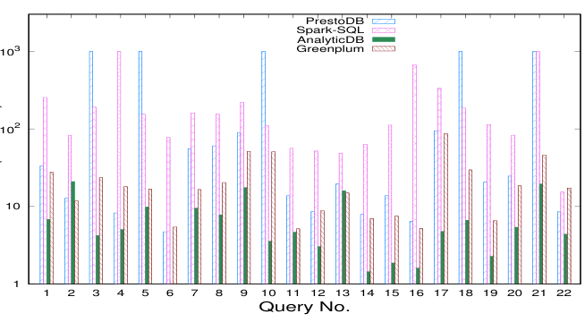

AnalyticDB 相对 Greenplum 的优势来自四点：第一，混合行列存储在 TPC-H 常见查询中能用一次 I/O 获取一行的多个列，而 Greenplum 是列存；第二，运行时代价驱动的索引路径选择使用实际中间结果，比 Greenplum 基于统计信息的规划更可靠；第三，K-way merging 与复合谓词下推结合；第四，向量化执行引擎和 CodeGen 覆盖算子与表达式。Query No.2 上 AnalyticDB 慢于 PrestoDB 与 Greenplum，原因是多表 join 选择了不同 join order。

## 7. 结论

本文介绍了 AnalyticDB，阿里巴巴面向高并发、低延迟和实时分析的 OLAP 数据库。AnalyticDB 在所有列上异步构建索引，在提高查询性能的同时隐藏索引构建开销；在审慎设计下，全列索引仅要求 66% 的额外存储空间。AnalyticDB 扩展混合行列布局以支持结构化和复杂类型数据；通过读写解耦同时支持高吞吐写入和高并发查询；通过优化器与执行引擎增强充分利用存储和索引。实验表明，与先进 OLAP 系统相比，AnalyticDB 能获得更好的性能。

## 致谢

原文感谢匿名审稿人的意见，并感谢 Yineng Chen、Xiaolong Xie、Congnan Luo、Jiye Tu、Wenjun Dai、Xiang Zhou、Shaojin Wen、Wenbo Ma、Jiannan Ji、Yu Dong、Jin Hu、Caihua Yin、Yujun Liao、Zhe Li、Ruonan Guo、Shengtao Li、Chisheng Dong、Xiaoying Lan、Lindou Liu、Qian Li、Angkai Yang、Fang Sun、Yongdong Wu、Wei Zhao、Xi Chen、Bowen Zheng、Haoran Zhang、Qiaoyi Ding、Yong Li、Dongcan Cui 和 Yi Yuan 对 AnalyticDB 开发、实现和管理的贡献。

## 8. 参考文献

- [1] Alibaba Cloud. https://www.alibabacloud.com.
- [2] ANTLR ASM. https://www.antlr.org.
- [3] Apache ORC File. https://orc.apache.org/.
- [4] Benchmarking Nearest Neighbours. https://github.com/erikbern/ann-benchmarks.
- [5] Greenplum. https://greenplum.org/.
- [6] MySQL. https://www.mysql.com/.
- [7] Pangu. https://www.alibabacloud.com/blog/pangu-the-high-performance-distributed-file-system-by-alibaba-cloud-594059.
- [8] PostgreSQL. https://www.postgresql.org/.
- [9] Presto. https://prestodb.io/.
- [10] Teradata Database. http://www.teradata.com.
- [11] TPC-H Benchmark. http://www.tpc.org/tpch/.
- [12] D. J. Abadi, S. R. Madden, and N. Hachem. Column-stores vs. row-stores: how different are they really? SIGMOD, 2008.
- [13] M. Armbrust, R. S. Xin, C. Lian, Y. Huai, D. Liu, J. K. Bradley, X. Meng, T. Kaftan, M. J. Franklin, A. Ghodsi, et al. Spark SQL: Relational data processing in Spark. SIGMOD, 2015.
- [14] J. Backus. Can programming be liberated from the von Neumann style?: a functional style and its algebra of programs. ACM, 2007.
- [15] P. A. Bernstein and N. Goodman. Multiversion concurrency control-theory and algorithms. ACM TODS, 8(4):465-483, 1983.
- [16] D. Comer. Ubiquitous B-tree. ACM Computing Surveys, 11(2):121-137, 1979.
- [17] T. H. Cormen, C. E. Leiserson, R. L. Rivest, and C. Stein. Introduction to Algorithms. MIT Press, 2009.
- [18] J. Dean and S. Ghemawat. MapReduce: simplified data processing on large clusters. Communications of the ACM, 51(1):107-113, 2008.
- [19] A. Eisenberg, J. Melton, K. Kulkarni, J.-E. Michels, and F. Zemke. SQL: 2003 has been published. ACM SIGMOD Record, 33(1):119-126, 2004.
- [20] M. Grund, J. Kruger, H. Plattner, A. Zeier, P. Cudre-Mauroux, and S. Madden. Hyrise: a main memory hybrid storage engine. PVLDB, 4(2):105-116, 2010.
- [21] A. Gupta, D. Agarwal, D. Tan, J. Kulesza, R. Pathak, S. Stefani, and V. Srinivasan. Amazon Redshift and the case for simpler data warehouses. SIGMOD, 2015.
- [22] K. Hajebi, Y. Abbasi-Yadkori, H. Shahbazi, and H. Zhang. Fast approximate nearest-neighbor search with k-nearest neighbor graph. IJCAI, 2011.
- [23] S. Harizopoulos, V. Liang, D. J. Abadi, and S. Madden. Performance tradeoffs in read-optimized databases. VLDB, 2006.
- [24] P. Hunt, M. Konar, F. P. Junqueira, and B. Reed. ZooKeeper: Wait-free coordination for internet-scale systems. USENIX ATC, 2010.
- [25] J.-F. Im, K. Gopalakrishna, S. Subramaniam, M. Shrivastava, A. Tumbde, X. Jiang, J. Dai, S. Lee, N. Pawar, J. Li, et al. Pinot: Realtime OLAP for 530 million users. SIGMOD, 2018.
- [26] H. Jegou, M. Douze, and C. Schmid. Product quantization for nearest neighbor search. IEEE TPAMI, 33(1):117-128, 2011.
- [27] F. V. Jensen. An introduction to Bayesian networks. UCL Press, 1996.
- [28] M. Kornacker, A. Behm, V. Bittorf, T. Bobrovytsky, C. Ching, A. Choi, J. Erickson, M. Grund, D. Hecht, M. Jacobs, et al. Impala: A modern, open-source SQL engine for Hadoop. CIDR, 2015.
- [29] A. Lamb, M. Fuller, R. Varadarajan, N. Tran, B. Vandiver, L. Doshi, and C. Bear. The Vertica analytic database: C-store 7 years later. PVLDB, 5(12):1790-1801, 2012.
- [30] G. M. Lohman. Grammar-like functional rules for representing query optimization alternatives. ACM, 1988.
- [31] S. Melnik, A. Gubarev, J. J. Long, G. Romer, S. Shivakumar, M. Tolton, and T. Vassilakis. Dremel: interactive analysis of web-scale datasets. PVLDB, 3(1-2):330-339, 2010.
- [32] T. Neumann. Efficiently compiling efficient query plans for modern hardware. PVLDB, 4(9):539-550, 2011.
- [33] K. Sato. An inside look at Google BigQuery. 2012.
- [34] M. Stonebraker, D. J. Abadi, A. Batkin, X. Chen, M. Cherniack, M. Ferreira, E. Lau, A. Lin, S. Madden, E. O'Neil, et al. C-store: a column-oriented DBMS. VLDB, 2005.
- [35] A. Thusoo, J. S. Sarma, N. Jain, Z. Shao, P. Chakka, S. Anthony, H. Liu, P. Wyckoff, and R. Murthy. Hive: a warehousing solution over a MapReduce framework. PVLDB, 2(2):1626-1629, 2009.
- [36] F. Yang, E. Tschetter, X. Leaute, N. Ray, G. Merlino, and D. Ganguli. Druid: A real-time analytical data store. SIGMOD, 2014.
- [37] M. Zaharia, M. Chowdhury, T. Das, A. Dave, J. Ma, M. McCauley, M. J. Franklin, S. Shenker, and I. Stoica. Resilient distributed datasets: A fault-tolerant abstraction for in-memory cluster computing. NSDI, 2012.
- [38] Z. Zhang, C. Li, Y. Tao, R. Yang, H. Tang, and J. Xu. Fuxi: a fault-tolerant resource management and job scheduling system at internet scale. PVLDB, 7(13):1393-1404, 2014.
- [39] M. Zukowski, S. Heman, N. Nes, and P. Boncz. Super-scalar RAM-CPU cache compression. IEEE, 2006.
