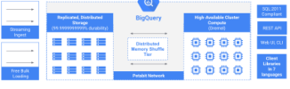
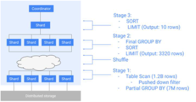
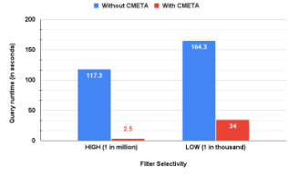
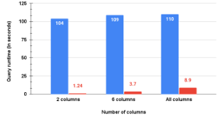
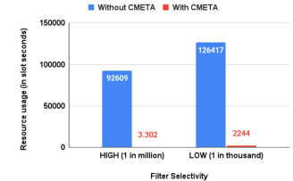
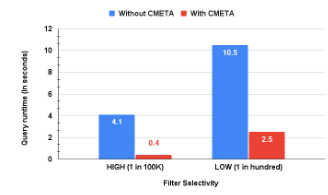
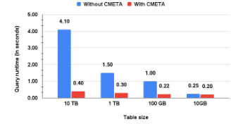

# Big Metadata: When Metadata is Big Data（中文译文）

## 译者说明

本文依据同目录的 `source.pdf` 翻译。章节、图表、公式、算法、代码与参考文献按原文结构保留。

Pavan Edara, Mosha Pasumansky
Google LLC

## 摘要

Google BigQuery 等云数据仓库的快速出现，重新定义了数据分析的格局。随着数据量增长，这类系统在不远的将来需要扩展到数百 EiB 数据。数据增长也伴随着系统需要管理的对象数量和元数据规模增长。传统上，大数据系统常常通过减少元数据量来获得可扩展性，但这会牺牲查询性能。

在 Google BigQuery 中，我们构建了一个元数据管理系统，证明大规模并不必然要求这样的折中。我们认识到细粒度元数据对查询处理的价值，并构建了能够有效管理它的系统。我们使用与数据管理相同的分布式查询处理和数据管理技术来处理大元数据。今天，BigQuery 使用这些技术支持对数十亿对象及其元数据的查询。

PVLDB 引用格式：Pavan Edara and Mosha Pasumansky. Big Metadata: When Metadata is Big Data. PVLDB, 14(12): 3083-3095, 2021. doi:10.14778/3476311.3476385。

## 1 引言

随着数据规模和数据分析需求不断增长，BigQuery、Snowflake 和 Redshift 这类存储并处理海量数据的云数据仓库越来越普及。它们提供托管服务，具备可扩展、成本有效和易用等特点。通过 SQL 和其他 API，这些系统支持以 ACID 事务语义摄取、变更和查询海量数据。用户通常以表等关系实体与数据仓库交互。

这些数据仓库通常依赖分布式文件系统或对象存储来保存海量数据，并以专有或开源的列式存储格式保存数据。表通常按一个或多个列的值进行分区和聚簇，以便为点查找、范围查找、聚合以及行更新提供访问局部性。SQL DML 等变更可能跨越一个或多个块中的行。

数据的一致视图由元数据管理系统提供。为此，这些系统保存关于关系实体的不同数量的元数据。其中一部分元数据可由用户直接修改，但更多是系统用于管理和加速数据访问的簿记信息。传统关系数据库常用索引优化行访问查找；相比之下，大多数数据仓库依赖扫描优化技术，例如编译代码执行，以及基于聚簇列或排序列 min/max 值的块跳过。

Hive 等多数开源系统将表模式等较小元数据存放在集中式但有时分布式的服务中，以获得高可扩展性；更详细的块级元数据则与 Parquet、ORCFile 等数据格式中的数据放在一起。这个模型简单而强大：最详细的元数据与数据共址，变更只需要修改较小的集中式状态，不必触碰块本地元数据，因此能支持影响大量块的变更。

但块级元数据与数据共址会影响后续查询效率，因为分布式元数据通常必须打开并扫描每个块的页脚或页头才能访问，而这些内容一般存储在磁盘上。打开块的成本往往相当于扫描块中的某些列。为了避免查询执行期间付出这种代价，Redshift 和 DB2 BLU 等系统采用另一种方式：在集中式状态中保存少量汇总元数据。这种方式延迟低，但集中式本质限制了可保存元数据量的可扩展性。

在 BigQuery 中，我们构建了以分布式方式管理和处理元数据的系统，从根本上解决这些规模问题。通过把元数据管理当作数据管理处理，我们构建的系统既能保存丰富元数据，也能扩展到很大的表，并为查询引擎提供高性能访问。

本文贡献如下：我们提出一个分布式元数据管理系统，为任意大表保存细粒度列级和块级元数据，并将其组织为系统表。我们用一种新的方法处理这些系统表中的大量元数据：生成一个查询计划，将元数据扫描集成到实际数据扫描中。这样，我们把用于数据的分布式查询处理技术也用于元数据，从而同时获得高性能访问和高可扩展性。系统具有以下属性：

- 一致性：对所有操作维护 ACID 属性。
- 同时面向批处理和流式 API：元数据系统能有效处理批处理和高吞吐流式工作负载。
- 几乎无限可扩展：设计面向扩展，支持多 PB 级表，并且因其分布式特性，扩展方式类似底层数据。
- 高性能：通过分布式执行技术和列式存储处理元数据，元数据访问复杂度降为与表中列数同阶，而不是与表中总数据量同阶。

元数据管理中经常被忽略的一点是可调试性。为了在 BigQuery 规模运行系统，我们将表的细粒度元数据本身组织为表。这允许我们对元数据运行大规模交互式分析，并排查常见用户问题，例如“为什么我的查询处理了这么多字节？”、“为什么查询没有产生预期结果？”、“我的表聚簇得怎么样？”。这种能力对大规模运维至关重要。

本文后续结构如下：第 2 节简要讨论相关工作；第 3 节介绍 BigQuery 架构背景；第 4 节介绍大元数据管理系统设计；第 5 节介绍其与查询处理的集成；第 6 节给出实验结果；第 7 节讨论未来扩展方向。

## 2 相关工作

许多存储和数据库系统都采用“在系统内部保存元数据”的思想。SQL Server、Oracle、Postgres 等数据库维护系统目录，其中包含关于对象、约束、数据类型和配置设置的表。Google 分布式文件系统 Colossus 将其元数据存储在 BigTable 中。

使用 min/max 值进行分区消除的思想由文献 [16] 提出。Vertica、SQL Server、Netezza、SAP Hana、MonetDB 和 Vectorwise 等多数数据库都使用这种技术。DB2 BLU 创建名为 synopsis table 的内部表，保存表的一些列级元数据。我们的系统表在精神上与此类似，但保存的列级元数据比 min/max 值丰富得多。更重要的是，DB2 BLU 依赖 synopsis table 常驻内存来加速性能；相比之下，我们的方法适用于支持任意大表所需的大量元数据，不要求元数据足够紧凑以放入内存。

元数据可扩展性也是开源系统关注的问题。Hive Metastore 是 Hive 表和分区的元数据仓库，可配置运行在多种关系数据库上。为了防止过载，单次查询可访问的分区数量通常存在不同限制。我们的方法使用分布式处理，避免查询处理期间读取元数据时出现可扩展性瓶颈和单点协调。

Delta Lake 使用一种元数据管理系统，将事务日志压缩为 Parquet 格式。我们的系统与其在列式元数据布局上类似。不同之处在于，我们的方法把元数据访问直接交织到查询中，把元数据当作另一张数据表处理。

## 3 背景

BigQuery 是完全托管、无服务器的数据仓库，支持对 PB 级数据进行可扩展分析。BigQuery 架构基于存算分离原则：复制、可靠、分布式的存储系统保存数据；弹性分布式计算节点负责数据摄取和处理。此外，BigQuery 还有基于解耦分布式内存构建的独立 shuffle 服务，用于计算节点之间的通信。API、元数据、安全等横向服务将系统粘合在一起。本文关注查询处理与元数据服务和存储系统交互的部分。



### 3.1 查询执行引擎

Dremel 是 BigQuery 用来在 PB 级数据集上提供交互式延迟的分布式查询执行引擎。BigQuery 使用 ANSI 标准 SQL 作为查询语言 API。BigQuery 数据模型原生支持半结构化数据。下面的示例表模式代表一个典型 Sales 表，使用 repeated ARRAY 字段和 nested STRUCT 字段：

```sql
CREATE TABLE Sales(
  orderTimestamp TIMESTAMP,
  salesOrderKey STRING,
  customerKey STRING,
  salesOrderLines ARRAY<
    STRUCT<
      salesOrderLineKey INTEGER,
      dueDate DATE,
      shipDate DATE,
      quantity INTEGER,
      unitPrice NUMERIC>
  >,
  totalSale NUMERIC,
  currencyKey INTEGER)
PARTITION BY DATE(orderTimestamp)
CLUSTER BY customerKey;
```

查询提交后被路由到某个 Query Coordinator 节点。Query Coordinator 负责协调查询执行：解析 SQL 查询，将其代数化为逻辑查询计划，并应用逻辑计划转换，包括计算和过滤器下推。随后，Query Coordinator 获得查询涉及的表、每个表请求的列以及应用在表扫描上的过滤谓词，并用这些信息将逻辑查询计划转换为物理查询计划。本文的主要部分详细讨论如何使用请求列和过滤器解析物理元数据。

查询计划可以表示为由 stage 组成的 DAG。每个 stage 会在多个 worker 上复制执行，同一组算子运行在不同数据片段上。给定 stage 的 worker 数量就是该 stage 的并行度。BigQuery 中的物理查询计划是动态的：Query Coordinator 构建初始计划，但查询开始执行后，会根据执行期间观察到的实际数据统计信息调整计划。这些统计信息包括 stage 之间流动的数据总量、每个表的行数、数据分布和倾斜等；它们会影响 stage 并行度以及物理算子的选择，例如 shuffle join 与 broadcast join。

考虑如下查询：

```sql
SELECT customerKey, SUM(totalSale) AS totalSales
FROM Sales
WHERE orderTimestamp BETWEEN '2010-10-01' AND '2010-10-06'
GROUP BY customerKey
ORDER BY totalSales DESC
LIMIT 10;
```



如图 2 所示，该查询分三阶段执行。第一阶段使用下推谓词扫描 Sales 表，产生 12 亿行，同时计算 totalSales 的局部聚合，将输出行数减少到 700 万。局部聚合按照聚合列 customerKey shuffle，作为下一阶段输入。下一阶段计算最终聚合、排序，并在每个分区应用 limit，产生 3320 行。最后阶段对这些结果做 union，执行最终排序并应用 limit。

### 3.2 托管存储

Dremel 是通用分布式查询执行引擎，可用于对半结构化数据做就地分析。为了处理数据管理、事务一致性变更以及丰富治理能力，BigQuery 创建了托管存储。BigQuery 托管存储为所有 BigQuery 数据提供全局命名空间。数据组织在区域容器 dataset 中，类似传统数据库管理系统的 schema。表、逻辑视图、物化视图、存储过程和机器学习模型等都位于 dataset 中。用户可以通过 ANSI 标准 SQL 方言访问或变更这些对象。

BigQuery 提供 API，可从对象存储系统批量导入数据到托管存储；高吞吐流 API 支持实时数据摄取和分析；高吞吐读 API 允许 Google Cloud Dataflow、Apache Spark 等其他数据分析引擎分析 BigQuery 表。

托管存储中的表可按一组列分区和聚簇。随着表发生变更，托管存储持续优化存储组织以获得更好查询性能。BigQuery 使用名为 Capacitor 的专有列式存储格式。其嵌入式查询求值器使用向量化处理，以及文献 [1] 中描述的大部分存储和数据处理技术。BigQuery 将数据存储在 Google 的分布式文件系统 Colossus 中，并使用高效擦除编码，跨多个故障域复制以支持灾难恢复。BigQuery 存储支持带快照隔离的 ACID 事务。为此，BigQuery 存储使用一个元数据层保存用户可见对象以及系统对象的元数据。

## 4 元数据管理

BigQuery 中大多数数据存放在列式块中。表大小从几字节到数十 PB 不等，大表可存储在数百万个列式块中。BigQuery 支持含数万列的表。为了支持在可配置历史窗口内以任意时间戳查询表，BigQuery 维护表的完整变更历史。随着对象基数增长，最初依赖粗粒度元数据的系统在可扩展性和性能之间遇到折中。我们认识到细粒度元数据对查询性能的价值，因此需要让元数据系统扩展到任意大的数据规模和对象数量。在这些基数下，一些表有数十 TB 元数据。不过，多数查询只关注少量列。由于数据本身是列式组织，执行 I/O 量取决于被引用列的数据大小，而不是整表大小；我们用同样洞察设计元数据。

因此，元数据也采用列式表示，并用 Capacitor 存储。即使表可能有数十 TB 元数据，单次查询引用的列数通常很小；列式元数据使访问可限制在查询引用的列上。BigQuery 查询模式分析还显示，少于 10% 查询没有过滤器或过滤器恒为 true；超过 60% 查询选择少于 1% 数据，25% 查询选择少于 0.01% 数据。这说明除了在块内部过滤特定行之外，还可以用过滤器消除读取块的需要。高效分区消除不仅节省 I/O，还节省在 worker 上调度分区的成本。

### 4.1 元数据结构

我们将存储元数据分为两大类：逻辑元数据和物理元数据。逻辑元数据是用户通常直接可见的表信息，例如表模式、分区和聚簇规范、列级和行级 ACL。这类信息通常较小，便于快速访问。

物理元数据是 BigQuery 内部维护的、用于把表名映射到实际数据的信息，例如块在文件系统中的位置、行数、块内数据血缘、MVCC 信息，以及每个块中列值的统计信息和属性。如果 C 是表的列数，N 是块数，则列元数据基数为 `O(C x N)`。当 C 为 10K、N 为百万量级时，元数据可能达到数十 TB。物理元数据对查询执行非常有价值，但并不易访问。本文其余部分聚焦物理元数据，并简称为“元数据”。

为解决这个问题，我们将每个表的物理元数据组织为从原始表派生的一组系统表。为说明思想，我们描述一个系统表 CMETA 的元数据布局。CMETA 保存列级信息，包括 min/max 值（范围约束）、哈希桶和模数值（哈希约束）以及列值字典。其他系统表变体还包括保存列值 posting list 的表。查询优化器选择一个或多个系统表来规划和执行查询。

表中大多数数据存储在 Colossus 的列式块中。DML、批量导入和流式写入会导致块中行的创建和删除。如果某个块在快照时间戳下包含至少一行可见行，则该块被认为是活动的。没有可见行的块仍会在系统中保留一段可配置时间，以支持 time travel，即在历史窗口内按任意时间戳读取表。读取表的查询需要找到当前活动块的位置；块内部也可能存在在该时间戳不可见的行，这些行在读块时被过滤。

### 4.2 列式元数据

CMETA 的组织方式是每一行对应原表中的一个块。以第 3.1 节 Sales 表为例，为给定表构建 CMETA 时，系统遍历可能嵌套的类型结构，收集嵌套类型的叶子字段。CMETA 模式构建过程可由如下递归规则描述：

- `Type(ARRAY<T>) = Type(T)`
- `Type(STRUCT<f1 T1, ..., fn Tn>) = STRUCT<f1 Type(T1), ..., fn Type(Tn)>`
- 对基本类型 `T`，`Type(T) = CMETATYPE<T>`，定义如下：

```sql
CREATE TYPE CMETATYPE<T> AS
STRUCT<
  total_rows INTEGER,
  total_nulls INTEGER,
  total_bytes INTEGER,
  min_value T,
  max_value T,
  hash STRUCT<
    bucket INTEGER,
    modulus INTEGER
  >,
  dictionary ARRAY<T>,
  bloom_filter BYTES,
  s2_covering BYTES,
  ...
>;
```

Sales 表的 CMETA 模式如下：

```sql
CREATE TABLE CMETA_Sales (
  _block_locator BYTES,
  creation_timestamp TIMESTAMP,
  deletion_timestamp TIMESTAMP,
  block_total_bytes INTEGER,
  orderTimestamp CMETATYPE<TIMESTAMP>,
  salesOrderKey CMETATYPE<STRING>,
  customerKey CMETATYPE<STRING>,
  salesOrderLines STRUCT<
    salesOrderLineKey CMETATYPE<INTEGER>,
    dueDate CMETATYPE<DATE>,
    shipDate CMETATYPE<DATE>,
    quantity CMETATYPE<INTEGER>,
    unitPrice CMETATYPE<NUMERIC>>,
  totalSale CMETATYPE<NUMERIC>,
  currencyKey CMETATYPE<INTEGER>>
)
CLUSTER BY
  orderTimestamp.max_value,
  customerKey.max_value;
```

### 4.3 增量生成

写入原表的变更（例如 DML）会创建新数据块并可能变更已有数据块。因此，如果 CMETA 要成为表元数据的真实来源，就必须在表变更时更新。为便于说明，论文将块视为变更单位。换言之，数据被修改时按块粒度重写；块内任意行被修改都会创建包含未修改行和已修改行的新块，同时把旧块标记为删除。实际 BigQuery 中，一个块在任意给定时间戳下可能只有部分行活动；下面的设计同样适用于这种部分块。

系统使用元数据变更日志记录块变更和新增历史。当创建新块时，系统收集块属性，分配创建时间戳（也就是创建该块的操作提交时间戳），并向元数据变更日志写入条目。删除块时，系统向日志写入带删除时间戳的条目。变更日志写入高可用、持久、复制的存储系统。表操作可能创建或变更数百万块，而元数据变更日志保证这些变更的 ACID 属性。

后台进程持续对变更日志执行 LSM 风格合并，产生变更的 baseline 和 delta。这些 baseline 和 delta 作为上述模式的列式 Capacitor 块生成，并根据负载和变更日志写入速率增量合并。在任意读时间戳，表元数据可以通过读取该时间戳可用的 baseline 以及从 baseline 到读时间戳之间的 delta 来构造。

增量生成也适用于高吞吐流式摄取。数据由摄取服务器接收，并持久化到 Colossus 中复制的预写日志。最近流入的数据会持续压缩为 Capacitor 块。尚未压缩进 Capacitor 块的行，其细粒度元数据保存在摄取服务器内存中。

## 5 查询处理

为说明如何用 CMETA 提供元数据，论文使用第 4.2 节表上的如下查询作为运行示例：

```sql
SELECT SUM(totalSale)
FROM Sales
WHERE orderTimestamp BETWEEN
  '2019-05-21 12:30:00' AND '2019-05-22 21:30:00';
```

直接实现会打开每个块，使用块头中保存的一些元数据，对这些元数据应用过滤器，并判断该块是否需要处理。下面介绍如何使用分布式处理技术在 CMETA 上执行这一逻辑，从而显著提升性能。

### 5.1 查询规划

对于只有几十个块的小表，读取元数据成本可忽略；但对于有数千到数百万块的表，在查询规划前朴素加载表元数据会显著增加查询运行时间。根据表大小，额外延迟可从几十毫秒（10GB+ 表）到几十分钟（PB+ 表）。为避免这种情况，系统延迟读取物理元数据，直到实际向 worker 分派分区时才读取。

查询规划器首先只使用逻辑元数据生成查询计划，完成常量折叠和过滤器下推。随后，它将查询计划重写为原查询与 CMETA 在 `_block_locator` 列上的半连接。半连接右侧是对 CMETA 的扫描，其中可选地包含从原查询过滤器派生出的过滤谓词。该查询生成回答原查询需要扫描的块定位符列表。常量 `start_timestamp` 是查询执行的快照时间戳；对 time travel 读取而言，它是用户提供的时间戳。

```sql
SELECT _block_locator
FROM CMETA_Sales
WHERE
  orderTimestamp.min_value <= '2019-05-22 21:30:00'
  AND orderTimestamp.max_value >= '2019-05-21 12:30:00'
  AND creation_timestamp <= start_timestamp
  AND (deletion_timestamp IS NULL
       OR deletion_timestamp > start_timestamp);
```

该查询生成的块定位符列表可能包含误报，但不影响最终结果正确性，因为原查询中的过滤器会消除多余行。假设 Sales 表每行都有 `_block_locator` 虚拟列，原查询会重写为：

```sql
SELECT SUM(totalSale)
FROM Sales
WHERE
  orderTimestamp BETWEEN
    '2019-05-21 12:30:00' AND '2019-05-22 21:30:00'
  AND _block_locator IN (
    SELECT _block_locator
    FROM CMETA_Sales
    WHERE
      orderTimestamp.min_value <= '2019-05-22 21:30:00'
      AND orderTimestamp.max_value >= '2019-05-21 12:30:00'
      AND creation_timestamp <= start_timestamp
      AND (deletion_timestamp IS NULL
           OR deletion_timestamp > start_timestamp)
  );
```

CMETA 子查询先执行，产生感兴趣的块列表；这些值传播到连接另一侧的原查询。表可能有数百万块，但原查询只处理 CMETA 查询产生的块。如果数据按时间戳分区，则产生的块数比总块数少几个数量级。列式元数据的好处也很明显：即使表 T 可能有 10,000 列，读取的列也只有 `_block_locator`、`orderTimestamp.min_value`、`orderTimestamp.max_value`、`creation_timestamp` 和 `deletion_timestamp`。

### 5.2 分区消除与可证伪表达式

分区消除是一种常见查询性能优化技术：检查过滤条件，并消除不可能满足过滤条件的分区。通常，分区消除限于单列与常量之间的简单比较，并用块的 min/max 值检查常量。本文提出一个可应用于复杂表达式并能利用多种列统计信息的通用框架。该方法基于“可证伪表达式”（falsifiable expression）：它是从查询过滤器派生的布尔表达式，满足如下性质：

对于给定块，如果可证伪表达式计算为 true，则原查询不需要扫描该块。

对任意过滤条件，可能存在多个可证伪表达式。论文用两个标准判断其质量：

- 表达式复杂度：形式化定义不在本文范围内；非正式地，`x = 'a'` 比 `x LIKE 'a%'` 更简单。
- 紧致性：可证伪表达式在实践中可能有假阴性，也就是有些值会使其计算为 false，从而导致块被扫描；但随后应用原过滤条件时，块中所有值都会返回 false。没有假阴性的表达式是 tight，带假阳性的表达式是 loose。

算法偏好更简单但更 tight 的可证伪表达式。例如，考虑过滤条件 `x = c`，以及包含 `c1, c2, ..., cN` 的块。可证伪表达式 `c <> c1 AND c <> c2 AND ... AND c <> cN` 是 tight，但当 N 很大时可能很复杂；`c NOT IN bloom_filter(c1, ..., cN)` 更简单但没那么 tight；`c > max(c1, ..., cN) OR c < min(c1, ..., cN)` 可能更简单但更 loose。

### 5.3 构建可证伪表达式的算法

算法把 WHERE 子句中的过滤谓词转换为可证伪表达式。给定：

- WHERE 子句中的条件 `P(x1, x2, ..., xn)`，依赖变量 `x1, ..., xn`；
- 变量 `x1, ..., xn` 在给定块上有对应的 CMETA 列属性 `CX1, CX2, ..., CXn`；
- 列属性属于 `CMETATYPE<T>`，包含块中值的多种统计信息：

```text
CXi = {min(xi), max(xi), total_rows(xi), total_nulls(xi), ...}
```

目标是构建可证伪表达式 `F(CX1, CX2, ..., CXn)`，使得当其计算为 true 时，可以保证块中没有行满足 `P(x1, x2, ..., xn)`，因此该块可从查询处理中消除。

问题可形式化为寻找 `F(CX1, CX2, ..., CXn)`，使得：

```math
F(CX_1, ..., CX_n) \Rightarrow \neg \exists x_1, ..., x_n(P(x_1, ..., x_n)) \tag{1}
```

当可证伪表达式 `F()` 是 tight 时，关系更强；没有假阴性意味着：

```math
\neg F(CX_1, ..., CX_n) \Rightarrow \exists x_1, ..., x_n(P(x_1, ..., x_n))
```

由于 `neg p => neg q` 等价于 `q => p`，可重写为：

```math
\neg \exists x_1, ..., x_n(P(x_1, ..., x_n)) \Rightarrow F(CX_1, ..., CX_n)
```

结合第一个公式，得到 tight 可证伪表达式的定义：

```math
F(CX_1, ..., CX_n) \Leftrightarrow \neg \exists x_1, ..., x_n(P(x_1, ..., x_n)) \tag{2}
```

直观上，这个问题与布尔可满足性问题 SAT 有关，尽管变量域和函数都超出了布尔范围。由于 SAT 是 NP 完全问题，构建可证伪表达式的问题也是 NP 完全。本文算法只在有限情形下实用，但它针对真实代表性工作负载中 WHERE 子句使用的条件进行了调优。算法以一组递归应用的规则给出。

#### 5.3.1 平凡情形

任意表达式 `P(X)` 总是有可证伪表达式 `FALSE`。证明很直接，因为 `FALSE => P(X)` 是永真式。这个表达式不 tight，也看似无助于分区消除，因为它表示分区永远不能被消除；但它作为算法中没有其他规则适用时的停止条件很重要。

#### 5.3.2 合取

合取表达式在真实 SQL 查询的 WHERE 子句中非常常见。BI 工具会在用户对多个属性或维度过滤时自动生成合取；查询规划器也会在将谓词下推到表扫描并组合时生成合取；行级安全实现也可能生成合取。论文讨论二元合取，但可推广到 n 元合取。

设有两个表达式 `PX(X)` 和 `PY(Y)`，变量集分别是 `X = x1, ..., xn` 和 `Y = y1, ..., yk`。允许 X 和 Y 任意重叠。如果 `PX(X)` 有可证伪表达式 `FX(CX)`，`PY(Y)` 有可证伪表达式 `FY(CY)`，则 `PX(X) AND PY(Y)` 的可证伪表达式是：

```math
F_X(C_X) \lor F_Y(C_Y)
```

证明。已知：

```math
F_X(C_X) \Rightarrow \neg\exists X(P_X(X)), \qquad
F_Y(C_Y) \Rightarrow \neg\exists Y(P_Y(Y))
```

需要证明：

```math
F_X(C_X) \lor F_Y(C_Y)
\Rightarrow
\neg\exists X,Y(P_X(X) \land P_Y(Y))
```

先利用 $p \Rightarrow q \equiv \neg q \Rightarrow \neg p$，得到：

```math
\exists X(P_X(X)) \Rightarrow \neg F_X(C_X), \qquad
\exists Y(P_Y(Y)) \Rightarrow \neg F_Y(C_Y)
```

于是：

```math
\begin{aligned}
\exists X,Y(P_X(X) \land P_Y(Y))
&\Rightarrow \exists X(P_X(X)) \land \exists Y(P_Y(Y)) \\
&\Rightarrow \neg F_X(C_X) \land \neg F_Y(C_Y) \\
&\Leftrightarrow \neg(F_X(C_X) \lor F_Y(C_Y))
\end{aligned}
```

再次应用 $p \Rightarrow q \equiv \neg q \Rightarrow \neg p$，得到：

```math
F_X(C_X) \lor F_Y(C_Y)
\Rightarrow
\neg\exists X,Y(P_X(X) \land P_Y(Y))
```

证毕。即使 $F_X$ 和 $F_Y$ 都是 tight，所得可证伪表达式也并不 tight；这是由证明第一步中的单向蕴含造成的。

#### 5.3.3 析取

表达式 `PX(X) OR PY(Y)` 的可证伪表达式是：

```math
F_X(C_X) \land F_Y(C_Y)
```

证明如下：

```math
\begin{aligned}
\exists X,Y(P_X(X) \lor P_Y(Y))
&\Leftrightarrow \exists X(P_X(X)) \lor \exists Y(P_Y(Y)) \\
&\Rightarrow \neg F_X(C_X) \lor \neg F_Y(C_Y) \\
&\Leftrightarrow \neg(F_X(C_X) \land F_Y(C_Y))
\end{aligned}
```

证毕。与合取不同的是，如果 $F_X$ 和 $F_Y$ 都 tight，则所得可证伪表达式也 tight。

#### 5.3.4 变量与常量比较

表 1 给出变量与常量比较的可证伪表达式示例，其中 `x` 是变量，`c` 是常量。

| P() | F() |
| --- | --- |
| `x > c` | `max(x) <= c` |
| `x < c` | `min(x) >= c` |
| `x = c` | `min(x) > c OR max(x) < c` |
| `x IS NOT NULL` | `total_rows(x) = total_nulls(x)` |
| `x IS NULL` | `total_nulls(x) = 0` |
| etc. |  |

表 1：变量与常量比较。

以第一行为例。给定：

```math
P(x) = x > c
```

```math
F(C_X) = max(x) \le c
```

根据 `max(x)` 定义有：

```math
\forall x(x \le max(x)) \Leftrightarrow true
```

因此：

```math
F(C_X) \Leftrightarrow F(C_X) \land true
```

```math
max(x) \le c \land \forall x(x \le max(x)) \Leftrightarrow
\forall x(x \le max(x) \land max(x) \le c) \Leftrightarrow
\forall x(x \le c) \Leftrightarrow
\forall x\neg(x > c) \Leftrightarrow
\neg\exists x(x > c) \Leftrightarrow
\neg\exists x(P(x))
```

这证明 `F(CX)` 是 `p(x)` 的 tight 可证伪表达式。

表 2 给出多变量表达式示例。

| P() | F() |
| --- | --- |
| `x1 > x2` | `max(x1) <= min(x2)` |
| `x1 < x2 + c` | `min(x1) >= max(x2) + c` |
| etc. |  |

表 2：多变量和常量比较。

#### 5.3.5 更复杂的比较

更复杂的比较可分解为更简单的比较，例如：

```text
x BETWEEN c1 AND c2 == x >= c1 AND x <= c2
x IN (c1, ..., cN) == x = c1 OR ... OR x = cN
```

应用前述公式可得到表 3 中的可证伪表达式。

| P() | F() |
| --- | --- |
| `x BETWEEN c1 AND c2` | `min(x) > c2 OR max(x) < c1` |
| `x IN (c1, ..., cN)` | `(min(x) > c1 OR max(x) < c1) AND ... AND (min(x) > cN OR max(x) < cN)` |
| etc. |  |

表 3：复杂 SQL 比较的可证伪表达式。

对 `IN` 表达式，当 N 较大时，结果可证伪表达式也变大且更复杂。另一种方式是构造更简单但没那么 tight 的表达式：

```text
min(x) > max(c1, ..., cN) OR max(x) < min(c1, ..., cN)
```

如果 CMETA 有 bloom filter，也可用它替代 min/max：

```text
c1 NOT IN bloom_filter(x) AND c2 NOT IN bloom_filter(x) AND ...
AND cN NOT IN bloom_filter(x)
```

#### 5.3.6 单调函数复合

如果 `P(x)` 有可证伪表达式 `F(min(x), max(x))`，且 `G(y)` 是单调非递减函数，则 `P(G(x))` 有可证伪表达式：

```math
F(G(min(x)), G(max(x)))
```

证明从单调非递减函数 `G()` 的性质出发：

```math
G(min(x)) = min(G(x)); \quad G(max(x)) = max(G(x))
```

为说明这一点，从 `min(x)` 的定义和单调函数的定义出发：

```math
\forall x(min(x) \le x); \qquad
\forall x_1,x_2(x_1 \le x_2 \Rightarrow G(x_1) \le G(x_2))
```

合并二者可得：

```math
\forall x(min(x) \le x)
\Rightarrow
\forall x(G(min(x)) \le G(x))
```

而 `min(G(x))` 的定义为：

```math
\forall x(min(G(x)) \le G(x))
```

因此 $G(min(x)) = min(G(x))$。证毕。

例如，对过滤条件：

```sql
DATE_TRUNC(d, MONTH) BETWEEN DATE '2020-05-10' AND DATE '2020-10-20'
```

由于 `DATE_TRUNC` 是单调递增函数 `G()`，而 `x BETWEEN DATE '2020-05-10' AND DATE '2020-10-20'` 是比较函数 `P()`，其可证伪表达式为：

```sql
DATE_TRUNC(min(d), MONTH) > DATE_TRUNC(DATE '2020-10-20')
OR DATE_TRUNC(max(d), MONTH) < DATE_TRUNC(DATE '2020-05-10')
```

也就是：

```sql
DATE_TRUNC(min(d), MONTH) > DATE '2020-10-01'
OR DATE_TRUNC(max(d), MONTH) < DATE '2020-05-01'
```

#### 5.3.7 条件单调性

某些函数只在其定义域的一个子集上可证明单调。算法会在生成的可证伪函数中加入额外条件。如果 `P(x)` 有可证伪表达式 `F(min(x), max(x))`，且 `G(y)` 只有当条件 `H(CX)` 为 true 时才在 `G()` 值域内单调非递减，则 `P(G(x))` 有可证伪函数：

```math
F(G(min(x)), G(max(x))) \land H(C_X)
```

许多日期时间操作函数并非单调。例如：

```sql
FORMAT_DATE('%Y%m', x) = '201706'
```

仅基于 5.3.6 得到的可证伪表达式是：

```sql
FORMAT_DATE('%Y%m', max(x)) < '201706'
OR FORMAT_DATE('%Y%m', min(x)) > '201706'
```

但该函数在所有可能日期值范围上并不单调。论文为剪枝加入条件，要求块中的时间戳在公元 1000 年或之后：

```sql
(FORMAT_DATE('%Y%m', max(x)) < '201706'
 OR FORMAT_DATE('%Y%m', min(x)) > '201706')
AND EXTRACT(YEAR FROM min(x)) >= 1000
```

#### 5.3.8 数组函数

当 `x` 是数组类型时，WHERE 条件可能包含子查询和相关半连接：

```sql
EXISTS(SELECT ... FROM UNNEST(x) AS xs WHERE ps(xs))
```

或：

```sql
(SELECT LOGICAL_OR(ps(xs)) FROM UNNEST(x) AS xs)
```

其中 `ps(x)` 是应用到数组元素的函数。`ps(x)` 的可证伪表达式会被计算。例如：

```sql
EXISTS(SELECT * FROM UNNEST(x) AS xs WHERE xs > 5)
```

应用前面规则得到可证伪表达式：

```text
max(x) <= 5
```

另一个例子：

```sql
c IN (SELECT xs FROM UNNEST(x) AS xs)
```

等价于：

```sql
EXISTS(SELECT * FROM UNNEST(x) AS xs WHERE xs = c)
```

这里 `ps(x)` 是 `x = c`，可证伪表达式是：

```text
c < min(x) OR c > max(x)
```

#### 5.3.9 重写

有时可以把表达式重写为上述形式。完整重写列表超出本文范围。一般而言，即使已知 `p()` 的可证伪表达式是 `f()`，也无法由此推导 `NOT p()` 的可证伪表达式；因此，系统会尽可能应用代数变换来消除否定。表 4 给出其中一些变换。

| 带 NOT 的表达式 | 重写 |
| --- | --- |
| `NOT(p OR q)` | `(NOT p) AND (NOT q)` |
| `NOT(p AND q)` | `(NOT p) OR (NOT q)` |
| `NOT (x < c)` | `(x >= c)` |
| `NOT (x = c)` | `(x <> c)` |
| `NOT (x IS NULL)` | `(x IS NOT NULL)` |
| etc. |  |

表 4：重写表达式以消除否定。

表 5 给出数值和日期时间类型的算术变换。

| 表达式 | 重写 |
| --- | --- |
| `x + c1 > c2` | `x > (c2 - c1)` |
| `DATE_SUB(x, c1) < c2` | `x < DATE_ADD(c2, c1)` |
| etc. |  |

表 5：算术表达式。

表 6 展示如何将字符串前缀匹配函数重写为比较。

| 表达式 | 重写 |
| --- | --- |
| `x LIKE 'c%'` | `x >= 'c' AND x < 'd'` |
| `REGEXP(x, 'c.*')` | `x >= 'c' AND x < 'd'` |
| `STARTS_WITH(x, 'c')` | `x >= 'c' AND x < 'd'` |

表 6：字符串函数。

#### 5.3.10 地理空间函数

GEOGRAPHY 是有趣的类型，因为它没有线性顺序，因此列值不存在 min/max 概念。相反，CMETA 为 GEOGRAPHY 类型值保存块内所有值的 S2 覆盖单元。每个 S2 单元表示地球表面不同粒度的一部分。0 级 S2 单元约为 8500 万平方公里，30 级 S2 单元约为 1 平方厘米。图 3 展示使用 8 个 15 到 18 级 S2 单元的覆盖示例。每个 S2 单元唯一编码为 64 位无符号整数。覆盖单元越多，对块内对象覆盖越紧，但空间开销也越高。


覆盖可与特殊内部函数结合，用于导出可证伪表达式。例如，对过滤条件：

```sql
ST_INTERSECTS(x, constant_geo)
```

可证伪表达式为：

```sql
NOT _ST_INTERSECTS(
  s2_covering(constant_geo),
  s2_covering(x))
```

其中 `_ST_INTERSECTS` 是内部函数，如果两个 S2 覆盖相交，则返回 `TRUE`；这意味着它们所覆盖的对象存在相交的可能性。

#### 5.3.11 块中取值相同

当块中某变量的所有值相同，即 `min(x) = max(x)`，或全为 NULL 时，会出现一个特殊情况。此时可以计算 `P(min(x))` 和 `P(NULL)`，并检查结果是否为 `FALSE` 或 NULL；两者都会消除行：

```math
F(C_X) = (\operatorname{NOT}\ P(C_X))
\lor (P(C_X)\ \operatorname{IS\ NULL})
\land min(x) = max(x)
```

只要 `P()` 已知是确定性的，这适用于任意复杂函数；它不适用于 `RAND()` 或非确定性 UDF。不过，把这个条件加入可证伪表达式中的每个变量会增加成本。通常大多数列不会在整个块中取相同值，因此这样做浪费。例外是已有额外元数据信息时，例如 DATE 类型分区键列以及按日期粒度分区的数据。由于 BigQuery 中的块不跨分区边界，块可保证对分区键有相同值。

### 5.4 使用 CMETA 和可证伪表达式重写查询

给定用户查询：

```sql
SELECT y1, y2, ..., yk
FROM T
WHERE P(x1, x2, ..., xn);
```

系统从 WHERE 子句 `P` 生成可证伪表达式 `F(CX1, CX2, ..., CXn)`。由于当 `F()` 为 `TRUE` 时块可以被消除，可用如下 CMETA 扫描得到感兴趣块：

```sql
SELECT _block_locator
FROM CMETA
WHERE NOT F(CX1, CX2, ..., CXn);
```

将它与原用户查询做半连接，得到：

```sql
SELECT _block_locator, *
FROM (
  SELECT y1, y2, ..., yk
  FROM T
  WHERE P(x1, x2, ..., xn)
)
WHERE _block_locator IN (
  SELECT _block_locator
  FROM CMETA_T
  WHERE NOT F(CX1, CX2, ..., CXn)
);
```

### 5.5 处理连接

星型和雪花模式在数据仓库中很常见。此类模式中，许多查询会基于维度表过滤器过滤大型事实表数据。维度表较小，通常不需要并行扫描。查询可能只在维度表上显式包含过滤器；因此，直接使用系统表为事实表生成待扫描块列表并不有效，因为查询没有在事实表上静态指定过滤器。

Sideways information passing 是一种常见的连接性能优化策略。查询执行时，系统使用维度表扫描得到的信息，在事实表上生成过滤表达式。事实表系统元数据表的处理会延迟到该过滤表达式计算完成之后。一旦隐含过滤表达式计算完成，系统把过滤器推入事实表扫描。这样，事实表的 CMETA 系统表可像过滤器被静态指定一样被精确扫描。

以第 4.2 节 Sales 事实表和维度表 DateDim 为例：

```sql
SELECT SUM(Sales.totalSale)
FROM Sales, DateDim
WHERE DATE(Sales.orderTimestamp) = DateDim.dt
  AND DateDim.year = 2017
  AND DateDim.monthOfYear BETWEEN 1 AND 2;
```

DateDim 很小，10 年日期只有 3660 行。执行期间，系统首先用 `year` 和 `monthOfYear` 过滤器扫描 DateDim。结果用于派生事实表上的额外过滤器，例如得到可压缩为日期范围 `[dt_min, dt_max]` 的 `dt` 值，从而在 Sales 表上产生：

```sql
WHERE DATE(orderTimestamp) BETWEEN dt_min AND dt_max
```

第 5.3 节算法随后可应用于该派生过滤表达式，生成可证伪表达式。为 Sales 表生成的最终 CMETA 查询是：

```sql
SELECT _block_locator
FROM CMETA_Sales
WHERE DATE(orderTimestamp.max_value) >= dt_min
  AND DATE(orderTimestamp.min_value) <= dt_max;
```

大型事实表有数百万块，仅仅找到需要扫描的相关块就是瓶颈。上述过滤器通常有选择性；如果 Sales 表在 `orderTimestamp` 上分区或聚簇，这种方法会带来数量级的查询性能改进。

### 5.6 查询优化

BigQuery 规划器可根据数据形状应用多种优化。最基本的是为查询执行的不同 stage 选择并行度；更复杂的优化会选择不同查询执行计划。例如，选择连接策略时需要在 broadcast join 与 hash join 之间取舍。Broadcast join 不需要在连接的大侧 shuffle 数据，因此可能快得多，但只适用于能放入内存的小数据集。

通常，查询规划期间难以获得准确基数估计；众所周知，误差会通过连接指数级传播。BigQuery 选择让查询执行计划在运行时根据数据形状信号动态变化。不过，为了让动态自适应方案在实践中有效，初始估计应该接近实际值。查询规划器使用 CMETA 中的每列统计信息来进行这些估计。

查询估计大小通过累加每个表基于引用字段和剪枝后剩余块要扫描的字节数得到。CMETA 允许用如下查询高效计算用户查询的这类信息：

```sql
SELECT
  SUM(CY1.total_bytes) + ... + SUM(CYk.total_bytes) +
  SUM(CX1.total_bytes) + ... + SUM(CXn.total_bytes)
FROM CMETA_T
WHERE NOT F(CX1, CX2, ..., CXn);
```

BigQuery 有 dry-run 功能，允许用户在不实际执行查询的情况下估计扫描数据量。这很有用，因为用户可为大表查询设置成本控制，例如“只有处理量小于 X GB 时才执行此查询”。上述 CMETA 查询可支持该功能。

优化器还会在可能时透明地把查询计划子树重写为使用物化视图。当多个物化视图都可用于查询时，优化器必须选择性能和成本最佳的那个。它通过使用物化视图的 CMETA 估计每个物化视图对应子树的查询大小来完成选择。

### 5.7 交错处理

对选择性过滤器的查询会消除大量块。系统也优化 CMETA 以处理没有选择性过滤器的查询。处理大表可能需要从 CMETA 读取大量行。由于 CMETA 以分布式方式处理，扫描可大规模并行化。但如果在分派查询的各个分区之前，把所有元数据都收集到 Query Coordinator，会带来不可接受的内存使用量，并在查询关键路径上增加延迟。

系统通过将 CMETA 扫描执行与实际查询执行交错来扩展到这类查询。随着 CMETA 扫描产生包含块定位符的行，这些行被用于把主表分区分派给 worker。

### 5.8 元数据的元数据

对非常大的表，CMETA 本身可能达到数百 GB。于是出现一个问题：CMETA 扫描应如何做分区消除？是否应使用与其他查询相同的机制？CMETA 是否应包含 CMETA 块的条目？

系统决定对 CMETA 查询应用与第 5.3 节相同的可证伪表达式构建算法。为此，CMETA 表本身按原表分区列和聚簇列的 `max_value` 聚簇。选择 `max_value` 是基于观察：实际可证伪表达式中，`max_value` 使用率为 76%，`min_value` 使用率为 68%。

多数读取表的查询关注表的当前版本，而不是 time travel 的历史快照。为优化当前版本查询对 CMETA 的访问，系统维护如下物化视图，并随表数据变化周期性刷新：

```sql
CREATE MATERIALIZED VIEW CMETA_MV AS
SELECT *
FROM CMETA
WHERE
  creation_timestamp <= CURRENT_TIMESTAMP
  AND (deletion_timestamp IS NULL
       OR deletion_timestamp > CURRENT_TIMESTAMP);
```

即使对非常大的表，CMETA 本身也可存储在几百个块中。CMETA 的元数据由块定位符以及 CMETA 块的 min/max 值组成；这些信息很小，因此系统把它与原表逻辑元数据一起存放在集中式元数据中。

## 6 结果

本节给出若干实验结果，用于衡量元数据管理设计对不同大小表的影响。实验使用第 4.2 节 Sales 表，向表填充 1PB 数据，并在有无 CMETA 的情况下运行不同过滤选择性的查询。该表被分成约 300 万个列式块。不使用 CMETA 的实验通过打开单个块头或页脚，或从 LRU 缓存中直接消费块元数据。

图 4 展示运行不同过滤选择性的 `SELECT *` 查询时的查询运行时间。选择性极高、只选择百万分之一块的查询在使用 CMETA 时耗时 2.5 秒；不使用 CMETA 的同一查询耗时 120 秒。非 CMETA 查询大部分时间花在发现需要扫描的正确块上。



图 5 展示同一 1PB 表上选择性为 0.1% 且聚合部分列时的查询运行时间。非 CMETA 查询的大部分时间仍花在发现块上。随着读取列数增加，CMETA 查询由于读取列级元数据带来的延迟没有显著增加：读取 2 列的查询中，读取元数据耗时 0.2 秒（总运行时间 1.2 秒）；读取全部列的查询中，读取元数据耗时 0.8 秒（总运行时间 8.9 秒）。



除运行时间外，系统还希望降低处理查询所需资源。图 6 给出与图 4 相同查询的资源使用量，单位为 slot seconds。对高选择性查询，资源使用减少 30000 倍；对低选择性查询，资源使用减少 6000 倍。在非 CMETA 查询中，打开块并仅仅读取头部的时间主导了资源使用。



系统也在中等大小表（10TB）上评估。图 7 展示 10TB 表上 `SELECT *` 查询的运行时间。与 PB 级表相比，不同选择性下 CMETA 与非 CMETA 的差距较小，但根据选择性不同，使用 CMETA 仍带来 5 到 10 倍运行时间改进。



最后，实验研究了表大小对中小型 BigQuery 表的影响。图 8 展示不同表大小的查询运行时间。随着表变小，非 CMETA 查询处理与基于 CMETA 的查询处理之间的运行时间差异缩小。



## 7 结论与未来工作

本文描述了在查询处理中使用 CMETA 中丰富元数据信息的多种方式。核心直觉是：大规模元数据管理与数据管理并没有本质区别。系统利用分布式处理在数据管理中的力量，并设计相应算法，把元数据处理集成到查询执行中。实验结果表明，CMETA 将查询性能和资源利用率提升了几个数量级，并且数据规模越大，收益越明显。论文认为这些技术可广泛适用于许多其他场景。

未来工作之一是用 CMETA 驱动范围分区连接。当大型聚簇表在其聚簇列上与另一个小到中等规模表连接时，较小一侧往往不能广播到另一侧。在这种情况下，可以使用 CMETA 中聚簇列属性，避免对大表执行昂贵 shuffle。系统可通过对大表执行分布式扫描，收集块定位符及其聚簇列 min/max 值。较小侧随后可使用这些 min/max 值进行范围分区；shuffle 后，连接可通过把大表块与写入 shuffle 的分区适当配对来执行。

论文起点是假设元数据太大，无法放入内存，因此需要使用类似大数据的分布式处理技术。如果能把所有元数据都放入内存，当然可以获得显著性能提升，但这在成本和可扩展性上不可行。我们认为，可以通过缓存工作集，在无限可扩展性和内存处理速度之间获得两者优点。CMETA 的列式设计天然适合在内存中按列缓存元数据。实验中，扫描 PB 级表的元数据耗时 500ms。通过缓存 CMETA 中热列的元数据并使用向量化处理，CMETA 扫描性能可显著加速。

## 致谢

我们感谢本文草稿审阅者 Sam McVeety、Magdalena Balazinska、Fatma Ozcan 和 Jeff Shute，并感谢 Adrian Baras、Aleksandras Surna、Eugene Koblov、Hua Zhang、Nhan Nguyen、Stepan Yakovlev、Yunxiao Ma 等工程师的代码贡献。

## 参考文献

- [1] Daniel Abadi, Samuel Madden, and Miguel Ferreira. 2006. Integrating Compression and Execution in Column-Oriented Database Systems. In Proceedings of the 2006 ACM SIGMOD International Conference on Management of Data (SIGMOD '06), 671-682. https://doi.org/10.1145/1142473.1142548
- [2] Sunil Agarwal. 2017. Columnstore Index Performance: Rowgroup Elimination. https://techcommunity.microsoft.com/t5/sql-server/columnstore-index-performance-rowgroup-elimination/ba-p/385034
- [3] Michael Armbrust, Tathagata Das, Liwen Sun, Burak Yavuz, Shixiong Zhu, Mukul Murthy, Joseph Torres, Herman van Hovell, Adrian Ionescu, Alicja Ufnal, Michal Szafranski, Xiao Li, Takuya Ueshin, Mostafa Mokhtar, Peter Boncz, Ali Ghodsi, Sameer Paranjpye, Pieter Senster, Reynold Xin, and Matei Zaharia. 2020. Delta Lake: High-Performance ACID Table Storage over Cloud Object Stores. Proc. VLDB Endow. 13, 12, 3411-3424. https://doi.org/10.14778/3415478.3415560
- [4] Jesus Camacho-Rodriguez, Ashutosh Chauhan, Alan Gates, Eugene Koifman, Owen O'Malley, Vineet Garg, Zoltan Haindrich, Sergey Shelukhin, Prasanth Jayachandran, Siddharth Seth, Deepak Jaiswal, Slim Bouguerra, Nishant Bangarwa, Sankar Hariappan, Anishek Agarwal, Jason Dere, Daniel Dai, Thejas Nair, Nita Dembla, Gopal Vijayaraghavan, and Gunther Hagleitner. 2019. Apache Hive: From MapReduce to Enterprise-Grade Big Data Warehousing. In Proceedings of SIGMOD '19, 1773-1786. https://doi.org/10.1145/3299869.3314045
- [5] Fay Chang, Jeffrey Dean, Sanjay Ghemawat, Wilson C. Hsieh, Deborah A. Wallach, Mike Burrows, Tushar Chandra, Andrew Fikes, and Robert E. Gruber. 2006. Bigtable: A distributed storage system for structured data. In Proceedings of the 7th USENIX Symposium on Operating Systems Design and Implementation, 205-218.
- [6] Zach Christopherson. 2016. Amazon Redshift Engineering's Advanced Table Design Playbook: Compound and Interleaved Sort Keys. https://amzn.to/3qXXVpq
- [7] Benoit Dageville, Thierry Cruanes, Marcin Zukowski, Vadim Antonov, Artin Avanes, Jon Bock, Jonathan Claybaugh, Daniel Engovatov, Martin Hentschel, Jiansheng Huang, Allison W. Lee, Ashish Motivala, Abdul Q. Munir, Steven Pelley, Peter Povinec, Greg Rahn, Spyridon Triantafyllis, and Philipp Unterbrunner. 2016. The Snowflake Elastic Data Warehouse. In Proceedings of SIGMOD '16, 215-226. https://doi.org/10.1145/2882903.2903741
- [8] Anurag Gupta, Deepak Agarwal, Derek Tan, Jakub Kulesza, Rahul Pathak, Stefano Stefani, and Vidhya Srinivasan. 2015. Amazon Redshift and the Case for Simpler Data Warehouses. In Proceedings of SIGMOD '15, 1917-1923. https://doi.org/10.1145/2723372.2742795
- [9] HMS. 2020. Hive Metastore (HMS). https://docs.cloudera.com/documentation/enterprise/latest/topics/cdh_ig_hms.html
- [10] Yannis E. Ioannidis and Stavros Christodoulakis. 1991. On the Propagation of Errors in the Size of Join Results. In Proceedings of SIGMOD '91, 268-277. https://doi.org/10.1145/115790.115835
- [11] Zachary G. Ives and Nicholas E. Taylor. 2008. Sideways Information Passing for Push-Style Query Processing. In Proceedings of ICDE '08, 774-783. https://doi.org/10.1109/ICDE.2008.4497486
- [12] Andrew Lamb, Matt Fuller, Ramakrishna Varadarajan, Nga Tran, Ben Vandiver, Lyric Doshi, and Chuck Bear. 2012. The Vertica Analytic Database: C-Store 7 Years Later. Proc. VLDB Endow. 5, 12, 1790-1801. https://doi.org/10.14778/2367502.2367518
- [13] Sergey Melnik, Andrey Gubarev, Jing Jing Long, Geoffrey Romer, Shiva Shivakumar, Matt Tolton, Theo Vassilakis, Hossein Ahmadi, Dan Delorey, Slava Min, Mosha Pasumansky, and Jeff Shute. 2020. Dremel: A Decade of Interactive SQL Analysis at Web Scale. Proc. VLDB Endow. 13, 12, 3461-3472. https://doi.org/10.14778/3415478.3415568
- [14] Sergey Melnik, Andrey Gubarev, Jing Jing Long, Geoffrey Romer, Shiva Shivakumar, Matt Tolton, Theo Vassilakis, and Google Inc. 2010. Dremel: Interactive Analysis of Web-Scale Datasets.
- [15] Cade Metz. 2012. Google Remakes Online Empire with 'Colossus'.
- [16] Guido Moerkotte. 1998. Small Materialized Aggregates: A Light Weight Index Structure for Data Warehousing. In Proceedings of VLDB '98, 476-487.
- [17] Patrick O'Neil, Edward Cheng, Dieter Gawlick, and Elizabeth O'Neil. 1996. The Log-Structured Merge-Tree (LSM-Tree). Acta Informatica 33, 4, 351-385. https://doi.org/10.1007/s002360050048
- [18] Mosha Pasumansky. 2016. Inside Capacitor, BigQuery's Next-Generation Columnar Storage Format. Google Cloud Blog. https://cloud.google.com/blog/products/bigquery/inside-capacitor-bigquerys-next-generation-columnar-storage-format
- [19] Vijayshankar Raman, Gopi Attaluri, Ronald Barber, Naresh Chainani, David Kalmuk, Vincent KulandaiSamy, Jens Leenstra, Sam Lightstone, Shaorong Liu, Guy M. Lohman, Tim Malkemus, Rene Mueller, Ippokratis Pandis, Berni Schiefer, David Sharpe, Richard Sidle, Adam Storm, and Liping Zhang. 2013. DB2 with BLU Acceleration: So Much More than Just a Column Store. Proc. VLDB Endow. 6, 11, 1080-1091. https://doi.org/10.14778/2536222.2536233
- [20] S2 Cells. n.d. S2 Cells. https://s2geometry.io/devguide/s2cell_hierarchy.html
