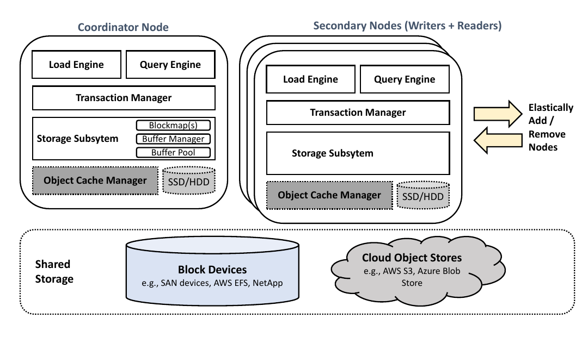
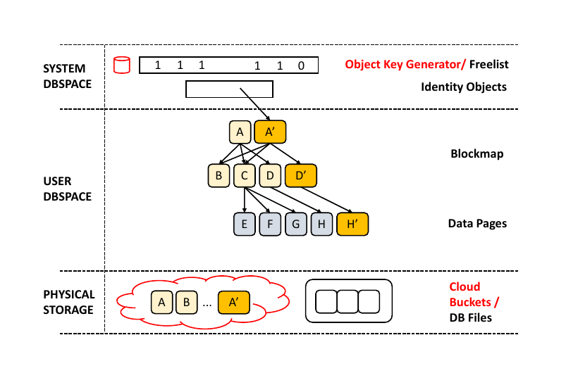
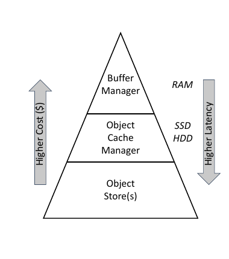
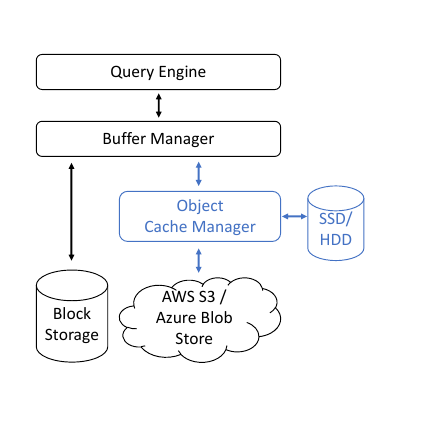
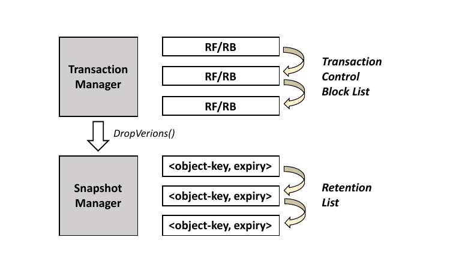
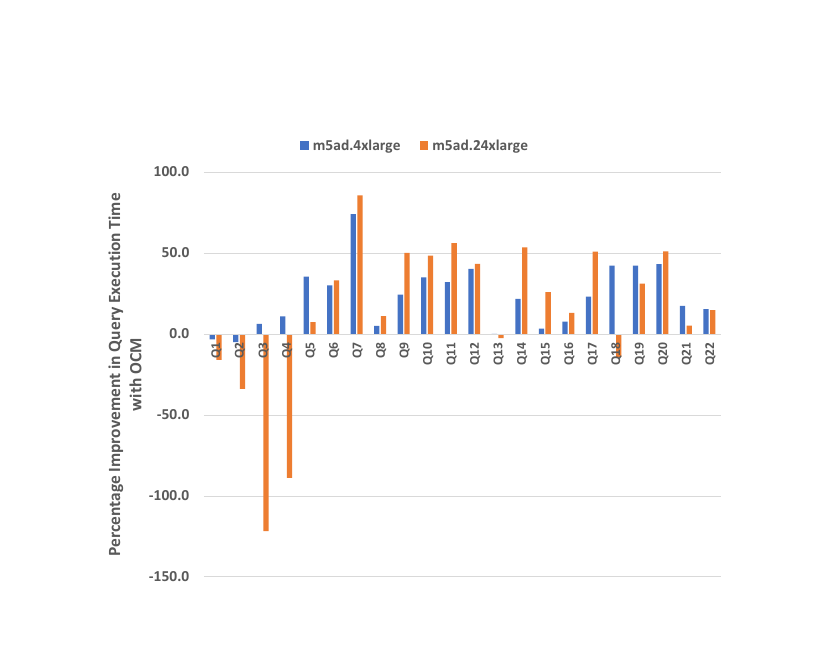
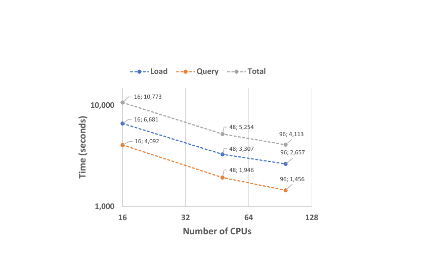
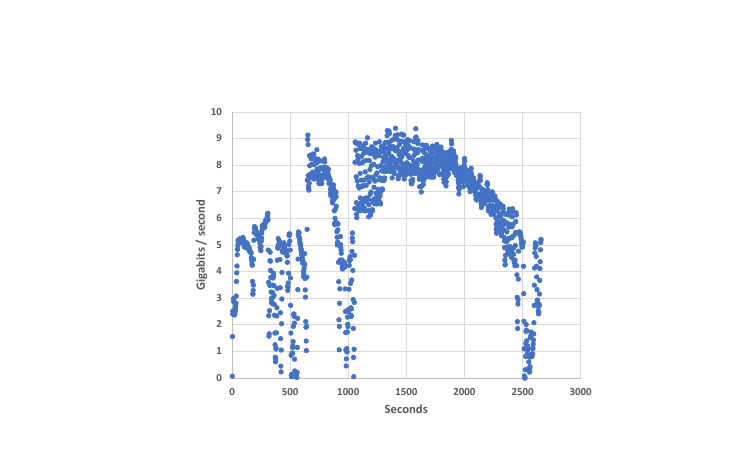
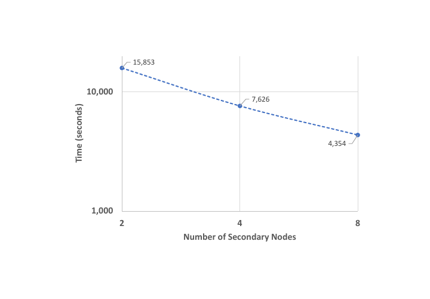

# Bringing Cloud-Native Storage to SAP IQ（中文译文）

## 译者说明

本文依据同目录的 `source.pdf` 翻译。章节、图表、公式、算法、代码与参考文献按原文结构保留。

Mohammed Abouzour, Güneş Aluç, Ivan T. Bowman, Xi Deng, Nandan Marathe, Sagar Ranadive, Muhammed Sharique, John C. Smirnios

SAP

## 摘要

本文描述我们把 SAP IQ 改造成可使用云上廉价、弹性可扩展对象存储的关系数据库管理系统（RDBMS）的历程。SAP IQ 是一个已有三十年历史、基于磁盘的列式 RDBMS，针对复杂联机分析处理（OLAP）工作负载优化。传统 SAP IQ 被设计为运行在具有强一致性保证的共享存储设备上，例如高规格存储区域网络。若原样部署到云上，就必须使用 NetApp 或 AWS EFS 之类既提供 POSIX 兼容文件接口又提供强一致性的存储方案，但其货币成本高得多；这些成本很容易累积并抵消云本应带来的规模经济。

因此，我们增强了 SAP IQ 的设计，使其能够运行在 AWS S3 和 Azure Blob Storage 等云对象存储上。对象存储采用较弱的一致性模型，潜在延迟也更高；作为这些设计权衡的回报，它们提供更优价格、更高耐久性、更好弹性和更高吞吐。通过让 SAP IQ 在这些权衡下正确运行，我们释放了对象存储提供的多种机会。具体而言，我们扩展了 SAP IQ 的缓冲区管理器和事务管理器，并引入一个使用 AWS EC2 实例存储的新缓存层。TPC-H 实验表明，在查询与装载性能改善的同时，静态数据存储成本可降低一个数量级。

**CCS 概念：** 信息系统 - DBMS 引擎架构；云存储；存储管理。

**关键词：** 云原生存储，缓存，垃圾回收，快照。

**ACM 参考格式：** Mohammed Abouzour, Güneş Aluç, Ivan T. Bowman, Xi Deng, Nandan Marathe, Sagar Ranadive, Muhammed Sharique, John C. Smirnios. 2021. Bringing Cloud-Native Storage to SAP IQ. 载于 *Proceedings of the 2021 International Conference on Management of Data*（SIGMOD ’21），2021 年 6 月 20–25 日，Virtual Event, China。ACM，New York, NY, USA，13 页。https://doi.org/10.1145/3448016.3457563

本文为 SIGMOD ’21 Industrial Track Paper。会议于 2021 年 6 月 20–25 日以 Virtual Event, China 形式举行。

允许为个人或课堂用途免费制作本文全部或部分内容的数字或纸质副本，条件是副本不得用于营利或商业利益，并须在首页载有本声明及完整引文。对于本文中版权属于 ACM 以外主体的部分，必须尊重其版权。允许在注明出处的情况下制作摘要。其他复制、再版、发布到服务器或转发到邮件列表的行为，须事先获得明确许可和/或付费。许可申请请联系 permissions@acm.org。

© 2021 Association for Computing Machinery。ACM ISBN 978-1-4503-8343-1/21/06，价格 \$15.00。https://doi.org/10.1145/3448016.3457563

## 1. 引言

数据库管理系统厂商正在把系统迁移到云端 [52]。云提供存储与计算弹性、内建容错和灾难恢复，以及更好的整体用户体验。数据库用户可以按使用量付费，厂商则受益于规模经济。

SAP 最近发布了 SAP HANA Cloud [17]，用户可在云上以软件即服务（SaaS）形式部署 SAP HANA [34] 和/或 SAP IQ [18]。二者互补：SAP HANA 是能够在 TB 级数据上快速执行查询的内存列式 RDBMS [34]；SAP IQ 则是针对 PB 级数据优化的磁盘列式 RDBMS [18]。本文介绍把 SAP IQ 转变为云数据库系统的过程。

SAP IQ 是一款凝聚三十年研发工作的成熟产品。下列技术使其本地部署能够使用数十个计算节点，高效地装载、查询和事务性修改 PB 级数据：

- **压缩。** SAP IQ 中的列数据使用字典编码和 $n$-bit 表示 [47] 压缩，并进一步采用页级压缩，以减少处理大量数据所需的 I/O。
- **分区。** 用户可创建范围分区表和哈希分区表，两者适用于不同工作负载。
- **索引。** SAP IQ 支持多种二级索引，包括把 $B^+$-tree [28, 38] 的能力与位图 [27] 的可扩展性和压缩结合起来的分层 High-Group（HG）索引 [21]；使用 zone map [19] 提前剪除查询不需要的页；还支持 DATE/TIME/DTTM、CMP、TEXT 等面向特定用途的索引。
- **预取。** 查询期间，系统通过预取最大限度并行化 I/O。针对不同列和索引类型进行了专门调优 [42]，远不止顺序块预取。
- **装载引擎。** 对 OLAP 系统而言，快速高效装载至关重要；SAP IQ 的装载引擎经过长期工程优化，可在装载期间最大化 CPU 利用率。
- **弹性。** SAP IQ 在共享存储之上采用分布式计算模型。无需改变底层存储系统或数据分区方式，便可独立增加计算节点以横向扩展。

开发云版本时，我们尽可能复用这些优势。主要挑战来自对象存储的一致性模型。传统 SAP IQ 假定共享存储具有强一致性：事务写入磁盘块并提交后，后续事务读取该块时应得到最新数据。[^consistency-nodes] 继续采用这一假设就需要 NetApp [16] 或 AWS EFS [4] 一类高价方案。

[^consistency-nodes]: 同样的论证也适用于发生在不同节点上的事务。

相反，我们让 SAP IQ 使用 AWS S3 [5] 和 Azure Blob Storage [11] 等云对象存储，如图 1 所示。对象存储可能采用较弱的一致性模型且延迟更高，却能提供更好的价格、耐久性、弹性与吞吐。我们的改动如下：

1. 利用 SAP IQ 对页的逻辑表示与物理表示的明确分离，把逻辑页直接映射到对象存储中的对象（第 3 节）。
2. 修改缓冲区管理器及其数据结构，实行“同一对象绝不写两次”的策略，以处理对象存储的一致性模型（第 3.1 节）。
3. 在多节点环境中高效分配对象键，并持久化和恢复这些键（第 3.2 节）。
4. 扩展事务管理器，跟踪 MVCC 下已不再需要的对象存储页，并正确清理它们（第 3.3 节）。
5. 引入第二级缓存 Object Cache Manager（OCM），作为既有缓冲区管理器和对象存储之间的读写缓存，使用 AWS EC2 的实例存储（第 4 节）。
6. 新增高频、近乎瞬时的数据库快照功能（第 5 节）。



**图 1：SAP IQ 架构概览。**

TPC-H 实验显示，在提高查询和装载性能的同时，静态数据存储成本可降低一个数量级。

## 2. 背景

SAP IQ 是面向复杂 OLAP 工作负载、基于磁盘、列式且完全关系化的数据库系统 [18]。用户可以建立由多个分布式服务器组成的集群，称为 multiplex，以横向扩展方式并发执行装载和查询。multiplex 有协调节点、写节点和读节点三类节点；后两类统称 secondary node。写节点和协调节点可以修改数据库，读节点不能。典型负载中，写节点处理 DML，协调节点主要处理 DDL。SAP IQ 在 multiplex 中以表级版本控制和快照隔离实现 MVCC [25]。

SAP IQ 以 dbspace 组织物理存储。一个 dbspace 是操作系统文件或裸设备的集合，分为系统 dbspace 和用户 dbspace。系统 dbspace 又分临时部分和主部分：临时系统 dbspace 保存查询引擎产生的哈希表、排序游程输出等，并在 multiplex 节点之间共享中间查询结果；主系统 dbspace 保存 checkpoint block、freelist 等关键结构。freelist 是跟踪数据库各 dbspace 已分配块的位图：置位表示块正在使用，清零表示可用。

SAP IQ 的存储单位是页，系统明确区分页的逻辑（内存）表示与物理（磁盘）表示。页如何落盘对查询引擎及其上层透明。查询引擎以逻辑页号与版本计数器组成的二元组请求页，缓冲区管理器负责从磁盘或缓冲区缓存定位正确版本。它依赖 blockmap 维护逻辑页到磁盘块序列的映射。[^page-blocks] 页写出时，blockmap 更新其物理位置以及可能变化的压缩后块数；页读入时则以解压形式缓存在 buffer cache 中。逻辑与物理表示分离也简化了 MVCC：需要版本化的脏页从缓存驱逐时，只需复制到新的物理位置。

[^page-blocks]: 在 SAP IQ 中，一个页在物理上存为一组连续块，可占 1–16 个块。

## 3. 云原生存储

云原生 SAP IQ 允许直接在 AWS S3、Azure Blob Store 等对象存储上创建 dbspace，称为 cloud dbspace：

```sql
CREATE DBSPACE dbspaceName
USING OBJECT STORE "s3://bucketName"
```

与本地版本一样，一个数据库实例包含一个或多个 dbspace。用户可以跨不同云厂商创建 dbspace，例如分别建在传统存储卷、AWS S3 和 Azure Blob Store 上，从而按价格和性能选择提供者，并按需迁移数据。

主要问题是对象存储的一致性。论文开发时的 AWS S3 提供最终一致性而非强一致性：对象更新多次后，客户端最终会读到最新版本，但在此之前可能读到旧版本。读取可能出现三种结果：（1）成功且为最新数据；（2）成功但为旧数据；（3）对象实际存在，读取却报“对象不存在”。传统 SAP IQ 只能处理第一种情况。为此我们采取以下设计：

- **直接把数据库页存为对象。** 不再把页作为文件中的块，而是直接存为对象或 blob，因而不必维护 freelist 等重量级结构。cloud dbspace 的脏页刷出时不再查 freelist 寻找空闲块范围，而是获取新对象键。
- **同一对象绝不写两次。** cloud dbspace 的脏页每次刷出都用新键上传，保证对象存储中的一个页只有一个版本。读取时，要么得到这个唯一版本，要么因 read-after-write 一致性尚未生效而得到“对象不存在”；后一情况会在可配置次数内重试，避免读到旧版本。
- **生成唯一对象键。** 新组件 Object Key Generator 保证键不复用，并跨数据库重启持久化、恢复元数据。键由协调节点生成；secondary node 通过 RPC 请求。协调节点维护已发放键的列表，并在 secondary node 上的事务提交或回滚时更新该列表，以正确回收不再需要的页。

本节余下内容将详述这一方案。第 3.1 节介绍为在 SAP IQ 中实施 read-after-write 一致性而修改的数据结构和组件。第 3.2 节说明如何高效、可扩展地生成唯一对象键，以及如何以事务方式持久化这些键。第 3.3 节介绍垃圾回收机制，并以事务回滚和服务器崩溃或重启导致事务中止等恢复场景为例加以说明。

### 3.1 缓冲池中的页管理

传统 SAP IQ 把页存放在共享块设备上，因此有 freelist 跟踪空闲块、blockmap 维护逻辑页与物理块号的映射。在云版本中，cloud dbspace 没有“空闲块”概念，freelist 的作用缩小；blockmap 的作用扩大，不仅映射传统 dbspace 的逻辑页到物理块号，也映射 cloud dbspace 的逻辑页到对象键。

新页首先在内存中创建，生命周期从 buffer cache 开始。页修改后被标为脏页，缓冲区管理器为活动事务维护脏页列表。事务提交前，其所有脏页必须刷到永久存储，后者可能是对象存储 bucket，也可能是传统共享块设备上的 dbfile。因为 SAP IQ 的事务日志只记录元数据而不记录体量可能很大的更新数据，持久性要求提交前写出数据页。缓存需要给新页腾空间时，脏页也可能更早因驱逐而刷出。

cloud dbspace 的脏页刷出时总以新对象键存储；这个键必须写入元数据，供后续查找正确版本。数据页的键写入拥有该页的 blockmap；blockmap 页的键写入其父 blockmap 页；根 blockmap 页的键写入系统目录中的 identity object。



**图 2：页的生命周期。**

图 2 中 $A$、 $B$、 $C$、 $D$ 是 blockmap 树中的页， $E$、 $F$、 $G$、 $H$ 是其管理的数据页。假设 $H$ 被修改并因缓存压力驱逐。系统不原地更新 $H$，而是创建 $H'$，并把新键写入管理 $H$ 的 blockmap 页 $D$，使 $D$ 变脏。 $D$ 刷出时也取得新键成为 $D'$，进而更新父页；最终 $A$ 版本化为 $A'$。 $A'$ 是根 blockmap 页，所以其键写入 identity object。identity object 位于始终使用强一致设备的系统 dbspace，可原地更新。事务提交时，旧页 $A$、 $D$、 $H$ 被标记以便从对象存储回收。

SAP IQ 的 MVCC 原本就对数据页和 blockmap 页提供 copy-on-write，并保留多个页版本和 identity object 版本。新模型大量复用这一机制，但有一个微妙差异：旧模型允许同一事务或 savepoint 内的页原地更新；新模型中，每次向对象存储写页都必须版本化。

为避免再扩展 blockmap 和 identity object，系统复用既有 64 位物理块号字段保存对象键。SAP IQ 支持的最大物理块号是 $2^{48}-1$，因此把高位区间 $[2^{63}, 2^{64})$ 保留给对象键。即使一个 20 节点 multiplex 中每节点每秒消耗 10,000 个键，也需超过 140 万年才会耗尽该区间。

SAP IQ 内部保存的 64 位键与对象存储中的完整键略有不同。AWS 对同一“前缀”每秒可处理的请求数有限 [12]，所以系统把对 64 位值应用高效哈希函数（如 Mersenne Twister [41]）得到的前缀放在键前，以产生尽可能多的随机前缀。

### 3.2 对象键生成

Object Key Generator 必须满足三项要求：

1. **64 位键。** 为最小化 blockmap 文件格式变更，对象键必须能表示为 64 位整数。
2. **唯一性。** 对象存储中的页不允许覆盖，生成器必须在 multiplex 所有节点之间发放唯一键。
3. **单调性。** 键必须严格单调递增，从而在创建和回收页时用键区间而非单个键优化空间与性能。

协调节点负责生成对象键，请求既可来自 secondary node，也可来自协调节点本身。为提高效率，键以单调递增区间分配，并缓存在各节点本地。secondary node 需要新键时先查看本地缓存区间；耗尽后通过 RPC 向协调节点申请新区间、缓存返回结果并消费下一个键。区间大小从默认值开始，后续可按节点负载动态增减。

分配区间的 RPC 会在协调节点开启事务，并完成两项记账：（1）把已分配的最大对象键写入事务日志；（2）更新并刷出维护所有已发放区间的数据结构。事务成功提交后才把区间返回。这样，崩溃恢复后的协调节点仍能严格单调地继续发放区间，并正确执行垃圾回收。协调节点自己申请时可省去自 RPC，但仍在事务中完成；若其崩溃，可从上次 checkpoint 之后的事务日志恢复全 multiplex 已分配的最大键。

### 3.3 页生命周期管理

SAP IQ 使用带快照隔离的 MVCC，修改数据会创建表的新版本；只要仍有事务引用旧版本，旧版本就继续存在。事务管理器判断旧表版本何时不再被引用，并删除相应物理页。云版本扩展事务管理器以跟踪对象存储页，并在不再需要时回收。事件分为两类：（1）已提交或已回滚事务的页回收；（2）协调节点或写节点崩溃、被强制终止时的回收。

无崩溃时，事务管理器复用 roll-forward/roll-back（RF/RB）位图。每个事务有一对位图：RF 记录该事务标记为删除的页，RB 记录它分配的页。本地版本在位图中用连续的 1 表示共享块存储上的块范围；云页则用 $[2^{63}, 2^{64})$ 范围内的对象键对应单个位。查看置位区间即可区分两种表示。

事务回滚时，RB 中记录的页可立即删除。事务提交时，RF 中标记删除的页不能立即删除，因为快照隔离的其他事务可能仍在访问。系统把 RF/RB 位图刷到存储，在事务日志记录其身份，再把回收责任交给事务管理器。事务管理器维护已提交事务链和各自的 RF/RB 位图指针，同时跟踪链中仍被 multiplex 活动事务引用的最老事务。最老事务不再被引用时，系统据其位图计算可删除页（含对象存储页），并从链中移除该事务。

协调节点或写节点崩溃使流程更复杂，原因有三：（1）协调节点崩溃后必须一致地恢复最大对象键和发给 secondary node 的活动键集合；（2）节点宕机可能使活动事务在 RF/RB 位图持久化前中止，必须在没有 RB 位图的情况下撤销其分配；（3）崩溃时未完全消费的发放区间也必须回收。系统借助原本就用于崩溃恢复的 RF/RB 位图，恢复已发放活动键集合。

本地 SAP IQ 的恢复从最近 checkpoint 开始：checkpoint 已保存一份 freelist，恢复过程按顺序把所有已提交事务的 RF/RB 位图应用到它，RF 中的页从 freelist 移除，RB 中的页标为在用。cloud dbspace 没有 freelist，但仍按同一日志顺序重放位图，并用结果重建各 secondary node 尚未结清的活动对象键区间。换言之，云页复用了恢复协议的“分配与释放事件流”，只是把最终物化的状态从块位图改成活动键集合。

**表 1：恢复与垃圾回收示例。为便于展示，键未采用实际的 $[2^{63}, 2^{64})$ 范围。**

| 时钟 | 事件 | 描述 | 活动集合 |
| ---: | --- | --- | --- |
| 50 | Checkpoint | 元数据（包括活动键集合）刷盘 | ∅ |
| 60 | W1 分配 | 给 W1 分配键区间 101–200 | W1: {101–200} |
| 70 | T1 在 W1 开始 | 刷出键 101–130 的对象；区间写入 T1 的 RB 位图 | W1: {101–200} |
| 80 | T2 在 W1 开始 | T2 使用键 131–150；区间写入 T2 的 RB 位图 | W1: {101–200} |
| 90 | T1 提交 | T1 的 RF/RB 位图刷盘；更新活动集合 | W1: {131–200} |
| 100 | T3 在 W1 开始 | 刷出键 151–160 的对象；区间写入 T3 的 RB 位图 | W1: {131–200} |
| 110 | 协调节点崩溃 | - | ∅ |
| 120 | 协调节点恢复 | 恢复活动集合 | W1: {131–200} |
| 130 | T2 回滚 | 回收键 131–150；不更新活动集合 | W1: {131–200} |
| 140 | W1 崩溃 | - | W1: {131–200} |
| 150 | W1 重启 | 协调节点回收 W1 的未决分配 | ∅ |

表 1 的 multiplex 包含协调节点和写节点 W1，涉及 T1–T3 三个事务和两次崩溃。协调节点在时钟 110 崩溃后：（1）从时钟 50 的 checkpoint 状态重放事务日志；（2）该 checkpoint 的活动集合为空，故从空集开始，通常也可能包含此前分配；（3）重放时钟 60 的分配事件，重建 W1: {101–200}；（4）重放 T1 提交后，已提交区间 101–130 无需跟踪，更新为 W1: {131–200}；（5）协调节点上没有被中止的活动事务，所以无需回收云对象。

写节点崩溃时，崩溃时活动事务的分配不可能再提交，必须回收，节点上所有未决分配也要回收。W1 在时钟 140 崩溃、150 重启时：（1）W1 通过 RPC 请求协调节点开始回收；（2）协调节点找到 W1 的活动集合；（3）轮询 W1: {131–200}，存在的对象即从底层对象存储删除。151–160 中有些页可能尚未刷出，这不影响把整个区间都作为候选。131–150 已在 T2 回滚时删除，但系统刻意未通知协调节点，重启时再次轮询。这是为了减少节点间通信：回滚通常比节点重启频繁。

## 4. Object Cache Manager

把用户数据直接存到 S3、Azure Blob Store 等对象存储，可显著降低存储成本并利用其弹性和横向扩展能力；但对象存储单次读写延迟高于 HDD/SSD，可能损害查询性能。通过更激进的预取并行化可以缓解，却会给使用昂贵 RAM 的 buffer manager 增加负担。



**图 3：内存层次结构。**



**图 4：OCM 架构。**

为降低高延迟而不增加 RAM，系统引入 Object Cache Manager（OCM），即 SAP IQ 缓冲区管理器的磁盘扩展。在 multiplex 中，每个服务器都有独立 OCM，实例之间不共享对象。OCM 使用计算实例本地连接的快速 SSD 或 HDD；其延迟明显低于对象存储，价格又低于 RAM，因而能以很小额外成本改善查询性能（图 3）。

OCM 是读写缓存（图 4）。读取页时先查 RAM 中的传统 buffer manager；未命中再查 OCM。OCM 命中时从本地存储返回；未命中时从对象存储读取、返回调用方，并异步写入 OCM 磁盘供以后使用，同时也缓存在 RAM。read-through 语义显著降低 OCM 命中页的读取延迟。

写操作有 write-back 和 write-through 两种模式。write-back 同步写 OCM 本地存储、异步写对象存储，延迟由本地存储决定；write-through 同步写对象存储、异步缓存到本地，延迟由对象存储决定。读写都会把页放入 OCM，系统用与 buffer manager 一致的 LRU 策略 [45] 腾出空间，并在读写之间维护统一 LRU 链表。以某对象键读入的页按设计不能再用同一键写出，所以缓存主要有利于读取。write-back 页直到成功写入对象存储才加入 LRU，避免失败或回滚事务的页在缓存中积聚。

两种写模式对应事务与缓冲区管理器交互的三个阶段：warm-up、churn、commit。warm-up 期间页填充 RAM 缓存；churn 期间 LRU 页被驱逐以容纳新页；commit 期间提交事务的所有脏页（包括 OCM 中的页）被刷出。OLAP 长事务的 churn 阶段通常最长，因此缓存压力驱逐使用低延迟的 write-back；提交阶段必须确保脏页进入对象存储，因此使用优先落对象存储的 write-through。

有多个事务时，OCM 优先处理正在提交事务的写入。事务发送 `FlushForCommit` 信号后，OCM 把该事务的脏页移动到写队列头部，优先处理该事务此前启动的后台作业，并把模式从 write-back 切到 write-through，使后续请求直接作用于对象存储。

OCM 只是一项性能优化，不影响事务一致性。没有 OCM 时，写直接发送到对象存储；失败会重试，同一页超过预定失败次数则事务回滚，之后由事务管理器回收其页。有 OCM 时，本地缓存写失败会被忽略并改为直接写对象存储；对象存储写失败在预定重试次数后仍会回滚事务。这保证已提交事务的所有脏页都成功持久化。启用加密时，buffer manager 交给 OCM 的页已加密，读回后才解密，所以本地缓存和对象存储都不会意外暴露用户数据。

## 5. 快照

对象存储本身通常通过复制提供容错，减轻 SAP IQ 的备份负担。云版本在继续支持完整、增量、相对完整备份的增量、virtual 和 decoupled 等传统备份之外，增加：（1）频繁、近乎瞬时的快照；（2）通过 point-in-time restore 回到一致快照。基于历史快照创建只读视图留作未来工作。

实现方法利用对象存储便宜这一事实，在用户定义的保留期内推迟删除对象页。系统扩展事务管理器，并新增 snapshot manager。事务管理器确定某旧表版本不再被引用时，不立即从对象存储删除页，而是把所有权移交 snapshot manager（图 5）。snapshot manager 在页保留期到期后由后台进程永久删除。不同页在不同时间移交，因此管理器维护包含 `<object-key, expiry>` 记录的 FIFO retention list；该列表同样存于对象存储，永久删除页时同步裁剪。



**图 5：Snapshot Manager。**

快照操作简化为：（1）备份 snapshot manager 使用的元数据；（2）完整备份系统目录以及所有非 cloud dbspace（包括 system dbspace），不备份 cloud dbspace。快照过期时，相关备份数据由 snapshot manager 自动删除。若所有用户 dbspace 都在云上，需要完整备份的仅是 system dbspace；freelist 作用缩小后该空间显著变小，所以快照可以高频、近乎瞬时地自动或手动创建。

在保留期内恢复时，只需恢复 snapshot manager 元数据、目录以及 system/non-cloud dbspace 文件。目录 identity object 引用的 cloud dbspace blockmap 页和数据页一直保留在对象存储。恢复后，快照与恢复操作之间创建的页不再需要；Object Key Generator 单调发键，因此可由快照和恢复时使用的键计算待回收区间，前者包含在快照元数据中。

## 6. 评估

实验验证：让 SAP IQ 适应对象存储较弱的一致性模型，可显著节省成本，同时改善云上的查询/装载性能和可扩展性。内部开发版本上设计四组实验：（1）比较用户 dbspace 位于对象存储与云块存储时的成本和查询/装载性能；（2）评估 OCM 屏蔽高延迟的收益；（3）提高单节点计算能力，评估纵向扩展；（4）增加 multiplex 计算节点，评估横向扩展。

实验使用 TPC-H [20]。表采用范围分区，并在 `o_custkey`、`n_regionkey`、`s_nationkey`、`c_nationkey`、`ps_suppkey`、`ps_partkey`、`l_orderkey` 上创建 HG 索引 [21]。装载输入文件位于 S3 bucket。[^load-bandwidth] 除非另有说明，计算使用 AWS EC2 [3]，cloud dbspace 使用 S3 [5]，system dbspace 的 main 和 temporary 位于 EBS [2] gp2 卷。每个 SAP IQ server 使用独立 EC2 实例，3/4 RAM 留给 buffer manager 和大内存分配，其余由操作系统与 SAP IQ heap 动态共享。OCM 使用实例可用的最大 SSD，并以 RAID 0 组合多个 SSD。

[^load-bandwidth]: 装载期间，S3 输入读取与 dbspace I/O 共享网络带宽。

第一组实验在单个 m5ad.24xlarge 上，把 TPC-H SF1000 装入 S3 cloud dbspace，再按 power mode 顺序执行 22 个查询；随后在 EBS 与 EFS 上重复。EBS 使用 1 TB gp2，EFS 使用按实际容量计费的 standard volume。

**表 2：TPC-H SF1000 装载与查询执行时间（秒）。**

| 存储卷 | Load | Q1 | Q2 | Q3 | Q4 | Q5 | Q6 | Q7 | Q8 | Q9 | Q10 | Q11 | Q12 | Q13 | Q14 | Q15 | Q16 | Q17 | Q18 | Q19 | Q20 | Q21 | Q22 |
| --- | ---: | ---: | ---: | ---: | ---: | ---: | ---: | ---: | ---: | ---: | ---: | ---: | ---: | ---: | ---: | ---: | ---: | ---: | ---: | ---: | ---: | ---: | ---: |
| AWS S3 | 2,657.2 | 163.0 | 6.5 | 128.7 | 59.1 | 78.3 | 6.9 | 0.6 | 185.2 | 73.1 | 25.1 | 4.3 | 3.3 | 81.4 | 7.3 | 16.6 | 32.6 | 26.0 | 122.7 | 0.4 | 16.3 | 385.7 | 32.6 |
| AWS EBS | 4,294.1 | 185.5 | 0.3 | 81.3 | 94.8 | 282.6 | 19.5 | 5.0 | 482.6 | 476.5 | 154.8 | 27.0 | 12.1 | 175.7 | 41.9 | 45.2 | 73.6 | 178.1 | 341.4 | 0.1 | 80.9 | 543.9 | 56.0 |
| AWS EFS | 12,677.2 | 457.4 | 1.1 | 172.3 | 231.5 | 662.0 | 44.6 | 13.1 | 1,125.2 | 1,164.2 | 380.4 | 67.8 | 27.9 | 422.0 | 101.6 | 103.2 | 154.7 | 430.3 | 818.6 | 0.2 | 194.9 | 713.0 | 103.4 |

**表 3：装载 SF1000 数据及顺序执行一次全部查询的计算成本。**

| 卷 | 装载成本（USD） | 查询成本（USD） |
| --- | ---: | ---: |
| AWS S3 | 15.18 | 2.35 |
| AWS EBS | 5.04 | 3.88 |
| AWS EFS | 15.39 | 8.53 |

**表 4：各卷的月度静态数据存储成本。**

| 卷 | 月度存储成本（USD） |
| --- | ---: |
| AWS S3 | 12.05 |
| AWS EBS | 51.80 |
| AWS EFS | 155.40 |

成本包含 EC2 运行时间、system dbspace 所需 EBS 卷和 S3 PUT/GET 等额外请求；静态成本按 user dbspace 压缩数据量乘 Amazon 公布月费计算。[^amazon-prices] 结果表明，在 S3 上存储和查询更便宜。S3 的静态存储本就低价；GET 附加成本则由更快的执行摊薄。S3 装载成本因 PUT 请求高于 EBS，但仍低于 EFS。EBS 很难用于弹性共享存储：多实例挂载需额外付费，IOPS 上限取决于卷配置而非节点数；即使单节点，它也不像 S3/EFS 那样跨可用区提供耐久性。

[^amazon-prices]: 成本依据 Amazon 公开列出的价格计算。

SAP IQ 在 S3 上装载和查询更快，尽管 S3 延迟更高。S3 可提供优于 EBS/EFS 的吞吐，而后两者的 IOPS 可能被显著限流。[^volume-iops] 要发挥 S3，系统需要前缀、并行和本地缓存；SAP IQ 分别采用哈希前缀、激进并行 I/O/预取和 OCM。22 个查询在 S3 上的几何平均为 23.2 秒，EBS 为 52.1 秒，EFS 为 119.3 秒。Q2、Q19 太短，并行和预取不足以掩盖 S3 延迟；Q3 在 EBS 更快，原因是 OCM。关闭 OCM 后，Q3 在 S3 上为 58.0 秒，快于另外两者。

[^volume-iops]: EBS 所支持的最大 IOPS 取决于卷类型；标准 EFS 卷的 IOPS 则取决于已使用空间。

第二组实验用 64 GB RAM 的 m5ad.4xlarge 压测 OCM，并用 m5ad.24xlarge 观察一般行为。两种配置都先禁用 OCM 顺序执行 S3 上 SF1000 的查询，再启用基于附加 NVMe SSD 的 OCM 重复。

**表 5：执行 TPC-H 查询时的 OCM 利用率。**

| 指标 | 对象数 | 比例 |
| --- | ---: | ---: |
| Cache misses | 962,573 | 25.5% |
| Cache hits | 2,807,368 | 74.5% |
| Evictions | 962,589 | - |



**图 6：OCM 对查询执行时间的影响。**

OCM 使 m5ad.4xlarge 和 m5ad.24xlarge 的查询几何平均时间分别改善 25.8% 和 25.6%。两次运行都有 warm-up：对象 read-through 并填充磁盘缓存，前几个查询更慢，随后逐渐改善。m5ad.24xlarge 上 Q3、Q4 明显退化。此时 OCM 较冷，多数对象需要一边从 S3 读、一边异步写 OCM；异步调度开销低于 5%，不足以解释退化；虽然存在 OCM 命中，SSD 读取延迟却高于 S3。结论是大量异步写饱和 SSD 时，缓存命中的读会受损。未来可同时监视 OCM 与对象存储读延迟，并在 OCM 更慢时动态绕过缓存。

m5ad.4xlarge 的 warm-up 退化较轻：Q1、Q2 变慢不超过 5%，Q3、Q4 反而改善。它 CPU 更少，对 OCM 的初始压力更低；同时 RAM cache 更小，会改变查询计划（如 sort-merge 与 hash join）以及流经 OCM 的数据方式。较小缓存让压力更均匀，较大缓存压力较小但请求呈突发，可能造成 brownout。持久或分布式缓存（如 Alluxio [37]）或 Redshift 式主动预热 [35] 或可改善，但会增加成本，留作未来研究。OCM 避免了 2,807,368 次 S3 GET，命中率 74.5%，节省 1.12 美元，即 32%。

第三组实验比较 m5ad.4xlarge、m5ad.12xlarge、m5ad.24xlarge，在 S3 cloud dbspace 装载 SF1000 并执行 22 个查询。



**图 7：纵向扩展行为。**

图 7 按 CPU 数绘制装载、顺序查询与总时间（双对数）。扩展近似线性，但从 48 到 96 CPU 的收益略低于从 16 到 48，装载阶段尤为明显。网络在略高于 9 Gbit/s 时饱和（图 8），而 m5ad.24xlarge 支持 20 Gbit/s，因此限制来自 SAP IQ 内部，例如 512 KB 页大小上限。进一步扩展需要增加节点。



**图 8：装载期间的网络带宽利用率。**

第四组实验以 throughput mode 执行 SF1000：构造 8 条由 TPC-H 查询伪随机排列组成的流并行执行；multiplex 含一个协调节点和 2、4、8 个 secondary node，查询流均匀分配。secondary node 使用 m5ad.4xlarge；协调节点不直接查询，r5.large 即可。system dbspace 需由所有节点访问，所以使用 EFS 而非 EBS。



**图 9：横向扩展行为。**

图 9 按 secondary node 数量绘制并行执行所有查询流的总时间；注意两个坐标轴均采用对数刻度。

secondary node 翻倍时总执行时间近乎减半。增加节点几乎可无限提高 S3 汇总吞吐；若 user dbspace 位于 EBS、EFS、NetApp 等共享块卷，吞吐受数据量或预配类型限制，要增加吞吐只能扩大数据量或购买更多 IOPS/带宽，计算与存储就无法独立扩展。

## 7. 相关工作

IQ、Vertica、MonetDB 等磁盘列式系统在 20 世纪 90 年代初面向 OLAP 开发 [18, 36, 39, 49]；大容量 RAM 普及后出现 SAP HANA 等内存列存 [34]；廉价、弹性的 S3 [5]、Azure Blob Storage [11]、Google Cloud Storage [15]、Alibaba OSS [1] 则推动云数据库系统发展 [23, 31, 40, 51, 53]。相关工作可分为：（1）NoSQL、分布式查询引擎、数据湖等 Big Data 系统 [7, 10, 13, 24, 26, 29, 33, 37, 44, 46]；（2）纯 SaaS 数据仓库 [14, 30, 35]；（3）向云迁移的关系 OLAP 系统 [52]。

Apache Hive 最初面向高度并行 ETL/批处理，在 HDFS [48] 数据上运行 Hadoop [9] 或 MapReduce [32] 作业；作为无 ACID 的 NoSQL 引擎，它很容易扩展到数千计算节点 [50]。后来系统增强 SQL 和事务保证 [26]，对单语句事务负载支持快照隔离 [25]。PNUTS（Sherpa）也从大规模分布式键值存储演化为可保存按主键有序、分区的分布式表 [29]，但只支持单行事务，API 不兼容 SQL。Presto 是 Facebook 开发的分布式查询引擎 [46]，直接在数据源查询，因而并非真正的关系引擎；它支持大部分 SQL、能做谓词下推，并利用节点间并行横向扩展，还使用编译查询计划 [43] 加速处理。

Delta Lake 直接建立在云对象存储上 [24]，表内容与 write-ahead transaction log 都以 Parquet [8] 对象保存，支持 ACID 修改、time travel，以及跨计算节点生命周期缓存数据和日志对象。Snowflake 从零构建为纯云 SaaS 数据仓库 [30, 54]，支持 SQL 和 ACID；在 EC2 上使用 shared-nothing 计算、在 S3 上使用共享存储，二者可独立弹性扩展。其 PAX 布局 [22] 先水平分区，再在分区内按列格式存到 S3 [30]。

Redshift 是 Amazon SaaS OLAP 引擎 [35]，以 EC2、S3、SWF [6] 构建，强调通过自动预配、修补、监视、修复、备份与恢复简化管理。数据跨三层分布和复制：块在主节点本地存储、secondary node 本地存储和 S3 各存一份，查询时三层均可读；leader 把查询编译为机器码 [43] 并分发到执行节点。

Vertica 是面向分析的列式关系数据库 [39]。enterprise mode 采用本地磁盘上的 shared-nothing 存储，适合 MPP，但存储无法独立于计算扩展。云端 EON mode 因而重构存储、元数据与容错子系统，使其使用 S3 共享存储 [52]；查询引擎基本不变，并以本地缓存屏蔽底层变化。

总体而言，Big Data 系统利用云的大规模并行性，却常牺牲 ACID 或完整 SQL，不能算完全关系化；纯云 SaaS 数据仓库仍在成熟并面对各自权衡，例如 Snowflake 分区大小会放大频繁更新与高效查询间的矛盾，Redshift 的查询时编译和激进查询内并行在异构或变化负载上可能适得其反 [51]。Vertica 与 SAP IQ 都是成熟关系 OLAP 系统，但最初都不是为云设计：Vertica 主要把 shared-nothing 改为 S3 共享存储；SAP IQ 从一开始就是共享存储，却必须消除其强一致性依赖才能使用对象存储。

## 8. 结论与未来工作

本文介绍把 SAP IQ 转变为云 RDBMS 的经验，重点是支持 S3、Azure Blob Storage 等弹性对象存储。传统 SAP IQ 基于低延迟、强一致共享存储；对象存储则一致性较弱且延迟高。为此，我们：（1）把 SAP IQ 逻辑页直接映射到对象；（2）增强 copy-on-write，确保对象不被重复写，从而处理最终一致性；（3）扩展事务管理器以管理对象页生命周期和垃圾回收；（4）实现使用本地 SSD/HDD 的二级读写缓存 OCM，缓解对象存储高延迟。结果是在改善查询与装载性能的同时，把静态数据存储成本降低一个数量级。

未来工作包括三方面。第一，扩展快照机制，使现有数据库可直接创建历史快照的只读视图，无需先恢复数据库。第二，把 snapshot manager 实现为 IQ 引擎外部可弹性扩展的微服务。第三，允许 cloud dbspace 使用自定义页大小。整个数据库统一页大小的要求源于共享块设备，对对象存储未必适用；不同页大小可让混合负载分别适配小批频繁更新、大批低频更新和主要只读的表。

## 致谢

本文作者感谢 Calvin Hua、Sammed Kanwade、Rahulkumar Rank、Ankit Sharma、Nishant Sharma、Sagar Shedge 和 Ashutosh Singh 对项目作出的重要工程贡献，也感谢过去三十年参与 SAP IQ（原 Sybase IQ）的众多架构师、开发者、开发经理和产品经理。SAP IQ 存储子系统的周密设计，尤其是共享存储模型和 blockmap 抽象，使本项目得以及时推进。本文作者还感谢匿名审稿人的反馈。

## 参考文献

[1] Alibaba Object Storage Service. https://www.alibabacloud.com/product/oss/.

[2] Amazon Elastic Block Store (EBS). https://aws.amazon.com/ebs/.

[3] Amazon Elastic Compute Cloud (EC2). https://aws.amazon.com/ec2/.

[4] Amazon Elastic File System (EFS). https://aws.amazon.com/efs/.

[5] Amazon Simple Storage Service (S3). http://aws.amazon.com/s3/.

[6] Amazon Simple Workflow Service (SWF). https://aws.amazon.com/swf/.

[7] Apache Hudi. https://hudi.apache.org/.

[8] Apache Parquet. https://parquet.apache.org/.

[9] Apache Software Foundation, Hadoop. https://hadoop.apache.org/.

[10] Apache Spark - Lightning-fast unified analytics engine. https://spark.apache.org/.

[11] Azure Blob Storage. https://azure.microsoft.com/en-us/services/storage/blobs/.

[12] Best practices design patterns: Optimizing Amazon S3 performance. https://docs.aws.amazon.com/AmazonS3/latest/dev/optimizing-performance.html.

[13] Dremio. https://www.dremio.com/product/.

[14] Google BigQuery. https://cloud.google.com/bigquery/.

[15] Google Cloud Storage. https://cloud.google.com/storage/.

[16] NetApp - Data Management Solutions for the Cloud. https://www.netapp.com/.

[17] SAP HANA Cloud. https://www.sap.com/products/hana/cloud.html.

[18] SAP IQ. https://www.sap.com/canada/products/sybase-iq-big-data-management.html.

[19] SAP IQ Performance and Tuning Guide - Zone Maps. https://help.sap.com/viewer/a8982cc084f21015a7b4b7fcdeb0953d/16.1.3.0/en-US/6604c2567d66453da391dee00dcf5d5c.html.

[20] TPC Benchmark H (decision support) standard specification. http://www.tpc.org/tpch/.

[21] A. Agarwal, S. A. Kirk, B. French, N. Marathe, S. Mungikar, and K. Mittal. Tiered index management, 2013. US Patent 10061792B2.

[22] A. Ailamaki, D. J. DeWitt, and M. D. Hill. Data page layouts for relational databases on deep memory hierarchies. VLDB J., 11(3):198-215, 2002.

[23] P. Antonopoulos, A. Budovski, C. Diaconu, A. H. Saenz, J. Hu, H. Kodavalla, D. Kossmann, S. Lingam, U. F. Minhas, N. Prakash, V. Purohit, H. Qu, C. S. Ravella, K. Reisteter, S. Shrotri, D. Tang, and V. Wakade. Socrates: The new SQL server in the cloud. In Proceedings of the 2019 ACM International Conference on Management of Data, SIGMOD, pages 1743-1756, 2019.

[24] M. Armbrust, T. Das, S. Paranjpye, R. Xin, S. Zhu, A. Ghodsi, B. Yavuz, M. Murthy, J. Torres, L. Sun, P. A. Boncz, M. Mokhtar, H. V. Hovell, A. Ionescu, A. Luszczak, M. Switakowski, T. Ueshin, X. Li, M. Szafranski, P. Senster, and M. Zaharia. Delta lake: High-performance ACID table storage over cloud object stores. Proc. VLDB Endow., 13(12):3411-3424, 2020.

[25] H. Berenson, P. A. Bernstein, J. Gray, J. Melton, E. J. O'Neil, and P. E. O'Neil. A critique of ANSI SQL isolation levels. In Proceedings of SIGMOD, pages 1-10, 1995.

[26] J. Camacho-Rodríguez, A. Chauhan, A. Gates, E. Koifman, O. O'Malley, V. Garg, Z. Haindrich, S. Shelukhin, P. Jayachandran, S. Seth, D. Jaiswal, S. Bouguerra, N. Bangarwa, S. Hariappan, A. Agarwal, J. Dere, D. Dai, T. Nair, N. Dembla, G. Vijayaraghavan, and G. Hagleitner. Apache Hive: From MapReduce to enterprise-grade big data warehousing. In Proceedings of the 2019 ACM International Conference on Management of Data, SIGMOD, pages 1773-1786, 2019.

[27] C. Y. Chan and Y. E. Ioannidis. Bitmap index design and evaluation. In Proceedings of SIGMOD, pages 355-366, 1998.

[28] D. Comer. The ubiquitous b-tree. ACM Comput. Surv., 11(2):121-137, 1979.

[29] B. F. Cooper, P. P. S. Narayan, R. Ramakrishnan, U. Srivastava, A. Silberstein, P. Bohannon, H. Jacobsen, N. Puz, D. Weaver, and R. Yerneni. PNUTS to sherpa: Lessons from yahoo!'s cloud database. Proc. VLDB Endow., 12(12):2300-2307, 2019.

[30] B. Dageville, T. Cruanes, M. Zukowski, V. Antonov, A. Avanes, J. Bock, J. Claybaugh, D. Engovatov, M. Hentschel, J. Huang, A. W. Lee, A. Motivala, A. Q. Munir, S. Pelley, P. Povinec, G. Rahn, S. Triantafyllis, and P. Unterbrunner. The snowflake elastic data warehouse. In Proceedings of the 2016 ACM International Conference on Management of Data, SIGMOD, pages 215-226. ACM, 2016.

[31] S. Das, M. Grbic, I. Ilic, I. Jovandic, A. Jovanovic, V. R. Narasayya, M. Radulovic, M. Stikic, G. Xu, and S. Chaudhuri. Automatically indexing millions of databases in Microsoft Azure SQL database. In Proceedings of the 2019 International Conference on Management of Data, SIGMOD, pages 666-679, 2019.

[32] J. Dean and S. Ghemawat. MapReduce: Simplified data processing on large clusters. In Proceedings of OSDI, pages 137-150, 2004.

[33] G. DeCandia, D. Hastorun, M. Jampani, G. Kakulapati, A. Lakshman, A. Pilchin, S. Sivasubramanian, P. Vosshall, and W. Vogels. Dynamo: Amazon's highly available key-value store. In Proceedings of the 2007 ACM Symposium on Operating Systems Principles, SOSP, pages 205-220, 2007.

[34] F. Färber, S. K. Cha, J. Primsch, C. Bornhövd, S. Sigg, and W. Lehner. SAP HANA database: data management for modern business applications. SIGMOD Rec., 40(4):45-51, 2011.

[35] A. Gupta, D. Agarwal, D. Tan, J. Kulesza, R. Pathak, S. Stefani, and V. Srinivasan. Amazon Redshift and the case for simpler data warehouses. In Proceedings of SIGMOD, pages 1917-1923, 2015.

[36] S. Idreos, F. Groffen, N. Nes, S. Manegold, K. S. Mullender, and M. L. Kersten. MonetDB: Two decades of research in column-oriented database architectures. IEEE Data Eng. Bull., 35(1):40-45, 2012.

[37] C. Jia and H. Li. Virtual distributed file system: Alluxio. In Encyclopedia of Big Data Technologies. Springer, 2019.

[38] D. E. Knuth. The Art of Computer Programming, Volume III: Sorting and Searching. Addison-Wesley, 1973.

[39] A. Lamb, M. Fuller, R. Varadarajan, N. Tran, B. Vandier, L. Doshi, and C. Bear. The Vertica analytic database: C-store 7 years later. Proc. VLDB Endow., 5(12):1790-1801, 2012.

[40] F. Li. Cloud native database systems at Alibaba: Opportunities and challenges. Proc. VLDB Endow., 12(12):2263-2272, 2019.

[41] M. Matsumoto and T. Nishimura. Mersenne twister: A 623-dimensionally equidistributed uniform pseudo-random number generator. ACM Trans. Model. Comput. Simul., 8(1):3-30, 1998.

[42] S. Mungikar and B. French. Smart pre-fetch for sequential access on BTree, 2013. US Patent 9552298B2.

[43] T. Neumann. Efficiently compiling efficient query plans for modern hardware. Proc. VLDB Endow., 4(9):539-550, 2011.

[44] R. Ramakrishnan, B. Sridharan, J. R. Douceur, P. Kasturi, B. Krishnamachari-Sampath, K. Krishnamoorthy, P. Li, M. Manu, S. Michaylov, R. Ramos, N. Sharman, Z. Xu, Y. Barakat, C. Douglas, R. Draves, S. S. Naidu, S. Shastry, A. Sikaria, S. Sun, and R. Venkatesan. Azure data lake store: A hyperscale distributed file service for big data analytics. In Proceedings of the 2017 ACM International Conference on Management of Data, SIGMOD, pages 51-63, 2017.

[45] G. M. Sacco. Buffer management. In L. Liu and M. T. Özsu, editors, Encyclopedia of Database Systems, pages 277-282. Springer US, 2009.

[46] R. Sethi, M. Traverso, D. Sundstrom, D. Phillips, W. Xie, Y. Sun, N. Yegitbasi, H. Jin, E. Hwang, N. Shingte, and C. Berner. Presto: SQL on everything. In Proceedings of the 2019 IEEE International Conference on Data Engineering, ICDE, pages 1802-1813, 2019.

[47] M. Sharique, A. K. Goel, and M. Andrei. Rollover strategies in a n-bit dictionary compressed column store, 2013. US Patent 9489409B2.

[48] K. Shvachko, H. Kuang, S. Radia, and R. Chansler. The Hadoop distributed file system. In Proceedings of MSST, pages 1-10, 2010.

[49] M. Stonebraker, D. J. Abadi, A. Batkin, X. Chen, M. Cherniack, M. Ferreira, E. Lau, A. Lin, S. Madden, E. J. O'Neil, P. E. O'Neil, A. Rasin, N. Tran, and S. B. Zdonik. C-store: A column-oriented DBMS. In Proceedings of 2005 International Conference on Very Large Data Bases, VLDB, pages 553-564, 2005.

[50] M. Stonebraker, D. J. Abadi, D. J. DeWitt, S. Madden, E. Paulson, A. Pavlo, and A. Rasin. MapReduce and parallel DBMSs: friends or foes? Commun. ACM, 53(1):64-71, 2010.

[51] J. Tan, T. Ghanem, M. Perron, X. Yu, M. Stonebraker, D. J. DeWitt, M. Serafini, A. Aboulnaga, and T. Kraska. Choosing a cloud DBMS: architectures and tradeoffs. Proc. VLDB Endow., 12(12):2170-2182, 2019.

[52] B. Vandiver, S. Prasad, P. Rana, E. Zik, A. Saeidi, P. Parimal, S. Pantela, and J. Dave. Eon mode: Bringing the Vertica columnar database to the cloud. In G. Das, C. M. Jermaine, and P. A. Bernstein, editors, Proceedings of the 2018 ACM International Conference on Management of Data, SIGMOD, pages 797-809, 2018.

[53] A. Verbitski, A. Gupta, D. Saha, M. Brahmadesam, K. Gupta, R. Mittal, S. Krishnamurthy, S. Maurice, T. Kharatishvili, and X. Bao. Amazon Aurora: Design considerations for high throughput cloud-native relational databases. In Proceedings of the 2017 ACM International Conference on Management of Data, SIGMOD, pages 1041-1052, 2017.

[54] M. Vuppalapati, J. Miron, R. Agarwal, D. Truong, A. Motivala, and T. Cruanes. Building an elastic query engine on disaggregated storage. In Proceedings of USENIX NSDI, pages 449-462, 2020.
