# Building An Elastic Query Engine on Disaggregated Storage（中文译文）

## 译者说明

本文依据同目录的 `source.pdf` 翻译。章节、图表、公式、算法、代码与参考文献按原文结构保留。

Midhul Vuppalapati、Justin Miron、Rachit Agarwal（Cornell University）；Dan Truong、Ashish Motivala、Thierry Cruanes（Snowflake Computing）

## 摘要

本文介绍运行 Snowflake 的经验。Snowflake 是一个支持 SQL 的云数据仓库系统，其目标是同时提供：（1）计算与存储弹性；（2）多租户支持；（3）高性能。过去几年中，Snowflake 已经服务数千个客户，每天在 PB 级数据上执行数百万条查询。

论文描述 Snowflake 的设计与实现，并讨论云基础设施中的新变化，例如新硬件、细粒度计费和服务化存储，如何改变最初驱动系统设计与优化的若干假设。我们基于系统不同组件在连续 14 天内、约 7000 万条查询上收集的数据，分析现有问题并指出新的研究挑战，涉及弹性存储系统设计和高性能查询执行引擎。

## 1. 引言

无共享（shared-nothing）架构长期是查询执行引擎和数据仓库系统的基础。在这种架构中，持久数据按分区放在一组计算节点上，每个节点负责本地数据。该架构可以扩展查询执行、隔离作业并利用数据局部性，但也带来几个核心问题。

第一，硬件与工作负载不匹配。无共享架构很难让部署中的 CPU、内存、存储和带宽资源与实际工作负载完全吻合。例如，适合带宽密集型批量加载的节点配置，可能不适合计算密集、带宽较轻的复杂查询。客户还希望在同一云集群上运行混合查询，而不是为每类查询维护独立集群。因此，为满足性能目标，资源通常被过度配置，导致平均利用率低、成本高。

第二，缺乏弹性。即使计算节点上的硬件资源能够匹配工作负载，无共享架构固有的静态并行度和数据分区也会限制系统适应数据倾斜和时变负载。例如，客户查询的中间数据大小高度倾斜，跨度超过 5 个数量级（见第 4 节）；同一个小时内，CPU 需求也可相差一个数量级（见第 7 节）。对无共享架构来说，通常只能通过增删节点实现弹性，而这需要重分布大量数据。重分布既提高网络带宽需求，又会显著拖慢查询，因为参与搬运数据的正是执行查询的节点。

传统数据仓库原本面向数据量和到达速率可预测的重复查询，数据通常来自组织内部的事务系统、企业资源计划应用和客户关系管理系统。今天，越来越多数据来自更难控制的外部来源，例如应用日志、社交媒体、Web 应用和移动系统，查询因而变得更即席、随时间变化且难以预测。在这样的工作负载下，无共享架构会带来高成本、僵化、性能下降和低效率，最终伤害生产应用与集群部署。

为克服这些限制，我们设计了 Snowflake：一个具有弹性、支持事务、SQL 能力可比肩先进数据库的查询执行引擎。其核心判断是，无共享架构的上述限制都源于计算与存储的紧耦合，解决办法就是将二者解耦。Snowflake 将计算与持久存储分离；客户数据放在 Amazon S3 [5]、Azure Blob Storage [8] 等持久数据存储中，由后者提供高可用性与按需弹性。计算弹性则通过预热节点池实现，节点可按需分配给客户。

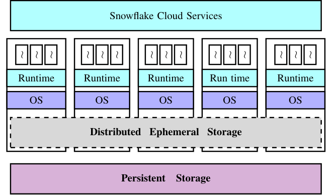

Snowflake 的系统设计还依赖两个关键思想。第一，它使用定制的临时存储系统，管理并交换查询执行期间在计算节点之间传递的临时或中间数据，例如 join 时交换的表。现有持久对象存储存在两项限制：一是延迟和吞吐不足，计算任务会因等待中间数据而阻塞；二是其可用性与持久性语义远强于短命中间数据实际所需。第二，Snowflake 不只用临时存储交换中间数据，也把它作为持久数据的直写缓存。配合专为分离式存储设计的查询调度机制，该方案既能减少计算与存储分离带来的额外网络负载，也能缓解数据局部性下降造成的性能开销。

Snowflake 已运行多年，如今每天服务数千客户，在 PB 级数据上执行数百万条查询。本文介绍其系统设计，重点讨论临时存储、查询调度、弹性以及高效多租户支持。我们还使用 2018 年 2 月连续 14 天内约 7000 万条查询的执行统计，详细分析生产系统的网络、计算和存储特征，得到以下主要发现：

- 客户提交的查询类型非常多样。只读、只写和读写查询分别约占全部客户查询的 28%、13% 和 59%。
- 不同查询的中间数据量跨越多个数量级；部分查询交换数百 GB 乃至数 TB 数据。查询生成的中间数据量与其读取的持久数据量或执行时间几乎没有相关性。
- 即使本地存储容量很小，数据仓库常见的偏斜访问分布与时间访问模式，仍可让持久数据访问获得约 60%-80% 的平均缓存命中率，具体取决于查询类型。
- 约 20% 的集群使用 Snowflake 的弹性能力。对提出扩缩请求的客户，其集群计算节点数在生命周期内最多可变化两个数量级。
- 峰值资源利用率可以很高，但平均利用率通常很低。平均 CPU、内存、网络发送和网络接收利用率分别约为 51%、19%、11% 和 32%。

这些现象既印证了社区正在推进的研究，也提出了三个值得继续探索的方向。

**计算与临时存储解耦。** Snowflake 已将计算与持久存储解耦，但计算和临时存储目前仍紧耦合。第 4 节表明，生产集群中计算容量与临时存储容量的需求比例可跨越多个数量级；在即席查询负载下，这会导致 CPU 利用不足或临时存储抖动。Pocket、Locus 等近期工作 [22, 27] 已开始探索计算与临时存储分离，但临时存储还需要细粒度弹性、多租户支持和跨查询隔离（见第 4、7 节）。

**更深的存储层次。** 与近期的计算存储分离研究 [14, 15] 类似，Snowflake 的临时存储会缓存频繁读取的持久数据，以降低网络流量并改善局部性。然而，传统缓存与局部性机制针对的是“内存为主层、HDD/SSD 为第二层”的两级系统。第 4 节将说明，生产集群的存储层次正在加深，需要能有效利用多级存储的新机制。

**亚秒级计价。** Snowflake 依靠预热节点池，在细粒度时间尺度上提供计算弹性；云资源按小时计费时，这种做法成本可控。但多数云厂商后来转向亚秒级计价 [6]，多租户之间如何高效实现弹性和资源共享由此出现新的技术挑战；相应设计与权衡可能不同于 Snowflake 当前方案（见第 7 节）。

本文关注 Snowflake 架构以及生产集群中观察到的计算、存储和网络特征，只介绍使论文自洽所需的细节。查询规划、优化、并发控制等内容见 Snowflake 的早期系统论文 [12]。为帮助后续研究，我们公开了匿名化的逐查询统计，以及文档和复现实验结果所需的脚本：`https://github.com/resource-disaggregation/snowset`。

这项研究有一个重要局限：它只考察一个系统（Snowflake）、一种工作负载（SQL 查询）和一种云基础设施（S3）。尽管该系统规模很大，运行在主流基础设施上，并服务数千客户的数百万条查询，结论能否推广到其他系统、负载和基础设施仍有待验证。我们希望该研究和公开数据集能像以往的数据中心网络流量研究 [9] 与云负载研究 [28] 一样，为社区后续工作提供推动力。

## 2. 设计概览

本节概述 Snowflake 的设计。Snowflake 对持久数据与中间数据采用不同处理方式：第 2.1 节先区分这些数据，第 2.2 节介绍总体架构，第 2.3 节说明查询的端到端执行过程。

### 2.1 持久数据与中间数据

Snowflake 区分三类应用状态。

- 持久数据（persistent data）：客户表数据存放在数据库中，一张表可能被很多查询长期、甚至并发读取，因此需要强持久性和可用性保证。
- 中间数据（intermediate data）：由查询算子生成，例如 join 中间结果，通常由参与该查询的节点消费，生命周期很短。失败时可以重跑生成它的查询片段，因此优先需要低延迟和高吞吐，而不是强持久性。
- 元数据（metadata）：对象目录、数据库表到持久存储文件的映射、统计信息、事务日志和锁等。

本文主要关注持久数据和中间数据。元数据通常规模较小，不是本文讨论的系统瓶颈。

### 2.2 端到端系统架构

图 1 展示了 Snowflake 的高层架构。系统有四个主要组件：编排端到端查询执行的集中式服务、计算层、分布式临时存储系统和持久数据存储。论文以 AWS 为例说明设计与实现，但 Snowflake 也运行在 Microsoft Azure 与 Google Cloud Platform 上。

**由 Cloud Services 集中控制。** 所有客户都通过名为 Cloud Services（CS）的集中层与 Snowflake 交互并提交查询 [12]。CS 负责访问控制、查询优化与规划、调度、事务管理、并发控制等。它被设计为长期运行的多租户服务，并通过充分复制获得高可用性和可扩展性。因此，单个服务节点失效不会造成状态丢失或服务不可用，不过部分受影响查询可能失败，随后由系统透明地重新执行。

**通过 Virtual Warehouse 抽象提供弹性计算。** 客户通过虚拟仓库（Virtual Warehouse，VW）使用 Snowflake 的计算资源。一个 VW 本质上是一组 AWS EC2 实例，客户查询在其上分布式执行；客户按照 VW 规格与计算时间付费。每个 VW 都能按客户请求弹性扩缩并并发执行多条查询。事实上，许多客户会运行多个 VW，例如一个负责数据摄取，另一个执行 OLAP 查询。为把弹性粒度缩短到几十秒，Snowflake 维护预热 EC2 实例池：扩容时，大多数请求可直接从池中取得已启动实例，避开实例启动延迟；缩容时则从 VW 中移除实例。

**弹性本地临时存储。** 中间数据与持久数据的性能要求不同，而现有持久数据存储无法满足中间数据所需的低延迟与高吞吐。Snowflake 因此构建了定制的分布式临时存储系统，并把它与 VW 的计算节点部署在一起。节点加入或移除时，系统能自动扩缩，且不要求重新分区或重排数据，从而消除了无共享架构的一个核心限制。每个 VW 都运行一套相互独立的分布式临时存储，只服务该 VW 上的查询。

**弹性远端持久存储。** Snowflake 把所有持久数据放在远端、分离式持久数据存储中。尽管 S3 的延迟与吞吐表现较为普通，系统仍选择它，因为它具备弹性、高可用性与高持久性。S3 保存不可变文件：文件只能整体覆盖，甚至不能追加，但可以读取文件的一部分。Snowflake 将表水平切分成不可变大文件，这些文件相当于传统数据库的块 [12]。文件内部采用 PAX 布局 [2]，把每个属性或列的值聚集在一起并压缩；文件头记录每列的偏移，从而可利用 S3 的部分读取功能，只取查询需要的列。属于同一客户的所有 VW 都能通过远端持久存储访问同一组共享表，因此无须在 VW 之间物理复制数据。

### 2.3 端到端查询执行

查询执行从客户把查询文本和指定 VW 提交给 CS 开始。CS 解析、规划并优化查询，产生一组待执行任务，再把它们调度到 VW 的计算节点；第 5 节会进一步介绍调度与查询执行机制。每个任务都可能读写临时存储与远端持久数据存储。CS 持续跟踪每条查询的进度并收集性能计数器；检测到节点失效时，它会把查询重新调度到 VW 的其他计算节点。执行完成后，结果返回 CS，最终再交给客户。

## 3. 数据集

Snowflake 在系统各层收集统计信息。CS 保存每个 VW 的规模随时间变化、实例类型、失败统计，也记录单条查询的性能计数器与各执行阶段耗时。每个计算节点还会收集临时与持久存储访问、CPU、内存和带宽利用率以及压缩属性。我们公开的数据集包含连续 14 天内约 7000 万条查询的大部分统计，并按查询聚合。出于隐私考虑，数据集不含查询计划、表模式或逐文件访问频率；为了保证可复现性，本文只使用已公开数据集中的统计。

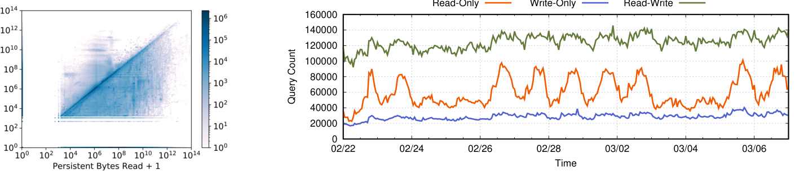

**查询分类。** 我们依据查询读取和写入的持久数据字节数，将数据集分为三类；图 2 左图展示分类，右图展示每一类查询在不同时段的提交数量。

- **只读查询。** 横轴上的点表示不写任何持久数据的查询，但其读取量可跨越 9 个数量级。这类查询约占全部客户查询的 28%，代表数据仓库中常见的即席与交互式 OLAP 负载 [10]；结果通常很小，会直接返回客户端。提交数量在工作日白天明显出现尖峰。
- **只写查询。** 纵轴上的点表示不读取任何持久数据的查询，但其写入量可跨越 8 个数量级。这类查询约占全部客户查询的 13%，本质上是把数据导入系统的摄取查询。与只读查询不同，其提交速率在时间上相当稳定。
- **读写查询。** 图中央区域约占客户查询的 59%，这些查询既读又写持久数据。许多查询按字节计算的读写比接近 1，对应数据仓库典型的抽取、转换、加载（ETL）流水线 [29, 31, 32]；其他查询的读写比可跨越多个数量级。

这种分类取决于查询自身的持久数据读写特征，并非 Snowflake 架构的人为产物：即使同一批查询运行在 Hadoop、MySQL 等其他分析框架或单机数据库上，其持久读写特征也不会改变。我们没有按 SQL 语义分类，因为本文关注系统特征，公开数据集也不包含详细查询计划。后文均沿用上述分类。

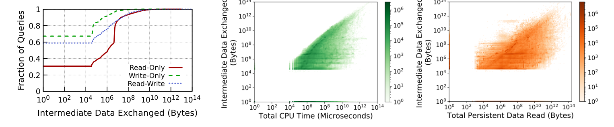

图 3 左图表明，各类查询中都有不可忽略的一部分完全不交换中间数据，但中间数据量总体变化极大；部分只读和读写查询会交换 10-100 TB 中间数据。中图按总 CPU 时间与中间数据交换量绘制每条查询：总 CPU 时间相同的查询，交换量可能相差多个数量级，计算需求与中间数据量之比最多相差约 6 个数量级。右图按持久数据读取量与中间数据交换量绘制查询，同样读取量的查询会产生完全不同的中间数据量，两者几乎没有相关性。因此，系统很难仅根据输入数据量或预计执行时间预先配置临时存储。

## 4. 临时存储系统

Snowflake 使用定制的分布式存储系统管理和交换中间数据，这是由现有持久数据存储 [5, 8] 的两项局限决定的。第一，它们无法提供足够低的延迟和足够高的吞吐，计算任务会因中间数据交换而阻塞。第二，它们提供的可用性与持久性语义远强于中间数据所需。定制临时存储避开了这两项限制：执行 join 等查询操作的任务把中间数据写在本地，消费数据的任务则根据第 5 节所述调度位置，在本地读取或经网络远程读取。

### 4.1 存储架构与配置

Snowflake 为临时存储做了两项重要设计决策。第一，系统没有构建纯内存存储，而是同时使用内存与本地 SSD：任务尽量把中间数据写入本地内存，内存占满后再溢写到本地 SSD。纯内存系统在全部数据都能放入内存时性能更高，但无法覆盖 Snowflake 面向的多样负载；图 3 左图中的部分查询会交换数百 GB 乃至数 TB 中间数据，很难全部容纳在主存中。

第二，当本地 SSD 容量也耗尽时，Snowflake 允许中间数据继续溢写到远端持久数据存储。相比把数据溢写到其他计算节点，选择 S3 有多项优势：不必跟踪中间数据散落在哪些节点，不必为大型查询显式处理内存不足或磁盘不足错误，并能让临时存储系统保持精简和高性能。

**未来方向。** 对性能关键查询，我们希望中间数据能全部留在内存，至少也应留在 SSD，而不溢写到 S3。这要求准确配置资源，但在保持高利用率的同时配置 CPU、内存和存储有两重困难。

第一，云上可选节点实例种类有限，每种实例都提供固定比例的 CPU、内存和存储，而不同查询的资源需求远比实例类型丰富。图 3 中图显示，不同查询的计算需求与中间数据量之比最多可相差 6 个数量级，现有实例选项不足以让节点硬件精确贴合如此多样的查询需求。

第二，即使节点硬件能够贴合查询需求，准确配置内存和存储仍需要事先知道查询会产生多少中间数据。Snowflake 的经验表明，对大多数查询而言，预测这一数据量很困难，甚至不可能。图 3 显示，中间数据量不仅跨查询变化多个数量级，而且与持久数据读取量或预计执行时间几乎没有相关性。

计算与临时存储进一步解耦可以解决第一项挑战，使各类资源得以独立配置，从而更好地匹配查询需求；但中间数据量不可预测这一挑战更难解决。要同时实现高性能和高资源利用率，系统既要解耦计算与临时存储，也需要临时存储本身具备高效、细粒度的弹性；第 6 节会继续讨论后者。

### 4.2 持久数据缓存

Snowflake 在早期设计中观察到，中间数据生命周期很短：其峰值需要大量内存与存储，但平均需求很低。因此，可以在中间数据与频繁访问的持久数据之间对临时存储容量做统计复用。这样能提升性能，一方面因为数据仓库查询对持久数据存在高度偏斜的访问模式 [10]，另一方面因为临时存储的性能显著优于现有远端持久数据存储。

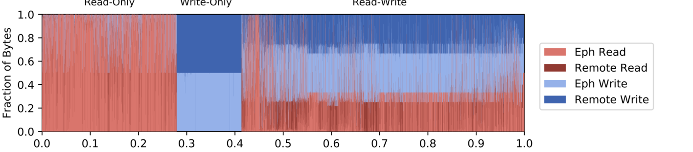

Snowflake 通过“机会性”缓存频繁访问的持久数据文件，在中间数据与持久数据之间统计复用临时存储容量。“机会性”意味着中间数据存储始终优先于持久文件缓存，因此缓存带来的查询加速不会降低中间数据访问性能。持久文件不能缓存在任意节点：系统对持久数据文件名做一致性哈希，为客户的输入文件集合分配节点；文件只能缓存在其哈希对应节点上，每个节点再用简单 LRU 策略决定缓存与淘汰。

这种机会性缓存必须谨慎维护语义。首先，临时存储中的持久文件视图必须与远端持久数据存储一致，因此临时存储被强制用作持久文件的直写缓存。其次，朴素的一致性哈希会在 VW 弹性扩缩时重排缓存数据；Snowflake 实现了惰性一致性哈希，完全避免此类数据重排，第 6 节将详细说明。

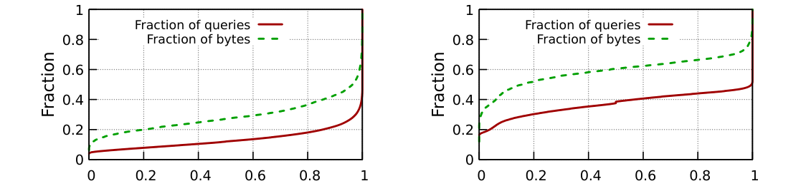

机会性缓存意味着一部分持久数据访问可由临时存储服务，具体取决于是否命中。图 4 按字节比例展示持久数据 I/O 在临时存储与远端持久存储之间的分布；每个竖条代表一条查询，四种颜色分别表示从临时或远端系统读取、向临时或远端系统写入。临时存储的直写性质，使写入其中的数据量与写入远端存储的数据量大致处于同一数量级；二者并不总相等，因为保存中间数据优先于缓存持久数据。

尽管临时存储容量平均只有客户持久数据量的约 0.1%，数据仓库常见的偏斜文件访问分布和时间访问模式 [7] 仍带来相当高的命中率：只读查询平均接近 80%，读写查询约为 60%，中位数甚至更高。图 5 给出按查询与按持久读取字节加权的命中率累积分布。例如，约 80% 的只读查询命中率高于 75%，但这些查询只贡献全部只读查询持久读取字节的略多于 60%。

**未来方向。** 图 4 和图 5 表明缓存仍有大量研究空间。除访问局部性外，命中率还取决于查询可用的有效缓存大小相对于其持久数据访问量的比例；有效缓存大小又受 VW 规模以及并发查询产生的中间数据量影响。我们的初步分析尚未就这两项因素对命中率的影响得出确定结论，仍需更细粒度的数据分析。

此外还有两个技术问题。第一，端到端查询性能同时取决于持久文件缓存命中率与中间数据 I/O 吞吐，因此必须优化临时存储在二者之间的容量划分。当前策略始终优先保存中间数据，但对同一客户所有查询的平均完成时间等端到端目标而言，这未必最优。例如，一个将被许多查询访问的持久文件，可能比仅被一条查询访问的中间数据更值得优先缓存。未来可扩展面向并行作业端到端性能的已有缓存机制 [7]，把中间数据纳入决策。

第二，现有缓存机制大多针对两级存储设计，即以内存为主层、HDD/SSD 为第二层。Snowflake 已有计算节点本地内存、临时存储系统和远端持久数据存储三级；随着非易失内存进入云端、远端临时存储设计 [22] 逐渐成熟，层次还会继续加深。Snowflake 当前仍使用传统两级机制：每个节点用一套本地 LRU 把数据从内存淘汰到 SSD，再用另一套独立 LRU 从 SSD 淘汰到远端持久存储。要有效利用更深层次，必须设计能跨多层协调缓存的新机制。这些挑战并非 Snowflake 特有，也适用于其他构建在分离式存储之上的分布式应用。

## 5. 查询任务调度

客户把查询提交给 Cloud Services（CS），并指定在哪个 VW 上执行。CS 完成查询解析、规划和优化，把查询拆成一组需要在该 VW 计算节点上运行的任务。任务放置不是一个独立于存储的决定：临时存储既保存中间数据，又缓存持久文件，因而调度器必须同时考虑持久数据缓存局部性、中间数据交换和节点负载。

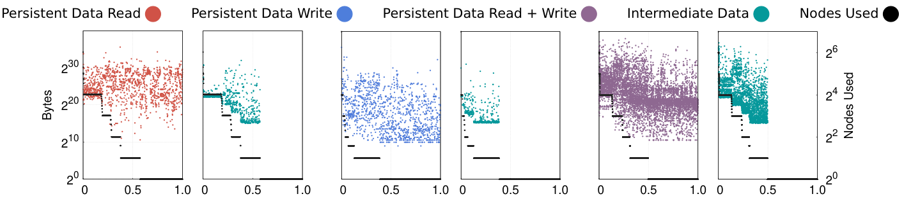

**局部性感知的任务调度。** 为充分利用临时存储，Snowflake 尽量让任务与其操作的持久文件位于同一节点。第 4.2 节已经说明，系统依据表文件名的一致性哈希把持久文件分配给计算节点；在 VW 规模固定时，每个文件只会缓存在一个确定节点上。因此，CS 把操作该文件的任务调度到文件哈希所指向的节点。命中缓存时，任务无需从远端持久存储重新取得输入。

这种机制也把查询并行度与文件哈希紧密绑定：一条为缓存局部性而调度的查询，可能分布到 VW 的全部节点。假设客户有 100 万个持久文件，VW 有 10 个节点；第一条查询访问 100 个文件，第二条查询访问 10 万个文件。由于两组文件都很可能哈希到所有 10 个节点，两条查询最终都会在全部节点上执行，尽管其输入规模相差 1000 倍。

图 6 把三类查询分别按实际使用的节点数排序，并在相同横轴上绘出持久数据读取量、写入量、读写总量、中间数据交换量和节点数。结果显示，在每一个固定节点数下，持久读写字节仍可跨越约 3 个数量级，查询使用多少节点几乎不能反映其持久数据规模；符合预期的是，使用节点越多，网络上传输的中间数据通常越多。

**工作窃取。** 一致性哈希可能产生不均衡分区 [19]。为避免某些节点过载并改善负载均衡，Snowflake 使用一种简单的工作窃取（work stealing）优化：若某任务在新节点上的预计完成时间更短，便允许新节点从原节点窃取该任务；预计完成时间同时计入排队等待和实际执行时间。

任务被窃取后，它需要的持久文件直接从远端持久数据存储读取，而不会跨节点回到原调度位置读取缓存。这样虽然失去了该任务的缓存局部性，却不会给已过载的原节点再增加文件服务负担。工作窃取只在原节点过载时发生，正是这种情形下，牺牲局部性换取更短排队时间才有意义。

**未来方向。** 调度器有两个极端选择。一个极端是当前实现：始终把任务放在缓存其持久输入的节点上。这会最小化读取持久数据的网络流量，却可能像上述例子一样让每条查询覆盖 VW 的全部节点，从而扩大中间数据交换流量。另一个极端是把一条查询的所有任务都放在单个节点上；这会消除中间数据的跨节点传输，却会增加从远端读取持久文件的网络流量，并限制并行度。

两种极端都不可能适合所有查询。一个更好的方向是协同设计查询调度器：先根据查询的持久输入、中间数据规模和节点负载选择恰当的节点子集，在持久读取与中间交换的网络开销之间找到平衡，再把各个任务调度到这个子集上。

## 6. 资源弹性

本节讨论 Snowflake 的核心目标之一：按需扩缩计算与存储资源。把计算从持久存储中分离后，两类资源可以独立伸缩。持久数据的容量与吞吐弹性交给 S3 等持久存储服务 [5]；计算弹性则由预热节点池承担，节点可按需加入或移出客户 VW。因为扩容通常不必等待新实例启动，Snowflake 能把计算弹性的时间粒度缩短到几十秒。

### 6.1 惰性一致性哈希

弹性扩缩中的一个难点是临时存储中的数据管理。系统机会性缓存持久数据文件，每个文件只能放在其一致性哈希所指向的 VW 节点上。这与无共享系统面对的问题相似：任何固定分区机制在节点规模变化后，都要求大量数据重新映射和搬运；同一批节点还要负责查询处理，因此立即重排缓存会消耗其网络、磁盘与 CPU，显著影响扩缩期间正在运行的查询。

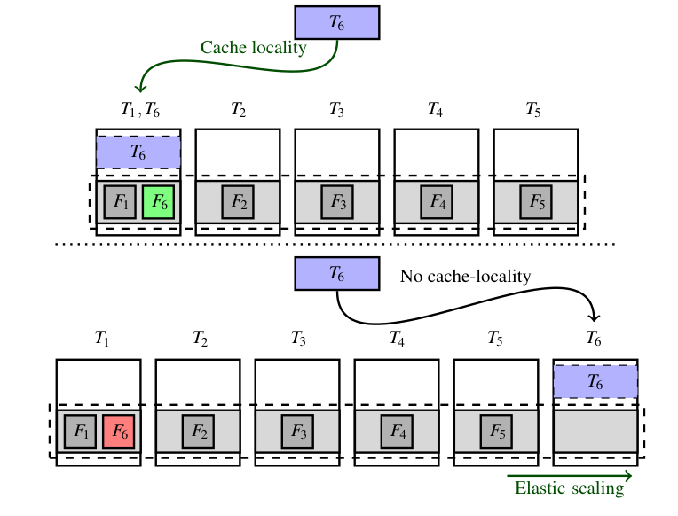

Snowflake 使用惰性一致性哈希解决这一问题。关键条件是：临时存储里的持久文件只是缓存，远端持久存储始终保有权威副本。因此，节点变化时不必立即搬动缓存，系统可以依靠后续正常访问逐渐收敛到新的哈希状态。

图 7 给出具体过程。设 VW 中有任务 `T1` 到 `T6`，任务 `Ti` 只访问文件 `Fi`。在时刻 `t0`，VW 有 5 个节点；`N1` 缓存 `F1` 和 `F6`，`N2` 到 `N5` 分别缓存 `F2` 到 `F5`。在 `t > t0` 时加入 `N6` 后，新哈希映射应把 `F6` 从 `N1` 改到 `N6`。Snowflake 不会立即复制或搬移 `F6`，而是等 `T6` 因工作窃取或同一查询再次运行而被重新调度。此时，一致性哈希把 `T6` 放到 `N6`，`N6` 从远端持久存储读取并缓存 `F6`。`N1` 上的旧副本此后不再被访问，最终由缓存淘汰策略自然清除。这样既恢复数据局部性，又完全避免扩缩瞬间的数据重排，也不干扰 VW 原有节点上的进行中查询。

### 6.2 弹性特征

生产环境中的客户 VW 呈现出几类值得关注的弹性特征。图 8 显示，约 20% 的 VW 已经使用弹性能力；对确实提出 VW 调整请求的客户，节点数量在 VW 生命周期内最多可以变化两个数量级。图 9 的两个案例甚至会以小时为单位积极调整规模。

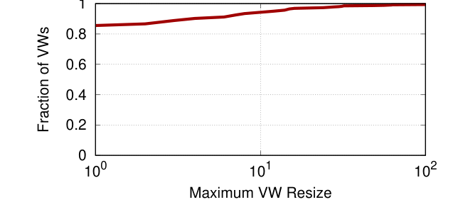

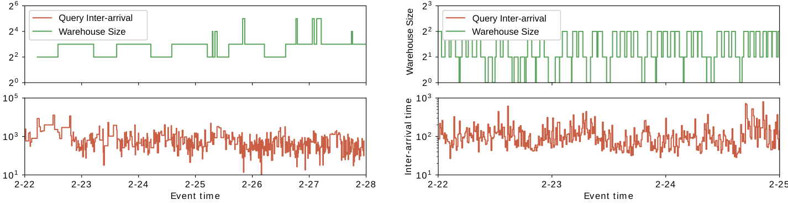

但图 8 同时表明，超过 80% 的 VW 从未利用弹性；即使会调整规模，客户所选粒度也仍有优化余地。图 9 把两个高负载 VW 的规模变化和按分钟分箱的查询到达间隔放在一起：左侧 VW1 覆盖 7 天，右侧 VW2 覆盖 4 天。两者的查询到达变化都远细于客户请求的 VW 调整时间尺度。VW1 来自一个大型客户且长期高负载，它尤其清楚地显示了人工扩缩与真实需求之间的错配。

我们认为，主要原因是客户既看不到足够的系统内部状态，也缺少准确的需求估计手段，因而无法请求恰好满足负载的 VW 规模。论文数据采集之后，Snowflake 已经投入大量工作，使 VW 能按查询到达间隔自动扩缩，但仍有两项更深入的问题需要解决。

第一项是查询内弹性。单条查询生命周期内的资源消耗也会大幅变化，包含很多内部阶段的长查询尤其明显。除了按查询到达间隔扩缩整个 VW，系统理想上还应在查询执行过程中提供某种任务级弹性，使资源随阶段需求动态增减。

第二项是探索类似 serverless 的平台。AWS Lambda、Azure Functions 和 Google Cloud Functions 已提供自动扩缩、高弹性与细粒度计费，并被多类应用采用。但现有 serverless 基础设施缺少 Snowflake 所需的安全隔离与性能隔离 [34]；许多客户存储并查询敏感、机密数据，强隔离不能妥协。Snowflake 可以考虑自建 serverless 式计算平台，不过这条路线必须先解决远端临时存储的高效访问（第 4.1 节）以及多租户资源共享（第 7 节）等挑战。

## 7. 多租户

Snowflake 当前通过 VW 抽象支持多租户：每个 VW 运行在相互隔离的节点集合上，并拥有自己的临时存储系统。这使系统能向客户提供清晰的性能隔离，却带来经典的“隔离与利用率”权衡。本节先用全系统统计说明这种代价，再据此讨论以共享为基础的替代架构。

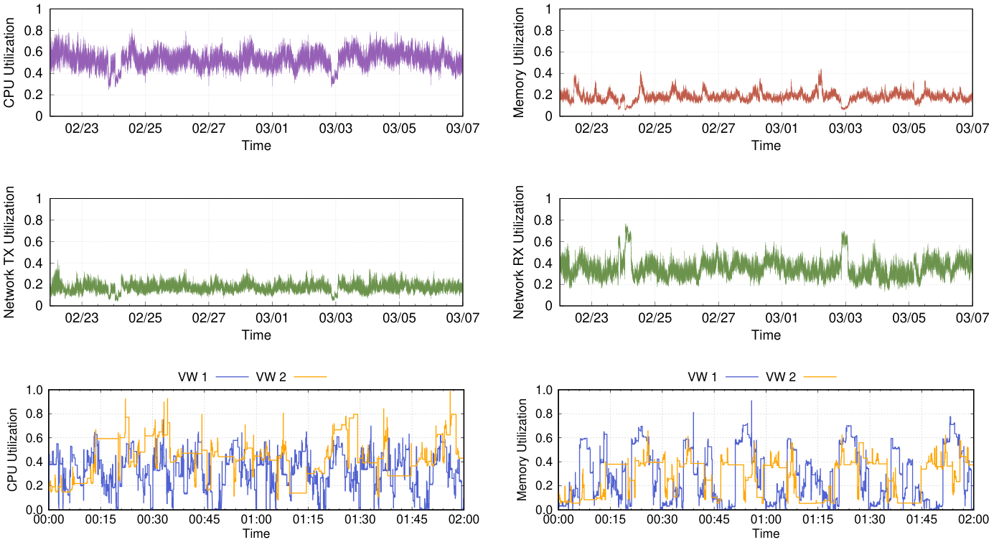

图 10 上方四图展示所有 VW 的系统级 CPU、内存、网络发送与网络接收利用率。CPU 平均利用率尚可但并不理想，其他资源的平均利用率更低。图 11 解释了部分原因：不同 VW 的资源使用随时间强烈波动，多达约 30% 的 VW，其 CPU 使用量的时间标准差不低于均值。客户倾向按峰值需求配置 VW，波动因而转化成平均空闲容量。

隔离 VW 的价值是性能可预测：客户不会因其他租户突发负载而遭遇尾延迟。但图 10 的代价同样明确，CPU、内存、网络发送和接收的全局平均利用率约为 51%、19%、11% 和 32%。部分 VW 确实会经历很高的峰值利用率，但这些高负载时段并不在不同 VW 间同步。图 10 下方把两个高活跃 VW 的 CPU 与内存曲线放大到两小时窗口，多处可见一个 VW 很忙而另一个同时很空闲。这意味着跨仓库统计复用可以在不增加物理容量的情况下吸收更多负载。

Snowflake 在最初设计时已经知道这一权衡，但云计价模式的变化促使我们重新审视隔离节点方案。基础设施按小时收费时，维护预热实例池具有成本效率：只要某客户 VW 在一小时内使用过节点，服务商就能把整小时成本计给该客户。主流云转为按秒计费 [6] 后，服务商希望利用细粒度价格降低运营成本，客户也要求更细粒度计价；预热节点未使用的每一秒都无法归入任何客户账单，大型预热池因此不再经济。

这为共享模型提供了直接动机：让客户共享计算与临时存储资源，以共享资源池对突发需求做统计复用，而不是为弹性保留大量空闲预热节点。问题并非平均吞吐能否提升，而是共享后如何仍向每个抽象 VW 提供接近独占部署的隔离，尤其是保持良好的尾部查询完成时间。

### 7.1 资源共享

图 11 所示的资源波动意味着许多客户工作负载具有突发性，共享架构可以通过细粒度统计复用提高利用率。Snowflake 当前用 small、large、XL 等抽象的 “T-shirt” 规格向客户描述 VW 容量；客户并不知道底层使用多少节点、采用哪些实例类型。理想的迁移方式是保持这套外部接口不变，只把内部实现从隔离节点改为共享资源。

真正的难点是让隔离属性接近当前架构。客户最关心的指标是端到端查询完成时间。纯共享架构很可能有良好的平均性能，但尾部性能更难保证。VW 中需要隔离的两类核心资源是计算和临时存储。数据中心计算隔离已有大量研究 [18, 35, 36]，Snowflake 又拥有集中式任务调度器与统一执行运行时，这使问题比通用集群中的计算隔离更可控；因此，论文把重点放在研究才刚开始关注的内存和存储隔离 [25]。

目标是设计一个同时使用内存和 SSD 的共享临时存储系统，在提供细粒度弹性的同时，不牺牲租户之间的隔离。这里至少有两个挑战。

第一，临时存储复用的是两种性质不同的对象：缓存的持久数据与查询产生的中间数据。共享系统必须联合管理两者，同时保证跨租户隔离。Snowflake 可以借鉴现有缓存共享机制 [11, 26]，但新机制还必须知道中间数据与持久缓存共存。缓存项的有效生命周期很难预测；系统若把某租户暂时空闲的缓存淘汰并把容量交给另一租户，就无法知道原租户何时会再次访问，因此不能同时承诺硬隔离。idle-memory taxation 等方法 [11, 33] 提供了一些思路，但仍需要重新定义可实现且有用的隔离保证，并设计了解数据生命周期的缓存共享机制。

第二，扩缩某一客户的共享临时存储容量时，不能干扰使用同一系统的其他租户。若直接复用 Snowflake 当前实现，所有租户的缓存项都一致性哈希到同一个全局地址空间；只要为一个客户扩容，惰性一致性哈希就会对所有租户生效，多个无关租户都可能出现更多缓存未命中和性能下降。解决办法要求临时存储为每个租户提供私有地址空间，并在资源变化时只重组真正获得新增资源的租户数据。

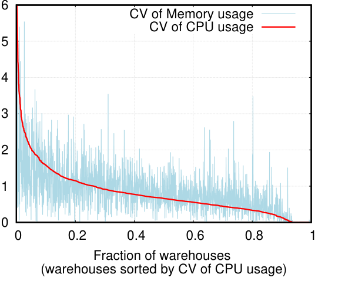

**内存分离。** 图 10 显示 VW 的平均内存利用率很低，而 DRAM 成本很高，这一点尤其值得担忧。共享资源会改善 CPU 和内存利用率，却未必能同时让两个维度都达到最优。图 11 以变异系数（标准差/均值）比较各 VW 随时间的 CPU 与内存使用；两者不仅都有显著波动，波动特征还明显不同，因此需要独立扩缩。

内存分离（memory disaggregation）[1, 14, 15] 从根本上允许计算与内存分别配置，但它没有消除供应难题。正如第 4.2 节所述，查询资源需求难以准确预知，而过度配置昂贵的 DRAM 代价很高。系统仍需要在多个租户之间高效共享分离式内存，同时给出明确的隔离保证。

## 8. 相关工作

Snowflake 的早期论文 [12] 已讨论系统的 SQL 功能及相应文献；本文聚焦资源分离、临时存储、缓存、任务调度、弹性和多租户，因此相关工作也围绕这些方面展开。

**SQL 即服务系统。** 云上提供 SQL 服务的系统包括 Amazon Redshift [16]、Aurora [4]、Athena [3]、Google BigQuery [30] 和 Microsoft Azure Synapse Analytics [24]。尽管其中一些已有设计或运营经验论文，我们尚未发现先前工作像本文这样，以数据驱动方式分析工作负载和系统特征。

Redshift 把持久数据的主副本保存在计算 VM 集群中，S3 只用于备份，因此无法获得 Snowflake 将计算与持久存储分离所带来的全部收益。Aurora 与基于 Dremel [23] 架构的 BigQuery 同样把计算和持久存储解耦；但 Aurora 依赖定制持久存储服务，把数据库日志处理卸载到存储端，而非使用传统对象存储。我们也没有看到公开文献解释 BigQuery 如何处理弹性和多租户。

**计算与临时存储解耦。** 先前工作通过研究 Facebook 的键值存储负载论证了闪存存储分离的必要性 [20]；Snowflake 的观测支持这一论点，并把它扩展到数据仓库负载。Pocket [22] 和 Locus [27] 是为 serverless 分析应用设计的临时存储系统，若 Snowflake 进一步把计算与临时存储解耦，它们会是有价值的候选方案。

不过，这些系统在单条查询生命周期内不能提供细粒度资源弹性：它们要么假定提交查询时已经知道中间数据规模，并据此预配资源；要么在无法提前获知规模时承受性能下降。第 4.1 节已经说明，中间数据规模极难预测。因而，更理想的系统还应支持细粒度弹性与跨查询隔离。NVMe over Fabrics、ReFlex、I10 等高性能远端闪存访问技术 [13, 17, 21]，也是高效解耦计算与临时存储的重要组成部分。

**多租户资源共享。** ESX Server [33] 在虚拟机环境中开创了多租户内存共享技术，包括内存气球（ballooning）与空闲内存税（idle-memory taxation）。Memshare [11] 研究单机 DRAM 缓存的多租户共享，把未预留容量分给应用以最大化命中率；FairRide [26] 则研究分布式环境中的公平缓存共享，并考虑租户间的数据共享。

类似的缓存共享与隔离机制，是 Snowflake 转向资源共享架构的重要基础。不过，Snowflake 的临时存储同时容纳持久数据缓存与短命中间数据；两者在生命周期、重算成本和隔离需求上不同，现有机制必须扩展为理解这些差异，才能直接用于该系统。

## 9. 结论

本文介绍了运行 Snowflake 的经验。Snowflake 是一个具有先进 SQL 支持的数据仓库系统，本文重点讨论它如何实现计算与存储弹性、多租户环境中的高性能，以及这些设计在生产规模下暴露出的新问题。

随着 Snowflake 服务数千客户、每天在 PB 级数据上执行数百万查询，当前设计已经取得一定成功。然而，基于约 7000 万条查询、14 天运行数据的分析显示，现有设计仍存在短板：中间数据量难以预测、资源平均利用率偏低、客户弹性调整粒度较粗、共享临时存储的隔离和容量管理仍是挑战。这些问题为系统与网络社区提供了新的研究方向。

## 致谢

我们感谢 shepherd Asaf Cidon 和匿名 NSDI 评审的反馈。该工作部分得到 NSF 1704742 和 Google Faculty Research Award 支持。

## 参考文献

- [1] M. K. Aguilera, N. Amit, I. Calciu, X. Deguillard, J. Gandhi, P. Subrahmanyam, L. Suresh, K. Tati, R. Venkatasubramanian, and M. Wei. Remote memory in the age of fast networks. In SOCC, 2017.
- [2] A. Ailamaki, D. J. DeWitt, M. D. Hill, and M. Skounakis. Weaving relations for cache performance. In VLDB, 2001.
- [3] Amazon. Amazon Athena. https://aws.amazon.com/athena/.
- [4] Amazon. Amazon Aurora Serverless. https://aws.amazon.com/rds/aurora/serverless/.
- [5] Amazon. Amazon Simple Storage Service (S3). http://aws.amazon.com/s3/.
- [6] Amazon. Per-second billing for EC2 instances. https://aws.amazon.com/blogs/aws/new-per-second-billing-for-ec2-instances-and-ebs-volumes/.
- [7] G. Ananthanarayanan, A. Ghodsi, A. Wang, D. Borthakur, S. Kandula, S. Shenker, and I. Stoica. Pacman: Coordinated memory caching for parallel jobs. In NSDI, 2012.
- [8] Microsoft Azure. Azure Blob Storage. https://azure.microsoft.com/en-us/services/storage/blobs/.
- [9] T. Benson, A. Akella, and D. A. Maltz. Network traffic characteristics of data centers in the wild. In IMC, 2010.
- [10] S. Chaudhuri and U. Dayal. An overview of data warehousing and OLAP technology. SIGMOD, 1997.
- [11] A. Cidon, D. Rushton, S. M. Rumble, and R. Stutsman. Memshare: A dynamic multi-tenant key-value cache. In ATC, 2017.
- [12] B. Dageville, T. Cruanes, M. Zukowski, V. Antonov, A. Avanes, J. Bock, J. Claybaugh, D. Engovatov, M. Hentschel, J. Huang, et al. The Snowflake elastic data warehouse. In SIGMOD, 2016.
- [13] NVM Express. NVMe over Fabrics overview. https://nvmexpress.org/wp-content/uploads/NVMe_Over_Fabrics.pdf.
- [14] P. X. Gao, A. Narayan, S. Karandikar, J. Carreira, S. Han, R. Agarwal, S. Ratnasamy, and S. Shenker. Network requirements for resource disaggregation. In OSDI, 2016.
- [15] J. Gu, Y. Lee, Y. Zhang, M. Chowdhury, and K. G. Shin. Efficient memory disaggregation with infiniswap. In NSDI, 2017.
- [16] A. Gupta, D. Agarwal, D. Tan, J. Kulesza, R. Pathak, S. Stefani, and V. Srinivasan. Amazon Redshift and the case for simpler data warehouses. In SIGMOD, 2015.
- [17] J. Hwang, Q. Cai, R. Agarwal, and A. Tang. I10: A remote storage I/O stack for high-performance network and storage hardware. In NSDI, 2020.
- [18] C. Iorgulescu, R. Azimi, Y. Kwon, S. Elnikety, M. Syamala, V. Narasayya, H. Herodotou, P. Tomita, A. Chen, J. Zhang, et al. PerfIso: Performance isolation for commercial latency-sensitive services. In ATC, 2018.
- [19] D. Karger and M. Ruhl. New algorithms for load balancing in peer-to-peer systems. 2003.
- [20] A. Klimovic, C. Kozyrakis, E. Thereska, B. John, and S. Kumar. Flash storage disaggregation. In EuroSys, 2016.
- [21] A. Klimovic, H. Litz, and C. Kozyrakis. ReFlex: Remote flash ≈ local flash. In ASPLOS, 2017.
- [22] A. Klimovic, Y. Wang, P. Stuedi, A. Trivedi, J. Pfefferle, and C. Kozyrakis. Pocket: Elastic ephemeral storage for serverless analytics. In OSDI, 2018.
- [23] S. Melnik, A. Gubarev, J. J. Long, G. Romer, S. Shivakumar, M. Tolton, and T. Vassilakis. Dremel: Interactive analysis of web-scale datasets. VLDB, 2010.
- [24] Microsoft. Azure Synapse Analytics. https://azure.microsoft.com/en-us/services/synapse-analytics/.
- [25] M. Nanavati, J. Wires, and A. Warfield. Decibel: Isolation and sharing in disaggregated rack-scale storage. In NSDI, 2017.
- [26] Q. Pu and H. Li. FairRide: Near-optimal, fair cache sharing. In NSDI, 2016.
- [27] Q. Pu, S. Venkataraman, and I. Stoica. Shuffling, fast and slow: Scalable analytics on serverless infrastructure. In NSDI, 2019.
- [28] C. Reiss, A. Tumanov, G. R. Ganger, R. H. Katz, and M. A. Kozuch. Heterogeneity and dynamicity of clouds at scale: Google trace analysis. In SoCC, 2012.
- [29] R. J. Santos and J. Bernardino. Real-time data warehouse loading methodology. In IDEAS, 2009.
- [30] K. Sato. An inside look at Google BigQuery. https://cloud.google.com/files/BigQueryTechnicalWP.pdf.
- [31] A. Simitsis, P. Vassiliadis, and T. Sellis. Optimizing ETL processes in data warehouses. In ICDE, 2005.
- [32] P. Vassiliadis. A survey of extract-transform-load technology. IJDWM, 2009.
- [33] C. A. Waldspurger. Memory resource management in VMware ESX Server. ACM SIGOPS Operating Systems Review, 2002.
- [34] L. Wang, M. Li, Y. Zhang, T. Ristenpart, and M. Swift. Peeking behind the curtains of serverless platforms. In ATC, 2018.
- [35] X. Yang, S. M. Blackburn, and K. S. McKinley. Elfen scheduling: Fine-grain principled borrowing from latency-critical workloads using simultaneous multithreading. In ATC, 2016.
- [36] X. Zhang, E. Tune, R. Hagmann, R. Jnagal, V. Gokhale, and J. Wilkes. CPI2: CPU performance isolation for shared compute clusters. In EuroSys, 2013.
