# ClickHouse - Lightning Fast Analytics for Everyone（中文译文）

## 译者说明

本文依据同目录的 `source.pdf` 翻译。章节、图表、公式、算法、代码与参考文献按原文结构保留。

Robert Schulze（ClickHouse Inc.，robert@clickhouse.com）<br>
Tom Schreiber（ClickHouse Inc.，tom@clickhouse.com）<br>
Ilya Yatsishin（ClickHouse Inc.，iyatsishin@clickhouse.com）<br>
Ryadh Dahimene（ClickHouse Inc.，ryadh@clickhouse.com）<br>
Alexey Milovidov（ClickHouse Inc.，milovidov@clickhouse.com）

## 摘要

过去几十年，存储和分析的数据量呈指数增长。各行业、各领域的企业开始依赖这些数据来改进产品、评估绩效并作出关键业务决策。然而，随着数据量日益达到互联网规模，企业需要以经济且可扩展的方式管理历史和新产生的数据，同时使用大量并发查询进行分析，并期望达到实时延迟（例如，视用例而定，低于一秒）。

本文概述 ClickHouse：一种流行的开源 OLAP 数据库，面向具有高摄取速率的 PB 级数据集提供高性能分析。其存储层把基于传统日志结构合并树（LSM 树）的数据格式，与在后台持续变换历史数据（例如聚合、归档）的新技术结合起来。查询使用方便的 SQL 方言编写，由先进的向量化查询执行引擎处理，并可选择代码编译。ClickHouse 积极采用剪枝技术，避免在查询中处理无关数据。其他数据管理系统可以在表函数、表引擎或数据库引擎层集成。真实世界基准测试表明，ClickHouse 是市场上最快的分析型数据库之一。

**PVLDB 引用格式：** Robert Schulze, Tom Schreiber, Ilya Yatsishin, Ryadh Dahimene, and Alexey Milovidov. ClickHouse - Lightning Fast Analytics for Everyone. PVLDB, 17(12): 3731–3744, 2024. DOI：[10.14778/3685800.3685802](https://doi.org/10.14778/3685800.3685802)。

## 1 引言

本文介绍 ClickHouse，这是一种列式 OLAP 数据库，旨在对具有数万亿行、数百列的表执行高性能分析查询。ClickHouse 于 2009 年起步，当时是面向 Web 规模日志文件数据的过滤和聚合算子[^1]，并于 2016 年开源。图 1 展示本文所述主要功能引入 ClickHouse 的时间。

ClickHouse 旨在应对现代分析数据管理的五个关键挑战：

1. **高摄取速率的海量数据集。** Web 分析、金融、电子商务等行业中，许多数据驱动应用的数据量巨大且持续增长。为处理海量数据集，分析型数据库不仅必须提供高效的索引和压缩策略，还必须允许数据分布到多个节点上（横向扩展），因为单台服务器的存储容量限于几十 TB。此外，对于实时洞察，新近数据通常比历史数据更有价值。因此，分析型数据库必须能够以持续高速或突发方式摄取新数据，同时不断“降低”历史数据的“优先级”（例如聚合、归档），而不拖慢并行执行的报表查询。
2. **大量同时执行、期望低延迟的查询。** 查询通常可分为即席查询（例如探索性数据分析）和重复查询（例如周期性仪表盘查询）。用例的交互性越强，期望的查询延迟越低，这给查询优化和执行带来挑战。重复查询还提供了根据工作负载调整数据库物理布局的机会。因此，数据库应提供能够优化频繁查询的剪枝技术。此外，即使大量查询同时运行，数据库也必须根据查询优先级，为 CPU、内存、磁盘和网络 I/O 等共享系统资源提供公平或有优先级的访问。
3. **多样的数据存储系统、存储位置与格式。** 为融入现有数据架构，现代分析型数据库应高度开放，能够读写任何系统、位置或格式中的外部数据。
4. **方便的查询语言及性能内省支持。** OLAP 数据库的实际使用还提出了额外的“软”要求。例如，相较于小众编程语言，用户通常更愿意通过表达能力丰富的 SQL 方言访问数据库，这种方言应支持嵌套数据类型以及丰富的普通函数、聚合函数和窗口函数。分析型数据库还应提供完善的工具，以内省系统或单条查询的性能。
5. **工业级稳健性和灵活的部署方式。** 由于商用硬件并不可靠，数据库必须通过数据复制抵御节点故障。此外，数据库应能运行于从老旧笔记本电脑到强大服务器的任意硬件上。最后，为避免基于 JVM 的程序的垃圾回收开销，并实现直接利用硬件的性能（例如 SIMD），理想情况下，数据库应以面向目标平台的原生二进制文件部署。

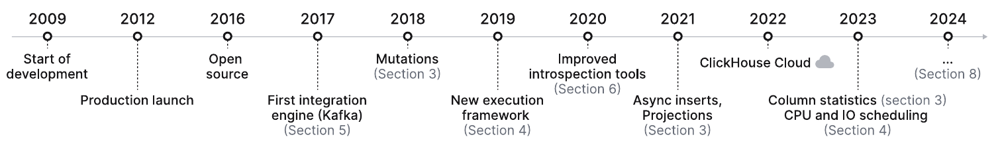

图 1：ClickHouse 时间线。

## 2 架构

如图 2 所示，ClickHouse 引擎分为三个主要层次：查询处理层（第 4 节）、存储层（第 3 节）和集成层（第 5 节）。此外，访问层管理用户会话以及通过不同协议与应用程序的通信。线程、缓存、基于角色的访问控制、备份和持续监控由横向组件负责。ClickHouse 使用 C++ 构建为无依赖、静态链接的单一二进制文件。

查询处理遵循传统范式：解析传入查询，构建并优化逻辑和物理查询计划，然后执行。ClickHouse 使用类似 MonetDB/X100 [11] 的向量化执行模型，并结合择机进行的代码编译 [53]。查询可用功能丰富的 SQL 方言、PRQL [76] 或 Kusto 的 KQL [50] 编写。

存储层由不同的表引擎组成，封装表数据的格式和位置。表引擎分为三类。第一类是 MergeTree* 表引擎家族，代表 ClickHouse 的主要持久化格式。基于 LSM 树 [60] 的思想，表被横向拆分为有序的数据部件（part），后台进程不断合并这些部件。各 MergeTree* 表引擎的区别在于合并操作如何组合输入部件中的行。例如，可以聚合行，或替换过时的行。

第二类是用于加速或分布式执行查询的专用表引擎。其中包括称为字典（dictionary）的内存键值表引擎。字典缓存周期性地针对内部或外部数据源执行的查询结果。在允许一定程度数据陈旧的场景中，这能显著降低访问延迟。[^2] 其他专用表引擎包括用于临时表的纯内存引擎，以及用于透明数据分片的 Distributed 表引擎（见下文）。

第三类是虚拟表引擎，用于与外部系统双向交换数据，如关系数据库（例如 PostgreSQL、MySQL）、发布/订阅系统（例如 Kafka、RabbitMQ [24]）或键值存储（例如 Redis）。虚拟引擎也能与数据湖（例如 Iceberg、DeltaLake、Hudi [36]）或者对象存储（例如 AWS S3、Google GCP）中的文件交互。

ClickHouse 支持跨多个集群节点对表进行分片和复制，以实现可扩展性与可用性。分片根据分片表达式，将表划分为一组表分片。各分片是相互独立的表，通常位于不同节点。客户端可以直接读写分片，将它们视为单独的表；也可以使用 Distributed 专用表引擎获得所有分片的全局视图。分片主要用于处理超出单个节点容量的数据集（通常为几十 TB 数据）。另一用途是把表的读写负载分散到多个节点，即负载均衡。与此正交，单个分片可复制到多个节点，以容忍节点故障。为此，每个 MergeTree* 表引擎都有对应的 ReplicatedMergeTree* 引擎，后者使用基于 Raft 共识 [59] 的多主协调方案，确保每个分片始终具有可配置数量的副本。该方案由 Keeper[^3] 实现：它用 C++ 编写，可直接替代 Apache Zookeeper。第 3.6 节详细讨论复制机制。作为示例，图 2 展示一个具有两个分片的表，每个分片各复制到两个节点。

最后，ClickHouse 数据库引擎可采用本地部署、云、独立工具或进程内模式运行。在本地部署模式下，用户在本地将 ClickHouse 安装为单服务器或使用分片和/或复制的多节点集群。客户端通过原生协议、MySQL 或 PostgreSQL 的二进制线协议，或者 HTTP REST API 与数据库通信。云模式由 ClickHouse Cloud 提供，它是一项全托管、自动伸缩的 DBaaS 服务。本文聚焦本地部署模式，我们计划在后续论文中介绍 ClickHouse Cloud 架构。独立工具模式将 ClickHouse 变为分析和变换文件的命令行工具，使其成为 cat 和 grep 等 Unix 工具的 SQL 替代方案。[^4] 这种模式无需预先配置，但限于单台服务器。最近开发的进程内模式称为 chDB [15]，用于交互式数据分析用例，例如在 Jupyter notebook [37] 中使用 Pandas dataframe [61]。受 DuckDB [67] 启发，chDB 将 ClickHouse 作为高性能 OLAP 引擎嵌入宿主进程。与其他模式相比，数据库引擎与应用运行于相同地址空间，因此源数据和结果数据能够在二者之间高效传递，无需复制。[^5]

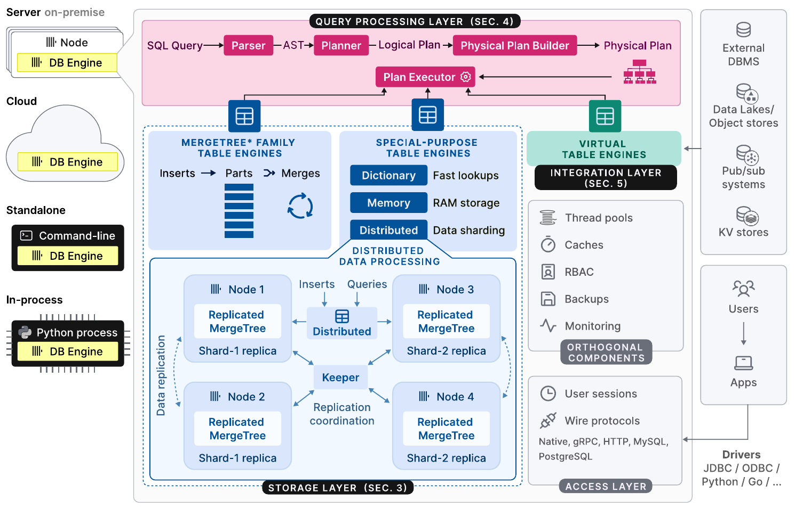

图 2：ClickHouse 数据库引擎的高层架构。

## 3 存储层

本节讨论作为 ClickHouse 原生存储格式的 MergeTree* 表引擎。我们介绍其磁盘表示，并讨论 ClickHouse 中的三种数据剪枝技术。随后介绍在不影响同时发生的插入操作的情况下持续变换数据的合并策略。最后解释更新和删除、数据去重、数据复制以及 ACID 合规性。

### 3.1 磁盘格式

MergeTree* 表引擎中的每张表，都组织为一组不可变的表部件。每当一组行被插入表中，就创建一个部件。部件是自包含的：它包含解释其内容所需的全部元数据，无需额外查询中央目录。为限制每张表的部件数量，后台合并作业周期性地将多个小部件合为较大部件，直到达到可配置的部件大小（默认为 150 GB）。由于部件按表的主键列排序（见第 3.2 节），合并使用高效的 k 路归并排序 [40]。源部件被标记为不活动，一旦引用计数降为零，即不再有查询读取它们，就最终将其删除。

可以用两种模式插入行。在同步插入模式下，每条 INSERT 语句都会创建一个新部件并将其追加到表中。为尽量降低合并开销，鼓励数据库客户端批量插入元组，例如一次 20,000 行。然而，如果数据需要实时分析，客户端批处理带来的延迟通常不可接受。例如，可观测性用例经常包含数千个监控代理，持续发送少量事件和指标数据。这类场景可利用异步插入模式：ClickHouse 将多条传入同一张表的 INSERT 中的行放入缓冲区，只有在缓冲区大小超过可配置阈值或超时到期之后，才创建新部件。

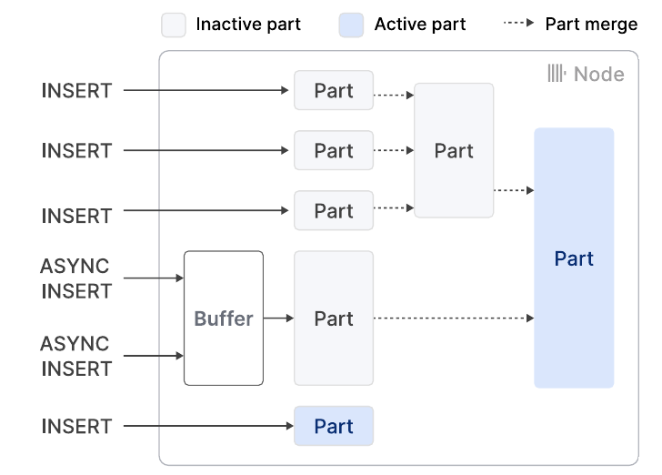

图 3：MergeTree* 引擎表的插入与合并。

图 3 展示对一张 MergeTree* 引擎表的四次同步插入和两次异步插入。两次合并将活动部件数从最初的五个减至两个。

与 LSM 树 [58] 及其在各种数据库中的实现 [13, 26, 56] 相比，ClickHouse 平等对待所有部件，而不将它们组织为层级。因此，合并不再限于同一层中的部件。由于这也放弃了部件的隐式时间顺序，因此需要不基于墓碑的其他更新和删除机制（见第 3.4 节）。ClickHouse 将插入直接写入磁盘，而其他基于 LSM 树的存储通常采用预写式日志（见第 3.7 节）。

一个部件对应磁盘上的一个目录，其中每列各有一个文件。一项优化是：小部件（默认小于 10 MB）的各列连续存储在单个文件中，以提高读写的空间局部性。一个部件的行进一步在逻辑上分为每组 8192 条记录的粒度单元（granule）。粒度单元是 ClickHouse 扫描和索引查找算子处理的最小不可分割数据单位。不过，磁盘数据的读写并不以粒度单元为单位，而是以块（block）为粒度；块合并了同一列中多个相邻的粒度单元。新块根据每块可配置的字节数形成（默认为 1 MB），即块中粒度单元的数量可变，取决于列的数据类型和分布。块还会被压缩，以减少大小及 I/O 成本。ClickHouse 默认使用 LZ4 [75] 作为通用压缩算法，用户也可指定专用编解码器，例如用于浮点数据的 Gorilla [63] 或 FPC [12]。压缩算法也可以串联。例如，可以先通过增量编码 [23] 降低数值的逻辑冗余，再执行重型压缩，最后使用 AES 编解码器加密数据。块从磁盘载入内存时即时解压。为在压缩的情况下仍能快速随机访问单个粒度单元，ClickHouse 还为每列保存映射，把每个粒度单元 ID 映射到其所在压缩块在列文件中的偏移，以及该粒度单元在未压缩块中的偏移。

通过两种特殊的包装数据类型，还可以对列进行字典编码 [2, 77, 81] 或令其可空：LowCardinality(T) 用整数 ID 替代原始列值，显著减少唯一值较少的数据的存储开销。Nullable(T) 为列 T 增加一个内部位图，表示列值是否为 NULL。

最后，表可以通过任意分区表达式，按范围、哈希或轮转方式分区。为支持分区剪枝，ClickHouse 还存储每个分区的分区表达式最小值和最大值。用户可以选择创建更高级的列统计信息（例如 HyperLogLog [30] 或 t-digest [28] 统计信息），它们也提供基数估计。

### 3.2 数据剪枝

在多数用例中，仅为回答一个查询而扫描 PB 级数据既慢又昂贵。ClickHouse 支持三种数据剪枝技术，能够在查找时跳过大多数行，从而显著加速查询。

第一，用户可以为表定义主键索引。主键列决定每个部件内部的行排序，即索引是局部聚簇的。ClickHouse 还为每个部件保存一个映射：从每个粒度单元首行的主键列值映射到粒度单元 ID，即索引是稀疏的 [31]。得到的数据结构通常足够小，可完全驻留内存。例如，对 810 万行建立索引仅需 1000 个条目。主键的主要用途，是通过二分查找而非顺序扫描，计算经常用于过滤的列上的等值和范围谓词（第 4.4 节）。局部有序性还可用于部件合并和查询优化，例如基于排序的聚合，或在主键列构成排序列的前缀时，从物理执行计划中移除排序算子。

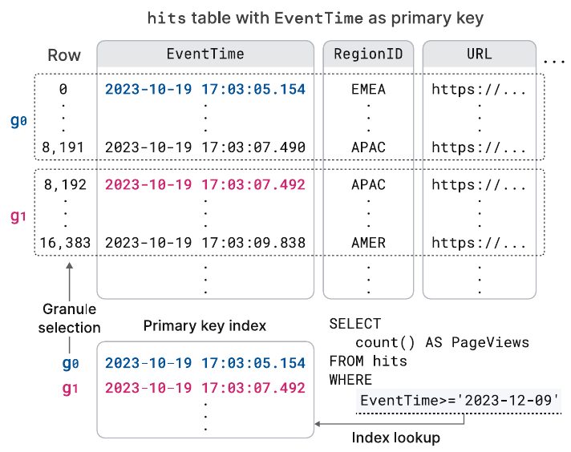

图 4：使用主键索引计算过滤条件。

图中的查询为：

```sql
SELECT
  count() AS PageViews
FROM hits
WHERE
  EventTime>='2023-12-09'
```

图 4 展示一个页面展示统计表在 EventTime 列上的主键索引。通过二分查找主键索引，而非顺序扫描 EventTime，就能找到符合查询范围谓词的粒度单元。

第二，用户可以创建表投影，即包含相同行、但按不同主键排序的表的其他版本 [71]。投影能够加速在不同于主表主键的列上过滤的查询，代价是增加插入、合并和空间消耗的开销。默认情况下，仅根据新插入主表的部件惰性填充投影；不会从已有部件填充，除非用户完整物化投影。查询优化器根据估计的 I/O 成本，在读取主表和读取投影之间选择。如果某个部件没有投影，查询执行会回退到对应的主表部件。

第三，跳数索引（skipping index）是投影的轻量替代方案。其思想是在多个连续粒度单元的层次保存少量元数据，从而避免扫描无关行。跳数索引可以针对任意索引表达式创建，并使用可配置粒度，即一个跳数索引块中的粒度单元数量。可用类型包括：

1. 最小值—最大值索引 [51]：为每个索引块保存索引表达式的最小值和最大值。它适合绝对范围较小的局部聚簇数据，例如大致有序的数据。
2. 集合索引：保存可配置数量的索引块唯一值。它最适合局部基数较小、即值“聚在一起”的数据。
3. Bloom filter 索引 [9]：针对行、词元或 n-gram 值构建，误报率可配置。这类索引支持文本搜索 [73]，但与最小值—最大值索引和集合索引不同，它不能用于范围或否定谓词。

### 3.3 合并时的数据变换

商业智能与可观测性用例经常需要处理以持续高速或突发方式生成的数据。此外，为获得有意义的实时洞察，新近生成的数据通常比历史数据更有价值。这类用例要求数据库维持高数据摄取速率，同时通过聚合、数据老化等技术持续减少历史数据量。ClickHouse 允许使用不同的合并策略，持续、增量地变换已有数据。合并时的数据变换不会损害 INSERT 语句的性能，但不能保证表中从不包含不需要的值（例如过时或尚未聚合的值）。如果有必要，可以在 SELECT 语句中指定 FINAL 关键字，在查询时应用全部合并时变换。

**替换式合并**根据元组所在部件的创建时间戳，仅保留最近插入的元组版本，删除较老版本。如果元组的主键列值相同，就认为它们等价。也可以指定一个专门的版本列用于比较，从而显式控制保留哪个元组。替换式合并通常用作合并时更新机制（通常在更新频繁的用例中），或作为插入时数据去重的替代方案（第 3.5 节）。

**聚合式合并**将主键列值相同的行折叠为一个聚合行。非主键列必须是保存汇总值的部分聚合状态。两个部分聚合状态，例如用于 avg() 的和与计数，会合并为一个新的部分聚合状态。聚合式合并通常用于物化视图，而非普通表。物化视图根据针对源表的变换查询填充。与其他数据库不同，ClickHouse 不会用源表的全部内容周期性刷新物化视图。它在有新部件插入源表时，利用变换查询的结果增量更新物化视图。

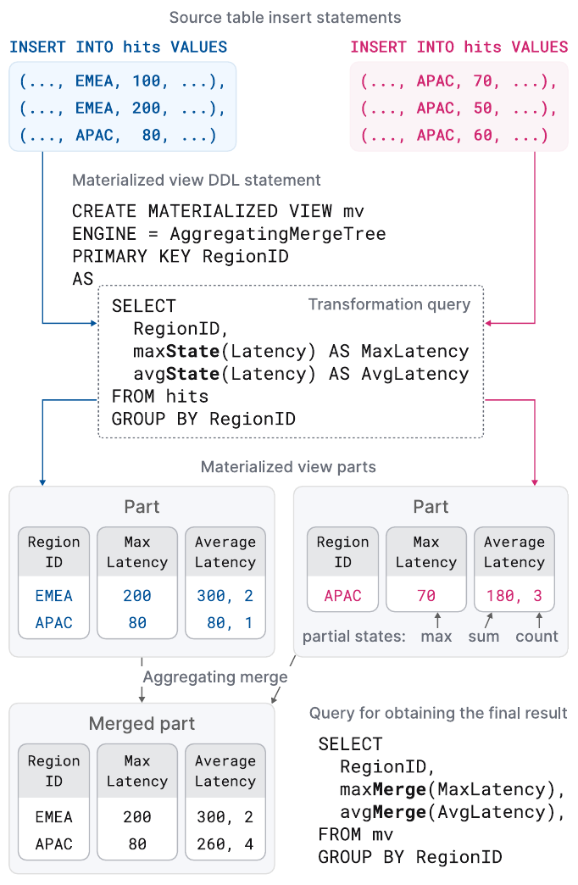

图 5：物化视图中的聚合式合并。

图中的两条源表插入语句、物化视图定义及最终查询如下（省略号按原图保留）：

```sql
INSERT INTO hits VALUES
(..., EMEA, 100, ...),
(..., EMEA, 200, ...),
(..., APAC, 80, ...)

INSERT INTO hits VALUES
(..., APAC, 70, ...),
(..., APAC, 50, ...),
(..., APAC, 60, ...)
```

```sql
CREATE MATERIALIZED VIEW mv
ENGINE = AggregatingMergeTree
PRIMARY KEY RegionID
AS
  SELECT
    RegionID,
    maxState(Latency) AS MaxLatency,
    avgState(Latency) AS AvgLatency
  FROM hits
  GROUP BY RegionID
```

```sql
SELECT
  RegionID,
  maxMerge(MaxLatency),
  avgMerge(AvgLatency),
FROM mv
GROUP BY RegionID
```

图 5 展示定义在页面展示统计表上的物化视图。对于新插入源表的部件，变换查询按区域分组，计算最大延迟和平均延迟，并将结果插入物化视图。带 -State 扩展的聚合函数 avg() 和 max() 返回部分聚合状态，而非实际结果。为物化视图定义的聚合式合并不断组合不同部件中的部分聚合状态。为得到最终结果，用户使用带 -Merge 扩展的 avg() 和 max()，合并物化视图中的部分聚合状态。

**TTL（生存时间）合并**用于历史数据老化。与删除式合并和聚合式合并不同，TTL 合并一次只处理一个部件。TTL 合并通过包含触发器和动作的规则定义。触发器是一个为每行计算时间戳的表达式，该时间戳会与执行 TTL 合并时的时间比较。虽然这允许用户按行粒度控制动作，但我们发现，检查是否所有行都满足给定条件、然后对整个部件执行动作就足够了。可能的动作包括：1. 将部件移至另一个卷（例如更便宜但更慢的存储）；2. 重新压缩部件（例如采用更重型的编解码器）；3. 删除部件；4. 上卷，即使用分组键和聚合函数聚合行。

例如，考虑清单 1 中的日志表定义。对于 timestamp 列值早于一周以前的部件，ClickHouse 会将其移至速度较慢但价格低廉的 S3 对象存储。

```sql
CREATE TABLE tab (ts DateTime, msg String)
ENGINE MergeTree PRIMARY KEY ts
TTL (ts + INTERVAL 1 WEEK) TO VOLUME 's3'
```

清单 1：一周后将部件移至对象存储。

### 3.4 更新与删除

MergeTree* 表引擎的设计偏向仅追加工作负载，但某些用例偶尔需要修改已有数据，例如满足监管合规要求。更新或删除数据有两种方法，它们都不会阻塞并行插入。

**变更（mutation）**在原位置重写表的所有部件。为防止表（删除时）或列（更新时）的大小暂时翻倍，这一操作是非原子的，即并行的 SELECT 语句可能同时读取已变更和未变更的部件。变更保证操作结束时，数据已被物理修改。删除变更仍很昂贵，因为它会重写所有部件的所有列。

另一种方法是**轻量删除**：仅更新一个内部位图列，指示某行是否被删除。ClickHouse 在 SELECT 查询中增加对该位图列的过滤，以从结果中排除已删除行。已删除行只会在未来某个不确定的时刻，经常规合并物理移除。取决于列数，轻量删除可能比变更快得多，代价是 SELECT 变慢。

预期同一张表上的更新和删除操作很少发生，并会串行执行以避免逻辑冲突。

### 3.5 幂等插入

实践中经常出现的问题是：客户端将数据发送给服务器以插入表之后发生连接超时，应当如何处理？此时，客户端很难区分数据是否已经成功插入。传统解决方法是从客户端重新向服务器发送数据，并依靠主键或唯一性约束拒绝重复插入。数据库通过基于二叉树 [39, 68]、基数树 [45] 或哈希表 [29] 的索引结构快速执行所需的点查找。由于这些结构对每个元组都建立索引，在大型数据集及高摄取速率下，其空间和更新开销会高得难以承受。

ClickHouse 提供一种更轻量的替代方法，依据是每次插入最终都会创建一个部件。具体来说，服务器维护最近插入的 N 个部件的哈希（例如 N=100），忽略哈希已知的部件的重复插入。非复制表和复制表的哈希分别保存在本地和 Keeper 中。由此，插入变为幂等操作：超时后，客户端只需重新发送同一批行，并假定服务器负责去重。为了更好地控制去重过程，客户端还可提供一个作为部件哈希的插入令牌。基于哈希的去重虽然会产生对新行计算哈希的开销，但保存和比较哈希的成本可以忽略。

### 3.6 数据复制

复制是高可用性（容忍节点故障）的前提，也用于负载均衡和零停机升级 [14]。在 ClickHouse 中，复制基于表状态这一概念，表状态由一组表部件（第 3.1 节）及表元数据（例如列名和类型）组成。节点使用三种操作推进表状态：1. 插入向状态添加新部件；2. 合并向状态添加新部件并从中删除已有部件；3. 变更和 DDL 语句根据具体操作添加部件、删除部件和/或修改表元数据。操作在单个节点本地执行，并作为一系列状态转换记录到全局复制日志。

复制日志由通常包含三个 ClickHouse Keeper 进程的集群维护。这些进程采用 Raft 共识算法 [59]，为 ClickHouse 节点集群提供分布式、容错的协调层。所有集群节点最初指向复制日志的同一位置。当节点执行本地插入、合并、变更和 DDL 语句时，复制日志会在所有其他节点上异步重放。因此，复制表只有最终一致性：节点在向最新状态收敛的过程中，可能暂时读到旧表状态。上述多数操作也可以改为同步执行，直到达到法定数量的节点（例如多数节点或全部节点）都采用了新状态。

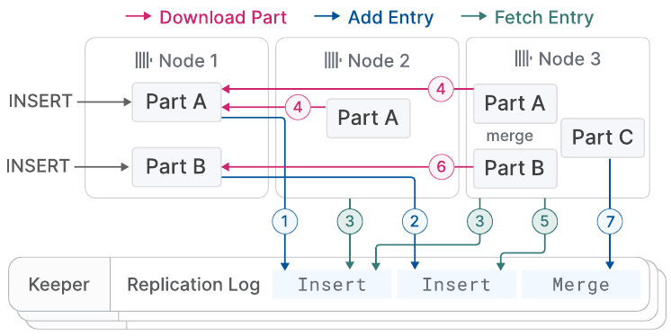

图 6：三节点集群中的复制。

例如，图 6 展示三节点 ClickHouse 集群中一张初始为空的复制表。节点 1 首先收到两条插入语句，将其记录到 Keeper 集群保存的复制日志中（①②）。接着，节点 2 获取第一条日志记录（③），并从节点 1 下载新部件（④），以重放该记录；节点 3 则重放两条日志记录（③④⑤⑥）。最后，节点 3 将两个部件合并为一个新部件，删除输入部件，并在复制日志中记录一条合并记录（⑦）。

有三项优化用于加速同步。第一，对于新加入集群的节点，原文先写其“从头重放复制日志”，接着写“而是直接复制写入最后一条复制日志记录的节点的状态”。（译注：原文此处的 “do replay ... instead” 前后不一致；后半句明确描述直接复制状态。）第二，合并可通过在本地重新执行，或从另一节点获取结果部件来重放。具体行为可以配置，以平衡 CPU 消耗与网络 I/O。例如，跨数据中心复制通常倾向于本地合并，以尽量降低运营成本。第三，节点并行重放相互独立的复制日志记录，例如，获取连续插入同一张表的新部件，或对不同表执行操作。

### 3.7 ACID 合规性

为最大化并发读写操作的性能，ClickHouse 尽可能避免使用闩锁。查询针对查询开始时创建的、涉及的所有表的全部部件快照执行。这确保并行 INSERT 或合并（第 3.1 节）插入的新部件不参与执行。为防止部件同时被修改或移除（第 3.4 节），在查询期间会增加所处理部件的引用计数。形式上，这相当于通过基于版本化部件的 MVCC 变体 [6] 实现快照隔离。因此，语句通常不满足 ACID；例外是取得快照时，每个并发写入都只影响单个部件的少见情形。

实践中，ClickHouse 的多数写密集型决策用例，甚至容忍断电时丢失新数据的小风险。数据库利用这一点，默认不强制将新插入部件提交（fsync）到磁盘，允许内核批量写入，代价是放弃原子性。

## 4 查询处理层

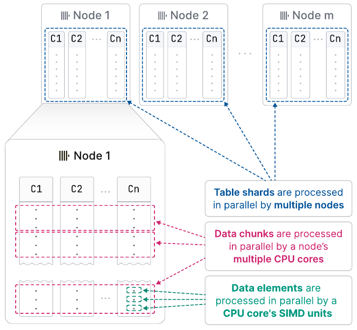

图 7：跨 SIMD 单元、核心和节点的并行化。

如图 7 所示，ClickHouse 在数据元素、数据块及表分片三个层次并行化查询。算子内部可以使用 SIMD 指令，同时处理多个数据元素。在单个节点上，查询引擎通过多个线程同时执行算子。ClickHouse 使用与 MonetDB/X100 [11] 相同的向量化模型：算子生成、传递和消费多行（数据块），而非单行，从而尽量降低虚函数调用开销。如果源表被分为互不重叠的表分片，多个节点可以同时扫描这些分片。由此可以充分利用全部硬件资源，并通过增加节点横向扩展查询处理，通过增加核心纵向扩展。

本节其余部分先详细介绍数据元素、数据块和分片粒度的并行处理，再介绍为最大化查询性能而采用的若干关键优化，最后讨论存在同时执行的查询时，ClickHouse 如何管理共享系统资源。

### 4.1 SIMD 并行化

在算子间传递多行数据创造了向量化的机会。向量化基于手工编写的 intrinsic [64, 80] 或编译器自动向量化 [25]。能从向量化受益的代码会编译为不同计算内核。例如，查询算子的内部热点循环可以分别实现为不向量化内核、自动向量化的 AVX2 内核，以及手工向量化的 AVX-512 内核。运行时依据 cpuid 指令选择最快的内核。[^6] 这种方法使 ClickHouse 能运行于已有 15 年历史的系统（最低要求 SSE 4.2）上，同时在新硬件上仍能获得显著加速。

### 4.2 多核并行化

ClickHouse 遵循传统方法 [31]，将 SQL 查询变换为由物理计划算子组成的有向图。算子计划的输入由特殊的源算子表示，它们以原生格式或支持的第三方格式读取数据（见第 5 节）。类似地，特殊的汇算子将结果转换为所需输出格式。在查询编译期间，物理算子计划根据可配置的最大工作线程数（默认是核心数）以及源表大小，展开为相互独立的执行通道（lane）。通道将并行算子要处理的数据划分为不重叠的范围。为最大化并行处理机会，尽可能晚地合并通道。

例如，图 8 中节点 1 的方框展示对页面展示统计表执行的典型 OLAP 查询的算子图。第一阶段，同时过滤源表的三个互不相交范围。Repartition 交换算子在第一、第二阶段之间动态路由结果数据块，使处理线程的利用率保持均衡。如果扫描范围的选择率差异明显，第一阶段后各通道就可能失衡。在第二阶段，对通过过滤的行按 RegionID 分组。Aggregate 算子维护本地结果分组，以 RegionID 为分组列，并为每组维护和与计数，作为 avg() 的部分聚合状态。最终，GroupStateMerge 算子把本地聚合结果合并成全局聚合结果。该算子也是流水线断点：只有聚合结果全部算完后，第三阶段才可以开始。第三阶段先通过 Distribute 交换算子，将结果分组分成三个大小相等、互不相交的分区，再按 AvgLatency 排序。排序分三步进行：首先，ChunkSort 算子排序各分区内的单个数据块；其次，StreamSort 算子维护一个本地有序结果，并通过二路归并排序将其与输入的有序数据块合并；最后，MergeSort 算子使用 k 路排序合并本地结果，得到最终结果。

算子是状态机，通过输入和输出端口彼此连接。算子有三种可能状态：need-chunk、ready 和 done。向算子的输入端口放入数据块，使其从 need-chunk 转为 ready；算子处理输入块并生成输出块，使其从 ready 转为 done；从算子输出端口移走输出块，使其从 done 转为 need-chunk。两个相连算子中的第一类和第三类状态转换只能在一个合并步骤中完成。源算子只有 ready 和 done 状态，汇算子只有 need-chunk 和 done 状态。

工作线程持续遍历物理算子计划，并执行状态转换。为保持 CPU 缓存热度，计划中包含提示，建议同一线程处理同一通道内相邻的算子。并行处理既会在同一阶段中互不相交的输入之间横向发生（例如图 8 中的 Aggregate 算子并发执行），也会在未被流水线断点分隔的阶段之间纵向发生（例如图 8 中同一通道的 Filter 和 Aggregate 算子可以同时运行）。为在新查询开始或并发查询结束时避免资源过度或不足订阅，查询进行中可在一个工作线程与查询开始时指定的最大工作线程数之间改变并行度（见第 4.5 节）。

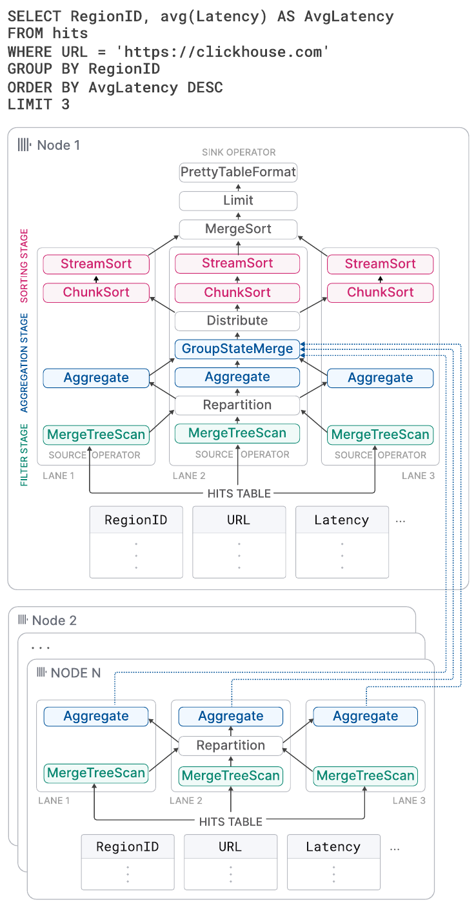

图 8：具有三个通道的物理算子计划。

图中的查询为：

```sql
SELECT RegionID, avg(Latency) AS AvgLatency
FROM hits
WHERE URL = 'https://clickhouse.com'
GROUP BY RegionID
ORDER BY AvgLatency DESC
LIMIT 3
```

算子还可以通过两种方式在运行时影响查询执行。第一，算子可以动态创建和连接新算子。主要用途是，当内存消耗超过可配置阈值时，切换至外部聚合、排序或连接算法，而不是取消查询。第二，算子可以请求工作线程移入异步队列。这使等待远程数据时能更有效地利用工作线程。

ClickHouse 的查询执行引擎与 morsel 驱动的并行执行 [44] 相似：通道通常在不同核心/NUMA 插槽上执行，工作线程可以从其他通道窃取任务。此外，两者都没有中央调度组件；工作线程持续遍历算子计划，自行选择任务。与 morsel 驱动的并行执行不同，ClickHouse 把最大并行度固化到计划中；与默认约 100,000 行的 morsel 大小相比，它使用大得多的范围来划分源表。这在某些情况下可能造成停顿（例如不同通道中的过滤算子运行时间相差悬殊），但我们发现，大量使用 Repartition 等交换算子，至少可以避免这种失衡跨阶段累积。

### 4.3 多节点并行化

如果查询源表进行了分片，收到查询的节点（发起节点）上的查询优化器会尽量把工作交给其他节点执行。其他节点的结果可以在查询计划的不同位置汇入。视查询而定，远程节点可以：1. 将源表原始列以流方式发送至发起节点；2. 过滤源列，并发送通过过滤的行；3. 执行过滤与聚合步骤，并发送带有部分聚合状态的本地结果分组；4. 执行包含过滤、聚合和排序的整个查询。

图 8 中的节点 2…N 展示在持有 hits 表分片的其他节点上执行的计划片段。这些节点对本地数据进行过滤和分组，并向发起节点发送结果。节点 1 上的 GroupStateMerge 算子合并本地与远程结果，再对结果分组进行最终排序。

### 4.4 整体性能优化

本节介绍应用于查询执行不同阶段的若干关键性能优化。

**查询优化。** 第一组优化作用于由查询 AST 得到的语义查询表示。示例包括常量折叠（例如 `concat(lower('a'), upper('b'))` 变为 `'aB'`）、从某些聚合函数中提出标量（例如 `sum(a*2)` 变为 `2 * sum(a)`）、公共子表达式消除，以及把等值过滤的析取转换为 IN 列表（例如 `x=c OR x=d` 变为 `x IN (c,d)`）。优化后的语义查询表示随后转换为逻辑算子计划。逻辑计划上的优化包括过滤下推，以及根据估计哪一项成本更高，调整函数求值和排序步骤的顺序。最后，将逻辑查询计划转换为物理算子计划。这种转换可以利用相关表引擎的特点。例如，对于 MergeTree* 表引擎，如果 ORDER BY 列构成主键的前缀，就可以按磁盘顺序读取数据，并从计划中移除排序算子。（译注：第 3.2 节将这一前缀关系写为“主键列构成排序列的前缀”；此处按原文保留两处表述。）另外，如果聚合中的分组列构成主键前缀，ClickHouse 可以使用排序聚合 [33]，直接聚合预排序输入中相同值的连续段。与哈希聚合相比，排序聚合的内存需求小得多，而且每处理完一个连续段，就能立即把聚合值传给下一个算子。

**查询编译。** ClickHouse 使用基于 LLVM 的查询编译动态融合相邻计划算子 [38, 53]。例如，表达式 `a * b + c + 1` 可以组合为单个算子，而不是三个算子。除了表达式外，ClickHouse 也利用编译同时计算多个聚合函数（即用于 GROUP BY），以及进行具有多个排序键的排序。查询编译减少了虚调用次数，使数据保持在寄存器或 CPU 缓存中；执行代码减少，也有利于分支预测器。此外，运行时编译支持丰富的优化，如编译器实现的逻辑优化和窥孔优化，并能使用本地可用的最快 CPU 指令。只有当同一普通表达式、聚合表达式或排序表达式被不同查询执行的次数超过可配置阈值时，才启动编译。编译后的查询算子会被缓存，供后续查询复用。[^7]

**主键索引求值。** 如果 WHERE 条件的合取范式中，一部分过滤子句构成主键列的前缀，ClickHouse 就会使用主键索引计算该条件。主键索引按从左到右的次序，在按字典序排序的键值范围上分析。对应主键列的过滤子句使用三值逻辑求值：对于范围内的值，子句要么全部为真，要么全部为假，要么真假混合。最后一种情况下，将范围分为子范围，再递归分析。针对过滤条件中的函数，还有额外优化。首先，函数具有描述单调性的特征，例如 `toDayOfMonth(date)` 在每个月内分段单调。单调性特征允许推断：对于有序输入键值范围，函数是否产生有序结果。其次，一些函数可以计算给定函数结果的原像。这用于将键列上的函数调用与常量的比较，替换为键列值与原像的比较。例如，`toYear(k) = 2024` 可以替换为 `k >= 2024-01-01 && k < 2025-01-01`。

**数据跳过。** ClickHouse 尝试使用第 3.2 节介绍的数据结构，避免查询运行时的数据读取。此外，根据启发式规则及可选的列统计信息，按估计的选择性从高到低，顺序计算不同列上的过滤条件。只有至少含一个匹配行的数据块才会传给下一个谓词。这样，在逐个处理谓词的过程中，读取数据量及所需计算量逐渐减少。这项优化仅在至少存在一个高选择性谓词时应用；否则，与并行计算所有谓词相比，查询延迟反而会恶化。

**哈希表。** 哈希表是聚合与哈希连接的基础数据结构。选择正确的哈希表类型对性能至关重要。ClickHouse 从一个通用哈希表模板实例化各种哈希表（截至 2024 年 3 月超过 30 种），变化点包括哈希函数、分配器、单元类型和扩容策略。根据分组列的数据类型、估计的哈希表基数以及其他因素，为每个查询算子单独选择最快的哈希表。[^8] 哈希表还实现了如下优化：

- 基于哈希首字节构造含 256 个子表的两级布局，以支持巨大的键集合；
- 为字符串哈希表 [79] 设置四个子表，对不同字符串长度使用不同哈希函数；
- 键很少时，采用直接以键作为桶索引、不计算哈希的查找表；
- 在值中嵌入哈希，以便比较开销高时（例如字符串、AST）更快地解决冲突；
- 根据运行时统计信息预测大小，并据此创建哈希表，避免不必要的扩容；
- 将创建/销毁生命周期相同的多个小哈希表分配在单个内存 slab 上；
- 使用每张哈希表和每个单元的版本计数器，瞬时清空哈希表以便复用；
- 使用 CPU 预取（`__builtin_prefetch`），加速计算键哈希后的值获取。

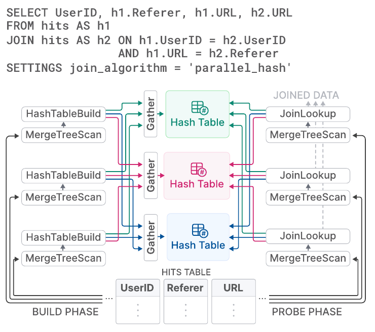

图 9：使用三个哈希表分区的并行哈希连接。

图中的查询为：

```sql
SELECT UserID, h1.Referer, h1.URL, h2.URL
FROM hits AS h1
JOIN hits AS h2 ON h1.UserID = h2.UserID
               AND h1.URL = h2.Referer
SETTINGS join_algorithm = 'parallel_hash'
```

**连接。** 由于 ClickHouse 最初仅粗略支持连接，历史上许多用例采用反规范化表。如今，该数据库提供 SQL 中的全部连接类型（内连接、左/右/全外连接、交叉连接、as-of 连接），以及哈希连接（朴素、grace）、排序合并连接等不同连接算法；对于具有快速键值查找能力的表引擎（通常是字典），还提供索引连接。[^9]

连接是数据库中成本最高的操作之一，因此必须为经典连接算法提供并行变体，最好还能配置空间/时间之间的取舍。对于哈希连接，ClickHouse 实现了 [7] 中的非阻塞共享分区算法。例如，图 9 中的查询通过页面访问统计表的自连接，计算用户如何在 URL 之间跳转。连接的构建阶段分为三个通道，覆盖源表三个互不相交的范围。它使用分区哈希表，而非全局哈希表。工作线程（通常为三个）对构建侧的每个输入行计算哈希函数值的模，以确定目标分区。通过 Gather 交换算子同步对哈希表分区的访问。探测阶段以类似方法确定输入元组的目标分区。虽然该算法为每个元组引入两次额外哈希计算，但依哈希表分区数而定，它能显著减少构建阶段的闩锁竞争。

### 4.5 工作负载隔离

ClickHouse 提供并发控制、内存使用限制以及 I/O 调度，允许用户把查询隔离到工作负载类别中。通过为特定工作负载类别设置共享资源（CPU 核心、DRAM、磁盘和网络 I/O）限制，确保这些查询不会影响其他关键业务查询。

**并发控制**在大量查询并发时防止线程过度订阅。具体来说，每个查询的工作线程数，根据相对于可用 CPU 核心数的指定比例动态调整。

ClickHouse 在服务器、用户和查询层次追踪内存分配的字节大小，从而允许设置灵活的内存使用限制。**内存超额使用**允许查询在保证内存之外使用额外空闲内存，同时确保其他查询的内存限制。此外，可以限制聚合、排序和连接子句的内存使用，超出限制时回退到外部算法。

最后，**I/O 调度**允许用户依据最大带宽、在途请求数和策略（例如 FIFO、SFC [32]），限制各工作负载类别的本地与远程磁盘访问。

## 5 集成层

实时决策应用往往依赖对多个位置的数据进行高效、低延迟访问。将外部数据提供给 OLAP 数据库有两种方法。在推送式数据访问中，第三方组件连接数据库和外部数据存储。例如，专用的抽取—变换—加载（ETL）工具把远程数据推送到目标系统。在拉取式模型中，数据库自身连接远程数据源，把用于查询的数据拉入本地表，或者向远程系统导出数据。推送式方法虽然更加通用和常见，却意味着更大的架构复杂度及可扩展性瓶颈。相较之下，直接在数据库中实现远程连接，可以提供本地与远程数据连接等有用能力，同时保持整体架构简单，并缩短获得洞察的时间。

本节其余部分探讨 ClickHouse 中用于访问远程数据的拉取式数据集成方法。需要指出，在 SQL 数据库中实现远程连接并非新想法。例如，2001 年引入、PostgreSQL 自 2011 年起实现 [65] 的 SQL/MED 标准 [35]，提出用外部数据包装器作为管理外部数据的统一接口。最大化与其他数据存储及存储格式的互操作性，是 ClickHouse 的设计目标之一。据我们所知，截至 2024 年 3 月，ClickHouse 在所有分析型数据库中提供了最多的内置数据集成选项。

**外部连接。** ClickHouse 提供超过 50 种[^10] 集成表函数和表引擎，用于连接外部系统及存储位置，包括 ODBC、MySQL、PostgreSQL、SQLite、Kafka、Hive、MongoDB、Redis、S3/GCP/Azure 对象存储及各种数据湖。我们进一步将它们分为以下类别。

**使用集成表函数临时访问。** 可以在 SELECT 查询的 FROM 子句中调用表函数，读取远程数据以执行探索性即席查询。也可以通过 INSERT INTO TABLE FUNCTION 语句，将数据写入远程存储。

**持久访问。** 有三种方法可以创建与远程数据存储和处理系统的永久连接。

第一，**集成表引擎**把 MySQL 表等远程数据源表示为一张持久的本地表。用户通过 CREATE TABLE AS 语法，结合 SELECT 查询和表函数，保存表定义。可以指定自定义模式，例如只引用部分远程列；也可使用模式推断，自动确定列名及等价的 ClickHouse 类型。我们进一步区分被动与主动的运行时行为：被动表引擎把查询转发至远程系统，并用结果填充本地代理表；主动表引擎则周期性从远程系统拉取数据，或订阅远程变更，例如通过 PostgreSQL 逻辑复制协议。因此，本地表包含远程表的完整副本。

第二，**集成数据库引擎**把远程数据存储中一个表模式下的全部表映射到 ClickHouse。与前者不同，这通常要求远程数据存储是关系数据库，而且还对 DDL 语句提供有限支持。

第三，**字典**可以用针对几乎所有具有对应集成表函数或表引擎的数据源的任意查询来填充。其运行时行为是主动的，因为它以固定间隔从远程存储拉取数据。

**数据格式。** 为与第三方系统交互，现代分析型数据库还必须能够处理任意格式的数据。除原生格式外，ClickHouse 支持超过 90 种[^11] 格式，包括 CSV、JSON、Parquet、Avro、ORC、Arrow 和 Protobuf。每种格式可以是输入格式（ClickHouse 能读取）、输出格式（ClickHouse 能导出），或兼具两者。Parquet 等面向分析的格式也与查询处理集成：优化器能够利用内嵌统计信息，并直接在压缩数据上计算过滤条件。

**兼容接口。** 除原生二进制线协议和 HTTP 外，客户端还可通过兼容 MySQL 或 PostgreSQL 线协议的接口与 ClickHouse 交互。当专有应用（例如某些商业智能工具）的供应商尚未实现原生 ClickHouse 连接时，这种兼容功能有助于支持其访问。

## 6 把性能作为一项功能

本节介绍用于性能分析的内置工具，并用真实世界查询和基准查询评估性能。

### 6.1 内置性能分析工具

可以使用一系列工具调查单条查询或后台操作的性能瓶颈。用户通过基于系统表的统一接口，与所有工具交互。

**服务器和查询指标。** 活动部件数、网络吞吐量和缓存命中率等服务器级统计信息，辅以读取块数、索引使用统计信息等逐查询统计信息。指标可以同步计算（按请求），或按可配置间隔异步计算。

**采样剖析器。** 可通过采样剖析器收集服务器线程的调用栈。结果可选择导出到火焰图可视化器等外部工具。

**OpenTelemetry 集成。** OpenTelemetry 是用于追踪跨多个数据处理系统的数据流的开放标准 [8]。ClickHouse 能以可配置粒度为所有查询处理步骤生成 OpenTelemetry 日志 span，也能收集和分析其他系统的 OpenTelemetry 日志 span。

**Explain 查询。** 与其他数据库类似，可以在 SELECT 查询前加 EXPLAIN，详细了解查询 AST、逻辑与物理算子计划以及执行时行为。

### 6.2 基准测试

虽然基准测试因不够真实而受到批评 [10, 52, 66, 74]，它仍有助于识别数据库的优劣。下面讨论如何通过基准测试评估 ClickHouse 性能。

#### 6.2.1 反规范化表

针对反规范化事实表的过滤与聚合查询，历史上一直是 ClickHouse 的主要用例。我们报告 ClickBench 的运行时间；这是此类典型工作负载，模拟点击流与流量分析中的即席查询和周期性报表查询。该基准包含对一张有 1 亿条匿名页面访问记录的表执行的 43 条查询，数据来自 Web 上最大的分析平台之一。截至 2024 年 6 月，在线仪表盘 [17] 展示了超过 45 个商业和研究数据库的测量结果（冷/热运行时间、数据导入时间、磁盘大小）。结果由独立贡献者根据公开的数据集与查询 [16] 提交。这些查询测试顺序扫描和索引扫描访问路径，并经常暴露出受 CPU、I/O 或内存限制的关系算子。

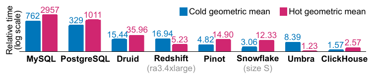

图 10：ClickBench 的相对冷运行时间和热运行时间。

图中纵轴为相对时间（对数尺度），冷、热两组柱分别表示冷运行和热运行的几何平均值：

| 数据库 | 冷运行几何平均 | 热运行几何平均 |
| --- | ---: | ---: |
| MySQL | 762 | 2957 |
| PostgreSQL | 329 | 1011 |
| Druid | 15.44 | 35.96 |
| Redshift（ra3.4xlarge） | 16.94 | 5.23 |
| Pinot | 4.82 | 14.90 |
| Snowflake（size S） | 3.06 | 12.33 |
| Umbra | 8.39 | 1.23 |
| ClickHouse | 1.57 | 2.57 |

图 10 展示在常用于分析的数据库中，顺序执行全部 ClickBench 查询的总相对冷、热运行时间。测量在单节点 AWS EC2 c6a.4xlarge 实例上完成，配置为 16 个 vCPU、32 GB RAM，以及 5000 IOPS / 1000 MiB/s 磁盘。Redshift（ra3.4xlarge，12 个 vCPU、96 GB RAM[^12]）和 Snowflake（仓库大小 S：2×8 个 vCPU、2×16 GB RAM[^13]）使用了相当的系统。物理数据库设计只做轻度调优，例如指定主键，但不改变各列压缩、不创建投影或跳数索引。我们还在每次冷查询运行前清空 Linux 页缓存，但不调整数据库或操作系统参数。对于每条查询，取各数据库中最快的运行时间作为基线。其他数据库的相对查询运行时间计算为：

$$
\frac{t _ q + 10\thinspace\mathrm{ms}}{t _ {q\verb0_0baseline} + 10\thinspace\mathrm{ms}}
$$

一个数据库的总相对运行时间，是各查询比值的几何平均。研究型数据库 Umbra [54] 取得了最佳总体热运行时间，而 ClickHouse 的热、冷运行时间都优于所有其他生产级数据库。

为追踪更丰富工作负载中 SELECT 性能随时间的变化，我们使用由四个基准组合而成的 VersionsBench [19]。每月发布新版本时执行一次该基准，评估性能 [20]，并识别可能导致性能退化的代码变更。[^14] 各组成基准包括：1. ClickBench（上文介绍）；2. 15 条 MgBench [21] 查询；3. 对一张包含 6 亿行的反规范化 Star Schema Benchmark [57] 事实表执行的 13 条查询；4. 对包含 34 亿行的 NYC Taxi Rides 数据 [70] 执行的 4 条查询。[^15]

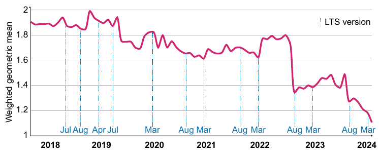

图 11：2018—2024 年 VersionsBench 的相对热运行时间。图中纵轴为加权几何平均，虚线标记 LTS 版本。

图 11 展示从 2018 年 3 月到 2024 年 3 月之间，77 个 ClickHouse 版本的 VersionsBench 运行时间变化。为补偿单条查询相对运行时间的差异，我们使用几何平均对运行时间归一化，以相对于所有版本中最小查询运行时间的比值作为权重。过去六年中，VersionBench 的性能提高了 1.72 倍。长期支持（LTS）版本的发布日期标在 x 轴上。虽然某些时期性能暂时恶化，但 LTS 版本的性能通常与上一个 LTS 版本相当或更好。2022 年 8 月的显著改善，来自第 4.4 节所述的逐列过滤求值技术。

#### 6.2.2 规范化表

在传统数据仓库中，数据通常用星形或雪花模式建模。我们给出 TPC-H 查询（比例因子 100）的运行时间，但指出规范化表是 ClickHouse 的新兴用例。图 12 展示基于第 4.4 节所述并行哈希连接算法的 TPC-H 查询热运行时间。测量在单节点 AWS EC2 c6i.16xlarge 实例上完成，配置为 64 个 vCPU、128 GB RAM，以及 5000 IOPS / 1000 MiB/s 磁盘。记录五次运行中最快的一次。作为参照，我们在大小相当的 Snowflake 系统（仓库大小 L，8×8 个 vCPU、8×16 GB RAM）上进行了相同测量。

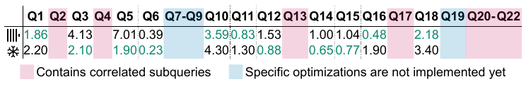

图 12：TPC-H 查询的热运行时间（秒）。

图中两行分别对应 ClickHouse 和 Snowflake；粉色区域表示包含相关子查询，蓝色区域表示特定优化尚未实现。保留测量结果的查询如下：

| 查询 | ClickHouse（秒） | Snowflake（秒） |
| --- | ---: | ---: |
| Q1 | 1.86 | 2.20 |
| Q3 | 4.13 | 2.10 |
| Q5 | 7.01 | 1.90 |
| Q6 | 0.39 | 0.23 |
| Q10 | 3.59 | 4.30 |
| Q11 | 0.83 | 1.30 |
| Q12 | 1.53 | 0.88 |
| Q14 | 1.00 | 0.65 |
| Q15 | 1.04 | 0.77 |
| Q16 | 0.48 | 1.90 |
| Q18 | 2.18 | 3.40 |

表中排除了十一条查询的结果：Q2、Q4、Q13、Q17 和 Q20–22 包含相关子查询，截至 ClickHouse v24.6 尚不支持。Q7–Q9 和 Q19 则依赖连接的扩展计划级优化，例如连接重排序及连接谓词下推（截至 ClickHouse v24.6，两者均缺失），才能获得可用的运行时间。自动子查询去相关和更好的连接优化器支持，计划于 2024 年实现 [18]。在剩下的 11 条查询中，有 5 条在 ClickHouse 中执行更快，6 条在 Snowflake 中执行更快。由于已知上述优化对性能至关重要 [27]，我们预期实现后能进一步改善这些查询的运行时间。

## 7 相关工作

近几十年来，分析型数据库一直受到学术界和商业领域的高度关注 [1]。Sybase IQ [48]、Teradata [72]、Vertica [42] 和 Greenplum [47] 等早期系统，由于采用本地部署，具有批量 ETL 作业昂贵、弹性有限等特点。2010 年代初，Snowflake [22]、BigQuery [49] 和 Redshift [4] 等云原生数据仓库与数据库即服务（DBaaS）的出现，大幅降低了组织开展分析的成本与复杂性，同时带来了高可用性及自动资源伸缩。最近，分析执行内核（例如 Photon [5] 和 Velox [62]）提供通用化的数据处理能力，用于不同的分析、流处理与机器学习应用。

在目标和设计原则方面，与 ClickHouse 最相似的数据库是 Druid [78] 和 Pinot [34]。二者都面向高数据摄取速率下的实时分析。与 ClickHouse 类似，表被横向拆分为称为 segment 的部件。ClickHouse 不断合并较小部件，并可通过第 3.3 节的技术减少数据量；Druid 和 Pinot 的部件则始终保持不可变。此外，Druid 和 Pinot 需要专门的节点创建、变更和搜索表，而 ClickHouse 使用一个单体二进制文件完成这些任务。

Snowflake [22] 是一种流行的专有云数据仓库，基于共享磁盘架构。它将表划分为微分区的方法，与 ClickHouse 的部件概念类似。Snowflake 使用混合 PAX 页 [3] 持久化，而 ClickHouse 的存储格式严格按列组织。Snowflake 也重视本地缓存，以及使用自动创建的轻量索引 [31, 51] 进行数据剪枝，以获得良好性能。类似 ClickHouse 的主键，用户还可以选择创建聚簇索引，把相同值的数据放在一起。

Photon [5] 和 Velox [62] 是设计用于复杂数据管理系统组件的查询执行引擎。两者都接收查询计划作为输入，然后在本地节点上对 Parquet（Photon）或 Arrow（Velox）文件 [46] 执行。ClickHouse 能消费和生成这些通用格式的数据，但更倾向于用原生文件格式存储。虽然 Velox 和 Photon 不优化查询计划（Velox 会进行基本的表达式优化），它们会使用运行时自适应技术，例如根据数据特征动态切换计算内核。类似地，ClickHouse 的计划算子可在运行时创建其他算子，主要用于根据查询内存消耗，切换到外部聚合或连接算子。Photon 论文指出，代码生成式设计 [38, 41, 53] 比解释型向量化设计 [11] 更难开发和调试。Velox 的代码生成支持（实验性）根据运行时生成的 C++ 代码构建并链接共享库，而 ClickHouse 直接使用 LLVM 的按需编译 API。

DuckDB [67] 也旨在嵌入宿主进程，但还提供查询优化和事务。它面向混合了偶发 OLTP 语句的 OLAP 查询。因此，DuckDB 选择 DataBlocks [43] 存储格式，使用保序字典或 frame-of-reference [2] 等轻量压缩方法，在混合工作负载中获得良好性能。相较之下，ClickHouse 针对仅追加用例优化，即不发生或很少发生更新和删除。块采用 LZ4 等重型技术压缩，假设用户大量使用数据剪枝来加速频繁查询，而对其余查询，I/O 成本远高于解压成本。DuckDB 还基于 HyPer 的 MVCC 方案 [55] 提供可串行化事务，ClickHouse 则仅提供快照隔离。

## 8 结论与展望

我们介绍了开源高性能 OLAP 数据库 ClickHouse 的架构。以写优化的存储层和先进的向量化查询引擎为基础，ClickHouse 支持对高摄取速率的 PB 级数据集进行实时分析。通过在后台异步合并和变换数据，ClickHouse 有效解耦了数据维护与并行插入。其存储层利用稀疏主键索引、跳数索引和投影表，支持积极的数据剪枝。我们介绍了 ClickHouse 的更新和删除、幂等插入，以及为实现高可用而进行的跨节点数据复制。查询处理层采用丰富技术优化查询，并跨服务器和集群的全部资源并行执行。集成表引擎与表函数提供了方便的方式，与其他数据管理系统和数据格式无缝交互。通过基准测试，我们展示了 ClickHouse 是市场上最快的分析型数据库之一，也展示了这些年来 ClickHouse 实际部署中典型查询性能的显著改善。

计划于 2024 年实现的全部功能和增强都可在公开路线图 [18] 中找到。计划中的改进包括支持用户事务、将 PromQL [69] 作为另一种查询语言、面向半结构化数据（例如 JSON）的新数据类型、更好的连接计划级优化，以及实现轻量更新来补充轻量删除。

## 致谢

在 24.6 版本中，`SELECT * FROM system.contributors` 返回 1994 位为 ClickHouse 作出贡献的个人。我们感谢 ClickHouse Inc. 的整个工程团队，以及出色的 ClickHouse 开源社区，感谢他们为共同构建这一数据库付出的辛勤工作与投入。

## 脚注

[^1]: 博客文章：[clickhou.se/evolution](https://clickhou.se/evolution)。
[^2]: 博客文章：[clickhou.se/dictionaries](https://clickhou.se/dictionaries)。
[^3]: 博客文章：[clickhou.se/keeper](https://clickhou.se/keeper)。
[^4]: 博客文章：[clickhou.se/local](https://clickhou.se/local)、[clickhou.se/local-fastest-tool](https://clickhou.se/local-fastest-tool)。
[^5]: 博客文章：[clickhou.se/chdb-rocket-engine](https://clickhou.se/chdb-rocket-engine)。
[^6]: 博客文章：[clickhou.se/cpu-dispatch](https://clickhou.se/cpu-dispatch)。
[^7]: 博客文章：[clickhou.se/jit](https://clickhou.se/jit)。
[^8]: 博客文章：[clickhou.se/hashtables](https://clickhou.se/hashtables)。
[^9]: 博客文章：[clickhou.se/joins](https://clickhou.se/joins)。
[^10]: 对系统表实时查询得到的最新列表：[clickhou.se/query-integrations](https://clickhou.se/query-integrations)。
[^11]: 对系统表实时查询得到的最新列表：[clickhou.se/query-formats](https://clickhou.se/query-formats)。
[^12]: AWS 文档：[clickhou.se/redshift-sizes](https://clickhou.se/redshift-sizes)。
[^13]: 博客文章：[clickhou.se/snowflake-sizes](https://clickhou.se/snowflake-sizes)。
[^14]: 博客文章：[clickhou.se/performance-over-years](https://clickhou.se/performance-over-years)。
[^15]: 博客文章：[clickhou.se/nyc-taxi-rides-benchmark](https://clickhou.se/nyc-taxi-rides-benchmark)。

## 参考文献

[1] Daniel Abadi, Peter Boncz, Stavros Harizopoulos, Stratos Idreaos, and Samuel Madden. 2013. The Design and Implementation of Modern Column-Oriented Database Systems. https://doi.org/10.1561/9781601987556

[2] Daniel Abadi, Samuel Madden, and Miguel Ferreira. 2006. Integrating Compression and Execution in Column-Oriented Database Systems. In Proceedings of the 2006 ACM SIGMOD International Conference on Management of Data (SIGMOD ’06). 671–682. https://doi.org/10.1145/1142473.1142548

[3] Anastassia Ailamaki, David J. DeWitt, Mark D. Hill, and Marios Skounakis. 2001. Weaving Relations for Cache Performance. In Proceedings of the 27th International Conference on Very Large Data Bases (VLDB ’01). Morgan Kaufmann Publishers Inc., San Francisco, CA, USA, 169–180.

[4] Nikos Armenatzoglou, Sanuj Basu, Naga Bhanoori, Mengchu Cai, Naresh Chainani, Kiran Chinta, Venkatraman Govindaraju, Todd J. Green, Monish Gupta, Sebastian Hillig, Eric Hotinger, Yan Leshinksy, Jintian Liang, Michael McCreedy, Fabian Nagel, Ippokratis Pandis, Panos Parchas, Rahul Pathak, Orestis Polychroniou, Foyzur Rahman, Gaurav Saxena, Gokul Soundararajan, Sriram Subramanian, and Doug Terry. 2022. Amazon Redshift Re-Invented. In Proceedings of the 2022 International Conference on Management of Data (Philadelphia, PA, USA) (SIGMOD ’22). Association for Computing Machinery, New York, NY, USA, 2205–2217. https://doi.org/10.1145/3514221.3526045

[5] Alexander Behm, Shoumik Palkar, Utkarsh Agarwal, Timothy Armstrong, David Cashman, Ankur Dave, Todd Greenstein, Shant Hovsepian, Ryan Johnson, Arvind Sai Krishnan, Paul Leventis, Ala Luszczak, Prashanth Menon, Mostafa Mokhtar, Gene Pang, Sameer Paranjpye, Greg Rahn, Bart Samwel, Tom van Bussel, Herman van Hovell, Maryann Xue, Reynold Xin, and Matei Zaharia. 2022. Photon: A Fast Query Engine for Lakehouse Systems (SIGMOD ’22). Association for Computing Machinery, New York, NY, USA, 2326–2339. https://doi.org/10.1145/3514221.3526054

[6] Philip A. Bernstein and Nathan Goodman. 1981. Concurrency Control in Distributed Database Systems. ACM Computing Survey 13, 2 (1981), 185–221. https://doi.org/10.1145/356842.356846

[7] Spyros Blanas, Yinan Li, and Jignesh M. Patel. 2011. Design and evaluation of main memory hash join algorithms for multi-core CPUs. In Proceedings of the 2011 ACM SIGMOD International Conference on Management of Data (Athens, Greece) (SIGMOD ’11). Association for Computing Machinery, New York, NY, USA, 37–48. https://doi.org/10.1145/1989323.1989328

[8] Daniel Gomez Blanco. 2023. Practical OpenTelemetry. Springer Nature.

[9] Burton H. Bloom. 1970. Space/Time Trade-Offs in Hash Coding with Allowable Errors. Commun. ACM 13, 7 (1970), 422–426. https://doi.org/10.1145/362686.362692

[10] Peter Boncz, Thomas Neumann, and Orri Erling. 2014. TPC-H Analyzed: Hidden Messages and Lessons Learned from an Influential Benchmark. In Performance Characterization and Benchmarking. 61–76. https://doi.org/10.1007/978-3-319-04936-6_5

[11] Peter Boncz, Marcin Zukowski, and Niels Nes. 2005. MonetDB/X100: Hyper-Pipelining Query Execution. In CIDR.

[12] Martin Burtscher and Paruj Ratanaworabhan. 2007. High Throughput Compression of Double-Precision Floating-Point Data. In Data Compression Conference (DCC). 293–302. https://doi.org/10.1109/DCC.2007.44

[13] Jeff Carpenter and Eben Hewitt. 2016. Cassandra: The Definitive Guide (2nd ed.). O’Reilly Media, Inc.

[14] Bernadette Charron-Bost, Fernando Pedone, and André Schiper (Eds.). 2010. Replication: Theory and Practice. Springer-Verlag.

[15] chDB. 2024. chDB - an embedded OLAP SQL Engine. Retrieved 2024-06-20 from https://github.com/chdb-io/chdb

[16] ClickHouse. 2024. ClickBench: a Benchmark For Analytical Databases. Retrieved 2024-06-20 from https://github.com/ClickHouse/ClickBench

[17] ClickHouse. 2024. ClickBench: Comparative Measurements. Retrieved 2024-06-20 from https://benchmark.clickhouse.com

[18] ClickHouse. 2024. ClickHouse Roadmap 2024 (GitHub). Retrieved 2024-06-20 from https://github.com/ClickHouse/ClickHouse/issues/58392

[19] ClickHouse. 2024. ClickHouse Versions Benchmark. Retrieved 2024-06-20 from https://github.com/ClickHouse/ClickBench/tree/main/versions

[20] ClickHouse. 2024. ClickHouse Versions Benchmark Results. Retrieved 2024-06-20 from https://benchmark.clickhouse.com/versions/

[21] Andrew Crotty. 2022. MgBench. Retrieved 2024-06-20 from https://github.com/andrewcrotty/mgbench

[22] Benoit Dageville, Thierry Cruanes, Marcin Zukowski, Vadim Antonov, Artin Avanes, Jon Bock, Jonathan Claybaugh, Daniel Engovatov, Martin Hentschel, Jiansheng Huang, Allison W. Lee, Ashish Motivala, Abdul Q. Munir, Steven Pelley, Peter Povinec, Greg Rahn, Spyridon Triantafyllis, and Philipp Unterbrunner. 2016. The Snowflake Elastic Data Warehouse. In Proceedings of the 2016 International Conference on Management of Data (San Francisco, California, USA) (SIGMOD ’16). Association for Computing Machinery, New York, NY, USA, 215–226. https://doi.org/10.1145/2882903.2903741

[23] Patrick Damme, Annett Ungethüm, Juliana Hildebrandt, Dirk Habich, and Wolfgang Lehner. 2019. From a Comprehensive Experimental Survey to a Cost-Based Selection Strategy for Lightweight Integer Compression Algorithms. ACM Trans. Database Syst. 44, 3, Article 9 (2019), 46 pages. https://doi.org/10.1145/3323991

[24] Philippe Dobbelaere and Kyumars Sheykh Esmaili. 2017. Kafka versus RabbitMQ: A Comparative Study of Two Industry Reference Publish/Subscribe Implementations: Industry Paper (DEBS ’17). Association for Computing Machinery, New York, NY, USA, 227–238. https://doi.org/10.1145/3093742.3093908

[25] LLVM documentation. 2024. Auto-Vectorization in LLVM. Retrieved 2024-06-20 from https://llvm.org/docs/Vectorizers.html

[26] Siying Dong, Andrew Kryczka, Yanqin Jin, and Michael Stumm. 2021. RocksDB: Evolution of Development Priorities in a Key-value Store Serving Large-scale Applications. ACM Transactions on Storage 17, 4, Article 26 (2021), 32 pages. https://doi.org/10.1145/3483840

[27] Markus Dreseler, Martin Boissier, Tilmann Rabl, and Matthias Uflacker. 2020. Quantifying TPC-H choke points and their optimizations. Proc. VLDB Endow. 13, 8 (2020), 1206–1220. https://doi.org/10.14778/3389133.3389138

[28] Ted Dunning. 2021. The t-digest: Efficient estimates of distributions. Software Impacts 7 (2021). https://doi.org/10.1016/j.simpa.2020.100049

[29] Martin Faust, Martin Boissier, Marvin Keller, David Schwalb, Holger Bischoff, Katrin Eisenreich, Franz Färber, and Hasso Plattner. 2016. Footprint Reduction and Uniqueness Enforcement with Hash Indices in SAP HANA. In Database and Expert Systems Applications. 137–151. https://doi.org/10.1007/978-3-319-44406-2_11

[30] Philippe Flajolet, Éric Fusy, Olivier Gandouet, and Frédéric Meunier. 2007. HyperLogLog: the analysis of a near-optimal cardinality estimation algorithm. In AofA: Analysis of Algorithms, Vol. DMTCS Proceedings vol. AH, 2007 Conference on Analysis of Algorithms (AofA 07). Discrete Mathematics and Theoretical Computer Science, 137–156. https://doi.org/10.46298/dmtcs.3545

[31] Hector Garcia-Molina, Jeffrey D. Ullman, and Jennifer Widom. 2009. Database Systems - The Complete Book (2. Ed.).

[32] Pawan Goyal, Harrick M. Vin, and Haichen Chen. 1996. Start-time fair queueing: a scheduling algorithm for integrated services packet switching networks. 26, 4 (1996), 157–168. https://doi.org/10.1145/248157.248171

[33] Goetz Graefe. 1993. Query Evaluation Techniques for Large Databases. ACM Comput. Surv. 25, 2 (1993), 73–169. https://doi.org/10.1145/152610.152611

[34] Jean-François Im, Kishore Gopalakrishna, Subbu Subramaniam, Mayank Shrivastava, Adwait Tumbde, Xiaotian Jiang, Jennifer Dai, Seunghyun Lee, Neha Pawar, Jialiang Li, and Ravi Aringunram. 2018. Pinot: Realtime OLAP for 530 Million Users. In Proceedings of the 2018 International Conference on Management of Data (Houston, TX, USA) (SIGMOD ’18). Association for Computing Machinery, New York, NY, USA, 583–594. https://doi.org/10.1145/3183713.3190661

[35] ISO/IEC 9075-9:2001 2001. Information technology — Database language — SQL — Part 9: Management of External Data (SQL/MED). Standard. International Organization for Standardization.

[36] Paras Jain, Peter Kraft, Conor Power, Tathagata Das, Ion Stoica, and Matei Zaharia. 2023. Analyzing and Comparing Lakehouse Storage Systems. CIDR.

[37] Project Jupyter. 2024. Jupyter Notebooks. Retrieved 2024-06-20 from https://jupyter.org/

[38] Timo Kersten, Viktor Leis, Alfons Kemper, Thomas Neumann, Andrew Pavlo, and Peter Boncz. 2018. Everything You Always Wanted to Know about Compiled and Vectorized Queries but Were Afraid to Ask. Proc. VLDB Endow. 11, 13 (sep 2018), 2209–2222. https://doi.org/10.14778/3275366.3284966

[39] Changkyu Kim, Jatin Chhugani, Nadathur Satish, Eric Sedlar, Anthony D. Nguyen, Tim Kaldewey, Victor W. Lee, Scott A. Brandt, and Pradeep Dubey. 2010. FAST: fast architecture sensitive tree search on modern CPUs and GPUs. In Proceedings of the 2010 ACM SIGMOD International Conference on Management of Data (Indianapolis, Indiana, USA) (SIGMOD ’10). Association for Computing Machinery, New York, NY, USA, 339–350. https://doi.org/10.1145/1807167.1807206

[40] Donald E. Knuth. 1973. The Art of Computer Programming, Volume III: Sorting and Searching. Addison-Wesley.

[41] André Kohn, Viktor Leis, and Thomas Neumann. 2018. Adaptive Execution of Compiled Queries. In 2018 IEEE 34th International Conference on Data Engineering (ICDE). 197–208. https://doi.org/10.1109/ICDE.2018.00027

[42] Andrew Lamb, Matt Fuller, Ramakrishna Varadarajan, Nga Tran, Ben Vandiver, Lyric Doshi, and Chuck Bear. 2012. The Vertica Analytic Database: C-Store 7 Years Later. Proc. VLDB Endow. 5, 12 (aug 2012), 1790–1801. https://doi.org/10.14778/2367502.2367518

[43] Harald Lang, Tobias Mühlbauer, Florian Funke, Peter A. Boncz, Thomas Neumann, and Alfons Kemper. 2016. Data Blocks: Hybrid OLTP and OLAP on Compressed Storage using both Vectorization and Compilation. In Proceedings of the 2016 International Conference on Management of Data (San Francisco, California, USA) (SIGMOD ’16). Association for Computing Machinery, New York, NY, USA, 311–326. https://doi.org/10.1145/2882903.2882925

[44] Viktor Leis, Peter Boncz, Alfons Kemper, and Thomas Neumann. 2014. Morsel-driven parallelism: a NUMA-aware query evaluation framework for the many-core age. In Proceedings of the 2014 ACM SIGMOD International Conference on Management of Data (Snowbird, Utah, USA) (SIGMOD ’14). Association for Computing Machinery, New York, NY, USA, 743–754. https://doi.org/10.1145/2588555.2610507

[45] Viktor Leis, Alfons Kemper, and Thomas Neumann. 2013. The adaptive radix tree: ARTful indexing for main-memory databases. In 2013 IEEE 29th International Conference on Data Engineering (ICDE). 38–49. https://doi.org/10.1109/ICDE.2013.6544812

[46] Chunwei Liu, Anna Pavlenko, Matteo Interlandi, and Brandon Haynes. 2023. A Deep Dive into Common Open Formats for Analytical DBMSs. 16, 11 (jul 2023), 3044–3056. https://doi.org/10.14778/3611479.3611507

[47] Zhenghua Lyu, Huan Hubert Zhang, Gang Xiong, Gang Guo, Haozhou Wang, Jinbao Chen, Asim Praveen, Yu Yang, Xiaoming Gao, Alexandra Wang, Wen Lin, Ashwin Agrawal, Junfeng Yang, Hao Wu, Xiaoliang Li, Feng Guo, Jiang Wu, Jesse Zhang, and Venkatesh Raghavan. 2021. Greenplum: A Hybrid Database for Transactional and Analytical Workloads (SIGMOD ’21). Association for Computing Machinery, New York, NY, USA, 2530–2542. https://doi.org/10.1145/3448016.3457562

[48] Roger MacNicol and Blaine French. 2004. Sybase IQ Multiplex - Designed for Analytics. In Proceedings of the Thirtieth International Conference on Very Large Data Bases - Volume 30 (Toronto, Canada) (VLDB ’04). VLDB Endowment, 1227–1230.

[49] Sergey Melnik, Andrey Gubarev, Jing Jing Long, Geoffrey Romer, Shiva Shivakumar, Matt Tolton, Theo Vassilakis, Hossein Ahmadi, Dan Delorey, Slava Min, Mosha Pasumansky, and Jeff Shute. 2020. Dremel: A Decade of Interactive SQL Analysis at Web Scale. Proc. VLDB Endow. 13, 12 (aug 2020), 3461–3472. https://doi.org/10.14778/3415478.3415568

[50] Microsoft. 2024. Kusto Query Language. Retrieved 2024-06-20 from https://github.com/microsoft/Kusto-Query-Language

[51] Guido Moerkotte. 1998. Small Materialized Aggregates: A Light Weight Index Structure for Data Warehousing. In Proceedings of the 24rd International Conference on Very Large Data Bases (VLDB ’98). 476–487.

[52] Jalal Mostafa, Sara Wehbi, Suren Chilingaryan, and Andreas Kopmann. 2022. SciTS: A Benchmark for Time-Series Databases in Scientific Experiments and Industrial Internet of Things. In Proceedings of the 34th International Conference on Scientific and Statistical Database Management (SSDBM ’22). Article 12. https://doi.org/10.1145/3538712.3538723

[53] Thomas Neumann. 2011. Efficiently Compiling Efficient Query Plans for Modern Hardware. Proc. VLDB Endow. 4, 9 (jun 2011), 539–550. https://doi.org/10.14778/2002938.2002940

[54] Thomas Neumann and Michael J. Freitag. 2020. Umbra: A Disk-Based System with In-Memory Performance. In 10th Conference on Innovative Data Systems Research, CIDR 2020, Amsterdam, The Netherlands, January 12-15, 2020, Online Proceedings. www.cidrdb.org. http://cidrdb.org/cidr2020/papers/p29-neumann-cidr20.pdf

[55] Thomas Neumann, Tobias Mühlbauer, and Alfons Kemper. 2015. Fast Serializable Multi-Version Concurrency Control for Main-Memory Database Systems. In Proceedings of the 2015 ACM SIGMOD International Conference on Management of Data (Melbourne, Victoria, Australia) (SIGMOD ’15). Association for Computing Machinery, New York, NY, USA, 677–689. https://doi.org/10.1145/2723372.2749436

[56] LevelDB on GitHub. 2024. LevelDB. Retrieved 2024-06-20 from https://github.com/google/leveldb

[57] Patrick O’Neil, Elizabeth O’Neil, Xuedong Chen, and Stephen Revilak. 2009. The Star Schema Benchmark and Augmented Fact Table Indexing. In Performance Evaluation and Benchmarking. Springer Berlin Heidelberg, 237–252. https://doi.org/10.1007/978-3-642-10424-4_17

[58] Patrick E. O’Neil, Edward Y. C. Cheng, Dieter Gawlick, and Elizabeth J. O’Neil. 1996. The log-structured Merge-Tree (LSM-tree). Acta Informatica 33 (1996), 351–385. https://doi.org/10.1007/s002360050048

[59] Diego Ongaro and John Ousterhout. 2014. In Search of an Understandable Consensus Algorithm. In Proceedings of the 2014 USENIX Conference on USENIX Annual Technical Conference (USENIX ATC’14). 305–320. https://doi.org/doi/10.5555/2643634.2643666

[60] Patrick O’Neil, Edward Cheng, Dieter Gawlick, and Elizabeth O’Neil. 1996. The Log-Structured Merge-Tree (LSM-Tree). Acta Inf. 33, 4 (1996), 351–385. https://doi.org/10.1007/s002360050048

[61] Pandas. 2024. Pandas Dataframes. Retrieved 2024-06-20 from https://pandas.pydata.org/

[62] Pedro Pedreira, Orri Erling, Masha Basmanova, Kevin Wilfong, Laith Sakka, Krishna Pai, Wei He, and Biswapesh Chattopadhyay. 2022. Velox: Meta’s Unified Execution Engine. Proc. VLDB Endow. 15, 12 (aug 2022), 3372–3384. https://doi.org/10.14778/3554821.3554829

[63] Tuomas Pelkonen, Scott Franklin, Justin Teller, Paul Cavallaro, Qi Huang, Justin Meza, and Kaushik Veeraraghavan. 2015. Gorilla: A Fast, Scalable, in-Memory Time Series Database. Proceedings of the VLDB Endowment 8, 12 (2015), 1816–1827. https://doi.org/10.14778/2824032.2824078

[64] Orestis Polychroniou, Arun Raghavan, and Kenneth A. Ross. 2015. Rethinking SIMD Vectorization for In-Memory Databases. In Proceedings of the 2015 ACM SIGMOD International Conference on Management of Data (SIGMOD ’15). 1493–1508. https://doi.org/10.1145/2723372.2747645

[65] PostgreSQL. 2024. PostgreSQL - Foreign Data Wrappers. Retrieved 2024-06-20 from https://wiki.postgresql.org/wiki/Foreign_data_wrappers

[66] Mark Raasveldt, Pedro Holanda, Tim Gubner, and Hannes Mühleisen. 2018. Fair Benchmarking Considered Difficult: Common Pitfalls In Database Performance Testing. In Proceedings of the Workshop on Testing Database Systems (Houston, TX, USA) (DBTest’18). Article 2, 6 pages. https://doi.org/10.1145/3209950.3209955

[67] Mark Raasveldt and Hannes Mühleisen. 2019. DuckDB: An Embeddable Analytical Database (SIGMOD ’19). Association for Computing Machinery, New York, NY, USA, 1981–1984. https://doi.org/10.1145/3299869.3320212

[68] Jun Rao and Kenneth A. Ross. 1999. Cache Conscious Indexing for Decision-Support in Main Memory. In Proceedings of the 25th International Conference on Very Large Data Bases (VLDB ’99). San Francisco, CA, USA, 78–89.

[69] Navin C. Sabharwal and Piyush Kant Pandey. 2020. Working with Prometheus Query Language (PromQL). In Monitoring Microservices and Containerized Applications. https://doi.org/10.1007/978-1-4842-6216-0_5

[70] Todd W. Schneider. 2022. New York City Taxi and For-Hire Vehicle Data. Retrieved 2024-06-20 from https://github.com/toddwschneider/nyc-taxi-data

[71] Mike Stonebraker, Daniel J. Abadi, Adam Batkin, Xuedong Chen, Mitch Cherniack, Miguel Ferreira, Edmond Lau, Amerson Lin, Sam Madden, Elizabeth O’Neil, Pat O’Neil, Alex Rasin, Nga Tran, and Stan Zdonik. 2005. C-Store: A Column-Oriented DBMS. In Proceedings of the 31st International Conference on Very Large Data Bases (VLDB ’05). 553–564.

[72] Teradata. 2024. Teradata Database. Retrieved 2024-06-20 from https://www.teradata.com/resources/datasheets/teradata-database

[73] Frederik Transier. 2010. Algorithms and Data Structures for In-Memory Text Search Engines. Ph.D. Dissertation. https://doi.org/10.5445/IR/1000015824

[74] Adrian Vogelsgesang, Michael Haubenschild, Jan Finis, Alfons Kemper, Viktor Leis, Tobias Muehlbauer, Thomas Neumann, and Manuel Then. 2018. Get Real: How Benchmarks Fail to Represent the Real World. In Proceedings of the Workshop on Testing Database Systems (Houston, TX, USA) (DBTest’18). Article 1, 6 pages. https://doi.org/10.1145/3209950.3209952

[75] LZ4 website. 2024. LZ4. Retrieved 2024-06-20 from https://lz4.org/

[76] PRQL website. 2024. PRQL. Retrieved 2024-06-20 from https://prql-lang.org

[77] Till Westmann, Donald Kossmann, Sven Helmer, and Guido Moerkotte. 2000. The Implementation and Performance of Compressed Databases. SIGMOD Rec. 29, 3 (sep 2000), 55–67. https://doi.org/10.1145/362084.362137

[78] Fangjin Yang, Eric Tschetter, Xavier Léauté, Nelson Ray, Gian Merlino, and Deep Ganguli. 2014. Druid: A Real-Time Analytical Data Store. In Proceedings of the 2014 ACM SIGMOD International Conference on Management of Data (Snowbird, Utah, USA) (SIGMOD ’14). Association for Computing Machinery, New York, NY, USA, 157–168. https://doi.org/10.1145/2588555.2595631

[79] Tianqi Zheng, Zhibin Zhang, and Xueqi Cheng. 2020. SAHA: A String Adaptive Hash Table for Analytical Databases. Applied Sciences 10, 6 (2020). https://doi.org/10.3390/app10061915

[80] Jingren Zhou and Kenneth A. Ross. 2002. Implementing Database Operations Using SIMD Instructions. In Proceedings of the 2002 ACM SIGMOD International Conference on Management of Data (SIGMOD ’02). 145–156. https://doi.org/10.1145/564691.564709

[81] Marcin Zukowski, Sandor Heman, Niels Nes, and Peter Boncz. 2006. Super-Scalar RAM-CPU Cache Compression. In Proceedings of the 22nd International Conference on Data Engineering (ICDE ’06). 59. https://doi.org/10.1109/ICDE.2006.150
