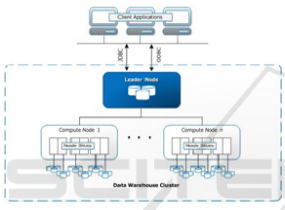
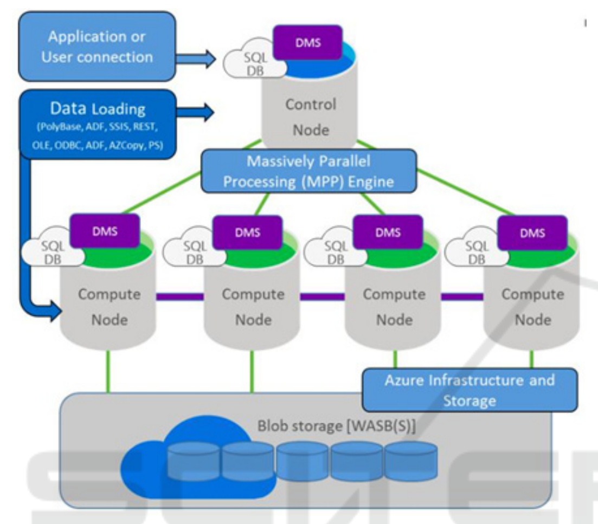
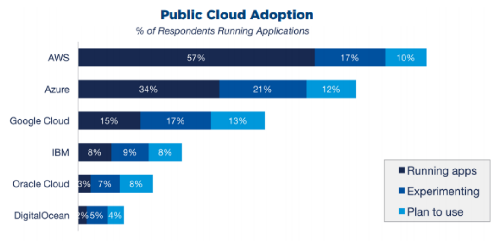
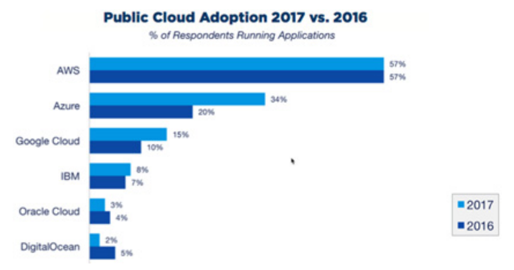

# Data Warehousing in the Cloud: Amazon Redshift vs Microsoft Azure SQL（中文译文）

## 译者说明

本文依据同目录的 `source.pdf` 翻译。章节、图表、公式、算法、代码与参考文献按原文结构保留。

## 作者与机构

Pedro Joel Ferreira¹、Ana Almeida¹、Jorge Bernardino²

¹ Instituto Superior de Engenharia do Porto, Rua Bernardino de Almeida, Porto, Portugal

² Instituto Superior de Engenharia de Coimbra, Rua Pedro Nunes, Coimbra, Portugal

## 出版信息

本文收录于 *Proceedings of the 9th International Joint Conference on Knowledge Discovery, Knowledge Engineering and Knowledge Management (KDIR 2017)*，第 318–325 页。DOI：`10.5220/0006587103180325`；ISBN：`978-989-758-271-4`。© 2017 SCITEPRESS – Science and Technology Publications, Lda.，保留所有权利。

## 关键词

云计算（Cloud Computing）、数据仓库（Data Warehousing）、云数据仓库（Cloud Data Warehousing）。

## 摘要

数据仓库（data warehouse）使组织能够分析通常来自事务处理系统（OLTP）的大量信息。然而，当今的数据仓库系统已经难以处理当前产生的海量数据，由此引出了云计算（cloud computing）的概念。云计算是一种模型，它允许通过简单请求、无需人工干预，就能以普适、按需的方式访问一组共享或非共享的计算资源，例如网络、服务器或存储，并能快速供应或释放这些资源。

在这种模型中，资源几乎没有上限，协同工作时能够提供很高的计算能力，可用于多种目的。云数据仓库正是由数据仓库和云计算两个概念结合产生的。它扩展了传统数据仓库系统的定义：只要数据源能够通过互联网访问，就可以位于任意位置，同时还能利用云基础设施的大规模计算能力。本文研究两个最流行的云数据仓库市场方案：Amazon Redshift 和 Microsoft Azure SQL Data Warehouse。

## 1. 引言

数据仓库被定义为一种定制化数据存储，用于聚合来自多个来源的数据，并把这些数据存放在公共位置，以便运行报表和查询。该概念源于企业需要跨多个应用服务器集成企业数据，使所有需要消费信息并据此决策的用户都能够访问数据。许多公司使用数据仓库来编制定期财务报表或业务指标分析。

集成云数据仓库方案需要明确定义的策略，并且该策略需要涉及云计算能力。实现是否成功取决于组织层面是否存在面向服务的策略，它应为云实施提供必要的基础设施。如果没有 SOA 和 BPM，基于云计算的数据仓库方案集成在财务上没有意义，因为它会涉及现有系统再工程的高成本。云策略还必须与组织的业务策略一致。

云上数据仓库最大的挑战之一，是如何把数据传输到云中。通过公网把 GB、TB 甚至 PB 级数据推送到云端，不仅会带来安全顾虑，也会带来性能挑战。

选择数据仓库方案时，需要考虑数据仓库和云计算市场的新趋势、当前与未来需求，以及集成机会。因此，成功选择云数据仓库方案必须基于良好准则，并按照组织当前和未来需求对这些准则进行分析和加权。云数据仓库可能为大型公司节约成本，也能消除过去阻碍中小企业采用数据仓库的成本门槛。

云数据仓库的设计目标应是接管大规模基础设施运行中的无差别重负，让客户专注于自身核心能力，即业务本身。对基于云的数据仓库的兴趣不断增长，主要由较高投资回报率驱动。不过，把云计算用于数据仓库也面临安全挑战，因为其中包含的数据通常具有专有性质。迁移到云端是一个困难决策，不仅因为数据所有者倾向于让数据靠近自己，即保留在本地，还因为安全和数据机密性问题；后两者常常让决策者推迟迁云决策。

在云中实现数据仓库有许多收益，包括成本、效率、弹性、供应商选择灵活性、更强竞争力，以及更少的安装和维护时间。借助并行计算，云系统效率被认为会更高；云也通过可承受成本下的扩展能力，为中小企业提供了动力。

本文分析两个最流行的云数据仓库平台：Amazon Redshift 和 Microsoft Azure SQL Data Warehouse。后文结构如下：第 2 节介绍相关工作；第 3 节介绍云计算；第 4 节概述云数据仓库领域；第 5 节介绍两个云数据仓库市场方案；第 6 节简要比较这些方案；第 7 节总结结论和未来工作。

## 2. 相关工作

已有多项研究比较和评估 Big Data 平台。然而，大多数研究只关注特定能力、技术或用途。

Almeida 和 Bernardino（2015a; 2015b）关注数据挖掘能力，以及适合中小企业环境的一组技术参数和功能。Morshed 等（2016）则聚焦于分布式实时数据分析平台，并得出结论：他们研究的平台没有覆盖实时分布式计算所需的全部功能。

Kaur 等（2012）描述了多个云供应商提供的、用于支持数据仓库的方案。他们指出，不同服务提供商实现了不同层次的使用方式：一些提供 ETL 机制或商业智能（BI）方案，另一些提供存储基础设施，由客户按照自己的需求和所需服务选择供应商。该论文认为市场仍不成熟，不同服务在价格和性能上差异很大。

Hemlata Verna（2013）关注如何在云环境中通过回收、复用、减少和恢复信息来管理数据。Popeanga（2014）集中研究什么架构适合云中数据仓库。Mathur 等（2011）聚焦于云中的分布式数据库，提出可用 IaaS 云服务器以较低初始成本存储这些数据库。

因此，虽然已有少量相关工作根据特定能力、技术或用途评估方案，本文将在功能和应用方面采用更广的范围，以便中小企业使用。

## 3. 云计算

云计算没有唯一权威定义，但 Kimball 和 Ross（2013）提出：“云计算是通过互联网，以按使用付费的定价模型，自助供应并按需交付计算资源和应用。”

从定义上看，云是一种自助系统，允许最终用户在云计算环境中设置应用和服务，而无需 IT 服务提供商介入（Armbrust et al., 2010）。云计算通过聚合计算资源并提供系统的单一视图来处理大规模计算能力。云带来了新的特性和可能性，改善用户体验，同时也为 IT 产生了新的市场细分和商业机会。许多组织围绕云构建业务，不仅使用云服务，也在该环境中提供业务方案。

与其他服务类似，至少可以识别两个直接相关的参与者：

- 用户或消费者：使用云所提供功能或资源的一方。它是使用云计算服务的实体或组织，这些服务可能涉及软件、平台或基础设施。
- 提供商：负责向消费者提供云服务的实体或组织。提供商还负责管理支持其服务所需的基础设施。

云有不同的实施模型，它们是消费者访问云服务的不同方式。这些模型服务于不同目标受众。如果按这一假设划分，可归纳为两类：私有云和公有云。

私有云通常用于在组织内部环境中分发服务。支持私有云的基础设施可以委托给服务提供商，并保持私有；它不一定要由私有云用户自己购买和管理。若用户自己在内部管理私有云，就能完全控制云中使用的流程、数据或应用。不过，他们会失去云计算的一些通用原则或收益，例如以较低价格访问基础设施、弹性、资源可用性和快速部署时间。

公有云与私有云不同，用于向公众分发服务，通常通过互联网提供。服务提供商负责全部支撑基础设施。该基础设施由多个云用户完全共享。借助这种共享以及资源管理流程优化，提供商能够最大化资源使用率，并以较低价格向消费者供给服务。

## 4. 云数据仓库

如今，公司收集的数据比以往更多，数据来源也更加多样，包括基于云的应用，甚至企业自身的数据集市。为了做出良好决策、获得洞见并取得竞争优势，公司需要及时地正确分析数据。

传统数据仓库架构广泛存在于大量处理海量异构数据集的公司中，但它是一个非常封闭且复杂的模型，难以用企业当前所需的敏捷性做出响应（Tereso and Bernardino, 2011）。进行分析的人员需要等待数小时甚至数天，让数据流入数据仓库后才能用于分析。在大多数情况下，处理这些数据所需的存储和计算资源不足，或始终保持不变，这会导致系统挂起或崩溃（Goutas et al., 2016）。

迁移到云端时，一个主要顾虑是本地数据仓库和云数据仓库系统需要共存一段时间，因为一次性迁移整个数据仓库并不是好主意。为缓解这一顾虑，可以使用数据虚拟化方案，帮助迁移过程并支持两个数据仓库系统在迁云期间共存。

云数据仓库产生于三种趋势的汇聚：数据来源、数据量和复杂性的巨大变化；数据访问和分析需求；以及提高数据访问、分析和存储效率的技术进步。传统数据仓库系统并非为处理今天数据的规模、多样性和复杂性而设计（Almeida et al., 2008）。

云中的数据仓库是通过互联网消费信息的数据库，本质上是一种数据库即服务（DBaaS）。云数据仓库为组织使用和利用先进技术提供了一种成本有效的方式，避免为了购买、安装和配置所需硬件、软件和基础设施而承担高额前期成本（Talia, 2013）。

下一节分析两个最流行的云数据仓库市场方案。

## 5. 云数据仓库市场方案

本节描述两个云数据仓库方案的架构。后续小节介绍最流行平台 Amazon Redshift 和 Microsoft Azure SQL Data Warehouse 的特征。

### 5.1 Amazon Redshift

Gartner 报告称，Amazon Web Services（AWS）通常被认为是领先的云数据仓库平台即服务（platform-as-a-service）提供商（Gartner, 2016a）。Amazon Redshift 被 Gartner 评为领导者，它是一个快速、全托管、PB 级数据仓库，可以用现有商业智能工具，以简单且成本有效的方式分析所有数据。

Amazon Redshift 引擎是一个符合 SQL 的 MPP 查询处理和数据库管理系统，设计用于支持分析工作负载。存储和计算分布在一个或多个计算节点上（Gupta et al., 2015）。

Amazon Redshift 数据仓库的核心基础设施是集群，集群由一个 leader node 和一个或多个 compute node 组成。leader node 接受来自客户端应用的连接，并把工作分派给 compute node：它解析并生成数据库操作的执行计划，根据执行计划编译代码，将编译后的代码分发给 compute node，并给每个节点分配一部分数据。

只有当查询引用存储在 compute node 上的表时，leader node 才会把 SQL 语句分发到 compute node；否则，语句只在 leader node 上运行（“Data Warehouse System Architecture - Amazon Redshift,” n.d.）。

compute node 执行 leader node 发送的编译代码，并把结果返回用于最终聚合。每个 compute node 都有专用 CPU、内存和存储，因此可以通过升级 compute node 或增加新节点来扩展集群。每个 compute node 的最小存储为 160GB，并可扩展到 16TB，以支持 PB 级或更大数据。compute node 被划分为 slice，每个 slice 分配该节点一部分内存和磁盘空间，并处理分配给该节点的一部分工作负载。leader node 管理数据和工作负载向 slice 的分布，随后这些 slice 并行完成操作。

一个集群包含一个或多个数据库。Amazon Redshift 是关系数据库管理系统，提供典型 RDBMS 的功能，包括 OLTP 相关能力，但它针对超大数据集的高速性能分析和报表进行了优化（“Data Warehouse System Architecture - Amazon Redshift,” n.d.）。其数据库引擎基于 PostgreSQL。Amazon Redshift 另一个重要特征是列式数据库：每条记录不是作为唯一数据块保存，而是存储在独立列中。当查询只选择有限列子集而非完整记录时，查询性能可以显著提高。

Redshift 的数据仓库功能可与高端数据库相比。易用性和可扩展性是该方案的显著优势。

### 5.2 Microsoft Azure SQL Data Warehouse

Microsoft Azure SQL Data Warehouse 是基于云、可横向扩展的数据库，能够处理海量关系型和非关系型数据。它是一个大规模并行处理（MPP）的分布式数据库系统，提供 SaaS、PaaS 和 IaaS 服务，并支持多种编程语言、工具和框架，包括非 Microsoft 软件（“SQL Data Warehouse | Microsoft Azure,” n.d.）。

SQL Data Warehouse 基于 SQL Server 关系数据库引擎，并与用户可能熟悉的工具集成，包括 Analysis Services、Integration Services、Reporting Services 和基于云的工具（“SQL Data Warehouse | Microsoft Azure,” n.d.）。

Microsoft Azure SQL Data Warehouse 由 Control Node、Compute Node 和 Storage 组成。它还有一个名为 Data Movement Service（DMS）的服务，负责节点之间的数据移动（“SQL Data Warehouse | Microsoft Azure,” n.d.）。

与 Amazon Redshift 的 leader node 类似，Azure Control Node 管理并优化查询，负责协调整个并行查询运行所需的数据移动和计算。当请求发送到 SQL Data Warehouse 时，control node 会把请求转换为分别在各 compute node 上并行运行的查询。

compute node 是存储数据并处理查询的 SQL 数据库。添加数据时，数据会分布到 compute node；请求数据时，这些节点作为 worker 并行运行查询。处理完成后，它们把结果传回 control node，由其聚合结果并将最终结果返回给用户。

Azure SQL Data Warehouse 中的所有数据都存放在 Azure Blob Storage 中。Blob Storage 是一种在云中以对象或 blob 形式存储非结构化数据的服务，可以存储任意类型的文本或二进制数据，例如文档、媒体文件或应用安装包。compute node 与数据交互时，直接向 blob storage 读写。计算和存储是彼此独立的。

DMS 负责节点之间的所有数据移动。它让 compute node 能够访问执行 join 和 aggregation 所需的数据。DMS 不是 Azure 服务，而是在所有节点上与 SQL Database 一起运行的 Windows 服务。由于并行运行查询需要数据移动，它只在包含 DMS 操作的查询计划中可见。

Azure 是企业级 SQL 数据仓库，将 SQL Server 产品和服务家族扩展到云端。Azure 还可以扩展存储和计算，因此客户只需为自己需要的资源付费。

## 6. 云数据仓库比较

云数据仓库正在获得关注，因为云供应商以更低成本提供数据仓库服务。根据 Gartner（2016），Amazon Redshift 是市场第一；Azure 也提供了一个值得考虑的竞争平台。

Redshift 和 Azure SQL Data Warehouse 都支持 PB 级系统。两者都有 leader 或 control node，也都有 compute node。Azure SQL Data Warehouse 和 Redshift 最大的差异是存储资源与计算资源解耦。

在可扩展性方面，Redshift 集群修改后，变更会立即应用。新集群供应期间，当前集群以只读模式可用，因此在该过程中数据仍可用于读操作。新集群供应完成后，数据会被复制过去。

在 Azure SQL Data Warehouse 中，集群扩缩可以在几分钟内完成。计算单元和存储单元可独立横向扩展。Azure SQL Data Warehouse 还支持暂停计算操作；compute node 处于暂停状态时不产生计算费用，只收取存储费用。

从数据源角度看，Redshift 可以从 Amazon S3 storage 集成数据。如果要把本地数据库与 Redshift 集成，需要先把数据库中的数据抽取到文件，再导入 S3。Azure SQL Data Warehouse 与 Azure Blob Storage 集成，它采用与 Redshift 类似的方式从 SQL Server 导入数据：先把 SQL Server 数据导出为文本文件，再复制到 Azure Blob Storage。

比较公有云采用情况，特别是 AWS 和 Azure，可以看到 AWS 是 2017 年 RightScale 调查中多数受访用户采用的首位云方案。

虽然 AWS 继续领先于公有云采用率，57% 的受访者当前在 AWS 上运行应用，但这一数字与 2016 年相同。相对地，过去一年中，在第二和第三大公有云提供商 Azure 与 Google 上运行应用的受访者比例显著增长。Azure 总体采用率从 20% 增长到 34%，缩小了 AWS 的领先优势；Google 也从 10% 增长到 15%。

表 1 展示系统属性比较。Redshift 和 Azure SQL 都基于关系数据库管理系统（RDBMS）数据库模型，并支持关系数据模型。

Amazon Redshift 围绕业界标准 SQL 构建，并增加了管理超大数据集和支持高性能分析的功能。虽然它基于 PostgreSQL，但存在一些不支持的特性、数据类型和函数。一些 SQL 特性也以不同方式实现，例如 `CREATE TABLE`、`ALTER TABLE`、`INSERT`、`UPDATE` 和 `DELETE`。

Amazon Redshift 不支持 tablespace、表分区、继承和某些约束。其 `CREATE TABLE` 实现允许用户为表定义排序和分布算法，以优化并行处理。不支持 `ALTER COLUMN` 操作。`ADD COLUMN` 在每条 `ALTER TABLE` 语句中只支持添加一列。使用 `INSERT`、`UPDATE` 和 `DELETE` 时，不支持 `WITH`。完整的不支持特性、数据类型和函数列表，原文建议查阅 AWS 文档，尤其是 Amazon Redshift 与 PostgreSQL 相关文档（“Amazon Redshift and PostgreSQL - Amazon Redshift,” n.d.）。

**表 1：Redshift 与 Azure SQL Data Warehouse 比较。**

| 系统属性 | Amazon Redshift | Microsoft Azure SQL Data Warehouse |
| --- | --- | --- |
| 数据库模型 | 关系 DBMS | 关系 DBMS |
| 开发者 | Amazon（基于 PostgreSQL） | Microsoft |
| 许可证 | 商业 | 商业 |
| 基于云 | 是 | 是 |
| 实现语言 | C | C++ |
| XML 支持 | 否 | 是 |
| SQL 标准支持 | 不完全支持 | 是 |
| 支持的编程语言 | 所有支持 JDBC/ODBC 的语言 | .Net、Java、JavaScript、PHP、Python、Ruby |
| 服务端脚本 | 用户自定义 Python 函数 | Transact SQL |
| 并发数据操作支持 | 是 | 是 |
| MapReduce API 支持 | 否 | 否 |
| 内存支持 | 是 | 否 |
| 节点配置控制 | 是 | 否 |

In-Memory OLTP 是一种优化事务处理、数据摄入、数据装载和临时数据场景性能的技术。Redshift 提供内存支持，但 Azure SQL Data Warehouse 不提供，因为该能力只适用于 SQL Server 2014 以来的 OLTP 工作负载和 Azure SQL Database。

在 MapReduce 支持属性上，两种数据库都不提供面向用户定义 Map/Reduce 方法的 API。对于 Redshift，可以把 MapReduce 与 Redshift 结合起来，即使用 MapReduce 处理输入数据，并将结果导入 Redshift。对于 Azure SQL Data Warehouse，Polybase 将关系数据存储与非关系数据存储统一起来，组合来自 RDBMS 和 Hadoop 的数据，使用户无需理解 HDFS 或 MapReduce。

Redshift 和 Azure SQL Data Warehouse 提供许多类似能力，因此不必简单判断哪个提供商更好或更差。这取决于业务需求，但每个方案都有优缺点。表 2 给出了 Amazon Redshift 和 Microsoft Azure SQL Data Warehouse 云方案的一些优缺点。

**表 2：Redshift 与 Azure SQL Data Warehouse 的优缺点。**

| 方案 | 优点 | 缺点 |
| --- | --- | --- |
| Amazon Redshift | 通过使用本地存储获得性能；从 S3 装载数据非常快；超过 PB 级；列式数据存储允许在大数据量上执行高性能查询；熟悉 PostgreSQL 使采用 Redshift 更容易 | 计算无法独立于存储扩展，反之亦然；无法暂停资源；需要对多列执行 join 的查询可能受到性能影响 |
| Microsoft Azure SQL Data Warehouse | 工作负载空闲时可暂停资源；可分别扩展计算和存储资源，并只为使用的资源付费；与 Azure Services 集成良好 | 最多只能运行 32 个并发查询；不完全支持 T-SQL |

## 7. 结论和未来工作

数据仓库是定制化数据存储，用于聚合来自多个来源的数据，并把数据存储在公共位置，以便运行报表和查询。许多公司使用数据仓库编制定期财务报表或业务指标分析。

本文分析了云数据仓库领域。云数据仓库是三种趋势的汇聚：数据来源、数据量和复杂性的巨大变化；数据访问和分析需求；以及提高数据访问、分析和存储效率的技术进步。传统数据仓库系统并不是为处理今天数据的规模、多样性和复杂性而设计的。

集成云数据仓库方案需要明确定义的策略，并涉及云计算能力。实施成功取决于组织层面是否存在面向服务的策略，该策略应为云实施提供必要基础设施。

本文认为，将数据仓库部署到云中存在若干挑战：

- 将数据导入云中作为数据仓库存储可能是挑战，因为使用云时客户依赖互联网连接和云提供商基础设施。可能需要专用通信线路来缓解连接问题，但这会带来成本。
- 从云存储向云方案提供的 compute node 获取大量数据进行计算，可能导致性能问题。
- 失去控制可能引发安全和信任问题。

本文分析并评估了两个最流行的云数据仓库方案：Amazon Redshift 和 Microsoft Azure SQL Data Warehouse。关于这两个云数据仓库方案，原文得出以下结论：

- 使用 Redshift 扩展数据仓库时，必须同时增加计算和存储单元。Azure SQL Data Warehouse 中，计算和存储是解耦的，因此可以分别扩展。这是一种非常不同的经济模型，能够为客户节省大量成本，因为当客户只需要更多计算能力时，不必购买额外存储；反之亦然。
- Azure SQL Data Warehouse 能在不使用时暂停计算，因此只需为存储付费。相比之下，Redshift 会对组成集群节点的所有虚拟机按全天候计费。
- Redshift 比 Azure SQL Data Warehouse 更容易配置，设置后上线并可用所需时间更短。

未来工作中，我们计划用来自某公司的数据分析这两个平台，并基于一组准则给出当前市场最佳云数据仓库方案推荐。

## 参考文献

- Almeida, R., Vieira, J., Vieira, M., Madeira, H. and Bernardino, J. "Efficient Data Distribution for DWS." International Conference on Data Warehousing and Knowledge Discovery - DaWaK, pages 75-86, 2008.
- Almeida, P. and Bernardino, J. "Big Data Open Source Platforms." BigData Congress 2015, pages 268-275.
- Almeida, P. and Bernardino, J. "A comprehensive overview of open source big data platforms and frameworks." International Journal of Big Data (IJBD), 2(3), 2015, pages 15-33.
- Amazon Redshift and PostgreSQL - Amazon Redshift. URL: http://docs.aws.amazon.com/redshift/latest/dg/c_redshift-and-postgres-sql.html, accessed 2017-09-02.
- Amazon Redshift vs. Microsoft Azure SQL Data Warehouse vs. Microsoft Azure SQL Database Comparison. URL: https://db-engines.com/en/system/Amazon+Redshift%3BMicrosoft+Azure+SQL+Data+Warehouse%3BMicrosoft+Azure+SQL+Database, accessed 2017-09-02.
- Armbrust, M., Fox, A., Griffith, R., Joseph, A. D., Katz, R., Konwinski, A., Lee, G., Patterson, D., Rabkin, A., Stoica, I. and Zaharia, M. "A View of Cloud Computing." Communications of the ACM 53, pages 50-58, 2010.
- Combining Hadoop/Elastic MapReduce with AWS Redshift Data Warehouse. URL: http://atbrox.com/2013/02/25/combining-hadoop-elastic-mapreduce-with-aws-redshift-data-warehouse/, accessed 2017-09-03.
- Data Warehouse System Architecture - Amazon Redshift. URL: https://docs.aws.amazon.com/redshift/latest/dg/c_high_level_system_architecture.html, accessed 2017-01-01.
- Database Manag. Solut. Anal. URL: https://www.gartner.com/doc/reprints?id=1-2ZFVZ5B&ct=160225&st=sb, accessed 2017-01-02.（译者注：`source.pdf` 中该条参考文献即从这一残缺片段开始，条目前部缺失；此处按原文保留，不补造。）
- Gartner. "Magic Quadrant for Data Warehouse and Database Management Solutions for Analytics." [WWW Document]. *Magic Quadr. Data Wareh.*, 2016.
- Goutas, L., Sutanto, J. and Aldarbesti, H. "The Building Blocks of a Cloud Strategy: Evidence from Three SaaS Providers." Communications of the ACM 59, pages 90-97, 2016.
- Gupta, A., Agarwal, D., Tan, D., Kulesza, J., Pathak, R., Stefani, S. and Srinivasan, V. "Amazon Redshift and the Case for Simpler Data Warehouses." SIGMOD '15, ACM, New York, NY, pages 1917-1923, 2015.
- Hemlata Verna. "Data-warehousing on Cloud Computing." International Journal of Advanced Research in Computer Engineering & Technology (IJARCET), Volume 2, Issue 2, February 2013.
- Kaur, H., Agrawal, P. and Dhiman, A. "Visualizing Clouds on Different Stages of DWH - An Introduction to Data Warehouse as a Service." International Conference on Computing Sciences, Phagwara, 2012, pages 356-359.
- Key Concepts & Architecture Snowflake Documentation. URL: https://docs.snowflake.net/manuals/user-guide/intro-key-concepts.html, accessed 2017-02-16.
- Mathur, A., Mathur, M. and Upadhyay, P. "Cloud Based Distributed Databases: The Future Ahead." International Journal on Computer Science and Engineering (IJCSE), 3(6), pages 2477-2481, 2011.
- Miller, J. A., Bowman, C., Harish, V. G. and Quinn, S. "Open Source Big Data Analytics Frameworks Written in Scala." IEEE International Congress on Big Data, 2016, pages 389-393.
- Morshed, S. J., Rana, J. and Milrad, M. "Open Source Initiatives and Frameworks Addressing Distributed Real-Time Data Analytics." IEEE International Parallel and Distributed Processing Symposium Workshops (IPDPSW), 2016, pages 1481-1484.
- Popeangã, J. "Shared-Nothing Cloud Data Warehouse Architecture." Database Systems Journal, Vol. V, No. 4, 2014.
- RightScale 2017 - State of the Cloud Report. URL: https://assets.rightscale.com/uploads/pdfs/RightScale-2017-State-of-the-Cloud-Report.pdf, accessed 2017-08-11.
- SQL Data Warehouse, Microsoft Azure. URL: https://azure.microsoft.com/en-us/services/sql-data-warehouse/, accessed 2016-11-13.
- Talia, D. "Clouds for Scalable Big Data Analytics." Computer 46, pages 98-101, 2013. DOI: `10.1109/MC.2013.162`.
- Tereso, M. and Bernardino, J. "Open source business intelligence tools for SMEs." Information Systems and Technologies (CISTI), 6th Iberian Conference, IEEE, 2011, pages 1-4.
